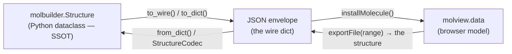
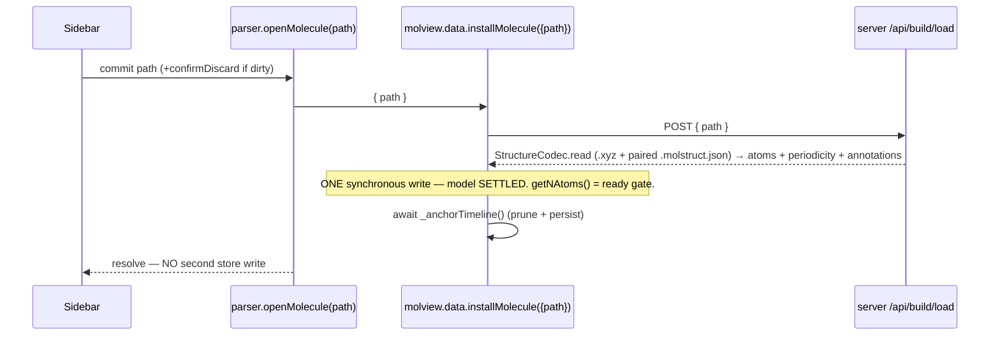
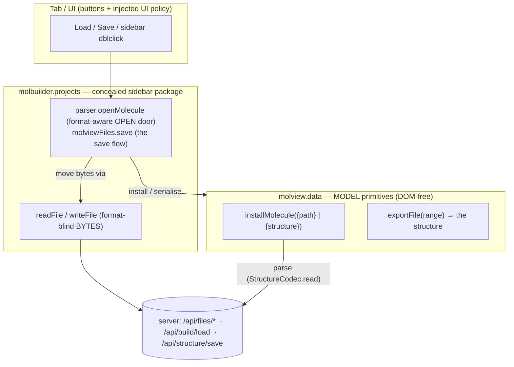

# Structure — the core object, its codec, and its file doors

**Role:** contract
**Domain:** model
**This is the master doc for the Structure aspect.** Its large facets live as
sub-documents sharing the `structure-` filename prefix (so the hierarchy is
visible in the name itself):
- [`structure-periodicity.md`](?doc=model/structure-periodicity.md) — cell · engine offset ·
  axis_kind · vacuum (the per-axis box behaviour; the boolean `pbc()` is an
  accessor for ASE (`to_ase`), not a field — `structure-periodicity.md` § 2.0a).
- [`structure-annotations.md`](?doc=model/structure-annotations.md) — per-atom channel
  model (`tag`/`flag`/`value`) + the region-label vocabulary.
- [`structure-molstruct.md`](?doc=model/structure-molstruct.md) — the `.molstruct.json`
  save file: envelope · schema versioning · codec · file pairing.

**Companions** (separate model modules):
[`model/parse.md`](?doc=model/parse.md) (the read stack that produces a
Structure from engine output), [`model/overview.md`](?doc=model/overview.md)
§ 2 (the shared JSON vocabulary). **Frontend** (see
[`web/projects.md`](?doc=web/projects.md)): the
projects-sidebar module (the Load/Save UI over the doors) and the MolView
module (`molview.data`, the JS model primitives).

`Structure` is molbuilder's **lingua franca**: the one dataclass every builder
yields and every emitter consumes. This doc is the contract for the object
itself, its serialization codec, and the one door that reads/writes it as a
paired file on disk — across **both** the Python/CLI backend and the JS/user
frontend.

> **The one-object rule.** A structure's identity lives in three models that
> must stay byte-identical as data crosses the wire. Exactly one component per
> language may **name a field** or index a structure dict by key: the Python
> `Structure` codec, and the JS `data-model.js` accessors. Everyone else
> carries the dict verbatim as an opaque envelope. This is what stops the
> recurring "a field silently drops to its default on reload" bug (the
> `cell_origin → 0` regression); the field set appears in source **once per
> language**.


```mermaid
flowchart LR
    PY["molbuilder.Structure<br/>(Python dataclass — SSOT)"]
    JSON["JSON envelope<br/>(the wire dict)"]
    JS["molview.data<br/>(browser model)"]
    PY -- "to_wire() / to_dict()" --> JSON
    JSON -- "installMolecule()" --> JS
    JS -- "exportFile(range) → the structure" --> JSON
    JSON -- "from_dict() / StructureCodec" --> PY
```

---

## 1. The object (L1 data model)

**Module:** `molbuilder/structure.py`. **Tests:** `tests/test_structure.py`,
`tests/test_load.py`, `tests/test_pdb_ter.py`.

Adding a new format means a new method on `Structure`, not changes to the
builders.

```python
@dataclass
class Structure:
    elements:      List[str]                  # chemical symbols, length N
    positions:     np.ndarray                 # shape (N, 3), Angstrom
    atom_names:    Optional[List[str]] = None # PDB-style name; default = elements
    residue_ids:   Optional[List[int]] = None # 1-based; default = all 1
    residue_names: Optional[List[str]] = None # 3-letter; default = all "MOL"
    chain_ids:     Optional[List[str]] = None # single char; default = all "A"
    title:         str = ""                   # XYZ comment / PDB TITLE
    # ── metadata (each detailed in a sub-doc; serialized as one block) ──
    # cell, engine_offset, axis_kind, vacuum → structure-periodicity.md
    #     (NB: kgrid is NOT a structure field — it is a SiestaConfig DFT
    #      sampling knob; see engines/siesta.md)
    # regions (THE label store), annotations    → structure-annotations.md
    #     (frozen_atoms is not a field: it is the reserved label's one
    #      designated read, a cut of regions)
    # customized — the structure's rows and each frame's      → § 2.2d
    # ── beside the metadata ──
    # info — records that are not the structure (never hashed) → § 2.2a
    # ── frames (§ 2.2e) ──
    frames:        Optional[np.ndarray] = None # (F, N, 3) when F > 1;
                                               # positions IS frames[0]
```

**Invariants enforced by `__post_init__`** (the single validation site):

- `positions` must reshape to `(N, 3)`, else `ValueError`.
- `frames`, when given, must be `(F, N, 3)` with `F > 1`, and `positions`
  becomes a view of `frames[0]`; a `frames` of one frame is stored as
  `positions` alone (§ 2.2e). `customized` is `None` or holds exactly `F`
  frame row sets, its rows valid and its names unique as § 2.2d states.
- Every optional list, if provided, has length N; `None` gets the per-field
  default above.
- The metadata fields are validated/reconciled here too (see
  `structure-periodicity.md` for the cell/axis_kind reconciliation). Because
  `apply_metadata_dict` re-runs `__post_init__`, **all field validation lives
  in one place** — there is no second validator to drift from.

Atom **order is identity**: the 0-based index into `elements`/`positions`,
fixed by the atom order in the source file, is the canonical atom identity
carried everywhere (see [`model/overview.md`](?doc=model/overview.md) § 2 for
the full provenance + the 0-based/1-based boundary).

---

## 2. Backend surface (Python / CLI)

### 2.1 The whole-structure codec — `to_dict` / `from_dict` / `to_wire`

Three methods on `Structure` (`structure.py`), all shipped:

| Method | Purpose | Round-trips? |
|---|---|---|
| `to_dict()` → `dict` (`:1008`) | The ONE canonical serializer: coordinates + per-atom columns + the full metadata block (via `metadata_to_dict()`). | **Yes** — `from_dict(s.to_dict())` reproduces `s` exactly. |
| `from_dict(d)` → `Structure` (`:1034`) | The ONE canonical deserializer: builds the object, then `apply_metadata_dict` (the same validator a fresh Structure runs). | inverse of `to_dict` |
| `to_wire()` → `dict` (`:1077`) | A read-only view the web layer builds on: identity columns + a **flattened** `periodicity` block (raw `cell`/`engine_offset`/`axis_kind`/`vacuum` **plus** the server-resolved `resolved_cell`/`box_corner` the client must not recompute — `structure-periodicity.md` § 6.0) + `annotations`. It carries **no** `positions`, **no** flat `atoms` render list, and **no** legacy aliases. | No — a different, flatter view (not a superset of `to_dict`) |

```python
# to_dict() — the loss-free round-trip unit; NOBODY else assembles this dict
{
    "title": ..., "elements": [...], "positions": [[x,y,z], ...],
    #   …or, for a frame set (§ 2.2e), "frames": [[[x,y,z], ...], ...] — one
    #   key or the other, never both
    "atom_names": [...], "residue_ids": [...],
    "residue_names": [...], "chain_ids": [...],
    "metadata": self.metadata_to_dict(),   # the ONE metadata codec, nested verbatim
}
```

**Why two methods, not one flag.** `to_dict()` is the loss-free round-trip
unit (persistence, sidecar, CLI); `from_dict` inverts it. `to_wire()` is a
**separate** read-only view for the browser — identity columns + the
flattened, server-resolved periodicity + annotations — that `from_dict` never
has to invert. It is **not** a superset of `to_dict` (it drops `positions` and
the nested `metadata` shape); the flat `atoms` render list and the legacy
top-level aliases are added on top by the web layer (below). The resolved
cell/origin is computed **once**, inside `to_wire()`, so it can never drift or
drop.

> **Verified against code (2026-07-26):** `_shared.structure_to_dict`
> (`web/blueprints/_shared.py:329`) was **not** deleted (as an earlier draft
> of this contract claimed). It is the web layer's **composer**: it combines
> `workspace_payload(struct)` (the render `atoms` list, `text`/`xyz`, `issues`,
> `extra`) with `struct.to_wire()` (identity columns + periodicity +
> annotations) and adds the legacy top-level aliases existing consumers read.
> `ok_structure_response` (`:417`) wraps it. Code that needs only the metadata
> view calls `to_wire()` directly.

### 2.2 The metadata authority — `metadata_to_dict` / `apply_metadata_dict`

The structure metadata (periodicity + region tags + per-atom annotations) has
exactly **one** serialization authority: `Structure` itself.

```python
Structure.metadata_to_dict()      -> dict   # struct → JSON metadata dict (THE writer, :885)
Structure.apply_metadata_dict(d)  -> None   # JSON metadata dict → struct (THE reader, :939)
```

- **Scope** = the dataclass's own metadata fields, named once as
  `METADATA_FIELDS`: `regions`, `cell`, `engine_offset`, `axis_kind`,
  `vacuum`, `annotations`, `customized` (§ 2.2d). (`regions` is the
  whole label store; a reserved label such as `frozen_atoms` is in it, so there
  is no field of its own to serialise — `structure-annotations.md` § 2.)
  `customized`'s frame row sets are indexed by frame, so the block is applied
  to a structure holding the frames it describes (§ 2.2e).
- **Strict JSON** — the dict is lists/dicts/bools/floats. `annotations` are
  JSON channel dicts (via `annotations_to_json`), **never** live `AtomChannel`
  objects (those live only in-memory; see `structure-annotations.md`).
- `apply_metadata_dict` is **full-replace**: an absent key resets that field
  to its default (absent `cell` → non-periodic; absent `regions` → none). It
  re-runs `__post_init__`, so validation is single-sourced. A caller holding
  only part of the block — `transport/compose.py` applying a sidecar over a
  `.XV`, `script_emit.apply_atom_metadata` for a deck's label block —
  **completes the block before applying it**, never patches the result; there
  is no partial door, and full-replace is what keeps *an absent key resets*
  legible.
- **NOT in scope** (they sit *around* the contract): `selection_rules` (a
  sidecar-only pass-through) and the sidecar **envelope** (`schema_version` /
  `n_atoms_total` / `structure_hash` / `created_by` / `created_at`) — see
  `structure-molstruct.md`.

**To add a metadata key:** (1) add the field to the dataclass with its
`__post_init__` validation, and its name to `METADATA_FIELDS`; (2) add it to
`metadata_to_dict()` + `apply_metadata_dict()` — nowhere else; (3) if it must
survive the sidecar, bump `SCHEMA_VERSION` and add the new version to
`READABLE_VERSIONS` (see `structure-molstruct.md`); (4) if MolView must show it,
`structureFromServer` reads it from the envelope (`payload.structure`, the
structure's own dict, as it reads `info`) and `structureForServer` writes it
back — the model's two translators, and nothing else in the browser names it
(`web/molview.md` § 6.2); (5) add a
save→load→apply round-trip test. You do **not** touch `to_dict`, the sidecar
writer (`sidecars/molstruct.to_dict`), its reader
(`parse/sidecars/molstruct.load_text`) or `apply_to_structure` — each SPREADS
`METADATA_FIELDS` through the two methods above, so it picks the field up for
free. *(Until 2026-10-09 the reader named the six fields by keyword, so a
seventh would have been dropped on every load — found by the § 5z.8 review.)*

**To remove one:** delete it from the dataclass + both methods, and add its
name to `RETIRED_METADATA_KEYS` — only when ignoring it loses nothing, or by a
recorded decision. THREE gates REFUSE a key they do not know, and every sidecar
on disk carries the key, so without that line every old pair would be refused;
with it the key is read and ignored, and no writer emits it again
(`structure-molstruct.md` § 2, *Retired keys*). This said *"old sidecars load
fine (`apply_metadata_dict` ignores unknown keys)"* until 2026-09-25, which the
code has never done — found by review when `cell_origin` was retired. Never
leave a "read-but-never-write" half-migration — that is the drift this contract
exists to prevent.

### 2.2a `info` — metadata that travels

**`info` IS metadata** *(user, 2026-09-21)*. It is what the MolView
Metadata pane displays (`web/molview.md` § 8.4a), it is written into the
sidecar from schema 9, and it rides every export. What it is **not** is
part of the structure:

- **Not structural.** No emitter reads it; it never enters the
  frozen/region machinery. Nothing in a deck depends on it.
- **Not in the hash.** `structure_hash` is computed without it, so
  recording or removing a key never changes the identity of the
  coordinates (`structure-molstruct.md`).
- **Not gated.** § 9.4's one question — *"does this change the structure
  the calculation ran on?"* — answers *no* for `info`, which is what
  lets the read-only Results viewer attach a recorded contract before
  export.

Those three are why it sits **outside `METADATA_FIELDS`** (§ 2.2): that
set is the strictly-enumerated STRUCTURAL block — hash input,
gate-controlled, unknown keys refused. `info` is the open store beside
it, with `to_dict` / `from_dict` as its door. Outside is a statement
about the *hash and the gate*, never about whether it is metadata.

**IT TRAVELS WITH THE STRUCTURE, AND A STRIP IS EXPLICIT — NEVER
SILENT.** Every seam that derives one `Structure` from another carries
`info` through: `_carry_nonatom()`, `replace()`, `copy()`, `concat()`,
the geometry ops, `to_dict`/`from_dict`, the sidecar codec. A caller who
wants it gone states that; a rebuild that simply did not list the field
is a **defect**, not a default.

Two clusters ship today, both recorded by the Results tab from the run
directory ([`model/parse.md` § 5b, § 5b.1](?doc=model/parse.md)):
`calculation`, the level of theory the deck stated, and `relaxation`, what
the run did to the geometry it left — with a fingerprint of that geometry
(`Structure.geometry_fingerprint()`), so a consumer can tell whether the
coordinates it holds are the ones the record describes.

Why the distinction is load-bearing rather than tidy: a structure whose
recorded contract vanished cannot be told apart from one that never had
one. The warning that says *"the mesh cutoff and transverse k-mesh below
were converged for a cell that is no longer there"* reads
`info.calculation`, so a silent drop does not degrade that warning — it
deletes it, and the citation then looks clean. An edit is meant to
OUTDATE the record (`structure_modified` / `labels_modified`), which is a
MARK ON IT; a record that is gone cannot carry a mark.

### 2.2b Merging two structures — who supplies each non-atom field

`Structure.concat` (and `modify.append_structure` on top of it) joins the
atoms of several structures. The non-atom fields cannot be joined, so each
one is TAKEN FROM A STATED OWNER:

| field | comes from | why |
|---|---|---|
| `cell`, `engine_offset` | the first input that **states a cell** | a lattice is the one thing an incoming fragment can supply that a cell-less canvas genuinely lacks. A slab's explicit 2.9 Å box is a real crystal; the molecule's derived vacuum box is not a competing statement, so there is nothing to override *(user, 2026-09-22)* |
| `axis_kind`, `vacuum`, `info` | **the first input**, cell or no cell | these are facts OF THE CANVAS — what the person set in the Cell tab and the contract they recorded. They are equally true of a structure that states no lattice, so a fragment arriving with a box must not restate them |
| everything atom-indexed | joined | `regions`, the annotation channels and the residue IDs are re-indexed and unioned — see `concat`. Residue re-indexing is conditional: `renumber_residues=True` (the default) renumbers, `False` concatenates the ids verbatim |
| `title` | **neither input** — the caller's `title=` argument (§ 2.2c) | a merged structure is not either input, so `concat` takes the name from whoever asked for the merge. `Structure.concat([a, b])` with no `title=` yields `''`; `append_structure` passes the canvas's, which is why the seam this section is about keeps its name |
| `customized` | **the first input** — its rows and its frame's rows | named values about the canvas, as `info` is; the addition's rows are not joined, because a row about one structure is not true of the merge |
| frames | — | a merge joins one-frame structures; a frame set is refused (§ 2.2e) |

**What the merge does not carry, it says** (`modify.append_structure`'s
notes, shown on the page that asked): the addition's cell when the canvas has
one, its stated origin, a label it renamed, each entry of the addition's
`info` — a saved pair's calculation and relaxation records, which the canvas's
`info` replaces — and each of its `customized` rows. A dropped record is otherwise invisible: the 2026-10-08 load
of a relaxed junction onto an open SMILES build showed the build's metadata and
none of the file's, with no word why (the Q16 measurement, [`archive/2026-10-09-plan-consolidation.md`](?doc=archive/2026-10-09-plan-consolidation.md) § 5z.1).

The first two rows are load-bearing and they point opposite ways on purpose.
Taking the whole block from whoever carried a cell let a fragment replace a
typed 8 Å vacuum with `(0,0,0)` and turn two isolated axes crystalline,
silently. Taking nothing from it threw away the only lattice in play.

**The merged box is not made to fit.** `concat` cannot infer a lattice, so a
disagreement between the adopted cell and the merged atoms is reported rather
than papered over. `cell.check` splits it in two, and they are not the same
finding *(measured 2026-09-23)*:

| what is wrong | finding | severity |
|---|---|---|
| the atom span **exceeds** the box on a non-periodic axis — no corner can help | `cell.unfittable` | **error** |
| the box is big enough but the atoms sit outside it | `cell.atoms_outside` | warn |

`cell.py`'s gate gives the second only when the first does not apply
(`not rc.contains_atoms and rc.has_volume and not rc.unfittable_axes`) — one
cause, one finding.

**And `cell.unfittable` does not merely stand.** It is severity `error`, and
`validation.report()` raises `ValidationError` on any error unless the caller
passes `raise_on_error=False`, so **generation refuses**. The merge itself
succeeds and says nothing; the refusal comes at the door that would act on
the result. That is `structure-periodicity.md` § 8.2's division — reading
does not judge, the doors that act do — not an outcome left for the user to
notice.

**Why row 2 is load-bearing for this.** If `axis_kind` rode in from the
cell-carrier, the axes would be `periodic` and both `_unfittable` and
`_contains` skip periodic axes — so the same geometry reports **nothing at
all**. The silence the row prevents is the safety net for row 1.

### 2.2c `title` — five sources, four writers, and no owner

**STATUS: SETTLED 2026-09-23 — `title` belongs to the GEOMETRY FILE**
*(user)*. It is the `.xyz` comment line and the PDB `TITLE` record, and that
is its only home. It remains a `Structure` FIELD and still rides `to_dict`,
`to_wire` and `replace`; what it stopped being is a column of the **sidecar**.
Written because § 2.2b needed a `title` row and the field turned out to have
no rule anywhere.

`title` is neither metadata nor lattice nor atom-indexed. It sat in
`IDENTITY_FIELDS` beside `atom_names` / `residue_ids` / `residue_names` /
`chain_ids` until the rule below took it out, because unlike those it is
**also a field of the geometry file**. That was the whole problem.

#### Where it came from — five sources, one of them now retired

| source | where |
|---|---|
| the `.xyz` **comment line**, verbatim | `from_xyz:1686` `comment = lines[1].strip()`, `:1733` `title=comment` |
| the PDB `TITLE` record | `from_pdb` |
| ~~the **sidecar's identity block**~~ | **retired** by the rule below — `title` is in `RETIRED_IDENTITY_KEYS`: tolerated on read, never applied |
| the **upload filename** | `web/blueprints/build.py:720` — `from_xyz(text, title=filename or None)` (and `from_pdb` beside it) |
| the **file stem** | `parse/coords/pyscf_geom.py:41-42` — *"mirror the file stem onto Structure.title"* |

#### Where it went — four writers, one of them now retired

| writer | form |
|---|---|
| `to_xyz:1958` | the comment line — `(comment or self.title or "Built by molbuilder")` |
| ~~`to_extxyz`~~ | **retired** 2026-10-09 with the extended-XYZ writer (§ 2.3, *the comment line is never metadata*) |
| `to_pdb:1978` | `TITLE     {self.title:<70s}` — padded to 70 characters, never cut: a longer title runs past the record's column 80 |
| ~~`identity_to_dict`~~ | **retired** — it no longer emits the title, so a comment line makes no sidecar |

#### It is not carried by the door that carries the others

`title` is **not** in `_carry_nonatom()`. Every op-helper that rebuilds a
Structure therefore spells `title=struct.title` by hand — **ten sites**:
`modify.py` ×5 (`:122`, `:250`, `:911`, `:1177`, `:1296`) and `chemistry.py`
×5 (`:1493`, `:1638`, `:1667`, `:1734`, `:1842`). That is § 0a's condition:
one fact, ten hand-written carries, and nothing that fails if the eleventh
forgets.

#### Six measured defects — measured before the rule, all closed by it

1. **`from_xyz` puts the ENTIRE comment line into `title`** — no keyword
   stripping. Reading an extended XYZ gives
   `title == 'Lattice="10.0 …" Properties=species:S:1:pos:R:3 pbc="T T T"'`,
   while the cell is *also* parsed correctly into `cell`. The same fact, twice,
   one copy mislabelled as a name.
2. **The sidecar MASKS it.** Measured on one file: sidecar present →
   `'my junction'`; sidecar moved aside → `'my junction Lattice="10.000000 …'`.
   The bug is invisible in normal use and appears the moment the pair is
   separated — or when any other tool reads the `.xyz`, which is the entire
   reason for keeping that format.
3. **The contaminated string is then persisted AS IDENTITY.** The sidecar's
   identity block records the header text as the structure's name, beside a
   correct 3×3 `cell`.
4. **A comment line creates a sidecar file.** Non-empty title ⇒ non-empty
   identity ⇒ `keep_sidecar` True. Measured: `a.xyz` with a comment →
   `['a.molstruct.json', 'a.xyz']`; with an empty comment → `['b.xyz']`.
   A `.molstruct.json` exists to hold one string already in the file beside it.
5. **The sidecar silently overrides a hand-edited comment line.** Edit the
   `.xyz` in an editor, reload, and the old title comes back with no word
   said. This is § 1.13's condition — stated state overwritten by stored
   state — on the one line of a structure file a person can obviously edit.
6. **`to_pdb` writes the TITLE record padded to 70 characters, never cut**
   (`{self.title:<70s}`), so a contaminated title (90+ chars) ran past the
   record's column 80.

#### Everything that would be affected by a change

* **Python consumers:** `modify.py` ×5, `chemistry.py` ×5 (carries);
  `web/blueprints/build.py` ×5, `_shared.py`, `pyscf/input.py`,
  `sidecars/molstruct.py`, `peptide.py`, the three `builders/backends/`.
  *(`script_emit.py`'s `section.title` / `member.title` is a TEMPLATE
  section's title and is unrelated — do not sweep it.)*
* **The web layer already assumes it is unreliable** — `build.py` falls back
  four different ways: `struct.title or kind`, `or _resolved.name`,
  `or "restored structure"`, `or (filename or fmt)`.
* **JS:** `lib/molview/ui.js` (11), `lib/projects/dialogs.js`,
  `lib/projects/checkpoint.js`, `modify/viewer.js`, `lib/projects/list.js`.
* **Tests:** assertions across several files, incl.
  `test_structure_pair_one_generator.py`, `test_structure_envelope_protocol.py`,
  `test_workingcopy_structure.py`
  (`test_it_writes_utf8_regardless_of_the_platform_locale` round-trips a
  non-ASCII title through the codec).

#### THE RULE

**The geometry file owns `title`. The sidecar does not carry it.**

* **`from_xyz` cuts the structural keys.** The title is the free text BEFORE
  the first `Lattice=` / `Properties=` / `pbc=` (`_EXTXYZ_KEY`). Only those
  three, so a sentence keeps its own `=`: *"anneal at T=300K, run 3"*
  survives whole. That protects what the verbatim read was FOR — ASE's reader
  shreds a human comment into `{'water': True, 'molecule': True}` — while
  refusing to call a header a name.
* **`identity_to_dict` does not emit it**, so a comment line no longer makes
  `keep_sidecar` true, and a `.xyz` with a comment gets no `.molstruct.json`.
* **`apply_to_structure` does not touch it** — neither applying a stored copy
  over the comment line nor, as it used to, **resetting it to `""`** when the
  sidecar named none. That reset silently erased the comment line of every
  pair whose sidecar had no title.
* **Older files still open.** `title` joined `RETIRED_IDENTITY_KEYS`, which
  gets the same three gates as `RETIRED_METADATA_KEYS` (`pbc`): tolerated on
  read so a file the user already has is not refused as a stray key, never
  applied, and dropped on rewrite. A stale contaminated title therefore
  self-heals the next time the pair is written.

  **The third gate was missed on the first attempt** (2026-09-23, fixed the
  same day). `apply_to_structure`'s stray-key check did not know about
  `RETIRED_IDENTITY_KEYS`, so a payload built in code — as
  `transport/compose.py` and `web/blueprints/watch.py` do, rather than
  loaded from a file — was **refused** with *"sidecar carries ['title']"*.
  Exactly the shape `62cc76d0` fixed for `pbc` (*"the retirement reached one
  gate of two"*), and the function's own comment four lines above the bug
  says *"a guard that disagrees with its neighbours about what is retired is
  how this bug happened in the first place"*. Now pinned for EVERY retired
  key, present and future, by
  `tests/test_molstruct_json.py::TestARetiredKeyPassesEveryGate`, which
  iterates the `RETIRED_*` tuples rather than naming keys.

All six defects close. **Pinned by**
`tests/…::TestTitleBelongsToTheGeometryFile` — one test for one rule, and
both halves were mutation-checked: before it, reverting the keyword strip
broke nothing across 116 tests and restoring the identity column broke
nothing across 131.

### 2.2d `customized` — named values the structure carries, its own and each frame's *(W39; plan § 5z.8 F)*

*(User, 2026-09-27: "provide an additional customization list so user can make
a list of parameters as meta data to be stored in the \"customized\" category
… a new category other than info"; "we also need a unified api for writing and
reading them from structure, no handcrafted json operation for these
customized parameters". 2026-10-09: "the data structure should be an indexed
array … the API should be like having a frame as a separate parameter".)*

A **row** is a named value: `name` (a non-empty string), `value` (a number,
text or true/false), and optionally `unit` and `note`. The section holds the
**structure's rows** — about the whole structure — and, for a structure of
several frames, **each frame's rows**: an array indexed like the frames, one
row set per frame (§ 2.2e). Names are unique within one set, and a name that
is the structure's may not also be a frame's.

Unlike `info` (§ 2.2a) it is **STRUCTURAL**: it describes what the structure is
for a task — the mode a frame set samples (the structure's rows), each frame's
displacement and its weight in an average (that frame's rows) — so it is in `METADATA_FIELDS`, carried by every derivation, gated
like any edit (`web/molview.md` § 9.4), and in the sidecar (schema 11,
`structure-molstruct.md` § 2). It is never a free-form store: molbuilder
reads only the rows whose names a subsystem owns and declares as constants —
a mode's frame set's (§ 2.2f, `frameset.py`'s constants, as
`transport/sort.py` owns the region names) — and every other row is the
writer's, carried and shown.

**The one door, each side** — nothing else names a key of the section:

| | the door |
|---|---|
| write a row | `Structure.set_customized(name, value, unit=None, note=None, frame=None)` — `frame=None` the structure's rows, an index that frame's; an index outside `0 … F−1` refused, naming `F` |
| remove one | `Structure.remove_customized(name, frame=None)` |
| read | `Structure.customized_value(name, frame=None)` — that set only, never a fall-back to the other; `Structure.customized_rows(frame=None)` |
| the browser | MolView's `data.customized.list(frame)` / `set(name, value, {unit, note, frame})` / `remove(name, {frame})` (`web/molview.md` § 9.3) |

**On the wire and on disk** it is one block of the metadata dict, written by
`metadata_to_dict` and applied by `apply_metadata_dict` like every structural
field (§ 2.2) — `null` when it holds no row at all, as every field states its
unset value, and otherwise written whole:

```text
"customized": {
  "rows":   [ {"name": "temperature_k", "value": 300, "unit": "K"} ],
  "frames": [ [ … frame 0 … ], [ … frame 1 … ], … ]      exactly F entries
}
```

`frames` has exactly `F` entries — an empty list for a frame with no rows — so
every per-frame list of the structure has the same length (§ 2.2e).

### 2.2e Frames — a frame set is a data set *(user, 2026-10-09; plan § 5z.8 F)*

> *"The multi-frame is a tool for us to manage data set that's intrinsically
> consistent with each other … the way we create them is a set of script that
> understand this. That's the contract."*

A structure holds **one or more frames**: the facts shared by every frame (the
identity columns, the labels and channels, the periodicity, `info`, the
structure's `customized` rows) and, per frame, its coordinates and its
`customized` rows. **Every per-frame list is indexed by frame and has exactly
`F` entries, and only the frame doors change `F`.** A one-frame structure is
`F = 1` — the same shape, never a special case.

**What a frame set is.** A data set whose frames are consistent by
construction — the same atoms in the same order, the same species, the same
cell, each frame's rows saying what it is (a displacement along a normal mode,
`engines/transport.md` § 2a.9). It is MADE by code that understands this,
through the doors below — the frame generator, a person's script. **It is never
edited**: nothing moves atoms, adds or removes them, or rewrites coordinates in
a frame set; the browser views one and the Molbuilder tab loads one frame of it
(`web/molview.md` § 9.4, `web/tabs.md` § 2).

**Stored once.** `frames`, shape `(F, N, 3)`, present when `F > 1`, and
`positions` is a view of frame 0 — one coordinate store, never two copies.
`to_dict` carries `frames` instead of `positions` when `F > 1`, never both.

| | the door |
|---|---|
| how many; one of them | `n_frames`; `frame_at(i)` → a one-frame Structure at frame `i`, its rows that frame's (as its own frame 0), its origin the set's (below); an index outside `0 … F−1` refused naming `F` |
| build a set | `with_frames(coordinates, frame_rows=None)` — every frame `N` atoms of the same species in the same order; frame 0 becomes `positions` |
| reorder the atoms | `take(order)` — the order applied to every per-atom field and every frame; the transport sort's one reorder (`transport/sort.py`), which is not an edit |
| the shared facts | labels, cell, `info`, the structure's rows change for every frame at once — they are shared |

**Refused, by name**: on a set of several frames, anything that moves atoms or
changes their number — the geometry ops (`modify.py`), `affine` / `translated`,
`replace(positions=…)`, the merge (`concat`) — each answering *"a frame set is
not edited — take one frame with `frame_at(i)`"*.

**One origin for the set.** The offset an engine gets is the set's —
`structure-periodicity.md` § 6.0, *A frame set gets one offset*: "frames 1…N
state frame 0's offset". So `frame_at(0)` is frame 0 as it is, and `frame_at(i)`
for `i ≥ 1` states frame 0's offset — the stated one, or the rule's computed on
frame 0 — and every frame reaches the engine through `cell.to_engine` with the
same one. Where the rule cannot place frame 0 (no cell to place it in) there is
no offset to state, and the door that acts refuses the cell itself. The cell is
shared like the offset when the set states one; a set that states none has no
shared box — each `frame_at(i)` gets the box derived from its own atoms
(`resolve_cell`, `structure-periodicity.md` § 4), which differs from frame 0's
by as much as the frames differ, while still taking frame 0's offset.

**Reading a file** (§ 2.3, § 2.4): frame 0 by default — exactly as before — or
one frame (`frame=i`) or the whole set (`frames=True`), and a door that prints
says when it took one frame of several, which and how many. **One frame taken
out of several leaves a mode's definition behind** (§ 2.2f; user, 2026-10-10:
*"when we constrain what is loaded, calling modify would always work on a
single frame"*): the frame arrives with the shared facts, `info` and the rows
a person wrote, never the definition's rows, its `mass_amu` channel or
`info.vibration` — one frame is no sample of a mode's distribution, and
carrying them would make it a one-frame set that contradicts itself
(`StructureCodec.frame_choice`, the one rule for which frame a read answers
with; `frameset.without_definition`). A one-frame file is what it is.

**Counting — the frame's index, everywhere but the UI's display** *(user,
2026-10-10: "unify the frame index, we have one api on the molview for frame
and that should be the starting point and standard"; "anything CLI means
direct programming, so we don't reinterpret the meaning. only UI display would
do so")*. The API indexes frames from 0, as MolView's does (`frame_at(0)`,
`frame=0`, `setCurrentFrame(0)`, a record's `frame`), and so does everything
molbuilder writes, said as an index — *frame index 1 (of 3)*
(`structure.frame_words`), **a folder name included**: a transport point's
frame level is `f001` for frame index 1 (`engines/transport.md` § 2a.11,
`transport.stages.frame_token`). Only the UI's own display counts from 1 — the
frame bar's `1 / F`, the Modify tab's frame picker, the Customized heading's
*Frame 2 of 3* — through MolView's `toDisplay` / `fromDisplay`
(`web/molview.md` § 11.5), the atom index's own convention
(`model/overview.md` § 2); nothing else writes a `+ 1`.

### 2.2f A mode's frame set — what each frame is, raw beside derived *(user, 2026-10-10; built the same day, plan § 5z Q17-e2)*

> *"what we need to define here is how these parameters of the vibration and
> position is clearly and well defined within the .xyz/.json such that there is
> no confusion and all information is consistent and complete"*; *"we should
> save not only the mass correct value but also the raw values — we should
> always allow post data processing and correction when we need to"*;
> *"explicit is always better than implicit in data science"*.

A frame set that samples **one** vibration mode — frame 0 the equilibrium, the
frames after it displaced along the mode — states in the pair itself what every
frame is: where it sits along the mode, how far its atoms moved, and its weight
in an average. **The coordinates are the truth; the rows and the channel
describe them**, and every one that can be checked against the coordinates is.
Nothing is kept only in its corrected form, so any correction can be redone
from the file: the mass-weighted position sits beside the plain displacement
and the masses it was weighted by.

This section is the definition's one home. The frame generator writes it
(`engines/vibration.md` § 5.10 ③), a person's script may write it, the
transport citation door checks it (`engines/transport.md` § 2a.9), and the
transport record and data file carry it (§ 2a.12 there). Its names are
molbuilder's own, constants of `molbuilder/frameset.py` — as `transport/sort.py`
owns the region names — and **the units are in the names**, as in the vibration
result the values come from (`engines/vibration.md` § 6.8); a row's `unit`
field, when written, states the same unit, for the eye, in its ASCII spelling
— `cm-1`, `K`, `angstrom`, `amu^1/2 angstrom`, the ångström spelled out as
UDUNITS spells it, since `A` is the ampere's — and a number without a unit
writes none.

| where | name | kind | meaning | unit |
|---|---|---|---|---|
| the `.xyz` | every frame's coordinates | given | frame 0 the equilibrium geometry the mode is taken at; frames 1… displaced along the mode | Å |
| the `mass_amu` channel | each atom's mass | given | the masses the mode's coordinate is weighted by — the vibration result's own, `equilibrium.masses_amu`; every atom, a positive finite number | amu |
| the structure's rows | `mode_index_1based` | given | which mode, counted as the vibration result counts it (`index_1based`) | — |
| | `frequency_cm1` | given | the mode's wavenumber, as the result states it | cm⁻¹ |
| | `temperature_k` | given | the temperature whose thermal distribution the weights sample | K |
| | `zero_point_amplitude_amu12_ang` | given | the mode's zero-point amplitude `Q_zp = √(ħ/2ω)`, as the result states it | amu^½·Å |
| | `sigma_amu12_ang` | derived | the mode's thermal spread at that temperature, `σ = Q_zp · √coth(ħω / 2k_BT)` | amu^½·Å |
| each frame's rows | `displacement_ang` | measured | the frame's plain displacement from frame 0, `√(Σ_A \|ΔR_A\|²)` over every atom — no masses | Å |
| | `max_atom_displacement_ang` | measured | its largest single atom's, `max_A \|ΔR_A\|` | Å |
| | `q_amu12_ang` | derived | its position along the mode — ONE number for the whole mode, every atom displaced by `q · L_A`: its size `√(Σ_A m_A \|ΔR_A\|²)`, its sign the side of frame 0 it sits on | amu^½·Å |
| | `node_sigma` | derived | the same position in units of the spread, `q / σ` | — |
| | `weight` | given | the frame's share of the mode's average (`engines/transport.md` § 2a.12) | — |
| `info.vibration` | `run` · `result_sha256` | given | the vibration run the mode was read from — its folder, read through the run door — and the sha256 of its result file (the identity hash waits on M2m, as a cited pair's pin does, `structure-molstruct.md` § 3) | — |

*Given* is stated by the vibration result, the coordinates or the script;
*measured* is computed from the coordinates alone, before any correction;
*derived* is computed from the others by the formula shown.

**The rules** — checked at the transport citation door, frame by frame and
naming the frame (`engines/transport.md` § 2a.9), by `frameset.read` — the
set's definition, checked, or none when it states none:

1. **All or none.** A set states every row and the channel above, or none of
   them — each value a number, `mode_index_1based` a whole number from 1. With
   none it is a family of frames — each frame's curve its own, no average.
   Half-stated is refused, naming what is missing.
2. **Frame 0 is the equilibrium**: its `displacement_ang`,
   `max_atom_displacement_ang`, `q_amu12_ang` and `node_sigma` are 0.
3. **The measured rows match the coordinates**, and **the frames move along one
   mode, at their stated positions**: with `u_f = √m · ΔR_f` (each atom's
   displacement scaled by the square root of its stated mass) and `ê` the
   direction of the frame farthest along it, signed by that frame's `q`, every
   frame's `u_f` equals `q_f · ê` — its size, its side and its direction at
   once; when that frame did not move there is no direction, and every frame
   must then neither move nor state a position. The coordinates are written to six decimals (`Structure.to_xyz`), so
   each of these is checked to within what that rounding allows: a displaced
   atom within `√3·10⁻⁶` Å, the plain displacement within `√3·10⁻⁶·√N` Å, and
   a frame's mass-weighted position within twice `√3·10⁻⁶·√(Σ m)` amu^½·Å —
   the rounding of the frame and of the direction it is measured along.
4. **The derived rows match their formulas**, on the formulas' domain — the
   frequency, `Q_zp` and `σ` positive (a real mode), the temperature 0 K or
   above, where `σ = Q_zp`: `σ` against `Q_zp`, the frequency and the
   temperature; each `node_sigma` against `q / σ` — to a relative `10⁻⁹`,
   since each is the formula of values stated at full precision.
5. **The weights**: each a number in (0, 1], the set's summing to 1 within
   `10⁻⁶` — refused with the sum found.
6. **A row's `unit`**, when written, is the unit its name states.

How many frames there are, and where they sit, is the writer's — the frame
generator's default is the Gauss–Hermite nodes of the mode's thermal
distribution (`science/vibrational-averaging.md` § 5) — and a row naming that
rule or its parameters (`max_displacement_ang`, the rule's name) is the
writer's own, carried and shown. Molbuilder computes with each frame's weight
alone; it never asks what made the frames.

### 2.3 Geometry I/O

| Method | Format | Guarantees |
|---|---|---|
| `to_xyz(*, comment="")` | xmol XYZ **text** | one block per frame the structure holds (§ 2.2e): line 1 = `N`; line 2 = comment-or-title, and nothing else; then `El x y z` per atom |
| `to_pdb()` | PDB ATOM records, as **text** | TITLE if set; serial capped `99999` (overflow → `*****`); residue id capped `9999`; chain id truncated to 1 char |
| `to_pyscf(*, as_string=False)` (`:2007`) | PySCF `gto.M` atom kwarg | `(symbol,(x,y,z))` tuples; multi-line string if `as_string=True` |
| `to_ase()` (`:2034`) | `ase.Atoms` | raises `ImportError` with install hint if ASE absent |
| `from_xyz(text, *, title=None)` (`:1646`) | XYZ **text** | every frame of the document, one structure (§ 2.2e); see requirements below |
| `from_pdb(text, *, title=None)` (`:1741`) | PDB **text** | reads `ATOM`/`HETATM`; first MODEL only; TER handling below |

**The readers take a document, never a path** (`_require_text`, `:66`
— a `Path` raises `TypeError` naming the door instead). To read a *file*, call
`StructureCodec().load(path)`: it reads the `.molstruct.json` beside the
geometry, which a bare reader cannot.

**And so do the writers, since 2026-09-22: they RETURN a document and cannot
be handed a path.** `to_xyz`, the extended-XYZ writer and `to_pdb` each took an optional
`path` and wrote a lone file to it. That is the half that loses data — the
frozen atoms, the region labels and the explicit cell go on the floor,
silently and at exit 0 — and it is the door every violation in this document's
history walked through. To write a *file*, call
`StructureCodec().write(struct, path)`, which writes the pair.

The rule is now carried by the signatures rather than by this paragraph: a
lone-geometry write is not a call anyone can express. Two production callers
had to change for it, one of them the package's own front-page example.

> **A guesser stood here until 2026-09-07.** `_resolve_source` tried
> `os.path.isfile` first and fell back to "treat it as text", so `from_xyz`
> and `from_pdb` each took a path *or* a document. Two costs. A mistyped path
> was diagnosed as a malformed document — `from_xyz("/no/such.xyz")` answered
> *"Expected xyz header but got: invalid literal for int()"*. And it gave the
> project a second way to read a structure file, one that skipped the sidecar;
> `molbuilder.load()`, deleted the same day, was built on it.
>
> The rule it now follows is the one `model/parse.md` § 7 already states for
> the block readers: **a reader takes a path or it takes text, never both**,
> and a caller holding a path reads the file itself. `os` is no longer imported
> by this module at all — reading stopped being a filesystem concern here.

**Round-trip guarantees.** XYZ: elements exact, positions to the six
decimals `to_xyz` writes (1e-6 Å), every frame; metadata drops to defaults
(XYZ has no slots — the comment line is not one, below). PDB: elements,
atom names and residue names exact; positions to the three decimals of the
ATOM record (1e-3 Å); residue ids up to 9999 and serials up to 99999 (the
columns' widths, above); chain ids to their first character. The pair
carries what the geometry cannot: the sidecar holds the real identity
columns (`structure-molstruct.md` § 1), so a saved pair loses none of them.

**`from_xyz` requirements:** line 1 = non-negative integer N; lines 2..N+2
read; trailing blank/short lines tolerated; bad header or short atom line →
`ValueError` with the offending line.

**A document of several frames is read whole, as one frame set** (§ 2.2e),
and its frames must BE one: a frame `k` whose atom count, species or atom order
differs from frame 0's is refused, naming `k` — the frames of a set are the
same atoms. Choosing one frame is not the reader's: `StructureCodec.load`
(below) and `/api/build/load` take frame 0 unless asked otherwise.

**The comment line is never metadata** *(user, 2026-10-09: "if we deal with a
single XYZ that doesn't come with a JSON file, that means we know nothing about
it … We only take the atoms and their coordinates … we don't assume any
periodicity … The metadata have always to come from the accompanied JSON file,
which has a known origin … We have to be very consistent and explicit")*. A
structure's metadata — its cell, its axis kinds, its labels and channels, its
`customized` rows, its `info` — comes from a source molbuilder knows: the
`.molstruct.json` it wrote beside the file, or, for an engine's own file in one
of our runs, that run's own deck (§ 2.4). The `.xyz` comment line is none of
those: a `Lattice=`, a `pbc=` (booleans that cannot say `transport`), an
`energy=`, an extra per-atom column — none is read, from any file, ours or
another tool's. What the line gives is the title, by § 2.2c's rule, and nothing
else. The line does reach ASE's reader with the rest of the document — ASE
lays out the atom lines by a `Properties=` key when the line has one, the plain
`El x y z` layout when it has none — and of what ASE parses `from_xyz` takes
each frame's species and positions and nothing more (`structure.py:1700-1735`),
so no key on the line becomes metadata. And molbuilder writes nothing else there: a frame set is written as plain
XYZ, one block per frame (§ 2.4), so the cell has one home, the sidecar.

**`from_pdb` / TER handling** (pinned by `test_pdb_ter.py`): a segment counter
increments on every `TER`; each atom records `(chain_letter_or_"_",
segment_index)`; a chain letter unique to one segment passes through unchanged;
one spanning multiple segments is disambiguated by appending the segment index
(`A` → `A0`, `A1`); a blank chain-id column maps to `"A"` when unambiguous,
`"_<seg>"` when it spans segments. **Forbidden:** silently truncating serial
`> 99999` (must write `*****`), coercing a multi-char `chain_id` to `?` (must
truncate to first char), or crashing on a TER between ATOM blocks.

**The one reading door.** `StructureCodec().load(path, *, frame=None,
frames=False)` — `molbuilder/workingcopy_structure.py`. Dispatches on the
extension (`.xyz` / `.pdb`, anything else refused by name) and applies the
`.molstruct.json` beside it through `apply_to_structure`. **The pair is the
file**: a reader that takes the geometry alone hands back a structure smaller
than what is on disk.

**A lone file says what was read** *(user, 2026-10-09: "If the XYZ file doesn't
come with a JSON file, then we would notify the user that we're dumping the
comments. And we can print out the comments … and the user can decide how to
modify the metadata, which would eventually be saved as a JSON")*. A `.xyz`
with no `.molstruct.json` beside it — and not an engine's own file in one of our
runs (§ 2.4) — is read as its atoms and coordinates: isolated on every axis, no
cell, no labels. The load answers what it did not read, and every door that
opens a file for a person says it — the load route as a notice, `jobset init`
and the CLI as a printed line: *"x.xyz has no .molstruct.json beside it, so
only its atoms and coordinates were read -- no cell, no labels; its comment line
was not read as metadata: «…»"* — the line quoted whole, so the person can set
what they meant on the Molbuilder tab, its Cell and Metadata pages, where saving
writes it to the sidecar.

**Which frame** *(user, 2026-10-09: "keep the default reading, just take frame
zero … If the caller doesn't provide this option, then frame zero is by
default. So we are not breaking any existing behavior")*. The pair is read
whole and its sidecar applied to the whole set; then `load(path)` answers
**frame 0** — `frame_at(0)`, its rows as its own — exactly as every caller has
always had it; `load(path, frame=i)` answers frame `i`, an index outside
`0 … F−1` refused naming `F`; `load(path, frames=True)` answers the whole set.
A one-frame file answers the same for all three. A door that prints
(`jobset init`, `molbuilder validate`) says when it took one frame of
several: *"this file holds 3 frames; frame index 0 (of 3) was taken"* — a
line, never a refusal. **`molbuilder modify` refuses a file of several frames**
(user, 2026-10-10: *"on a cli, we do not allow direct operation on a
multiframe file because it creates a whole cluster of options and cases"*): an
edit acts on one structure, and on the command line there is no one to ask
which frame — a frame is taken out by a script (`load(path, frame=i)`) or in
the Modify tab, which asks.

> **`molbuilder.load()` stood here and is deleted** *(2026-09-07)*. It read
> the geometry and not the sidecar — it predated the sidecar by two months and
> was never swept when the codec landed. Its one production caller was
> `jobset init`, which therefore wrote descriptions with the author's regions,
> frozen atoms and cell missing: the same failure `siesta/input.py` records
> having fixed at its own door, *"the script relaxed every atom of a structure
> whose author had frozen two."* A second name for the door is what let the
> two drift.

> **ASE owns the XYZ parse (2026-07-31).** `Structure.from_xyz` calls
> `ase.io.read(..., format="extxyz")` rather than splitting lines itself. ASE is
> a declared dependency **for this** — `pyproject.toml` names it *"XYZ I/O +
> atomic-number table"* — and its extended-XYZ reader is a superset reader: it
> takes the plain xmol layout and an extended-XYZ comment line alike (whose
> keys molbuilder does not read, above), canonicalises an external tool's
> `FE`/`ZN` to `Fe`/`Zn`, and reads **every** frame of a multi-frame document.
>
> The hand-rolled parser it replaced read the atoms of the first block and
> nothing else, so a file this class had itself written with `to_extxyz` came
> back with **no cell, no pbc and one frame**. The project already knew: a
> second reader existed at `siesta/input.py`, whose comment said ASE *"gives us
> the lattice when present, which our hand-rolled parser doesn't"* — a correct
> diagnosis fixed at one call site by adding a reader beside the lossy one,
> while every other caller kept the lossy one. That second reader is now gone.
>
> One thing stays ours, deliberately. The **title** is read from the comment
> line directly, because ASE's reader parses that line as `key=value` pairs and
> a human comment (`water molecule`) would come back as
> `{'water': True, 'molecule': True}`. *(Until 2026-10-09 a `Lattice=` with a
> periodic `pbc=` was also adopted as the cell; the comment line is no longer
> metadata at all, above.)*
>
> `from_pdb` is still ours: PDB carries residue, chain and atom-name columns
> this model owns. **A second PDB reader does exist**, in the builders —
> `builders/backends/_common.py::parse_pdb_to_structure`, which reads a blank
> element column as the name's first letter (`Mg → M`, `Cl → C`); it is plan
> A1.14's. *(This said no comparable second reader existed until 2026-09-29.)*

### 2.4 The paired-file door — `StructureCodec` (L2)

The `.xyz` and its optional `.molstruct.json` are **always** read/written
together. That pairing + atomicity is owned by one L2 object,
`StructureCodec` (`molbuilder/workingcopy_structure.py`).

**What it owns.** Four things, and nothing else in the system holds a second
copy of any of them:

1. **the pairing rule** — `<stem>.xyz` ↔ `<stem>.molstruct.json`, including how
   the sidecar's name is derived (`molstruct.sidecar_path_for`);
2. **the format choice** — plain XYZ, one block per frame the structure
   holds (§ 2.2e), its comment line the title and nothing else (§ 2.3, *the
   comment line is never metadata*); `.pdb` when the destination names it, a
   frame set written to a `.pdb` refused, PDB holding one geometry;
3. **the sidecar envelope** — `schema_version`, the `structure_hash` pinning it
   to its geometry, and the one serialisation (`molstruct.dumps`);
4. **the invariants** — `no .json == empty metadata` in both directions,
   both-or-neither atomicity on write *(each half is atomic on its own today,
   the geometry replaced before the sidecar is written, so a sidecar that
   fails to write leaves the new geometry beside the old sidecar —
   both-or-neither not built, plan § 2, V1.10)*, and `no .json == empty metadata`
   on read **for every file molbuilder wrote**, which is every pair it
   writes. **An engine's own structure file** — SIESTA's `<label>.xyz`,
   written with no sidecar, read where its run is recorded — **takes that
   run's frame**: the cell and axis kinds its deck recorded and the
   engine's origin, a stated 0, from that run's own deck
   (`runs.declared(run).frame()`), because
   `structure-periodicity.md` § 6.0 asks it of every door that makes a
   structure from an engine's output *(2026-09-27, plan § 0a M1; from the
   run's own deck since 2026-10-04, plan B12)*. A file molbuilder writes, or
   one in a folder no calculation marks, reads as before. **Not** a periodicity gate: reading does not judge
   (`structure-periodicity.md` § 8.2) — see the `read` docstring below.

**How it is shaped: one generator, and an adapter per destination.**

```python
class StructureCodec:                       # L2 (may use the L2 sidecar codec)
    def pair(self, struct, *, fmt="xyz") -> StructurePair:
        """THE GENERATOR. A Structure as the two things that represent it
        outside memory: the coordinate document, the sidecar payload, whether
        that payload is worth keeping, and the suffix the format implies.
        Every outbound path below goes through this one call."""

    def files(self, struct, target) -> list[tuple[Path, bytes]]:
        """TO THE WIRE. The pair as bytes WITH THE NAMES THEY BELONG UNDER --
        `target`'s suffix corrected to the one `pair` chose. What `write`
        writes, without writing it."""

    def write(self, struct, target, *, atomic=True, fmt=None) -> Path:
        """TO DISK. The pair as one unit: geometry to `target`, and (when there
        is non-default metadata) the sidecar to sidecar_path_for(target).
        Atomic: each half staged to a temp sibling + os.replace'd; geometry
        swapped FIRST, then sidecar, so the only visible interleaving is
        OLD-sidecar + NEW-geometry for a tiny window -- never a torn file.
        Owns both-or-neither (not built -- plan § 2, V1.10)."""

    def write_moved(self, target, elements, positions, sidecar, *,
                    comment) -> Path:
        """TO DISK, FROM INSIDE A RUN. The pair for a structure whose atoms
        MOVED, where only the new coordinates are at hand: they become the
        document through `Structure.to_xyz`, and `sidecar` -- the payload
        `pair` made for the structure before it moved -- goes beside it with
        its `structure_hash` pinned to the new document, through `write`'s
        own write path. The PySCF script calls it for every geometry it
        saves, imported from `mb_pyscf.pyz` (`engines/pyscf.md` § 3)."""

    def read(self, source_path, *, frame=None, frames=False) -> Structure:
        """BACK IN. Parse geometry (.pdb by extension, else .xyz) AND its
        paired sidecar, applying metadata via molstruct.apply_to_structure
        to the whole set, then answering frame 0, frame `frame`, or with
        `frames=True` every frame (§ 2.3, *Which frame*).
        Missing sidecar = empty metadata (NOT an error), except an engine's
        own file where its run is recorded: that run's frame. READING DOES NOT
        JUDGE: a box nothing can be done with LOADS, and is refused at the
        doors that ACT on it (`structure-periodicity.md` § 8.2, decided
        2026-08-03 -- raising here made such a file unopenable and therefore
        unfixable, since the Cell page cannot be reached without the
        structure on screen). `load` is the same call under its read-side
        name."""
```

> **Two sentences in the block above were wrong until 2026-09-23.** `write`
> was said to swap geometry first *"so a reader never sees new geometry with
> a stale sidecar"* -- which is exactly what geometry-first produces, and
> what the code's own docstring names. And `read` was said to run a
> periodicity gate that **was deliberately removed on 2026-08-03**; a reader
> comparing this contract against the code would have concluded the guard was
> missing and restored it, re-creating the unopenable-and-unfixable file that
> removal was for. Both now describe what the code does. *(The write ORDER
> itself is scheduled to change -- `plans/plan.md` V1.10: both halves rendered
> and staged before either rename.)*

> **The rule this shape exists to make checkable:** *every structure↔bytes
> translation goes through the codec, and every adapter has exactly one door.*
> An adapter with no door is either retired or unbuilt, and those have opposite
> fixes — so the question gets asked rather than answered by call count.
>
> **`write` names the file; `files` does not.** The difference is who chose the
> name. A project save was given an exact path through a picker, with an
> overwrite gate on it, so `write` puts the bytes exactly there. An export was
> given a *stem* and nothing else, so `files` completes it. Different questions,
> and conflating them is how the pairing rule came to have a second
> implementation in the browser (`web/molview.md` § 11.7).
>
> **Corrected 2026-07-31.** `pair` briefly named a range `.extxyz`, on the
> reasoning that a name should say which format it holds. It should not, and it
> could not: `read` dispatches on the extension and takes `.xyz` / `.pdb` only,
> so a saved trajectory **could not be reopened** — the project record was
> write-only for ranges, and no test noticed because the save test never read
> its file back. Extended XYZ under `.xyz` is both the convention and the thing
> that works.
>
> **Retired 2026-07-31:** `scratch_blob` / `from_scratch`, which round-tripped a
> structure through an in-memory `{xyz, sidecar}` **text** blob. Their last
> caller was `/api/structure/periodicity` before it took the envelope; a blob
> means a coordinate document is written to ask a question about coordinates,
> which is the thing `web/molview.md` § 11.7 forbids.

> **Why the file door is L2, not a method on L1 `Structure`.** The layering
> invariant (`architecture.md` § 3; kept by review) forbids an L1 module
> importing an L2 one. Reading/writing the pair needs the **L2** sidecar codec
> (`sidecars/molstruct.py` — path derivation, atomic JSON, the envelope).
> Putting it on L1 would force a second L1 copy of the sidecar format — the
> exact drift this contract kills. So the pure data codec
> (`to_dict`/`from_dict`/`to_wire`/`metadata_to_dict`) is L1; the paired-file
> door is L2 `StructureCodec`, which routes the sidecar through the one
> metadata authority.

### 2.5 CLI

```bash
molbuilder peptide ASEQ                            # → XYZ on stdout
molbuilder dna ATGC > seq.xyz                      # Structure on stdout
```

**Both sides of the CLI now go through the door.** Reads: `jobset prep`
reads the calculation's structure through `StructureCodec().load`
(`jobset/prep.py:490`), and so does SIESTA's file reader
(`siesta/input.py:1713`); every deck is made from that structure, so every
emitter sees regions and frozen atoms (SIESTA writes `Geometry.Constraints`
from them). `pyscf/input.py` reads no file: it is handed the structure prep
read. *(This named `molbuilder
pyscf` and "the `fdf` path" as the two readers; both verbs are deleted — `fdf`
2026-08-11, `pyscf` 2026-09-17 — and the door they went through is now reached
only by `jobset prep`.)* Writes: `_emit` and
`molbuilder modify` call `StructureCodec().write`, so a CLI save emits the
**pair** — and the two surfaces now agree about what saving a structure means.

> **Closed 2026-09-07 (was `plans/plan.md` W15).** The write side called bare
> `struct.to_xyz()` / `to_pdb()`. Measured before the fix, on a device
> carrying `L-electrode`, `frozen_atoms` and an explicit cell:
>
> ```
> $ molbuilder modify in.xyz out.xyz --rotate z:0     # a ZERO-degree rotation
> Wrote out.xyz: 4 atoms (input had 4)
> $ ls
> in.molstruct.json  in.xyz  out.xyz                  # no out.molstruct.json
> ```
>
> The output `.xyz` carried no `Lattice=` either, so the box was not merely
> unadopted on read — it was not in the file. `modify` READ the pair through
> the codec and wrote back half of it, at exit 0, without a word. The same
> applied to every builder via `_emit`.
>
> Two earlier statements here were also wrong and are gone: that the readers
> "never look for the sidecar" (they had moved to the codec weeks before, each
> with a comment recording it), and the `cli.py` line citations, which had
> drifted.

> **`StructureCodec.write` could not write what `read` could read** — found the
> same day. `pair` always produced XYZ, and `write` writes the target
> verbatim, so `write(struct, "x.pdb")` put XYZ bytes under a `.pdb` name and
> `load("x.pdb")` then answered *"no ATOM/HETATM records found in PDB input"*:
> the door could not read back what it had just written. `pair` now takes the
> container the destination names (`fmt`), `write` reads it off the target's
> suffix — the same suffix `read` dispatches on, which is what makes the round
> trip a guarantee rather than a coincidence — and a caller with its own answer
> (the CLI's `--output-format`, which may name a format the extension does not)
> passes it and is obeyed. This is a different axis from how many frames the
> document holds, which follows the structure and is never asked as a question.

---

## 3. Frontend surface (JS / user)

The tab-facing surface is **two doors** plus the model primitives they call.
A tab calls a door and nothing below it; reaching around a door (a second
file stack, a browser-written sidecar, poking the store) is wrong by
definition.

### 3.1 The open door — `projects.parser.openMolecule`

> **There was a save door beside it until 2026-09-02.**
> `parser.saveMolecule` took a path it was GIVEN and posted it, handing a
> `needsOverwrite` back for the caller to deal with — so it always needed a UI
> layer on top, and `modify/structure/save.js` was that layer. When the Save
> panel moved onto `projects.molviewFiles.save("project", …)`, which asks WHERE
> and owns the overwrite flow itself ([`tabs.md` § 6](?doc=web/tabs.md)), the
> half-door had no caller and was deleted rather than kept as a second way to
> write one file. **Opening needs the pairing rule; saving needs a
> destination** — different questions, one door each.

It is **FILE-ONLY**: the door hands a `path` to the **server**, which owns file access, the
`.xyz`↔`.molstruct.json` pairing, and the sidecar schema. The browser reads
no bytes, derives no sidecar path, writes no coordinate document, and **never
authors the sidecar schema** (a browser-written sidecar had no
`schema_version`, so the load door rejected the pair — the save→reload breaker,
task #75).

| Door | Does | Server seam |
|---|---|---|
| `openMolecule(path, {confirmDiscard?})` | dirty-gate → `molview.data.installMolecule({path})` | `POST /api/build/load` (`build.py:596`) → `StructureCodec.read` |
| *(saving)* `projects.molviewFiles.save("project", stem, exportFile(range))` | asks WHERE (`chooseSavePath`) → POST → confirms an overwrite → refreshes the sidebar | `POST /api/structure/save` → `struct_from_body` + `StructureCodec.write` (stamps `schema_version` + real `structure_hash`) |

`openMolecule` is **only** for a project-file path. A generated structure
(smiles/dna/…) has no file, so the generators' page hands its envelope to
`molview.data.installMolecule({structure})` directly — the model primitive,
not the door. **The browser saves XYZ only** — the save door names the file
`<stem>.xyz` (`lib/projects/molview-doors.js:115-117`), and the codec writes a
plain `.xyz` there, one block per frame. The codec does write PDB — `pair`
with `fmt="pdb"` through `to_pdb`, for a target that names `.pdb` (§ 2.4; the
CLI's `--output-format`), a frame set refused — but no browser door asks for
it. Asymmetry: `openMolecule` *loads* a `.pdb` (the parse seam sniffs PDB);
the browser saves none.
A 409 "exists" envelope → `{needsOverwrite:true}`, and the door confirms and
retries with `{overwrite:true}` — the dialog is `projects`' own
(`confirmDestructive`), so the model layer stays DOM-free.

### 3.2 The model primitives + the JS key-namer

`molview.data` (`lib/molview/model.js`) is the browser model:
`installMolecule({path} | {structure} | {text, filename})`, `exportFile(range) → {name,
structure}` — ONE envelope, the range's frames and their rows inside it
(§ 2.2e) — and `markSaved(path)`. Named-key reads of the wire dict happen
in **one** place — the model's accessors (`getUnitCell`,
`getUnitCellOrigin`, `getVacuum`, `getAxisKind`, …), the JS analogue of
Structure's codec. Everywhere else the browser carries `periodicity` /
`annotations` / `atoms` as **opaque blobs** (verbatim deep-clone, no field
whitelist), so a server-added field survives persistence untouched. The one
deliberate write accessor, `setPeriodicity`, names only the lattice keys it
*manages* (it is an editor, not a carry) and is spread-based, so it cannot
drop an unlisted field.

### 3.3 SETTLE-BEFORE-READY — one store write per load

`installMolecule` installs the FINAL model — sidecar-enriched atoms, source,
periodicity, AND the cleared selection — in **one** synchronous write; the
"ready" signals fire at that write, and **no second store write may follow**
(it would land after "ready" and clobber whatever a consumer already did).


```mermaid
sequenceDiagram
    participant U as Sidebar
    participant D as parser.openMolecule(path)
    participant IM as molview.data.installMolecule({path})
    participant BL as server /api/build/load
    U->>D: commit path (+confirmDiscard if dirty)
    D->>IM: { path }
    IM->>BL: POST { path }
    BL-->>IM: StructureCodec.read (.xyz + paired .molstruct.json) → atoms + periodicity + annotations
    Note over IM: ONE synchronous write — model SETTLED. getNAtoms() = ready gate.
    IM->>IM: await _anchorTimeline() (prune + persist)
    D-->>U: resolve — NO second store write
```

> The 2026-07 regression that defined this: load used to install atoms (open
> the ready gate), then `await adoptSession({selection:[]})` ~300 ms later,
> wiping a click made in the gap. Fix: sidecar atoms ride in on the single
> install; the trailing write is gone.

### 3.4 Consumer map (shipped)

| Consumer | `file:function` | Call |
|---|---|---|
| Molbuilder tab — Load / dblclick | `modify/selection-bootstrap.js:_commitFile` | `POST /api/build/load`; on a file of several frames, which frame (1 … F, frame 1 offered) and a second load of that one (§ 2.2e — the tab holds one frame); with a structure open, the add-or-clear question (`tabs.md` § 2, *Creating a structure*); then `structurePage.loadIntoCanvas(…, {replace})` — *Add* merges through `/api/modify/append` (§ 2.2b), *Clear* installs the file over the view |
| Molbuilder tab — Save panel | `modify/structure/save.js:save` | `projects.molviewFiles.save("project", stem, exportFile())` — the door asks WHERE and owns the overwrite flow (`tabs.md` § 6). **It does not go through `saveMolecule`**, and since 2026-09-02 nothing does |
| Transport commit | `lib/transport/core.js:_showInMolview` | `openMolecule(path)` + `molview.mount` |
| Spectra commit | `spectra/viewer.js:_commitStructure` | `openMolecule(path)` + `molview.mount` |
| Results structure inspector | `lib/inspectors/structure.js` | `openMolecule(path)` + `molview.mount` |
| Structure-optimization | `structure-optimization/viewer.js:_commitStructure` | `openMolecule(path)`; reads state off the model |
| Generators (smiles/dna/…) | `modify/structure/*.js` → `page.js` | `molview.data.installMolecule({structure, filename})` (not a door) |
| Trajectory inspector | `lib/trajectory/core.js` | `installMolecule({structure, filename, frames, forces})` + `reloadFrames(...)` — **the one exception to frames-in-the-envelope**: a run's frames are parsed by the tab from the run's own file, carry forces and no rows, and replace any frame axis the envelope had (`web/molview.md` § 11.7) |

> The Molbuilder tab's static files live under `modify/` — the `/modify`
> route was renamed to `/molbuilder`, but the directory name is historical.

"Load + mount is ONE shared path": Transport, Spectra, and the Results
inspector each open the picked file via `openMolecule(path)`, then
`molview.mount(host, ws, {mode, owner})`. When each hand-rolled its own copy
they drifted (the inspector read raw XYZ and dropped the sidecar — the label
bug). One path = the sidecar-correct load, for every tab.

---

## 4. The wire contract (backend ⇄ frontend)

The doors sit over the projects byte-layer + the parse seam; the model
primitives sit over the same server. The dependency points one way
(`projects.parser → molview.data`, resolved by a call-time lookup, so there is
no cycle):


```mermaid
flowchart TB
    subgraph TAB["Tab / UI (buttons + injected UI policy)"]
        B["Load / Save / sidebar dblclick"]
    end
    subgraph PR["molbuilder.projects — concealed sidebar package"]
        DOORS["parser.openMolecule (format-aware OPEN door)<br/>molviewFiles.save (the save flow)"]
        BYTES["readFile / writeFile (format-blind BYTES)"]
        DOORS -->|"move bytes via"| BYTES
    end
    subgraph MV["molview.data — MODEL primitives (DOM-free)"]
        IM["installMolecule({path} | {structure})"]
        EF["exportFile(range) → the structure"]
    end
    SRV[("server: /api/files/*  ·  /api/build/load  ·  /api/structure/save")]
    B --> DOORS
    DOORS -->|"install / serialise"| MV
    BYTES --> SRV
    IM -->|"parse (StructureCodec.read)"| SRV
```

| Layer | Owns | Never |
|---|---|---|
| `projects` byte layer | locating a file + moving its **bytes** | parses a molecule; knows the model |
| `projects.parser` doors | read→parse→install (load); serialise→write (save); the pairing | owns a parser (calls the seam) |
| `molview.data` primitives | a path or an envelope ⇄ live molecule; the atomic install | fetches a file; owns a file endpoint |
| tab / UI | wiring buttons; UI policy (dirty/overwrite — injected) | reaches past a door |

**A frame set crosses in the same envelope** (§ 2.2e): the structure's own
dict, with `frames` in place of `positions` (§ 2.1) and every row in
`metadata.customized` (§ 2.2d) — never a `frames` list beside it.
`/api/build/load` answers a file as `StructureCodec.load` does — frame 0,
`frame`, or the whole set with `frames` — and always says how many frames the
file holds (`web/web-api.md`). Its put-back branch, `{structure}` — a tab
putting back the structure it showed before the page was left — is
`exportFile`'s exact inverse: the envelope answered whole, a frame set with
every frame, and no frame chosen (`build.py:674-699`).

**Where the sidecar schema lives** (server, one home):
`sidecars/molstruct.py` — `apply_to_structure(struct, dict)` (`:596`),
`load_text(text)`, `save(...)` (`:543`), `sidecar_path_for(xyz)` (`:188`). The
byte layer knows the pair only as "which bytes travel together"; interpreting
it (parse + apply the schema) happens only inside the server seam. Clicking a
`.molstruct.json` in the sidebar shows its JSON via the `source` inspector —
open the paired `.xyz` to view the structure.

---

## 5. The round-trip invariant + enforcement

A single Python test constructs a Structure with every metadata field but
`customized` set to a non-default value and asserts it survives each hop
unchanged — the test that would have caught `cell_origin → 0` at the source
(`tests/test_structure_authority_roundtrip.py`):

```python
def _fully_populated_structure():
    s = Structure(elements=["C", "O"], positions=[[1.,2.,3.], [4.,5.,6.]])
    s.apply_metadata_dict({
        "cell": [[10,0,0],[0,10,0],[0,0,10]], "engine_offset": [-0.5,-1.5,-2.5],
        "axis_kind": ["periodic","periodic","isolated"],
        "vacuum": [0.,0.,12.],
        # every label in one store, the reserved one included
        "regions": {"electrode":[0], "channel":[1], "frozen_atoms":[0]},
        # a value channel: kind ∈ {tag,flag,value}; value data is a sparse
        # (string-keyed) idx→value map — see structure-annotations.md § 2
        "annotations": {"charge": {"kind":"value", "data":{"0":0.1, "1":-0.1}}},
    })
    return s

# to_dict → from_dict preserves every field; to_wire carries the stated offset
# and the box_corner it puts the box at; StructureCodec.write → read preserves
# metadata and writes the .molstruct.json pair.
```

`customized` and the frames are pinned by the frame-set case table,
`tests/data/frame_sets.toml` (its runner `tests/test_frame_sets.py`): a
three-frame set with the structure's rows and each frame's, saved and read
whole (every frame, every frame's rows at its index), read with no option
(frame 0, with frame 0's rows as its own), read at one frame, and refused at a
frame outside the set.

The browser half is pinned through the real translators, not a mirror of
them: `test_structure_pair_one_generator.py` carries a pair -- a stated offset
and none -- disk → `/api/build/load` → `structureFromServer` →
`structureForServer` (executed under node) → `/api/structure/export` → disk,
and `test_molview_e2e.py::test_the_cell_door_speaks_the_route_it_posts_to`
drives the origin through the real periodicity route in a page.

**Anti-patterns (rejected by reference to this doc):** hand-rolled structure
repacks; raw-dict metadata access (`d["engine_offset"]`, `d.get("axis_kind")`) outside
the two codecs; a JS field whitelist for periodicity; a second file stack or a
browser-authored sidecar. Named-key access lives in exactly one place per
language.

---

## 6. Status

**Shipped (2026-07):** the L1 codec (`to_dict`/`from_dict`/`to_wire`) + the L2
`StructureCodec` (`pair` / `files` / `write` / `read`); the server seams
(`/api/build/load`, `/api/structure/save`, `/api/structure/export`); the JS doors
(`parser.js`) with every consumer above repointed; the JS periodicity
field-whitelist replaced by verbatim deep-clone; the old `molview.data` file
stack + `/api/workingcopy/*` door path removed. `_shared.structure_to_dict`
retained as the web composer (`workspace_payload` + `to_wire` + legacy aliases),
not deleted.

**Consolidated 2026-07-31.** Every adapter now has exactly one door: `write` →
`/api/structure/save`, `files` → `/api/structure/export`, `read` →
`/api/build/load`. The export door answers with the files **named**, so no caller
derives a filename or re-serialises a sidecar; `scratch_blob` / `from_scratch`
were retired with the `{xyz, sidecar}` blob shape that was their only reason to
exist (§ 2.4).

**Closed 2026-09-22 (was `plans/plan.md` **W15**, task #73).** The CLI's
converters route through `StructureCodec`, so a CLI save emits the pair like
the web save does — `modify` since 2026-09-07, `xv2xyz` with this change. And
the door that made the violation reachable is shut rather than merely unused:
the writers no longer accept a path at all (§ 2.3). Every surface obeys § 2.4.

**Built 2026-10-09 (plan § 5z.8 F, steps 1–3):** `customized` (§ 2.2d), frames
inside the structure (§ 2.2e), the frame options of `load` (§ 2.3, § 2.4),
sidecar schema 11, and MolView's half (`web/molview.md` § 6.1–6.2, § 8.4a,
§ 9.3–9.4, § 11.7). Pinned by `tests/data/frame_sets.toml`.
