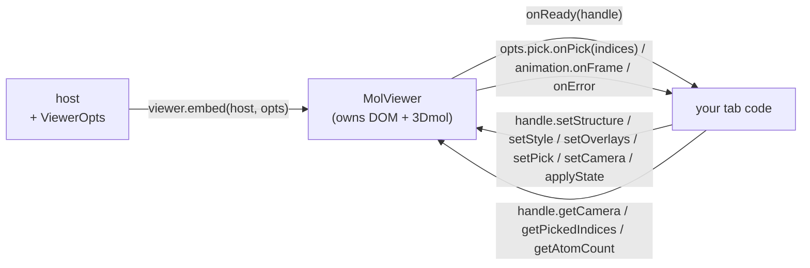

# The embedded MolViewer — a developer's guide

**What this is.** A plain-language guide to molbuilder's reusable 3D structure
viewer — `window.molbuilder.viewer.embed(host, opts) → handle`. It's the
component every tab drops in to show a molecule, and the rule for using it
correctly is simple: **drive it through the declarative handle; never touch the
raw 3Dmol object.** This guide shows how.

**What this is NOT.** The authoritative contract. `protocols/molview-module.md`
is the clause-pinned source of truth (every opt, every handle method, the
isolation contract, error codes). This guide teaches and points there; it won't
drift.

---

## 1. The one-paragraph mental model

You give `embed()` a **host `<div>`** and an **opts** object; it returns a
**handle**. From then on it's a clean boundary:

- **Host → viewer** you *push* via handle methods (`setStructure`, `setStyle`,
  `setOverlays`, `setPick`, …) and *read* via getters (`getCamera`,
  `getPickedIndices`, …).
- **Viewer → host** you *receive* via opts callbacks (`onReady(handle)`,
  `pick.onPick(indices)`, `animation.onFrame(idx)`, `onError`).

The viewer owns its DOM + the 3Dmol instance; the host owns everything around
it. **You never read or mutate 3Dmol directly** — that's the whole point of the
component (one viewer, many tabs, no per-tab divergence).



---

## 2. Getting a viewer + the two-way boundary

```js
const handle = window.molbuilder.viewer.embed(hostDiv, {
  structure: { xyz: xyzText },        // initial structure (see ViewerOpts)
  style:     { rep: "stick" },
  pick:      { onPick: (indices) => { /* user clicked atoms */ } },
  onReady:   (handle) => { /* handle is live — safe to drive it */ },
  onError:   (err) => { /* err.code: "no_project" | ... */ },
});
```

**Crossing the boundary (contract §2.3):**

| Direction | How |
|---|---|
| Host → viewer (mutate) | `handle.setStructure(...)`, `setStyle`, `setAxes`, `setCell`, `setLabels`, `setArrows`, `setOverlays`, `setPick`, `setCamera`, `setBackground`, `setAnimation` |
| Host → viewer (read) | `handle.getAtomCount()`, `getElements()`, `getAtomCoords()`, `getPickedIndices()`, `getCamera()`, `getStructureText("xyz"|"pdb")`, plus `getStyle/getAxes/getOverlays/...` |
| Host → viewer (commands) | `playAnimation()`, `pauseAnimation()`, `setAnimationFrame(i)`, `refit()`, `screenshot()`, `exportData(...)`, **`dispose()`** |
| Viewer → host (events) | `opts.onReady(handle)`, `opts.onError(err)`, `opts.pick.onPick(indices)`, `opts.export.onExport(info)`, `opts.animation.onFrame(idx, handle)` (trajectory) |

**ViewerOpts** (the embed opts, contract §3.1): `structure`, `style`, `axes`,
`cell`, `labels`, `arrows`, `overlays`, `pick`, `interaction`, `animation`,
`knobs`, `export`. All optional; pass only what you need.

---

## 3. Key concepts

- **The handle is declarative — never reach for raw 3Dmol.** `handle._viewer3dmol()`
  exists only as a **deprecated, tests-only** escape hatch (contract §2.4);
  production code (including the selection viewer-adapter) drives everything
  through `setOverlays` / `getCamera` / native pick.
- **Selection highlighting = `setOverlays`, not raw atom coloring.** Overlays are
  a declarative layer (contract §3.12); the selection viewer-adapter pushes the
  current selection as overlays.
- **`getX` / `setX` round-trip + `applyState`.** Every visual knob has a getter
  and a setter, so you can snapshot and restore viewer state. For a full restore
  use **`applyState(spec)`** (canonical-order apply) rather than a pile of
  individual `setX` calls — it avoids precedence/ordering surprises.
- **Trajectory / animation mode.** `setAnimation(...)` + `playAnimation()` /
  `setAnimationFrame(i)`; frames stream back via `opts.animation.onFrame`. Used
  by the Results trajectory inspector.
- **Lifecycle.** Wait for `onReady(handle)` before driving the viewer (embed may
  initialize asynchronously); call **`handle.dispose()`** on teardown to release
  the 3Dmol instance + listeners.

---

## 4. The rules to get right

1. **Drive via the handle, never 3Dmol.** The isolation contract (§2) is the
   reason one viewer works identically across every tab. Reaching into 3Dmol
   re-introduces the per-tab drift the component exists to prevent.
2. **Use `onReady` before you push state.** The handle returned synchronously may
   not be fully initialized until `onReady` fires.
3. **Selection → `setOverlays`.** Don't hand-color atoms; push overlays so the
   viewer owns the rendering.
4. **Restore with `applyState`, not a setX pile.** Canonical order avoids the
   axes-vs-labels / style precedence ambiguities the contract calls out.
5. **`dispose()` on unmount.** Especially in the Results tab, where inspectors
   mount/dispose repeatedly (see `results-tab-guide.md`).

---

## 5. Common gotchas / anti-patterns

- **Don't** use `handle._viewer3dmol()` in production — it's a test hatch (§2.4).
- **Don't** push structure/style before `onReady`.
- **Don't** color atoms directly for selection — use `setOverlays`.
- **Don't** leak: an embed without a matching `dispose()` keeps a 3Dmol context
  + listeners alive (a real cost when tabs remount).
- **Do** read picks via `getPickedIndices()` / `pick.onPick`, and camera via
  `getCamera()` — never off the raw viewer.

---

## 6. Where the authority lives

- **`protocols/molview-module.md`** — the contract: `ViewerOpts` (§3.1),
  `ViewerHandle` (§3.2), `StyleOpts`/`AxesOpts`/`OverlaySpec`/… , the isolation
  contract (§2), error codes (§5), required external modules (§2.5).
- **`results-tab-guide.md`** — how the trajectory inspector embeds + disposes the
  viewer per file (mount/dispose lifecycle).
- **`workspace-guide.md`** — the selection store the viewer-adapter overlays come
  from.
