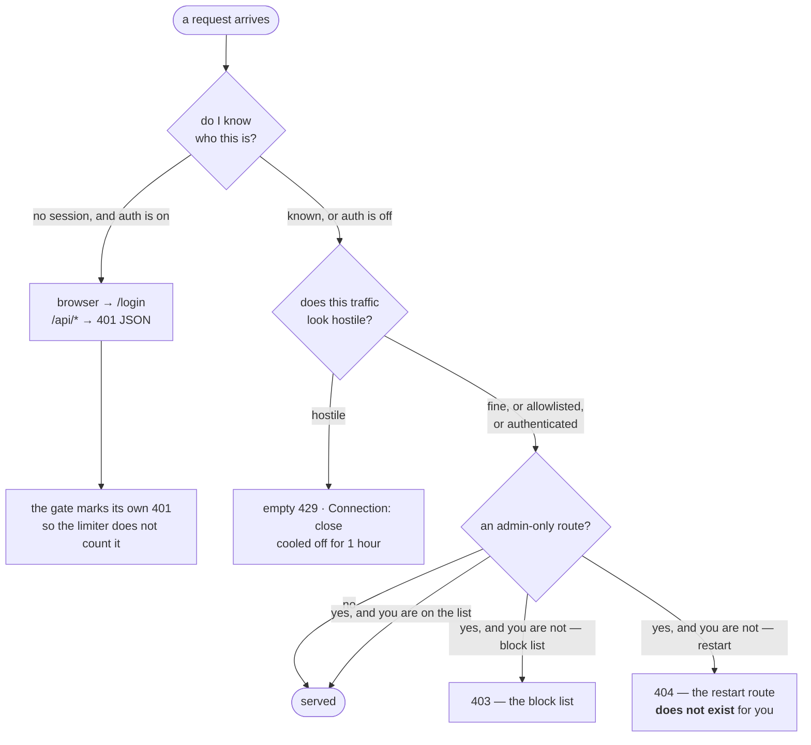

# Access control — who reaches this server, and what they may do

**Role:** contract
**Domain:** ops
**Companions:** [`deployment.md`](?doc=ops/deployment.md) (how the server is
started, bound and exposed — the operational half of everything below);
[`installation.md`](?doc=ops/installation.md) (the env model);
[`server-reload-plan.md`](?doc=archive/2026-08-19-server-reload-plan.md) (why the restart
mechanism has the shape it has); [`web/web-api.md`](?doc=web/web-api.md) (the
routes these gates sit in front of); [`design.md`](?doc=design.md) (the
project-wide stance this is an instance of).

`molbuilder serve` starts a server that reads and writes a real `projects/`
tree. On a laptop that is one person's own files. On a group machine it is
several people's, over a network, with calculations running.

**This document is the design of the gates between those two situations** —
what each one asks, why there are four of them and not one, what happens when a
gate is misconfigured, and which parts are known to be wrong today. It is not a
setup guide: how to *turn on* SSO or *tune* the limiter is
[`deployment.md`](?doc=ops/deployment.md) § 3 and § 4.

> **Words used in this document.**
>
> - **A session** — the signed cookie a browser gets after signing in. It holds
>   one thing that matters here: `user.email`, lowercased.
> - **The auth gate** — the check that runs before every request and answers
>   *do I know who this is*.
> - **The limiter** — the per-IP check that answers *does this traffic look like
>   somebody probing for a way in*. It judges **behaviour**, never identity.
> - **An admin** — a session whose email is in a named list. Not a role, not a
>   permission system: one list, read by two subsystems.
> - **The supervisor** — the parent process that can start a fresh server.
>   Present by default; absent under `--no-supervise` or `--debug`.
> - **Allowlisted** — an IP the limiter never counts against (loopback, by
>   default). Different from *authenticated*, which also skips the limiter, for
>   a different reason.
> - **Blocked** — an IP the limiter is refusing, with an empty `429` and
>   `Connection: close`, for the cooldown (1 hour by default).

---

## 1. The goal

**A lab tool you can put on a network without it becoming a liability — where
the state you get by configuring nothing is the safe one.**

Every gate below is arranged so that a mistake makes a capability **missing**,
never **universal**. A forgotten config line loses you a button; it never hands
a stranger your files.

### 1.1 What that looks like in use

Four situations, and what each one meets:

**One person, one laptop.** `molbuilder serve foreground`, no config. No sign-in: there is
nobody to distinguish from. The bind guard keeps it on loopback, so "no auth" is
true and safe at once. The limiter is running, and loopback is allowlisted, so
it never fires. Nothing to set up, nothing to get wrong.

**A group machine.** An `auth` section names one or more identity providers, and
the server binds a real interface behind TLS. Everyone signs in with the account
they already have; molbuilder learns an email address and nothing else. The
limiter is now doing real work, because the port is reachable by strangers.

**Somebody probing.** A scanner walks `/admin.php`, `/.env`, `/wp-login.php`,
then tries `?q=<script>`. The first pattern that is unambiguously an attack
blocks the IP immediately; short of that, twenty 4xx in thirty seconds does. The
block is an empty `429` with the connection closed — cheap for the server, and
it tells the scanner nothing about what is behind it.

**A developer who just changed the code.** They press **Reload server**, and a
fresh interpreter comes up with the new Python. Almost nobody sees that button:
it exists only under a supervisor **and** only for a named admin (§ 6).

---

## 2. Four questions, four gates

They are separate because they are different questions, and one answer would be
wrong for at least one of them.

| The question | What answers it | What it does when the answer is no | Where |
|---|---|---|---|
| **Do I know who this is?** | the auth gate (SSO) | browser → `/login`; `/api/*` → `401` JSON | `web/auth.py` |
| **Does this traffic look hostile?** | the rate limiter | empty `429`, `Connection: close`, 1 h | `web/rate_limit.py` |
| **May this person read and clear the block list?** | the `admin` list | `403` | `web/admin.py` |
| **May this person stop the process everyone shares?** | supervisor **and** the `admin` list | the route **does not exist** — `404` | `web/app.py` |

Read the last two rows together: **one list answers both**, and they refuse in
different ways — a 403 for the block list, an absent route for the restart. § 5
and § 6 are why.

### 2.1 A request, walking through them

Flask runs its before-request hooks in the order they were registered, and
**auth is registered before the limiter**. That order is not a detail — it is
why a hostile string aimed at a real page is refused but never *blocked* (§ 7):



**Two boxes skip the limiter for two different reasons, and the difference
matters.** *Allowlisted* means an address the limiter never counts — loopback,
by default. *Authenticated* means the limiter has no reason to judge you,
because you already answered the first question. Mixing them up is how the
1-hour block ends up applied to somebody who signed in correctly.

---

## 3. Identity — outsourced, and optional

### 3.1 molbuilder never holds a password

There are no accounts and no password store. When an `auth` section is present,
identity is verified by a provider you already trust — Google, GitHub, Microsoft
/ Azure AD, ORCID (OAuth 2.0 / OIDC), or Apereo CAS — and molbuilder receives a
yes/no plus a verified email. That is deliberately the whole of it: the most
dangerous thing a small tool can own is a password database, so it owns none.

The flow, from `auth.py`:

1. A visitor with no session asks for any page.
2. They are sent to `/login`, which shows one button per configured provider.
3. The provider runs its own sign-in — including any institutional federation
   behind it, which molbuilder never sees.
4. It returns to `/oauth-callback/<id>` or `/cas-callback/<id>`.
5. molbuilder extracts the email and checks it against **that provider's own**
   `allowed_users` list.
6. On success a signed session cookie is set and the user lands on the page they
   originally asked for.

**`allowed_users` is per provider, not global.** "Anyone with a Google account"
and "anyone in our CAS realm" are different populations, and one flat list would
force the looser one on both.

### 3.2 What answers without a session

A short, deliberate list — everything else goes through the gate:

`/login`, `/login/<provider>`, the two callbacks, `/logout`, `/api/health`
(liveness probes must not need a session), `static` (the browser fetches CSS and
JS before any session exists), and the vendored Plotly bundle.

Adding an endpoint to that list makes it public. It is a decision, not a
convenience.

### 3.3 A browser and a program are refused differently

Same gate, two answers, because the callers cannot use the same one. A browser
gets a redirect to `/login` with the path it wanted stashed, so signing in
returns it there. Anything under `/api/` gets a clean JSON `401` carrying a
`login_url` — a JavaScript client can render *please sign in* instead of trying
to parse a login page as data.

### 3.4 The session key lives outside the repo

Sessions are signed with a key read from a file named by `secret_key_file`
(conventionally in the config directory — `$XDG_CONFIG_HOME/molbuilder`,
else `~/.config/molbuilder`). Not in `molbuilder.json`, not in the
tree, and never committed. Client secrets follow the same rule — one file per
provider. See [`deployment.md`](?doc=ops/deployment.md) § 5.1.

**And so does the config that names them** (2026-08-30). `molbuilder auth-setup`
writes to **the file the server will actually read** — which is the reader's own
two-step lookup, `./molbuilder.json` when one is already there, otherwise
`~/.config/molbuilder/molbuilder.json`.

It defaulted to `./molbuilder.json` regardless, meaning *wherever the wizard was
launched from* — for anyone running it inside a checkout, the git root. Two
things were wrong with that, and the second is the one that bites:

- the same command already wrote both **secrets** into the config directory, so
  one command split its output across two conventions; and
- on a machine that already had a `./molbuilder.json` elsewhere, a fresh
  per-user file would have been **a config the reader never looks at** — the
  wizard reporting success while sign-in stayed off.

Asking the reader where it reads is what keeps the two from disagreeing. Pass
`--output` to name a path outright; that answers the question and nothing
overrides it.

> **Both files are gitignored, and neither has ever been committed.**
> `molbuilder.json` (machine scope — `auth`, `tls`, `secret_key_file`) and
> `.molbuilder.json` (project scope — no credentials, the registry refuses them
> there). They are separate patterns because gitignore matches whole basenames
> and the leading dot makes them different names.

---

## 4. Hostility — the limiter judges behaviour

Always on, per IP, in process. It exists for one caller: **somebody enumerating
paths to find a weak point.** Everything about its shape follows from that.

### 4.1 The three signals

| Signal | Trips on | Default |
|---|---|---|
| **Attack signature** | one match in the decoded path+query — `<script`, `<meta http-equiv`, `document.cookie`, `union select`, `; drop table`, `/etc/passwd`, `../../../` | always on |
| **404 storm** | `threshold_404` 4xx responses within `window_404_s` | 20 in 30 s |
| **Total burst** | `threshold_total` requests within `window_total_s` | **off** (`0`) |

The path is URL-decoded *and* `+`-unpadded before matching, so encoding
`%3Cscript%3E` does not walk past the signature check.

A trip blocks the IP for `cooldown_s` — one hour — answering an empty `429` with
`Retry-After` and `Connection: close`. No body, no page render, no hint about
what is behind the door.

### 4.2 Two ways to never be counted, for two different reasons

- **Allowlisted IPs** (loopback by default). On the shape the bind guard
  enforces, a loopback request really is local — never the scanner.
- **A logged-in session.** Somebody who came through the SSO gate has already
  been vouched for by an identity provider; the limiter is there to deflect
  anonymous probing, not to throttle a colleague who is mis-clicking.

### 4.3 Only 4xx counts, and that is what makes the front end cheap

`record_response` discards anything that is not `400 ≤ status < 500` before it
reaches a buffer. A 200 or a 304 is invisible to the limiter.

That is not an implementation detail — it is the assumption that lets every
static asset revalidate on every page load (§ 2 of
[`server-reload-plan.md`](?doc=archive/2026-08-19-server-reload-plan.md)). ~170 assets asking
"is my copy still good" answer 304, and 304 does not count. If the limiter is
ever widened to count 3xx, ordinary use trips it;
`tests/test_static_revalidates.py` pins the predicate for exactly that reason.

### 4.4 Why total-burst ships disabled

It was on, at 60 requests per 60 s, and it blocked real users: the Results tab
polls system load once a second, so a legitimate open tab reached the ceiling
within the minute. Counting **successes** toward an abuse signal punishes the
traffic the tool exists to serve. The 404-storm signal already catches the
canonical scanner, which generates 4xx and not 2xx. A paranoid deployment can
switch it back on; the recommended floor is 600 (10/s sustained), well above any
poll cadence.

---

## 5. Admin — one list, one meaning

**Who may do the things only an operator should do** lives in its own section:

```json
"admin": { "emails": ["operator@asu.edu"] }
```

Two subsystems ask it — who may read and clear the rate limiter's block list
(`GET /api/admin/rate_limit/status`, `POST …/clear`), and who may restart the
server (§ 6) — and they get the same answer.

**Absent or empty means ANYONE WHO CAN SIGN IN** — and that is not an open door,
because the door was already locked upstream. `auth.providers[].allowed_users` is
a **required** field, so a session exists only for someone an operator wrote down
by hand. There is no configuration in which "anyone who signed in" reaches the
public: write no auth config and there is no login at all; write one and you have
named every person yourself.

**Naming addresses here NARROWS it.** With the section present, only those
addresses are admins and everyone else who can sign in is not — which is the
setting for a shared deployment where signing in and operating the process are
different privileges.

**Why the default is not the other way round.** A second list that repeats the
allow-list is two lists to keep in step for one question, and on a
single-operator server it is the same address written twice. The failure is
silent: the capability is simply missing, which looks like a broken build rather
than a policy. The safety here comes from the required allow-list, not from
asking an operator to name themselves again.

**What that costs on a laptop: nothing.** Loopback is never rate-limited, so
there is no block list to clear; and the restart button needs a supervisor
before it exists at all.

> **It lived under `rate_limit.admin_emails` until 2026-08-03**, where an empty
> list meant *any signed-in user*. That is defensible for reading a block list
> and wrong for stopping a shared process — so the restart route had to
> **invert** it for itself: one value, two opposite readings, depending on which
> subsystem asked. It was also reached through the rate limiter's own object, so
> **turning the limiter off silently changed who was an admin** — a connection
> nothing in the names would suggest. The old key is gone, not aliased: a config
> that still sets it names nobody, and the server says nobody.

## 6. Stopping the process — absent, not refused

**Reload server** exits the process with a sentinel its supervisor is waiting
for, so a fresh child starts with every Python module imported again. The design
of that mechanism is [`server-reload-plan.md`](?doc=archive/2026-08-19-server-reload-plan.md);
what belongs here is who may press it.

`POST /api/admin/reload` **is not registered at all** unless both hold:

1. **A supervisor is running.** The default since 2026-08-04, so this normally
   holds; `--no-supervise` and `--debug` take it away. Without one nothing brings
   the server back, and an endpoint that stops an unsupervised server leaves a
   dead site with no way back from a browser.
2. **The `admin` section names somebody.** Restarting the process everyone shares is
   not something to inherit by omission.

**404, not 403, and the difference is the point.** A misconfiguration then reads
as *the button is missing* — which is what it is — and never as *anyone can
restart the server*. There is no state of the config in which forgetting
something grants the capability.

Two smaller decisions follow the same grain:

- **The button is drawn hidden and revealed**, after
  `GET /api/admin/reload/available` says this session may use it. A control that
  appears and then vanishes reads as a permission being taken away, and almost
  every session will never see this one.
- **The confirm names the cost out loud**: everyone using the server is
  disconnected, and saves still in flight are lost — `persist` does not wait for
  the server ([`web/workspace.md`](?doc=web/workspace.md) § 6), so *sent* is not
  *saved*.

---

## 7. Where the gates touch, and where they rub

Four honest sharp edges. Each is stated because finding one by surprise is worse
than reading it here.

**⚠ TLS is not authentication.** The bind guard checks *host + TLS* and never
asks whether auth is on. `serve --host 0.0.0.0 --cert … --key …` passes it while
serving a **public, unauthenticated, fully read/write/delete `projects/` tree**.
Encryption on the wire is not access control. A real deployment turns auth on
(§ 3) or sits behind a proxy that authenticates.

**⚠ The app can generate 4xx during ordinary use, and the limiter counts 4xx.**
Two instances found so far, which is enough to make it a rule rather than a
pair of bugs: **a 4xx should mean the request was wrong, not that the answer was
empty.** One is fixed — asking the workspace "did I leave anything here?"
answered `404` when the answer was simply "no", so a tab that restores its own
state manufactured one 4xx per page load against its own user (it is a `200`
with an empty result now). The other is below.

**An expired session used to look like an attack — fixed 2026-08-03.** The
limiter counts 4xx, and the auth gate's *"I do not know who you are yet"* is a
4xx. A session expiring with a tab open turned the page's own once-a-second poll
into one 4xx per second: twenty in thirty seconds, and the visitor was blocked
for an hour on every path, the sign-in page included. The app locking out its
own user, silently.

The gate now **marks its own answer** and the limiter skips it. Not "ignore 401
everywhere": a 401 from somewhere else has a different author and may mean
something. Everything else is untouched — pinned by three tests: the polling tab
is never blocked, a scanner walking for files still is, and an attack string is
still blocked on sight.

**⚠ The attack-signature check does not run on a path that maps to a real page,
when auth is on.** Flask runs before-request hooks in registration order, and
auth is installed before the limiter — so for `/?q=<script>` the sign-in
redirect answers first and the limiter never looks. The request is not served
either way, so nothing leaks; what is lost is the **block**, so that visitor is
never cooled off. A scanner is unaffected in practice, because it probes paths
that map to nothing and those reach the limiter untouched. Pinned as a known
shape in `tests/test_rate_limit.py` rather than left to be rediscovered.

**The admin API needs auth on.** With no `auth` section there is no session, so
`is_admin_request()` is false for everyone and both admin routes answer `403`
forever. On the default localhost shape that costs nothing — loopback is
allowlisted and can never be blocked, so there is nothing to clear. If you want
to *use* the admin API, turn auth on.

**Everything here is per process.** Block state is in memory: it clears on
restart — including a restart the Reload button caused — and two workers would
keep two independent block lists. It is one more reason `serve` is one process
and production means a proxy in front, not a worker pool
([`deployment.md`](?doc=ops/deployment.md) § 2).

---

## 8. The rules underneath

The transferable part. A new gate should be able to point at one of these.

1. **The safe state is the one you get by doing nothing.** Every default here is
   the restrictive reading, and every misconfiguration removes a capability
   rather than granting one. The one place that used to violate it —
   `admin_emails` empty meaning *everybody* — was fixed on 2026-08-03: the list
   has its own section and one meaning (§ 5).
2. **Absent beats refused, when existence is itself the answer.** A capability
   that cannot be exercised safely should not appear. `404` is not rudeness; it
   is the honest statement that there is nothing there. **A refusal that looks
   different from absence gives away the thing absence was hiding**: if a wrong
   credential answers `401` where an unconfigured server answers `404`, the
   refusal has confirmed the capability is switched on. A gate built on this
   rule answers both the same way.
3. **Identity is borrowed, never stored.** No accounts, no passwords, no reset
   flows. molbuilder learns an email from somebody whose job this is.
4. **Judge behaviour, not people.** The limiter never asks who you are, only
   what your traffic looks like — which is why a signed-in user skips it and an
   anonymous scanner does not.
5. **One question, one gate.** Four checks because there are four questions.
   Merging them is how "may read the block list" quietly becomes "may stop the
   server" — see § 5.
6. **Name the cost of a destructive action before doing it, in the user's own
   terms.** Not "confirm?", but *everyone is disconnected and unsaved work is
   lost*.
7. **Prefer the secret that never travels.** A bearer token proves *I know the
   secret* by sending it, so every request is one more chance to capture a
   credential that works forever and on any body. A signature over the request
   body proves the same thing while the secret stays on the machine holding it,
   and what does travel is valid for one body only. Obscurity — an unguessable
   path, a quiet name — is a worthwhile layer on top of that and never a
   substitute for it. Obscurity committed to a public repository is not
   obscurity, so anything meant to be hard to guess is **generated per
   deployment**, not chosen once and shipped.
8. **A secret that must reach a second machine is minted only by an explicit
   act.** `serve` may generate a secret that lives here and nowhere else — the
   session key does exactly that on first run (§ 4), and rotating it only asks
   people to sign in again. It may never generate one whose counterpart is held
   by another machine, because nothing here can deliver the replacement: the far
   side keeps presenting the old secret, is refused, and **the failure looks
   like silence rather than an error**. Creating those belongs to a command a
   person runs on purpose.

---

## 9. How it is verified

| What | Where |
|---|---|
| The limiter, signal by signal — signature · 404-storm · total-burst · TTL expiry · allowlist · `X-Forwarded-For` trust · the admin routes · the admin role gate · the authenticated bypass · disabled mode · LRU eviction | `tests/test_rate_limit.py` (11 classes) |
| Auth config validation + provider entries | `tests/test_auth_config.py`, `tests/test_auth_setup.py` |
| `--no-auth` refused off loopback | `tests/test_cli.py::test_serve_no_auth_refuses_non_loopback_host` |
| TLS cert/key resolution (flags vs `molbuilder.json`, incomplete pairs fall back to HTTP) | `tests/test_cli_tls.py` |
| The reload gate — **404 not 403** on either missing condition; the availability answer in four configurations; the respawn loop; the supervisor never importing the app | `tests/test_admin_reload.py` |
| Revalidation staying invisible to the limiter (the § 4.3 assumption) | `tests/test_static_revalidates.py` |
| No inline `<script>` anywhere (the CSP's `script-src 'self'` would break silently otherwise) | `tests/test_no_inline_scripts.py` |

**Two gaps, both known.** The **header values themselves** — CSP directives,
HSTS-only-over-HTTPS, `nosniff`, `X-Frame-Options` — have no test; only the
no-inline-script rule that CSP depends on does. That is part of **task #15**.
And the **bind guard's** loopback-or-TLS refusal is covered only through the
`--no-auth` case above; the `--host 0.0.0.0` without TLS path is not pinned.

---

## 10. What this is not

- **Not a permission system.** There are two levels — signed in, and named in
  one list. No roles, no per-project ownership, no sharing model. Everyone who
  can sign in can read and write the whole `projects/` tree.
- **Not a defence against a determined attacker with a valid account.** The
  limiter deflects anonymous probing; the auth gate checks an email against a
  list. Neither contains somebody you let in.
- **Not multi-tenancy.** One `projects/` root, one workspace tree, one process.
  Separating two groups means two servers.
- **Not a production hardening guide.** The exposure shape — proxy, TLS
  termination, firewall — is [`deployment.md`](?doc=ops/deployment.md) § 2.
