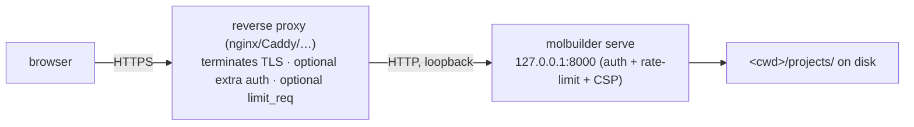
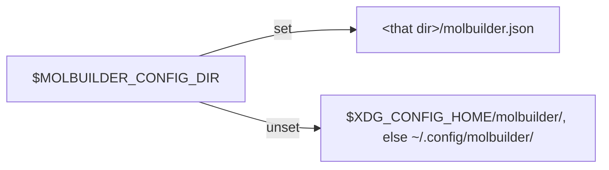

# Deployment — running the molbuilder server

**Role:** guide
**Domain:** ops
**Companions:** [`access-control.md`](?doc=ops/access-control.md) — **the design
of the gates** (identity · hostility · admin · stopping the process), which this
guide is the operational half of; [`installation.md`](?doc=ops/installation.md) —
getting molbuilder and its envs onto the host first;
[`web-api.md`](?doc=web/web-api.md) — the HTTP
API (its security section defers the full rate-limiter threat model to §4 here);
[`execution/running-a-job.md`](?doc=execution/running-a-job.md) — `molbuilder.json`
also carries the job-execution config.

molbuilder serves its web UI with the **`molbuilder serve` verbs** (§ 1). On a laptop that's the
whole story — it binds loopback, no auth, and you're done. Exposing it to other
people is where the care goes: molbuilder runs its own **single-process
development server**, so anything production-grade (TLS, real auth, per-IP
throttling at scale) is either configured here or handled by a **reverse proxy in
front of it**.

## 1. Running it

**`serve` is a group of verbs** *(2026-08-28; the bare `molbuilder serve`
form was retired with it — a verb is named, never implied)*:

```bash
python -m molbuilder serve start        # background: detach, log, pidfile
python -m molbuilder serve status       # is it up, is it ANSWERING, where
python -m molbuilder serve restart      # recycle the server in place
python -m molbuilder serve stop         # bring it down
python -m molbuilder serve foreground   # today's terminal-bound run (dev)
```

### 1.0a `serve start` — the background server

`start` detaches, then runs the same supervisor+child pair `foreground`
runs — nothing about the server itself changes, only who holds the
terminal. Three files, all under **your own** home (which is what makes
every bit of this per-user):

| file | what |
|---|---|
| `$XDG_RUNTIME_DIR/molbuilder/serve-<port>.pid` | the supervisor's pid — the address `stop`/`restart`/`status` act on.  `<state>/run` when that variable is unset |
| `$XDG_STATE_HOME/molbuilder/logs/serve-<port>.log` | everything the server prints (default `~/.local/state/molbuilder/logs/`) |
| `$XDG_STATE_HOME/molbuilder/logs/serve-<port>.stacks.log` | thread stacks, appended on `SIGUSR1` and before any forced child kill (§ 1.0c) |

**The log is capped and rotated** *(user requirement, 2026-08-28)*:
when it exceeds `--log-max-mb` (default 20) it is closed, gzipped to
`serve-<port>.log.1.gz` (older ones shift up), and at most `--log-keep`
(default 5) archives are kept — the oldest is deleted. A long-lived
server cannot fill the disk.

**One user cannot touch another's instance, twice over.** The kernel
already refuses cross-user signals outright; on top of that, every verb
verifies before acting — the pid in the file must be alive, be **yours**,
and its command line must actually be a molbuilder serve — so a stale
pidfile whose pid was recycled by some other program is reported as
stale, never signalled.

### 1.0b `stop` · `restart` · `status`

* **`status`** answers two different questions separately: *is the
  process up* (the pidfile checks above) and *is it answering*
  (`/api/health`) — yesterday's wedge was precisely a server that was up
  and not answering, and a status that conflated the two would have
  called it healthy.
* **`restart`** signals the supervisor (`SIGHUP`), which recycles the
  child — the Reload button's effect, workable from a script, and
  workable when the child is HUNG and the button's route cannot answer.
* **`stop`** is a polite `SIGTERM` to the supervisor, which takes the
  child down with it and removes the pidfile.

### 1.0c What the supervisor does now (the 2026-08-28 hang's repairs)

The 2026-08-28 wedge found two gaps, both closed:

* **A child that dies by signal is respawned** (with a flap guard: two
  crashes within 30 s and the supervisor gives up and says so). Before,
  killing a hung child made the supervisor conclude *"that was not a
  reload"* and quit — the site went down exactly when recovery was
  needed. A clean nonzero exit (a config error) still stops: respawning
  a server that cannot start is a tight loop, not a recovery.
* **The child registers a stack-dump hook**: `kill -USR1 <child pid>`
  appends every thread's current stack to `serve-<port>.stacks.log`.
  The next hang is diagnosed by reading a file, not by theorizing from
  thread counts.

**And one thing the supervisor deliberately does NOT do** (user ruling,
2026-08-28): it never kills a child that is still *running* — there is
no health-check auto-restart. A child that is up but not answering is a
question, not a verdict: without a diagnosis, an automatic kill could
interrupt real user work on a guess. The order is diagnosis first
(the stack dump above), then a **human** decides (`serve restart`).

**The log is the record — and nothing more is built.** Every daemon
event line (child start, respawn, flap give-up, stop) is timestamped,
and a `serve status` probe that finds the server up-but-not-answering
appends that detection to the same log — so the history of concerns,
detections and respawns reads in one place, whoever asked and whenever.

### 1.0d `serve foreground` — the terminal-bound run

Exactly the old behaviour under its honest name: supervisor + child in
your terminal, `Ctrl-C` to stop. The development mode.

Flags (shared by `foreground` and `start`; `molbuilder/cli.py`):

| Flag | Default | Effect |
|---|---|---|
| `--host` | `127.0.0.1` | bind interface |
| `--port` | `8000` | bind port |
| `--debug` | off | Werkzeug reloader + interactive debugger (`foreground` only; never in production) |
| `--cert` / `--key` | none | serve HTTPS directly from PEM files |
| `--allow-insecure-binding` | off | override the bind guard (below) |
| `--supervise` / `--no-supervise` | **on** | (`foreground` only) run under the restarting parent; turn off when systemd/Docker/gunicorn owns restarts. `--debug` turns it off on its own |
| `--no-auth` | off | skip auth entirely — **loopback host only** |
| `--log-max-mb` / `--log-keep` | 20 / 5 | (`start` only) the log cap and how many gzipped archives survive |

### 1.1 Is the running server actually running your code?

**Static files are read from disk on every request; Python is not.** A
long-lived `serve` keeps the modules it imported at start-up, so edits to
`molbuilder/**.py` — routes, blueprints, validators — are invisible until it
restarts, while edits to `web/static/**` (CSS, JS) take effect on reload.

That split is easy to miss precisely because the page *looks* updated. On
2026-08-25 the dev server had been up since 19 August: the Results tab
answered `/api/bench/summary` with a **404 HTML page**, the inspector's
`r.json()` threw `SyntaxError: Unexpected token '<'`, and the route was
perfectly present in the source. **109 Python commits** had landed in
between, including the feature being tested.

Two commands settle it before you debug anything:

```bash
ps -o pid,lstart,cmd -p "$(pgrep -f 'molbuilder serve' | tail -1)"   # started when?
git log --oneline --since="<that time>" -- molbuilder/ ':!molbuilder/web/static'
```

An empty log means the server is current. A non-empty one means **restart
first** — anything you conclude before that describes the old build. A route
that 404s while `create_app()` lists it is this, every time:

```bash
python -c "from molbuilder.web.app import create_app; \
print([str(r) for r in create_app(config={}).url_map.iter_rules() if 'bench' in str(r)])"
```

There is **no `--workers` flag and no built-in production server** — `serve`
always runs Flask/Werkzeug's dev server in one process. To run it under gunicorn
or behind nginx, *you* wrap it; molbuilder doesn't spawn workers, and its rate
limiter (§4) is per-process, so multiple workers would each keep their own
counters.

**The bind guard.** molbuilder refuses to bind a **non-loopback** host without
TLS — because doing so serves the whole `projects/` tree (read/write/delete) to
the network. You satisfy it by adding `--cert/--key`, putting it behind a
TLS-terminating proxy (and binding loopback), or knowingly passing
`--allow-insecure-binding`.

> **⚠ TLS is not authentication.** The bind guard checks only *host + TLS* — it
> **never checks whether auth is on**. And auth is **opt-in** (§3): with no `auth`
> section in `molbuilder.json`, the server runs with **no authentication at all**.
> So `molbuilder serve start --host 0.0.0.0 --cert … --key …` passes the guard yet
> exposes a **public, unauthenticated, fully read/write/delete `projects/` tree** —
> TLS only encrypts the wire. (The guard's own message says so: *"still no
> auth!"*.) A real public deployment must **turn auth on** (§3) **or** sit behind a
> proxy that authenticates (§2); `--cert/--key` alone is defense-in-depth, not
> access control.

## 2. The production shape



The recommended production setup is a **reverse proxy terminating TLS** in front
of `molbuilder serve` bound to loopback. molbuilder supports this: set
`auth.trust_proxy` so it installs `ProxyFix` (trusts one hop of
`X-Forwarded-For`/`-Proto`), and it only emits **HSTS** once the request actually
arrived over HTTPS. Direct TLS (`--cert/--key`) also works for simpler setups.

## 3. Auth — turning on sign-in

No `auth` section in `molbuilder.json` = no login. That is the right
setup for a personal machine. Add sign-in only when other people can
reach your server.

### 3.1 Google sign-in, step by step

**Step 1 — create the OAuth client** (once, in a browser, at
<https://console.cloud.google.com/apis/credentials>):

1. Pick or create a project. First time only: open **OAuth consent
   screen**, choose *External*, fill in the app name, save.
2. Click **Create credentials → OAuth client ID → Web application**.
3. Under **Authorized redirect URIs**, click *Add URI* and enter:

   ```
   https://YOUR-HOST:8888/oauth-callback/google
   ```

   Use the host and port people type into their browser. Through an
   ssh tunnel that is `http://localhost:8888/oauth-callback/google`.
   (`serve start` prints the exact URI whenever auth is on — copy it
   from there instead of deriving it.)
4. Click **Create**. Google shows a client ID and a client secret —
   keep that page open for step 2.

**Step 2 — run the wizard on the server**, in the clone:

```bash
python -m molbuilder auth-setup --provider google
```

Paste the client ID and secret at the prompts (the secret is typed
with echo off), and list the Google accounts that may log in. The
wizard writes everything: the `auth` section into `molbuilder.json`,
and the secret into `~/.config/molbuilder/google_client_secret`
(mode `0600`, § 5.1). Nothing secret lands in the config file.

**Step 3 — restart and test:**

```bash
python -m molbuilder serve restart --port 8888
```

Open the site: you get a login page with a Google button. Sign in
with one of the allowed accounts.

### 3.2 ASURITE sign-in (CAS)

```bash
python -m molbuilder auth-setup --provider asu
```

No console, no secret — CAS has neither. The allowed user is your
ASURITE; add lab members by editing `allowed_users` in
`molbuilder.json`.

### 3.3 Changing things later

| what changed | what to do |
|---|---|
| rotate / replace the client secret | make a new secret on the same console page → overwrite `~/.config/molbuilder/google_client_secret` → `molbuilder serve restart` |
| new host or port | add the new redirect URI in the console — `serve start` prints the exact URI to add |
| add / remove people | edit `allowed_users` in `molbuilder.json` → `molbuilder serve restart` |

### 3.4 Facts you may need

- molbuilder never sees a password. Google (or CAS) does the login;
  molbuilder only checks the returned email against `allowed_users`.
- With auth on, a browser request without a session is redirected to
  `/login`; an `/api/*` request gets a clean `401` JSON naming the
  login URL. Always open regardless: the login/callback/logout
  routes, `/api/health`, and static assets.
- The session cookie is signed with the key at `secret_key_file`
  (auto-generated `0600` on first run if the path is set) and is
  `Secure` + `HttpOnly` + `SameSite=Lax`.
- `--no-auth` skips login entirely and is refused on any
  non-loopback host.
- Google and ASURITE CAS come through the wizard; other OAuth/OIDC
  providers (GitHub, Microsoft, ORCID) take the same `auth`-section
  shape, written by hand
  ([`configuration.md`](?doc=configuration.md)).

## 4. Security posture

> **The design of the gates — why there are four, what each refuses and how,
> and the rules underneath — is [`access-control.md`](?doc=ops/access-control.md).**
> This section is the operational half: the headers, the knobs, and the routes.

Set on every response (via a header hook, using `setdefault` so a proxy can
override):

- **Content-Security-Policy** — `default-src 'self'`; **`script-src 'self'`**
  (no inline JS — a hard rule, enforced by a test); `style-src 'self'
  'unsafe-inline'` (the 3D viewers need inline style); `img-src 'self' data:`
  (Plotly); `object-src 'none'`; `frame-ancestors 'none'`; `base-uri`/`form-action`
  `'self'`.
- `X-Content-Type-Options: nosniff`, `X-Frame-Options: DENY`,
  `Referrer-Policy: same-origin`, and **HSTS only when served over HTTPS**.
- a **50 MB request cap** — over it, a JSON `413`, not Flask's HTML default.
- **no CSRF token layer**: cross-site request forgery is defended by
  **`SameSite=Lax` cookies** (a third-party page can't ride your session on a
  state-changing request) plus `form-action 'self'`; no CORS headers are emitted
  (same-origin only). (`connect-src 'self'` limits where *molbuilder's own* pages
  may connect out — it isn't the CSRF defense.)

### The rate limiter (the threat model `web-api.md` defers here)

An **always-on, per-IP, in-process** limiter runs before every request. It blocks
an IP for a **cooldown (default 1 hour)** on any of **three signals**:

1. **Attack-string signature** — an immediate block. The path+query is
   URL-decoded first (so `%3Cscript%3E` can't sneak through) and matched against
   patterns for XSS (`<script`, `<meta http-equiv`, `document.cookie`), SQLi
   (`union select`, `; drop table`), and path traversal (`/etc/passwd`,
   `../../../`). This signal is on even when the count-based ones are off.
2. **404-storm** — `threshold_404` (default **20**) *or more* 4xx responses within
   `window_404_s` (default **30 s**): a scanner walking for files.
3. **Total-burst** — `threshold_total` requests in `window_total_s`. **Disabled by
   default** (`threshold_total = 0`) — a 60/60 s cap once throttled the app's own
   1 Hz system-load poll, so it's opt-in.

A blocked request gets an empty **`429`** with `Connection: close` and
`Retry-After`. **Logged-in sessions and allowlisted IPs (loopback by default)
bypass the limiter entirely.** State is in memory only — it clears on restart, and
is per-process (another reason not to fan out to many workers).

Two admin routes let an operator inspect and clear blocks:

- `GET /api/admin/rate_limit/status` → `{enabled, blocked:[{ip,reason,ttl_s}], …}`
- `POST /api/admin/rate_limit/clear` with `{"ip":"…"}` or `{"all":true}`

Both require a logged-in **admin** — an email listed in the top-level `admin`
section of `molbuilder.json`. **Absent or empty means anyone who can sign in** —
which is already a named set, because `auth.providers[].allowed_users` is
required — and naming addresses here narrows it. The restart route reads the
same answer (`access-control.md` § 5):

```json
"admin": { "emails": ["operator@asu.edu"] }
```

> **Gotcha:** the admin API needs **auth on**. Without an `auth` section (or under
> `--no-auth`) there's no session key, so those two routes always answer `403`.
> On the default localhost/no-auth shape that's fine — loopback is allowlisted and
> can never be blocked — but if you want to *use* the admin API, enable auth. (Recorded follow-up.)

### Restarting the server from the browser

A **Reload server** button sits beside the signed-in email. Pressing it makes the
server **exit with a sentinel code** that its supervisor is waiting for, so a
fresh child starts with every Python module imported again; the page then polls
`/api/health` and reloads itself, picking up new JS and CSS through the
revalidation described in
[`server-reload-plan.md`](?doc=archive/2026-08-19-server-reload-plan.md) § 2. There is no
module-swapping — a new process is the whole mechanism, which is why it can't
leave half the app running old code.

**`POST /api/admin/reload` does not exist unless two things are true**, and the
route is **absent (404), not refused (403)**, when either fails — so a
misconfiguration reads as *the button is missing*, never as *anyone can restart
the server*:

1. **the server is supervised** — the default since 2026-08-04, so this gate is
   normally already met. It is not met under `--no-supervise` or `--debug`,
   because then nothing would bring the server back and stopping it would leave
   a dead site with no way back from the browser. This one decides whether the
   route **exists**, because it is a property of the deployment rather than of
   who is asking;
2. **the caller is an admin** — by default anyone who signed in, since reaching
   a session required being named in a provider's required `allowed_users`. An
   `admin` section narrows that when signing in and operating the process are
   different privileges. This one decides what the route **answers**.

The button is drawn hidden and revealed only after
`GET /api/admin/reload/available` says this session may use it, so most people
never see it. It asks for confirmation first, naming the cost out loud: everyone
using the server is disconnected, and workspace writes still in flight are lost
(`persist` doesn't wait for the server — [`web/workspace.md`](?doc=web/workspace.md) § 6).

> **This does not make the dev server a production server.** Supervision only
> respawns the same Werkzeug dev server; §2 still governs how it is exposed. Under
> gunicorn or another process manager, pass `--no-supervise` — that manager owns
> the process lifecycle, and a supervisor inside it is a second answer to a
> question already answered. The route is then absent, because
> `MOLBUILDER_SUPERVISED` is unset.

## 5. Configuration — `molbuilder.json`

The server reads **`molbuilder.json`** from ONE place — the config directory
(`configuration.md` § 2.1c). It searched three until 2026-08-31; a
`./molbuilder.json` is no longer read at all:



The override is used **exactly as given** — no `molbuilder` component is
appended, because the variable names *our* directory rather than a shared root.
A malformed file refuses to start rather than silently misconfiguring.

**`molbuilder auth-setup` writes the file the server would read**, by asking
the reader's own resolver rather than writing to the directory it happens to be
launched from — so the wizard cannot leave the auth block in a file nothing
consults, which is what "always
write the per-user one" would do on a machine that already has a `./` config.

**These are the server's sections.** The same file also carries what
*calculations* need — `script_generation`, `scheduler`, `execution`, `envs`,
`checkpoint` — which are [`execution/running-a-job.md`](?doc=execution/running-a-job.md)
§ 5. The complete map of every section, who reads it, and where it lands in the
workflow is [`execution/architecture.md`](?doc=execution/architecture.md) § 7.

| Key | Controls |
|---|---|
| `tls: {cert, key}` | HTTPS (CLI `--cert/--key` overrides) |
| `auth: {providers:[…]}` | enable SSO login (§3) |
| `auth.trust_proxy` | install `ProxyFix` for a reverse proxy |
| `secret_key_file` | path to the session-signing key |
| `notify_keys_file` | path to the run-report signing-key file ([`run-reports.md`](?doc=execution/run-reports.md) § 4.3). `molbuilder notify-token` writes it |
| `notify_route` | the listener's generated URL segment, printed by the same command. **Both are required**; with either absent no route is registered at any path, so a server that has not set this up cannot be probed for the capability |
| `rate_limit: {…}` | tune the limiter (§4 defaults) |
| `envs: {siesta, pyscf, …}` | the conda-env names for the backends |

There are **no server environment-variable knobs** — in particular
`MOLBUILDER_LOG` appears in a code comment but is *not* wired, so don't rely on it.

Two ready-made files ship beside this doc, in `ops/examples/`:

| File | What it is |
|---|---|
| `molbuilder.json.example` | The server template — `tls` / `envs` / `auth` / `secret_key_file` / `script_generation`, each annotated with inline `_comment_*` keys. Copy it to your launch directory and edit. **`script_generation.activation` is required before the web UI (or CLI) can install any `.run.sh` wrapper** — a config predating that section is exactly the "the `.fdf` saved but no `.run.sh` appeared" symptom. Pinned by `tests/test_scheduler_config.py` (parses through the live reader; load-bearing sections present; cited docs exist) so it stays synced with the code. |
| `molbuilder.asu-sol.json` | A real site preset (ASU Sol: SLURM `public` partition, A100 GPUs). The shape a working HPC config takes. Pinned by `tests/test_scheduler_config.py` so it stays valid against the live reader. |

```bash
cp docs/ops/examples/molbuilder.json.example molbuilder.json
```

### 5.1 The config directory — secrets live outside the repo

The design rule: **`molbuilder.json` carries *paths only*, never secret
bytes.** The config file gets copied, backed up, and diffed as you tune a
deployment — secrets must not travel with it. Every secret lives in
molbuilder's config directory, and the config references it by path.

**That directory is `$XDG_CONFIG_HOME/molbuilder`, or `~/.config/molbuilder`
when the variable is unset** (`molbuilder.config_dir.config_dir`) — the same
one `molbuilder auth-setup` writes to, so a wizard-generated deployment and a
hand-made one put their secrets in the same place.

> **Corrected 2026-08-26.** This section was headed *"The `~/.molbuilder/`
> directory"* and told you to create one, while the code had always used
> `config_dir()`. Nothing broke — the config carries paths, so either
> location works — but the wizard and these instructions named different
> directories, which is two answers to one question. **If you followed the
> old text, nothing needs moving:** point `secret_key_file` wherever your
> files already are. What changed is which directory this page recommends.

Honouring `XDG_CONFIG_HOME` is not decoration. On an HPC login node `$HOME`
is NFS-mounted and often snapshotted; `XDG_CONFIG_HOME=/scratch/$USER` is how
you keep a credential off it. That matters most for the run-report token
([`run-reports.md`](?doc=execution/run-reports.md)), which is read on a
**compute node**.

Initial setup (once per deployment host):

```bash
mkdir -p -m 700 "${XDG_CONFIG_HOME:-$HOME/.config}/molbuilder"
cfg="${XDG_CONFIG_HOME:-$HOME/.config}/molbuilder"

# The Flask session-signing key (referenced by "secret_key_file"):
python -c "import secrets; print(secrets.token_hex(32))" > "$cfg/secret_key"
chmod 600 "$cfg/secret_key"

# One file per OAuth provider (referenced by each provider's
# "client_secret_file").  Content = exactly the client-secret string
# from that provider's developer console, nothing else:
printf '%s' 'GOCSPX-…' > "$cfg/google_client_secret"
chmod 600 "$cfg/google_client_secret"
```

Notes:

- **TLS is the exception** — `tls.cert` / `tls.key` usually point at the
  certificate store that owns them (e.g.
  `/etc/letsencrypt/live/<host>/`), not at the config directory; renewal
  tooling rotates them in place.
- A CAS provider (e.g. ASURITE) has no client secret — nothing to create.
- The same directory holds `molbuilder.json` itself when you do not want
  one per launch directory (the XDG fallback in the search order above).
  Config and secrets sharing a directory is fine and is what the code does:
  the rule that protects you is *paths, never literals* — the config may be
  copied and diffed; the `0600` files beside it may not.

## 6. What's on disk at runtime

A running server keeps your work under **`<launch-cwd>/projects/`** (the whole
project/topic/structure/job tree). Config and secrets live in `molbuilder.json`
(cwd) and `~/.config/molbuilder/` (`0600`). The rate-limiter's blocklist is memory
only. The server assumes a **writable working directory** and makes no
shared-filesystem assumptions.

## 7. Test map

- `test_rate_limit.py` — the full limiter contract (each signal, TTL expiry,
  allowlist, XFF trust, the admin routes + role gate, the authenticated bypass).
- `test_auth_config.py` — `molbuilder.json` auth validation + the session-cookie
  security flags.
- `test_cli_tls.py` — the TLS precedence (CLI > json), the bind/HTTPS behaviour.
- `test_cli.py` — `--no-auth` refuses a non-loopback host.
- `test_no_inline_scripts.py` — the CSP `script-src 'self'` invariant (no inline
  `<script>` in any template).
