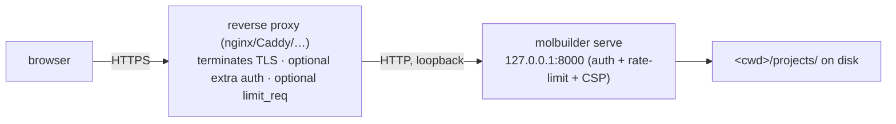

# Deployment — running the molbuilder server

**Role:** guide
**Domain:** ops
**Companions:** [`installation.md`](?doc=ops/installation.md) — getting molbuilder
and its envs onto the host first; [`web-api.md`](?doc=web/web-api.md) — the HTTP
API (its security section defers the full rate-limiter threat model to §4 here);
[`execution/running-a-job.md`](?doc=execution/running-a-job.md) — `molbuilder.json`
also carries the job-execution config.

molbuilder serves its web UI with **`molbuilder serve`**. On a laptop that's the
whole story — it binds loopback, no auth, and you're done. Exposing it to other
people is where the care goes: molbuilder runs its own **single-process
development server**, so anything production-grade (TLS, real auth, per-IP
throttling at scale) is either configured here or handled by a **reverse proxy in
front of it**.

## 1. Running it

```bash
python -m molbuilder serve            # → http://127.0.0.1:8000
```

Flags (`molbuilder/cli.py`):

| Flag | Default | Effect |
|---|---|---|
| `--host` | `127.0.0.1` | bind interface |
| `--port` | `8000` | bind port |
| `--debug` | off | Werkzeug reloader + interactive debugger (never in production) |
| `--cert` / `--key` | none | serve HTTPS directly from PEM files |
| `--allow-insecure-binding` | off | override the bind guard (below) |
| `--no-auth` | off | skip auth entirely — **loopback host only** |

There is **no `--workers` flag and no built-in production server** — `serve`
always runs Flask/Werkzeug's dev server in one process. To run it under gunicorn
or behind nginx, *you* wrap it; molbuilder doesn't spawn workers, and its rate
limiter (§4) is per-process, so multiple workers would each keep their own
counters.

**The bind guard.** molbuilder refuses to bind a **non-loopback** host without
TLS — because doing so serves the whole `projects/` tree (read/write/delete) to
the network. You satisfy it by adding `--cert/--key`, putting it behind a
TLS-terminating proxy (and binding loopback), or knowingly passing
`--allow-insecure-binding`.

> **⚠ TLS is not authentication.** The bind guard checks only *host + TLS* — it
> **never checks whether auth is on**. And auth is **opt-in** (§3): with no `auth`
> section in `molbuilder.json`, the server runs with **no authentication at all**.
> So `molbuilder serve --host 0.0.0.0 --cert … --key …` passes the guard yet
> exposes a **public, unauthenticated, fully read/write/delete `projects/` tree** —
> TLS only encrypts the wire. (The guard's own message says so: *"still no
> auth!"*.) A real public deployment must **turn auth on** (§3) **or** sit behind a
> proxy that authenticates (§2); `--cert/--key` alone is defense-in-depth, not
> access control.

## 2. The production shape



The recommended production setup is a **reverse proxy terminating TLS** in front
of `molbuilder serve` bound to loopback. molbuilder supports this: set
`auth.trust_proxy` so it installs `ProxyFix` (trusts one hop of
`X-Forwarded-For`/`-Proto`), and it only emits **HSTS** once the request actually
arrived over HTTPS. Direct TLS (`--cert/--key`) also works for simpler setups.

## 3. Auth — opt-in single-sign-on

Auth is **off by default** (the localhost single-user shape needs none). Turn it
on by adding an `auth` section to `molbuilder.json` — and note **molbuilder holds
no passwords**. Identity is delegated to an external provider (Google, GitHub,
Microsoft, ORCID via OAuth/OIDC, or Apereo CAS); molbuilder only checks the
returned email against your `allowed_users` allowlist. The login page is a row of
provider buttons, not a username/password form.

With auth on:

- an **unauthenticated browser** request → `302` redirect to `/login`; an
  unauthenticated **`/api/*`** request → a clean `401 {ok:false, login_url}` JSON.
- **exempt** (always reachable): the login/callback/logout routes, the health
  probe (`/api/health`), static assets, and the Plotly vendor script.
- the **session-signing key** comes from a `secret_key_file` path you configure
  (auto-generated `0600` on first run *if the path is set*; without it, the key is
  ephemeral per process and you get a warning). Session cookies are
  `Secure` + `HttpOnly` + `SameSite=Lax`.

`--no-auth` bypasses all of this and is refused on any non-loopback host.

## 4. Security posture

Set on every response (via a header hook, using `setdefault` so a proxy can
override):

- **Content-Security-Policy** — `default-src 'self'`; **`script-src 'self'`**
  (no inline JS — a hard rule, enforced by a test); `style-src 'self'
  'unsafe-inline'` (the 3D viewers need inline style); `img-src 'self' data:`
  (Plotly); `object-src 'none'`; `frame-ancestors 'none'`; `base-uri`/`form-action`
  `'self'`.
- `X-Content-Type-Options: nosniff`, `X-Frame-Options: DENY`,
  `Referrer-Policy: same-origin`, and **HSTS only when served over HTTPS**.
- a **50 MB request cap** — over it, a JSON `413`, not Flask's HTML default.
- **no CSRF token layer**: cross-site request forgery is defended by
  **`SameSite=Lax` cookies** (a third-party page can't ride your session on a
  state-changing request) plus `form-action 'self'`; no CORS headers are emitted
  (same-origin only). (`connect-src 'self'` limits where *molbuilder's own* pages
  may connect out — it isn't the CSRF defense.)

### The rate limiter (the threat model `web-api.md` defers here)

An **always-on, per-IP, in-process** limiter runs before every request. It blocks
an IP for a **cooldown (default 1 hour)** on any of **three signals**:

1. **Attack-string signature** — an immediate block. The path+query is
   URL-decoded first (so `%3Cscript%3E` can't sneak through) and matched against
   patterns for XSS (`<script`, `<meta http-equiv`, `document.cookie`), SQLi
   (`union select`, `; drop table`), and path traversal (`/etc/passwd`,
   `../../../`). This signal is on even when the count-based ones are off.
2. **404-storm** — `threshold_404` (default **20**) *or more* 4xx responses within
   `window_404_s` (default **30 s**): a scanner walking for files.
3. **Total-burst** — `threshold_total` requests in `window_total_s`. **Disabled by
   default** (`threshold_total = 0`) — a 60/60 s cap once throttled the app's own
   1 Hz system-load poll, so it's opt-in.

A blocked request gets an empty **`429`** with `Connection: close` and
`Retry-After`. **Logged-in sessions and allowlisted IPs (loopback by default)
bypass the limiter entirely.** State is in memory only — it clears on restart, and
is per-process (another reason not to fan out to many workers).

Two admin routes let an operator inspect and clear blocks:

- `GET /api/admin/rate_limit/status` → `{enabled, blocked:[{ip,reason,ttl_s}], …}`
- `POST /api/admin/rate_limit/clear` with `{"ip":"…"}` or `{"all":true}`

Both require a logged-in **admin** (any authenticated user if `admin_emails` is
empty; otherwise the session email must be listed).

> **Gotcha:** the admin API needs **auth on**. Without an `auth` section (or under
> `--no-auth`) there's no session key, so those two routes always answer `403`.
> On the default localhost/no-auth shape that's fine — loopback is allowlisted and
> can never be blocked — but if you want to *use* the admin API, enable auth. (Recorded follow-up.)

## 5. Configuration — `molbuilder.json`

All server config lives in **`molbuilder.json` in the directory you launch from**
(and *only* there — a copy under `~/.config/molbuilder/` is **not** read by the
running server; that's an easy trap, recorded as a follow-up). A malformed file
refuses to start rather than silently misconfiguring.

| Key | Controls |
|---|---|
| `tls: {cert, key}` | HTTPS (CLI `--cert/--key` overrides) |
| `auth: {providers:[…]}` | enable SSO login (§3) |
| `auth.trust_proxy` | install `ProxyFix` for a reverse proxy |
| `secret_key_file` | path to the session-signing key |
| `rate_limit: {…}` | tune the limiter (§4 defaults) |
| `envs: {siesta, pyscf, …}` | the conda-env names for the backends |

There are **no server environment-variable knobs** — in particular
`MOLBUILDER_LOG` appears in a code comment but is *not* wired, so don't rely on it.

Two ready-made files ship beside this doc, in `ops/examples/`:

| File | What it is |
|---|---|
| `molbuilder.json.example` | The full template — every supported section, each annotated with inline `_comment_*` keys. Copy it to your launch directory and edit. |
| `molbuilder.asu-sol.json` | A real site preset (ASU Sol: SLURM `public` partition, A100 GPUs). The shape a working HPC config takes. Pinned by `tests/test_scheduler_config.py` so it stays valid against the live reader. |

```bash
cp docs/ops/examples/molbuilder.json.example molbuilder.json
```

## 6. What's on disk at runtime

A running server keeps your work under **`<launch-cwd>/projects/`** (the whole
project/topic/structure/job tree). Config and secrets live in `molbuilder.json`
(cwd) and `~/.config/molbuilder/` (`0600`). The rate-limiter's blocklist is memory
only. The server assumes a **writable working directory** and makes no
shared-filesystem assumptions.

## 7. Test map

- `test_rate_limit.py` — the full limiter contract (each signal, TTL expiry,
  allowlist, XFF trust, the admin routes + role gate, the authenticated bypass).
- `test_auth_config.py` — `molbuilder.json` auth validation + the session-cookie
  security flags.
- `test_cli_tls.py` — the TLS precedence (CLI > json), the bind/HTTPS behaviour.
- `test_cli.py` — `--no-auth` refuses a non-loopback host.
- `test_no_inline_scripts.py` — the CSP `script-src 'self'` invariant (no inline
  `<script>` in any template).
