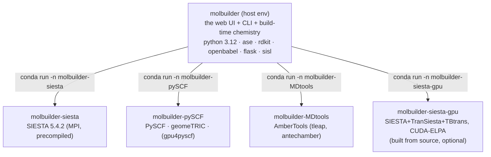

# Installation — molbuilder and its science backends

**Role:** guide
**Domain:** ops
**Companions:** [`deployment.md`](?doc=ops/deployment.md) — running the server once
it's installed; [`execution/overview.md`](?doc=execution/overview.md) — the job
system that dispatches into these envs; [`engines/siesta.md`](?doc=engines/siesta.md)
— the SIESTA engine (incl. the GPU *eigensolver setting*, as opposed to the GPU
*build* here).

molbuilder itself is a light Python app, but the calculations it drives —
SIESTA, PySCF, AmberTools, and friends — have **mutually incompatible dependency
pins** (you cannot solve AmberTools, gpu4pyscf, and a real-MPI SIESTA into one
conda environment). So molbuilder installs each backend into **its own conda
environment** and dispatches to it with `conda run -n <env>`. Installation is
mostly about creating those environments — and one command does it.

## 1. The environment model

There is **one host environment you live in** (`molbuilder`) plus **one
environment per backend family**. molbuilder runs in the host env and shells out
to a backend env whenever a job needs it.



Each environment is defined by a **recipe** — a frozen data record in
`molbuilder/envs/recipes.py` listing its channels, conda packages, pip packages,
and (for the GPU env) a from-source build plan. That registry is the single source
of truth; the `molbuilder envs` command reads it.

## 2. Installing — one command

**Prerequisite:** a working **conda or mamba** on the host (molbuilder does *not*
install conda for you). Linux / x86-64 is assumed.

From a clone of the repo:

```bash
bash scripts/install-env.sh bootstrap --yes
```

That script is a small **bootstrap shim** whose only job is the chicken-and-egg
problem — you can't run `molbuilder envs` until the host env exists. It: finds
conda/mamba, creates the **host `molbuilder`** env from an inlined package list,
then hands off to `python -m molbuilder envs bootstrap`, which creates the
**conda-only backend envs** (siesta, pySCF, MDtools) and runs a health check
(`doctor`). Add `--include-source-builds` to also build the GPU SIESTA env (§6).

`doctor` verifies the installed backends; its checks include `siesta`, the
`pyscf` import probe, and AmberTools `LEaP`.

Then you're ready:

```bash
conda activate molbuilder
python -m molbuilder serve      # the web UI on 127.0.0.1:8000
```

> **molbuilder is run with `python -m molbuilder`, not pip-installed** into the host
> env — the shim puts the repo on `PYTHONPATH`. (A `molbuilder` console-script
> entry point exists in `pyproject.toml`, but the supported form is `python -m`.)

Once the host env exists, **`molbuilder envs` is the same surface** the shim used —
`list`, `install <name>`, `bootstrap`, `doctor`, `validate`, `clean`, `repair`,
`advise`.

## 3. What lives where — the backends

| Backend | Environment | How it's installed |
|---|---|---|
| **SIESTA (CPU)** | `molbuilder-siesta` | conda `siesta=5.4.2=mpi_openmpi_*` — the MPI build string is load-bearing (a `nompi_*` build silently runs serial) |
| **SIESTA (GPU)** | `molbuilder-siesta-gpu` | **built from source** (§6), not a conda package |
| **PySCF, geomeTRIC** | `molbuilder-pySCF` | conda (`pyscf`, `pyscf-dispersion`, `geometric`) + pip (`pyscf-properties`) |
| **gpu4pyscf / cupy** | `molbuilder-pySCF` | pip `cupy-cuda<N>x[ctk]` + `gpu4pyscf-cuda<N>x` — the `<N>` wheel suffix is **derived from the host's CUDA version** (`cuda13x` by default, `cuda12x` on a CUDA-12 host), not hardcoded — optional, GPU only |
| **AmberTools** (tleap) | `molbuilder-MDtools` | conda `dacase::ambertools-dac=26` |
| **RDKit, OpenBabel, ASE, sisl, biopython** | host `molbuilder` | conda |
| **PeptideBuilder, pubchempy** | host | pip |
| **pyberny** | `molbuilder-pySCF` | **manual / optional** — unmaintained; the conda recipe omits it |
| **X3DNA (3DNA)** | host-external | **manual** — restricted licence; you extract it and export `X3DNA` + `PATH` yourself |

The **isolation rule** is the whole point: a backend never contaminates the host
or another backend, so each can pin exactly what it needs.

## 4. The `molbuilder` command

After install, `python -m molbuilder <cmd>` gives you the CLI. The top-level
commands include `serve` (the web UI), `run` (emit a run wrapper), `envs`
(this doc), `pseudo`, `bench`, `jobset`, `transport`, the structure builders
(`smiles`/`name`/`dna`/`rna`/`peptide`), and the converters (`fdf`, `pyscf`).
Each has its own home — see [`execution/`](?doc=execution/overview.md) for the
run/job commands.

## 5. A worked example

You have miniforge on a Linux workstation, and you clone the repo:

```bash
git clone <repo> && cd molbuilder
bash scripts/install-env.sh bootstrap --yes
# → creates molbuilder, molbuilder-siesta, molbuilder-pySCF, molbuilder-MDtools
#   then runs `molbuilder envs doctor`
conda activate molbuilder
python -m molbuilder envs list      # confirm the four envs are healthy
python -m molbuilder serve          # open http://127.0.0.1:8000
```

A SIESTA job you launch from the UI now runs via `conda run -n molbuilder-siesta`;
a PySCF spectrum via `conda run -n molbuilder-pySCF` — you never activate those
yourself.

## 6. Appendix — building the GPU SIESTA (optional)

The `molbuilder-siesta-gpu` env is the only one **compiled from source**, because
a CUDA-accelerated SIESTA (with the ELPA GPU eigensolver, TranSiesta, and TBtrans)
isn't available as a conda package. `molbuilder envs install siesta-gpu`
(or `bootstrap --include-source-builds`) automates the whole thing:

- the **toolchain comes from conda** — gcc/gfortran **14.3** (a deliberate
  minor-version pin, § 6.1) with its linker, archiver,
  C-library sysroot and kernel headers, plus cmake, ninja, OpenMPI, OpenBLAS
  (not MKL), ScaLAPACK, libxc, `readline`, and the **CUDA toolkit itself** (you
  do *not* install CUDA on the host). No host compiler should be required:
  conda-forge installs the toolchain under target-prefixed names only
  (`x86_64-conda-linux-gnu-gcc`) and ships no bare `gcc`, so an install step
  creates bare-name links in the env for the third-party Makefiles this build
  compiles. Without them, flook's bundled lua — which hardcodes `CC= gcc` —
  picks up `/usr/bin/gcc` on a machine that has one (mixing a host-compiled
  object into a conda-compiled SIESTA) and fails outright on a machine that
  does not. The shim step's own exit code is the gate on a fresh install; the
  `verify` step additionally **warns** when a bare `gcc` resolves outside the
  env, which is what you see on an env built before this existed — re-run
  `molbuilder envs install siesta-gpu` to pick the links up. It warns rather
  than fails because such an env still builds and runs SIESTA; the risk is
  latent, not present. Pointing bare `gcc` at the conda toolchain exposes a
  second half of the same problem: that compiler's header search covers its own
  directories and the sysroot, **not** `$CONDA_PREFIX/include`, and lua's
  Makefile *assigns* `CFLAGS` rather than appending, so conda's
  `-isystem <env>/include` never reaches it. The build step therefore exports
  `C_INCLUDE_PATH` and `LIBRARY_PATH` — read by gcc itself, so no Makefile can
  override them — which is how the bundled lua finds `<readline/readline.h>`
  on a machine with no `libreadline-dev`;
- **ELPA** is built from a version-pinned, SHA256-checked tarball
  (`2024.05.001`) with autotools (`--enable-nvidia-gpu`, `--with-cuda-path=<env>`);
- **SIESTA** (`5.4.2`) is cloned with submodules and built with cmake+Ninja, MPI +
  TranSiesta + ELPA + libxc + NetCDF all on. Its ELSI and the four ESL libraries
  are SIESTA's own submodules — compiled in place, not separate steps.

The build is resumable (sentinels + a toolchain fingerprint) and needs ~30 GB of
free space under the env prefix. An **NVIDIA driver is optional** — the binary
builds and runs CPU-only without a GPU; you only need `nvidia-smi` to actually use
the GPU at run time.

### 6.1 Toolchain version — why 14.3, and how to change it

The compiler is pinned to a **minor** version, `gcc/gxx/gfortran_linux-64=14.3`.
`14` would not be a pin: conda reads it as `14.*`, so two machines installing the
same recipe weeks apart can resolve to different compilers and only one of them
builds.

That is not hypothetical. **gcc 14.4's gfortran miscompiles SIESTA's
`Src/kpoint_t.F90`** and the build dies at the link step:

```
undefined reference to `process_k_cell_'
```

`process_k_cell` is an *optional dummy procedure* argument of `kpoint_read`,
host-associated into an internal subprogram and called under `present()`. 14.4
emits a direct call to a global `process_k_cell_` instead of an indirect call
through the argument. No library exports that symbol, so **no linker flag can
fix it** — the fault is in code generation and the link is only where it shows.
14.3.0 compiles the same file correctly.

Only targets that link `libsiesta.a` fail (`siesta` itself and the
SiestaSubroutine drivers); the `Util/` binaries link fine, because the linker
never extracts the bad archive member. A build that gets to ~4650/4719 and then
fails on `Src/siesta` is this.

> **Do not apply the source patch that circulates for this.** It comments out
> both `if (present(process_k_cell)) call process_k_cell(...)` blocks and calls
> the callback safe to skip. It is not: that callback forces **exactly one
> k-point along the transport direction**, which is physically required in
> TranSiesta/NEGF because that direction is a semi-infinite open boundary, not a
> periodic one. Remove it and a transport run asking for a 4×4×4 grid silently
> uses 4 k-points along transport. Since we build with TranSiesta on, the patch
> trades a loud build failure for a quiet wrong answer.

**To choose a different compiler** — for the CUDA pairing below, or if 14.3 is
ever unavailable:

```bash
bash scripts/install-env.sh install molbuilder-siesta-gpu --gcc 13 --yes
MOLBUILDER_GCC=13 molbuilder envs install siesta-gpu     # equivalent
```

`--gcc` is handled by the shim itself rather than forwarded, because the recipe
reads `MOLBUILDER_GCC` when it is imported — a Python-side option would arrive
too late. It takes a plain version (`14`, `14.3`, `14.3.0`); for a wildcard, set
`MOLBUILDER_GCC='14.*'` directly. On the Python entry point, export the variable
before the command.

CUDA constrains the choice independently: **CUDA 12.0–12.7 wants gcc ≤ 13** and
**CUDA 11.x wants gcc ≤ 11**. The installer checks this pairing and fails fast
with the value to use.

**A version change only affects a fresh solve.** An env that already exists keeps
the compiler it was built with, so re-running `install` on a machine that already
has the bad toolchain changes nothing. Use `--clean`, which wipes the conda env
(`conda env remove -n <name> -y`) *and* the artifact directory, then installs
fresh:

```bash
bash scripts/install-env.sh install molbuilder-siesta-gpu --clean --yes
```

There is no `envs remove` subcommand — `install --clean` is the one door, so the
wipe and the reinstall cannot get out of step.

**One environment fix worth knowing:** on NFS-mounted homes, OpenMPI's
shared-memory files can land on the network and slow every `mpirun`. The GPU env's
activate hook sets `OMPI_MCA_orte_tmpdir_base` to a local tmp (only if you haven't
set it yourself), and the deactivate hook unsets only what it set — so a
scheduler-provided value is never trampled.

## 7. Appendix — installing X3DNA (3DNA), the helix builder

X3DNA is the only true-helix nucleic-acid backend
([`engines/builders.md`](?doc=engines/builders.md)). It is **licence-gated**
(non-commercial, registration at x3dna.org), so molbuilder never downloads it —
you unpack it, and molbuilder finds it.

**How molbuilder finds it — three steps, in order** (`builders/backends/_threedna.py`):

1. an `x3dna*/` directory at the **repo root** (a version-agnostic glob),
2. the **`$X3DNA`** environment variable, if it points at a complete install,
3. **`fiber` on `PATH`**, deriving the root from its parent directory.

Pick whichever install shape matches how you work — you never need more than one.

**Option A — in-tree** (simplest for a dev checkout). Unpack at the repo root and
step 1 finds it: no shell config, no environment variable.

```bash
cd /path/to/molbuilder            # the repo root, alongside pyproject.toml
tar -xzf x3dna-v2.4-<platform>.tar.gz
ls x3dna-v2.4/bin/fiber           # smoke check
python -c "from molbuilder.builders.backends import available_backends; print(available_backends())"
# expect: {'threedna': True, ...}
```

`x3dna*/` and `x3dna-*.tar.gz` are **gitignored** — hygiene, and it makes it
structurally hard to commit a licence-restricted archive into a public repo.

**Option B — system install with `$X3DNA`** (what 3DNA's own docs describe):

```bash
tar -xzf x3dna-v2.4-<platform>.tar.gz -C ~/opt
export X3DNA=$HOME/opt/x3dna-v2.4
export PATH=$X3DNA/bin:$PATH
fiber -seq=ATCG /tmp/probe.pdb && head /tmp/probe.pdb
```

3DNA's helper scripts *require* `$X3DNA`; molbuilder injects it into the
subprocess environment itself when it shells out, so you only need it exported in
your own shell to run 3DNA tools directly.

### Windows — use WSL2

3DNA ships **no native-Windows build**; the Linux tarball runs only under WSL or
Cygwin. WSL2 (Ubuntu) is the recommended path. From a WSL shell — Windows drives
appear under `/mnt/<letter>/`:

```bash
mkdir -p ~/opt
tar -xzf /mnt/c/path/to/molbuilder/x3dna-v2.4-linux-64bit.tar.gz -C ~/opt
echo 'export X3DNA=$HOME/opt/x3dna-v2.4' >> ~/.bashrc
echo 'export PATH=$X3DNA/bin:$PATH'      >> ~/.bashrc
source ~/.bashrc
fiber -seq=ATCGATCG /tmp/probe.pdb && head -5 /tmp/probe.pdb
```

Then **run molbuilder from inside WSL** — only the WSL Python sees `fiber` and
`$X3DNA`. Windows Python is fine for everything that doesn't need 3DNA
(`smiles`, `peptide`, `fdf`, …); asking it for `--backend threedna` just fails
the availability check with a clear `BackendUnavailable`. Files cross freely
either way (Windows reaches WSL files at `\\wsl$\Ubuntu\home\<user>\…`), so a
`.fdf` generated in WSL is editable from Windows tools.

*Cygwin / MSYS2 also work* — same tarball, the same two exports in the Cygwin
`~/.bashrc`, path translation handled for you. Less common than WSL2 now.

## 8. Notes for locked-down clusters

The Python layer (`molbuilder envs …`) works with **conda, mamba, or micromamba**.
The one exception is the initial `scripts/install-env.sh bootstrap` shim, which
creates the host env before any Python is available and currently probes only
**conda / mamba** — a micromamba-only host can't run `bootstrap` today (a recorded
follow-up). Workaround: create the host env by hand with micromamba, then use
`python -m molbuilder envs …` for the rest.

## 9. Test map

- `test_envs_recipes.py` — the recipe registry shape (≥5 recipes, required fields,
  the category↔env-name mapping, CUDA-wheel-tag derivation).
- `test_envs_siesta_gpu_recipe.py` — the whole GPU build recipe (ELPA-tarball +
  SIESTA-cmake, the toolchain pins, the argv templates).
- `test_envs_nfs_shmem_fix.py` — the NFS shared-memory hook + the host psutil floor.
- `test_envs_clean.py` — `molbuilder envs clean` (build dirs go, load-bearing dirs stay).
- `test_envs_readme_consistency.py` — a drift guard tying the recipes to the install guide.
