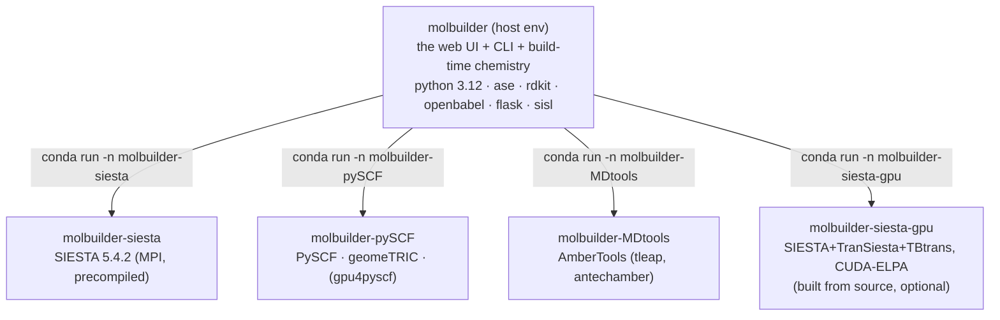

# Installation — molbuilder and its science backends

**Role:** guide
**Domain:** ops
**Companions:** [`deployment.md`](?doc=ops/deployment.md) — running the server once
it's installed; [`execution/overview.md`](?doc=execution/overview.md) — the job
system that dispatches into these envs; [`engines/siesta.md`](?doc=engines/siesta.md)
— the SIESTA engine (incl. the GPU *eigensolver setting*, as opposed to the GPU
*build* here).

molbuilder itself is a light Python app, but the calculations it drives —
SIESTA, PySCF, AmberTools, and friends — have **mutually incompatible dependency
pins** (you cannot solve AmberTools, gpu4pyscf, and a real-MPI SIESTA into one
conda environment). So molbuilder installs each backend into **its own conda
environment** and dispatches to it with `conda run -n <env>`. Installation is
mostly about creating those environments — and one command does it.

## 1. The environment model

There is **one host environment you live in** (`molbuilder`) plus **one
environment per backend family**. molbuilder runs in the host env and shells out
to a backend env whenever a job needs it.



Each environment is defined by a **recipe** — a frozen data record in
`molbuilder/envs/recipes.py` listing its channels, conda packages, pip packages,
and (for the GPU env) a from-source build plan. That registry is the single source
of truth; the `molbuilder envs` command reads it.

## 2. Installing — one command

**Prerequisite:** a working **conda or mamba** on the host (molbuilder does *not*
install conda for you). Linux / x86-64 is assumed.

From a clone of the repo:

```bash
bash scripts/install-env.sh bootstrap --yes
```

That script is a small **bootstrap shim** whose only job is the chicken-and-egg
problem — you can't run `molbuilder envs` until the host env exists. It: finds
conda/mamba, creates the **host `molbuilder`** env from an inlined package list,
then hands off to `python -m molbuilder envs bootstrap`, which creates the
**conda-only backend envs** (siesta, pySCF, MDtools) and runs a health check
(`doctor`). Add `--include-source-builds` to also build the GPU SIESTA env (§6).

Then you're ready:

```bash
conda activate molbuilder
python -m molbuilder serve      # the web UI on 127.0.0.1:8000
```

> **molbuilder is run with `python -m molbuilder`, not pip-installed** into the host
> env — the shim puts the repo on `PYTHONPATH`. (A `molbuilder` console-script
> entry point exists in `pyproject.toml`, but the supported form is `python -m`.)

Once the host env exists, **`molbuilder envs` is the same surface** the shim used —
`list`, `install <name>`, `bootstrap`, `doctor`, `validate`, `clean`, `repair`,
`advise`.

## 3. What lives where — the backends

| Backend | Environment | How it's installed |
|---|---|---|
| **SIESTA (CPU)** | `molbuilder-siesta` | conda `siesta=5.4.2=mpi_openmpi_*` — the MPI build string is load-bearing (a `nompi_*` build silently runs serial) |
| **SIESTA (GPU)** | `molbuilder-siesta-gpu` | **built from source** (§6), not a conda package |
| **PySCF, geomeTRIC** | `molbuilder-pySCF` | conda (`pyscf`, `pyscf-dispersion`, `geometric`) + pip (`pyscf-properties`) |
| **gpu4pyscf / cupy** | `molbuilder-pySCF` | pip `cupy-cuda<N>x[ctk]` + `gpu4pyscf-cuda<N>x` — the `<N>` wheel suffix is **derived from the host's CUDA version** (`cuda13x` by default, `cuda12x` on a CUDA-12 host), not hardcoded — optional, GPU only |
| **AmberTools** (tleap) | `molbuilder-MDtools` | conda `dacase::ambertools-dac=26` |
| **RDKit, OpenBabel, ASE, sisl, biopython** | host `molbuilder` | conda |
| **PeptideBuilder, pubchempy** | host | pip |
| **pyberny** | `molbuilder-pySCF` | **manual / optional** — unmaintained; the conda recipe omits it |
| **X3DNA (3DNA)** | host-external | **manual** — restricted licence; you extract it and export `X3DNA` + `PATH` yourself |

The **isolation rule** is the whole point: a backend never contaminates the host
or another backend, so each can pin exactly what it needs.

## 4. The `molbuilder` command

After install, `python -m molbuilder <cmd>` gives you the CLI. The top-level
commands include `serve` (the web UI), `run` (emit a run wrapper), `envs`
(this doc), `pseudo`, `bench`, `jobset`, `transport`, the structure builders
(`smiles`/`name`/`dna`/`rna`/`peptide`), and the converters (`fdf`, `pyscf`).
Each has its own home — see [`execution/`](?doc=execution/overview.md) for the
run/job commands.

## 5. A worked example

You have miniforge on a Linux workstation, and you clone the repo:

```bash
git clone <repo> && cd molbuilder
bash scripts/install-env.sh bootstrap --yes
# → creates molbuilder, molbuilder-siesta, molbuilder-pySCF, molbuilder-MDtools
#   then runs `molbuilder envs doctor`
conda activate molbuilder
python -m molbuilder envs list      # confirm the four envs are healthy
python -m molbuilder serve          # open http://127.0.0.1:8000
```

A SIESTA job you launch from the UI now runs via `conda run -n molbuilder-siesta`;
a PySCF spectrum via `conda run -n molbuilder-pySCF` — you never activate those
yourself.

## 6. Appendix — building the GPU SIESTA (optional)

The `molbuilder-siesta-gpu` env is the only one **compiled from source**, because
a CUDA-accelerated SIESTA (with the ELPA GPU eigensolver, TranSiesta, and TBtrans)
isn't available as a conda package. `molbuilder envs install siesta-gpu`
(or `bootstrap --include-source-builds`) automates the whole thing:

- the **toolchain comes from conda** — gcc/gfortran 14, cmake, ninja, OpenMPI,
  OpenBLAS (not MKL), ScaLAPACK, libxc, and the **CUDA toolkit itself** (you do
  *not* install CUDA on the host);
- **ELPA** is built from a version-pinned, SHA256-checked tarball
  (`2024.05.001`) with autotools (`--enable-nvidia-gpu`, `--with-cuda-path=<env>`);
- **SIESTA** (`5.4.2`) is cloned with submodules and built with cmake+Ninja, MPI +
  TranSiesta + ELPA + libxc + NetCDF all on. Its ELSI and the four ESL libraries
  are SIESTA's own submodules — compiled in place, not separate steps.

The build is resumable (sentinels + a toolchain fingerprint) and needs ~30 GB of
free space under the env prefix. An **NVIDIA driver is optional** — the binary
builds and runs CPU-only without a GPU; you only need `nvidia-smi` to actually use
the GPU at run time.

**One environment fix worth knowing:** on NFS-mounted homes, OpenMPI's
shared-memory files can land on the network and slow every `mpirun`. The GPU env's
activate hook sets `OMPI_MCA_orte_tmpdir_base` to a local tmp (only if you haven't
set it yourself), and the deactivate hook unsets only what it set — so a
scheduler-provided value is never trampled.

## 7. Notes for locked-down clusters

The Python layer (`molbuilder envs …`) works with **conda, mamba, or micromamba**.
The one exception is the initial `scripts/install-env.sh bootstrap` shim, which
creates the host env before any Python is available and currently probes only
**conda / mamba** — a micromamba-only host can't run `bootstrap` today (a recorded
follow-up). Workaround: create the host env by hand with micromamba, then use
`python -m molbuilder envs …` for the rest.

## 8. Test map

- `test_envs_recipes.py` — the recipe registry shape (≥5 recipes, required fields,
  the category↔env-name mapping, CUDA-wheel-tag derivation).
- `test_envs_siesta_gpu_recipe.py` — the whole GPU build recipe (ELPA-tarball +
  SIESTA-cmake, the toolchain pins, the argv templates).
- `test_envs_nfs_shmem_fix.py` — the NFS shared-memory hook + the host psutil floor.
- `test_envs_clean.py` — `molbuilder envs clean` (build dirs go, load-bearing dirs stay).
- `test_envs_readme_consistency.py` — a drift guard tying the recipes to the install guide.
