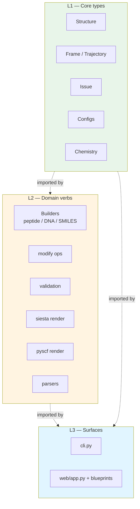

# Package layout

> **This document is the sole source of truth for molbuilder's
> on-disk package structure** — the L1/L2/L3 split, the import
> stability promises (re-export shims), and the per-folder
> responsibility map.  Pointer in `design.md` § 0.
>
> Architecture rationale (why three layers, what flows between
> them) lives in `design.md` § Architecture.  This doc is the
> *shape*; architecture.md is the *invariants*.

---

## 1. Goal

Make the directory tree match the three-layer architecture so any
new contributor knows where new code lands without asking.  Each
folder owns one responsibility; cross-folder dependencies follow
the L1 → L2 → L3 import direction.



**Layering invariant**: L2 never imports from L3.  L1 never imports
from L2 or L3.  Tests for this live in `tests/test_layering.py`.

---

## 2. Folder map

```
molbuilder/
  # ----- L1: core types -----
  __init__.py              # public API: re-exports L1 types + key L2 verbs
  structure.py             # Structure dataclass + readers / writers
  frame.py                 # Frame + Trajectory dataclasses
  issues.py                # Issue(severity, message, where) + ValidationError
  config/
    __init__.py            # re-exports SiestaConfig, PySCFConfig
    siesta.py              # SiestaConfig
    pyscf.py               # PySCFConfig
    spectra.py             # SpectraConfig
    transport.py           # TransportConfig (Phase B.2 abstraction)
  chemistry.py             # element table, masses, valences, H placement
  residues.py              # PDB residue templates + 1-letter parser
  trajectory_log/
    __init__.py
    format.py              # write_initial_preview, molwatch_log_basename
    emitter.py             # MolwatchEmitter (inlined into generated PySCF scripts)

  # ----- L2: domain verbs -----
  peptide.py               # build_peptide
  nucleic.py               # build_dna / build_rna
  smiles.py                # build_from_smiles
  pubchem.py               # build_from_name
  modify.py                # delete / add_atom / orient / rotate / electrode ops
  validation.py            # validate(struct, cfg) -> List[Issue]
  builders/
    backends/
      __init__.py          # is_available(), dispatch()
      _amber.py            # tleap-driven extended chain
      _rdkit.py            # ETKDG embedded conformer
      _threedna.py         # canonical B/A/Z-form helix via fiber
      _common.py
  backends/                # back-compat shim -> builders/backends
  siesta/
    __init__.py            # re-exports SiestaConfig, render_fdf, convert
    input.py               # render_fdf / convert / FDF body builders
    makov_payne.py         # finite-size charge correction emitter
  pyscf/
    __init__.py            # re-exports PySCFConfig, render_script, convert
    input.py               # render_script / convert / inlined emitter wiring
  spectra/
    __init__.py            # re-exports SpectraConfig, render_script
    engine_base.py         # SpectraEngine Protocol + registry
    pyscf_engine.py        # PySCF spectra engine implementation
    pyscf_script.py        # generated script template
  transport/               # Phase B.2 abstraction (B.3 backends pending)
    __init__.py            # exports TransportEngine, registry, TransportResults
    engine_base.py         # TransportEngine Protocol + registry
    results.py             # TransportResults dataclass
  parsers/
    __init__.py            # PARSERS registry + detect_parser
    base.py                # TrajectoryParser ABC; parse() -> Trajectory
    molwatch_log.py
    siesta.py
    pyscf.py
    molstruct_json.py      # .molstruct.json sidecar parser
  data/
    README.md              # citations for every numeric value below
    fcc_lattice.json       # supported FCC metals (closed list)

  # ----- L3: surfaces -----
  cli.py                   # click-based; add_dataclass_options bridge
  web/
    __init__.py            # create_app
    app.py                 # Flask app + Blueprint registration + 413 handler
    blueprints/
      _shared.py           # body parsing, issue serialisation, type coercion
      build.py             # /api/build/* routes
      modify.py            # /api/modify/* routes
      spectra.py           # /api/spectra/* routes
      files.py             # /api/files/* routes (projects sidebar)
      run.py               # /api/run/* routes (wrapper install)
      watch.py             # /api/watch/* routes (back-compat for trajectory inspector)
    templates/
      _app_header.html     # shared header + tab nav partial
      index.html           # Build tab page (retires in Phase B)
      modify.html          # Modify tab page (renames to structure.html in Phase B)
      spectra.html         # Spectra tab page (renames in Phase A)
      results.html         # Results tab page
    static/
      viewer.js            # Build viewer (retires when Build tab retires)
      style.css
      lib/
        tokens.css         # CSS custom properties (one home for theme tokens)
        tabs.css           # top-of-page nav
        mol-viewer-embed.js # standard embeddable 3D viewer
        mol-style.js       # shared 3Dmol style-spec builder
        mol-format.js      # chemical-formula renderer
        molbuilder-runtime.js  # module init contract (FIRST script in every template)
        projects-sidebar.js    # public projects.* API
        projects/              # api / state / list / forms / preview submodules
        spectra/core.js
        trajectory/core.js
        inspectors/            # registry + per-type inspectors
        selection/             # store + viewer adapter
      modify/{viewer.js, style.css, selection-bootstrap.js}

tests/
  conftest.py
  test_structure.py         test_frame.py         test_chemistry.py
  test_residues.py          test_peptide.py       test_nucleic.py
  test_smiles_and_siesta.py test_pyscf.py
  test_validation.py        test_review_fixes.py
  test_load.py              test_pdb_ter.py
  test_output_correctness.py
  test_layering.py          # enforces L1<-L2<-L3 import direction
  test_makov_payne.py
  test_spectra_*.py
  test_transport.py         test_transport_config.py
  test_molwatch_preview.py  test_molwatch_emitter.py
  test_pubchem.py           test_backends.py
  test_cli.py
  test_modify.py            test_modify_e2e.py
  test_build_e2e.py
  test_mol_viewer_embed_e2e.py
  test_projects_public_surface_js.py
  test_web_files.py
  watch/                    # legacy parser tests
    test_registry.py
    test_molwatch_log_parser.py
    test_siesta_parser.py
    test_pyscf_parser.py

docs/
  design.md                       # master: principles, decisions, § 0 index
  tab-reorganization references at docs/tabs/architecture.md
  README.md                       # quick pointer to design.md § 0
  package-layout.md               # this file
  protocols/                      # cross-cutting interfaces (HTTP/JS/test/on-disk)
    web-api.md                    # HTTP /api/* endpoint reference
    projects-sidebar.md           # sidebar architecture + projects.* API + lock model
    atom-selection.md             # selection store + .molstruct.json sidecar shape
    selection.md                  # Python selection rule grammar
    results-tab.md                # /results dispatch architecture
    runtime-registry.md           # molbuilder-runtime.js (register / whenReady)
    inspector-registry.md         # inspector mount/dispose + pageshow refresh
    embedded-viewer.md            # viewer.embed(host, opts) → handle contract
    playwright-tests.md           # test patterns + anti-patterns
    job-layout.md                 # on-disk basename + -runN.out convention
    cli.md                        # click-based CLI surface
    sidecar-contract.md           # three-stage UI → config → script contract
  types/                          # L1 data-type contracts (shape of values)
    structure.md                  # Structure dataclass + frozen_atoms / regions
    parsers.md                    # parser-plugin output shape (per engine)
    chemistry.md                  # element table + charge/spin helpers
  engines/                        # per-engine emitter specs (what we WRITE)
    siesta.md                     # SIESTA .fdf generator
    pyscf.md                      # PySCF .py generator
    builders.md                   # build-backend contract + tool limitations
  tabs/                           # per-UI-tab specs (subfolders when multi-asset)
    architecture.md               # tab inventory + routes + cross-tab workflow
    build.md                      # /build (retires in Phase B → structure-optimization)
    modify.md                     # /modify (merges into structure in Phase B)
    results.md                    # /results — registry dispatch + file picker
    spectra/                      # /spectra
      spec.md                     #   full spec
      references.bib              #   bibliography
  archive/                        # superseded docs (NOT a source of truth)
    README.md                     # catalogue of what was archived + why
    YYYY-MM-DD-<original-name>.md
  img/                            # README screenshots

tools/
  capture_screenshots.py          # idempotent README screenshot capture
```

---

## 3. Import-stability promises

External imports that callers (downstream scripts, notebooks) may
already use stay valid via re-exports:

| Stable import | Underlying file |
|---|---|
| `from molbuilder.siesta import SiestaConfig, render_fdf, convert` | `molbuilder/siesta/__init__.py` |
| `from molbuilder.pyscf  import PySCFConfig, render_script, convert` | `molbuilder/pyscf/__init__.py` |
| `from molbuilder.molwatch_log import write_initial_preview` | `molbuilder/trajectory_log/__init__.py` (re-export) |
| `from molbuilder.parsers import detect_parser, TrajectoryParser` | `molbuilder/parsers/__init__.py` |
| `from molbuilder.backends import is_available, dispatch` | `molbuilder/backends/__init__.py` (shim → `builders.backends`) |

The new canonical paths (`molbuilder.config.siesta`,
`molbuilder.trajectory_log`) become preferred for new code, but the
older paths are not deprecated — they are part of the public
surface.

---

## 4. Cross-folder dependency rules

Enforced by `tests/test_layering.py`:

| From | May import | May NOT import |
|---|---|---|
| L1 (`structure.py`, `frame.py`, `config/`, `chemistry.py`, `trajectory_log/`) | other L1 modules | anything in L2 or L3 |
| L2 (`peptide.py`, `modify.py`, `siesta/`, `pyscf/`, `validation.py`, `parsers/`, `spectra/`, `transport/`, `builders/`) | L1 | anything in L3 (`cli.py`, `web/`) |
| L3 (`cli.py`, `web/`) | L1, L2 | (nothing forbidden — L3 is the top) |

A new file lands in the layer that matches its import direction.
If your new module needs to import from L3, it IS L3.

---

## 5. New-folder protocol

When adding a new top-level folder (e.g. a new engine subpackage):

1. Decide the layer (L1 / L2 / L3) by import direction.
2. Place under the matching folder; add `__init__.py` with the
   public re-exports.
3. Add a row to `tests/test_layering.py`'s allowed-imports table.
4. Add a spec doc to `docs/engines/` (if it's an engine), or
   to the appropriate `docs/` subfolder.
5. Update the doc index in `design.md` § 0.
6. Update this doc's folder map.

The discipline is the load-bearing reason "where do I put this?"
has a clear answer.
