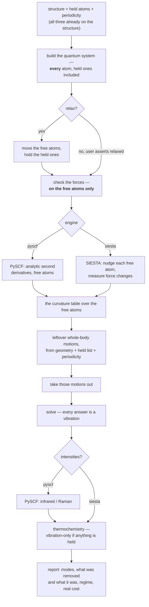

# Vibrations with held atoms — the design

**Role:** design — **Option A chosen** (user, 2026-09-21); the SIESTA half and two smaller questions remain open
**Domain:** science · engines · web
**Started:** 2026-09-21 · **SIESTA half added** 2026-09-21
**The science it rests on:** [`science/normal-modes.md`](?doc=science/normal-modes.md)
(the contract — derivations, rules R1–R8, the measured BDT run)
**Open items:** registered as **V1** in [`plan.md`](?doc=plans/plan.md) § 2
**The follow-up list:** [`2026-09-22-vibration-audit.md`](?doc=plans/2026-09-22-vibration-audit.md)

Written to be read straight through by someone who has not followed the
investigation. Plain words throughout; where a formula is unavoidable it is
spelled out underneath. Nothing here has been built. § 7.5 is the order of work; § 7.6 is what must pass before the deck is touched.

---

## 1. Background — what happened

A user can open the Spectrum tab, tick two sulfur atoms as **frozen**, and ask
for an infrared spectrum. We ran exactly that, end to end through the web
interface, on 1,4-benzenedithiol — a benzene ring with an `–SH` group at each
end, 14 atoms. Twice at the same geometry: once with nothing held, once with the
two sulfurs held.

The held run returned **36 numbers**. Thirty-five were vibrations. The
thirty-sixth was this:

> the whole ring turning, as one rigid body, about the line joining the two
> sulfur atoms.

No bond stretches. No angle bends. The sulfurs sit *on* that line, so holding
them does not stop the turn. It costs no energy. It is not a vibration — and it
was in the spectrum.

We then asked what the codebase *believed*. Three places claim to know how many
such non-vibrations there are. They disagree with each other and all three
disagree with the measurement:

| where | what it says | truth |
|---|---|---|
| the deck that does the physics | *"All 3·N_FREE eigenvalues are physical"* | one of them is a rotation |
| the Methods paragraph generator | 30 modes | 36 produced, 35 real |
| the pre-run advisory | *"2-ish spurious modes"* | exactly 1 |

Three guesses, no source. That is the problem: **a fact about the physical world
with no home.** The same review found the same shape three more times — the
masses, the stationarity check, and the cost claim.

**And there is a second, larger gap.** The Spectrum tab offers exactly one
engine (`choices: ("pyscf",)`). For the project this tool actually serves —
a molecule bridging gold electrodes — that is the wrong engine, for reasons
§ 5 sets out. SIESTA's force-constant machinery appears **nowhere** in the
codebase, although `vibra`, the utility that turns force constants into modes,
is already installed in our SIESTA environment.

---

## 2. The goal

> **One description of what a vibration calculation does — which the free case
> and the held case, and the molecular engine and the periodic engine, all
> follow — so that a fact about the physics is written once and cannot drift.**

After this work:

- every number reported as a vibration **is** a vibration;
- the count is computed **once**, by the code that produced the numbers;
- a free molecule is the held case with nothing held, not a separate recipe;
- an isolated molecule and a periodic slab differ in **one stated input**, not
  in a second recipe;
- what a run costs, and what it approximates, is stated rather than implied.

---

## 3. Scientific foundation, in plain words

### 3.1 Why a free molecule has "3N − 6" vibrations

Give every atom three numbers — its x, y, z. N atoms means 3N numbers, and a
vibration is a pattern of changing them.

Some patterns are not vibrations. **Slide the whole molecule a centimetre to the
left**: nothing has changed, the energy is identical. **Turn the whole molecule
around**: same. Six of these — three slides, three turns — cost no energy, so:

```text
    vibrations  =  3N - 6
```

*(A perfectly straight molecule like CO₂ has five: spinning it about its own
long axis moves no atom at all, so that "turn" is not a motion.)*

In practice a program does not count — it **removes**. It writes the six motions
out explicitly and takes them out before solving. That is what PySCF does today
for every free-molecule run here.

### 3.2 What changes when you hold some atoms still

Hold some atoms, and ask which whole-body motions are still available.

> **Only the ones that leave every held atom exactly where it is.**

That sentence is the whole rule:

| you hold… | can you still slide it? | can you still turn it? | non-vibrations left |
|---|---|---|---|
| nothing | yes, 3 ways | yes, 3 ways | **6** |
| one atom | no — sliding moves it | yes, about that atom | **3** |
| two atoms | no | only about the line joining them | **1** |
| three in a row | no | only about that line | **1** |
| three not in a row | no | no | **0** |

**Our BDT run is row three** — one leftover, measured at −0.93 cm⁻¹ and
**100.0 %** that turning motion while all 35 others are 0.0 %.

**A gold slab is row five.** Freeze hundreds of atoms not in a line and there is
nothing left over. Which is exactly why the literature never discusses this:
everyone writing about held-atom vibrations is freezing a surface or a solvent,
where the answer is zero. Freezing one or two atoms of a molecule is two clicks
in our interface, and nobody wrote that case down.

### 3.3 What changes when the system is periodic — the SIESTA case

This is new, and it is what makes one rule serve both engines.

A periodic calculation — a gold slab repeating sideways forever — does **not**
have the same whole-body symmetries as a molecule:

- **Sliding still works.** Move every atom by the same amount and the crystal is
  the same crystal, shifted. The energy is unchanged. *(These are the three
  "acoustic" modes.)*
- **Turning does not.** The repeating box stays where it is. Rotate the atoms
  inside it and they no longer line up with their neighbours in the next box
  along — a different structure, a different energy.

So:

| the system | whole-body motions that cost nothing |
|---|---|
| isolated molecule | 3 slides + 3 turns = **6** *(5 if straight)* |
| anything periodic | 3 slides = **3** |
| periodic **with any atom held** | **0** — sliding would move the held atom |

**The consequence for the junction work is a happy one.** A slab with its lower
layers frozen is the last row: **nothing** needs removing, and the spurious-mode
problem of § 1 simply does not arise. It is a *molecular* problem. But the rule
has to know which case it is in, and it learns that from the structure's own
periodicity — which molbuilder already records per axis.

### 3.4 Why you cannot just spot the bad mode afterwards

Three versions of "look at the answer and throw away what looks wrong". All
three measured, all three fail:

**"It will have a frequency near zero."** At a converged geometry, ours was
−0.93 cm⁻¹. Run the *same molecule* slightly off-geometry and the same turning
motion comes out at **96.78 cm⁻¹**, among real vibrations. Meanwhile genuine
floppy modes live at a few cm⁻¹ and any threshold catching one throws away the
other.

**"It will stand out by symmetry."** It does not. The mathematics guarantees
*every* mode is independent of every other — as true of a C–H stretch as of the
rotation.

**"It changes no bond lengths."** Real, but it is the *same test in disguise*,
and it degrades identically. The gap between the spurious mode and the nearest
real one:

| | converged geometry | slightly off |
|---|---|---|
| gap | 18× — a threshold works | **1.2× — unusable** |

**So: remove the motion before solving, do not detect it after.** A second,
independent reason: at the off-geometry the turning motion was 96.5 % in one
mode and **3.5 % spread across four others**. Delete the offender and that 3.5 %
stays, contaminating four real vibrations.

### 3.5 And one thing that must **not** be removed

Vester & Olsen (2024) studied a molecule in **frozen solvent** and found modes
that *look like* the molecule sliding and turning as a whole. They warn that
removing all six whole-body motions there is *"invalid"* and *"can adversely
affect other normal modes."*

**They are right, and the rule in § 3.2 already agrees.** Sliding a molecule
against frozen solvent **does** move the frozen atoms relative to it, so it
costs energy — a real, if soft, vibration (on a surface, a *frustrated
translation*, which is measurable). Frozen solvent is "three not in a row", so
the rule removes **nothing**.

The test is never "does this look rigid". It is **"does this leave every held
atom exactly where it is"** — and only then is the energy along it exactly zero.

### 3.6 Four more facts the design has to carry

| | the fact | what goes wrong otherwise |
|---|---|---|
| **held ≠ deleted** | a held atom is still in the quantum calculation; only its *coordinate* is fixed | you compute a different system |
| **where the geometry must be** | forces vanish on the atoms **that can move**; held atoms carry the force of being held, like a nail holding a stretched rubber band | you warn on correct geometries and stay quiet on wrong ones |
| **masses** | real masses (H = 1.008, not 1), modes scaled in atomic mass units | fixed 2026-09-21; had been putting infrared intensities out by **1823×** |
| **what it costs** | holding atoms makes the **second-derivative step** cheaper and the electronic step **no cheaper at all** — a 200-atom gold slab is still a 200-atom quantum problem | users freeze atoms expecting a cheap job and get a full-price one |

---

## 4. What is wrong with today's design

Not the individual mistakes — the shape that produced them.

> **The held-atom case is built as a separate branch beside the normal case.**
> *"If every atom is free, do this … otherwise, do that."* Two recipes writing
> into one results file.

**An analogy.** A kitchen with two written recipes: *soup for four* and *soup for
six*, written at different times by different people. Someone improves the
four-person one — better salt, a note about simmering — and nobody carries it
across. Eventually the six-person soup is under-salted and nobody notices,
because nobody cooks them side by side.

The two branches drifted in **four** independent ways, every one invisible in an
ordinary free-molecule run:

| what drifted | free branch | held branch |
|---|---|---|
| the mass table | real masses | whole numbers — 15 cm⁻¹ error, intensities 1823× out |
| whole-body motion | removes 6 | removes none, and says they don't exist |
| the mode count in the write-up | right by luck | wrong by 6 |
| the stationarity check | correct | asks about the wrong atoms |

The right shape is the other way round:

> **The free molecule is the special case** — the one where the held list is
> empty. And **the isolated molecule is the special case** of the periodic one,
> where the box is absent. Nothing in § 3 says "if nothing is held, do something
> different", or "if it is periodic, use a different recipe".

---

## 5. Two engines, and what each is for

### 5.1 The division

| | **PySCF** | **SIESTA** |
|---|---|---|
| what it suits | isolated molecules, small clusters | periodic slabs, surfaces, junctions |
| how it gets the curvature | analytic second derivatives | nudge an atom, measure the force change |
| frequencies + mode shapes | yes | yes, via the `vibra` utility |
| infrared / Raman strengths | yes | **not offered** — see § 5.3 |
| basis | Gaussian functions | numerical atomic orbitals |
| a gold electrode | must be faked as a finite cluster | its natural home |
| lands in | `spectrum/` | `frequency/` |

**That last row is not a new invention.** The project's own directory layout has
said this since it was written: `frequency/` is described as *"Vibrational
frequency calculations (Hessian + harmonic thermochemistry) … to confirm minima
… and compute ZPE / U / H / G / S"*, and `spectrum/` as *"Vibrational
spectroscopy runs (Raman, IR)"*. The split the user is asking for is the split
the tool already believes in. Only the code never caught up.

### 5.2 Why SIESTA for the junction — the real argument

It is not that SIESTA is better. It is **consistency of the potential-energy
surface**.

A junction study is a chain: relax the geometry → find the vibrations → displace
along a vibration → compute transport. If the middle step is done by a different
program, it is done on a *different surface*: different pseudopotentials, a
different basis, possibly a finite cluster standing in for an infinite slab.
The mode you then displace along is not a mode of the system you compute
transport through.

Keeping it in SIESTA means the same pseudopotentials, the same numerical atomic
orbitals, the same functional, the same slab, the same k-point sampling —
relaxation, vibration and transport all on one surface.

**And the modes come out different, in the way that matters.** A mode of an
isolated BDT molecule is a mode of BDT. A mode of BDT-on-gold includes the
gold–sulfur interface stretching:

```text
      Au ⟷ S — C₆H₄ — S ⟷ Au
```

That interface motion is what modulates the electrode–molecule coupling, so for
a transport question it is the mode you actually care about — and an
isolated-molecule calculation cannot produce it at all.

### 5.3 Why infrared and Raman are *not offered* for SIESTA

The user's instruction is that these default off for SIESTA. The design takes
that one step further, for a reason the codebase already states elsewhere:

> *"a control that silently does nothing is a bad answer for a user"*
> — `lib/molview/ui.js`, on why a disabled button is not drawn at all

A checkbox that is present but ignored is worse than an absent one, because the
user believes they asked for something. So when SIESTA is the engine, **the
infrared and Raman controls are not drawn**, and the run's write-up says what it
computed rather than what it skipped.

This is a statement about *this tool*, not about SIESTA. Infrared intensities
are obtainable from SIESTA by other machinery (Born effective charges via the
Berry-phase polarization route). That is a different feature, and if it is ever
wanted it should be designed as one — not implied by leaving a PySCF checkbox on
the page.

---

## 5a. What every other code does — checked, 2026-09-21

Before choosing, we looked at whether anyone has already solved this, so the
design is not an invention where a borrowing would do. Four places checked:

**PySCF has nothing.** Not one of the eight entry points in
`pyscf.hessian.thermo` takes a frozen list, an atom list or a mask.
`harmonic_analysis(mol, hess, …)` reads the whole molecule and the whole
curvature table; there is no way to tell it atoms are held. Four phrasings
searched on its issue tracker — nothing. No such module in `pyscf-forge` or
`pyscf/properties`. Grepping the whole installed tree for
`partial_hessian|phva|frozen_atoms` returns nothing.

*(And the obvious trick fails instructively: give the held atoms a huge mass and
call `harmonic_analysis` anyway. It computes the centre of mass from those
masses, so the centre lands on the held atoms, and it then removes six motions
built around that centre. Six is wrong — for our BDT the answer is one, for a
held slab zero. That is exactly the published error of § 3.5.)*

**ASE does what we do.** ASE is the most widely used implementation of
frozen-atom vibrational analysis [ASE2017]. `Vibrations(atoms, indices=[…])`
displaces only the chosen atoms, and then:

```python
omega2, modes = np.linalg.eigh(self.im[:, None] * H * self.im)
```

Mass-weight, diagonalise, **no projection**, `3n` modes for `n` displaced atoms.
That is line for line our frozen branch. **So the hand-written code here is not
eccentric — it is the community standard**, and the leftover-motion problem is a
community-wide wart rather than a molbuilder bug.

**Others have hit the wart and bolted projection on.** There is a pull request
against an ASE-based toolchain titled *"Project translations/rotations out of
Hessians for all calculators"*, whose rationale matches what we measured: the
rigid-body modes otherwise stay in the frequency list *"contaminated by residual
gradients, grid noise or finite-difference error"*, and with projection they
*"vanish to machine precision"*.

**The literature says it from the physics side.** Ghysels *et al.*, comparing
partial-Hessian techniques: *"Although the PES is still invariant under the six
global translations and rotations, the zero eigenvalues corresponding to global
rotations may be lacking."* [Ghysels2010]

### 5a.1 What this changes

It **removes** the risk I first named. I had described Option A as replacing a
well-tested routine with ours. That comparison does not exist: PySCF's routine
only ever runs on the free case, where the answer is the ordinary six. **There is
no upstream frozen implementation whose correctness we would be second-guessing,
because there is none.** Writing this ourselves is not a preference; it is the
only option anyone has.

It **adds** a different risk, which is the honest one. Nobody's implementation
computes *how many* motions survive from the geometry of the held set:

| | what it does when atoms are held |
|---|---|
| ASE [ASE2017] | projects nothing — the leftover stays in the list |
| the ASE-based PR above | projects all six — right for a free molecule, **wrong** when atoms are held |
| Vester & Olsen [Vester2024] | identifies and removes after the fact, by character |
| **the rank rule of § 7.2** | computes the right number from the geometry: 6, 5, 3, 1 or 0 |

Ours is the only one that is right in every case — which is a claim to being
ahead of the field, and **novelty is its own risk**: no one else's testing covers
us. That is why § 7.6 puts the whole testing burden on the rank rule, and why it
must reproduce the textbook answer everywhere a textbook has one before it is
trusted on the case only we handle.

---

## 6. The options

### Option A — one path — **CHOSEN** *(user, 2026-09-21)*

One recipe. Inputs: the structure, which atoms are held, whether it is periodic,
and which engine computes the curvature. Empty held list gives the free case;
non-periodic gives the molecular case; the engine choice changes only *how the
second derivatives are obtained*, never what is done with them.

**For:** each fact written once, so it cannot drift. It is the only option where
the four defects are fixed by one change instead of four, and the only one a
second engine can be added to without doubling the surface again.

**Against:** the free-molecule path today calls PySCF's own projection routine,
with years of use behind it. Option A replaces that call with our own
generalisation. **That is the real cost** — not the held case, where we have
measurements, but the free case, where we would be changing what already works.

**What retires the risk:** our version must reproduce PySCF's answer on free
molecules to numerical noise — a bent molecule, a straight one, a single atom —
before the old call is removed. A test, not an argument.

### Option B — keep two branches, fix each

**For:** smaller; the free path is untouched.
**Against:** it leaves the mechanism that produced the drifts. There will be a
fifth; the only question is which fact and when. It cannot deliver "one formula
for the count", because there would still be two places counting. And adding
SIESTA to it means **four** branches.

### Option C — do nothing to the physics; warn better

**For:** cheapest; no result changes.
**Against:** it hands the user a spectrum containing a thing that is not a
vibration and asks them to find it. At the off-geometry case they *cannot*.
The thermochemistry still includes or excludes it on the sign of numerical
noise — worth about 3.8 kcal/mol in one measured case.

**Chosen: A**, with the free-case equivalence test as a precondition — § 7.6.

---

## 7. How it would work

### 7.1 The flow — the same for both engines



Only two boxes differ by engine, and both are *how the numbers are obtained* —
never what is done with them.

### 7.2 The leftover-motions step, in words

> 1. Write down the whole-body motions that cost this system nothing. For a
>    molecule: three slides and three turns. For anything periodic: three slides.
>    These come from the atom positions alone — no chemistry, no bond list,
>    nothing the user supplies.
> 2. Throw away any combination that **would move a held atom**.
> 3. Of what survives, count how many actually move a free atom.

That count is the number of non-vibrations; those patterns are what gets removed.

**Why a "how many independent directions survive" calculation and not the table
in § 3.2:** the table has five rows, and five rows in code is five chances to get
one wrong — which is how we ended up with three disagreeing answers. The
calculation has no cases. The straight-molecule exception, the single-atom case,
the three-in-a-row case and now the periodic case all fall out of it.

**We checked this.** Implemented as described and run against every row:

```text
  ok  nothing held, ordinary molecule   6      ok  two held                1
  ok  nothing held, straight molecule   5      ok  three in a row          1
  ok  nothing held, a lone atom         3      ok  three not in a row      0
  ok  one held                          3      ok  one held, all in a line 2
  BDT free      -> 6  -> 36 vibrations      (the run produced 36 ✓)
  BDT S-held    -> 1  -> 35 vibrations      (the run produced 36, one spurious ✓)
```

### 7.3 Pseudocode

```text
INPUT   positions of all atoms
        which atoms are held        (may be empty)
        is the system periodic?     (from the structure's own axes)
        the curvature table over the free atoms   (from either engine)

STEP 1  build the whole-body patterns this system is allowed
          - isolated : 3 slides + 3 turns
          - periodic : 3 slides
STEP 2  keep only combinations that leave every held atom exactly in place
          - nothing held        -> all survive
          - a slab held         -> none survive
STEP 3  drop any survivor that moves no atom at all
          - this is what makes a straight molecule give five, not six
STEP 4  remove the survivors from the curvature table
STEP 5  solve the table
STEP 6  report  (answers) = 3 × (free atoms) − (survivors)

EVERY answer out of STEP 5 is a vibration, so
  - the spectrum draws all of them
  - the thermochemistry sums all of them
  - nothing downstream needs a filter to protect itself
```

Those last three lines are the point. Today the thermochemistry protects itself
with *"skip anything imaginary, skip anything not above zero"* — and our
spurious mode was excluded **only because noise put it at −0.93 rather than
+0.93 cm⁻¹**. At +0.93 it would have added about **12.7 cal/mol/K** of entropy,
roughly 3.8 kcal/mol in the free energy, from a motion that is not a vibration.
A filter that works by luck is not a filter.

### 7.4 What a user would see change

| | today | after |
|---|---|---|
| free molecule, 14 atoms | 36 modes | 36 modes, same numbers *(must be proven, § 6)* |
| BDT, two sulfurs held | 36 modes, one a rotation | **35 modes, all vibrations** |
| BDT on a gold slab | not possible — no SIESTA engine | frequencies + mode shapes, nothing removed |
| the write-up | *"30 modes"* beside a run that made 36 | the number the run made |
| before running | *"2-ish spurious modes"* | *"1 leftover motion: a turn about the line through atoms 7 and 8"* |
| free energy | depends on the sign of noise | does not |

---

### 7.5 The implementation — one new piece, and four deletions

**The new piece.** One function, one job:

```text
    rigid_motions(positions, held_atoms, periodic)  ->  the patterns to remove
```

Its length is `n_rigid`. It knows no engine, no config and no file format — it
takes numbers and returns numbers, which is what makes it testable without a
quantum chemistry calculation at all.

**One constraint on where it can live.** The projection happens *inside the
generated deck*, at run time, so this function has to travel into the deck the
way `dipole_derivatives` already does — spliced in as source text. That means it
must be self-contained: no module-level names it depends on, because those do
not travel. This is not hypothetical; it is the bug that was fixed on
2026-09-21 when a constant a spliced function referenced was left behind.

**Order of work.** Each step is finishable and checkable on its own:

| # | step | done when |
|---|---|---|
| 1 | build `rigid_motions` + its tier-1 tests | every row of § 7.6 tier 1 passes, no engine involved |
| 2 | **the gate**: prove it reproduces PySCF on free molecules | tier 2 matches to numerical noise |
| 3 | replace the deck's two-branch analysis with the single path | tier 3 passes |
| 4 | point the three counting sites at the produced mode list | the Methods paragraph and the run agree by construction |
| 5 | narrow the stationarity check to the free atoms | a constrained minimum stops raising a false alarm |
| 6 | delete what is now dead | the list below is gone |

**Step 2 is a gate, not a milestone.** If the rank rule does not reproduce
PySCF's free-molecule answer, nothing after it is built.

**What gets deleted** — this is the measure of success, because a unification
that adds code has not unified anything:

- the `if N_FREE == N_ATOMS: … else: …` branch in the emitter — the whole reason
  the four drifts were possible;
- `_mode_count`'s prediction arm **and** its `results=` arm — the first is wrong
  for held systems, the second never runs in production;
- `_is_linear` and its 5-versus-6 branch — the rank subsumes it, including the
  5-degree angle heuristic that stood in for a real test;
- the `6 - 2*len(frozen)` formula and the `len(frozen) in (1,2)` gate in the
  advisory;
- the thermochemistry's `has_imag` / `> 0` self-defence, which today is the only
  thing standing between a leftover rotation and the reported free energy.

**What gets added to the report** (rule R7): how many motions were removed and
what each one was — *"1 leftover motion: a turn about the line through atoms 7
and 8"* — stated before the run is paid for, and again beside the results.

---

### 7.6 The test systems

The novelty is the rank rule, so that is where the testing weight goes. Four
tiers, the first two of which must pass before the deck is touched at all.

**Tier 1 — the rank rule alone.** No quantum chemistry: positions in, a number
out. Instant, deterministic, and it covers every branch of the physics. All of
these have been computed and agree:

| system | held | `n_rigid` | vibrations | what it proves |
|---|---|---|---|---|
| water | — | 6 | 3 | the ordinary case |
| CO₂ | — | 5 | 4 | straight molecules, with no linearity flag anywhere |
| a lone Ar atom | — | 3 | 0 | an atom does not vibrate |
| water | O | **3** | 3 | one held atom leaves all three turns |
| water | O + one H | **1** | 2 | two held leave one turn |
| **CO₂** | **both O** | **0** | 3 | ⚠ a five-row table says **1**. The free C sits *on* the axis, so the surviving turn moves nothing |
| **acetylene** | **both C** | **0** | 6 | ⚠ same trap, stronger: *every* atom is on the axis |
| NH₃ | three H | 0 | 3 | three held, not in a row, pins everything |
| slab (periodic) | — | 3 | — | no turns when the box does not turn |
| slab (periodic) | any atom | 0 | — | the junction case |
| **two waters, 20 Å apart** | **one of them** | **0** | 9 | ⚠ the published-error guard — see below |

The two ⚠ traps are the argument for the rank rule in one line: **a table of
cases gets them wrong, and the rank does not.** Neither is exotic — CO₂ with its
oxygens held is a thing someone would actually do.

**The water-dimer row is the guard against over-removing.** Two water molecules
20 Å apart, one held. Sliding the free one *does* move it relative to the held
one, so `n_rigid = 0` and **nothing is projected** — and the free water keeps six
soft, near-zero modes. Those are real: it is barely held, and they are its
hindered translations and rotations. A rule that removed six here would be
committing exactly the error Vester & Olsen published against [Vester2024]. This
test fails loudly if anyone ever "improves" the rule into a blanket projection.

**Tier 2 — the gate: equivalence with PySCF on free molecules.**

| system | modes | why this one |
|---|---|---|
| water | 3 | the canonical case |
| CO₂ | 4 | the 5-not-6 path |
| HF | 1 | the extreme — one mode, nothing to hide behind |
| methane | 9 | **degeneracies.** Where modes are degenerate the eigenvectors are only defined up to a mixing within the degenerate set, so the *frequencies* must match even though the vectors need not. A test that compared vectors would fail here for no good reason |

**Tier 3 — held systems, run end to end.**

- **water with the oxygen held** — the headline demonstrator (below);
- **acetylene with both carbons held** — the collinear trap, through the whole
  pipeline rather than just the rule;
- **NH₃ with the three hydrogens held** — three real modes of a single atom
  moving in a fixed cage, nothing removed;
- **an empty held list** — must reproduce the free path *exactly*, which is what
  makes "the free case is the held case with nothing held" a fact rather than a
  slogan;
- **the water dimer** — the guard, end to end.

**Tier 4 — regression on the real measurement.** BDT with both sulfurs held,
against numbers already in hand: 36 → **35** modes, the removed one overlapping
the S···S turn to 1.0000, the C–H stretches unmoved at 3703.7296 / 3711.6449 /
3725.2532 / 3728.4220 cm⁻¹, and the S–H pair still at 0.984673 of the free value.

#### The one system to demonstrate it with

**Water, with the oxygen held.** For a demonstration it is hard to beat:

- it runs in about a second, at any level of theory;
- it gives **six** numbers of which only **three** are vibrations — *half the
  output is not a vibration*, so a regression is unmissable rather than a
  0.9 cm⁻¹ detail;
- the three leftovers have an unambiguous physical identity: the two hydrogens
  swinging about a nailed-down oxygen. Each removed pattern can be checked to
  overlap a rotation about that oxygen to 1.000;
- the three survivors are the ones any chemist can name — symmetric stretch,
  asymmetric stretch, bend — so the answer is checkable without the tool;
- and it is the *worst* case for the "just look at the answer" ideas of § 3.4:
  with three of six spurious, no frequency threshold can separate them from the
  bend.

BDT-with-both-sulfurs-held stays as the realistic case, because it is the one a
user actually built through the interface and the one we have measured. Water is
what goes in the test suite and the documentation; BDT is what proves it on
something real.

---

## 8. The SIESTA half — what it needs, and the one hard constraint

### 8.1 What SIESTA does

Instead of differentiating the energy on paper, SIESTA **nudges atoms and
watches the forces**. Push atom 73 a hundredth of an Ångström in x, ask every
atom how hard it is now pushed, then pull atom 73 the same distance the other
way. The difference gives one column of the curvature table. Repeat for x, y, z
of every atom you want to move.

Those nudges **are not a vibration** — they are measuring probes. The vibration
comes afterwards, when the table is mass-weighted and solved.

Verified against the SIESTA binary in our own environment:

| what | keyword | note |
|---|---|---|
| ask for a force-constant run | `MD.TypeOfRun FC` | `PHONON` is retired — the binary says so |
| first / last atom to nudge | `FC.First` / `FC.Last` | `MD.FCFirst` / `MD.FCLast` also accepted |
| how far to nudge | `FC.Displ` | `MD.FCDispl` also accepted |
| result | `SystemLabel.FC` | |
| turn it into modes | the `vibra` utility | **already installed** in `molbuilder-siesta/bin/` |
| save ∂H/∂R and ∂S/∂R | `FC.Save.dHS` | **present in our binary** — see § 9 |

*(Correction on the record: an earlier note in this session said `FC.First` was
wrong and only `MD.FCFirst` existed. The binary carries both.)*

### 8.2 The one hard constraint: **`FC.First`/`FC.Last` is a contiguous range**

SIESTA nudges *atoms A through B*. It cannot be given a scattered list.

molbuilder's held atoms are a scattered list — whatever the user ticked in the
viewer. So the free atoms must occupy one unbroken run of atom numbers in the
`.fdf`, and in general they will not.

**Example.** A structure written with gold first and the molecule last —

```text
    atoms  1–72   frozen gold
    atoms 73–90   active gold
    atoms 91–110  the molecule          ->  nudge 73 to 110.   fine.
```

— is the lucky case. Tick one extra gold atom somewhere in the middle of the
frozen block and the free set is no longer one run, and there is no `FC.First`/
`FC.Last` that expresses it.

Three ways out:

| | what it does | cost |
|---|---|---|
| **refuse** | check before writing the deck; say *"the atoms that may move must be numbered consecutively; reorder the structure"* | honest, cheap, pushes work onto the user |
| **reorder** | write the `.fdf` with atoms permuted so the free ones are consecutive, and map results back | invisible to the user; needs the permutation to be a first-class fact, not a local trick |
| **over-nudge** | nudge the smallest range covering every free atom and discard the extra | simple, and wastes exactly the compute the feature exists to save |

**Reorder is the right answer, and it has a designated home already.**
`engine_atom_index.py` exists precisely for this and says so: *"the single,
explicit point where a 0-based identity becomes an engine's atom number …
Nothing else in the codebase may apply a bare `i + 1` OR `n − 1` to an atom
index."* A SIESTA reordering is one more named convention in that module.

**But it must be decided deliberately, because reordering is not free.** The
transport path identifies electrodes by atom label, results come back numbered
by the engine's order, and the viewer draws displacements per atom. Every one of
those crosses the permutation. This is the SIESTA counterpart of the PySCF
question in § 10, and it is the single largest piece of work in the SIESTA half.

---

## 9. The transport connection

This is why the SIESTA route is worth building, and it comes in two levels.

### 9.1 Level one — displace along a mode and look *(the cheap, immediate one)*

Once you have a mode, you do **not** move one atom at a time. You move the whole
structure along the mode's pattern:

```text
    positions(Q)  =  equilibrium positions  +  Q × (the mode's pattern)
```

Sweep Q from negative to positive and you get a series of real geometries — the
molecule caught at successive points of that vibration. Run transport at each
and you get how the current-carrying ability changes across one vibration:

```text
    Q < 0 :  Au–S shorter  ->  stronger coupling
    Q = 0 :  equilibrium
    Q > 0 :  Au–S longer   ->  weaker coupling
```

**The machinery for this already exists on the PySCF side.** The vibration deck
already displaces along each selected mode (`q ± A·L_n`) and records the
electronic structure at each point. The transport version is the same idea with
TranSIESTA at the end instead of an orbital window.

**One honest question it raises: how far is Q?** The mode tells you the *shape*
of the motion and its frequency, not how big the motion is. The physically
meaningful amplitude comes from the vibration's own quantum ground state and
grows with excitation roughly as

```text
    amplitude(n)  ∝  sqrt( n + ½ )        n = 0, 1, 2, …
```

so the ground state (n = 0) is *not* zero motion, and asking "what if this mode
is driven?" is asking for larger n. That makes the amplitude **a physical
quantity with one right answer**, not a knob — the same class of fact as the
mass table in § 3.6, and it needs one home for the same reason.

*(A caution worth writing down: before multiplying a printed mode pattern by an
amplitude in Ångström, we must establish whether the tool printed it
mass-weighted or in plain Cartesian units. That convention mismatch is exactly
the family of bug that put our infrared intensities out by 1823×.)*

### 9.2 Level two — the coupling itself *(the proper one)*

Rather than sampling many amplitudes, ask directly how the electronic
Hamiltonian changes per unit of that mode. `FC.Save.dHS` — **present in the
SIESTA we ship** — writes exactly the ingredients: how the Hamiltonian and
overlap change when each atom moves. Combined with a mode's pattern, that gives
the electron–vibration coupling for that mode, which is the systematic route to
inelastic tunnelling spectroscopy.

**Both references for this are already in our bibliography**, which is a good
sign this direction was anticipated: `Frederiksen2007` (inelastic transport from
first principles — the methodology behind the SIESTA-based tooling) and
`Galperin2007` (vibrational effects in molecular junctions). Neither is cited
from anywhere yet.

**Scope note.** Level two is a *research capability*, not part of unifying the
mode calculation. It is recorded here because it is the reason the SIESTA route
is worth its cost, and because it should not be discovered later that the design
foreclosed it. Level one needs only modes + a stated amplitude convention.

---

## 10. The cost question — **decided**, and its SIESTA twin

Holding atoms should make the job cheaper. In PySCF today it does not: the code
computes second derivatives for **every** atom and throws the held ones away.
Measured: 10.6 s free versus 10.1 s with 2 of 14 held — no saving.

The saving is real and normal elsewhere. Q-Chem's manual: *"only the part of the
Hessian matrix … is computed … a significant decrease in the cost."* **And PySCF
can do it** — its Hessian takes a list of atoms, and that list reaches the
expensive inner step, so asking for four atoms out of forty really does cost
about a tenth. *(Read from PySCF's source. Two cautions: the result is numbered
by position in the list you passed, not by the atom's own index; and no upstream
test exercises a partial list, so we owe ourselves a check against
compute-everything-and-slice.)*

**The catch, and the decision made.** The analytic infrared route does **not**
accept that list. So today: the cost saving *or* analytic infrared, not both.

| | speed | infrared |
|---|---|---|
| ask for the free atoms only | cheap, scales with free atoms | by nudging — slower for infrared, same answer |
| ask for everything | full price | analytic, nearly free |

**Decided (user, 2026-09-21): an option in the run setup**, with the run stating
which way it went. The default is still to pick — § 12.

**SIESTA has the same choice in a different shape**, and it is § 8.2: nudging
only the free atoms is where its saving comes from, and taking that saving is
what forces the contiguity question. Note that this choice does **not** exist for
SIESTA on the infrared side, because infrared is not offered there — so for
SIESTA the cheap route is simply the right one, once reordering is solved.

---

## 11. Risks, and what retires each

| risk | how it is retired |
|---|---|
| our projection differs from PySCF's on free molecules | prove equality on a bent, a straight and a single-atom case **before** the old call goes. Precondition, not follow-up |
| held-atom results change, so old and new runs disagree | true and intended — the old ones contain a non-vibration. Worth a note in the release |
| removing a motion at a not-perfectly-relaxed geometry | legitimate, and what PySCF already does for free molecules: whole-body motions are known not to be vibrations, so any energy along them is an artefact |
| over-removing, as Vester & Olsen warn | structurally impossible here — § 3.5. A motion is removed only if it leaves **every** held atom exactly in place |
| PySCF's atom-list Hessian is untested upstream | check against compute-everything-and-slice on a small molecule first |
| SIESTA reordering corrupts atom identity | route it through `engine_atom_index.py`, which exists for this and forbids anyone else doing it; round-trip test: structure → fdf → parsed results → original numbering |
| the mode-pattern normalisation convention differs between engines | establish it per engine **before** any displacement is built on it — § 9.1 |
| SIESTA keyword spellings differ across versions | read from the shipped binary, as § 8.1 was. Re-check on any SIESTA upgrade |

---

## 12. What this does *not* change

- **Nothing about how a user says which atoms are held.** They label atoms on
  the structure; the label travels with it. Untouched.
- **Nothing about the electronic calculation.** Held atoms stay in it.
- **No new question is asked of the user.** The tool computes what it is given.
  *(An earlier draft proposed a "how many layers should move" study. Withdrawn
  2026-09-21 — the structure already carries the answer, and comparing two
  freeze depths is two structures and two runs, which works today.)*
- **Level two of § 9 is not in scope.** Recorded so it is not foreclosed.

---

## 13. To decide

1. ~~**Option A, B or C**~~ — **DECIDED 2026-09-21: Option A**, one path, with
   the free-case equivalence proof as a gate (§ 7.5 step 2). The reason changed
   during the discussion and is worth recording: the risk is *not* "replacing a
   well-tested routine with ours", because **no upstream frozen implementation
   exists** (§ 5a). The real risk is that the rank rule is ahead of every
   published implementation, so nobody else's testing covers it — which is why
   § 7.6 puts the weight there.
2. **The default for the cost/infrared option** (§ 10) — cheap frequencies with
   nudged infrared, or full price with analytic infrared? Analytic is today's
   behaviour, so keeping it changes nothing for existing users; the cheap route
   is what anyone freezing a slab will want.
3. **The SIESTA contiguity answer** (§ 8.2) — refuse, reorder, or over-nudge.
   Reorder is recommended and is the largest piece of work in the SIESTA half.
4. **Sequencing** — is the SIESTA engine part of this work, or does the
   unification land first and SIESTA follow on top of it? *(The unification is a
   precondition either way: adding a second engine to the two-branch shape of
   § 4 gives four branches.)*
5. **Whether to measure the stationarity false alarm first** (§ 3.6, row two).
   Derived from reading, not yet run; a relax-with-sulfurs-held followed by a
   frequency run at that geometry would show it — about a minute of compute.
