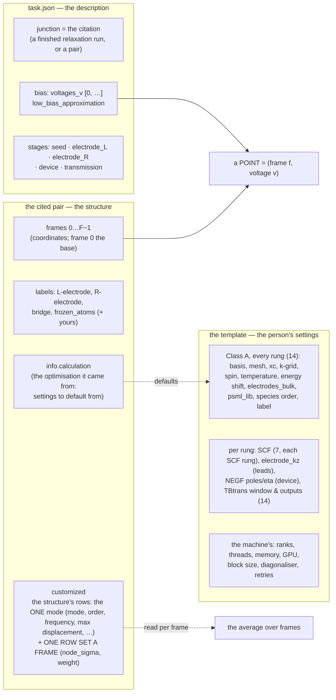
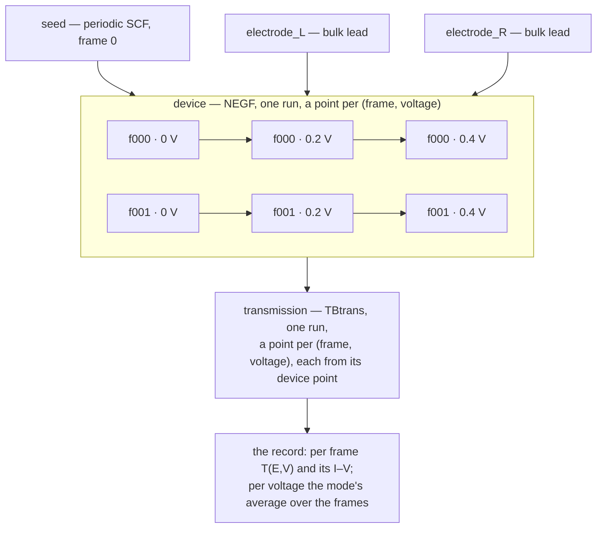

# The plan — one file

**Role:** plan — **the only one.** Every open item from the nine plan
documents that preceded it lives here; those nine are archived under
`docs/archive/2026-09-01-*.md` as records of what was decided and built.
**Domain:** all
**Started:** 2026-09-01, by consolidation

> *(user, 2026-09-01: "We don't need ten plan files scattered. We want one
> plan folder or one plan file and stay with that file.")*

**Status, 2026-10-09 — consolidated.** *(user, 2026-10-09: "review your
overall design, make sure all are integrated in plan with context and details,
consolidate the plan, archive obsolete or done items, consolidate design
document, archive and make sure current document contracts are updated
correctly based on validated facts")*. Ten read-only validators read every
section against the code at `61db1660`, each claim re-read at its cited place
before anything moved. What was done, superseded or measured untrue is in
[`archive/2026-10-09-plan-consolidation.md`](?doc=archive/2026-10-09-plan-consolidation.md),
verbatim, each section under its verdict. What stands here is open, with what
is left, where it is in the code and which contract owns it. The duplicate
lists that had grown beside § 2 — *Unscheduled*, the leftovers of § 0b and
§ 0c, W56's and W57's open lines, the items "carried" by archived sections —
are folded into § 2, so R3's one table is one table again.

---

## ▶ HANDOVER — where we are, and where to start *(2026-10-09, end of session)*

*(user, 2026-10-09: "consolidate the plan and make sure we have all the
discussions persistent and ready so that when i come back here we can
continue without losing any context/details")* Read this first; each line
points at the row or section that holds the detail.

**Settled and built today, after the consolidation (`1423ad51`), in order:**

| commit | what | the user's word | where it lives |
|---|---|---|---|
| `5b25fb0e` | **One vibration mode per frame set**; the mode on the structure's `customized` rows, each frame's node and **weight stated, frame 0 included** (⅔, ⅙, ⅙), the sum checked to be 1; each mode its own transport task; no sum across modes — weighing modes is the person's post-processing | "i would rather let one multi-frame focus on one mode ... it is baseless to discuss how different normal mode would mix"; "all weights should add up to 1 that's an explicit rule within error tolerance" | § 5z.1; `transport.md` § 2a.9, § 2a.12; `vibration.md` § 5.10 ③ (D6 reversed); `science/vibrational-averaging.md` § 6, § 8 |
| `429a678e` | **TD12 settled**: the four SCF stages (seed, both leads, device) carry their own SCF settings; the transmission none, and its tab says why and where they live | "each stage would actually carry their own SCF setup ... one of them would carry no SCF with clarification" | § 2 TD12; `transport/stages.py` `RUNG_NOTES` |
| `cd0deeef` | **The cards' words have one home** (`template.GROUP_WORDS`, served with every schema as `group_words`); a rung's tab names the rung on every card (*seed · Convergence targets*) and says once whose its values are (`stage_words`) | "make sure the title and text in each panel ... so the user is not confused by the repetition"; "unified api is always required. do not reinvent wheels" | `form-schema.md` § 1.3; `transport.md` § 3.8.2a |
| `48a67f1e` | **The Transport tab's side panel** — the shared two-column page and rail (`form-components.css` `.page-cols` / `.page-aside`, Task setup's): the five stages in order, k-points, SCF settings, after you describe | "a side panel in the transport tab (just like the one in the task setup tab)"; "simple language (no jargon) ... with examples" | `transport.md` § 3.8.10; `tabs.md` § 4; `ui-contract.md` § 1 |
| `bf9e2846` | **TD6, option C built as way 1**: the cited run's SCF mixer and criteria start every SCF stage, the device included, marked *from the run you cited*, each stage free to change its own; the fdf reader reads them; the road runner gained `deck_reads` (a deck read through the one fdf reader, never by its lines) | "TD6 C option is fine"; "go with way 1" | § 2 TD6; `transport.md` § 3.1, § 2a.13; `template.md` § 6.4 |
| `54fd6e8a` | **Words for the k-point directions**: *in the electrode plane (x, y)* and *(z)*, never *across* (which reads as from one lead to the other) | "What do you mean cross? Is it the Z direction ... or the XY direction" | the three items' labels and help; the rail |
| `c5ef9f73` | **The k-point choices, with the literature**: a lead's points along z default to **100**; the transmission's in-plane mesh starts at **3×** the shared mesh's count (4×4 → 12×12); **one point along a repeating x or y is warned** — at prep and when the Transport tab describes, beside the control; six references checked against Crossref into `references.bib` | "I agree with your choice of these parameters" | `transport.md` § 0.3b (the consolidated section, with its references); `kmesh.transmission_start`, `kmesh.check`, `transport/deck.ladder_mesh_findings` |

**Next, in order** (the queue below, Q17):
1. **Q17-c — built 2026-10-09** (§ 5z.6 step 1 says what): the pair citation,
   W56-2, the SCF settings in the recorded contract. **Its e2e assertions are
   written and not yet run** — the real-junction e2e
   (`tests/test_transport_on_a_real_junction_e2e.py`), on the user's word.
2. **Q17-d** prep/launch/status at the point (frame, voltage) → **Q17-e** the
   record's average → **Q17-f** Results, the Transport tab, Task setup.
3. **The AuBDTAu workflow end to end** — the user's request (§ 5z.6 step 5);
   e2e on the user's word.
4. The milestone review, two rounds.

**Waiting on the user** (none blocks Q17-c):
- **The frame generator's amplitude** (V1.25; § 5z.4's generator row): proposed
  — the spread from the mode's state, `σ² = (ħ/2ω)(2n+1)`, the experiment's
  temperature by default, a stated effective occupation for a pumped (SERS)
  mode, max displacement then an output; a coherent drive the one case where
  max displacement is the input (Gauss–Chebyshev frames). Decided when the
  generator is designed.
- § 2's *the user's word* rows: E7, EL-W, PL-R's first question, K22's design,
  V1.26 (M10).

**Owed by the next e2e pass** (M2n; on the user's word): the real-junction
e2e's new assertions — the relaxation's mixer arrives *from the run you cited*
on both roads (`bf9e2846`); a pair saved from the relaxation
(`xv2xyz --from-run`) defaults the transport template exactly as the run
does, its seed and leads prepared from it; and SCF-RUNG, each SCF stage's own
mixer in its own decks, the transmission's none (Q17-c) — and § 2's DOC-TOC
(a docs-tab test writes into the checkout) — retire.

**Noted for the user:** the walk's AuBDTAu relaxation
(`claude-transport-walk/optimization/au-dta-relax2/01_coarse/run-1`) ran with
one k-point (1 × 1 × 1) on a slab periodic in x and y — exactly the case the
new warning names; check the user's own relaxation's mesh before citing it.

---

## 0. Rule R3, restated

`docs/README.md` used to say **R3: `roadmap.md` is THE one plan.** That is now
this file *(user, 2026-09-01: "the old roadmap and audit should be archived")*,
and R3 reads:

> **`plans/plan.md` is the one plan. Every open item lives there, and nowhere
> else. A document that finds work records the evidence and sends the item
> here.**

That roadmap and the two audit reports are archived under
`archive/2026-09-01-*`. They were 2044 lines between them.

**R3a — a plan section is kept current while its work runs** *(user,
2026-09-16)*:

> **A programme with an implementation section updates that section when each
> step lands, and records a problem found mid-step before working around it.**

Not afterwards, and not in a commit message alone. A step that changed shape, a
step that turned out to depend on something unlisted, a defect found while doing
it: each goes in, with what was measured. **A plan written once describes an
intention; a plan kept current describes the work.** The first section under
this rule is § 5p (transport).

**And R3 now means what it says: there is ONE table** *(2026-09-10)*. Until
that day the open items sat in six tables across §§ 2, 3, 4, 4a, 5, 5b, 5f, 5l
and 5m, which is how three different rows came to be numbered `P3`, how `W8`
could cite line numbers for three endpoints that are not registered, and how
`W9` could carry one sentence naming no behaviour for weeks. **§ 2 is the
list.** A design section keeps the *why* and sends its rows there; a row that
is done, withdrawn or measured untrue leaves for
[`archive/2026-09-10-plan-consolidation.md`](?doc=archive/2026-09-10-plan-consolidation.md)
the same day, with what it turned out to be.

---

## 0a. THE WORK ORDER — milestones, each closed by a full code-text review *(2026-09-27)*

> *(user: "you need a consolidated persistent plan that get's updated at every
> milestone and reviewed with agent full code text review to validate
> results"; the order itself: "yes, that order works. go ahead")*

### THE QUEUE — what is in hand, in order *(2026-10-02; rewritten 2026-10-09)*

> *(user, 2026-10-02: "consolidate your plan so we don't lose track of these
> items and correctly prioritize and plan in a persistent plan and correctly
> update as we move down the list"; "we need to get the transport task
> finished asap")*

**Read this first.** It is every item in hand, in the order it is worked; the
milestone table below and § 2 keep each item's detail. A row moves in the
commit that moves it, and a row is never re-ordered without saying who ruled
it.

| # | item | state | next |
|---|---|---|---|
| **Q17** | **Transport over a set of frames** *(user, 2026-10-08: "what the transport receive is a multiframe .xyz/.json combination"; 2026-10-09: "this is the framework design period. I would rather to have this already built in")* — a frame set cited as its pair, each point a (frame, voltage), the record's average over frames, the family on the Results tab | **settled 2026-10-09** (D1–D5, both axes, the structure whole, frame 0 by default, the comment line never metadata — § 5z.1). **The structure half built**: the contract `36a485e6`, the code `c93da223` (frames and `customized` inside `Structure` and MolView, one case table `tests/data/frame_sets.toml`), the comment-line ruling `61db1660` | **§ 5z.6**: Q17-c (the citation of a pair) → Q17-d (prep, launch, status at the point) → Q17-e (the record's average) → Q17-f (Results, the Transport tab, Task setup) → **the AuBDTAu workflow end to end** (the user's request: *"the whole point of the test is the workflow"*) → the milestone review |
| **Q5** | **Transport's surface, the rest** — § 5u.1 steps 7 (the TranSIESTA / TBtrans items still unsaid), 8 (one panel per engine) and 10 (every value says where it came from); the deck viewer W30 ④, which lost its home when step 9 closed | open | after Q17-c, beside it where a step needs it — § 5u.1 |
| **Q7** | **M4 — the engine offset finished**: P4's three items (§ 5q.6) | open | § 5q.6 |
| **Q9** | **M11's remainder** — K13, K14's parallel model, K16's fence, K18, K17's open list, K22 (the user's design word first), K21 after it, K9, then W50's step 3 | open | § 5w |
| **Q12** | **the rest of the work order below**: M2j closed at its review, M2k's GPU half, M2m, M2n, M3, M6 P5, M8, M10 | open | the table below |
| **Q13** | **The task's left items** — `prep task` / `launch task` built 2026-10-08 (`214cc19d`, `91629b67`), Task setup's Prep card seen in a real browser (`1a28e67f`) | **left**: `tests/test_task_setup_prep_e2e.py` drives the per-tab Prep buttons that are gone — judged and rewritten or retired (e2e on the user's word); a group's header under a real scheduler (Sol); `prep_group` re-plans each member after the save and prints each member's notes (§ 2, F9) | § 2, F9 |
| **Q11** | **The named-queue check in two doors** — `placement.launch_refusal` (`placement.py:28`) and `scheduler/place.place` (`scheduler/place.py:78`) | open | one door, asked by both |
| **Q8** | **Ruled 2026-10-02, not built**: one `proxy.trust` setting replacing `auth.trust_proxy` and `rate_limit.trust_proxy` (`configuration.md` § 8); a benchmark's grid stated by the description, refused when it is not — no grid the machine proposes | ruled | one config milestone |
| **Q2f** | **Absolute imports, package-wide** *(user, 2026-10-03: "i agree with a, but like a focused session for that with agents and reviews. let's finish this main goal of transport and framework related tasks")* — every `from ..x import y` inside `molbuilder/` becomes `from molbuilder.x import y`, the rule written into the conventions; **and the shipped files' imports in the same session** *(ruled 2026-10-06, W57 decision 1: "B, with Q2f as one session")*: each zip (`mb_monitor.pyz`, `mb_vibration.pyz`, `mb_pyscf.pyz`) keeps molbuilder's folder layout so the package's absolute import resolves inside it (user, 2026-10-06: "for the first form of import why can't we use absolute path?"); the try/except ImportError pairs leave the 22 shipped files. Until then a NEW module is written absolute | the user's word — its own session | after the transport and framework goal — a script with an agent review, then the full batch |

Done rows, archived (`archive/2026-10-09-plan-consolidation.md`, with the
earlier ones in `archive/2026-10-08-plan-consolidation.md`): **Q2d** (W55, units
1–12; 12b-2 dropped, 12c/12d built `ac2d5741`, 12e defined nowhere), **Q2g**
(the file manifest; D29's document list corrected 2026-10-09), **Q4** (TD9),
**Q6** (step 9 done — § 5x B6; step 8 → Q5; step 11 → Q17), **Q10**, **Q14**
(§ 5x, B0–B9), **Q15** (§ 5y, `22ac10d9`, `4963406b`), **Q16** (§ 5z.1,
`a19ddfcc` and after); before them Q1, Q2, Q2c, Q2e, Q2h, Q3.

**Why transport comes before M11's remainder** *(2026-10-02)*: the user's word
above. The K items left are framework-wide (writers, allocations, the run
record's rows) and transport's decks pass through them, so each is done when a
transport step needs it, the rest after.

**How a milestone closes:**
1. its items are built — the contract first wherever an item changes a rule,
   then the code, then a test that drives the road (`jobset
   init/prep/launch/summarize`, or the page on a live server) and is broken on
   purpose once to watch it fail;
2. the targeted tests pass (the unit's own and what it touched);
3. **an agent reads the FULL code text** of the milestone's diff and of the
   contract sections it touches — not a grep — and reports each finding with
   its evidence;
4. every finding is re-read against the code before it is acted on, then fixed
   or answered;
5. this row records the commits, the review and its outcome — and only then
   does the next milestone start.

A full test batch (`tools/testrun.py`) runs at the end of M2 (M2n) and at the
end of each programme after it, with nothing changing under it.

| # | milestone | items | done when | status |
|---|---|---|---|---|
| **M2j** | status owns the ladder | W38 F8 | every described stage in status; launched-and-unfinished attempts never hidden; the Results tab reads status | **looks built** (2026-10-09 validation): the Results door reads `jobset_status` (`results.py:198-211`), `runstatus.every_run` lists every attempt (`runstatus.py:240-275`), `status <stage>` lists its attempts (`_cli.py:723`); the queued-attempt question dropped by the 2026-10-07 ruling — **closed by its review**, with M2k |
| **M2k** | what a job runs with | W36 ⑦, W38's GPU half | one placement and one record (done, unit 11a: `placement.py:182,236,130`, `model.py:267`); the precedence table (`running-a-job.md:430`); the GPU request (9b part 4); **the GPU claim / match** | partly — the claim / match half and W36 ⑦ open |
| **M2m** | the structure's identity | V1.9 (with X4 ⑤ and W39's hash) | the identity rule written in `structure-molstruct.md` § 3 — two hashes, where each is minted and checked — then built: the hash checked on read, prep refusing a structure whose hash moved; a frame-set citation pinned by its two files' sha256 meanwhile (§ 5z.8 F.3) | open — W39's own part (the `customized` section, the API, the pane) built `c93da223` |
| **M2n** | the text, then the batch | W36 ⑪; the document rows of § 2 (DOC-*) | the full batch green; then the engine e2e runs owed by closed milestones (M2b⁗, M2b⁵, and the six files M2d did not run), the Sol memory measurement, and the sweep for tests that read text | open — the last e2e batch ran 2026-10-05 |
| **M3** | the run record, the rest | W35: P2's remainder, P4, P5, P6 | W35's own done-conditions (§ 5t.3) | open |
| **M4** | the engine offset, finished | W33 P4 | § 5q.6 | open |
| **M5** | transport | § 5u.1 steps 7, 8, 10; Q17 | each step's done-when | steps 1–6 and 9 done; step 11 is Q17 |
| **M6** | charge and spin | W34 P5 | § 5s.3 | P0–P4 built (decision 4's refusal: `citation_defaults.py:196-207`); **P5 open** |
| **M8** | MolView sealing, the CSS | W15; W1–W6, W13 | each row's own | open |
| **M10** | from a mode to the current | W42 (V1.24–V1.27 folded in) | V1.26's decision; then W42's order P1–P6 | decided 2026-09-28 (W42: D1–D5, D7, D8; D6 as recommended); V1.26's decision owed; after the work order. V1.25 — the frame-set generator — is unblocked by W39 and feeds Q17 |
| **M11** | every parameter, end to end | W50 → § 5w | W50's own: a static full-text review per track, each finding verified and fixed at its owner, then the road in the browser | the reviews done 2026-09-29; their 22 mechanism classes (K1–K22) — K1–K8, K10–K12, K15, K19, K20 done; the rest § 5w |

Done milestones, archived: M1, M2a, M2b–M2b⁵, M2c, M2d, M2e, **M2f** (9b, 2026-10-03), **M2g** (9b part 3), M2h, M2i, M2l, M7, M9 (folded into M10).

---

## 2. OPEN — the one list

**Every open item, in one table** *(consolidated 2026-09-10 at the user's instruction: "consolidate plan and to do, archive finished things and untrue things, clean it up so we have one list"; re-consolidated 2026-10-09)*. A design section (§ 5e–§ 9) keeps the *why* and the order of its own work and sends its rows here; the queue (§ 0a) says when.

**A row is evidence of when it was written** — re-derive it against the code before acting (the rule, `archive/2026-10-08-plan-consolidation.md` § 5a). Each row below was re-read at its cited place on 2026-10-09; *Re-checked* says what was found. The long histories of the rows that had grown to tens of lines (W36, W38, W41, W30, W32, X4, W52, W54) are in [`archive/2026-10-09-plan-consolidation.md`](?doc=archive/2026-10-09-plan-consolidation.md), verbatim; the row here is what is left.

**Rows that were done, withdrawn or measured untrue are not here** — [`archive/2026-09-10-plan-consolidation.md`](?doc=archive/2026-09-10-plan-consolidation.md), [`archive/2026-10-08-plan-consolidation.md`](?doc=archive/2026-10-08-plan-consolidation.md) and [`archive/2026-10-09-plan-consolidation.md`](?doc=archive/2026-10-09-plan-consolidation.md), each with what it turned out to be. Archived ids still cited elsewhere resolve there: A1.16, A1.2, A1.3, A1.7, B2, B3, B4, D2, D4, DOC-TEX, E1, E10, E11, N5, N9, R5, S-T2, S18, S3, TD10 text, TR1–TR3, TR4–TR6, TR7–TR8, TR9–TR10, V1.31, W10, W20, W27, W37, W39, W46, W51, W52, W53, W54, X1.

| # | area | item | from | state |
|---|---|---|---|---|
| **E7** | engine / science | **D7's cluster half** — the prep→submit→watch loop for a **run** through SLURM on Sol. **2026-09-10, the user: "we have tested it on Sol" — and the row must not contradict that.** What is actually on disk here: Sol slurm records exist (`optimization/sol/AuBDTAu-slabcorrected/01_coarse/bench/launch/slurm.62380919.out`, real ids) and every `kind: "run"` ledger entry in `projects/` is `workstation`/`direct`. That is the absence of a LOCAL record, which the earlier wording ("No `kind: run` submission exists on any Sol tree") presented as the absence of the WORK. A tree on Sol is not in this repo. **This row needs the user to say whether it is closed, not another file scan** | roadmap § 1 | needs the user · *Re-checked 2026-10-09:* open, the user's word; the run's folder is now `projects/Au-BDT-Au.old/optimization/sol/AuBDTAu-slabcorrected/`. |
| **T1** | front end / results | **A live poll that must rebuild does not update the movie — the cause found by reading, 2026-10-09.** Found 2026-09-07: grow the feed 4 → 6 while the frame at `oldLen − 1` moves, so `canAppend` (`lib/trajectory/core.js:2159`) refuses and `applyNewData` (`:2136`) rebuilds; the status says 6 frames and the bar holds 4. **Why:** the Results viewer is mounted read-only (`core.js:595-596`); `rebuildModel` re-installs without `enforce` (`:915-921`); MolView's § 9.4 guard returns `null` for a read-only viewer already HOLDING a structure (`molview/model.js` ~`:1112-1116`) — so every rebuild after the first, and the two resync paths (`:2290`, `:2311`), is a silent no-op. `web/molview.md` § 8 marks it | found 2026-09-07; `web/results.md` § 4.1, `web/molview.md` § 9.3–9.4 | **open — a defect against § 9.4**: the rebuild installs through the read-only door's own replace (`enforce`), and a test drives the 4 → 6 rebuild in the browser model |
| **E13** | engine / science | **The first real junction walk — BDT–Au on Sol. DROPPED BY THE CONSOLIDATION.** Named in the roadmap and again in `transport-design` § 7's *"order of proof"* as the run that follows P6. plan.md has the machine-blocked infrastructure (E5 — archived 2026-09-10 — and E7) and the browser and deck walks (W12 — archived 2026-09-10 — and E11) but no row for the transport composite's first real science run | roadmap · `transport-design` § 7 | **the Sol half only** — after § 5u step 4; the workstation half ran 2026-09-29 (the Au–BDT–Au ladder to T(E) on `claude-au-bdt-au`, TD8's acceptance ladder) and is archived *(2026-10-08)* · *Re-checked 2026-10-09:* open — the Sol half only; the workstation half closed by TD8 and Q15's run E. |
| **E14** | science / references | **Reed 2006 and Stokbro 2003 into `science/references.bib`.** `engines/transport.md` § 8 cites both (and Solomon 2008 beside them); none is in the `.bib`, and the rule is that an entry is added when a passage cites it. The 2026-10-08 archive reason — *no live document cites them* — was untrue | roadmap § 7.3 | **reopened 2026-10-09** — each entry checked against the paper before it goes in (§ 7.3) |
| **V1** | engine / science / web | **The vibration calculation — one path on two engines.** The contract is [`engines/vibration.md`](?doc=engines/vibration.md) (§ 10 says what stands); the science is [`science/normal-modes.md`](?doc=science/normal-modes.md); the design and the first audit are archived (`archive/2026-09-24-*`). Built 2026-09-21 → 24: one harmonic path with the rank rule and its gate against PySCF, one mass convention, stationarity on the free atoms, the runs write the pair, the Hessian over the free atoms with the two measured corrections, the SIESTA arm (deck on a sorted copy, `atom-permutation.json` with its key, the `.FC` reader, `summarize run`, the warm-file section, the kind's start state), the equilibrium block optional, the wrapper's banner. **Open, the sub-rows:** | `engines/vibration.md` § 10 | open · *Re-checked 2026-10-09:* a container: V1.11, V1.15 and V1.38 narrowed, V1.25 unblocked, V1.31 archived. |
| ↳ | **V1.9** | **The structure identity rule** (settled in discussion 2026-09-22, written into no contract yet — this row is its full statement until it has one): **two hashes, one home** — a *geometry hash* over the atom lines as **verbatim text** (the numbers are already text, so there is no float question) plus the lattice and the per-axis periodicity from the sidecar, with `none` as a real hashed value when there is no lattice; and a *broad hash* over labels, regions and identity columns, for provenance. **Never the comment line** (a human title from one writer and a derived `Lattice=` from another; adopting it would promote a derived value into a stored one). **Out:** the cell origin (a gauge choice — shifting it moves no periodic image), labels, timestamps, the job name. **Joins check the geometry hash only**; a broad-hash difference is reported, never blocking. **Minted at three gates** — Modify → Save to project, Results → export, the CLI on request — then **carried and never recomputed**; **checked at three points** — prep, results load, joining two runs. **Derived structures** (a reordered copy) mint their own identity and record the parent's plus the permutation. **A run's output is a record, not a gate** — it becomes an input only by passing through one (ruled 2026-09-22). Today: `spectra.json`'s `structure_hash` has the job name as line 2 (the atom count is line 1) and never matches the codec's pair hash, which is over the document's bytes — a different scheme; and `workingcopy_structure.py:278`'s `keep_sidecar = (not _metadata_is_default(meta))` writes no companion for all-default metadata, so *Save to project* can still emit a bare `.xyz` at the very gate meant to guarantee the pair (both measured saves got one only because they carried labels) | `vibration.md` § 4.3 | open · *Re-checked 2026-10-09:* open — M2m. Both facts hold: the spectra hash puts the label on line 2 (`sidecars/spectra.py:85-96`); a structure with all-default metadata is saved with no sidecar (`workingcopy_structure.py:304-307`). No contract states the rule yet; `structure-molstruct.md` § 3 defers the identity hash to M2m, and a frame-set citation is pinned by its two files' sha256 meanwhile. |
| ↳ | **V1.10** | **The pair writer renders both halves** (ruled 2026-09-23, the unification audit § 1.1a): `pair()` returns text, so a sidecar that cannot be written (a NaN in `info`) stops the write before the `.xyz` is on disk. **The deck's half is done (2026-10-05):** the PySCF deck writes its pairs with the codec itself, imported from `mb_pyscf.pyz`, and its own serialiser — the third — is deleted | unification audit § 1.1a | open (the codec's half) · *Re-checked 2026-10-09:* open — `pair()` returns the sidecar as a dict (`workingcopy_structure.py:298-308`) and `_write_pair` writes the `.xyz` first (`:420-446`); `structure.md` § 2.4 marks both-or-neither not built. |
| ↳ | **V1.11** | **Untested and open**: the reduced Hessian with a GPU mean field; a composed permutation for a structure sorted for two reasons (ruled one record, no caller yet); `transport/compose.py` writing its record through `write_permutation` and stamping its key (U10; reading through `read_permutation` done 2026-09-28) | `vibration.md` § 4.4, § 5.2 | → **§ 5u step 3** *(2026-09-29: compose writes the permutation by hand and calls the sort directly, so no key is stamped; `sort_by` / `write_permutation` exist for it)* — **the compose half built 2026-10-02 (M5 step 3)**: it sorts with `sort_by(…, "transport")` and writes through `write_permutation`, the key stamped (`test_transport_prep.py` reads it back) · *Re-checked 2026-10-09:* the compose half done (`transport/compose.py:757` `sort_by`, `:831` `write_permutation`); the test the row names (`test_transport_prep.py`) went in `93977f5d`, so no test reads the transport permutation key back. Untested: the reduced Hessian with a GPU mean field; one record for a structure sorted for two reasons. |
| ↳ | **V1.12** | **Not done**: a mode-by-mode intensity cross-check against an external code (Gaussian / ORCA / Turbomole); absolute intensities carry the caveat until then | `vibration.md` § 9 | open · *Re-checked 2026-10-09:* open (`vibration.md` § 10). |
| ↳ | **V1.14** | **From the UI walk of 2026-09-23, not this kind's**: the Molbuilder tab's save prompt doubles a typed suffix (`x.xyz.xyz`); the `#`-labelled provenance regions (`O#`) warned as unconsumed on every SMILES-built molecule — needs a ruling; the vacuum notice advising 8 Å on a gas-phase PySCF run | unification audit § 1.18 U3, U4, U7 | open · *Re-checked 2026-10-09:* the doubled suffix stands — `lib/projects/molview-doors.js:114-117` appends `.xyz` to a typed `x.xyz`, the save route writes the path as given; the 8 Å vacuum advice is engine-blind (`cell.py:398-405`); the `#`-label warning is settled by *labels are the user's* — nothing to build. |
| ↳ | **V1.17** | **Four held systems through the whole road**, today rank rows only: acetylene with both carbons held (the collinear trap end to end), NH₃ with its three hydrogens held (nothing removed), an empty held list reproducing the free path *exactly* (what makes "the free case is the held case with nothing held" a fact), the water dimer with one molecule held (the over-removal guard) | `vibration.md` § 9 | open · *Re-checked 2026-10-09:* open (`vibration.md` § 10). |
| ↳ | **V1.24** | **Mode matching across runs** (needs a design): the overlap of eigenvectors in the shared free subspace, mass-weighted — the active-region convergence test (Models A/B/C) and the PySCF-against-SIESTA comparison of one molecule are the same calculation | `science/normal-modes.md` § 4b.6 F, § 4b.3 | open · *Re-checked 2026-10-09:* open — M10. |
| ↳ | **V1.25** | **The mode-displaced frame set** *(decided 2026-09-24, user)*: a generator that writes ONE multi-frame pair — the base as frame 0, then `R_A(Q) = R_A⁰ + Q·L_canonical` with `R_F` unmoved at the zero-point amplitude and its thermal growth — from a spectra file, for a named mode; the rule (run, mode, amplitudes) recorded in the pair's `info`. It is the interface to transport's frame axis (W32); a person's own script writes the same pair. Level one of `vibration.md` § 5.6. *W42 (draft 2026-09-28) proposes one set for many modes, at the Gauss–Hermite nodes of the thermal distribution (D6, D7)* | `engines/transport.md` § 2a.9 · `model/structure-molstruct.md` § 6.1 · `science/normal-modes.md` § 4b.6 G | **contract written 2026-09-24; re-ruled 2026-09-29 (TD10)**: the generator is a separate backend procedure, designed on its own — the equilibrium relaxed structure and a normal mode in, one multi-frame structure out — and **each frame's parameter set goes in the structure's `customized` section (W39), not `info`**; transport is its consumer, never its builder. Open, after W39 · *Re-checked 2026-10-09:* unblocked — W39 built in `c93da223`. The contract is `vibration.md` § 5.10 ③: the generator, its own module, writes one frame set for **one** mode (user, 2026-10-09) — `with_frames`, the mode on the structure's rows, each frame's node and `weight` through `set_customized(…, frame=i)`, frame 0's weight included, the set's summing to 1. Its amplitude is to design (§ 5z.4's generator row). Its first consumer is Q17. |
| ↳ | **V1.26** | **`Δρ_ν(r)` maps** (needs a decision): SIESTA's density grid at `±Q_ν`, differenced — the discussion's intermediate quantity before any oscillator strength on a metal | `science/normal-modes.md` § 4b.7 | open — M10; its decision is owed · *Re-checked 2026-10-09:* open — M10; its decision owed. |
| ↳ | **V1.27** | **The PySCF probe** (decided — W42's D8): five points per mode instead of two; the coupling per zero-point amplitude `g_ν = ∂ε/∂Q · √(ħ/2ω)` in meV written beside `ΔE/(2A)`; a molecule-projected frontier quantity for a cluster whose HOMO and LUMO are metal states. *Decided with W42 (D8, 2026-09-28): the probe runs on the thermal nodes* | `vibration.md` § 4.8; `science/normal-modes.md` § 4b.5 F–G | open — M10 · *Re-checked 2026-10-09:* decided (D8), not built — M10. |
| ↳ | **V1.33** | **The Task setup tab re-derives the vibration ladder in JavaScript** (`proposedFromHandover`, `task-setup/viewer.js:2775`, spells `relax`/`freq` and the box rule by hand; `_afterRunLines` is gone) while Python owns it (`pyscf/stages.py:120`, `vibration_stages`). A second copy of one rule; the hand-over or the folder answer should carry the proposed ladder computed server-side, and the page should ask the description which rung is the force-constant one. Found by the 2026-09-24 review | `vibration.md` § 2.2, § 5.2a | open *(re-cited 2026-10-08)* · *Re-checked 2026-10-09:* the JavaScript copy is now `task-setup/viewer.js:2807-2838`; Python's `pyscf/stages.py:120`. |
| ↳ | **V1.34** | **The response screen — which mode to take to transport** (decided with W42, 2026-09-28): the vibration kind's half of W42 — each mode's character at load, the charge each mode moves from the force-constant run, the frame set at thermal nodes (V1.25), the PySCF probe on them (V1.27) | `vibration.md` § 5.10 · `science/normal-modes.md` § 4c | open — M10 (W42 decided) · *Re-checked 2026-10-09:* open — M10. |
| ↳ | **V1.37** | **A vibration's result is written readable by its owner alone.** Found 2026-09-29 on the Au–BDT–Au spectrum: `aubdtauvib.spectra.json` is `0600` while every other file of the run is `0664`. `sidecars/spectra.dump_spectra_json` writes through its own `tempfile.mkstemp` + `os.replace` and never widens the mode (`sidecars/spectra.py:163-180`); `persist.write_bytes` -- the one writer -- does (`persist.py:68-88`), and says why (*"mkstemp creates 0600, which is not what a shared artifact should end"* up as). The finish runs it job-side from the bundled copy (`spectra_sidecar`), which may be why it keeps a writer of its own: whether `persist` can travel in the bundle decides the fix -- one writer, or the same widening in the bundled one | `persist.py` · `sidecars/spectra.py` | open · *Re-checked 2026-10-09:* the writer is `write_spectra_payload` (`sidecars/spectra.py:98`, its mkstemp `:159-180`); `persist.py:88-129` is the writer that widens the mode — K13's. |
| ↳ | **V1.38** | **A δ-convergence comparison that also varies the mesh.** `engines/vibration.md` § 9 still names it as owed; V1.23 closed as built with the δ axis only (the displacement sweep), so the mesh half — the one that separates the grid's error from δ's (§ 9's H₂ measurement) — has no row. Found by the 2026-09-29 coverage check | `vibration.md` § 9 · `science/normal-modes.md` § 4b.6 C | open · *Re-checked 2026-10-09:* narrower: the sweep takes a mesh stage already (`spectra/displacement_sweep.py:8,17,152`; `vibration.md` § 5.9); what is left is the measured δ+mesh comparison on H₂. |
| **W33** | structure / engines / web | **THE ENGINE OFFSET — one placement rule for every engine** *(user, 2026-09-25: "always adjust it before sending to siesta or other engines that the coordinates of all atoms are centered inside the cell"; "we don't have to have special logic to treat isolated, periodic, transport axis_info differently")*. Every engine receives the design coordinates + `engine_offset` with the cell at the origin; the offset is computed from the cell and every atom (the fractional span centred, never re-wrapped), recorded in every deck, and stated 0 for an engine's own output, so the Results tab draws what the engine had. Retires `cell_origin` (an origin the person assigns is kept, stored as the offset), the derive-on-null corner and its per-axis rules, calibrate, and the two hand translations. Found by the fake-junction ladder: a TranSIESTA device refused on a flush corner, a Results box the engine never had, the molwatch step-0 jump (the 2026-09-25 audit's finding X4 — not § 2's row X4) | `model/structure-periodicity.md` § 6.0 · § 5q | **P0–P3 done** (P3's T3 on 2026-09-27, `tests/test_results_export_e2e.py`; its dev-server check on 2026-09-25)**; P4 open** — P5 closed by TD8, the Au–BDT–Au ladder run to T(E) on 2026-09-29 (§ 5q.6 is the per-phase record). **D1–D16 settled** (§ 5q.8) · *Re-checked 2026-10-09:* P4's three items (§ 5q.6) — M4. |
| **W34** | science / engines / web | **THE ELECTRONIC STATE — charge and spin as one answer per calculation** *(user, 2026-09-25: "put spin and charge setup in to a unified framework so that these information can be produced consistently and systematically for different engines"; "investigate holistically ... from template to validation ... a design gap/framework level investigation rather than a patch"; "documentation should have an explicit discussion on species with these properties")*. Four engine-neutral template items — `net_charge`, `spin_treatment`, `unpaired_electrons`, `method` — resolved once with what the structure adds (the charge's source, the electron count, finite or repeating) and read by every deck writer, check, hand-over, form and read-back; restricted-open explicit; a species-by-species chapter. Found by the transport ladder's rung reports (a gold lead and a formate ion both told "switch to open-shell") | `science/chemistry-correctness.md` §§ 2a–2b · § 5s | **P1–P4 built** (M6, 2026-09-28/29; decisions 1–9, § 5s.2); **P5 open** · *Re-checked 2026-10-09:* P5 open — the TBtrans two-channel half built (`transport/record.py:157-165`, through `tbtrans.transmission_files`); no reader of SIESTA's charge and moment, none of PySCF's ⟨S²⟩. |
| **W35** | parse / execution / web | **THE RUN RECORD — what ran, with what, and how it went, for every run; one SIESTA-family reader; the transport report** *(user, 2026-09-26: "include in the report of transport results ... all indicators that can provide scientific information, progress tracking and symptom of non-convergence"; "parameters used for calculating transport should be similarly reported ... check what we did for the other tasks, and find the best way to honestly and fully record what is the computation setup and scientific setup, and how result evolves in the record, and output report"; "fdf parser need unified upgrade"; "get the framework and code unified and finalized")*. One record per attempt, composed on read — computation, setup (default · asked · engine used), the deck, every iteration of every phase from one grammar, the verdict with its symptoms — read by a Run panel for every kind and by a transport report built from its rungs; the NEGF contour stated rather than left to TranSIESTA's fallback. Found by a device that diverged for eleven hours with every reader saying otherwise | `model/parse.md` § 5d · `engines/transport.md` § 2a.12 · § 5t | **P0–P1 done (`a4c1d28e`); decision 10 done — the monitor, the wrapper's endings and the report fields through the framework; P2: the record and the Run panel built (2026-09-27), the rest below** · *Re-checked 2026-10-09:* M3 — P2's remainder, P4, P5, P6 (§ 5t.3). |
| **W36** | execution / packaging | **The run-independence review (2026-09-27), agreed item by item** *(user: "i need to go through all of them so we have agreement before i let you just go ahead to fix all")* — its full text, ① to ⑪ with each agreement, is in the 2026-10-09 archive. ①–⑥, ⑧, ⑨ and ⑩ are built. **⑦, open: the job inherits the whole shell** — `submit.py:1232` passes `{**os.environ}` and `:307` `--export ALL`, and the wrapper honours `OMP_NUM_THREADS` (`runwrap.py:2224-2236`); the agreed fix is *keep inheriting, guarded*: launch hands `-np` / `-omp`, which win (`submit._run_sh_args`), so an inherited count cannot resize a launched run — what is unbuilt is the by-hand path and the log naming an override. `running-a-job.md` § 2.0a states this; its § 3.2–3.3 precedence still puts `OMP_NUM_THREADS` second, against ⑦'s *"a bare OMP_NUM_THREADS no longer sets it"* — one table, written when ⑦ is built. **⑪, done 2026-10-09**: the `$MOLBUILDER_ROOT` text is gone from `job-contracts.md` § 2.5, `repo_root`'s docstring names its real callers | `execution/running-a-job.md` § 2.0a, § 3.3 | ⑦ open — M2k |
| **W38** | execution / front end | **The multi-door review (2026-09-27): one fact, two or more code paths that can answer it differently** *(user: "we are looking for framework level unification and consistency")* — F1–F9 and M1–M5, its full text in the 2026-10-09 archive. Built: F2 F3 (M2f), F4 F5 (M2i), F7, F9, M1–M5, F1 F6's one placement and one record (unit 11a), the bias chain's copy list from the one door (`submit.py:2014-2022`, the warm list's `along` row), F8 (M2j — the Results door reads `jobset_status`, `results.py:198-211`; `every_run`, `runstatus.py:240-275`). **Open: M2k's GPU claim / match half** | `execution/gpu.md` § 1 | the GPU half open — M2k; M2j closed at its review |
| **W40** | execution | **`jobset launch --mode direct` exits 0 when the job it ran failed.** Found 2026-09-27 by M1's fixture: a PySCF run died at activation, the decision ledger recorded `"status": "failed", "returncode": 1`, and the command still exited 0 -- so a script (or a test) that trusts the exit status is told the run succeeded. No contract states launch's exit status for a direct job (`_cli.py:1993-2010` sets none, 2026-10-08) | `execution/running-a-job.md` · `jobset/_cli.py` | **needs a decision** · *Re-checked 2026-10-09:* open — the launch report (`_cli.py:2031-2071`) returns 0 whatever the run's rc, and no contract states the exit status; under the explicitness rule a foreground direct launch exits with its run's status (`--background` reports *started*) — written in `running-a-job.md` first. Its proposed home M2f is done; it goes with the next launch work. |
| **W41** | engines / results | **A SIESTA vibration's finish, the remainder** *(user, 2026-09-28: "siesta only gave some optimization ...")* — the finish built (M2b′, M2b″: the job derives its spectrum, `mb_vibration.pyz`); the measurement and the rulings are in the 2026-10-09 archive. **Left:** the force-constant `.out` titled *"SIESTA optimization"* — the title guessed from the suffix (`lib/inspectors/trajectory.js:108-115`), against `web/results.md` § 0.3; I7's sorted positions; the ⚠ beside an in-tolerance stationarity sentence; Makov–Payne run by hand; the finish parsing the whole output where FC step 0 suffices; PySCF leaving `ir_fd_step_ang` out of its record — written `null` under the explicitness rule. Re-running a failed finish is settled by rule (no recovery machinery; launch again) | `engines/vibration.md` § 5.5, `web/results.md` § 0.3 | open |
| **W42** | engines / science | **FROM A MODE TO THE CURRENT — which vibration to take to transport** *(user, 2026-09-28: "think about this and how the spectrum calculation can be enriched by the additional electronic state/PDOS calculation, and propose an improvement in the vibration calculation contract/document/design and see how we can move forward ... this is after all the other issues are done, so this is just a draft for next step, do not implement")*. The science, `science/normal-modes.md` § 4c (proposed): at a metal the molecule's orbitals are resonances and the junction has a Fermi level, so the current sees `T(E)` near `E_F`, not the HOMO–LUMO gap; a mode acts on a level `ε_r` or on the coupling `Γ` (the contact modes, whose exponential coupling gives a large positive curvature); a DC measurement, thermal or light-driven, sees the second derivative, `⟨ΔG⟩_ν/G = ½ T″σ²/T₀`, and the two scores — the level shift at `σ`, the conductance change — are kept side by side; three frames at the Gauss–Hermite nodes of the thermal distribution give the curvature and the second-order average at once; one transmission at the base screens every mode by the rigid-shift estimate `T″ ≈ g_ε² ∂²T₀/∂E²`; the free atoms' projected DOS and their own states (the extended molecule's MPSH) stand in for HOMO and LUMO. **The design, proposed:** `engines/vibration.md` § 5.10 — ① each mode's character (element shares, the free part's whole-body share, the bond stretches at `σ`), derived at load, no calculation and no new label; ② the charge each mode moves between the held anchor and the free part, from the force-constant run's own displaced SCFs; ③ V1.25's frame set for many modes at the Gauss–Hermite nodes — *made by V1.25's separate procedure, each frame's parameters in the structure's `customized` section (TD10, 2026-09-29)*; ④ an `electronic` kind — one SCF per frame, each job's finish writing `E_F`, the charges, the projected DOS and, with sisl, the levels; ⑤ `summarize` over a frame set, electronic or transport, writing `<label>.mode-response.json` — slope, curvature and thermal average per mode, levels followed by overlap, the rigid-shift estimate beside the explicit value; ⑥ the ranking table in that record's presenter; the PySCF probe on the same nodes (V1.27). Folds in V1.24–V1.27. **Decided with the draft** *(user, 2026-09-28: "the anchor is the fixed atoms. we don't specify the anchor, the atoms is labeled already with fixing or unfixed")*: D1 — the anchor is the held atoms and every projection is over the free atoms, per element, with no new label; D2 — then not needed, the result already carries the free and held atoms. **Decided 2026-09-28, the user's answers:** D3 — yes, the charge each mode moves, *"and result presentation should include the correct data and UI design to present it"*; D4 — yes, an `electronic` kind, *"and make it clear the difference between pySCF and siesta, from setup and calculation and presentation"*; D5 — sisl in every SIESTA env, *"so it is always available when we need them ... fix the install-env and other env related setup to get this consistently done - do not reinvent wheel as we have a full system of install implemented"* (built with the M2b‴ milestone); D7 — the thermal nodes, as recommended (the displaced structures the electronic and transport runs compute on — not the animation, which the user asked about); D8 — the PySCF probe on the same nodes, as recommended. **Taken as recommended unless the user objects:** D6, one displaced-structure set for many modes. **Registered with it:** E2 — a vibrational-only result records no pressure (built with M2b‴); E3 — a command that re-runs a failed finish on its attempt, the user's yes owed. **Order, once agreed:** P0 the decisions; P1 ① (no engine); P2 ② — measured first, whether SIESTA prints the populations at every FC step; P3 ③ with its displacement statement, checked by the frame set's citation promises (W32 ②); P4 ④ and ⑤ for the `electronic` kind — the frame axis for one kind first; P5 transport on the frame set (W32 ③–⑤, behind W32's gate) and ⑤'s transport half; P6 ⑥. Validation H₂, then the carbon-chain junction, then Au–BDT–Au. **Found while drafting, fixed with M2b‴:** the SIESTA deck's commented population hint spelled the retired `WriteMullikenPop` (`siesta/input.py`); it names 5.4.2's `Charge.Mulliken` and `Charge.Mulliken.Format` | `science/normal-modes.md` § 4c · `engines/vibration.md` § 5.10 · `engines/transport.md` § 2a.9 | **draft 2026-09-28 — decided D1–D5, D7, D8; D6 as recommended; after the current work order** · *Re-checked 2026-10-09:* decided, M10; V1.26's decision owed; the frame set it uses is V1.25's — **D6 (*one set for many modes*) reversed 2026-10-09: one mode a set, each its own transport calculation**. |
| **W43** | engines / front end / results | **TRANSPORT — THE ONE LIST (M5).** Transport's open work, consolidated 2026-09-29 from W10, W24, W25, W27, W30, W32, § 5c.3, § 5o, § 5p and `engines/transport.md` § 3.6 / § 3.8.5 after an inventory read each against the code: eleven steps in order, seven decisions that are the user's, the claims the documents make that the code contradicts, and 54 citations of a document that no longer exists *(user: "continue to work on transport as the next item on plan remember to correctly update the plan and consolidate")* | § 5u · `engines/transport.md` § 6.1b | → **§ 5x** (Q14 — transport made whole; its *state at a glance* is the current state) and **§ 5u.1** (the step table); the Au–BDT–Au ladder ran to T(E) on 2026-09-29 and is the acceptance ladder (TD8) *(pointer refreshed 2026-10-08)* · *Re-checked 2026-10-09:* a pointer — § 5u.1. |
| **W44** | execution | **A stage's `required` files, and the check that its run directory holds them — designed in four contracts, built in none.** `execution/job-contracts.md` § 4.4 (`:141`; *"Neither half of this is built … the catalogue carries no `required` item"*), `engines/template.md` § 12.1 row 8, `engines/stages.md` (*"the check itself is unbuilt"*); `worked-example.md`'s gap 13 names the hazard — *a TranSIESTA ladder starting without its `.TSHS`* — and `run-identity.md` states it as if it were checked. Found by the 2026-09-29 coverage check | `job-contracts.md` § 4.4 · `template.md` § 12.1 | open — beside M2g/M2h (the restart-file list, the hand-over), or a ruling that prep's gather refusals replace it · *Re-checked 2026-10-09:* open — `job-contracts.md:141` says neither half is built; `template.md` § 12.1 row 8. |
| **W45** | execution / checkpoint | **Checkpointing's owed half.** The save is always (prep and Task setup's Save call `checkpoint.save_before`, `prep.py:1890`, `:2851-2856`; `checkpointing.md` § 12 A3 ✅). **Left:** a `checkpoint verify` verb (the CLI has init, save, list, tag, restore, config — `cli.py:2885-3132`; `verify_archive` is reached only from restore, `checkpoint.py:839,1695`); invariants S2, S3, S4, S6 and L8 without a test (`checkpointing.md` § 13.4 points here), A3's test and S5's run-layer half with no row before this one; `project-layout.md`'s invariant 16 and § 6.1 say the archive does not reach a bench trial's `.DM`, against S1 (*every regular file goes to git or the archive*), which the code follows — the layout's sentence is corrected to S1 when this is built; § 12's S2/S4/S6/L8 still read *"needs the layout / the description"*, which exist | `execution/checkpointing.md` § 12, § 13.4 | open |
| **W47** | engines / execution | **A person's own deck text: § 5e's engine additions and the USER-CUSTOM zone's carrier.** No `user_custom` item exists, so in the staged path the zone is emitted empty and a person's text does not survive (`template.md`, `job-contracts.md`, `worked-example.md`'s gap 12); § 5e (*a person's own engine text, as an input*) is a design with no row and says the zone's defects are *"listed where they belong"* — they were listed nowhere | § 5e · `template.md` § 12.1 row 1 | open — § 5e not started · *Re-checked 2026-10-09:* open, § 5e not started. `engines/template.md` § 9.2 disagrees with § 5e on four points — the carrier (a catalogue item `user_custom` against a separate input), the zone's role, stage overrides against a per-addition switch, the placement; § 5e is the user's ruling of 2026-09-05 and owns it, its open question 1 leaves the zone's fate to its design. `template.md` § 12.1 row 1. |
| **W48** | engines | **Facts stated twice — the catalogue and the config dataclasses.** `template.md` § 2.1a: 491 facts live in two places, and `kind`, `default` and `expands` are unguarded (a live divergence in `use_gpu`'s `expands`) — *`default` guarded since 2026-09-29 (`test_catalogue_agreement.py:245` `test_the_DEFAULT_agrees`, M5 step 2), zero disagreements measured that day*; `form-schema.md` reads `workflow_group` from the class — the same class of drift | `template.md` § 2.1a · `form-schema.md` | open — its deletion is argued in `template.md` · *Re-checked 2026-10-09:* open. |
| **W50** | front end / engines / execution | **EVERY PARAMETER OF THE STRUCTURE OPTIMIZATION, SPECTRUM AND TRANSPORT WORKFLOWS, CONFIRMED END TO END** *(user, 2026-09-29: the quote in M11; "this is not a poking test, a static review followed with e2e validation")*. Found the day it was asked: the PySCF vibration refused a periodic structure where the engine's own rule notes it (fixed, `762ca298`), and gold on def2-SVP received no core potential while the hint stayed silent on a false belief about PySCF (fixed, `5a8133cc`) — each a parameter whose chain nobody had read end to end since the Spectrum tab gained its second engine (2026-09-24). **The method**, as the structure optimization's full-text review (`archive/2026-08-14-template-execution-review.md`): (1) a static review per track — Structure optimization on SIESTA and on PySCF, Spectrum on PySCF and on SIESTA, Transport's five rungs — every file of the chain read in full (the tab's HTML and JS, the routes, the catalogue rows and `template.py`, config / resolve / prep / validation, the deck writer) and each parameter traced from its control to its line in the generated script and to where the engine's own source reads it, nothing changed and nothing run; (2) every finding re-read against the code and fixed at its owner, the contract first; (3) the road in the browser per track — the tab, the hand-over, Task setup, the printed `prep` / `launch`, a small run, the Results tab | `web/spectra.md` · `engines/vibration.md` · `engines/pyscf.md` · `engines/siesta.md` · `engines/transport.md` · `web/task-setup.md` | **started 2026-09-29** — step (1) done the same day: five reports, every defect verified; step (2) is § 5w — the findings grouped by the mechanism that produced them, each class one declaration in the template and one door (K1–K17), approved 2026-09-29 — K6 first · *Re-checked 2026-10-09:* a pointer — K6 done; the remainder is Q9, § 5w. |
| **W32** | engines / structure | **The frame axis → Q17** (§ 5z). Decided since this row was written: frames are levels inside one run, as bias points are (`transport.md` § 2a.11; D4, 2026-10-09); both axes built in (§ 5z.8 A — the one-bias ruling it cited is withdrawn); its gate, the single-frame ladder run once, met (TD8, Q15's run E); ④ left it for V1.25 (TD10). Its full text is in the 2026-10-09 archive | `engines/transport.md` § 2a.9, § 2a.11 | → Q17-c … Q17-f |
| ↳ | **V1.15** | **Recorded, not in scope**: the transport connection (displace along a mode, then transport; the electron–vibration coupling from `FC.Save.dHS`) and Born-charge infrared on SIESTA — each a feature to design as one | `vibration.md` § 5.6 | not started · *Re-checked 2026-10-09:* narrower: displace-then-transport is V1.25 + Q17; left: the electron–vibration coupling from `FC.Save.dHS`, and Born-charge IR on SIESTA. |
| **W1** | front end | **The document tier (step C).** `html, body`, `header`, `button`, `footer`, `textarea` genuinely differ per page; the `*` reset is already deleted. Blocked on a browser pass over all pages | `css-system` § 4C | partly · *Re-checked 2026-10-09:* open — M8; re-derive at its start. |
| **W2** | front end | **One home per component (step D).** `.card`, `.status`, `header .tagline`. **One value to settle first:** `.card`'s padding is `var(--space-md) 18px 18px` and 18 is off the 4px grid the contract declares — moving it shifts every page by 2px | `css-system` § 4D | not started · *Re-checked 2026-10-09:* `.card` has one home now (`lib/page-shell.css:284-288`, tokens since `a09a8d60`); left: `.status` in two sheets (`spectra/style.css`, `page-shell.css`), `header .tagline` in four. |
| **W3** | front end | **Per-page token/namespace passes (step E)**, one page per commit: `spectra`, `structure-optimization`, `transport`, `results`, `documents` | `css-system` § 4E | partly · *Re-checked 2026-10-09:* open — M8; re-derive at its start. |
| **W4** | front end | **Guards 1 and 2 (step F)** — one home including elements; a page sheet contains only its own tier. Guards 3 and 4 landed. **Both remaining gaps are now provable, 2026-09-07:** guard 1 is absent — ~~*by an explicit skip*, `test_css_no_duplicate_selectors.py:150` reads `if "." not in norm: continue`~~ (that file is gone, 2026-10-08; the CSS guards on disk are `test_css_classes_are_defined.py`, `test_css_module_boundary.py`, `test_css_negated_var.py`); guard 2 has no test at all | `css-system` § 4F | partly · *Re-checked 2026-10-09:* open — M8; the CSS test files it names exist. |
| **W5** | front end | **The inspectors module's appearance still lives in `results/style.css`.** **Re-derived 2026-09-07 and the number was prose:** 70 was `grep -c inspector`, which counts the file's 200-line comment header and a hierarchy diagram. Comments stripped and classified by who EMITS each class: **22 module-owned rule blocks**, and **6 of those are dead** — `.inspector-section`, `-section-header`, `-section-body`, `-section-hint`, `.source-body-error`, `.structure-error` have **zero emitters anywhere** in the repo and are deletable outright, which this row never said. Three sheets are already repatriated. *"Renders unstyled elsewhere"* is **latent, not reachable**: `registry.js` is script-tagged by `results.html` only, so the css-system doc's premise (it also loads on /molbuilder and /spectra) is stale. Also: `inspectors/bench-summary.css` is missing from the boundary guard's `MODULE_SHEETS`, so that guard treats a module sheet as a page sheet | `css-system` § 7.0 | partly · *Re-checked 2026-10-09:* six dead classes still in `results/style.css`; `MODULE_SHEETS` (`tests/test_css_module_boundary.py:59-68`) lacks `bench-summary.css`, `fc-sweep.css` and `transport.css`. |
| **W6** | front end | **The editor module.** The loader half is confirmed and accurate: `lib/codemirror-load.js` is the one loader, two of three surfaces import it, and `lib/inspectors/markdown.js` still hand-rolls its own pair — *definitions* at `markdown.js:31` and `:38` (this row cited only the call site; 10 CodeMirror references in the file on 2026-10-08). **The sheet number was wrong twice over, re-derived 2026-09-07: 21 rule blocks / 60 declarations, not 30 and not 40.** The original 25+4+1 was never reproducible as a block count either — `projects-sidebar.css` has held 16 CodeMirror blocks at every commit back to 2026-08-28. The caps (1500-line selection, 1 MB view-only) are on `preview.js` alone, confirmed | `editor-module` | partly · *Re-checked 2026-10-09:* `markdown.js:45-50` loads CodeMirror itself. |
| **W13** | front end | **Raw px/rem literals — re-derived a THIRD time, 2026-09-07, and the definition finally holds still.** 160 / 740 reproduce exactly, but only because the regex reads raw file text *including comments*. Counting literals **in declarations**: **133** across the eight page sheets, **650** in `lib/`. Two things the row hides: `lib/tokens.css`'s 44 literals ARE the scale definitions — the token layer, not violations — and `lib/molview/molview.css` alone is **252**, 39% of the whole `lib/` figure. So "lib/ carries 740" is really "MolView carries 252, and the rest of lib carries ~400". 777 → 384 → 160/740 → 133/650 are four scopes, not four measurements | roadmap § 7.4c | partly · *Re-checked 2026-10-09:* open — M8; re-derive at its start. |
| **W15** | front end | **Sealing the MolView module's internals and finishing the ES-module conversion** — both **browser-verified** before they count. ~~Plus routing the CLI through the shared codec~~ — **DONE 2026-09-22**: `xv2xyz` (`cli.py:968`, a pair on 2026-10-08) was the last CLI converter writing a lone geometry, and the writers no longer take a path at all, so the class is closed rather than swept (`model/structure.md` §§ 2.3, 2.4). Still open here: exercising the last annotation-channel kind. Re-measured 2026-10-08 (first 2026-09-07): `lib/molview/` has **no `_seal.js`** where `spectrumchart/` and `vibrationview/` both do, and `results.html` loads 5 scripts as classic `<script defer>` against 10 on `type="module"` (seven against two in September) | `web/overview.md` § 4, § 6 | partly — the ES-module half's remaining list is `web/overview.md` § 6 (the `spectra` engine on it: `lib/spectra/core.js` loads as a classic script, `results.html:250`); the sealing half is re-measured at M8 — the shared 3Dmol embed it named (`lib/viewer/`, task #104) is gone *(2026-09-29)* · *Re-checked 2026-10-09:* no `lib/molview/_seal.js`; `spectra/core.js` loads as a classic script at `results.html:241`; 14 more plain classic `<script>` tags are uncounted. Its *task #102* and *#103* (the classic registry and `lib/inspectors` → `presenters`, the results module and the shared primitives as modules) are cited at `web/overview.md:183-189`, `spectrumchart.md:1163-1164`, `spectra.md:652` — none done. |
| **X3** | front end / science | **The Cell page commits a box and returns no seam verdict.** Verified 2026-09-22: `_seam_notices` has one caller, `/api/modify/slab` (`web/blueprints/modify.py:696`; `classify_seam` itself at `modify.py:741/781` and `wizard.py:230`, 2026-10-08); `POST /api/structure/periodicity` (`build.py:381`) runs `apply_edit` + `validate_periodicity` and neither calls it. So the canonical junction walk — build slab, see `collision`, set `c` on the Cell page — gets **no answer at the one moment the geometry is complete**, which is where `science/junction-cell.md` § 6.1 says the loop closes. Re-building to get a verdict would overwrite `c` with the extent again. **A report, never a gate** — the box is the author's to set. *(The CLI half of this was raised and DROPPED on the user's ruling, 2026-09-22: "people working with CLI would know what they're doing… leave that out." This row is the browser only.)* | found 2026-09-22 | open · *Re-checked 2026-10-09:* open — `_seam_notices` has one caller (`blueprints/modify.py:696`); the periodicity route (`build.py:381`) asks none. `junction-cell.md` § 6.1 marks it. |
| **X4** | transport / metadata | **The transport structure's metadata seam** — ①, ④ and ⑥ built (`transiesta.py:360-386` `species_order`, now I15; the catalogue's `shared`; `sidecar.py:13-16`); the measurement is in the 2026-10-09 archive. **② open**: `wizard.as_structure` builds the lead's `Structure` field by field and drops `annotations`, `info`, the identity columns and now `customized` (`transport/wizard.py:106-146`) — the lead is carried from the device's through its doors (`frame_at`, `replace`, the region subset), never rebuilt. **③ open**: `transiesta._compute_cell_from_extents` is live (`transiesta.py:171,333`; `wizard.py:392`; `test_transport_cell.py:158-173`) against `transport.md` § 2a.9, *a transport calculation derives no cell* — read which road reaches it; if none, it is deleted with its test, if one does, that road is refused by I14. **⑤** rides with V1.9 (M2m) | `engines/transport.md` § 2a.9, § 6.2; `model/structure.md` § 2.2a | ② ③ open; ⑤ M2m |
| **A1** | structure / validation / tests | **The structure-API audit's open findings — moved here 2026-09-25, when the audit was archived.** The audit (seven reviews of the structure API, 2026-09-22/23) held its findings and its cleanup order outside this list; they are the rows below and § 5r, and the audit itself is the evidence record, measurement by measurement: [`archive/2026-09-22-unification-audit.md`](?doc=archive/2026-09-22-unification-audit.md). **Every row is as measured on 2026-09-23 — re-derive before acting (§ 5a).** The origin-rule sites it found are W33's, not these | the unification audit, archived | open · *Re-checked 2026-10-09:* open — § 5r keeps the order; A1.2, A1.3, A1.7 and A1.16 archived. |
| ↳ | **A1.1** | **`molbuilder validate` with no `--engine` runs no cell check.** An explicit left-handed cell → `n_errors 0`, exit 0; with `--engine siesta` → `cell.left_handed`, exit 2. `cli.py:376` branches to `validate_geometry` | audit § 1.2 | open · *Re-checked 2026-10-09:* `cli.py:386-389`; `validation/geometry.py:101-111` returns silently on a left-handed cell. |
| ↳ | **A1.4** | **Two silent reads of a broken metadata block.** A malformed annotations channel escapes `StructureCodec.load` as a bare `KeyError('kind')` naming no path (`apply_atom_metadata` the same); and `_extract_atom_metadata_dict` (`script_emit.py:1953`) returns `None` on `JSONDecodeError`, so a corrupted fence reads as *no labels* with nothing said | audit § 1.7, § 1.18 | open · *Re-checked 2026-10-09:* `structure.py:420` raises a bare `KeyError`; `deck_record.read_json_block` (`:128-137`), reached through `script_emit.py:1819-1821`, returns `None` on broken JSON. |
| ↳ | **A1.5** | **The pair's doors re-derive one rule.** Eleven spellings of *"is this a structure path"* (`workingcopy_structure.py`, `files.py:257`, `selection.py:99` — dead, `siesta/input.py:1872,1902`, `build.py:240,722,813`, `cli.py:93,773`, `structure.py:94`) and a fourth in the browser (`task-setup/viewer.js:1144` derives `<stem>.molstruct.json`). Rename strands labels: `water.xyz → notes.txt` leaves `notes.molstruct.json`, and the reverse adopts a foreign sidecar unchecked. A `.pdb` source travels under three names — describe records `c.source.pdb`, the codec writes `c.source.pdb.xyz` (`files()` never passes `fmt`), prep looks for `c.source.xyz` → *"the structure this calculation describes is not here"* | audit §§ 1.8, 1.8a, 1.18 | open · *Re-checked 2026-10-09:* the browser derives the sidecar name itself (`task-setup/viewer.js:1053`); a `.pdb` target is not replaceable (`workingcopy_structure.py:117,330-333`); `files('mol.pdb')` writes `mol.pdb.xyz` (A1.13). |
| ↳ | **A1.6** | **`Structure.replace()` still hand-enumerates.** Nine fields in a literal, five more from `_carry_nonatom()`. Completeness is pinned by a test iterating `dataclasses.fields()` — but its fixture has `annotations={}`, so a `replace()` that drops annotations passes it. Deriving the carried set from `dataclasses.fields()` makes it complete by construction; `frozen_atoms` stays excluded (a property over `regions`, no storage). Read `replace()`, `_carry_nonatom()` and `__post_init__` end to end first — it is the most load-bearing method in the model (`structure.py:1091`, `:1778`; 2026-10-08) | audit § 1.16e; the 2026-09-22 handover | open · *Re-checked 2026-10-09:* `replace()` lists the fields by hand (`structure.py:1272-1336`). |
| ↳ | **A1.8** | **Rules re-derived at the call site.** `estimate_partial_charges` (`chemistry.py:1392`) is label-blind (water `O1,H2,H3` → **0.0 D**; `_DEFAULT_EN = 2.20` is hydrogen's value); **twelve dead `axis_kind` fallbacks** (13 on 2026-10-08) (11 × `("isolated",)*3`, 1 × `()`, all unreachable, plus `validation/siesta.py:734–737` resolving the opposite way — and `transiesta.py`'s was `("periodic",)*3`) — pure deletion, first; the k-sampling hint measures the gap in two frames (hexagonal cell: the hint says ~5.5 Å, the perpendicular gap is 4.16, `_min_image_distance` 6.5) | audit § 1.12a–c | open · *Re-checked 2026-10-09:* twelve dead `axis_kind` fallbacks (e.g. `validation/geometry.py:116`, `validation/__init__.py:115`); `chemistry.py:1392`. |
| ↳ | **A1.9** | **`load()` restamps `schema_version`.** A sidecar written at 7 reads back as 9 through `molstruct.load` — so no reader can say what version a file was. W33 moved the schema to v10 and inherited it: `parse/sidecars/molstruct.py` stamps v10 on every read | audit § 1.13 | open · *Re-checked 2026-10-09:* `_normalised_dict` stamps the current version (`parse/sidecars/molstruct.py:110,236-249`) — v11 now. |
| ↳ | **A1.10** | **Placeholders stored as facts, and two builder defects.** The backbone check keys on `rid − 1`, so a 5P duplex is refused (*"residue 4 O3' → residue 5 P 16.74 Å"*) with the blame on `$X3DNA`; rdkit-added hydrogens carry `(1, MOL, A)` and are persisted as real identity (7 of 12 atoms); `smiles.py:155,187` and `_common.py:35,40` spell index names `C1, O3, H4…` as stated identity, so every SMILES-built molecule ships a sidecar; `_amber.py:80` warns *"requested B-form … not enforced"* on every build. The placeholder must be carried apart from the data — a shape decision before a fix | audit §§ 1.15, 1.18 | open · *Re-checked 2026-10-09:* open. |
| ↳ | **A1.11** | **The ghost element `X` is a legal element.** `resolve_element('X')` → `X`, `atomic_number('X') = 0`, `atomic_mass('X') = 1.0`; it passes `check_species_labels`, contributes Z = 0 to the electron count, and `render_fdf` writes `%block ChemicalSpeciesLabel / 1 0 X` — the defect `chemistry.py`'s own docstring says it exists to end. An unstated rule to state with it: an element denotes Z ≥ 1 | audit § 1.18 | open · *Re-checked 2026-10-09:* `resolve_element` accepts `X` because ASE lists it (`chemistry.py:281-283`). |
| ↳ | **A1.12** | **The H/heavy-ratio check is wrong twice.** It counts `e == "H"` on RAW labels (`validation/geometry.py:81`), so labelled methane (`C1, H1…H4`) warns *"H/heavy 0/5"* and unlabelled does not — the owner is `chemistry.is_atom`. And it fires on every transport deck, where a metal junction has no hydrogens by construction (measured 2026-09-24/25, every rung) | audit § 1.18; the 2026-09-24 handover | open · *Re-checked 2026-10-09:* `validation/geometry.py:81-83`; it warns on every transport deck (§ 5u.1 step 7) and, in a group prep, once per member (F9). |
| ↳ | **A1.13** | **One rule, several enumerations — and two strictnesses.** ~~Three `_CONTAIN_EPS`/`_EPS` (one unread); `cell._contains` re-implements `Structure.cell_contains_atoms`~~ — gone with W33 (`6c705058`): containment is one distance tolerance, the hand-off's; `affine`/`concat` hand-list the columns; `vacuum=-5` is accepted by the model and refused by the gate; `annotations` accepts a `str` index `regions` refuses; `set_channel` installs then validates, so a refused channel stays and breaks `copy()`; `files('mol.pdb')` writes an XYZ inside; `apply_to_structure` on a partial payload resets the cell. Fix each at its owner, never at the instance | audit §§ 3, 4 | open · *Re-checked 2026-10-09:* open — `files('mol.pdb')` writes `mol.pdb.xyz`. |
| ↳ | **A1.14** | **The same shape, latent** (unreachable or harmless today). A second PDB reader (`builders/backends/_common.py:57–93`: `Mg → M`, `Cl → C` on a blank element column); a second deserialiser (`selection.py:131–173`; `_shared.py:124–165, 1349–1406`); eight metadata-dropping rebuilds (`add_hydrogens`, `protonate_phosphate_oxygens`, `_drop_overlapping_hydrogens`, `relieve_clashes`, `_strip_5prime_phosphate`, `select_chain`, `_patch_residue`, `_fix_methylene_hydrogens`); `describe.write_description(struct=None)`; `_reset_to_derived`'s own 1e-6 threshold; `_validate_transport_kind` reading the raw cell; `transiesta.py:601,705` bare `+ 1` into the deck; `pyscf/input.py:1575` serialising with `json.dump`; `chemistry.py`'s `_adjacency` on raw `"H"` and a second periodic table; `emit_atom_metadata` dropping a kind-less channel silently; `build.py:410/1296`; the backend set spelled in seven places | audit § 1.18 | open — its transport half is the electrode block's hand-written `+1` (`transiesta.emit_electrode_declarations`, `:432`); § 5r's order *(2026-09-29: not done by § 5u step 1, which had claimed it)* · *Re-checked 2026-10-09:* the transport `+1` sits at `transiesta.py:500,580`. |
| ↳ | **A1.15** | **Rules nobody wrote down** — the stale comments are fixed (`structure.py:5-16` and `workingcopy_structure.py:26-32` read right on 2026-10-08; `structure.py:892` and `validation/sidecar.py:3–7` not re-read). To state: what the CLI's single stdout stream carries; `cell: null` in a load body; a partial `apply_to_structure` payload; a `.XV`'s companion sidecar; whether *Delete file* pairs the sidecar; `Frame.lattice` against `Structure.cell` (which frame a run artifact is in is W33's) | audit § 1.18 | open · *Re-checked 2026-10-09:* the single-stdout-stream item is answered by the 2026-10-09 ruling (a lone file is read as atoms and says so, `cli.py:421-424`); `Frame` still exists (`frame.py:64`). |
| ↳ | **A1.17** | **The tests: the count must come down, and three rules are unpinned.** Unpinned: `write(struct, "x.pdb")` producing a readable pair (restoring the pre-2026-09-07 bug leaves 460 passed); geometry-before-sidecar, both-or-neither (reversed → 441 passed); the explicit-cell centring branch (deleted → 441 passed — W33 makes it the rule and pins it). Blind or shape-asserting: ~~`test_periodicity_gate.py:1126` (inverted — fails on cosmetics, passes on deletion), `test_cell.py:202` (`"a " in message`)~~, `test_cell.py:588` (a signature), ~~`TestDocMatchesTheDoor` (blind to a shrinking `OPS`)~~ — the struck three fixed or retired with W33 (`6c705058`), which also pins the explicit-cell centring branch as the rule (T5, T1). ~~~24 duplicates in twelve clusters — 16–17 tests carry *"the default isolated vacuum gap is 3 Å"*~~ (gone, 2026-10-08). `structure_hash` is still hand-built in test fixtures (18 test files name it on 2026-10-08; 15 fixtures in September), three matching a different error than they name | audit § 5a | open · *Re-checked 2026-10-09:* 19 test files name `structure_hash`; the front-end half of the atom-number invariant (`model/overview.md`; `structure-annotations.md` § 6 now names the real homes, `_atom.js` `toDisplay`) is this row. |
| ↳ | **A1.18** | **The contracts' line numbers are 15 % right.** 6 of 39 `file.py:NNN` references resolve (re-derived exhaustively, 2026-09-22); seven symbol names have never existed; five retired concepts are written as current. `model/parse.md:355` already states the rule — a line number is a pin; the fix is one mechanical pass, then the behavioural list | audit § 2 | open · *Re-checked 2026-10-09:* open. |
| ↳ | **A1.19** | **The test harness can report a green suite that is not green.** In `tools/`, open and not held: ~~`run lf` with nothing to rerun shouts NOT GREEN (exit 5 on a green last run — `exit 4 \| 0/0 ran` appears 302 times in history, so the guard gets trained away)~~ — **closed 2026-09-30** with the spread runs' review: `run lf` runs only when pytest's last-failed list names a test file here, and otherwise says *nothing to rerun* and exits 0 (`testing.md` § 6.1a); ~~`testrun.py failed` emits node-ids with a `[teardown]` suffix pytest refuses; the head line stops summing (`2/2 ran \| pass 1 FAIL 3`)~~ — fixed (`testrun.py:319`, `:234`; 2026-10-08). Same class, open: `progress_plugin.py:68`'s `except OSError` silently disables the writer and `cmd_status` returns 0 for no-data; the env canary's *DISARMED* goes through `warnings.warn` with no hook, so a run whose canary proved nothing reads like one that proved everything | audit § 0c | open · *Re-checked 2026-10-09:* open — `tools/progress_plugin.py`'s `except OSError: pass`; `conftest.py:401`. |
| ↳ | **A1.20** | **Residue, with the step-0 read done** (`process/code-audit.md` § 1d): ~~five `_enumerate_files` buckets with no reader, built on the Watch polling path with four directory scans~~ (gone, 2026-10-08); three legacy shim classes and the five test-only names that depend on them (one decision); `sha256_of_file` (`sidecars/molstruct.py:220`), whose docstring calls it the `structure_hash` pin (X4 ⑤); `selection_rules` (`script_emit.py:391-448`), a format field with no producer and no consumer; `sidecars.molstruct.load_text` (×2 on 2026-10-08 — re-read before acting); ~~the `*-electrode` convention two modules advertised and `sort.PARTITION_LABELS` could not compose~~ (gone 2026-10-02, § 0b item 3). Last in § 5r's order | audit § 5 | open · *Re-checked 2026-10-09:* open — `sidecars/molstruct.py:230,706`. |
| ↳ | **A1.21** | **Audit #2 — the rest of the tree, planned and not started.** ~70,000 of ~110,000 lines were outside the audit: `web/static/lib/` (33k — a language boundary), `jobset/` (12k — a process boundary), the rest of `web/blueprints/` (~9k), `runwrap.py` (5k), `runtime_config`/`template`/`monitor`/`checkpoint`/`task` (~9k), `config/` + `validation/` (~8k). Kept separate because the failure shape differs (one fact per side of a boundary, not one door per operation) and so does the evidence (a JS finding needs no Python fixture; a wrapper one needs a submitted job) | audit § 7c | planned · *Re-checked 2026-10-09:* open, with A14: the 44 hand-built run-file names counted 2026-09-07 predate `runfiles.RunNames` — re-measure by review. |
| **S1** | architecture seams | **`runwrap` reaches into the engines.** The wrapper writer branches on which engine it is writing for — what a cold restart clears, how the label is read back out of a deck, how the launch line is formed. Until it moves, *adding an engine edits `runwrap.py`*, which is exactly what `generator.md` § 7's *"adding an engine adds files and edits none"* exists to catch | `backend-architecture.md` § 5 (its **W1**) | **measured open** — three engine branches in `runwrap.py` and 22 lines carrying an engine-name literal (2026-10-08; four branches and 128 literals when last counted, 2026-09-06) · *Re-checked 2026-10-09:* engine branches at `runwrap.py:607`, `:785`, `:846`, `:2550`; 23 lines carry an engine-name literal. |
| **S13** | architecture seams | **Transport convergence sweep** — auto-vary transverse-k / `MeshCutoff` / electrode thickness and report where `T(E_F)` stops moving. `transport.md` § 2 already tells a reader not to trust a single point blindly, so the document promises what the code does not offer | `engines/transport.md` § 8 | **measured: not built, re-verified 2026-09-20.** Nothing in the tree names it at all now — even the `transport/wizard.py` comment that used to is gone, so the only record that it is owed is `engines/transport.md` § 8 and this row · **→ after § 5u step 4, unscheduled** (§ 5u.5: a sweep needs a ladder that has produced a curve) · *Re-checked 2026-10-09:* open; `transport.md` § 8 now cites this row. |
| **N10** | parse / front end | **A CALCULATION ROOT IS NOT A RUN DIRECTORY, and the Results tab has only one notion.** Measured on the real transport ladder: `jobset_status` answers 5 stages all `pending, prepped, not launched`; `run_status` -- which `/api/results/dir` calls unconditionally -- answers `running, no result file yet`, so the tab tells a person a calculation nobody launched is running. The tab offers that root its own INPUT structure as the result, and says nothing about the five stages. `transport.md` § 2a.12 has required the ladder's state, the curve with its treatment named, and the provenance chain since before the surface was built. **The predicate already exists** -- `checkpoint._is_bundle_root` -- and a second copy in `parse/dirs` would be instance 14 of § 8 | § 5c.3, `transport.md` § 2a.12 | **RE-MEASURED 2026-09-23 — the headline defect is CLOSED; (e) folded into § 5u step 9 (2026-10-08); the two-predicate question open.** § 5c.3's two premises are both stale: `/api/results/dir` no longer calls `run_status` unconditionally (`results.py:185-229` asks `calcdirs` first — `record` / `read` / `root_of` — and builds the ladder there; a container gets `status: None`), and the public owner that landed is a NEW module, `calcdirs`, **not** the `checkpoint._is_bundle_root` step (a) proposed — which is still private at `checkpoint.py:379`. So (a) is superseded, (b) is done in substance but via `place == CONTAINER` rather than a `jobset_status` ladder (`jobset_status` has zero hits in `results.py`), (f) is DONE (`inspectors/transport.js:180-205` renders the provenance chain), and **(c) the payload and (d) the ladder view are DONE 2026-09-24** (`ladder` on `/api/results/dir`, the empty-state card's table, `results.md` § 2.4); **(e) the inspector's parser → § 5u step 9** — `transport.js` no longer calls `JSON.parse` (2026-10-08); what remains of the reader is step 9's. **AND A NEW, SMALLER QUESTION:** there are now TWO predicates for *is this a calculation root* on DIFFERENT evidence — `_is_bundle_root` tests for `task.json`/`job-set.json` existing, `container_or_run` reads `task.json`'s `shape`. The § 8 duplication § 5c.3 warned about is real in a milder form, found by a browser walk that 2,800 passing tests missed · *Re-checked 2026-10-09:* `container_or_run` is gone (`runs.place_of`, `runs.py:56`); two root checks remain on different evidence — `checkpoint._is_bundle_root` (`:379-382`, task.json or job-set.json) and `calcdirs.root_of` (`:109-130`, task.json). No failure on molbuilder's road (job-set.json always sits beside task.json): the unification only. |
| **W24** | front end / transport | → § 5u.1 step 8 (one panel per engine) | — | pointer |
| **W25** | engines / transport | → § 5u.1 step 7 (the TranSIESTA / TBtrans items still unsaid) | — | pointer |
| **W30** | front end / engines | **The transport parameter surface** (`engines/transport.md` § 3.8; its full text in the 2026-10-09 archive) — ① ② built 2026-09-24; ③'s remainder → § 5u.1 step 10; ⑤ → step 8; **④ the deck viewer — no home since step 9 closed**: each rung's deck, per run and bias point, viewable beside its `.validation.txt` (`transport.md` § 3.8.5: ❌ not built) → Q5 | `engines/transport.md` § 3.8 | ④ open — Q5 |
| **F9** | execution | **A group prep prints its pseudopotential copy lines and the `geometry.h_ratio` warning once per rung** (three times each) — found on the road walk 2026-10-08, not reached by B8 | § 5x.7 F9 | open · *Re-checked 2026-10-09:* `prep_group` (`prep.py:2970`) does not de-duplicate the members' notes; its h_ratio half is A1.12. |
| **F11** | execution | **The wrapper's kill line is unseen on a killed point**, and two more mechanisms have not been seen on the road: a **cold sweep** (`launch task --stage device --cold` on a finished sweep) and the **take-over hop** (a point taken over from a run that took it over). One walk closes all three — ~45 minutes of this machine (a device point ≈ 15 min), launched through Task setup and left to run; **waits for the user's go** | § 5x.7 | open — the user's · *Re-checked 2026-10-09:* the cold sweep is seen on Q15's run E (`tests/test_transport_on_a_real_junction_e2e.py:238-240, 396-409`); the kill line and the take-over hop are not. |
| **F14** | parse | **The unconstrained max force and a periodic slab's pressure are never shown** (the monitor and wrapper print the constrained max); TranSIESTA's *FORCES WRONG* is not captured | § 5x.7 F14 | open · *Re-checked 2026-10-09:* no `FORCES WRONG` capture anywhere; `report_fields.py:58-61` offers `max_force` to a TranSIESTA device (§ 5t.4). |
| **F19b** | execution | **A retry's `exec` inherits the first try's tee**, so run0's session log holds run1's session too; the tbtrans wrapper says *Retry policy: up to 1 retry on non-convergence* for a program that converges nothing | § 5x.7 F19 | open · *Re-checked 2026-10-09:* open. |
| **R2-15** | results | **After a run is picked off the ladder the file card's announcement names two folders** (`dir: rootDir` beside the run folder's `files`), so a sidebar click inside the run's folder is ignored and a click in the root is looked up among the run's files — until the next announcement | B8 round 2 | open · *Re-checked 2026-10-09:* open. |
| **F-MDNC** | parse | **A flat stage launched again shares SIESTA's history file with the run before it**: after a second run in a flat folder `<label>.MD.nc` holds more rows than that run wrote (12 rows, where each run's output has 8 frames; measured on the end-to-end flat calculation 2026-10-08), and pairing the second run's output with it (`siesta_mdnc.align_to_reference`) matched rows 0–5 and then row 11 -- the earlier run's rows first. Whether the reader takes the newest run's rows, or a run that starts over sets the old history aside, is a design question. *(2026-10-10, the Q17-c review: the transport citation of a flat relaxation reads the same output and history — and a flat root speaks for its highest stage launched, so an earlier stage launched again after a later one leaves the later stage's output beside the earlier's history.)* | § 5y, the flat module's second launch | open · *Re-checked 2026-10-09:* open. |
| **T-ENV** | tests | **Installer tests answer the environment manager in-process**: `tests/test_envs_one_answer_about_an_env.py` (H6, `dispatch_into_env` replaced to return a typed PySCF verify answer) and the stubs `tests/test_envs_install.py` writes -- a command's answer swapped in-process, which tier 1 forbids (`testing.md` § 0); judged under § 5y's rule in their own pass | § 5y | open · *Re-checked 2026-10-09:* open (`tests/test_envs_one_answer_about_an_env.py:182`). |
| **L1** | code hygiene | **Three names pyflakes calls undefined**: `template.py:1005` `Sequence`, `scheduler/probe.py:338` `Domain`, `jobset/group.py:67` `Resources` (annotations under `from __future__ import annotations`?) — read each; import or drop | B8 round 2, pyflakes over the package | open · *Re-checked 2026-10-09:* names used only in annotations: `template.py:1005` (`Sequence` missing from the import at `:52`), `scheduler/probe.py:338` (`Domain` imported at `:354`), `jobset/group.py:67` (`Resources` at `:73`). |
| **L2** | tests | **`tests/field/test_ask_the_target.py` fails instead of skipping when invoked outside its batch** (`. does not read as a machine record`: the record path is unset) — a field test gates itself on its backend (`testing.md` § 3) | B8 round 2 | open · *Re-checked 2026-10-09:* open — `tests/field/test_ask_the_target.py:49-51` asserts instead of skipping. |
| **TD12** | engines / transport | **The transmission deck and tab — settled 2026-10-09.** TD12 (2026-09-29) was worded *nothing is cut*; B8 U1 (`61169260`, 2026-10-08) cut the eight SCF items from the transmission's tab and deck in a review, without the user's word. The user, 2026-10-09: *"each stage would actually carry their own SCF setup, and then, of course, one of them would carry no SCF with clarification, but for each SCF parameter, it would have the correct defaults and the user can change it ... that is actually what we have agreed on"* — the four SCF rungs carry their own SCF settings, defaulted and editable; the transmission none (tbtrans runs no SCF, `transport.md` § 6.1b), and its tab says so: `transport/stages.py` `RUNG_NOTES["transmission"]` (2026-10-09) | `engines/transport.md` § 2a.13, § 6.1b | **settled** — the clarification shipped 2026-10-09 |
| **TD6** | engines / transport | **What each transport stage starts from** — ruled *decided after the first ladder* (§ 5u.2); the ladders have run (`claude-au-bdt-au` 2026-09-29; the road junction 2026-10-08; Q15's run E). **The SCF settings** (mixing, history, the two tolerances, the iteration cap, must-converge): today every SCF stage starts from the catalogue's generic value (mixing 0.02, DM tolerance 1e-5), the citation filling only the level of theory (`citation_defaults._FROM_DECK`); proposed 2026-10-09 — **A** keep, **B** recommended values per stage (the catalogue's `recommended`, extended to name a stage), **C** from the cited run (the seed its mixer and tolerances, the leads its tolerances, the device its own; *from the run you cited*), read through the one fdf reader (W57-G's). **The k-grids** (the user, 2026-10-09: *"for the self-energy calculation i thought we may need extra resolution for metal slabs"*): three, each in one place — `electrode_kz` on the leads' tabs (40, range 20–200: the dense sampling along transport the lead's self-energy needs), the transverse `kgrid` shared by every SCF stage (it cannot differ per stage: Σ(k⊥) pairs with the device's H(k⊥), `transport.md` § 0.3), `tbt_k_grid` on the transmission's (starts at the SCF's; T(E) usually wants it denser). Open with them: whether 40 suits gold leads; whether `tbt_k_grid` starts denser than the SCF's; a warning when the inherited transverse grid is Γ-only on metal leads; the convergence study is S13 | `engines/transport.md` § 0.3, § 2a.7, § 2a.13 | **settled 2026-10-09 — option C, built as way 1** (the user: *"TD6 C option is fine"*; *"go with way 1"*): the cited run's mixer and criteria (`mixing_weight`, `pulay_history`, `dm_tolerance`, `dm_energy_tolerance`, `scf_energy_converge`) start every SCF stage, the device included, *from the run you cited*, each stage free to change its own — read through the one fdf reader, `citation = ["transport"]` on the five items, not shared. **The k-grids, settled the same day** (the user: *"I agree with your choice of these parameters"*; `transport.md` § 0.3b, with its literature): a lead's points along z default to 100; the transmission's mesh in the electrode plane starts at three times the shared mesh's count along each direction it samples (`kmesh.transmission_start`); one point along a direction the electrodes repeat in is warned (`kmesh.check`), at prep and when the Transport tab describes — built 2026-10-09. **Left**: for Q17-c, a cited pair's `info.calculation` carries the same five — **built 2026-10-09** (`parse.contract.SCF_RECORD_KEYS`; the citation reads both kinds through `contract_of`, `citation_defaults._FROM_DECK` retired) |
| **W56-2** | transport / citation | **The citation reads a cited run beside the run door.** `compose.py:252-262` refuses a folder holding more than one `.fdf`, so a flat relaxation of several stages — which jobset makes — cannot be cited, and its remedy (*"Keep one deck"*) tells the person to edit a run folder; the labels come from that deck's block or a lone `sidecars_in` file (`:445-468`), not from `runs.declared(run)` (`runs.py:308`), the one reader of a run | `engines/transport.md` § 3.1 | **built 2026-10-09 with Q17-c**: a cited folder is the run it speaks for (`runs.run_of`), its deck `Run.deck`, its `.XV` `Run.carried`, its labels `runs.declared` — the one-`.fdf` refusal and the sidecar-beside fallback gone (`compose._classify_run`, `labeled_citation_structure`) |
| **EL-W** | transport / labels | **An electrode label that is not frozen is a warning** (`validation/sidecar.py:107`); making it an error is one word (§ 5p.3g, parked 2026-09-17) | `engines/transport.md` § 4 | the user's word |
| **R11** | execution / tests | **Launch's test-only renderer fallback.** Three test files call the wrapper renderer; two rely on its fallback, and both hand-write `environment.json` — a hand-built record `testing.md:54-55` retires: `tests/test_launch_door_gate.py:37-46`, `tests/test_warm_file_inventory.py:30-55`. Then `machine_record` becomes required in `render_run_wrapper` and the fallback goes (`runwrap.py:2944-2945`, `:2968-2970`); launch's own (`_render_sbatch_for`, `runwrap.py:4224-4228`) stays | § 0b (W54) | open — judge the two tests first |
| **W57-G** | execution / tests | **Rules no test holds since the W57 retirements**: a killed run leaves no conclusion marker (an engine-tier kill); a stage's `overrides` (no road key for it); the PySCF effective-parameters fence (an engine-tier assertion on the H₂ log); `set -e` across the preamble; a warm retry's own launch record (`retry_of`, 0 test hits); MPS and ranks-per-GPU (only the `run_sh_lacks` side, `gpu_contract.toml:188`) | W57 (2026-10-07) | open — each an assertion on a real run of M2n's batch, never a fake |
| **SCF-RUNG** | tests / transport | **A rung's own SCF values reach its deck alone — the road test** *(user, 2026-10-09: "ok for the missing test. but make sure it is not a text grep text but rather proper validation/parser to check input and output")*: describe a transport calculation with different SCF values on the seed, a lead and the device and none on the other lead; `prep` with no engine; read the input back through the description's reader (`task.read_task`) and each rung's deck through the one fdf reader, `parse.fdf.parse_fdf_params`, taught the SCF settings (mixing weight, history, the two tolerances, the iteration cap, must-converge — the reader TD6's option C would use); each rung's deck carries its own value, a blank rung the template's, the transmission's none. One case-table row. The mechanism once sent the T(E) window to the device's deck | `engines/transport.md` § 3.8.2a; `web/form-schema.md` § 1.3 | **written 2026-10-09 as an assertion on the real-junction e2e** (`test_each_scf_stage_writes_its_own_mixer_and_the_transmission_none`): the device's deck exists only after both leads ran, so the check is end to end; three stages' own mixers set on Task setup's Save, every rung's prepared deck read through `parse_fdf_params` — **not yet run** (the e2e, on the user's word) |
| **W57-M** | execution / PySCF | **A stated PySCF memory cap reaching `max_memory`** — only the unset rows exist (`launch_values.toml:206-216`); none for a stated cap reaching `max_memory = N` (`pyscf/input.py:494`) | W57 | open |
| **W57-T** | tests | **Tests built on hand-made inputs, for retirement**: `tests/parse/test_tbtrans_out.py` writes empty files named by TBtrans's rule (`:13-22`); `tests/test_jobset.py` builds job sets by hand (`:56-59`, `:107-115`) — `testing.md:50-55` retires both, never sweeps them; and the ten test files that render through `spec_for` + `render_deck` directly, swept to prep's road | W57 | open |
| **W57-O** | execution / records | **Old-data tolerances**, each an explicit error under *build molbuilder, don't clean up handcrafted input*: `record.py:1323-1324` skips the conflict check when a copy names no machine; `script_generation` refused by name in three doors (`runtime_config.py:705-715,958`; `jobset/machine.py:137`; `envs/initconfig.py:253-259`) — one door; `Environment.from_dict` drops unknown keys (`record.py:363-398`) | W57 | open |
| **W57-K** | execution / library | **A kind left to a default.** Fifteen functions default their kind to `"optimization"` — `template.py:1003`, `siesta/input.py:555`, `script_emit.py:1043`, `pyscf/stages.py:33`, `validation/siesta.py:648`, `validation/__init__.py:122`, `validation/stages.py:49,117`, `pyscf/input.py:171`, `_shared.py:540`, `siesta/stages.py:91`, `kmesh.py:130`, `validation/siesta.py:197`, `validation/pyscf.py:166`, `_shared.py:711` — every caller on the road states it; ~150 calls, most in tests, lean on the default. And `template.MIGRATE_HINT` (`template.py:2290-2293`) names `--bundle` without a complete command | W57 (explicitness) | open |
| **W56-H** | tests / PySCF | **A PySCF relaxation with a held atom, end to end** — its progress log's `# frozen_atoms` line and a trajectory read with the atom held; only the vibration e2e holds one today (`test_vibration_e2e.py:501-537`) | W56 | open — M2n's batch |
| **ID-CHK** | execution / identity | **`check_prior_state` / `check_id_change` built and never called** outside `tests/test_run_identity_editable.py` (`validation/identity.py:97,140`); their home M2h is done — wire or retire; `run-identity.md` § 6a's two questions (isomers; the order species are declared in) go with it | `execution/run-identity.md` § 6 | open |
| **PL-R** | execution / layout | **`project-layout.md`'s owed rulings**: *must every stage be measured, and how is a verdict whose environment changed shown* — the user's; `summarize` reporting the latest of two runs without saying so (`:687-693`) — a defect under the explicitness rule, fixed, not ruled. (*May one folder hold two ladders* is no question: one `task.json` per folder) | `execution/project-layout.md` | the first the user's; the second open |
| **DOC-TOC** | tests / docs | **A test writes into the checkout when a document is new.** `tests/test_docs_tab.py::test_toc_returns_each_document_once` asks `/api/docs/toc` over the real `docs/`, and the toc builder persists an unlisted document into `docs/toc.json` (`web/blueprints/docs.py:329-345`) — the suite's checkout guard (`conftest.the_suite_leaves_your_checkout_alone`) fired on it 2026-10-09, when this consolidation added its archive. The same rule is held on an isolated tree by `:200` and `:249` | found 2026-10-09 | open — judged redundant: retire it |
| **Q11** | execution / scheduler | → the queue, Q11 (the named-queue check in two doors) | — | pointer |
| **PDB-T** | model / codec | **`to_pdb` writes a title longer than 70 characters past column 80** of the TITLE record — invalid PDB (`structure.py:1978`, `{self.title:<70s}`; `model/structure.md` § 2.2c) | found 2026-10-09 | open |
| **MV-RES** | front end / MolView | **The reserved-name notice when typed** — `web/molview.md:824-834` promises a notice on typing `frozen_atoms` as a label (it holds those atoms in the next run); only hover notes exist (`ui.js:1733-1738`, `:2546-2550`) | `web/molview.md` | open — M8 |
| **CHIP** | front end / runtime | **The detection chip's compute-budget advice is an unvalidated heuristic** (`web/runtime.md`, its *task #108*) | `web/runtime.md` | open — M6 |
| **LOAD-T** | front end / web | **`/api/build/load`'s text branch sends no `structure.lone_file` notice** though `model/structure.md` § 2.3's rule covers a lone `.xyz`; its only caller is the MolView demo page (`lib/molview/demo.js:199`) | found 2026-10-09 | open — a defect against § 2.3 |
| **CARRY** | various | **Smaller items carried by archived sections**, each to become its own row when taken: `tools/classify_source_reads.py`'s `_OVERRIDES` re-keyed by anchor, not line (`:102,117`; § 5h); TS6's `setInterval` pin (`tests/test_results_state_contract_spectra_js.py:238`; node v24 present — unblocked) and TS9's undocumented-test count to re-measure (§ 5m); `generator_mismatch`'s severity (`validation/siesta.py:149`), `detect()` unable to say why it refused (`parse/registry.py:46-89`), Task setup acting on `onChange` (`task-setup/viewer.js:3811-3839`) (§ 10); P6 — an A/B swap passes `tests/test_backends.py:306`; P7 — the `ByElement(("Au",))` mutant lives in `tests/test_atom_selection.py:342-355`; P12 — `lib/projects/checkpoint.js:33`'s no-poll property is prose; § 11.5a's error surface, unwritten; `LAYER_TOL_ANG` untested (§ 11); the route-catalogue sweep (`web-api.md`: 11 documented routes that did not exist, 9 live ones undocumented, 2026-10-08 — re-measure after 2026-10-09's corrections); the noted items in M2a (an unreadable zip or an exception escaping `main` reports in Python's words; a failing `ending` exits 1, which the wrapper treats as 2), M2b (the Build route's peptide branch collects no warnings, so the C-terminus warning reaches no web user) and M2c (`create_app(config={})` reads the disk config through the snapshot); N5d (the label handed to the wrapper through a `Resources` field — waits for a yes); `BlockSize` as a benchmark axis — built as a value axis (`prep_inputs.py:94-106`), re-derive what is left | the archived sections | open |
| **TPL** | engines / template | **`engines/template.md` § 12.1's open rows without one of their own**: row 3 — G3's `kind`, which no layer dispatches on; row 4 — `read_by` declared and unconsumed (no caller asks `select(read_by=…)`); row 5 — `kind = "monitor"` with no items; row 7 — BENCH-MARKS SIESTA-only. (Row 1 is W47, row 8 W44, row 6 closed) | `engines/template.md` § 12.1 | open |
| **SMALL** | various | **Smaller open items found in the contracts** (2026-09-29, each searched in the plan and not found): the Raman/IR finite-difference steps untested for convergence, ΔF ≫ σ_F not estimated, two textbook references owed (`normal-modes.md`); V1.22's dropped warning half; `dm0` seeding (`pyscf.md`); a SIESTA road run whose held-first sort reorders atoms, `info.calculation` on the PySCF road (K18), the v1 reader's residue (`vibration.md`); the G-5a `gpu_used` read-back (`engines/overview.md`); § 6b's two questions (`stages.md`); multi-node MPI and `config init --site`; hand-typed wrapper comment claims (`script-preparation.md`); a test `gpu.md` lists that does not exist; a PySCF residual shown with no tolerance (`run-reports.md`); the per-trial SCF plot (`bench-summary.md`); five known gaps in `projects.md`; `ttl` / `detail` / a `success` level for notifications; whether the markdown editor returns (`presenters.md`); legacy response keys (`web-api.md:76,246-251`); an unexercised APPLY arm and the getter/setter bridge (`results.md`); the calculation-wide block editable only by hand (`task-setup.md`); a per-layer overlay refresh and `.pdb` on the download row (`molview.md`); `title` carried by hand at ten sites (`structure.md`); `MOLBUILDER_LOG` (A1.15); the SLURM-shaped `Resources` (`backend-architecture.md` § 7); the gcc 15 migration against the GPU SIESTA pin (`installation.md`); `references.bib`'s unverified entries | the contracts, 2026-09-29 | open — re-derive each when taken |


---

## 5e. Engine additions — a person's own engine text, as an INPUT

*(Your ruling, 2026-09-05: option 2 — a distinct input to the writer, not a
catalogue extension; **engine-specific**; and **the person is told the
consequence**. Contract-first: this section is the design. **Not started.**
No code has moved.)*

*Re-checked 2026-10-09:* the measurements hold in shape, at new lines —
`render_deck`'s concatenation is `script_emit.py:1382`. Two of the known
defects named below have moved: a stray marker no longer drops text silently —
`check_deck` refuses a deck holding more than one pair of USER-CUSTOM markers
(`script_emit.py:1522-1543`); and transport has the zone — its decks are
rendered by `render_deck` like every other. § 3.5's *byte-for-byte* now reads
*line for line, unchanged* (`job-contracts.md`). `engines/template.md` § 9.2
still describes a `user_custom` catalogue item — the carrier this ruling
rejected; it is corrected when this is built (§ 2, W47).

### The need

A person wants to run a SPECIFIC task on a structure that is already
optimised, using engine content molbuilder does not model: a Lua setup driving
SIESTA, a `%block` for a feature with no form field, a PySCF call.

Today the only place for that is the USER-CUSTOM zone of a relaxation deck,
which is the wrong shape twice over — it is the wrong kind of task, and (below)
the zone cannot carry the content anyway.

### Why the zone cannot carry it — measured, not argued

`render_deck` assembles the deck like this (`script_emit.py:1319`):

```python
text = (science + "\n\n" + emit_user_custom_placeholder()
        + "\n\n" + machine_record_banner()
        + "\n\n" + "\n\n".join(record) + "\n")
```

**The zone is not in the layout.** `spec.layout` never sees it; the framework
concatenates a placeholder after the walk. Everything else in a deck arrives
through the model — `Section.items` are CATALOGUE NAMES, turned into a
`Parameter` and handed to the engine's `line`, one line each, recorded in
`emitted` so `check_deck` can close the loop against the written file.

Three consequences follow from that one fact, and they are not three bugs:

1. **A user's line can duplicate a declared item's**, because nothing compares
   them — the writer never saw it.
2. **Position is fixed below the science.** Measured on a real deck: engine
   body at lines 12 / 520 / 980, zone at 1222. libfdf takes the FIRST
   occurrence, so *anything the deck already writes cannot be overridden from
   the zone*.
3. **The engine's own rules refuse it.** SIESTA's `check_rules`
   (`siesta/layout.py:354`) splits the whole file and knows nothing of the
   fence, so a duplicate raises **error** severity and `prep` refuses.

The Lua case is decided by (2) and (3) together: SIESTA engages Lua with
`MD.TypeOfRun Lua`, which the catalogue already declares. Measured — that deck
is refused, and the refusal is *correct*, because libfdf would have ignored the
line anyway. **The zone can never carry the feature it is documented for.**

### The shape

An **engine addition** is a person-supplied contribution to one engine's deck.
It is an INPUT, alongside the structure and the config — never text recovered
from a previous output.

| | |
|---|---|
| **engine-specific** | an addition is SIESTA text or PySCF text; there is no engine-neutral addition, because the content is engine syntax. It is declared for one engine and ignored by the other, the way `[item.*]`'s `engines` key already works |
| **the writer places it** | whatever writes that task's script takes additions as an input and places them, the way `render_deck` places a `Section`'s parameters today — by the engine's authority, in a position the engine chooses, never concatenated after the walk |
| **emitted once** | if an addition writes a keyword a declared item also writes, ONE line is written, not two |
| **recorded** | its lines join `emitted`, so `check_deck` closes the same loop over them as over every other line |

### The consequence a person is told

Silent resolution is the thing to avoid. `Parameter.writes` already answers
*"which engine keywords does this item put in the deck"* (from `expands`, else
`anchor`), so a collision is **detectable, not guessable**:

- an addition writing a keyword **no** declared item writes — accepted, placed,
  no notice;
- an addition writing a keyword a declared item **also** writes — the person is
  told, at the point of entry, what is about to happen: *your value replaces
  what `MD.TypeOfRun` would have written (`CG`)*. Their value wins, because
  they said it last and more specifically — but never without being told;
- an addition molbuilder cannot attribute to any keyword (a `%block`, free
  prose) — accepted verbatim, and the engine judges it, which is the honest
  half of today's § 3.5.

**This is the rule the current design cannot state**: today a person is either
refused (duplicate) or silently ignored (first-wins), and which one depends on
whether SIESTA's rule happens to notice.

### What this does NOT disturb — which is the point

**This is ADDITIVE. It removes nothing that ships.** The USER-CUSTOM zone, the
read-back merge, `write_script`'s round trip and `check_deck`'s reason to read
the written file all stay exactly as they are, serving the relaxation decks
they serve today. A task kind that does not exist yet cannot be a reason to
disturb one that does.

*(An earlier draft of this section claimed the design "deletes the read-back
merge" and closes the transport gap. **Withdrawn.** That followed from the
withdrawn assumption that additions would flow through the relaxation deck
path. They do not, so those mechanisms are untouched and their known defects —
the stray marker that silently drops text above it, transport having no zone at
all, § 3.5's inaccurate "byte-for-byte" — remain open on their own terms,
listed where they belong rather than as credit claimed here.)*

**What it buys instead** is that the new need lands in its own layer:

- nothing in the relaxation path changes to accommodate it;
- the mechanism is defined by what it IS (an input, engine-placed, switchable,
  unvalidated) rather than by which existing function it borrows;
- when a task kind does need it, that task brings its own writer and this
  mechanism plugs into it — no structural change to make room.

### THIS IS NOT A STAGED RUN, and must not be fitted into one

*(Your correction, 2026-09-05, replacing what this section said first.)*

**Stages exist for one reason: a calculation that needs several steps to fit
the computational resources and constraints** — coarse before tight, a ladder
that accommodates a machine. That is a different problem from this one.

A customised block is for **a specific task, on a structure that is already
optimised**. It is the mechanism molbuilder EXPOSES for a future kind of task
that needs it — not an extension of the relaxation path.

So the following, which this section asserted in its first draft, is **wrong
and withdrawn**:

> ~~"An addition needs no new home: it follows the path a parameter already
> takes — collected in Structure optimization, overridden per stage in Task
> setup."~~

That reasoned from the tabs that exist to the need, which is backwards: it took
a mechanism for a *future task kind* and forced it into the ladder built for
multi-step resource accommodation. Per-stage override is a stage concept, and
this has no stages to override across.

**What survives that correction, because it does not depend on staging:**

- an addition is an **INPUT** to whatever writes the task's script, never text
  spliced into a written file (the whole of § 5e above);
- it is **engine-specific**, and where it goes is engine knowledge;
- it carries an **include switch**, which is what makes the responsibility
  workable;
- **molbuilder does not validate it.**

**What is deliberately left open**: which task kind first needs this, and what
its own description looks like. That question belongs to that task, not to this
mechanism — and answering it early is how this would get forced into stages
again.

### Who is responsible
molbuilder does not understand the content; it places it and records it. For
"your responsibility" to be a fair deal rather than a disclaimer, three things
have to be true, and only the first is about the text:

1. **A stated format** — a clear start and end, so the addition is a bounded
   thing rather than loose text. (Not the current marker fence, which is
   file-level and is what a stray paste can break; the bound belongs to the
   addition as data.)
2. **It is separable at generation time.** `prep` can write the deck WITHOUT
   the additions and WITH them, because they are an input rather than text
   fused into the file. That gives a person the bisection directly: run it
   clean, run it with, and the difference is theirs.
3. **The consequence is stated before it is saved**, per `Parameter.writes` —
   *your value replaces what `MD.TypeOfRun` would have written (`CG`)*.

(2) is the one that turns responsibility into something a person can act on,
and it is a capability the input model gives for free. Under a zone it is
possible only by hand-stripping a section from a written file, which changes
the deck in more ways than the one being tested.

### The toggle is part of the block, and it is the whole mechanism

*(Your ruling, 2026-09-05.)* An addition carries an **include** switch in the
UI: *do you want this customised block in the final task?* That is not a
convenience and not a `prep` flag — it is the instrument that makes the
responsibility workable.

- **Off** — the task is prepared and run exactly as molbuilder would have
  written it. This is the reference.
- **On** — the same task with the addition placed.

A person compares the two and decides for themselves whether a failure belongs
to their block. They can do it through whatever they are already doing —
a benchmark trial, a debug run — because the two differ in one input and
nothing else. **That is only true because the addition is an input**; stripping
a zone out of a written deck changes more than the thing under test.

The switch belongs to each addition, not to the calculation, so several can be
carried and enabled one at a time.

### What an addition IS, per engine

Open-ended by design — a script, a variable, a setting molbuilder has not
exposed. What it means is the engine's business, and the two engines differ in
a way that matters for placement:

| engine | an addition is | why placement differs |
|---|---|---|
| **PySCF** | Python that RUNS — a call, a hook, a few statements | the deck is a program, so an addition must land where the objects it uses already exist |
| **SIESTA** | fdf settings molbuilder has not exposed, or a Lua setup (`MD.TypeOfRun Lua` + a script path) | the deck is a settings file, so what matters is libfdf's first-wins and the block structure |

So **where an addition goes is engine knowledge**, which is already where the
framework puts layout: the engine owns its `Section`/`Block` layout, and an
addition is placed by the same authority rather than by a framework rule that
would have to be right for both.

### Whose responsibility, stated plainly

**molbuilder does not validate the content and does not claim to understand
it.** It places it, records it, states the consequence when it collides with a
declared item, and gives the person the on/off pair to test with. Making the
addition correct — that it parses, that the engine accepts it, that the run
completes — is the person's.

That is a fair deal only because of the switch. Without it, "not our
responsibility" would leave someone with a failing run and no way to tell which
half caused it.

### Open, and deliberately not decided here

1. **Does the zone survive at all** for genuinely free-form text (a comment
   with no variable in it), or does that become an addition with no attributed
   keyword?
2. **What the card shows** when an addition collides — refuse, warn-and-accept,
   or show the resolved line before saving. (The consequence must be stated;
   whether it can be overridden is separate.)
3. **Ordering among additions**, when two of them write to the same section.
4. ~~Whether the include switch is per-stage~~ — withdrawn. There are no
   stages here; see the correction above.

### Before any code

This section is the contract. The measurements it rests on
(`script_emit.py:1319`'s concatenation, the 12/520/980-vs-1222 positions, the
reproduced duplicate-keyword refusal, `Parameter.writes`) are re-checkable, and
should be re-checked rather than trusted if this is picked up later.


## 5q. The engine offset — scope and order of work *(W33, 2026-09-25)*

*The rule, the name, the operations and the checks are the contract's:
[`model/structure-periodicity.md`](?doc=model/structure-periodicity.md) § 6.0.
This section is the scope and the order of work, and restates no rule; its
row is **W33** in § 2. Trimmed 2026-10-08 after the validation walk: P0–P3
are built and P5 is closed by TD8; what stays is P4's remainder (§ 5q.6).
The measured facts, the data-structure and file-access tables, the risks and
the decisions D1–D16 are archived with their verdicts.*

### 5q.3 Protocol agreement — the wire

* **Built** (`6c705058`): one periodicity block from `Structure.to_wire`
  (`structure.py:896–950`); MolView draws the box at `box_corner`, verbatim
  (`render-engine.js:313–317`, `model.js:879–884`); the Cell page's origin
  group sends `box_corner` (`modify/periodicity.js:508–621`).
* The load/save payload's door is `validate_periodicity`
  (`web/blueprints/_shared.py:36–37, 354–385`).
* The Results door reads the run deck's ENGINE-OFFSET record for the axis
  kinds (D5) and states 0. The `.source` pair fallback for a run made before
  the record was retired by B12 4b (§ 0c unit 4): a run reads its own deck.
* The transport deck viewer has no home since step 9 closed — § 2, W30 ④ (Q5).

### 5q.4 Validation

* **The checks** (contract § 6.0): *the atoms fit* (fractional span `< 1`) at
  the edit; along the transport axis the check is TD3's
  `cell.transport_vacuum` (`validation/__init__.py:459–500`) — a gap at the
  face beyond one layer spacing of the lead is **refused**, measured from the
  lead. T4's *d/2 warning* and R1 are superseded by it.
* **Where the tests live**: T1 `tests/test_engine_offset_reaches_every_deck.py`;
  T2 `tests/test_siesta_flat_run_e2e.py:168–191` (the Results load of the
  measured flat H2: the box at 0, each stage reading its own deck);
  T3 `tests/test_results_export_e2e.py`; T5 `tests/test_cell.py:543–576`.
* **"Nothing translates by hand"** is checked by a code-text review of
  § 5q.5's rows at the end of P4, not by a lint test.

### 5q.5 The inventory — what P4 still reaches

| site | role today | phase |
|---|---|---|
| `structure.py` `to_ase` (`:2034`), `cli.py --pyscf-atom-block` | design coordinates beside a lattice that implies the box at the origin — `to_ase` alone now: `to_extxyz` is gone (`61db1660`) and `to_pyscf` writes no lattice | P4 |
| `transport/deck.py:657`, `validation/__init__.py` | no validation subject: the transport validators judge design coordinates in `resolve_cell()`, which for a lead that states no cell is not the deck's box | P4 |
| `transport/wizard.py:396-400` | the lead's z hand-shifted by its lowest layer — harmless (re-centred), and a translation outside the one door | P4 review |
| multi-frame pairs | **built 2026-10-09**: `Structure.frame_at(i)` states the set's one offset — frame 0's — so every frame reaches `cell.to_engine` with it (`structure-periodicity.md` § 6.0); each frame's deck is Q17-d | — |

**The documents to sweep** in P4 — the owner first (the line numbers are 2026-09-25's; re-derive them, and § 6.0's own list was brought to the code on 2026-10-09): `structure-periodicity.md`'s
superseded clauses are still in the text — § 6 (`:606`), § 6.1 clause 4
(`:697`), § 6.1a's corner column (`:781`), § 6.2 (`:961`) — deleted, as § 7
and clause 5 were on 2026-09-25. Then the restatements, counted at planning:
`web/molview.md` (11), `model/structure.md` (11), `web/web-api.md` (6),
`model/structure-molstruct.md` (5), `engines/transport.md` (3),
`engines/vibration.md` (2), `architecture.md` (2), `science/normal-modes.md`,
`README.md`, `model/overview.md`, `backend-architecture.md` (1 each);
`model/parse.md` (the premise *"no deck shifts a structure that states one"*),
`model/structure.md` § 2.2 (the removal rule D2 relied on),
`execution/job-contracts.md` § 3.1 (the block grammar lacks ENGINE-OFFSET),
`engines/vibration.md` § 5.2a, `engines/siesta.md` (centring described for
the derived box only). Dated plans and handovers are history and are not
rewritten; `plans/plan.md`'s live rows are.

### 5q.6 Phases, each with its done-condition

| | work | done when |
|---|---|---|
| **P0–P3** | the name and the contract; data structure + file access; every emitter through `to_engine`, each deck carrying its record; the readers, the wire, MolView and the Cell page | **Done** 2026-09-25/27 (`a2901f4d`, `dcfb371b`, `1df5cc24`, `4adc6832`, `6c705058`, `4a3172e1`, `dba66a9a`); the detail is archived. T2's pin is `tests/test_siesta_flat_run_e2e.py:168–191` (§ 5q.4) |
| **P4** | the checks, the test retirement, the document sweep | the test retirements and the contract's own tables **done 2026-09-25**; the clearance check is TD3's (§ 5q.4). **Open — three items**: ① the document sweep (§ 5q.5's list, the owner's four clauses first); ② the design-frame exports (§ 5q.5 row 1); ③ the transport validation subject (§ 5q.5 row 2) — `wizard.py:395` read in the same review. Done when the review of § 5q.5's rows finds no hand translation and no design-frame export, and the four clauses are gone |
| **P5** | acceptance | **Closed by TD8** (§ 5u.2): the acceptance ladder is `claude-au-bdt-au`, run to its record on 2026-09-29 (§ 5u step 4). The one piece P5 left — the Results tab's view of each rung's engine frame — is § 5x R9 (the 3D viewer's default view, B6) |

---


## 5r. The structure-API cleanup — its order, and what not to fix *(A1; from the unification audit, 2026-09-25)*

*The findings are § 2's **A1** rows. The evidence, measurement by measurement, is
the audit itself, archived as the record:
[`archive/2026-09-22-unification-audit.md`](?doc=archive/2026-09-22-unification-audit.md).
This section keeps the two things the rows cannot: the order, and the
non-findings.*

### 5r.1 The order, and why

1. **The map first** — the stale comments and misleading docstrings (A1.15),
   in one pass, and **D5 before X1 ②–⑤**: a bad map is what made X1 ① read
   as a sanctioned live path. Nothing else is safe to touch until the
   documents describe the code.
2. **The four live defects that need no ruling** — A1.11 (`X`), A1.12 (the
   H-ratio on raw labels), A1.5's `.pdb` travelling name (fix `files()`'s
   `fmt`, and A1.13's root falls with it), A1.4's silent `JSONDecodeError`.
3. **V1.10 — the generator renders both halves.** The only structural change
   in the set; it also closes the half-written pair (a NaN in `info` raising
   at the sidecar write after the `.xyz` is on disk). Do A1.3's doc fix in
   the same commit — both are in `structure.md` § 2.4's four-clause block.
4. **A1.1, A1.4** — the rest of the data-loss and uncaught-exception set;
   independent, small, user-visible.
5. **A1.5** — one home for the structure-path rule, then rename-structure vs
   rename-file, the no-delete rule, and the hex check (X4 ⑤). One missing
   door and four things that grew where it should be.
6. **A1.7** — the registry seam; beside A1.1, all three are *a check that
   does not happen, and the absence is invisible*.
7. **A1.8** — the twelve `axis_kind` fallback deletions first (pure removal,
   and it makes the rest safe to read), then the partial-charge and k-hint
   doors. A1.14's instances join here. The transport no-cell arms are ruled
   and are X4 ③'s.
8. **A1.9, A1.10** — the second and third conditions: `schema_version` is two
   one-liners; the builder defects need the placeholder carried apart from
   the data, a shape decision before a fix.
9. **The origin-rule sites** — containment without the origin, and
   `wrap_into_cell` (retired 2026-09-25). **These are W33's** (§ 5q) and go with the engine
   offset, not here.
10. ~~**A1.2**~~ — superseded 2026-10-09 by the comment-line ruling (`61db1660`): a lone stream is atoms and coordinates, and the read says so.
11. **A1.18** — the line-number pass, mechanical; then its behavioural list.
12. **A1.13** — each at its owner, never at the instance, starting with the
    `replace()` guard (A1.6), which is what makes the rest safe to touch.
13. **A1.17** — the three unpinned rules first (the `.pdb` one before all: a
    regression with its numbers already written down), then the six blind
    tests (worse than absent — they read as coverage), then the duplicates,
    re-running each cluster's mutant to confirm the keeper still goes red.
14. **A1.20** — residue last, and only what has a clean step-0 verdict.

**A1.21** (audit #2) comes after steps 1–4. **Standing on its own:** the 15
hand-built `structure_hash` fixtures (A1.17) agree with the writer only
because the gate is loose — convert each as its file is touched for another
reason.

### 5r.2 Do NOT "fix" these — confirmed non-findings

Recorded so nobody fixes them by analogy. Re-read against the code 2026-10-08.

- **`frozen_atoms`'s shape is benign.** A data descriptor sends every read and
  write through `regions[FROZEN_LABEL]`, so the two cannot disagree in any
  order; `replace()` handles it by not re-passing it. **Not the defect `pbc`
  was** — the init-field spelling exists so `Structure(…, frozen_atoms=[…])`
  reaches the one place that spells the reserved label.
- ~~**`resolve_cell` really is the one resolver.**~~ **Untrue (2026-10-09):**
  `transiesta._compute_cell_from_extents` computes one for a transport lead
  (`transiesta.py:171,333`; `wizard.py:392`) — X4 ③.
- **The companion-lookup merge stays withdrawn.** What forbids it is a test
  pinning a deliberately more permissive guard, not `parse.md` § 5.3; a shared
  helper with the guard as a parameter would keep both.
- **The second multi-frame XYZ reader is forced**, not duplicated: it
  tolerates a torn final frame (`parse/engines/pyscf.py:405–439`), which every
  live geomeTRIC run has and ase refuses. Unifying it would break live-run
  viewing.
- **Registry overlap: none** — 14 parsers against a 29-file synthetic run
  directory, no file claimed twice.
- **Bare atom-index arithmetic in `parse/`: none that carries data.** But
  `transport/transiesta.py` has real ones (A1.14, still open:
  `:500`, `:580` on 2026-10-09), in the block whose own docstring says an
  off-by-one *"computes transmission through a region that is not the
  molecule, and converges while doing it."*
- **The CLI's seam verdict** was raised and dropped on the user's ruling
  (2026-09-22: *"people working with CLI would know what they're doing… leave
  that out"*). X3 is the browser half only.

---


## 5s. The electronic state — charge and spin as one answer *(W34, 2026-09-25)*

*The contract is [`science/chemistry-correctness.md`](?doc=science/chemistry-correctness.md)
§§ 2a–2b; this section is the order of work. The row is **W34** in § 2; the
milestone is **M6**. Amended 2026-09-28 (decisions 8–9): spin is decided by the
same class as charge, and Auto-detect's fill is retired. Trimmed 2026-10-08
after the validation walk: P0–P3 are built, P4 all but one site; what stays is
P5 (ES10), decision 4's refusal site, and § 5s.4's open items. The measured
causes, decisions 1–3 and 6–9, the P0–P3 rows and the review record are
archived with their verdicts.*

### 5s.1 The design

The contract, § 2a: four items, one resolver, ten rules (ES1–ES10), a capability
table and the engines' semantics, each fact read from the engine's source. § 2b:
the species.

### 5s.2 Decisions *(user, 2026-09-25: "go with your recommendations on all seven")*

*Decisions 1–3 and 6–9 are built and archived. Two are partly verified:*

4. **Transport's spin defaults from the cited run** (`transport/citation_defaults.py:56–72,
   126–129, 161–194`), and a cited run carrying a net charge is refused.
   **Located 2026-10-09**: `citation_defaults.py:196-207` refuses a charged
   citation by name (ES7) — built.
5. **A vibration built from a relaxed structure inherits its state**
   (`electronic_state.py:253–283`, `_recorded`), and a change is warned (the
   record check, `validation/spectra.py:638–640`) — PARTLY on 2026-10-08.

### 5s.3 Phases, each with its done-condition

| | work | done when |
|---|---|---|
| **P0–P3** | the contract and its pointers; the items and the class; the checks; the forms | **Done** 2026-09-29 (`chemistry-correctness.md:271–720`; `electronic_state.py:160–252`; `tests/test_electronic_state.py`, `tests/test_chemistry_card_e2e.py`; `lib/detection-chip.js`; `web/blueprints/build.py:122–151`); the rows are archived |
| **P4** | the hand-over: `parse/fdf.py` reads `NetCharge`/`Spin`/`Spin.Fix`/`Spin.Total`; transport defaults its spin from the citation and refuses a charged one; the relaxation record carries the state, the vibration defaults from it, and the record check compares it | **Built** 2026-09-29 — the fdf reader `parse/fdf.py:158–175`; the citation's spin `citation_defaults.py:56–72, 126–129, 161–194`; the inherited state `electronic_state.py:253–283`; the comparison `validation/spectra.py:638–640`. the charged citation's refusal `citation_defaults.py:196-207` (decision 4) |
| **P5** | the read-back: SIESTA's `.out` (net charge, fixed or converged moment) into the run record; PySCF's class, ⟨S²⟩ and stability recorded; the transport record reads both TBtrans channels; the Results tab shows asked against used, and a difference is a finding | **Open** (ES10): no reader of SIESTA's moment or charge, none of PySCF's ⟨S²⟩. The TBtrans half is § 5x B6 / R1 — `transport/record.py:453`'s own glob replaced by `tbtrans.transmission_files`, which knows the channels. Done when a spin-polarized run's moment and a UKS run's ⟨S²⟩ appear on the Results tab, and a two-channel transmission is read |

### 5s.4 Found on the way — named here, fixed only where a phase says so

* A fresh PySCF bundle's first `prep` says *"this calculation is already under way
  here: warm files at the root: <name>.source.xyz"* — the structure copy `init`
  writes is read as a warm file. **Re-check**: likely obsolete since D20 (the
  pair is written through the hand-over's own call, named for the label —
  § 0c unit 1, done 2026-10-04); not reproduced on 2026-10-08.
* ~~The wrapper's failure hint (`runwrap.py`) still says *"SpinPolarized with
  Spin.Total unset or 0 on a d/f-shell metal also triggers IMAX=0"*~~ — **fixed
  2026-09-29** (P2): the retracted cause is gone (`runwrap.py:3289–3305`).
* The transport tab's shared panel is not persisted — **§ 5u step 8's** (one
  panel per engine), which absorbs it.
* ~~The PySCF vibration record keeps the raw `net_charge`~~ — **fixed**: its
  `config` carries the resolved `electronic_state` block.
* **Left by the review (2026-09-29):**
  * **The state is resolved several times per prep** — 11 call sites of
    `electronic_state()` (2026-10-09) (`electronic_state.py:160–252`): the family, the
    SIESTA checks, the vibration record check, the deck writer and prep's
    sibling files. Each gets the same answer from the same function; resolving
    once in `validate()` and handing it down is a tidy-up, not a defect.
  * **A re-prepped stage folder keeps its `makov_payne_correction.py`**
    (`runfiles.py:838`) from an earlier charged prep after the charge goes
    to 0. Prep writes siblings; it does not remove the ones a deck no longer
    promises. Not reproduced on 2026-10-08.
  * **`restart = continue` keeps the run id across a template edit.** So a spin
    edited between continuations starts from the previous state's `.DM` — the
    hazard ES1 closes for stages, one level up
    (`execution/run-identity.md` § 2.1). **Check against § 5x's ruling**
    before keeping: M2h (the stage hand-over) is done 2026-10-05, and § 5x.3
    rules *every launch a new run; warm or cold; every run kept* — **closed
    2026-10-09** under the user's rule of 2026-10-07: *"run continue warm or
    cold is user's decision, and error or not, that's user's responsibility"*.


## 5t. The run record — scope and order of work *(W35, 2026-09-26)*

*The contract is [`model/parse.md`](?doc=model/parse.md) § 5d and
[`engines/transport.md`](?doc=engines/transport.md) § 2a.12; this is the order
of work. The row is **W35** in § 2 (M3 carries P2's remainder and P3–P6).
Re-read against the code 2026-10-08: what was built or overtaken is in the
archive; what stands here is open.*

### 5t.1 The design

`model/parse.md` § 5d: one record per attempt, four parts (computation,
setup, deck, verdict), composed on read;
three columns for every parameter; one grammar per engine family; the verdict
and its symptoms. `engines/transport.md` § 2a.12: the transport report from
the rung records, and the stated contour.

### 5t.2 Decisions *(user, 2026-09-26: "get the framework and code unified and finalized")*

Taken as a yes to the three recommendations made the same day, with the
user's own additions — what is still open of them:

* **2.** **The contour is stated**: a circle and a tail whose lower bound sits
  below the seed's lowest eigenvalue — the manual's rule — rather than a
  pole count guessed from one measurement. Open — M3 P4.
* **3.** **On divergence the monitor warns, and the wrapper does not warm-retry**;
  stopping stays the person's call. Open — M3 P4: the wrapper's warm retries
  (`runwrap.py:3343-3349`, any `scf_not_conv` stop) ask no divergence
  verdict, and none exists; `running-a-job.md` marks the rule not built
  (2026-10-09), `model/parse.md:1706-1708` to re-check.
* **4.** **The parameters are reported as optimization's are — and better**: with
  what the engine used, and with the deck as it ran (user). Built
  (`parse/dirs/setup.py:151-205`, `siesta_fdflog.py:126-135`,
  `parse/dirs/record.py:467`) but for the setup rows' `echo` column —
  `parse.md:1538` lists it, `setup.py` writes none. P2.

And the same day, after P1 and its review:

* **5.** **P2 is built with all eight of the review's corrections** (§ 5t.5; user:
  *"go with all eight"*) — 4 (the echo column) and 6 (P4's symptoms) remain.
* **7.** **The transport result is shown, not listed** (user: *"plots that show
  the convergence of the calculation and … the DOS … in a more graphical
  way"*): each rung's convergence, and T(E), the DOS and the eigenchannels
  as plots. TBtrans's outputs are on by default
  (`data/catalogue.template.toml:2301-2347`); T(E), the DOS and the I–V have
  their card (`lib/inspectors/transport.js:142`); the eigenchannels and each
  rung's convergence plot are M5 step 9 / § 5x B6.
* **9.** **Then the whole road in the browser** (user: *"an end-to-end test
  through the browser … all based on the web UI design and the correct
  contract … and inspect the graphical presentation of the results and the
  graphical placement of the elements in the settings of the jobs … using
  the correct CSS framework"*): P6 — W50 step 3 (§ 5w.4).

### 5t.3 Phases, each with its done-condition

| | work | done when |
|---|---|---|
| **P2** | **the record** — built: the Run panel (`web/results.md:646`, § 3a), the SCF plots by phase (`scfplot.js:89-108`), the parameters fence narrowed to the calculation's items (`parse/dirs/setup.py:151-153` → `script_emit.declarations:796-802`). **Owed**: the setup rows' `echo` column (§ 5d.3; `parse.md:1538` lists it, `setup.py:151-205` writes none); the launch rows asked against those run — `compare_asked_to_ran` (`bench/result.py:191`) is called by the bench alone (`jobset/summarize.py:178`) | on the dev server, an optimization, a vibration and each transport rung show their Run panel; the SCF plots draw each phase against its own criterion |
| **P3** | **the transport report** — **done** (§ 5x B6, M5 step 9; the record reads both spin channels, the panels' second file is K21). What § 5t.0 measured and still holds goes with it: `energies_relative_to_ef` hard-coded (`transport/record.py:537`); the spin channels' files missed — `.TBT.AVTRANS_*` globbed alone (`:453`) | B6's and step 9's own |
| **P4** | **the contour, the divergence, and the monitor's warnings**: the device deck states its contour from the seed's eigenvalues; the settings gate refuses one that cannot cover the spectrum; no warm retry of a diverged run; the symptoms, which the monitor then warns on. *(One monitor for every engine, reading through the framework's shipped readers and reporting the run's state, is decision 10 — built; the archive.)* **Why** (measured 2026-09-26): no `contour.eq`, so TranSIESTA's 42-pole continued fraction — dQ −29 at step 1 and −584 at the cap; 123 poles on the same deck conserved the charge to 0.024 by step 4; the wrapper then warm-retried the diverged device from its own density for three more hours. **Doc drift**: `execution/running-a-job.md:481-484` and `model/parse.md:1706-1708` state the no-retry rule as built; `runwrap.py:3335,3367` retries with no divergence verdict to ask | a device deck carries its contour; a diverging output yields the symptom verdict, and the monitor warns on it |
| **P5** | **the document sweep** — left: the Makov-Payne script (§ 5t.4) and § 2's document rows | the review finds none |
| **P6** | **the whole road in the browser** (decision 9; W50 step 3, § 5w.4): an optimization, a vibration and a transport calculation, each from the UI through the hand-over, Task setup, the printed `prep` / `launch` verbs and the Results tab — every step through the designed doors, no script; the settings' layout and the results' plots inspected against `web/ui-contract.md` and the CSS framework | each road finishes in the browser, and the inspection's findings are fixed at their owners |

### 5t.4 Found on the way — named here, fixed where a phase says so

* **A TranSIESTA device's `max_force` is meaningless** — TranSIESTA prints
  *"TranSiesta will NOT update forces … ALL FORCES AFTER TRANSIESTA HAS RUN
  ARE WRONG"* — and `report_fields.py:58-61` offers it to every run, its
  comment saying a transport rung's single point states one. One line under
  § 5x B6.
* ~~A PySCF run's manifest promises the monitor, `util.csv` and SCF-timing
  files, which the wrapper never writes for PySCF (`runfiles.py`).~~ The
  monitor's two files (`.monitor.log`, `.util.csv`) are every engine's since
  decision 10 — the wrapper starts the monitor from its shared part; the
  SCF-timing tee alone is SIESTA's, and its row names the engine
  (`runfiles.py:1017-1026`). This row had said all three rows were SIESTA's.
* The SIESTA vibration record's `runtime_info` is empty, so its Host/CPU/GPU
  rows read *—* (`spectra/siesta_vibration.py:245` takes only `siesta_build`
  from the reading; `spectra/results.py:696`) — unverified 2026-10-08. P2.
* **The Makov-Payne post-process script** (`siesta/makov_payne.py`, written
  beside a charged deck) keeps its own `.out` regexes for `E_KS` and the
  cell (`:274`, `:301`), and defaults to `<label>.out` (`:367`) — a name no
  wrapper writes — before globbing `*-run*.out` for the newest (`:381`). A
  second reader of the SIESTA family and a guessed name; it should read the
  run the way the monitor does. P5.
* **Found reading the Results tab's code (2026-09-27)**:
  ~~loading one run parses its output three times~~ — the directory's
  metadata was composed twice per load, each composing the relaxation
  record by a full parse, and a stopped run's poll re-read the file for
  its stop reason; now the load's own parse serves all three (2026-09-27) —
  unverified 2026-10-08 (`_run_ending.py:338-371`).
* The runaway symptom (§ 5d.6) cannot be "|ts-Vha| exceeds 1 eV": the
  converging device swung −1.39 → +1.95 eV in its first two NEGF iterations.
  P4 sets the rule on the two measured runs. M3 P4.

### 5t.5 P2's design, corrected by the 2026-09-26 review — **decided: all eight** *(user, 2026-09-26)*

The review read the P2 drafts against every door the record would use and
the files real attempts leave. Five of its corrections are built and one
overtaken (2: the record is read through `runs.folder_answer`,
`runs.py:429`) — the archive; what remains:

* **4.** **The columns from the run itself.** *Default* and *asked* as the run
  recorded them — PySCF's fence; SIESTA's wrapper fence extended to list
  every item's default — not today's catalogue. *Used* never picks one of
  several readings, and shows the engine's own echo where one exists
  (`Number of poles = 42`). Rows by engine, calculation and stage; items
  sharing a block as one row. Owed: the echo column (`parse.md:1538`;
  `parse/dirs/setup.py:151-205`).
* **6.** **Symptoms are P4's**; P2 carries asked ≠ used only. Open with P4.


## 5u. Transport — the one list (M5, W43) *(consolidated 2026-09-29)*

*(user, 2026-09-29: "after all work on spectrum is done and review is green,
continue to work on transport as the next item on plan remember to correctly
update the plan and consolidate")*

**What this section is now** *(trimmed 2026-10-08; re-checked 2026-10-09)*.
§ 5x — archived 2026-10-09 — took steps 1–6 and 9; what stays here: step 5's
last line, steps 7, 8 and 10 (the queue's Q5), the TD1–TD14 decision record;
step 11 is Q17 (§ 5z). The paragraph as it stood: **§ 5x holds the order for transport since 2026-10-08** — the sweep,
the record and the Results tab (B5, B6), the small composition rules (B7), the
milestone review (B8) and the document sweep (B9). What stays here: the steps
§ 5x did not take over — 5's remainder, 7, 8, 10, 11 — the two owed contract
texts, the TD1–TD14 decision record (cited across the plan), and the stale
text § 5x B9 takes as its transport input (§ 5u.3, § 5u.4). Steps 1–4 are
done and archived (`4c612262`, `b63f219d`, `325cb1d4`; step 4's ladder
`claude-au-bdt-au` is no longer on disk — § 5x.0's road junction is the
acceptance now); step 6 is superseded by § 5x B1. The rows this section
absorbed point here (§ 5u.5).

### 5u.0 What is true today — ARCHIVED 2026-10-08

*Superseded by § 5x: the road is the ordinary one and the three cases ran on the road junction (§ 5x.7's record, archived).*

### 5u.1 The order — each step closes as a milestone does (§ 0a)

| # | step | absorbs | done when |
|---|---|---|---|
| **5** | **Submission groups — one queue wait per rung, not per point** — TD2's ruling; its order against M2 is TD9. **The group built 2026-10-07** *(user: "group at prep")*: `prep task --stage seed --stage electrode_L --stage electrode_R` names a group — each member prepped as alone, one save, none building on another (refused by name), one shared allocation; `Job.group`; the group's header at prep; `launch task` by the same names sends one job walking them (`project-layout.md` § 1.6.6; `jobset/group.py`). Walked on the road junction (§ 5x.7: seed + leads, one group job). The bias-point walk is § 5x B4's one walker (`submit._walk_script`). **Left**: the group's header checked on a machine with a scheduler (Q13); the frame walk is Q17-d — frames are points of one run (D4), walked as voltages are | TR9; § 2a.7's *default grouping*; W32 ③'s *the gather runs per frame* | the frame walk on the group: the device and the transmission ONE submission per scan walking frames, each from the shared seed, continuing past a failed frame; members stay prepared runs with their own records; the allocation sized from the members' own requests, a member that cannot share it refused by name; the order and the stop-or-continue rule read from the ladder's own `stage_inputs` and the axis's declaration. Written into the contract first — `project-layout.md` § 1.6.6 and `task-setup.md` § 1 carry the group (2026-10-07); the frame walk is written there before it is built. The group's header seen on a scheduler |
| **7** | **The rest of the TranSIESTA / TBtrans surface**, each through step 1's sections and checked in the engine's source. **Re-checked 2026-10-09**: `TS.Elecs.Eta` has its row (the catalogue's `:2558`); no `TS.Contours.nEq.Fermi.Cutoff` or `TS.Hartree.Fix` row; `electrodes_bulk` declares `shared` and no `stages` (`[item.electrodes_bulk]` — TD11); the transmission's SCF settled 2026-10-09 (§ 2, TD12); no transverse-kinds item (TD13); the transverse check measures per lead, not per layer (`validation/__init__.py:516-543` — TD14) | W25; § 5o.6's open rows; TD11, TD12, TD13, TD14 | `TS.Elecs.Eta` has a row (today TranSIESTA's 1 meV applies unsaid); `TS.Contours.nEq.Fermi.Cutoff` returns with its floor; `TS.Hartree.Fix` is derived, never typed; the transmission header saying which program reads what and pointing to `tbtrans`'s own fdf log (TD12 — nothing is cut); `electrodes_bulk` carried by the two rungs that read it — `shared` with `stages` meaning one value for the named rungs (TD11); the transverse kinds declared on the transport side, defaulting to the relaxation's record (TD13); the transverse check measuring each atomic layer of the lead (TD14); a spin-polarised device run end to end (`TBT.Spin`); `TBT.ChemPot.<>.ElectronicTemperature` with the bias scan; `TBT.T.Out`; A1.12 (the H/heavy check warns on every transport deck); the NEGF solver (TranSIESTA's BTD, today unsaid) and `bloch` (hard-coded `1 1 1`) stated in the deck — TD1's *every parameter explicit* |
| **8** | **One panel per engine** (step 3, which it waited on, done 2026-10-02). **Open 2026-10-08**: `transport.md:2771` *Status: ❌ not built — W30 ⑤*; the status row at :2688 ❌ | W24 = W30 ⑤ = `engines/transport.md` § 3.8.8; § 5s.4's *the transport shared panel is not persisted* | the tab's engine strip with the disabled PySCF-NEGF tab, its fields from the catalogue (§ 3.8.8's *"`TransportConfig` keeps its name"* superseded by TD4); an engine dimension on the schema route (a PySCF-NEGF backend itself — its `spec_for` arm, catalogue rows and config — is `transport.md` § 8's follow-up, not this step) |
| **9** | **The Results surface, finished** — **→ § 5x B6.** Designed 2026-10-07, `web/results.md` § 2.5 (:440-463), approved (user: "yes, go ahead with the build"); ① record fields (DOS, PDOS by label, eigenchannels, per-rung SCF, NEGF figures, chain, caveat) + the shared SCF-plot module and ② the report's cards, tabs, two selections, PDOS of a selection by atoms and orbital type — **built**; ③ the frame axis waits on step 11; the rest is § 5x B6 (R1–R4, R6, R7, R9, the low-bias I(V)) | W10; § 5c.3 (e) and (f)'s rung half — (f)'s citation half is built (`transport.js` draws `provenance.slot`); TR10's chain; W30 ④ (the deck viewer) | § 5x B6's: `summarize task` and the Results tab on the road junction, the three cases. Named here from the first done-when, for B6 to carry: presenters read through a door rather than `JSON.parse` (a framework door, not transport's alone); the decks viewable per rung, run and bias point beside their `.validation.txt` (W30 ④) |
| **10** | **Every value says where it came from** — TD5's ruling, framework-wide. **Open 2026-10-08**: `transport.md:2685-2686` — the read-only echo with its source, the unchosen value marked — both ❌ | W30 ③'s remainder; `engines/template.md` § 6.6 obligations 2–4; the read-only echo of shared values | a template item carries `source` (`cited` · `person` · `default` — `record` retired, `template.py:1168-1172`; built, K7), written at `init` and by the describe door, read by every surface; each deck's provenance block carries the per-parameter table; an `optional` item left unset writes a line naming the engine default that applies |
| **11** | **The frame axis → Q17 (§ 5z)** — on step 5's group (its *Left*). **Open 2026-10-08**: a calculation has one frame (`lib/inspectors/transport.js:12-13`) | W32 ②, ③, ⑤ (④ left transport by TD10's ruling: transport is handed a multi-frame structure and reads each frame's details from its `customized` section; the generator is V1.25's own procedure) | as W32 states them, the frame walk on step 5's groups; step 9 ③ with it |

**TD12 — settled 2026-10-09** (§ 2, TD12): `engines/transport.md` § 6.1b states what tbtrans reads and the deck's header says so; the four SCF rungs carry their own SCF settings and the transmission none, its tab saying why (`RUNG_NOTES`), the user's word on B8 U1's cut.

**Owed by TD10's ruling** — **written** (`36a485e6`; 2026-10-09, § 5z.2). The paragraph as it stood *(2026-09-29; open 2026-10-08 — `transport.md` names no `customized`)*: the contract text — `engines/transport.md` § 2a.9 (the frame axis: handed a multi-frame structure, each frame's details in `customized`), `model/structure-molstruct.md` § 6.1, `engines/vibration.md` § 5.6 and § 5.10 ③, `science/normal-modes.md` § 4b.6 G (the generator a separate procedure; its record in `customized`, not `info`) — written once the M11 reviews, which are reading those documents, report.

**Beside every step: the documents.** Each step fixes the false claims and
stale citations in the documents it touches; the sweep at the end is **§ 5x
B9**, whose transport input is § 5u.3's residue and § 5u.4.

### 5u.2 Rulings *(user, 2026-09-29, on the questions as they were put)* — the decision record; every one ruled, TD6's decision now due

*(Numbered TD — transport decisions — because D1–D7 already name § 2 rows. The
questions as put, and the user's words, are in the archive.)*

* **TD1** — the device's equilibrium contour (TranSIESTA's fallback 42 points lost the charge on `claude-w33`'s device; `TS.Contours.Eq.Pole 10 eV` = 123 points held it): **10 eV, always written, the count stated beside it** (an ENERGY — TranSIESTA counts its points by how far up the imaginary axis they reach, `N = int(E / (π·k_B·T))`); interim until M3 P4's stated `contour.eq` (§ 5x's parked P3). Step 2 (done); the rule is `transport.md` § 6.1c.
* **TD2** — grouping the ladder's submissions (TR9): *"not a hack but a sequence-aware design framework"* — **build it, on the chain submission**. Step 5.
* **TD3** — vacuum in a transport structure: refused along transport beyond one layer spacing of the lead (measured from the lead) and on a transverse axis declared periodic; **allowed** on an isolated transverse axis, from the structure's stated vacuum, and so is the box built from it; the k-grid along transport 1 on the device and the seed, dense on the electrode rungs. Step 2 (done); § 6.1c.
* **TD4** — `TransportConfig`: **retired** — the Results tab reads the record and the ladder's status, never the class. Step 3 (done).
* **TD5** — how a value records where it came from (`engines/template.md` § 6.6's three proposals): **all three, as proposed**. Step 10.
* **TD6** — per-rung convergence defaults (§ 2a.7): **decided after the first ladder**; every rung's convergence settings stay on its own tab, the person's to change. After step 4 — **due**: the ladders have run (§ 2, TD6).
* **TD7** — the bias treatment as a named choice: **build it** — superseded in form by § 5x decision 1 (one explicit switch, `low_bias_approximation`; B1, `7351a3ff`).
* **TD8** — one acceptance ladder *(user: "TD8 yes")*: `claude-au-bdt-au` closed step 4, E13's workstation half, W33 P5 and W35 P3's done-when; `claude-w33` and `claude-vib-ui`'s fake junction retired as acceptance targets. **2026-10-08: `projects/claude-au-bdt-au` is no longer on disk; § 5x.0's road junction (`claude-transport-walk/transport/au-dta-t`) is the acceptance now** — flagged to the user.
* **TD9** — step 5 against M2 (which attempt *concluded* — M2f; the bias chain's restart list — M2g; a seed skipped by removal — M2i; one placement record — M2k): **decided 2026-10-02** *(user: "#9 ok")* **and done** (Q4: M2f, M2g, M2i done; M2k's placement done, its GPU half M2k's own; step 5 built `0e11a018`). Recommended then: steps 1–4, then M2f, M2g, M2i, M2k, then step 5 onward. On 2026-10-08: M2f, M2g, M2i done; M2k partly; step 5's group built. Step 5.
* **TD10** — the displacement generator's one home: **transport builds no displacement.** It is handed a multi-frame structure (one pair, many frames); the person is responsible for the frames being one structure with only the relevant atoms moved; the structure's `customized` section (W39) carries each frame's parameter set — its displacement, the mode's frequency, whatever else tells that frame's details. The generator is a separate backend procedure (V1.25): the equilibrium relaxed structure and a normal mode in, the multi-frame structure out. W32 loses ④; W42 ③ uses the procedure. Step 11 · V1.25 · W39; the contract text owed above.
* **TD11** — `electrodes_bulk`'s scope *(user: "TD11 a")*: `shared` and `stages` declared together mean **one value, carried by the named rungs only**; `electrodes_bulk` declares both, and the shared panel says which rungs read it. Step 7.
* **TD12** — what the transmission deck carries *(user: "a comment or log showing what are the parameter taken by tbtrans would be enough … no point adding complexity between steps")*: **nothing is cut.** The header says which program reads what — `tbtrans` reads the `TBT.*` settings, the `TS.*` declarations and, by fallback, `ElectronicTemperature`; the SCF and output settings are the ladder's shared set it does not read — and points to `tbtrans`'s own fdf log in the run (`fdf.<time>.log`), the engine's word rather than ours. Step 7 (the header only). *B8 U1 then cut the SCF items from the transmission; the user settled it 2026-10-09 — the four SCF rungs carry their own, the transmission none, with its tab saying why (§ 2, TD12).*
* **TD13** — correcting a junction's transverse kinds without a new relaxation *(user: "TD13 a")*: **a transport-side declaration of the transverse kinds**, one shared item defaulting to what the relaxation's deck recorded — the person's word stated where the calculation is described, the record staying what the relaxation ran. Step 7.
* **TD14** — whether the transverse check should also catch a cell that does not tile *(user: "TD14 a")*: **the transverse check measures within each atomic layer of the lead** — does each layer tile, not does the stack bond — so a cell one column too long is caught on a thick lead too. Step 7.

### 5u.3 / 5u.4 / 5u.5 — ARCHIVED 2026-10-08 (B9 done)

*The residue list, the stale citations and the absorption map are in the archive; B9 swept them (the commit after `93977f5d`). What B9 did not reach is a § 2 row.*

---


## 5z. Q17 — transport over a set of frames *(planned 2026-10-08; settled and its structure half built 2026-10-09)*

*The design record as it was argued and settled — § 5z.0–5z.8 of 2026-10-08/09,
with the Q16 measurement and F.1–F.7 in full — is in
[`archive/2026-10-09-plan-consolidation.md`](?doc=archive/2026-10-09-plan-consolidation.md)
§ 5z. What stands here: the goal, what is settled and where each ruling now
lives in a contract, what is built, and the order of what is left. § 5z.8 A–E
(the transport design still to build) stays below, verbatim.*

### 5z.0 The goal, in the user's words

> *(user, 2026-10-08)* "what the transport receive is a multiframe .xyz/.json
> combination, which contains the following: (1) info.calculation stating where
> the optimization of structure comes from and what parameters are used ...
> (2) correctly labeled frozen atoms, L-/R-electrodes, and bridge, and possibly
> other labels, (3) when more than one frame is present, each frame should
> (including the first one) have a meta data ... that has vibration related
> information, such as mode number, mode frequency, displacement max, and
> displacement for this frame (normal mode), and the probability/coefficient
> factor if we need to average this for a total calculation"
>
> *(user, 2026-10-09)* "this is the framework design period. I would rather to
> have this already built in and then later on we can tune it"; "the
> multi-frame is a tool for us to manage data set that's intrinsically
> consistent with each other ... the way we create them is a set of script
> that understand this. That's the contract."

### 5z.1 Settled — each ruling, and the contract that now holds it

| ruling | the user's word | the contract |
|---|---|---|
| **D1** — the Molbuilder tab's Load asks *add or clear* (Add focused); generators keep adding | 2026-10-09: "add one guard to the load button ... default is add" | `web/tabs.md` § 2 — built `a19ddfcc` (Q16) |
| **D2** — a frame set is cited as its pair carrying `info.calculation`; the settings default from its `contract`; the pseudopotentials from the directory the person gives (`--psml-lib DIR`), copied in and recorded | "D2 should use the same convention as in structure optimization: the user should provide the directory that holds all pseudopotentials"; "the record of transport shows where the files are copied from" | `engines/transport.md` § 3.1, the second citation kind — built 2026-10-09 (Q17-c) |
| **D3** — one row set per frame, as many as the frames, in the structure's `customized` section (W39), never `info` | "one list, having the same number of elements as the frames"; "I regret to give you that name ... info.customized" | `model/structure.md` § 2.2d–2.2e; `structure-molstruct.md` § 6.1 — built |
| **D4** — frames are levels inside one run, as bias points are | "D4 yes" | `engines/transport.md` § 2a.11 — *not built, Q17-d* |
| **D5** — Gauss–Hermite over the mode's frames, the thermal distribution's nodes; the mode's average, its change and curvature; the accuracy settings (the rule's order, the temperature, each frame's transport accuracy) — **one mode** (the next row); the cross-mode sum of the 2026-10-09 science draft withdrawn | "go ahead with the design as discussed"; one mode, 2026-10-09 | `science/vibrational-averaging.md`; `engines/transport.md` § 2a.12 — *not built, Q17-e* |
| **Both axes** — a point is (frame, voltage), either may be one; the one-bias ruling of 2026-09-16 withdrawn | "I would rather to have this already built in" | `engines/transport.md` § 2a.9 *Both axes*, § 2a.11 |
| **F** — frames and every per-frame list inside the structure, one API on each side; a frame set is a data set made by scripts and never edited | "a bundled data structure, a bundled model view ... and a bundled API"; "yes ... That's the contract." | `model/structure.md` § 1, § 2.2d–2.2e; `web/molview.md` § 6, § 9.4 — built `c93da223` |
| **Loading** — frame 0 by default; `frame=i` one frame; `frames=True` the set; the Molbuilder tab asks which frame | "keep the default reading, just take frame zero ... multi-frame true ... not breaking any existing behavior" | `model/structure.md` § 2.4; `web/web-api.md` (`/api/build/load`) — built |
| **The identity** — W39's identity hash waits on M2m; a frame-set citation is pinned by its two files' sha256 meanwhile | settled with F (F.3, F.7 row 8 — the question 4 put on 2026-10-09 is answered by *F as written*) | `structure-molstruct.md` § 3 |
| **An empty `customized` is written `null`** | "your recommendation on question A is okay" | `model/structure.md` § 2.2d — built |
| **The `.xyz` comment line is never metadata** — a lone file is atoms and coordinates, isolated, and the read says so, quoting the line; the codec writes plain XYZ, a block per frame | "The metadata have always have to come from the accompanied JSON file ... we would notify the user that we're dumping the comments" | `model/structure.md` § 2.3 — built `61db1660` |
| **Every frame states its weight, and the weights sum to 1**, frame 0 included, checked within a tolerance — for one mode, three frames at `⅔, ⅙, ⅙` | 2026-10-09: "why the weight is not explicitly assigned? ... all weights should add up to 1 that's an explicit rule within error tolerance" | `engines/transport.md` § 2a.9, § 2a.12; `engines/vibration.md` § 5.10 ③; `science/vibrational-averaging.md` § 6.1 — *not built, Q17-e* |
| **One mode per frame set; each mode its own transport task** — the structure's rows announce the mode (`mode`, `frequency_cm1`, `order`, the generator's parameters, `max_displacement_ang` among them), each frame's rows its node and weight; one rule a set (three or five points), so a rule comparison is two sets; weighing modes against each other is the person's post-processing; `vibration.md`'s D6 (*one set for many modes*, 2026-09-28) reversed | 2026-10-09: "i would rather let one multi-frame focus on one mode ... each vibration mode will have a separate prep and run as different task ... it is baseless to discuss how different normal mode would mix because there is not thermal dynamic data to support any claims at this point" | `engines/transport.md` § 2a.9, § 2a.12; `engines/vibration.md` § 5.10 ③, D6; `science/vibrational-averaging.md` § 6 |
| **The title** keeps `model/structure.md` § 2.2c's rule | "We already have rules on how to generate title ... Don't bug me with it" | `model/structure.md` § 2.2c, unchanged |

### 5z.2 Built

- **Q16 — a structure loaded whole** (2026-10-09): the Load question
  (`a19ddfcc`); a merge names the record it does not carry; the Results file
  card calls a saved pair molbuilder's; the Metadata hint says what the opened
  file carries — checked on the page with `AuBDTAu_fine_optimized`.
- **The structure whole** (`36a485e6` the contract, `c93da223` the code):
  `Structure.frames` (F, N, 3) with `positions` its frame 0; `customized`
  `{rows, frames}` among `METADATA_FIELDS`; `n_frames`, `frame_at(i)`,
  `with_frames`, `take`, the `customized` doors; every edit of a frame set
  refused by one sentence; the sidecar at schema 11 with `n_frames_total`;
  `StructureCodec.load(path, frame=, frames=)`; `/api/build/load`'s `frame` /
  `frames` / `n_frames`; MolView's one aligner, `data.customized`, the
  Customized section, the editable viewer's one refusal, the frame chooser.
  One case table, `tests/data/frame_sets.toml` (runner
  `tests/test_frame_sets.py`), each mechanism mutation-checked; seen on the page.
- **The comment line** (`61db1660`): no key read from any `.xyz`; the lone-file
  sentence on every door that prints (notice `structure.lone_file`).
- **The contract text** (Q17-a): the frame set, its citation, its folders, its
  record and its Results family written, each unbuilt part marked with its step
  — `transport.md` § 2a.9, § 2a.11, § 2a.12, § 3.1; `vibration.md` § 5.10 ③;
  `normal-modes.md` § 4b.6 G; `results.md` § 2.5; `project-layout.md` § 1.6;
  the explicit weight rule (2026-10-09). Left of Q17-a: Task setup's echo of a
  frame set (`task-setup.md`), written with Q17-f.

### 5z.3 The input contract (`transport.md` § 2a.9, § 3.1)

1. **The pair**: one XYZ document, `N ≥ 1` frames, one sidecar.
2. **The labels**, shared by every frame: `frozen_atoms`, `L-electrode`,
   `R-electrode`, `bridge`, and any other label (the person's, read by nobody).
3. **`info.calculation`**: where the optimization came from and its
   parameters (engine, deck, `contract` — basis, functional, mesh, k-grid,
   temperature, spin, charge, and the five SCF settings TD6 starts each SCF
   stage from — and the deck's hash): the settings the transport template is
   defaulted from (D2). A pair with none is refused by name.
4. **The `customized` rows — one mode a set.** The structure's rows announce
   the mode: `mode`, `order` (3 or 5), and shown beside them `frequency_cm1`,
   `sigma_amu12_ang`, `temperature_k` and the generator's parameters,
   `max_displacement_ang` among them. Each frame's rows, one row set per frame
   in file order: `node_sigma` (`Q_j / σ`), `q_amu12_ang`, `weight` — every
   frame's weight stated, frame 0's included (`⅔, ⅙, ⅙`), the set's summing
   to 1. Transport reads `mode`, `order`, `node_sigma` and `weight` —
   constants it owns, as `sort.py` owns the region names; the rest is shown.
5. **The per-frame promises**, checked at the citation door frame by frame and
   naming the frame: the same atoms in the same order, the same species, the
   same cell (the structure's own invariant, already refused by its reader), no
   electrode atom moved beyond `wizard.FROZEN_TOL_ANG`; the weights' two sums
   checked by the record (§ 2a.12).

### 5z.4 The framework, layer by layer — what is left

| layer | the change | built on |
|---|---|---|
| **Q17-c** the citation door, the description — **built 2026-10-09**, its e2e assertions written and not yet run | a second kind beside the run: a pair carrying `info.calculation` — `compose.classify_citation` classifies it, `citation_defaults` reads its `contract`, `init --psml-lib` is taken for it (refused only for a cited run), the two files pinned by sha256 in `slot-provenance.json`, the per-frame promises checked naming the frame; `task.json` names the frame set, its count the citation's, never typed; with it, W56-2 (the run door for a cited run) | `compose.classify_citation`, `citation_defaults`, `init --psml-lib`; `Structure.frame_at`, `customized_value` |
| **Q17-d** prep, launch, status | the device and the transmission carry a level per axis that varies (`run-<n>/f000/v0.2/`, § 5z.8 D); one door answers a rung's points — `(frame, voltage)` pairs with their folders — and the gather, the walk, the done-door, `status` and the record ask it; one walk per rung, each frame's 0 V from the seed, each further voltage from the one before it in the same frame, a failed voltage ending that frame's chain only; warm takes the done points, cold runs all; status *"k of N points done (F frames × V voltages)"*, `status <stage>` listing them | `transport.stages.sweep_points` / `point_folders` / `points_in`, `submit._walk_script`, `continuation.done`, `runstatus.point_rows` |
| **Q17-e** the record | each frame's T(E), current and channels; the mode's average `Σ_f W_f T_f` at every frame's stated weight, its change and curvature; the weights checked to sum to 1 within `1e-6`, refused by name otherwise; the assumptions beside the numbers; one mode a set, so no sum across modes | `collect_record`, `point_transmission` |
| **Q17-f** Results, the Transport tab, Task setup | the family of curves, the frame bar every chart follows, the averaged curve beside, the frame's rows in its card; the citation card showing the frame set (N frames, the per-frame table); Task setup echoing it | the transport inspector's `selectBias`; MolView's frame bar; the describe door's `findings` |
| **the frame generator** (V1.25) | its own module: the relaxed structure and one mode of a vibration in, one frame set out through `with_frames` and `set_customized` (the mode on the structure's rows, each frame's node and weight), every weight stated at full precision. **Its amplitude, to design** (the user, 2026-10-09: *"how much should the max displacement of a selected vibrational mode use? ... temperature involved? how about local EF enhanced (such as SERS in Raman etc) mode? what's the good starting point"*): the spread is the mode's own, `σ² = (ħ/2ω)(2n+1)` — thermal `n` from the experiment's temperature (zero-point above ~300 cm⁻¹ at 300 K, temperature-driven for contact modes), a stated effective `n` / `T_eff` for a pumped mode (SERS: incoherent, still Gaussian, wider), the max displacement then an output; a coherently driven mode is the one case where the max displacement `A` is the input — the arcsine distribution, Gauss–Chebyshev frames at `0, ±0.866 A`, weights `⅓` each; always a warning past a stated fraction of the nearest-neighbour distance. Proposed to the user 2026-10-09; reconciles D7 (the thermal nodes) with *max displacement as the parameter fed in* | `vibration.md` § 5.10 ③ |

### 5z.6 The order of work

1. **Q17-c** — the citation of a pair and the description (with W56-2, and the SCF-RUNG road test of § 2); a cited pair's `info.calculation` carries the five SCF settings TD6's citation reads (`parse.contract.contract_of`). **Built 2026-10-09/10**: `compose.classify_citation` by what the path is — a run's folder read through the run door as the Results tab reads a run (`runs.view_of`, the Results load's composition moved down to the run layer and asked by the load, `xv2xyz --from-run` and the citation: the result through `openable`, parsed by the registry, its last step with its labels, box and record, its first for the lead gate; no file opened by name — user, 2026-10-10: *"all you fucking need in principle is a fucking dir"*), a pair's `.xyz` through the codec (every frame), its `info.calculation` required, every frame's electrode atoms where frame 0 has them (`_frames_keep_the_leads`); one reader of the recorded contract for both kinds (`citation_defaults.citation_answers` over the catalogue's `citation` items); the record by kind (`record_files(kind)`, every frame kept, a pair's files pinned, `_pair_unchanged`); the pseudopotentials by kind, one rule both describe roads ask (`citation_defaults.check_pseudopotentials`: a pair's from `psml_lib`, prep through the optimization's door `_siesta_provide_pseudos`); a frame set's seed and leads on frame 0, its device and transmission refused until Q17-d; `xv2xyz --from-run` carries `info` (`run_info`), the CLI's road to a citable pair. Tests: two assertions on the real-junction e2e (a pair saved from the run defaults the template as the run does, compared both ways; SCF-RUNG) — **not yet run**; four tests of the old wording retired. **Parked from the review (2026-10-10), one line each**: a cited pair edited after its first stages ran — the pin refusal raises past `status` and the gather as a traceback, and an edit that leaves the pair unreadable skips it (the user: a pair is loaded as it is and said honestly; frame sets are made once by scripts); a pair whose record is marked `structure_modified` still defaults its charge and spin (`science/chemistry-correctness.md`'s *"a cited record whose structure was edited since answers no charge or spin"* is not applied to a pair); a frame set's device reads *ready* in `status` while its prep refuses — gone with Q17-d.
2. **Q17-d** — prep, launch and status at the point (frame, voltage).
3. **Q17-e** — the record's average.
4. **Q17-f** — Results, the Transport tab, Task setup — each checked on the page.
5. **The AuBDTAu workflow, end to end** — the user's request *(2026-10-09:
   "the whole point of the test is the workflow"; "don't keep shifting from one
   test to another")* — the user's later word for this workflow, beside
   `testing.md`'s hydrogen junction for mechanism tests: the `AuBDTAu` optimized structure, its frame set written
   by a script through the structure's API (frame 0 and one bridge mode's
   `±√3 σ` frames, every weight stated), cited, prepped, launched and
   summarized through `jobset`, read on the Results tab — the e2e on the user's
   word, launched with `--mode direct --background` when long.
6. The milestone review (two rounds, fresh agents, the full code text), then
   the plan cleaned.

### 5z.7 Rows this section carries

W32 (② – ⑤) → Q17-c … Q17-f. V1.25 — the generator, unblocked by W39 — writes
the frame sets Q17 reads. W56-2 rides with Q17-c. § 5u.1 step 11 is Q17.

### 5z.8 The transport design still to build — A–E as settled 2026-10-09

*(The user, 2026-10-09: "this is the framework design period. I would rather
to have this already built in and then later on we can tune it … we need to
have a clear diagram of the parameters in the transport that we allow and …
what's the logic of the cycle and how the task is managed when we submit
one".)* **Settled 2026-10-09** (*"I would rather to have this already built
in"*); A–E are below as written; F, the structure whole, is built and its text
is archived (the contract now holds it — § 5z.1).

#### A. Why one bias was proposed — and withdrawn

It was not a physics claim and not the user's: the contract carried a ruling
of 2026-09-16 (§ 2a.7, *"a frame group runs at one bias"*) and it was followed
without being asked. Its reason was the walk: a self-consistent sweep chains
each voltage from the one before it, so every frame at every voltage is a
second level of points. The level costs the walk one loop, not a new
mechanism — the walk script, the done-door, warm and cold are all per point
already. **Withdrawn: both axes are built in now**, either of them allowed to
be one.

#### B. The parameters of a transport calculation — where each lives



The **frame** comes from the citation and is never typed; the **voltage** from
`task.json`'s list. Neither is a template value: a point's deck is the one
template at that point's geometry and that point's voltage.

#### C. The cycle



Each frame's 0 V point starts from the seed's density; each further voltage
from the converged point before it **in the same frame**; frames never start
from one another. Under the low-bias approximation each frame runs once, at
0 V, and its I–V is computed from its own T(E, 0) at the listed voltages.

#### D. The folders — a level for each axis that varies, none for one that does not

| frames | voltages (self-consistent) | a swept rung's run holds |
|---|---|---|
| 1 | 1 (or low-bias) | no level: `run-0/` itself |
| 1 | several | `run-0/v0/ v0.2/ …` (today) |
| several | 1 (or low-bias) | `run-0/f000/ f001/ …` |
| several | several | `run-0/f000/v0/ f000/v0.2/ … f001/v0/ …` |

The prepared decks sit the same way in the stage folder (`04_device/f001/v0.2/`).
One door answers a rung's points — `(frame, voltage)` pairs with their folder
— and the gather, the walk, the done-door, `status` and the record ask it.

#### E. When it is launched

```mermaid
sequenceDiagram
  participant P as you
  participant J as jobset
  participant W as the walk (one job)
  P->>J: prep task  (offers seed + both leads)
  P->>J: launch task  (one job: the three in order)
  P->>J: prep task  (offers the device: every point's deck, the gather once)
  P->>J: launch task --stage device
  J->>W: one job walking every point
  loop each frame, in file order
    W->>W: 0 V from the seed's density
    W->>W: each next voltage from the previous one (this frame)
    Note over W: a voltage that fails ends THIS frame's chain;<br/>the walk goes on to the next frame
  end
  P->>J: status  →  "k of N points done (F frames × V voltages)"
  P->>J: prep / launch the transmission  (every point independent; goes on past a failure)
  P->>J: summarize task  →  the record
```

Launched again: **warm** takes every done point over and walks the rest, a
not-done voltage starting from the closest done voltage before it in its
frame (else the seed); **cold** walks them all. `--background` leaves any of
these running here.

---

## 5w. The M11 review — what is left of its mechanism classes *(W50, 2026-09-29; rewritten 2026-10-09)*

*The five static reviews of 2026-09-29 (Structure optimization on SIESTA /
PySCF, Spectrum on SIESTA / PySCF, Transport), each defect re-read in the code
and the engine's source, are
[`archive/2026-09-29-m11-static-review.md`](?doc=archive/2026-09-29-m11-static-review.md);
the classes K1–K22 and their rulings as they stood, with the 2026-10-09
verdicts, are in
[`archive/2026-10-09-plan-consolidation.md`](?doc=archive/2026-10-09-plan-consolidation.md)
§ 5w. **The fix is the framework's, never the call site's** *(user,
2026-09-29: "the solution to the issues identified through the review should
be a systematic holistic and framework level with good api unification")*:
each class closes with one declaration in the catalogue and one door every
surface asks (`template.md` § 6.5, § 6.6).*

**Done:** K1–K8, K10–K12, K19, K20 (archive 2026-10-08); **K15** — the deck's
values written to two significant figures by one formatter, `as_written`
(`pyscf/layout.py:131-138`; the user's ruling, `pyscf.md:701-704`, `164ecbfe`);
**K16's record** — `script_emit.declarations` (`:804-821`), read narrowed by
`parse/dirs/setup.py:169-170`; **K14's name map** — `AS_RESOURCE`
(`jobset/model.py:57-62`), read by `resolve.py:148-157`, `prep_inputs.py:365`,
`placement.py:63`; its blank budget superseded — an unstated value is refused
(`jobset/model.py:66-70`, `runwrap.py:3445-3447`, the 2026-10-02 rule).

### 5w.1 Open, in Q9's order

| | what is left | where it is | done when |
|---|---|---|---|
| **K13** | **one atomic writer** — private writers remain at `checkpoint.py:664`, `sidecars/molstruct.py:549-581`, `sidecars/spectra.py:159-180` (V1.37), `workingcopy_structure.py:435`; 25 raw `write_text` calls (e.g. `compose.py:829`, `jobset/summarize.py:369`, `jobset/_cli.py:445`, `script_emit.py:1460`, `:1934`) | `persist.py:68,163` | every file molbuilder writes goes through `persist`'s atomic writer |
| **K14** | **the engine's parallel model as data** — today a suffix branch, `runwrap.py:4242` `ntasks = 1 if suffix == ".py"`, also `:3443` | `job-contracts.md` § 6.2 | the model (MPI or OpenMP) declared per engine and read by the scheduler header |
| **K16** | **the wrapper fence narrowed** — the SIESTA fence lists every SIESTA item (`runwrap.py:1746`), PySCF narrows by calculation only (`pyscf/layout.py:313-314`), against `parse.md` § 5d.3a's *engine, calculation and stage* (marked not built) | `model/parse.md` § 5d.3a | the fence writes the rung's own items |
| **K18** | **a PySCF run's level of theory** — `parse/contract.py:28-46` reads SIESTA decks only (`pyscf.md:135`) | `parse.contract.contract_of` | a PySCF deck's basis, method, functional, charge and spin read by the one reader; the Results export carries `info.calculation` for a PySCF run |
| **K17** | **physics needing a build or a refusal**: SO-C10/C11 — `ParallelOverK` automatic over k (`siesta/input.py:443-446`), ignoring ELPA, its help silent on the deviation, and counted before time reversal (`kmesh.py:111-114`); SO-C12 — `find_psml`'s case and prefix fallback (`siesta/input.py:222-235`) against `pseudopotentials.md` § 9.1's exact name; **PO-C4 — the geomeTRIC log**: § 5w.3 of 2026-09-29 dropped its promise, but `runfiles.py:994-1000`, `pyscf/input.py:49`, `:1518-1522`, `pyscf.md:137`, `project-layout.md:2683` and `vibration.md:2093` still promise `_geom.log`, and PySCF 2.14 substitutes its stream-only `log.ini` when `geometric/log.ini` is absent (`geometric_solver.py:147-150`) — confirmed on an H₂ PySCF run, then the promise dropped everywhere; PO-C10 — the ECP read back; PO-C12 — a `-V` functional with D3; PS-C13 — mode numbers bounded at prep (`validation/spectra.py:107-134`); T-F4/F34 — Task setup's add and rename on a transport ladder (`task-setup/viewer.js:1253-1266`); the vibration's level-of-theory check skipping the recorded k-mesh (`parse/contract.py:63-68`); PS-C3 and PS-C2's builds (their refusals are in: `validation/spectra.py:386-415`, `validation/chemistry.py:378-391`) | as listed | each built, refused, or its promise removed |
| **K22** | **per-atom starting spins** — **the user's design word first**: where the starting moments live (the structure's per-atom data, or a template item) and how SIESTA is told them (`DM.InitSpin`). Measured 2026-10-08: an unrestricted hydrogen junction cannot run — every rung's moment floats, the aligned start leaves no minority density, the empty channel's GGA potential puts its states near 3000 eV; the suite's transport run is restricted until this is built (`tests/test_transport_on_a_real_junction_e2e.py:26-32`) | no `DM.InitSpin` writer | designed, ruled, built, and a polarized junction run end to end |
| **K21** | **a polarized junction's panels** — the record reads both channels (B6, `cf26ac24`); the `.TBT.nc` panels — DOS, eigenchannels — read one file (`tbtnc.tbt_file`, `tbtnc.py:47-51`) where a polarized run writes two; no polarized e2e (needs K22) | `transport/tbtnc.py` | both files read, and a polarized run's report on the page |
| **K9** | **engine facts restated in prose** — each item's engine default declared once with its source, the help's deviation sentence, the template comment and the deck's *not set* line written from it, checked against SIESTA's fdf log of a minimal run; not started (`template.py:150-290` has `manual`, no default-with-source field) | `engines/template.md` § 6.5–6.6 | the declaration, then the check with the e2e step (ruled 2026-09-29) |
| **K11** | its road test — the leads and the seed concluded, `mesh_cutoff` changed, the device's prep refused — is not in `tests/`; judged now that § 5x B2–B4 are done: kept as an assertion on M2n's real run, or retired | — | judged |
| **K3, parked** | `transport/sort.py:74` keeps its own `TRANSPORT_AXIS` (`kmesh.py:28-34` says owed) | — | one constant |
| **K10, parked** | SS-C14's deck half: the relax rung's start-state comment says one field decides, `restart` (`siesta/input.py:1277-1285`), but `restart` is optimization's only (`catalogue:653`); on the flat shape a vibration's relaxation re-run after its force constants starts from the FC run's last `.XV` — unmeasured | — | the comment true; the flat case measured |

### 5w.2 Then the text

The doc-drift and nit findings are one sweep, **after** K9 — several of those
texts become data there. The list (the archive's § 5w.2) is partly stale —
T-F21 is done (`validation/__init__.py:393-395`), PS-C5 has no *auto-load*
text left — and is re-derived before the sweep. Then W50's step 3: the road in
the browser per track, with the reviewers' probes among its runs.

---

## 5v. Documents that lag the code — ARCHIVED 2026-10-09

*In [`archive/2026-10-09-plan-consolidation.md`](?doc=archive/2026-10-09-plan-consolidation.md)
— its entries corrected on 2026-10-09 (the transport invariant table's
`species_order` row, I15; I14's owed clause; § 2a.13's `TS.HS.Save`;
`template.md` § 6.6; `junction-cell.md` against X3; `normal-modes.md`'s
comparison tool; `vibration.md` § 10; `stages.md`'s conversion;
`execution/overview.md`'s fork; `parse.md`'s *one test*; the archived plans
named as *the plan*); what is left is § 2 (W15's #102 / #103, TPL,
`checkpointing.md` § 13.4 → W45).*

---

## 5x. Q14 — Transport, made whole — ARCHIVED 2026-10-09

*Done 2026-10-08 (B0–B9, the review's two rounds clean); in
[`archive/2026-10-09-plan-consolidation.md`](?doc=archive/2026-10-09-plan-consolidation.md)
with its decisions (§ 5x.5) and its road walks (§ 5x.7) — the contracts it
wrote are `engines/transport.md` § 2a.10–2a.12, § 3.1 and § 3.8. Its open
remainder is § 2's F9, F11, F14, F19b, R2-15.*

---

## 5y. Q15 — No fake engine — ARCHIVED 2026-10-09

*Done 2026-10-09 (`22ac10d9`, `4963406b`); in
[`archive/2026-10-09-plan-consolidation.md`](?doc=archive/2026-10-09-plan-consolidation.md).
The rule lives in `process/testing.md` — tier 1 (`:28-40`: no engine runs
in the basic suite, fake or real) and its patterns (`:757-779`): an API test
checks what molbuilder prepares, a test that reads an engine's output is
end-to-end on the real engine, and one end-to-end pass makes each run once.*

---

## 7. The document survey and the four indexes — OPEN; step 1 done (§ 5v, archived), steps 2–4 not started

*(User, 2026-09-07: "the documents are very fragmented and a lot of key
information cannot be easily found. we also should have an index that
summarizes key design aspects, such as api, module, data structure etc. we
also should have a reference list that gives the foundation of all the
constants, scientific validation foundation and paper citations summarized in
one place.")*

### 7.1 What is actually wrong — measured 2026-09-07, re-measured 2026-10-08 and 2026-10-09

**Coverage too, since 2026-10-08.** The 2026-09-07 measurement said every
`/api/*` route was named in `web-api.md` and planned no sweep. The
route-catalogue sweep (§ 0a *Unscheduled*) overturned it: **11** documented
routes do not exist and **9** live ones are undocumented, against **86** unique `/api` routes live on 2026-10-09 —
70 `@bp.route`, 10 `@bp.get` / `@bp.post`, 6 on the app itself
(`app.py:641-701`, `rate_limit.py:565-571`); the 71 counted only the first kind. And coverage was never truthfulness:
the 2026-09-29 check read every live document against the code and found
statements the code contradicts — § 5v holds that list, and the survey starts
from it rather than repeating it.

**Findability.** **78** live documents, **69,899 lines** (2026-10-09), nine directories
(`docs/` and eight below it; `archive/` and `plans/` excluded). The
information is there and a person cannot reach it.

**The existing index has the problem it is meant to solve.** `README.md`
§ Index (`docs/README.md:211`) is one row per DOCUMENT, and the longest row
runs 823 words (`:250`). To find out which document owns a fact you read
essays about documents. It is a good map of the tree and a poor answer to
"where is X".

**Two documents contradicted themselves in one day** (2026-09-07), both found
by accident while doing something else — `science/pseudopotentials.md` § 3
listed a check as not-done that its own § 2a.1 documented as done (since
corrected; § 3's note at `:470-479` records the removal), and
`process/testing.md` § 6 quoted a number after telling the reader never to
quote one (corrected since: `testing.md:702-704`). Neither is exotic.
Nothing systematic would have found them, which is the survey's real
justification.

### 7.2 The four indexes — organized by THING, not by document

Each is a lookup table, each row pointing at the document that owns the
detail. **None of them may become a second home**: a row says where a fact
lives, never what the fact is. (`README.md` R-W1, and the reason `docs/`
survived its 2026-06-02 over-compression.)

| index | one row per | the row answers | generated or written |
|---|---|---|---|
| **API** | route | what it answers · who calls it · which doc owns it | **generated** — the route list is derivable from the blueprints, and a generated index cannot drift. Two findings are the argument: W8 (2026-09-07: `web-api.md` claimed the Documents tab read `/api/docs/list`, which it has not since the commit after the one that added it) and the 2026-10-08 route sweep (11 documented routes that do not exist, 9 live ones undocumented) |
| **Module** | module | its role · its layer (L1/L2/L3) · its doc | **generated** from `architecture.md` § 3's index, the one list of each module's layer (the scan that classified every module, `test_layering.py`, was retired 2026-09-27, `a291fbbf`) |
| **Data structure** | persisted file / schema | its shape · its version · its one reader and one writer | **written** — the doors are a design fact, not derivable. The substance for a calculation's files exists: `execution/project-layout.md` § 5, every file, who writes it, the one door that reads it — **generated** from `runfiles.WRITTEN` by `tools/manifest.py`, so the index points at it |
| **Reference** | constant · citation | its value · its source · **why this value** | **written** — see 7.3 |

### 7.3 The reference index, which is the one with real content in it

Constants have one home already (`molbuilder/constants.py`), and the dialects
a quantity is written in have theirs (`molbuilder/units.py`); the rule for both
is `architecture.md` § 3.  There is no lint -- `082ba979` retired it in favour
of that written rule. What has no home is the **reasoning**, and it is
genuinely scientific. The worked example: `constants.py:101-106` defines
`HARTREE_BOHR_EV_ANGSTROM_ASE = 51.42208619`, the ASE/NIST value, and says why
the name carries the convention — `HARTREE_EV / BOHR_ANGSTROM` gives
51.422067476, 0.36 ppm apart, and a force and the threshold line drawn over it
must use the SAME one. The emitter imports it (`trajectory_log/emitter.py:40,
43`) so emitted forces line up with what a person reads in ASE, VASP and QE
logs. That is a real convention choice with a real justification, and it lives
in a code comment nobody will find.

Citations are split the same way: `science/references.bib` holds **34**
entries, **8** live documents reference it (`README.md`, `engines/pyscf.md`,
`engines/template.md`, `engines/tuning.md`, `engines/vibration.md`,
`science/normal-modes.md`, `science/vibrational-averaging.md`,
`science/refs/README.md`), and the rest cite
literature in prose, if at all. Two keys the roadmap called for — Reed 2006 and
Stokbro 2003 — are still in neither, though `engines/transport.md` § 8 cites both (row **E14**, reopened 2026-10-09).

So the reference index carries three things per row: the value, where it is
defined, and the sentence saying why that value and not the neighbouring one.

### 7.4 Order, and the one risk

1. **Survey first, and record findings without fixing them** — **done as
   § 5v** (2026-09-29): every live doc read against the code, findings in one
   list, an entry leaving it when its document is corrected. The route sweep
   (§ 0a *Unscheduled*) is the same kind of finding for `web-api.md`.
2. **The two generated indexes**, which are cheap and cannot go stale. Inputs:
   the 86 live routes; `architecture.md` § 3's module list.
3. **The two written indexes**, from the survey's findings. Input for the
   data-structure index: `execution/project-layout.md` § 5 is
   already the manifest (generated) of a calculation's files — the index points at it, it
   does not restate it.
4. **Only then** decide what merges. Fragmentation may be the symptom; the
   fix might be four indexes and no merges at all.

**THE RISK IS THIS PLAN'S OWN HISTORY.** The 2026-09-01 consolidation merged
nine documents and dropped § 5f entirely; a re-check on 2026-09-07 found
**seven more** items lost (E12–E14, N5, W16–W18), from source documents
credited with "nothing open" that were never checked row by row. A survey
that reorganizes without a per-item carry-over check will do it again. The
rule for step 4: **nothing moves until the thing it says is written where it
is going**, which is the archive's substance-first rule, and it is the reason
§ 5i could not be archived until `process/testing.md` § 2a existed.

---


---

## 8. One nature, fourteen instances — the reading doors have no guard — OPEN: rows 10, 11, 13

*(Consolidated 2026-09-07, after the selection/MolView review; re-read
2026-10-08 and 2026-10-09. Rows 1–9, 12 and 14 are fixed; the guard of § 8.3
is ruled out — a door's rival is found by reading the code, which is how every
row was found (`code-audit.md` § 1c (e)). The closed rows, § 8.2's account of
the four remaining guard tests and § 8.3–8.5 are in the archives of 2026-10-08
and 2026-10-09.)*

**The pattern.** A door exists. Someone needs it to behave slightly
differently for a local reason. They write a second implementation instead of
widening the first. The two then drift, and the copy is the one that is wrong.

| # | the door | the second implementation | how it drifted | state |
|---|---|---|---|---|
| 10 | the `forceScale` switch | the trajectory template's slider | **confirmed by reading 2026-10-09**: `trajectory/core.js:897-901` sets the switch from `#force-scale` before the load; `molview/ui-context.js:145-149` then runs `restore()` after the first structure and re-sets every saved switch (`:107-110`) — the saved value wins, and the slider (`#force-scale` / `#force-scale-val`, written only at `core.js:2526-2534`) shows another number | open — one owner, the switch; the slider reads it |
| 11 | the filter row kinds | two literal lists: the menu (`molview/ui.js:2695-2698`) and the translator `rowToRule` (`stores.js:353-380`), with the default at `stores.js:224` — `_atom.js`'s `KIND` is the atom-channel taxonomy, not these (the 2026-10-08 premise was untrue) | a kind added to one list and not the other is a menu entry that builds no rule; `structure-annotations.md` § 6 marks the kind menu read from `channelKinds` and the `value` kind's range predicate not built | open — one table, read by both |
| 13 | `molview.md` § 1.1 vs §§ 6.6 / 9.5 / 11.6 | the same facts stated twice | five stale claims on 2026-09-07; unverified since | open — § 7's survey |

*Row 14 closed 2026-10-09: `model/structure-annotations.md` § 6 names the real
homes (`_atom.js`'s `toDisplay`, `atomChannels`, `channelKinds`; `stores.js`'s
`buildRule`, `rowToRule`; `ui.js`; `/api/selection/eval`).*

---

## 9. ATOM as a pseudopotential validator — § 9.1 DONE, § 9.2 PENDING, not started

*(User, 2026-09-19.)* **§ 9.1 — done, archived 2026-10-08**: the user's two
rules — the pseudopotentials are explicitly provided, and the file for element
`E` is named `E.psml` — are refusals when the calculation is configured
(`validation/siesta.py:19`, `:59-100`; `pseudos.py:636`; contract
`science/pseudopotentials.md` § C1a, `:139`).

### 9.2 ATOM as an optional extra layer — PLANNED, not started

*(User, 2026-09-19: treat it the way 3DNA is treated — ask whether they have
it, look for it under the molbuilder root, and enable the extra validation
only when it is there.)*

ATOM 4.2.7, the SIESTA project's own pseudopotential program (Froyen /
Troullier / Martins, maintained by Alberto García). Not in the repo; the copy
read on 2026-09-19 is gone, and the facts below are from that reading.

**It is the 3DNA case exactly, including the licence.** `COPYRIGHT` says
**"REDISTRIBUTION OF THIS CODE IS PROHIBITED"**, so molbuilder must not
bundle, mirror or fetch it — the same standing we already give 3DNA
(`builders/backends/_threedna.py`, "Licensing"). That makes the discovery
design a copy rather than an invention:

| 3DNA today | ATOM |
|---|---|
| in-tree `<repo_root>/x3dna*/`, version-agnostic glob | `<repo_root>/atom*/` |
| completeness filter: `bin/fiber` executable **and** `config/` present | `atm` built, **and** `Tutorial/Utils/` present (the `pt.sh` driver lives there, not beside the binary) |
| `$X3DNA`, then `fiber` on PATH | `$ATOM_PROGRAM` — which `pt.sh` already honours — then `atm` on PATH |
| `x3dna*/` in `.gitignore` | `atom*/` likewise, added (`.gitignore:85-88`): the ignore has to exist *before* the folder does, or a redistribution-prohibited package lands in `git status` |
| `BackendUnavailable` names where to download | same, pointing at the SIESTA pseudopotential page |

**How it gets there is the user's to do, once** (user, 2026-09-19), and it
is the 3DNA sequence unchanged: go to the site, accept the licence, download
the package, unpack it under the molbuilder root. molbuilder does no part of
that. From then on it is present, detection finds it, and the extra layer is
simply available — there is no enable switch to forget, and no state to keep
beyond the folder being there.

**What the extra layer measures.** `Tutorial/Utils/` holds the drivers:
`ae.sh` (all-electron), `pg.sh` (generation), `pt.sh` (**the pseudopotential
test**). The workflow the manual prescribes is `ae` over a series of atomic
configurations, then `pt` over the same series with the pseudopotential, and
compare — eigenvalues, and the inter-configuration energy changes the tutorial
greps as `&d`. That is **transferability**, measured rather than trusted. The
AE-vs-PS **logarithmic derivatives** (`logder.f`, plotted per channel) are the
standard **ghost-state** diagnostic. Those are precisely the two items
[`science/pseudopotentials.md`](?doc=science/pseudopotentials.md) § 3 declares
out of scope today (`:446-470`, which points back here), and the ATOM
tutorial's own warning is the argument for them: *"You should thoroughly test
a pseudopotential before using it."*

**It also broadens which formats molbuilder can accept** (user). ATOM's native
pseudopotential formats are `.vps` / `.psf` — `pt.sh` takes
`<ptname.inp> <psname.vps>` — and `Util/` converts among VPS spellings
(`cdf2vps`, `vps2cdf`, `vpsa2bin`, `vpsb2asc`). So a library need not be PSML
to be usable or checkable.

> **BROADER INPUT, SAME STRICTNESS** — stated here because it is the thing a
> second format would quietly erode. § 9.1's two rules are about the FILE, not
> about PSML: whichever formats are accepted, the source is still stated
> explicitly, and the file for element `E` is still named `E.<ext>`. Accepting
> `.vps` therefore adds one question and it must be ANSWERED, not guessed: if
> a folder holds both `Au.psml` and `Au.vps`, that is a refusal naming both,
> never a preference order. Nothing about a wider door makes it right to pick
> for the user.

**The open question that keeps this from being a task.** ATOM has
`write_psml.f90` and **no PSML reader**, and `pt.sh` reads `.vps`. So it
cannot be pointed at a downloaded PseudoDojo PSML as-is. Either a PSML→VPS
path is needed, or the layer is scoped to the formats ATOM already reads —
which is also the format-broadening above, and may be the same piece of work.
That choice has not been made, and it decides whether this validates the
library we have or the ones we could start accepting.

**Also open:** whether `atm` is built as part of an env
(`feedback_no_env_deployment_changes` — nothing is installed without asking),
and whether the check runs per prep or on demand like `molbuilder pseudo
check`.


---

## Archived sections — pointers

- [`archive/2026-10-09-plan-consolidation.md`](?doc=archive/2026-10-09-plan-consolidation.md)
  — the queue and milestone tables as they stood; § 0b; § 0c (W55, W56, W57,
  unit 12); *Unscheduled*; the whole of § 2 as it stood, with a verdict per
  row; the pointer sections § 5a–5c, § 5f–5p, § 10 and § 11 with what they
  carried; § 5v; § 5w as it stood; § 5x; § 5y; § 5z as it stood (Q16, F.1–F.7);
  § 8.2–8.5.
- [`archive/2026-10-08-plan-consolidation.md`](?doc=archive/2026-10-08-plan-consolidation.md)
  — §§ 1, 3, 4, 4a, 5, 5d/5i/5j, 5k, 5l and 6 (pointer sections since
  2026-09), and §§ 5a, 5b, 5c, 5f, 5h, 5m, 5n, 5o, 5p, 10, 11 in full.
- [`archive/2026-09-10-plan-consolidation.md`](?doc=archive/2026-09-10-plan-consolidation.md)
  — the rows closed when § 2 became the one table.
