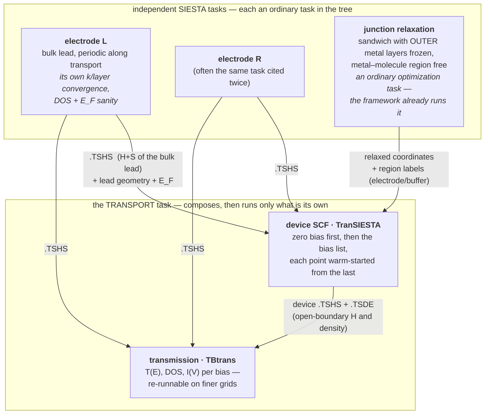

# Transport — the composite calculation, designed top-down

**Role:** plan (design of record once approved; graduates to a contract
when built)
**Domain:** execution
**Status:** DRAFT 2026-08-28 — for review. Nothing here is built; § 6
lists the decisions that are the user's.

**Companions:** [`execution/architecture.md`](?doc=execution/architecture.md)
§ 0 — the 2026-08-11 decision this fulfils (*transport is a different
KIND of job — coupled runs, one answer assembled from pieces — and gets a
first-class representation, not a ladder bent out of shape*);
[`roadmap.md`](?doc=roadmap.md) § 2 — what of Phase B.3 already ships
(the device emitter, the electrode wizard, the device↔electrode
preflight); [`execution/job-contracts.md`](?doc=execution/job-contracts.md)
§ 2.5b — the citation language the slots reuse.

## The short version

**A transport calculation is not one run. It is an ASSEMBLY: two
electrode calculations and a relaxed junction, composed by citation
into a device self-consistency and a transmission post-processing.**
The user's model, which this design adopts verbatim: *individual SIESTA
tasks produce the independent pieces; the transport task PICKS finished
results out of the project tree — "this electrode from here, that
structure from there" — adds its own parameters, and runs only what is
its own.*

| key idea | one line | where |
|---|---|---|
| **open system** | a current-carrying junction is OPEN — NEGF replaces periodicity along transport with electrode self-energies | § 1 |
| **the artifact table** | each upstream task hands transport exactly one thing: electrode → `.TSHS` (+ geometry + E_F); relax → coordinates (+ region labels) | § 2 |
| **slots, by citation** | the transport task cites finished attempts in the tree; prep COPIES the cited artifacts in, so the folder stays portable | § 4 |
| **the compatibility gate** | basis · pseudos · XC · mesh · electronic T must MATCH across every cited piece — checked at prep, refused with the mismatched field named | § 3 |
| **update semantics** | move the molecule → re-run the device SCF (it IS H(geometry)); electrodes are reusable capital; re-relax only if relaxing was the intent | § 5 |
| **a bias scan is a sweep** | the fifth axis again: N bias points = a ParameterSet of length N, warm-started along the list — no new machinery | § 4.3 |

---

## 1. The science — what a transport calculation actually does

*(Full depth by design — R-W3's scientific exception.)*

### 1.1 The question, and why ordinary DFT cannot answer it

The experiment this models: a single molecule bridges two metal
electrodes; a bias voltage `V` is applied; a current `I` flows. Wanted:
`I(V)`, and the energy-resolved transmission `T(E)` that explains it.

An ordinary SIESTA calculation cannot answer this, for a structural
reason rather than an accuracy one: **DFT with periodic boundary
conditions describes a closed, charge-conserving system in
equilibrium.** A junction carrying current is neither. It is **open** —
electrons arrive from a semi-infinite left reservoir filled to chemical
potential `μ_L`, traverse the molecule, and drain into a right reservoir
filled to `μ_R = μ_L − eV`. Two different chemical potentials in one
system is exactly what equilibrium DFT forbids.

### 1.2 The NEGF partition — three regions, two of them infinite

The non-equilibrium Green's function method makes the openness exact by
partitioning space:

```
   ... ══╦══════════╦═══════╦═════════════════╦═══════╦══════════╦══ ...
  LEFT   ║ electrode║ left  ║    molecule     ║ right ║ electrode║  RIGHT
  bulk   ║  layers  ║surface║  (the "extended ║surface║  layers  ║  bulk
 (semi-  ║ (copied  ║layers ║   molecule")    ║layers ║ (copied  ║ (semi-
infinite)║ in cell) ║       ║                 ║       ║ in cell) ║infinite)
   ... ══╩══════════╩═══════╩═════════════════╩═══════╩══════════╩══ ...
         └──────────────  the DEVICE (scattering region)  ─────────┘
```

* The **leads** are perfect, periodic, semi-infinite crystals. Because
  they are periodic, their whole effect on the device is captured
  *exactly* by an energy-dependent **self-energy** `Σ_L(E)`, `Σ_R(E)`,
  computed from the lead's bulk Hamiltonian and overlap. No
  approximation is made in cutting the infinite system — that is the
  central mathematical fact of NEGF.
* The **device** (scattering region) is the molecule *plus enough
  electrode layers on each side* that, by its outer boundary, the
  electronic structure is indistinguishable from the bulk lead. Those
  copied-in layers are why the literature says "extended molecule":
  the metal–molecule chemistry (charge transfer, level alignment,
  image effects) happens inside the device, where it is treated in
  full DFT.

With the self-energies in hand, the device's retarded Green's function
is one matrix inversion per energy:

```
G(E) = [ E·S − H_device[ρ] − Σ_L(E) − Σ_R(E) ]⁻¹
```

and the current is the Landauer–Büttiker integral over the bias window:

```
T(E) = Tr[ Γ_L G Γ_R G† ]          Γ_i = i(Σ_i − Σ_i†)
I(V) = (2e/h) ∫ dE · T(E) · [ f(E−μ_L) − f(E−μ_R) ]
```

### 1.3 Why it is self-consistent — the part that makes it a real SCF run

`H_device[ρ]` depends on the density, and under NEGF the density is
built from the Green's function itself — an **equilibrium contour
integral** (the filled sea, done on a complex contour where G is
smooth) plus, at finite bias, a **real-axis integral across the bias
window** (the current-carrying, genuinely non-equilibrium states).
New density → new Hamiltonian → new G → new density, until
self-consistent. **That cycle is TranSIESTA**: SIESTA's SCF loop with
the k-periodic density along transport replaced by the NEGF density
under open boundary conditions, and with the electrostatics solved
under the boundary condition that the potential deep in each electrode
matches the bulk lead shifted by `±V/2`.

Two practical consequences that shape the workflow:

* **The device SCF is the expensive, geometry-dependent step.** It must
  be redone whenever the device Hamiltonian changes — which is to say,
  whenever any atom in the device moves (§ 5).
* **Transmission is cheap post-processing.** Once the converged device
  `H` exists, `T(E)`, DOS, and orbital-resolved analysis are
  non-self-consistent evaluations — a separate, fast program
  (**TBtrans**) that can be re-run freely on finer energy grids
  without touching the SCF.

### 1.4 The steps, and what each hands the next



**The artifact table — the precise answer to "what does transport take
from the other tasks":**

| upstream task | what it is | what transport consumes from it | conditions on it |
|---|---|---|---|
| **electrode** (per lead) | a bulk calculation of a few lead unit cells, periodic along the transport axis, with the H/S save switched on | the **`.TSHS` file** — the lead's Hamiltonian and overlap in SIESTA's basis, from which the self-energies are built; plus the **lead geometry** (the device's outer layers must replicate it) and the lead **Fermi level** | thick enough that only adjacent cells couple (the *principal layer* condition); its own convergence checks (k along transport, layers, DOS at E_F — a metal must have states there) are this task's business, done once and reused forever |
| **junction relaxation** | an ordinary optimization of the sandwich, outer metal layers frozen | the **relaxed coordinates**, with the structure's **region labels** (which atoms are left-electrode, right-electrode, buffer) riding along — the labels molbuilder's handoff already carries | the frozen outer layers must sit at the **bulk lead spacing** — they are the seam the self-energies attach to (§ 3) |
| **device SCF** (transport's own first stage) | TranSIESTA on the assembled sandwich | produces the **device `.TSHS` + `.TSDE`** consumed by TBtrans; at bias `V_{i+1}`, warm-starts from `V_i`'s `.TSDE` | initial guess: an ordinary periodic SIESTA pass on the same geometry (a cheap seed stage) or atomic densities |
| **transmission** (transport's own second stage) | TBtrans over device + electrode `.TSHS` | the deliverables: `T(E)`, DOS, `I(V)` | pure post-processing — re-runnable per energy grid without re-running the SCF |

---

## 2. Why this is a different KIND of task — and exactly how different

An optimization task is a **ladder**: stage feeds stage through warm
files, inside one calculation, one engine configuration throughout.

A transport task is a **junction of tasks**: its inputs are *finished
results of other calculations*, possibly made weeks apart, each with
its own convergence story — and one of them (the electrode) is
deliberately *reusable capital*, computed once per lead material and
cited by every junction that uses that lead. Bending this into a ladder
would force the electrode to be re-run inside every transport
calculation, which is both wasteful and scientifically wrong-headed:
the electrode's convergence is its own study.

What stays identical to every other task — deliberately, per
architecture § 0: the portable-folder rule, the verbs
(`init/prep/launch/summarize/status`), attempts, the template/catalogue
machinery for transport's own parameters, and the sweep axis (§ 4.3).
**Only the input model is new: slots filled by citation.**

---

## 3. The compatibility contract — the science gate that makes
composition safe

The self-energy `Σ(E)` is only meaningful if the electrode Hamiltonian
and the device Hamiltonian **speak the same language**. This is the
scientific heart of the design, and it is a *checkable contract*:

| must MATCH across device and every cited electrode | why |
|---|---|
| **basis set** (per species: same basis size/radii definitions) | `Σ` is expressed in the lead's orbitals; a different device basis makes the coupling blocks meaningless |
| **pseudopotentials** (same files, byte-identical) | different cores = different Hamiltonians wearing one label |
| **XC functional** | the lead and device must sit on one potential-energy surface |
| **mesh cutoff** (real-space grid) | the electrostatic matching at the seam assumes one grid convention |
| **electronic temperature / occupation smearing** | E_F alignment between lead and device assumes one occupation function |
| **spin treatment** | a polarized lead against an unpolarized device has no consistent E_F |
| **transverse k-grid compatibility** | `Σ(E, k_⊥)` is built per transverse k-point; the device's transverse grid must be commensurate |
| **geometry at the seam** | the device's outer layers must replicate the lead's layer geometry and spacing — the self-energy attaches where the device *becomes* the bulk lead |

**Where the gate runs:** at `prep`, across the *cited templates* — the
transport task holds citations (§ 4), each citation reaches a finished
calculation whose template records every row above, and prep compares
them field by field. A mismatch is a refusal that names the field and
both values, in the style every other gate already uses. The existing
`transport preflight` device↔electrode check is the seed of this gate;
the design extends it from "one .fdf pair" to "every cited piece."

The geometry seam check is the one row that needs the structures, not
the templates: the outer-layer coordinates of the relaxed junction are
compared against the electrode's layer geometry (allowing the rigid
translation), and a drifted seam — the relaxer moved atoms that should
have been frozen, or the frozen set was wrong — is refused with the
atom indices named.

---

## 4. The composition design

### 4.1 Slots, filled by citation

The transport task's `task.json` carries, beside the ordinary fields,
a **`slots`** section — the user's "pick this piece from here":

```jsonc
{
  "schema": "molbuilder/task@1",
  "engine": { "name": "siesta" },
  "calculation": "transport",
  "slots": {
    "electrode_left":  "AuLead/optimization/Au111Lead",   // a calculation, cited from the tree root
    "electrode_right": "AuLead/optimization/Au111Lead",   // the same source, cited twice, is normal
    "junction":        "BDT-Au/optimization/JunctionRelax"
  },
  "stages": [
    { "name": "device",       "enabled": true, "overrides": {} },
    { "name": "transmission", "enabled": true, "overrides": {} }
  ],
  "bias": { "voltages_v": [0.0, 0.2, 0.4] }
}
```

* A slot value is a **calculation citation** in the same tree-relative
  language every other path speaks (job-contracts § 2.5b). Which
  *attempt* of that calculation supplies the artifact follows the
  framework's existing resume rule — the latest **concluded** attempt —
  and prep says which one it picked; `slots.<name>@run-2` pins one
  explicitly when the user wants a specific attempt.
* **At `prep`, the cited artifacts are COPIED in** (electrode `.TSHS`s,
  the relaxed structure) — the transport folder then travels like any
  other, carrying everything it needs. A citation is how a slot is
  *filled*; it is not a live link. The provenance (which calculation,
  which attempt, content hash) is recorded beside each copy, so a
  result can always say exactly which electrode it was computed with.
* The gate of § 3 runs here, across the cited templates, before
  anything renders.

### 4.2 Transport's own stages

Two stages, the composite's own ladder — ordinary stages, ordinary
attempts:

1. **`device`** — the TranSIESTA SCF. At zero bias first; an optional
   leading periodic-SIESTA pass seeds the density matrix (§ 6 Q4).
2. **`transmission`** — TBtrans over the converged device. Its
   parameters (energy window, grid, k-sampling for transmission) are
   transport-template fields; re-running it on a finer grid is a new
   attempt of this stage, never a re-run of `device`.

### 4.3 A bias scan is a sweep — the fifth axis, again

`bias.voltages_v` with more than one entry is *exactly* the shape the
framework already bends for: **a ParameterSet of length N** (architecture
§ 0: "a benchmark is a list with more than one element"). Each bias
point renders as one configuration of the `device` stage,
**warm-started from the previous point's `.TSDE`** — the physically
correct ordering, since the SCF at `V_{i+1}` converges from `V_i`'s
non-equilibrium density far faster than from scratch — and the grouped
launch runs them in sequence like any sweep. `transmission` then maps
over the converged points. No new machinery; one new warm-file
vocabulary entry (`.TSDE` chains along the bias axis).

### 4.4 What retires

The pre-framework `transport bundle` three-run driver
(`transport/orchestrate.py`) retires when this ships — its job (run the
pieces in order) is exactly what the user's model replaces with *cite
finished pieces*. No shims (the standing rule): the composite is the
one way.

---

## 5. Update semantics — the vibration question, answered

*"If we later change the molecule's geometry — say, displace it along a
vibration mode — what is the right way to come back?"*

The dependency rule falls straight out of the artifact table: **a
change invalidates exactly the pieces whose inputs it touched, and
nothing upstream of them.**

| what changed | electrode | junction relax | device SCF | transmission |
|---|---|---|---|---|
| molecule displaced along a vibration mode | **reused** — no electrode atom moved | **no** — the displacement IS the intended geometry; re-relaxing would undo it | **must re-run** | re-runs |
| new junction conformation to explore (re-adsorption, different anchoring) | reused | **yes** — relax the new sandwich (frozen outer layers) | re-runs on the new relaxed structure | re-runs |
| more electrode layers / different lead lattice / new lead material | **re-run** | yes — the surface the molecule binds changed | re-runs | re-runs |
| basis, pseudos, XC, mesh, electronic T — anywhere | **everything re-runs.** The § 3 gate refuses a mixed assembly, so this cannot happen silently | ← | ← | ← |
| bias list extended | reused | no | **only the new points**, warm from the nearest computed bias | new points |
| finer transmission energy grid | reused | no | **no** | re-runs alone |

The physics behind the first row — the one the question was really
about: TranSIESTA *is* the map from geometry to open-boundary
Hamiltonian. There is no shortcut where updated positions are "exposed"
to an old Hamiltonian — transmission from stale `H` with new coordinates
answers a question nobody asked. But the expensive reusable pieces
(electrodes) genuinely are reusable, because no electrode atom moved.
So the workflow for a vibration study is: take the relaxed junction,
generate the displaced structures (the Spectrum tab's vibration modes
are the natural source — the Inelastica seam roadmap § 2 already
names), and for each displaced structure the transport task re-runs
`device` + `transmission` with the same cited electrodes. **In the
composition model that is: same slots, new `junction` citation (or a
structure override), new attempt.**

Whether to re-relax is *intent*, not physics the framework should
decide (the standing rule — the tool does not overstep): a frozen-phonon
displacement is deliberately un-relaxed; a new conformation wants a
relax first. Both are just "which structure the `junction` slot cites."

---

## 6. Open questions — the decisions that are the user's

1. **Slot granularity.** Cite the *calculation* and let the
   latest-concluded-attempt rule pick (with `@run-N` to pin), as
   proposed in § 4.1 — or require the explicit attempt always?
   *(Proposed: the calculation, with the pin available; prep prints
   which attempt it took.)*
2. **Strict composition.** The transport task never runs its upstream
   pieces — a missing/unconcluded slot is a refusal naming what to run
   first, not a trigger to run it. *(Proposed: yes — strictly compose;
   the old orchestrating driver retires. Matches your stated model.)*
3. **The seam check's tolerance.** The frozen-layer geometry comparison
   needs a tolerance (relaxers move "frozen" atoms by numerical dust).
   Propose: exact for declared-frozen atoms (they must be bitwise
   unmoved), and the check is on *lead-spacing replication* for the
   layer structure. Needs a look at real relaxed junctions before the
   number is fixed.
4. **The seed stage.** An ordinary periodic SIESTA pass on the device
   geometry before TranSIESTA (better initial density, catches setup
   errors cheaply) — on by default as stage 0, or opt-in?
   *(Proposed: on by default, skippable.)*
5. **Electrode task type.** Is `electrode` a new SIESTA calculation
   *kind* (its own template items: transport-axis periodicity, H/S
   save, its convergence checklist) — proposed — or an ordinary run
   with a convention? The kind gets the wizard's logic a permanent
   home and gives § 3's gate a template to read.
6. **Where the vibration seam lands.** The displaced-structure loop of
   § 5 (one transport re-run per mode, then IETS assembly) is the
   Inelastica engine's eventual territory (roadmap § 2). Design it as
   "a study over transport tasks" now, or leave the seam named and
   stop? *(Proposed: stop at naming it — one composite at a time.)*
