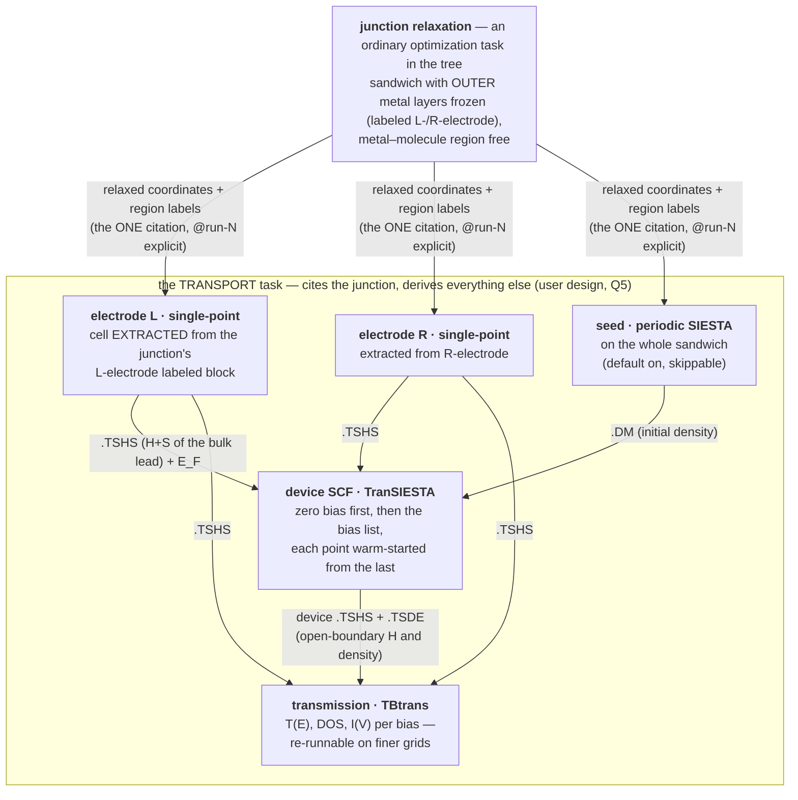

# Transport — the composite calculation, designed top-down

**Role:** plan (design of record once approved; graduates to a contract
when built)
**Domain:** execution
**Status:** DECIDED 2026-08-28 — all six § 6 questions answered by the
user the same day, including one design improvement of the user's own
(Q5: electrodes are DERIVED, not cited — § 4.1). Ready to plan the
build. Nothing is built yet.

**Companions:** [`execution/architecture.md`](?doc=execution/architecture.md)
§ 0 — the 2026-08-11 decision this fulfils (*transport is a different
KIND of job — coupled runs, one answer assembled from pieces — and gets a
first-class representation, not a ladder bent out of shape*);
[`roadmap.md`](?doc=roadmap.md) § 2 — what of Phase B.3 already ships
(the device emitter, the electrode wizard, the device↔electrode
preflight); [`execution/job-contracts.md`](?doc=execution/job-contracts.md)
§ 2.5b — the citation language the slots reuse.

## The short version

**A transport calculation is not one run. It is an ASSEMBLY built
from ONE cited result — the relaxed junction — from which everything
else is derived.** The user's model (2026-08-28, refined by their own
Q5 answer): *the junction relaxation is an ordinary task in the tree;
the transport task cites its finished attempt explicitly, EXTRACTS the
two electrode cells from the structure's own `L-electrode` /
`R-electrode` labeled blocks, and runs its internal ladder — electrode
single-points, seed, device SCF, transmission — so a wrong metal
structure or a parameter mismatch is impossible by construction.*

| key idea | one line | where |
|---|---|---|
| **open system** | a current-carrying junction is OPEN — NEGF replaces periodicity along transport with electrode self-energies | § 1 |
| **the artifact table** | what each step hands the next: relax → coordinates + labels; electrode sub-stages → `.TSHS` + E_F; device → `.TSHS`/`.TSDE` for TBtrans | § 1.4 |
| **one slot, by citation** | the transport task cites ONE finished attempt — the relaxed junction, named explicitly (`...@run-N`); prep COPIES the structure in, so the folder stays portable | § 4 |
| **electrodes are derived** | the two electrode single-points are INTERNAL sub-stages, built from the junction's own `L-electrode`/`R-electrode` labeled blocks — parameter and geometry mismatch impossible by construction (user design, Q5) | § 3, § 4.2 |
| **the internal gate** | the labeled blocks must TILE as bulk (frozen atoms unmoved, bulk spacing) and be thick enough for the principal-layer condition — refused naming the atoms | § 3 |
| **the categorical sort** | TranSIESTA reads electrodes by POSITION, so prep sorts the copied structure into `[L][bridge][R]` (buffers outermost), checks every atom is labeled and none is lost, and records the permutation — relaxation order stays free | § 4.1a |
| **update semantics** | move the molecule → a new transport attempt (device SCF re-runs — it IS H(geometry)); the derived electrodes rebuild identically from the unmoved labels; re-relax only if relaxing was the intent | § 5 |
| **a bias scan is a sweep** | the fifth axis again: N bias points = a ParameterSet of length N, warm-started along the list — no new machinery | § 4.3 |

---

## 1. The science — what a transport calculation actually does

*(Full depth by design — R-W3's scientific exception.)*

### 1.1 The question, and why ordinary DFT cannot answer it

The experiment this models: a single molecule bridges two metal
electrodes; a bias voltage `V` is applied; a current `I` flows. Wanted:
`I(V)`, and the energy-resolved transmission `T(E)` that explains it.

An ordinary SIESTA calculation cannot answer this, for a structural
reason rather than an accuracy one: **DFT with periodic boundary
conditions describes a closed, charge-conserving system in
equilibrium.** A junction carrying current is neither. It is **open** —
electrons arrive from a semi-infinite left reservoir filled to chemical
potential `μ_L`, traverse the molecule, and drain into a right reservoir
filled to `μ_R = μ_L − eV`. Two different chemical potentials in one
system is exactly what equilibrium DFT forbids.

### 1.2 The NEGF partition — three regions, two of them infinite

The non-equilibrium Green's function method makes the openness exact by
partitioning space:

```
   ... ══╦══════════╦═══════╦═════════════════╦═══════╦══════════╦══ ...
  LEFT   ║ electrode║ left  ║    molecule     ║ right ║ electrode║  RIGHT
  bulk   ║  layers  ║surface║  (the "extended ║surface║  layers  ║  bulk
 (semi-  ║ (copied  ║layers ║   molecule")    ║layers ║ (copied  ║ (semi-
infinite)║ in cell) ║       ║                 ║       ║ in cell) ║infinite)
   ... ══╩══════════╩═══════╩═════════════════╩═══════╩══════════╩══ ...
         └──────────────  the DEVICE (scattering region)  ─────────┘
```

* The **leads** are perfect, periodic, semi-infinite crystals. Because
  they are periodic, their whole effect on the device is captured
  *exactly* by an energy-dependent **self-energy** `Σ_L(E)`, `Σ_R(E)`,
  computed from the lead's bulk Hamiltonian and overlap. No
  approximation is made in cutting the infinite system — that is the
  central mathematical fact of NEGF.
* The **device** (scattering region) is the molecule *plus enough
  electrode layers on each side* that, by its outer boundary, the
  electronic structure is indistinguishable from the bulk lead. Those
  copied-in layers are why the literature says "extended molecule":
  the metal–molecule chemistry (charge transfer, level alignment,
  image effects) happens inside the device, where it is treated in
  full DFT.

With the self-energies in hand, the device's retarded Green's function
is one matrix inversion per energy:

```
G(E) = [ E·S − H_device[ρ] − Σ_L(E) − Σ_R(E) ]⁻¹
```

and the current is the Landauer–Büttiker integral over the bias window:

```
T(E) = Tr[ Γ_L G Γ_R G† ]          Γ_i = i(Σ_i − Σ_i†)
I(V) = (2e/h) ∫ dE · T(E) · [ f(E−μ_L) − f(E−μ_R) ]
```

### 1.3 Why it is self-consistent — the part that makes it a real SCF run

`H_device[ρ]` depends on the density, and under NEGF the density is
built from the Green's function itself — an **equilibrium contour
integral** (the filled sea, done on a complex contour where G is
smooth) plus, at finite bias, a **real-axis integral across the bias
window** (the current-carrying, genuinely non-equilibrium states).
New density → new Hamiltonian → new G → new density, until
self-consistent. **That cycle is TranSIESTA**: SIESTA's SCF loop with
the k-periodic density along transport replaced by the NEGF density
under open boundary conditions, and with the electrostatics solved
under the boundary condition that the potential deep in each electrode
matches the bulk lead shifted by `±V/2`.

Two practical consequences that shape the workflow:

* **The device SCF is the expensive, geometry-dependent step.** It must
  be redone whenever the device Hamiltonian changes — which is to say,
  whenever any atom in the device moves (§ 5).
* **Transmission is cheap post-processing.** Once the converged device
  `H` exists, `T(E)`, DOS, and orbital-resolved analysis are
  non-self-consistent evaluations — a separate, fast program
  (**TBtrans**) that can be re-run freely on finer energy grids
  without touching the SCF.

### 1.4 The steps, and what each hands the next



**The artifact table — the precise answer to "what does transport take
from the other tasks":**

| upstream task | what it is | what transport consumes from it | conditions on it |
|---|---|---|---|
| **electrode** (per lead) | a bulk calculation of a few lead unit cells, periodic along the transport axis, with the H/S save switched on | the **`.TSHS` file** — the lead's Hamiltonian and overlap in SIESTA's basis, from which the self-energies are built; plus the **lead geometry** (the device's outer layers must replicate it) and the lead **Fermi level** | thick enough that only adjacent cells couple (the *principal layer* condition); its own convergence checks (k along transport, layers, DOS at E_F — a metal must have states there) are this task's business, done once and reused forever |
| **junction relaxation** | an ordinary optimization of the sandwich, outer metal layers frozen | the **relaxed coordinates**, with the structure's **region labels** (which atoms are left-electrode, right-electrode, buffer) riding along — the labels molbuilder's handoff already carries | the frozen outer layers must sit at the **bulk lead spacing** — they are the seam the self-energies attach to (§ 3) |
| **device SCF** (transport's own first stage) | TranSIESTA on the assembled sandwich | produces the **device `.TSHS` + `.TSDE`** consumed by TBtrans; at bias `V_{i+1}`, warm-starts from `V_i`'s `.TSDE` | initial guess: an ordinary periodic SIESTA pass on the same geometry (a cheap seed stage) or atomic densities |
| **transmission** (transport's own second stage) | TBtrans over device + electrode `.TSHS` | the deliverables: `T(E)`, DOS, `I(V)` | pure post-processing — re-runnable per energy grid without re-running the SCF |

---

## 2. Why this is a different KIND of task — and exactly how different

An optimization task is a **ladder**: stage feeds stage through warm
files, inside one calculation, one engine configuration throughout.

A transport task **starts from another task's finished result**: its
input is the relaxed junction, made separately, with its own
convergence story — and its internal ladder is not a parameter ladder
but a DAG of *different programs* (electrode extraction → single-points,
seed, TranSIESTA, TBtrans) whose stages exchange different kinds of
files. The electrodes are deliberately NOT independent tasks (user
ruling Q5): deriving them from the junction's own labeled blocks makes
every compatibility error unrepresentable, and an electrode
single-point is cheap enough that re-deriving per transport task costs
nothing worth caching across tasks.

What stays identical to every other task — deliberately, per
architecture § 0: the portable-folder rule, the verbs
(`init/prep/launch/summarize/status`), attempts, the template/catalogue
machinery for transport's own parameters, and the sweep axis (§ 4.3).
**Only the input model is new: slots filled by citation.**

---

## 3. The gate — what must still be checked when nothing is cited

The user's Q5 design removes the cross-task compatibility problem at
the root: electrode and device share one template, one basis, one set
of pseudos, one XC, one mesh, one electronic temperature — *because
they are one calculation*. The table below is kept as the scientific
record of what the derivation guarantees by construction:

| guaranteed by construction (Q5) | why it matters |
|---|---|
| basis · pseudos · XC · mesh · electronic T · spin identical between electrode and device | the self-energy `Σ(E)` is only meaningful if lead and device Hamiltonians speak one language |
| transverse cell and k-grid identical | `Σ(E, k_⊥)` is built per transverse k-point |
| electrode geometry = the device's boundary geometry | the self-energy attaches where the device *becomes* the bulk lead |

What remains is **internal honesty about the labeled blocks**, checked
at prep, refusals naming the atoms (user ruling Q3):

* **Frozen means unmoved.** The relaxer must not have moved any atom
  labeled `L-electrode`/`R-electrode` (tolerance: arithmetic dust
  only). A moved "frozen" atom means the constraint was wrong or
  dropped — refuse with the indices and displacements.
* **The block must tile.** Repeating the labeled block along the
  transport axis must reproduce a bulk lead — the layers sit at bulk
  spacing with a well-defined period. A block that does not tile
  (wrong label boundary, a partial layer) is refused naming the layer
  spacing it found.
* **Thick enough — the principal-layer condition.** The extracted cell
  must be long enough along transport that SIESTA's orbitals couple
  only to adjacent cells. Too thin → refuse: *"orbital range X Å
  exceeds the L-electrode block's period Y Å — label more layers."*
* **Buffer sanity.** Atoms labeled buffer (excluded from the NEGF
  region) must sit outside the electrode blocks; `TS.Atoms.Buffer`
  emission is the half of region consumption roadmap § 2 records as
  missing, and lands with this.

## 4. The composition design

### 4.1 One slot, one explicit citation

The transport task's `task.json` carries a single slot — the user's
"pick the relaxed junction from here" — with the attempt named
**explicitly, always** (user ruling Q1):

```jsonc
{
  "schema": "molbuilder/task@1",
  "engine": { "name": "siesta" },
  "calculation": "transport",
  "slots": {
    "junction": "BDT-Au/optimization/JunctionRelax@run-2"
  },
  "stages": [
    { "name": "seed",         "enabled": true,  "overrides": {} },
    { "name": "electrode_L",  "enabled": true,  "overrides": {} },
    { "name": "electrode_R",  "enabled": true,  "overrides": {} },
    { "name": "device",       "enabled": true,  "overrides": {} },
    { "name": "transmission", "enabled": true,  "overrides": {} }
  ],
  "bias": { "voltages_v": [0.0, 0.2, 0.4] }
}
```

* The citation is tree-relative, the same path language everything
  speaks; `@run-N` is mandatory — nothing is ever picked for the user.
* **Strict composition** (user ruling Q2): a missing or unconcluded
  citation is a refusal naming exactly what to run first — the
  transport task never runs its upstream pieces.
* **At `prep`, the cited structure is COPIED in** with provenance
  (calculation, attempt, content hash) recorded beside it — the
  transport folder then travels like any other. The § 3 gate runs on
  the copy before anything renders.

### 4.1a The atom-order contract — the categorical sort *(user, 2026-08-28)*

**The requirement, validated.** TranSIESTA identifies electrode atoms
by POSITION in the device's atom list, not by any label:

* In the classic form (Brandbyge et al., *Phys. Rev. B* **65**, 165401
  (2002) § III; manual keywords `TS.NumUsedAtomsLeft/Right`), *"the
  first N atoms ARE the left electrode, the last M the right"* — the
  layout `[L-electrode][bridge][R-electrode]` is mandatory.
* In the 4.1+ N-electrode form (Papior et al., *Comput. Phys. Commun.*
  **212**, 8 (2017); `%block TS.Elec` with `elec-pos`), an electrode is
  declared by the index of its first atom — and its atoms must sit
  **consecutively** from there, **in the same order as the electrode
  calculation's atoms**, because the self-energy is attached
  positionally; TranSIESTA cross-checks the coordinates and a mismatch
  is fatal (or, worse in the old form, silent).
* The repo already knew: `engines/transport.md` ("atom-ordering is
  load-bearing") and the emitter's preflight refuse an out-of-order
  structure today, with "a reorder affordance" noted as planned. This
  section is that plan.

**Relaxation order stays free.** The 0-based source-file order IS the
atom identity everywhere else (`data-vocabulary.md` § 3.1,
`engine_atom_index.py`), and no optimization cares about it. The sort
is transport's business alone, and it happens at **transport prep, on
the copied-in citation** — the cited attempt is never mutated.

**The sort.** A categorical sort by region label into the canonical
layout, buffers outermost:

```
[ buffer_L ][ L-electrode ][ bridge ][ R-electrode ][ buffer_R ]
  index 1 →                                          → index N
```

* **Within each electrode block**: sorted by transport coordinate
  (layer-major), then transverse coordinates — deterministic, and
  tiling-friendly. Because the electrode CELL is then extracted from
  this very block (§ 4.2), the device block and the electrode
  calculation share one ordering **by construction** — the positional
  correspondence TranSIESTA verifies is automatic. (Q5's payoff,
  again.)
* **Within the bridge**: the original relative order is preserved
  (stable sort) — no physics depends on it, and stability keeps the
  user's mental map of their molecule intact.

**The two checks, refusals naming atoms** (the user's "make sure
nothing is missed"):

1. **Every atom carries exactly one label** — `L-electrode`,
   `R-electrode`, `bridge`, or buffer. An unlabeled atom is refused by
   index and element ("atom 37 (C) carries no region label"), because
   an unlabeled atom has no place in the canonical order and TranSIESTA
   would misassign it silently.
2. **The sort is a bijection** — same count, same element-and-position
   multiset, every original atom exactly once in the sorted list.
   Checked mechanically after the sort; any discrepancy is a bug
   refused loudly, never a warning.

**The permutation is recorded.** A sidecar map (original index ↔
sorted index) is written beside the sorted structure. Everything
downstream — forces, per-atom output, the 1-based indices the UI and
the engine files display — maps back to the relaxation's identities
through it; `engine_atom_index.py` stays the one 0↔1-based door on
top.

**What this replaces:** the emitter's current refusal ("re-export a
contiguous-ordered structure by hand") becomes unreachable in the
composite — prep sorts, so the order is always canonical. The refusal
stays in the emitter as defense in depth.

### 4.2 The internal ladder — five stages, all the task's own

At prep, before any stage renders: **copy the citation → categorical
sort + the two checks (§ 4.1a) → frozen/tiling gate (§ 3) → extract
the electrode cells from the sorted ends.** Then the stages:

1. **`seed`** — an ordinary periodic SIESTA pass on the sandwich;
   its `.DM` starts the device SCF. **Default on, skippable** (user
   ruling Q4): scaffolding for convergence and a cheap setup-error
   catch, with no effect on the converged answer.
2. **`electrode_L`** / **`electrode_R`** — the cells EXTRACTED from
   the junction's labeled blocks (the existing wizard's move, made
   the architecture); single-point SCF each, H/S save on → `.TSHS`.
   Cheap; run per task, cached by nothing (Q5's trade-off, accepted).
3. **`device`** — the TranSIESTA SCF: zero bias first, then the bias
   list (§ 4.3), consuming both `.TSHS` files and the seed's `.DM`.
4. **`transmission`** — TBtrans over the converged device; its energy
   window / grid / k-sampling are transport-template fields, and a
   finer grid is a new attempt of THIS stage only.

### 4.3 A bias scan is a sweep — the fifth axis, again

`bias.voltages_v` with more than one entry is *exactly* the shape the
framework already bends for: **a ParameterSet of length N** (architecture
§ 0: "a benchmark is a list with more than one element"). Each bias
point renders as one configuration of the `device` stage,
**warm-started from the previous point's `.TSDE`** — the physically
correct ordering, since the SCF at `V_{i+1}` converges from `V_i`'s
non-equilibrium density far faster than from scratch — and the grouped
launch runs them in sequence like any sweep. `transmission` then maps
over the converged points. No new machinery; one new warm-file
vocabulary entry (`.TSDE` chains along the bias axis).

### 4.4 What retires

The pre-framework `transport bundle` three-run driver
(`transport/orchestrate.py`) retires when this ships — its job (run the
pieces in order) is exactly what the user's model replaces with *cite
finished pieces*. No shims (the standing rule): the composite is the
one way.

---

## 5. Update semantics — the vibration question, answered

*"If we later change the molecule's geometry — say, displace it along a
vibration mode — what is the right way to come back?"*

The dependency rule falls straight out of the artifact table: **a
change invalidates exactly the pieces whose inputs it touched, and
nothing upstream of them.**

| what changed | electrode sub-stages | junction relax | device SCF | transmission |
|---|---|---|---|---|
| molecule displaced along a vibration mode | re-derive from the unmoved labeled blocks — cheap, bit-identical result | **no** — the displacement IS the intended geometry; re-relaxing would undo it | **must re-run** | re-runs |
| new junction conformation to explore (re-adsorption, different anchoring) | re-derive (unchanged if the frozen blocks are) | **yes** — relax the new sandwich (frozen outer layers) | re-runs on the new relaxed structure | re-runs |
| more electrode layers / different lead lattice / new lead material | re-derive from the NEW junction's blocks — automatic under Q5 | yes — the surface the molecule binds changed | re-runs | re-runs |
| basis, pseudos, XC, mesh, electronic T | one template governs everything (Q5), so a change re-runs the whole task — a mixed assembly is unrepresentable | ← | ← | ← |
| bias list extended | unchanged | no | **only the new points**, warm from the nearest computed bias | new points |
| finer transmission energy grid | unchanged | no | **no** | re-runs alone |

The physics behind the first row — the one the question was really
about: TranSIESTA *is* the map from geometry to open-boundary
Hamiltonian. There is no shortcut where updated positions are "exposed"
to an old Hamiltonian — transmission from stale `H` with new coordinates
answers a question nobody asked. But the expensive reusable pieces
(electrodes) genuinely are reusable, because no electrode atom moved.
So the workflow for a vibration study is: take the relaxed junction,
generate the displaced structures (the Spectrum tab's vibration modes
are the natural source — the Inelastica seam roadmap § 2 already
names), and for each displaced structure the transport task re-runs its
ladder — the derived electrodes rebuild bit-identically from the
unmoved labeled blocks, and `device` + `transmission` do the real
work. **In the composition model that is: a new `junction` citation
per displaced structure, one transport run each** (ruling Q6: the
study-over-runs machinery waits until the composite is proven).

Whether to re-relax is *intent*, not physics the framework should
decide (the standing rule — the tool does not overstep): a frozen-phonon
displacement is deliberately un-relaxed; a new conformation wants a
relax first. Both are just "which structure the `junction` slot cites."

---

## 6. The six questions — asked and answered (2026-08-28)

| # | question | ruling |
|---|---|---|
| 1 | slot granularity | **explicit attempt always** — `@run-N` is mandatory; nothing is picked for the user |
| 2 | strict composition | **yes** — transport never runs its upstream pieces; a missing/unconcluded citation refuses naming what to run first; the old `transport bundle` driver retires |
| 3 | the seam check | **refuse, naming atoms** — frozen labels bitwise unmoved, blocks must tile, principal-layer thickness enforced (§ 3) |
| 4 | the seed stage | **default on, skippable** |
| 5 | electrode task type | **neither offered option — the user's own design, adopted**: electrodes are not tasks at all; they are internal sub-stages EXTRACTED from the junction's labeled blocks, making structure and parameter mismatch impossible by construction. Trade-off accepted: no cross-task electrode reuse (single-points are cheap) |
| 6 | vibration/IETS scope | **name the seam, stop** — a displaced structure is a new `junction` citation; the study machinery waits for the proven composite |
| 7 | *(user-added, same day)* atom order | **the categorical sort at transport prep** (§ 4.1a): TranSIESTA's positional electrode identification demands `[L][bridge][R]`; relaxation order stays free; the sort is checked (all labeled, bijection) and its permutation recorded |
