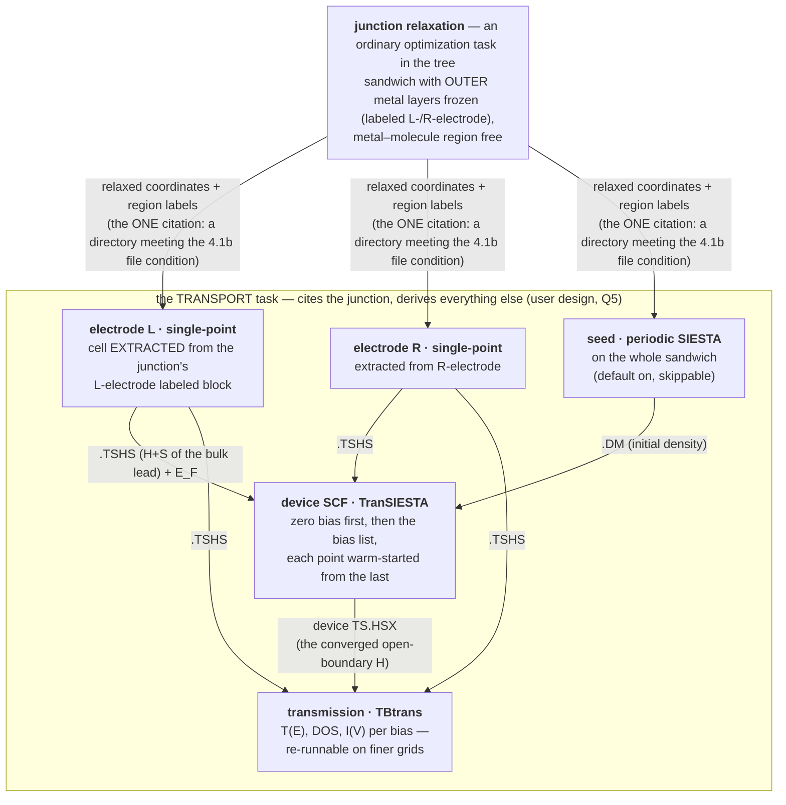

# Transport — the composite calculation, designed top-down

**Role:** plan (design of record once approved; graduates to a contract
when built)
**Domain:** execution
**Status:** BUILT — decided 2026-08-28 (all six § 6 questions answered
by the user the same day, including one design improvement of the user's
own: Q5, electrodes are DERIVED, not cited — § 4.1); P1–P7 shipped
2026-08-29 and proven end-to-end on real binaries (§ 7 records each row's
closure).  The rules graduate into `engines/transport.md` +
`job-contracts.md`; this file remains the design record.

**Companions:** [`execution/architecture.md`](?doc=execution/architecture.md)
§ 0 — the 2026-08-11 decision this fulfils (*transport is a different
KIND of job — coupled runs, one answer assembled from pieces — and gets a
first-class representation, not a ladder bent out of shape*);
[`roadmap.md`](?doc=roadmap.md) § 2 — what of Phase B.3 already ships
(the device emitter, the electrode wizard, the device↔electrode
preflight); [`execution/job-contracts.md`](?doc=execution/job-contracts.md)
§ 2.5b — the citation language the slots reuse.

## The short version

**A transport calculation is not one run. It is an ASSEMBLY built
from ONE cited result — the relaxed junction — from which everything
else is derived.** The user's model (2026-08-28, refined by their own
Q5 answer): *the junction relaxation is an ordinary task in the tree;
the transport task cites its finished attempt explicitly, EXTRACTS the
two electrode cells from the structure's own `L-electrode` /
`R-electrode` labeled blocks, and runs its internal ladder — electrode
single-points, seed, device SCF, transmission — so a wrong metal
structure or a parameter mismatch is impossible by construction.*

| key idea | one line | where |
|---|---|---|
| **open system** | a current-carrying junction is OPEN — NEGF replaces periodicity along transport with electrode self-energies | § 1 |
| **the artifact table** | what each step hands the next: relax → coordinates + labels; electrode sub-stages → `.TSHS` + E_F; device → `TS.HSX` for TBtrans, `.TSDE` for the bias chain | § 1.4 |
| **one slot, by citation** | the transport task cites ONE directory that satisfies the file condition (§ 4.1b — a finished relaxation's `.fdf`+`.XV`, or a labeled `.xyz`+`.molstruct.json` pair); prep COPIES the structure in, so the folder stays portable | § 4 |
| **electrodes are derived** | the two electrode single-points are INTERNAL sub-stages, built from the junction's own `L-electrode`/`R-electrode` labeled blocks — parameter and geometry mismatch impossible by construction (user design, Q5) | § 3, § 4.2 |
| **the internal gate** | the labeled blocks must TILE as bulk (frozen atoms unmoved, bulk spacing) and be thick enough for the principal-layer condition — refused naming the atoms | § 3 |
| **the categorical sort** | TranSIESTA reads electrodes by POSITION, so prep sorts the copied structure into `[L][bridge][R]` (buffers outermost), checks every atom is labeled and none is lost, and records the permutation — relaxation order stays free | § 4.1a |
| **update semantics** | move the molecule → a new transport attempt (device SCF re-runs — it IS H(geometry)); the derived electrodes rebuild identically from the unmoved labels; re-relax only if relaxing was the intent | § 5 |
| **a bias scan is a sweep** | the fifth axis again: N bias points, one attempt ladder per point (plain v-dirs), warm-started along the list by one chain submission | § 4.3 |

---

## 1. The science — what a transport calculation actually does

*(Full depth by design — R-W3's scientific exception.)*

### 1.1 The question, and why ordinary DFT cannot answer it

The experiment this models: a single molecule bridges two metal
electrodes; a bias voltage `V` is applied; a current `I` flows. Wanted:
`I(V)`, and the energy-resolved transmission `T(E)` that explains it.

An ordinary SIESTA calculation cannot answer this, for a structural
reason rather than an accuracy one: **DFT with periodic boundary
conditions describes a closed, charge-conserving system in
equilibrium.** A junction carrying current is neither. It is **open** —
electrons arrive from a semi-infinite left reservoir filled to chemical
potential `μ_L`, traverse the molecule, and drain into a right reservoir
filled to `μ_R = μ_L − eV`. Two different chemical potentials in one
system is exactly what equilibrium DFT forbids.

### 1.2 The NEGF partition — three regions, two of them infinite

The non-equilibrium Green's function method makes the openness exact by
partitioning space:

```
   ... ══╦══════════╦═══════╦═════════════════╦═══════╦══════════╦══ ...
  LEFT   ║ electrode║ left  ║    molecule     ║ right ║ electrode║  RIGHT
  bulk   ║  layers  ║surface║  (the "extended ║surface║  layers  ║  bulk
 (semi-  ║ (copied  ║layers ║   molecule")    ║layers ║ (copied  ║ (semi-
infinite)║ in cell) ║       ║                 ║       ║ in cell) ║infinite)
   ... ══╩══════════╩═══════╩═════════════════╩═══════╩══════════╩══ ...
         └──────────────  the DEVICE (scattering region)  ─────────┘
```

* The **leads** are perfect, periodic, semi-infinite crystals. Because
  they are periodic, their whole effect on the device is captured
  *exactly* by an energy-dependent **self-energy** `Σ_L(E)`, `Σ_R(E)`,
  computed from the lead's bulk Hamiltonian and overlap. No
  approximation is made in cutting the infinite system — that is the
  central mathematical fact of NEGF.
* The **device** (scattering region) is the molecule *plus enough
  electrode layers on each side* that, by its outer boundary, the
  electronic structure is indistinguishable from the bulk lead. Those
  copied-in layers are why the literature says "extended molecule":
  the metal–molecule chemistry (charge transfer, level alignment,
  image effects) happens inside the device, where it is treated in
  full DFT.

With the self-energies in hand, the device's retarded Green's function
is one matrix inversion per energy:

```
G(E) = [ E·S − H_device[ρ] − Σ_L(E) − Σ_R(E) ]⁻¹
```

and the current is the Landauer–Büttiker integral over the bias window:

```
T(E) = Tr[ Γ_L G Γ_R G† ]          Γ_i = i(Σ_i − Σ_i†)
I(V) = (2e/h) ∫ dE · T(E) · [ f(E−μ_L) − f(E−μ_R) ]
```

### 1.3 Why it is self-consistent — the part that makes it a real SCF run

`H_device[ρ]` depends on the density, and under NEGF the density is
built from the Green's function itself — an **equilibrium contour
integral** (the filled sea, done on a complex contour where G is
smooth) plus, at finite bias, a **real-axis integral across the bias
window** (the current-carrying, genuinely non-equilibrium states).
New density → new Hamiltonian → new G → new density, until
self-consistent. **That cycle is TranSIESTA**: SIESTA's SCF loop with
the k-periodic density along transport replaced by the NEGF density
under open boundary conditions, and with the electrostatics solved
under the boundary condition that the potential deep in each electrode
matches the bulk lead shifted by `±V/2`.

Two practical consequences that shape the workflow:

* **The device SCF is the expensive, geometry-dependent step.** It must
  be redone whenever the device Hamiltonian changes — which is to say,
  whenever any atom in the device moves (§ 5).
* **Transmission is cheap post-processing.** Once the converged device
  `H` exists, `T(E)`, DOS, and orbital-resolved analysis are
  non-self-consistent evaluations — a separate, fast program
  (**TBtrans**) that can be re-run freely on finer energy grids
  without touching the SCF.

### 1.4 The steps, and what each hands the next



**The artifact table — the precise answer to "what does each step hand
the next":**

| step | what it is | what it hands on | conditions on it |
|---|---|---|---|
| **junction relaxation** *(the one upstream task, cited)* | an ordinary optimization of the sandwich, outer metal layers frozen | the **relaxed coordinates**, with the structure's **region labels** (`L-electrode` / `R-electrode` / `bridge`, optional `buffer` and `interface`) riding along — the labels the Modify tab assigns | the frozen outer layers must sit at the **bulk lead spacing** — they are the seam the self-energies attach to (§ 3), and the blocks transport will extract |
| **electrode single-points** *(transport's own sub-stages, one per lead)* | the cell EXTRACTED from the labeled block, periodic along the transport axis, single-point SCF with the H/S save on | the **`.TSHS` file** — the lead's Hamiltonian and overlap in SIESTA's basis, from which the self-energies are built — and the lead **Fermi level** | thick enough that only adjacent cells couple (the *principal layer* condition, checked at prep § 3); a metal must have states at E_F (a DOS sanity worth a warning) |
| **device SCF** (transport's own first stage) | TranSIESTA on the assembled sandwich | produces the **device `TS.HSX`** (SIESTA 5.x's sparse H container; the 4.x device `.TSHS` retired with it) consumed by TBtrans, and the `.TSDE` the bias chain hands forward; at bias `V_{i+1}`, warm-starts from `V_i`'s `.TSDE` | initial guess: an ordinary periodic SIESTA pass on the same geometry (a cheap seed stage) or atomic densities |
| **transmission** (transport's own second stage) | TBtrans over the device `TS.HSX` + electrode `.TSHS` (the deck says `TBT.HS` explicitly — tbtrans 5.x otherwise looks for a `.HSX` that TranSIESTA does not write; measured live 2026-08-29) | the deliverables: `T(E)`, DOS, `I(V)` | pure post-processing — re-runnable per energy grid without re-running the SCF |

---

## 2. Why this is a different KIND of task — and exactly how different

An optimization task is a **ladder**: stage feeds stage through warm
files, inside one calculation, one engine configuration throughout.

A transport task **starts from another task's finished result**: its
input is the relaxed junction, made separately, with its own
convergence story — and its internal ladder is not a parameter ladder
but a DAG of *different programs* (electrode extraction → single-points,
seed, TranSIESTA, TBtrans) whose stages exchange different kinds of
files. The electrodes are deliberately NOT independent tasks (user
ruling Q5): deriving them from the junction's own labeled blocks makes
every compatibility error unrepresentable, and an electrode
single-point is cheap enough that re-deriving per transport task costs
nothing worth caching across tasks.

What stays identical to every other task — deliberately, per
architecture § 0: the portable-folder rule, the verbs
(`init/prep/launch/summarize/status`), attempts, the template/catalogue
machinery for transport's own parameters, and the sweep axis (§ 4.3).
**Only the input model is new: one slot, filled by an explicit citation.**

---

## 3. The gate — what must still be checked when nothing is cited

The user's Q5 design removes the cross-task compatibility problem at
the root: electrode and device share one template, one basis, one set
of pseudos, one XC, one mesh, one electronic temperature — *because
they are one calculation*. The table below is kept as the scientific
record of what the derivation guarantees by construction:

| guaranteed by construction (Q5) | why it matters |
|---|---|
| basis · pseudos · XC · mesh · electronic T · spin identical between electrode and device | the self-energy `Σ(E)` is only meaningful if lead and device Hamiltonians speak one language |
| transverse cell and k-grid identical | `Σ(E, k_⊥)` is built per transverse k-point |
| electrode geometry = the device's boundary geometry | the self-energy attaches where the device *becomes* the bulk lead |

What remains is **internal honesty about the labeled blocks**, checked
at prep, refusals naming the atoms (user ruling Q3):

* **Frozen means unmoved.** The relaxer must not have moved any atom
  labeled `L-electrode`/`R-electrode` (tolerance: arithmetic dust
  only). A moved "frozen" atom means the constraint was wrong or
  dropped — refuse with the indices and displacements.
* **The block must tile.** Repeating the labeled block along the
  transport axis must reproduce a bulk lead — the layers sit at bulk
  spacing with a well-defined period. A block that does not tile
  (wrong label boundary, a partial layer) is refused naming the layer
  spacing it found.
* **Thick enough — the principal-layer condition.** The extracted cell
  must be long enough along transport that SIESTA's orbitals couple
  only to adjacent cells. Too thin → refuse: *"orbital range X Å
  exceeds the L-electrode block's period Y Å — label more layers."*
* **Buffer sanity.** Atoms labeled buffer (excluded from the NEGF
  region) must sit outside the electrode blocks; `TS.Atoms.Buffer`
  emission is the half of region consumption roadmap § 2 records as
  missing, and lands with this.

## 4. The composition design

### 4.1 One slot, one explicit citation

The transport task's `task.json` carries a single slot — the user's
"pick the relaxed junction from here" — a **directory named
explicitly, always** (user ruling Q1):

```jsonc
{
  "schema": "molbuilder/task@1",
  "engine": { "name": "siesta" },
  "calculation": "transport",
  "slots": {
    "junction": "BDT-Au/optimization/JunctionRelax/01_coarse/run-2"
  },
  "stages": [
    { "name": "seed",         "enabled": true,  "overrides": {} },
    { "name": "electrode_L",  "enabled": true,  "overrides": {} },
    { "name": "electrode_R",  "enabled": true,  "overrides": {} },
    { "name": "device",       "enabled": true,  "overrides": {} },
    { "name": "transmission", "enabled": true,  "overrides": {} }
  ],
  "bias": { "voltages_v": [0.0, 0.2, 0.4] }
}
```

* The citation is a **tree-relative directory path**, the same path
  language everything speaks.  What makes the directory citable is
  § 4.1b's file condition — never its name, never where it sits.
  *(Amended 2026-08-29, second user ruling: the original spelling
  `<calc>@<stage>/run-N` bound the citation to molbuilder's own
  attempt layout — "your design assumes too much about how the user
  wants to do the calculation."  The `@` grammar retired with it; a
  molbuilder attempt directory satisfies the condition naturally, so
  the tree case is one instance, not the rule.)*  Mandatory always.
* **Strict composition** (user ruling Q2): a citation whose directory
  fails the § 4.1b condition is a refusal naming exactly which file is
  missing — the transport task never runs its upstream pieces.
* **At `prep`, the cited structure is COPIED in** with provenance
  (directory, source files, content hashes) recorded beside it — the
  transport folder then travels like any other. The § 3 gate runs on
  the copy before anything renders.

### 4.1b The citation condition — files, not layout *(user ruling, 2026-08-29)*

**A directory is citable iff the files IN THAT DIRECTORY provide what
transport consumes.**  Two forms are admitted, named by what they hold;
everything a form provides comes from the same directory — no walking
up, no sibling calculations, no assumed tree.

| transport consumes | **form A — a finished relaxation**<br/>`.fdf` + `.XV` coexist in the directory | **form B — a labeled structure**<br/>`.xyz` + `.molstruct.json` coexist in the directory |
|---|---|---|
| final geometry | the `.XV` (the relaxation's own last positions) | the `.xyz` (its coordinates ARE the final geometry) |
| atom identities + region labels (`L-electrode` / `R-electrode`, `frozen_atoms`) + cell | the deck: its species/coordinates block, its in-body **ATOM-METADATA** block (job-contracts § 3.4 — the deck is self-describing when labels exist), its `LatticeVectors`.  If the deck lacks the block, exactly one `.molstruct.json` in the same directory may supply the labels | the `.molstruct.json` (regions, frozen, cell) |
| electronic contract (basis, XC, mesh, transverse k, T) | the deck — fdf-is-truth; the contract fields stay **sealed** | **none** — the description's own `TransportConfig` fields; the contract fields are **open** (settable) for this form, because there is no deck to be truth |
| pseudopotentials | `.psml` in the directory (or its `pseudos/`); missing species are a prep refusal naming them | same |
| convergence evidence | a run record in the directory, when one exists, must say CONCLUDED (a molbuilder attempt mid-run is refused); **no record → the `.XV` is taken as the final geometry, and the meta line says so honestly** | none claimed — the structure is taken as given, said honestly |

Rules that keep the condition decidable:

* **One of each.**  Form A needs exactly one usable `.fdf` and exactly
  one `.XV`; form B exactly one `.xyz` + its stem-paired
  `.molstruct.json`.  More than one candidate is a refusal listing
  them — the citation names a directory, so the directory must answer
  unambiguously.
* **A wins over B** when a directory satisfies both — the deck carries
  the contract, and more information never loses to less.
* **The frozen gate (§ 3, ruling Q3) is form A's**: start = the deck's
  own coordinates, end = the `.XV`; electrode atoms that moved refuse.
  Form B had no relaxation *here*, so there is no motion to check —
  the labels are taken as drawn, and the § 3 lead gates (thickness,
  tiling) still run.
* **The sealed set splits** (`transport/stages.py`):
  `SEALED_ALWAYS` = {`engine`, `job_name`, `bias_voltages_v`} — the
  description's own facts, refused as overrides for every citation;
  `CONTRACT_FIELDS` = the electronic set — sealed for form A (the
  deck's to say), open for form B.  Both doors (describe, prep) read
  the same two constants; the tab's form offers contract fields only
  for a form-B citation.

### 4.1a The atom-order contract — the categorical sort *(user, 2026-08-28)*

**The requirement, validated.** TranSIESTA identifies electrode atoms
by POSITION in the device's atom list, not by any label:

* In the classic form (Brandbyge et al., *Phys. Rev. B* **65**, 165401
  (2002) § III; manual keywords `TS.NumUsedAtomsLeft/Right`), *"the
  first N atoms ARE the left electrode, the last M the right"* — the
  layout `[L-electrode][bridge][R-electrode]` is mandatory.
* In the 4.1+ N-electrode form (Papior et al., *Comput. Phys. Commun.*
  **212**, 8 (2017); `%block TS.Elec` with `elec-pos`), an electrode is
  declared by the index of its first atom — and its atoms must sit
  **consecutively** from there, **in the same order as the electrode
  calculation's atoms**, because the self-energy is attached
  positionally; TranSIESTA cross-checks the coordinates and a mismatch
  is fatal (or, worse in the old form, silent).
* The repo already knew: `engines/transport.md` ("atom-ordering is
  load-bearing") and the emitter's preflight refuse an out-of-order
  structure today, with "a reorder affordance" noted as planned. This
  section is that plan.

**Relaxation order stays free.** The 0-based source-file order IS the
atom identity everywhere else (`data-vocabulary.md` § 3.1,
`engine_atom_index.py`), and no optimization cares about it. The sort
is transport's business alone, and it happens at **transport prep, on
the copied-in citation** — the cited attempt is never mutated.

**The sort.** A categorical sort by region label into the canonical
layout, buffer atoms outermost (there is ONE `buffer` label — which end
a buffer atom belongs to is read from its transport coordinate, not
from a second label):

```
[ buffer ][ L-electrode ][ bridge ][ R-electrode ][ buffer ]
 index 1 →                                          → index N
```

* **Within each electrode block**: sorted by transport coordinate
  (layer-major), then transverse coordinates — deterministic, and
  tiling-friendly. Because the electrode CELL is then extracted from
  this very block (§ 4.2), the device block and the electrode
  calculation share one ordering **by construction** — the positional
  correspondence TranSIESTA verifies is automatic. (Q5's payoff,
  again.)
* **Within the bridge**: the original relative order is preserved
  (stable sort) — no physics depends on it, and stability keeps the
  user's mental map of their molecule intact.

**The two checks, refusals naming atoms** (the user's "make sure
nothing is missed"):

1. **Every atom carries exactly one PARTITION label** — `L-electrode`,
   `R-electrode`, `bridge`, or `buffer` (`interface` is a bookkeeping
   sub-label riding on bridge atoms and affects no partition). An
   unlabeled atom is refused by index and element ("atom 37 (C)
   carries no region label"), because an unlabeled atom has no place
   in the canonical order and TranSIESTA would misassign it silently.
2. **The sort is a bijection** — same count, same element-and-position
   multiset, every original atom exactly once in the sorted list.
   Checked mechanically after the sort; any discrepancy is a bug
   refused loudly, never a warning.

**The permutation is recorded.** A sidecar map (original index ↔
sorted index) is written beside the sorted structure. Everything
downstream — forces, per-atom output, the 1-based indices the UI and
the engine files display — maps back to the relaxation's identities
through it; `engine_atom_index.py` stays the one 0↔1-based door on
top.

**Does the sort change the physics? No — with one fence.** The
Hamiltonian is defined by the SET of atoms, not their order: a reorder
permutes rows and columns of H, S and the density matrix (a similarity
transformation), leaving eigenvalues, total energy, density and
per-atom forces exactly invariant; numerically the SCF lands within
summation-order noise (~1e-9 eV, below every tolerance). What IS
order-dependent is bookkeeping, and both halves are handled:
per-atom inputs (frozen lists, labels) are remapped through the
recorded permutation — and **no order-dependent binary file ever
crosses the sort boundary**: a `.DM`/`.TSDE` is stored in orbital
order, which follows atom order, so a density file from the
relaxation's ordering would silently corrupt a sorted-geometry SCF.
The design makes that impossible by construction — the sort happens at
prep before any transport SCF exists, the seed stage starts FRESH on
the sorted geometry, and every warm file (seed `.DM` → device,
`.TSDE` along the bias chain) lives entirely on the sorted side.
Outputs (Mulliken, PDOS, forces) come back in sorted order; the
permutation sidecar maps them to the indices the user knows.

**What this replaces:** the emitter's current refusal ("re-export a
contiguous-ordered structure by hand") becomes unreachable in the
composite — prep sorts, so the order is always canonical. The refusal
stays in the emitter as defense in depth.

### 4.2 The internal ladder — five stages, all the task's own

At prep, before any stage renders: **copy the citation → categorical
sort + the two checks (§ 4.1a) → frozen/tiling gate (§ 3) → extract
the electrode cells from the sorted ends.** Then the stages:

1. **`seed`** — an ordinary periodic SIESTA pass on the sandwich;
   its `.DM` starts the device SCF. **Default on, skippable** (user
   ruling Q4): scaffolding for convergence and a cheap setup-error
   catch, with no effect on the converged answer.
2. **`electrode_L`** / **`electrode_R`** — the cells EXTRACTED from
   the junction's labeled blocks (the existing wizard's move, made
   the architecture); single-point SCF each, H/S save on → `.TSHS`.
   Cheap; run per task, cached by nothing (Q5's trade-off, accepted).
3. **`device`** — the TranSIESTA SCF: zero bias first, then the bias
   list (§ 4.3), consuming both `.TSHS` files and the seed's `.DM`.
4. **`transmission`** — TBtrans over the converged device; its energy
   window / grid / k-sampling are transport-template fields, and a
   finer grid is a new attempt of THIS stage only.

**How a stage receives what it consumes** *(built with P5, 2026-08-28)*:
`--from` carries within one stage (an attempt continuing an earlier
attempt of itself — the device's `.TSDE` is its warm row); the DAG's
cross-stage inputs arrive by the **gather** at prep: when a device or
transmission attempt opens, the files above are copied in from the
newest **concluded** upstream attempt **whose deck matches the current
render byte-for-byte**. Three gates per input, each a named refusal
(unprepped upstream · no concluded attempt · no matching deck /
missing product) — so a re-pointed citation can never feed a stale
`.TSHS` forward, and *device before the electrodes conclude* refuses
naming exactly what to launch first. `.gathered-from` beside the
copies records which attempt fed what. The transmission stage runs
**tbtrans over the same deck text** as the device, so the binary rides
the allocation (`Resources.program`), not the deck.

**What the calculation folder holds after prep** *(recorded with the
P4 build, 2026-08-28 — the portable-folder rule, unchanged: one folder,
travels whole)*:

```
<project>/transport/<name>/
  task.json                 ← the description: citation + bias + 5 stages
  junction.xyz (+ .molstruct.json)  ← the composed, SORTED junction
  junction.cited.fdf        ← the attempt's own deck, verbatim (fdf-is-truth)
  slot-provenance.json      ← which attempt, content hashes
  atom-permutation.json     ← the sort, recorded (atom-permutation@1)
  pseudos/                  ← copied from the citation
  job-set.json · STAGE-PLAN.md · environment.json
  01_seed/          T_01_seed.fdf + wrapper → run-N/ at launch
  02_electrode_L/   SystemLabel T_L-electrode → writes the .TSHS
  03_electrode_R/   likewise
  04_device/        TranSIESTA; cites both .TSHS by that exact stem
  05_transmission/  TBtrans over the converged device (P6 parses it)
```

**A bias SCAN** (more than one voltage — § 4.3; layout ruled
2026-08-29: *plain v-dirs, production names*) maps the device and
transmission stages over the points, one attempt ladder per point; a
single-voltage run keeps the plain layout above (the v-dir layer
exists for the axis, not for every run):

```
  04_device/
    T_04_device.fdf        ← the equilibrium point's deck (the job row's)
    v0/    T_04_device.fdf + wrapper → run-N/   TS.Voltage 0.0
    v0.2/  likewise                             TS.Voltage 0.2
    launch/T_04_device-chain.run.sh  ← the walker, regenerated at launch
  05_transmission/
    v0/ … v0.2/ …          ← each gathers the DEVICE'S MATCHING POINT
```

The four record files answer for the folder anywhere: a later stage's
prep — including on a machine that has never seen the cited tree —
loads them instead of recomposing, and a `task.json` re-pointed at a
different attempt reads as *no record* and composes fresh.

### 4.3 A bias scan is a sweep — the fifth axis, again

`bias.voltages_v` with more than one entry is *exactly* the shape the
framework already bends for: **a ParameterSet of length N** (architecture
§ 0: "a benchmark is a list with more than one element"). Each bias
point renders as one configuration of the `device` stage,
**warm-started from the previous point's `.TSDE`** — the physically
correct ordering, since the SCF at `V_{i+1}` converges from `V_i`'s
non-equilibrium density far faster than from scratch — and the grouped
launch runs them in sequence like any sweep. `transmission` then maps
over the converged points. No new machinery; one new warm-file
vocabulary entry (`.TSDE` chains along the bias axis).

*Build note (P5b, 2026-08-29): "like any sweep" survived as the
pattern, not the code path — the bench machinery's points are
independent and forced cold, a chain's are neither, so the walker is
transport's own (`submit_transport_chain`, the bench group's sequencer
in miniature): one submission, the `.TSDE` copied forward between
points, and a failed point STOPS the walk, because everything after it
would converge from the state the failure poisoned.  The layout is the
user's plain-v-dirs ruling (§ 4.2), never the bench spelling.*

### 4.4 What retires

The pre-framework `transport bundle` three-run driver
(`transport/orchestrate.py`) **retired 2026-08-29 with P7's first half**
— deleted with its tests, the dead-spelling guard standing
(`test_transport_preflight.py::test_the_bundle_spelling_is_dead`).  Its
job (run the pieces in order) is exactly what the user's model replaced
with *cite finished pieces*.  No shims (the standing rule): the
composite is the one way.

---

## 5. Update semantics — the vibration question, answered

*"If we later change the molecule's geometry — say, displace it along a
vibration mode — what is the right way to come back?"*

The dependency rule falls straight out of the artifact table: **a
change invalidates exactly the pieces whose inputs it touched, and
nothing upstream of them.**

| what changed | electrode sub-stages | junction relax | device SCF | transmission |
|---|---|---|---|---|
| molecule displaced along a vibration mode | re-derive from the unmoved labeled blocks — cheap, bit-identical result | **no** — the displacement IS the intended geometry; re-relaxing would undo it | **must re-run** | re-runs |
| new junction conformation to explore (re-adsorption, different anchoring) | re-derive (unchanged if the frozen blocks are) | **yes** — relax the new sandwich (frozen outer layers) | re-runs on the new relaxed structure | re-runs |
| more electrode layers / different lead lattice / new lead material | re-derive from the NEW junction's blocks — automatic under Q5 | yes — the surface the molecule binds changed | re-runs | re-runs |
| basis, pseudos, XC, mesh, electronic T | one template governs everything (Q5), so a change re-runs the whole task — a mixed assembly is unrepresentable | ← | ← | ← |
| bias list extended | unchanged | no | **only the new points**, warm from the nearest computed bias | new points |
| finer transmission energy grid | unchanged | no | **no** | re-runs alone |

The physics behind the first row — the one the question was really
about: TranSIESTA *is* the map from geometry to open-boundary
Hamiltonian. There is no shortcut where updated positions are "exposed"
to an old Hamiltonian — transmission from stale `H` with new coordinates
answers a question nobody asked. The electrode sub-stages, by
contrast, rebuild bit-identically from the unmoved labeled blocks —
cheap, and correct without thought. So the workflow for a vibration study is: take the relaxed junction,
generate the displaced structures (the Spectrum tab's vibration modes
are the natural source — the Inelastica seam roadmap § 2 already
names), and for each displaced structure the transport task re-runs its
ladder — the derived electrodes rebuild bit-identically from the
unmoved labeled blocks, and `device` + `transmission` do the real
work. **In the composition model that is: a new `junction` citation
per displaced structure, one transport run each** (ruling Q6: the
study-over-runs machinery waits until the composite is proven).

Whether to re-relax is *intent*, not physics the framework should
decide (the standing rule — the tool does not overstep): a frozen-phonon
displacement is deliberately un-relaxed; a new conformation wants a
relax first. Both are just "which structure the `junction` slot cites."

---

## 6. The six questions — asked and answered (2026-08-28)

| # | question | ruling |
|---|---|---|
| 1 | slot granularity | **explicit directory always** — nothing is picked for the user; the directory must satisfy § 4.1b's file condition *(amended 2026-08-29: the `@run-N` spelling retired with the layout binding)* |
| 2 | strict composition | **yes** — transport never runs its upstream pieces; a missing/unconcluded citation refuses naming what to run first; the old `transport bundle` driver retires |
| 3 | the seam check | **refuse, naming atoms** — frozen labels bitwise unmoved, blocks must tile, principal-layer thickness enforced (§ 3) |
| 4 | the seed stage | **default on, skippable** |
| 5 | electrode task type | **neither offered option — the user's own design, adopted**: electrodes are not tasks at all; they are internal sub-stages EXTRACTED from the junction's labeled blocks, making structure and parameter mismatch impossible by construction. Trade-off accepted: no cross-task electrode reuse (single-points are cheap) |
| 6 | vibration/IETS scope | **name the seam, stop** — a displaced structure is a new `junction` citation; the study machinery waits for the proven composite |
| 7 | *(user-added, same day)* atom order | **the categorical sort at transport prep** (§ 4.1a): TranSIESTA's positional electrode identification demands `[L][bridge][R]`; relaxation order stays free; the sort is checked (all labeled, bijection) and its permutation recorded |


---

## 7. The build plan — smallest risk first, each step separately gated

*(Sequenced 2026-08-28, machine-identity style. What already ships and
is reused: the device emitter (`transport/transiesta.py`), the
electrode extraction logic (`transport/wizard.py`), the
device↔electrode preflight, the region plumbing into `TS.Elecs`, and
the whole task framework — verbs, attempts, warm files, sweeps.)*

| P | build | gate (the test that must fail before and pass after) |
|---|---|---|
| **P1** | **The label vocabulary** — `REGION_BUFFER` constant; the Modify tab's reserved labels explained (chip + chooser tooltips state what each is FOR); `engines/transport.md` § 4 carries `buffer`. | *(Done 2026-08-28, with this design.)* Label suites green. |
| **P2** | **The categorical sort** — a pure function: `(structure, regions) → (sorted structure, permutation)`; refusals for unlabeled atoms; the bijection check; the permutation sidecar schema (`molbuilder/atom-permutation@1`). No I/O, no engine knowledge. | Unit + property tests: sort is stable within bridge, layer-major within electrodes, bijective always; every refusal named; mutation-tested. |
| **P3** | **The `transport` calculation kind** — `task.json` grows `slots` (one entry, `@run-N` mandatory) and `bias`; `init` accepts and validates them; strict-composition refusal (missing / unconcluded / unpinned citation each named). | init round-trip tests; the three refusals, each mutation-tested. |
| **P4** | **prep composes** — copy the citation with provenance (calculation · attempt · content hash); run the sort (P2); the § 3 gates (frozen-unmoved · tiling · principal-layer thickness · label completeness); extract the electrode cells from the sorted ends (wizard logic, relocated); render all five stages' inputs (seed deck = ordinary SIESTA; electrode decks; device deck via the existing emitter; transmission = TBtrans options on the device geometry). *Build note (2026-08-28): the relaxed geometry must be PARSED from the attempt (the `.XV`, Bohr → Å), never file-copied — the old driver's `.XV`-copy + `MD.UseSaveXV` trick hands SIESTA an OLD-ORDER density-adjacent file, exactly what the § 4.1a fence forbids crossing the sort.* | *(Done 2026-08-28: P4a the compose engine (`transport/compose.py`), P4b the stage renders (`transport/stages.py`) + prep's transport arm.  The electronic contract flows citation-fdf → `TransportConfig` → every deck — the emitter's hard-coded DZP/PBE became config fields for it; `TS.Atoms.Buffer` + explicit `elec-pos` land with the buffered case; the composed record travels as `junction.xyz` + `junction.cited.fdf` + the two sidecars.)* A fixture junction preps end-to-end; each gate refuses its mutation (moved frozen atom, unlabeled atom, too-thin block, broken tiling, buffer inside the blocks); the emitter's own order-preflight never fires (prep sorted first). |
| **P5** | **launch + the warm chains** — stage dependencies (seed → device → transmission; electrodes → device); the `.TSDE` bias chain as warm-file vocabulary; the bias sweep through the grouped launch. | *(Done 2026-08-28/29.  P5a: the CLI route (floor 2 = task.json alone at the prep door too), the § 4.2 gather with its three per-input gates, `.TSDE` as the transport carry row, `Resources.program` routing tbtrans, conclusion markers via the shared wrapper.  P5b, on the user's plain-v-dirs ruling: per-point decks/wrappers/attempts, the bias-aware gather (transmission at v reads the device at v), and `submit_transport_chain` — ONE submission walking the points in order, the previous point's `.TSDE` copied forward, STOPPING on a failed point because later points chain their density from it (a benchmark's points are independent; a chain's are not).  Per-point transmission LAUNCH deliberately waits for P6, which owns the map over converged points; `--from`/`--cold` on a scan stage refuse until per-point continuation is named.)* The dependency refusals (device before electrodes conclude → named refusal); a two-point bias fixture warm-chains; conclusion markers per stage. |
| **P6** | **summarize + the record** — parse TBtrans output → `<label>.transport.json` (schema first: `T(E)` per bias, `I(V)` table, provenance incl. the permutation reference); `summarize` prints the I–V table; the Results-tab transmission inspector follows as its own step (roadmap § 2 already names it). | *(Done 2026-08-29.  The fixtures ARE from a real run — the carbon-chain live walk: the whole composite ran end-to-end on SIESTA/TBtrans 5.4.2 (seed 6 SCF iters → electrodes → the device chain warm-handing v0's `.TSDE` to v0.4 → transmission), T(E_F) = 2.0 exactly (the cumulene two-π-channel pin) and I(0.4 V) = 31 µA from TBtrans's own integral.  The walk found and fixed the 5.x reality: the device H travels as `TS.HSX` and the deck must say `TBT.HS` — measured, not assumed.  `summarize run` writes the record; the transmission scan launches through the same walker as the device chain, minus the hand-forward and the stop rule — its points are independent.  Registry rows for all three transport schemas landed in job-contracts § 6.1.)* Parse fixtures from a real TBtrans run; schema round-trip; summarize output pinned. |
| **P7** | **Retire the old path** — `transport bundle` / `orchestrate.py` deleted with its tests (rename = delete); the Transport tab rewires to describe the composite (slots + bias + transport fields).  *(Amended by user ruling 2026-08-29: NO hand-over — the other kinds hand to Task setup because it owns questions they leave open (shape, stages, varies); transport has none open, so the tab selects and decides: `POST /api/transport/describe` answers with the FINISHED task.json and the tab writes it where the user chose.  Task setup remains the run surface that READS the description — machine, queue, prep — not a hand-over target.)* **The slot picker is `lib/tree-picker.js`** — the ONE pop-out path picker (promoted 2026-08-28 from the sidebar's destination dialog; user: reuse the wheel), with its `describe` seam fed from **the attempt's own `.fdf`** — the deck that actually ran is the truth about a result; the attempt dir's other files (`run.json`, `.concluded`, the monitor log) supply only runtime status. | *(Done 2026-08-29.  P7a: `transport bundle`/orchestrate.py deleted with their tests, the dead-spelling guard standing; the doc sweep closed W4 and flipped the roadmap's migration box.  P7b: the tab describes the composite — the shared tree-picker with a `pickable` seam (only `run-N` attempts choosable) and the `describe` seam fed by `/api/transport/describe_attempt` reading the attempt's own `.fdf`; bias + changed-from-default knobs ride the describe (ONE file, the finished task.json — floor 2 is task.json alone at this door too; the hand-over hop was cut by the same ruling), knob overrides promoted through `varies` onto the device stage per stages.md § 6.2, the sealed electronic-contract set refused by name at BOTH doors from one constant; Task setup's transport arm proposes the five fixed stages and answers the shape itself (codec pairing: transport ⇒ hierarchical).  Reviewed and reworked same day on the user's rulings: the VIEWER FOLLOWS THE CITATION (citing loads the cited calculation's labeled structure into MolView and runs the chemistry analysis on it; the sidebar commit channel is gone — a second source for the composite's one fact), and the tab describes DIRECTLY (no hand-over).  Verified live in the browser lane: picker → cite (viewer + analysis follow) → Describe → task.json on disk → Task setup reads it as an ordinary description → prepped through the CLI.)* The bundle spelling is dead (guard); the tab drives the composite end-to-end in the browser lane, slot selection through the shared picker.  *(Amended again 2026-08-29, second ruling — § 4.1b: the `pickable` name filter and the `@run-N` grammar retired; ANY directory is choosable and the describe seam classifies it by its FILES, the viewer installing the server-composed structure envelope.)* |

**Order of proof:** P2 and P3 are pure and land independently; P4 is
the heart and cannot start before both; P5–P6 ride the existing
framework; P7 last, so the old path keeps working until the new one is
proven. The first real junction (BDT–Au on the workstation, then Sol)
walks the road after P6, before P7 retires anything.
