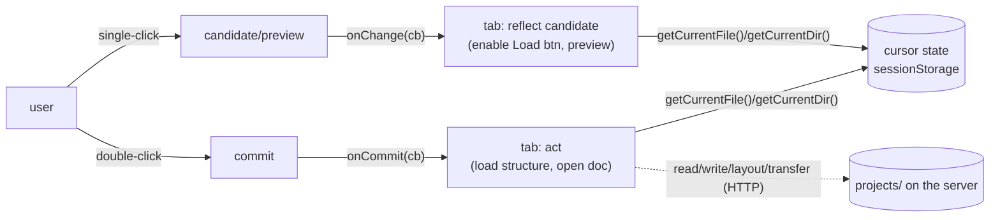

# The projects sidebar — a developer's guide

**What this is.** A plain-language guide to the **projects sidebar** — the file
browser every tab shares — and, mostly, how a *tab* consumes it through the
`window.molbuilder.projects.*` API: reading the cursor, subscribing to picks,
reading/writing files, and coordinating multi-step pipelines with the lock.

**What this is NOT.** The authoritative design. For the full capability list,
exact signatures, lock semantics, lifecycle, and anti-patterns,
`protocols/projects-sidebar.md` is the source of truth ("when the doc and code
disagree, the doc wins"); this guide is the friendly on-ramp and points there.
File-picker vs tab interaction rules: `protocols/selection.md`. Wire shapes:
`protocols/web-api.md`.

---

## 1. The one-paragraph mental model

The sidebar is a **cursor over the `projects/` directory**: it tracks *which
directory you're in* and *which file is picked*, and it exposes filesystem
operations (read / write / mkdir / upload / …) scoped to that tree. Tabs don't
poke the sidebar's DOM — they call the **`window.molbuilder.projects.*` API**
and **subscribe** to changes. The single most important thing to internalize:

> **single-click = _preview_ (a candidate) → `onChange`;
> double-click = _commit_ (open/load it) → `onCommit`.**

A tab that "loads the selected structure" listens to **`onCommit`**, not
`onChange`. `onChange` is for reflecting the current *candidate* (e.g. enabling
a Load button); `onCommit` is the discrete "the user chose this — act on it".



---

## 2. The pieces (where things live)

| File | Role |
|---|---|
| `lib/projects/state.js` | **the public `projects.*` API** + the subscriber sets + sessionStorage IO (the cursor) |
| `lib/projects/list.js` | the directory listing / navigation UI |
| `lib/projects/api.js` | the transport layer (HTTP to `/api/files/*`); swappable without changing the public API |
| `lib/projects/preview.js` | single-click preview |
| `lib/projects/dialogs.js`, `mutation-bar.js` | create/rename/delete UI, the mutation bar |
| `lib/projects/checkpoint.js` | the **run-history (checkpoint) panel** — see §4.5 |
| `projects-sidebar.js` + `_projects_sidebar.html` + `projects-sidebar.css` | bootstrap glue, the server-rendered DOM contract, and the visibility/lock styles |

You almost never touch these as a tab author — you use the API in §3.

---

## 3. API cheat-sheet (`window.molbuilder.projects.*`)

Grouped by capability (contract §5.4 is the precise reference).

**C1 — read the cursor (synchronous, no network):**

| Call | Gives you |
|---|---|
| `getCurrentDir()` | absolute dir path (`""` before init) |
| `getCurrentFile()` | absolute picked-file path (`""` when only browsing) |
| `getProjectsRoot()` / `atRoot()` | the resolved root / are we at it |
| `relativeToProjects(path)` | display-shortened path |
| `isLocked()` / `getLockReason()` | is a pipeline lock held |

**C2 — subscribe (returns an unsubscribe fn):**

| Call | Fires |
|---|---|
| `onChange(cb)` | on **candidate** change (single-click / cursor move). **Fires once immediately** on subscribe with current state. |
| `onCommit(cb)` | on **commit** (double-click). A discrete event — **does NOT** fire-once-on-subscribe. |
| `onLockChange(cb)` | when the lock is acquired/released |
| `onProjectsRootResolved(cb)` | when the root resolves (or use `runtime.whenReady`) |

**C3 — read content (network):** `readCurrentFile()`, `readFile(path)`,
`readRange(path, …)`, `downloadFile(path)`.
**C4 — write (network):** `writeFile(path, text)`, `saveToWorkspace(text, name)`
(writes into the current dir; no-op at root). Both take `expected_mtime` →
409 on a concurrent edit.
**C5 — layout (network):** `createProject`, `mkdir`, `deleteEntry(path, {recursive})`, `rename`.
**C6 — transfer (network):** `upload(dir, file)`, `downloadFile(path)`, `refresh()`.
**C7 — navigate:** `navigateTo(absPath)` (drill the sidebar into a dir; no-op if the sidebar isn't mounted).
**C8 — lock (local coordination, §8):** `lock(reason, cancelers)`, `unlock()`, `cancelLockedOperation()` — serialize a multi-step pipeline so per-step failures recover cleanly.

Typical tab usage:

```js
const projects = window.molbuilder.projects;
// reflect the candidate (enable a Load button when a structure is picked):
const off = projects.onChange((sel) => {
    loadBtn.disabled = !isLoadableStructure(sel && sel.file);
});
// act when the user commits (double-click) a file:
projects.onCommit((sel) => {
    if (isLoadableStructure(sel.file)) loadIntoMyTab(sel.file);
});
```

---

## 4. The rules to get right

1. **`onCommit` to act, `onChange` to reflect.** Loading/opening on every
   `onChange` fires on mere previews and re-renders storms. Commit is the
   discrete "do it" signal.
2. **`onChange` fires once immediately; `onCommit` does not.** So an `onChange`
   subscriber must handle the current state on subscribe; an `onCommit`
   subscriber only hears future commits.
3. **`getCurrentFile()` is already updated when your `onCommit` handler runs**
   (commit publishes the cursor *before* firing `onCommit`), so you can read it
   inside the handler.
4. **Loading on *mount* is different — honor mount-restore ownership.** If your
   tab loads `getCurrentFile()` on mount (not from a live click), you MUST
   coordinate with the workspace snapshot restore: call
   `ws.mountRestoreTarget()` and defer if the snapshot already owns that file
   — otherwise you race the restore and clobber its state. This is exactly the
   selection-loss bug fixed 2026-07-01. See
   [`workspace-guide.md`](workspace-guide.md) §5 and `workspace-contract.md` §4.5.
5. **Always keep the unsubscribe fn** and call it on teardown.
6. **The lock is per-page-load.** A reload abandons an in-progress pipeline;
   don't rely on a durable lock.

---

### 4.5 The run-history (checkpoint) panel

The sidebar hosts a **run-history panel** (`lib/projects/checkpoint.js`) that
surfaces git-based checkpoints for a run directory: a status pill, commit list,
and Init / Checkpoint-now / Tag / Restore actions (over `/api/checkpoint/*`).
Two rules a consumer/maintainer should know:

- **Activation gate:** it appears **only for a run directory** — a dir at
  projects rel-depth 3 (`projects/PROJECT/CATEGORY/RUN/`). Anything shallower,
  or a file, hides the panel. It reacts to `projects.onChange` (directory
  navigation), so it's a first-class *consumer* of the sidebar API (§3).
- **Explicit-refresh only:** no background polling — state refreshes on
  directory-enter and the manual Refresh control (no `setInterval`,
  no visibility timer).

This panel is part of the checkpoint subsystem. Start with the plain-language
**[`checkpoints-guide.md`](checkpoints-guide.md)** (mental model + CLI/API/UI +
safety rules); the full design + safety contract are in
`protocols/run-checkpoints.md` §6 (UI) / §4.6 (verify-before-mutate restore).

## 5. Common gotchas / anti-patterns

- **Don't** query the sidebar's DOM directly — use the API (the DOM is a
  server-rendered contract that can change).
- **Don't** treat `onChange` as "the user opened a file" — that's `onCommit`.
- **Don't** `writeFile` past a concurrent edit without `expected_mtime` unless
  you explicitly pass `overwrite: true`.
- **Don't** nest/parallelize locks — one pipeline at a time (`isLocked()` first).
- **Do** use `saveToWorkspace` for "save into where the user is" and `writeFile`
  for an exact computed path (contract §5.2 spells out the look-alikes).

---

## 6. Where the authority lives

- **`protocols/projects-sidebar.md`** — the design/contract: capabilities
  (§5), signatures (§5.4), subscribe model (§6), lock model (§8), lifecycle
  (§7), anti-patterns (§15), backend contract (§12).
- **`protocols/selection.md`** — the file-picker ↔ tab interaction model.
- **`protocols/web-api.md`** — the `/api/files/*` wire shapes.
- **`protocols/run-checkpoints.md`** — the checkpoint subsystem incl. the sidebar run-history panel (§6) + the restore safety contract (§4.6).
- **`workspace-guide.md`** — the workspace store (the mount-restore rule in §4 above).
