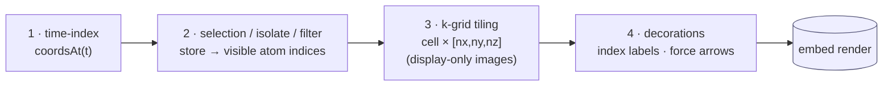

# Unified atom annotations + fused viewer/selection — design

**Status: IN PROGRESS (2026-07-02). Phases 1-3 + 4a-4c SHIPPED (annotations model, sidecar v4, fdf registry, JS channel model + filter); 4d DEFERRED (no value-channel producer yet); Phases 5-6 remain — see §7.** Authoritative for
the work that (1) unifies per-atom metadata into one extensible model, (2) makes
selection always-available + filterable by any metadata, and (3) fuses the
MolViewer and atom-selection into one responsive component. Implement in the
phases in §7; each phase is test-gated + committed.

**Companions:** `types/structure.md` (the `Structure` dataclass this extends),
`atom-selection-guide.md` / `molviewer-guide.md` (the modules being fused),
`sidecar-contract.md` + `data-vocabulary.md` (the `.molstruct.json` persistence),
`working-copy-persistence.md` (the module's load/edit/save, §6.1),
`engines/siesta.md` (the fdf emission this feeds).

---

## 1. Motivation

Per-atom metadata is fragmented and hard-coded:

- **`Structure`** (canonical) carries `regions: Dict[str,List[int]]` +
  `frozen_atoms: List[int]` — two *hard-coded* channels.
- The **JS selection store** mirrors them as `labels[]` + `isFrozen`.
- The **viewer** keeps only element + xyz.
- **fdf** consumes `frozen_atoms` → `%block Geometry.Constraints` and `regions`
  → transport/electrode blocks — again, hard-coded per field.

Adding *any* new per-atom concept (per-atom charge, spin, basis-set override,
constraint type, …) today means touching `Structure`, the sidecar, the JS store,
and the fdf emitter separately. We want **one extensible model** that all four
speak, so richer information flows to every application (fdf + future setup
scripts) without schema churn — and so the selector can filter on *any* of it.

---

## 2. The annotation model (the "open annotations layer")

`Structure` keeps its typed columns (`elements`, `positions`, `atom_names`,
`residue_ids`, `residue_names`, `chain_ids`). On top sits **one extensible
annotations layer**: a set of named **channels**, each a per-atom metadata
stream. Three channel **kinds** cover current + foreseeable needs:

| Kind | Shape | Meaning | Examples |
|---|---|---|---|
| `tag` | name → set of atom indices (multi-valued: an atom may be in many) | named region membership | `L-electrode`, `device`, `bridge` |
| `flag` | name → boolean per atom (a subset) | a yes/no property | `frozen` |
| `value` | name → scalar per atom (sparse map idx→value) | a per-atom number/enum | `charge`, `spin`, `basis_override`, `constraint` |

Each channel also carries light **presentation + emit hints**:
`{ kind, data, color?, fdf?: <emit-strategy id> }`. (`color?` is a *proposed*
centralization — region colors today live JS-side in
`region-label-definitions.js` / `selection-panel.js`, not in the model; the
design pulls them into the channel so viewer + panel share one source.)

**Built-ins (backward-compatible):**
- **each region label → one `tag` channel** (channel name = the label, e.g.
  `L-electrode`); the registry is `{L-electrode: tag, device: tag, …}`.
- `frozen_atoms` → a **`flag`** channel named `frozen`.

`Structure.regions` and `Structure.frozen_atoms` remain as **convenience
accessors backed by the annotations layer** — existing callers keep working;
they're just views over channels now.

### 2.1 Index stability (channels remap on structure edits)

Channels are **keyed by atom index**, so any structure mutation (add / delete
atom) MUST remap every channel or metadata silently corrupts (the same hazard
`selection_remap` guards for the selection). This already exists for the two
built-ins — `modify.py::remap_frozen_and_regions(old_to_new)` — and the
annotations layer **generalizes it to iterate all channels** (drop indices that
vanished, translate the rest through `old_to_new`; `value` channels remap their
key set). Every modify op that returns a `selection_remap` must also carry the
channel remap. This is a load-bearing correctness requirement, not an add-on.

**Structure API (as shipped, Phase 1):**
```python
struct.annotations                       # {name: AtomChannel}  -- extensible extras
struct.channels() -> {name: AtomChannel} # unified: regions(tag) + frozen(flag) + extras
struct.get_channel(name) -> AtomChannel | None
struct.atom_annotations(i) -> dict       # everything on atom i (for the UI/filter)
struct.set_channel(name, AtomChannel(...))  # set an EXTENSIBLE channel; built-in
                                            # names rejected -> edit .regions/.frozen_atoms
```
Built-ins keep their existing storage (`.regions` / `.frozen_atoms`) and are
*surfaced* as channels by `channels()`; extensible channels live in
`.annotations`. Module helpers `copy_annotations` / `remap_annotations` handle
copy + the all-channel index remap (§2.1).

---

## 3. Data-model persistence (engine-agnostic, round-trippable)

The annotation channels are the molview/selector **DATA MODEL**. They are
persisted **identically wherever a structure is saved** — engine-agnostic, the
same shape everywhere, so a saved structure round-trips its full metadata:

- **`.molstruct.json` sidecar (schema v4)** — the primary sidecar record.
  Add `annotations: {name: {kind, data, color?, fdf?}}` **alongside** the
  existing `regions`/`frozen_atoms`/`structure_hash`/`cell`/`pbc` (additive).
  Dual-write regions/frozen for one release; v4 reader maps a v3 file's
  regions/frozen; bump `SCHEMA_VERSION` 3→4; register in `data-vocabulary.md`;
  keep atomic-write + label-propagation (save-flow §4) per-channel. **(Phase 2,
  shipped.)**
- **The `.fdf` / `.py` ATOM-METADATA reserved comment block** — the *same* data
  embedded in the generated script's comment area (`script-contract.md` §4;
  `script_emit.emit_atom_metadata` writes it, `apply_inbody_atom_metadata` reads
  it back). Carries regions + frozen + **the annotation channels** — the
  script's engine-agnostic copy of the data model (a PySCF script carries the
  identical block); block bumped to v4, round-trips via emit/apply, wired into
  the siesta/pyscf/transport emitters. **(SHIPPED 2026-07-01.)**

This is **data**, not engine setup. It says nothing about how a simulation runs;
it just records what the user labeled. See § 4 for the separate concern.

---

## 4. Engine parameter setup (extraction into the engine's required input)

**This is a DIFFERENT concern from § 3 — do not conflate them.** § 3 *persists*
the data model (engine-agnostic, round-trip). § 4 *reads* that data model and
**translates the relevant parts into the input blocks the engine REQUIRES** to
run a correct simulation. This is dictated by the engine's physics, is **one-way**
(data model → engine input), and is **not** how the data is stored.

The two built-in translations (keep their existing, Sol-validated code):

| Metadatum (from § 3) | Engine block it's translated INTO | Why the engine needs it |
|---|---|---|
| `frozen` | SIESTA `%block Geometry.Constraints` | tells the relaxer which atoms not to move — load-bearing for correctness (e.g. electrode atoms fixed so the self-energy / lead coupling is right) |
| region tags | transport/electrode blocks (`TS.Atoms`, …) | defines the device/lead partition the NEGF solver requires |

**The same `frozen` datum therefore plays two roles**: (a) it is *persisted* as
data in ATOM-METADATA + the sidecar (§ 3), AND (b) it is *translated* into
`Geometry.Constraints` as an engine parameter (§ 4). Same source, two distinct
outputs — persistence vs simulation setup.

**Extension point (additive).** A **strategy registry** lets *new* metadata
become engine parameters without touching the proven built-ins: a channel in
`Structure.annotations` may carry `fdf = "<strategy-id>"`; a registered strategy
`(channel, struct) → engine lines` is invoked during assembly (e.g. a future
`initspin` value channel → `%block DM.InitSpin`). A channel with **no** strategy
is **not translated** — it still *persists* via § 3; it simply isn't a
simulation parameter (the validator may warn "channel present, no engine
consumer"). No emitter rewrite; no risk to frozen/region. The same registry
serves PySCF / transport setup later.

---

## 5. JS unified model + always-on filterable selection (Phase 4)

The JS mirrors § 2: everything filterable is a **channel**. To keep this clean
(no bolting onto the store), a **pure channel-model layer** sits below the store,
panel, and viewer-adapter — a single place that answers "what channels does this
atom / this structure have?".

**Layers (each depends only on the one below):**

| Layer | Module | Owns |
|---|---|---|
| L1 low-level presentation API | **`lib/workspace/_atom-channels.js`** + **`_atom-index.js`** | `atomChannels`/`channelKinds` (channel taxonomy + order) and `toDisplay`/`fromDisplay`/`shiftExpression` (index base) — pure, **no DOM/store/HTTP** |
| L2 store | `_selection-store-impl.js` | holds atoms + filter drafts; `knownChannels()` (via L1); `_filterToRule` translates a draft → server rule |
| L3 UI | `selection-panel.js` (+ viewer-adapter) | renders the filter over `knownChannels()`; overlays colour by channel |
| server | `/api/selection/*` | supplies per-atom channels + evaluates rules |

### § 5.1 The L1 contract (low-level presentation API)

**L1 is the low-level presentation API.** It exists only to serve the UI (the
backend never converts index base or enumerates channels), so it *is*
presentation — the primitive tier. It owns two things and nothing else:

1. **Primitives + conventions** — the display value (`toDisplay(i) = i+1`), the
   channel taxonomy (`category`/`tag`/`flag`/`value`), and the stable channel
   enumeration order. It returns **values/model**, never finished presentation
   (no formatted `"#5"` string, no widget, no render).
2. **A contract higher layers build on.** L2 (store) and L3 (panel, viewer)
   **compose** L1's primitives into formatted, rendered UI and **must not
   re-derive** them (no rogue `atom.index + 1`, no re-implementing the
   regions-vs-frozen split).

**Conformance is bound by tests, not trust.** A layer that cannot import L1 at
runtime — the **standalone viewer embed** (`mol-viewer-embed.js`), which inlines
`+1` to stay self-contained — MUST still **provably conform**:

- `test_atom_index_js::test_viewer_index_labels_conform_to_l1` binds the viewer's
  inline `+1` to `toDisplay` (they can't drift).
- `test_atom_channels_js::test_selection_panel_frozen_name_matches_l1` binds the
  panel's `FROZEN_TAG_LABEL` to L1's `FROZEN_CHANNEL`.
- The L1 primitives themselves are pinned in `test_atom_index_js.py` /
  `test_atom_channels_js.py`; the panel's runtime 1-based display is pinned by
  the `test_atom_index_display_is_1_based` E2E.

This is the boundary: **low-level presentation API (values + conventions) below;
high-level presentation (format + render) above.**

**The channel model (L1):** an atom's channels unify its element, residue, each
tag/region, each flag (`frozen`), and each `value` channel:

```js
atomChannels(atom) -> { element:{kind:"category",value:"C"},
                        residue:{kind:"category",value:"ALA"},
                        "L-electrode":{kind:"tag"}, frozen:{kind:"flag"},
                        charge:{kind:"value",value:-1.0}, ... }
channelKinds(atoms) -> [{name,kind}]   // every filterable channel present
```

**Filter contract (L2):** filter drafts generalize from the current
`by_element`/`by_index`/`by_label` into a **uniform channel filter** —
`tag`/`flag` → membership, `category` → equals, `value` → a range predicate
(`>`, `<`, range). `knownChannels()` enumerates all filterable channels (so the
UI no longer special-cases regions-vs-frozen). Translation to server rules
stays in `_filterToRule`; tag/flag → `by_region`, value → a new `by_value` rule
(needs server support).

**Back-compat + boundaries:** the existing `by_element`/`by_index`/`by_label`
drafts keep working (they map onto the generalized model); the store stays the
single source of truth (§ 6, workspace-guide); value-channel filtering needs the
server to (a) include value channels in `/api/selection/atoms` and (b) resolve a
`by_value` rule — that server slice is called out, not hidden.

**Delivered incrementally (layered, node-tested):** (4a) the L1 pure module +
node tests; (4b) store `knownChannels` + generalized `_filterToRule`; (4c) panel
UI; (4d) server value-channel payload + `by_value`. Each is testable on its own.

---

## 6. Fused viewer + selection module + responsive UI

Every molview tab **whose job is atom work** (build, modify, structure /
trajectory inspection) uses the **one** fused module — selection is **always
mounted** (not an opt-out), because it drives filtering + highlighting + editing
everywhere those tabs live. Per-tab behavior is confined by **arguments**, not by
omitting selection.

**Exception — specialized viewers.** A viewer whose job is *not* atom selection
stays its **own** module; we don't force one molview to fit every need. The
**spectra** inspector (a vibrational-*mode* viewer — its "selection" is which
mode, not which atoms) is deliberately **left independent** (`spectra/core.js`),
not migrated — its own contract is `docs/tabs/spectra/spec.md` (see **§ 5.1** for
the atom-index invariants it *shares* with the system: isolation doesn't fork
indexing). The fused module targets the general structure-editing/inspection
tabs; trajectory is absorbed via the § 6.3 render pipeline (it *is* atom work).

- **Data:** the workspace selection store stays the single source of truth (no
  second copy — avoids the two-writer class we fixed); the fused module owns the
  viewer + panel + adapter + the unified API, over the § 2 annotation channels.
- **API (as built, Phase 5 S1–S3):** the viewer stays a **pure viewer**
  (`viewer.embed(host, opts) → handle`); selection is **composed alongside** it
  by `selection.mountPanel(host, {viewerHandle, store, mode})`, which fetches the
  panel partial → `selectionPanel.mount(host, {store, mode})` →
  `viewerAdapter.attach(handle, {store, mode})`. Keeping the viewer unaware of
  selection is what lets *any* viewer (Modify's or an inspector's) gain a panel.
  *(This supersedes the earlier sketch of `viewer.embed` mounting the panel
  itself — composition, not coupling.)*
- **Persistence:** load / edit / save is the **working-copy** (§6.1,
  `working-copy-persistence.md`) — `open` loads the structure+sidecar, edits
  `update` a draft (survives reload/crash), and **Save / Save As** writes the
  pair. One flow replacing the three scattered save paths.
- **UI (responsive):** **wide** → viewer + selection as **two matching-height
  cards**; **narrow** → **one card with two tabs** (View / Selection). Uses the
  responsive-grid floor from `mobile-layout.md`.

**The two behavior-confining args (this is what differs per tab):**

| Arg | Values | Effect |
|---|---|---|
| `mode` | `"modify"` \| `"readonly"` | `modify`: full structure-edit ops + selection editing. `readonly`: view + selection for **filter/highlight/inspect only** — no edit ops, no writes (the Results inspectors). |
| `persistence` | `"workspace"` \| `"ephemeral"` | `workspace`: this view's structure+selection+annotations **are** the workspace — held in the working copy, drafted so they survive reload/crash, written only on explicit Save (§6.1) (the Molbuilder/Modify tab). `ephemeral`: a transient view **re-derived from its source each mount** — owns no data, never saved (the Results inspectors, driven by the selected result file). |

**How the args map in code (Phase 5 S1–S3):** `mode` is passed straight through
`mountPanel` to the panel + adapter — `readonly` hides the panel's assign/write
controls and stops the adapter hijacking the viewer's clicks (the inspector's
own pick/measurement stays). There is **no literal `persistence` param** — it is
realized by **which store you pass**: `workspace` = the default singleton
(`ws.selection`); `ephemeral` = a fresh `selection.createEphemeralStore()`
(isolated selection, populated via `adoptSession({sourceFile, atoms})`, never
touching the workspace). The readonly filter needs `sourceFile` (server eval via
`/api/selection/eval`).

### 6.1 Load / edit / save (via the working-copy)

The `persistence: workspace` view's data lifecycle **is** the **working-copy**
(`working-copy-persistence.md` — the shared load/edit/save foundation). The
working-copy is the **persistence API over the store's data** — not a second
in-memory copy (the store stays the single source of truth, §6): `update` drafts
the store's data, `save` writes it. This replaces today's three scattered paths
(the panel's `writeLabel` auto-saving the sidecar, the viewer's structure
save-to-project, and the dispatcher's own commit/dirty flow) with one clean flow:

- **Load** (`open`) — read `<name>.xyz` + its `.molstruct.json` into the working
  copy: structure + annotations, one object.
- **Edit** (`update`) — every edit (a label, a freeze, a structure op) mirrors
  to a **draft** (`<project>/.molbuilder_workspace/`), so a reload or crash never
  loses unsaved work. **Nothing touches the project files on edit.**
- **Save / Save As** — the *only* project write: `/api/workingcopy/save` writes
  the **pair** (`<name>.xyz` + `.molstruct.json`, annotations included) to the
  same path (overwrite) or a new one (save-as). **No gate — you own the loaded
  data; Save just writes it.**
- The module's **dirty state** drives the UX: warn before loading a *different*
  file over unsaved edits (lost only on explicit Discard).

A `persistence: ephemeral` (read-only inspector) view **owns no data** — it
`open`s its source for display only, keeps no draft, and never saves.

| Event | `persistence: workspace` | `persistence: ephemeral` |
|---|---|---|
| Switch tab & return / reload | **preserved** (draft) | re-derived from source |
| Load a different file with unsaved edits | **warn** (dirty); lost only on Discard | n/a |
| **Save / Save As** | writes `.xyz` + `.molstruct.json` (overwrite / new path) | n/a |
| Tab/session closed without saving | draft **survives on the server** and is recoverable next session (crash-recovery); a browser-only cache would not | n/a |

`working-copy-persistence.md` is authoritative for the mechanics (draft, save,
crash-recovery); this section says only how the fused module *uses* it.

### 6.2 State & API contract (what's internal vs exposed)

**One rule: all shared state lives in the store; the outside touches it only
through the store API.** Nothing else holds a copy of module state, and no view
flag lives outside the store.

**Internal state — the store (single source of truth).** `selection`,
`pickOrder`, `atoms`, `mode`, **`isolate`** ("show selected only"),
**`kgrid`** (`{enabled, dims:[nx,ny,nz]}` — k-grid display, § 6.3), `filters`,
`combinator`, `sourceFile`, `loading`, `error`. It is:
- **mutated ONLY** through the store's mutators — `toggle` / `set` / `add` /
  `remove` / `all` / `invert` / `clear` / `setMode` / **`setIsolate`** /
  **`setKgrid`** / `addFilter` / `removeFilter` / `updateFilter` /
  `setCombinator` / `applyFilter` / `writeLabel` / `adoptSession`;
- **read ONLY** through `getState()` (a defensive snapshot) or `subscribe(fn)`.

The panel and the viewer adapter are **pure consumers**: they render from the
snapshot and route input back through the mutators. Neither keeps a parallel
copy, and **no view flag lives in a consumer** — that was the isolate bug
(isolate lived in the adapter and the panel reached a *global handle* to toggle
it; now it is `store.setIsolate` / `state.isolate` like every other field).

**Public API — functions only (no raw state/handles exported):**

| Export | What |
|---|---|
| `selection.mountPanel(host, opts)` | mount the panel + attach the adapter to a viewer |
| `selectionPanel.mount(host, {store, mode})` | mount just the panel |
| `selection.viewerAdapter.attach(handle, {store, mode})` | attach just the adapter |
| `selection.createEphemeralStore()` | a fresh **isolated** store (the ws.selection surface) |
| the store surface (`ws.selection` / ephemeral) | the mutators + `getState` / `subscribe` |

**Not allowed:** exporting a live handle or a mutable flag as a global for
another module (or a test) to poke. The store API is the only channel.

**Screen result (2026-07-02): clean.** `viewerAdapterHandle` — the one raw
adapter handle the Modify bootstrap used to expose globally — is **retired**:
isolate is store state, driven via `ws.selection.setIsolate` and read via
`getState().isolate` (including in the e2e), and the adapter exposes no isolate
control of its own. The unused `selection.viewerAdapter.handle` runtime key is
gone too. The only remaining global is `selectionPanel.forceRenderMode`, a
*documented debug override* for the atom-list render path (virtual vs simple
scroll; also settable via `sessionStorage` / URL) — a perf knob, not shared
state, kept on purpose (large displayed systems — e.g. a k-grid-expanded
supercell over ~1–2k atoms — use the virtual scroller).

### 6.3 Dynamic coordinates + periodic display (the render pipeline)

This is how the fused module absorbs the **trajectory** display (and gains
**k-grid** validation) without a second atom-list. The key realization: **atom
identity/labels/selection never vary with time — only coordinates do.** So the
store stays frame-independent, and rendering becomes a pure pipeline over
`(store, coordsAt(t), cell/kgrid, decorations)`.

**The store is unchanged (frame-independent).** `atoms:[{index,element}]` +
labels/`frozen` + `selection` + `filters` + `isolate` — a *selection is a set of
indices*, computed once, valid for every frame. A static structure is just the
1-frame case.

**The module owns a `FrameSet`** — the dynamic coordinates, separate from the
store:

```
FrameSet = { nframes, currentFrame, coordsAt(t) -> Float32[natoms*3] }
```

Static structure ⇒ a 1-frame FrameSet (time-index coerced to 0). Trajectory ⇒
`nframes > 1` (index clamped to `[0, nframes-1]`). Trajectory's current
`state.data.frames[t][atom] = [el,x,y,z]` is lifted into this: `el` → the store's
identity, `xyz` → the FrameSet.

**Render is an ordered pipeline** between coordinate extraction and the embed:



1. **Time-index** — pick the current frame's coords (1 frame ⇒ static; N ⇒ clamp).
2. **Selection / isolate / filter** — the **store** decides *which indices* show
   (frame-independent, computed once).
3. **k-grid slot (new, general)** — the **compute** is a pure layer
   (`lib/molview/kgrid.js` `tileKgrid(coords, cell, [nx,ny,nz])`): duplicate the
   visible atoms in space by the lattice to validate the periodic model (vacuum
   spacing zero vs non-zero, cell orientation, boundary match). **Images are
   display-only — they NEVER enter the store or selection/measurement** (you
   select/measure the *unit cell*; tiling is pure render, with a `sourceIndex`
   mapping each image back to its unit-cell atom for element/style lookup). The
   **parameter** — `{enabled, dims:[nx,ny,nz]}` — is **store view-state** driven
   through **`store.setKgrid(patch)`** (like `isolate`, § 6.2); the `cell` comes
   from the structure at render time, not the store. The render layer reads
   `state.kgrid` and, when enabled, calls `tileKgrid`. **The UI exposes the
   enable flag + the [nx,ny,nz] inputs**, driving `setKgrid`. k-grid is **not**
   trajectory-specific — the static structure inspector uses it too.
4. **Decorations** — index labels + force arrows etc., built last on the
   resolved set.

**Animation acceleration — the invalidation boundary.** The embed animates
precomputed frames by swapping coords per tick (cheap). Recompute the
handed-to-embed payload ONLY when the *displayed set* changes:
- per **tick** (scrub) → coords only → cheap;
- per **selection / isolate / k-grid** change → rebuild the payload.

⚠️ **Memory:** trajectory **×** k-grid multiplies atoms by `nx·ny·nz` per frame.
Tile **lazily at the current frame** (or cap), never precompute all images × all
frames.

**Measurement** dissolves into this: a bounded/ordered selection whose geometry
is read against `coordsAt(t)` + `measurements.js` — no separate structure, just a
pick cap. **`frozen`** folds in cleanly: trajectory's `runtime_info.frozen_atoms`
→ the store's `frozen` flag channel, so the module's frozen display + isolate
replace the bespoke hide-frozen toggle.

**Data structures to add:** `FrameSet` (module-owned) · `CellSpec` + `kgrid`
(consumed only by layer 3) · the `renderPipeline` the adapter runs (re-runs on
store change + frame tick + cell/kgrid change).

**Migration.** Build FrameSet + pipeline + decorations into the module in
parallel; keep the current `trajectory/core.js` isolated as the working fallback;
verify end-to-end (frame scrub, arrows, measurement, frozen, k-grid); **retire
the old module only on confirmation** — no flag-day.

---

## 7. Phased implementation plan (each: implement → test → commit)

0. **This design** — approve.
1. **Structure annotations layer** (Python) — **SHIPPED (2026-07-01).**
   `AtomChannel` + `Structure.annotations` + unified `channels()`/`get_channel()`/
   `atom_annotations()`/`set_channel()`; `copy_annotations`/`remap_annotations`;
   `modify.py` delete-remap + verbatim rebuilds carry annotations; `copy()`/
   `translated()` carry them. tests/test_atom_annotations.py (11).
2. **Sidecar v4** — **SHIPPED (2026-07-01).** `SCHEMA_VERSION 3->4`; `to_dict`
   writes `annotations` + dual-writes regions/frozen; `apply_to_structure`
   reads them; parse-side reads v3+v4 and validates channel indices at load;
   AtomChannel.to_json/from_json round-trip. tests/test_sidecar_annotations.py.
3. **fdf channel emit-strategy registry** — **SHIPPED (2026-07-01).** Additive:
   `annotations_fdf.py` (register_fdf_strategy/emit_channels/unregistered_
   channels); wired into `siesta/input.py` (no-op when no registered channels);
   built-in frozen/region emission untouched. tests/test_annotations_fdf.py;
   335 fdf tests unchanged.
4. **JS unified `Atom` + channel filter** — layered (§5). **4a SHIPPED
   (2026-07-01):** pure L1 channel model `lib/workspace/_atom-channels.js`
   (atomChannels/channelKinds; browser global + node export; node-unit-tested,
   no browser).  **4b SHIPPED (2026-07-01):** store `knownChannels()` (L2 via L1) + panel `knownLabels` refactored onto L1 (behavior-preserving, extensible) + L1 wired into the template. **4c SHIPPED (2026-07-02):** panel "By residue" filter kind (category channel) → the existing server `by_residue_name` rule; E2E-verified. **4d DEFERRED:** server value-channel payload + `by_value` — no value-channel *producer* exists yet, so it'd be filtering data that isn't generated (YAGNI); slots in when one arrives.
5. **Fused module + migrate ALL molview tabs** — embed mounts viewer+panel+
   adapter with the § 6 `mode`/`persistence` args; **every** molview-embedding
   tab moves to it (selection always mounted): Modify/Molbuilder =
   `mode:modify, persistence:workspace`; Results structure/trajectory/spectra
   inspectors = `mode:readonly, persistence:ephemeral`; others per the
   investigation below. Responsive 2-card ↔ tabbed UI. E2E-gate (nav-selection
   loop + full Modify E2E + the Results inspectors).
   - **Investigation first (§ 8):** before migrating, audit each embed site for
     data-structure / interface / logic changes; confirm the right
     `mode`/`persistence` per tab; only then migrate.
   - **Load/edit/save via the working-copy (§ 6.1):** the `persistence:workspace`
     module loads through `/api/workingcopy/open`, `update`s on every edit (the
     draft — this **replaces** the panel's `writeLabel` auto-save), and Saves via
     `/api/workingcopy/save` (overwrite / save-as). The working-copy backend +
     API are **already built + tested** (`working-copy-persistence.md`); this
     phase wires the module to them and deletes the three old save paths
     (`writeLabel` auto-save, viewer save-to-project, dispatcher commit).
     `mode:readonly` (inspectors) loads via `open` only — no draft, no save.
   - **Built so far (2026-07-02):** **S1** store-parameterized `panel.mount`/
     `adapter.attach` + `selection.createEphemeralStore()` (Modify unchanged, via
     the default singleton). **S2** reusable `selection.mountPanel(host,
     {viewerHandle, store, mode})`. **S3** the **structure** inspector mounts a
     `readonly`+ephemeral panel (list + click-select + filter + highlight; the
     triple-pick measurement chip stays). Node-verified; **browser E2E pending.**
     Remaining: trajectory + spectra inspectors, **S4** working-copy wiring for
     Modify, **S5** responsive 2-card↔tabbed + the E2E gate.
   - **Trajectory via the render pipeline (§ 6.3):** trajectory + spectra are
     NOT bare (bespoke Inspect atom-list / vibrational-mode viewer), so a second
     panel would duplicate. Instead, absorb trajectory by giving the module a
     **module-owned `FrameSet`** (dynamic coords) + the ordered render pipeline
     (time-index → selection/isolate → **k-grid slot** → decorations), with the
     k-grid slot designed in from the start (general — the static inspector uses
     it too). Sub-slices: **(a) `FrameSet` + time-index layer — BUILT
     (`lib/molview/frameset.js`, node-tested; static = 1-frame proof);** wiring
     it into an inspector is the next step. **(b) the k-grid layer — compute
     BUILT (`lib/molview/kgrid.js` `tileKgrid`, node-tested) + the parameter is
     store view-state (`setKgrid`, node-tested); remaining: the UI control
     (enable + [nx,ny,nz]) + wiring into the render.** (c) port trajectory
     decorations (arrows) +
     frame-scrub UI + live polling onto the pipeline; (d) `frozen` → the
     `frozen` channel (retire the bespoke hide-frozen). Build
     in parallel; **retire `trajectory/core.js` only on E2E confirmation.**
     **Spectra:** keep as the mode viewer (atom-selection adds little); revisit
     a read-only highlight later.
6. **Docs + data-vocabulary v4** — register the sidecar v4 shape; merge
   `molviewer-guide.md` + `atom-selection-guide.md` into one; update
   `embedded-viewer.md`, `atom-selection.md`, `types/structure.md`,
   `sidecar-contract.md`, `engines/siesta.md`; full E2E.

**Guardrails:** `Structure` is the lingua franca — keep back-compat accessors so
consumers don't break mid-migration; **channels remap on every add/delete**
(generalize `modify.py::remap_frozen_and_regions` to all channels — §2.1, a
correctness must); the selection store stays single-source (no duplicate state);
dual-write the sidecar until readers migrate; a channel with no fdf strategy is
carried-not-emitted; each phase gated by the relevant test suite before the next.

---

## 8. UI-integration investigation (per embed site)

Audit of the **5** current `viewer.embed` sites and what full integration needs
(the Phase 5 prerequisite).

| Tab / embed | today | target args | changes needed |
|---|---|---|---|
| **Modify/Molbuilder** (`modify/viewer.js`) | full edit; selection wired *externally* via `selection-bootstrap.js` (mounts panel + attaches adapter) | `mode:modify, persistence:workspace` | **interface**: the embed mounts the panel+adapter itself; delete the manual bootstrap wiring. **logic**: none new (behavior preserved). |
| **Results · structure** (`inspectors/structure.js`) | **DONE (Phase 5 S3):** readonly + ephemeral panel (list + click-select + filter + highlight; measurement chip kept) | `mode:readonly` + `createEphemeralStore()` | shipped; browser E2E pending. |
| **Results · trajectory** (`trajectory/core.js`) | **NOT bare** — bespoke Inspect atom-list + `pick:triple` + animation | absorbed via the **§ 6.3 render pipeline** (FrameSet + k-grid), *not* a second panel | replace the bespoke list; port arrows/scrub/polling; `frozen`→channel. |
| **Results · spectra** (`spectra/core.js`) | vibrational-**mode** viewer (`pick:none`) — its "selection" is a *mode*, not atoms | **NOT migrated — stays an independent module** (`docs/tabs/spectra/spec.md`) | none; shares only the atom-index contract (spec § 5.1). |
| *(future build/other)* | — | per case | assess when added. |

**Current-state finding (2026-07-02 audit — narrows Phase 5):** the Modify tab
**already** embodies most of the fused UI — `modify.html` has a responsive
`.workspace-grid` (viewer / selection / modify as separate cards, `@media`
768/640px breakpoints) with selection **always present** and the panel+adapter
already composed (via `viewer.js` + `selection-bootstrap.js`). So Phase 5's real
remaining work is: **(i)** extract the composition into a **reusable module**
(DONE — S1 store-param + S2 `mountPanel`); **(ii)** the inspectors —
**structure DONE (S3)**; **trajectory** absorbed via the § 6.3 render pipeline
(bespoke Inspect list + animation, *not* an additive panel); **spectra** stays
**independent** (its job is a *mode*, not atoms); **(iii)** minor polish —
tabbed-on-narrow (today it stacks) + matching-height.

**Key findings driving the design:**
- **The fused module must OWN the panel host** — render the selection panel
  inside its own responsive card. Today only `modify.html` +
  `_trajectory_inspector.html` have panel/host partials; the inspectors don't.
  Making the module render the panel means *any* embed gets selection without
  each host shipping a `#selection-host`.
- **Three orthogonal args compose** — `mode` (edit vs readonly), `persistence`
  (workspace vs ephemeral), and the **existing `pick` opt** (structure +
  trajectory keep their triple-pick measurement; `readonly` just stops the
  adapter hijacking it). So "selection always mounted" ≠ "pick always
  on": the panel/filter is always available; click-pick is governed by `pick`.
- **No data-structure change for inspectors** — their structures come from
  parsed results and may carry no annotations; the filter still works on the
  always-present element/residue channels, plus any annotations that are there.
- **Persistence is already what each tab does** — Modify persists (workspace),
  inspectors re-derive from the selected result file (ephemeral). The args make
  the existing behavior *explicit + contractual* (§ 6.1), not new behavior.
