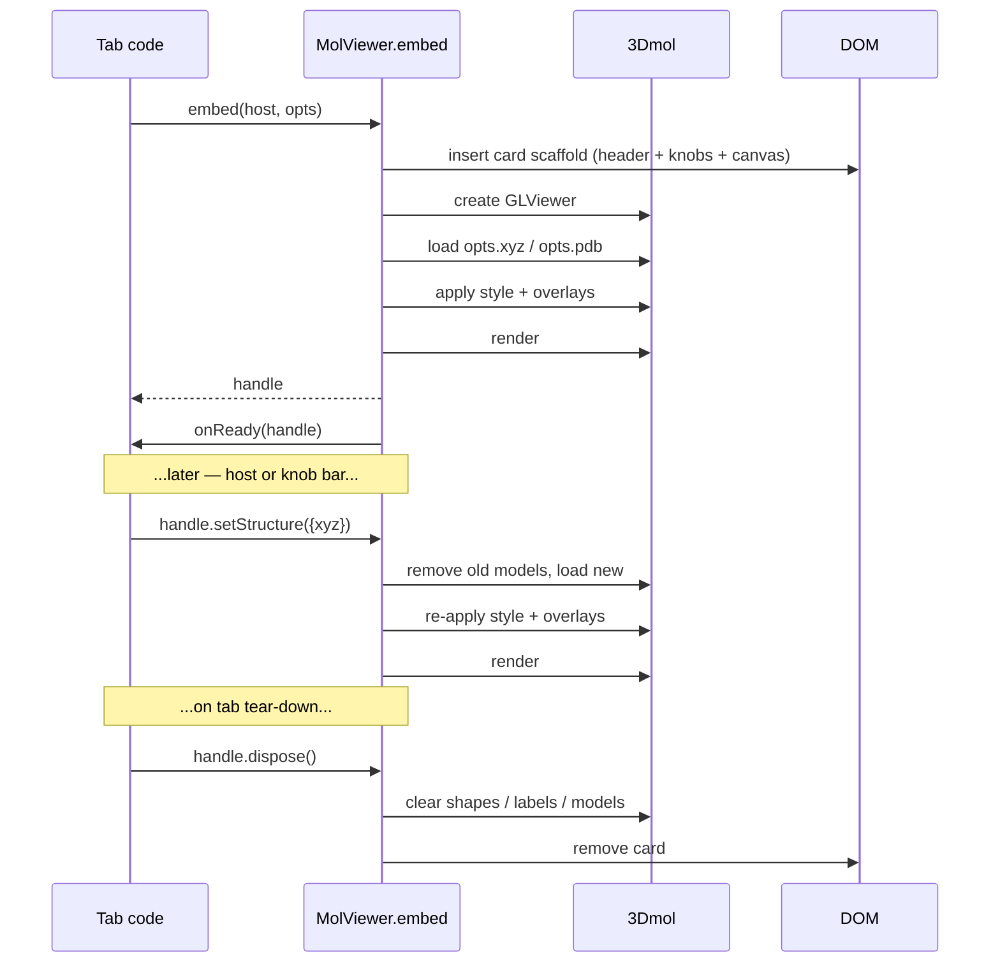

# Embedded MolViewer — the standard structure viewer component

`window.molbuilder.viewer.embed(host, opts) → handle` is molbuilder's
**standard embeddable structure viewer**. Every tab and inspector
that needs to show a 3-D molecular structure drops it into a host
DOM element, supplies XYZ or PDB data plus a small declarative
options object, and lets the viewer maintain the drawing — canvas,
standard control knobs, info line, animation strip and all.

This file is the **sole source of truth** for the unified viewer's
contract. The implementation lives in `lib/mol-viewer-embed.js`;
the CSS in `lib/mol-viewer-embed.css`. Both files MUST conform to
this document; any deliberate divergence updates this document
first, code second.

---

## 1. Mission

> The viewer takes an input of XYZ or PDB data, and a few options
> (style, axis, label, arrow, etc.), then maintains the drawing.
> It can be embedded as a card/panel where needed and the data is
> supplied to it through the API.
>
> The viewer is not just the white 3D display but a module with a
> consistent UI as a whole — a card that contains the canvas AND
> the typical control knobs. External modules attach additional
> controls next to it; those external controls drive the viewer
> through the API.

The viewer:

- **Owns its drawing.** The host never reaches into 3Dmol directly.
  All mutations cross the API boundary as handle method calls.
- **Owns its chrome.** Style picker, labels toggle, axes toggle,
  reset view, screenshot, background toggle and data export live
  inside the viewer card. Every tab gets the same controls, the
  same look, the same placement.
- **Is data-in-API.** Structure text and options come in through
  the embed call; the viewer never fetches.
- **Is declarative.** Options describe *what* the user should see
  (axes on, atom indices visible, force arrows present); the
  viewer handles *how* (3Dmol primitives, shape lifecycle, render
  scheduling).
- **Is embeddable.** Lives inside any host DOM element as a
  self-contained card. Multiple instances per page are supported;
  each owns its own state.
- **Is reactive.** After mount, the host updates state through
  handle methods (`setStructure`, `setStyle`, `setAxes`, …). The
  viewer re-renders. The host never schedules a render.

---

## 2. Isolation contract

The viewer is a self-contained module with a strict interface
boundary. Everything inside the boundary is the viewer's job;
everything outside is the host's. Crossing the boundary requires
either a method on the handle (host → viewer) or a callback in
the options (viewer → host). There is no other coupling.

### 2.1 What the viewer owns

Everything inside the viewer card, plus all 3Dmol-side state:

| Concern | Component |
|---|---|
| 3-D rendering | 3Dmol GLViewer mounted in `.mol-viewer-canvas` |
| Standard knob bar | `.mol-viewer-knobs` — style / labels / axes / reset / screenshot / background / export |
| Animation frame strip | `.mol-viewer-frame-strip` (auto-shown for trajectory animation) |
| Info line | `.mol-viewer-info-line` — atom count, residue count, formula |
| Overlay state | axes, cell wireframe, labels, arrows, pick halos, animation frame |
| 3Dmol object lifecycle | shapes, labels, models — create / update / destroy |
| Render scheduling | when to call `viewer.render()` |
| Export plumbing | save-to-project / download / clipboard |

### 2.2 What the host owns

Everything OUTSIDE the viewer card:

| Concern | Owner |
|---|---|
| Page layout | host tab's CSS grid / flex |
| Tab-specific control cards | file picker, mode list, selection panel, region editor, sidebar |
| Data fetching | sidebar reads, `/api/*` calls, polling |
| Charts | plotly spectrum + energy/force plots |
| Project context | current sidebar dir, file naming |
| Cross-component state | selection store, runtime store, etc. |

The host's adjacent control card may sit anywhere relative to the
viewer card — left, right, above, below, wrapping at narrow
viewports — via standard CSS. The viewer offers NO layout API for
external attachments; this keeps the embed simple and lets each
tab decide its own responsive behavior.

### 2.3 Crossing the boundary

| Direction | Mechanism |
|---|---|
| Host → viewer (mutate) | `handle.setStructure(...)`, `setStyle(...)`, `setAxes(...)`, etc. |
| Host → viewer (read) | `handle.getAtomCount()`, `getPickedIndices()`, `getAnimationFrame()` |
| Host → viewer (commands) | `handle.playAnimation()`, `refit()`, `screenshot()`, `exportData(...)`, `dispose()` |
| Viewer → host (events) | `opts.onReady(handle)`, `opts.pick.onPick(indices)`, `opts.export.onExport(info)` |

The host never reads 3Dmol objects directly; the viewer never
reads host DOM outside its own card; neither inspects the other's
CSS or in-page state.

### 2.4 Deprecated escape hatches

| Hatch | Reason it still exists | Removal trigger |
|---|---|---|
| `handle._viewer3dmol()` | `lib/selection/viewer-adapter.js` reaches in for camera ops + click polling | When the selection-store adopts the declarative pick API |
| `opts.card.bare` | First-pass migration shim that lets hosts skip the standard chrome | When all five consumers adopt the standard knob bar (see § 7 migration map) |

Both are documented but **MUST NOT** be used in new code. Tab
authors that find themselves wanting one should propose a new
declarative API on the handle instead.

---

## 3. API surface

```ts
window.molbuilder.viewer.embed(host: HTMLElement, opts: ViewerOpts)
    → ViewerHandle
```

### 3.1 `ViewerOpts`

```ts
type ViewerOpts = {
  // ---- Structure data (both optional at mount) ----------------- //
  xyz?: string,                  // XYZ text
  pdb?: string,                  // PDB text
  // If both supplied, pdb wins (richer metadata).  Pass one OR
  // the other in production; both is a programmer convenience for
  // the "load by extension" path.  If NEITHER is supplied, the
  // viewer mounts an empty canvas; populate later via
  // ``handle.setStructure({xyz | pdb})``.  Tabs that build the
  // viewer before the user has picked a file (/modify, /build)
  // rely on this empty-mount behavior.

  // ---- Style --------------------------------------------------- //
  style?: StyleOpts,             // see § 3.4

  // ---- Overlays (each opt-in; all default off) ----------------- //
  axes?:   AxesOpts | boolean,   // see § 3.5; true = Cartesian default
  cell?:   CellOpts | boolean,   // see § 3.6; true = use opts.lattice
  labels?: LabelOpts | boolean,  // see § 3.7
  arrows?: ArrowSpec[],          // see § 3.8

  // ---- Lattice (drives cell mode for axes + cell wireframe) ---- //
  lattice?: number[3][3],        // a, b, c row vectors in Å.

  // ---- Atom-pick interaction ----------------------------------- //
  pick?: PickOpts,               // see § 3.9

  // ---- Animation (vibrational mode OR trajectory frames) ------- //
  animation?: AnimationOpts,     // see § 3.10

  // ---- Standard knob bar (canonical chrome) -------------------- //
  knobs?: KnobBarOpts | boolean, // see § 3.11; true = all defaults

  // ---- Export plumbing ----------------------------------------- //
  export?: ExportOpts | boolean, // see § 3.12; true = all defaults

  // ---- Card chrome (the embeddable panel) ---------------------- //
  card?: {
    title?:        string,        // shown in card header
    showInfoLine?: boolean,       // "N atoms · R residues · CxHyOz"
    height?:       string,        // CSS value; default "clamp(360px, 52vh, 500px)"
    className?:    string,        // extra class for outermost card div
    bare?:         boolean,       // DEPRECATED — see § 2.4; suppresses
                                  // the entire card chrome including
                                  // the standard knob bar.
  },

  // ---- Lifecycle ----------------------------------------------- //
  onReady?: (handle: ViewerHandle) => void,
  // Fired once after the first structure is mounted + rendered.
}
```

### 3.2 `ViewerHandle`

```ts
type ViewerHandle = {
  // ---- Data setters (re-renders automatically) ----------------- //
  setStructure(opts: { xyz?: string, pdb?: string,
                       lattice?: number[3][3] }): void,

  // ---- Style + overlay setters --------------------------------- //
  setStyle(style: StyleOpts):          void,
  setAxes(axes: AxesOpts | boolean):   void,
  setCell(cell: CellOpts | boolean):   void,
  setLabels(labels: LabelOpts | bool): void,
  setArrows(arrows: ArrowSpec[]):      void,
  setPick(pick: PickOpts):             void,
  setBackground(theme: "light" | "dark" | string): void,

  // ---- Knob bar -------------------------------------------------- //
  setKnobs(knobs: KnobBarOpts | boolean): void,
  // Reconfigure the visible knobs at runtime (rare; for tabs that
  // change the available controls mid-session).

  // ---- Animation control --------------------------------------- //
  setAnimation(animation: AnimationOpts | null): void,
  playAnimation():        void,
  pauseAnimation():       void,
  isAnimationPlaying():   boolean,
  setAnimationFrame(idx: number): void,  // trajectory mode only
  getAnimationFrame():    number,

  // ---- Read accessors ------------------------------------------ //
  getAtomCount():     number,
  getElements():      string[],
  getPickedIndices(): number[],
  getStructureText(format?: "xyz" | "pdb"): string,
  // Returns the current structure as text in the requested format.
  // If ``format`` is omitted, returns whatever was supplied
  // (pdb if both were available, else xyz).  Used by the export
  // plumbing.

  // ---- Output / export ----------------------------------------- //
  screenshot(opts?: { target?: "project" | "download",
                      width?: number, height?: number,
                      filename?: string }):
      Promise<{ dataUrl: string, blob: Blob,
                filename?: string, bytes?: number }>,
  // Captures a PNG of the current canvas.  Resolves with the data
  // URL + blob.  If ``target: "download"``, also triggers a browser
  // download.  If ``target: "project"``, also writes to the active
  // project's sidebar dir via projects.writeFile.  Omit ``target``
  // for capture-only (returns blob; caller decides what to do).

  exportData(opts: { target: "project" | "download" | "clipboard",
                     format?: "xyz" | "pdb",
                     filename?: string }):
      Promise<{ filename: string, bytes: number }>,
  // Imperative version of the structure-export menu.  ``target:
  // "project"`` requires the host page to have a current project
  // context (window.molbuilder.projects.* with a selected dir);
  // the embed delegates the write to projects.writeFile.
  // ``target: "download"`` issues a browser download.
  // ``target: "clipboard"`` writes to navigator.clipboard.

  // ---- Animation export ---------------------------------------- //
  // Only meaningful when opts.animation is set.  Each method
  // drives the animation forward and captures the canvas per
  // frame; static-structure embeds reject with an error.

  captureFrames(opts?: { fps?: number, duration?: number,
                         width?: number, height?: number }):
      Promise<Blob[]>,
  // Returns a list of PNG blobs, one per frame.  The viewer drives
  // the animation forward over ``duration`` seconds at ``fps``,
  // capturing the canvas after each render.  Vibration mode steps
  // the cosine phase; trajectory mode advances frame indices,
  // wrapping if duration exceeds the trajectory length.  Defaults:
  //   fps      = animation.fps (trajectory) or 30 (vibration)
  //   duration = full one-loop (trajectory) or 1/animation.speedHz
  //              seconds (vibration; one cosine cycle)
  //   width    = canvas client width
  //   height   = canvas client height
  // Returns are PNGs so the caller can encode to ANY video format
  // (WebM, GIF, MP4 server-side) without coupling to the embed's
  // choices.

  exportAnimation(opts: { format: "webm" | "gif",
                          target: "project" | "download",
                          fps?: number, duration?: number,
                          filename?: string }):
      Promise<{ filename: string, bytes: number }>,
  // High-level animation export, wired to the export menu's
  // "Animation" submenu.  ``format: "webm"`` uses the native
  // MediaRecorder on canvas.captureStream(fps); ``format: "gif"``
  // uses gif.js (lazy-loaded on first call).  No "clipboard"
  // target — binary video isn't pasteable in molbuilder's contexts.

  // ---- Lifecycle ----------------------------------------------- //
  refit():    void,               // re-fit camera to structure
  render():   void,               // force a render (rarely needed)
  dispose():  void,               // tear down 3Dmol + remove DOM

  // ---- Escape hatch — see § 2.4 -------------------------------- //
  _viewer3dmol(): GLViewer,
}
```

### 3.3 `StyleOpts`

```ts
type StyleOpts = {
  rep?:         "stick" | "ball-and-stick" | "sphere" | "line"
              | "cartoon" | "cross",
  radiusScale?: number,           // default 1.0
  colorScheme?: "element" | "chain" | "residue" | "spectrum",
  background?:  string,           // hex (default "#ffffff")
  showLabels?:  false | "indices" | "names",
  // Convenience alias for labels.atoms; see § 3.7.
}
```

### 3.4 `AxesOpts`

```ts
type AxesOpts = {
  mode?:   "auto" | "cartesian" | "cell",
  length?: number,                // Cartesian fallback length (Å); default 1.5
  origin?: [number, number, number],   // default [0,0,0]
  labels?: [string, string, string],
  colors?: { [label]: string },
  radius?: number,                // arrow shaft radius; default 0.05 Å
}

// ``axes: true`` ≡ ``axes: {}``.  ``axes: false`` (or omitted) hides.
```

Mode selection:
- If `opts.lattice` (or `opts.cell`) is set → cell mode (a/b/c).
- Else → Cartesian mode (x/y/z).
- To force Cartesian even when a lattice is present, set
  `mode: "cartesian"` explicitly.

Delegates to `window.molbuilder.axes.draw()` from `lib/mol-axes.js`.

### 3.5 `CellOpts`

```ts
type CellOpts = {
  color?:  string,                // default uses the page theme
  radius?: number,                // default 0.04 Å
}

// Drawn from opts.lattice.  No-op when no lattice is supplied.
```

### 3.6 `LabelOpts`

```ts
type LabelOpts = {
  atoms?:  "indices" | "names" | number[],
  //         indices  → "0", "1", "2", ...
  //         names    → atom_name field (PDB-derived; falls back
  //                    to element symbol)
  //         number[] → label only these specific atom indices
  fontSize?:   number,            // default 12
  fontColor?:  string,
  background?: string,
}
```

### 3.7 `ArrowSpec[]`

```ts
type ArrowSpec = {
  start:   [number, number, number],
  end:     [number, number, number],
  color?:  string,                // default "#888"
  label?:  string,                // optional label at the arrow tip
  radius?: number,                // default 0.05 Å
}
```

Force vectors, transition-mode displacements, and arbitrary
annotations all use this one primitive. The viewer redraws when
`setArrows()` is called with a different array; identity
comparison decides "did the array change".

### 3.8 `PickOpts`

```ts
type PickOpts = {
  mode:        "none" | "single" | "pair" | "multi",
  haloColor?:  string,           // default page-theme accent
  haloRadius?: number,           // default 0.6 Å
  onPick?:     (indices: number[]) => void,
}
```

Delegates to `lib/mol-pick.js` for halo geometry; the embedded
viewer owns the click-handler registration.

### 3.9 `AnimationOpts`

```ts
type AnimationOpts =
  | VibrationAnimation
  | TrajectoryAnimation;

type VibrationAnimation = {
  kind:          "vibration",
  // Per-atom displacement direction (Å).  Length must match the
  // structure's atom count.  Position at phase φ:
  //     pos_i(φ) = baseline_i + amplitude · cos(φ) · displacement_i
  displacements: number[][][3],
  amplitude?:    number,         // peak Cartesian amplitude (Å); default 0.15
  speedHz?:      number,         // cycle-rate multiplier; default 1.0
  paused?:       boolean,        // start in paused state; default false
};

type TrajectoryAnimation = {
  kind:          "trajectory",
  // Each frame is a full [n_atoms][3] coordinate set.  Element
  // ordering must match the baseline structure (changing topology
  // mid-trajectory is not supported).
  frames:        number[][][3],
  startFrame?:   number,         // default 0
  fps?:          number,         // playback rate; default 10
  paused?:       boolean,        // start in paused state; default true
  loop?:         boolean,        // wrap at end; default true
};
```

**Vibration mode** drives spectra's per-mode visualisation.
**Trajectory mode** drives the trajectory inspector's frame
playback. Both preserve the user's camera, pick state, axes, cell,
labels, and arrows across frames — the viewer updates ONLY atom
positions; every other overlay is position-aware and recomputes
per-frame automatically.

When `animation.kind === "trajectory"`, the **frame strip** auto-
renders above the canvas: prev / play-pause / next / counter /
slider, wired directly to `playAnimation` / `pauseAnimation` /
`setAnimationFrame`. Vibration mode does NOT show a frame strip
(it has no discrete frames); the standard knob bar's reset +
playback knobs handle vibration control.

### 3.10 `KnobBarOpts`

```ts
type KnobBarOpts = {
  // Each knob is independently controllable:
  //   true   → always visible
  //   false  → hidden
  //   "auto" → visible only when meaningful for the current
  //            animation state (e.g. play/pause shows only when
  //            opts.animation is set)
  style?:      boolean | "auto",   // default true
  labels?:     boolean | "auto",   // default true
  axes?:       boolean | "auto",   // default true
  reset?:      boolean | "auto",   // default true
  screenshot?: boolean | "auto",   // default true
  background?: boolean | "auto",   // default true
  export?:     boolean | "auto",   // default true

  // Cosmetic / layout
  position?:   "top" | "bottom",   // default "top"
  compact?:    boolean,            // default false — when true,
                                   // some labels collapse to icons.
};

// ``knobs: true`` (or omitted) shows the full default knob set.
// ``knobs: false`` hides the entire bar.
```

**Knob semantics** (each wires to the indicated handle method):

| Knob | Maps to | UI element |
|---|---|---|
| Style | `setStyle({rep, radiusScale})` | `<select>` |
| Labels | `setLabels(true \| false)` | toggle button |
| Axes | `setAxes(true \| false)` | toggle button |
| Reset | `refit()` | button |
| Screenshot | `screenshot({filename})` | button (triggers download) |
| Background | `setBackground("light" \| "dark")` | toggle button |
| Export | `exportData({target, format})` | dropdown / `<details>` menu |

### 3.11 `ExportOpts`

The export menu unifies three content categories — **structure**
(XYZ/PDB text), **image** (PNG of the canvas), and **animation**
(WebM/GIF, when an animation is active) — under a single set of
target affordances: project / download / clipboard. Each category
declares which targets make sense for it.

```ts
type ExportOpts = {
  // Filename hint (no extension).  Defaults to the structure's
  // ``system_label`` from a PDB HEADER record, or "structure".
  defaultName?:   string,

  // ---- Structure (xyz/pdb text) ----------------------------- //
  structure?: {
    saveToProject?: boolean,   // default true
    download?:      boolean,   // default true
    clipboard?:     boolean,   // default true
  } | boolean,                 // true ≡ all defaults; false hides

  // ---- Image (PNG screenshot) ------------------------------- //
  image?: {
    saveToProject?: boolean,   // default true
    download?:      boolean,   // default true
    // No clipboard for image — molbuilder pastes nowhere useful.
  } | boolean,

  // ---- Animation (WebM/GIF) — only meaningful with animation - //
  animation?: {
    webm?:          boolean,   // default true (native MediaRecorder)
    gif?:           boolean,   // default true (gif.js, lazy-loaded)
    fps?:           number,    // capture rate; see captureFrames()
    duration?:      number,    // seconds; see captureFrames()
    saveToProject?: boolean,   // default true
    download?:      boolean,   // default true
    // No clipboard for video binary.
  } | boolean,

  // Callback after a successful export from ANY category/target:
  onExport?: (info: {
      kind:     "structure" | "image" | "animation",
      target:   "project" | "download" | "clipboard",
      format:   "xyz" | "pdb" | "png" | "webm" | "gif",
      filename: string,
      bytes:    number,
  }) => void,
};
```

Format availability is automatic:
- Structure: XYZ shows if the embed has XYZ text; PDB shows if it
  has PDB text. No inter-format conversion (the viewer exports
  exactly what was supplied).
- Image: PNG is always available (canvas → toBlob).
- Animation: visible only when `opts.animation` is set; WebM
  requires `MediaRecorder` (all current target browsers); GIF
  triggers a lazy load of gif.js on first use.

**Save-to-project requires project context.** The embed calls
`window.molbuilder.projects.writeFile(filename, data)` — if no
project is active (the sidebar has no selected dir), the export
button surfaces an error toast and `onExport` is NOT fired. The
host page is responsible for ensuring a project is active before
the user can plausibly trigger save-to-project.

---

## 4. Lifecycle



**Invariants:**

- Every `setX` method is **idempotent** — passing the same opts
  twice is a no-op (no re-render churn).
- Every `setX` method **maintains all other state** — calling
  `setAxes(true)` doesn't clear labels or arrows.
- `dispose()` is **idempotent**. Second call is a no-op.
- After `dispose()`, every other handle method becomes a no-op
  rather than throwing — defends against late-arriving fetch
  responses.
- The knob bar reflects current state: toggling a knob updates
  the viewer AND the knob's `aria-pressed`; calling
  `setLabels(true)` programmatically also updates the labels
  knob's pressed state.

---

## 5. Card structure

The viewer mounts as a `<section class="card mol-viewer-card">` so
it composes cleanly with the rest of the molbuilder UI's card
layout.

```html
<section class="card mol-viewer-card" data-mol-viewer="1">
  <header class="mol-viewer-card-header">
    <h2 class="mol-viewer-card-title">{opts.card.title}</h2>
    <span class="mol-viewer-info-line">3 atoms · 1 residue · H₂O</span>
  </header>

  <!-- §5.2 Standard knob bar — always present unless knobs:false -->
  <div class="mol-viewer-knobs" role="toolbar"
       aria-label="Viewer controls">
    <select class="mol-viewer-knob mol-viewer-knob-style"
            aria-label="Representation style">…</select>
    <button class="mol-viewer-knob mol-viewer-knob-toggle"
            data-knob="labels" aria-pressed="false">Labels</button>
    <button class="mol-viewer-knob mol-viewer-knob-toggle"
            data-knob="axes"   aria-pressed="true" >Axes</button>
    <button class="mol-viewer-knob"
            data-knob="reset">Reset</button>
    <button class="mol-viewer-knob"
            data-knob="screenshot">PNG</button>
    <button class="mol-viewer-knob mol-viewer-knob-toggle"
            data-knob="background" aria-pressed="false">Dark</button>
    <details class="mol-viewer-knob mol-viewer-knob-export">
      <summary>Export</summary>
      <!-- Three content categories × per-category targets.
           Items absent when the category opt is disabled or
           the format isn't available (e.g. animation items only
           when opts.animation is set). -->
      <fieldset data-kind="structure">
        <legend>Structure</legend>
        <button data-kind="structure" data-target="project"  >Save to project (xyz)</button>
        <button data-kind="structure" data-target="download" >Download (xyz)</button>
        <button data-kind="structure" data-target="clipboard">Copy (xyz)</button>
        <!-- pdb variants shown when pdb text is available -->
      </fieldset>
      <fieldset data-kind="image">
        <legend>Image</legend>
        <button data-kind="image" data-target="project" >Save PNG to project</button>
        <button data-kind="image" data-target="download">Download PNG</button>
      </fieldset>
      <fieldset data-kind="animation">
        <legend>Animation</legend>
        <button data-kind="animation" data-format="webm" data-target="project" >Save WebM to project</button>
        <button data-kind="animation" data-format="webm" data-target="download">Download WebM</button>
        <button data-kind="animation" data-format="gif"  data-target="project" >Save GIF to project</button>
        <button data-kind="animation" data-format="gif"  data-target="download">Download GIF</button>
      </fieldset>
    </details>
  </div>

  <!-- §5.3 Frame strip — only when animation.kind === "trajectory" -->
  <div class="mol-viewer-frame-strip">…</div>

  <!-- §5.4 Canvas — 3Dmol mounts inside -->
  <div class="mol-viewer-canvas"
       style="height: {opts.card.height}"></div>
</section>
```

### 5.1 Anatomy

| Region | When shown | Role |
|---|---|---|
| Header | always (unless `card.title` empty AND `showInfoLine: false`) | title + info-line |
| Knob bar | always (unless `knobs: false`) | standard control knobs |
| Frame strip | trajectory animation only | prev/play/next + slider |
| Canvas | always | 3-D WebGL surface |

### 5.2 Knob bar

- Lives between header and frame strip (or canvas if no frame
  strip).
- Lays out as a single horizontal row; wraps to multiple rows at
  narrow widths.
- Buttons are themed via `tokens.css` (`--bg-input`, `--accent`,
  `--border-strong`).
- Toggle buttons use `aria-pressed` to reflect state; the knob
  bar listens for handle state changes (e.g. `setLabels(true)`
  from outside) and keeps `aria-pressed` in sync.
- Knob suppression is per-knob via `KnobBarOpts`; hiding the
  whole bar is `knobs: false`.

### 5.3 Frame strip

- Lives between knob bar and canvas; absent unless
  `animation.kind === "trajectory"`.
- Contains: prev / play-pause / next / `frame N / total` counter /
  range slider.
- Wires directly to `playAnimation` / `pauseAnimation` /
  `setAnimationFrame`.
- Vibration mode reuses the knob bar's reset + play/pause and
  does NOT show this strip.

### 5.4 Canvas

- Inline `height` style from `opts.card.height` (default
  `clamp(360px, 52vh, 500px)`).
- Width is always 100% of the card.
- 3Dmol mounts its `<canvas>` element inside this div.

`data-mol-viewer="1"` is the disposer's hook: `dispose()` removes
every element with this attribute that the handle owns. Multiple
embeds on one page each get their own `data-mol-viewer="1"`
section; they're distinguished by DOM identity, not attribute
values.

---

## 6. Usage patterns

Five canonical embed calls — one per consumer site. Each shares
the same card structure; only the host's adjacent control card
differs per tab.

### 6.1 Build (/) tab

```js
const handle = embed(document.getElementById("viewer"), {
  card:  { title: "Structure" },
  style: { rep: "ball-and-stick" },
  pick:  { mode: "single" },
  axes:  true,
  cell:  true,
  export: { defaultName: "build" },
  onReady(h) { /* wire to file picker on the host */ },
});
// Host's file-picker card calls:
handle.setStructure({ xyz: textFromSidebar });
```

### 6.2 Modify (/modify) tab

```js
const handle = embed(document.getElementById("viewer"), {
  card:  { title: "Structure" },
  style: { rep: "ball-and-stick" },
  pick:  { mode: "multi",
           onPick: idx => selectionStore.set(idx) },
  axes:  true,
  cell:  true,
});
// Selection-store changes flow back via handle.setPick(...) /
// handle.setStyle(...).
```

### 6.3 Results > structure inspector

```js
const handle = embed(slotEl, {
  card:  { title: "Structure" },
  style: { rep: "ball-and-stick" },
  pdb:   r.text,
  axes:  true,
});
```

### 6.4 Results > trajectory inspector

```js
const handle = embed(slotEl, {
  card:      { title: "Geometry steps" },
  style:     { rep: "ball-and-stick" },
  pdb:       firstFrameText,
  animation: { kind: "trajectory", frames, fps: 10 },
  axes:      true,
  cell:      true,
});
// The viewer owns the frame strip; the plotly chart in the
// adjacent card calls:
handle.setAnimationFrame(idx);
```

### 6.5 Results > spectra inspector

```js
const handle = embed(slotEl, {
  card:      { title: "Vibrational modes" },
  style:     { rep: "ball-and-stick" },
  pdb:       equilibriumText,
  animation: { kind: "vibration",
               displacements: modes[0].eigenvector },
  axes:      true,
});
// Mode-list card (host-owned) calls:
modeList.onChange(mode => handle.setAnimation({
  kind: "vibration",
  displacements: mode.eigenvector,
}));
```

In every example the host's adjacent card supplies tab-specific
controls (file picker, selection panel, plotly chart, mode list);
the viewer card supplies the canvas, the standard knobs and any
animation strip.

---

## 7. Consumer migration map

When this contract lands, every viewer site migrates to the
standard chrome. None retains its own style / labels / axes / play
controls.

| Site | Current viewer | Target |
|---|---|---|
| `/` (Build) | `static/viewer.js` | Embed; standard knob bar replaces bespoke buttons; file picker stays adjacent. |
| `/modify` | `static/modify/viewer.js` | Embed; standard knobs replace style/axes buttons; selection panel + region editor stay adjacent. |
| `/results` structure inspector | `lib/inspectors/structure.js` | Embed; drop `card.bare`; standard knobs only. |
| `/results` trajectory inspector | `lib/trajectory/core.js` | Embed with `animation: {kind: "trajectory", frames}`; viewer owns frame strip; inspector keeps plotly + polling. |
| `/results` spectra inspector | `lib/spectra/core.js` | Embed with `animation: {kind: "vibration", displacements}`; mode-list card stays adjacent. |

Migration order respects feature dependencies:
1. Update doc (this commit).
2. Implement standard knob bar + export plumbing in
   `mol-viewer-embed.js`.
3. Migrate sites one at a time (Build → Modify → structure →
   trajectory → spectra), browser-verifying each.
4. Add cross-site chrome-consistency tests.
5. Remove `card.bare` code path; remove deprecation note.

---

## 8. Test coverage

**Pure-logic unit tests** (Node) cover what the embed computes
without 3Dmol:

- Option normalisation (`axes: true` → `{mode: "auto"}`,
  `knobs: true` → full default set, etc.).
- Style → 3Dmol-stylespec mapping (the `mol-style.js` contract).
- Lattice → axis-mode selection (cell vs Cartesian).
- Idempotence of setX methods (diff computation).
- Export filename derivation (PDB HEADER → `system_label` →
  fallback "structure").

**Live-mount tests** (Playwright) verify VISUAL invariants — not
just program state:

- Canvas DOM dimensions are non-zero on every consumer site
  (Build, Modify, structure, trajectory, spectra).
- 3Dmol's `<canvas>` element exists inside `.mol-viewer-canvas`
  with non-zero size.
- Modify's host aspect-ratio is respected by the embed.
- Standard knob bar exists on every consumer site with the same
  button DOM structure (chrome-consistency test).
- Toggling the Labels knob actually shows/hides labels.
- Toggling the Axes knob actually shows/hides the triad.
- Reset knob re-centers the camera (camera state diff).
- Screenshot knob produces a non-zero-byte PNG.
- Export menu → Structure → Clipboard writes correct text.
- Export menu → Structure → Download triggers a Blob download.
- Export menu → Image → both targets produce a valid PNG.
- Export menu → Animation → WebM target produces a non-zero MediaRecorder blob (when animation is active).
- Export menu → Animation → GIF target lazy-loads gif.js + produces a valid GIF.
- `captureFrames()` returns the expected number of frames at the requested fps × duration.
- `dispose()` empties the host + idempotent re-call is safe.

The visual-dimensions tests are the regression guard for the
2026-06-02 blank-viewer bug; they MUST run on every PR that
touches the embed module, the bare wrapper, or any host's viewer
CSS.

---

## 9. Decisions log

| Date | Decision | Rationale |
|---|---|---|
| 2026-06-02 | Single declarative `embed(host, opts)` entry point — no per-feature constructor. | User's spec: "the viewer takes an input of xyz or pdb data, and a few options". Multiple constructors would invite tab-specific drift; one entry point with optional features keeps the API surface small and composable. |
| 2026-06-02 | Data-in via opts (xyz/pdb text); the viewer never fetches. | Keeps the viewer testable + reusable. Fetching is the tab's job. |
| 2026-06-02 | Card chrome owned by the viewer. | Per user spec: "embedded as a card/panel where needed". |
| 2026-06-02 | Unified `animation` opt covers both vibrational-mode visualisation AND trajectory replay. | Both are "atoms moving over time"; the shape discriminator (`kind`) keeps data shapes honest without splintering the API. |
| 2026-06-02 | Trajectory inspector's plotly chart + polling stay outside the viewer. | The viewer is a renderer + state manager; charts and `/api/watch/data` polling are tab-level concerns. |
| 2026-06-02 | `_viewer3dmol()` escape hatch documented but discouraged. | Selection-store viewer-adapter still needs it; named accessor + docstring makes the boundary explicit. |
| 2026-06-03 | The viewer card includes a standard knob bar (style/labels/axes/reset/screenshot/background/export) as canonical chrome. | Per user spec: "the view is not just the white 3D display but a module with a consistent UI as a whole". A consistent knob bar on every tab is the visual unification that hosts cannot drift from. |
| 2026-06-03 | Export plumbing offers three targets — save-to-project / download / clipboard. | User asked for all three; each is a one-click action in the export menu. No inter-format conversion (xyz↔pdb): the embed exports what it was given. |
| 2026-06-03 | Host owns external layout; embed offers NO attach-slot API. | User preference: "Host owns layout; embed offers no layout API". Keeps the embed simple and lets each tab decide its responsive behavior; hosts place the viewer card next to / below their own cards via standard CSS grid/flex. |
| 2026-06-03 | `opts.card.bare` deprecated; removed after the five-site migration. | Bare-mode was a first-pass migration shim that let hosts skip the standard chrome. With the standard knob bar in place, the chrome IS the contract; bare-mode actively breaks visual unification. |
| 2026-06-03 | New `setBackground` + `screenshot` + `exportData` + `setKnobs` + `getStructureText` handle methods. | These back the standard knob bar's buttons. Also callable imperatively by hosts that want to drive the same actions from outside the bar (e.g. a Ctrl-S keyboard shortcut). |
| 2026-06-03 | Animation export built in: WebM via native `MediaRecorder`, GIF via lazy-loaded gif.js, plus `handle.captureFrames(...)` primitive. | User asked for both formats; WebM is the canonical (zero-dep, real video), GIF is the universal-compat fallback for markdown / email. The `captureFrames` primitive keeps the embed extensible — server-side MP4 / advanced encoding can be built on top without forking the embed. |
| 2026-06-03 | Image and animation exports share the same target set as structure (project / download). | User: "the image/animation export can be saved under project sidebar too, as well as direct download". One mental model for users — every exportable artifact lands in the same places. Clipboard is excluded for binary blobs (image / video) because molbuilder has no paste-image context. |
| 2026-06-03 | `ExportOpts` is hierarchical: `{structure, image, animation}`, each with its own target sub-options. | Reflects that the three content categories have different valid target sets (structure: 3 targets; image: 2; animation: 2 formats × 2 targets). Per-knob suppression stays granular without flattening into a long flat option list. |
