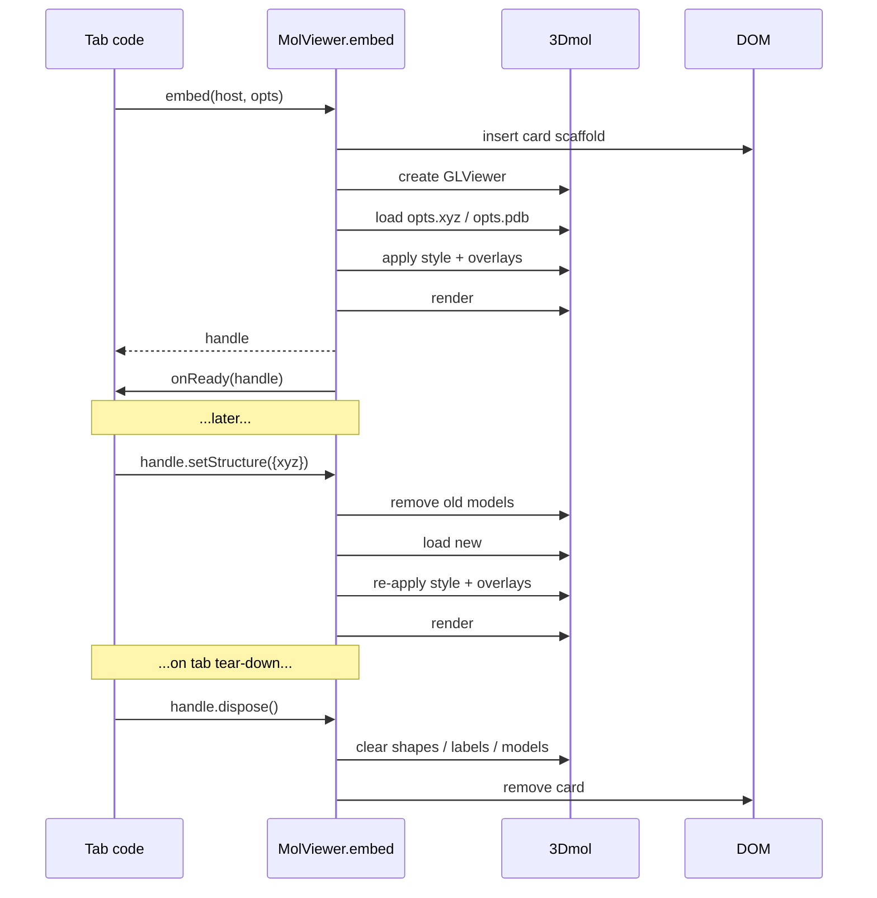

# Embedded MolViewer — the standard structure viewer component

`window.molbuilder.viewer.embed(host, opts) → handle` is molbuilder's
**standard embeddable structure viewer**. Every tab and inspector
that needs to show a 3-D molecular structure drops it into a host
DOM element, supplies XYZ or PDB data + a small declarative options
object, and lets the viewer maintain the drawing.

Pre-this-module, every tab reimplemented the 3Dmol wiring on top of
the same primitives (`mol-style.js`, `mol-axes.js`, `mol-pick.js`,
`mol-format.js`). This doc is the sole source of truth for the
unified viewer's contract; the implementation lives in
`lib/mol-viewer-embed.js`.

---

## 1. Mission

> The viewer takes an input of XYZ or PDB data, and a few options
> (style, axis, label, arrow, etc.), then maintains the drawing.
> It can be embedded as a card/panel where needed and the data is
> supplied to it through the API.

That sentence is the contract. The viewer:

- **Owns its drawing.** Caller never reaches into 3Dmol directly.
  All mutations go through the handle's methods.
- **Is data-in-API.** Structure data comes in as text (XYZ or PDB).
  Lattice, frozen atoms, regions, etc. come in as fields on the
  options object. The viewer never fetches.
- **Is declarative.** Options describe *what* the user should see
  (axes on, atom indices visible, force arrows present); the
  viewer handles *how* (3Dmol primitives, shape lifecycle, render
  scheduling).
- **Is embeddable.** Lives inside any host DOM element as a
  self-contained card. Multiple instances per page are supported;
  each owns its own state.
- **Is reactive.** After mount, the caller updates state through
  handle methods (`setStructure`, `setStyle`, `setAxes`, …). The
  viewer re-renders. The caller never schedules a render.

---

## 2. API surface

```ts
window.molbuilder.viewer.embed(host: HTMLElement, opts: ViewerOpts)
    → ViewerHandle
```

### 2.1 `ViewerOpts`

```ts
type ViewerOpts = {
  // ---- Structure data (at least one required at mount) -------- //
  xyz?: string,                  // XYZ text
  pdb?: string,                  // PDB text
  // If both supplied, pdb wins (richer metadata).  Pass one OR the
  // other in production; both is a programmer convenience for the
  // "load by extension" path.

  // ---- Style ----------------------------------------------------- //
  style?: StyleOpts,             // see § 2.3

  // ---- Overlays (each opt-in; all default off) ------------------ //
  axes?: AxesOpts | boolean,     // see § 2.4; true = Cartesian default
  cell?: CellOpts | boolean,     // see § 2.5; true = use opts.lattice
  labels?: LabelOpts | boolean,  // see § 2.6
  arrows?: ArrowSpec[],          // see § 2.7

  // ---- Lattice (drives cell mode for axes + cell wireframe) ----- //
  lattice?: number[3][3],        // a, b, c row vectors in Å.

  // ---- Atom-pick interaction ------------------------------------ //
  pick?: PickOpts,               // see § 2.8

  // ---- Animation (vibrational mode OR trajectory frames) -------- //
  animation?: AnimationOpts,     // see § 2.9

  // ---- Card chrome (the embeddable panel) ----------------------- //
  card?: {
    title?:        string,
    showInfoLine?: boolean,       // "N atoms · R residues · CxHyOz"
    height?:       string,        // CSS value; default "clamp(360px, 52vh, 500px)"
    className?:    string,        // extra class for outermost card div
    bare?:         boolean,       // suppress the standard .card chrome
                                  // (use when embedding inside an
                                  // existing card; the host owns the
                                  // outer card, viewer owns canvas)
  },

  // ---- Lifecycle ------------------------------------------------- //
  onReady?:        (handle: ViewerHandle) => void,
  // Fired once after the first structure is mounted + rendered.
  // Used by /results' "molbuilder:inspector:ready" dispatch.
}
```

### 2.2 `ViewerHandle`

```ts
type ViewerHandle = {
  // Data setters (re-renders automatically):
  setStructure(opts: { xyz?: string, pdb?: string,
                        lattice?: number[3][3] }): void,

  // Style + overlay setters (each maintains the drawing):
  setStyle(style: StyleOpts):     void,
  setAxes(axes: AxesOpts | bool): void,
  setCell(cell: CellOpts | bool): void,
  setLabels(labels: LabelOpts | bool): void,
  setArrows(arrows: ArrowSpec[]): void,
  setPick(pick: PickOpts):        void,

  // Animation control (only meaningful when opts.animation is set):
  setAnimation(animation: AnimationOpts | null): void,
  playAnimation():        void,
  pauseAnimation():       void,
  isAnimationPlaying():   boolean,
  setAnimationFrame(idx: number): void,  // trajectory mode only
  getAnimationFrame():    number,

  // Read accessors:
  getAtomCount():     number,
  getElements():      string[],
  getPickedIndices(): number[],   // current pick state

  // Lifecycle:
  refit():    void,               // re-fit camera to structure
  render():   void,               // force a render (rarely needed)
  dispose():  void,               // tear down 3Dmol + remove DOM

  // Escape hatch — DO NOT USE in tab code without a doc update.
  // Exists only for legacy migrations that haven't yet ported to
  // the declarative API.  Direct 3Dmol manipulation through this
  // handle invalidates the viewer's drawing-maintenance contract.
  _viewer3dmol(): GLViewer,
}
```

### 2.3 `StyleOpts` — how atoms are drawn

```ts
type StyleOpts = {
  rep?:         "stick" | "ball-and-stick" | "sphere" | "line"
              | "cartoon" | "cross",
  radiusScale?: number,           // default 1.0
  colorScheme?: "element" | "chain" | "residue" | "spectrum",
  background?:  string,           // hex, e.g. "#ffffff" (default)
                                  // 3Dmol canvas convention
                                  // (see web-api.md § 11.4)
  showLabels?:  false | "indices" | "names",
  // Convenience alias for labels.atoms; see § 2.6.
}
```

### 2.4 `AxesOpts` — orientation reference

```ts
type AxesOpts = {
  // Mode is selected automatically:
  //   - If opts.lattice (or this.cell) is set → cell mode (a/b/c)
  //   - Else → Cartesian mode (x/y/z)
  // To force Cartesian even when a lattice is present, set
  // ``mode: "cartesian"`` explicitly.
  mode?:    "auto" | "cartesian" | "cell",
  length?:  number,               // Cartesian fallback length (Å);
                                  // default 1.5
  origin?:  [number, number, number],   // default [0,0,0]
  labels?:  [string, string, string],   // override per-axis label
  colors?:  { [label]: string },        // override per-axis color
  radius?:  number,               // arrow shaft radius; default 0.05 Å
}

// Passing ``axes: true`` is equivalent to ``axes: {}`` (defaults).
// Passing ``axes: false`` (or omitting it) hides the triad.
```

Implementation: delegates to `window.molbuilder.axes.draw()` from
`lib/mol-axes.js`.

### 2.5 `CellOpts` — periodic-cell wireframe

```ts
type CellOpts = {
  color?:  string,                // default uses the page theme
  radius?: number,                // default 0.04 Å
}

// Drawn from opts.lattice (the 3x3 row-vector array).  No-op when
// no lattice is supplied.
```

### 2.6 `LabelOpts` — atom labels

```ts
type LabelOpts = {
  atoms?:  "indices" | "names" | number[],
  //         indices   → "0", "1", "2", ...
  //         names     → atom_name field (PDB-derived; falls back
  //                     to element symbol)
  //         number[]  → label only these specific atom indices
  fontSize?:    number,           // default 12
  fontColor?:   string,
  background?:  string,
}
```

### 2.7 `ArrowSpec[]` — arbitrary arrow overlays

```ts
type ArrowSpec = {
  start:   [number, number, number],
  end:     [number, number, number],
  color?:  string,                // default "#888"
  label?:  string,                // optional label at the arrow tip
  radius?: number,                // default 0.05 Å
}
```

Force vectors, transition-mode displacements, and arbitrary
annotations all use this one primitive. The viewer redraws them
whenever the array passed to `setArrows()` changes; identity
comparison decides "did the array actually change".

### 2.8 `PickOpts` — atom-pick interaction

```ts
type PickOpts = {
  mode:         "none" | "single" | "pair" | "multi",
  haloColor?:   string,           // default page-theme accent
  haloRadius?:  number,           // default 0.6 Å
  onPick?:      (indices: number[]) => void,
  // ``indices`` is the current pick set after the click.  For
  // "single" mode, length is 0 or 1.  For "pair", 0..2.  For
  // "multi", unbounded.
}
```

Delegates to `lib/mol-pick.js` for the halo geometry; the
embedded viewer owns the click-handler registration.

### 2.9 `AnimationOpts` — atoms moving over time

Two animation kinds share one contract: the viewer maintains the
per-frame redraw loop, the caller supplies the motion description.

```ts
type AnimationOpts =
  | VibrationAnimation
  | TrajectoryAnimation;

type VibrationAnimation = {
  kind:          "vibration",
  // Per-atom displacement direction (Å).  Length must match the
  // structure's atom count.  Position at phase φ:
  //     pos_i(φ) = baseline_i + amplitude · cos(φ) · displacement_i
  displacements: number[][][3],
  amplitude?:    number,         // peak Cartesian amplitude (Å); default 0.15
  speedHz?:      number,         // cycle-rate multiplier; default 1.0
  paused?:       boolean,        // start in paused state; default false
};

type TrajectoryAnimation = {
  kind:          "trajectory",
  // Each frame is a full [n_atoms][3] coordinate set.  The
  // structure's atom count + element ordering must match the
  // baseline structure (changing the topology mid-trajectory
  // is not supported).
  frames:        number[][][3],
  startFrame?:   number,         // default 0
  fps?:          number,         // playback rate; default 10
  paused?:       boolean,        // start in paused state; default true
  loop?:         boolean,        // wrap at end; default true
};
```

**Vibration mode** drives spectra's per-mode visualisation: the
selected mode's eigenvector becomes `displacements`; the viewer
loops through one cosine cycle per second (modulated by
`speedHz`).

**Trajectory mode** drives the trajectory inspector's frame
playback: each tick advances to the next frame at `fps`. The
caller manipulates the current frame via `setAnimationFrame(idx)`
(e.g. wired to a slider).

Both modes preserve the user's camera, atom-pick state, axes,
cell, labels, and arrows across every frame — the viewer
updates ONLY the atom positions; every other overlay is
position-aware and recomputes per-frame automatically.

**Card chrome integration.** When `animation.kind === "trajectory"`
AND `opts.card.frameStrip === true` (default for trajectory mode),
the card renders a frame-strip control bar above the canvas:
prev / play-pause / next buttons + frame counter + slider. The
strip wires directly to `playAnimation` / `pauseAnimation` /
`setAnimationFrame`; tabs that want their own controls pass
`card.frameStrip: false` and use the handle methods.

---

## 3. Lifecycle



**Invariants:**

- Every `setX` method is **idempotent** — passing the same opts
  twice is a no-op (no re-render churn).
- Every `setX` method **maintains all other state** — calling
  `setAxes(true)` doesn't clear labels or arrows. The viewer
  owns the full overlay state and updates only what changed.
- `dispose()` is **idempotent**. Second call is a no-op.
- After `dispose()`, every other handle method becomes a no-op
  rather than throwing — defends against late-arriving fetch
  responses.

---

## 4. Card structure

The viewer mounts as a `<section class="card mol-viewer-card">` so
it composes cleanly with the rest of the molbuilder UI's card
layout.

```html
<section class="card mol-viewer-card" data-mol-viewer="1">
  <header class="mol-viewer-card-header">
    <h2 class="mol-viewer-card-title">{opts.card.title}</h2>
    <span class="mol-viewer-info-line">3 atoms · 1 residue · H₂O</span>
  </header>
  <div class="mol-viewer-canvas" style="height: {opts.card.height}"></div>
  <!-- 3Dmol mounts inside .mol-viewer-canvas -->
</section>
```

`data-mol-viewer="1"` is the disposer's hook: `dispose()` removes
every element matching this attribute that the handle owns.

Styling is in `lib/mol-viewer-embed.css` — minimal, themeable via
the standard tokens (`tokens.css`). Tabs that need a different
card chrome pass `opts.card.className` and override.

---

## 5. Consumer migration map

When this contract lands, the following sites should migrate (one
per session, not all at once):

| Site | Current viewer | Target |
|---|---|---|
| `/modify` | `static/modify/viewer.js` — owns 3Dmol mount + style + axes + atom-pick | Embed with `pick: "single"`, `axes: true` |
| `/` (Build) | `static/viewer.js` | Embed with `axes: true` |
| `/results` structure inspector | `lib/inspectors/structure.js` | Embed (simplest case) |
| `/results` trajectory inspector | `lib/trajectory/core.js` | Embed with `animation: { kind: "trajectory", frames: [...] }` and `card.frameStrip: true`. The inspector keeps its plotly chart + polling glue (those are outside the viewer's responsibility); the viewer takes over frame management, atom-pick, axes, cell, force-arrows. |
| `/results` spectra inspector | `lib/spectra/core.js` | Embed with `animation: { kind: "vibration", displacements: <selected-mode eigenvector> }`. The inspector keeps the mode-table + plotly spectrum chart; the viewer takes over mode visualisation entirely. |

The migration order respects feature dependencies: `/modify`
and Build come first (use only static-structure features the
composer can ship in stage 2); the two animation-driven
inspectors migrate after stage 3 wires up the unified
animation loop.

---

## 6. Test coverage

Pure-logic unit tests (Node) cover what the embedded viewer
computes without 3Dmol:

- Option normalisation (`axes: true` → `{mode: "auto"}`, etc.).
- Style → 3Dmol-stylespec mapping (the same `mol-style.js`
  contract already pinned by existing tests).
- Lattice → axis-mode selection (cell vs Cartesian).
- Idempotence of setX methods (the diff computation).

Live-mount tests (Playwright) verify:

- A card mounts inside the host, contains the canvas, runs once
  through `onReady`.
- `handle.setStructure({xyz})` swaps the atoms without leaking
  the previous model.
- `handle.setAxes({mode: "cartesian"})` shows three arrows;
  `setAxes({mode: "cell"})` against a lattice-bearing structure
  shows three arrows scaled to the cell; `setAxes(false)`
  removes them.
- `dispose()` empties the host + idempotent re-call is safe.
- The /modify migration produces the same atom-pick behavior as
  pre-migration (regression guard).

---

## 7. Decisions log

| Date | Decision | Rationale |
|---|---|---|
| 2026-06-02 | Single declarative `embed(host, opts)` entry point — no per-feature constructor. | User's spec: "the viewer takes an input of xyz or pdb data, and a few options". Multiple constructors would invite tab-specific drift; one entry point with optional features keeps the API surface small and composable. |
| 2026-06-02 | Data-in via opts (xyz/pdb text); the viewer never fetches. | Keeps the viewer testable + reusable. Fetching is the tab's job (sidebar reads, projects.readFile, /api/build/load, etc.). The viewer is a pure renderer + state manager. |
| 2026-06-02 | Card chrome owned by the viewer (the embedded panel includes title + info-line). | Per the user: "embedded as a card/panel where needed". Tabs that want bare-canvas can pass `card.className` to suppress chrome via CSS. |
| 2026-06-02 | Unified `animation` opt covers BOTH vibrational-mode visualisation (spectra) AND frame-by-frame trajectory replay. | Both are "atoms moving over time"; the viewer's job is the per-frame redraw loop + maintaining all other overlays across frames. The shape discriminator (`kind: "vibration" \| "trajectory"`) keeps the data shapes honest (vibration uses an eigenvector + phase; trajectory uses discrete frames + index) without splintering the API surface. The frame-strip is opt-in card chrome so non-trajectory consumers don't pay the DOM cost. |
| 2026-06-02 | The trajectory inspector's plotly chart + polling stay outside the viewer. | The viewer is a renderer + state manager for the 3-D drawing; the energy / max-force / SCF-residual plots and the mtime polling are tab-level concerns that belong to the inspector. The handle's animation API gives the inspector everything it needs to drive the viewer; the inspector keeps the plot wiring + the `/api/watch/data` polling. |
| 2026-06-02 | `_viewer3dmol()` escape hatch documented but discouraged. | Legacy migrations may need direct 3Dmol access during transition; the named accessor + docstring makes the boundary explicit so review can catch unjustified uses. |
