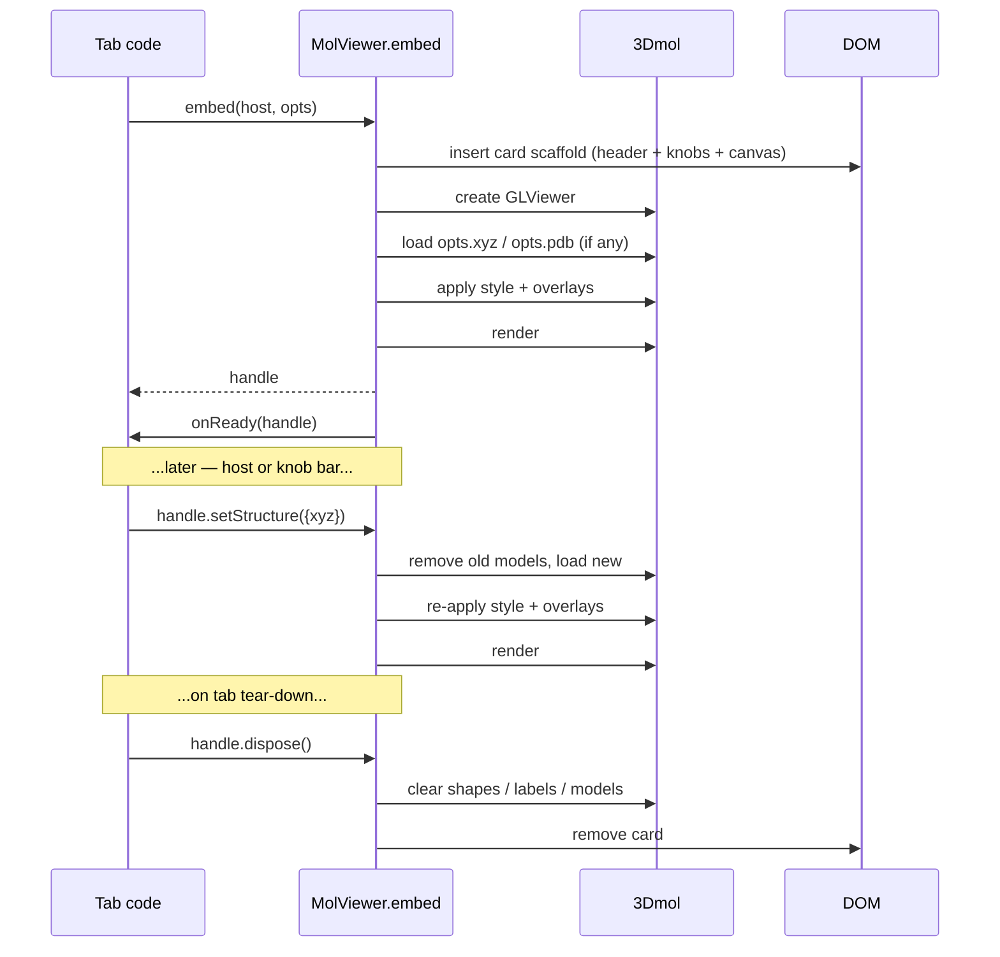

# Embedded MolViewer — the standard structure viewer component

`window.molbuilder.viewer.embed(host, opts) → handle` is molbuilder's
**standard embeddable structure viewer**. Every tab and inspector
that needs to show a 3-D molecular structure drops it into a host
DOM element, supplies XYZ or PDB data plus a small declarative
options object, and lets the viewer maintain the drawing — canvas,
standard control knobs, info line, animation strip and all.

This file is the **sole source of truth** for the unified viewer's
contract. The implementation lives in `lib/mol-viewer-embed.js`;
the CSS in `lib/mol-viewer-embed.css`. Both files MUST conform to
this document; any deliberate divergence updates this document
first, code second.

**How to use this document for implementation review.** Every
behavior the embed exhibits, every API method on the handle, every
error code, every test affordance — all are specified here.
Implementation review compares code against doc clauses, not the
other way around. Section anchors (§ 2.5, § 5.3, etc.) are stable
within a major revision and cited in code comments where a clause
is realised.

---

## Table of contents

1. Mission
2. Isolation contract
3. API surface
4. Lifecycle and state transitions
5. Error model
6. Card structure
7. Usage patterns
8. Consumer migration map
9. Testing affordances
10. Test coverage
11. Decisions log

---

## 1. Mission

> The viewer takes an input of XYZ or PDB data, and a few options
> (style, axis, label, arrow, etc.), then maintains the drawing.
> It can be embedded as a card/panel where needed and the data is
> supplied to it through the API.
>
> The viewer is not just the white 3D display but a module with a
> consistent UI as a whole — a card that contains the canvas AND
> the typical control knobs. External modules attach additional
> controls next to it; those external controls drive the viewer
> through the API.

The viewer:

- **Owns its drawing.** The host never reaches into 3Dmol directly.
  All mutations cross the API boundary as handle method calls.
- **Owns its chrome.** Style picker, labels toggle, axes toggle,
  reset view, screenshot, background and data export live inside
  the viewer card. Every tab gets the same controls, the same
  look, the same placement.
- **Is data-in-API.** Structure text and options come in through
  the embed call; the viewer never fetches.
- **Is declarative.** Options describe *what* the user should see
  (axes on, atom indices visible, force arrows present); the
  viewer handles *how* (3Dmol primitives, shape lifecycle, render
  scheduling).
- **Is embeddable.** Lives inside any host DOM element as a
  self-contained card. Multiple instances per page are supported;
  each owns its own state.
- **Is reactive.** After mount, the host updates state through
  handle methods (`setStructure`, `setStyle`, `setAxes`, …). The
  viewer re-renders. The host never schedules a render.

---

## 2. Isolation contract

The viewer is a self-contained module with a strict interface
boundary. Everything inside the boundary is the viewer's job;
everything outside is the host's. Crossing the boundary requires
either a method on the handle (host → viewer) or a callback in
the options (viewer → host). There is no other coupling.

### 2.1 What the viewer owns

Everything inside the viewer card, plus all 3Dmol-side state:

| Concern | Component |
|---|---|
| 3-D rendering | 3Dmol GLViewer mounted in `.mol-viewer-canvas` |
| Standard knob bar | `.mol-viewer-knobs` — style / labels / axes / reset / screenshot / background / export |
| Animation frame strip | `.mol-viewer-frame-strip` (auto-shown for trajectory animation) |
| Info line | `.mol-viewer-info-line` — atom count, residue count, formula |
| Overlay state | axes, cell wireframe, labels, arrows, atom overlays, pick halos, animation frame, camera |
| 3Dmol object lifecycle | shapes, labels, models — create / update / destroy |
| Render scheduling | when to call `viewer.render()` |
| Export plumbing | save-to-project / download / clipboard / animation encoders |

### 2.2 What the host owns

Everything OUTSIDE the viewer card:

| Concern | Owner |
|---|---|
| Page layout | host tab's CSS grid / flex |
| Tab-specific control cards | file picker, mode list, selection panel, region editor, sidebar |
| Data fetching | sidebar reads, `/api/*` calls, polling |
| Charts | plotly spectrum + energy/force plots |
| Project context | current sidebar dir, file naming |
| Cross-component state | selection store, runtime store, etc. |

The host's adjacent control card may sit anywhere relative to the
viewer card — left, right, above, below, wrapping at narrow
viewports — via standard CSS. The viewer offers NO layout API for
external attachments; this keeps the embed simple and lets each
tab decide its own responsive behavior.

### 2.3 Crossing the boundary

| Direction | Mechanism |
|---|---|
| Host → viewer (mutate) | `handle.setStructure(...)`, `setStyle(...)`, `setAxes(...)`, `setOverlays(...)`, etc. |
| Host → viewer (read) | `handle.getAtomCount()`, `getPickedIndices()`, `getCamera()`, `getAnimationFrame()` |
| Host → viewer (commands) | `handle.playAnimation()`, `refit()`, `screenshot()`, `exportData(...)`, `dispose()` |
| Viewer → host (events) | `opts.onReady(handle)`, `opts.onError(err)`, `opts.pick.onPick(indices)`, `opts.export.onExport(info)`, `opts.animation.onFrame(idx, handle)` *(trajectory only)* |

The host never reads 3Dmol objects directly; the viewer never
reads host DOM outside its own card; neither inspects the other's
CSS or in-page state.

### 2.4 Deprecated escape hatches

| Hatch | Reason it still exists | Removal trigger |
|---|---|---|
| `handle._viewer3dmol()` | `lib/selection/viewer-adapter.js` reaches in for camera ops + click polling | When the selection-store adopts § 3.2 (`setOverlays`, `getCamera`/`setCamera`) |
| `opts.card.bare` | REMOVED 2026-06-03 — all five consumers migrated to the standard chrome (#202–#206). The opt is now ignored; callers still passing `bare: true` get the standard card chrome. The DOM class `.mol-viewer-bare` is no longer emitted and the corresponding CSS rules are gone. | — |

Both are documented but **MUST NOT** be used in new code. Tab
authors that find themselves wanting one should propose a new
declarative API on the handle instead.

### 2.5 Required external modules

The embed is a composer over the rest of the molbuilder runtime
stack. This subsection lists what it expects to find at `embed()`
time, and what happens when a dependency is absent.

#### 2.5.1 Hard dependencies (`embed()` throws on absence)

| Dependency | Provides | Where loaded |
|---|---|---|
| `$3Dmol` (window global) | 3Dmol GLViewer + primitives | `static/vendor/3dmol-min.js` |
| `window.molbuilder.viewer.create` | low-level GLViewer mount helper | `static/lib/mol-viewer.js` |
| `window.molbuilder.fmt` | XYZ/PDB parse + element extraction + formula | `static/lib/mol-format.js` |

Missing any of these is a programming error: the embed throws
synchronously with a `ViewerError` of code `"missing_dependency"`
naming the absent module. Page boot pre-loads all three before any
tab is interactive.

#### 2.5.2 Soft dependencies (feature degrades gracefully)

| Dependency | Disabled feature | Degraded behavior |
|---|---|---|
| `window.molbuilder.axes` (`lib/mol-axes.js`) | `opts.axes`, `setAxes()` | silently no-op; no axes drawn |
| `window.molbuilder.style` (`lib/mol-style.js`) | `opts.style.rep` mapping | falls back to 3Dmol's default stylespec; `colorScheme` ignored |
| `window.molbuilder.pick` (`lib/mol-pick.js`) | `opts.pick`, halo rendering | click events still fire but no halo overlay |

Soft-dep degradation is silent in production. Tests assert it via
`handle._test.getDependencyStatus()` (§ 9.4).

#### 2.5.3 Integration dependencies (only required by specific features)

| Dependency | Required for | Contract expected |
|---|---|---|
| `window.molbuilder.projects` (`lib/projects-api.js`) | `exportData({target:"project"})`, `exportAnimation({target:"project"})`, `screenshot({target:"project"})` | Must expose `writeFile(path, data, opts?) → Promise<{ok, error, path, ...}>` and `currentDir → string` (synchronous getter). See `docs/protocols/projects-sidebar.md` for the full contract. |
| `navigator.clipboard` | `exportData({target:"clipboard"})` | Must expose `writeText(s) → Promise<void>`. Browser provides this when origin is HTTPS or localhost; `undefined` elsewhere. |
| `window.MediaRecorder` (global) | `exportAnimation({format:"webm"})` | Must support `MediaRecorder.isTypeSupported("video/webm")`. |
| `window.GIF` (lazy-loaded gif.js) | `exportAnimation({format:"gif"})` | Loaded on first use from `static/vendor/gif.min.js`. Lazy-load is shared across embeds; a single failed load disables GIF for all instances. |

If a feature's integration dep is absent at the point of use:

- The corresponding handle method rejects with a `ViewerError` of
  the appropriate code (§ 5 — `"no_project"`, `"no_clipboard"`,
  `"no_media_recorder"`, `"no_gif_encoder"`).
- The export menu **hides** buttons whose dep is unavailable at the
  time of menu open (re-checked on each open, not cached).

#### 2.5.4 Project-API integration detail

Save-to-project targets compute the full path as:

```js
path = projects.currentDir + "/" + (opts.export.defaultName || "structure") + "." + format
```

The embed calls `projects.writeFile(path, data)` and propagates the
returned envelope:

- On `{ok: true, ...}`: fires `opts.export.onExport({...})` and
  resolves the Promise with `{filename, bytes}`.
- On `{ok: false, error}`: rejects the Promise with
  `ViewerError(code: "io_error", message: error, cause: envelope)`.

The embed does NOT depend on `projects.readFile`, `projects.list`,
or any other surface — write-only integration.

#### 2.5.5 Test injection

`opts.testInjection` accepts dependency-injected substitutes for
testing. When supplied, the substitutes replace the global lookup
**only for this embed instance**; production globals are untouched.
See § 9 for the exact interface.

---

## 3. API surface

```ts
window.molbuilder.viewer.embed(host: HTMLElement, opts: ViewerOpts)
    → ViewerHandle
```

### 3.1 `ViewerOpts`

```ts
type ViewerOpts = {
  // ---- Structure data (both optional at mount) ----------------- //
  xyz?: string,                  // XYZ text
  pdb?: string,                  // PDB text
  // If both supplied, pdb wins (richer metadata).  Pass one OR
  // the other in production; both is a programmer convenience for
  // the "load by extension" path.  If NEITHER is supplied, the
  // viewer mounts an empty canvas; populate later via
  // ``handle.setStructure({xyz | pdb})``.

  // ---- Style --------------------------------------------------- //
  style?: StyleOpts,             // see § 3.3

  // ---- Overlays (each opt-in; all default off) ----------------- //
  axes?:   AxesOpts | boolean,   // see § 3.4; true = Cartesian default
  cell?:   CellOpts | boolean,   // see § 3.5; true = use opts.lattice
  labels?: LabelOpts | boolean,  // see § 3.6
  arrows?: ArrowSpec[],          // see § 3.7

  // ---- Per-atom overlays (subset styling, halos, markers) ------ //
  overlays?: OverlaySpec,        // see § 3.12

  // ---- Lattice (drives cell mode for axes + cell wireframe) ---- //
  lattice?: number[3][3],        // a, b, c row vectors in Å.

  // ---- Atom-pick interaction ----------------------------------- //
  pick?: PickOpts,               // see § 3.8

  // ---- Animation (vibrational mode OR trajectory frames) ------- //
  animation?: AnimationOpts,     // see § 3.9

  // ---- Camera persistence -------------------------------------- //
  preserveCamera?: boolean,
  // If true (default), camera state is preserved across
  // ``setStructure`` calls AFTER the first load.  The first load
  // always calls ``zoomTo()`` to frame the structure; subsequent
  // loads (e.g. /modify ops that return a slightly-edited
  // structure) keep the user's pan/zoom.  Set ``false`` to force
  // ``zoomTo()`` on every ``setStructure``.

  // ---- Standard knob bar (canonical chrome) -------------------- //
  knobs?: KnobBarOpts | boolean, // see § 3.10; true = all defaults

  // ---- Export plumbing ----------------------------------------- //
  export?: ExportOpts | boolean, // see § 3.11; true = all defaults

  // ---- Card chrome (the embeddable panel) ---------------------- //
  card?: {
    title?:        string,        // shown in card header
    showInfoLine?: boolean,       // "N atoms · R residues · CxHyOz"
    height?:       string,        // CSS value; default "clamp(360px, 52vh, 500px)"
    className?:    string,        // extra class for outermost card div
    bare?:         boolean,       // REMOVED 2026-06-03 — ignored;
                                  // standard chrome shows regardless.
  },

  // ---- Test injection (production embeds pass nothing) -------- //
  testInjection?: TestInjection, // see § 9.3

  // ---- Lifecycle / events -------------------------------------- //
  onReady?: (handle: ViewerHandle) => void,
  // Fired once after the first structure is mounted + rendered.

  onError?: (err: ViewerError) => void,
  // Fired for any error the embed cannot return through a Promise:
  //   - synchronous setX method failures (bad input, render error)
  //   - soft-dep load failures discovered late
  //   - internal render exceptions caught by the loop
  // Async methods reject their returned Promise INSTEAD of firing
  // onError; onError is for the sync / fire-and-forget paths only.
}
```

### 3.2 `ViewerHandle`

```ts
type ViewerHandle = {
  // ---- Data setters (re-renders automatically) ----------------- //
  setStructure(opts: { xyz?:           string,
                       pdb?:           string,
                       lattice?:       number[3][3],
                       preserveCamera?: boolean }): void,
  // See § 4.2 for setStructure × animation interactions and the
  // camera-preservation rule.  ``preserveCamera`` here overrides
  // the embed-level opts.preserveCamera for THIS call only.

  appendFrames(frames: number[][][3]): void,
  // Trajectory mode only.  Extends ``animation.frames`` with the
  // supplied frames.  The current playback frame index is
  // preserved (does NOT auto-jump to the new tail).  Used by the
  // trajectory inspector's live polling path.  No-op for
  // vibration mode or when no animation is set.
  //
  // ``arrowsPerFrame`` (if it was supplied at ``setAnimation``
  // time) is NOT extended; new tail frames render with NO arrows
  // for indices beyond the original ``arrowsPerFrame.length``.
  // To update arrows for new tail frames, either re-call
  // ``setAnimation({...current, frames: ..., arrowsPerFrame: ...})``
  // with the new combined arrays, OR use the ``onFrame`` callback
  // (§ 3.9) to source arrows from a host-side data store per
  // frame.  The live-poll usage pattern (§ 7.4) shows both.

  // ---- Style + overlay setters --------------------------------- //
  setStyle(style: StyleOpts):              void,
  setAxes(axes: AxesOpts | boolean):       void,
  setCell(cell: CellOpts | boolean):       void,
  setLabels(labels: LabelOpts | boolean):  void,
  setArrows(arrows: ArrowSpec[]):          void,
  setPick(pick: PickOpts):                 void,
  setBackground(color: string):            void,
  // ``color`` is a CSS color string (e.g. "#ffffff", "rgb(0,0,0)",
  // "transparent").  Affects the canvas backdrop ONLY; never
  // changes the page theme.  No named-theme shortcuts.

  // ---- Per-atom overlays --------------------------------------- //
  setOverlays(overlays: OverlaySpec): void,
  // Idempotent; replaces the current overlay set entirely.

  setAtomStyle(
    selector: number[] | { elements: string[] } | { residues: number[] },
    style:    AtomOverlaySpec["style"] | null,
  ): void,
  // Sugar for the common "style these atoms differently" call.
  // Internally upserts a single ``overlays.atoms[]`` entry keyed
  // on the selector's normalised form.  Passing ``style: null``
  // removes that entry.  See § 3.12 for layering rules.

  // ---- Camera -------------------------------------------------- //
  getCamera(): CameraState,
  // Captures the current camera (position, look-at, zoom, rotation).

  setCamera(state: CameraState | null): void,
  // Restores camera from a previously-captured state.  No-op if
  // state is null or has a different _viewer / _version than the
  // embed expects.

  // ---- Knob bar ------------------------------------------------ //
  setKnobs(knobs: KnobBarOpts | boolean): void,
  // Reconfigure the visible knobs at runtime (rare; for tabs that
  // change the available controls mid-session).

  // ---- Animation control --------------------------------------- //
  setAnimation(animation: AnimationOpts | Partial<AnimationOpts> | null): void,
  // Full-or-partial update.  Full: pass a complete AnimationOpts
  // with ``kind``.  Partial: pass an object WITHOUT ``kind`` to
  // update individual fields of the active animation (e.g.
  // ``{amplitude: 0.3}`` on a running vibration).  ``null`` clears
  // the animation; see § 4.3 for the stop policy.

  playAnimation():        void,
  pauseAnimation():       void,
  isAnimationPlaying():   boolean,
  setAnimationFrame(idx: number): void,  // trajectory mode only
  getAnimationFrame():    number,

  // ---- Read accessors ------------------------------------------ //
  getAtomCount():     number,
  getElements():      string[],
  getPickedIndices(): number[],
  getStructureText(format?: "xyz" | "pdb"): string,
  // Returns the current structure as text in the requested format.
  // If ``format`` is omitted, returns whatever was supplied
  // (pdb if both were available, else xyz).  Used by the export
  // plumbing.

  // ---- Output / export ----------------------------------------- //
  screenshot(opts?: { target?:   "project" | "download",
                      width?:    number,
                      height?:   number,
                      filename?: string,
                      signal?:   AbortSignal }):
      Promise<{ dataUrl: string, blob: Blob,
                filename?: string, bytes?: number }>,
  // Captures a PNG of the current canvas.  Resolves with the data
  // URL + blob.  If ``target: "download"``, also triggers a browser
  // download.  If ``target: "project"``, also writes to the active
  // project's sidebar dir via projects.writeFile.  Omit ``target``
  // for capture-only.
  //
  // When ``width`` or ``height`` exceeds the on-screen canvas
  // size, the embed uses 3Dmol's ``pngURI(width, height)`` for
  // super-resolution capture; aspect ratio is preserved by the
  // missing dimension.

  exportData(opts: { target:    "project" | "download" | "clipboard",
                     format?:   "xyz" | "pdb",
                     filename?: string,
                     signal?:   AbortSignal }):
      Promise<{ filename: string, bytes: number }>,
  // Imperative version of the structure-export menu.  See § 3.11
  // for target semantics.

  // ---- Animation export ---------------------------------------- //
  // Only meaningful when opts.animation is set.  Each method
  // drives the animation forward and captures the canvas per
  // frame; static-structure embeds reject with
  // ViewerError(code: "static_structure").

  captureFrames(opts?: { fps?:        number,
                         duration?:   number,
                         width?:      number,
                         height?:     number,
                         signal?:     AbortSignal,
                         onProgress?: (pct: number, label?: string) => void }):
      Promise<Blob[]>,
  // Returns a list of PNG blobs, one per frame.  The viewer drives
  // the animation forward over ``duration`` seconds at ``fps``,
  // capturing the canvas after each render.  Vibration mode steps
  // the cosine phase; trajectory mode advances frame indices,
  // wrapping if duration exceeds the trajectory length.  Defaults:
  //   fps      = animation.fps (trajectory) or 30 (vibration)
  //   duration = full one-loop (trajectory) or 1/animation.speedHz
  //              seconds (vibration; one cosine cycle)
  //   width    = canvas client width
  //   height   = canvas client height
  // PNG output isolates the encoder choice from the embed.

  exportAnimation(opts: { format:      "webm" | "gif",
                          target:      "project" | "download",
                          fps?:        number,
                          duration?:   number,
                          filename?:   string,
                          signal?:     AbortSignal,
                          onProgress?: (pct: number, label?: string) => void }):
      Promise<{ filename: string, bytes: number }>,
  // High-level animation export, wired to the export menu's
  // "Animation" submenu.  ``format: "webm"`` uses the native
  // MediaRecorder on canvas.captureStream(fps); ``format: "gif"``
  // uses gif.js (lazy-loaded on first call).  No "clipboard"
  // target — binary video isn't pasteable in molbuilder's contexts.

  // ---- Lifecycle ----------------------------------------------- //
  refit():    void,               // re-fit camera to structure
  render():   void,               // force a render (rarely needed)
  dispose():  void,               // tear down 3Dmol + remove DOM

  // ---- Test affordances --------------------------------------- //
  _test: TestHandle,             // see § 9.2

  // ---- Escape hatch — see § 2.4 -------------------------------- //
  _viewer3dmol(): GLViewer,
}
```

### 3.3 `StyleOpts`

```ts
type StyleOpts = {
  rep?:         "stick" | "ball-and-stick" | "sphere" | "line"
              | "cartoon" | "cross",
  radiusScale?: number,           // default 1.0
  colorScheme?: "element" | "chain" | "residue" | "spectrum",
  background?:  string,           // CSS color; default "#ffffff"
                                  // Canvas backdrop only; never
                                  // affects the page theme.
}
```

The `showLabels` field from earlier drafts has been **removed** —
labels are controlled exclusively via `opts.labels` / `setLabels()`
(§ 3.6). Two paths to the same state caused precedence ambiguity.

### 3.4 `AxesOpts`

```ts
type AxesOpts = {
  mode?:   "auto" | "cartesian" | "cell",
  length?: number,                // Cartesian fallback length (Å); default 1.5
  origin?: [number, number, number],   // default [0,0,0]
  labels?: [string, string, string],
  colors?: { [label]: string },
  radius?: number,                // arrow shaft radius; default 0.05 Å
}

// ``axes: true`` ≡ ``axes: {}``.  ``axes: false`` (or omitted) hides.
```

Mode selection:
- If `opts.lattice` (or `opts.cell`) is set → cell mode (a/b/c).
- Else → Cartesian mode (x/y/z).
- To force Cartesian even when a lattice is present, set
  `mode: "cartesian"` explicitly.

Delegates to `window.molbuilder.axes.draw()` from `lib/mol-axes.js`
(soft dependency; see § 2.5.2).

### 3.5 `CellOpts`

```ts
type CellOpts = {
  color?:  string,                // default uses the page theme
  radius?: number,                // default 0.04 Å
}
```

Drawn from `opts.lattice`. No-op when no lattice is supplied.

### 3.6 `LabelOpts`

```ts
type LabelOpts = {
  // ---- Which atoms to label ------------------------------------ //
  atoms?: "all" | number[],
  //   "all"     → every atom (default when labels is enabled)
  //   number[]  → label only these specific atom indices

  // ---- Label text format --------------------------------------- //
  format?: "index" | "name" | "element",
  //   "index"   → "0", "1", "2", ...                  (default)
  //   "name"    → atom_name field (PDB-derived; falls back to
  //               element symbol)
  //   "element" → element symbol only ("C", "H", "O", ...)

  // ---- Cosmetics ----------------------------------------------- //
  fontSize?:   number,            // default 12
  fontColor?:  string,
  background?: string,
}
```

`atoms` controls WHICH atoms are labelled; `format` controls WHAT
each label says. The two are independent — a per-index selection
with element-symbol labels is `{atoms: [1, 5, 9], format: "element"}`.

### 3.7 `ArrowSpec[]`

```ts
type ArrowSpec = {
  start:   [number, number, number],
  end:     [number, number, number],
  color?:  string,                // default "#888"
  label?:  string,                // optional label at the arrow tip
  radius?: number,                // default 0.05 Å
}
```

Force vectors, transition-mode displacements, and arbitrary
annotations all use this one primitive. The viewer redraws when
`setArrows()` is called with a different array; identity comparison
decides "did the array change".

For trajectory animations, see `arrowsPerFrame` (§ 3.9) which
swaps arrows automatically as frames advance.

### 3.8 `PickOpts`

```ts
type PickOpts = {
  mode: "none" | "single" | "pair" | "multi",

  // ---- Visual treatment of selected atoms ----------------------- //
  // Selected atoms get a halo + an index label by DEFAULT.  This
  // matches /modify's existing behaviour (click an atom → it
  // highlights and shows its index) and gives Build / inspectors
  // the same informative pick UX without per-tab CSS work.
  halo?:  { color?:   string,            // default page-theme accent
            radius?:  number,            // default 0.6 Å
            opacity?: number             // default 0.5
          } | false,                     // false = no halo
  style?: { color?:       string,        // tint applied to picked atoms
            opacity?:     number,        // default 1
            radiusScale?: number },      // optional; no default override

  label?: false | "index" | "name" | "element",
  //   false      → no auto labels on picked atoms
  //   "index"    → "0", "1", ...                       (DEFAULT)
  //   "name"     → atom_name field (PDB-derived)
  //   "element"  → element symbol

  // ---- Callback ------------------------------------------------ //
  onPick?: (indices: number[]) => void,

  // ---- Backwards-compat shims (deprecated) --------------------- //
  haloColor?:  string,           // use halo.color instead
  haloRadius?: number,           // use halo.radius instead
}
```

**Deprecated-field precedence.** If the new `halo` object is
supplied (even as `halo: {}` or `halo: false`), the deprecated
`haloColor` / `haloRadius` are **ignored entirely** — no
field-level merge. The deprecated path applies ONLY when `halo`
is absent and `{haloColor, haloRadius}` is supplied; in that case
the embed synthesises `halo: {color: haloColor, radius: haloRadius,
opacity: <default>}` and proceeds as if the new shape was used.
This keeps the merge rule trivial to reason about (you're either
in the legacy lane or the modern lane, never both).

**Defaults.** `halo: { color: "var(--accent)", radius: 0.6,
opacity: 0.5 }` plus `label: "index"`. Hosts that want minimal
selection rendering pass `halo: false, label: false`; hosts that
want richer rendering compose `halo + style + label` per
preference.

**Layering.** Selection halos draw above OverlaySpec halos
(§ 3.12). Selection style overrides apply ABOVE base style and
ABOVE OverlaySpec style overrides — picked atoms always "win" the
style fight so the user can SEE what's selected. Selection labels
draw above other labels.

**Persistence.** Picked indices survive `setStructure({xyz: ...})`
IFF the atom count and element ordering match; otherwise the pick
state is cleared. Picked indices are NOT affected by
`setOverlays()`, `setStyle()`, or `setAnimation()`.

Delegates to `lib/mol-pick.js` for halo geometry; the embedded
viewer owns the click-handler registration.

### 3.9 `AnimationOpts`

```ts
type AnimationOpts =
  | VibrationAnimation
  | TrajectoryAnimation;

type VibrationAnimation = {
  kind:          "vibration",
  // Per-atom displacement direction (Å).  Length must match the
  // structure's atom count.  Position at phase φ:
  //     pos_i(φ) = baseline_i + amplitude · cos(φ) · displacement_i
  displacements: number[][][3],
  amplitude?:    number,         // peak Cartesian amplitude (Å); default 0.15
  speedHz?:      number,         // cycle-rate multiplier; default 1.0
                                 //   MUST be > 0; values ≤ 0 are
                                 //   clamped to 1e-3 by the embed.
  paused?:       boolean,        // start in paused state; default false
};

type TrajectoryAnimation = {
  kind:           "trajectory",
  // Each frame is a full [n_atoms][3] coordinate set.  Element
  // ordering must match the baseline structure (changing topology
  // mid-trajectory is not supported).
  frames:         number[][][3],
  // Optional parallel arrays — index ``i`` applies during frame ``i``:
  arrowsPerFrame?: ArrowSpec[][],
  // Length MUST equal frames.length when present.  An empty
  // arrowsPerFrame[i] means "no arrows during frame i".  Drives
  // the trajectory inspector's per-frame force-vector display
  // without the host having to call setArrows() on every frame.

  startFrame?:    number,         // default 0
  fps?:           number,         // playback rate; default 10
  paused?:        boolean,        // start in paused state; default true
  loop?:          boolean,        // wrap at end; default true

  onFrame?:       (idx: number, handle: ViewerHandle) => void,
  // Fired BEFORE each frame renders.  Hosts that need custom
  // per-frame logic (conditional arrows, overlay updates) wire
  // here.  Calling handle.setX methods from onFrame is supported
  // but adds render cost; prefer arrowsPerFrame for the common
  // case.
};
```

**Vibration mode** drives spectra's per-mode visualisation.
**Trajectory mode** drives the trajectory inspector's frame
playback. Both preserve the user's camera, pick state, axes, cell,
labels, and arrows across frames — the viewer updates ONLY atom
positions; every other overlay is position-aware and recomputes
per-frame automatically.

When `animation.kind === "trajectory"`, the **frame strip** auto-
renders above the canvas: prev / play-pause / next / counter /
slider, wired directly to `playAnimation` / `pauseAnimation` /
`setAnimationFrame`. Vibration mode does NOT show a frame strip
(it has no discrete frames); the standard knob bar's play/pause
handles vibration.

### 3.10 `KnobBarOpts`

```ts
type KnobBarOpts = {
  // Each knob is independently controllable:
  //   true   → always visible
  //   false  → hidden
  //   "auto" → visible only when meaningful for the current state
  //            (e.g. play/pause shows only when opts.animation is
  //            set; screenshot shows only when a structure exists)
  style?:      boolean | "auto",   // default true
  labels?:     boolean | "auto",   // default true
  axes?:       boolean | "auto",   // default true
  reset?:      boolean | "auto",   // default true
  screenshot?: boolean | "auto",   // default true
  background?: boolean | "auto",   // default true
  export?:     boolean | "auto",   // default true

  // Optional background-knob configuration:
  backgroundPresets?: string[],    // CSS colors offered as
                                   // one-click presets; default
                                   // ["#ffffff", "#1c1c1c",
                                   //  "transparent"]
  backgroundAllowCustom?: boolean, // show a color-picker input
                                   // alongside the presets;
                                   // default true

  // Optional labels-knob configuration:
  labelsFormats?: ("index" | "name" | "element")[],
  // Format choices offered by the Labels popover.  Defaults +
  // edge cases:
  //   - undefined → all three formats offered
  //   - ["index"] (single item) → suppresses the popover; the
  //     Labels knob collapses to a plain on/off toggle in that
  //     format
  //   - []        → hides the entire Labels knob (same as
  //                  ``labels: false``); the embed warns once via
  //                  ``onError(invalid_input)`` because the empty
  //                  array is almost certainly a bug
  //   - duplicate entries → de-duplicated silently, original
  //                          order preserved

  // Cosmetic / layout
  position?:   "top" | "bottom",   // default "top"
  compact?:    boolean,            // default false — when true,
                                   // some labels collapse to icons.
};

// ``knobs: true`` (or omitted) shows the full default knob set.
// ``knobs: false`` hides the entire bar.
```

**Knob semantics** — each wires to the indicated handle method:

| Knob | Maps to | UI element |
|---|---|---|
| Style | `setStyle({rep, radiusScale})` | `<select>` |
| Labels | `setLabels({atoms: "all", format})` or `setLabels(false)` | popover (Index / Name / Element / Off) |
| Axes | `setAxes(true \| false)` | toggle button |
| Reset | `refit()` | button |
| Screenshot | `screenshot({target:"download"})` | button (downloads PNG immediately) |
| Background | `setBackground(color)` | popover with preset swatches + optional color picker |
| Export | dispatches based on submenu selection (see § 6 + § 3.11) | `<details>` menu |

**Keyboard shortcuts** the knob bar listens for when the canvas
or any knob is focused:

| Key | Action |
|---|---|
| `R` | Reset view (`refit()`) |
| `L` | Open the Labels popover (focus first format button). Repeat `L` while open → close. |
| `A` | Toggle axes |
| `B` | Open the Background popover (focus first preset). Repeat `B` → close. |
| `E` | Open the Export popover. Repeat `E` → close. |
| `↑` / `↓` (inside popover) | move focus between format / preset / target buttons |
| `Enter` (inside popover) | activate focused button |
| `Space` | Play/pause (when animation is set; only when canvas or frame strip is focused, not while a popover is open) |
| `←` / `→` | prev / next frame (trajectory only) |
| `Home` / `End` | first / last frame (trajectory only) |
| `Esc` | Close any open knob popover (Labels, Background, Export) |

**Popover open/close patterns** (consistent across Labels,
Background, Export):

- Click on a closed popover's summary → opens it. Click elsewhere
  in the card → closes it.
- Click on a popover's action button (Index / Name / Off /
  preset swatch / export target) → fires the action AND closes
  the popover. This matches the Export pattern; Background's
  "click a preset" already used this.
- Background's custom color picker (`<input type="color">`) is
  the one exception — typing in it does NOT close the popover.
- Only one popover open at a time. Opening one closes the others.

Single-letter keys (`R`, `L`, `A`, `B`, `E`) do NOT fire while a
`<input>`, `<textarea>`, or `[contenteditable]` element inside
the card is focused (notably the Background popover's
custom-color `<input type="color">`). `Space` and arrow keys
behave the same — they only fire when the canvas, a knob button,
or the frame strip is the active element.

**While a popover is open** (Labels / Background / Export), the
embed suppresses single-letter shortcuts mapped to OTHER knobs.
Only the popover's own opening key (a second press of `L` / `B` /
`E` closes it), the arrow/Enter focus-navigation keys, and `Esc`
fire. `R` and `A` are suppressed; `Space` and trajectory arrow
keys are also suppressed (they expect canvas/frame-strip focus,
not popover focus). This prevents accidental toggles while the
user is navigating a popover with the keyboard.

This is the keyboard exception to the *click/tap* rule "Only one
popover open at a time — opening one closes the others." That rule
applies to click and touch opens, where the user is consciously
switching focus between popovers. Cross-knob *keystrokes* (e.g.
pressing `B` while Labels is open) are suppressed instead of
chaining: the user has to `Esc` out of Labels first, then press
`B`. Keyboard chaining would invite accidental popover swaps
mid-arrow-navigation.

Hosts can suppress all key handling by setting `knobs.compact:
true` AND focusing an input outside the card; the embed never
captures `Tab`.

### 3.11 `ExportOpts`

The export menu unifies three content categories — **structure**
(XYZ/PDB text), **image** (PNG of the canvas), and **animation**
(WebM/GIF, when an animation is active) — under a single set of
target affordances: project / download / clipboard. Each category
declares which targets make sense for it.

```ts
type ExportOpts = {
  // Filename hint (no extension).  Defaults to the structure's
  // ``system_label`` from a PDB HEADER record, or "structure".
  defaultName?:   string,

  // ---- Structure (xyz/pdb text) ----------------------------- //
  structure?: {
    saveToProject?: boolean,   // default true
    download?:      boolean,   // default true
    clipboard?:     boolean,   // default true
  } | boolean,                 // true ≡ all defaults; false hides

  // ---- Image (PNG screenshot) ------------------------------- //
  image?: {
    saveToProject?: boolean,   // default true
    download?:      boolean,   // default true
    // No clipboard for image — molbuilder pastes nowhere useful.
  } | boolean,

  // ---- Animation (WebM/GIF) — only meaningful with animation - //
  animation?: {
    webm?:          boolean,   // default true (native MediaRecorder)
    gif?:           boolean,   // default true (gif.js, lazy-loaded)
    fps?:           number,    // capture rate; see captureFrames()
    duration?:      number,    // seconds; see captureFrames()
    saveToProject?: boolean,   // default true
    download?:      boolean,   // default true
    // No clipboard for video binary.
  } | boolean,

  // Callback after a successful export from ANY category/target:
  onExport?: (info: {
      kind:     "structure" | "image" | "animation",
      target:   "project" | "download" | "clipboard",
      format:   "xyz" | "pdb" | "png" | "webm" | "gif",
      filename: string,
      bytes:    number,
  }) => void,
};
```

Format availability is automatic:
- Structure: XYZ shows if the embed has XYZ text; PDB shows if it
  has PDB text. No inter-format conversion.
- Image: PNG is always available (canvas → toBlob).
- Animation: visible only when `opts.animation` is set; WebM
  requires `MediaRecorder` (§ 2.5.3); GIF triggers a lazy load of
  gif.js on first use.

**Save-to-project requires project context** (§ 2.5.4). If no
project is active, the corresponding handle Promise rejects with
`ViewerError(code: "no_project")` and the export button surfaces
that error via `opts.onError` (no toast UI is owned by the embed
— hosts wire toasts as they see fit).

### 3.12 `OverlaySpec`

Per-atom styling on top of the base style. Used by /modify for
frozen-atom and region highlights, by /spectra to grey out
spectator atoms, and by the selection-store viewer-adapter for
selection halos.

```ts
type OverlaySpec = {
  atoms?: AtomOverlaySpec[],
  // More overlay kinds (bonds, planes, isosurfaces) may be added
  // in future without breaking changes — atoms[] is the current
  // sole sub-shape.
};

type AtomOverlaySpec = {
  // Which atoms (exactly ONE of these must be supplied):
  indices?:   number[],          // 0-based atom indices
  elements?:  string[],          // by element symbol (e.g. ["C"])
  residues?:  number[],          // by residue index (PDB only)

  // What to apply (any combination):
  style?: {
    rep?:         "stick" | "sphere" | "line" | "cross" | "hidden",
    radiusScale?: number,
    color?:       string,
    opacity?:     number,        // 0..1; default 1
  },

  // Halo overlay (drawn on top of the per-atom style):
  halo?: {
    color?:   string,            // CSS color; default page accent
    radius?:  number,            // Å; default 0.6
    opacity?: number,            // 0..1; default 0.5
  },

  // Optional cosmetic marker:
  marker?: {
    kind:    "lock" | "star" | "dot",
    color?:  string,
  },
};
```

**Layering rules** (applied bottom-up):

1. Base style (`opts.style`) applied to ALL atoms.
2. Per-atom overlays (`opts.overlays.atoms`) override base style
   for the atoms they match. When two entries overlap, the LATER
   entry in the array wins.
3. Halos drawn on top of all styles (additive overlay).
4. Markers drawn above halos.
5. Pick halos (from `opts.pick`) draw above all overlay halos.

**Imperative API:**

```ts
handle.setOverlays(overlays);
// Idempotent; replaces the current overlay set.

handle.setAtomStyle(indices, style);
// Sugar: upserts a single overlays.atoms[] entry keyed on the
// (normalised) selector.  Passing style: null removes that entry.
```

### 3.13 `CameraState`

```ts
type CameraState = {
  // Opaque blob; treat as a token to round-trip through
  // setCamera().  Internal shape is 3Dmol's getView() return,
  // but consumers MUST NOT depend on the layout.
  _viewer: "3dmol",
  _version: 1,
  data: unknown,
};
```

```ts
handle.getCamera(): CameraState
// Captures position, look-at, zoom, rotation, slab.

handle.setCamera(state: CameraState | null): void
// Restores from a previously-captured state.  Mismatched
// _viewer/_version is a no-op (forward-compat for future
// renderers).
```

Use cases:
- /modify saves camera at session unload, restores at load.
- Tests verify reset-view actually moves the camera.
- A future "share a view" link would round-trip the blob.

**Version-bump policy.** `_version` is reserved for breaking
changes to the underlying `data` layout. Consumers that persist
`CameraState` across page reloads (e.g. into `sessionStorage`)
MUST accept that a future `_version` bump will silently reset
the saved camera — `setCamera()` no-ops on mismatch rather than
attempting to migrate the blob. This is the forward-compat policy
for the opaque blob; it keeps the embed free to switch renderers
without coordinating a migration with every persisted session.

### 3.14 `ViewerError`

See § 5 for the complete error model. Every async handle method
rejects with this shape; every `onError` callback receives it.

```ts
type ViewerError = {
  code:
    | "missing_dependency"
    | "no_project" | "no_clipboard"
    | "no_media_recorder" | "no_gif_encoder"
    | "no_structure" | "static_structure"
    | "io_error" | "aborted" | "disposed"
    | "invalid_input" | "unknown",
  message: string,
  cause?:  unknown,
};
```

---

## 4. Lifecycle and state transitions

### 4.1 Mount → render → dispose



**General invariants:**

- Every `setX` method is **idempotent** — passing the same opts
  twice is a no-op (no re-render churn).
- Every `setX` method **maintains all other state** — calling
  `setAxes(true)` doesn't clear labels or arrows.
- Every `setX` method that fails its input validation:
  - Logs to console (one line, no stack)
  - Fires `opts.onError(ViewerError{code:"invalid_input",...})`
  - Returns without mutating viewer state
- `dispose()` is **idempotent**. Second call is a no-op.
- After `dispose()`, every other sync handle method becomes a
  no-op rather than throwing; every async handle method's Promise
  rejects with `ViewerError(code: "disposed")`.
- The knob bar reflects current state: toggling a knob updates
  the viewer AND the knob's `aria-pressed`; calling
  `setLabels(true)` programmatically also updates the labels
  knob's pressed state.

### 4.2 `setStructure` × camera

| Call | Camera behavior |
|---|---|
| First `embed()` with xyz/pdb | `zoomTo()` (frame the structure) |
| First `setStructure({xyz/pdb})` after empty mount | `zoomTo()` (first sight of structure) |
| Subsequent `setStructure` with `preserveCamera: true` (default) | Camera preserved |
| Subsequent `setStructure` with `preserveCamera: false` | `zoomTo()` |
| `refit()` | `zoomTo()` regardless of preserveCamera |
| Reset knob | calls `refit()` |

The opt-level `preserveCamera` is the default; the per-call value
on `setStructure({preserveCamera: ...})` overrides for that call.

### 4.2.1 `setStructure` × pick state

| Atom count + element ordering vs new structure | Result |
|---|---|
| Match exactly (same N atoms, same element at each index) | picked indices preserved; halo + label re-render against new coordinates |
| Mismatch (different N, or any element changes) | picked indices cleared; `onPick([])` fires |

This is the same rule documented in § 3.8 (PickOpts § Persistence)
but called out here because `setStructure` is a cross-cutting
lifecycle event and the pick contract is one of the three overlay
contracts that survive it (camera-via-preserveCamera, animation-
via-appendFrames-only, pick-IFF-same-atoms). OverlaySpec entries
do NOT survive `setStructure` automatically — hosts re-apply
overlays after the structure swap if needed.

The atom-edit ops in `/modify` that preserve atom count and order
(e.g. moving a single atom's position) keep selection visible
mid-edit; a real file swap via the Build file picker drops
selection.

### 4.3 `setStructure` × animation

| Call | Animation behavior |
|---|---|
| `setStructure` while no animation | new structure mounts as baseline |
| `setStructure` while vibration active | animation paused + cleared; new structure is new baseline; host must call `setAnimation(...)` to re-arm |
| `setStructure` while trajectory active | animation paused + cleared; new structure is new baseline; the trajectory inspector uses `appendFrames` for the LIVE-POLL case (no setStructure) |
| `appendFrames(frames)` (trajectory) | frames appended; current frame index preserved; playback continues if it was running |

The live-poll path is intentionally `appendFrames`, not
`setStructure`. Calling `setStructure` mid-trajectory is for the
"loaded a new file" case, not the "got more frames" case.

### 4.4 `setAnimation(null)`

| Previous state | Resulting state |
|---|---|
| vibration playing | loop stops; atoms snap back to baseline |
| vibration paused (any phase, including initial `paused: true`) | atoms snap back to baseline; vibration cleared |
| trajectory playing | loop stops; atoms stay on the current frame |
| trajectory paused (default `paused: true`) | atoms stay on the current frame; trajectory cleared |
| animation set but no structure mounted yet | animation state cleared; no positional change (no atoms to move) |
| no animation | no-op |

The frame strip is removed in all cases (when it was present).

### 4.5 `dispose()` during in-flight async export

When `dispose()` runs:

- Any in-flight `screenshot()`, `exportData()`, `captureFrames()`,
  or `exportAnimation()` Promise rejects with
  `ViewerError(code: "disposed")`.
- The encoder workers (gif.js) are terminated.
- The MediaRecorder is stopped without finalising the WebM.
- `dispose()` does NOT wait for any of these to complete; it
  returns synchronously.

### 4.6 AbortSignal handling

All async handle methods accept `signal?: AbortSignal`. When the
signal aborts:

- The Promise rejects with `ViewerError(code: "aborted")`.
- The viewer's animation loop continues (host may want to keep
  playing back); only the export job is cancelled.
- Already-emitted progress callbacks are not "rolled back" — the
  caller may have seen pct=42 even though the export aborts.

If the signal is already aborted at call time, the method rejects
synchronously (within a microtask) without doing any work.

---

## 5. Error model

### 5.1 Error shape

```ts
type ViewerError = {
  code:    ViewerErrorCode,
  message: string,           // human-readable
  cause?:  unknown,          // underlying error if any
};
```

The `code` field is the stable test-and-branch identifier; the
`message` is for logs and toasts. Callers MUST switch on `code`,
not on `message`.

### 5.2 Error codes

| Code | Surface | Meaning |
|---|---|---|
| `missing_dependency` | `embed()` throws | A hard dep (§ 2.5.1) was absent at mount |
| `no_structure` | async-only | An export was requested before any structure loaded |
| `static_structure` | async-only | Animation export requested when `opts.animation` is null |
| `no_project` | async-only | `target: "project"` requested but no active project context |
| `no_clipboard` | async-only | `target: "clipboard"` requested but `navigator.clipboard` unavailable |
| `no_media_recorder` | async-only | `format: "webm"` requested but `MediaRecorder` unavailable |
| `no_gif_encoder` | async-only | `format: "gif"` requested but gif.js failed to load |
| `io_error` | async-only | `projects.writeFile` returned `{ok: false}`; or download anchor click failed |
| `aborted` | async-only | `signal` was aborted before completion |
| `disposed` | async-only | `dispose()` ran while operation was in flight |
| `invalid_input` | `onError` | A sync setX got malformed opts (e.g. bad pdb text) |
| `unknown` | both | Any uncaught exception we couldn't classify |

### 5.3 Method → possible-error matrix

This table is **the** reference for code-vs-doc review.

| Method | Sync throw | Promise reject codes | onError codes |
|---|---|---|---|
| `embed()` | `missing_dependency` | — | — |
| `setStructure` | — | — | `invalid_input` (malformed xyz/pdb) |
| `appendFrames` | — | — | `invalid_input` (atom-count mismatch only). No-animation and wrong-kind paths are silent no-ops per § 3.2; no error fires. |
| `setStyle` | — | — | `invalid_input` (bad rep, NaN radius) |
| `setAxes` | — | — | `invalid_input` (bad mode) |
| `setCell` | — | — | — |
| `setLabels` | — | — | `invalid_input` (atoms out of range) |
| `setArrows` | — | — | `invalid_input` (bad shape) |
| `setPick` | — | — | `invalid_input` (bad mode) |
| `setBackground` | — | — | — (any CSS color accepted; renderer absorbs invalid) |
| `setOverlays` | — | — | `invalid_input` (atoms out of range, missing selector) |
| `setAtomStyle` | — | — | `invalid_input` (atoms out of range) |
| `setAnimation` | — | — | `invalid_input` (atom-count mismatch, wrong kind) |
| `setKnobs` | — | — | `invalid_input` (unknown knob name) |
| `screenshot` | — | `no_structure`, `no_project`, `io_error`, `aborted`, `disposed`, `unknown` | — |
| `exportData` | — | `no_structure`, `no_project`, `no_clipboard`, `io_error`, `aborted`, `disposed`, `unknown` | — |
| `captureFrames` | — | `no_structure`, `static_structure`, `aborted`, `disposed`, `unknown` | — |
| `exportAnimation` | — | `no_structure`, `static_structure`, `no_project`, `no_media_recorder`, `no_gif_encoder`, `io_error`, `aborted`, `disposed`, `unknown` | — |
| `getCamera` | — | — | — |
| `setCamera` | — | — | `invalid_input` (mismatched `_viewer` / `_version` → no-op, no error) |
| `playAnimation` / `pauseAnimation` / `setAnimationFrame` | — | — | — (no-op when no animation; frame index clamped) |
| `refit` / `render` / `dispose` | — | — | — |

### 5.4 `opts.onError` semantics

- Fires for sync paths (setX validation failures) and internal
  render-loop catches.
- NEVER fires for async-method errors — those reject the Promise
  instead.
- Idempotent against duplicate errors (rate-limited to one fire
  per error code per 500 ms by the embed).
- If `opts.onError` throws, the embed catches and logs to console;
  the original error path continues uninterrupted.

---

## 6. Card structure

The viewer mounts as a `<section class="card mol-viewer-card">` so
it composes cleanly with the rest of the molbuilder UI's card
layout.

```html
<section class="card mol-viewer-card" data-mol-viewer="1">
  <header class="mol-viewer-card-header">
    <h2 class="mol-viewer-card-title">{opts.card.title}</h2>
    <span class="mol-viewer-info-line">3 atoms · 1 residue · H₂O</span>
  </header>

  <!-- §6.2 Standard knob bar — always present unless knobs:false -->
  <div class="mol-viewer-knobs" role="toolbar"
       aria-label="Viewer controls">
    <select class="mol-viewer-knob mol-viewer-knob-style"
            aria-label="Representation style">…</select>
    <details class="mol-viewer-knob mol-viewer-knob-labels">
      <summary>Labels</summary>
      <!-- aria-expanded on summary is implicit via the <details>
           open attribute; do NOT set aria-pressed on <summary>
           (invalid: <summary> has implicit button role but the
           open/close state is "expanded", not "pressed"). -->
      <!-- Format options come from KnobBarOpts.labelsFormats -->
      <button data-format="index"  >Index</button>
      <button data-format="name"   >Name</button>
      <button data-format="element">Element</button>
      <button data-format="off"    >Off</button>
    </details>
    <button class="mol-viewer-knob mol-viewer-knob-toggle"
            data-knob="axes"   aria-pressed="true" >Axes</button>
    <button class="mol-viewer-knob"
            data-knob="reset">Reset</button>
    <button class="mol-viewer-knob"
            data-knob="screenshot">PNG</button>
    <details class="mol-viewer-knob mol-viewer-knob-background">
      <summary>Background</summary>
      <!-- Preset swatches from KnobBarOpts.backgroundPresets -->
      <button data-color="#ffffff"   style="background:#ffffff"></button>
      <button data-color="#1c1c1c"   style="background:#1c1c1c"></button>
      <button data-color="transparent">·</button>
      <!-- Custom picker when backgroundAllowCustom: true -->
      <input type="color" data-knob="background-custom">
    </details>
    <details class="mol-viewer-knob mol-viewer-knob-export">
      <summary>Export</summary>
      <fieldset data-kind="structure">
        <legend>Structure</legend>
        <button data-kind="structure" data-target="project"  >Save to project (xyz)</button>
        <button data-kind="structure" data-target="download" >Download (xyz)</button>
        <button data-kind="structure" data-target="clipboard">Copy (xyz)</button>
      </fieldset>
      <fieldset data-kind="image">
        <legend>Image</legend>
        <button data-kind="image" data-target="project" >Save PNG to project</button>
        <button data-kind="image" data-target="download">Download PNG</button>
      </fieldset>
      <fieldset data-kind="animation">
        <legend>Animation</legend>
        <button data-kind="animation" data-format="webm" data-target="project" >Save WebM to project</button>
        <button data-kind="animation" data-format="webm" data-target="download">Download WebM</button>
        <button data-kind="animation" data-format="gif"  data-target="project" >Save GIF to project</button>
        <button data-kind="animation" data-format="gif"  data-target="download">Download GIF</button>
      </fieldset>
    </details>
  </div>

  <!-- §6.3 Frame strip — only when animation.kind === "trajectory" -->
  <div class="mol-viewer-frame-strip">…</div>

  <!-- §6.4 Canvas — 3Dmol mounts inside -->
  <div class="mol-viewer-canvas"
       style="height: {opts.card.height}"
       aria-label="3-D molecular viewer; {N} atoms"></div>
</section>
```

### 6.1 Anatomy

| Region | When shown | Role |
|---|---|---|
| Header | always (unless `card.title` empty AND `showInfoLine: false`) | title + info-line |
| Knob bar | always (unless `knobs: false`) | standard control knobs |
| Frame strip | trajectory animation only | prev/play/next + slider |
| Canvas | always | 3-D WebGL surface |

### 6.2 Knob bar

- Lives between header and frame strip (or canvas if no frame
  strip).
- Lays out as a single horizontal row; wraps to multiple rows at
  widths < 480 px; collapses labels to icons at < 360 px.
- Buttons are themed via `tokens.css` (`--bg-input`, `--accent`,
  `--border-strong`).
- Toggle buttons use `aria-pressed` to reflect state.
- The knob bar reacts to handle state changes (`setLabels(true)`
  from outside also updates the Labels knob's pressed state).
- Background and Export knobs use `<details>` for popover open/
  close; one popover open at a time (opening one closes the
  others). `Esc` closes any open popover.
- Knob suppression is per-knob via `KnobBarOpts`; hiding the
  whole bar is `knobs: false`.

### 6.3 Frame strip

- Lives between knob bar and canvas; absent unless
  `animation.kind === "trajectory"`.
- Contains: prev / play-pause / next / `frame N / total` counter
  (sourced from `getAnimationFrame()` + `animation.frames.length`)
  / range slider.
- Wires directly to `playAnimation` / `pauseAnimation` /
  `setAnimationFrame`.
- Slider has `aria-label="Trajectory frame"` and the value range
  `0..frames.length-1`.
- Vibration mode reuses the knob bar's play/pause and does NOT
  show this strip.

### 6.4 Canvas

- Inline `height` style from `opts.card.height` (default
  `clamp(360px, 52vh, 500px)`).
- Width is always 100% of the card.
- `aria-label` describes "3-D molecular viewer; N atoms" so
  screen readers announce the canvas meaningfully.
- 3Dmol mounts its `<canvas>` element inside this div.

`data-mol-viewer="1"` is the disposer's hook: `dispose()` removes
every element with this attribute that the handle owns. The
attribute is NOT a unique identifier — multiple embeds on one page
each get their own `data-mol-viewer="1"` section; they're
distinguished by DOM identity, not attribute values.

### 6.5 Multi-embed behavior

- Each embed instance owns its own state, knob bar, canvas, animation
  loop, picked indices, and overlay set. No shared state across
  instances.
- Lazy-loaded resources (gif.js) ARE shared: the first embed to
  trigger a GIF export starts the load; subsequent embeds reuse
  the cached encoder. A failed load disables GIF for all
  instances until the page reloads.
- `projects.writeFile` is shared (single-tab project context).
  Two embeds saving the same filename concurrently is the host's
  concern; the embed performs no de-duplication.

---

## 7. Usage patterns

Five canonical embed calls — one per consumer site. Each shares
the same card structure; only the host's adjacent control card
differs per tab.

### 7.1 Build (/) tab

```js
const handle = embed(document.getElementById("viewer"), {
  card:    { title: "Structure" },
  style:   { rep: "ball-and-stick" },
  pick:    { mode: "single" },
  axes:    true,
  cell:    true,
  export:  { defaultName: "build" },
  onReady(h) { /* wire to file picker on the host */ },
  onError(err) { showToast(err.message, { variant: "error" }); },
});
// Host's file-picker card calls:
handle.setStructure({ xyz: textFromSidebar });
```

### 7.2 Modify (/modify) tab — uses overlays for frozen + region highlights

```js
const handle = embed(document.getElementById("viewer"), {
  card:    { title: "Structure" },
  style:   { rep: "ball-and-stick" },
  pick:    { mode: "multi",
             onPick: idx => selectionStore.setIndices(idx) },
  //         Default rendering: picked atoms get an accent halo
  //         + an index label automatically.  Matches /modify's
  //         pre-embed behaviour.  Override via pick.halo /
  //         pick.style / pick.label if needed.
  axes:    true,
  cell:    true,
  onError(err) { showToast(err.message, { variant: "error" }); },
});

// Frozen-atom + region highlight via overlays:
selectionStore.subscribe(state => {
  handle.setOverlays({
    atoms: [
      { indices: state.frozen,
        style: { color: "#888", opacity: 0.55 },
        marker: { kind: "lock", color: "#888" } },
      { indices: state.regionA,
        halo: { color: "#5fb6ff", radius: 0.6 } },
      { indices: state.selection,
        halo: { color: "var(--accent)", radius: 0.7 } },
    ],
  });
});
```

This replaces the selection-store viewer-adapter's direct 3Dmol
calls. After this lands the adapter migrates to `setOverlays` and
`getCamera`/`setCamera`; `_viewer3dmol()` can be removed.

### 7.3 Results > structure inspector

```js
const handle = embed(slotEl, {
  card:    { title: "Structure" },
  style:   { rep: "ball-and-stick" },
  pdb:     r.text,
  axes:    true,
  onError(err) { showInspectorError(err.message); },
});
```

### 7.4 Results > trajectory inspector — uses appendFrames for live polling

```js
const handle = embed(slotEl, {
  card:      { title: "Geometry steps" },
  style:     { rep: "ball-and-stick" },
  pdb:       firstFrameText,
  animation: {
    kind:           "trajectory",
    frames:         initialFrames,
    arrowsPerFrame: forcesPerFrame,   // optional per-frame arrows
    fps:            10,
  },
  axes:      true,
  cell:      true,
  preserveCamera: true,
});

// Plotly chart click → seek to frame:
chart.on("plotly_click", evt => handle.setAnimationFrame(evt.points[0].pointNumber));

// Live polling — append new frames without dropping animation:
watchPoller.on("data", ({ newFrames, newForces }) => {
  handle.appendFrames(newFrames);
  // arrowsPerFrame is a snapshot at setAnimation time; for live
  // updates, use the onFrame callback to source arrows from the
  // poller's latest data, OR re-call setAnimation with the new
  // full arrowsPerFrame array.
});
```

### 7.5 Results > spectra inspector

```js
const handle = embed(slotEl, {
  card:      { title: "Vibrational modes" },
  style:     { rep: "ball-and-stick" },
  pdb:       equilibriumText,
  animation: { kind:          "vibration",
               displacements: modes[0].eigenvector,
               amplitude:     0.18,
               speedHz:       1.5 },
  axes:      true,
  // Grey out frozen/spectator atoms so the eye focuses on the mode:
  overlays:  { atoms: [{ indices: cfg.frozen_indices,
                         style: { color: "#888", opacity: 0.5 } }] },
});

// Mode-list card (host-owned) drives the viewer:
modeList.onChange(mode => handle.setAnimation({
  kind:          "vibration",
  displacements: mode.eigenvector,
}));

// Amplitude slider in host card → partial update:
amplitudeSlider.oninput = e =>
    handle.setAnimation({ amplitude: parseFloat(e.target.value) });
```

In every example the host's adjacent card supplies tab-specific
controls (file picker, selection panel, plotly chart, mode list);
the viewer card supplies the canvas, the standard knobs and any
animation strip.

---

## 8. Consumer migration map

When this contract lands, every viewer site migrates to the
standard chrome. None retains its own style / labels / axes / play
controls.

| Site | Current viewer | Target |
|---|---|---|
| `/` (Build) | `static/viewer.js` | Embed; standard knob bar replaces bespoke buttons; file picker stays adjacent. |
| `/modify` | `static/modify/viewer.js` + `lib/selection/viewer-adapter.js` | Embed; selection adapter migrates from `_viewer3dmol` to `setOverlays` + `getCamera`/`setCamera`; selection panel stays adjacent. |
| `/results` structure inspector | `lib/inspectors/structure.js` | Embed; drop `card.bare`; standard knobs only. |
| `/results` trajectory inspector | `lib/trajectory/core.js` | Embed with `animation: {kind: "trajectory", frames, arrowsPerFrame}`; live polling via `appendFrames`; viewer owns frame strip; inspector keeps plotly + polling. |
| `/results` spectra inspector | `lib/spectra/core.js` | Embed with `animation: {kind: "vibration", displacements}`; frozen-atom highlight via `overlays`; mode-list stays adjacent. |

Migration order respects feature dependencies:

1. Update doc (this commit + this revision).
2. Implement § 3 additions (overlays, camera, animation extensions,
   error model, async signal/progress) in `mol-viewer-embed.js`.
3. Implement standard knob bar + export plumbing.
4. Migrate sites one at a time (Build → Modify → structure →
   trajectory → spectra), browser-verifying each.
5. Migrate selection-store viewer-adapter to declarative API;
   remove `_viewer3dmol()`.
6. Add cross-site chrome-consistency tests.
7. Remove `card.bare` code path; remove deprecation notes.

---

## 9. Testing affordances

### 9.1 Public test surface on `window.molbuilder.viewer`

The following are documented test hooks. They are stable within
a major revision (refactors update both the surface AND this
section in the same commit).

```ts
window.molbuilder.viewer.embed              // production entry
window.molbuilder.viewer._normaliseOpts(opts)
window.molbuilder.viewer._normaliseStyle(style)
window.molbuilder.viewer._normaliseAxes(axes)
window.molbuilder.viewer._normaliseCell(cell)
window.molbuilder.viewer._normaliseLabels(labels)
window.molbuilder.viewer._normalisePick(pick)
window.molbuilder.viewer._normaliseAnimation(animation)
window.molbuilder.viewer._normaliseOverlays(overlays)
window.molbuilder.viewer._normaliseExport(export_)
window.molbuilder.viewer._normaliseKnobs(knobs)
window.molbuilder.viewer._equalNormalised(a, b)
```

These are pure functions; unit tests in
`tests/test_mol_viewer_embed_js.py` exercise them via Node.

### 9.2 `handle._test` — per-instance test surface

```ts
type TestHandle = {
  // Visual / DOM:
  getCanvasElement(): HTMLCanvasElement | null,
  getOverlayShapeCount(): number,        // 3Dmol shape count
  getOverlayLabelCount(): number,        // 3Dmol label count
  getKnobBarElement(): HTMLElement | null,
  getFrameStripElement(): HTMLElement | null,

  // State inspection:
  hasAnimationLoop(): boolean,
  getCurrentBackground(): string,
  getDependencyStatus(): {
    axes: boolean, style: boolean, pick: boolean, format: boolean,
    projects: boolean, clipboard: boolean,
    mediaRecorder: boolean, gif: "loaded" | "loading" | "absent",
  },

  // Force operations for tests:
  triggerKnob(
    name: "labels" | "axes" | "reset" | "screenshot"
        | "background" | "export" | "style",
    arg?: {
      // For popover knobs (labels / background / export), arg
      // selects a specific sub-action; without it, triggerKnob
      // just toggles the popover open / closed.
      format?: "index" | "name" | "element" | "off",  // labels
      color?:  string,                                  // background preset
      kind?:   "structure" | "image" | "animation",    // export
      target?: "project" | "download" | "clipboard",   // export
      formatExport?: "xyz" | "pdb" | "webm" | "gif",   // export
      // For style: select a representation:
      rep?:    "stick" | "ball-and-stick" | "sphere" | "line"
             | "cartoon" | "cross",
    },
  ): void,
};

// triggerKnob semantics:
//   "axes" / "reset" / "screenshot"  → click the button
//   "labels" / "background" / "export"
//                                    → without arg: toggle popover
//                                    → with arg:    fire the specific
//                                                   sub-action AND close
//                                                   the popover (matching
//                                                   the real-user click flow)
//   "style"                          → arg.rep required; sets the <select> value
```

Tests reach for these instead of `_viewer3dmol()`; they cover
visual-invariant assertions without touching 3Dmol directly.

### 9.3 `opts.testInjection` — dependency injection for tests

```ts
type TestInjection = {
  projectsApi?: {
    writeFile:  (path: string, data: string | Blob, opts?: any)
                  => Promise<{ ok: boolean, error?: string, path?: string }>,
    currentDir: () => string,
  },
  clipboardApi?: {
    writeText: (s: string) => Promise<void>,
  },
  mediaRecorderCtor?: typeof MediaRecorder,
  gifEncoderFactory?: () => GifEncoder,
  // GifEncoder: { addFrame(canvas, opts?), on(event, cb), render(), abort() }
};
```

When supplied, the substitutes REPLACE the global lookup for
THIS embed instance. Production embeds pass nothing and fall
back to the globals (§ 2.5.3). Mocks for `projectsApi` etc. are
provided by `tests/conftest.py` for Playwright fixtures.

**Soft-dep degradation (§ 2.5.2) is NOT injectable.** Tests that
need to assert "axes were skipped because mol-axes.js is absent"
delete the relevant `window.molbuilder.*` global before calling
`embed()`, then read `handle._test.getDependencyStatus()`. The
embed performs a one-time lookup at mount; injecting a soft-dep
mock per-instance would let one embed see mol-axes while a
neighbour doesn't, which is a misleading test setup. Hard deps
(§ 2.5.1) similarly use the real globals — there is no test
substitute for `$3Dmol`.

### 9.4 Visual / DOM observability

The card uses stable class names so Playwright selectors don't
churn:

| Selector | Element |
|---|---|
| `.mol-viewer-card` | outermost section |
| `.mol-viewer-card-header` | header strip |
| `.mol-viewer-info-line` | atom-count / formula text |
| `.mol-viewer-knobs` | knob bar container |
| `.mol-viewer-knob[data-knob="reset"]` | individual knob (replace knob name) |
| `.mol-viewer-knob-labels summary` | Labels popover toggle |
| `.mol-viewer-knob-labels [data-format="index"]` | Labels format button (replace format name) |
| `.mol-viewer-knob-background summary` | Background popover toggle |
| `.mol-viewer-knob-background [data-color="#ffffff"]` | Background preset swatch (replace color) |
| `.mol-viewer-knob-background [data-knob="background-custom"]` | Background custom color `<input type="color">` |
| `.mol-viewer-knob-export summary` | Export popover toggle |
| `.mol-viewer-knob-export [data-kind="structure"][data-target="download"]` | individual export action |
| `.mol-viewer-frame-strip` | frame strip container |
| `.mol-viewer-frame-strip [data-action="play"]` | play button |
| `.mol-viewer-canvas` | canvas host div |
| `.mol-viewer-canvas > canvas` | 3Dmol-owned canvas |

These selectors form the **stable testing contract**; renaming
any of them is a doc revision.

---

## 10. Test coverage

**Pure-logic unit tests** (Node) cover what the embed computes
without 3Dmol:

- Option normalisation (`axes: true` → `{mode: "auto"}`,
  `knobs: true` → full default set, overlays with each selector
  shape, etc.).
- Style → 3Dmol-stylespec mapping (`mol-style.js` contract).
- Lattice → axis-mode selection (cell vs Cartesian).
- Idempotence of setX methods (diff computation).
- Export filename derivation (PDB HEADER → `system_label` →
  fallback "structure").
- AnimationOpts merge (partial update merges with active state).
- ViewerError shape (every async method has a documented
  rejection code matrix; tests assert that matrix).
- OverlaySpec layering (later entries win for overlapping atom
  sets; pick halos draw above overlay halos).

**Live-mount tests** (Playwright) verify VISUAL invariants — not
just program state:

- Canvas DOM dimensions are non-zero on every consumer site.
- 3Dmol's `<canvas>` element exists inside `.mol-viewer-canvas`
  with non-zero size.
- Modify's host aspect-ratio is respected by the embed.
- Standard knob bar exists on every consumer site with the same
  button DOM structure (chrome-consistency test).
- Toggling the Labels knob actually shows/hides labels.
- Toggling the Axes knob actually shows/hides the triad.
- Reset knob: capture camera before + after → confirm a state
  diff via `handle.getCamera()`.
- Screenshot knob produces a non-zero-byte PNG.
- Background popover changes canvas background to the picked
  color; `getCurrentBackground()` reflects it.
- Export menu → Structure → Clipboard writes correct text via
  the injected `clipboardApi` mock.
- Export menu → Structure → Download triggers a Blob download
  (asserted via a stub that captures the anchor `click()`).
- Export menu → Image → both targets produce a valid PNG via
  the injected `projectsApi`.
- Export menu → Animation → WebM target produces a non-zero
  MediaRecorder blob (when animation is active).
- Export menu → Animation → GIF target lazy-loads gif.js +
  produces a valid GIF.
- `captureFrames()` returns the expected number of frames at
  the requested fps × duration.
- `appendFrames()` extends trajectory without resetting frame
  index or stopping playback.
- `setOverlays()` with frozen atoms changes the visible style of
  exactly those atoms; pick halos stay above overlay halos.
- Camera round-trip: `setCamera(getCamera())` is a no-op.
- AbortSignal: aborting in-flight export rejects with `aborted`.
- `dispose()` empties the host + idempotent re-call is safe.
- `dispose()` during in-flight export rejects that export.

The visual-dimensions tests are the regression guard for the
2026-06-02 blank-viewer bug; they MUST run on every PR that
touches the embed module, the bare wrapper, or any host's viewer
CSS.

---

## 11. Decisions log

| Date | Decision | Rationale |
|---|---|---|
| 2026-06-02 | Single declarative `embed(host, opts)` entry point — no per-feature constructor. | User's spec: "the viewer takes an input of xyz or pdb data, and a few options". Multiple constructors would invite tab-specific drift; one entry point with optional features keeps the API surface small and composable. |
| 2026-06-02 | Data-in via opts (xyz/pdb text); the viewer never fetches. | Keeps the viewer testable + reusable. Fetching is the tab's job. |
| 2026-06-02 | Card chrome owned by the viewer. | Per user spec: "embedded as a card/panel where needed". |
| 2026-06-02 | Unified `animation` opt covers both vibrational-mode visualisation AND trajectory replay. | Both are "atoms moving over time"; the shape discriminator (`kind`) keeps data shapes honest without splintering the API. |
| 2026-06-02 | Trajectory inspector's plotly chart + polling stay outside the viewer. | The viewer is a renderer + state manager; charts and `/api/watch/data` polling are tab-level concerns. |
| 2026-06-02 | `_viewer3dmol()` escape hatch documented but discouraged. | Selection-store viewer-adapter still needs it; named accessor + docstring makes the boundary explicit. |
| 2026-06-03 | The viewer card includes a standard knob bar (style/labels/axes/reset/screenshot/background/export) as canonical chrome. | Per user spec: "the view is not just the white 3D display but a module with a consistent UI as a whole". A consistent knob bar on every tab is the visual unification that hosts cannot drift from. |
| 2026-06-03 | Export plumbing offers three targets — save-to-project / download / clipboard. | User asked for all three; each is a one-click action in the export menu. No inter-format conversion (xyz↔pdb): the embed exports what it was given. |
| 2026-06-03 | Host owns external layout; embed offers NO attach-slot API. | User preference: "Host owns layout; embed offers no layout API". Keeps the embed simple. |
| 2026-06-03 | `opts.card.bare` deprecated; removed after the five-site migration. | Bare-mode was a first-pass migration shim. With the standard knob bar, the chrome IS the contract; bare-mode actively breaks visual unification. |
| 2026-06-03 | Animation export built in: WebM via native `MediaRecorder`, GIF via lazy-loaded gif.js, plus `captureFrames(...)` primitive. | User asked for both formats; WebM is canonical (zero-dep, real video), GIF is universal-compat. `captureFrames` keeps the embed extensible — server-side MP4 / advanced encoding can be built on top without forking the embed. |
| 2026-06-03 | Image and animation exports share structure's target set (project / download). | User: "the image/animation export can be saved under project sidebar too, as well as direct download". One mental model across all exportable artifacts. Clipboard is excluded for binary blobs (no paste-image context). |
| 2026-06-03 | `ExportOpts` is hierarchical: `{structure, image, animation}`. | Reflects different valid target sets per category; per-knob suppression stays granular without flattening into a long flat list. |
| 2026-06-03 | Add `OverlaySpec` with per-atom style, halo, and marker overlays. | Independent gap review G1.1: /modify, /spectra, and the selection-store adapter all need per-atom styling. Without this, three migrations stall and `_viewer3dmol()` cannot be removed. Layering rules pinned so implementer can't drift. |
| 2026-06-03 | Add `appendFrames(frames[])` for trajectory live-polling. | Independent gap review G2.1: the trajectory inspector polls `/api/watch/data` and pushes new frames continuously; `setStructure` mid-trajectory would wipe animation state. `appendFrames` is the explicit "more frames arrived" path. |
| 2026-06-03 | Add `getCamera`/`setCamera` + `preserveCamera` opt (default true after first load). | Independent gap review G1.3: every `setStructure` calling `zoomTo()` would jump the camera during /modify edits. Hosts that want a fresh frame call `refit()` or pass `preserveCamera: false`. |
| 2026-06-03 | Drop "Dark" theme toggle; replace with Background color picker. | Independent gap review G7.1: molbuilder is dark-only (`tokens.css`). The original "Dark" toggle promised a site-wide theme system that does not exist. The Background knob now affects the canvas backdrop ONLY via a preset+picker popover; no named themes. |
| 2026-06-03 | Add `signal: AbortSignal` + `onProgress` to all async exports. | Independent gap review G4.1: GIF encode + WebM capture take seconds; users need a cancel. Build's existing pipeline uses AbortControllers; the viewer would regress without parity. |
| 2026-06-03 | Define `ViewerError` union with stable `code` field. | Independent gap review G3.1 + G3.2: Promise rejections were untyped; sync setX errors were silent. Now: every async method has a documented rejection code matrix (§ 5.3); every sync error fires `onError`. Callers switch on `code`, not on `message`. |
| 2026-06-03 | Add per-frame `arrowsPerFrame` + `onFrame` to TrajectoryAnimation. | Independent gap review G1.2: per-frame force vectors were "host calls setArrows 30 times/sec", which is both ugly and racy. `arrowsPerFrame` is the declarative parallel array; `onFrame` covers the imperative case. |
| 2026-06-03 | Spec § 4.3 `setStructure × animation` and § 4.4 `setAnimation(null)` transitions. | Independent gap review G2.1/G2.2: undefined transitions invited inconsistent implementations. Now: vibration → restore baseline; trajectory → freeze on current frame. |
| 2026-06-03 | Spec § 4.5 `dispose()` during in-flight export → reject with `disposed`. | Independent gap review G2.3: undefined behavior risked promise leaks. |
| 2026-06-03 | Add § 2.5 Required external modules. | Independent gap review G6.1: dependency list was informal. Now: hard / soft / integration deps explicitly classified, with degradation rules. |
| 2026-06-03 | Add § 9 Testing affordances + `handle._test` + `opts.testInjection`. | Independent gap review G10: tests reached into `_viewer3dmol()` and ad-hoc globals. The new test surface (normalise functions + `handle._test`) is the stable contract; injection lets tests mock projects/clipboard/MediaRecorder/gif.js cleanly. |
| 2026-06-03 | Document keyboard shortcuts (`R`, `L`, `A`, `Space`, `←`/`→`) for the knob bar + frame strip. | Independent gap review G9.1: a11y was implicit. Spec the minimum keyboard surface; hosts can suppress via input focus. |
| 2026-06-03 | Remove `style.showLabels` (was an alias for `labels.atoms`). | Two paths to the same state caused precedence ambiguity (G1.4). `setLabels`/`opts.labels` is the sole path. |
| 2026-06-03 | `LabelOpts.atoms` split into `atoms` (which) + `format` (what). | User asked for richer atom-label UX (index vs name vs element selectable from the knob bar). Old shape conflated "which atoms to label" with "what to label them with"; new shape lets the two vary independently. `atoms: number[]` previously had no documented format — now uses `format: "index"` by default. |
| 2026-06-03 | Labels knob becomes a 4-option popover (Index / Name / Element / Off); `labelsFormats` opt narrows the choices. | User picked "Labels-format popover" over plain on/off and over per-atom custom text. The popover matches the Background and Export pattern; `labelsFormats: ["index"]` reduces it to a plain toggle for tabs that don't need format choice. |
| 2026-06-03 | `PickOpts` extended with `halo` (object), `style`, `label` fields. Default selection rendering is halo + index label. | User confirmed this matches /modify's existing behaviour (click an atom → halo + index visible). Building it into PickOpts means every consumer site renders selections the same way without each tab wiring `onPick → setOverlays`. Hosts opt out via `halo: false, label: false`; richer custom rendering via the `style` override. |
| 2026-06-03 | Selection state survives `setStructure` IFF atom count + element ordering match; cleared otherwise. | Explicit so implementer doesn't invent semantics. Atom-edit ops in /modify that preserve count keep the selection visible mid-edit; an actual file swap (Build's file picker) drops it. |
| 2026-06-03 | Selection halos / style / labels layer above OverlaySpec equivalents. | Pick state is the most "user-driven" of all overlays — the user must be able to see what they just clicked, even when a region tint or frozen-atom overlay would otherwise compete. Layering pinned: base style → OverlaySpec style → pick style; OverlaySpec halo → pick halo; labels follow the same ordering. |
