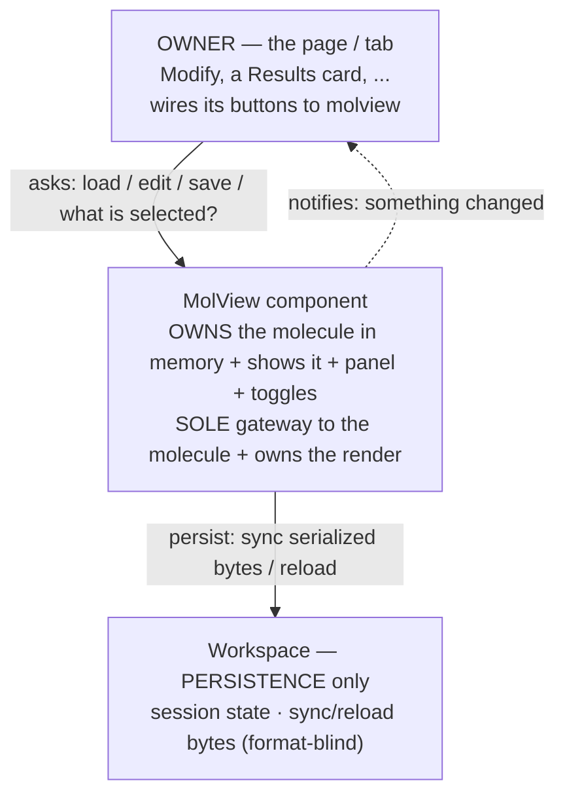
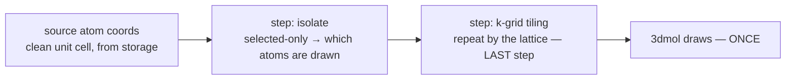
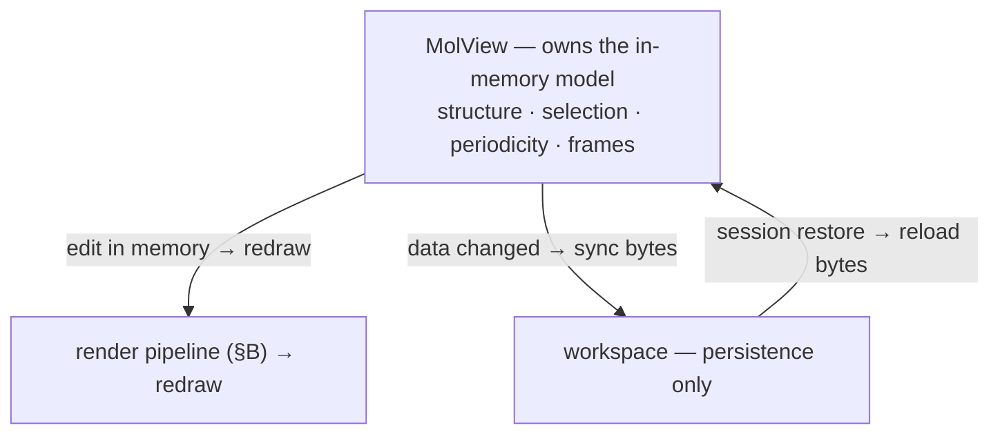
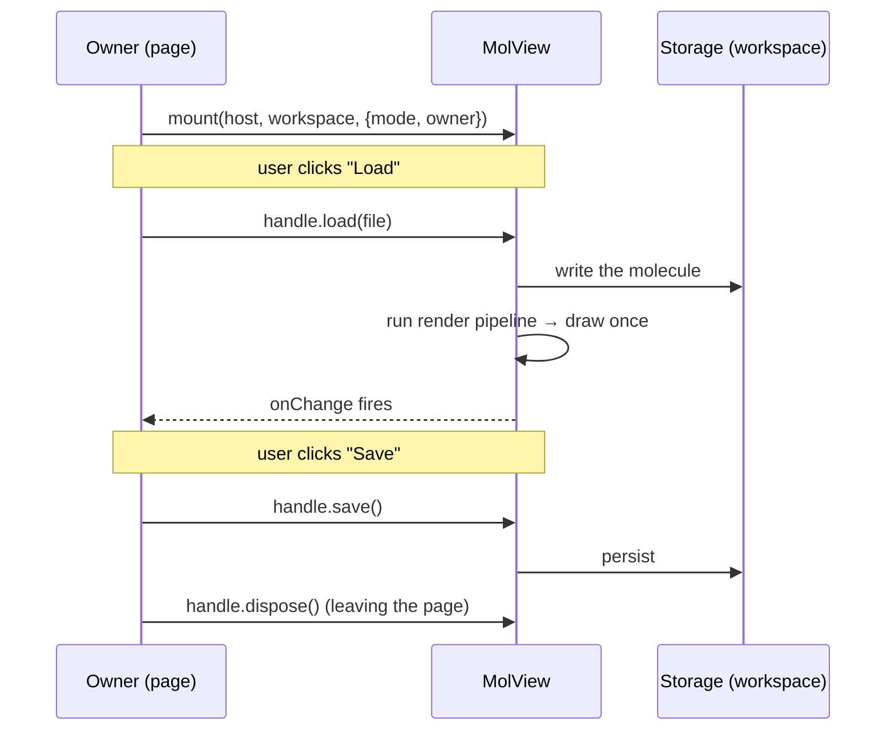
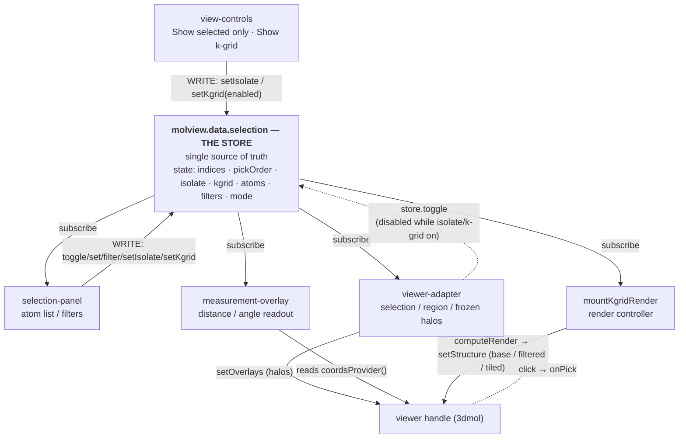
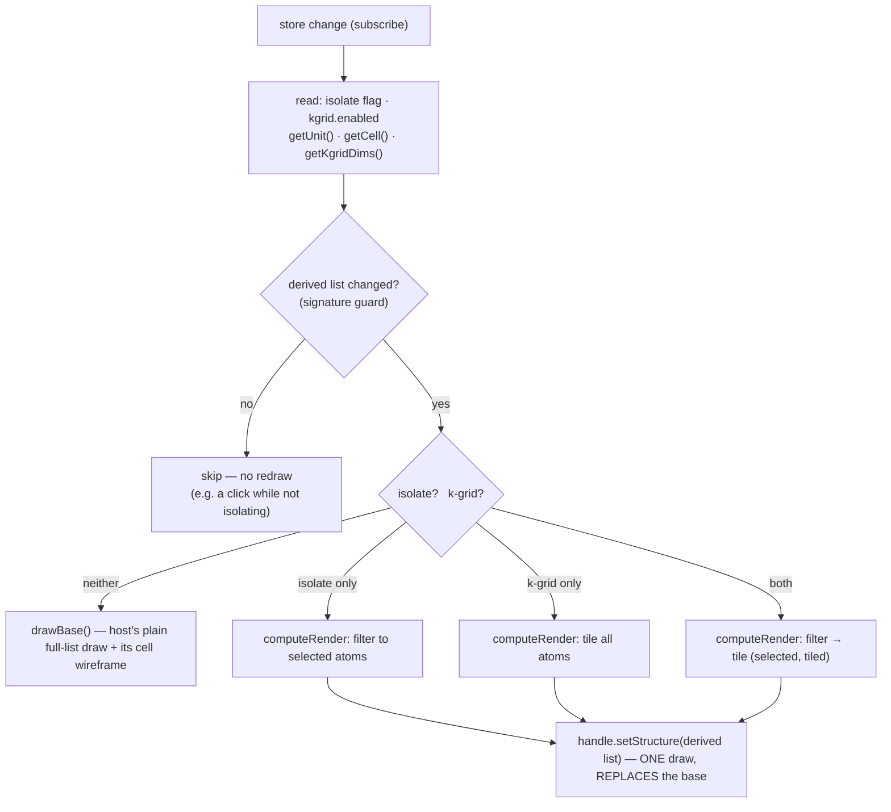
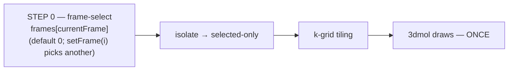
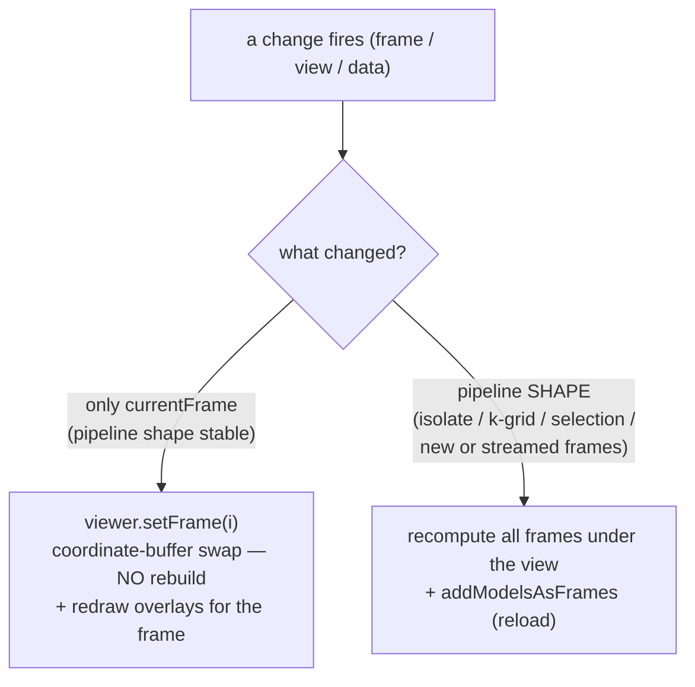

# MolView module — contract

> The **MolView module** is the **self-contained structure component**: the 3-D viewer, atom
> selection, k-grid display, measurement — **and the in-memory data model behind them.** It
> **OWNS its data** (structure · selection · periodicity · frames) in memory and **conceals both
> that data AND its API** in one module. Nothing outside reaches its data except through its API.
>
> It uses the **workspace** ([`workspace-contract.md`](workspace-contract.md)) for **persistence
> only** — to *sync* its in-memory data to disk (as serialized bytes it produces in its own
> format) and to *reload* it on a session restore. The workspace is never MolView's in-memory
> store and never interprets its data. The two are different layers in different docs.
>
> Section numbers begin at **§11** for continuity with cross-references written while this
> material briefly lived as "Part II" of the workspace contract.
>
> **The in-memory data model lives here.** MolView owns the structure / selection / periodicity /
> frames in memory and exposes them on **`window.molbuilder.molview.data`** (`lib/molview/data-model.js`)
> — accessors, mutators, the frame axis, the selection/view sub-namespaces, and the serialization.
> Its full surface is specified in **§19–§21**. The workspace keeps only session + file-access
> persistence (workspace-contract §4 / §4.6); MolView calls `ws.persist(...)` to hand it the
> serialized bytes on a data change.

---

## For developers — start here

MolView is a **self-contained, embeddable 3-D structure component**. You drop it onto a
page; it shows the molecule, the selection / Cell panel, and the view toggles as one unit.
It is the **single gateway to the molecule** — every read, write, and redraw of it goes
through molview — and it owns the display. You drive it through **one small API**; you never
wire its internals and never touch storage yourself. (MolView **owns the molecule data in
memory**; the workspace is only where it **persists** that data — sync to disk / reload — never
where the data lives while you work.)

This section is the whole mental model in four pictures, then the API and the rules. The
numbered sections (§11+) are the precise reference behind it.

### A. Architecture — ONE door (owner → molview; molview owns the data, persists via the workspace)

The page that uses molview (the **owner**) talks **only** to molview. molview **holds the
molecule in memory** and is the sole gateway to it. molview talks to the workspace **only to
persist** — sync the data to disk or reload it. The owner never reaches around molview for the
molecule data, and molview never uses the workspace as its in-memory store.



One door means the owner can't corrupt or desync molview's data by poking around it, and any
page reuses molview by learning one small API. (The owner may still use the workspace for its
*own* other data — just never for molview's molecule.)

### B. The render — ONE coordinate pipeline → ONE draw

molview turns the stored molecule into pixels with a **pipeline of coordinate steps** that
ends in a **single 3dmol draw**. Every step only computes *which coordinates to show*;
k-grid is the **last** step. There is **no second render and nothing layered on top.**



"k-grid ON" only means the final list is the *repeated* unit cell instead of the bare one —
3dmol still draws that one list once. It **always recomputes from the clean unit cell** in
storage (never from an already-tiled list). Full detail: §14.

### C. How molview holds its data — and persists through the workspace

molview **holds the molecule in its own in-memory model** — structure, selection, periodicity,
frames. Reads and edits happen against that model, in memory; a change **re-runs the render
pipeline (§B) and redraws**. molview never keys `sessionStorage` and never hits the server
itself. It touches the **workspace only for persistence**: on a data change it **syncs** its
serialized state to disk, and on a session restore it **reloads** — the workspace stores/returns
those bytes **format-blind** (molview owns the `.xyz`/`.molstruct.json` format).



**Persistence is namespaced by the owner** (§18.4): molview passes its `owner` (session/tab
identity) to the workspace, which keys its saving points by it — so two tabs never collide.

MolView reads and edits that model directly through **`molview.data.*`** (§19); the workspace
never holds it. On a data change MolView serializes and calls `ws.persist(...)` — the workspace
writes those bytes format-blind (§C, §18.3).

### D. The API — what the owner calls (the contract with the owner)

The owner uses only these; it never sees storage:

| Call | Plain meaning |
|---|---|
| `molview.mount(host, workspace, {mode, owner})` → `handle` | Put a molview on the page, backed by `workspace`, identified by `owner`. |
| `handle.load(fileOrText)` | "Load this molecule." |
| `handle.getStructure()` / `handle.getSelection()` | "Give me the current molecule / what's selected" — a **copy**. |
| `handle.save()` / `handle.undo()` | "Save it" / "undo the last change." |
| `handle.onChange(fn)` | "Tell me when something changed," so the page can refresh its own bits. |
| `handle.dispose()` | Remove the molview and release everything. |
| **Frame axis (§14.5)** — present for trajectories, inert for a static structure: | |
| `handle.setFrame(i)` / `frameCount()` / `currentFrame()` / `getFrame(i)` | select / count / read the current frame / read one frame's coords. |
| `handle.play()` / `pause()` / `isPlaying()` | drive playback (the frame bar's play button calls these). |
| `handle.setArrows(arrows)` / `setLabels(labels)` | draw the overlays the CONSUMER supplies; MolView draws what it's handed, it does not generate them (§14.5.1). |

`mode` = `"modify"` (editable) or `"readonly"` (view + inspect). `owner` = this molview's
identity (e.g. `"modify"`, `"results:<id>"`) for namespaced persistence.

The **frame-axis** rows are the full handle surface for trajectories (§14.5); on a single static
structure they are still present but no-ops (`frameCount() === 1`, and the frame bar stays
hidden). The complete key set the handle exposes is enumerated in §18.1.

### E. Read/write protocol — the rules that keep it safe

1. **One door.** Every molecule read/write goes through molview's API; the owner never
   touches storage for the molecule.
2. **Reads are copies.** Every read hands back a defensive copy; holding it can't mutate the
   store ([`workspace-contract.md`](workspace-contract.md) §1.2.1).
3. **Writes persist.** Every write goes through the workspace, which saves it; molview never
   writes storage keys itself.
4. **Change → redraw.** molview subscribes to the workspace; any data change re-runs the
   render pipeline (§B) and redraws. The owner does not trigger redraws.
5. **Owner-namespaced.** `owner` isolates this molview's saved data from other tabs' (§18.4).

### F. How to use MolView — a walkthrough

You are the **owner** (a page or tab). Using molview is five steps; you never write storage
or 3-D code yourself.

1. Put an **empty host element** where the molview should sit.
2. Get the **workspace** it should use — the real one (edits persist) or a throwaway (a
   read-only view that saves nothing).
3. **`mount`** molview into the host.
4. Wire **your page's buttons to the handle's API** (`load` / `save` / `undo`) — never to
   storage.
5. React to **`onChange`** to refresh your page's own bits; **`dispose`** on teardown.



Owner code, in plain shape:

```
// 2-3: get the workspace, mount molview into the host
const handle = await molview.mount(hostEl, workspace, { mode: "modify", owner: "modify" });

// 4: wire page buttons to the API — NOT to storage
loadButton.onclick = () => handle.load(pickedFile);
saveButton.onclick = () => handle.save();
undoButton.onclick = () => handle.undo();

// 5: react to changes, and clean up on the way out
handle.onChange(() => refreshTitle(handle.getStructure()));
onPageLeave(() => handle.dispose());
```

**The two real ways it's used** (same component, different workspace + mode):

| Scenario | workspace | mode | owner | Effect |
|---|---|---|---|---|
| **Modify tab** | the **real** workspace | `"modify"` | `"modify"` | full editing; edits persist to disk |
| **Results card** | a **throwaway** workspace | `"readonly"` | `"results:<id>"` | shows a computed structure; saves nothing; isolated slot |

The owner picks the workspace + mode + owner; **everything else is identical**, because the
component is the same. That is what "fully concealed and reusable" buys.

> **This document is the DESIGN — the contract the code must comply with.** It describes
> MolView as it is *meant to be*: one component, one door, one render pipeline. Where the
> current code diverges (e.g. Modify still drives some storage directly instead of asking
> molview), **the code is wrong and gets fixed to match this** — the design is never watered
> down to match the code. Migration status (what's already brought into compliance) is
> tracked separately in [`molview-migration-plan.md`](molview-migration-plan.md), not here.

---

## §11 The MolView module — what it is + the boundary

**MolView is ONE component: the 3-D viewer, the atom selection, the Cell/periodicity
panel, measurement, and k-grid display — as one thing.** These are not bolted-on
neighbours; they are parts of the same component. It renders the molecule, lets the user
pick/filter atoms, reads off geometry, edits periodicity, and shows the periodic tiling —
all behind the one API (§D).

Two rules define the whole component:

1. **MolView owns its data in memory and reads/writes it through `molview.data` (§19); it
   never does I/O or parsing itself.** The molecule (atoms + coordinates), the lattice `cell`,
   and the k-grid `dims` live in MolView's own in-memory model (`molview.data`, §19.1). molview
   reads them through `molview.data.*` and draws them, and writes changes back the same way; on a
   data change it serializes and calls `ws.persist(...)` (§18.3). Reading files, associating a
   `.fdf`, and extracting a cell/k-grid happen **upstream** (the results tab / `molbuilder/parse/`)
   and are installed *into* MolView's model — never by molview parsing them itself, and **never
   handed to molview directly by the owner** (§A, the single door). See §14.
2. **The selection store is the single source of truth for selection + view state.** The
   panel, the viewer-adapter, and the viewer never talk to each other directly — they all
   go through the store (§13). That store is reached as **`molview.data.selection`** (§12).

### 11.1 Boundary — molview vs. the owner vs. storage

Three parties, one door between each (§A):

| MolView owns (inside the component) | Outside molview |
|---|---|
| 3-D rendering + the render pipeline (§14) + the viewer card chrome (style / labels / axes / reset / screenshot / background / export) | **Owner:** page layout, where the card sits, and wiring page buttons to molview's API |
| The selection store + panel + viewer-adapter; measurement; k-grid tiling; overlays (halos, cell wireframe, labels, arrows, camera) | **Owner:** its own *non-molecule* data + page chrome |
| The in-memory molecule model + its API (structure, periodicity, selection, frames — `molview.data`, §19) | **Persistence (workspace):** stores + returns the serialized bytes format-blind; the namespace it saves under (workspace-contract §4) |
| Namespacing its persisted data by `owner` (§18.4) | **Upstream (parse / results):** fetching files, parsing formats, extracting cell/k-grid *into* molview's model |

Crossing the boundary:
- **Owner → molview:** the API only (§D) — `mount / load / getStructure / getSelection / save / undo / onChange / dispose`. The owner never calls the viewer handle or the store directly.
- **molview → workspace:** persistence only — `ws.persist(...)` on a data change, `ws.readPersistedSnapshot()` on restore; the data model itself is molview's (§C, §19).
- **Internal wiring** (maintainers, not the owner): molview drives the viewer via its handle
  (`setStructure/setStyle/setAxes/setOverlays/setPick`, readers `getAtomCount/getAtomCoords/
  getElements/getLattice/getCell/getPickedIndices/getCamera`) and the store (`set/toggle/
  setIsolate/setKgrid/subscribe`); the viewer reports back via `opts.onReady/onError/
  pick.onPick/export.onExport/animation.onFrame`. These live *inside* molview (§13) — the
  owner never sees them.

molview never reads 3Dmol objects outside its own handle; it never reads owner DOM outside
its own card.

## §12 The selection store — `molview.data.selection`

The store holds all selection + view state. The one process-wide instance is
reached through **`window.molbuilder.molview.data.selection`** (`molview.data.selection`),
which the data model (`data-model.js`) builds around the `_createStore` factory
(`lib/molview/_selection-store-impl.js`) — there is **no** public
`molbuilder.selection.store` singleton (retired Phase 9, workspace-contract.md §8).
`molbuilder.selection.createEphemeralStore()` mints an isolated instance for a
readonly inspector. (The rest of `molbuilder.selection.*` holds the module's
functions: `mountPanel`, `measurements`, `viewerAdapter`, `_createStore`,
`_surfaceSnapshot`.)

### 12.1 State (exact — `_initialState`)

```
{
  sourceFile:  null | string      // absolute structure path
  atoms:       Atom[]             // {index(0-based), element, x, y, z, labels[],
                                  //  isFrozen, atomName?, residueName?, chainId?}
                                  //  TRANSITIONAL per-atom shape.  The MANDATED model
                                  //  is COLUMNAR behind the accessor API (§19.1 + §19.2)
                                  //  -- reach it via molview.data.*, not this raw array;
                                  //  Track D4 (molview-migration-plan) seals it.
  selection:   number[]           // THE selection set (sorted; the canonical state)
  pickOrder:   number[]           // same atoms in click order (angle vertex = pickOrder[1])
  mode:        "click" | "filter"
  isolate:     boolean            // "show selected only" — VIEW state (was the
                                  //  adapter's setIsolateMode; moved into the store)
  kgrid:       { enabled: boolean, dims: [nx,ny,nz], source: "free" | "fixed" }
  filters:     Filter[]           // {kind: by_element|by_index|by_residue|by_label, value}
  combinator:  "or" | "and"
  loading:     boolean
  error:       null | string
}
```

`selection` is canonical; `pickOrder` is its click-order shadow (kept in lock-step
by every mutator). **`isolate` and `kgrid` are VIEW state that lives in the store**
— not on the adapter, not on a global handle. This is what makes the panel drive
them through the store (§13), obeying the single-source rule. (These fields
surface on the data-model read API as §19.2 `getSelection()` / `molview.data.selection.getState()`,
raw `selection` renamed to `indices`.)

### 12.2 Surfaces

Consumers never touch the raw store; they use a renamed **surface**:

- **`molview.data.selection`** — the singleton surface. Both `getState()` and the object
  passed to `subscribe(fn)` callbacks are reshaped by the one `_surfaceSnapshot` shaper, so
  both deliver the SAME `{indices, …, isolate, kgrid, …}` shape (raw `selection` renamed
  `indices`) — a panel that reads via `subscribe` and a click handler that calls `getState()`
  never see different field names.
- **`createEphemeralStore()`** — an isolated instance with the **same surface
  minus** `getAtoms / setSourceFile / refreshAtoms` (workspace-lifecycle methods
  a readonly inspector doesn't use).

#### 12.2.1 The method table (`molview.data.selection.*`)

Local mutators (no HTTP; each fires `notify()` exactly once):

| Method | Effect |
|---|---|
| `toggle(i)` | Toggle atom `i`. Out-of-range ignored. |
| `set(indices)` | Replace selection with the sorted-unique copy of `indices`; out-of-range filtered. |
| `add(indices)` | Union with the current selection (sort + dedup). |
| `remove(indices)` | Subtract from the current selection. |
| `all()` | Select every atom (`0..n-1`). |
| `invert()` | Replace with the complement. |
| `clear()` | Empty the selection. |
| `setMode(mode)` | `"click"` or `"filter"`. |
| `setFilters(filters)` | Replace the filter list. Does NOT eval — call `applyFilter()`. |
| `addFilter(f)` / `removeFilter(i)` / `updateFilter(i, patch)` | Per-filter edits used by the filter-row UI. |
| `setCombinator(c)` | `"or"` or `"and"`. |
| `setIsolate(on)` | Set the "show selected only" VIEW flag (§12.1). |
| `setKgrid(patch)` | Patch the k-grid VIEW state `{enabled, dims, source}` — `source`-aware (below). |
| `writeLabel(target, indices)` | REPLACE-per-target label change **in memory** (no HTTP); `target` is `"frozen_atoms"` or a region name. Marks the model dirty so the edit survives reload; the sidecar is written only on explicit Save. |

Server-backed op:

| Method | Server route | Returns | Effect |
|---|---|---|---|
| `applyFilter()` | POST `/api/selection/eval` | `Promise<number[]>` | Sends filters + combinator; replaces selection with the result; preserves mode. |
| `refreshAtoms()` | POST `/api/selection/atoms` | `Promise<void>` | Refetch atoms for the current `sourceFile`; overlays the `.molstruct.json` sidecar (frozen_atoms + regions). No-op when `sourceFile` is null. |

Reads + lifecycle:

| Method | Meaning |
|---|---|
| `getState()` | Defensive `{indices, pickOrder, mode, filters, combinator, isolate, kgrid, …}` snapshot (raw `selection` renamed `indices`). |
| `subscribe(fn)` | Store-scoped subscription; delivers the same contract shape as `getState()`. |
| `getAtoms()` | Alias for `molview.data.getAtoms()` (§19.2). |
| `adoptSession({sourceFile, atoms})` | Atomically install path + atoms + selection in one promise (file-commit bootstrap). |
| `setSourceFile(path)` / `setLoader(loader)` | Set the sidecar source-of-truth path / the async atom-loader the store uses for `refreshAtoms`. |

`setKgrid(patch)` is `source`-aware: in `"fixed"` a bare `dims` edit is ignored
(the values are the run's, read-only); in `"free"` `dims` is clamped so
`natoms · nx·ny·nz ≤ 20000`. `enabled` always applies.

## §13 The viewer + composition (panel + adapter, through the store)

### 13.1 The viewer — `viewer.embed(host, opts) → handle`

`window.molbuilder.viewer.embed(host, opts)` mounts the viewer card and returns a
**handle**. Structure text (`opts.xyz` / `opts.pdb`) + a declarative options object
come in through the call; the viewer maintains the drawing. The handle methods molview
relies on (the full handle in `mol-viewer-embed.js` exposes roughly twice these — style /
labels / arrows / animation / knobs getters+setters — but these are the load-bearing ones):

```
setStructure  setStyle  setAxes  setOverlays  setPick  setPickedIndices
getPick  getPickedIndices  getAtomCount  getAtomCoords  getElements
getLattice  getCell  getCamera  setCamera
playAnimation  setAnimationFrame  refit  screenshot  exportData  dispose
```

- **`opts.lattice`** (3×3 row vectors) → `getLattice()` returns it and k-grid
  tiling uses it (§14). The **cell wireframe** draws only when **`opts.cell`** is
  also set (`_redrawCell` gates on `state.current.cell`). The viewer does **not**
  parse a lattice from the file text; molview passes it in (having read it from storage, §14).
- **`setOverlays(spec)`** paints the selection **highlights** on the drawn atoms (selection /
  region / frozen halos). **`setStructure({xyz, lattice})`** replaces the displayed atom
  *list* — the plain unit cell, the isolate-**filtered** subset, or a k-grid supercell (§14).
  Isolate is a render-list filter done through `setStructure`, **not** an overlay.
- Hard deps (`embed()` throws if absent): `$3Dmol`, `molbuilder.viewer.create`,
  `molbuilder.fmt`. Soft deps degrade silently: `molbuilder.axes`, `molbuilder.style`.

### 13.2 Composition — panel + adapter + viewer

Every part talks **only** to the store — never to each other. Writers push mutations in;
readers subscribe and react. The store is the one hub; the viewer handle is the one surface
everything draws onto.



- **`selection.mountPanel(host, {store, viewerHandle, mode})`** fetches the panel
  partial, mounts `selection-panel`, and attaches `viewer-adapter` to the handle
  — both bound to the given `store` (the singleton or an ephemeral one).
- The **panel** renders from `store.getState()` and calls mutators on input
  (toggle, filter, `setIsolate`, `setKgrid`). The **adapter** subscribes to the
  store and paints selection / region / frozen **halos** via `setOverlays`, and forwards
  viewer clicks to `store.toggle`. While isolate OR k-grid is on it **stands its overlays
  down and drops clicks** — the window is display-only then (§14.3); isolate itself is a
  render-list filter in the controller (§14.2), not an overlay.
- Panel and adapter never reference each other. `mode:"readonly"` hides the
  panel's write controls; clicks still feed the store.
- `fused-layout.css` is how **molview's composition layer** places the panel as a foldable
  side/bottom region of the viewer card (molview owns this layout + the fold, §18.2; the
  viewer itself offers no layout API).

## §14 k-grid & the render pipeline

### 14.0 The mental model — READ THIS FIRST

**Rendering the structure is ONE pipeline of coordinate-computing steps that ends in a
SINGLE 3dmol draw.** Every step before 3dmol does nothing but compute *which coordinates
should be shown*. k-grid is the **last** such step. There is **no second render and
nothing is layered "on top."**

**The whole pipeline is a READ-ONLY view derivation.** It *generates* the coordinate list
3dmol draws **from** the stored atoms; it **never writes the data**. Selection, isolate, and
k-grid shape the render list only — the stored dataset (`ws`) is untouched, so **export /
save read the data and are unaffected by what the view shows** (only real edit ops mutate
`ws`, through their own API). "isolate removes atoms" means removes them *from the render
list*, not from the structure.

```
   source atom coords  (the current frame, from the data model — the CLEAN unit cell)
        │
        ▼   step: isolate                → selected-only: which atoms are drawn
        │                                  (off → all atoms; selection alone only highlights)
        ▼   step: k-grid tiling          → repeat the visible atoms by the lattice
        │                                  (the LAST coordinate step)
        ▼
   final list of coordinates   →   3dmol draws it, ONCE
```

So "k-grid ON" only means the final coordinate list is the **repeated** unit cell instead
of the bare unit cell — 3dmol still renders that one list, once. Two consequences that the
rest of §14 depends on:

- **Always recompute from the CLEAN unit cell.** The pipeline starts from the data model's
  unit-cell coords every time — never from an already-tiled list (or you would tile a
  tile). Whoever drives the render must hand it the unit cell, not read back whatever the
  viewer currently shows.
- **The steps are ordered:** selection/isolate first, then k-grid. So **isolate ON + k-grid
  ON tiles only the selected atoms.**
- **A derived view is display-only for selection (§14.3).** While isolate OR k-grid is on,
  the drawn list is a *derived* list (filtered / tiled), so the drawn atom index no longer
  equals the unit-cell index — a click in the 3-D window would be ambiguous. In-window
  click-select is therefore **disabled** and the selection / region / frozen **halos pause**
  (under isolate the drawn atoms already *are* the selection); the **panel atom list** is the
  selection surface in these modes. The **measurement readout keeps working under isolate**
  (re-keyed to global index) and pauses only under k-grid. Turn both off → the plain
  full-list base draw returns and everything restores. (§14.3.)
- **Two different things are both called "k-grid":** the **dims** `[nx,ny,nz]` — how many
  repeats, which is the structure's DFT k-grid, stored in periodicity and written with
  **`molview.data.setKgrid(dims)`**; and the **enable toggle** — a view preference (show the
  tiling or not), held in the selection store and flipped with
  **`molview.data.selection.setKgrid({enabled})`**. The pipeline tiles by the dims *only when the
  toggle is on*. (Likewise `molview.data.getKgrid()` reads the dims; the `kgrid.enabled` in
  `molview.data.selection.getState()` is the toggle.)

### 14.1 The code that runs the pipeline

- **`molview.tileKgrid(coords, cell, [nx,ny,nz]) → {positions, sourceIndex, nimages}`**
  — the tiling step (repeat the atoms by the lattice).
- **`molview.computeRender(coords, view, cell) → {positions, sourceIndex}`** — runs the
  whole pipeline above (selection/isolate → k-grid) and returns the final coordinates.
  `sourceIndex[m]` maps each drawn position back to its unit-cell atom (element/label
  lookup; k-grid copies share their unit-cell atom's identity).

### 14.2 The render controller lives in the module — `mountKgridRender`

The one **view-render controller** — the live loop that subscribes to the store, runs
`computeRender`, and draws its result — is in the module, not hand-written per host. It is
what makes §14.0 literally true: ONE `computeRender` → ONE `setStructure` of the derived
list, which **replaces** the base draw (never a second draw layered on it).

- **`molview.mountKgridRender(handle, store, {getUnit, getCell, getKgridDims, drawBase}) → {refresh, dispose}`**
  subscribes to the store and, on each change, picks which list to draw from the store's
  `isolate` flag + `kgrid.enabled` toggle:
  - **neither on →** the host's plain base draw, via the **`drawBase()`** callback (all
    atoms, the host's own wireframe-cell rule + refit). The controller does **not** reinvent
    the base draw — the host owns its nuances (e.g. Modify boxes only an *explicit* cell, not
    a fresh molecule's bbox).
  - **isolate on →** `computeRender` filters the list to the selected atoms and the
    controller `setStructure`s that — a **real filter**: the non-selected atoms are **absent
    from the drawn model**, not hidden in place.
  - **k-grid on →** `computeRender` tiles the list; **both on →** the selected atoms, tiled.

  It reads the **clean unit cell** from `getUnit()` (captured before any derivation, so it
  never tiles an already-tiled list), the resolved lattice from `getCell()`, and the dims
  from `getKgridDims()` (= `periodicity.kgrid`). A **signature guard** redraws only when the
  derived list actually changes, so a selection click while *not* isolating never rebuilds
  the structure. `refresh()` re-runs it after a structure / periodicity change; `dispose()`
  unsubscribes. It is the **ONLY** structure-view render loop in the codebase (the former
  inline controller in the Results structure inspector was deleted when this landed —
  molview-migration-plan Steps 1–2).



### 14.3 A derived view (isolate OR k-grid) is display-only; the panel still works

**When the window shows a DERIVED list, a mouse click inside it is ambiguous** — under
k-grid, "which copy did you pick?" has no answer; under isolate, the drawn atom index no
longer equals the unit-cell index the store speaks. So while **`isolate` OR `kgrid.enabled`**
is on:

- **In-window picking is disabled** — clicking an atom in the 3-D molview does **not** toggle
  the selection. This same guard also drops the programmatic empty-pick that a resized
  `setStructure` fires, so re-deriving the view **never clobbers the store selection**.
- **Halos stand down in the window** — the selection / region / frozen halos pause. Under
  isolate the drawn atoms already ARE the selection, so there is nothing to distinguish;
  under k-grid they can't map onto the copies.
- **The measurement readout keeps working under isolate** — the selection is still curated
  (via the panel), and the readout is derived from it. The drawn list is only the selected
  atoms, so the overlay re-keys `coordsProvider()`'s filtered coords back to global atom
  index (matching `computeRender`'s isolate order) before the geometry math. It pauses only
  under **k-grid** (the tiled copies have no single unit-cell coordinate).
- **The selection PANEL stays fully functional** — filter and click-select on the atom
  *list* work normally, because the list is always the original unit-cell atoms (no
  ambiguity). The selection is curated there, and the render re-derives on change.
- **The selection is recorded internally** (never cleared) — so with **isolate ON + k-grid ON
  the render tiles ONLY the selected atoms** (§14.0). Turning both off restores the plain
  full-list base draw: in-window picking, halos, and measurement all return.

So a derived view disables *pointing at the 3-D window*, not *selecting*: you keep curating
the selection through the panel; you just can't click the derived geometry.

### 14.4 Where the `cell` and `k-grid` come from — molview's model, never a parse in molview

molview **reads** the `cell` and the `k-grid` from its own in-memory model (`molview.data`,
§19); it never reads files, associates a `.fdf`, or extracts a k-grid itself. Whoever put them
*into* the model did the parsing — molview only draws what the model holds.

- The **cell** comes from `molview.data.getUnitCellInfo()` (the resolved lattice). Upstream, a
  computed result got its cell from `molbuilder/parse/` (`StructureResult.cell` / `JobResult`
  geometry) installed into the model; on Modify it is the structure being designed. molview does
  not know or care which — it reads the resolved cell.
- The **k-grid dims** come from `molview.data.getKgrid()`. Upstream wrote them (`source:"fixed"`
  from a result's `.fdf` k-grid diagonal that `parse/dirs/job.py` extracts, or `"free"` when the
  user experiments on Modify). Again molview just reads.

`molbuilder/parse/` is the sole parser (see `parse-module.md`) — **no parsing lives in
molview**. How the `cell` + `k-grid` are *resolved* before they land in the model (the
`resolve_cell` precedence, the `axis_kind` enum `{periodic, isolated, transport}`, and the
axis_kind-gated k-grid rule — k-grid > 1 only on a `periodic` axis) is defined in
**[`structure-periodicity.md`](structure-periodicity.md)**; molview reads the resolved
result from its model.

### 14.5 The frame axis — step 0 of the render (trajectories)

MolView renders a **trajectory** — a coordinate **time series** — by adding **ONE step at the
FRONT** of the pipeline: **frame-select**. Everything downstream is unchanged.

**The data model (the model owns the frames).** A structure's **coordinates** may be a time
series (relaxation steps, an MD run). The atoms are **the same across every frame** — same count,
same elements, same order, same annotations; only the coordinates (and optional per-frame forces)
change. A single static structure is just the one-frame case (`frameCount() === 1`). The frame
axis lives in the `molview.data` model (`lib/molview/_frame-series.js`): frame-**independent**
data — atom identity + annotations, and the cell — is stored **once**; only **coordinates** (and
optional **forces**) are per-frame.

> **Same-atoms invariant (the linchpin).** Every frame has the same atoms — same count, same
> element order, same identity. A frame that violates this is **rejected with an error, never
> coerced.** That one rule is why selection / measurement / k-grid **compose across frames for
> free** (they key off the atom *index*, which never changes) and why the fast native-frame
> render is safe (§14.5.2). `addFrame` / `reloadFrames` enforce it — a mismatch is a hard error
> (same class as the §19.1 atom-count guard).

**Per-frame SCALARS are NOT molview data.** Energy, max-force, and step number belong to the
consuming inspector's plot, not the structure — the model holds only coordinates + optional force
*vectors*.

The full frame surface on `molview.data` (reads join §19.2, mutators join §19.3):

| Call | Kind | Meaning |
|---|---|---|
| `loadFromText(text)` | replace | Load from a file — single-frame `.xyz` → one frame; **multi-frame** `.xyz` → all frames. |
| `reloadFrames(frames, {forces?})` | replace | **Hard reload** — discard the current frames, recreate the whole set (a job re-ran). Resets to frame 0. |
| `addFrame(coords, {forces?})` / `addFrames(list, {forces?})` | append | Add frame(s) to the existing set (a running job **streams** new steps). Does not move the current frame. |
| `setFrame(i)` | select | Make frame `i` current — pushes that frame's coords onto the store, so subscribers re-render. Throws if out of range. |
| `getFrame(i)` / `getForces(i)` | read | One frame's coords / forces (a defensive copy). |
| `currentFrame()` / `frameCount()` / `currentForces()` | read | The current index / the number of frames / the current frame's forces. |

#### 14.5.0 Persistence — multi-frame extxyz + the molstruct sidecar (no new format)

On disk a multi-frame structure **extends the existing single-frame pattern** (`name.xyz` +
`name.molstruct.json`) — no new format is invented. **MolView owns this format/codec** (it is
MolView's serialization, §19.4); the **workspace stores the resulting bytes format-blind** like
any other persisted state (workspace-contract §4).

- **`name.xyz` = multi-frame extended-XYZ (extxyz).** One XYZ block per frame; the comment line
  carries `Lattice="…"`, `energy=…`, and a `Properties=species:S:1:pos:R:3:forces:R:3` spec so
  **forces ride as extra per-atom columns**. Standard + tool-interoperable (ASE / OVITO / VMD).
  The read/write codec is **ASE** (`ase.io.extxyz`) — already a host-env dependency
  (`molbuilder/envs/recipes.py`; README_install §host env), so no new dependency is introduced.
- **`name.molstruct.json` = the single annotation set + a FRAME MANIFEST.** The atom annotations
  (labels, frozen, channels — [`atom-annotations.md`](atom-annotations.md)) are stored **once**
  (identical every frame — the invariant). The sidecar also records `n_frames`, `n_atoms`, and
  per-frame `steps`, so it is **cross-checked against the `.xyz`** on load: manifest vs block
  count / atom count must agree, or the load **errors** (workspace-contract §4.0: memory is the
  truth; a stale/mismatched pair is refused, not guessed).

MolView keeps memory ↔ its serialized bytes in sync on every op (load / reload / add) and the
cross-check guards every load; the workspace persists whatever bytes it is handed.



The atoms' IDENTITY (element, labels, frozen, index) is frame-independent, so **selection,
isolate, k-grid, and measurement all keep working across frames for free** — they key off the
atom index (stable); only the coordinates they read come from the selected frame.

**MolView renders a frame controls bar itself** — a slider + play/pause + counter in its
controls area, exactly like it renders the isolate/k-grid view-toggles. It is **shown only when
a trajectory is loaded** (`frameCount > 1`); a single static structure has no bar. So a consumer
that hands MolView a trajectory gets the navigation UI for free. The bar is *playback only* —
overlays are NOT viewer toggles (see §14.5.1). The same operations are on the **handle API**:

| Call | Meaning |
|---|---|
| `setFrame(i)` / `frameCount()` / `getFrame(i)` | select / count / read a frame (from `molview.data`, §14.5). |
| `play()` / `pause()` / `isPlaying()` | step through frames + state. |
| `setArrows(arrows)` / `setLabels(labels)` | **draw the overlays the CONSUMER supplies** (arrows / labels). MolView draws what it's handed; the consumer owns force→arrow generation + normalization (§14.5.1). |

#### 14.5.1 Overlays — MolView draws what it's HANDED (the consumer owns generation)

**MolView is a viewer: it does NOT synthesize overlays.** It exposes `handle.setArrows(arrows)`
and `handle.setLabels(labels)`; the **consumer** decides what to draw and hands it in. MolView
forwards the specs to the embed and re-applies them across a per-frame redraw (a `setStructure`
clears the embed's overlays), so the consumer's overlay survives frame changes — but MolView
never builds or normalizes them.

- **Force arrows** are *consumer* data. The consumer holds the per-frame forces, converts them
  to arrow specs (`{start, end, color, radius}`) with **its own** scaling/normalization (which
  differs by use — per-frame max, trajectory-global max, a fixed physical scale…), and pushes
  them via `setArrows`. On a frame change the consumer recomputes and re-pushes. MolView reads
  no force data and computes no geometry. *(This corrects the earlier design where the viewer
  pulled `currentForces()` and synthesized `atom + force` arrows — that is the consumer's job.)*
- **Atom-index labels** are likewise supplied via `setLabels` (e.g. `{atoms:"all", format:"index"}`);
  a generic "show labels" is also available as a viewer chrome toggle in the embed's View menu.

> **Requires the owned-viewer mount path.** Overlays draw only where molview owns the render —
> the **empty-host** `mount(host, ws)` path (§18.2). On the legacy pre-built-card path molview
> has no viewer handle, so `setArrows`/`setLabels` are no-ops there; that path is being retired
> (task #28).

#### 14.5.2 Rendering — native setFrame + overlay redraw (the fast path)

> **Status — PLANNED acceleration, not yet shipped.** The current build renders each frame with
> a **full pipeline pass + `setStructure`** (setFrame swaps the store's coords → the render's
> signature changes → one rebuild), exactly like any other data change. That is correct and
> demo-proven, just not yet optimised. The two-tier native-buffer path below is the design
> target (Step 5 / task #33); it slots into the existing §14.2 signature guard without changing
> the frame API or the data model. Until it lands, treat this subsection as the intended design.

Scrubbing/playing is the hot path, so MolView will use 3dmol's **native frame buffer**:

- **Index changed, pipeline shape unchanged** (isolate / k-grid / selection stable): every
  frame's pipeline output is already loaded into 3dmol as native frames, so MolView calls
  **`viewer.setFrame(i)`** — a coordinate-buffer swap, **no geometry rebuild**. The overlays
  (labels, force arrows) are separate shapes, so MolView redraws just those for the frame —
  cheap (a handful of shapes) versus a full rebuild.
- **Pipeline SHAPE changed** (isolate/k-grid toggle, dims, selection-while-isolating, or a
  new/streamed frame set): MolView recomputes the per-frame coordinate lists under the new view
  and reloads the native-frame set (`addModelsAsFrames`). This is the two-tier extension of the
  §14.2 signature guard.



**Caveats:** native frames assume constant **topology** (correct for MD; bond-breaking is out
of scope) and a fixed drawn atom set across the loaded frames (guaranteed by the same-atoms
invariant, §14.5). Under k-grid the pre-tiled frame set is `frames × atoms × tiling`
— gate it on a size cap (extend the existing k-grid `natoms · nx·ny·nz ≤ 20000` clamp by frame
count) and fall back to per-frame recompute when too large.

#### 14.5.3 Example — the trajectory inspector uses it

```js
// MolView holds the trajectory frames in its model (§14.5); mount MolView read-only.
const view = await molview.mount(host, ws, { mode: "readonly", owner: "results:traj" });

// The frame controls bar (slider + play/pause + counter) appears AUTOMATICALLY
// when frameCount > 1 — the consumer renders no viewer controls itself.  The handle API is
// still there for programmatic control / extra widgets, e.g.:
view.setFrame(3); view.play(); view.setArrows(myArrowsForThisFrame);  // consumer builds the arrows

// The consumer only adds its OWN, non-viewer UI — the per-frame SCALARS (energy / step) are
// the inspector's plot, NOT MolView's data:
energyPlot.render(results.energies);
```

#### 14.5.4 Saving a frame to a file — a USER operation, NOT the workspace

**Two different "saves" — never conflate them** (workspace-contract intro):

- A **user "save this frame to a file"** is a **user operation**. The UI gets the data it wants
  from **MolView's API** (`molview.data.getFrame(i)` / `getStructure()` — a copy), then writes
  the file through the **project sidebar's** file contract
  ([`projects-sidebar.md`](projects-sidebar.md)) — its own module, its own logic. **The
  workspace is not in that path at all**; MolView is only the data source.
- **Automatic persistence** — the crash-safe draft + the session-restore mirror — is the
  **workspace's** job (§18.3, workspace-contract §4): on a data change MolView hands `ws.persist(...)`
  the serialized bytes. Scrubbing/playing (`setFrame`) is a VIEW change and persists nothing; only
  a data change to the frame set (`addFrame` / `reloadFrames`) reaches disk.

## §15 Measurement — `measurements.compute` + the overlay

- **`selection.measurements.compute(selection, atomsMeta, positions, pickOrder)`**
  → `{kind: "xyz" | "distance" | "angle", display}` (or null). 1 atom → position,
  2 → distance, 3 → angle (vertex = `pickOrder[1]`).
- **`molview.mountMeasurementOverlay(viewerHost, {store, coordsProvider}) →
  {render, dispose}`** paints that readout as text in the viewer card, derived from
  the store selection. Coords come from `coordsProvider()` (the current frame /
  the viewer handle) — the store never holds coordinates. **Under isolate** the drawn list is
  only the selected atoms, so the overlay re-keys those filtered coords back to global atom
  index (matching `computeRender`'s isolate order) and the readout **keeps working**. It is
  **hidden only while k-grid is on** (§14.3 — the tiled copies have no single unit-cell
  coordinate).

## §16 Atom-index display rule

Indices are **0-based internal, 1-based user-facing** (`data-vocabulary.md` §3.1).
Internal state (`atom.index`, `selection`, `pickOrder`, `sourceIndex`) is 0-based;
anything a user reads (panel `#` column, viewer labels, measurement readout) is
converted via `lib/molview/_atom-index.js` `toDisplay` at the edge. Never let a
1-based value into state; never show a 0-based value.

## §17 Test affordances, provenance & decisions

### 17.1 Test affordances

- Node-tested pure modules: `tileKgrid`, `computeRender`, `mountMeasurementOverlay` (incl.
  the isolate re-key), `mountRender`
  (`tests/test_{kgrid,render_pipeline,measurement_overlay,molview_render}_js.py`), the store
  (`test_selection_store_js.py`), the dispatcher (`test_workspace_dispatcher_js.py`),
  `molview.mount` (`test_molview_mount_js.py`).
- Browser e2e:
  - **`molview.mount` full component** — `test_molview_demo_e2e.py` (the `/molview-demo` page:
    the empty-host build path, viewer tracks the loaded structure, Selection/Cell tab switch).
  - **Modify** — `test_molbuilder_e2e.py`: **isolate genuinely FILTERS the render list**
    (`test_show_selected_only_filters_the_render_list`: 3 atoms → isolate ON draws 1 → OFF
    restores 3), the isolate/k-grid toggles, k-grid tiling.
  - **Structure inspector** — `test_structure_inspector_measurement_e2e.py`: measurement
    overlay (incl. under isolate), clicks→store, and (when a cell is in storage) k-grid tiling.
- The inspector exposes `viewerSlot.__molbuilder_test_handle` + `__molbuilder_test_store`; the
  demo exposes `.viewer.__molview_test_handle` (test-only) so e2e drives the viewer + store
  without canvas clicks.

### 17.2 What this doc supersedes

| Archived doc | Was | Why it folded here |
|---|---|---|
| `embedded-viewer.md` (`archive/2026-07-03-embedded-viewer.md`) | the viewer contract | the viewer is part of this one module |
| `atom-selection.md` (`archive/2026-07-03-atom-selection.md`) | the selection module | selection is part of this one module; its §404 (isolate on the adapter + global handle) was already superseded by isolate-in-store |
| `molview-module.md` (`archive/molview-module.md`) | the standalone MolView module doc | folded here so the viewer + selection + the workspace model they share live in ONE core contract |

> **NOT superseded — `atom-annotations.md` stays LIVE.** Only the FUSED-VIEWER
> material that had accreted into `atom-annotations.md` (the viewer/selection/
> k-grid/measurement design) was absorbed — into this doc. The
> **per-atom annotation *channels* data model** remains the live, in-progress
> contract at [`atom-annotations.md`](atom-annotations.md) (schema-v4
> `.molstruct.json` channels + JS mirror that `structure.py`, `sidecars/molstruct.py`,
> `parse/`, `siesta/input.py`, `script_emit.py` depend on). Do not treat it as archived.

### 17.3 Decisions log

| Date | Decision |
|---|---|
| 2026-07 (the carve) | The in-memory **data model moved out of the workspace and into MolView** (`lib/molview/data-model.js` → `molview.data`). The workspace is now **persistence-only** (session + concealed file access, format-blind — workspace-contract §4); MolView owns the structure / selection / periodicity / frames + accessors/mutators/serialization (§19–§21) and calls `ws.persist(...)` on a data change. This supersedes the earlier framing that put the data model on `ws.*` / called the workspace "the data model". |
| 2026-07-08 | MolView module doc **split back out** of `workspace-contract.md`. MolView is the UI + data-model component; the workspace is the persistence layer it uses — different layers, so they must not share one doc. `molview-module.md` is again the standalone MolView contract. (Reverses the 2026-07-06 merge below.) |
| 2026-07-06 | MolView module doc merged into the workspace contract as "Part II" (viewer + selection + workspace model in one doc). **Reversed 2026-07-08** — see above. |
| 2026-07-03 | One doc for the MolView module (viewer + selection as one). Code is the standard. isolate + kgrid live in the store (view-state). k-grid: host supplies cell+kgrid; the module tiles, never parses. `embedded-viewer.md`/`atom-selection.md` archived; the fused-viewer material was pulled out of `atom-annotations.md` (its channels model stays live). |

---

## §18 The unified mount — `molview.mount(host, workspace, opts)`

Today the fused card is assembled **twice** (Modify: `modify.html` DOM + `selection-bootstrap.js`
+ `viewer.js`; Results: `inspectors/structure.js`). `molview.mount` folds that into ONE
**fully-concealed** call: the caller hands molview a **workspace** — the **persistence** layer —
and molview owns everything else, including the in-memory data model. No loader hooks, no embed
hooks; molview does not know or care where its bytes are persisted.

### 18.1 API

```
molview.mount(hostEl, workspace, opts) -> handle
```

- **`workspace`** — the **persistence** layer (workspace-contract §4): `persist` /
  `readPersistedSnapshot` / `mountRestoreTarget` / `workspaceId`. molview owns the molecule
  **in its own model** (`molview.data`, §19) — it reads through that model's accessors (which
  return copies) and writes through its mutators, and on a data change hands the workspace the
  serialized bytes to store. The workspace holds **no data model** and interprets nothing; it
  takes **no** loader / embed / data hooks.
- **`opts`** = `{ mode: "modify" | "readonly", owner?: string }`.
- **`handle`** — the **owner-facing API of §D**. The complete key set (the exact `Object.keys`
  the demo pins, sorted):
  `{ load, save, undo, getStructure, getSelection, onChange, dispose,`
  ` setFrame, frameCount, currentFrame, getFrame, play, pause, isPlaying, setArrows, setLabels }`.
  The first seven are the core owner API (§D); the rest are the **frame axis** (§14.5), present
  on every handle but inert for a static structure (`frameCount() === 1`). It exposes **no
  internals** — not the viewer handle, not the store, not DOM refs. (Maintainers reach the
  internal composition through the module itself, §13; the owner never does.)

The caller's ONLY job is to pass the right workspace + mode (+ owner). **Persistence is the
workspace's concern; the data model + protection are molview's** — molview just uses the
workspace to store bytes.

### 18.2 molview OWNS the whole assembly

- Builds the fused-card DOM (`fused-layout.css`).
- **Embeds the viewer itself** and **subscribes to its own data model** — when the structure
  changes (a load, an edit), molview re-renders. So "Load a new file" stops being special
  glue: it is a `molview.data` write molview reacts to.
- `selection.mountPanel(panelHost, {store: molview.data.selection, mode})`;
  `molview.mountViewControls`; wires the fold; `mountKgridRender` (unit cell / dims from the
  `molview.data.get*` accessors, §14.2); `mountMeasurementOverlay`.
- `dispose()` tears it all down (panel, controls, overlays, k-grid, subscriptions).

### 18.3 Persistence is the WORKSPACE's, not molview's

Pass the **real** workspace (Modify) → edits persist to disk. Pass a **throwaway** workspace
(a Results card) → nothing is saved. molview can't tell the difference and doesn't need to —
that is the concealment. molview can never leak or corrupt data: every read off `molview.data`
is a copy, and it only ever hands the workspace serialized **bytes** to store.

**How persistence is guaranteed — the contract.** molview holds its data in `molview.data` and
writes no storage keys itself. On a data change it serializes its model and calls the workspace's
**`persist(...)`**; the workspace decides on its own how to store the bytes (server draft +
`sessionStorage`, workspace-contract §4). The rule is simply: **a molview DATA CHANGE triggers a
persist; a molview VIEW change does not.** View-only operations — isolate, k-grid, selection,
style, background, and **frame-select (`setFrame`)** — change what is *drawn*, never the stored
dataset, so they persist **nothing**.

**Frames follow the same rule (§14.5).** Scrubbing/playing a trajectory is pure navigation:
`setFrame(i)` moves the "which frame is shown" pointer and re-renders — it is a VIEW change and
**never triggers a persist.** Only a genuine **data change** to the frame set does: `addFrame`
(a new frame streamed in) and `reloadFrames` (a full replace) mutate the model, so *those* mark
it dirty and trigger the workspace's persist. So a hundred slider drags cost zero writes; adding
a frame or reloading the set is what reaches disk.

### 18.4 `owner` — molview is aware of its user, so persistence is namespaced

A molview belongs to a **user** — a tab / consumer — and it knows which (`opts.owner`, e.g.
`"modify"`, `"results:<id>"`). molview forwards that `owner` to the workspace so **the
workspace namespaces its saving points by it**: the sessionStorage snapshot key becomes
`molbuilder.workspace.<owner>.v1` and the server draft id gains the `<owner>` prefix. Two
molviews therefore persist to **separate** slots and never collide on the single global one
— clean isolation between tabs when needed.

Two rules keep this correct:

- **The namespacing lives in the workspace persistence layer** (`snapshot-io.js` + the
  dispatcher draft id) — it owns the saving points. molview only *tells* the workspace its
  `owner` (via `workspace.useNamespace(owner)`); molview never keys storage itself
  (no reinvented persistence).
- **Default = today's single global slot.** With no `owner`, the key is unchanged
  (`molbuilder.workspace.v1`) — so single-consumer Modify is byte-for-byte unaffected until
  a second consumer needs isolation.

> **Data-safety note.** Saving-point keys gate reload-restore of unsaved work
> ([`workspace-contract.md`](workspace-contract.md) §4). Changing them is data-safety
> critical, so the workspace-side namespacing is specified in that contract and lands as a
> deliberate, tested step — not a drive-by. `molview.mount` already carries `owner`
> (feature-detected `workspace.useNamespace`), so the molview side is ready.

### 18.5 Two consumers, one component — and the one piece of new infrastructure

The same `molview.mount` serves every consumer; only the **workspace + mode + owner** differ
(§F). Modify passes the **real** workspace; a Results card passes a **throwaway** one. That
throwaway is the single new thing this design needs beyond the component itself:

- **The workspace must be instantiable** — a factory that mints a **non-persisted** workspace
  instance, paired with molview's own isolated data model + selection (the ephemeral store,
  §12.2), so a Results card gets its own data without touching Modify's. (Modify uses the
  existing singleton; Results uses a minted one.)

Rolling this out one consumer at a time is a delivery choice, not part of the design — which
consumer is already on `molview.mount` and which still hand-assembles is tracked in
[`molview-migration-plan.md`](molview-migration-plan.md), per the framing note at the top of
this document. The design here is the target every consumer converges to.

---

## §19 The data model — `molview.data`

**MolView's in-memory data model lives on `window.molbuilder.molview.data`**
(`lib/molview/data-model.js`). It owns the loaded structure, selection, periodicity, and frames;
it is the ONLY way anything reads or writes the molecule. On a data change it serializes and calls
`ws.persist(...)` — the workspace stores the bytes format-blind (§18.3). The authoritative surface
is the `api` object at the end of `data-model.js`; this section documents it, reconciled to that
code.

The `_`-prefixed store files (`_canvas-state-impl.js` = text + source + periodicity + dirty;
`_selection-store-impl.js` = atoms + selection + filters; `_frame-series.js` = the frame axis) are
**molview-internal**; `data-model.js` reads them and serves the API. No consumer touches them.

### 19.1 In-memory state shape

`molview.data.getState()` returns a deep-cloned composite; the narrow getters (§19.2) are
preferred. The model's shape:

```js
// docs-only TypeScript sketch — code is plain JS
type MolViewState = {
  structure: {
    text:          string,        // BOUNDARY-ONLY serialization (§19.2 rule 1); NOT the
                                  //   geometric truth — the atoms are.
    source_format: "xyz" | "pdb",
    title:         string,
    n_atoms:       number,
    atoms:         Atom[],        // the geometric + chemical truth, coords included
    lattice:       number[][] | null,   // 3×3 = periodicity.cell (kept for consumers)
    periodicity: {                      // full periodicity — rides with the geometry so a
      cell:      number[][] | null,     //   save writes the whole structure (workspace §4.0)
      axis_kind: [string,string,string] | null,   // periodic | isolated | transport
      vacuum:    [number,number,number],
      kgrid:     [number,number,number],
    } | null,                           // see structure-periodicity.md
    annotations:   object | null,       // opaque channel carry (atom-annotations.md)
  } | null,

  source:  { kind: "file"|"smiles"|"name"|"dna"|"rna"|"peptide"|"blank",
             file: string|null, generator_input: object|null },
  dirty:        boolean,
  last_save_to: string | null,
  selection:    { … },   // §12.1 (indices, pickOrder, mode, filters, combinator, isolate, kgrid)
  view:         { camera?, style?, axes?, labels? } | null,
  loading:      boolean,   // transient — never persisted
}
```

**(A) ONE encapsulated model holds the whole molecule.** Its internal LAYOUT is an implementation
detail, chosen for efficiency — the TARGET is **columnar** (struct-of-arrays: `elements[]`,
`positions[][]`, `regions{label→indices}`, `frozen[]`, + periodicity), landed by Track D4. Today
it is still a per-atom `atoms[]`; because of rule B that transition changes no consumer. Columnar
because coordinates pack tightly and **selection-by-label is a direct `regions[label]` lookup**,
never an O(N) scan. *(The per-atom `atoms[]` + `structure.text` are tolerated as transitional
carriers behind the accessors until Track D4 seals them — molview-migration-plan Track D.)*

**(B) A UNIFIED ACCESSOR API (§19.2) is the ONLY way any consumer reads or writes the model.** No
consumer hand-crafts extraction — no `structure.text.split()`, no `atoms[i].labels` scan, no
reaching into raw arrays. Because access is only through the API, the storage layout can change
without touching a consumer. **The API is the contract; the layout is free.**

**Encapsulation (MANDATORY).** These internals are OFF-LIMITS — reach them only through the API:

| Private internal | Use the API instead |
|---|---|
| the canvas-state store / `structure.text` (the xyz/pdb string) | `molview.data.getCoordinates()` / `getStructure()` — **never parse the string** |
| the selection store's raw `state.atoms` | `molview.data.getAtoms()` / `getCoordinates()` / `getElements()` |
| a structure's raw `regions` map | `molview.data.getAtomsByLabel(label)` |
| `periodicity.cell` / `.kgrid` off a raw object | `molview.data.getUnitCell()` / `getKgrid()` / … |

**If the API doesn't expose what you need, ADD an accessor — never reach past it.**

### 19.2 Read API — `molview.data.*` getters

Every getter returns a **defensive copy** (or a freshly-built object); reads never throw — missing
state is `null` or empty.

| Method | Returns | Contract |
|---|---|---|
| `getState()` | `MolViewState` (deep-cloned) | Composite snapshot; atomic per `notify()` tick. Prefer narrow getters. |
| `getStructure()` | `{text, source_format, title, n_atoms, atoms, lattice, periodicity, annotations}` or `null` | `null` iff empty. `atoms` is a slice; never partial. |
| `getSource()` | `{kind, file, generator_input}` | Empty → `{kind:"blank", file:null, generator_input:null}`. |
| `getSourceFile()` | `string \| null` | Convenience for `getSource().file`. |
| `getLastSavedTo()` | `string \| null` | Disk path last saved to this session, or `null`. |
| `getSelection()` | `{indices, pickOrder, mode, filters, combinator, isolate, kgrid}` | `indices` sorted-ascending, deduped; filters defensive-copied; `isolate`/`kgrid` are the view-state (§12.1). |
| `getAtoms()` | `Atom[]` (slice) | Direct atom-array accessor for hot paths; `[]` when empty. |
| `isDirty()` | `boolean` | True iff edited since last save. |
| `isEmpty()` | `boolean` | True iff no structure loaded (`getStructure() === null`). |

**The §19.1 concealed-model accessors** (materialise a view; the internal layout is never
exposed):

| Method | Returns | Contract |
|---|---|---|
| `getElements()` | `string[]` | Element per atom, index order; `[]` when empty. |
| `getCoordinates()` | `number[][]` | `[[x,y,z], …]` — all coordinates. The ONLY way to read geometry; never parse `structure.text`. |
| `getUnitCell()` / `getLattice()` | `number[][] \| null` | The RAW explicit 3×3 cell (alias pair); `null` when unset. For DISPLAY / tiling use `getUnitCellInfo()`. |
| `getAxisKind()` | `[string,string,string] \| null` | Per-axis `periodic\|isolated\|transport`. **NOT defaulted** — a scientific choice; `null` when unset. |
| `getVacuum()` | `[number,number,number]` | Per-axis vacuum. **Default `[0,0,0]`.** |
| `getKgrid()` | `[number,number,number]` | k-point grid. **Default `[1,1,1]` (gamma).** |
| `getUnitCellInfo()` | `{value, isDefault}` | DISPLAY cell for the Cell page: explicit cell wins, else the server-resolved bbox (`resolved_cell`); `isDefault` = no explicit cell. |
| `getVacuumInfo()` / `getKgridInfo()` / `getAxisKindInfo()` | `{value, isDefault}` | DISPLAY `{value,isDefault}` for the Cell page (default = `[0,0,0]` / `[1,1,1]` / every axis isolated). |
| `getAtomsByLabel(label)` | `number[]` | Atom indices carrying `label` — a direct label→indices lookup. |
| `getFrozen()` | `number[]` | Indices of frozen atoms. |
| `getRegions()` | `{label→indices}` | The full label→indices map (the one place labels are gathered for save/draft). |
| `atomFor3Dmol(i)` | `{elem,x,y,z} \| null` | One atom in 3Dmol's shape. |
| `toAddAtoms()` | `[{elem,x,y,z}, …]` | Whole model in 3Dmol's shape, for `model.addAtoms(...)`. The render path uses THIS, never `addModel(string)`. |

**Consequences (mandatory):** (1) the xyz/pdb string exists ONLY at the file boundary — load
parses it in, save serializes it out; no consumer gets geometry from a string. (2) Rendering
calls `toAddAtoms()` / `atomFor3Dmol()` — never `addModel(xyzString)`. (3) Filter / measure call
the API — no disk read, no hand-crafted scan.

**Subscriptions.** `const unsub = molview.data.subscribe(fn)` — `fn` fires once immediately with
the current `getState()`, then once per `notify()` tick; subscriber errors are caught;
`unsub()` is idempotent and safe to call from inside `fn`.

### 19.3 Write API — `molview.data.*` mutators

Every mutator either succeeds (state replaced atomically, `notify()` fires once) or rejects
(state unchanged). No mutator leaves partial state. HTTP mutators reject with `Error(message)`
from the server `{ok:false, error}` envelope (§21.4) or a network-error message.

| Method | Server route | Returns | Side effects |
|---|---|---|---|
| `loadFromFile(path)` | → `molbuilderTab.commitFile` (universal commit gate) | `Promise<WorkspacePayload>` | Replaces structure; `source.kind="file"`, `source.file=path`; resets selection; dirty=false. |
| `loadFromText(text, filename)` | POST `/api/build/load` | `Promise<WorkspacePayload>` | In-memory text load; `resetSelection=true`; `touchCanvas=false` (caller owns the dirty bit). |
| `generate(kind, input, opts)` | via the `structure.<kind>` generator module | `Promise<WorkspacePayload>` | Dispatches by `kind` (smiles/name/dna/rna/peptide/file); replaces structure; dirty=true. |
| `applyOp(op, args)` | POST `/api/modify/<op>` | `Promise<WorkspacePayload>` | Replaces structure; applies `selection_remap` (§21.3); dirty=true. |
| `applyPayload(payload, opts)` | (in-memory) | `void` | THE single cross-store sync point; `opts.touchCanvas`, `opts.resetSelection` (§19.3.1). |
| `installStructure(structure, source)` | (in-memory) | `void` | Wholesale text+source install (warning-modal gate path). |
| `markDirty()` / `markSaved(path)` | (in-memory) | `void` | Flip the dirty bit / clear it + record `last_save_to=path`. |
| `save(opts)` | → `structureSave.save` → POST `/api/workingcopy/save` | `Promise<void>` | Writes `.xyz` + `.molstruct.json` atomically from the scratch blob; clears dirty. |
| `discard()` | (in-memory) | `Promise<void>` | Clears canvas + selection. **Unconditional** — caller MUST gate on the warning modal first. |
| `undo()` | → `modify.applyUndo` | `Promise<void>` | Undo the last modifier op. |

**The §19.1 write accessors** — the granular mutation surface (in-memory; persists on the next
Save). Each mirrors its read accessor:

| Method | Returns | Side effect |
|---|---|---|
| `setUnitCell(cell)` / `setLattice(cell)` | `void` | Set the 3×3 cell (rest of periodicity kept); marks dirty. |
| `setKgrid(dims)` | `void` | Set the k-point grid `[nx,ny,nz]`; marks dirty. |
| `setAxisKind(kinds)` | `void` | Set per-axis `periodic\|isolated\|transport`; marks dirty. |
| `setVacuum(vac)` | `void` | Set per-axis vacuum padding; marks dirty. |
| `commitPeriodicity(patch)` | `Promise` | Cell-page "Update": apply the edit, then re-resolve the effective cell through the ONE server resolver (`/api/structure/resolve-cell`) and write back `resolved_cell`. An explicit `cell` wins (no re-resolve). |
| `setLabel(label, indices)` | `Promise` | REPLACE-per-label: `label` now tags exactly `indices` (in-memory; **marks dirty** so it survives reload; the sidecar is written on Save). |

**Adding/deleting ATOMS is NOT a granular accessor** — geometry mutation goes through
`applyOp(op, args)` (the server modify pipeline), so bonds + validation stay consistent. (Generic
key-value metadata was removed — it was an unpersisted data-loss sink; persisting it is a designed
sidecar-schema follow-up, not an accessor.)

#### 19.3.1 The payload pipeline

`applyPayload(payload, opts)` is the single sync point for all state replacement. In order:
(1) capture `preSelection` before any mutation; (2) replace the canvas text + periodicity + dirty
bit when `opts.touchCanvas !== false`; (3) run the modify-tab `applyStructure` hook (IIFE state +
3Dmol embed); (4) adopt `payload.atoms` into the selection store; (5) apply `selection_remap`
(§21.3) or `clearSelection` when `opts.resetSelection`; (6) fire `notify()` once. `selection_remap`
is read from `preSelection` (captured before adoptAtoms' destructive in-range filter) so a
Delete-of-low-index does not drop the wrong atom.

| Option | Default | Effect when set |
|---|---|---|
| `touchCanvas` | `true` | When `false`, skip the dirty-bit / text update (load paths pre-set it). |
| `resetSelection` | `false` | When `true`, clear selection unconditionally (load/generate; modifier ops use `selection_remap`). |

### 19.4 Serialization + the persist seam

MolView owns the `.xyz`/`.molstruct.json` format (§14.5.0). The data model serializes itself and
hands the workspace bytes:

- `getScratchBlob()` → `{xyz, sidecar}` — the ONE working-copy serialization, for BOTH the durable
  save AND the transient draft, built entirely through the §19.2 accessors (`getRegions` /
  `getFrozen` / periodicity). Refuses to serialize a geometry↔labels atom-count desync (never lets
  a mismatched `.xyz`/`.json` pair reach disk).
- `draftIdentity()` → the key the draft is filed under: `{source: file}`, or `{workspace_id}` for a
  not-yet-saved molecule.
- `suspendPersist()` / `resumePersist()` — bracket a multi-step load so a mid-load persist tick
  can't pair the new geometry with the previous file's labels.

**The debounce lives here, not in the workspace.** On every `notify()` the model schedules a
debounced (100 ms) write and, on `pagehide`, a final flush; each fires
`ws.persist(sessionBytes, draftBlob, identity)` — `sessionBytes` = the `getState`-based session
snapshot, `draftBlob` = `getScratchBlob()`, `identity` = `draftIdentity()`. The workspace writes
them format-blind (workspace-contract §4 / §4.5).

---

## §20 The view sub-namespace — `molview.data.view`

| Method | Effect |
|---|---|
| `molview.data.view.applyState(patch)` | Merge `patch` into view state; delegates camera / style updates to the 3Dmol embed handle. |
| `molview.data.view.getState()` | Current view state (`{camera, style, axes, labels}`), synthesized from the embed's getters. Never null. |

The 3Dmol embed handle is a *rendering target*, not a store; view state is derived from it on read.

---

## §21 Wire contract (server → `molview.data`)

The server-response shapes the data model's HTTP mutators (§19.3) consume. (Endpoint specs:
[`web-api.md`](web-api.md).)

### 21.1 WorkspacePayload — every Structure-returning endpoint

```json
{
  "ok": true, "text": "...", "source_format": "xyz",
  "title": "...", "n_atoms": 42,
  "atoms": [ /* §21.2 */ ], "lattice": null,
  "issues": [ /* Issue records */ ], "extra": { /* per-endpoint */ }
}
```

| Route | `extra` keys |
|---|---|
| POST `/api/build/load` | `pdb`, `source_format`, `n_residues`, `summary` |
| POST `/api/build/molecule` | `backend_used`, `add_hydrogens_mode`, `pdb`, `summary` |
| POST `/api/modify/<op>` | `selection_remap` (when applicable), `op`, `args` |

### 21.2 Atom row shape

Carries coordinates (the atom is the geometric truth); the client normalises `regions`/`is_frozen`
(snake) → `labels`/`isFrozen` (camel) and keeps `x`/`y`/`z`.

```json
{ "index": 12, "element": "C", "x": 1.204, "y": 0.0, "z": -0.512,
  "atom_name": "CA", "residue_id": 42, "residue_name": "ALA", "chain_id": "A",
  "regions": ["bridge"], "is_frozen": false }
```

### 21.3 selection_remap (in `extra`)

Flat list of `length = pre-op atom count`; `remap[old_index] === new_index` (or `null` when the
atom was removed).

```json
"selection_remap": [null, 0, 1]      // delete index 0
"selection_remap": [0, 1, 2]         // add atom (identity; new atom at index 3)
```

When the server sends it, the data model MUST use it instead of the naive in-range filter (§19.3.1),
else Delete-of-low-index silently drops the wrong atom.

### 21.4 Error envelope

```json
{ "ok": false, "error": "human-readable message", "issues": [ /* optional */ ] }
```

The client surfaces `error` to the user; when `issues` is present the panel renders them too.
