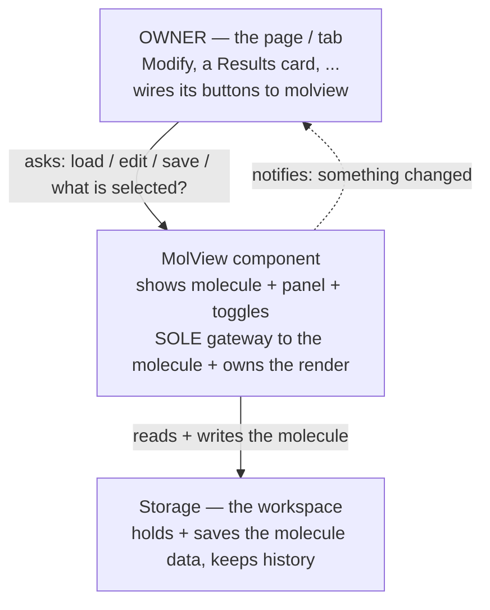
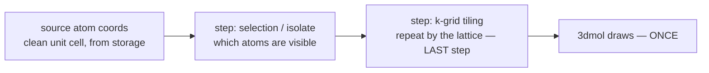
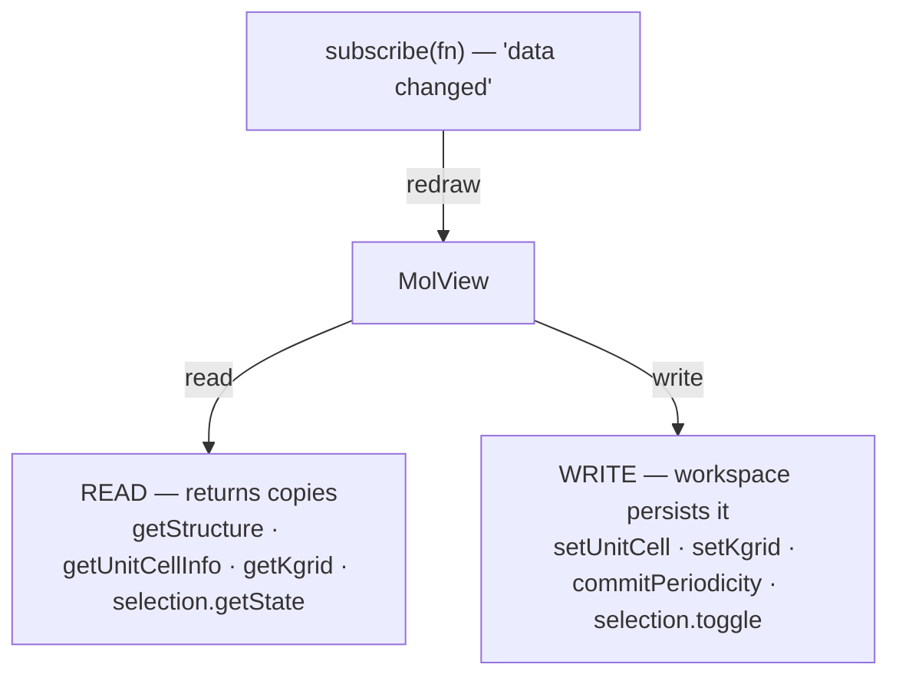
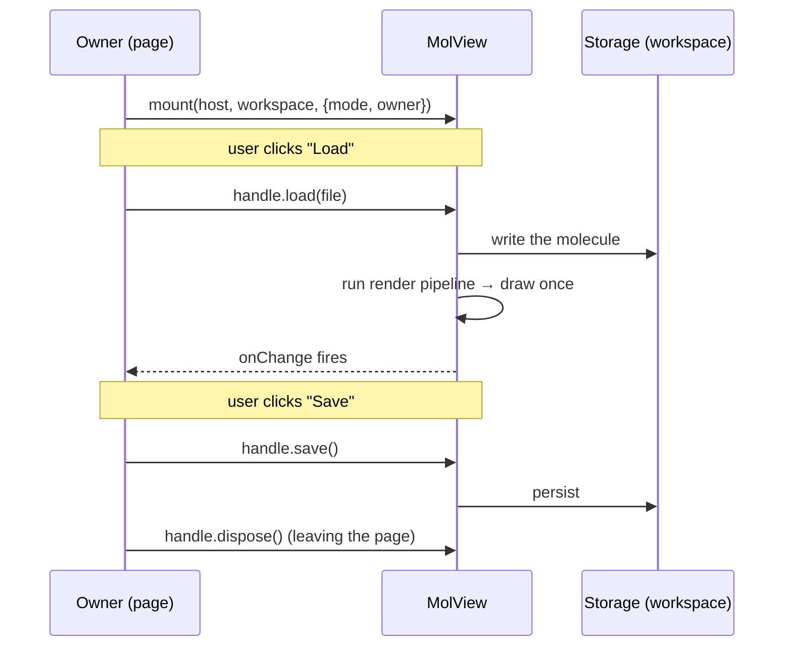

# MolView module — contract

> The **MolView module** is the **L2 UI component**: the 3-D structure viewer, atom
> selection, k-grid display, and measurement.  It **USES** the workspace data model
> (**L1**) — [`workspace-contract.md`](workspace-contract.md) — through the `ws.*` API;
> it does **not** own that data.  MolView *uses* the workspace; they are different
> layers and live in different docs (this separation was restored 2026-07-08 after a
> mistaken merge folded them into one "core contract").
>
> Section numbers begin at **§11** for continuity with cross-references written while
> this material briefly lived as "Part II" of the workspace contract; §§1–10 are the
> workspace data-model sections, in `workspace-contract.md`.

---

## For developers — start here

MolView is a **self-contained, embeddable 3-D structure component**. You drop it onto a
page; it shows the molecule, the selection / Cell panel, and the view toggles as one unit.
It is the **single gateway to the molecule** — every read, write, and redraw of it goes
through molview — and it owns the display. You drive it through **one small API**; you never
wire its internals and never touch storage yourself. (The molecule *data* lives in storage,
the workspace; molview is the only thing that operates on it.)

This section is the whole mental model in four pictures, then the API and the rules. The
numbered sections (§11+) are the precise reference behind it.

### A. Architecture — ONE door (owner → molview → storage)

The page that uses molview (the **owner**) talks **only** to molview. molview is the **only**
thing that talks to storage (the workspace) about the molecule. The owner never reaches
around molview to storage for molecule data.



One door means the owner can't corrupt or desync molview's data by poking storage behind
its back, and any page reuses molview by learning one small API. (The owner may still use
the workspace for its *own* other data — just never for molview's molecule.)

### B. The render — ONE coordinate pipeline → ONE draw

molview turns the stored molecule into pixels with a **pipeline of coordinate steps** that
ends in a **single 3dmol draw**. Every step only computes *which coordinates to show*;
k-grid is the **last** step. There is **no second render and nothing layered on top.**



"k-grid ON" only means the final list is the *repeated* unit cell instead of the bare one —
3dmol still draws that one list once. It **always recomputes from the clean unit cell** in
storage (never from an already-tiled list). Full detail: §14.

### C. How molview uses storage (the workspace)

molview reads and writes the molecule **only through the workspace `ws.*` API** — it never
keys sessionStorage and never hits the server itself. Reads return **copies** (molview can't
mutate storage by holding a value); writes go through the workspace, which **persists** them.
When the data changes, molview **re-runs the render pipeline (§B) and redraws**.



**Persistence is namespaced by the owner** (§18.4): molview passes its `owner` to the
workspace, which keys its saving points by it — so two tabs' molviews never collide.

### D. The API — what the owner calls (the contract with the owner)

The owner uses only these; it never sees storage:

| Call | Plain meaning |
|---|---|
| `molview.mount(host, workspace, {mode, owner})` → `handle` | Put a molview on the page, backed by `workspace`, identified by `owner`. |
| `handle.load(fileOrText)` | "Load this molecule." |
| `handle.getStructure()` / `handle.getSelection()` | "Give me the current molecule / what's selected" — a **copy**. |
| `handle.save()` / `handle.undo()` | "Save it" / "undo the last change." |
| `handle.onChange(fn)` | "Tell me when something changed," so the page can refresh its own bits. |
| `handle.dispose()` | Remove the molview and release everything. |

`mode` = `"modify"` (editable) or `"readonly"` (view + inspect). `owner` = this molview's
identity (e.g. `"modify"`, `"results:<id>"`) for namespaced persistence.

### E. Read/write protocol — the rules that keep it safe

1. **One door.** Every molecule read/write goes through molview's API; the owner never
   touches storage for the molecule.
2. **Reads are copies.** Every read hands back a defensive copy; holding it can't mutate the
   store ([`workspace-contract.md`](workspace-contract.md) §1.2.1).
3. **Writes persist.** Every write goes through the workspace, which saves it; molview never
   writes storage keys itself.
4. **Change → redraw.** molview subscribes to the workspace; any data change re-runs the
   render pipeline (§B) and redraws. The owner does not trigger redraws.
5. **Owner-namespaced.** `owner` isolates this molview's saved data from other tabs' (§18.4).

### F. How to use MolView — a walkthrough

You are the **owner** (a page or tab). Using molview is five steps; you never write storage
or 3-D code yourself.

1. Put an **empty host element** where the molview should sit.
2. Get the **workspace** it should use — the real one (edits persist) or a throwaway (a
   read-only view that saves nothing).
3. **`mount`** molview into the host.
4. Wire **your page's buttons to the handle's API** (`load` / `save` / `undo`) — never to
   storage.
5. React to **`onChange`** to refresh your page's own bits; **`dispose`** on teardown.



Owner code, in plain shape:

```
// 2-3: get the workspace, mount molview into the host
const handle = await molview.mount(hostEl, workspace, { mode: "modify", owner: "modify" });

// 4: wire page buttons to the API — NOT to storage
loadButton.onclick = () => handle.load(pickedFile);
saveButton.onclick = () => handle.save();
undoButton.onclick = () => handle.undo();

// 5: react to changes, and clean up on the way out
handle.onChange(() => refreshTitle(handle.getStructure()));
onPageLeave(() => handle.dispose());
```

**The two real ways it's used** (same component, different workspace + mode):

| Scenario | workspace | mode | owner | Effect |
|---|---|---|---|---|
| **Modify tab** | the **real** workspace | `"modify"` | `"modify"` | full editing; edits persist to disk |
| **Results card** | a **throwaway** workspace | `"readonly"` | `"results:<id>"` | shows a computed structure; saves nothing; isolated slot |

The owner picks the workspace + mode + owner; **everything else is identical**, because the
component is the same. That is what "fully concealed and reusable" buys.

> **This document is the DESIGN — the contract the code must comply with.** It describes
> MolView as it is *meant to be*: one component, one door, one render pipeline. Where the
> current code diverges (e.g. Modify still drives some storage directly instead of asking
> molview), **the code is wrong and gets fixed to match this** — the design is never watered
> down to match the code. Migration status (what's already brought into compliance) is
> tracked separately in [`molview-migration-plan.md`](molview-migration-plan.md), not here.

---

## §11 The MolView module — what it is + the boundary

**MolView is ONE component: the 3-D viewer, the atom selection, the Cell/periodicity
panel, measurement, and k-grid display — as one thing.** These are not bolted-on
neighbours; they are parts of the same component. It renders the molecule, lets the user
pick/filter atoms, reads off geometry, edits periodicity, and shows the periodic tiling —
all behind the one API (§D).

Two rules define the whole component:

1. **MolView reads and writes its data through STORAGE; it never does I/O or parsing
   itself.** The molecule (atoms + text), the lattice `cell`, and the k-grid `dims` live in
   the workspace (storage). molview reads them through `ws.*` and draws them, and writes
   changes back through `ws.*`. Reading files, associating a `.fdf`, and extracting a
   cell/k-grid happen **upstream** (the results tab / `molbuilder/parse/`) and are written
   *into* storage — never by molview, and **never handed to molview directly by the owner**
   (§A, the single door). See §14.
2. **The selection store is the single source of truth for selection + view state.** The
   panel, the viewer-adapter, and the viewer never talk to each other directly — they all
   go through the store (§13). That store **is** `ws.selection` (workspace-contract.md §5).

### 11.1 Boundary — molview vs. the owner vs. storage

Three parties, one door between each (§A):

| MolView owns (inside the component) | Outside molview |
|---|---|
| 3-D rendering + the render pipeline (§14) + the viewer card chrome (style / labels / axes / reset / screenshot / background / export) | **Owner:** page layout, where the card sits, and wiring page buttons to molview's API |
| The selection store + panel + viewer-adapter; measurement; k-grid tiling; overlays (halos, cell wireframe, labels, arrows, camera) | **Owner:** its own *non-molecule* data + page chrome |
| Reading + writing the molecule **through `ws.*`** (structure, periodicity, selection) | **Storage (workspace):** holds + persists the molecule, keeps history; the namespace it saves under |
| Namespacing its saved data by `owner` (§18.4) | **Upstream (parse / results):** fetching files, parsing formats, extracting cell/k-grid *into* storage |

Crossing the boundary:
- **Owner → molview:** the API only (§D) — `mount / load / getStructure / getSelection / save / undo / onChange / dispose`. The owner never calls the viewer handle or the store directly.
- **molview → storage:** `ws.*` reads (return copies) + writes (persisted) — §C.
- **Internal wiring** (maintainers, not the owner): molview drives the viewer via its handle
  (`setStructure/setStyle/setAxes/setOverlays/setPick`, readers `getAtomCount/getAtomCoords/
  getElements/getLattice/getCell/getPickedIndices/getCamera`) and the store (`set/toggle/
  setIsolate/setKgrid/subscribe`); the viewer reports back via `opts.onReady/onError/
  pick.onPick/export.onExport/animation.onFrame`. These live *inside* molview (§13) — the
  owner never sees them.

molview never reads 3Dmol objects outside its own handle; it never reads owner DOM outside
its own card.

## §12 The selection store — `ws.selection`

The store holds all selection + view state. The one process-wide instance is
reached through **`window.molbuilder.workspace.selection`** (`ws.selection`, workspace-contract.md §5),
which the dispatcher builds around the `_createStore` factory — there is **no**
public `molbuilder.selection.store` singleton (retired Phase 9, workspace-contract.md §8).
`molbuilder.selection.createEphemeralStore()` mints an isolated instance for a
readonly inspector. (The rest of `molbuilder.selection.*` holds the module's
functions: `mountPanel`, `measurements`, `viewerAdapter`, `_createStore`,
`_surfaceSnapshot`.)

### 12.1 State (exact — `_initialState`)

```
{
  sourceFile:  null | string      // absolute structure path
  atoms:       Atom[]             // {index(0-based), element, x, y, z, labels[],
                                  //  isFrozen, atomName?, residueName?, chainId?}
                                  //  TRANSITIONAL per-atom shape.  The MANDATED model
                                  //  is COLUMNAR behind the accessor API (workspace-contract.md §1.2.1 + workspace-contract.md §1.4)
                                  //  -- reach it via ws.*, not this raw array; Track D4
                                  //  (molview-migration-plan) seals it.
  selection:   number[]           // THE selection set (sorted; the canonical state)
  pickOrder:   number[]           // same atoms in click order (angle vertex = pickOrder[1])
  mode:        "click" | "filter"
  isolate:     boolean            // "show selected only" — VIEW state (was the
                                  //  adapter's setIsolateMode; moved into the store)
  kgrid:       { enabled: boolean, dims: [nx,ny,nz], source: "free" | "fixed" }
  filters:     Filter[]           // {kind: by_element|by_index|by_residue|by_label, value}
  combinator:  "or" | "and"
  loading:     boolean
  error:       null | string
}
```

`selection` is canonical; `pickOrder` is its click-order shadow (kept in lock-step
by every mutator). **`isolate` and `kgrid` are VIEW state that lives in the store**
— not on the adapter, not on a global handle. This is what makes the panel drive
them through the store (§13), obeying the single-source rule. (These fields
surface on the `ws.*` read API as workspace-contract.md §2 `getSelection()` / workspace-contract.md §5 `ws.selection.getState()`,
raw `selection` renamed to `indices`.)

### 12.2 Surfaces

Consumers never touch the raw store; they use a renamed **surface**:

- **`ws.selection`** (dispatcher) — the singleton surface (the workspace-contract.md §5 methods).
  Full method list:
  `toggle set add remove all invert clear setMode setIsolate setKgrid setFilters
  addFilter removeFilter updateFilter setCombinator applyFilter writeLabel
  getAtoms getState subscribe adoptSession setSourceFile setLoader refreshAtoms`.
- **`createEphemeralStore()`** — an isolated instance with the **same surface
  minus** `getAtoms / setSourceFile / refreshAtoms` (workspace-lifecycle methods
  a readonly inspector doesn't use). Both surfaces reshape state via the one
  `_surfaceSnapshot` shaper, so `getState()`/`subscribe(fn)` deliver
  `{indices, …, isolate, kgrid, …}` (raw `selection` is renamed `indices`).

`setKgrid(patch)` is `source`-aware: in `"fixed"` a bare `dims` edit is ignored
(the values are the run's, read-only); in `"free"` `dims` is clamped so
`natoms · nx·ny·nz ≤ 20000`. `enabled` always applies.

## §13 The viewer + composition (panel + adapter, through the store)

### 13.1 The viewer — `viewer.embed(host, opts) → handle`

`window.molbuilder.viewer.embed(host, opts)` mounts the viewer card and returns a
**handle**. Structure text (`opts.xyz` / `opts.pdb`) + a declarative options object
come in through the call; the viewer maintains the drawing. The handle methods molview
relies on (the full handle in `mol-viewer-embed.js` exposes roughly twice these — style /
labels / arrows / animation / knobs getters+setters — but these are the load-bearing ones):

```
setStructure  setStyle  setAxes  setOverlays  setPick  setPickedIndices
getPick  getPickedIndices  getAtomCount  getAtomCoords  getElements
getLattice  getCell  getCamera  setCamera
playAnimation  setAnimationFrame  refit  screenshot  exportData  dispose
```

- **`opts.lattice`** (3×3 row vectors) → `getLattice()` returns it and k-grid
  tiling uses it (§14). The **cell wireframe** draws only when **`opts.cell`** is
  also set (`_redrawCell` gates on `state.current.cell`). The viewer does **not**
  parse a lattice from the file text; the host passes it (§14).
- **`setOverlays(spec)`** is how selection is painted (halos, region tints,
  isolate opacity). **`setStructure({xyz, lattice})`** is how the displayed
  atoms are replaced (e.g. a k-grid supercell, §14).
- Hard deps (`embed()` throws if absent): `$3Dmol`, `molbuilder.viewer.create`,
  `molbuilder.fmt`. Soft deps degrade silently: `molbuilder.axes`, `molbuilder.style`.

### 13.2 Composition — panel + adapter + viewer

```
        selection-panel.js            viewer-adapter.js
        (DOM: list/filter/            (paints overlays via
         checkboxes)                   handle.setOverlays;
              │                        forwards viewer clicks
              │                        to store.toggle)
              └────────► STORE ◄───────────┘
                     (single source)
```

- **`selection.mountPanel(host, {store, viewerHandle, mode})`** fetches the panel
  partial, mounts `selection-panel`, and attaches `viewer-adapter` to the handle
  — both bound to the given `store` (the singleton or an ephemeral one).
- The **panel** renders from `store.getState()` and calls mutators on input
  (toggle, filter, `setIsolate`, `setKgrid`). The **adapter** subscribes to the
  store and paints halos/region-tints/isolate via `setOverlays`; it forwards
  viewer clicks to `store.toggle`.
- Panel and adapter never reference each other. `mode:"readonly"` hides the
  panel's write controls; clicks still feed the store.
- `fused-layout.css` lets the host place the panel as a foldable side/bottom
  region of the viewer card (host layout choice; the viewer offers no layout API).

## §14 k-grid & the render pipeline

### 14.0 The mental model — READ THIS FIRST

**Rendering the structure is ONE pipeline of coordinate-computing steps that ends in a
SINGLE 3dmol draw.** Every step before 3dmol does nothing but compute *which coordinates
should be shown*. k-grid is the **last** such step. There is **no second render and
nothing is layered "on top."**

```
   source atom coords  (the current frame, from the data model — the CLEAN unit cell)
        │
        ▼   step: selection / isolate   → which atoms are visible
        │
        ▼   step: k-grid tiling         → repeat the visible atoms by the lattice
        │                                  (the LAST coordinate step)
        ▼
   final list of coordinates   →   3dmol draws it, ONCE
```

So "k-grid ON" only means the final coordinate list is the **repeated** unit cell instead
of the bare unit cell — 3dmol still renders that one list, once. Two consequences that the
rest of §14 depends on:

- **Always recompute from the CLEAN unit cell.** The pipeline starts from the data model's
  unit-cell coords every time — never from an already-tiled list (or you would tile a
  tile). Whoever drives the render must hand it the unit cell, not read back whatever the
  viewer currently shows.
- **The steps are ordered:** selection/isolate first, then k-grid. So **isolate ON + k-grid
  ON tiles only the selected atoms.**
- **Two different things are both called "k-grid":** the **dims** `[nx,ny,nz]` — how many
  repeats, which is the structure's DFT k-grid, stored in periodicity and written with
  **`ws.setKgrid(dims)`**; and the **enable toggle** — a view preference (show the tiling or
  not), held in the selection store and flipped with **`ws.selection.setKgrid({enabled})`**.
  The pipeline tiles by the dims *only when the toggle is on*. (Likewise `ws.getKgrid()`
  reads the dims; the `kgrid.enabled` in `ws.selection.getState()` is the toggle.)

### 14.1 The code that runs the pipeline

- **`molview.tileKgrid(coords, cell, [nx,ny,nz]) → {positions, sourceIndex, nimages}`**
  — the tiling step (repeat the atoms by the lattice).
- **`molview.computeRender(coords, view, cell) → {positions, sourceIndex}`** — runs the
  whole pipeline above (selection/isolate → k-grid) and returns the final coordinates.
  `sourceIndex[m]` maps each drawn position back to its unit-cell atom (element/label
  lookup; k-grid copies share their unit-cell atom's identity).

### 14.2 The render controller lives in the module — `mountKgridRender`

The one k-grid render **controller** — the live loop that subscribes to the store,
runs `computeRender`, and calls `handle.setStructure(supercell)` — is in the
module, not hand-written per host:

- **`molview.mountKgridRender(handle, store, {getUnit, getCell, getKgridDims}) → {refresh, dispose}`**
  subscribes to the store; on each change it takes the **clean unit cell** from
  `getUnit()` (`{coords, elements, xyz}`), the lattice from `getCell()`, and the dims from
  `getKgridDims()`, runs `computeRender`, and calls `handle.setStructure(supercell)` on
  enable / restores the unit cell on disable. `refresh()` re-runs it after a structure
  change; `dispose()` unsubscribes. It is the **ONLY** k-grid render loop in the
  codebase (the former inline controller in the Results structure inspector was
  deleted when this landed — molview-migration-plan Steps 1–2).

### 14.3 In-window picking is disabled while k-grid is on; the panel still works

**With many duplicated atoms on screen, a mouse click inside the molview window is
ambiguous and messy** — "which copy did you pick?" has no answer. So while
`kgrid.enabled`:

- **In-window picking is disabled** — clicking an atom in the 3-D molview does
  **not** toggle the selection. Selection halos + the measurement overlay also
  stand down in the window (they are keyed by unit-cell index and can't map onto
  copies).
- **The selection PANEL stays fully functional** — filter and click-select on the
  atom *list* work normally, because the list is the original unit-cell atoms
  (no ambiguity). The selection is still curated there, and the render re-tiles on
  change.
- **The selection is recorded internally** (never cleared) — so with **isolate ON
  + k-grid ON the render copies/duplicates ONLY the selected atoms** across the
  grid (§14 above). Turning k-grid off restores in-window picking, halos, and
  measurement.

So k-grid disables *pointing at the 3-D view*, not *selecting*: you keep curating
the selection through the panel; you just can't click the copies.

### 14.4 Where the `cell` and `k-grid` come from — storage, never a parse in molview

molview **reads** the `cell` and the `k-grid` from **storage** (`ws.*`); it never reads
files, associates a `.fdf`, or extracts a k-grid itself. Whoever put them *into* storage did
the parsing — molview only draws what storage holds.

- The **cell** comes from `ws.getUnitCellInfo()` (the resolved lattice). Upstream, a computed
  result got its cell from `molbuilder/parse/` (`StructureResult.cell` / `JobResult`
  geometry) written into storage; on Modify it is the structure being designed. molview does
  not know or care which — it reads the resolved cell.
- The **k-grid dims** come from `ws.getKgrid()`. Upstream wrote them (`source:"fixed"` from a
  result's `.fdf` k-grid diagonal that `parse/dirs/job.py` extracts, or `"free"` when the
  user experiments on Modify). Again molview just reads.

`molbuilder/parse/` is the sole parser (see `parse-module.md`) — **no parsing lives in
molview**. How the `cell` + `k-grid` are *resolved* before they land in storage (the
`resolve_cell` precedence, the `axis_kind` enum `{periodic, isolated, transport}`, and the
axis_kind-gated k-grid rule — k-grid > 1 only on a `periodic` axis) is defined in
**[`structure-periodicity.md`](structure-periodicity.md)**; molview reads the resolved
result from storage.

## §15 Measurement — `measurements.compute` + the overlay

- **`selection.measurements.compute(selection, atomsMeta, positions, pickOrder)`**
  → `{kind: "xyz" | "distance" | "angle", display}` (or null). 1 atom → position,
  2 → distance, 3 → angle (vertex = `pickOrder[1]`).
- **`molview.mountMeasurementOverlay(viewerHost, {store, coordsProvider}) →
  {render, dispose}`** paints that readout as text in the viewer card, derived from
  the store selection. Coords come from `coordsProvider()` (the current frame /
  the viewer handle) — the store never holds coordinates. Hidden while k-grid is on
  (§14.2).

## §16 Atom-index display rule

Indices are **0-based internal, 1-based user-facing** (`data-vocabulary.md` §3.1).
Internal state (`atom.index`, `selection`, `pickOrder`, `sourceIndex`) is 0-based;
anything a user reads (panel `#` column, viewer labels, measurement readout) is
converted via `lib/workspace/_atom-index.js` `toDisplay` at the edge. Never let a
1-based value into state; never show a 0-based value.

## §17 Test affordances, provenance & decisions

### 17.1 Test affordances

- Node-tested pure modules: `tileKgrid`, `computeRender`, `mountMeasurementOverlay`
  (`tests/test_{kgrid,render_pipeline,measurement_overlay}_js.py`), the store
  (`test_selection_store_js.py`), the dispatcher (`test_workspace_dispatcher_js.py`).
- Browser e2e (structure inspector): measurement overlay, clicks→store, and (when
  the host supplies a cell) k-grid tiling — `tests/test_structure_inspector_measurement_e2e.py`.
- The inspector exposes `viewerSlot.__molbuilder_test_handle` + `__molbuilder_test_store`
  (test-only) so e2e drives the viewer + store without canvas clicks.

### 17.2 What this doc supersedes

| Archived doc | Was | Why it folded here |
|---|---|---|
| `embedded-viewer.md` (`archive/2026-07-03-embedded-viewer.md`) | the viewer contract | the viewer is part of this one module |
| `atom-selection.md` (`archive/2026-07-03-atom-selection.md`) | the selection module | selection is part of this one module; its §404 (isolate on the adapter + global handle) was already superseded by isolate-in-store |
| `molview-module.md` (`archive/molview-module.md`) | the standalone MolView module doc | folded here so the viewer + selection + the workspace model they share live in ONE core contract |

> **NOT superseded — `atom-annotations.md` stays LIVE.** Only the FUSED-VIEWER
> material that had accreted into `atom-annotations.md` (the viewer/selection/
> k-grid/measurement design) was absorbed — into this doc. The
> **per-atom annotation *channels* data model** remains the live, in-progress
> contract at [`atom-annotations.md`](atom-annotations.md) (schema-v4
> `.molstruct.json` channels + JS mirror that `structure.py`, `sidecars/molstruct.py`,
> `parse/`, `siesta/input.py`, `script_emit.py` depend on). Do not treat it as archived.

### 17.3 Decisions log

| Date | Decision |
|---|---|
| 2026-07-08 | MolView module doc **split back out** of `workspace-contract.md`. Workspace is **L1 (data)** and MolView is **L2 (UI that uses L1)** — different layers, so they must not share one doc. `molview-module.md` is again the standalone MolView contract; `workspace-contract.md` is the workspace data model only. (Reverses the 2026-07-06 merge below.) |
| 2026-07-06 | MolView module doc merged into the workspace contract as "Part II" (viewer + selection + workspace model in one doc). **Reversed 2026-07-08** — see above. |
| 2026-07-03 | One doc for the MolView module (viewer + selection as one). Code is the standard. isolate + kgrid live in the store (view-state). k-grid: host supplies cell+kgrid; the module tiles, never parses. `embedded-viewer.md`/`atom-selection.md` archived; the fused-viewer material was pulled out of `atom-annotations.md` (its channels model stays live). |

---

## §18 The unified mount — `molview.mount(host, workspace, opts)`

Today the fused card is assembled **twice** (Modify: `modify.html` DOM + `selection-bootstrap.js`
+ `viewer.js`; Results: `inspectors/structure.js`). `molview.mount` folds that into ONE
**fully-concealed** call: the caller hands molview a **workspace** — the uniform data
interface — and molview owns everything else. No loader hooks, no embed hooks; molview does
not know or care where the data lives.

### 18.1 API

```
molview.mount(hostEl, workspace, opts) -> handle
```

- **`workspace`** — the uniform DATA interface: the `ws.*` API (structure, selection,
  periodicity, save). molview **reads** through the accessors (which return copies — the
  store can't be mutated by holding a value) and **writes** through the mutators (which the
  workspace persists). molview holds **no data of its own** and takes **no** loader / embed /
  data hooks.
- **`opts`** = `{ mode: "modify" | "readonly", owner?: string }`.
- **`handle`** — the **owner-facing API of §D**: `{ load, getStructure, getSelection, save,
  undo, onChange, dispose }`. It exposes **no internals** — not the viewer handle, not the
  store, not DOM refs. (Maintainers reach the internal composition through the module itself,
  §13; the owner never does.)

The caller's ONLY job is to pass the right workspace + mode (+ owner). **Protection, uniform
access, and persistence are the workspace's concern** — molview just uses it.

### 18.2 molview OWNS the whole assembly

- Builds the fused-card DOM (`fused-layout.css`).
- **Embeds the viewer itself** and **subscribes to the workspace** — when the structure
  changes (a load, an edit), molview re-renders. So "Load a new file" stops being special
  glue: it is a workspace write molview reacts to.
- `selection.mountPanel(panelHost, {store: workspace.selection, mode})`;
  `molview.mountViewControls`; wires the fold; `mountKgridRender` (unit cell / dims from the
  `workspace.get*` accessors, §14.2); `mountMeasurementOverlay`.
- `dispose()` tears it all down (panel, controls, overlays, k-grid, subscriptions).

### 18.3 Persistence is the WORKSPACE's, not molview's

Pass the **real** workspace (Modify) → edits persist to disk. Pass a **throwaway** workspace
(a Results card) → the same `ws.*` API, never saved. molview can't tell the difference and
doesn't need to — that is the concealment. It also means molview can never leak or corrupt
data: every read is a copy, every write goes through the workspace's own persistence.

### 18.4 `owner` — molview is aware of its user, so persistence is namespaced

A molview belongs to a **user** — a tab / consumer — and it knows which (`opts.owner`, e.g.
`"modify"`, `"results:<id>"`). molview forwards that `owner` to the workspace so **the
workspace namespaces its saving points by it**: the sessionStorage snapshot key becomes
`molbuilder.workspace.<owner>.v1` and the server draft id gains the `<owner>` prefix. Two
molviews therefore persist to **separate** slots and never collide on the single global one
— clean isolation between tabs when needed.

Two rules keep this correct:

- **The namespacing lives in the workspace persistence layer** (`snapshot-io.js` + the
  dispatcher draft id) — it owns the saving points. molview only *tells* the workspace its
  `owner` (via `workspace.useNamespace(owner)`); molview never keys storage itself
  (no reinvented persistence).
- **Default = today's single global slot.** With no `owner`, the key is unchanged
  (`molbuilder.workspace.v1`) — so single-consumer Modify is byte-for-byte unaffected until
  a second consumer needs isolation.

> **Data-safety note.** Saving-point keys gate reload-restore of unsaved work
> ([`workspace-contract.md`](workspace-contract.md) §4). Changing them is data-safety
> critical, so the workspace-side namespacing is specified in that contract and lands as a
> deliberate, tested step — not a drive-by. `molview.mount` already carries `owner`
> (feature-detected `workspace.useNamespace`), so the molview side is ready.

### 18.5 Two consumers, one component — and the one piece of new infrastructure

The same `molview.mount` serves every consumer; only the **workspace + mode + owner** differ
(§F). Modify passes the **real** workspace; a Results card passes a **throwaway** one. That
throwaway is the single new thing this design needs beyond the component itself:

- **The workspace must be instantiable** — a factory that mints a **non-persisted** instance
  exposing the full `ws.*` API, so a Results card gets its own isolated data + selection
  without touching Modify's. (Modify uses the existing singleton; Results uses a minted one.)

Rolling this out one consumer at a time is a delivery choice, not part of the design — which
consumer is already on `molview.mount` and which still hand-assembles is tracked in
[`molview-migration-plan.md`](molview-migration-plan.md), per the framing note at the top of
this document. The design here is the target every consumer converges to.
