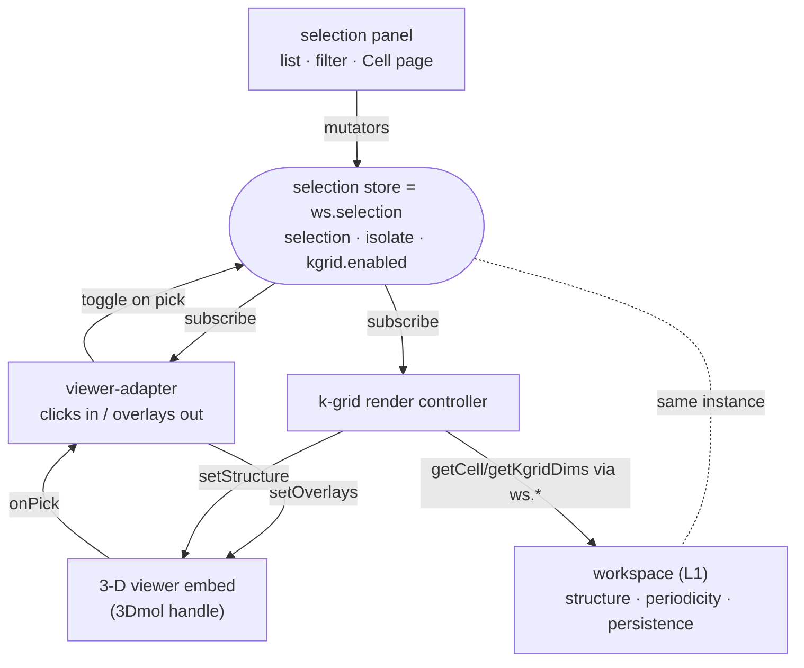

# MolView module — contract

> The **MolView module** is the **L2 UI component**: the 3-D structure viewer, atom
> selection, k-grid display, and measurement.  It **USES** the workspace data model
> (**L1**) — [`workspace-contract.md`](workspace-contract.md) — through the `ws.*` API;
> it does **not** own that data.  MolView *uses* the workspace; they are different
> layers and live in different docs (this separation was restored 2026-07-08 after a
> mistaken merge folded them into one "core contract").
>
> Section numbers begin at **§11** for continuity with cross-references written while
> this material briefly lived as "Part II" of the workspace contract; §§1–10 are the
> workspace data-model sections, in `workspace-contract.md`.

---

## At a glance (developer orientation)

**What it is:** one L2 component = 3-D viewer + selection panel + k-grid + measurement,
all wired through ONE selection store.  It reads/writes structure + periodicity from the
L1 workspace via `ws.*`; it never fetches or parses.

**Internal composition** — every part talks to the store, never to each other:



**Data it touches — always through `ws.*` (L1), never a raw field:**

| Concern | Read | Write |
|---|---|---|
| structure + periodicity | `ws.getStructure()`, `ws.getUnitCellInfo()/getVacuumInfo()/getAxisKindInfo()/getKgridInfo()` (`{value,isDefault}`) | `ws.setVacuum/setUnitCell/setAxisKind/setKgrid`, `ws.commitPeriodicity` |
| selection + view toggles | `ws.selection.getState()` (`{indices, isolate, kgrid, …}`) | `ws.selection.toggle/setIsolate/setKgrid({enabled})` |

**Example — compose the module around a store:**

```js
const store = ws.selection;                 // or molbuilder.selection.createEphemeralStore()
// panel + viewer-adapter, both bound to the SAME store:
molbuilder.selection.mountPanel(panelHost, { store, viewerHandle, mode: "click" });
// k-grid tiling: dims come from periodicity.kgrid (the ONE value), cell from the resolver:
molbuilder.molview.mountKgridRender(viewerHandle, store, {
    getUnit:      () => currentUnitCell(),          // host-owned unit-cell coords/elements
    getCell:      () => ws.getUnitCellInfo().value, // resolved (explicit or bbox+vacuum)
    getKgridDims: () => ws.getKgrid(),              // == periodicity.kgrid
});
store.subscribe((s) => repaint(s.indices));         // react to selection changes
```

> The parts above are composed by each host today (Modify, the Results structure card).
> Unifying that assembly behind a single `molview.mount(host)` is proposed follow-up work
> — it does not change the boundary or the store-is-single-source rule below.

---

## §11 The MolView module — what it is + the boundary

**MolView is one module: the structure viewer, with atom selection as part of
it.** Selection, measurement, and k-grid display are not bolted-on neighbours —
they are parts of this module. The module renders a structure, lets the user
pick/filter atoms, reads off geometry, and displays the periodic tiling.

Two hard rules define the whole module:

1. **Data and parameters come IN through the API. The module never fetches and
   never parses.** Structure text, the lattice `cell`, and the k-grid `dims` are
   handed to the module by the host; the module draws them. Reading files,
   associating a `.fdf` with a structure, and extracting a cell/k-grid are the
   **host's** job (the results tab, backed by `molbuilder/parse/`; or a designed
   structure on Modify). See §14.
2. **The store is the single source of truth for selection state.** The panel,
   the viewer-adapter, and the viewer never talk to each other directly — they
   all go through the store (§13). This is the SAME store as `ws.selection` (workspace-contract.md §5).

### 11.1 Boundary — who owns what

| The module owns | The host owns |
|---|---|
| 3-D rendering + the viewer card chrome (style / labels / axes / reset / screenshot / background / export) | Page layout, where the card sits |
| Overlay state: axes, **cell wireframe** (given a lattice), labels, arrows, atom overlays, pick halos, animation frame, camera | **Data fetching** (`/api/*`, sidebar reads, polling) |
| The **selection store** + the selection panel + the viewer-adapter | The **cell + k-grid parameters** it supplies to the module (§14) |
| Measurement math + readout overlay; k-grid tiling compute | Project context (current dir, file naming) |

Crossing the boundary:
- **Host → module (mutate):** `handle.setStructure/setStyle/setAxes/setOverlays/setPick…`; `store.setSelection/setIsolate/setKgrid/…`.
- **Host → module (read):** `handle.getAtomCount/getAtomCoords/getElements/getLattice/getCell/getPickedIndices/getCamera`; `store.getState()`.
- **Module → host (events):** `opts.onReady(handle)`, `opts.onError`, `opts.pick.onPick`, `opts.export.onExport`, `opts.animation.onFrame`; `store.subscribe(fn)`.

The host never reads 3Dmol objects directly; the module never reads host DOM
outside its own card.

## §12 The selection store — `ws.selection`

The store holds all selection + view state. The one process-wide instance is
reached through **`window.molbuilder.workspace.selection`** (`ws.selection`, workspace-contract.md §5),
which the dispatcher builds around the `_createStore` factory — there is **no**
public `molbuilder.selection.store` singleton (retired Phase 9, workspace-contract.md §8).
`molbuilder.selection.createEphemeralStore()` mints an isolated instance for a
readonly inspector. (The rest of `molbuilder.selection.*` holds the module's
functions: `mountPanel`, `measurements`, `viewerAdapter`, `_createStore`,
`_surfaceSnapshot`.)

### 12.1 State (exact — `_initialState`)

```
{
  sourceFile:  null | string      // absolute structure path
  atoms:       Atom[]             // {index(0-based), element, x, y, z, labels[],
                                  //  isFrozen, atomName?, residueName?, chainId?}
                                  //  TRANSITIONAL per-atom shape.  The MANDATED model
                                  //  is COLUMNAR behind the accessor API (workspace-contract.md §1.2.1 + workspace-contract.md §1.4)
                                  //  -- reach it via ws.*, not this raw array; Track D4
                                  //  (molview-migration-plan) seals it.
  selection:   number[]           // THE selection set (sorted; the canonical state)
  pickOrder:   number[]           // same atoms in click order (angle vertex = pickOrder[1])
  mode:        "click" | "filter"
  isolate:     boolean            // "show selected only" — VIEW state (was the
                                  //  adapter's setIsolateMode; moved into the store)
  kgrid:       { enabled: boolean, dims: [nx,ny,nz], source: "free" | "fixed" }
  filters:     Filter[]           // {kind: by_element|by_index|by_label, value}
  combinator:  "or" | "and"
  loading:     boolean
  error:       null | string
}
```

`selection` is canonical; `pickOrder` is its click-order shadow (kept in lock-step
by every mutator). **`isolate` and `kgrid` are VIEW state that lives in the store**
— not on the adapter, not on a global handle. This is what makes the panel drive
them through the store (§13), obeying the single-source rule. (These fields
surface on the `ws.*` read API as workspace-contract.md §2 `getSelection()` / workspace-contract.md §5 `ws.selection.getState()`,
raw `selection` renamed to `indices`.)

### 12.2 Surfaces

Consumers never touch the raw store; they use a renamed **surface**:

- **`ws.selection`** (dispatcher) — the singleton surface (the workspace-contract.md §5 methods).
  Full method list:
  `toggle set add remove all invert clear setMode setIsolate setKgrid setFilters
  addFilter removeFilter updateFilter setCombinator applyFilter writeLabel
  getAtoms getState subscribe adoptSession setSourceFile setLoader refreshAtoms`.
- **`createEphemeralStore()`** — an isolated instance with the **same surface
  minus** `getAtoms / setSourceFile / refreshAtoms` (workspace-lifecycle methods
  a readonly inspector doesn't use). Both surfaces reshape state via the one
  `_surfaceSnapshot` shaper, so `getState()`/`subscribe(fn)` deliver
  `{indices, …, isolate, kgrid, …}` (raw `selection` is renamed `indices`).

`setKgrid(patch)` is `source`-aware: in `"fixed"` a bare `dims` edit is ignored
(the values are the run's, read-only); in `"free"` `dims` is clamped so
`natoms · nx·ny·nz ≤ 20000`. `enabled` always applies.

## §13 The viewer + composition (panel + adapter, through the store)

### 13.1 The viewer — `viewer.embed(host, opts) → handle`

`window.molbuilder.viewer.embed(host, opts)` mounts the viewer card and returns a
**handle**. Structure text (`opts.xyz` / `opts.pdb`) + a declarative options object
come in through the call; the viewer maintains the drawing. Handle methods (exact):

```
setStructure  setStyle  setAxes  setOverlays  setPick  setPickedIndices
getPick  getPickedIndices  getAtomCount  getAtomCoords  getElements
getLattice  getCell  getCamera  setCamera
playAnimation  setAnimationFrame  refit  screenshot  exportData  dispose
```

- **`opts.lattice`** (3×3 row vectors) → `getLattice()` returns it and k-grid
  tiling uses it (§14). The **cell wireframe** draws only when **`opts.cell`** is
  also set (`_redrawCell` gates on `state.current.cell`). The viewer does **not**
  parse a lattice from the file text; the host passes it (§14).
- **`setOverlays(spec)`** is how selection is painted (halos, region tints,
  isolate opacity). **`setStructure({xyz, lattice})`** is how the displayed
  atoms are replaced (e.g. a k-grid supercell, §14).
- Hard deps (`embed()` throws if absent): `$3Dmol`, `molbuilder.viewer.create`,
  `molbuilder.fmt`. Soft deps degrade silently: `molbuilder.axes`, `molbuilder.style`.

### 13.2 Composition — panel + adapter + viewer

```
        selection-panel.js            viewer-adapter.js
        (DOM: list/filter/            (paints overlays via
         checkboxes)                   handle.setOverlays;
              │                        forwards viewer clicks
              │                        to store.toggle)
              └────────► STORE ◄───────────┘
                     (single source)
```

- **`selection.mountPanel(host, {store, viewerHandle, mode})`** fetches the panel
  partial, mounts `selection-panel`, and attaches `viewer-adapter` to the handle
  — both bound to the given `store` (the singleton or an ephemeral one).
- The **panel** renders from `store.getState()` and calls mutators on input
  (toggle, filter, `setIsolate`, `setKgrid`). The **adapter** subscribes to the
  store and paints halos/region-tints/isolate via `setOverlays`; it forwards
  viewer clicks to `store.toggle`.
- Panel and adapter never reference each other. `mode:"readonly"` hides the
  panel's write controls; clicks still feed the store.
- `fused-layout.css` lets the host place the panel as a foldable side/bottom
  region of the viewer card (host layout choice; the viewer offers no layout API).

## §14 k-grid & the render pipeline

k-grid display = **copies of the atoms offset by the lattice vectors**. Pure compute:

- **`molview.tileKgrid(coords, cell, [nx,ny,nz]) → {positions, sourceIndex, nimages}`**
  — the tiling.
- **`molview.computeRender(coords, view, cell) → {positions, sourceIndex}`** — the
  ordered pipeline: layer 2 (selection/**isolate** → visible global indices) →
  layer 3 (k-grid tile). Because isolate runs before tiling, **isolate ON + k-grid
  ON tiles only the selected atoms.** `sourceIndex[m]` maps each drawn position
  back to its unit-cell atom (element/label lookup; images share their unit-cell
  atom's identity).

### 14.1 The render controller lives in the module — `mountKgridRender`

The one k-grid render **controller** — the live loop that subscribes to the store,
runs `computeRender`, and calls `handle.setStructure(supercell)` — is in the
module, not hand-written per host:

- **`molview.mountKgridRender(handle, store, {coords, elements}) → {dispose}`**
  subscribes to the store, runs `computeRender` with the cell **read from the
  store** (never from a load response or a per-render hand-read), calls
  `handle.setStructure(supercell)` on enable, restores the unit cell on disable,
  and unsubscribes on `dispose`. It is the **ONLY** k-grid render loop in the
  codebase (the former inline controller in the Results structure inspector was
  deleted when this landed — molview-migration-plan Steps 1–2).

### 14.2 In-window picking is disabled while k-grid is on; the panel still works

**With many duplicated atoms on screen, a mouse click inside the molview window is
ambiguous and messy** — "which copy did you pick?" has no answer. So while
`kgrid.enabled`:

- **In-window picking is disabled** — clicking an atom in the 3-D molview does
  **not** toggle the selection. Selection halos + the measurement overlay also
  stand down in the window (they are keyed by unit-cell index and can't map onto
  copies).
- **The selection PANEL stays fully functional** — filter and click-select on the
  atom *list* work normally, because the list is the original unit-cell atoms
  (no ambiguity). The selection is still curated there, and the render re-tiles on
  change.
- **The selection is recorded internally** (never cleared) — so with **isolate ON
  + k-grid ON the render copies/duplicates ONLY the selected atoms** across the
  grid (§14 above). Turning k-grid off restores in-window picking, halos, and
  measurement.

So k-grid disables *pointing at the 3-D view*, not *selecting*: you keep curating
the selection through the panel; you just can't click the copies.

### 14.3 The k-grid / cell parameter boundary (host supplies; module never parses)

The module **only cares whether a `cell` and a `kgrid` were handed to it.** It does
not read files, does not associate a `.fdf`, does not extract a k-grid.

- The **cell** is passed as `opts.lattice` (viewer) — the host obtains it. For a
  result, that's `molbuilder/parse/` (`StructureResult.cell` / `JobResult`
  geometry) surfaced by the **results tab**; on Modify, it's the structure being
  designed (read from the store — `ws.getUnitCell()`, workspace-contract.md §2).
- The **k-grid** reaches the store as `setKgrid({source:"fixed", dims})` when the
  host supplies it (the results tab, from the `.fdf` kgrid diagonal that
  `parse/dirs/job.py` already extracts), or `"free"` when the user experiments.

`molbuilder/parse/` is the sole parser (see `parse-module.md`). No parsing
lives in this module. How the host **resolves** `cell` + `kgrid` (the
`resolve_cell` precedence, the `axis_kind` enum `{periodic, isolated, transport}`,
the axis_kind-gated k-grid rule — k-grid > 1 only on a `periodic` axis) is defined
in **[`structure-periodicity.md`](structure-periodicity.md)** — the module just
receives the result.

## §15 Measurement — `measurements.compute` + the overlay

- **`selection.measurements.compute(selection, atomsMeta, positions, pickOrder)`**
  → `{kind: "xyz" | "distance" | "angle", display}` (or null). 1 atom → position,
  2 → distance, 3 → angle (vertex = `pickOrder[1]`).
- **`molview.mountMeasurementOverlay(viewerHost, {store, coordsProvider}) →
  {render, dispose}`** paints that readout as text in the viewer card, derived from
  the store selection. Coords come from `coordsProvider()` (the current frame /
  the viewer handle) — the store never holds coordinates. Hidden while k-grid is on
  (§14.2).

## §16 Atom-index display rule

Indices are **0-based internal, 1-based user-facing** (`data-vocabulary.md` §3.1).
Internal state (`atom.index`, `selection`, `pickOrder`, `sourceIndex`) is 0-based;
anything a user reads (panel `#` column, viewer labels, measurement readout) is
converted via `lib/workspace/_atom-index.js` `toDisplay` at the edge. Never let a
1-based value into state; never show a 0-based value.

## §17 Test affordances, provenance & decisions

### 17.1 Test affordances

- Node-tested pure modules: `tileKgrid`, `computeRender`, `mountMeasurementOverlay`
  (`tests/test_{kgrid,render_pipeline,measurement_overlay}_js.py`), the store
  (`test_selection_store_js.py`), the dispatcher (`test_workspace_dispatcher_js.py`).
- Browser e2e (structure inspector): measurement overlay, clicks→store, and (when
  the host supplies a cell) k-grid tiling — `tests/test_structure_inspector_measurement_e2e.py`.
- The inspector exposes `viewerSlot.__molbuilder_test_handle` + `__molbuilder_test_store`
  (test-only) so e2e drives the viewer + store without canvas clicks.

### 17.2 What this doc supersedes

| Archived doc | Was | Why it folded here |
|---|---|---|
| `embedded-viewer.md` (`archive/2026-07-03-embedded-viewer.md`) | the viewer contract | the viewer is part of this one module |
| `atom-selection.md` (`archive/2026-07-03-atom-selection.md`) | the selection module | selection is part of this one module; its §404 (isolate on the adapter + global handle) was already superseded by isolate-in-store |
| `molview-module.md` (`archive/molview-module.md`) | the standalone MolView module doc | folded here so the viewer + selection + the workspace model they share live in ONE core contract |

> **NOT superseded — `atom-annotations.md` stays LIVE.** Only the FUSED-VIEWER
> material that had accreted into `atom-annotations.md` (the viewer/selection/
> k-grid/measurement design) was absorbed — into this doc. The
> **per-atom annotation *channels* data model** remains the live, in-progress
> contract at [`atom-annotations.md`](atom-annotations.md) (schema-v4
> `.molstruct.json` channels + JS mirror that `structure.py`, `sidecars/molstruct.py`,
> `parse/`, `siesta/input.py`, `script_emit.py` depend on). Do not treat it as archived.

### 17.3 Decisions log

| Date | Decision |
|---|---|
| 2026-07-08 | MolView module doc **split back out** of `workspace-contract.md`. Workspace is **L1 (data)** and MolView is **L2 (UI that uses L1)** — different layers, so they must not share one doc. `molview-module.md` is again the standalone MolView contract; `workspace-contract.md` is the workspace data model only. (Reverses the 2026-07-06 merge below.) |
| 2026-07-06 | MolView module doc merged into the workspace contract as "Part II" (viewer + selection + workspace model in one doc). **Reversed 2026-07-08** — see above. |
| 2026-07-03 | One doc for the MolView module (viewer + selection as one). Code is the standard. isolate + kgrid live in the store (view-state). k-grid: host supplies cell+kgrid; the module tiles, never parses. `embedded-viewer.md`/`atom-selection.md` archived; the fused-viewer material was pulled out of `atom-annotations.md` (its channels model stays live). |

---

## §18 The unified mount — `molview.mount(host, opts)` (proposed)

Today the fused card is assembled **twice**, with the same chrome:

- **Modify** — the card DOM is in `modify.html`; `selection-bootstrap.js` mounts the panel
  + view-controls + fold; `viewer.js` embeds the viewer + k-grid + measurement.
- **Results** — `inspectors/structure.js` builds the same DOM in JS and wires the same
  pieces, against an ephemeral store.

`molview.mount` folds that duplicated assembly into ONE call. The card **chrome** (DOM +
panel + view-controls + fold) is identical; only the **store**, **mode**, and the
**viewer-embed + data source** differ — so those are `opts`, and everything else lives in
the mount.

### 18.1 API

```
molview.mount(hostEl, opts) -> handle

opts = {
  store,          // a selection store -- ws.selection, OR
                  //   molbuilder.selection.createEphemeralStore().  REQUIRED: the mount
                  //   never invents state; the caller owns WHICH store (§12 single-source).
  mode,           // "modify" | "readonly"  (panel write-ness)
  focus,          // bool -- include the "Focus molecule" button (Modify only)
  embed,          // (viewerHost) -> Promise<viewerHandle>.  The caller's embed strategy:
                  //   Modify = the resilient runtime.whenReady attach; Results = inline
                  //   embed with card.height.  The mount builds the host + calls this.
  data,           // { getUnit(), getCell(), getKgridDims() } -- the k-grid render hooks
                  //   (Modify = ws accessors; Results = the result sidecar + its store).
}

handle = { dispose(), els:{card, viewerHost, panelHost, controlsBar}, store, viewerHandle }
```

### 18.2 What the mount OWNS (the concealed assembly)

- Builds the fused-card DOM (`fused-layout.css`): `body > [ viewer (wrap + controls bar) |
  fold | panel host ]` — the ONE DOM builder, retiring the template card + the
  `structure.js` build.
- `selection.mountPanel(panelHost, {store, mode})`; `molview.mountViewControls(controlsBar,
  store)`; wires the fold button.
- `await opts.embed(viewerHost)`; then `mountKgridRender` + `mountMeasurementOverlay` on the
  returned handle, using `opts.data`.
- `dispose()` tears all of it down (panel, controls, overlays, k-grid, subscriptions).

### 18.3 What stays with the CALLER (the data seam)

The viewer **embed** and the **data** differ by consumer, so they're `opts` hooks, not
baked in: Modify feeds the live workspace (resilient attach); Results feeds a static result
file (`adoptSession`). Everything else is identical and lives in the mount.

### 18.4 Migration (one consumer at a time, regression at each)

1. Build `molview.mount` + unit-test the DOM/wiring against a stub store + stub embed.
2. **Modify**: template card → an empty host; `selection-bootstrap.js` calls `molview.mount`
   (`focus:true`, `store: ws.selection`, `mode:"modify"`, `embed:` the whenReady attach).
3. **Results**: `structure.js` calls `molview.mount` (`store:` ephemeral, `mode:"readonly"`,
   `embed:` inline).
4. Delete the two hand-assemblies.

> **Status: PROPOSED — not yet built.** Steps 1–3 of the viewer-controls-bar work (the
> shared `.viewer-toggle` bar) shipped 2026-07-08; this mount is the next consolidation.
