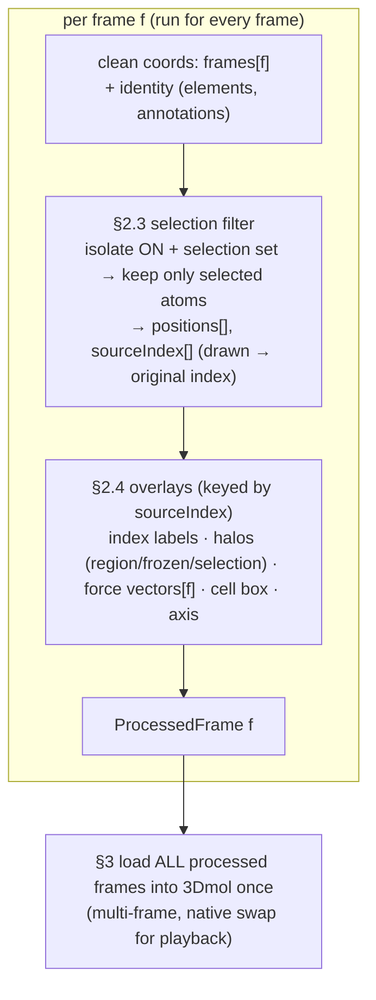
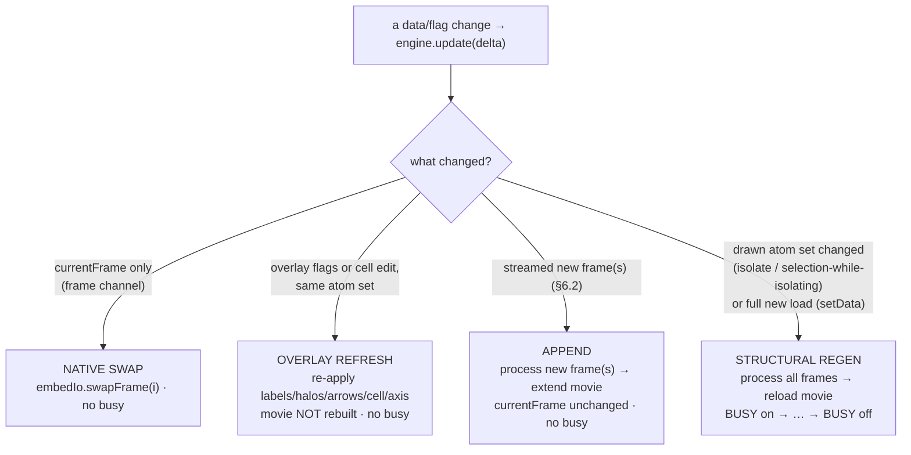
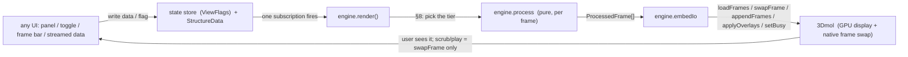
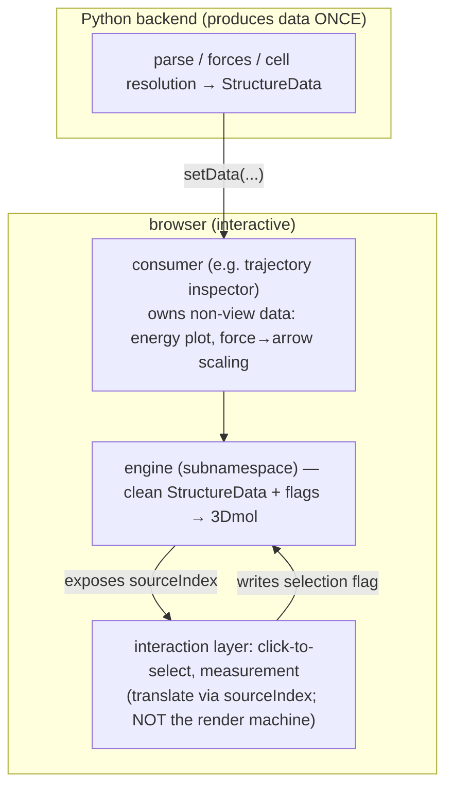

# MolView render streamline — the ONE render path

> This document is the single source of truth for how MolView turns data into what
> 3Dmol shows. It is written to be followed literally. If code disagrees with this
> document, the code is wrong.

Rules §1–§6 are the plain-language contract. §7–§11 pin it down with the data structures,
the engine API, the minimal-update rule, the data flow (with diagrams), and worked examples.
The subnamespace is `molbuilder.molview.engine` (`lib/molview/engine/`).

---

## 1. Data goes through ONE render/processing step, then to 3Dmol as fully-ready data

Data comes in. It goes through **one** streamlined render/processing process **before**
it is handed to 3Dmol.

What is handed to 3Dmol is the **full, fully-ready data**. That data can be either:

- a **single frame**, or
- a **multi-frame** set.

3Dmol receives that ready data and, from there, uses **its own** capability (GPU /
whatever acceleration it has) to handle it — to animate it, interact with the user, and
display it.

So the division of labor is:

- **The streamline** does all the processing/derivation and produces the finished data
  (one frame or many frames), ready to draw.
- **3Dmol** just takes that finished data and displays/animates it with its own
  acceleration. The streamline does not micro-manage 3Dmol frame-by-frame; it hands over
  complete, ready data.

## 2. What the render/processing step understands and does

The render/processing step understands the following:

### 2.1 Timeline — always treat the data as multi-frame

There may be multiple frames, or a single frame. **The process always treats the data as
multi-frame.**

- If there is only one frame, it is simply **frame [0]** (a multi-frame set of length 1).
- In that single-frame case, the **trajectory / animation controls do not appear**.

### 2.2 Process each frame

The processing runs **per frame**: each frame goes through the rest of the streamline
below. (Single frame = the streamline runs once, on frame [0].)

For each frame, in order:

### 2.3 Step — selection

First, process **selection**.

- If a selection is provided/set **and** isolation mode is toggled **on**, then the frame
  keeps **only the atoms in the selection list** (the other atoms are dropped from that
  frame's render data).
- Otherwise the frame keeps all its atoms.

### 2.4 Step — overlays added to the render scene

After selection, the other elements are added as **overlays** to the render scene. These
are:

- **Atom index.** The atom-index labels. If selection/isolation dropped atoms, the index
  shown must still be the atom's **original** index — so when the atom list has been
  filtered, the index is **translated** so each kept atom shows its original index, not its
  new position in the filtered list. The displayed number is **1-based** (SIESTA / Fortran
  convention; `data-vocabulary.md` §3.1) — internal indices (`sourceIndex`, `selection`) stay
  **0-based**; only the label text is converted, through the shared L1 helper
  `molbuilder.atomIndexModel.toDisplay` (reused, never re-derived as a bare `+1`).
- **Selection halos (three highlight layers).** The highlights that show what is selected:
  (a) **region color tints** (each region label its own color), (b) **frozen-atom markers**,
  and (c) the **selection halo** on the current pick set. Region tints and frozen markers come
  from the **atom annotations** (persistent, §7.1); the selection halo comes from the
  **transient pick set** (a flag, §7.2). Like the atom-index labels, all three are keyed by
  atom **index**, so when selection/isolation has filtered the list the same **original
  index** translation applies — the highlight lands on the correct atom.
- **Force vectors.** Provided by the incoming data supply. If such an overlay is supplied,
  it is added — and it is extracted from the **correct frame** of that data (frame `i`'s
  vectors go on frame `i`).
- **Unit cell box.**
- **Axis.**

> **Not part of this render machine: measurement.** The measurement readout (position /
> distance / angle when 1 / 2 / 3 atoms are selected) is a **separate layer** — it provides
> the results of the user's **interaction** with the view, not part of producing the frame
> data. It is not an overlay this streamline generates; it lives on its own.

The result of §2.3 + §2.4, done for every frame, is the finished per-frame render data
that §1 hands to 3Dmol.



## 3. Load every processed frame into 3Dmol once; frame switching is a native swap

For each frame, after the atom list and overlays are processed (§2), that finished frame
is **added to the 3Dmol engine** using the **optimal API** — the one that lets 3Dmol
**switch from frame to frame with a single call**.

This means:

- All processed frames are handed to 3Dmol up front (as the multi-frame data of §1).
- When the animation / trajectory button steps through frames, it is **not** re-rendering
  or re-processing each frame. It is **only asking 3Dmol to switch to the correct frame**.
- The streamline processes each frame **once** (at load); playback is a pure 3Dmol native
  frame swap, one call, no recompute.

## 4. Busy flag guards a re-generation

Whenever the streamline has to **re-generate the data** for the 3Dmol engine — during data
loading, or when toggling an option that requires the streamline to re-process/re-generate
the data (§2/§3) — the **busy flag** is used to:

- **temporarily block user access to the controls** while the streamline is working, and
- **restore the view (unblock)** once the 3Dmol engine is ready, i.e. once all the data has
  been updated.

A pure frame switch (§3, native swap) does **not** re-generate data, so it does not raise
the busy flag. Precisely (§8): the busy flag is tied to the **structural regen** tier (the
multi-frame movie is rebuilt); a native swap and a light overlay refresh do not raise it.
The trigger is **what changed**, never the system size — there is no atom-count threshold and
no magic number.

## 5. The governing principle — everything is data/flag driven; one render place

All UI interaction is essentially just:

1. providing the correct **data update**, and/or
2. providing the correct **state / flag update**, and then
3. **requesting the rendering/processing streamline for an update**.

**There is no hand-crafted render function, ever.** No control builds its own view, pokes
3Dmol directly, or produces render output on the side.

The unified data processing lives in **one single place** (the streamline of §1–§4) and it
is **fully data/flag driven**: given the current data + flags, it produces the finished
frames and hands them to 3Dmol. Any button, toggle, or panel does nothing more than change
the data or a flag and ask that one streamline to run.

## 6. Updating the data — APPEND new frames vs. LOAD a full new file

There are **two different ways** data changes, and they must not be confused.

### 6.1 Load a full new file (REPLACE)

Loading a molecule/file **replaces everything**. It establishes the atom **identity**
(count, elements, order) from **frame [0]**, resets to frame [0], and the streamline
regenerates all frames from scratch (§1–§3). The engine receives already-**validated**
`StructureData` via `setData` (§9) — the on-disk cross-check (manifest vs. block/atom count)
is the **loader/parse** layer's job upstream, before `StructureData` is built; the engine does
not read files.

### 6.2 Append new frames (STREAMING) — validate, then append through the streamline

A **running job streams new steps**: new frame(s) arrive one or a few at a time and must be
**added onto the existing data**, not reloaded. The contract:

1. **There must already be a loaded structure.** Appending when nothing is loaded is a hard
   error (there is no atom identity to append to).
2. **Same-atoms invariant — validate BEFORE anything reaches 3Dmol.** Every frame has the
   **same atoms**: same count, same element order, same identity. Each incoming frame is
   checked to have the **same atom count** as the loaded structure. Element order/identity is
   **inherited from frame [0]** — a streamed frame carries **coordinates only** (elements are
   not re-sent; identity was fixed at load and is enforced upstream at parse time).
3. **On violation → hard error, never coerce.** A frame whose atom count does not match is
   **rejected** with a hard error (same class as the load-time atom-count guard) *before*
   any data reaches 3Dmol. We never guess, pad, or truncate to make it fit.
4. **Append through the SAME streamline processing.** Each validated new frame runs through
   the same per-frame processing as every other frame (§2: selection filter → overlays), and
   its supplied per-frame overlays (force vectors) are extracted from the **correct new
   frame** and appended for **those new frames only** — not the whole set re-handed.
5. **Append, do not reload.** The processed new frame(s) **extend** the 3Dmol data using the
   append path (so a running job grows the movie without a full rebuild). Appending **does
   not move the current frame** — the user keeps watching where they were.

So: a full load re-establishes identity and rebuilds everything; an append validates against
the fixed identity and extends the existing data through the same one streamline.

## 7. The engine's inputs — data structures

Everything the engine draws is a **pure function of two inputs**: the **data** (the clean
source of truth it owns) and the **flags** (the view state). Both are plain data — no 3Dmol
objects, no DOM.

### 7.1 Data — the clean source of truth (the engine owns this)

```
StructureData = {
  frames:          Frame[],          // frames[f] = coords of frame f. length >= 1.
  elements:        string[],         // elements[a] = element symbol. SHARED by every frame.
  annotations:     AtomAnno[],       // annotations[a] = per-atom identity. SHARED by every frame.
  cell:            Cell | null,      // unit cell, or null for a cell-less molecule.
  forcesPerFrame:  FrameForces[] | null,  // optional; forcesPerFrame[f] = forces of frame f.
}

Frame        = Vec3[]                 // length = nAtoms; SAME nAtoms for every frame (invariant §6).
FrameForces  = Vec3[]                 // length = nAtoms.
Vec3         = [number, number, number]

AtomAnno = {
  label?:  string,                    // region label (grouping) — drives region color tint.
  frozen?: boolean,                   // frozen flag — drives the frozen marker.
}

Cell = {
  lattice: [Vec3, Vec3, Vec3],        // the a/b/c lattice vectors.
  origin:  Vec3,                      // corner the box is anchored at (so it wraps the atoms).
}
```

- The atom **count, `elements`, and `annotations` are fixed at load from frame [0]** and are
  identical for every frame (the same-atoms invariant, §6). A frame carries **coordinates
  only**.
- The engine keeps this data **clean** — it is never overwritten with a derived/filtered
  list. Every render re-derives from here, never from what 3Dmol currently shows.

### 7.2 Flags — the view state (live in the state store; the UI writes them)

```
ViewFlags = {                // the view store — LOW frequency (user toggles/clicks)
  selection:    int[],       // selected ORIGINAL atom indices.
  isolate:      boolean,     // "show selected only".
  showIndex:    boolean,     // atom-index labels overlay.
  showForces:   boolean,     // force-vector overlay.
  showCell:     boolean,     // unit-cell box overlay.
  showAxis:     boolean,     // axis overlay.
}
```

Region tints and frozen markers are **not** flags — they come from `annotations` (§7.1) and
always draw. `selection` + `isolate` are the only flags that change the **drawn atom set**;
the rest only change **overlays**.

**`currentFrame` is NOT in the view store.** It lives on a **separate frame channel** because
playback changes it at ~10 fps: firing the view store every frame would re-render the atom
panel and steal focus from a filter input mid-play. The frame channel drives **only** the
native swap (§8) and the frame bar — never the panel. `showFrame`/`play`/`pause` (§9) own it.

### 7.3 The processed output (what `process.js` returns per frame)

```
ProcessedFrame = {
  positions:   Vec3[],      // atoms actually drawn (filtered to selection when isolate on).
  sourceIndex: int[],       // sourceIndex[m] = ORIGINAL atom index of drawn atom m.
  elements:    string[],    // element per drawn atom (elements[sourceIndex[m]]).
  labels:      Label[] | null,   // index labels (showIndex) — text = the ORIGINAL index.
  halos:       Halo[],           // region tint / frozen marker / selection halo, per drawn atom.
  arrows:      Arrow[] | null,   // force vectors for THIS frame (showForces).
}
// Scene-level, computed once (same every frame unless the cell changes): cellBox, axes.
//
// Label / Halo / Arrow / cellBox are OPAQUE overlay specs that `embedIo` (§9.1) understands
// and hands to 3Dmol — `process.js` builds them but never touches 3Dmol. Their exact fields
// are owned by `embedIo`; the rest of the engine treats them as data.
```

`sourceIndex` is the **drawn → original** index map. It is why labels/halos show the original
index under isolation (§2.4), and it is what an **interaction layer** (click-to-select,
measurement — see the example in §11) translates through so a click on the derived view
resolves to the right original atom. Picking and measurement are **not** the render machine;
the engine only **exposes `sourceIndex`** so they can translate.

## 8. The minimal update — one engine, three costs (finding B)

A render is **not** always a full rebuild. Given what changed since the last render, the
engine does the **least work** that yields the correct result. This is still **one place, one
data-driven decision** — not a second render path. The tier is chosen by **what changed**,
never by system size (**no atom-count threshold, no magic number** — finding C).

| What changed | Tier | Work | Busy? |
|---|---|---|---|
| `currentFrame` only (scrub / play — frame channel) | **native swap** | ask 3Dmol to switch to the pre-loaded frame (§3) | no |
| overlay-only change on the **same** drawn atom set (`selection` halo while **not** isolating, `showIndex`, `showForces` + scale, `showCell`, `showAxis`, **a cell edit** → cell box + axis) | **overlay refresh** | re-derive + re-apply the overlays on the existing frames; the coordinate movie is **not** rebuilt | no |
| **streamed** new frame(s) arrive (§6.2) | **append** | process the new frame(s) only + **extend** the movie; `currentFrame` unchanged | no |
| the **drawn atom set** of the current frames changed (`isolate` toggled; `selection` changed **while** isolating), or a **full new load** (`setData`) | **structural regen** | re-process the frames + **reload** the multi-frame movie (§3) | **yes** (§4) |

A cell edit is **overlay refresh**, not a regen: the atoms don't move, only the cell box +
axis change. A streamed append **extends** the movie (§6.2) — it is *not* a reload; only
`isolate`/`selection`-while-isolating and a full new load rebuild the movie.



## 9. The engine API — subnamespace `molbuilder.molview.engine`

The engine is the **only** code that talks to the 3Dmol handle. Its public surface is small;
everything else changes data or flags and asks it to render.

```
molbuilder.molview.engine.create(handle, { store }) -> Engine

Engine = {
  // ── data (§6) ──────────────────────────────────────────────
  setData(data: StructureData): void,        // FULL LOAD (replace). Fix identity from frame 0,
                                             //   reset currentFrame to 0, structural regen.
  appendFrames(coords: Frame[], opts?: { forces?: FrameForces[] }): void,
                                             // STREAM append (§6.2): validate same-atom-count
                                             //   (hard error on mismatch), extend the movie,
                                             //   DON'T move currentFrame.

  // ── playback — the frame channel (§7.2) ────────────────────
  showFrame(i: int): void,                   // set currentFrame = i on the frame channel →
                                             //   engine renders it as a NATIVE SWAP (§8). No
                                             //   separate draw path; no busy; does NOT fire
                                             //   the view store (so the panel is not redrawn).
  play(opts?: { fps?: number }): void,       // timer that advances currentFrame (each tick = a
                                             //   native swap via showFrame).
  pause(): void,

  // ── render (§5) ────────────────────────────────────────────
  render(): void,                            // regenerate from CURRENT data+flags; picks the
                                             //   §8 tier by the delta since last render.

  dispose(): void,
}
```

**View flags come from the store; the frame index comes from the frame channel.** The engine
holds **one** subscription to the view store — a flag write (by any panel/toggle) fires it and
the engine `render()`s (picking the §8 tier). `currentFrame` is separate (§7.2): `showFrame`/
`play`/`pause` move it and the engine renders it as a native swap, never re-rendering the
panel. Either way the UI only **writes data/flags**; the engine is the single render place
(§5) — `showFrame` is not a second draw path, it just sets the frame index.

### 9.1 The two internal layers (both under the subnamespace)

```
molbuilder.molview.engine.process   // PURE: (frame coords, identity, flags) -> ProcessedFrame.
                                     //   no 3Dmol, no DOM. node-unit-tested (§2, §7.3).
molbuilder.molview.engine.embedIo   // the ONLY 3Dmol-touching primitives:
                                     //   loadFrames(processed[], {cell})  — multi-frame load (§3)
                                     //   swapFrame(i)                      — native swap
                                     //   appendFrames(processed[])         — extend the movie (§6.2)
                                     //   applyOverlays(processed[])        — labels/halos/arrows/cell/axis
                                     //   setBusy(msg | null)               — the §4 scrim
```

`Engine` (§9) composes these: it holds the clean `StructureData` + reads `ViewFlags`, runs
`process` per frame, and drives `embedIo`. Nothing outside `embedIo` ever calls the 3Dmol
handle.

## 10. Data flow

**The one loop — every interaction is the same shape (§5):**



**Who owns what:**



## 11. Examples

**Load a trajectory with per-frame forces (full load, §6.1):**

```js
const engine = molbuilder.molview.engine.create(handle, { store });

engine.setData({
  frames:         framesFromJob,          // Vec3[][]  (nFrames × nAtoms × 3)
  elements:       ["Au", "Au", "S", ...], // fixed identity
  annotations:    [{ label: "electrode" }, {}, { frozen: true }, ...],
  cell:           { lattice, origin },
  forcesPerFrame: forcesFromJob,          // Vec3[][]  or null
});
// → structural regen: process every frame, load the multi-frame movie, frame bar appears
//   (frames.length > 1). currentFrame = 0.
```

**Scrub / play (§3 — native swap, no regen):**

```js
engine.showFrame(12);   // 3Dmol switches to the pre-loaded frame 12. No processing. No busy.
engine.play({ fps: 10 });
```

**Toggle "show selection only" (a flag write; §8 → structural regen):**

```js
store.setIsolate(true);   // the UI only writes the flag …
// … the engine's subscription fires → render() → isolate changes the drawn atom set →
//   STRUCTURAL REGEN: each frame is re-filtered to the selection and the movie is reloaded.
//   The trajectory SURVIVES (frame bar + playback intact) because regen rebuilds a MOVIE,
//   never a single static structure. BUSY on during the rebuild.
```

**Click an atom while isolating (interaction layer, not the render machine):**

```js
// the click lands on drawn atom m; the interaction layer maps it to the original atom:
const original = processedFrame.sourceIndex[m];
store.toggleSelected(original);   // writes the selection flag → engine re-renders (§8).
```

**Stream a new frame from a running job (append, §6.2):**

```js
engine.appendFrames([newCoords], { forces: [newForces] });
// → validate newCoords.length === nAtoms (hard error if not), process the ONE new frame,
//   append it to the movie. currentFrame does NOT move (user keeps watching where they were).
```

---

## End-to-end summary (the whole thing in order)

1. **Data in** → the one streamline processes it, then hands 3Dmol fully-ready data
   (single- or multi-frame). 3Dmol uses its own acceleration to display/animate it. (§1)
2. The streamline **always treats data as multi-frame** (single frame = frame [0]; no
   trajectory controls shown then). It processes **each frame**: (§2.1–2.2)
   - **selection**: if a selection is set and isolation is on, keep only the selected
     atoms; (§2.3)
   - **overlays**: atom-index labels (index translated back to the original index when the
     list was filtered), selection halos (region tints + frozen markers + selection halo),
     force vectors (from that frame's supplied data), unit cell box, axis. Measurement is
     **not** part of the render machine (separate interaction layer). (§2.4)
3. Every processed frame is **loaded into 3Dmol once** via the optimal multi-frame API;
   playback just **asks 3Dmol to switch frames** — never re-render/re-process. (§3)
4. The engine does the **least work** the change needs (§8): native swap (frame change) ·
   overlay refresh (overlay flags / cell edit) · append (streamed frames) · structural regen
   (isolate / selection-while-isolating / full load). Only the **structural regen** (movie
   rebuild) raises the **busy flag**; the tier is chosen by *what changed*, never system size
   (no magic number). (§4, §8)
5. Every UI interaction only **updates data/flags and requests one render**. **One render
   place. No hand-crafted rendering. Fully data/flag driven.** (§5)
6. Data changes two ways: a **full load** replaces everything and re-fixes atom identity
   from frame [0]; a **streamed append** validates each new frame against that fixed identity
   (same atom count, coords-only, hard-error-never-coerce) and **extends** the data through
   the same streamline — not a reload. (§6)
