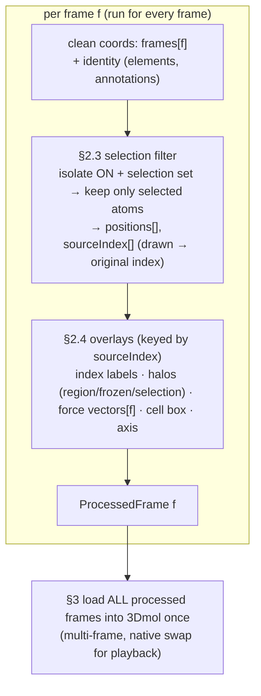
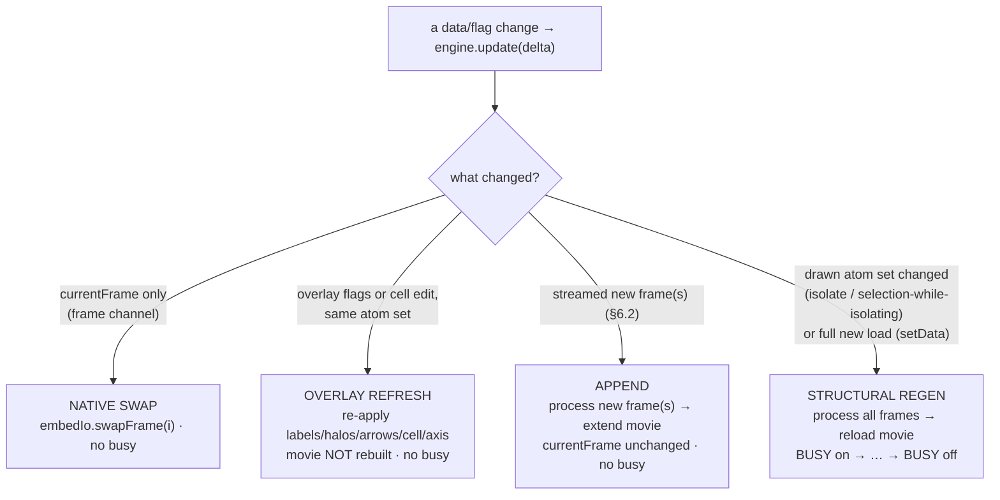
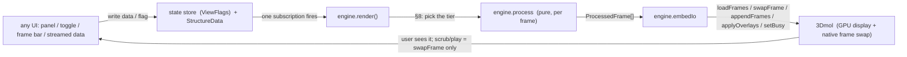
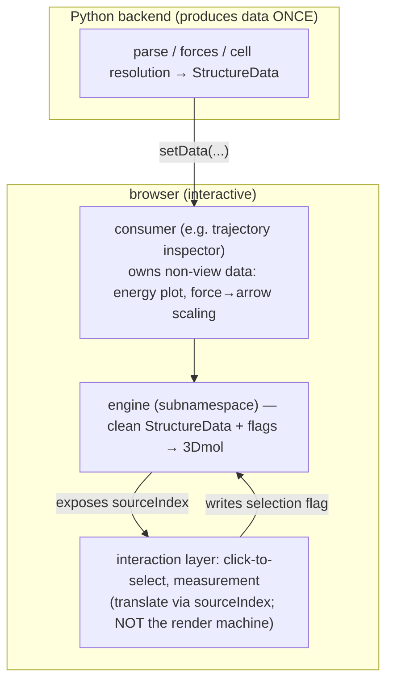

# MolView render streamline — the ONE render path

> This document is the single source of truth for how MolView turns data into what
> 3Dmol shows. It is written to be followed literally. If code disagrees with this
> document, the code is wrong.

Rules §1–§6 are the plain-language contract. §7–§11 pin it down with the data structures,
the engine API, the minimal-update rule, the data flow (with diagrams), and worked examples.
The subnamespace is `molbuilder.molview.engine` (`lib/molview/engine/`).

---

## 1. Data goes through ONE render/processing step, then to 3Dmol as fully-ready data

Data comes in. It goes through **one** streamlined render/processing process **before**
it is handed to 3Dmol.

What is handed to 3Dmol is the **full, fully-ready data**. That data can be either:

- a **single frame**, or
- a **multi-frame** set.

3Dmol receives that ready data and, from there, uses **its own** capability (GPU /
whatever acceleration it has) to handle it — to animate it, interact with the user, and
display it.

So the division of labor is:

- **The streamline** does all the processing/derivation and produces the finished data
  (one frame or many frames), ready to draw.
- **3Dmol** just takes that finished data and displays/animates it with its own
  acceleration. The streamline does not micro-manage 3Dmol frame-by-frame; it hands over
  complete, ready data.

## 2. What the render/processing step understands and does

The render/processing step understands the following:

### 2.1 Timeline — always treat the data as multi-frame

There may be multiple frames, or a single frame. **The process always treats the data as
multi-frame.**

- If there is only one frame, it is simply **frame [0]** (a multi-frame set of length 1).
- In that single-frame case, the **trajectory / animation controls do not appear**.

### 2.2 Process each frame

The processing runs **per frame**: each frame goes through the rest of the streamline
below. (Single frame = the streamline runs once, on frame [0].)

For each frame, in order:

### 2.3 Step — selection

First, process **selection**.

- If a selection is provided/set **and** isolation mode is toggled **on**, then the frame
  keeps **only the atoms in the selection list** (the other atoms are dropped from that
  frame's render data).
- Otherwise the frame keeps all its atoms.

### 2.4 Step — overlays added to the render scene

After selection, the other elements are added as **overlays** to the render scene. These
are:

- **Atom index.** The atom-index labels. If selection/isolation dropped atoms, the index
  shown must still be the atom's **original** index — so when the atom list has been
  filtered, the index is **translated** so each kept atom shows its original index, not its
  new position in the filtered list. The displayed number is **1-based** (SIESTA / Fortran
  convention; `data-vocabulary.md` §3.1) — internal indices (`sourceIndex`, `selection`) stay
  **0-based**; only the label text is converted, through the shared L1 helper
  `molbuilder.atomIndexModel.toDisplay` (reused, never re-derived as a bare `+1`).
- **Selection halos (three highlight layers).** The highlights that show what is selected:
  (a) **region color tints** (each region label its own color), (b) **frozen-atom markers**,
  and (c) the **selection halo** on the current pick set. Region tints and frozen markers come
  from the **atom annotations** (persistent, §7.1); the selection halo comes from the
  **transient pick set** (a flag, §7.2). Like the atom-index labels, all three are keyed by
  atom **index**, so when selection/isolation has filtered the list the same **original
  index** translation applies — the highlight lands on the correct atom.
- **Force vectors.** Provided by the incoming data supply. If such an overlay is supplied,
  it is added — and it is extracted from the **correct frame** of that data (frame `i`'s
  vectors go on frame `i`).
- **Unit cell box.**
- **Axis.**

> **Not part of this render machine: measurement.** The measurement readout (position /
> distance / angle when 1 / 2 / 3 atoms are selected) is a **separate layer** — it provides
> the results of the user's **interaction** with the view, not part of producing the frame
> data. It is not an overlay this streamline generates; it lives on its own.

The result of §2.3 + §2.4, done for every frame, is the finished per-frame render data
that §1 hands to 3Dmol.



## 3. Load every processed frame into 3Dmol once; frame switching is a native swap

For each frame, after the atom list and overlays are processed (§2), that finished frame
is **added to the 3Dmol engine** using the **optimal API** — the one that lets 3Dmol
**switch from frame to frame with a single call**.

This means:

- All processed frames are handed to 3Dmol up front (as the multi-frame data of §1).
- When the animation / trajectory button steps through frames, it is **not** re-rendering
  or re-processing each frame. It is **only asking 3Dmol to switch to the correct frame**.
- The streamline processes each frame **once** (at load); playback is a pure 3Dmol native
  frame swap, one call, no recompute.

## 4. Busy flag guards a re-generation

Whenever the streamline has to **re-generate the data** for the 3Dmol engine — during data
loading, or when toggling an option that requires the streamline to re-process/re-generate
the data (§2/§3) — the **busy flag** is used to:

- **temporarily block user access to the controls** while the streamline is working, and
- **restore the view (unblock)** once the 3Dmol engine is ready, i.e. once all the data has
  been updated.

A pure frame switch (§3, native swap) does **not** re-generate data, so it does not raise
the busy flag. Precisely (§8): the busy flag is tied to the **structural regen** tier (the
multi-frame movie is rebuilt); a native swap and a light overlay refresh do not raise it.
The trigger is **what changed**, never the system size — there is no atom-count threshold and
no magic number.

## 5. The governing principle — everything is data/flag driven; one render place

All UI interaction is essentially just:

1. providing the correct **data update**, and/or
2. providing the correct **state / flag update**, and then
3. **requesting the rendering/processing streamline for an update**.

**There is no hand-crafted render function, ever.** No control builds its own view, pokes
3Dmol directly, or produces render output on the side.

The unified data processing lives in **one single place** (the streamline of §1–§4) and it
is **fully data/flag driven**: given the current data + flags, it produces the finished
frames and hands them to 3Dmol. Any button, toggle, or panel does nothing more than change
the data or a flag and ask that one streamline to run.

## 6. Updating the data — APPEND new frames vs. LOAD a full new file

There are **two different ways** data changes, and they must not be confused.

### 6.1 Load a full new file (REPLACE)

Loading a molecule/file **replaces everything**. It establishes the atom **identity**
(count, elements, order) from **frame [0]**, resets to frame [0], and the streamline
regenerates all frames from scratch (§1–§3). The engine receives already-**validated**
`StructureData` via `setData` (§9) — the on-disk cross-check (manifest vs. block/atom count)
is the **loader/parse** layer's job upstream, before `StructureData` is built; the engine does
not read files.

### 6.2 Append new frames (STREAMING) — validate, then append through the streamline

A **running job streams new steps**: new frame(s) arrive one or a few at a time and must be
**added onto the existing data**, not reloaded. The contract:

1. **There must already be a loaded structure.** Appending when nothing is loaded is a hard
   error (there is no atom identity to append to).
2. **Same-atoms invariant — validate BEFORE anything reaches 3Dmol.** Every frame has the
   **same atoms**: same count, same element order, same identity. Each incoming frame is
   checked to have the **same atom count** as the loaded structure. Element order/identity is
   **inherited from frame [0]** — a streamed frame carries **coordinates only** (elements are
   not re-sent; identity was fixed at load and is enforced upstream at parse time).
3. **On violation → hard error, never coerce.** A frame whose atom count does not match is
   **rejected** with a hard error (same class as the load-time atom-count guard) *before*
   any data reaches 3Dmol. We never guess, pad, or truncate to make it fit.
4. **Append through the SAME streamline processing.** Each validated new frame runs through
   the same per-frame processing as every other frame (§2: selection filter → overlays), and
   its supplied per-frame overlays (force vectors) are extracted from the **correct new
   frame** and appended for **those new frames only** — not the whole set re-handed.
5. **Append, do not reload.** The processed new frame(s) **extend** the 3Dmol data using the
   append path (so a running job grows the movie without a full rebuild). Appending **does
   not move the current frame** — the user keeps watching where they were.

So: a full load re-establishes identity and rebuilds everything; an append validates against
the fixed identity and extends the existing data through the same one streamline.

## 7. The engine's inputs — data structures

Everything the engine draws is a **pure function of two inputs**: the **data** (the clean
source of truth it owns) and the **flags** (the view state). Both are plain data — no 3Dmol
objects, no DOM.

### 7.1 Data — the clean source of truth (the engine owns this)

```
StructureData = {
  frames:          Frame[],          // frames[f] = coords of frame f. length >= 1.
  elements:        string[],         // elements[a] = element symbol. SHARED by every frame.
  annotations:     AtomAnno[],       // annotations[a] = per-atom identity. SHARED by every frame.
  cell:            Cell | null,      // unit cell, or null for a cell-less molecule.
  forcesPerFrame:  FrameForces[] | null,  // optional; forcesPerFrame[f] = forces of frame f.
}

Frame        = Vec3[]                 // length = nAtoms; SAME nAtoms for every frame (invariant §6).
FrameForces  = Vec3[]                 // length = nAtoms.
Vec3         = [number, number, number]

AtomAnno = {
  label?:  string,                    // region label (grouping) — drives region color tint.
  frozen?: boolean,                   // frozen flag — drives the frozen marker.
}

Cell = {
  lattice: [Vec3, Vec3, Vec3],        // the a/b/c lattice vectors.
  origin:  Vec3,                      // corner the box is anchored at (so it wraps the atoms).
}
```

> **Embed contract — the box GEOMETRY rides the LOAD; VISIBILITY rides the overlay.**
> `cellBox = {lattice, origin}` is STRUCTURE data: it reaches the embed ONLY via
> `setStructure({cellBox})` (the load / structural regen), handed **unconditionally** — even
> while the cell is hidden — so `state.current.cellBox` (the anchor corner) is always current.
> The overlay refresh carries a plain `cellVisible` boolean (`setCell(true|false)`), NOT
> geometry; the wireframe draw reads the anchor `origin` from the loaded `cellBox`. (A 2026-07
> bug gated the geometry behind the visibility toggle — geometry reached the embed only when the
> cell was already shown — so turning the cell ON after a hidden load drew the box from `[0,0,0]`.
> Fixed by decoupling: geometry always rides the load; `setCell` is visibility-only.) **Tests
> must assert the DRAWN wireframe corner, not just `getUnitCellOrigin()` (the data was correct
> throughout);** see `test_cell_box_anchors_at_origin_not_world`.

- The atom **count, `elements`, and `annotations` are fixed at load from frame [0]** and are
  identical for every frame (the same-atoms invariant, §6). A frame carries **coordinates
  only**.
- The engine keeps this data **clean** — it is never overwritten with a derived/filtered
  list. Every render re-derives from here, never from what 3Dmol currently shows.

### 7.2 Flags — the view state (live in the state store; the UI writes them)

```
ViewFlags = {                // the view store — LOW frequency (user toggles/clicks)
  selection:    int[],       // selected ORIGINAL atom indices.
  isolate:      boolean,     // "show selected only".
  showIndex:    boolean,     // atom-index labels overlay.
  showForces:   boolean,     // force-vector overlay.
  forceScale:   number,      // Å per force unit for the arrows (the consumer's scaling knob).
  showCell:     boolean,     // unit-cell box overlay.
  showAxis:     boolean,     // axis overlay.
}
```

Region tints and frozen markers are **not** flags — they come from `annotations` (§7.1) and
always draw. `selection` + `isolate` are the only flags that change the **drawn atom set**;
the rest only change **overlays**.

**`currentFrame` is NOT in the view store.** It lives on a **separate frame channel** because
playback changes it at ~10 fps: firing the view store every frame would re-render the atom
panel and steal focus from a filter input mid-play. The frame channel drives **only** the
native swap (§8) and the frame bar — never the panel. `showFrame`/`play`/`pause` (§9) own it.

### 7.3 The processed output (what `process.js` returns per frame)

```
ProcessedFrame = {
  positions:   Vec3[],      // atoms actually drawn (filtered to selection when isolate on).
  sourceIndex: int[],       // sourceIndex[m] = ORIGINAL atom index of drawn atom m.
  elements:    string[],    // element per drawn atom (elements[sourceIndex[m]]).
  labels:      Label[] | null,          // index labels (showIndex), or null.
  halos:       OverlaySpec | null,      // selection/region/frozen highlights, or null.
  arrows:      Arrow[] | null,          // force vectors for THIS frame (showForces), or null.
}

Label       = { position: Vec3, text: string }   // text = 1-based ORIGINAL index (§2.4).
Arrow       = { start: Vec3, end: Vec3 }          // start = atom pos; end = pos + force·scale.
OverlaySpec = { atoms: HaloEntry[] }              // drawn in array order (region → frozen → select).
HaloEntry   = { indices: int[],                   // DRAWN indices (0..nDrawn-1), not original.
                halo: { color: string, radius: number, opacity: number } }
```

> **Target shape (§8.1 step 3):** content specs are **frame-independent, keyed by atom index** —
> the engine says *what* to draw, the embed resolves *where* per frame. `HaloEntry` already is
> (indices, no coordinate). `Label` becomes `{ index, text }` — today it carries a baked
> `position` the engine recomputes every frame; the embed will resolve position instead, exactly
> as it already does for halos. `Arrow` keeps per-frame vectors, because the **force** itself
> differs per frame (not just the position). This split is what lets a frame swap re-place shapes
> with no spec recompute and a selection change reconcile a single atom.

Scene-level, computed once (same every frame unless the cell changes): `cellBox`, `axes`.
`process.js` builds all of the above as plain data and **never touches 3Dmol**; `embedIo` (§9.1)
is what hands them to the viewer.

`sourceIndex` is the **drawn → original** index map. It is why labels/halos show the original
index under isolation (§2.4). It is **not** needed for picking under isolation, because:

**Interaction under isolation.** While isolate is on, the 3-D window is **display-only** —
**in-window click-to-select is OFF**. The user curates the selection through the **panel**
(atom list / filter), which always speaks original 0-based indices, so there is no ambiguity
and nothing to translate. **Measurement** (a separate interaction layer, not the render
machine) takes its atoms from that **panel selection** and reads their coordinates from the
**current frame** (`engine.getFrame(currentFrame)`), so it stays correct and frame-aware
without touching the drawn geometry. In-window picking returns when isolate is off (drawn
index == original index again).

## 8. The minimal update — one engine, three costs (finding B)

A render is **not** always a full rebuild. Given what changed since the last render, the
engine does the **least work** that yields the correct result. This is still **one place, one
data-driven decision** — not a second render path. The tier is chosen by **what changed**,
never by system size (**no atom-count threshold, no magic number** — finding C).

| What changed | Tier | Work | Busy? |
|---|---|---|---|
| `currentFrame` only (scrub / play — frame channel) | **native swap** | ask 3Dmol to switch to the pre-loaded frame (§3) | no |
| overlay-only change on the **same** drawn atom set (`selection` halo while **not** isolating, `showIndex`, `showForces` + scale, `showCell`, `showAxis`, **a cell edit** → cell box + axis) | **overlay refresh** | re-derive + re-apply the overlays on the existing frames; the coordinate movie is **not** rebuilt. Refined **per layer** — a change touches only its own layer, reconciled by delta (§8.1) | no |
| **streamed** new frame(s) arrive (§6.2) | **append** | process the new frame(s) only + **extend** the movie; `currentFrame` unchanged | no |
| the **drawn atom set** of the current frames changed (`isolate` toggled; `selection` changed **while** isolating), or a **full new load** (`setData`) | **structural regen** | re-process the frames + **reload** the multi-frame movie (§3) | **yes** (§4) |

A cell edit is **overlay refresh**, not a regen: the atoms don't move, only the cell box +
axis change. A streamed append **extends** the movie (§6.2) — it is *not* a reload; only
`isolate`/`selection`-while-isolating and a full new load rebuild the movie.

**How the overlays ride the movie (the mechanism behind the tiers).** The native movie holds
**coordinates only**. Overlays attach two ways, and this is why the tiers split the way they do:

- **Force arrows are BAKED per frame** into the movie at load (an `arrowsPerFrame` set), so a
  **native swap shows frame *i*'s arrows for free** (§3, no recompute). A `showForces` /
  `forceScale` change therefore re-derives the arrows for **every** frame and **re-bakes them in
  place** (`setFrameArrows` → a partial animation update) — the coordinates are **not** reparsed.
  That is why it is an **overlay refresh**, not a structural regen.
- **Labels + halos + markers are RE-PLACED for the shown frame** on each swap. They are
  free-standing 3Dmol shapes/labels at atom coordinates; a native frame swap moves the atoms but
  not those objects, so each swap must repaint them at the new positions. The **embed** owns this:
  `_postFramePositionRedraw` (fired on every native swap) repaints labels, overlay halos/markers,
  and pick halos — light (one frame's worth), not a movie rebuild. The engine also re-hands the
  shown frame's overlay spec after each swap, but that spec is **unchanged** while the selection
  holds, so `setOverlays`' idempotence bail (`_equalNormalised → return`) correctly skips a
  redundant re-derive; the embed's per-frame repaint is what actually re-places the shapes.
  **§8.1 makes this the rule and drops the redundant per-swap re-hand** — the engine hands overlay
  specs only on a *content* change (not on a frame swap), and the embed re-places on the swap. (Bug fixed 2026-07-25: overlay halos/markers were missing from
  `_postFramePositionRedraw`, so with the spec-diff also bailing they stayed frozen at frame 0 —
  halos drifting off atoms in a played trajectory, seen in the Results tab. Regression:
  `tests/test_overlay_frame_tracking_e2e.py`.)

A **structural regen** rebuilds the coordinate movie *and* re-bakes arrows + re-applies the shown
frame's labels/halos; that is the only tier that reparses coordinates and raises busy.

**Lock during an update — nothing is lost to the busy window.** A structural regen runs behind a
paint yield (so the busy scrim shows before the freeze, §4) and **locks the viewer** for the whole
update. The paint yield opens a real window (double-rAF; up to the 200 ms fallback in a
backgrounded tab) in which calls can land — a user click, or a **timer-driven live-poll append**
that no UI disabling could stop — and none of them are silently refused:

- **Store flag writes** (isolate / selection / view flags): the regen callback **re-reads the
  store at run time** — not at schedule time — and captures the tier signatures from that same
  fresh read (latest flags win, the same supersede principle as `setData`); a `render()` that
  arrives while locked additionally sets a queued-replay bit and re-runs once after the unlock (a
  no-op replay costs one signature diff).
- **Consumer-push ops** (`setForces` / `showFrame` / `appendFrames`): stored as **pending
  transactions** and replayed in arrival order after the unlock. `setForces`/`showFrame` are
  latest-wins (only the last force set / seek matters); `appendFrames` chunks **accumulate** (each
  is a distinct tail — a poll tick's frames must not be lost). Validation (frame range, same-atoms
  invariant) happens at replay by running the real op; a failed replay is reported and the rest of
  the queue still drains.
- **The void rule:** `setData` (a full load) **voids the pending transactions** — it replaces the
  atom set, so a queued op references atoms/frames that no longer exist. `setData` itself is never
  refused: it **SUPERSEDES** the in-flight regen (authoritative data, latest wins), so a two-step
  load (`installMolecule` then `reloadFrames`) both land.

Otherwise: one update at a time — no coalescing, no racing the half-built movie.



### 8.1 Overlay layers — fine-grained invalidation + reconciliation

> **Status (2026-07-25):** TARGET, staged below. Today the **overlay-refresh** tier is
> *coarse* in two ways: (a) it re-runs the **whole** per-frame processor (recomputes every
> layer's spec) even for a one-layer change, and (b) the **touched** layer clears-and-rebuilds
> **all** its shapes — so a one-atom selection click recomputes the entire frame *and* rebuilds
> **every** halo (region + frozen + selection), not just the clicked atom. (The other layers'
> setters idempotence-bail when unchanged, so they don't redraw — but the two costs above are
> O(system size) for an O(1) change, felt as click-to-select lag on large selections.)
> This section is the model that tier is being refined toward. It does **not** change the
> four tiers above; it makes the *overlay-refresh* tier do the least work, and it is what
> guarantees correctness when many view options are combined.

The overlay-refresh tier is not one blob. The scene is a fixed stack of **independent
layers**, each a **pure function of a declared subset of inputs**:

| Layer (draw order) | Content inputs (frame-independent) | Per-frame data | Dirtied by |
|---|---|---|---|
| atom style | style flags · drawn set | position | style toggle |
| index labels | `showIndex` · drawn set | position | `showIndex`, isolate |
| force arrows | `showForces` · `forceScale` · drawn set | position · **force** | forces toggle / scale |
| region halos | `annotations.region` · drawn set | position | annotation edit, isolate |
| frozen halos | `annotations.frozen` · drawn set | position | frozen edit, isolate |
| selection halos | `selection` · drawn set | position | **click** (select / deselect) |
| cell box | cell geometry · `showCell` | — | cell toggle / edit |
| axes | `showAxis` · origin | — | axis toggle |
| pick halo | picked set | position | in-window pick |

The **pick halo** is the embed's built-in click highlight for a **bare** embed with no selection
engine; in the full MolView flow the engine's **selection halos** do this instead (the adapter
runs with `paintHalos:false`, §10). Both are the same *kind* of layer — an atom-keyed highlight —
but they render differently (Rule 2): the engine's selection halos become the **second model**; the
bare-embed pick stays a **shape** (a bare embed has no engine-driven movie to duplicate).

**Two inputs, two owners — the spec / position split:**

- **Content** decides *what* a layer draws. Frame-independent, owned by the **engine**, and
  keyed by **atom index — its identity in the drawn model, never a coordinate** (the drawn
  index; = the original index when not isolating, and the label *text* still shows the original
  index via `sourceIndex`, §2.4 / §7.3): labels `{index → text}`, halos `{index → layer style}`,
  styles `{index → style}`. (Reconciliation only runs when the drawn set is stable — a selection
  change *while isolating* changes the drawn set and is a structural regen, §8 — so the drawn
  index is a stable key across every reconcile.)
- **Position** decides *where*. Per frame, owned by the **embed**: it resolves index → the
  current frame's coordinate at draw time from the **loaded coordinate movie** (`model.frames` —
  the very frames the engine handed at load, held by 3Dmol for fast native swaps; the same
  coordinates as the engine's clean `_data.frames`, NOT a read-back of 3Dmol's rendered state,
  §7.1). *How* each layer realises that position is Rule 2's per-layer renderer — **halo layers ride
  the movie as a second model** (3Dmol moves them for free), **shape layers** (labels / markers /
  pick) are re-placed by the embed from `model.frames` on each swap. Force is the one extra per-frame
  datum (the arrow vectors differ per frame), so arrows carry per-frame content, baked into the movie
  as `arrowsPerFrame` (§8).

**Rule 1 — fine-grained invalidation.** A change dirties **only the layers that declare it as an
input**. A selection click dirties **selection halos only**; `showIndex` dirties **labels only**;
a frame swap dirties **no content layer** (positions only). The engine recomputes only the dirty
layers' specs — not the whole `ProcessedFrame`.

**Rule 2 — apply the delta, in the cheapest mechanism for the layer.** A dirty layer applies only the
**change** against what is drawn — never a full rebuild — but *how* differs by renderer. A 2026-07-25
head-to-head (5000 atoms × 50 frames, 500-atom selection) fixed which renderer each halo layer uses:

| Halo mechanism | Single-atom click | Playback / frame |
|---|---|---|
| shapes, full rebuild (today) | 221 ms | 416 ms (~2 fps) |
| shapes, reconcile by delta | 66 ms | 416 ms (~2 fps) |
| **second movie model (`setStyle`)** | **35 ms** | **11 ms (~88 fps)** |

The result is decisive: **3Dmol batches model geometry but renders free-standing shapes one-by-one.**
So 500 translucent `addSphere` halos cost ~66 ms just to re-render and **~416 ms to re-place every
frame** — a 500-atom selection plays at ~2 fps no matter how cleverly the shape list is reconciled.
The *same* halos as a **second model** render ~6× faster and **ride the native movie for free** (both
models `setFrame` together): 35 ms click, 88 fps playback. Hence the per-layer renderers:

- **Halo layers (region / frozen / selection) → a SECOND movie model.** A duplicate of the trajectory,
  `setStyle`-d with translucent spheres on the highlighted atoms (element colour kept, soft surround;
  picks route to the main model because the halo model is `setClickable(false)`). A selection click is
  a `setStyle` on the **delta** atoms (~35 ms); a frame swap moves the halos for free (both models
  `setFrame`). Cost: ~2× coordinate memory + a one-time build (~3 s at 5000 × 50), so the halo model is
  **built lazily** (only once a selection exists) and, above a size threshold, **falls back to
  reconciled shapes** — accept ~2 fps halo-playback rather than exhaust memory (that ceiling is the
  GPU-instanced-engine case, a separate decision).
- **Shape layers (index labels, glyph markers, bare-embed pick) → reconciled free-standing shapes.**
  3Dmol has no "atom-label" model rep, so these stay `addLabel`/`addSphere`: they apply by **delta** on
  a content change (touch only the changed atom) and **re-place per frame** from the movie
  (`_postFramePositionRedraw`, the 2026-07-25 halo-drift fix). Few and on-demand, so bounded.
- **Force arrows** are baked per frame (`arrowsPerFrame`); the native swap shows frame *i*'s for free
  (§8). **Cell / axes** are static geometry.

**Correctness under any combination of view options.** Each layer's output is a function of its own
inputs and **nothing else** — never another layer's state. Layers compose in the fixed draw order
above, so *any* mix of toggles yields the correct scene and no toggle can corrupt another. (The
halo-drift bug was exactly a cross-path coupling — one layer's repaint depended on a *different*
mechanism firing. Layer independence removes that whole class of bug — this is the correctness
guarantee, not just a performance win.)

**Performance elsewhere.** A non-halo content change is O(what changed): a label toggle touches one
layer, a style change one `setStyle`. The only O(N-atoms) motions are drawn-set changes (isolate /
hide-frozen / k-grid / load) — the **structural regen** tier (§8), rare and inherently full.

> **Rejected — halos as an additive atom style** (`viewer.addStyle` sphere; spike 2026-07-25). A
> style would ride the movie, but 3Dmol's atom style has a single `sphere` key, so a halo-sphere
> **overwrites** a sphere-rendered atom instead of surrounding it (element colour lost; a lone
> translucent sphere renders opaque — nothing behind it to blend against). A halo needs two
> overlapping renderables, so it is a second *model*, not a style on the atom itself.
>
> **Method note (why the earlier "reject the second model" call was wrong).** A first pass measured
> `setStyle`-ing a *fresh 500-atom group* (~325 ms) and mistook it for the click cost, concluding
> shapes-reconcile won. The head-to-head above measured the actual operation — a **single-atom
> toggle** (`setStyle` on the delta) — at **35 ms**, cheaper than reconcile's 66 ms, and reconcile
> can't fix the ~2 fps playback. Measure the real operation, not a proxy.

**Staged delivery** (each step ships and is verifiable on its own):

1. **Second-model halo layer** — build a duplicate movie model lazily on first selection; `setStyle`
   the translucent surround on the highlighted atoms; `setClickable(false)` so picks hit the main
   model; `setFrame` it alongside the main model; keep it in sync on `appendFrames`. Above a size
   threshold, fall back to reconciled shapes. The click-latency **and** playback win. *Invariants:* a
   haloed atom's glow tracks the atom across a frame swap with **no re-apply**; a pick returns the
   **main-model** atom; a single-atom toggle is one `setStyle` on the delta.
2. **Fine-grained invalidation in the engine** — split `processFrame` so a content change recomputes
   only its layer's spec, not the whole frame. *Invariant:* a selection change does not recompute
   labels / arrows / positions.
3. **Reconcile the shape layers** — index labels / glyph markers / bare-embed pick apply by delta
   (`addLabel`/`removeLabel`/`addSphere` for the changed atom only) instead of clear-and-rebuild, and
   re-place per frame from the movie. *Invariant:* toggling one label issues one `addLabel`, the rest
   untouched.
4. **Spec / position split** — labels become `{index → text}` (drop the baked position); every content
   spec is then frame-independent and index-keyed; §7.3 is reconciled to this shape.
5. **Invariant tests** pinning: (a) each toggle touches only its own layer (spy the per-layer redraws);
   (b) any *combination* of toggles composes to the same scene as applying them one at a time; (c) the
   halo second-model rides the movie and picks route to the main model.

## 9. The engine API — subnamespace `molbuilder.molview.engine`

The engine is the **only** code that talks to the 3Dmol handle. Its public surface is small;
everything else changes data or flags and asks it to render.

```
molbuilder.molview.engine.create(handle, { store }) -> Engine

Engine = {
  // ── data (§6) ──────────────────────────────────────────────
  setData(data: StructureData): void,        // FULL LOAD (replace). Fix identity from frame 0,
                                             //   reset currentFrame to 0, structural regen.
  appendFrames(coords: Frame[], opts?: { forces?: FrameForces[] }): void,
                                             // STREAM append (§6.2): validate same-atom-count
                                             //   (hard error on mismatch), extend the movie,
                                             //   DON'T move currentFrame.

  // ── playback — the frame channel (§7.2) ────────────────────
  showFrame(i: int): void,                   // set currentFrame = i on the frame channel →
                                             //   engine renders it as a NATIVE SWAP (§8). No
                                             //   separate draw path; no busy; does NOT fire
                                             //   the view store (so the panel is not redrawn).
                                             // NB: playback (the play/pause TIMER) lives ONE
                                             //   layer up, in mount.js — it just calls showFrame
                                             //   on a tick. The engine owns no timer (single
                                             //   playback owner), so it exposes showFrame only.

  // ── render (§5) ────────────────────────────────────────────
  render(): void,                            // regenerate from CURRENT data+flags; picks the
                                             //   §8 tier by the delta since last render.

  dispose(): void,
}
```

**View flags come from the store; the frame index comes from the frame channel.** The engine
holds **one** subscription to the view store — a flag write (by any panel/toggle) fires it and
the engine `render()`s (picking the §8 tier). `currentFrame` is separate (§7.2): `showFrame`
moves it (the play/pause timer lives one layer up in mount.js and just calls `showFrame` on a
tick) and the engine renders it as a native swap, never re-rendering the panel. Either way the
UI only **writes data/flags**; the engine is the single render place
(§5) — `showFrame` is not a second draw path, it just sets the frame index.

### 9.1 The two internal layers (both under the subnamespace)

```
molbuilder.molview.engine.process   // PURE: (frame coords, identity, flags) -> ProcessedFrame.
                                     //   no 3Dmol, no DOM. node-unit-tested (§2, §7.3).
molbuilder.molview.engine.embedIo   // the ONLY 3Dmol-touching primitives:
                                     //   loadFrames({frames, cellBox})     — multi-frame load (§3);
                                     //     cellBox = {lattice, origin} rides the load unconditionally
                                     //   swapFrame(i)                      — native swap
                                     //   appendFrames(processed[])         — extend the movie (§6.2)
                                     //   applyOverlays(overlay)            — labels/halos/arrows/cellVisible/axis
                                     //   setFrameArrows(arrowsPerFrame)    — re-bake arrows in place (§8)
                                     //   setBusy(msg | null)               — the §4 scrim
```

`Engine` (§9) composes these: it holds the clean `StructureData` + reads `ViewFlags`, runs
`process` per frame, and drives `embedIo`. Nothing outside `embedIo` ever calls the 3Dmol
handle.

## 10. Data flow

**The one loop — every interaction is the same shape (§5):**



**Who owns what:**



## 11. Examples

**Load a trajectory with per-frame forces (full load, §6.1):**

```js
const engine = molbuilder.molview.engine.create(handle, { store });

engine.setData({
  frames:         framesFromJob,          // Vec3[][]  (nFrames × nAtoms × 3)
  elements:       ["Au", "Au", "S", ...], // fixed identity
  annotations:    [{ label: "electrode" }, {}, { frozen: true }, ...],
  cell:           { lattice, origin },
  forcesPerFrame: forcesFromJob,          // Vec3[][]  or null
});
// → structural regen: process every frame, load the multi-frame movie, frame bar appears
//   (frames.length > 1). currentFrame = 0.
```

**Scrub / play (§3 — native swap, no regen):**

```js
engine.showFrame(12);   // 3Dmol switches to the pre-loaded frame 12. No processing. No busy.
// Playback: mount.js runs the timer and calls engine.showFrame(i) on each tick — the engine
// owns no play/pause (single playback owner, §7.2).
```

**Toggle "show selection only" (a flag write; §8 → structural regen):**

```js
store.setIsolate(true);   // the UI only writes the flag …
// … the engine's subscription fires → render() → isolate changes the drawn atom set →
//   STRUCTURAL REGEN: each frame is re-filtered to the selection and the movie is reloaded.
//   The trajectory SURVIVES (frame bar + playback intact) because regen rebuilds a MOVIE,
//   never a single static structure. BUSY on during the rebuild.
```

**Click an atom while isolating (interaction layer, not the render machine):**

```js
// the click lands on drawn atom m; the interaction layer maps it to the original atom:
const original = processedFrame.sourceIndex[m];
store.toggleSelected(original);   // writes the selection flag → engine re-renders (§8).
// Isolating (here): the drawn set changes → structural regen. NOT isolating (the common
// click): overlay refresh reconciling ONLY the selection-halo layer — one sphere added/
// removed, everything else untouched (§8.1).
```

**Stream a new frame from a running job (append, §6.2):**

```js
engine.appendFrames([newCoords], { forces: [newForces] });
// → validate newCoords.length === nAtoms (hard error if not), process the ONE new frame,
//   append it to the movie. currentFrame does NOT move (user keeps watching where they were).
```

---

## End-to-end summary (the whole thing in order)

1. **Data in** → the one streamline processes it, then hands 3Dmol fully-ready data
   (single- or multi-frame). 3Dmol uses its own acceleration to display/animate it. (§1)
2. The streamline **always treats data as multi-frame** (single frame = frame [0]; no
   trajectory controls shown then). It processes **each frame**: (§2.1–2.2)
   - **selection**: if a selection is set and isolation is on, keep only the selected
     atoms; (§2.3)
   - **overlays**: atom-index labels (index translated back to the original index when the
     list was filtered), selection halos (region tints + frozen markers + selection halo),
     force vectors (from that frame's supplied data), unit cell box, axis. Measurement is
     **not** part of the render machine (separate interaction layer). (§2.4)
3. Every processed frame is **loaded into 3Dmol once** via the optimal multi-frame API;
   playback just **asks 3Dmol to switch frames** — never re-render/re-process. (§3)
4. The engine does the **least work** the change needs (§8): native swap (frame change) ·
   overlay refresh (overlay flags / cell edit) · append (streamed frames) · structural regen
   (isolate / selection-while-isolating / full load). Only the **structural regen** (movie
   rebuild) raises the **busy flag**; the tier is chosen by *what changed*, never system size
   (no magic number). (§4, §8)
5. Every UI interaction only **updates data/flags and requests one render**. **One render
   place. No hand-crafted rendering. Fully data/flag driven.** (§5)
6. Data changes two ways: a **full load** replaces everything and re-fixes atom identity
   from frame [0]; a **streamed append** validates each new frame against that fixed identity
   (same atom count, coords-only, hard-error-never-coerce) and **extends** the data through
   the same streamline — not a reload. (§6)
