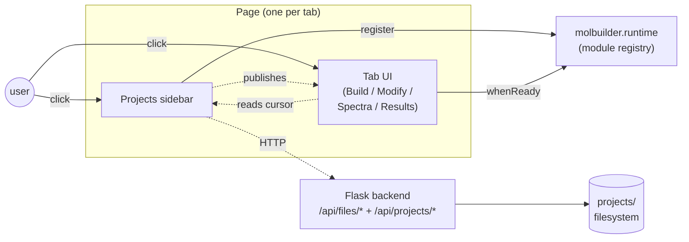
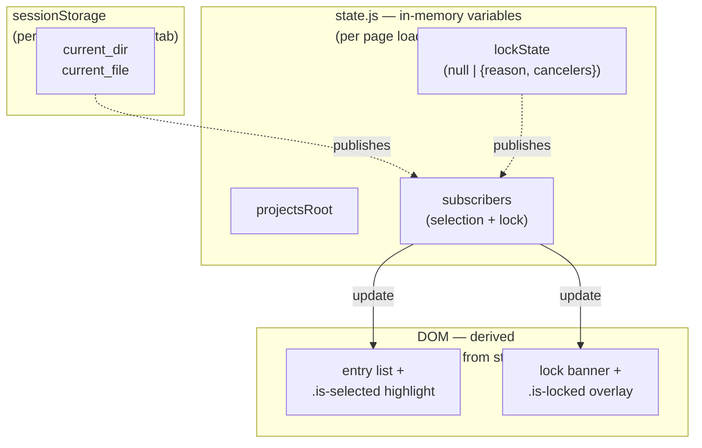
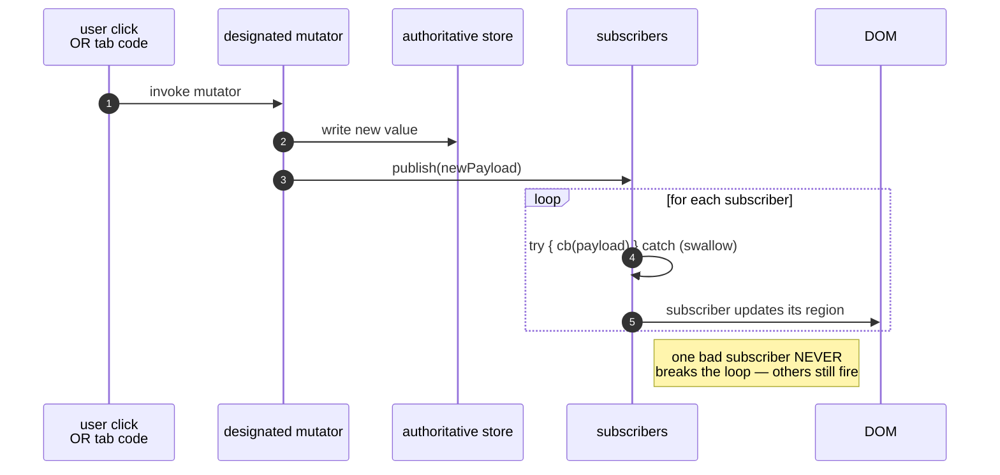
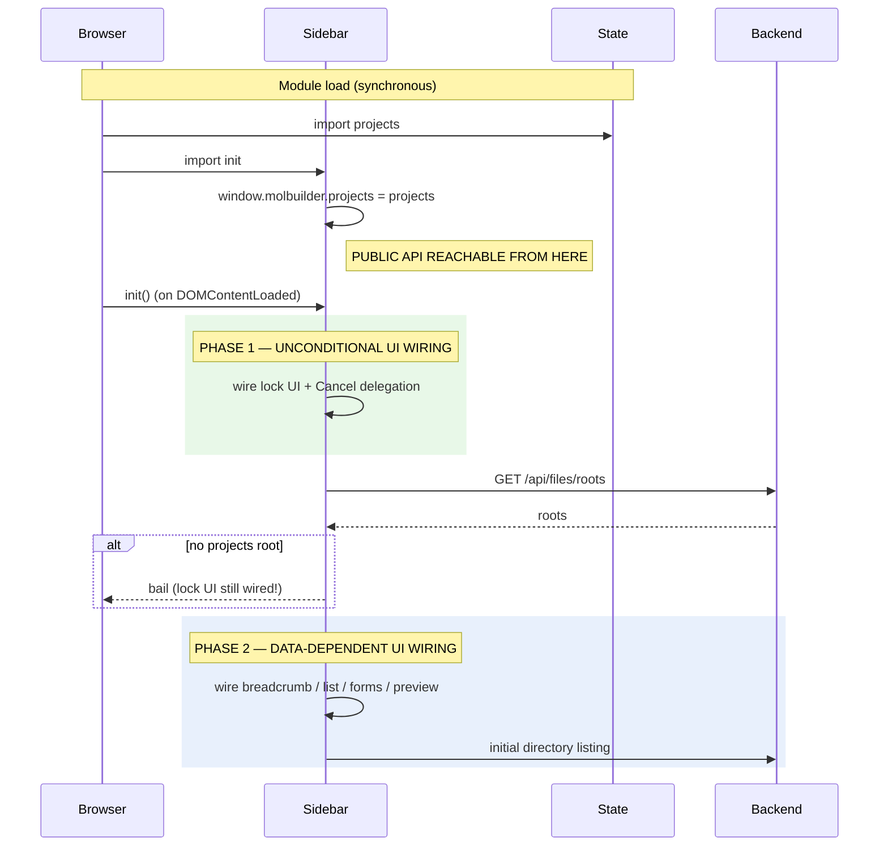
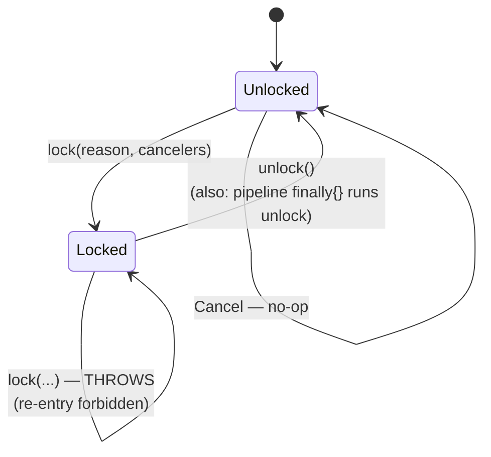

# Projects sidebar — architectural design

**Status**: design reference.  Defines the target architecture — the
mission, principles, capabilities, lifecycle, failure-mode coverage —
that the sidebar should embody.  Current code is transitional; the
migration plan from current shape to designed shape lives in § 13.

When this doc and existing code disagree, **the doc wins** until a
deliberate design change updates the doc.  Code changes are reviewed
against the doc, not against other code.

**Related design surfaces**:
* [`selection.md`](selection.md) — the selection-cursor contract; this
  doc references it for cursor semantics and tab integration history.
* [`web-api.md`](web-api.md) — backend endpoint envelope shapes.

---

## 1. Mission

A single, content-agnostic file browser pinned to the left of every
main tab.  It owns the user's notion of "where am I working" and
mediates every filesystem mutation that touches `projects/`.

**The sidebar is passive.**  It publishes; tabs subscribe.  It never
triggers a tab's loader, navigates between tabs, or knows which tab
consumes which file type.  Tabs read the cursor when they need to and
react to changes when they want to.

**The sidebar is scoped to `projects/`.**  Files outside that root
enter via upload; files leave only by being moved out of the tree
manually.  The picker has no concept of arbitrary filesystem
browsing.

---

## 2. Architectural principles

The six load-bearing rules.  Every design decision below traces to
one of these.

1. **One cursor pair.**  `(current_dir, current_file)` covers every
   v1 workflow.  Multi-slot cursors (`input_structure`,
   `compare_file`, …) are a future extension only when a real
   multi-input workflow earns it.  See [selection.md § 7](selection.md).

2. **Pull, don't push.**  The sidebar exposes inquire-and-subscribe
   APIs; tabs read what they need when they need it.  The sidebar
   never reaches into a tab.  Adding a new tab is zero sidebar code.

3. **State is authoritative; DOM is derived.**  Cursor lives in
   sessionStorage.  Lock + projects-root + subscribers live in
   in-memory variables.  DOM is a function of state — rebuilt from
   subscribers when state changes.  Never the other way around.

4. **Mutators publish.**  Every state mutation goes through a
   designated function that writes the store AND fires subscribers.
   No mutation skips the publish; no DOM update happens without a
   state event behind it.

5. **UI wiring decouples from data wiring.**  Anything that must
   work regardless of project-root state — lock UI, future
   diagnostics, future cross-tab listener — wires unconditionally
   at module load.  Anything that has no meaning without a project
   root wires only after `apiRoots()` resolves.  The two phases
   must not share an `init()` step.

6. **Uniform envelopes; no thrown errors at the public surface.**
   Every async public method returns `{ok: true, ...}` or
   `{ok: false, error}` (or `null` for documented no-ops).  Tabs
   NEVER need `try/catch`.  Every async public method also accepts
   an optional `AbortSignal` so a lock's Cancel button can abort
   anything in flight.

7. **The sidebar is a view onto a remote filesystem.**  The user is
   typically running molbuilder on a workstation or cluster while
   driving the UI from a laptop browser.  Every operation — list,
   read, write, mkdir, upload, download, delete, rename — crosses
   a network.  The design treats backend calls as latency-bounded
   (not instant), interruptible (cancellable mid-flight), and
   independently failable (per-call envelope).  Local browser
   state is an **eventually-consistent view** of remote truth: the
   disk is authoritative; the browser caches a snapshot.  Refresh
   is a first-class capability, not a workaround for stale state.

---

## 3. Where the sidebar sits

Tabs and the sidebar live in the same page; the sidebar exposes a
global API (`window.molbuilder.projects.*`) and registers itself in
the runtime module registry so tab JS can `whenReady("projects")`
instead of polling.  The backend is the source of truth for what's
on disk; the sidebar holds a current cursor + a cache of one
directory listing at a time.

---

## 4. State model

The sidebar holds exactly three things.

### 4.1 Cursor

Where the user is looking.  Two slots, always coherent:

* **`current_dir`** — the directory being shown.  Always inside the
  resolved root.
* **`current_file`** — the highlighted file, or empty when only
  browsing.

Lives in `sessionStorage` so it survives reloads within a tab.  Set
exclusively by the cursor mutator; mutation fires `onChange`.

### 4.2 Resolved root

The absolute path of the project tree the backend is serving (e.g.
`/home/.../projects`).  Resolved once at init by asking the
backend; immutable thereafter for the page's lifetime.

Empty before init; non-empty after.  Tabs that need it early use
the runtime registry's `whenReady("projects")` instead of polling.

### 4.3 Lock state

`null` (unlocked) OR `{reason, cancelers}` (a multi-step pipeline is
in progress).  Mutated only via `lock()` / `unlock()`; mutation
fires `onLockChange`.  Re-entry forbidden: a second `lock()` while
held throws.

**DOM is derived from state.**  Every visual update traces back to a
state mutation that published a change.

### 4.4 Sync model — local browser ↔ remote filesystem

The sidebar's three pieces of state are all **local browser memory**.
They are NOT the source of truth — the remote filesystem is.  The
relationship:

| Browser holds | Remote disk holds | How they stay aligned |
|---|---|---|
| Cursor (where the user is looking) | nothing — purely UI | Cursor changes are local-only until they trigger a read. |
| Resolved root | The actual `projects/` path | Resolved once at init via `/api/files/roots`.  Doesn't change. |
| Lock state | nothing — purely client-side | Lock is per-browser-tab.  Concurrent tabs each hold their own lock; the backend doesn't enforce mutual exclusion. |
| Listing snapshot (in the DOM) | The directory's current contents | Snapshot taken at `openDir` time.  Goes stale silently if the remote changes.  Refreshed by user action or by `writeFile`'s auto-refresh after a successful write to the current dir. |

**Consequence**: any read-then-write operation must assume the read
may be stale.  The design uses `expected_mtime` to detect concurrent
edits at write time (409 on mismatch).  The user resolves by
re-reading.  No optimistic conflict resolution.

**Consequence**: every multi-step pipeline that depends on the cursor
must read the cursor ONCE at the start and pass that snapshot to all
subsequent steps.  Re-reading mid-pipeline lets the user's
navigation between steps silently retarget downstream work.  This is
why the lock model exists (§ 8).

---

## 5. Capabilities (what tabs can do)

The sidebar is the user's window into a remote workspace.  Every
capability below is mediated by HTTP; latency, partial failure, and
cancellation are first-class concerns.  Each capability bucket lists
the operations it covers — exact method signatures live in the code
and stabilise as the design finalises.

### 5.1 Capability buckets

| # | Capability | Operations | Local/remote crossing |
|---|---|---|---|
| **C1** | **Read the cursor + sidebar state** | Where am I (`getCurrentDir`).  What's selected (`getCurrentFile`).  What's the resolved root (`getProjectsRoot`).  Am I at the root (`atRoot`).  Path display helper (`relativeToProjects`).  Is a lock held (`isLocked`, `getLockReason`). | Synchronous; no network.  All cached in browser memory. |
| **C2** | **Subscribe to state changes** | Cursor changes (`onChange`).  Lock changes (`onLockChange`).  Connection / root resolution (`onProjectsRootResolved` or via `runtime.whenReady`). | No network on subscribe; events fire when local state updates. |
| **C3** | **Read file content** | Text of the currently-selected file (`readCurrentFile`).  Text of any file by path (`readFile`).  Future: streamed binary download (`downloadFile`). | Network per call.  Text is size-capped; binary downloads stream. |
| **C4** | **Write file content** | Write to an exact path (`writeFile`).  Write into current dir (`saveToWorkspace`).  Both support `expected_mtime` for concurrent-edit detection (409 on conflict). | Network per call.  Atomic on backend (temp + rename); browser sees success or no-op. |
| **C5** | **Filesystem layout operations** | Create a project skeleton (`createProject`).  Create a subdirectory (`mkdir`).  Delete an entry (`deleteEntry`, with `recursive` flag for non-empty dirs).  Rename an entry (`rename`). | Network per call.  All envelope-returning. |
| **C6** | **Local ↔ remote transfer** | Upload from laptop to remote workspace (`upload`, multipart).  Download from remote to laptop (`downloadFile`, browser-driven save).  Refresh the sidebar's view (`refresh`). | Network per call.  Upload + download may be slow; both must be cancellable.  Browser File API on the user side. |
| **C7** | **Navigate** | Drill the sidebar into an arbitrary directory path (`navigateTo`).  Used by tabs that want to focus the sidebar on the workspace they just created. | Triggers a list call; network. |
| **C8** | **Acquire / release / cancel the lock** | Begin a multi-step pipeline (`lock(reason, cancelers)`).  Release (`unlock`).  Cancel button hook (`cancelLockedOperation` — usually wired automatically). | No network; pure local coordination. |

**All capabilities are reachable from `window.molbuilder.projects.*`.**
Every async operation accepts an optional `{signal: AbortSignal}`.
Every async operation returns the uniform `{ok, ...}` envelope or
the documented `null` for no-op cases.

### 5.2 Distinction between similar-looking operations

When two operations look like they overlap, the design makes a
deliberate choice between them:

| Use this | NOT this | Distinction |
|---|---|---|
| `saveToWorkspace(text, name)` | `writeFile(path, text)` | `saveToWorkspace` writes into the user's current cursor dir + is a no-op at root.  `writeFile` writes to an exact path the caller already computed.  Generator tabs use `saveToWorkspace`; programmatic flows use `writeFile`. |
| `readCurrentFile()` | `readFile(path)` | `readCurrentFile` is the common case (preview, "load what's selected").  `readFile` is for explicit-path reads from tab code. |
| `downloadFile(path)` | `readFile(path)` + `Blob` ceremony | `downloadFile` produces a browser-driven save dialog with the right filename; `readFile` returns text for in-app use. |
| `upload(targetDir, file)` | `writeFile(path, text)` | Upload accepts arbitrary binary via multipart; write is text-only.  Upload's target is a directory; write's target is a full path. |
| `lock()` + multi-step pipeline | One lock-free composite call | Multi-step crossings can fail per step; locking + per-step `AbortSignal` make recovery clean.  One mega-endpoint that does three things hides failure modes. |

### 5.3 Capability boundaries

Things tabs explicitly **cannot** do via the sidebar.  Each is a
deliberate design choice traced to a principle.

| Cannot | Why |
|---|---|
| Browse outside `projects/` | Mission scope (§ 1).  Files outside come in via `upload`. |
| Multi-file selection | Principle 1: one cursor pair.  Adding multi-slot is a design change. |
| Per-tab state | Cursor is one slot, shared by all tabs on the page. |
| Tab-aware behaviour | Principle 2: pull, don't push.  Sidebar has no notion of which tab is active. |
| Persist a lock across page reload | Lock is per-page-load.  Reloading abandons the in-progress pipeline (the lock disappears with the closure).  Future workflow that needs durable locks would need server-side coordination — see M12. |
| Concurrent locks (nested or parallel) | One lock at a time.  Principle: serialise pipelines, don't interleave. |
| Force-write past a concurrent edit (no `expected_mtime`) | Possible (`overwrite: true`) but the contract requires explicit opt-in.  Default rejects on conflict. |
| Compare across projects, search the tree, batch operations | Future capabilities.  Add them to this list with a design when needed. |

If a future workflow needs one of these, propose a design change to
this doc first.  Do not back-door it through `localStorage` or
custom DOM events.

---

## 6. Subscribe model

The contract for every subscriber API on the sidebar:

Three load-bearing properties:

* **Fire-once-immediately on register.**  Every subscribe API calls
  the new callback synchronously with the current state.  Removes
  the "subscribed too late, missed the first event" trap; lets
  subscribers initialise without a separate `getCurrent*()` call.
* **Per-subscriber error isolation.**  The publish loop wraps each
  callback in try/catch.  A throwing subscriber doesn't break the
  rest and never affects lock or cursor state.
* **Unsubscribe returns a closure.**  Subscribers that outlive the
  page can stop receiving events.  Subscribers tied to the page's
  lifetime may discard the closure (and usually do).

---

## 7. Lifecycle

### 7.1 Two-phase init

### 7.2 The load-bearing rule

> **UI wiring that must work regardless of project-root state belongs
> in Phase 1.  UI wiring that genuinely needs the project-listing
> data belongs in Phase 2.**

Phase 1 wiring: lock UI, future cross-tab listener, future
diagnostics.  Phase 2 wiring: entry list, breadcrumb, create-forms,
preview modal.

**When in doubt, default to Phase 1.**  The cost of wiring
unconditionally is one extra DOM lookup per page load.  The cost of
gating on data that doesn't arrive is a silent UI failure with no
errors — the bug class we keep hitting.

---

## 8. Lock model

### 8.1 Why

Multi-step save pipelines (Build's "Save FDF" emits the .fdf, copies
pseudos, drops the wrapper) read `current_dir` at each step.  Without
a lock, the user can re-navigate the sidebar between steps and
silently retarget downstream steps to a different directory.  The
lock blocks navigation visually + functionally for the pipeline's
duration.

### 8.2 Three-layer recovery (independent; do not collapse)

| Layer | Mechanism | Triggers when |
|---|---|---|
| **A** — `try/finally` | Release on success AND on throw | Pipeline completes (normally or by exception) |
| **B** — AbortSignal threaded through every async call | Bounds network duration; cancellable | A hung backend; user-triggered cancel via layer C |
| **C** — Cancel button in banner | Runs registered cancelers | A + B both failed (bug or backend deadlock); user wants out |

The independence matters: a bug in any one layer doesn't strand the
sidebar.  Forgotten `finally` → Cancel still works.  Backend hang →
Cancel triggers abort → fetch rejects → `finally` runs → unlock.
Canceler throws → caught per-canceler; lock state unaffected; user
can still click Cancel again or wait for natural unlock.

**Layer B applies to every async call inside the lock window —
including the workspace-write step.**  No "first step is special".

### 8.3 State machine

### 8.4 Visual contract

While locked, the sidebar fades every direct child except the
banner + header, sets `pointer-events: none` on them, and the banner
stays fully interactive so Cancel is always reachable.  Header keeps
full opacity as a visual anchor; any future header controls are
locked automatically because they inherit the disabled pointer
events.

---

## 9. Visibility model

### 9.1 The trap (and the rule we follow because of it)

The browser's `[hidden] { display: none }` rule and any author
`.foo { display: <non-none> }` rule have the **same specificity**.
On a tie, author CSS wins by cascade order.  An element with
`class="foo"` AND `hidden=""` is rendered VISIBLE despite the
attribute.

**Today's rule**: every author `display:` rule on a class whose
element may carry `hidden` MUST be paired with a `.foo[hidden]
{ display: none }` guard.  Higher specificity wins the tie.

### 9.2 Design direction

The current pattern is fragile — it requires every CSS contributor
to remember the guard rule and every reviewer to check for it.  The
design's end state is:

* One global helper class — `.is-hidden { display: none !important }`.
* HTML `hidden=` is banned in sidebar templates; replaced by
  `class="is-hidden"` toggled via a tiny `setVisible(el, bool)`
  helper.
* A CI grep flags any new use of `hidden=` so the bug class can't
  re-enter.

Until that migration completes, the guard rule (§ 9.1) is the
contract.

---

## 10. Visual states

The conceptual UI states the design recognises.  Every state must
be reachable from a known state mutation; no state may appear
"because of CSS alone".

| State | When | What the user sees |
|---|---|---|
| **Idle** | Page load, cursor unset | Breadcrumb at root; project list; "no file selected" |
| **Browsing** | After navigating | Breadcrumb shows path; entries for that dir |
| **File selected** | After clicking a file | Highlight on entry; "Selected: <name>" status |
| **Empty directory** | Dir has no children | Empty list area with a `.is-empty` modifier |
| **Listing error** | Backend returned `{ok:false}` | Inline error row in the list; cursor reset to the attempted path |
| **Locked** | A pipeline holds the lock | Sidebar contents faded + non-interactive; banner with reason + Cancel |
| **No project root** | Init's `apiRoots` returned empty | List replaced with a "no roots configured" message; lock UI still functional |
| **Preview open** | User clicked preview on a file | Modal over the page; closes on ESC / backdrop / button |
| **Form open** | User expanded a creation section | Form visible with context label; submits navigate the sidebar |
| **Form error** | Backend rejected the form submit | Inline error verbatim; form keeps its current value for retry |

---

## 11. Failure modes

Every failure the design anticipates and how it should be handled.
"Should" — not necessarily "does today".  Failures group by source:
network / backend / concurrency / user-action / browser-platform.

### 11.1 Network + backend

| Failure | Design response |
|---|---|
| Backend down at init (`/api/files/roots` 5xx or unreachable) | Sidebar shows "no roots configured" + offline indicator.  Lock UI works (Principle 5).  All public-API calls return `{ok:false, error}`.  No exceptions reach tab code. |
| Backend down mid-session | Next `apiX` call returns `{ok:false, error}`.  Sidebar stays usable (last-known listing visible); next refresh surfaces the error.  No exceptions reach tab code. |
| Slow network (high latency, request taking seconds) | Per-call timeout policy: write/upload/delete are user-driven and may take as long as the lock; navigation calls (list/stat/read) have a generous default cap.  All calls cancellable via `AbortSignal`. |
| Connection drops mid-transfer (upload / download) | Per-call envelope returns `{ok:false, error:"network interrupted"}`.  The user sees the failure inline; the partial state on the server depends on the endpoint (writes are atomic via temp+rename; uploads MAY leave a partial — backend cleans up).  No retry by the sidebar; explicit re-action by the user. |
| HTTP returned non-JSON (proxy intercept, captive portal, browser interstitial) | Wrapper synthesises `{ok:false, error: "<status / message>"}`.  Never throws. |
| Backend returned `401 / 403` (auth failure / session expired) | Treated as `{ok:false, error}`.  The error message carries the auth status; tabs may surface a "re-login" UI but the sidebar itself does not navigate or modal-prompt. |
| Backend returned `429` (rate-limited) | Same envelope; the error includes the `Retry-After` if present.  Sidebar does not auto-retry. |
| CORS / origin mismatch | Same envelope.  Caught at the network layer; the user sees the inline error and reads the docs. |

### 11.2 Concurrency + sync (the remote-truth consequences)

| Failure | Design response |
|---|---|
| Two browser tabs in the same project drift apart on cursor | Each tab holds its own sessionStorage cursor.  The design includes a `storage` event listener so navigation in tab A reflects in tab B (M6); cross-tab sync is bidirectional. |
| Two tabs both start a save pipeline | Each holds its own lock independently — the backend doesn't enforce mutual exclusion.  Both pipelines proceed; the second's `expected_mtime` check (if used) catches the conflict on the write step. |
| File deleted on remote between list and read | Read returns 404 → `{ok:false, error}`.  Sidebar's next refresh removes the entry.  No silent disappearance. |
| File modified on remote since the cursor was set | Read returns the new content (no version pin on reads).  Write with `expected_mtime` returns 409.  Write without `expected_mtime` succeeds — caller opted in to "last writer wins". |
| Concurrent edits in two tabs of the same file | Detected at write time via `expected_mtime`.  The second writer gets 409 + the actual server mtime in the response; the user re-reads and retries. |
| Long-running remote operation (e.g. SIESTA writing the .out) holds an exclusive lock or POSIX lock | Reads of the file may return partial or zero bytes depending on the OS.  Backend returns success with whatever it could read.  This is OS behaviour, not a sidebar concern. |
| Lock held by tab A; user opens tab B and starts a pipeline | Tab B gets its own lock (locks are per-page-load).  Both pipelines run; conflicts surface as 409 on `expected_mtime` mismatches at write time. |
| Cursor points at a directory that was deleted on remote | Next list call fails with `{ok:false, error}`.  Sidebar surfaces the error inline; user navigates up via breadcrumb. |

### 11.3 User-driven cancel + race

| Failure | Design response |
|---|---|
| User clicks Cancel during step N of a save pipeline | The lock's cancelers fire `abort()`; every in-flight `apiX` with the shared `AbortSignal` rejects with `AbortError`; the pipeline's `finally` runs `unlock`; sidebar returns to idle.  Per-step coverage matters — Layer B (§ 8.2) is uniform across all steps including the first write. |
| User clicks Cancel when no lock is held | No-op.  Documented behaviour.  The Cancel button is normally hidden when unlocked; the API tolerates a stale click. |
| User navigates during a lock | Visually impossible: `.is-locked` CSS sets `pointer-events: none` on every direct child except the banner.  No state mutation occurs. |
| Rapid double-click on a directory entry | Per-navigation `AbortController`: clicking a second directory aborts the first listing.  Last click wins; partial UI never renders.  No double-list. |
| Reentry: `lock()` while already locked | Throws.  Intentional fail-fast — nested locks tangle Cancel semantics.  Pipelines compose into one outer lock or sequence with unlock between. |
| Subscriber callback throws | Caught per-subscriber.  Other subscribers still fire.  Lock + cursor state unchanged. |

### 11.4 Browser-platform edge cases

| Failure | Design response |
|---|---|
| Subscriber registered after a state change | Initial-fire-on-register means the subscriber gets the current state immediately; the "missed event" trap is structurally impossible. |
| Page reloaded mid-lock | Lock is per-page-load.  Reloading abandons the in-progress pipeline (the closure dies with the page).  The backend operation may complete or partial-complete; the sidebar shows no special "you were in a lock" state.  Durable cross-reload locks would need backend coordination (M12, future). |
| Browser tab suspended (mobile, background tab) during a lock | `fetch` may pause; on resume, the call either completes or fails depending on connection.  Cancel button remains responsive (it's local-only).  No timeout from the sidebar side. |
| User selects "Block scripts" mid-session | Public-API calls fail at the `fetch` layer → `{ok:false, error}`.  The sidebar UI keeps showing the last good state; explicit refresh surfaces the failure. |
| `sessionStorage` write fails (quota, private-mode) | `setShared` falls back to in-memory state; cursor doesn't survive reload but the page continues to work.  Currently undetected; future hardening (M13). |
| User uploads a file larger than the backend's `MAX_CONTENT_LENGTH` | Backend returns 413; wrapper returns `{ok:false, error: "file too large"}`.  No partial upload. |
| Browser kills a slow `fetch` (Chrome's default ~5 min for hung requests) | The `AbortError` propagates the same as a user-cancel; pipeline `finally` cleans up. |

---

## 12. Backend contract (capability level)

The backend offers seven file-system primitives plus one
project-bootstrap operation.  All operate exclusively inside the
configured `projects/` root.

| Capability | HTTP shape | Notes |
|---|---|---|
| List a directory | `GET /api/files/list` | Optional extension filter |
| Read a file | `GET /api/files/read` | Size-capped; UTF-8 only; binary rejected |
| Stat a path | `GET /api/files/stat` | Single-path metadata |
| Write a file | `POST /api/files/write` | `expected_mtime` for edit-conflict detection |
| Create a directory | `POST /api/files/mkdir` | Depth-aware name validation |
| Upload a file | `POST /api/files/upload` | Multipart; 409 on conflict (no implicit overwrite) |
| Delete a path | `DELETE /api/files/delete` | Canonical-topic dirs protected; recursive flag required for non-empty |
| Bootstrap a project | `POST /api/projects/create` | Atomic; rolls back on partial failure |
| Rename a path | `POST /api/files/rename` | Designed; not yet built (gap M5) |

Every endpoint returns a uniform `{ok: true, …}` or `{ok: false,
error: string, …}` envelope.  HTTP status codes classify
(200 / 4xx / 5xx) but the body shape doesn't change.  Exact field
lists per endpoint live in [`web-api.md`](web-api.md).

---

## 13. Migration plan (current code → design)

The current code implements most of the design but with rough edges.
The migration items, ordered by impact.

### High impact (blocks the design's coverage of failure modes)

| ID | Drift | Migration |
|---|---|---|
| M1 | `apiWrite` / `saveToWorkspace` don't accept `AbortSignal`.  Layer B of the lock recovery doesn't cover the first step of save pipelines (the actual write). | Add `signal` to the `apiX` write surface; thread through `writeFile` / `saveToWorkspace`.  Update Build + Spectra save handlers to pass the lock's signal. |
| M2 | DOM updates in `list.js` (`_markSelected`, `_renderSelectionStatus`) are called inline from event handlers, not from `onChange` subscribers.  Violates Principle 3. | Introduce a single `renderSidebar(state)` subscribed to `onChange`; remove inline calls. |
| M3 | `apiRoots` / `apiList` / `apiStat` / `apiRead` / `apiMkdir` / `apiCreateProject` don't wrap network failures uniformly — they throw on network errors.  Violates Principle 6. | Wrap each in the same try/catch pattern `apiWrite` already uses; synthesise `{ok:false, error}`. |

### Medium impact (architectural completeness)

| ID | Drift | Migration |
|---|---|---|
| M4 | The public API doesn't expose `createProject`, `mkdir`, `upload`, `deleteEntry`, `rename`, `navigateTo`.  These exist as `forms.js` + `list.js` internals only.  Violates Capability C4. | Promote each to `window.molbuilder.projects.*`; keep internal helpers as the implementation. |
| M5 | Backend `rename` endpoint not built.  Capability C4 is incomplete. | Implement `POST /api/files/rename` against the existing path-safety + naming-rule helpers. |
| M6 | No cross-tab `storage` event listener.  Failure mode "two tabs in the same project" is unaddressed. | Add `window.addEventListener("storage", …)` in `state.js` that fires `publishSelectionChange` when cursor keys change. |
| M7 | Visibility relies on the case-by-case `[hidden]` guard pattern.  Brittle (one missed guard = silent bug). | Migrate to the `.is-hidden` class; ban `hidden=` in templates via CI; update the guard rule. |

### Low impact (cosmetic / future-proofing)

| ID | Drift | Migration |
|---|---|---|
| M8 | `setProjectsRoot` has no subscribers.  `onProjectsRootResolved` not on the public API; tabs that need root early use `runtime.whenReady("projects")` instead. | Either add an explicit subscribe API or document that tabs use the runtime registry; pick one and stick to it. |
| M9 | `refreshHandler` is a 1-slot register; multiple consumers would need their own wrapping. | Convert to a `Set` if/when a second consumer arrives. |
| M10 | Preview modal Save button is permanently disabled. | Either implement edit-and-save via the shipped `/api/files/write` endpoint or remove the button. |
| M11 | Internal naming inconsistency: `publishSelectionChange` (no prefix) vs `_publishLockChange` (underscore prefix). | Pick one convention (recommend underscore-prefix for all internal-publish functions) and apply across the module. |

### Open design questions (decide before coding)

| ID | Question | Notes |
|---|---|---|
| M12 | **Durable locks across page reload?** | Today: lock dies with the page.  Pro: a reload during a save pipeline currently leaves the user confused about whether the operation finished.  Con: durable locks need backend coordination + a "release expired lock" policy.  Probably defer until a real workflow needs it. |
| M13 | **`sessionStorage` write failure detection?** | Today: silent fallback to in-memory.  In private-browsing or quota-exhausted scenarios cursor doesn't survive reload.  Cheap fix: catch the `setItem` exception and degrade gracefully; surface a one-time warning. |
| M14 | **Download UX**: in-tab progress vs browser-native? | C6 lists `downloadFile`.  Architecturally: streaming download with progress (vs `<a download>` with browser-native chrome).  Pros/cons not yet weighed; defer until first concrete use case. |
| M15 | **Per-operation timeouts**: configurable vs fixed? | Today: no explicit timeouts beyond the browser's default `fetch` timeout (~5 min).  Question: should writes/uploads/deletes have user-visible "still running" indicators after N seconds?  Tied to the lock banner's bob animation but not exposed in the public API yet. |

---

## 14. Testing strategy

The design's testing principles:

* **Backend endpoints** — pin envelope shape, status code, path-safety,
  naming-rule outcomes.  Flask test client; no browser.
* **Public-API behaviour** — pin the contract every tab depends on:
  uniform envelopes, fire-once-immediately subscribers, lock state
  machine transitions, AbortSignal propagation through every async
  method.  Playwright + `page.evaluate`.
* **Rendered visibility** — pin `getComputedStyle(el).display`, not
  just `el.classList.contains(...)`.  Catches the § 9.1 specificity
  trap directly.
* **Failure-mode coverage** — for each row in § 11, at least one
  test that triggers the failure and asserts the design response.

When adding a new sidebar feature: the test file already exists for
the layer the feature lives in.  Add tests there in the same commit.
Reviewers reject feature commits without the matching test diff.

---

## 15. Anti-patterns (architectural)

The patterns that consistently produce bugs and have no acceptable
use case in the sidebar.

| Anti-pattern | Why it's banned |
|---|---|
| **UI wiring inside data-dependent init** | Silent "click does nothing" bugs when the data path fails.  Violates Principle 5. |
| **Author `display:` rule without `[hidden]` guard** | Same-specificity tie loses to UA stylesheet.  Element renders visible despite `hidden`.  Multi-site bug class.  Violates Principle 9. |
| **Reading another module's closure state directly** | Breaks module ownership.  Hides the dependency from imports.  Use the exported API. |
| **Tab-specific knowledge in the sidebar** | Sidebar is content-agnostic.  Hardcoded extension-to-tab maps reintroduce the coupling we deliberately removed (see [selection.md § 8](selection.md)). |
| **Per-tab auto-load on `DOMContentLoaded`** | Races user clicks.  Implicit action without consent.  Explicit pull (button) instead. |
| **Reentrant `lock()`** | Tangles Cancel semantics — whose cancelers do we run?  Compose into one outer lock; sequence with unlock between if you must. |
| **DOM updates from event handlers when a publish event could drive a subscriber** | Hand-coordinated DOM updates drift from state.  Violates Principle 3. |
| **Pointing the sidebar at a path outside `projects/`** | Out of scope — files outside come via upload.  Mission boundary. |
| **Triggering a tab's loader from sidebar code** | Sidebar is passive — push violates Principle 2. |
| **Throwing from a public async method** | Tab code never knows to `try/catch`.  Violates Principle 6. |

---

## 16. Change protocol

If you discover a code-vs-design drift not already in § 13: add it to
§ 13 in the same commit.  Don't silently align the doc to buggy code,
and don't silently align the code to a stale doc.  Decide which is
right, then update both.
