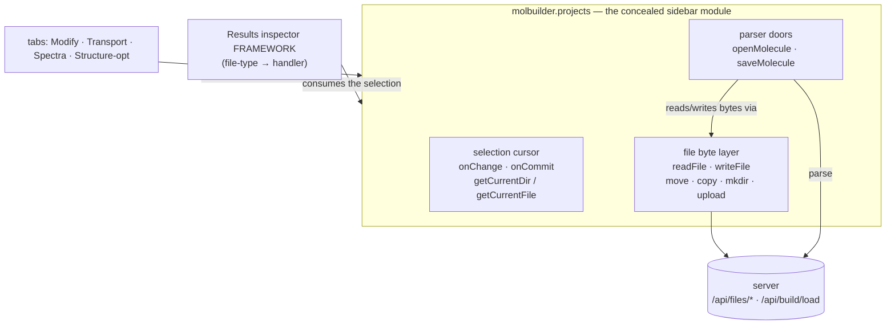
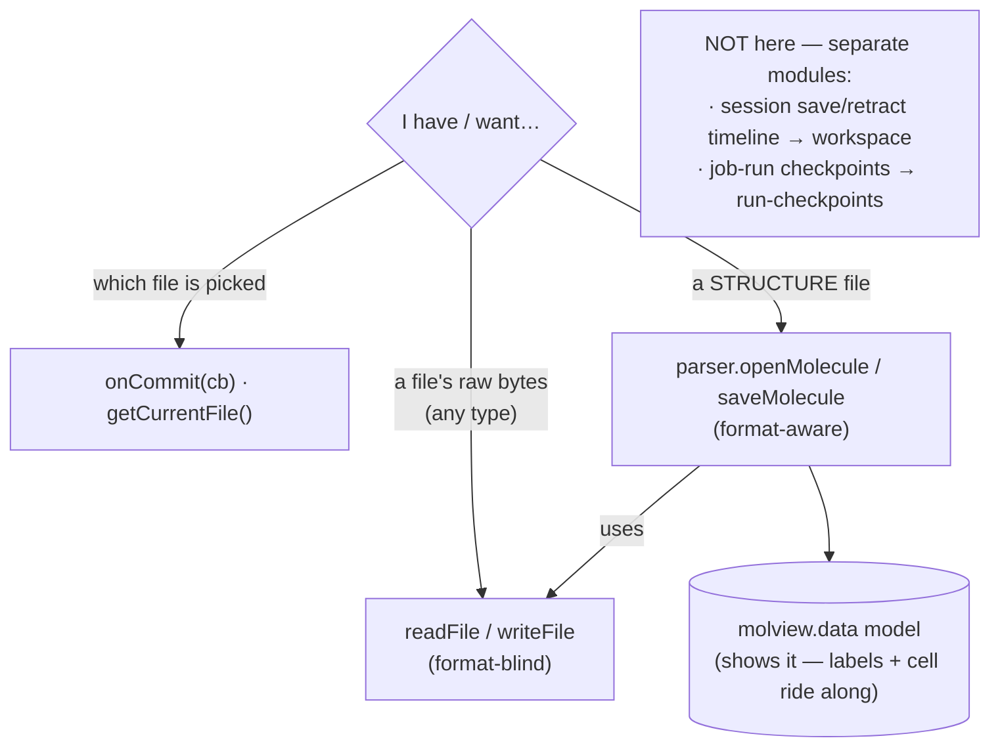
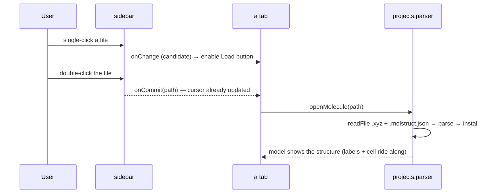
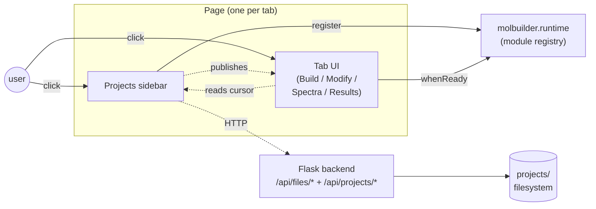
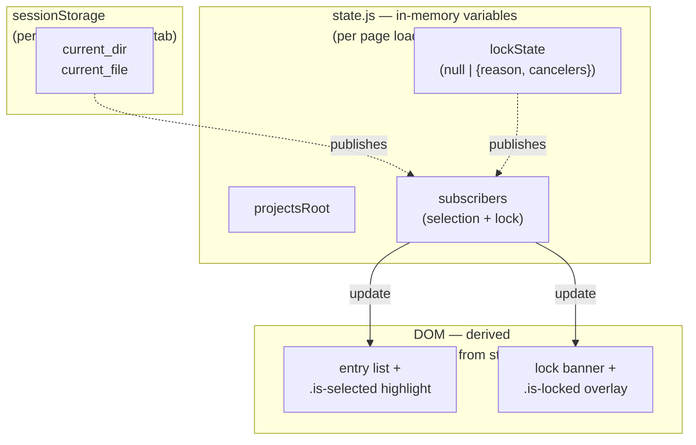
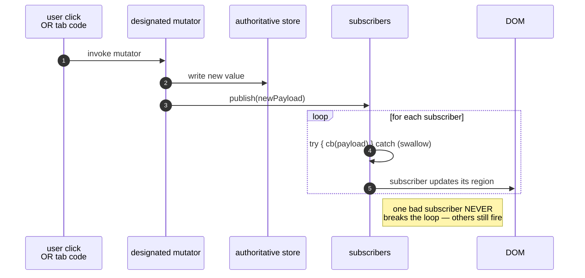
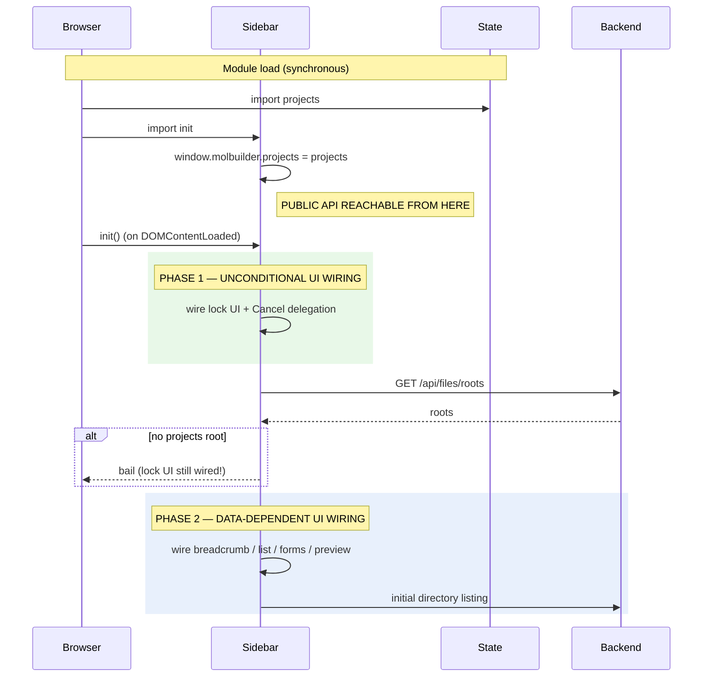
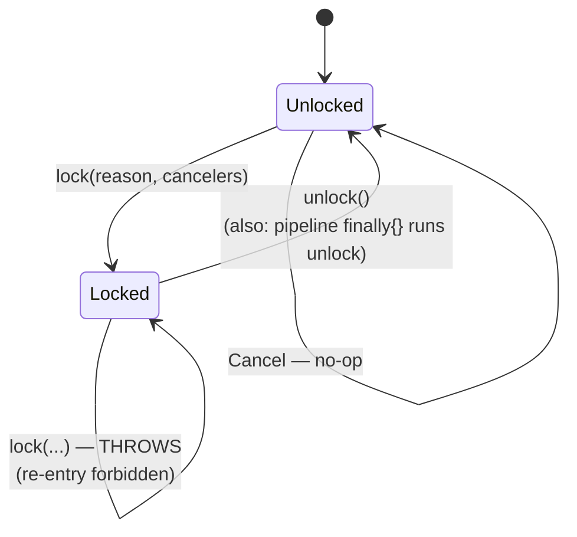
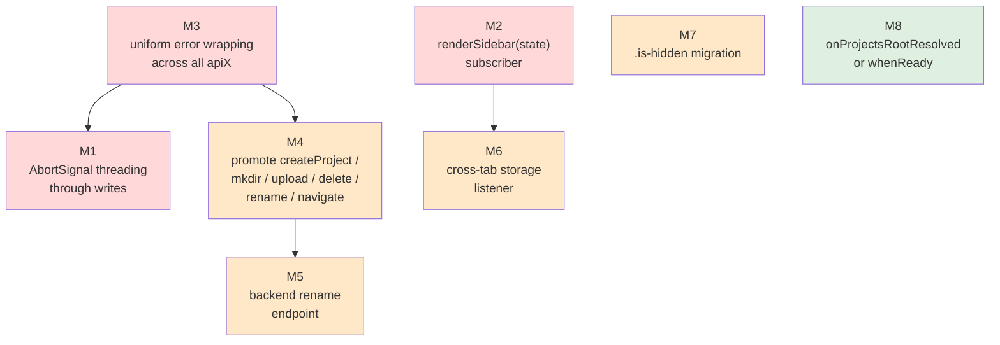
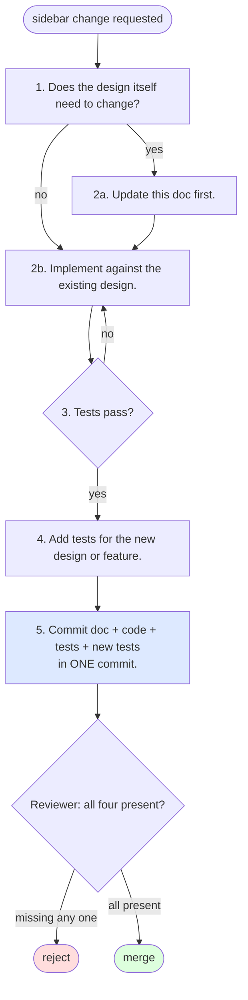

# Projects sidebar — module MASTER + architectural design

**Status**: design reference.  Defines the target architecture — the
mission, principles, capabilities, lifecycle, failure-mode coverage —
that the sidebar should embody.  Current code is transitional; the
migration plan from current shape to designed shape lives in § 13.

When this doc and existing code disagree, **the doc wins** until a
deliberate design change updates the doc.  Code changes are reviewed
against the doc, not against other code.

## This is THE MASTER for the Projects Sidebar module

The **Projects Sidebar** is a fully **concealed, publicly-exposed
module** — `window.molbuilder.projects.*` — that backs the whole
app's file handling.  This document is the **master**: it presents the
mission, the one public API surface, and the internal architecture,
and it owns two aspects directly (byte I/O + paths in § 5, the lock
model in § 8).  Every *other* aspect is a **single-source-of-truth
contract** in its own doc, indexed in § 0.2 below.  The master
**references** those aspects — it does not duplicate them.  Each fact
has exactly ONE home.

**Mental model (the plain-language on-ramp).**  The sidebar is a
**cursor over the `projects/` directory**: it tracks *which directory
you're in* (`current_dir`) and *which file is picked* (`current_file`),
and it exposes filesystem operations (read / write / mkdir / upload /
rename / …) scoped to that tree.  Tabs never poke the sidebar's DOM —
they call the `window.molbuilder.projects.*` API and **subscribe** to
changes.  The single rule to internalise:

> **single-click = _preview_ (a candidate) → `onChange`;
> double-click = _commit_ (open/load it) → `onCommit`.**

A tab that "loads the selected structure" listens to `onCommit`, not
`onChange`.  `onChange` reflects the current *candidate* (e.g. enabling
a Load button); `onCommit` is the discrete "the user chose this — act
on it".

## At a glance — the module in three pictures

New here?  These three pictures are the whole module; the dense contract is below.
This friendly on-ramp is pitched at *newcomers* (it replaces the old standalone
`projects-sidebar-guide.md`).

**1 — What's *in* the module, and what merely *uses* it.**  The sidebar owns three
things: the **selection cursor**, the **file byte layer**, and the **structure
doors**.  Everything else — the tabs, the Results inspector framework — is a
*consumer* that reacts to the selection, **not** part of the module.



**2 — Which call do I make?**  Reach for the layer that matches what you have.  Raw
bytes of *any* file → the byte layer.  A *structure* (`.xyz` + its `.molstruct.json`
sidecar) → the parser doors (which use the byte layer under the hood).  Two whole
concerns live in **other** modules, not here.



**3 — What a click actually does.**  A single-click *previews* (a candidate); a
double-click *commits*.  A tab reflects the candidate (e.g. enables a Load button)
and acts on the commit.  Loading a structure funnels through the ONE door, which
reads both files and parses.



**The handful of rules a tab author must get right:**

1. **`onCommit` to *act*, `onChange` to *reflect*.**  Loading on every `onChange`
   fires on mere previews and causes re-render storms.
2. **`onChange` fires once immediately on subscribe; `onCommit` does not.**  An
   `onChange` handler must handle the current state on subscribe; `getCurrentFile()`
   is already updated when your `onCommit` handler runs.
3. **Loading on *mount* is different** — honor mount-restore: call
   `ws.mountRestoreTarget()` and defer if the workspace snapshot already owns that
   file, else you race the restore and clobber its state (the 2026-07 selection-loss
   bug).  See [`workspace-contract.md`](workspace-contract.md) § 4.5.
4. **Keep the unsubscribe fn** and call it on teardown; the **lock is
   per-page-load** (a reload abandons an in-progress pipeline).

```js
const projects = window.molbuilder.projects;
// reflect the candidate (enable a Load button when a structure is picked):
projects.onChange((sel) => { loadBtn.disabled = !isLoadable(sel && sel.file); });
// act when the user commits (double-click):
projects.onCommit((sel) => {
    if (isLoadable(sel.file)) projects.parser.openMolecule(sel.file);
});
```

---

**How to read this + its aspect docs.**  Skim § 0.1 (public API
cheat-sheet) and § 0.2 (aspect index) first — they tell you *which*
doc owns the contract you need.  Then use the § 0 table below to jump
to the master section for the concern you're working on.  When a
concern is owned by an aspect doc (selection semantics, the structure
doors, the Save panel, the sidebar UI + preview modal), follow the
cross-reference — the deep detail lives there, not here.

**Related design surfaces**:
* [`selection.md`](selection.md) — the selection-cursor contract; this
  doc references it for cursor semantics and tab integration history.
* [`web-api.md`](web-api.md) — backend endpoint envelope shapes.
* [`run-checkpoints.md`](run-checkpoints.md) — the checkpoint subsystem; § 6 is the sidebar run-history panel (`lib/projects/checkpoint.js`) that plugs into this sidebar.

---

## 0. How to read this doc

| If you are … | Start here |
|---|---|
| Writing a new tab and need to consume the sidebar | § 5 (capabilities), then § 5.4 (signatures), then § 6 (subscribe model) |
| Adding a public-API method | § 5 + § 5.4 + § 5.5 (concurrency), then § 6.2 (error contract) |
| Adding internal sidebar functionality | § 3.1 (internal modules), then § 7 (lifecycle), then § 15 (anti-patterns) |
| Designing a multi-step pipeline | § 4.4 (sync model), then § 8 (lock model), then § 7.3 (teardown) |
| Implementing a backend endpoint that the sidebar will call | § 12 (backend contract) + [`web-api.md`](web-api.md) for shapes |
| Looking for "why does it do X this way" | § 2 (principles) — every other section's choices trace here |
| Reviewing a PR against the sidebar | § 15 (anti-patterns) + § 16 (change protocol) |
| Just learning the codebase | § 1 → § 2 → § 3 → § 4 → § 5 in order |

---

## 0.1 The one public API surface

Everything a tab may call lives under `window.molbuilder.projects.*`
(plus the format-aware sub-namespace `window.molbuilder.projects.parser.*`).
This is the complete surface exported by `lib/projects/state.js` and
`lib/projects/parser.js` — grouped by role.  Exact signatures + return
shapes are in § 5.4 (the C1–C8 tables); this is the at-a-glance map.

**Selection & current-file tracking** — aspect A, semantics in
[`selection.md`](selection.md):

| Method | Role |
|---|---|
| `getCurrentDir()` / `getCurrentFile()` | read the cursor (sync) |
| `getProjectsRoot()` / `atRoot()` | resolved root / at-root predicate |
| `relativeToProjects(path)` | display-shorten a path |
| `onChange(cb)` | subscribe to candidate/preview changes (fires once on register) |
| `onCommit(cb)` | subscribe to commits (double-click); does NOT fire on register |
| `publishCommit(dir, file)` | publish a commit programmatically |
| `setShared(dir, file)` | cursor-only mutator (no re-list); lock-guarded |
| `navigateTo(absPath, opts)` | list a dir + move the cursor; lock-guarded |
| `refresh(opts)` | re-list the current dir |
| `onProjectsRootResolved(cb)` | one-shot fire when the root resolves |

**File byte I/O** — aspect B, owned by § 5 here (wire: [`web-api.md`](web-api.md) § 3):

| Method | Role |
|---|---|
| `readFile(path, opts)` | read a file's bytes as text |
| `readCurrentFile(opts)` | read the currently-selected file (`null` when none) |
| `readRange(path, offset, maxBytes, opts)` | read a byte window (negative offset = from EOF) |
| `writeFile(path, text\|Blob, opts)` | write to an exact path (Blob → upload route) |
| `saveToWorkspace(text, filename, opts)` | write into `current_dir/<filename>` (`null` at root) |
| `safeSave(text, filename, opts)` | Cancel-aware `saveToWorkspace` (§ 6.3) |
| `isCancelError(err)` | predicate for every cancel shape (§ 6.3) |

**Paths & directory layout** — aspect B (wire: [`web-api.md`](web-api.md) § 3):

| Method | Role |
|---|---|
| `createProject(name, opts)` | bootstrap a project skeleton |
| `mkdir(parent, name, opts)` | make a subdirectory |
| `deleteEntry(path, recursive, opts)` | delete a file or (recursive) dir |
| `rename(path, newName, opts)` | in-place basename change (sidecar-paired on `.xyz`/`.pdb`) |
| `move(path, destDir, opts)` | move a file (sidecar-paired) |
| `copy(path, destDir, opts)` | copy a file (sidecar-paired) |
| `upload(targetDir, file, opts)` | upload a `File` into a dir |

**Lifecycle — lock & concurrency** — aspect G, owned by § 8 here:

| Method | Role |
|---|---|
| `lock(reason, cancelers)` / `unlock()` | acquire / release the pipeline lock |
| `isLocked()` / `getLockReason()` | read lock state (sync) |
| `onLockChange(cb)` | subscribe to lock acquire/release |
| `cancelLockedOperation()` | run the registered cancelers (Cancel button hook) |

**The format-aware structure doors** — `window.molbuilder.projects.parser.*`,
aspect C, owned by [`structure-load-save-contract.md`](structure-load-save-contract.md):

| Method | Role |
|---|---|
| `parser.openMolecule(path, { confirmDiscard? })` | THE load door: read `.xyz` + paired `.molstruct.json` bytes → install into the model |
| `parser.saveMolecule(path, { overwrite? })` | THE save door: serialise the settled model → write geometry + sidecar |

> **ONE ownership story.**  File **bytes** are owned by `projects`
> (`readFile`/`writeFile` — format-blind, serve every tab).  Structure
> **doors** (bytes ↔ model ↔ sidecar) are owned by `projects.parser`
> (`openMolecule`/`saveMolecule` — format-aware).  Session **drafts**
> (crash-restore of opaque bytes) are owned by the **workspace**, NOT
> the sidebar — see [`workspace-contract.md`](workspace-contract.md).
> State it once; don't re-derive it per caller.

> **Deleted names.**  `molview.data.openProjectFile` /
> `saveProjectFile` / `readWorkingCopy` are **GONE**.  The doors are
> `projects.parser.openMolecule` / `saveMolecule` now; the model keeps
> only the install/serialise primitives
> (`molview.data.installMolecule` / `exportFile` / `markSaved`).  Any
> doc or code still referencing the old `molview.data` file methods is
> stale.

There is **no** `downloadFile` / `download` / `list` / `stat` method on
the public object.  Whole-file download is a direct
`GET /api/files/download` from the kebab menu (see
[`projects-sidebar-ui.md`](projects-sidebar-ui.md)); directory listings
come back from `navigateTo`; `stat` is internal to the preview modal.
`downloadFile` remains DEFERRED (§ 5.4 C3).

---

## 0.2 Aspect index

The module is decomposed into a master (this doc) + focused
single-source-of-truth aspect contracts.  Use this table to find the
authority for a given slice; do not duplicate an aspect's detail here.

| # | Aspect | Owns | Source-of-truth doc |
|---|---|---|---|
| **A** | **Selection & current-file tracking** | `onChange`/`onCommit`, `getCurrentDir`/`getCurrentFile`, single=preview vs double=commit, the tab contract | [`selection.md`](selection.md) |
| **B** | **File byte I/O + paths + directory structure** | `readFile`/`writeFile`/`readRange`, `move`/`copy`/`rename`/`deleteEntry`/`mkdir`/`createProject`/`upload`; `relativeToProjects`/`getProjectsRoot`/`atRoot`; `.xyz`↔`.molstruct.json` pairing | **this doc § 5** (JS surface) → [`web-api.md`](web-api.md) § 3 (wire) |
| **C** | **Structure load/save doors** | `parser.openMolecule`/`saveMolecule` (bytes ↔ model ↔ sidecar boundary) | [`structure-load-save-contract.md`](structure-load-save-contract.md) |
| **D** | **Save-panel UI** | button enablement, name dialog, overwrite confirm | [`save-flow.md`](save-flow.md) |
| **E** | **Sidebar UI + file-content preview** | tree / breadcrumb / mutation-bar / drawer / width-resize / filter + the **preview modal** (`lib/projects/preview.js` — CodeMirror view/edit/save, mtime-safe) | [`projects-sidebar-ui.md`](projects-sidebar-ui.md) |
| **G** | **Lock & concurrency** | the lock model | **this doc § 8** → [`web-api.md`](web-api.md) § 3.5 (wire view) |

> **Where's aspect F?**  The letters skip from E to G on purpose.  **F**
> was the inspector-dispatch aspect; it was reclassified as a
> **consumer** (the /results file-type → handler framework) and now
> lives in § 0.2.1 below, not as a sidebar aspect.

### 0.2.1 Consumers of the sidebar (referenced, NOT owned)

The sidebar publishes a selection; these modules *react* to it and
each own their own contract.  They are **consumers**, not sidebar
aspects:

* **Tabs** (Modify, Transport, Spectra, Structure-optimization) —
  subscribe to `onCommit` and call
  `projects.parser.openMolecule(path)` to load the pick.
* **Results inspector registry** (`lib/inspectors/`: `registry.js` +
  `structure`/`trajectory`/`source`/`markdown`/`spectra` handlers,
  used by `results/viewer.js` + `lib/results/file-picker.js`) — a
  **file-type → handler FRAMEWORK** that lives in the `/results` tab
  and dispatches the sidebar selection to the right viewer by file
  type.  Contract: [`inspector-registry.md`](inspector-registry.md).
  **NOTE the name collision:** this "inspector" is the /results
  file-type dispatcher — it is **NOT** the removed atom-selection
  "inspector" panel (which was merged into the MolView selection
  panel).

---

## 1. Mission

A single file browser pinned to the left of every main tab.  It owns
the user's notion of "where am I working" and mediates every
filesystem mutation that touches `projects/`.

**Two layers, one format-aware door.**  The **byte layer**
(`readFile` / `writeFile` and the layout ops) is genuinely
content-agnostic — it moves bytes and knows nothing about contents, so
it serves every tab equally.  The **`parser` sub-namespace**
(`projects.parser.openMolecule` / `saveMolecule`) is the ONE
format-aware door: it alone understands the `.xyz` ↔ `.molstruct.json`
structure pairing and the parse seam.  Content-awareness is confined to
that single door; everything else stays format-blind.

**The sidebar is passive.**  It publishes; tabs subscribe.  It never
triggers a tab's loader or navigates between tabs, and outside the
`parser` door it does not interpret which tab consumes which file type.
Tabs read the cursor when they need to and react to changes when they
want to.

**The sidebar is scoped to `projects/`.**  Files outside that root
enter via upload; files leave only by being moved out of the tree
manually.  The picker has no concept of arbitrary filesystem
browsing.

---

## 2. Architectural principles

The six load-bearing rules.  Every design decision below traces to
one of these.

1. **One cursor pair.**  `(current_dir, current_file)` covers every
   v1 workflow.  Multi-slot cursors (`input_structure`,
   `compare_file`, …) are a future extension only when a real
   multi-input workflow earns it.  See [selection.md § 7](selection.md).

2. **Pull, don't push.**  The sidebar exposes inquire-and-subscribe
   APIs; tabs read what they need when they need it.  The sidebar
   never reaches into a tab.  Adding a new tab is zero sidebar code.

3. **State is authoritative; DOM is derived.**  Cursor lives in
   sessionStorage.  Lock + projects-root + subscribers live in
   in-memory variables.  DOM is a function of state — rebuilt from
   subscribers when state changes.  Never the other way around.

4. **Mutators publish.**  Every state mutation goes through a
   designated function that writes the store AND fires subscribers.
   No mutation skips the publish; no DOM update happens without a
   state event behind it.

5. **UI wiring decouples from data wiring.**  Anything that must
   work regardless of project-root state — lock UI, future
   diagnostics, future cross-tab listener — wires unconditionally
   at module load.  Anything that has no meaning without a project
   root wires only after `apiRoots()` resolves.  The two phases
   must not share an `init()` step.

6. **Uniform envelopes; no thrown errors at the public surface.**
   Every async public method returns `{ok: true, ...}` or
   `{ok: false, error}` (or `null` for documented no-ops).  Tabs
   NEVER need `try/catch`.  Every async public method also accepts
   an optional `AbortSignal` so a lock's Cancel button can abort
   anything in flight.

7. **The sidebar is a view onto a remote filesystem.**  The user is
   typically running molbuilder on a workstation or cluster while
   driving the UI from a laptop browser.  Every operation — list,
   read, write, mkdir, upload, download, delete, rename — crosses
   a network.  The design treats backend calls as latency-bounded
   (not instant), interruptible (cancellable mid-flight), and
   independently failable (per-call envelope).  Local browser
   state is an **eventually-consistent view** of remote truth: the
   disk is authoritative; the browser caches a snapshot.  Refresh
   is a first-class capability, not a workaround for stale state.

---

## 3. Where the sidebar sits



Tabs and the sidebar live in the same page; the sidebar exposes a
global API (`window.molbuilder.projects.*`) and registers itself in
the runtime module registry so tab JS can `whenReady("projects")`
instead of polling.  The backend is the source of truth for what's
on disk; the sidebar holds a current cursor + a cache of one
directory listing at a time.

### 3.1 Internal module architecture

The sidebar itself is decomposed into eleven units (one HTML
partial + one stylesheet + one entry script + eight behaviour
modules under `projects/`).  Each owns a single concern; cross-
unit communication uses the unit's exported interface (never
closure-state reads).  An implementer assigns a new feature to one
unit; if it doesn't fit, the unit list is wrong, not the feature.

| Unit | Concern | Exports for OTHER units |
|---|---|---|
| **Template** (`_projects_sidebar.html`) | DOM structure (server-rendered partial) | The DOM contract: every element ID + class consumers may query.  See § 10. |
| **Stylesheet** (`projects-sidebar.css`) | Visual + visibility model.  Owns the `[hidden]` guard rules and the `.is-locked` overlay. | CSS classes + scope variables documented in § 10.  No JS. |
| **Entry** (`projects-sidebar.js`) | Bootstrap order — module load, public-API mount, two-phase init. | None.  Side-effect: `window.molbuilder.projects = …` + runtime registry registration. |
| **State** (`state.js`) | All three state pieces (§ 4) + the public API surface.  Owns subscriber sets + the publish loop.  Owns sessionStorage IO. | The `projects` object (public API surface, § 5); module-internal mutators for the bootstrap unit (`setProjectsRoot`, `setRefreshHandler`, `setNavigateToImpl`) and for the List unit (`setShared`).  `setNavigateToImpl(fn)` is how the bootstrap unit hands `list.js::openDir` to `state.js` so the public `projects.navigateTo` can delegate. |
| **HTTP** (`api.js`) | One-to-one wrappers over `/api/files/*` and `/api/projects/*`.  Owns request shape + envelope-wrapping discipline (Principle 6). | A function per backend endpoint.  Sole module that calls `fetch`. |
| **List** (`list.js`) | DOM rendering of breadcrumb + entry list; per-entry click handlers; navigation; lock-UI subscription + Cancel delegation. | `initList`, `initLockUI`, `openDir`, `restoreSelection` for the bootstrap unit.  `showPreview` is delegated to the Preview unit. |
| **Mutation bar** (`mutation-bar.js`) | Header action-bar wiring (New project / New folder / Upload buttons; renamed from `forms.js` after the v2 buttons-not-dropdown revision).  Subscribes to `onChange` to drive depth-aware button enablement.  Dialogs live in `dialogs.js`. | `initForms` for the bootstrap unit. |
| **Dialogs** (`dialogs.js`) | Modal `<dialog>` factory: `chooseName`, `chooseUploadFile`, `chooseDestinationDir`, `confirmDestructive`.  Single-instance + ESC-as-cancel.  No HTTP. | `chooseName`, `chooseUploadFile`, `chooseDestinationDir`, `confirmDestructive` (exports). |
| **Preview** (`preview.js`) | File-preview modal; ESC / backdrop close. | `initPreview`, `showPreview` for sidebar + List unit. |
| **Parser** (`parser.js`) | The format-aware **structure doors** — `openMolecule` / `saveMolecule` (aspect C).  Reads/writes bytes via State's `readFile`/`writeFile`; installs into / serialises from `molview.data` (looked up at call time — no import cycle).  Interprets the `.xyz` ↔ `.molstruct.json` pairing; parses nothing itself (the server applies the sidecar). | `parser` (mounted as `window.molbuilder.projects.parser` by the Entry unit). |
| **Checkpoint** (`checkpoint.js`) | The sidebar **run-history panel** (`#ps-checkpoint`) — a checkpoint-domain CONSUMER that subscribes to `onChange` and shows git-snapshot controls for a canonical run directory.  Spec: [`run-checkpoints.md`](run-checkpoints.md) § 6. | `initCheckpointPanel` for the bootstrap unit. |

**Module-boundary rule**: the only way one unit reads state owned by
another is through that unit's exported interface.  No `import {
lockState } from "./state.js"` — there is no such export.  A new
feature that requires a unit to expose internal state means the unit
boundary is wrong; revisit the table.

### 3.2 Bootstrap + runtime-registry contract

The sidebar declares itself ready to the `molbuilder.runtime` module
registry so other modules can wait on it instead of polling
`window.molbuilder.projects`.  Contract:

| Symbol | Type | Semantics |
|---|---|---|
| `window.molbuilder.runtime.register(name, value)` | `(string, any) => void` | Stores `value` under `name`.  Idempotent — re-register with the same name overwrites silently. |
| `window.molbuilder.runtime.whenReady(name)` | `(string) => Promise<value>` | Resolves with the registered value as soon as `register(name, …)` is called.  If already registered: resolves on next microtask.  Never rejects.  Caller's `await` never throws. |

The sidebar calls `register("projects", projects)` immediately after
mounting `window.molbuilder.projects` (module-load time, before
DOMContentLoaded).  Tab JS that needs the resolved projects-root path
during its own bootstrap does:

```js
const projects = await window.molbuilder.runtime.whenReady("projects");
// projects.getProjectsRoot() is "" if init's apiRoots() hasn't
// resolved yet; for tabs that need the root path specifically,
// subscribe via onProjectsRootResolved (see § 5.4).
```

If `molbuilder.runtime` is missing (e.g. the runtime module failed
to load), the sidebar continues to work — its registry call is a
guarded no-op.  Tabs that depend on `whenReady` then hang; this is
acceptable degradation (no silent wrong behaviour).

### 3.3 Transport abstraction

HTTP is the current transport.  The public API is **transport-
agnostic**: it never exposes `fetch` headers, response objects,
status codes, or URL paths.  All transport details are absorbed by
the HTTP unit (`api.js`), which is the sole place `fetch` is called
in the sidebar.

If a future transport change happens (WebSocket for live updates,
SSE for streaming, an offline IndexedDB cache layer), the public API
surface in § 5 does not change.  Only `api.js` changes.

### 3.4 Interaction with other molbuilder modules

The sidebar is content-agnostic but it lives inside a larger app
that has other modules.  The contracts:

| Module | Interaction | Direction |
|---|---|---|
| `molbuilder.runtime` | Sidebar registers; tabs `whenReady`. | Sidebar → registry (write); tabs → registry (read). |
| Tab UIs (Build, Modify, Spectra, Results) | Tabs subscribe to selection + lock; tabs call public API for read/write/save. | Tabs → sidebar (pull only).  Sidebar publishes; sidebar NEVER reaches into a tab. |
| `molbuilder.molview.data` (in-memory structure model) | The sidebar's `parser.js` door calls `installMolecule` / `exportFile` / `markSaved` on it to load/save structures.  Resolved by a CALL-TIME `window.molbuilder.molview.data` lookup, NOT a static import (the model is a classic script mounted on `window`; a static import would also invert the package dependency) — **no import cycle**. | Sidebar `parser` → model (call the install/serialise primitives).  The model owns no file endpoint. |
| `molbuilder.atomSelection.*` (Modify-tab atom store) | None.  Sidebar holds file cursor; atom selection is per-tab + per-file. | No coupling. |
| `molbuilder.inspectors.*` (Results-tab inspector registry) | Sidebar selection drives inspector dispatch via `onChange`. | Sidebar publishes; Results tab decides which inspector to mount. |
| `molbuilder.formSchema.*` (Build form rendering) | None.  Forms inside the sidebar (create-project, mkdir, upload) use their own template-driven rendering. | No coupling. |
| `molwatch.*` (Watch tab) | Sidebar may be used by Watch users to pick a project, but no direct module link. | Same as other tabs: pull-only via onChange. |

**Rule**: any new molbuilder module that interacts with the sidebar
adds a row to this table.  If the contract isn't documentable in
one sentence, the coupling is too tight — break it.

---

## 4. State model

The sidebar holds exactly three things.

### 4.1 Cursor

Where the user is looking.  Two slots, always coherent:

* **`current_dir`** — the directory being shown.  Always inside the
  resolved root.
* **`current_file`** — the highlighted file, or empty when only
  browsing.

Lives in `sessionStorage` so it survives reloads within a tab.  Set
exclusively by the cursor mutator; mutation fires `onChange`.

### 4.2 Resolved root

The absolute path of the project tree the backend is serving (e.g.
`/home/.../projects`).  Resolved once at init by asking the
backend; immutable thereafter for the page's lifetime.

Empty before init; non-empty after.  Tabs that need it early use
the runtime registry's `whenReady("projects")` instead of polling.

### 4.3 Lock state

`null` (unlocked) OR `{reason, cancelers}` (a multi-step pipeline is
in progress).  Mutated only via `lock()` / `unlock()`; mutation
fires `onLockChange`.  Re-entry forbidden: a second `lock()` while
held throws.



**DOM is derived from state.**  Every visual update traces back to a
state mutation that published a change.

### 4.4 Sync model — local browser ↔ remote filesystem

The sidebar's three pieces of state are all **local browser memory**.
They are NOT the source of truth — the remote filesystem is.  The
relationship:

| Browser holds | Remote disk holds | How they stay aligned |
|---|---|---|
| Cursor (where the user is looking) | nothing — purely UI | Cursor changes are local-only until they trigger a read. |
| Resolved root | The actual `projects/` path | Resolved once at init via `/api/files/roots`.  Doesn't change. |
| Lock state | nothing — purely client-side | Lock is per-browser-tab.  Concurrent tabs each hold their own lock; the backend doesn't enforce mutual exclusion. |
| Listing snapshot (in the DOM) | The directory's current contents | Snapshot taken at `openDir` time.  Goes stale silently if the remote changes.  Refreshed by user action or by `writeFile`'s auto-refresh after a successful write to the current dir. |

**Consequence**: any read-then-write operation must assume the read
may be stale.  The design uses `expected_mtime` to detect concurrent
edits at write time (409 on mismatch).  The user resolves by
re-reading.  No optimistic conflict resolution.

**Consequence**: every multi-step pipeline that depends on the cursor
must read the cursor ONCE at the start and pass that snapshot to all
subsequent steps.  Re-reading mid-pipeline lets the user's
navigation between steps silently retarget downstream work.  This is
why the lock model exists (§ 8).

---

## 5. Capabilities (what tabs can do)

The sidebar is the user's window into a remote workspace.  Every
capability below is mediated by HTTP; latency, partial failure, and
cancellation are first-class concerns.  Each capability bucket lists
the operations it covers — exact method signatures live in § 5.4.

> **This section is the aspect-B authority** (file byte I/O + paths +
> directory-layout ops).  It owns the **JS surface**; the **wire**
> shapes (routes, status codes, per-endpoint field lists) live in
> [`web-api.md`](web-api.md) § 3 — link there, do not re-table them
> here.  The format-aware **structure doors** (`parser.openMolecule` /
> `saveMolecule`) are a *different* aspect (C) — they orchestrate
> `readFile`/`writeFile` from this layer but their contract is
> [`structure-load-save-contract.md`](structure-load-save-contract.md),
> not this section.

### 5.1 Capability buckets

| # | Capability | Operations | Local/remote crossing |
|---|---|---|---|
| **C1** | **Read the cursor + sidebar state** | Where am I (`getCurrentDir`).  What's selected (`getCurrentFile`).  What's the resolved root (`getProjectsRoot`).  Am I at the root (`atRoot`).  Path display helper (`relativeToProjects`).  Is a lock held (`isLocked`, `getLockReason`). | Synchronous; no network.  All cached in browser memory. |
| **C2** | **Subscribe to state changes** | Cursor changes (`onChange`).  Lock changes (`onLockChange`).  Connection / root resolution (`onProjectsRootResolved` or via `runtime.whenReady`). | No network on subscribe; events fire when local state updates. |
| **C3** | **Read file content** | Text of the currently-selected file (`readCurrentFile`).  Text of any file by path (`readFile`).  A byte window of a file at an absolute or from-EOF offset (`readRange`).  Whole-file download ships as a direct `GET /api/files/download` (the kebab menu); a `downloadFile` JS wrapper is deferred. | Network per call.  Text is size-capped; range reads default 256 KB (16 MB cap); binary downloads stream. |
| **C4** | **Write file content** | Write to an exact path (`writeFile`).  Write into current dir (`saveToWorkspace`).  Both support `expected_mtime` for concurrent-edit detection (409 on conflict). | Network per call.  Atomic on backend (temp + rename); browser sees success or no-op. |
| **C5** | **Filesystem layout operations** | Create a project skeleton (`createProject`).  Create a subdirectory (`mkdir`).  Delete an entry (`deleteEntry`, with `recursive` flag for non-empty dirs).  Rename an entry (`rename`). | Network per call.  All envelope-returning. |
| **C6** | **Local ↔ remote transfer** | Upload from laptop to remote workspace (`upload`, multipart).  Download from remote to laptop ships as a direct `GET /api/files/download` (kebab); the `downloadFile` JS wrapper is deferred.  Refresh the sidebar's view (`refresh`). | Network per call.  Upload + download may be slow; both must be cancellable.  Browser File API on the user side. |
| **C7** | **Navigate** | Drill the sidebar into an arbitrary directory path (`navigateTo`).  Used by tabs that want to focus the sidebar on the workspace they just created. | Triggers a list call; network. |
| **C8** | **Acquire / release / cancel the lock** | Begin a multi-step pipeline (`lock(reason, cancelers)`).  Release (`unlock`).  Cancel button hook (`cancelLockedOperation` — usually wired automatically). | No network; pure local coordination. |

**All capabilities are reachable from `window.molbuilder.projects.*`.**
Every async operation accepts an optional `{signal: AbortSignal}`.
Every async operation returns the uniform `{ok, ...}` envelope or
the documented `null` for no-op cases.

### 5.2 Distinction between similar-looking operations

When two operations look like they overlap, the design makes a
deliberate choice between them:

| Use this | NOT this | Distinction |
|---|---|---|
| `saveToWorkspace(text, name)` | `writeFile(path, text)` | `saveToWorkspace` writes into the user's current cursor dir + is a no-op at root.  `writeFile` writes to an exact path the caller already computed.  Generator tabs use `saveToWorkspace`; programmatic flows use `writeFile`. |
| `readCurrentFile()` | `readFile(path)` | `readCurrentFile` is the common case (preview, "load what's selected").  `readFile` is for explicit-path reads from tab code. |
| `GET /api/files/download` (direct route) | `readFile(path)` + `Blob` ceremony | Whole-file download ships as a direct `GET /api/files/download` from the kebab (browser-native save, any file type); `readFile` returns text for in-app use.  A `downloadFile` JS wrapper on the public object is deferred (§5.4 C3). |
| `upload(targetDir, file)` | `writeFile(path, text)` | Upload accepts arbitrary binary via multipart; write is text-only.  Upload's target is a directory; write's target is a full path. |
| `lock()` + multi-step pipeline | One lock-free composite call | Multi-step crossings can fail per step; locking + per-step `AbortSignal` make recovery clean.  One mega-endpoint that does three things hides failure modes. |

### 5.3 Capability boundaries

Things tabs explicitly **cannot** do via the sidebar.  Each is a
deliberate design choice traced to a principle.

| Cannot | Why |
|---|---|
| Browse outside `projects/` | Mission scope (§ 1).  Files outside come in via `upload`. |
| Multi-file selection | Principle 1: one cursor pair.  Adding multi-slot is a design change. |
| Per-tab state | Cursor is one slot, shared by all tabs on the page. |
| Tab-aware behaviour | Principle 2: pull, don't push.  Sidebar has no notion of which tab is active. |
| Persist a lock across page reload | Lock is per-page-load.  Reloading abandons the in-progress pipeline (the lock disappears with the closure).  Future workflow that needs durable locks would need server-side coordination — see M12. |
| Concurrent locks (nested or parallel) | One lock at a time.  Principle: serialise pipelines, don't interleave. |
| Force-write past a concurrent edit (no `expected_mtime`) | Possible (`overwrite: true`) but the contract requires explicit opt-in.  Default rejects on conflict. |
| Compare across projects, search the tree, batch operations | Future capabilities.  Add them to this list with a design when needed. |

If a future workflow needs one of these, propose a design change to
this doc first.  Do not back-door it through `localStorage` or
custom DOM events.

### 5.4 Method signatures + data shapes

The complete public-API contract.  Implementers code against this
table; no need to read the source.

#### C1 — Read cursor / sidebar state (synchronous)

| Method | Returns |
|---|---|
| `getCurrentDir()` | `string` — absolute path; `""` before init or if no projects root |
| `getCurrentFile()` | `string` — absolute path; `""` when only browsing |
| `getProjectsRoot()` | `string` — absolute path; `""` until init's `apiRoots()` resolves |
| `atRoot()` | `boolean` — true iff `current_dir` is empty OR `projectsRoot` is empty OR they're equal (with/without trailing slash) |
| `relativeToProjects(path: string)` | `string` — display-shortened path; unchanged if outside `projectsRoot` |
| `isLocked()` | `boolean` |
| `getLockReason()` | `string` — `""` when unlocked |

#### C2 — Subscribe

```ts
type UnsubscribeFn = () => void;
type SelectionPayload = { dir: string; file: string };
type LockPayload     = { locked: boolean; reason: string };
type RootPayload     = { root: string };   // empty string before resolution

onChange(cb: (p: SelectionPayload) => void): UnsubscribeFn
onLockChange(cb: (p: LockPayload) => void): UnsubscribeFn
onProjectsRootResolved(cb: (p: RootPayload) => void): UnsubscribeFn

// Commit events (double-click / deliberate "use this file").  UNLIKE
// the three above, onCommit does NOT fire-once-on-register — a commit
// is a discrete event, not a state to mirror (§6).  publishCommit is
// the mutator that fires it (list.js on dblclick; programmatic
// callers too); it also updates the cursor (setShared) so subscribers
// gating on getCurrentFile() see the new pick.
onCommit(cb: (p: SelectionPayload) => void): UnsubscribeFn
publishCommit(dir: string, file: string): void
```

`onChange` / `onLockChange` / `onProjectsRootResolved` follow the §6
subscribe contract: fire-once-immediately on register, per-subscriber
error isolation, unsubscribe closure.  `onCommit` shares the error
isolation + unsubscribe closure but does NOT fire on register.

#### C3 — Read

```ts
type AsyncOpts = { signal?: AbortSignal };

type ReadOk  = { ok: true;  path: string; text: string };
type ReadErr = { ok: false; error: string };
type ReadResult = ReadOk | ReadErr | null;
// null only for readCurrentFile when no file is selected.
//
// mtime: readCurrentFile does NOT carry mtime (it returns exactly
// {ok, path, text}).  readFile passes the /api/files/read envelope
// through, and readRange carries mtime explicitly (see its return
// type below).  To pin an mtime for a conflict-checked write, read
// via readRange / readFile, not readCurrentFile (§5.5).

readCurrentFile(opts?: AsyncOpts): Promise<ReadResult>
readFile(path: string, opts?: AsyncOpts):
    Promise<ReadOk | ReadErr>

// Read a byte window of a file.  ``offset`` defaults to 0; negative
// values read from EOF (``offset = -N`` returns the last N bytes,
// clamped to file size).  ``maxBytes`` defaults to the server's
// 256 KB; explicit values are accepted up to the 16 MB ceiling.
// Powers the v2 paginated source inspector for multi-MB logs;
// promoted to public surface in #189 (2026-06-02) so any future
// range-aware viewer reuses the uniform envelope.
readRange(path: string,
          offset?: number,
          maxBytes?: number,
          opts?: AsyncOpts):
    Promise<{ ok: true; path: string; offset: number; length: number;
              file_size: number; mtime: number; text: string;
              eof: boolean } | ReadErr>

// Browser-driven save dialog; resolves when download is INITIATED
// (not when complete — browser owns the rest).
//
// Status: the JS WRAPPER is DEFERRED.  Whole-file download already
// SHIPS as a direct ``GET /api/files/download``
// (``Content-Disposition: attachment``) — the kebab menu links to it
// directly (see projects-sidebar-ui.md § 5.2).  What remains deferred
// is folding that route into a ``downloadFile`` method on the public
// ``projects`` object; tabs that need an in-JS download today use the
// direct route (or readFile + a synthetic <a download>).
downloadFile(path: string, opts?: AsyncOpts):
    Promise<{ ok: true; filename: string } | ReadErr>
```

#### C4 — Write

```ts
type WriteOpts = AsyncOpts & {
    overwrite?:      boolean;   // default false
    expected_mtime?: number;    // for concurrent-edit detection
    // Server-side suffix-picker: on a name conflict, write to a
    // uniquely-suffixed name instead of clobbering.  Accepted in
    // either casing (``autoRename`` from embed callers is forwarded
    // to the server's ``auto_rename`` field).  When set on the Blob
    // path, ``overwrite`` is intentionally omitted so the server
    // falls through to the suffix-picker rather than clobbering.
    auto_rename?:    boolean;
    autoRename?:     boolean;
};

type WriteOk  = {
    ok:      true;
    path:    string;
    relPath: string;     // path shortened to projects/…
    size:    number;     // bytes written
    mtime:   number;     // server's clock, unix seconds
};
type WriteErr = {
    ok:    false;
    error: string;
    actual_mtime?: number;   // present on 409 edit-conflict
};

// ``text`` may be a string OR a Blob/File.  A Blob is routed to the
// multipart upload endpoint (viewer animation / image-export
// save-to-project); a string goes to /api/files/write.  Same
// envelope shape on return either way.
writeFile(path: string, text: string | Blob, opts?: WriteOpts):
    Promise<WriteOk | WriteErr>

// Returns null silently when atRoot() is true (no write attempted).
saveToWorkspace(text: string, filename: string, opts?: WriteOpts):
    Promise<WriteOk | WriteErr | null>
```

#### C5 — Filesystem layout

```ts
type LayoutOk  = { ok: true;  path: string };
type LayoutErr = { ok: false; error: string };

createProject(name: string, opts?: AsyncOpts):
    Promise<LayoutOk | LayoutErr>
mkdir(parent: string, name: string, opts?: AsyncOpts):
    Promise<LayoutOk | LayoutErr>

// Delete a file or (with recursive) a directory.
//
// Sidecar pairing (2026-07): deleting a structure FILE (.xyz/.pdb)
// ALSO removes its paired ``<stem>.molstruct.json`` — the mirror of
// the rename/move/copy pairing — so no orphaned sidecar is left
// behind.  The success envelope carries ``sidecar_removed``: the
// absolute path of the sidecar that was removed, or ``null`` for
// directories, non-structure files, and files with no sidecar.
// Deleting a ``.molstruct.json`` directly is a plain single-file
// delete (no pairing — the suffix isn't a structure file).
//
// ``opts.force`` (destructive): bypasses the backend's
// canonical-topic-dir guard, which otherwise refuses to delete a
// ``projects/<proj>/<topic>/`` directory at depth 2 (deleting it
// would wipe the whole topic and orphan the project layout).  The
// caller MUST show an explicit confirmation that warns about wiping
// the whole subdirectory BEFORE passing ``force: true`` (the sidebar
// topic-dir kebab does this).  Default false keeps the guard for
// non-aware callers.
deleteEntry(path: string, recursive?: boolean,
            opts?: AsyncOpts & {force?: boolean}):
    Promise<(LayoutOk & {sidecar_removed: string | null}) | LayoutErr>
// In-place basename change.  Backend: POST /api/files/rename with
// atomic-no-overwrite + canonical-topic protection mirroring delete.
//
// Sidecar pairing (2026-06-12): when ``path`` is a structure file
// (.xyz or .pdb), the backend ALSO renames any paired
// ``<stem>.molstruct.json`` sidecar atomically.  Rollback on partial
// failure — the structure rename is undone if the sidecar rename
// fails.  See ``docs/protocols/sidecar-contract.md`` for the
// ``.molstruct.json`` schema.
rename(path: string, newName: string, opts?: AsyncOpts):
    Promise<LayoutOk | LayoutErr>

// Move a FILE to a different directory inside the picker roots.
// Same sidecar-pairing + atomic-no-overwrite + canonical-topic
// protection as rename.  ``opts.newName`` (optional) renames during
// the move.  Backend rejects directory sources in v1.
// 2026-06-12.
move(path: string, destDir: string,
     opts?: AsyncOpts & {newName?: string}):
    Promise<LayoutOk | LayoutErr>

// Copy a FILE inside the picker roots, optionally to a different
// directory and/or under a new name.  ``shutil.copy2`` preserves
// stat metadata (mtime, permissions).  Cross-device copies are
// fine.  Sidecar pairing on .xyz/.pdb mirrors rename + move.
// Same-dir copies require ``opts.newName``.  Backend rejects
// directory sources in v1.  2026-06-12.
copy(path: string, destDir: string,
     opts?: AsyncOpts & {newName?: string}):
    Promise<LayoutOk | LayoutErr>
```

#### C6 — Local ↔ remote transfer

```ts
type UploadOk  = WriteOk;       // same shape as write
type UploadErr = WriteErr;

upload(targetDir: string, file: File, opts?: AsyncOpts):
    Promise<UploadOk | UploadErr>

// (downloadFile is in C3 — it's a read, not a transfer-out
//  of new content)

refresh(opts?: AsyncOpts):
    Promise<{ ok: true } | { ok: false; error: string }>
```

#### C7 — Navigate

```ts
// Async dir-listing form: fetches the listing, redraws the sidebar
// (breadcrumb + entries), updates the cursor as a side effect.
// Implementation lives in list.js's openDir; the public surface is
// wired via state.js's setNavigateToImpl at sidebar init.
navigateTo(absPath: string, opts?: AsyncOpts):
    Promise<{ ok: true; path: string; entries: Array<ListEntry> }
          | { ok: false; error: string }>

type ListEntry = {
    name:  string;
    kind:  "file" | "directory" | "symlink" | "other";
    size:  number | null;     // null for non-files / inaccessible
    mtime: number | null;     // unix seconds
};

// Cursor-only mutator: writes (dir, file) to sessionStorage and
// fires onChange subscribers WITHOUT re-listing the directory.
// Use cases:
//   * Tab-level navigators picking a file in the current dir
//     (e.g. the /results file-picker dropdown at
//     ``lib/results/file-picker.js``).
//   * Restoring a session-storage-persisted cursor on page load.
// Synchronous so subscribers run in the same microtask -- a
// subscriber that immediately reads getCurrentFile() sees the
// new value.  Returns {ok} envelope; rejects with
// {ok:false, error:"sidebar is locked: <reason>"} when a lock is
// held (§ 8.5 defense-in-depth).
setShared(dir: string, file: string): { ok: true }
                                    | { ok: false; error: string }
```

#### C8 — Lock

```ts
type LockToken = { reason: string; cancelers: Array<() => void> };

// Throws on re-entry. The return value is the lock token — most
// callers ignore it.
lock(reason: string, cancelers?: Array<() => void>): LockToken

unlock(): void                      // idempotent
cancelLockedOperation(): void       // no-op when unlocked
```

### 5.5 Concurrency, re-entrancy, idempotency

For each public-API method, the design specifies:

| Method | Concurrent calls allowed? | Idempotent? | Notes |
|---|---|---|---|
| C1 read methods | Yes (sync; no state mutation) | Yes | Pure reads from in-memory state. |
| C2 subscribe | Yes | Idempotent intent: subscribers held in a Set, dedup-by-reference | Registering the SAME callback (by reference) twice is a programming error — `onChange` / `onLockChange` / `onProjectsRootResolved` THROW with a clear message.  Caller must `unsub()` before re-subscribing.  Two different functions registered (typical case: different callsites) are independent subscribers and both fire. |
| `readFile` / `readCurrentFile` / `downloadFile` | Yes (multiple in flight permitted) | N/A (read) | Each call has its own AbortSignal; cancelling one does not affect others. |
| `writeFile` / `saveToWorkspace` | Yes BUT discouraged on the same path | N/A (`overwrite` makes it idempotent for repeated identical writes; `expected_mtime` makes it strict-idempotent) | Concurrent writes to the same path race at the backend; `expected_mtime` resolves the order. |
| `mkdir` | Yes (different parents) | Yes (re-creating an existing dir is a no-op when `parent/name` already matches) | Backend returns 409 on existing path; design's response is the envelope. |
| `deleteEntry` | Yes (different paths) | Yes (deleting a non-existent path returns 404 → `{ok:false}`; same final state) | |
| `rename` | Yes (different paths) | No (renaming the same path twice with the same `newName` is 404 on the second call) | |
| `upload` | Yes (different files) | No (re-uploading hits 409) | |
| `createProject` | Yes (different names) | No (409 on duplicate) | |
| `navigateTo` / `refresh` | Last-call-wins via per-call AbortController | Yes for `refresh` (same dir; cached state replaced) | The sidebar aborts a pending navigation when a new one starts. |
| `lock` | NO — throws on second call | N/A | Single-instance lock; serialise pipelines. |
| `unlock` | Yes (multiple calls; second is a no-op) | Yes | |
| `cancelLockedOperation` | Yes (multiple calls; cancelers may have side effects) | No (cancelers run each call) | Cancelers themselves SHOULD be idempotent. |

**Publish-loop re-entrancy.**  If a subscriber callback synchronously
causes another state mutation (e.g. `onChange` callback calls
`unlock()` which fires `onLockChange`), the inner publish loop runs
to completion before the outer loop continues with the next
subscriber.  Subscribers MAY mutate state from inside their
callback; the design does not prohibit it.  Behaviour:

* Each `publish*` function snapshots its subscriber set BEFORE
  iteration (`Array.from(subscribers)`).  The publish loop iterates
  the snapshot.  New subscribers added during the loop are NOT
  visited.  Removed subscribers ARE skipped — `Set.delete` on the
  live set takes effect immediately, and the snapshot iteration
  checks membership before invoking each entry.
* New subscribers registered DURING a publish loop do NOT fire for
  the in-progress event.  They got the current state via
  fire-once-immediately when they subscribed; they start receiving
  subsequent events on the next publish.  Combined with the
  idempotent-Set rule above, every subscriber fires exactly once
  per state change.
* A subscriber may call its own unsubscribe from inside its callback.
  The unsubscribe takes effect immediately; the rest of the current
  loop iteration completes; subsequent loop iterations skip the
  removed subscriber.

**Race window between read and write.**  Tabs that do read-then-write
must use `expected_mtime` from the read result.  `readRange` (and the
`read` / `stat` wire envelopes) expose `mtime` precisely so tabs can
pin it.  **Exception:** `readCurrentFile` returns only
`{ok, path, text}` — it deliberately drops `mtime` (see `ReadOk` in
§5.4 C3), so a tab that needs to pin the mtime for a subsequent
conflict-checked write must read via `readRange` (or the underlying
`read` endpoint) rather than `readCurrentFile`.

---

## 6. Subscribe model

> **Mechanism here; semantics in aspect A.**  This section specifies
> the subscribe *mechanism* the module implements (fire-once-on-
> register, per-subscriber error isolation, the unsubscribe closure,
> idempotent registration).  What a selection *means* — the
> preview-vs-commit model, the tab contract, when a tab should act on
> `onCommit` vs merely reflect `onChange` — is aspect A, owned by
> [`selection.md`](selection.md).  Don't restate the selection
> semantics here.

The sidebar exposes four subscriber surfaces:

  * `projects.onChange(cb)` — selection mutations (single-click,
    `setShared`, `navigateTo`).  Fires once on subscribe with the
    current state.
  * `projects.onCommit(cb)` — **commit events** (sidebar
    double-click on a file fires `publishCommit`).  Does NOT
    fire-once-on-subscribe — a commit is a discrete event, not a
    state to mirror, and an initial fire would over-react every
    tab mount.  Tabs subscribe here to run their "use this file"
    action (Molbuilder Load, Build form rebuild, Spectra schema
    reload), gated by their own dirty-state checks.  See
    [memory/project_sidebar_interaction_model.md] for the design.
  * `projects.onLockChange(cb)` — lock acquire/release.
  * `projects.onProjectsRootResolved(cb)` — one-shot fire when the
    roots fetch completes.

Every subscriber API on the sidebar follows the same contract:



Three load-bearing properties — stated precisely so implementers
need no further interpretation:

* **Fire-once-immediately on register.**  The publish call inside
  `onX(cb)` runs SYNCHRONOUSLY in the same microtask, with the
  current state, before `onX` returns.  Synchronous matters: a
  subscriber that immediately mutates state (e.g. registers,
  then conditionally calls `unlock()`) sees the initial callback
  complete first.
* **Per-subscriber error isolation.**  The publish loop wraps each
  callback in `try { cb(payload) } catch { /* swallow */ }`.
  Swallow — not log + re-throw — because re-throwing would let one
  subscriber's bug poison the publish loop.  Developers debug bad
  subscribers via DevTools breakpoints, not via uncaught-exception
  propagation.  Lock + cursor state are never affected by
  subscriber failures.
* **Unsubscribe returns an idempotent closure.**  The returned
  function removes the subscriber from the set; calling it a
  second time is a safe no-op.  Calling it from inside the
  subscriber's own callback is supported: it takes effect
  immediately and the rest of the current loop iteration
  completes before the next subscriber fires.
* **Registration is idempotent intent; duplicate registration
  is an error.**  Subscribers are held in a Set; registering the
  same callback (by reference) twice throws an Error.  This catches
  forgotten-unsubscribe bugs at the call site instead of letting
  them silently no-op.  Callers that legitimately need to re-
  register must explicitly `unsub()` first.

### 6.1 Memory + lifecycle of subscribers

Subscribers held by reference in a `Set` per subscribe API.
Three patterns:

| Pattern | When to use | Memory note |
|---|---|---|
| Subscribe at module load, never unsubscribe | The subscriber's lifetime IS the page's lifetime (tab UI that lives until the page reloads) | Safe; the Set dies with the page. |
| Subscribe in a setup function, unsubscribe in a teardown | The subscriber's lifetime is bounded by a feature toggle (e.g. preview modal open / closed; a single panel mount cycle) | Required.  Forgetting the unsubscribe leaks. |
| Subscribe per render | Avoided.  Re-subscribing each render leaks if the previous unsubscribe wasn't called. | Anti-pattern; don't. |

Tabs that don't manage explicit lifecycles (most of them today)
follow the first pattern.  Modules with reentrant mount/unmount
(future inspectors, future panels) follow the second.

### 6.2 Error semantics (the `{ok: false, error}` envelope)

Errors are returned, never thrown.  The `error` field IS:

* **Human-readable.**  English; punctuated; actionable when possible
  ("path does not exist: '/foo/bar'", "directory not empty: pass
  recursive=true").  Designed for direct display in a UI status
  line.
* **Stable enough to display verbatim.**  Tab code may render the
  string into its own status area without translation.
* **NOT a stable API.**  Tab code MUST NOT parse `error` to make
  decisions.  Programmatic discrimination uses other signals:
  * HTTP-level: not exposed (transport opacity).
  * Envelope-level: the `ok` field for any/no error.
  * Per-method: additional fields on the error envelope (e.g.
    `actual_mtime` on a 409 edit-conflict).  These additional
    fields ARE stable; if a tab needs to behave differently on
    edit-conflict vs other failures, the design adds an explicit
    field (not an error-string regex).
* **Not localised.**  English-only in v1.  Localisation is a future
  capability; the design will add a `code` field alongside `error`
  when needed, and the `error` string becomes the default-locale
  rendering of `code`.
* **Singular.**  One error per envelope.  Each public-API call
  reports AT MOST ONE failure.  Backends MUST return on the first
  violation they detect and MUST NOT batch multiple failures into a
  composite string.  The user fixes the first issue, retries, hits
  the second (if any), and so on.  Callers can rely on the
  envelope's `error` carrying exactly one human-readable failure
  string without needing to parse separators.
* **The `aborted: true` flag.**  When a fetch is cancelled via an
  `AbortSignal` (caller-initiated), the envelope is
  `{ok: false, error: "aborted", aborted: true}`.  The flag lets
  callers distinguish user-cancellation from genuine network
  failure without parsing the error string — typically used to
  silently dismiss the failure UI when the user pressed Cancel.

### 6.3 Cancel-aware helpers: `safeSave` + `isCancelError`

Cancel-vs-error came up eight times across six audit rounds in the
Phase 6e work.  Every save flow in the codebase has three terminal
states (success, user-cancelled, real-failure), but the raw
envelope shape (`{ok: false, error, aborted?}`) conflates the last
two — and forgetting to filter `aborted` before treating `!ok` as
a hard failure surfaces user-Cancel clicks as red error banners.

Two helpers on the public surface make the pattern explicit:

* **`projects.safeSave(text, filename, opts)`** — thin Cancel-aware
  wrapper over `saveToWorkspace`.  Folds the `{aborted: true}`
  envelope into `{cancelled: true}` so the three terminal states
  are syntactically distinct:

  ```
  r == null            → no current dir (caller gates before call;
                         null is the backstop)
  r.cancelled === true → user cancelled via opts.signal
  r.ok === true        → success: {path, relPath, size, mtime}
  r.ok === false       → real failure: {error[, actual_mtime]}
  ```

* **`projects.isCancelError(err)`** — predicate for the catch path.
  Returns true for every cancel shape that appears in production
  code:

  | Shape                               | Where it comes from                        |
  |-------------------------------------|--------------------------------------------|
  | `err.name === "AbortError"`         | thrown by `fetch` when an AbortSignal fires|
  | `err.aborted === true`              | raw `api.js` / `writeFile` envelope        |
  | `err.cancelled === true`            | post-fold `safeSave` envelope              |
  | `err.code === "aborted"`            | `mol-viewer-embed` ViewerError shape       |

  Returns false for `null`, generic errors, and explicitly
  excludes `err.code === "disposed"` — that's a distinct
  lifecycle event (embed teardown), not user-initiated cancel.

**Canonical caller pattern** (live examples: `viewer.js`
`_runSaveFdfPipeline` + `_runSavePyscfPipeline`, `lib/spectra/
core.js` `saveSpectraToCurrentDir`):

```js
const ac = new AbortController();
state.fooAbort = ac;   // wire to lock cancel handler
if (proj.lock) {
    proj.lock("Saving Foo…", [() => ac.abort()]);
}
try {
    // Primary write — safeSave folds the cancel envelope.
    const r = await proj.safeSave(text, name, {
        overwrite: true, signal: ac.signal,
    });
    if (r == null)   return;
    if (r.cancelled) { setStatus(elOrId, "Save cancelled.", "muted"); return; }
    if (!r.ok)       { setStatus(elOrId, "Save failed: " + r.error, "error"); return; }

    // Secondary step (wrapper-install, pseudo-install, …) —
    // catch path uses isCancelError for the thrown AbortError.
    try {
        await fetch("/api/run/install-wrapper", {
            method: "POST", body: ..., signal: ac.signal,
        });
    } catch (e) {
        if (proj.isCancelError(e)) {
            setStatus(elOrId, "Save cancelled after primary write.", "muted");
            return;
        }
        // Other failures non-fatal — primary write already landed.
    }
    setStatus(elOrId, "Wrote " + r.relPath, "ok");
} finally {
    if (proj.unlock) proj.unlock();
}
```

**Caller contract** (enforced by code review, not runtime):

1. `opts.signal`, if present, MUST be a real `AbortSignal` from
   `new AbortController().signal`.  Typos (`signl: …`) silently
   produce an uncancellable save.

2. Check `r.cancelled` BEFORE `!r.ok`.  The cancel envelope has
   no useful `error` text to render.

3. The cancel envelope is for `safeSave` RESULTS.  For
   `catch (e)` blocks around `fetch` (the secondary steps of a
   multi-step pipeline), use `proj.isCancelError(e)` instead.
   Don't cross the streams — the catch-on-the-result pattern is
   not what `isCancelError` is designed for, even though it
   happens to work because the predicate accepts the envelope
   shape too.

4. Embed-side errors with `code: "disposed"` are NOT cancels.
   They're host-tear-down lifecycle events.  Filter them at the
   embed call site with an inline check — `isCancelError` will
   not match.

---

## 7. Lifecycle

### 7.1 Two-phase init



### 7.2 The load-bearing rule

> **UI wiring that must work regardless of project-root state belongs
> in Phase 1.  UI wiring that genuinely needs the project-listing
> data belongs in Phase 2.**

Phase 1 wiring: lock UI, future cross-tab listener, future
diagnostics.  Phase 2 wiring: entry list, breadcrumb, the "+"
create menu, kebab per-entry menu, preview modal, dialogs.

**When in doubt, default to Phase 1.**  The cost of wiring
unconditionally is one extra DOM lookup per page load.  The cost of
gating on data that doesn't arrive is a silent UI failure with no
errors — the bug class we keep hitting.

### 7.3 Teardown and unload

The sidebar has no explicit `dispose()` API today, AND won't add one.
molbuilder uses the full-page-reload model for tab navigation: every
move between `/molbuilder`, `/structure-optimization`,
`/spectrum-calculation`, `/transport-calculation`, `/results`
is a full HTTP load + JS context discard.  **The page-reload boundary
IS the cleanup mechanism.**  Subscriber sets, AbortControllers,
3Dmol viewer instances, Plotly charts, lock state — all get thrown
away with the JS context.  No per-module `dispose()` is needed
because nothing survives the boundary.

The browser unloads the page; the closure dies; everything is gone.
Design implications:

* **In-flight fetches are abandoned silently.**  A POST that was
  mid-flight at unload may complete server-side or not; the
  browser drops the response.  This is acceptable: writes are
  atomic (temp + rename), so a backend-completed write becomes
  visible to the next page load via the normal listing.
* **Subscriber sets are GC'd with the page.**  Subscribers that
  outlive the page (none today) would leak across reloads — but
  the sessionStorage scope makes this structurally impossible.
* **Locks are NOT durable.**  A page reloaded mid-lock starts in
  the unlocked state.  Any in-progress save pipeline becomes
  orphaned — the user has no in-app signal whether step N of N
  completed.  See M12 for the future-durable-lock design.

**`beforeunload` policy**: the sidebar does NOT prompt on unload
when a lock is held.  Reason: `beforeunload` prompts are widely
abused; users dismiss them reflexively.  The lock banner's visual
presence is the user's signal that work is in progress; the user
makes the call to reload or not.

### 7.4 Re-init (single-page navigation)

The current design assumes one `init()` per page load — no SPA
routing in molbuilder.  If a future tab system introduces in-page
route transitions:

* The sidebar's state survives in sessionStorage + closure (good).
* Phase 2 DOM wiring would need a teardown step (current code has
  none).
* Subscribers that registered against the previous DOM would need
  to re-register against the new DOM.

This is out of scope for v1.  Documented here so a future SPA
migration doesn't accidentally retrofit teardown into the existing
phases.

---

## 8. Lock model

### 8.1 Why

Multi-step save pipelines (Build's "Save FDF" emits the .fdf, copies
pseudos, drops the wrapper) read `current_dir` at each step.  Without
a lock, the user can re-navigate the sidebar between steps and
silently retarget downstream steps to a different directory.  The
lock blocks navigation visually + functionally for the pipeline's
duration.

### 8.2 Three-layer recovery (independent; do not collapse)

| Layer | Mechanism | Triggers when |
|---|---|---|
| **A** — `try/finally` | Release on success AND on throw | Pipeline completes (normally or by exception) |
| **B** — AbortSignal threaded through every async call | Bounds network duration; cancellable | A hung backend; user-triggered cancel via layer C |
| **C** — Cancel button in banner | Runs registered cancelers | A + B both failed (bug or backend deadlock); user wants out |

The independence matters: a bug in any one layer doesn't strand the
sidebar.  Forgotten `finally` → Cancel still works.  Backend hang →
Cancel triggers abort → fetch rejects → `finally` runs → unlock.
Canceler throws → caught per-canceler; lock state unaffected; user
can still click Cancel again or wait for natural unlock.

**Layer B applies to every async call inside the lock window —
including the workspace-write step.**  No "first step is special".

### 8.3 State machine



### 8.4 Visual contract

While locked, the sidebar fades every direct child except the
banner + header, sets `pointer-events: none` on them, and the banner
stays fully interactive so Cancel is always reachable.  Header keeps
full opacity as a visual anchor; any future header controls are
locked automatically because they inherit the disabled pointer
events.

### 8.5 Defense in depth — functional block beyond CSS

The CSS `pointer-events: none` is the user-visible block but it is
NOT the only defence.  If CSS fails to load or the class is
misapplied, navigation must still refuse.

The mutator surface splits into two categories with different
lock-guard rules:

**Navigation mutators** — `setShared`, `navigateTo`.  These MUST
check `isLocked()` at the top and early-return
`{ok: false, error: "sidebar is locked: <reason>"}`.  They are the
public API form of "the user (or a tab-level navigator like the
/results file-picker) wants to move the cursor".  Holding the
lock means a pipeline is in flight;
moving the cursor mid-pipeline would race against the pipeline's
view of "current directory".  This is the defense-in-depth that
makes the lock real in code, not just in CSS.

**File mutators** — `writeFile`, `saveToWorkspace`, `mkdir`,
`createProject`, `deleteEntry`, `rename`, `upload`.  These do NOT
self-guard.  Save pipelines hold the lock WHILE calling these as
their steps; a self-guard would deadlock the pipeline that just
acquired the lock to do this work.  User-driven access to these
mutators is gated upstream — CSS `pointer-events: none` blocks the
sidebar's create / mkdir / upload form clicks, and the navigation-
mutator guard blocks programmatic cursor changes that would route
to a file mutator at a different path.

Reads (`getCurrentDir`, `readFile`, etc.) are NOT blocked by a
lock — they have no race risk with the in-progress pipeline.

---

## 9. Visibility model  ·  ## 10. Visual states — MOVED

> The sidebar's **UI + file-content preview** contract is **aspect E**
> and now lives in its own doc:
> **[`projects-sidebar-ui.md`](projects-sidebar-ui.md)**.
>
> Everything that used to be §§ 9–10 here — the `[hidden]` visibility
> model, the narrow-viewport drawer, the desktop hide/show toggle, the
> file-type filter, the visual-state table, the mutation UX
> (buttons + dialogs + kebab), the width-resize handle, the breadcrumb
> pills, and the **file-preview modal** — moved there verbatim.  The
> public API those UI pieces call (`setShared`, `navigateTo`, `writeFile`,
> `readFile`/`readRange`, `deleteEntry`/`rename`/`move`/`copy`/`upload`,
> `lock`/`unlock`) is still specified here in §§ 5–8.

---

## 11. Failure modes

Every failure the design anticipates and how it should be handled.
"Should" — not necessarily "does today".  Failures group by source:
network / backend / concurrency / user-action / browser-platform.

### 11.1 Network + backend

| Failure | Design response |
|---|---|
| Backend down at init (`/api/files/roots` 5xx or unreachable) | Sidebar shows "no roots configured" + offline indicator.  Lock UI works (Principle 5).  All public-API calls return `{ok:false, error}`.  No exceptions reach tab code. |
| Backend down mid-session | Next `apiX` call returns `{ok:false, error}`.  Sidebar stays usable (last-known listing visible); next refresh surfaces the error.  No exceptions reach tab code. |
| Slow network (high latency, request taking seconds) | Per-call timeout policy: write/upload/delete are user-driven and may take as long as the lock; navigation calls (list/stat/read) have a generous default cap.  All calls cancellable via `AbortSignal`. |
| Connection drops mid-transfer (upload / download) | Per-call envelope returns `{ok:false, error:"network interrupted"}`.  The user sees the failure inline; the partial state on the server depends on the endpoint (writes are atomic via temp+rename; uploads MAY leave a partial — backend cleans up).  No retry by the sidebar; explicit re-action by the user. |
| HTTP returned non-JSON (proxy intercept, captive portal, browser interstitial) | Wrapper synthesises `{ok:false, error: "<status / message>"}`.  Never throws. |
| Backend returned `401 / 403` (auth failure / session expired) | Treated as `{ok:false, error}`.  The error message carries the auth status; tabs may surface a "re-login" UI but the sidebar itself does not navigate or modal-prompt. |
| Backend returned `429` (rate-limited) | Same envelope; the error includes the `Retry-After` if present.  Sidebar does not auto-retry. |
| CORS / origin mismatch | Same envelope.  Caught at the network layer; the user sees the inline error and reads the docs. |

### 11.2 Concurrency + sync (the remote-truth consequences)

| Failure | Design response |
|---|---|
| Two browser tabs in the same project drift apart on cursor | Each tab holds its own sessionStorage cursor.  The design includes a `storage` event listener so navigation in tab A reflects in tab B (M6); cross-tab sync is bidirectional. |
| Two tabs both start a save pipeline | Each holds its own lock independently — the backend doesn't enforce mutual exclusion.  Both pipelines proceed; the second's `expected_mtime` check (if used) catches the conflict on the write step. |
| File deleted on remote between list and read | Read returns 404 → `{ok:false, error}`.  Sidebar's next refresh removes the entry.  No silent disappearance. |
| File modified on remote since the cursor was set | Read returns the new content (no version pin on reads).  Write with `expected_mtime` returns 409.  Write without `expected_mtime` succeeds — caller opted in to "last writer wins". |
| Concurrent edits in two tabs of the same file | Detected at write time via `expected_mtime`.  The second writer gets 409 + the actual server mtime in the response; the user re-reads and retries. |
| Long-running remote operation (e.g. SIESTA writing the .out) holds an exclusive lock or POSIX lock | Reads of the file may return partial or zero bytes depending on the OS.  Backend returns success with whatever it could read.  This is OS behaviour, not a sidebar concern. |
| Lock held by tab A; user opens tab B and starts a pipeline | Tab B gets its own lock (locks are per-page-load).  Both pipelines run; conflicts surface as 409 on `expected_mtime` mismatches at write time. |
| Cursor points at a directory that was deleted on remote | Next list call fails with `{ok:false, error}`.  Sidebar surfaces the error inline; user navigates up via breadcrumb. |

### 11.3 User-driven cancel + race

| Failure | Design response |
|---|---|
| User clicks Cancel during step N of a save pipeline | The lock's cancelers fire `abort()`; every in-flight `apiX` with the shared `AbortSignal` rejects with `AbortError`; the pipeline's `finally` runs `unlock`; sidebar returns to idle.  Per-step coverage matters — Layer B (§ 8.2) is uniform across all steps including the first write. |
| User clicks Cancel when no lock is held | No-op.  Documented behaviour.  The Cancel button is normally hidden when unlocked; the API tolerates a stale click. |
| User navigates during a lock | Visually impossible: `.is-locked` CSS sets `pointer-events: none` on every direct child except the banner.  No state mutation occurs. |
| Rapid double-click on a directory entry | Per-navigation `AbortController`: clicking a second directory aborts the first listing.  Last click wins; partial UI never renders.  No double-list. |
| Reentry: `lock()` while already locked | Throws.  Intentional fail-fast — nested locks tangle Cancel semantics.  Pipelines compose into one outer lock or sequence with unlock between. |
| Subscriber callback throws | Caught per-subscriber.  Other subscribers still fire.  Lock + cursor state unchanged. |

### 11.4 Browser-platform edge cases

| Failure | Design response |
|---|---|
| Subscriber registered after a state change | Initial-fire-on-register means the subscriber gets the current state immediately; the "missed event" trap is structurally impossible. |
| Page reloaded mid-lock | Lock is per-page-load.  Reloading abandons the in-progress pipeline (the closure dies with the page).  The backend operation may complete or partial-complete; the sidebar shows no special "you were in a lock" state.  Durable cross-reload locks would need backend coordination (M12, future). |
| Browser tab suspended (mobile, background tab) during a lock | `fetch` may pause; on resume, the call either completes or fails depending on connection.  Cancel button remains responsive (it's local-only).  No timeout from the sidebar side. |
| User selects "Block scripts" mid-session | Public-API calls fail at the `fetch` layer → `{ok:false, error}`.  The sidebar UI keeps showing the last good state; explicit refresh surfaces the failure. |
| `sessionStorage` write fails (quota, private-mode) | `setShared` falls back to in-memory state; cursor doesn't survive reload but the page continues to work.  Currently undetected; future hardening (M13). |
| User uploads a file larger than the backend's `MAX_CONTENT_LENGTH` | Backend returns 413; wrapper returns `{ok:false, error: "file too large"}`.  No partial upload. |
| Browser kills a slow `fetch` (Chrome's default ~5 min for hung requests) | The `AbortError` propagates the same as a user-cancel; pipeline `finally` cleans up. |

### 11.5 Protocol + initialization races

| Failure | Design response |
|---|---|
| Public API called before init runs (`window.molbuilder.projects.getCurrentDir()` called from tab JS that runs before `DOMContentLoaded`) | Public API is reachable at module load (§ 4.1).  Synchronous reads return defaults (`""` for paths, `false` for `isLocked`, etc.).  Async writes/reads work — they hit the backend without needing init.  No exceptions ever. |
| Backend / sidebar version mismatch (frontend cached; backend redeployed with a changed envelope) | Each `apiX` wrapper validates the response shape it expects.  Unknown fields are tolerated (forward-compatibility).  Missing required fields → `{ok:false, error: "unexpected response from server (version mismatch?)"}`.  Logged to console at warning level for diagnostics. |
| Server returned `{ok:true}` with partial / wrong content (file being concurrently written by SIESTA returns half-bytes) | Read succeeds with whatever the OS returned.  Sidebar passes the text through verbatim.  Tab code that detects corruption surfaces it — not a sidebar concern.  (Future: read endpoint could expose `stable: boolean` from the backend's stat; defer until needed.) |
| Subscriber registers from inside another subscriber's callback for the same event | The new subscriber does NOT fire for the current event (publish loop snapshots the subscriber set at loop start).  Starts firing on the next event.  Predictable + matches React/RxJS conventions. |
| Subscriber mutates state from inside its callback (e.g. `onChange` callback calls `unlock()` synchronously) | The inner mutation's publish loop runs to completion before the outer loop continues with the next subscriber.  Nested publish loops are supported (§ 5.5).  The outer loop's subscriber list is the pre-mutation snapshot. |
| Two tabs of the same page subscribe to the same global — multiplicity | Subscribers held in a Set.  The same callback (by reference) registered twice THROWS.  Two DIFFERENT functions both subscribing (typical case: different callsites) is fine — each is an independent subscriber and both fire.  Design choice: catches double-init / forgotten-unsubscribe bugs at the call site instead of letting them silently no-op. |
| Subscriber leak (forgot to call unsubscribe; set grows unbounded) | Not a concern under molbuilder's full-page-reload model — every tab navigation discards the JS context, so the subscribers Set is reset.  See § 7.3.  If the app ever moves to SPA-style navigation, this becomes a real concern and needs explicit tracking; out of scope for v1. |

---

## 12. Backend contract (capability level)

> **Capability view only — the wire table has ONE home.**  The
> per-route table (methods, query/body, success + error codes,
> sidecar-pairing, `/api/files/download`) is
> [`web-api.md`](web-api.md) § 3.1; the mutation-flow + lock wire view
> is § 3.5; write-conflict detection is § 3.6.  The list below is the
> *capability* map (what primitives exist) — do not duplicate the wire
> fields here.

The backend offers these file-system primitives plus a
project-bootstrap operation.  All operate exclusively inside the
configured `projects/` root.

| Capability | HTTP shape | Notes |
|---|---|---|
| List a directory | `GET /api/files/list` | Optional extension filter |
| Read a file | `GET /api/files/read` | Size-capped; UTF-8 only; binary rejected |
| Read a byte range | `GET /api/files/read_range` | `offset` + `max_bytes`; negative offset = from EOF; powers /results paginated source inspector (#119, 2026-06-02) |
| Stat a path | `GET /api/files/stat` | Single-path metadata |
| Write a file | `POST /api/files/write` | `expected_mtime` for edit-conflict detection |
| Create a directory | `POST /api/files/mkdir` | Depth-aware name validation |
| Upload a file | `POST /api/files/upload` | Multipart; 409 on conflict (no implicit overwrite) |
| Delete a path | `DELETE /api/files/delete` | Canonical-topic dirs protected; recursive flag required for non-empty |
| Bootstrap a project | `POST /api/projects/create` | Atomic; rolls back on partial failure |
| Rename a path | `POST /api/files/rename` | Implemented (2026-05-31); atomic-no-overwrite + canonical-topic protection mirroring delete |

Every endpoint returns a uniform `{ok: true, …}` or `{ok: false,
error: string, …}` envelope.  HTTP status codes classify
(200 / 4xx / 5xx) but the body shape doesn't change.  Exact field
lists per endpoint live in [`web-api.md`](web-api.md).

---

## 13. Migration plan (current code → design)

The current code implements most of the design but with rough edges.
The migration items, ordered by impact AND topologically (dependencies
flow downward within each impact tier).

### Dependency graph



Pink = high impact.  Orange = medium.  Green = low.  Arrows point
in the order things should land.

### High impact (blocks the design's coverage of failure modes)

| ID | Status | Drift | Migration |
|---|---|---|---|
| M1 | DONE 2026-05-30 (047bae1) | `apiWrite` / `saveToWorkspace` don't accept `AbortSignal`. | Done: `signal` threaded through write/upload/delete + reads (2026-05-31).  Build + Spectra save handlers pass the lock's signal. |
| M2 | DONE 2026-05-31 (4b716c7) | DOM updates in `list.js` (`_markSelected`, `_renderSelectionStatus`) were called inline from event handlers. | Done: `renderSidebar(state)` is a single `onChange` subscriber in list.js; inline calls removed. |
| M3 | DONE 2026-05-30 (eacaa8f) | `apiRoots` / `apiList` / `apiStat` / `apiRead` / `apiMkdir` / `apiCreateProject` threw on network errors. | Done: `_fetchEnvelope` helper wraps every endpoint with a uniform `{ok:false, error}` synthesis. |

### Medium impact (architectural completeness)

| ID | Status | Drift | Migration |
|---|---|---|---|
| M4 | DONE 2026-05-31 (e4c57a3, 96f18dd) | The public API didn't expose `readFile`, `createProject`, `mkdir`, `upload`, `deleteEntry`, `rename`, `navigateTo`. | Done: all six promoted to `window.molbuilder.projects.*`; auto-refresh on success; failure-path skips refresh. |
| M5 | DONE 2026-05-31 | Backend `rename` endpoint not built. | Done: `POST /api/files/rename` implemented with atomic-no-overwrite + canonical-topic protection mirroring delete. |
| M6 | PENDING | No cross-tab `storage` event listener.  Failure mode "two tabs in the same project" is unaddressed. | Add `window.addEventListener("storage", …)` in `state.js` that fires `publishSelectionChange` when cursor keys change. |
| M7 | PENDING | Visibility relies on the case-by-case `[hidden]` guard pattern.  Brittle (one missed guard = silent bug). | Migrate to the `.is-hidden` class; ban `hidden=` in templates via CI; update the guard rule. |

### Low impact (cosmetic / future-proofing)

| ID | Status | Drift | Migration |
|---|---|---|---|
| M8 | DONE 2026-05-31 (96f18dd) | `setProjectsRoot` had no subscribers.  `onProjectsRootResolved` not on the public API. | Done: `onProjectsRootResolved(cb)` exposed; fire-once-on-resolution; late subscribers get fire-once-immediately with the resolved root. |
| M9 | PENDING | `refreshHandler` is a 1-slot register; multiple consumers would need their own wrapping. | Convert to a `Set` if/when a second consumer arrives. |
| M10 | PENDING | Preview modal Save button is permanently disabled. | Either implement edit-and-save via the shipped `/api/files/write` endpoint or remove the button. |
| M11 | PENDING | Internal naming inconsistency: `publishSelectionChange` (no prefix) vs `_publishLockChange` (underscore prefix). | Pick one convention (recommend underscore-prefix for all internal-publish functions) and apply across the module. |

### Open design questions (decide before coding)

| ID | Question | Notes |
|---|---|---|
| M12 | **Durable locks across page reload?** | Today: lock dies with the page.  Pro: a reload during a save pipeline currently leaves the user confused about whether the operation finished.  Con: durable locks need backend coordination + a "release expired lock" policy.  Probably defer until a real workflow needs it. |
| M13 | **`sessionStorage` write failure detection?** | Today: silent fallback to in-memory.  In private-browsing or quota-exhausted scenarios cursor doesn't survive reload.  Cheap fix: catch the `setItem` exception and degrade gracefully; surface a one-time warning. |
| M14 | **Download UX**: in-tab progress vs browser-native? | C6 lists `downloadFile`.  Architecturally: streaming download with progress (vs `<a download>` with browser-native chrome).  Pros/cons not yet weighed; defer until first concrete use case. |
| M15 | **Per-operation timeouts**: configurable vs fixed? | Today: no explicit timeouts beyond the browser's default `fetch` timeout (~5 min).  Question: should writes/uploads/deletes have user-visible "still running" indicators after N seconds?  Tied to the lock banner's bob animation but not exposed in the public API yet. |

---

## 14. Testing strategy

The design's testing principles:

* **Backend endpoints** — pin envelope shape, status code, path-safety,
  naming-rule outcomes.  Flask test client; no browser.
* **Public-API behaviour** — pin the contract every tab depends on:
  uniform envelopes, fire-once-immediately subscribers, lock state
  machine transitions, AbortSignal propagation through every async
  method.  Playwright + `page.evaluate`.
* **Rendered visibility** — pin `getComputedStyle(el).display`, not
  just `el.classList.contains(...)`.  Catches the § 9.1 specificity
  trap directly.
* **Failure-mode coverage** — for each row in § 11, at least one
  test that triggers the failure and asserts the design response.

When adding a new sidebar feature: the test file already exists for
the layer the feature lives in.  Add tests there in the same commit.
Reviewers reject feature commits without the matching test diff.

---

## 15. Anti-patterns (architectural)

The patterns that consistently produce bugs and have no acceptable
use case in the sidebar.

| Anti-pattern | Why it's banned |
|---|---|
| **UI wiring inside data-dependent init** | Silent "click does nothing" bugs when the data path fails.  Violates Principle 5. |
| **Author `display:` rule without `[hidden]` guard** | Same-specificity tie loses to UA stylesheet.  Element renders visible despite `hidden`.  Multi-site bug class.  Violates Principle 9. |
| **Reading another module's closure state directly** | Breaks module ownership.  Hides the dependency from imports.  Use the exported API. |
| **Tab-specific knowledge in the sidebar** | Sidebar is content-agnostic.  Hardcoded extension-to-tab maps reintroduce the coupling we deliberately removed (see [selection.md § 8](selection.md)). |
| **Per-tab auto-load on `DOMContentLoaded`** | Races user clicks.  Implicit action without consent.  Explicit pull (button) instead. |
| **Reentrant `lock()`** | Tangles Cancel semantics — whose cancelers do we run?  Compose into one outer lock; sequence with unlock between if you must. |
| **DOM updates from event handlers when a publish event could drive a subscriber** | Hand-coordinated DOM updates drift from state.  Violates Principle 3. |
| **Pointing the sidebar at a path outside `projects/`** | Out of scope — files outside come via upload.  Mission boundary. |
| **Triggering a tab's loader from sidebar code** | Sidebar is passive — push violates Principle 2. |
| **Throwing from a public async method** | Tab code never knows to `try/catch`.  Violates Principle 6. |

---

## 15.5 Proposed: file metadata, sorting, and the `.md` → DOCUMENT dispatch

Three paired enhancements (proposed, not yet built). The first two are
sidecar-tab-agnostic list improvements; the third is the sidebar half of
the Results→DOCUMENT split in `results-tab.md` § 2.7.

### 15.5.1 Per-file metadata in the list — date/time + size

The listing must carry, per entry, the **modified time** and **size**.
The data already exists server-side (`os.stat`; the per-file `read`
capability — § 5.4 C3 — already returns `mtime` + `file_size`), so this
is exposing it in the *directory listing* response, not new bookkeeping:

```
// each file entry gains:
{ name, ..., size: number /*bytes*/, mtime: number /*epoch seconds*/ }
```

Render a compact, right-aligned `mtime` (relative — "3m", "2h", "Jun 27")
and a humanised `size` per row. Directories show neither (or a child
count). Keep it within the existing row template so the resize/width logic
(§ 3.1) is untouched.

### 15.5.2 Sort by name / size / time

A sort control (header click or a small select) toggles the list order by
**name** (A→Z, the current default), **size**, or **modified time**, each
ascending/descending. Sorting is a **pure view transform over the loaded
listing** — it must NOT refetch, must NOT change `cursor`/`current_file`
(§ 4.1), and must early-return when the order is unchanged (the
no-rewrite-on-no-op rule). Persist the chosen sort like the width
preference (§ 3.1, localStorage). Directories sort as a group above files
regardless of key.

### 15.5.3 `.md` selection routes to the DOCUMENT tab

`.md` is not a Results file (`results-tab.md` § 2.7). The sidebar's
open/navigate behaviour for a `.md` entry therefore dispatches to the new
**DOCUMENT** tab, never the generic CodeMirror inspector popup, following
the universal interaction model:

| gesture on a `.md` row | effect |
|---|---|
| single-click | **preview** the document in DOCUMENT (raw+rendered split-pane) |
| double-click | **commit/open** it in DOCUMENT |

This reuses the existing navigate capability (§ 5.4 C7) — the only change
is that the `.md` extension resolves to the DOCUMENT tab's route. Every
non-`.md` file keeps its current dispatch. No popup path remains for
`.md`.

---

## 16. Change protocol



If you discover a code-vs-design drift not already in § 13: add it to
§ 13 in the same commit.  Don't silently align the doc to buggy code,
and don't silently align the code to a stale doc.  Decide which is
right, then update both.
