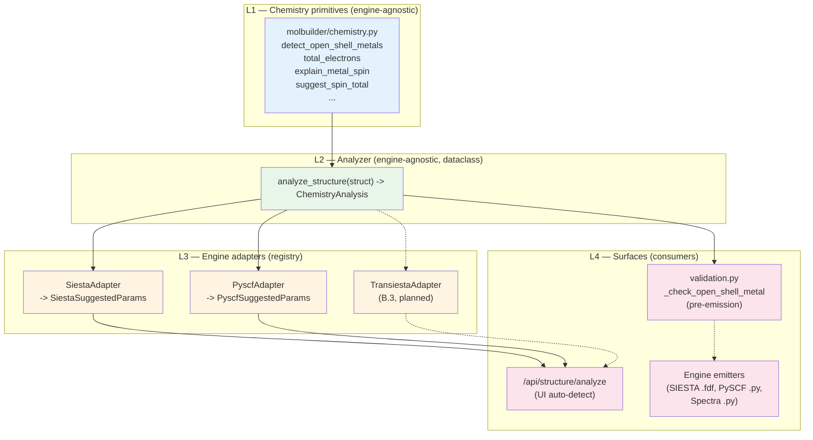

# Scientific validation — runtime machinery

> **This document is the sole source of truth for HOW molbuilder
> realises scientific correctness at runtime**: the pre-emission
> validation pass, the engine-agnostic chemistry analyzer + per-
> engine adapter registry, the three-stage sidecar contract, and
> the issue-surfacing rules.
>
> [`science.md`](../science.md) holds the **what** — the principles,
> the cross-engine consistency rule, the closed gap list.  This
> doc holds the **how** — the dataclasses, the call graph, the
> registry, the surfaces that read each conclusion.  Pointer in
> [`design.md`](../design.md) § 0.
>
> All data passed across these surfaces is typed via **frozen
> dataclasses** ([`design.md`](../design.md) § "Principle 1: The
> dataclass is the lingua franca").  No untyped dicts on the
> internal call graph; dicts appear only at the JSON wire
> boundary (HTTP request/response).

---

## 1. Layered overview



Three boundaries, each with a typed contract:

| Boundary | Owner | Input | Output |
|---|---|---|---|
| `analyze_structure(struct)` | `molbuilder.chemistry` | `Structure` | `ChemistryAnalysis` (dataclass) |
| `EngineParameterAdapter.to_params(analysis)` | per-engine submodule | `ChemistryAnalysis` | engine-specific frozen dataclass (e.g. `SiestaSuggestedParams`) |
| `_check_open_shell_metal(struct, cfg)` | `molbuilder.validation` | `Structure` + engine `Config` | `List[Issue]` |

All boundaries pass dataclasses, not dicts.  JSON only appears
when the HTTP endpoint serialises `asdict(...)` for the wire.

---

## 2. The chemistry primitives (L1)

`molbuilder.chemistry` carries the irreducible per-element /
per-structure rules.  Public surface ([source](../../molbuilder/chemistry.py)):

| Helper | Returns | Used by |
|---|---|---|
| `total_electrons(struct, charge)` | int | analyzer, parity check |
| `check_spin_charge_parity(struct, c, s)` | Optional[str] | analyzer + validator |
| `detect_open_shell_metals(struct)` | List[str] | analyzer + (legacy) validator |
| `explain_metal_spin(elem, spin)` | Optional[str] | analyzer (builds hints) |
| `suggest_spin_total(metals)` | (float, list) | SIESTA adapter |
| `resolve_pyscf_ecp(struct, ecp, basis)` | Dict / None | PySCF emitter (separate concern) |

All pure functions.  No engine awareness.  No I/O.  Same
input → same output, every time.

These are the building blocks; the analyzer composes them into
a structured conclusion.

---

## 3. The analyzer (L2)

`molbuilder.chemistry.analyze_structure(struct) -> ChemistryAnalysis`
is the engine-agnostic chemistry middle layer.

```python
@dataclass(frozen=True)
class SpinChoice:
    spin:  int     # 2S = number of unpaired electrons
    label: str     # e.g. "Fe(II), intermediate (4-coord porphyrin)"

@dataclass(frozen=True)
class MetalHint:
    element:      str               # e.g. "Fe"
    common_spins: List[SpinChoice]  # ranked low-spin → high-spin

@dataclass(frozen=True)
class ChemistryAnalysis:
    """Engine-agnostic chemistry conclusions about a Structure.

    Single source of truth for every science-aware surface in the
    system: UI auto-detect, pre-emission validation, future
    transport-tab Auto-detect, CLI ``molbuilder analyze``.  Two
    surfaces consuming this dataclass cannot disagree about the
    chemistry by construction.
    """
    # Composition
    n_atoms:              int
    elements:             List[str]      # unique, sorted
    n_electrons_neutral:  int            # sum(Z) for neutral system

    # Open-shell transition metals
    metals:               List[str]      # ["Fe"], or [] for organics
    metal_hints:          List[MetalHint]

    # Engine-agnostic suggested defaults
    suggested_charge:     int
    suggested_spin:       int            # 2S = n_unpaired
    suggested_treatment:  Literal["closed", "open"]

    # Human-readable
    rationale:            str
    warnings:             List[str]
```

### 3.1 Design rules

- **Pure function.**  No I/O, no global state, no engine imports.
- **Engine-agnostic vocabulary.**  Field names use universal
  chemistry terms.  Engine conventions
  (`SpinPolarized`, `SpinTotal μB`, `UKS`/`RKS`, `Multiplicity`)
  live in the adapters.
- **No "method" field at this layer.**  "UKS vs RKS" is a PySCF
  notion; the engine-agnostic equivalent is
  `treatment ∈ {"closed", "open"}`.
- **Parity is enforced here, once.**  If
  `(n_electrons_neutral − suggested_charge)` parity doesn't match
  `suggested_spin`, the analyzer bumps the spin and records the
  adjustment in `warnings`.  Adapters never re-do parity work.

### 3.2 Suggested-spin policy (open-shell metals)

When `metals` is non-empty the analyzer picks the *first* metal's
common-default spin from `_DEFAULT_OPEN_SHELL_SPIN` (a curated
per-element table mirroring `chemistry._SPIN_TOTAL_DEFAULTS`,
restated in 2S units).  Conservative choice — favours the most
common coordination chemistry, NOT necessarily the ground state.
The rationale always says so, so the user knows to verify against
experimental data.

| Metal | Default 2S | Rationale |
|---|---|---|
| Fe | 2 | Fe(II) intermediate (4-coord porphyrin); HS Fe(II) is 4 |
| Mn | 5 | Mn(II) high-spin S=5/2 (overwhelmingly common in bio) |
| Cu | 1 | Cu(II) d⁹ — one unpaired electron, period |
| Ni | 0 | Ni(II) square-planar LS; user overrides for octahedral |
| Co | 1 | Co(II) LS as a safe pick |
| Cr | 3 | Cr(III) d³ S=3/2 |

(Full table in [source](../../molbuilder/chemistry.py).)

### 3.3 Open-shell metal absent (organic systems)

`metals == []` → `suggested_treatment = "closed"`, spin = 0 or 1
depending on electron-count parity.  No advisory needed; pure
organics with even electron count are reliably closed-shell
singlets.

---

## 4. The adapter layer (L3)

### 4.1 Protocol + registry

```python
class EngineParameterAdapter(Protocol):
    """Translate engine-agnostic ChemistryAnalysis conclusions
    into the parameter dataclass the engine's web form expects."""

    name: str   # registry key, e.g. "siesta", "pyscf"

    @classmethod
    def to_params(cls, analysis: ChemistryAnalysis):
        """Return an engine-specific frozen dataclass.  Always
        includes ``rationale``; MAY include engine-specific notes."""

_ADAPTERS: Dict[str, Type[EngineParameterAdapter]] = {}

def register_adapter(name: str):
    def deco(cls):
        _ADAPTERS[name] = cls
        return cls
    return deco

def registered_adapters() -> Dict[str, Type[EngineParameterAdapter]]:
    return dict(_ADAPTERS)
```

### 4.2 Per-engine typed dataclasses

Each adapter returns a **frozen dataclass** whose fields match
the engine's web-form field names.  No dicts on this boundary;
dicts only appear when the HTTP endpoint serialises them via
`dataclasses.asdict()`.

```python
# molbuilder/siesta/auto_defaults.py
@dataclass(frozen=True)
class SiestaSuggestedParams:
    net_charge:     int
    spin_polarized: bool
    spin_total:     float
    rationale:      str

@register_adapter("siesta")
class SiestaAdapter:
    name = "siesta"

    @classmethod
    def to_params(cls, analysis: ChemistryAnalysis) -> SiestaSuggestedParams:
        return SiestaSuggestedParams(
            net_charge     = analysis.suggested_charge,
            spin_polarized = analysis.suggested_treatment == "open",
            spin_total     = float(analysis.suggested_spin),
            rationale      = analysis.rationale,
        )
```

```python
# molbuilder/pyscf/auto_defaults.py
@dataclass(frozen=True)
class PyscfSuggestedParams:
    charge:    int
    spin:      int       # 2S = n_unpaired
    method:    str       # "UKS" | "RKS"
    rationale: str

@register_adapter("pyscf")
class PyscfAdapter:
    name = "pyscf"

    @classmethod
    def to_params(cls, analysis: ChemistryAnalysis) -> PyscfSuggestedParams:
        method = "UKS" if analysis.suggested_treatment == "open" else "RKS"
        return PyscfSuggestedParams(
            charge    = analysis.suggested_charge,
            spin      = analysis.suggested_spin,
            method    = method,
            rationale = analysis.rationale,
        )
```

### 4.3 Adapter location convention

Per-engine submodule.  Mirrors the transport-engine registry
pattern in `molbuilder/transport/engine_base.py`:

| Engine | Adapter location | Status |
|---|---|---|
| SIESTA | `molbuilder/siesta/auto_defaults.py` | shipped 2026-06-10 |
| PySCF | `molbuilder/pyscf/auto_defaults.py` | shipped 2026-06-10 |
| Spectra | reuses `PyscfAdapter` | n/a — emits PySCF |
| Transiesta (B.3) | `molbuilder/transport/transiesta/auto_defaults.py` | planned |
| PySCF-NEGF (B.3) | `molbuilder/transport/pyscf_negf/auto_defaults.py` | planned |

Each module exports its adapter class and triggers
`@register_adapter` on import.  The web blueprint's module-level
import block is the canonical place to import adapter modules so
they're available when `/api/structure/analyze` is hit.

### 4.4 Adapter design rules

- **Pure translator.**  Adapters MUST NOT re-do chemistry
  detection or parity checks — they only translate.  If you find
  yourself importing from `chemistry.py` inside an adapter, the
  logic belongs in the analyzer.
- **Typed dataclass output.**  Returns a frozen dataclass, not a
  dict.  The dataclass field names match the engine's web-form
  field names.  Serialisation to JSON happens at the HTTP
  boundary via `asdict()`.
- **`rationale` is always present.**  The analyzer's
  engine-agnostic rationale; an adapter MAY append an engine-
  specific note (one sentence max).

---

## 5. The consumers (L4)

### 5.1 UI auto-detect — `/api/structure/analyze`

```python
@bp.route("/api/structure/analyze", methods=["POST"])
def api_structure_analyze():
    body = request.get_json(silent=True) or {}
    struct = _read_structure_from_body(body)
    analysis = analyze_structure(struct)
    return jsonify({
        "ok":                  True,
        "n_atoms":             analysis.n_atoms,
        "elements":            analysis.elements,
        "n_electrons_neutral": analysis.n_electrons_neutral,
        "metals":              analysis.metals,
        "metal_hints":         [asdict(h) for h in analysis.metal_hints],
        "suggested":           {
            name: asdict(cls.to_params(analysis))
            for name, cls in registered_adapters().items()
        },
        "warnings":            analysis.warnings,
    })
```

~25 LoC.  New engines surface in `suggested.<engine>` the moment
their adapter module is imported — endpoint code unchanged.

### 5.2 Pre-emission validator — `_check_open_shell_metal`

```python
def _check_open_shell_metal(struct, *, is_closed_shell, engine_label):
    analysis = analyze_structure(struct)   # SAME source of truth
    if analysis.metals and is_closed_shell:
        return [Issue(
            "warn",
            f"Structure contains open-shell transition metal(s) "
            f"{', '.join(analysis.metals)} but {engine_label} "
            f"requests a closed-shell SCF.  "
            + analysis.rationale,
            "config.spin",
        )]
    return []
```

The validator wraps the analyzer's conclusions in `Issue` shape.
Same logic, same conclusions as the auto-detect.

### 5.3 Two directions, one analyzer

The analyzer runs at two moments and in two directions:

| Direction | When | Surface | What the user sees |
|---|---|---|---|
| **Forward** — suggest | After loading a structure, before configuring | Auto-detect button → `/api/structure/analyze` | Form fields pre-filled with suggested `(charge, spin, method)`; rationale + warnings shown next to the form |
| **Reverse** — check | At Generate click, with the user's final params | `validation.py` → `_check_open_shell_metal` | `Issue` in the pre-emission issues panel if the user's choice contradicts the chemistry |

Both consume the same `ChemistryAnalysis` instance shape (re-computed,
since structures may have changed).  By design, they cannot disagree.

---

## 6. Three-stage sidecar contract (Pattern B)

Separate from the chemistry analyzer but governed by the same
"shared helper, both engines call it" principle.  Per
[`science.md`](../science.md) and
[`sidecar-contract.md`](sidecar-contract.md) § 6 B:

When `struct.regions` is populated but the engine doesn't consume
region labels, the engine **must** surface an `info`-severity
`Issue` so the user knows the labels were noticed but unused.

Shared helper:

```python
# molbuilder/web/blueprints/_shared.py
def regions_pattern_b_notice(struct, engine_label: str) -> Optional[Issue]:
    """Return an INFO Issue when struct.regions is non-empty.

    Called from /api/build/fdf, /api/build/pyscf, and the spectra
    engine's preflight.  Single source of truth — SAME notice text
    regardless of which engine fired it.
    """
```

Pinned by `tests/test_web.py::test_{fdf,pyscf}_surfaces_info_when_structure_carries_regions`,
`tests/spectra/test_engine.py::test_..._pattern_b_notice`, and
`tests/test_pdb_workflow_integration.py::test_pattern_b_*`.

---

## 7. Adding a new engine

Steps to make a new engine appear in `suggested.<engine>` and have
its validator share the same chemistry analysis:

1. Create `molbuilder/<engine>/auto_defaults.py`:
   - Define `<Engine>SuggestedParams` frozen dataclass with the
     engine's web-form field names.
   - Define `<Engine>Adapter` class with `name = "<engine>"` and
     a `to_params(cls, analysis)` classmethod.
   - Decorate the class with `@register_adapter("<engine>")`.
2. Import the module in `molbuilder/web/blueprints/__init__.py`
   so the adapter registers at app startup.
3. (Optional) Wire the engine's validator
   (`validation._validate_<engine>`) to call
   `_check_open_shell_metal(struct, ...)` so the validator shares
   the analysis.
4. Add adapter tests to `tests/test_chemistry_adapters.py`
   (cross-engine consistency invariant runs against the
   registry).

No endpoint change required.  No documentation change required
beyond appending a row to § 4.3's table.

---

## 8. What the middle layer does NOT cover

The analyzer scope is **the chemistry-driven `(charge, spin,
treatment)` triplet plus open-shell-metal hints**.  Out of scope:

| Engine parameter | Why out of scope |
|---|---|
| Basis set (`def2-SVP`, `DZP`, etc.) | Engine-specific; chemistry doesn't pick a basis |
| XC functional (`PBE`, `B3LYP`, …) | User preference + computational budget |
| K-points / mesh cutoff | Periodic-system geometry, not chemistry |
| Pseudopotential family | SIESTA-only; covered by sibling endpoint `/api/siesta/check-pseudos` |
| Convergence thresholds | Engine-specific defaults are already sensible |
| Optimization steps | Workflow choice, not chemistry |
| Spectral broadening / IR vs Raman | Workflow choice |

The analyzer stays scoped because growing it to cover everything
would re-fragment the cross-engine consistency claim.  The
`(charge, spin, treatment)` triplet is special: it's where silent
chemistry errors live ([`science.md`](../science.md) § 2).  Other
parameters fail loudly when wrong.

---

## 9. Test invariants

### 9.1 Cross-engine consistency

`tests/test_chemistry_adapters.py::test_all_adapters_agree_on_treatment`:
for any structure, **all** registered adapters' `to_params(analysis)`
results carry the same `treatment`-equivalent decision.  Spelled
differently per engine (SIESTA `spin_polarized=True`, PySCF
`method="UKS"`), but the conclusion is the same.

### 9.2 Endpoint shape stability

`tests/test_web.py::test_analyze_endpoint_response_shape`:
the `/api/structure/analyze` response carries every key documented
in [`web-api.md`](web-api.md) § 10.  Each `suggested.<engine>`
sub-shape pinned per-adapter.

### 9.3 Validator + analyzer agreement

`tests/test_validation.py::test_check_open_shell_metal_uses_analyzer`:
`_check_open_shell_metal` reads its conclusions from
`analyze_structure(struct).metals` (not a separately-imported
`detect_open_shell_metals`).  Single source of truth.

### 9.4 New-engine on-ramp

`tests/test_chemistry_adapters.py::test_registration_works_with_synthetic_adapter`:
register a fake `"synthetic"` adapter, hit the endpoint, verify
`suggested.synthetic` appears.  Catches a regression where the
endpoint hardcodes the engine list.

### 9.5 Pattern-B coverage

`tests/test_web.py::test_{fdf,pyscf}_surfaces_info_when_structure_carries_regions`:
both build endpoints emit the Pattern-B INFO when `struct.regions`
is populated.  Shared helper enforced.

---

## 10. Dataclass-first principle (cross-reference)

Every dataclass in this doc is **frozen**.  The L1 chemistry
helpers return primitives (int, list, str); the L2 analyzer wraps
them into `ChemistryAnalysis`; the L3 adapters wrap their outputs
into engine-specific frozen dataclasses; the L4 surfaces consume
those dataclasses.  Dicts appear only at the JSON wire boundary,
where `dataclasses.asdict()` is the single point of serialisation.

This is the application of [`design.md`](../design.md) § "The
dataclass is the lingua franca" to the scientific-validation
machinery.  No parallel metadata exists in the web layer or the
UI layer; the dataclass is authoritative everywhere.

---

## 11. Decisions log

| Date | Decision | Why |
|---|---|---|
| 2026-06-10 | Middle layer landed as `analyze_structure` + `EngineParameterAdapter` registry; per-engine `auto_defaults.py` submodules; per-engine frozen `SuggestedParams` dataclasses. | The `/api/structure/analyze` endpoint shipped 2026-05-23 with both engine translations hardcoded inline in `web/blueprints/build.py` — duplication waiting to drift, no on-ramp for Transport B.3 engines.  Hoisting the chemistry into a named analyzer + decoupling per-engine translation realizes the cross-engine consistency rule that `science.md` § 2.4 had already promised at the validator level, extending it to the UI auto-detect surface.  Dataclass-first per `design.md` Principle 1.  Pinned with cross-engine, validator-agreement, and new-engine on-ramp tests. |
| 2026-06-10 | `science.md` stays the principles/contract doc.  This doc (`scientific-validation.md`) takes the implementation/machinery role.  Per-protocol adapter doc (`chemistry-adapters.md`) folded in here — the adapter layer is part of the validation machinery, not a separate concern. | Splitting "what we promise" (science.md) from "how we deliver it" (this doc) lets each evolve independently.  A new engine landing changes this doc; a new scientific invariant changes science.md.  Cross-references keep them coherent. |
