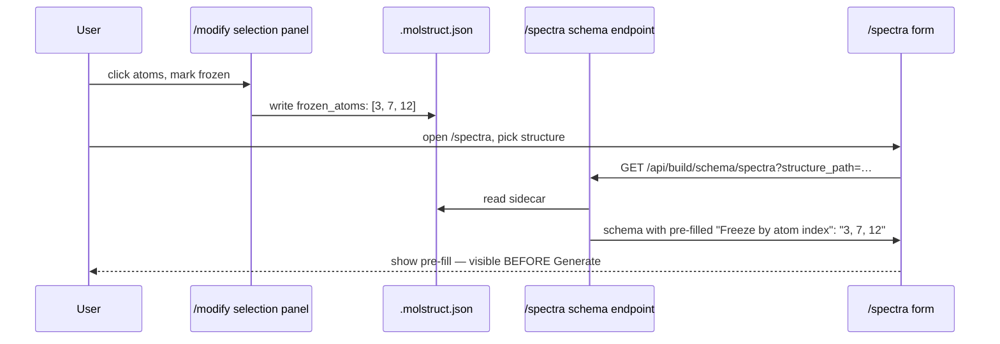

# Sidecar-driven boundary conditions — the three-stage contract

<!-- ROUTE-RENAME-BANNER -->
> **Route names updated 2026-06-07.** Occurrences of `/build`, `/modify`,
> `/spectra` in this doc refer to PAGE routes that have been renamed to
> `/structure-optimization`, `/molbuilder`, `/spectrum-calculation`
> respectively.  `/api/build/*`, `/api/modify/*`, `/api/spectra/*`
> BACKEND prefixes are unchanged — only the page routes moved.  See
> [`tabs/architecture.md`](../tabs/architecture.md) § 3 for the canonical
> route table.

> **This document is the sole source of truth for the
> sidecar-driven boundary-condition contract.**  Any code that
> touches sidecar metadata, simulation boundary conditions, or
> label-driven config flow MUST satisfy this contract.  Reviewers
> reject "silent absorption" patterns by reference to this doc.
>
> Pointer in `design.md` § 0 (Protocols).

---

## 1. Goal

The boundary conditions of a simulation — which atoms are frozen,
which regions partition the system, fixed cell vectors when they
exist — are **user input**.  molbuilder routes them through a strict
three-stage contract:

```
UI → config → script
```

Each stage has an explicit, testable obligation, and divergence
between stages surfaces as a visible issue — **never as silent
absorption**.

Today the contract is fully implemented for `frozen_atoms` against
the PySCF spectra engine; the design is the template every future
engine + every future label type follows.

---

## 2. Founding directives (2026-05-21, verbatim)

The contract codifies user-supplied design directives.  The quotes
below are preserved as the load-bearing principle every
implementation in this area must satisfy.

> *"fixed atoms will be used in many modeling scenarios so we need
> to make sure this is reserved [preserved]."*
>
> *"we just need to make sure that the script/input generator fully
> respects the frozen setting because our modeling would require
> scientifically correctness with the correct assumption. the
> starting facts/boundary condition of simulation must be explicit,
> consistent and fully respected from config to actual
> calculation."*
>
> *"when building script/input files the atom information is built
> into the script/input file. therefore i find option 2 [pre-fill
> the form from sidecar; form is authoritative] to be more solid."*
>
> *"UI → config makes sure user's intention is captured correctly,
> config → script/input faithfully delivers the information and the
> generator understands what those labels mean and correctly use it
> for boundary conditions. if labels are not consistent or not
> recognized, the script should give explicit warning so that the
> user know there could be an issue. no silent absorption of
> config."*

---

## 3. Architecture overview

```mermaid
flowchart LR
    A[User in /modify<br/>selects atoms] -->|writes| B[.molstruct.json<br/>sidecar]
    B -->|schema endpoint reads + pre-fills| C[/spectra form<br/>shown to user]
    C -->|user reviews,<br/>edits if needed| D[Generate click]
    D -->|cfg.frozen_indices| E[Script renderer]
    E -->|FROZEN_INDICES_USER<br/>= [...] literal| F[Generated .py script]
    B -.->|preflight reads<br/>for divergence check| G[Engine preflight]
    C -.->|cfg passed to| G
    G -->|Issues panel:<br/>WARN / INFO| C
    style B fill:#e1f5ff
    style C fill:#fff4e1
    style F fill:#e8f5e9
    style G fill:#fce4ec
```

The three stages map to:

| Stage | Boundary | Code site | Test pin |
|---|---|---|---|
| 1: UI → config | `/api/build/schema/spectra` endpoint pre-fills form from sidecar | `web/blueprints/spectra.py::_seed_frozen_indices_from_sidecar` | `tests/test_spectra_schema.py` |
| 2: config → script | Script renderer emits `FROZEN_INDICES_USER = [...]` verbatim | `molbuilder/spectra/pyscf_script.py::render_script` | `tests/test_spectra_script.py` |
| 3: engine preflight | Three checks: divergence, unrecognized labels, sidecar-failed-to-apply | `molbuilder/spectra/pyscf_engine.py::preflight` + render endpoint | `tests/test_spectra_preflight.py` |

---

## 4. Stage 1 — UI → config: capture the user's intention correctly

The `/modify` selection panel writes `Structure.frozen_atoms` into
the sidecar (`.molstruct.json` v3, key `frozen_atoms`).

When the user opens `/spectra` against a structure that has a
sidecar, the schema endpoint
`GET /api/build/schema/spectra?structure_path=…` reads the sidecar
and **pre-fills** the form's "Freeze by atom index" field with the
comma-separated indices.



The user **sees** what's about to be frozen before clicking Generate.

The form is then **authoritative**.  The user can:
- leave the pre-fill alone (the script will freeze those atoms),
- add more indices (script will freeze the union),
- clear the field (script will freeze nothing — a deliberate
  override).

Pre-fill makes the boundary condition **visible**; the
user-editable form makes it **consistent** (one source of truth at
the moment of Generate).

If the sidecar can't be applied (atom count mismatch, corrupt JSON),
the schema response carries a human-readable `notice` field rather
than silently failing.

---

## 5. Stage 2 — config → script: faithfully deliver, no silent merge

The script generator (`molbuilder/spectra/pyscf_script.py`) emits
`FROZEN_INDICES_USER` as a Python literal.  Nothing else.

```python
# Inside the generated PySCF script:

<!-- ROUTE-RENAME-BANNER -->
> **Route names updated 2026-06-07.** Occurrences of `/build`, `/modify`,
> `/spectra` in this doc refer to PAGE routes that have been renamed to
> `/structure-optimization`, `/molbuilder`, `/spectrum-calculation`
> respectively.  `/api/build/*`, `/api/modify/*`, `/api/spectra/*`
> BACKEND prefixes are unchanged — only the page routes moved.  See
> [`tabs/architecture.md`](../tabs/architecture.md) § 3 for the canonical
> route table.
FROZEN_INDICES_USER = list(cfg.frozen_indices)  # verbatim from form

# Runtime computation (in the generated script itself):

<!-- ROUTE-RENAME-BANNER -->
> **Route names updated 2026-06-07.** Occurrences of `/build`, `/modify`,
> `/spectra` in this doc refer to PAGE routes that have been renamed to
> `/structure-optimization`, `/molbuilder`, `/spectrum-calculation`
> respectively.  `/api/build/*`, `/api/modify/*`, `/api/spectra/*`
> BACKEND prefixes are unchanged — only the page routes moved.  See
> [`tabs/architecture.md`](../tabs/architecture.md) § 3 for the canonical
> route table.
_frozen = set(FROZEN_INDICES_USER) | {
    i for i, el in enumerate(ELEMENTS) if el in FROZEN_ELEMENTS
}
FROZEN_ATOM_IDXS = sorted(_frozen)
FREE_ATOM_IDXS   = [i for i in range(N_ATOMS) if i not in _frozen]
```

The script does **not** read any sidecar at run time.  The script
does **not** silently union with `struct.frozen_atoms` at emit time.
Whatever the user committed in the form lands in the script
verbatim — that's the script's promise.

The partial-Hessian path then operates on `FREE_ATOM_IDXS`.  No
hidden inputs, no engine-private state, no silent extension of the
frozen set.

### What "no silent absorption" rejects

```python
# REJECTED — silent merge at emit time hides the user's intent:

<!-- ROUTE-RENAME-BANNER -->
> **Route names updated 2026-06-07.** Occurrences of `/build`, `/modify`,
> `/spectra` in this doc refer to PAGE routes that have been renamed to
> `/structure-optimization`, `/molbuilder`, `/spectrum-calculation`
> respectively.  `/api/build/*`, `/api/modify/*`, `/api/spectra/*`
> BACKEND prefixes are unchanged — only the page routes moved.  See
> [`tabs/architecture.md`](../tabs/architecture.md) § 3 for the canonical
> route table.
all_frozen = sorted(set(cfg.frozen_indices) | set(struct.frozen_atoms))
script.write(f"FROZEN_INDICES = {all_frozen}")

# REJECTED — reading sidecar at script run time:

<!-- ROUTE-RENAME-BANNER -->
> **Route names updated 2026-06-07.** Occurrences of `/build`, `/modify`,
> `/spectra` in this doc refer to PAGE routes that have been renamed to
> `/structure-optimization`, `/molbuilder`, `/spectrum-calculation`
> respectively.  `/api/build/*`, `/api/modify/*`, `/api/spectra/*`
> BACKEND prefixes are unchanged — only the page routes moved.  See
> [`tabs/architecture.md`](../tabs/architecture.md) § 3 for the canonical
> route table.
with open(sidecar_path) as f:
    sidecar = json.load(f)
FROZEN_INDICES = sidecar["frozen_atoms"]  # script reads what the form said it would not

# ACCEPTED — verbatim form-to-script:

<!-- ROUTE-RENAME-BANNER -->
> **Route names updated 2026-06-07.** Occurrences of `/build`, `/modify`,
> `/spectra` in this doc refer to PAGE routes that have been renamed to
> `/structure-optimization`, `/molbuilder`, `/spectrum-calculation`
> respectively.  `/api/build/*`, `/api/modify/*`, `/api/spectra/*`
> BACKEND prefixes are unchanged — only the page routes moved.  See
> [`tabs/architecture.md`](../tabs/architecture.md) § 3 for the canonical
> route table.
script.write(f"FROZEN_INDICES_USER = {list(cfg.frozen_indices)}")
```

---

## 6. Stage 3 — engine understands the labels and warns on what it can't use

The engine's `preflight()` is the contract enforcer.  Two checks at
the engine layer, plus one at the render-endpoint boundary:

### A. Divergence warn — sidecar set vs config set

If `struct.frozen_atoms` is non-empty AND
`struct.frozen_atoms ⊄ cfg.frozen_indices`, preflight emits a
WARN-severity `Issue` (where: `config.frozen_indices`) naming the
divergent indices.

The user is told **before Generate** that the script is about to
omit a subset of the sidecar's frozen atoms.  This catches:

- The user navigated to `/spectra` before picking the structure
  (form pre-fill hadn't run).
- The sidecar was updated in another tab since the schema was
  last fetched.

### B. Unrecognized-label notice — labels the engine can't use

The selection panel writes both `frozen_atoms` AND `regions` (e.g.
`L-electrode`, `bridge`).  Only `frozen_atoms` is meaningful to the
spectra engine; `regions` are reserved for the transport engine.

If a structure carries regions and the user runs `/spectra`,
preflight emits an INFO/WARN notice explaining:

> "the structure has regions [L-electrode, bridge, …], which the
> spectra engine doesn't consume.  These don't affect the
> calculation but stay in the sidecar for /transport."

Same shape applies to future engines + future label types: every
label that's NOT understood by the current engine MUST be named
explicitly in a preflight issue.  **No silent absorption.**

### C. Sidecar-failed-to-apply notice — at the render endpoint

The render endpoint loads the sidecar (when `structure_path` is
supplied) and applies it to the Structure before preflight runs —
that's what activates checks A + B.

If the sidecar exists but FAILS to apply (path rejected, malformed
JSON, atom-count mismatch with the pasted XYZ), the endpoint emits
a WARN-severity `Issue` (where: `structure_path`) explaining:

> "the form's freeze rules are the sole boundary condition for this
> run".

Without this, a stale or wrong-structure sidecar would silently
produce a render with `struct.frozen_atoms = []` and the user would
never know their sidecar didn't flow through.

Implementation: `_apply_sidecar_if_possible` returns a notice string
instead of silently catching the error.

---

## 7. Why this matters

Boundary conditions ARE the calculation's starting facts.  A script
that silently freezes more (or fewer) atoms than the user
configured is not a different number — it's a different
calculation.  Scientific correctness requires that the user can
look at the form (config) and the issues panel (engine
understanding) and know exactly what's going to happen.  This
contract gives that:

- **Explicit**: every relevant label appears in the form or in an
  issue; nothing is implicit.
- **Consistent**: at the moment of Generate, the form is the single
  source of truth.
- **Fully respected**: the script does what the form says.

---

## 8. Extending to new engines / new label types

When adding a new engine (e.g. the future transport engine, #135)
or a new label type (e.g. surface-anchor markers), the contract
requires:

1. **Decide** which sidecar labels the engine consumes.  Document
   in the engine module's docstring.
2. **Add a schema-endpoint pre-fill** if the label maps to a form
   field (mirror `_seed_frozen_indices_from_sidecar` in
   `web/blueprints/spectra.py`).
3. **Add a preflight divergence warn** matching pattern A above.
4. **Add a preflight unrecognized-label notice** matching pattern B
   above for every sidecar field the engine does NOT consume.

Tests should pin each: a regression where a future engine silently
absorbs a label, or silently drops one, must fail loudly.

---

## 9. Test coverage matrix

| Test | Stage | What it pins |
|---|---|---|
| `test_spectra_schema.py::test_form_pre_fills_from_sidecar` | 1 | Pre-fill text on /spectra equals sidecar `frozen_atoms` |
| `test_spectra_schema.py::test_form_notice_on_sidecar_atom_mismatch` | 1 | Sidecar with wrong atom count → notice, no pre-fill |
| `test_spectra_script.py::test_script_emits_frozen_indices_user_verbatim` | 2 | `FROZEN_INDICES_USER` in generated script equals `cfg.frozen_indices` |
| `test_spectra_script.py::test_script_does_not_read_sidecar_at_runtime` | 2 | No `open(*.molstruct.json)` calls in the generated script |
| `test_spectra_preflight.py::test_preflight_warns_on_divergence` | 3A | Pattern-A WARN issue when sidecar ⊄ config |
| `test_spectra_preflight.py::test_preflight_notices_unrecognized_labels` | 3B | Pattern-B INFO/WARN for regions, surface anchors, etc. |
| `test_spectra_render.py::test_render_warns_on_sidecar_apply_failure` | 3C | Pattern-C WARN when sidecar can't apply |

---

## 10. Decisions log

| Date | Decision | Rationale |
|---|---|---|
| 2026-05-21 | Adopt the three-stage contract (UI → config → script + engine preflight) for sidecar-driven boundary conditions; pin frozen_atoms as the first instance. | User-supplied founding directives (§ 2); silent absorption was producing scripts that froze a different set than the form showed; the fix is structural, not per-bug. |
| 2026-06-05 | Pattern B added when transport engine abstraction landed (#135). Engines now must explicitly notice EVERY sidecar field they don't consume. | Without pattern B, the transport-reserved `regions` field would silently be ignored by `/spectra`; the user would not realise their region tags were spectra-irrelevant. |
