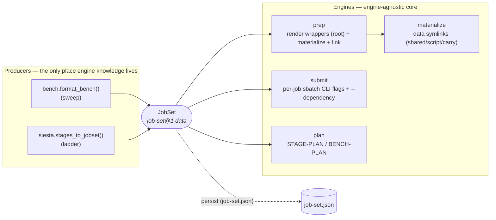
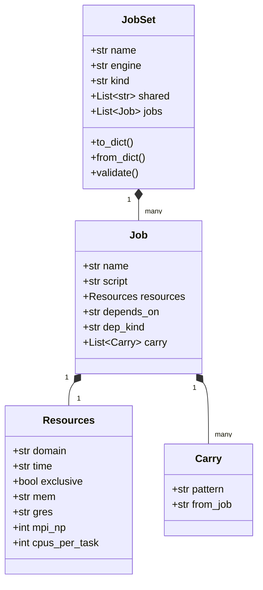
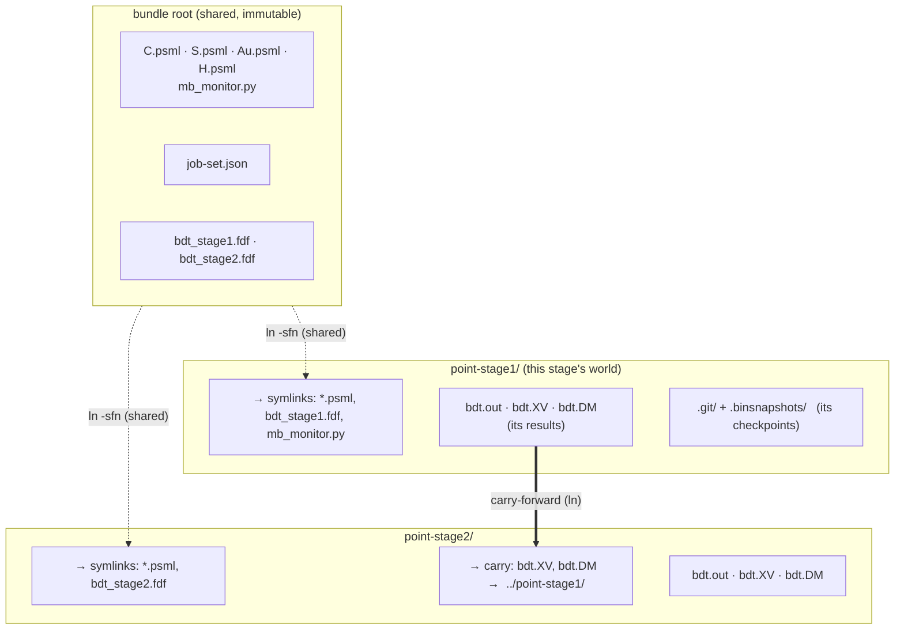
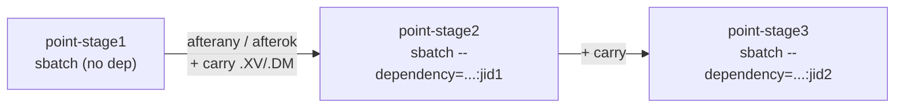
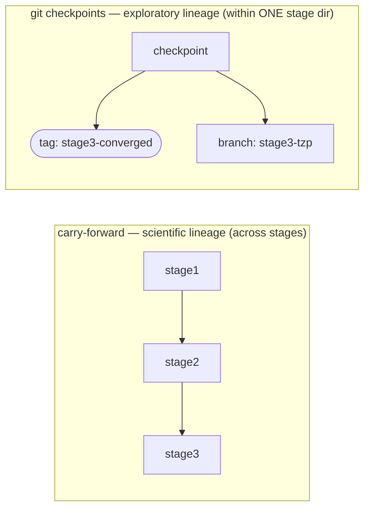

# Staged execution & the `JobSet` framework

> **Design doc — single source of truth for running a *set of related
> jobs* (a benchmark sweep or a multi-stage relaxation) on a real
> scheduler.** It defines the data structure (`JobSet`), how it is stored
> (`job-set@1`), how files are laid out so stages **share** common inputs
> yet **separate** their own results, the operations on it, and the whole
> workflow. Status per piece is in § 1; the rest explains it with diagrams
> and small examples.
>
> Cross-references: `engines/siesta.md` (stage *science* — the param
> tiers), `slurm-integration.md` (routing § 4.3 / exclusive+mem § 4.3.1 /
> per-job `-J` § 4.4), `script-execution.md` (engine-native resume),
> `run-checkpoints.md` (git tag/branch), `job-execution.md`
> (generate→prep→submit bundle lifecycle), `benchmark-workflow.md`
> (the `_mb_point` isolation this generalizes), and **`data-vocabulary.md`
> — the concentrated definition of every field name + JSON format used
> here (`job-set@1`, `Resources` fields, the canonical vocabulary).**

---

## § 1 Status

| Piece | State |
|---|---|
| Stage *science*: `SiestaStageSpec`, `cfg.stages`, validation, per-stage `.fdf` | **built** (`config/siesta.py`, `validation/siesta.py`, `siesta/input.py`) |
| `jobset` model + `job-set@1` persistence (§ 3) | **built** (`jobset/model.py`) |
| `jobset` materialize engine — data symlinks (shared/script/carry) (§ 4) | **built** (`jobset/materialize.py`) |
| `jobset` **prep** engine — render wrappers in root (from the real files) + materialize + link wrappers into job dirs (§ 5) | **built** (`jobset/prep.py::prep_jobset`) |
| `jobset` plan engine — STAGE-PLAN table (§ 5) | **built** (`jobset/plan.py`) |
| SIESTA stage producer — `cfg.stages` → ladder `JobSet` (§ 3, § 7) | **built** (`siesta/stages.py::stages_to_jobset`) |
| `jobset` **submit** engine — both `execution.mode`s over a *prepped* JobSet (§ 7, § 9): `submit` = per-job sbatch CLI flags (`-J`/`-n`/`-c`/`--gres`/`--mem`/`-t`/`--exclusive`/`-p`/`-q`) + dependency threading; `direct` = ordered local `bash` (`-np`/`-omp`) honoring `dep_kind` | **built** (`jobset/submit.py::submit_jobset`) |
| Pre-framework monolithic single-dir runner (§ 9) | **built** (`render_siesta_stages_runner`) — retained for the trivial single-stage/workstation case |
| Engine-native resume (§ 10) | **built** (`script-execution.md`, `runwrap`) |
| Checkpoints — `snapshot tag`/`restore` (§ 11) | **built** (`run-checkpoints.md`, `molbuilder snapshot`) |
| `snapshot branch` (explore alternatives, § 11) | **NOT built** — designed (run-checkpoints Phase 4); use raw `git checkout -b` today |
| Cross-workflow handoff (relax → transport/spectra) | **built** (`bundle_writer.py`, `bundle-contract.md`) — reused, not in scope |
| Prep-time resource resolve + per-stage `.sbatch` bake + `job-set.json` emit (§ 5) | **proposed** (CLI/prep wiring) |
| Per-stage resource UI/CLI source (§ 6) | **proposed** (model support **built**) |
| CLI/prep wiring + bench migration onto the framework (§ 13 D4) | **proposed** |

---

## § 2 The idea in one picture

A **benchmark sweep** and a **multi-stage relaxation** are the same shape:
*N related jobs that share one package, each isolated in its own
directory, each with its own scheduler resources.* So they are two
**producers** of one data structure — `JobSet` — consumed by shared,
engine-agnostic **engines**:



Each module has **one** responsibility and no knowledge of the others
(logical isolation). Producers know an engine (SIESTA/PySCF); the core
knows only data; the user decides everything irreversible.

**Vocabulary.**
- **Stage** — one tier of the relaxation ladder (`SiestaStageSpec`): a
  `relax_type`/`relax_steps`/`relax_force_tol`/`relax_max_displ` set with a
  `name` + an `on_nonconvergence` policy. Tiers trade **speed↔accuracy**
  (loose warm-up → tight final).
- **Job-set** — the set of related jobs + the one shared package.
- **Carry-forward** — symlinking a finished job's restart files into the
  next job's dir (the *scientific* lineage; sweeps have none).

---

## § 3 Data structure (`job-set@1`)

Pure dataclasses (`jobset/model.py`) — no filesystem, no scheduler:



*Field legend:* `JobSet.kind` is `sweep` or `ladder`; `shared` = the static
package symlinked into every job. `Job.name` → its `point-<name>/` dir and
its `-J`; `script` = its input file (e.g. `bdt_stage1.fdf`); `depends_on` =
producer job name (None = independent); `dep_kind` = `afterok`/`afterany`.
`Resources` fields are all Optional (None = inherit). `Carry.pattern` = a
concrete file (e.g. `bdt.XV`) linked from `from_job`'s dir.

**Two — and only two — channels for shared information** (nothing
implicit):
1. **static package** → `JobSet.shared`: identical bytes for every job
   (pseudopotentials, geometry, monitor). One set of symlinks.
2. **runtime-produced** → `Carry`: one job's output feeds a dependent job;
   a symlink resolved *after* the producer runs.

`validate()` rejects what the engines can't recover from: empty/unknown
`kind`, duplicate job names (dir + `-J` collision), bad `dep_kind`, a
`depends_on`/`carry` that references a non-prior job (keeps the graph
ordered + acyclic).

> **Scope boundary (by design, not an oversight):** `depends_on` is a
> **single** producer — the model expresses a *linear chain* (ladder) or
> *independent set* (sweep), which is all the two current producers need.
> `carry` is already multi-source (a list), so the data layer is half-ready
> for a **diamond DAG** (e.g. transport `device` depending on *both*
> electrode runs); promoting `depends_on` to `List[str]` (and the SLURM dep
> to `afterok:id1:id2`) is the small, well-contained change to make when a
> multi-parent consumer actually arrives. Not built speculatively — named
> here so the boundary is explicit.

### Example — a 2-stage ladder as stored `job-set.json`

```json
{
  "schema": "molbuilder/job-set@1",
  "name": "bdt",
  "engine": "siesta",
  "kind": "ladder",
  "shared": ["C.psml", "S.psml", "Au.psml", "H.psml", "mb_monitor.py"],
  "jobs": [
    { "name": "stage1", "script": "bdt_stage1.fdf",
      "resources": {"domain": "htc", "time": "0-04:00:00",
                    "exclusive": false},
      "depends_on": null, "dep_kind": "afterok", "carry": [] },
    { "name": "stage2", "script": "bdt_stage2.fdf",
      "resources": {"domain": "public", "time": "7-00:00:00",
                    "exclusive": true},
      "depends_on": "stage1", "dep_kind": "afterany",
      "carry": [ {"pattern": "bdt.XV", "from_job": "stage1"},
                 {"pattern": "bdt.DM", "from_job": "stage1"} ] }
  ]
}
```

Read it top to bottom: a cheap `htc` warm-up (`stage1`), then an
exclusive 7-day `public` final (`stage2`) that **proceeds** regardless of
stage1's convergence (`afterany`) and **carries** stage1's geometry +
density forward.

---

## § 4 Information storage & file structure

This is the answer to *"how do stages share inputs yet keep their own
results separate?"* — **three storage tiers**, each owned by a different
mechanism:



- **Shared, immutable** → bundle root. The pseudopotentials, the monitor,
  the per-stage `.fdf`s, and `job-set.json`. Written once; never mutated
  per stage. Each stage **symlinks** them in (`materialize`, the `_mb_point`
  generalization), so there's one physical copy.
- **Per-stage, separate** → `point-<name>/`. Each stage's own `.out`,
  `.XV`, `.DM`, logs — fully isolated, so stage 2's run can never clobber
  stage 1's results. This dir is also the scope for resume (§ 10) and
  checkpoints (§ 11).
- **Cross-stage shared at runtime** → the **carry** symlinks: `stage2`'s
  `bdt.XV` points at `../point-stage1/bdt.XV`. Dangling until stage 1 runs;
  the dependency (§ 7) guarantees ordering.

**Engine-specific vs job-set-generic separation:** everything *scientific*
(the `.fdf` content, what `.XV`/`.DM` mean, warm-restart flags) is the
**engine's** (SIESTA) and lives in the `.fdf` + the engine binary. The
**job-set** layer only sees opaque filenames (`script`, `Carry.pattern`)
and scheduler resources — it never parses an `.fdf`. Swapping engines
(PySCF) changes only the producer + the filenames, not the framework.

### Example — the materialized tree

```
bdt/                              # bundle root: shared + rendered-once wrappers
├── C.psml  S.psml  Au.psml  H.psml
├── mb_monitor.py
├── bdt_stage1.fdf  bdt_stage2.fdf
├── bdt_stage1.run.sh  bdt_stage1.sbatch   # rendered IN ROOT at prep (real files)
├── bdt_stage2.run.sh  bdt_stage2.sbatch   #   from the real .fdf (resolve() no-op)
├── job-set.json                  # the plan (job-set@1)
├── STAGE-PLAN.md                 # human view (§ 5)
├── point-stage1/
│   ├── C.psml -> ../C.psml                 # shared (symlink, materialize)
│   ├── bdt_stage1.fdf -> ../bdt_stage1.fdf
│   ├── bdt_stage1.sbatch -> ../bdt_stage1.sbatch   # wrapper linked in (prep)
│   ├── bdt_stage1.run.sh -> ../bdt_stage1.run.sh
│   ├── mb_monitor.py -> ../mb_monitor.py
│   ├── bdt.out  bdt.XV  bdt.DM             # its own results
│   ├── .git/  .binsnapshots/               # its own checkpoints (§ 11)
└── point-stage2/
    ├── C.psml -> ../C.psml
    ├── bdt_stage2.fdf -> ../bdt_stage2.fdf
    ├── bdt_stage2.sbatch -> ../bdt_stage2.sbatch
    ├── bdt_stage2.run.sh -> ../bdt_stage2.run.sh
    ├── bdt.XV -> ../point-stage1/bdt.XV    # carry-forward (materialize)
    └── bdt.DM -> ../point-stage1/bdt.DM
```

---

## § 5 The workflow

Reuses the bundle lifecycle of `job-execution.md` (**generate → prep →
submit**); `JobSet` is the spine. The same `job-set.json` is read by both
run modes (§ 9) — *produce one JobSet, then pick an engine to run it.*


| # | Step | Where | Owner | Status |
|---|---|---|---|---|
| 1 | Author + `validate()` (blocks a broken ladder) | HOST | `validation/siesta.py` | built |
| 2 | Produce `JobSet` + render per-stage `.fdf` | HOST | `siesta/stages.py`, `siesta/input.py` | built |
| 3 | Persist → `job-set.json` | HOST | `jobset/model.py` | model built; bundle-write proposed |
| 4 | Ship bundle to target | — | scp / bundle | reuses job-exec |
| 5 | Prep: render wrappers (root, real files) + `materialize()` + link wrappers in + `plan()` | TARGET | `jobset/prep.py::prep_jobset` (reuses `runwrap.write_run_wrapper`) + `jobset/plan.py` | **built** |
| 6 | Submit: per-job sbatch CLI flags + `--dependency` (or ordered local `bash`), carry resolves | TARGET | `jobset/submit.py::submit_jobset` | **built** |
| 7 | Monitor | TARGET | bench monitor | reuses job-exec |

### Example — operations (the API)

The framework is the foundation; the **Python API is the interface today**.
A thin CLI/bundle wrapper (the `stage-prep` / `stage-submit` generated
scripts, mirroring `prep-bench` / `run-bench`) is the one wiring piece still
to build — see § 1.

```python
from molbuilder.jobset import prep_jobset, render_plan, submit_jobset

# HOST: author the ladder → JobSet (+ render the per-stage .fdf in the bundle)
js = stages_to_jobset(cfg, shared=[...], resources_for=overrides.get)

# TARGET: render launchers + lay out point-stage<N>/ + see the plan
prep_jobset(js, bundle_dir)                    # wrappers + dirs + carry symlinks
print(render_plan(js))                          # chain + per-stage resources, dry

# TARGET: review before anything irreversible, then run
submit_jobset(js, bundle_dir, mode="submit", domain="public", dry_run=True)  # plan
submit_jobset(js, bundle_dir, mode="submit", domain="public")                # go

# continue an interrupted stage (engine resumes from its own warm files)
# cd point-stage2 && sbatch bdt_stage2.sbatch --continue

# explore an alternative tail without losing the converged path (§11)
# cd point-stage2; molbuilder snapshot tag stage2-converged   # built
# git checkout -b stage2-tzp   # branch: raw git today (snapshot branch not built, §11 gap)
```

---

## § 6 Per-stage resources

Staging on a cluster matters because **stages want different resources**:
a loose CG warm-up is cheap (short walltime, CPU/ScaLAPACK, `htc`); a tight
final Broyden is expensive (longer walltime, GPU/ELPA, more memory). One
`sbatch` can't express that; a `JobSet` can — `Job.resources` is per-job.

The per-stage **override** is supplied through the producer's
`resources_for` seam (kept OUT of `SiestaStageSpec`, which stays the
science-knob widget — `_stagespec_to_field_schemas` only renders scalar
relax knobs):

```python
stages_to_jobset(cfg, shared=[...], resources_for={
    "stage1": Resources(domain="htc",    time="0-04:00:00"),
    "stage2": Resources(domain="public", time="7-00:00:00", exclusive=True),
}.get)
```

Resolution per field: `resources_for(stage)` → job-level `cfg` → detected/
estimated default (*assistant, not nanny* — no surprise choices). Because
`diag_algorithm`/`enable_gpu` are **decoupled** (engines/siesta.md § 13), a
stage can switch *solver and hardware* (ScaLAPACK-CPU warm-up → ELPA-GPU
final) — those ride the per-stage `.fdf`, and the env routes automatically
(`_fdf_requests_elpa`/`_fdf_requests_gpu`). Memory stays **per-job
estimated** from each stage's `.fdf` (§ 4.3.1) — no flat per-stage mem knob.

---

## § 7 Submit — dependency chain + carry-forward

`submit` mode emits **one `sbatch` per stage**, chained by SLURM
dependency, restart files carried forward:



**Render once, vary per job via CLI flags — the bench model.** `prep_jobset`
renders each *distinct* script's wrapper **once, in the bundle root, from the
real file** (so `write_run_wrapper`'s `Path.resolve()` is a no-op and the
`.run.sh`/`.sbatch` land where intended), then symlinks it into each job dir.
The per-job resource *variation* is applied by `submit_jobset` as **sbatch
CLI flags over that shared wrapper** — exactly generalizing the bench launch
line, so one rendered `.sbatch` serves every point of a sweep:

```
# prep (once): renders in root, links the wrapper into every job dir
for script in distinct(job.script for job in jobset.jobs):
    write_run_wrapper(base/script, ...)        # REUSE; real file, resolve() no-op

# submit: per-job CLI flags over the (possibly shared) wrapper
ids = {}                                        # job.name -> slurm jobid
for job in jobset.jobs:                          # already validate()'d
    pq    = resolve_domain(domain, gpu=bool(job.resources.gres))  # -> -p/-q
    dep   = f"--dependency={job.dep_kind}:{ids[job.depends_on]}" if job.depends_on else ""
    flags = -J job.name {dep} {pq} -n mpi_np -c cpus_per_task --gres .. --mem .. -t .. [--exclusive]
    ids[job.name] = (cd point-<name> && sbatch {flags} <stem>.sbatch)   # capture jobid
```

Three cross-job concerns, and nothing else: **per-job CLI overrides** (so a
shared wrapper still gets the right `-n`/`-c`/`--gres`/`-J` per job — CLI
flags win over the rendered `#SBATCH` defaults; `--exclusive` suppresses
`--mem`), **dependency threading** (producer's real jobid), and **`domain`→
`-p/-q`** resolved at submit time. `direct` mode is the same per-job idea
locally: `bash <stem>.run.sh -np .. -omp ..`. `<label>` is shared across
stages (`cfg.system_label`), so SIESTA's auto-restart finds `<label>.XV` in
each stage's own dir — the carried symlink supplies it from the prior stage.
No bash polling: SLURM enforces the order. `dry_run=True` returns each job's
exact command line **without launching** — reviewable before anything is
irreversible (assistant, not nanny).

---

## § 8 `on_nonconvergence` → SLURM dependency

The per-stage policy maps onto the dependency kind of the **next** stage:

| stage `on_nonconvergence` | next-stage dependency | meaning |
|---|---|---|
| `halt` | `afterok` | next runs only if this stage SUCCEEDS; a failure cancels the rest of the chain — the publication-defensible default |
| `proceed` | `afterany` | next runs regardless (warm-up tiers refine from "not bad") |
| `continue` | `afterok` (this stage retries internally first, § 13 D2) | extend a near-converged cheap stage, then succeed-or-halt |

The **last enabled stage** forces `halt` (engines/siesta.md): the ladder's
contract is a converged answer or a loud failure — expressed here as "no
downstream job depends on the last stage."

---

## § 9 Two execution modes (`execution.mode`)

The **same materialized `JobSet`** is executed two ways by one engine
(`submit_jobset`), selected by `execution.mode` (job-execution.md § 8.13).
Same per-stage-dir layout (§ 4), same `STAGE-PLAN`, same carry symlinks —
**only the launcher differs**:

- **`submit`** — the SLURM chain (§ 7): one `sbatch`/stage, per-stage
  resources, `--dependency` threading + carry. Right for a cluster where
  stages differ in cost/hardware or the ladder exceeds one walltime.
- **`direct`** — ordered **local** execution: each stage's `<name>.run.sh`
  run in turn, honoring `dep_kind` locally (an `afterok` edge whose
  producer failed **skips** the dependent and everything below it; an
  `afterany` edge runs regardless — the SLURM semantics reproduced on a
  workstation, so a local run matches what the cluster would do). Right for
  a workstation or a short ladder.

> **Not to be confused with** the pre-framework **monolithic runner**
> (`render_siesta_stages_runner`): a single script that loops over stages in
> **one** directory with in-place `.XV` auto-restart. It predates the
> framework, uses no per-stage dirs, and is retained for the trivial
> single-stage/workstation case. The framework's `direct` mode is the
> per-stage-dir local executor of a `JobSet` — same layout as `submit`, just
> not queued. "direct" in this doc always means the latter.
>
> **Consistency obligation:** the monolithic runner does in-place `.XV`/`.DM`
> auto-restart between stages in one dir; `stages_to_jobset` expresses the
> same scientific intent as explicit `Carry` (.XV always / .DM if
> `use_save_dm` / .CG if same `relax_type`, § 13 D1) + `dep_kind` from
> `on_nonconvergence` (§ 8). The two are different *mechanisms* for one
> *contract* — when the carry set or the policy mapping changes, both must
> move together, or a ladder run would behave differently depending on which
> executor ran it.

Additive: existing single-allocation users are unaffected.

---

## § 10 Continuation — engine-native resume, user-decided

**Resume is the modeling software's job, not molbuilder's.** A job stopped
by the scheduler, by non-convergence, or by the user is recovered by the
*engine's own* restart mechanism from on-disk result files. molbuilder
**never auto-resumes and never deletes** — silent recovery is easy to get
subtly wrong, and redoing work without the user's awareness is a heavy
penalty. molbuilder's job: **organize** (per-stage dirs separate the
restart files), **inform** (which stage converged / was killed / is the
first incomplete one), and make the **manual** continue trivial.

The per-job contract already exists (`script-execution.md`): warm-restart
is automatic when the project-ID-keyed files are present; `--continue`
asserts them; `--cold` moves them aside (never deletes).

**Engine facts (verified — they differ):**

| | SIESTA | PySCF |
|---|---|---|
| restart files | `<label>.XV` / `.DM` / `.CG` | `<JOB>.chk` / `<JOB>_optimized.xyz` |
| flags | `MD.UseSaveXV` / `DM.UseSaveDM` / `MD.UseSaveCG` | `init_guess="chkfile"` + geometry warm-restart block |
| **geometry granularity** | **per geometry step** (`.XV` each step) → resumes mid-relaxation | **per completed stage** (`_optimized.xyz` at stage end); mid-optimization only via geomeTRIC temp |

So a killed SIESTA stage resumes near where it died; a killed PySCF stage
resumes from its last *completed* stage. Surface that, don't paper over it.

**In a job-set:** each stage's restart files live in its own dir →
continue = **re-submit that stage** (engine auto-picks-up; `--continue` to
assert). A cancelled chain is resumed by the user re-submitting from the
**first incomplete stage** — molbuilder shows which; it does not decide.

---

## § 11 Checkpoints & branching — exploring alternatives

The job-set gives *forward* motion; `run-checkpoints.md` lets the user
**save a state and fork to explore a different parameter path** — "what if
stage 3 used TZP?" — without losing converged work. The two compose with
**no new machinery**; the checkpoint design was already written in staging
vocabulary (P6: tag `stage3-converged`, branch `stage4-tzp`).

**Two complementary lineage axes — never conflate them:**



**Scope alignment (zero conflict).** Each `point-<name>/` stage dir is
exactly the checkpoint design's "single working directory" (lowest-dir
rule, P5: each SLURM job self-contained). So **each stage dir is its own
checkpoint repo**; `molbuilder snapshot {init,checkpoint,tag,list,restore}`
works per stage unchanged.

> **Gap (verified 2026-06-30):** `molbuilder snapshot **branch**` is in the
> `run-checkpoints.md` design (Phase 4) but is **not yet implemented** —
> only `init/checkpoint/tag/list/restore/migrate-manifest` exist today. To
> branch a stage right now, use raw `git checkout -b <name>` inside the
> stage dir (each dir is a real git repo). Building the `snapshot branch`
> wrapper is the one new checkpoint piece this integration needs (§ 1; it
> is what makes "explore alternatives" first-class).

- The shared package (bundle root) lives **outside** the per-stage repos —
  immutable inputs, not versioned per stage; git records the *symlink*.
- The carry-forward symlink is also git-tracked as a symlink, so branching
  a stage forks **from the carried checkpoint** (same upstream geometry).

**Resume vs branch — two distinct user moves:**

| Situation | Mechanism | Who decides |
|---|---|---|
| Same path, interrupted | **resume** — engine warm-restart (§ 10) | user re-submits |
| Different parameter path | **branch** — checkpoint + git branch | user branches, then re-submits |

Checkpoint-before-switch is the protection: tag the converged state,
branch, explore; `restore` to the tag if the experiment is worse. P1 (no
auto-git) and § 10 (no auto-resume) are the same stance on the two axes —
molbuilder organizes + informs; the user decides.

---

## § 12 Reuse, debt, and the handoff boundary

**Genuinely reused (the submit engine calls these directly, now built):**
`write_run_wrapper` / `render_sbatch` for the per-job `Resources`→SLURM-flags
translation (the SAME path single-job + bench use); `runtime_config.get_routing`
for `domain`→`-p/-q`; env routing on ELPA/GPU; the entry-shim env bootstrap
(job-execution.md § 8.3); per-job memory estimate; engine-native warm-restart
(`script-execution.md`); git checkpoints `snapshot tag`/`restore`
(`run-checkpoints.md`).

**Known debt — `jobset` currently PARALLELS the bench, it does not yet
reuse it (be honest):** `jobset/materialize.py` reimplements the bench's
isolation, which today is **inline bash** (`_mb_point` generated into
`job-gpu-sweep.sh`, `bench/adapters.py`); `jobset/plan.py` parallels
`bench/generate.py::render_bench_plan`. Until the bench **migrates** onto
the framework (§ 13 D4 — `format_bench` returns a `JobSet`), there are two
implementations of isolation + plan. That migration is what converts this
section's first paragraph from "will reuse" to "reuses", and it is the
condition for the framework to be a unification rather than a second copy.

**Handoff boundary (don't reinvent it).** Carry-forward (§ 4) is *intra*-
ladder geometry. The *inter-workflow* handoff — a converged relaxation
feeding the next calculation (transport / spectra / bands) — is already
`bundle_writer.py` + `bundle-contract.md` (the `.xyz` + `.molstruct.json`
pair the next tab loads). The job-set framework stops at "produce the
converged geometry"; the cross-workflow step reuses that existing
primitive.

**Net new (small, contained):** the `jobset/{model,materialize,prep,plan,submit}`
modules; `stages_to_jobset` producer; the carry-forward symlink step; the
prep render-in-root + link step; the per-job-CLI-flag submit driver (the bench
launch line generalized) with dependency threading; the per-stage resource
seam; and the `snapshot branch` checkpoint wrapper (§ 11 gap).

---

## § 13 Decisions (resolved 2026-06-30)

- **D1 — carry-forward set:** `.XV` always; `.DM` iff `cfg.use_save_dm`;
  `.CG` iff consecutive stages share `relax_type` (the optimizer history is
  algorithm-specific — carrying it across a `CG`→`Broyden` switch is at
  best ignored, at worst wrong, so an algorithm switch restarts the
  optimizer fresh from the carried geometry).

- **D2 — `continue` is an in-`.run.sh` retry, not extra jobs.** One
  `sbatch` per stage; a `continue` stage re-enters the engine up to
  `continue_retries` times from its own `.XV`, then succeeds or halts.
  Keeps the dependency graph exactly one job per stage.

- **D3 — emit `STAGE-PLAN.md` at prep** (mirrors `BENCH-PLAN.md`): each
  stage's resolved domain/walltime/solver/hardware + carry set + dependency
  graph + `on_nonconvergence`, shown before submit.

- **D4 — the `jobset` framework IS the core, built first.** `siesta/stages`
  is its first producer; the bench **migrates** onto it (`format_bench`
  returns a `JobSet`) as a fast-follow — additive, a producer swap with the
  existing bench tests as the net. No parallel copy of the isolation/submit
  logic is ever created.

---

## § 14 Proposed infrastructure (build as shared, not one-offs)

A review against the existing toolset (2026-06-30) surfaced three things
that should be built as **infrastructure for wider use**, not local
helpers — each abstracts a pattern already repeated or already needed in
more than one place:

1. **`molbuilder/persist.py` — a versioned-document base.** The
   `to_dict` / `to_json` / `from_dict` + `SCHEMA = "molbuilder/<name>@<major>"`
   + major-version-check pattern is now hand-rolled in **three** places
   (`bench/environment.py`, `bench/result.py`, `jobset/model.py`). Extract a
   tiny mixin/base (`VersionedDoc`) that owns the schema string, the
   major-check, and atomic `write(path)` / `read(path)`. Adopters: all
   three above, plus any future persisted artifact. *Infra, not a jobset
   detail.*

2. **`molbuilder/runstatus.py` — a run/stage status reader.** The "molbuilder
   informs, the user decides" half of § 10–§ 11 has **no** implementation
   yet: there is no tool that answers, for a job dir, *did it converge? was
   it killed? are warm-restart files present? which is the first incomplete
   stage?* This is needed by staging **and** the bench **and** the results
   tab. Build it once: parse the engine `.out` (reuse `parse/` engines) +
   check the project-ID warm files (`script-execution.md` inventory) +
   read checkpoint state (`checkpoint.py`) → a `RunStatus` record the
   `plan`/UI/CLI surface. *This is the missing "inform" infrastructure, and
   the highest-leverage next build.*

3. **`molbuilder snapshot branch` (+ `diff`, `prune`).** The checkpoint
   design (`run-checkpoints.md` Phases 4–5) specifies branch/diff/prune but
   only `init/checkpoint/tag/list/restore/migrate-manifest` are built.
   `branch` is the one verb "explore alternatives" (§ 11) actually needs.
   It is general checkpoint infrastructure (every run dir), not a staging
   feature — build it in `checkpoint.py` + the `snapshot` group.

The discipline (feedback: framework-first): a new wheel earns its place
only as shared infrastructure, with the existing callers named that should
migrate onto it. Each item above names its adopters.
