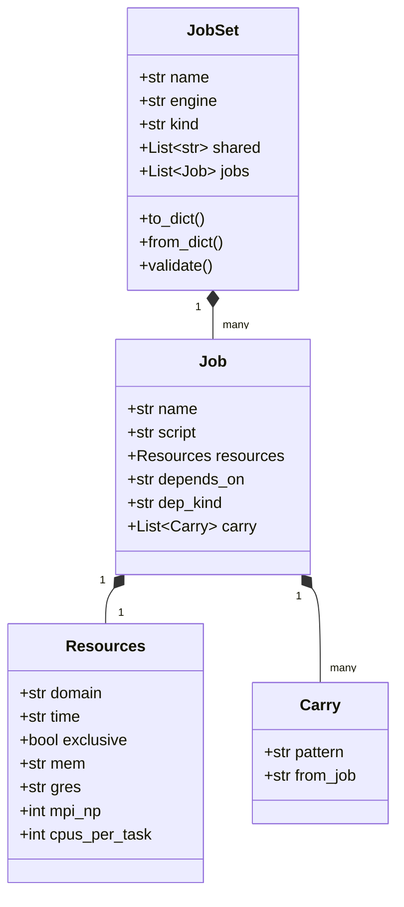
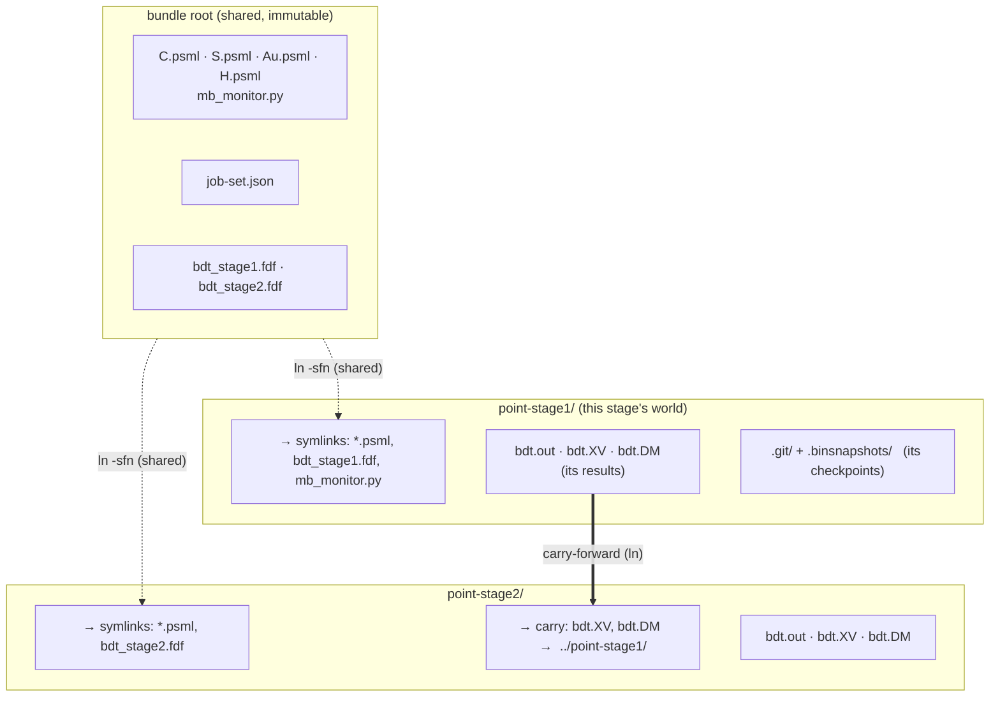
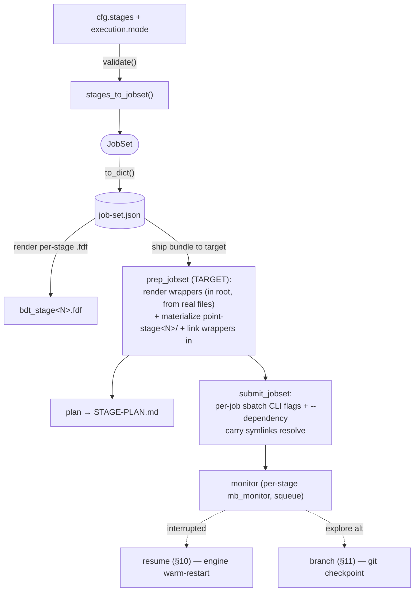
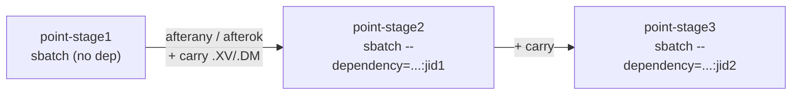
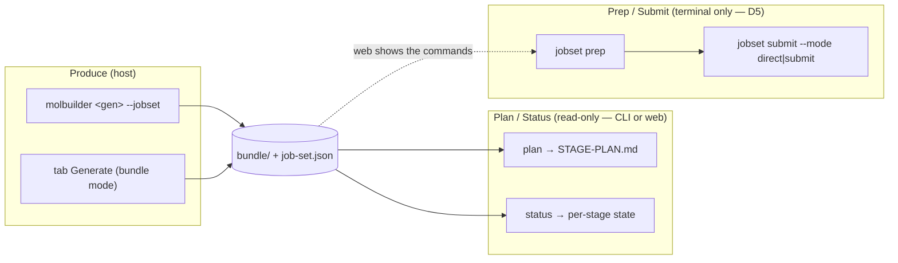

# Staged execution & the `JobSet` framework

> **Design doc — single source of truth for running a *set of related
> jobs* (a benchmark sweep or a multi-stage relaxation) on a real
> scheduler.** It defines the data structure (`JobSet`), how it is stored
> (`job-set@1`), how files are laid out so stages **share** common inputs
> yet **separate** their own results, the operations on it, and the whole
> workflow. Status per piece is in § 1; the rest explains it with diagrams
> and small examples.
>
> **User-facing how-to** (plain language, copy-paste commands, no internals):
> [`../staged-relaxation-guide.md`](../staged-relaxation-guide.md). This
> document is the developer/design counterpart.
>
> Cross-references: `engines/siesta.md` (stage *science* — the param
> tiers), `slurm-integration.md` (routing § 4.3 / exclusive+mem § 4.3.1 /
> per-job `-J` § 4.4), `script-execution.md` (engine-native resume),
> `run-checkpoints.md` (git tag/branch), `job-execution.md`
> (generate→prep→submit bundle lifecycle), `benchmark-workflow.md`
> (the `_mb_point` isolation this generalizes), and **`data-vocabulary.md`
> — the concentrated definition of every field name + JSON format used
> here (`job-set@1`, `Resources` fields, the canonical vocabulary).**

---

> **New to this?** Read the plain-language explainer first —
> [`../jobset-infrastructure.md`](../jobset-infrastructure.md) — which walks
> the infrastructure and each use-case scenario (ladder, sweep) with diagrams
> and examples. This document is the authoritative *contract*.

## § 1 Status

| Piece | State |
|---|---|
| Stage *science*: `SiestaStageSpec`, `cfg.stages`, validation, per-stage `.fdf` | **built** (`config/siesta.py`, `validation/siesta.py`, `siesta/input.py`) |
| `jobset` model + `job-set@1` persistence — `to_dict`/`from_dict` + `write`/`load` (§ 3) | **built** (`jobset/model.py`) |
| `molbuilder jobset` CLI — `plan` / `prep` / `submit` / `status` over a bundle's `job-set.json` (§ 5) | **built** (`jobset/_cli.py`) |
| `jobset` **runstatus** — the *inform* layer (§ 10): per-stage state + warm-file inventory + first-incomplete pointer, reusing the Results-tab directory decoder | **built** (`jobset/runstatus.py`) |
| `jobset` materialize engine — data symlinks (shared/script/carry) (§ 4) | **built** (`jobset/materialize.py`) |
| `jobset` **prep** engine — render wrappers in root (from the real files) + materialize + link wrappers into job dirs (§ 5) | **built** (`jobset/prep.py::prep_jobset`) |
| `jobset` plan engine — STAGE-PLAN table (§ 5) | **built** (`jobset/plan.py`) |
| SIESTA stage producer — `cfg.stages` → ladder `JobSet` (§ 3, § 7) | **built** (`siesta/stages.py::stages_to_jobset`) |
| `jobset` **submit** engine — both `execution.mode`s over a *prepped* JobSet (§ 7, § 9): `submit` = per-job sbatch CLI flags (`-J`/`-n`/`-c`/`--gres`/`--mem`/`-t`/`--exclusive`/`-p`/`-q`) + dependency threading; `direct` = ordered local `bash` (`-np`/`-omp`) honoring `dep_kind` | **built** (`jobset/submit.py::submit_jobset`) |
| Pre-framework monolithic single-dir runner (§ 9) | **built** (`render_siesta_stages_runner`) — retained for the trivial single-stage/workstation case |
| Engine-native resume (§ 10) | **built** (`script-execution.md`, `runwrap`) |
| Checkpoints — `snapshot tag`/`restore` (§ 11) | **built** (`run-checkpoints.md`, `molbuilder snapshot`) |
| `snapshot branch` (explore alternatives, § 11) | **built** (`checkpoint.py::Repo.branch`, `molbuilder snapshot branch`) |
| Cross-workflow handoff (relax → transport/spectra) | **built** (`bundle_writer.py`, `bundle-contract.md`) — reused, not in scope |
| **HOST bundle producer** — `molbuilder fdf … --stage-strategy <s> --jobset`: render stage `.fdf`s + pseudos + `job-set.json` in one command (§ 5 step 2-3) | **built** (`cli.py::_emit_siesta_multi_stage`, opt-in `--jobset`) |
| Per-stage resource CLI source (§ 6) — `fdf --jobset --stage-resources <json>` | **built** (`cli.py`, validated against stage names → `resources_for`) |
| Bench migration onto the framework (§ 13 D4) | **partial** — bench is now a jobset producer (`bench/to_jobset.py::sweep_to_jobset`; shared `sweep_grid`; `prep-bench` emits `job-set.json`). Follow-up: retire the inline-bash `_mb_point` for `jobset submit` once Sol-validated |
| **Web/tab integration** (produce a bundle from a Generate button; plan/status in the UI; uniform `--jobset` per generator) | **planned** — the framework is CLI-only today; the web Build stage-table is a wired front-end with no back-end. Contract + phasing in **§ 15** (D5 web=produce+plan+status, submit stays CLI; D6 uniform `--jobset`) |

---

## § 2 The idea in one picture

A **benchmark sweep** and a **multi-stage relaxation** are the same shape:
*N related jobs that share one package, each isolated in its own
directory, each with its own scheduler resources.* So they are two
**producers** of one data structure — `JobSet` — consumed by shared,
engine-agnostic **engines**:


Each module has **one** responsibility and no knowledge of the others
(logical isolation). Producers know an engine (SIESTA/PySCF); the core
knows only data; the user decides everything irreversible.

**Vocabulary.**
- **Stage** — one tier of the relaxation ladder (`SiestaStageSpec`): a
  `relax_type`/`relax_steps`/`relax_force_tol`/`relax_max_displ` set with a
  `name` + an `on_nonconvergence` policy. Tiers trade **speed↔accuracy**
  (loose warm-up → tight final).
- **Job-set** — the set of related jobs + the one shared package.
- **Carry-forward** — symlinking a finished job's restart files into the
  next job's dir (the *scientific* lineage; sweeps have none).

---

## § 3 Data structure (`job-set@1`)

Pure dataclasses (`jobset/model.py`) — no filesystem, no scheduler:



*Field legend:* `JobSet.kind` is `sweep` or `ladder`; `shared` = the static
package symlinked into every job. `Job.name` → its `point-<name>/` dir and
its `-J`; `script` = its input file (e.g. `bdt_stage1.fdf`); `depends_on` =
producer job name (None = independent); `dep_kind` = `afterok`/`afterany`.
`Resources` fields are all Optional (None = inherit). `Carry.pattern` = a
concrete file (e.g. `bdt.XV`) linked from `from_job`'s dir.

**Two — and only two — channels for shared information** (nothing
implicit):
1. **static package** → `JobSet.shared`: identical bytes for every job
   (pseudopotentials, geometry, monitor). One set of symlinks.
2. **runtime-produced** → `Carry`: one job's output feeds a dependent job;
   a symlink resolved *after* the producer runs.

`validate()` rejects what the engines can't recover from: empty/unknown
`kind`, duplicate job names (dir + `-J` collision), bad `dep_kind`, a
`depends_on`/`carry` that references a non-prior job (keeps the graph
ordered + acyclic).

> **Scope boundary (by design, not an oversight):** `depends_on` is a
> **single** producer — the model expresses a *linear chain* (ladder) or
> *independent set* (sweep), which is all the two current producers need.
> `carry` is already multi-source (a list), so the data layer is half-ready
> for a **diamond DAG** (e.g. transport `device` depending on *both*
> electrode runs); promoting `depends_on` to `List[str]` (and the SLURM dep
> to `afterok:id1:id2`) is the small, well-contained change to make when a
> multi-parent consumer actually arrives. Not built speculatively — named
> here so the boundary is explicit.

### Example — a 2-stage ladder as stored `job-set.json`

```json
{
  "schema": "molbuilder/job-set@1",
  "name": "bdt",
  "engine": "siesta",
  "kind": "ladder",
  "shared": ["C.psml", "S.psml", "Au.psml", "H.psml", "mb_monitor.py"],
  "jobs": [
    { "name": "stage1", "script": "bdt_stage1.fdf",
      "resources": {"domain": "htc", "time": "0-04:00:00",
                    "exclusive": false},
      "depends_on": null, "dep_kind": "afterok", "carry": [] },
    { "name": "stage2", "script": "bdt_stage2.fdf",
      "resources": {"domain": "public", "time": "7-00:00:00",
                    "exclusive": true},
      "depends_on": "stage1", "dep_kind": "afterany",
      "carry": [ {"pattern": "bdt.XV", "from_job": "stage1"},
                 {"pattern": "bdt.DM", "from_job": "stage1"} ] }
  ]
}
```

Read it top to bottom: a cheap `htc` warm-up (`stage1`), then an
exclusive 7-day `public` final (`stage2`) that **proceeds** regardless of
stage1's convergence (`afterany`) and **carries** stage1's geometry +
density forward.

---

## § 4 Information storage & file structure

This is the answer to *"how do stages share inputs yet keep their own
results separate?"* — **three storage tiers**, each owned by a different
mechanism:



- **Shared, immutable** → bundle root. The pseudopotentials, the monitor,
  the per-stage `.fdf`s, and `job-set.json`. Written once; never mutated
  per stage. Each stage **symlinks** them in (`materialize`, the `_mb_point`
  generalization), so there's one physical copy.
- **Per-stage, separate** → `point-<name>/`. Each stage's own `.out`,
  `.XV`, `.DM`, logs — fully isolated, so stage 2's run can never clobber
  stage 1's results. This dir is also the scope for resume (§ 10) and
  checkpoints (§ 11).
- **Cross-stage shared at runtime** → the **carry** symlinks: `stage2`'s
  `bdt.XV` points at `../point-stage1/bdt.XV`. Dangling until stage 1 runs;
  the dependency (§ 7) guarantees ordering.

**Engine-specific vs job-set-generic separation:** everything *scientific*
(the `.fdf` content, what `.XV`/`.DM` mean, warm-restart flags) is the
**engine's** (SIESTA) and lives in the `.fdf` + the engine binary. The
**job-set** layer only sees opaque filenames (`script`, `Carry.pattern`)
and scheduler resources — it never parses an `.fdf`. Swapping engines
(PySCF) changes only the producer + the filenames, not the framework.

### Example — the materialized tree

```
bdt/                              # bundle root: shared + rendered-once wrappers
├── C.psml  S.psml  Au.psml  H.psml
├── mb_monitor.py
├── bdt_stage1.fdf  bdt_stage2.fdf
├── bdt_stage1.run.sh  bdt_stage1.sbatch   # rendered IN ROOT at prep (real files)
├── bdt_stage2.run.sh  bdt_stage2.sbatch   #   from the real .fdf (resolve() no-op)
├── job-set.json                  # the plan (job-set@1)
├── STAGE-PLAN.md                 # human view (§ 5)
├── point-stage1/
│   ├── C.psml -> ../C.psml                 # shared (symlink, materialize)
│   ├── bdt_stage1.fdf -> ../bdt_stage1.fdf
│   ├── bdt_stage1.sbatch -> ../bdt_stage1.sbatch   # wrapper linked in (prep)
│   ├── bdt_stage1.run.sh -> ../bdt_stage1.run.sh
│   ├── mb_monitor.py -> ../mb_monitor.py
│   ├── bdt.out  bdt.XV  bdt.DM             # its own results
│   ├── .git/  .binsnapshots/               # its own checkpoints (§ 11)
└── point-stage2/
    ├── C.psml -> ../C.psml
    ├── bdt_stage2.fdf -> ../bdt_stage2.fdf
    ├── bdt_stage2.sbatch -> ../bdt_stage2.sbatch
    ├── bdt_stage2.run.sh -> ../bdt_stage2.run.sh
    ├── bdt.XV -> ../point-stage1/bdt.XV    # carry-forward (materialize)
    └── bdt.DM -> ../point-stage1/bdt.DM
```

### Carry-forward — explicit walkthrough (what `Carry` is and does)

**`Carry` is the *only* runtime data channel between jobs.** It is one
restart file produced by one job and fed to a later job. The data model is
deliberately tiny — `Carry(pattern, from_job)`:

| field | meaning | example |
|---|---|---|
| `pattern` | the **concrete** filename to carry (NOT a glob) | `"bdt.XV"` |
| `from_job` | the producer job whose dir holds it | `"stage1"` |

**What it materializes.** For each `Carry` on a job, `materialize` lays one
relative symlink in that job's dir pointing into the producer's dir:

```
point-stage2/bdt.XV  ->  ../point-stage1/bdt.XV
```

The symlink is created at **prep time, before stage1 has run**, so it is a
**dangling** symlink at first. It resolves the moment stage1 writes
`bdt.XV`; the dependency edge (§ 7–8) guarantees stage2 starts only after
that, so the consumer never reads a missing or half-written file. Because
the carried file lands in stage2's own dir under the shared `SystemLabel`
(`bdt`), SIESTA's auto-restart finds `bdt.XV` in its cwd and warm-starts
from it — molbuilder wires the file into place; the **engine** does the
resume (§ 10).

**Localize-on-run — why the symlink doesn't clobber the producer.** Stages
share one `SystemLabel`, so stage2 *also writes* `bdt.XV`. If it wrote
through the symlink it would overwrite stage1's file — breaking the isolation
this section promises. So stage2's launcher, as its **first action at run
time** (after the producer finished, ordering guaranteed), replaces each
carried symlink with a real **local copy** (`prep_jobset` passes the carry
list as `write_run_wrapper(carry_in=…)`, which emits a
`cp --remove-destination "$(readlink -f f)" f` preamble in the `.run.sh`).
After that, stage2 reads *and* writes its own local `bdt.XV`; stage1's dir is
never touched. This is what makes the §4 "never clobber" guarantee hold for
the restart files, not just the `.out`/logs.

**Which files are carried (the D1 rule, § 13).** `stages_to_jobset` decides
the carry set per consecutive pair:

| file | carried when | why |
|---|---|---|
| `.XV` (coordinates) | **always** | the relaxed geometry is the whole point of staging |
| `.DM` (density matrix) | `cfg.use_save_dm` is on | a converged density is a good SCF seed; skip if disabled |
| `.CG` (optimizer history) | the two stages share `relax_type` | optimizer state is algorithm-specific — see example |

**Worked example — why `.CG` is conditional.** A typical ladder is a cheap
CG warm-up then a tight Broyden final:

```
stage1: relax_type=CG       --carry .XV, .DM, .CG-->  stage2: relax_type=CG       (same optimizer: history helps)
stage1: relax_type=CG       --carry .XV, .DM-------->  stage2: relax_type=Broyden  (.CG DROPPED: Broyden can't use CG history)
```

Carrying a `.CG` across a `CG → Broyden` switch is at best ignored and at
worst corrupts the new optimizer's state, so the producer omits it and
Broyden restarts its optimizer fresh **from the carried geometry** (`.XV`).
This is the single place the framework reasons about restart *semantics*;
everything else is opaque file plumbing.

**Sweeps have no carry.** A benchmark sweep is `kind="sweep"` — independent
jobs, every `carry` list empty. Carry is exclusively the ladder's
scientific lineage; the two job-set kinds differ in exactly this.

---

## § 5 The workflow

Reuses the bundle lifecycle of `job-execution.md` (**generate → prep →
submit**); `JobSet` is the spine. The same `job-set.json` is read by both
run modes (§ 9) — *produce one JobSet, then pick an engine to run it.*



| # | Step | Where | Owner | Status |
|---|---|---|---|---|
| 1 | Author + `validate()` (blocks a broken ladder) | HOST | `validation/siesta.py` | built |
| 2 | Produce `JobSet` + render per-stage `.fdf` | HOST | `siesta/stages.py`, `siesta/input.py` | built |
| 3 | Persist → `job-set.json` (`JobSet.write`) | HOST | `jobset/model.py`, `fdf --jobset` | **built** (host producer = `fdf … --jobset [--stage-resources]`) |
| 4 | Ship bundle to target | — | scp / bundle | reuses job-exec |
| 5 | Prep: render wrappers (root, real files) + `materialize()` + link wrappers in + `plan()` | TARGET | `jobset/prep.py::prep_jobset` (reuses `runwrap.write_run_wrapper`) + `jobset/plan.py` | **built** |
| 6 | Submit: per-job sbatch CLI flags + `--dependency` (or ordered local `bash`), carry resolves | TARGET | `jobset/submit.py::submit_jobset` | **built** |
| 7 | Monitor | TARGET | bench monitor | reuses job-exec |

### Example — operations (the verbs)

End-to-end, all CLI: the **HOST** produces the bundle (stage `.fdf`s +
`job-set.json`) in one command; the **TARGET** preps, reviews, and submits.

```bash
# HOST: render the ladder's .fdf's + the job-set.json plan into ./bundle
molbuilder fdf h2.xyz bundle/JOB.fdf --stage-strategy publishable --jobset \
    --psml-lib ~/pseudos                                # pseudos copied into the bundle

# ...ship ./bundle to the target, then on the TARGET:
molbuilder jobset prep   ./bundle                       # wrappers + point-*/ + carry symlinks
molbuilder jobset plan   ./bundle                       # the chain + per-job resources (review)
molbuilder jobset submit ./bundle --mode submit --domain public --dry-run   # preview commands
molbuilder jobset submit ./bundle --mode submit --domain public             # go

# continue an interrupted stage (engine resumes from its own warm files)
cd point-stage2 && sbatch bdt_stage2.sbatch --continue

# explore an alternative tail without losing the converged path (§11)
cd point-stage2
molbuilder snapshot tag stage2-converged       # built
molbuilder snapshot branch stage2-tzp           # fork an experiment
```

---

## § 6 Per-stage resources

Staging on a cluster matters because **stages want different resources**:
a loose CG warm-up is cheap (short walltime, CPU/ScaLAPACK, `htc`); a tight
final Broyden is expensive (longer walltime, GPU/ELPA, more memory). One
`sbatch` can't express that; a `JobSet` can — `Job.resources` is per-job.

The per-stage **override** is supplied through the producer's
`resources_for` seam (kept OUT of `SiestaStageSpec`, which stays the
science-knob widget — `_stagespec_to_field_schemas` only renders scalar
relax knobs). On the **CLI** this is `fdf --jobset --stage-resources`
(a `{stage: {domain?, time?, exclusive?, mem?, gres?, mpi_np?,
cpus_per_task?}}` JSON, validated against the actual stage names); in
**Python** it is the `resources_for` callable directly:

```bash
molbuilder fdf in.xyz bundle/JOB.fdf --stage-strategy publishable --jobset \
  --stage-resources '{"stage1": {"domain": "htc",    "time": "0-04:00:00"},
                      "stage2": {"domain": "public", "time": "7-00:00:00",
                                 "exclusive": true}}'
```
```python
stages_to_jobset(cfg, shared=[...], resources_for={
    "stage1": Resources(domain="htc",    time="0-04:00:00"),
    "stage2": Resources(domain="public", time="7-00:00:00", exclusive=True),
}.get)
```

Resolution per field: `resources_for(stage)` → job-level `cfg` → detected/
estimated default (*assistant, not nanny* — no surprise choices). Because
`diag_algorithm`/`enable_gpu` are **decoupled** (engines/siesta.md § 13), a
stage can switch *solver and hardware* (ScaLAPACK-CPU warm-up → ELPA-GPU
final) — those ride the per-stage `.fdf`, and the env routes automatically
(`_fdf_requests_elpa`/`_fdf_requests_gpu`). Memory is **per-job estimated**
from each stage's `.fdf` by default; an explicit `mem` in `--stage-resources`
overrides that for a stage (and `exclusive` suppresses `--mem` entirely).

---

## § 7 Submit — dependency chain + carry-forward

`submit` mode emits **one `sbatch` per stage**, chained by SLURM
dependency, restart files carried forward:



**Render once, vary per job via CLI flags — the bench model.** `prep_jobset`
renders each *distinct* script's wrapper **once, in the bundle root, from the
real file** (so `write_run_wrapper`'s `Path.resolve()` is a no-op and the
`.run.sh`/`.sbatch` land where intended), then symlinks it into each job dir.
The per-job resource *variation* is applied by `submit_jobset` as **sbatch
CLI flags over that shared wrapper** — exactly generalizing the bench launch
line, so one rendered `.sbatch` serves every point of a sweep:

```
# prep (once): renders in root, links the wrapper into every job dir
for script in distinct(job.script for job in jobset.jobs):
    write_run_wrapper(base/script, ...)        # REUSE; real file, resolve() no-op

# submit: per-job CLI flags over the (possibly shared) wrapper
ids = {}                                        # job.name -> slurm jobid
for job in jobset.jobs:                          # already validate()'d
    pq    = resolve_domain(domain, gpu=bool(job.resources.gres))  # -> -p/-q
    dep   = f"--dependency={job.dep_kind}:{ids[job.depends_on]}" if job.depends_on else ""
    flags = -J job.name {dep} {pq} -n mpi_np -c cpus_per_task --gres .. --mem .. -t .. [--exclusive]
    ids[job.name] = (cd point-<name> && sbatch {flags} <stem>.sbatch)   # capture jobid
```

Three cross-job concerns, and nothing else: **per-job CLI overrides** (so a
shared wrapper still gets the right `-n`/`-c`/`--gres`/`-J` per job — CLI
flags win over the rendered `#SBATCH` defaults; `--exclusive` suppresses
`--mem`), **dependency threading** (producer's real jobid), and **`domain`→
`-p/-q`** resolved at submit time. `direct` mode is the same per-job idea
locally: `bash <stem>.run.sh -np .. -omp ..`. `<label>` is shared across
stages (`cfg.system_label`), so SIESTA's auto-restart finds `<label>.XV` in
each stage's own dir — the carried symlink supplies it from the prior stage.
No bash polling: SLURM enforces the order. `dry_run=True` returns each job's
exact command line **without launching** — reviewable before anything is
irreversible (assistant, not nanny).

---

## § 8 `on_nonconvergence` → SLURM dependency

The per-stage policy maps onto the dependency kind of the **next** stage:

| stage `on_nonconvergence` | next-stage dependency | meaning |
|---|---|---|
| `halt` | `afterok` | next runs only if this stage SUCCEEDS; a failure cancels the rest of the chain — the publication-defensible default |
| `proceed` | `afterany` | next runs regardless (warm-up tiers refine from "not bad") |
| `continue` | `afterok` (this stage retries internally first, § 13 D2) | extend a near-converged cheap stage, then succeed-or-halt |

The **last enabled stage** forces `halt` (engines/siesta.md): the ladder's
contract is a converged answer or a loud failure — expressed here as "no
downstream job depends on the last stage."

---

## § 9 Two execution modes (`execution.mode`)

The **same materialized `JobSet`** is executed two ways by one engine
(`submit_jobset`), selected by `execution.mode` (job-execution.md § 8.13).
Same per-stage-dir layout (§ 4), same `STAGE-PLAN`, same carry symlinks —
**only the launcher differs**:

- **`submit`** — the SLURM chain (§ 7): one `sbatch`/stage, per-stage
  resources, `--dependency` threading + carry. Right for a cluster where
  stages differ in cost/hardware or the ladder exceeds one walltime.
- **`direct`** — ordered **local** execution: each stage's `<name>.run.sh`
  run in turn, honoring `dep_kind` locally (an `afterok` edge whose
  producer failed **skips** the dependent and everything below it; an
  `afterany` edge runs regardless — the SLURM semantics reproduced on a
  workstation, so a local run matches what the cluster would do). Right for
  a workstation or a short ladder.

> **Not to be confused with** the pre-framework **monolithic runner**
> (`render_siesta_stages_runner`): a single script that loops over stages in
> **one** directory with in-place `.XV` auto-restart. It predates the
> framework, uses no per-stage dirs, and is retained for the trivial
> single-stage/workstation case. The framework's `direct` mode is the
> per-stage-dir local executor of a `JobSet` — same layout as `submit`, just
> not queued. "direct" in this doc always means the latter.
>
> **Consistency obligation:** the monolithic runner does in-place `.XV`/`.DM`
> auto-restart between stages in one dir; `stages_to_jobset` expresses the
> same scientific intent as explicit `Carry` (.XV always / .DM if
> `use_save_dm` / .CG if same `relax_type`, § 13 D1) + `dep_kind` from
> `on_nonconvergence` (§ 8). The two are different *mechanisms* for one
> *contract* — when the carry set or the policy mapping changes, both must
> move together, or a ladder run would behave differently depending on which
> executor ran it.

Additive: existing single-allocation users are unaffected.

---

## § 10 Continuation — engine-native resume, user-decided

**Resume is the modeling software's job, not molbuilder's.** A job stopped
by the scheduler, by non-convergence, or by the user is recovered by the
*engine's own* restart mechanism from on-disk result files. molbuilder
**never auto-resumes and never deletes** — silent recovery is easy to get
subtly wrong, and redoing work without the user's awareness is a heavy
penalty. molbuilder's job: **organize** (per-stage dirs separate the
restart files), **inform** (which stage converged / was killed / is the
first incomplete one), and make the **manual** continue trivial.

The per-job contract already exists (`script-execution.md`): warm-restart
is automatic when the project-ID-keyed files are present; `--continue`
asserts them; `--cold` moves them aside (never deletes).

**Engine facts (verified — they differ):**

| | SIESTA | PySCF |
|---|---|---|
| restart files | `<label>.XV` / `.DM` / `.CG` | `<JOB>.chk` / `<JOB>_optimized.xyz` |
| flags | `MD.UseSaveXV` / `DM.UseSaveDM` / `MD.UseSaveCG` | `init_guess="chkfile"` + geometry warm-restart block |
| **geometry granularity** | **per geometry step** (`.XV` each step) → resumes mid-relaxation | **per completed stage** (`_optimized.xyz` at stage end); mid-optimization only via geomeTRIC temp |

So a killed SIESTA stage resumes near where it died; a killed PySCF stage
resumes from its last *completed* stage. Surface that, don't paper over it.

**In a job-set:** each stage's restart files live in its own dir →
continue = **re-submit that stage** (engine auto-picks-up; `--continue` to
assert). A cancelled chain is resumed by the user re-submitting from the
**first incomplete stage** — `molbuilder jobset status` shows which (per-stage
state + warm-file inventory + the first-incomplete pointer, via
`runstatus.jobset_status`); it does not decide.

---

## § 11 Checkpoints & branching — exploring alternatives

The job-set gives *forward* motion; `run-checkpoints.md` lets the user
**save a state and fork to explore a different parameter path** — "what if
stage 3 used TZP?" — without losing converged work. The two compose with
**no new machinery**; the checkpoint design was already written in staging
vocabulary (P6: tag `stage3-converged`, branch `stage4-tzp`).

**Two complementary lineage axes — never conflate them:**


**Scope alignment (zero conflict).** Each `point-<name>/` stage dir is
exactly the checkpoint design's "single working directory" (lowest-dir
rule, P5: each SLURM job self-contained). So **each stage dir is its own
checkpoint repo**; `molbuilder snapshot {init,checkpoint,tag,list,restore}`
works per stage unchanged.

> **`molbuilder snapshot branch <name>`** (built — `checkpoint.py::Repo.branch`)
> forks an experimental path inside a stage dir (each dir is a real git repo):
> `git checkout -b` semantics, so the user's subsequent checkpoints land on
> the branch while the converged path stays recoverable via its tag. This is
> what makes "explore alternatives" first-class (P6: tags = milestones,
> branches = experiments).

- The shared package (bundle root) lives **outside** the per-stage repos —
  immutable inputs, not versioned per stage; git records the *symlink*.
- The carry-forward symlink is also git-tracked as a symlink, so branching
  a stage forks **from the carried checkpoint** (same upstream geometry).

**Resume vs branch — two distinct user moves:**

| Situation | Mechanism | Who decides |
|---|---|---|
| Same path, interrupted | **resume** — engine warm-restart (§ 10) | user re-submits |
| Different parameter path | **branch** — checkpoint + git branch | user branches, then re-submits |

Checkpoint-before-switch is the protection: tag the converged state,
branch, explore; `restore` to the tag if the experiment is worse. P1 (no
auto-git) and § 10 (no auto-resume) are the same stance on the two axes —
molbuilder organizes + informs; the user decides.

---

## § 12 Reuse, debt, and the handoff boundary

**Genuinely reused (the submit engine calls these directly, now built):**
`write_run_wrapper` / `render_sbatch` for the per-job `Resources`→SLURM-flags
translation (the SAME path single-job + bench use); `runtime_config.get_routing`
for `domain`→`-p/-q`; env routing on ELPA/GPU; the entry-shim env bootstrap
(job-execution.md § 8.3); per-job memory estimate; engine-native warm-restart
(`script-execution.md`); git checkpoints `snapshot tag`/`restore`
(`run-checkpoints.md`).

**Debt status — bench is now a jobset PRODUCER (D4, partial):** the grid is
unified — `bench/adapters.py::sweep_grid` is the SINGLE `(G,K,c)` enumeration
that BOTH the bash sweep (`format_bench`) and the new producer
(`bench/to_jobset.py::sweep_to_jobset` → `JobSet(kind="sweep")`) iterate, so
they cannot diverge. `prep-bench` now emits `job-set.json` alongside the bash
sweep, so a bench bundle is a first-class JobSet — `molbuilder jobset
plan/prep/status/submit` operate on it, materializing the SAME
`point-G<g>K<k>C<c>/` dirs summarize reads. **Remaining (follow-up):** retire
the inline-bash `_mb_point` execution in favour of `jobset submit` once the
jobset-submit path is Sol-validated (keep the proven bash until then); the
science-rich `render_bench_plan` stays bench-specific (it is NOT a dupe of the
generic `jobset/plan.py` — CPU baseline, domain table, cross-socket
annotations, mpi_np-vs-cores warning).

**Handoff boundary (don't reinvent it).** Carry-forward (§ 4) is *intra*-
ladder geometry. The *inter-workflow* handoff — a converged relaxation
feeding the next calculation (transport / spectra / bands) — is already
`bundle_writer.py` + `bundle-contract.md` (the `.xyz` + `.molstruct.json`
pair the next tab loads). The job-set framework stops at "produce the
converged geometry"; the cross-workflow step reuses that existing
primitive.

**Net new (small, contained):** the `jobset/{model,materialize,prep,plan,submit}`
modules; `stages_to_jobset` producer; the carry-forward symlink step; the
prep render-in-root + link step; the per-job-CLI-flag submit driver (the bench
launch line generalized) with dependency threading; the per-stage resource
seam; and the `snapshot branch` checkpoint wrapper (§ 11 gap).

---

## § 13 Decisions (resolved 2026-06-30)

- **D1 — carry-forward set:** `.XV` always; `.DM` iff `cfg.use_save_dm`;
  `.CG` iff consecutive stages share `relax_type` (the optimizer history is
  algorithm-specific — carrying it across a `CG`→`Broyden` switch is at
  best ignored, at worst wrong, so an algorithm switch restarts the
  optimizer fresh from the carried geometry).

- **D2 — `continue` is an in-`.run.sh` retry, not extra jobs.** One
  `sbatch` per stage; a `continue` stage re-enters the engine up to
  `continue_retries` times from its own `.XV`, then succeeds or halts.
  Keeps the dependency graph exactly one job per stage.

- **D3 — emit `STAGE-PLAN.md` at prep** (mirrors `BENCH-PLAN.md`): each
  stage's resolved domain/walltime/solver/hardware + carry set + dependency
  graph + `on_nonconvergence`, shown before submit.

- **D4 — the `jobset` framework IS the core; bench is its second producer
  (partial, shipped).** `siesta/stages` was the first producer;
  `bench/to_jobset.py::sweep_to_jobset` is the second. The `(G,K,c)` grid is
  now defined ONCE (`adapters.sweep_grid`) and consumed by both the bash
  sweep and the JobSet, and `prep-bench` emits `job-set.json`. Done as an
  additive, tests-as-the-net change (the bash output is byte-preserved).
  Follow-up: switch bench execution from the inline-bash `_mb_point` loop to
  `jobset submit` once that path is Sol-validated — until then both consume
  the one grid, so there is no divergent copy of the grid logic.

---

## § 14 Proposed infrastructure (build as shared, not one-offs)

A review against the existing toolset (2026-06-30) surfaced three things
that should be built as **infrastructure for wider use**, not local
helpers — each abstracts a pattern already repeated or already needed in
more than one place:

1. **`molbuilder/persist.py` — shared schema-IO helpers. ✅ BUILT.** The
   `molbuilder/<name>@<major>` major-version check was hand-rolled in **three**
   places (`bench/environment.py`, `bench/result.py`, `jobset/model.py`) with
   a subtle missing-`@` inconsistency. Shipped as function helpers —
   `check_schema_major(got, want, *, label)` + `schema_major` +
   `read_json`/`write_json` (L1, pure stdlib) — and all three adopters now
   route through it (unified `"<artifact> schema mismatch"` message). Chose
   functions over a `VersionedDoc` mixin: the duplication was the check + IO,
   not the field-specific `to_dict`/`from_dict` bodies, so a base class would
   add coupling for little gain.

2. **`jobset/runstatus.py` — a run/stage status reader. ✅ BUILT.** The
   "molbuilder informs, the user decides" half of § 10 is now implemented:
   `jobset_status(jobset, base_dir)` answers, per stage, *finished / running /
   failed / pending / not-started*, which warm-restart files are present, and
   *which is the first incomplete stage* (the resume pointer). It **reuses**
   the Results-tab directory decoder (`parse.dirs.job.decode_run_dir`) for the
   per-dir state — no reinvented convergence parsing — and adds the warm-file
   inventory (`script-execution.md`) + the cross-stage pointer. Surfaced as
   `molbuilder jobset status` and `render_status`. Read-only; never
   auto-resumes. *Still a candidate to also serve the bench + results tab —
   the engine-agnostic `JobSetStatus` record is the shared shape for that.*

3. **`molbuilder snapshot branch` (+ `diff`, `prune`).** The checkpoint
   design (`run-checkpoints.md` Phases 4–5) specifies branch/diff/prune but
   only `init/checkpoint/tag/list/restore/migrate-manifest` are built.
   `branch` is the one verb "explore alternatives" (§ 11) actually needs.
   It is general checkpoint infrastructure (every run dir), not a staging
   feature — build it in `checkpoint.py` + the `snapshot` group.

The discipline (feedback: framework-first): a new wheel earns its place
only as shared infrastructure, with the existing callers named that should
migrate onto it. Each item above names its adopters.

---

## § 15 Merging the framework with the tabs (CLI ↔ web)

Everything above is **CLI-complete** (§ 1) but lives entirely in
`molbuilder jobset …` + `molbuilder fdf --jobset`. The **web tabs never
touch it**: each Generate button returns one script string, and the Build
tab's multi-stage *stage-table* widget POSTs `params.stages` that
`render_fdf` (single-deck) silently drops — a fully-wired front-end with no
back-end. This section is the contract for closing that gap **without
reinventing the framework**: the tabs become thin producers/viewers over
the *same* engines the CLI calls.

### § 15.1 Two design decisions (resolved 2026-07-25)

- **D5 — the web goes PRODUCE + PLAN + STATUS; SUBMIT stays explicit.**
  The web writes a bundle, previews its `STAGE-PLAN.md`, and shows
  read-only per-stage status — then displays the exact
  `molbuilder jobset prep/submit` commands to run in a terminal. It does
  **not** run `submit` from a browser click. This is § 5 / § 10's "molbuilder
  informs, the user decides; never auto-submit" applied to the UI:
  launching jobs consumes a real allocation (irreversible, outward-facing),
  so it stays a deliberate terminal action. It also keeps the web honest
  when the serve host ≠ the compute host (the bundle still has to be shipped
  — § 12 / C2 — which the framework does not automate).

- **D6 — producing a bundle is a uniform `--jobset` opt-in per generator.**
  `fdf --jobset` already ships (§ 1). The others gain the *same* flag:
  `transport --jobset` (bias-scan → `JobSet(kind="sweep")`), `pyscf
  --jobset`, `spectra --jobset` (L1→L3 chain). Each generator owns its own
  producer (engine knowledge lives ONLY in producers, § 2); there is no
  central verb that must know every engine config. Each tab's Generate
  mirrors its CLI flag — one vocabulary, two front-ends.

### § 15.2 One verb set, two front-ends

**Produce → Prep → Plan → Submit → Status** reads identically in the CLI and
the web, so a user moving between them relearns nothing:



### § 15.3 Anti-reinvention map (what each new seam CALLS)

Every new endpoint/flag is a thin caller of an existing, tested function —
nothing in `jobset/` or `siesta/` is duplicated:

| New seam | Reuses (existing) | File:def |
|---|---|---|
| **Promotion A** — pure bundle producer, shared by CLI + web | *promote* the `render_siesta_stage_fdfs` + `render_siesta_stages_runner` + `stages_to_jobset()` sequence out of `_emit_siesta_multi_stage` into `siesta/stages.py::build_siesta_stage_bundle(struct, cfg) → {files, jobset, pseudo_species}` (pure, no I/O) | `siesta/stages.py`, reuses `siesta/input.py:1706`/`:1744` + `siesta/stages.py:39` |
| **Promotion B** — server-side write primitive, shared by the route + the bundle endpoint | *promote* the resolve+validate+conflict+write core out of the `/api/files/write` route into `files.py::write_text_within_roots(...)`; the route becomes a thin wrapper; `/api/build/wrapper` + `/api/siesta/install-pseudos` migrate onto it (they hand-roll writes today) | `web/blueprints/files.py` |
| web Build "bundle" produce | `build_siesta_stage_bundle` (A) → `write_text_within_roots` (B) per file + `JobSet.write` | above + `jobset/model.py:159` |
| `transport --jobset` producer | *new* `transport_biasscan_to_jobset` (one `.fdf`/bias) → `JobSet(kind="sweep")` | `transport/` (planned, `transiesta.py` §"Planned") |
| web `/api/jobset/plan` | `JobSet.load` + `render_plan` | `jobset/model.py:167`, `jobset/plan.py:37` |
| web `/api/jobset/status` | `jobset_status` + `render_status` (already reuse `decode_run_dir`) | `jobset/runstatus.py:101` / `:126` |
| "show the commands" (prep/submit) | *string only* — the literal `molbuilder jobset prep … / submit …` lines | — |

**Two promotions, not two copies (2026-07-25).** The bundle sequence and the
web write logic were each *trapped in a single caller* — the sequence inside
`cli.py::_emit_siesta_multi_stage` (mixing pure production with CLI file I/O),
the write inside the `/api/files/write` route (mixing HTTP with the
resolve+validate+write core). Wiring the web by re-running either would be
reinvention. Instead **promote** each into a shared module (A → `siesta/stages`,
B → `files`); `_emit_siesta_multi_stage` and `/api/files/write` become the first
callers of their own promoted core, and the two existing hand-rolled writers
(`/api/build/wrapper`, `/api/siesta/install-pseudos`) migrate onto B — one write
wheel, no drift. The web bundle endpoint is then just `A → B(per file)`.

### § 15.4 The deployment contract surfaces in the UI

The framework assumes "molbuilder is deployed correctly" as a **hard gate**:
`prep` renders each wrapper via `runwrap`, and `require_activation`
(`runtime_config.py`) *refuses* to emit a wrapper unless the TARGET's
`molbuilder.json` declares `script_generation.activation` (+ `preamble`).
So the web's "run these commands" panel must note: the bundle is portable,
but `jobset prep` runs on the target and needs that target's `activation`
configured, else prep hard-fails. (When serve is co-located with compute,
"target" = this host's own `molbuilder.json`.)

### § 15.5 Status & phasing

| Piece | State |
|---|---|
| CLI framework (plan/prep/submit/status, both modes, routing, carry) | **built** (§ 1) |
| SIESTA host producer `fdf --jobset` | **built** (§ 1) |
| **Web Build bundle producer** (finish the stage-table bridge → `job-set.json`) | **Phase 1** |
| **Web Plan + Status** (read-only; Status in the Results tab, reusing `decode_run_dir`) | **Phase 2** |
| **`transport --jobset` producer + transport-tab bundle mode** (bias-scan) | **Phase 3** |
| `pyscf --jobset` / `spectra --jobset` producers + tab mirrors | **Phase 4** |
| Automated host→target ship (scp/rsync) | **out of scope** (manual, § 12) — revisit only if a real split-host deployment needs it |

Phase 1 is the keystone: it makes the *existing* stage-table widget real
(it currently POSTs a ladder that is dropped), turning "Generate" into
"produce a runnable bundle" with the exact deploy commands shown. Phases
2-4 are additive and independent.

### § 15.6 The cell rides on the structure — not a bundle input

Every stage `.fdf` in a bundle carries the SAME explicit cell the single-`.fdf`
Generate would, because the bundle producer shares the tab's struct-building
preamble and never takes a separate cell argument. The contract (unchanged
from the single deck):

1. **Carried** — the cell is part of the structure's data model in MolView
   (`periodicity`: `cell`/`cell_origin`/`axis_kind`/`vacuum`). The tab POSTs
   it in `body["periodicity"]`; `apply_labels_to_struct` (`web/blueprints/_shared.py`)
   applies it onto the parsed `Structure` via `apply_metadata_dict`.
2. **Derived if absent** — `render_fdf`/`render_siesta_stage_fdfs` call
   `struct.resolve_cell()`; an isolated structure with no explicit cell gets
   the vacuum box (`bbox + 2·vacuum`). Either way the cell is **explicit in
   the emitted `.fdf`**, never implicit.
3. **Confirmed in the setup tab** — the tab's Cell page is where the user sees
   and edits it before Generate; it is always exposed.

So `build_siesta_stage_bundle(struct, cfg)` takes `cell=None` (rides on
`struct`); the web endpoint builds `struct` with the same
`_xyz_to_structure` + `apply_labels_to_struct` preamble as `/api/build/fdf`.
The CLI keeps its `cell=` only because it reads `(struct, cell)` from a file.
Result: a bundle's cell == what the tab shows == what a single Generate emits.

### § 15.7 Checkpoints in batch execution (reuse the sidebar panel — no new UI)

The checkpoint framework needs **no new machinery** to work on a batch, and —
critically — **no new UI**: it is already surfaced end-to-end.

- **Scope** (§ 11): each `point-<name>/` stage dir *is* the checkpoint design's
  "single working directory," so every stage dir is its own checkpoint repo,
  the shared bundle root sits outside them (git records the symlink), and
  carry-forward symlinks are git-tracked so a branch forks from the carried
  geometry.
- **CLI** — the `molbuilder snapshot {init,checkpoint,tag,list,restore,branch}`
  group (`checkpoint.py`), operating on whatever run dir the user `cd`s into.
- **Web** — the projects sidebar **already has a checkpoint panel**:
  `lib/projects/checkpoint.js` (the `#ps-checkpoint` run-history panel, spec
  `run-checkpoints.md` § 6, backed by the `/api/checkpoint/*` blueprint —
  state/list/diff/init/config/commit/tag/restore). It is a checkpoint-domain
  CONSUMER that follows the sidebar's *current directory* (`onChange`), showing
  git-snapshot controls for that run dir. **A `point-<name>/` stage dir is a run
  dir**, so when the user navigates into a stage dir in the sidebar, the
  existing panel already operates on it — init/checkpoint/tag/list/restore with
  zero new code.

So the **merge adds nothing to the checkpoint UI** — it reuses the sidebar
panel as-is. The only Phase-1 touch is a pointer: the deploy-commands panel
notes "each `point-*/` stage dir is checkpoint-enabled — use the sidebar's
checkpoint panel (or `molbuilder snapshot …`) to tag a converged stage or
branch an experiment before a risky parameter switch" (the § 5 recipe:
`tag <stage>-converged` → `branch <stage>-<experiment>` → `restore` if worse).
The sidebar panel exposes init/checkpoint/tag/list/restore/diff (the
`/api/checkpoint/*` blueprint); `snapshot branch` is CLI-only today, so the
"explore an alternative tail" fork is a terminal step until a
`/api/checkpoint/branch` endpoint is added.

The user still decides every irreversible move (tag / branch / restore /
submit): the web organizes and informs, it does not run them unprompted —
the same P1/§10/D5 stance across all three lineage axes (carry-forward, git
checkpoints, resume).
