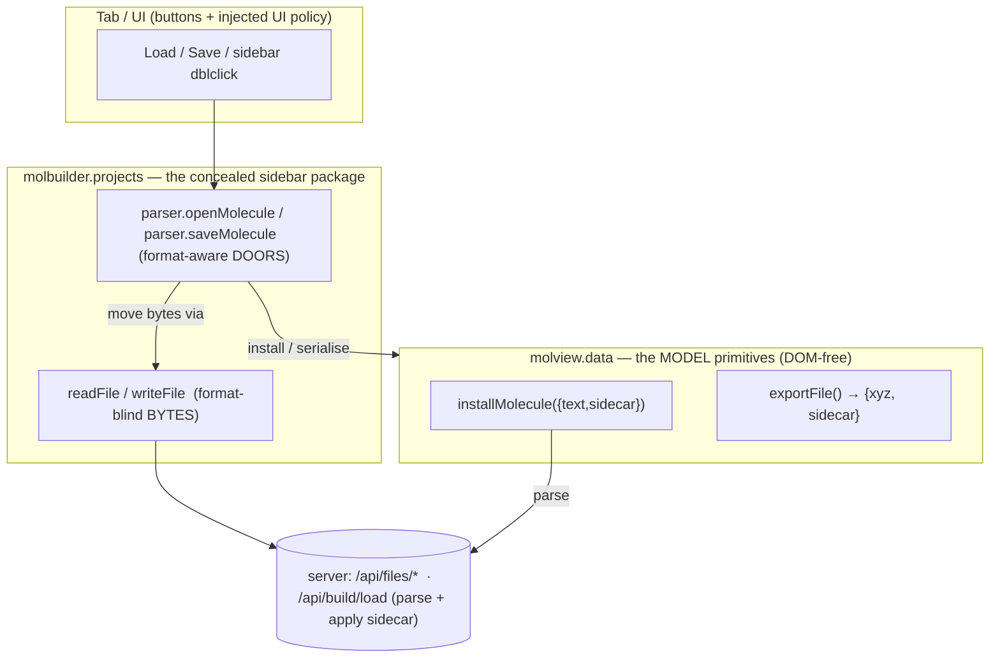
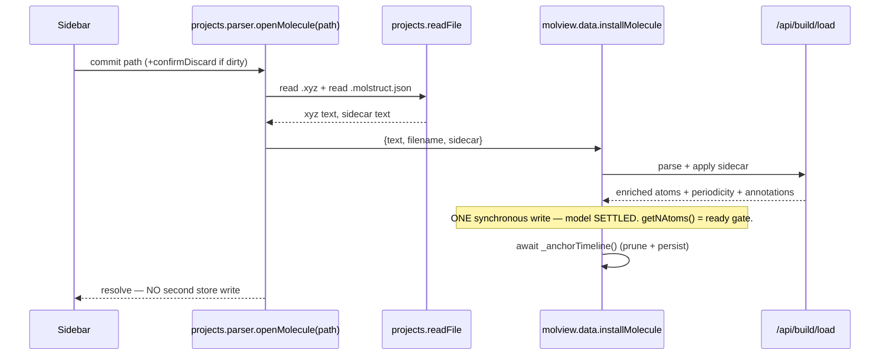

# Structure load / save contract — the parser doors + the model primitives

> **Authoritative contract for opening/saving a structure file.** The tab-facing doors are
> `projects.parser.openMolecule(path)` / `saveMolecule(path)` (in the concealed sidebar
> package); they move bytes through `projects.readFile`/`writeFile`, parse through the ONE
> server seam, and install/serialise through the model's primitives
> (`molview.data.installMolecule`/`exportFile`/`markSaved`). A tab calls a door and nothing
> below it. Code that reaches around the doors (a second file stack, a raw
> `/api/workingcopy` POST, poking the store) is wrong by definition.
>
> **Aspect C** of the Projects Sidebar module — see the master
> [`projects-sidebar.md`](projects-sidebar.md) (§ 0.2). **Companions:**
> [`molview-module.md`](molview-module.md) §19 (the model primitives the doors call);
> [`atom-annotations.md`](atom-annotations.md) (the sidecar schema `apply_to_structure`
> reads); [`save-flow.md`](save-flow.md) (the Save **panel** UI over `saveMolecule`).

---

## §0 The map — where every piece lives

| Concern | Home | Public name → `file:function` |
|---|---|---|
| **File bytes** (read/write ONE file, no parsing) | `molbuilder.projects` (`lib/projects/state.js`) | `readFile(path)` → `api.js:apiRead` → `/api/files/read` · `writeFile(path, text, {overwrite})` → `api.js:apiWrite` → `/api/files/write` |
| **Molecule DOORS** — the ONE tab-facing surface | **`molbuilder.projects.parser`** (`lib/projects/parser.js`) | **`openMolecule(path, {confirmDiscard})`** — LOAD `:58` · **`saveMolecule(path, {overwrite})`** — SAVE `:111` |
| **Model primitives** — called BY the doors | `molview.data` (`lib/molview/data-model.js`) | `installMolecule({text[,sidecar,source,…]})` — parse+install `:1182` · `exportFile()` → `{xyz, sidecar}` `:1652` · `markSaved(path)` `:876` |
| **Parse seam** (xyz/pdb text [+ sidecar] → enriched Structure JSON) | `web/blueprints/build.py` | `POST /api/build/load` `:634` — parses, applies in-body `sidecar` via `molstruct.load_text`+`apply_to_structure`, returns enriched `atoms`+`periodicity`+`annotations` |
| **Sidecar schema** (`.molstruct.json` ⇄ Structure) | `molbuilder/sidecars/molstruct.py` | `apply_to_structure(struct, dict)` `:467` · `load_text(text)` · `save(...)` `:412` · `sidecar_path_for(xyz)` `:90` |
| **Load + mount** (open a picked file AND show the card) | `molview.mount` (`lib/molview/mount.js`) | the shared "open + show the card" (§6) |

**Deleted (the old soup — a second file stack inside the model):**
`molview.data.openProjectFile` / `saveProjectFile` / `readWorkingCopy` (they hit
`/api/workingcopy/open|save`). **The MODEL owns no file endpoint; the DOORS own no
parsing** — the parser doors orchestrate `readFile`→`/api/build/load`→`installMolecule`.
(`/api/workingcopy/update` + `write-state`/`read-state` are a DIFFERENT concern —
session-draft persistence, owned by the workspace — and are untouched.)

---

## §1 Two layers, one concealed file package

The doors live in the **projects** package (the format-aware `parser` sub-namespace); they
call **`molview.data`** for the model. Dependency points ONE way — `projects.parser →
molview.data`, resolved by a **call-time** `window.molbuilder.molview.data` lookup, never a
static import, so there is **no** `projects→molview→projects` cycle.

| Layer | Owns | Never |
|---|---|---|
| **`projects`** byte layer (`readFile`/`writeFile`) | locating a file in the project dir + moving its **bytes** | parses a molecule; knows the model |
| **`projects.parser`** doors | orchestrating read→parse→install (load) and serialise→write (save); the `.xyz`↔`.molstruct.json` pairing | owns a parser itself (it calls `/api/build/load` + `installMolecule`) |
| **`molview.data`** model primitives | turning text (+sidecar) into the live molecule and back; the atomic install | fetches a file; owns a file endpoint |
| **tab / UI** | wiring buttons; UI policy (dirty-warning, overwrite-confirm — **injected**, not imported) | reaches past a door |

The byte layer knows the `.xyz`↔`.molstruct.json` *pairing* only as "which bytes travel
together" (so do `apiMove`/`apiCopy`/`delete`); **interpreting** the pair — parsing, applying
the sidecar schema — happens only inside `openMolecule` (via the server seam).

---

## §2 The doors

### Load — `projects.parser.openMolecule(path, { confirmDiscard? })`

A project-file **path** (the FILE door). (1) dirty-gate if `confirmDiscard` supplied
(`false` → `{ok:false, cancelled:true}`); (2) `projects.readFile(path)` → the `.xyz` text;
(3) `projects.readFile(sidecarPath)` → the `.molstruct.json` text (best-effort — a missing
sidecar is fine, not an error); (4) `molview.data.installMolecule({ text, filename:path,
sidecar })`, which `POST`s `/api/build/load {text, filename, sidecar}` (server parses +
applies the sidecar) and installs the enriched model in ONE synchronous write (§4). Returns
`{ok:true, payload}` | `{ok:false, cancelled|error}`.

> **Generated text is NOT a door call.** Generators (smiles/dna/…) have text and no file, so
> they call `molview.data.installMolecule({text})` directly — the model primitive, not the
> file door. `openMolecule` is *only* for a project-file path.

### Save — `projects.parser.saveMolecule(path, { overwrite? })`

(1) `molview.data.exportFile()` → `{xyz, sidecar}` (refuses a geometry↔labels desync →
`{ok:false, error}`); (2) `projects.writeFile(path, xyz, {overwrite})`; (3)
`projects.writeFile(sidecarPath, JSON.stringify(sidecar), {overwrite:true})` — the sidecar is
a dependent member of the pair, always overwritten; (4) `molview.data.markSaved(path)` —
clears dirty + re-anchors the store `sourceFile`. On an "exists" envelope from step (2) →
`{ok:false, needsOverwrite:true}` so the tab confirms + retries both writes with
`{overwrite:true}` (the dialog is UI policy).

> **`path` must be `.xyz`.** `saveMolecule` writes the model's **canonical XYZ**
> (`exportFile` produces only `{xyz, sidecar}`; there is no PDB serialiser). A `.pdb` path
> would receive XYZ bytes. **Asymmetry to know:** `openMolecule` *loads* a `.pdb` (the parse
> seam sniffs PDB), but `saveMolecule` can only *save* `.xyz`. (The shipped caller,
> `structure/save.js`, forces `.xyz`.)

**A save READS the model; a load WRITES it. Inverses over the one model.**

---

## §3 Rules every consumer follows

1. **Call a door.** Load a project file with `projects.parser.openMolecule`; save with
   `projects.parser.saveMolecule`. Generated text installs via `molview.data.installMolecule`.
   Do NOT add a second file stack, POST `/api/workingcopy/{open,save}` or `/api/files/*` raw,
   or poke `selection.adoptSession`/`setSourceFile` to "finish" a load/save.
2. **One store write per load** (§4). No second write after the "ready" signal.
3. **UI gates are injected, not imported** — the door + model layers stay DOM-free.
4. **The sidebar publishes a path; a door consumes it** — subscribe to `projects.onCommit`,
   hand the path to `openMolecule`.

---

## §4 SETTLE-BEFORE-READY — one write, and the race it prevents

`installMolecule` installs the FINAL model — atoms (sidecar-enriched), source, periodicity,
AND the cleared selection — in ONE synchronous write; the "ready" signals (`getNAtoms()`,
`openMolecule` resolves) fire at that write. **No second store write may follow** — it would
land after "ready" and clobber whatever a consumer already did on the settled structure.

> **The 2026-07 regression that defined this.** The load used to install atoms (open the
> ready gate) then `await adoptSession({selection:[]})` ~300 ms later, wiping a click made in
> the gap. Fix: sidecar atoms ride in on the single install; the trailing write is gone.

---

## §5 Consumer map (shipped)

| Consumer | `file:function` | Call |
|---|---|---|
| Modify — Load / sidebar dblclick | `modify/selection-bootstrap.js:_commitFile` | `projects.parser.openMolecule(path, {confirmDiscard})` |
| Modify — Save panel | `lib/structure/save.js:_saveDataset` | `projects.parser.saveMolecule(path, {overwrite})` + dialog |
| Transport — sidebar commit | `lib/transport/core.js:_showInMolview` | `projects.parser.openMolecule(path)` + `molview.mount` (§6) |
| Spectra — sidebar commit | `spectra/viewer.js:_commitStructure` | `projects.parser.openMolecule(path)` + `molview.mount` (§6) |
| Results structure inspector | `lib/inspectors/structure.js` | `projects.parser.openMolecule(path)` + `molview.mount` (§6) |
| Structure-optimization | `static/viewer.js:_commitStructure` | `projects.parser.openMolecule(path)`; reads state off the model |
| Generators (smiles/dna/…) | `lib/structure/*.js` → `page.js:loadIntoCanvas` | `molview.data.installMolecule({text})` (not a file door) |
| Trajectory inspector | `lib/trajectory/core.js` | `molview.data.installMolecule({text})` + `reloadFrames(...)` (frames, not a project-file open) |

Clicking a **`.molstruct.json`** in the sidebar shows its JSON via the `source` inspector —
it is a *metadata* file; open the paired `.xyz` to view the structure.

---

## §6 Load + mount is ONE shared path

Transport, Spectra, and the Results inspector each "open the picked file via
`projects.parser.openMolecule(path)`, then `molview.mount(host, ws, {mode, owner})`." That
pairing is a single concern (show a picked molecule); a tab supplies only host / mode /
owner. When each hand-rolled its own copy they drifted — the inspector's read raw XYZ and
dropped the sidecar (the label bug). One path = the sidecar-correct load, for every tab.

---

## §7 Status

**Shipped (2026-07).** Server seam applies the in-body sidecar (`build.py`,
`sidecars/molstruct.py:load_text`); the doors live in `lib/projects/parser.js`; every
consumer above is repointed; the old `molview.data` file stack + the standalone
`/api/workingcopy/open|save` door path are gone. This doc is the contract, not a migration
plan.
