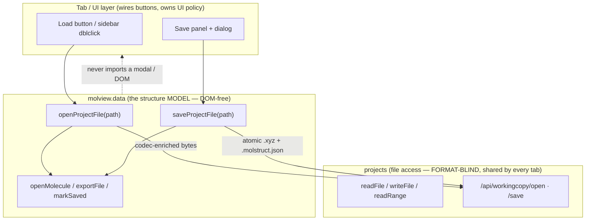
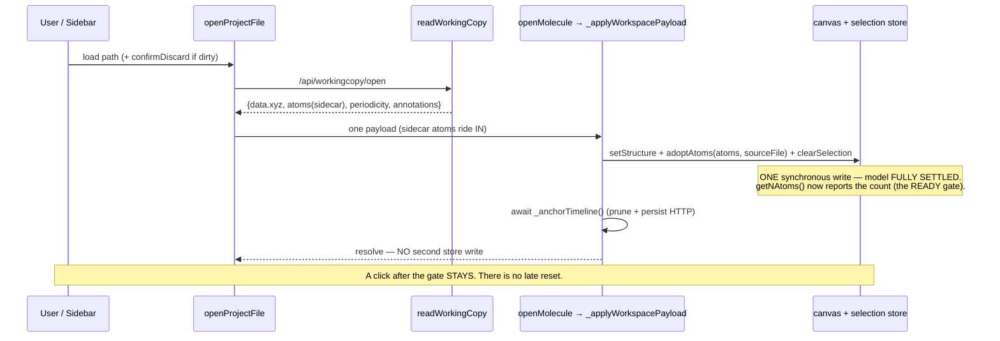

# Structure load / save contract — the ONE way a structure file is opened and saved

> **This is the authoritative contract for loading a saved structure file into the
> workspace and saving it back.** Any code that opens or writes a project structure
> file MUST go through the doors named here. Code that reaches around them (poking the
> selection store, re-reading the file, doing a second install) is incorrect by
> definition — the contract is right and the code is wrong.
>
> **Companion docs:**
> * [`molview-module.md`](molview-module.md) §19 — the `molview.data` model + its API
>   (the doors live here); §19.3.1 the atomic-load internals + the load/save diagrams.
> * [`workspace-contract.md`](workspace-contract.md) §4 — the persistence model
>   (session drafts, restore) the file save is distinct from.
> * [`save-flow.md`](save-flow.md) — the Save-**panel UI** (dialog, button states).
> * [`projects-sidebar.md`](projects-sidebar.md) — the file-access layer these doors
>   call into for bytes + paths.

---

## §1 Why this exists — the two-layer split

Loading or saving a *structure file* touches **two** concerns that live in **two**
different modules. Keeping them separate is the whole design:

| Layer | Owns | Knows about |
|---|---|---|
| **projects** (`lib/projects/*`) | file bytes + paths, the directory tree, the current sidebar selection, overwrite/mtime | **bytes + paths only — format-blind.** Serves *every* tab (structure, spectra, transport, logs) |
| **molview.data** (`lib/molview/data-model.js`) | the in-memory structure model + its (de)serialisation | **structures** — the `.xyz` + `.molstruct.json` pairing, regions/frozen, cell, frames |
| **tab / UI** (`selection-bootstrap.js`, `save.js`, `save-dialog.js`) | wiring buttons; **UI policy** — the dirty-canvas warning, the overwrite confirm, status banners | which button the user clicked |

**The load/save contract belongs to `molview.data`, NOT the projects sidebar.** The
sidebar is format-blind and shared; if structure load/save lived there, it would have
to learn xyz/pdb parsing, sidecar pairing, regions, cells — and the next data type
(a spectrum, a trajectory) would demand its own branch. Structure knowledge lives in
MolView. The sidebar stays the file layer MolView *calls into* for bytes.

**But it isn't wholly MolView's either.** UI policy — the dirty-canvas warning before
a load, the overwrite confirm on save — is DOM and belongs to the tab. `molview.data`
stays DOM-free: those gates are **injected** (an async predicate the tab supplies), so
no modal is imported into the data layer.

---

## §2 The doors — `molview.data.openProjectFile` / `saveProjectFile`

These are the ONE coordinator. A tab calls one method; it never hand-wires the seam.

### `openProjectFile(path, { confirmDiscard? }) → Promise<{ok, payload} | {ok:false, cancelled|error}>`

1. If the canvas is dirty and `confirmDiscard` was supplied, await it; `false` → cancel
   (a fresh open discards unsaved edits).
2. `readWorkingCopy(path)` — ONE `/api/workingcopy/open` returns the codec-enriched
   data: the canonical **text** (`data.xyz`), the **sidecar atoms** (regions/frozen
   already applied by `codec.load`), **periodicity**, **annotations**.
3. `openMolecule({ text, filename, source:{kind:file}, periodicity, annotations, atoms })`
   — the single open door installs the WHOLE model (canvas + selection store + render)
   in **ONE synchronous store write** (§4).
4. Fallback (only if `readWorkingCopy` returned no atoms): `refreshAtoms()` — refetches
   the sidecar-applied rows **without** resetting the selection.

### `saveProjectFile(path, { overwrite }) → Promise<{ok, path} | {ok:false, needsOverwrite|error}>`

1. `exportFile()` — serialise the SETTLED model to `{xyz, sidecar}` (refuses a
   geometry↔labels desync → returns null → `{ok:false, error}`).
2. POST `/api/workingcopy/save` — writes BOTH files atomically.
3. On 409 (file exists) → `{ok:false, needsOverwrite:true}` so the caller confirms +
   retries with `{overwrite:true}` (the dialog is UI policy, stays in the tab).
4. On success → `markSaved(path)` — clears the canvas dirty bit AND re-anchors the
   selection store's `sourceFile` (one door; the tab never pokes the store).

**A save READS the model; it never writes it.** Load writes the model from bytes; save
reads bytes from the model. They are inverses over the one model.

---

## §3 The rules every consumer MUST follow

1. **Use the doors.** Load a project file with `openProjectFile`; save with
   `saveProjectFile`. Do NOT: re-read the file yourself, call `openMolecule` +
   a follow-up store write, POST `/api/workingcopy/{open,save}` raw, or call
   `selection.adoptSession` / `setSourceFile` / `adoptAtoms` to "finish" a load/save.
2. **One store write per load — settle before ready.** See §4. Never do a second store
   write after the load's "ready" signal.
3. **UI gates are injected, not imported.** The dirty-warning and overwrite-confirm are
   the tab's; the data layer receives them as callbacks / return signals and stays
   DOM-free.
4. **The source re-anchor lives in `markSaved`.** After a save-as, `markSaved(path)`
   re-points the store's `sourceFile`; consumers do not.

---

## §4 SETTLE-BEFORE-READY — why one write, and the race it prevents

The load installs the FINAL model — atoms (sidecar-enriched), source path, periodicity,
**and** the cleared selection — in ONE synchronous write, and the load's observable
"ready" signals (`getNAtoms()` becomes the new count; `openProjectFile` resolves) fire
at that write. **No second store write may follow**, because it would land *after* the
ready signal and clobber whatever a consumer already did on the settled structure.

> **The 2026-07 regression that defined this rule.** The Modify load used to call
> `loadIntoCanvas(...)` (which installed atoms → opened the ready gate) and *then*
> `await store.adoptSession({selection: [], ...})` to overlay the sidecar atoms. The
> `adoptSession` ran ~300 ms later (after `await _anchorTimeline()`'s HTTP) and reset
> the selection to `[]` — wiping any atom the user clicked in the gap. Intermittent (a
> race between the out-of-process click and the in-process second write; worse under
> load). The fix folded the sidecar atoms into the single `openMolecule` call and
> deleted the trailing write — the origin of `openProjectFile`.

---

## §5 Where each consumer sits (the current map)

| Consumer | Flow | Uses |
|---|---|---|
| **Modify tab** — Load button / sidebar dblclick (`selection-bootstrap._commitFile`) | load a project file | `molview.data.openProjectFile(path, {confirmDiscard})` |
| **Modify tab** — Save panel (`structure/save.js`) | save a project file | `molview.data.saveProjectFile(path, {overwrite})` + the overwrite dialog |
| **Generators** (smiles/dna/peptide/rna/name/file) | install generated TEXT (no path) | `structurePage.loadIntoCanvas(text)` → `openMolecule({text})` (no sidecar, no project file) |
| **Results structure inspector** (`inspectors/structure.js`) | render a results file, read-only, with host-supplied view params | `openMolecule({text, filename, periodicity})` directly (not a project working-copy; caller owns text + periodicity override) |
| **Structure-optimization tab** (`static/viewer.js`, `index.html`) | **pre-MolView** — its own load path | *not migrated;* deferred with the structure-optimization/fdf work |

The generators and the read-only inspector already go through the **single open door**
(`openMolecule`) — they are not project-file load/save and correctly do not use the
coordinator. The structure-optimization tab predates MolView and is a separate,
deferred migration.
