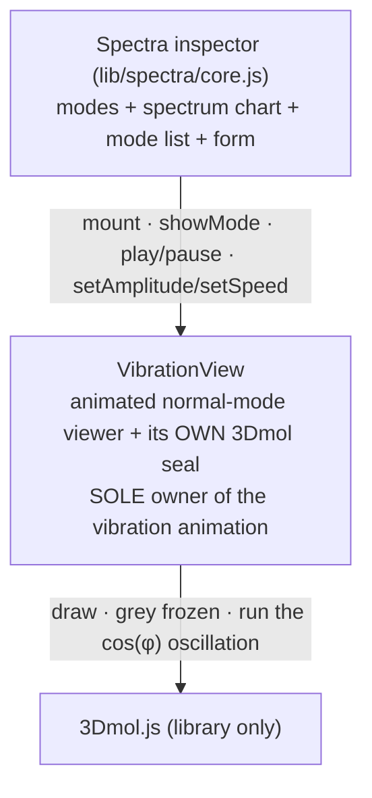
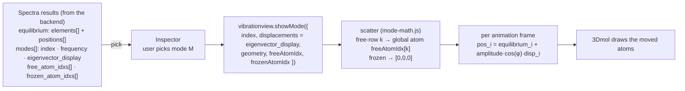
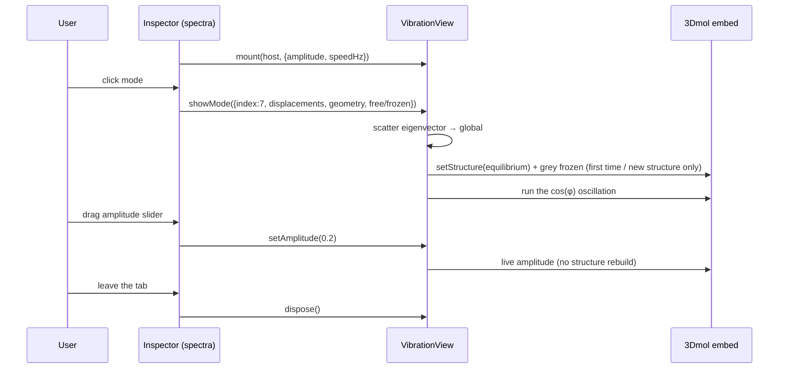

# VibrationView module — contract

> **VibrationView** is a **concealed, embeddable package for one job: displaying a
> vibrational normal mode as an animation.** You hand it the equilibrium geometry + the
> mode's displacement vectors; it shows the molecule oscillating and exposes **play /
> amplitude / speed** through its API — the host renders the control widgets and wires them
> to that API (the inspector keeps its existing sliders). It does **not** select atoms, edit,
> tile a k-grid, or draw a spectrum — it animates one mode and nothing else.
>
> It is a **sibling of MolView** ([`molview-module.md`](molview-module.md)), not a part of it.
> Both conceal a 3-D viewer for a single purpose: **MolView** = interactive structure
> editing + selection; **VibrationView** = animated normal-mode display. They share no code
> path — MolView never animates, VibrationView never selects.

---

## For developers — start here

The **spectra inspector** (`lib/spectra/core.js`, on `/results`) computes vibrational modes
and draws the spectrum chart + mode list. When the user picks a mode, the inspector should
**not** reach into a raw 3Dmol viewer and drive an animation loop — that entangles vibration
playback with the shared viewer. Instead it asks **VibrationView** to show the mode:

```
const vib = vibrationview.mount(hostEl, { geometry, freeAtomIdx, frozenAtomIdx });
vib.showMode(mode);          // {index, displacements}  -> animate it
// user drags the sliders / clicks play:
vib.setAmplitude(0.2);       // Å
vib.setSpeed(1.5);           // Hz
vib.play();  vib.pause();
vib.dispose();               // on teardown / tab leave
```

The inspector owns the **science + chart + mode list + the control widgets**; VibrationView
owns the **animated 3-D view** and exposes playback through its API. One small API between
them — the inspector's play/amplitude/speed widgets call `vib.play()` / `setAmplitude` /
`setSpeed`; VibrationView renders no control UI of its own.

### A. Architecture — the inspector drives VibrationView, which drives 3Dmol



The inspector never touches a viewer's animation API; VibrationView is the single door to
vibration playback, and it wraps 3Dmol.js **itself** — it does not route through MolView's
`mol-viewer-embed`. (Target per §4. The shipped Phase-1 interim still borrows the shared embed;
Phase 2 replaces that with VibrationView's own seal so the two modules share no code path.)

### B. What one mode looks like on screen — the animation

VibrationView shows the **equilibrium** structure and oscillates every atom about its
equilibrium position along the mode's displacement vector:

```
   pos_i(φ) = equilibrium_i  +  amplitude · cos(φ) · displacement_i
```

- `φ` advances each animation frame at a rate set by **speed** (Hz); **amplitude** (Å) scales
  the excursion. Both are **live** — changing them does not rebuild the structure.
- **Frozen atoms have a zero displacement vector** → they stay put, and are drawn greyed so
  the moving (free) atoms read clearly.
- Selecting a different mode swaps in that mode's displacement vector; the equilibrium
  geometry is unchanged, so **the camera stays where you left it** — VibrationView re-frames
  only when a *different* structure loads, not on every mode swap.

### C. The data — from the results to a moving atom

The inspector holds the spectra results and hands VibrationView one mode at a time.
VibrationView does the scatter + the per-frame math; none of the science lives here.



### D. A session — how the inspector uses it

You are the inspector; VibrationView is a black box you drive through its API. Five moments:

1. **Mount** it into an empty host (once).
2. **User picks a mode** → `showMode(mode)` with the geometry + eigenvector + free/frozen.
3. **User drags a slider** → `setAmplitude` / `setSpeed` (live; no rebuild).
4. **User clicks play / pause** → `play()` / `pause()`.
5. **Leaving the tab, or new results load** → `dispose()`.



---

## §1 The API — the contract with the inspector

```
vibrationview.mount(hostEl, opts) -> handle
```

- **`hostEl`** — an empty element; VibrationView builds the animated **viewer** into it. It
  renders **no control widgets** — the host owns the play/amplitude/speed UI and wires it to
  the handle (§1) methods.
- **`opts`** (all optional — the structure may instead travel with the mode, below):
  - `geometry?` — `{ elements: string[], positions: [x,y,z][] }` — the equilibrium structure
    (global atom order).
  - `frozenAtomIdx?` — `number[]` (0-based global) — drawn greyed, never moved.
  - `freeAtomIdx?` — `number[]` (0-based global) — the map from an eigenvector's **free-atom
    row** to a **global** atom (see §2). Omit when a mode carries global-length displacements.
  - `amplitude?` / `speedHz?` — initial control values (defaults `0.15` Å, `1.0` Hz).

A **mode is defined against a structure**, so `geometry` / `freeAtomIdx` / `frozenAtomIdx` may
be passed at mount (one structure, browse its modes) **or carried on each `showMode`** (the
structure differs between results). Per-mode fields override the mount defaults. The
equilibrium baseline is (re)drawn **only when the geometry or frozen set actually changes** —
browsing modes of one structure never rebuilds it.

`handle`:

| Call | Meaning |
|---|---|
| `showMode(mode)` | Animate `mode` — `{ index, displacements, geometry?, freeAtomIdx?, frozenAtomIdx? }` (see §2). Adopts any structure it carries, (re)draws the baseline if it changed, then oscillates. |
| `play()` / `pause()` / `isPlaying()` | Playback control + state. |
| `setAmplitude(å)` / `setSpeed(hz)` | Live control — no structure rebuild. |
| `getMode()` | The currently-shown mode index (or `null`). |
| `dispose()` | Tear down the viewer, the loop, and the controls. |

The handle exposes **no internals** — not the 3Dmol viewer, not the embed handle. The
inspector drives modes through this API only.

## §2 Data model — the mode + the eigenvector scatter

A **mode** is `{ index, displacements, frequency? }`:

- `index` — the mode's identity (the spectra results' `index_1based`).
- `displacements` — `[dx,dy,dz][]`:
  - **with a `freeAtomIdx` map** (the spectra case): the rows are **free-atom-indexed** and
    the map is **authoritative** — row `k` scatters to global atom `freeAtomIdx[k]`, and every
    frozen / un-mapped atom gets `[0,0,0]` (correct even if the free set is a permutation, not
    just a length shortcut). This is the spectra invariant (eigenvectors are free-atom-indexed;
    `docs/tabs/spectra/spec.md` §5.1) — VibrationView owns the scatter, so the inspector hands
    over the raw `eigenvector_display` and nothing else.
  - **without a map**: the rows are already in **global** order (one per atom), used directly.

VibrationView **does not compute modes** — the eigenvectors, frequencies, and free/frozen
partition come from the spectra backend via `molbuilder/parse/`; the inspector holds the
results and passes the relevant mode in. VibrationView only *animates* what it is given.

## §3 Boundary — VibrationView vs the inspector vs the viewer

| VibrationView owns | Outside |
|---|---|
| Its OWN concealed 3Dmol view (draw, frozen-atom greying, camera); the cos(φ) oscillation loop; the eigenvector→global scatter; the playback **API** | **Inspector:** the spectrum chart (Plotly), the mode list, the results/form state, choosing which mode to show, **and the control widgets** (play/amplitude/speed sliders) wired to the API |
| Concealing vibration playback behind §1 (the single door) | **Upstream (parse / backend):** computing eigenvectors, frequencies, the free/frozen partition |
| Sealing 3Dmol for the vibration job — **separately and completely from MolView** (no shared wrapper/module, no shared code path) | **MolView + its `mol-viewer-embed`:** a *sibling* module sealing 3Dmol for editing/selection. VibrationView never imports it; they share only the 3Dmol.js **library** |

Explicitly **NOT** in VibrationView: atom selection / picking, k-grid, structure editing,
measurement, the spectrum chart. Those are MolView's job or the inspector's — never here.

## §4 Delivery — the target is a SEPARATE seal, reached in two phases

**The target (the finished module): VibrationView seals its own 3Dmol, completely separately
from MolView.** It owns a concealed 3Dmol wrapper dedicated to the vibration job — it draws the
equilibrium structure, greys frozen atoms, frames the camera, and runs the `cos(φ)` oscillation
loop **itself** — with **no dependency on `mol-viewer-embed.js`**. This is the opening principle
made real: VibrationView and MolView are **sibling** modules that each seal 3Dmol for their own
single purpose and **share no code path**. MolView keeps `mol-viewer-embed` for its job
(structure editing + selection); VibrationView never touches it, and MolView never touches
VibrationView. Consequences: (a) the shared viewer carries **no** vibration concern; (b)
removing or changing either module cannot affect the other; (c) the vibration animation is
testable in isolation from the shared-viewer e2e suite. (What the two modules legitimately share
is the 3Dmol.js **library** — the third-party renderer — not each other's wrapper/module.)

**Phase 1 — conceal, via the shared embed (INTERIM, shipped).** As a first shippable step,
VibrationView `mount` reached the §1 API by wrapping the *existing* shared viewer
(`viewer.embed`, `pick:{mode:"none"}`) and driving its `setAnimation({kind: "vibration",
displacements, amplitude, speedHz})` + `playAnimation`/`pauseAnimation` under the hood. The
spectra inspector migrated onto the §1 API and stopped calling `setAnimation` itself. This got
the API boundary right but left a **temporary shared code path** (VibrationView borrowing
MolView's embed) — the one thing the target forbids.

**Phase 2 — seal separately (removes the shared path; the actual finish).** Replace the borrowed
embed with VibrationView's **own** concealed 3Dmol wrapper: it constructs and owns its 3Dmol
viewer, draws + greys + frames, and owns the oscillation loop end-to-end. When this lands, the
vibration `setAnimation` kind leaves `mol-viewer-embed.js` entirely, VibrationView imports no
MolView code, and the two modules share nothing but the 3Dmol.js library. This is what makes
VibrationView a true **drop-in module**, finalized as we walk the individual tabs that use it.

> **Trajectory (MD frames) is NOT part of this.** VibrationView is *display-only motion* for one
> vibrational mode. A trajectory viewer wants MolView's full inspection (select / measure /
> k-grid) across a **sequence of frames**, so it is an **expansion of MolView** (a frame
> dimension), not a VibrationView concern — see `molview-module.md`. It never enters this task.

## §5 Test affordances

- Node-testable pure logic: the **eigenvector scatter** (free-atom rows → global, frozen →
  zero) and the **`pos_i(φ)` sample** for a given φ/amplitude — pure functions, no DOM/3Dmol.
- Browser e2e (Phase 1): mount VibrationView, `showMode`, assert the free atoms displace and
  the frozen atoms do not; `setAmplitude`/`setSpeed` change the motion without a rebuild;
  `pause()` stops it.
- The handle exposes a test-only hook to read the drawn coordinates (mirroring MolView's
  `__molview_test_handle`), so e2e checks displacement without frame-timing races.

---

## Decisions log

| Date | Decision |
|---|---|
| 2026-07-09 | VibrationView carved out as a concealed package for normal-mode animation, a **sibling** of MolView (not part of it). Confirmed by code: no `lib/molview/` module references animation; the embed's `setAnimation` is used only by `spectra/core.js` (vibration) + `trajectory/core.js` (frames). Phase 1 wraps the shared embed's vibration loop + migrates the spectra inspector; Phase 2 later extracts the loop out of the shared viewer. |
| 2026-07-09 | **Phase 1 shipped.** 1a: `lib/vibrationview/{mode-math,vibrationview}.js` + node tests. 1b: `spectra/core.js` migrated onto the API (`state.handle`→`state.vib`; `_scatterModeDisplacements` + `_applyModeViewerStyle` deleted); scripts registered on `results.html`/`spectra.html`; `test_spectra_scatter_js.py` retired (superseded by `test_vibrationview_mode_math_js.py`). Controls stayed in the inspector (wired to the API). Migration revealed geometry travels **per-mode** (not mount-only), so `showMode` takes `{geometry, freeAtomIdx, frozenAtomIdx}` and redraws the baseline only on change. **Phase 2 (own seal) not started** — Phase 1 still borrows the shared embed. |
| 2026-07-14 | **Target clarified — SEPARATE SEAL.** The finished module wraps 3Dmol.js **itself** and shares **no code path** with MolView's `mol-viewer-embed` (realizing the opening principle). Phase-1's shared-embed wrap is an INTERIM that got the §1 API right but left a temporary shared path; Phase 2 = give VibrationView its own concealed 3Dmol wrapper (draw / grey / camera / cos(φ) loop) so the vibration `setAnimation` kind leaves `mol-viewer-embed.js` entirely and the two modules share only the 3Dmol.js library. §3/§4 + the §A diagram updated to describe the own-seal target. Trajectory explicitly excluded (it is a MolView frame-dimension expansion). Finalized as we walk the tabs that use it; spectra-side comments/tests already de-referenced the old raw-3Dmol language (2026-07-14). |
