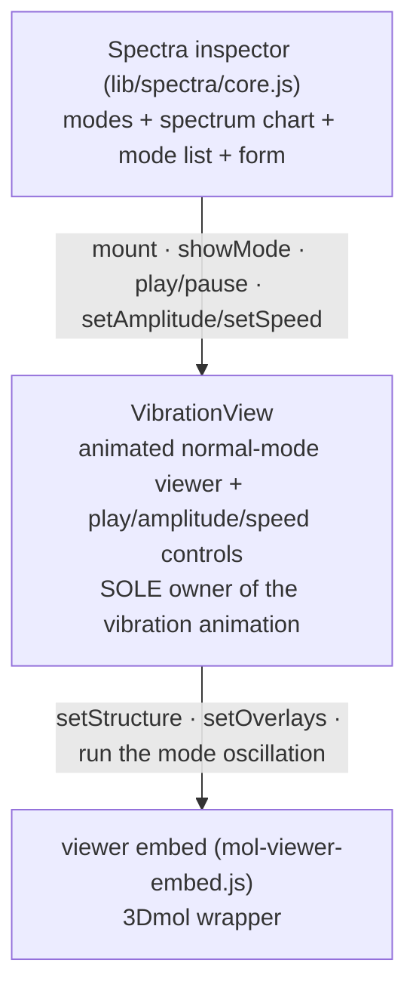

# VibrationView module — contract

> **VibrationView** is a **concealed, embeddable package for one job: displaying a
> vibrational normal mode as an animation.** You hand it the equilibrium geometry + the
> mode's displacement vectors; it shows the molecule oscillating and exposes **play /
> amplitude / speed** through its API — the host renders the control widgets and wires them
> to that API (the inspector keeps its existing sliders). It does **not** select atoms, edit,
> tile a k-grid, or draw a spectrum — it animates one mode and nothing else.
>
> It is a **sibling of MolView** ([`molview-module.md`](molview-module.md)), not a part of it.
> Both conceal a 3-D viewer for a single purpose: **MolView** = interactive structure
> editing + selection; **VibrationView** = animated normal-mode display. They share no code
> path — MolView never animates, VibrationView never selects.

---

## For developers — start here

The **spectra inspector** (`lib/spectra/core.js`, on `/results`) computes vibrational modes
and draws the spectrum chart + mode list. When the user picks a mode, the inspector should
**not** reach into a raw 3Dmol viewer and drive an animation loop — that entangles vibration
playback with the shared viewer. Instead it asks **VibrationView** to show the mode:

```
const vib = vibrationview.mount(hostEl, { geometry, freeAtomIdx, frozenAtomIdx });
vib.showMode(mode);          // {index, displacements}  -> animate it
// user drags the sliders / clicks play:
vib.setAmplitude(0.2);       // Å
vib.setSpeed(1.5);           // Hz
vib.play();  vib.pause();
vib.dispose();               // on teardown / tab leave
```

The inspector owns the **science + chart + mode list + the control widgets**; VibrationView
owns the **animated 3-D view** and exposes playback through its API. One small API between
them — the inspector's play/amplitude/speed widgets call `vib.play()` / `setAmplitude` /
`setSpeed`; VibrationView renders no control UI of its own.

### A. Architecture — the inspector drives VibrationView, which drives 3Dmol



The inspector never touches the viewer's animation API; VibrationView is the single door to
vibration playback. (Contrast: today the inspector calls `handle.setAnimation({kind:
"vibration"})` on the shared embed directly — the residue this package replaces.)

### B. What one mode looks like on screen — the animation

VibrationView shows the **equilibrium** structure and oscillates every atom about its
equilibrium position along the mode's displacement vector:

```
   pos_i(φ) = equilibrium_i  +  amplitude · cos(φ) · displacement_i
```

- `φ` advances each animation frame at a rate set by **speed** (Hz); **amplitude** (Å) scales
  the excursion. Both are **live** — changing them does not rebuild the structure.
- **Frozen atoms have a zero displacement vector** → they stay put, and are drawn greyed so
  the moving (free) atoms read clearly.
- Selecting a different mode swaps in that mode's displacement vector (and re-frames); the
  equilibrium geometry is unchanged.

---

## §1 The API — the contract with the inspector

```
vibrationview.mount(hostEl, opts) -> handle
```

- **`hostEl`** — an empty element; VibrationView builds the animated **viewer** into it. It
  renders **no control widgets** — the host owns the play/amplitude/speed UI and wires it to
  the handle (§1) methods.
- **`opts`** (all optional — the structure may instead travel with the mode, below):
  - `geometry?` — `{ elements: string[], positions: [x,y,z][] }` — the equilibrium structure
    (global atom order).
  - `frozenAtomIdx?` — `number[]` (0-based global) — drawn greyed, never moved.
  - `freeAtomIdx?` — `number[]` (0-based global) — the map from an eigenvector's **free-atom
    row** to a **global** atom (see §2). Omit when a mode carries global-length displacements.
  - `amplitude?` / `speedHz?` — initial control values (defaults `0.15` Å, `1.0` Hz).

A **mode is defined against a structure**, so `geometry` / `freeAtomIdx` / `frozenAtomIdx` may
be passed at mount (one structure, browse its modes) **or carried on each `showMode`** (the
structure differs between results). Per-mode fields override the mount defaults. The
equilibrium baseline is (re)drawn **only when the geometry or frozen set actually changes** —
browsing modes of one structure never rebuilds it.

`handle`:

| Call | Meaning |
|---|---|
| `showMode(mode)` | Animate `mode` — `{ index, displacements, geometry?, freeAtomIdx?, frozenAtomIdx? }` (see §2). Adopts any structure it carries, (re)draws the baseline if it changed, then oscillates. |
| `play()` / `pause()` / `isPlaying()` | Playback control + state. |
| `setAmplitude(å)` / `setSpeed(hz)` | Live control — no structure rebuild. |
| `getMode()` | The currently-shown mode index (or `null`). |
| `dispose()` | Tear down the viewer, the loop, and the controls. |

The handle exposes **no internals** — not the 3Dmol viewer, not the embed handle. The
inspector drives modes through this API only.

## §2 Data model — the mode + the eigenvector scatter

A **mode** is `{ index, displacements, frequency? }`:

- `index` — the mode's identity (the spectra results' `index_1based`).
- `displacements` — **per-atom** `[dx,dy,dz][]`. Two accepted forms:
  - **global-length** (`geometry.elements.length` rows): used directly.
  - **free-atom-length** (one row per free atom): VibrationView **scatters** it to global
    order using `freeAtomIdx` — row `k` → global atom `freeAtomIdx[k]`; every frozen atom
    gets `[0,0,0]`. This is the spectra invariant (eigenvectors are free-atom-indexed;
    `docs/tabs/spectra/spec.md` §5.1) — VibrationView owns the scatter so the inspector hands
    over the raw `eigenvector_display` and nothing else.

VibrationView **does not compute modes** — the eigenvectors, frequencies, and free/frozen
partition come from the spectra backend via `molbuilder/parse/`; the inspector holds the
results and passes the relevant mode in. VibrationView only *animates* what it is given.

## §3 Boundary — VibrationView vs the inspector vs the viewer

| VibrationView owns | Outside |
|---|---|
| The animated 3-D view; the cos(φ) oscillation loop; the eigenvector→global scatter; frozen-atom greying; the playback **API** | **Inspector:** the spectrum chart (Plotly), the mode list, the results/form state, choosing which mode to show, **and the control widgets** (play/amplitude/speed sliders) wired to the API |
| Concealing vibration playback behind §1 (the single door) | **Upstream (parse / backend):** computing eigenvectors, frequencies, the free/frozen partition |
| Reusing the 3Dmol viewer to draw + move atoms | **Viewer embed:** the raw 3Dmol wrapper (structure draw, overlays) |

Explicitly **NOT** in VibrationView: atom selection / picking, k-grid, structure editing,
measurement, the spectrum chart. Those are MolView's job or the inspector's — never here.

## §4 Delivery — two phases

**Phase 1 — conceal (wrap the shared embed).** VibrationView `mount` embeds the existing
viewer (`viewer.embed`, `pick:{mode:"none"}`) and drives its `setAnimation({kind:
"vibration", displacements, amplitude, speedHz})` + `playAnimation`/`pauseAnimation` under the
hood. The spectra inspector migrates onto VibrationView's §1 API and stops calling
`setAnimation` itself. Low risk; the shared embed is unchanged (trajectory still uses its
animation). This is the first shippable step.

**Phase 2 — extract (later).** Move the vibration oscillation loop **out of** the shared
`mol-viewer-embed.js` into VibrationView, so the shared viewer (and therefore MolView) no
longer carries a vibration concern at all. Trajectory-frame playback is a **separate** case
(a future `trajectoryview`, same pattern) — Phase 2 does not touch it. This is also what lets
the vibration animation be tested in isolation from the shared-viewer e2e suite.

## §5 Test affordances

- Node-testable pure logic: the **eigenvector scatter** (free-atom rows → global, frozen →
  zero) and the **`pos_i(φ)` sample** for a given φ/amplitude — pure functions, no DOM/3Dmol.
- Browser e2e (Phase 1): mount VibrationView, `showMode`, assert the free atoms displace and
  the frozen atoms do not; `setAmplitude`/`setSpeed` change the motion without a rebuild;
  `pause()` stops it.
- The handle exposes a test-only hook to read the drawn coordinates (mirroring MolView's
  `__molview_test_handle`), so e2e checks displacement without frame-timing races.

---

## Decisions log

| Date | Decision |
|---|---|
| 2026-07-09 | VibrationView carved out as a concealed package for normal-mode animation, a **sibling** of MolView (not part of it). Confirmed by code: no `lib/molview/` module references animation; the embed's `setAnimation` is used only by `spectra/core.js` (vibration) + `trajectory/core.js` (frames). Phase 1 wraps the shared embed's vibration loop + migrates the spectra inspector; Phase 2 later extracts the loop out of the shared viewer. |
