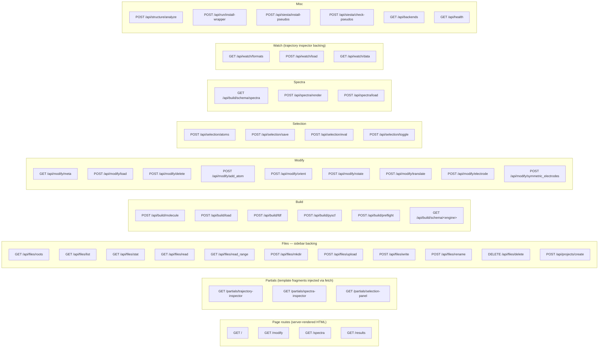
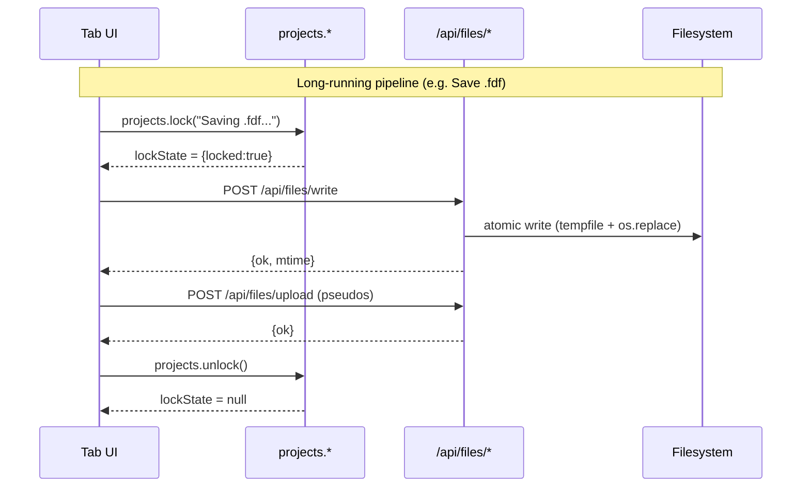

# Web API — HTTP endpoint reference (`/api/*`)

This is the sole source of truth for molbuilder's HTTP surface.
Every Flask route, request shape, and response envelope is
documented here. Per-tab UI behaviour lives in `docs/tabs/*.md`;
the JS contracts the responses feed are in
[`projects-sidebar.md`](projects-sidebar.md) and
[`atom-selection.md`](atom-selection.md).

**Implementation**: `molbuilder/web/blueprints/{build,files,modify,results,selection,spectra,watch}.py`
plus the dispatcher in `molbuilder/web/app.py`.

**Test layer**: `tests/test_web*.py`, `tests/test_selection_blueprint.py`,
`tests/spectra/test_blueprint.py`, `tests/watch/test_api_load.py`,
`tests/test_results_blueprint.py`.

---

## 1. Conventions

### 1.1 Uniform `{ok}` envelope

Every endpoint returns JSON with a top-level `ok: bool` field.
Decisions log #187 (2026-06-02) made this a hard rule — there
are no exceptions.

| Outcome | Shape |
|---|---|
| Success | `{ok: true, <payload fields>}` |
| Expected failure (validation, missing dep, etc.) | `{ok: false, error: "<human-readable>"}` |
| Optional structured failure | `{ok: false, error: "...", kind: "<machine-readable>", ...}` |

HTTP status codes classify (200 / 4xx / 5xx) but the body shape
**does not** depend on status — the JS apiX wrappers
(`lib/projects/api.js`) branch on `body.ok`, not on
`Response.ok`.

### 1.2 Path validation

Every endpoint that takes a `path` query parameter or JSON body
field runs it through `_resolve_within_roots` in `files.py`:

1. Expand `~` and `$VARS`.
2. Resolve to absolute (follows symlinks).
3. Reject raw `..` components in the user-supplied string
   (defense-in-depth — the resolution step already prevents
   escape, but rejecting `..` early gives a cleaner error).
4. The resolved path must equal-or-be-inside one of the roots
   returned by `Capabilities.file_picker_roots()` (today: a
   single `(<cwd>/projects, "projects")` entry).

Failures → HTTP 400 with `{ok: false, error: "..."}`.

### 1.3 Cache control — `cache: "no-store"` is the default

The JS-side central wrapper `_fetchEnvelope` in `lib/projects/api.js`
sets `cache: "no-store"` on every request unless the caller
overrides. This is the second half of the fix for the 2026-06-02
stale-dropdown bug (#192): without it the browser HTTP cache
served the previous response for identical GET URLs.

Server-side: `/api/files/*` GETs do NOT set Cache-Control headers
(the JS default suffices), but endpoints that serve immutable
content (`/partials/*`) may set long-cache headers in the future.

### 1.4 AbortSignal

Every JS apiX wrapper threads `opts.signal` into `fetch`. This
lets the sidebar's lock-cancel button (#159, 2026-05-27) abort
in-flight requests when the user clicks Cancel; without it a slow
write/upload/delete would leave the lock UI hung.

### 1.5 HTTP method semantics

| Method | Purpose | Cacheable? |
|---|---|---|
| GET | Read-only queries (list, stat, read, roots, schema, meta) | Yes (but see § 1.3) |
| POST | Mutations + complex queries (mkdir, write, upload, render, build, eval) | No |
| DELETE | Resource removal (`/api/files/delete`) | No |

`/api/files/rename` uses POST (not PUT) for parity with the rest
of the mutation surface; `/api/files/delete` uses DELETE because
the verb is unambiguous.

---

## 2. Endpoint index — all 45 routes



Sections § 3–§ 10 below cover each blueprint in detail.

---

## 3. `/api/files/*` — file explorer + sidebar backing

Implementation: `molbuilder/web/blueprints/files.py`.

This is the projects sidebar's full file-system surface. Eleven
endpoints (eight `/api/files/*`, one `/api/projects/create`, plus
`read_range` added 2026-06-02). The sidebar architecture +
public `projects.*` JS API on top of these endpoints lives in
[`projects-sidebar.md`](projects-sidebar.md).

### 3.1 Endpoint table

| Route | Method | Query / body | Success | Error codes |
|---|---|---|---|---|
| `/api/files/roots` | GET | — | `{ok, roots: [{path, label}]}` | — |
| `/api/files/list` | GET | `?path=&ext=` | `{ok, path, entries}` | 400 outside-root · 404 missing |
| `/api/files/stat` | GET | `?path=` | `{ok, path, kind, size, mtime}` | 400 · 404 |
| `/api/files/read` | GET | `?path=&max_bytes=` | `{ok, path, kind, size, mtime, text}` | 400 · 404 · 413 |
| `/api/files/read_range` | GET | `?path=&offset=&max_bytes=` | `{ok, path, offset, length, file_size, mtime, text, eof}` | 400 · 404 |
| `/api/files/mkdir` | POST | `{parent, name}` | `{ok, path}` | 400 · 403 · 409 |
| `/api/projects/create` | POST | `{name}` | `{ok, path, project}` | 400 · 409 |
| `/api/files/upload` | POST | multipart `file=`, form `path=` | `{ok, path}` | 400 · 409 · 413 |
| `/api/files/write` | POST | `{path, text, overwrite?, expected_mtime?}` | `{ok, path, relPath, size, mtime}` | 400 · 409 (mtime conflict) |
| `/api/files/rename` | POST | `{path, new_name}` | `{ok, path, old_path}` | 400 · 404 · 409 |
| `/api/files/delete` | DELETE | `{path, recursive?}` | `{ok}` | 400 · 404 · 409 |

### 3.2 Picker roots — single, fixed (v1)

`Capabilities.file_picker_roots()` returns exactly one entry:
`(<cwd>/projects, "projects")`. The directory is returned even
if it doesn't exist yet so the UI can show a "no projects yet"
empty state. The plural return shape (tuple of `(path, label)`)
is preserved as a future-proofing escape hatch — adding multi-
root is a one-line change in `Capabilities` — but the contract
today is **single-root, no CWD, no user-configurable additions**.

The deliberate scope: `projects/` is molbuilder's source of
truth for run state. Files outside (laptop downloads, scratch
dirs) must be moved or copied into
`projects/<project>/<topic>/<structure>/` first.

### 3.3 Entry shape (`/api/files/list`)

```json
{
  "name":  "BDT_water",
  "kind":  "directory",
  "size":  null,
  "mtime": 1715773200.0
}
```

`kind ∈ {"directory", "file", "symlink", "other"}`. Hidden
entries (leading dot) are filtered upstream — the picker is for
project files, not dotfiles. `size` is `null` for directories
and broken symlinks.

### 3.4 Range read — paginated source viewer

`GET /api/files/read_range` reads a byte window. Default
`max_bytes = 256 KB`, hard ceiling 16 MB. `offset` accepts:

- `0` or omitted: from start.
- Positive: from byte 0.
- Negative: from EOF (`offset = -N` returns the last N bytes,
  clamped to file size).

UTF-8 boundary trimming: if the chunk edge cuts a multi-byte
codepoint, the server walks back up to 3 bytes before returning,
so callers always receive valid UTF-8 even on arbitrary byte
windows. `eof: true` when the chunk reaches end-of-file (used
by the source inspector to disable the "Jump to end" button +
stop auto-paging).

Powers the v2 paginated source inspector (#119). Promoted to the
public projects.* surface in #189 as `projects.readRange(path,
offset, maxBytes)`.

### 3.5 Mutation flow + lock model



Lock semantics: see [`projects-sidebar.md`](projects-sidebar.md)
§ 8. The server side has no global lock — `os.replace` provides
single-writer atomicity per file, and the design assumes a
single user per session.

### 3.6 Write conflict detection

`POST /api/files/write` accepts an optional `expected_mtime`
field. If provided AND the on-disk mtime doesn't match, the
endpoint returns 409 with `{ok: false, error: "..."
actual_mtime: <current>}` — the JS layer surfaces this as an
edit-conflict dialog. Without `expected_mtime`, the write is
unconditional (last writer wins) but still atomic.

### 3.7 Canonical-topic protection (`delete` + `rename`)

The canonical subtree topics (`structure/`, `optimization/`,
`spectrum/`, `transport/` — see [`job-layout.md`](job-layout.md))
cannot be renamed or deleted. The check fires on the target's
basename at any depth. Returns 400 with a message naming the
protected name.

---

## 4. `/api/build/*` — structure synth + Generate

Implementation: `molbuilder/web/blueprints/build.py`.

### 4.1 Endpoint table

| Route | Method | Body | Success |
|---|---|---|---|
| `/api/build/molecule` | POST | `{kind, input, ...}` | structure JSON |
| `/api/build/load` | POST | JSON `{text, format?, filename?}` OR multipart `file=` | structure JSON + `source_format` |
| `/api/build/fdf` | POST | `{xyz, params, structure_path?}` | `{ok, fdf, system_label, issues}` |
| `/api/build/pyscf` | POST | `{xyz, params, structure_path?}` | `{ok, script, job_name, issues}` |
| `/api/build/preflight` | POST | `{xyz, engine, params}` | `{ok, issues}` |
| `/api/build/schema/<engine>` | GET | `engine ∈ {siesta, pyscf}` | `{ok, schema}` |

### 4.2 Common structure JSON shape

`/molecule` and `/load` both return:

```json
{
  "ok":            true,
  "xyz":           "...",
  "pdb":           "...",
  "n_atoms":       int,
  "n_residues":    int,
  "summary":       "<Structure 'title': N atoms, R residues, formula CxHyOz>",
  "title":         "...",
  "elements":      ["C", "H", ...],
  "atom_names":    [...],
  "residue_ids":   [...],
  "residue_names": [...],
  "chain_ids":     [...],
  "source_format": "xyz" | "pdb"          // /load only
}
```

Produced by `_shared.structure_to_dict()` so the shape is
uniform across blueprints (the modify endpoints return the same
shape — see § 5.5). Every per-atom array has length `n_atoms`.

### 4.3 `/api/build/molecule` payload

```json
{
  "kind":     "peptide" | "dna" | "rna" | "smiles" | "name",
  "input":    "...",
  "backend":   "auto" | "rdkit" | "amber" | "threedna",   // DNA/RNA only
  "form":      "B" | "A" | "Z",                            // DNA/RNA only
  "terminal":  "OH" | "5P" | "3P" | "PP",                  // DNA/RNA only
  "add_hydrogens":         bool,                            // DNA/RNA only
  "protonate_phosphates":  bool                             // DNA/RNA only
}
```

Backend resolution + dependency handling: see
[`docs/engines/builders.md`](../engines/builders.md).

### 4.4 `/api/build/load` payload variants

**JSON**:
```json
{ "text": "...", "format": "xyz|pdb|auto", "filename": "..." }
```

**Multipart**: `file=<uploaded file>`.

Format detection precedence: explicit `format` → filename
extension → content sniff (digits-only first line ⇒ xyz, else pdb).

### 4.5 `/api/build/fdf` and `/api/build/pyscf` payload

```json
{
  "xyz":             "...",         // required
  "params":          { ... },        // SiestaConfig / PySCFConfig fields
  "structure_path":  "..."           // optional; sidecar-bridge for frozen_atoms
}
```

The `structure_path` field (added 2026-05-25 in the three-stage
contract bridge) lets the endpoint apply `.molstruct.json`
sidecar state (frozen_atoms, regions) on top of the form
parameters before rendering. Without it, the user's /modify
selection panel state would never reach the emitted FDF/Python
even though the sidecar exists on disk.

`params` is a flat dict matching the dataclass field names; the
field metadata (label, unit, range, engine_key, …) is delivered
to the form via `/api/build/schema/<engine>` and is not
re-submitted on Generate.

Response on success: SIESTA returns `fdf` (text) + `system_label`
(basename); PySCF returns `script` (text) + `job_name`. Both
return `issues` (a list of validation warnings; empty on a
clean run).

### 4.6 `/api/build/preflight`

Validation-only sibling of `/fdf` and `/pyscf`. Same body shape
plus an `engine: "siesta" | "pyscf"` discriminator; returns just
`{ok, issues}` so the UI's issues panel can update live without
generating the file body.

**Error-response policy** (load-bearing — keeps the UI's
issues-panel a single render path):

- Missing `xyz`, unknown `engine`, or unparseable `xyz` → HTTP
  400 with `{"ok": false, "error": "<reason>"}`. These are
  programmer / wiring errors — the caller should fix the
  request rather than display the failure to the user.
- Config-parse failure (the form sent values that don't coerce
  into the dataclass — e.g. a non-numeric `mesh_cutoff`) → HTTP
  200 with `{"ok": true, "issues": [{"severity": "error",
  "message": "bad parameters: <exc>", "where": "config"}]}`.
  The same issues panel renders this alongside warn-severity
  field-range messages, so the UI doesn't need a separate
  error-handling branch for "user-typed-something-invalid".

### 4.7 `/api/build/schema/<engine>`

Read-only. Returns the JSON-friendly schema produced by
`_shared.dataclass_to_form_schema(cls, id_prefix)` for the
SIESTA / PySCF Build panels — the JS renderer
(`web/static/lib/form-schema.js`) consumes this directly so the
dataclass is the only place form-field declarations live.

**Response shape:**

```json
{
  "ok": true,
  "schema": {
    "config":    "SiestaConfig" | "PySCFConfig",
    "id_prefix": "p" | "py",
    "sections": [
      { "name": "<section legend>", "fields": [<field_schema>, ...] },
      ...
    ]
  }
}
```

**Per-field schema** (only the keys relevant to the inferred
`kind` are populated):

```json
{
  "name":       "<dataclass field name>",
  "id":         "<id_prefix>-<id_suffix>",     // HTML id; renderer/compat-engine contract
  "label":      "<human label>",
  "help":       "<tooltip text>",
  "default":    <JSON-serialisable default>,
  "optional":   bool,
  "tier":       "basic" | "advanced",
  "kind":       "checkbox" | "int" | "number" | "text"
                | "select" | "tri-select" | "int-triple",
  "engine_key": "<engine keyword>" | "(molbuilder: <marker>)",

  // number / int kinds:
  "min": ..., "max": ..., "step": ...,

  // select / tri-select kinds:
  "choices":     [...],
  "null_option": true,
  "null_label":  "(default)" | "(auto)" | ...,

  // int-triple (kgrid) kind:
  "labels":  ["x", "y", "z"],

  // display hints:
  "unit":    "Å" | "Ry" | "Hartree" | ...,
  "pattern": "<HTML5 pattern attr>"
}
```

**Contract:**

- **Opt-in**: only dataclass fields whose metadata declares a
  `"section"` key are exposed. Unsectioned fields (path-typed
  knobs, always-on flags, MD-only state) stay on the dataclass
  for the Python API + CLI but stay off the form.
- **ID stability**: default `id = f"{id_prefix}-{field_name.replace('_', '-')}"`.
  Fields with legacy short IDs (e.g. `p-temperature` for
  `electronic_temperature`, `p-block-size` for
  `parallel_block_size`) declare `metadata["id_suffix"]` so the
  compatibility engine + sessionStorage list stay
  backwards-compatible.
- **Section ordering**: the dataclass declares a class-level
  `_form_section_order` tuple to pin section order; otherwise
  sections appear in the order the first field declaring each
  section is declared.
- **`engine_key` mandatory** on every form field (decision
  2026-05-26). The rendered form shows a `<code class="schema-engine-key">`
  badge next to each label so the user can audit "what
  engine keyword does this control write". Pinned by
  `test_web.py::test_engine_key_present_on_every_{siesta,pyscf,spectra}_form_field`.
- **Unknown engine** → 404 with `{ok: false, error: "..."}`.
- **No POST equivalent**: the schema is the contract, not a
  validator hook. The existing `/api/build/{fdf,pyscf,preflight}`
  routes consume the JSON dict the JS collector produces from
  the rendered DOM.

**Pin-tests** (regression-protect schema → form binding):

- `tests/test_web.py::test_siesta_form_schema_matches_documented_layout`
- `tests/test_web.py::test_pyscf_form_schema_matches_documented_layout`

Both lock the section names + per-section field counts so a
stray field-reorder doesn't silently rearrange the UI.

---

## 5. `/api/modify/*` — per-atom edit ops

Implementation: `molbuilder/web/blueprints/modify.py`. Each
endpoint is a thin HTTP wrapper around a single `molbuilder.modify`
function.

### 5.1 Endpoint table

| Route | Method | Body |
|---|---|---|
| `/api/modify/meta` | GET | — |
| `/api/modify/load` | POST | `{xyz, format?}` |
| `/api/modify/delete` | POST | `{xyz, indices, atom_names?, residue_ids?, ...}` |
| `/api/modify/add_atom` | POST | `{xyz, element, anchor_index, offset, ...}` |
| `/api/modify/orient` | POST | `{xyz, anchor_indices, axis, center, ...}` |
| `/api/modify/rotate` | POST | `{xyz, axis, angle, center, ...}` |
| `/api/modify/translate` | POST | `{xyz, dx, dy, dz, ...}` |
| `/api/modify/electrode` | POST | `{xyz, element, plane, size, anchor_index, ...}` |
| `/api/modify/symmetric_electrodes` | POST | `{xyz, element, plane, size, anchor_indices, gap, ...}` |

### 5.2 `/api/modify/meta`

Returns the FCC element + plane dropdowns the Modify form's
electrode controls render from. Source of truth:
`molbuilder.modify.SUPPORTED_FCC_ELEMENTS` and `SUPPORTED_FCC_PLANES`.
Decisions log (2026-05-09): HTML must NOT duplicate these lists —
adding a metal in Python reaches the UI automatically.

### 5.3 Common request body

All `/api/modify/op` endpoints accept the same per-atom metadata
fields alongside the op-specific parameters:

```json
{
  "xyz":           "...",        // required
  "atom_names":    [...],         // optional; defaults rebuild from elements
  "residue_ids":   [...],
  "residue_names": [...],
  "chain_ids":     [...]
}
```

### 5.4 Response shape

Identical to `/api/build/molecule` (§ 4.2). Same
`_shared.structure_to_dict()` helper. The endpoint does NOT
write to disk; the user must explicitly upload / write the
result via `/api/files/write` to persist it.

### 5.5 Transport metadata carry-through

The endpoints route through the corresponding `molbuilder.modify.*`
functions which (post #186, 2026-06-02) carry `frozen_atoms` and
`regions` through every transformation:

- `delete`: reindexes survivors + drops deleted indices.
- `add_atom`, `electrode`, `symmetric_electrodes`: appends new
  atoms at the high end; existing indices unchanged; new atoms
  not auto-frozen / auto-regioned.
- `orient`, `rotate`, `translate`: pure passthrough.

See [`docs/types/structure.md`](../types/structure.md) for the
underlying Structure copy/concat contract.

---

## 6. `/api/selection/*` — selection store backing

Implementation: `molbuilder/web/blueprints/selection.py`.
The Python selection rule grammar lives in
[`selection.md`](selection.md); the JS selection store on top
lives in [`atom-selection.md`](atom-selection.md).

### 6.1 Endpoint table

| Route | Method | Body | Success |
|---|---|---|---|
| `/api/selection/atoms` | POST | `{structure_path}` | `{ok, n_atoms, atoms: [{index, element, atom_name?, residue_name?, chain_id?, is_frozen, regions}]}` |
| `/api/selection/eval` | POST | `{structure_path, rule}` | `{ok, selected_indices, count, n_atoms_total}` |
| `/api/selection/save` | POST | `{structure_path, rule, target}` | `{ok, sidecar_path, schema_version}` |
| `/api/selection/toggle` | POST | `{structure_path, rule, index}` | `{ok, rule, selected_indices, count, n_atoms_total}` |

### 6.2 Atom row shape (`/api/selection/atoms`)

```json
{
  "index":        0,
  "element":      "C",
  "atom_name":    "CA",          // optional (PDB-only)
  "residue_name": "ALA",         // optional (PDB-only)
  "chain_id":     "A",           // optional (PDB-only)
  "regions":      ["L-electrode"], // labels this atom belongs to
  "is_frozen":    false           // sidecar-derived
}
```

Optional fields are omitted (not `null`) when the structure has
no useful value — keeps the JSON compact for plain-XYZ structures.

### 6.3 Rule shape

The rule JSON matches the Python selection-rule dataclasses
verbatim. See [`selection.md`](selection.md) for the grammar.
Quick reference:

```json
{"op": "by_element",   "elements": ["Au", "S"]}
{"op": "by_index_range", "expression": "0-3, 7, 10-12"}
{"op": "by_residue_name", "names": ["ALA", "GLY"]}
{"op": "by_region", "name": "L-electrode"}
{"op": "first_n", "n": 4, "rule": <inner-rule>}
{"op": "by_click", "indices": [5, 8]}
{"op": "all"}
{"op": "and", "rules": [<a>, <b>]}
{"op": "or",  "rules": [<a>, <b>]}
{"op": "not", "rule": <a>}
{"op": "minus", "base": <a>, "subtract": <b>}
```

### 6.4 `save` semantics

`save` persists a materialised selection (the evaluated atom
indices) into `<structure-path>.molstruct.json`. The `target`
field names which sidecar key the indices land in (`"selected"`,
`"frozen_atoms"`, etc.). Writes go through `molstruct_json.with_lock`
(an exclusive `fcntl.flock` on a sibling `.lock` file) to
serialise concurrent writes — fix landed in #148 after the
modify-tag-click race.

### 6.5 Uniform envelope on every path

All four endpoints return `{ok: bool, ...}` per the global
contract. `_bad_request(msg, status)` emits `{ok: false, error: msg}`
for every error path. Pinned by
`test_selection_blueprint.py::TestUniformEnvelope` (6 tests, #187).

---

## 7. `/api/spectra/*` + `/api/build/schema/spectra`

Implementation: `molbuilder/web/blueprints/spectra.py`.

| Route | Method | Body | Success |
|---|---|---|---|
| `/api/build/schema/spectra` | GET | — | `{ok, schema}` |
| `/api/spectra/render` | POST | `{xyz, params, structure_path?}` | `{ok, script, job_name, issues, methods_md?}` |
| `/api/spectra/load` | POST | file upload / `{path}` / `{json}` inline | parsed `SpectraResults` dict |

`/api/spectra/render` mirrors `/api/build/pyscf` for the spectra
emitter; `params` matches `SpectraConfig` fields (every field
carries `engine_key` post-#188).

`/api/spectra/load` parses a `<job>.spectra.json` (the artifact
the generated script writes at run completion) into the typed
`SpectraResults` shape, returned as a JSON-safe dict. Accepts
three input modes: file upload, server-side path, inline JSON.
Used by the spectra inspector on `/results`.

---

## 8. `/api/watch/*` — trajectory inspector backing

Implementation: `molbuilder/web/blueprints/watch.py`. The `/watch`
page itself is retired (2026-05-19); these endpoints back the
trajectory inspector on `/results` instead. Tests:
`tests/watch/test_api_load.py`, `tests/watch/test_app_concurrency.py`,
`tests/watch/test_registry.py`.

### 8.1 Endpoint table

| Route | Method | Body | Success | Error codes |
|---|---|---|---|---|
| `/api/watch/formats` | GET | — | `{ok, formats: [{name, label, hint}]}` | — |
| `/api/watch/load` | POST | JSON `{path}` OR multipart `file=` | see § 8.3 | 400 · 403 (outside `MOLBUILDER_WATCH_ROOT`) · 404 · 413 · 500 |
| `/api/watch/data` | GET | `?mtime=` (optional) | see § 8.4 | 200 (errors carry `{ok:false, error}`) |

### 8.2 `/api/watch/load` — two modes

**Mode A — JSON path (live-watching).** Body `{"path": "/abs/path"}`.
Server-side handling:

1. Reject empty path with HTTP 400.
2. Resolve via `os.path.abspath(os.path.expanduser(path))`.
3. If `MOLBUILDER_WATCH_ROOT` is set, refuse paths outside it
   with HTTP 403 (see § 8.5).
4. Reject non-existent file with HTTP 404.
5. `detect_parser(path)`; reject unsupported with HTTP 400 (the
   error body uses the multi-line message from
   `molbuilder/parsers/__init__.py`).
6. Replace `_state` (path / parser) atomically; force a re-parse
   on the next refresh.

Detection happens **before** the new path is committed to
`_state`, so an unsupported file doesn't blank out a working one.

**Mode B — multipart upload (ephemeral tempfile).** Body
`Content-Type: multipart/form-data` with `file=<binary>`.
Server-side handling:

1. Save to `tempfile.gettempdir()` with prefix
   `molwatch_<unix_ts>_<sanitised_basename>` and the original
   suffix preserved (so format detection's content sniff sees
   the right extension).
2. `detect_parser` on the temp path. If unsupported, delete the
   temp file and HTTP 400.
3. Clean up any previous upload's temp file.
4. `_state["uploaded"] = True` so `/api/watch/data` and the
   front-end know not to expect mtime-driven updates.

### 8.3 `/api/watch/load` response (both modes)

```json
{
  "ok":       true,
  "path":     "<resolved or temp path>",
  "mtime":    <unix epoch seconds, float>,
  "format":   "siesta" | "pyscf" | "molwatch" | ...,
  "label":    "<human label from the parser>",
  "data":     { /* legacy v1 trajectory dict — see § 8.4 */ },
  "uploaded": <bool — true for multipart-upload temp files>,
  "uploaded_filename": "<original name>"        // multipart only
}
```

`resolved_from` (Mode A) appears when the user pointed at a
directory rather than a file: the server picks the canonical
run output via the [`job-layout.md`](job-layout.md) discovery
chain and reports which file it resolved to.

### 8.4 `/api/watch/data` — polling endpoint

The trajectory inspector polls this every 15 s + on every
`pageshow` / `visibilitychange` (#194). Pass the last known
mtime; the server short-circuits the cheap path.

```json
// when mtime unchanged (cheap path):
{ "ok": true, "changed": false, "mtime": <float> }

// when changed:
{
  "ok":       true,
  "changed":  true,
  "path":     "<absolute path of the active file>",
  "mtime":    <float>,
  "format":   "siesta" | "pyscf" | "molwatch" | ...,
  "label":    "<parser label>",
  "data":     { /* legacy v1 trajectory dict, below */ },
  "uploaded": <bool>
}
```

If no file is loaded yet:
`{"ok": false, "error": "No file loaded yet."}`.

The `data` sub-dict is the legacy v1 trajectory shape produced
by `parsers/__init__.py::trajectory_to_legacy_dict`:

```json
{
  "frames":        [ [[el, x, y, z], ...], ... ],
  "energies":      [<float|null>, ...],
  "max_forces":    [<float|null>, ...],
  "forces":        [ [[fx, fy, fz], ...] | [], ...],
  "iterations":    [<int>, ...],
  "step_indices":  [<int>, ...],
  "wall_times":    [<float|null>, ...],
  "scf_history":   [ [{"cycle", "energy", "delta_E", ...}, ...], ... ] | [],
  "lattice":       [[ax,ay,az], [bx,by,bz], [cx,cy,cz]] | null,
  "source_format": "<engine name>",
  "run_state":     "ongoing" | "finished" | "errored",
  "error_message": "<string when run_state=errored>",
  "stages":        [<merged stage info — multi-stage runs>] | [],
  "runtime_info":  { /* per-stage CPU/MPI/GPU report — see types/parsers.md */ }
}
```

Multi-stage runs (job-layout v1: multiple
`<basename>-stage<N>.molwatch.log` files in the same directory)
get one stage entry per file in `stages`; the frontend uses
those to draw stage-boundary markers on plots.

Per-field semantics + per-engine carry rules live in
[`docs/types/parsers.md`](../types/parsers.md).

### 8.5 `MOLBUILDER_WATCH_ROOT` env var

When the operator sets `MOLBUILDER_WATCH_ROOT=/abs/path` before
starting the server, `/api/watch/load` Mode A refuses any path
outside that subtree (HTTP 403, structured error). Intended
deployment posture on shared / multi-user hosts: scope the
read-arbitrary-file primitive to the operator's intended run
area. Unset by default; the server trusts the caller's path
when the env var is absent.

### 8.6 Concurrency contract

`_refresh_if_changed` snapshots `(path, parser, cached_mtime)`
under `_lock`, **drops the lock during the parse**, then
re-acquires briefly to commit. Three guarantees:

1. A long parse (multi-MB log) doesn't block other concurrent
   requests for its duration.
2. If a `/api/watch/load` swaps the active file mid-parse, the
   stale parse result is dropped on the floor instead of
   clobbering the new state. Pinned by
   `test_stale_parse_doesnt_clobber_swapped_state`.
3. Cheap path (mtime unchanged) returns the cached state under a
   short lock — no parse, no I/O.

### 8.7 Security model

- **Default bind is `127.0.0.1`** (loopback only).
- When `--host` is set to anything other than `127.0.0.1` /
  `localhost` / `::1`, the CLI prints a loud stderr warning that
  `/api/watch/load` reads any local file the server can access
  (see `web/blueprints/watch.py::warn_if_remote`).
- Browser CORS provides a default CSRF mitigation:
  `/api/watch/load` requires `Content-Type: application/json`
  for the path mode, which triggers a CORS preflight that the
  default Flask response (no `Access-Control-Allow-Origin`
  header) fails. Form-style cross-origin POSTs land with the
  wrong content-type and are rejected with "Empty path".
  Document this; don't rely on it for security if exposing
  publicly.

---

## 9. Run helpers — `/api/run/*` + `/api/siesta/*`

Implementation: `molbuilder/web/blueprints/build.py`.

| Route | Method | Body | Purpose |
|---|---|---|---|
| `/api/run/install-wrapper` | POST | `{script_path, mpi_np?, omp_threads?, max_memory_mb?}` | Write the bash launcher wrapper next to a `.fdf` / `.py` |
| `/api/siesta/install-pseudos` | POST | `{psml_lib, dest_dir, elements}` | Copy `.psml` files for the structure's elements into `dest_dir` |
| `/api/siesta/check-pseudos` | POST | `{psml_lib, elements}` | Validate the user-supplied pseudopotential directory before write |

Wrappers emit `--continue` + `-runN.out` series support so a
re-run doesn't clobber the previous run's output. See
[`docs/protocols/job-layout.md`](job-layout.md) for the
basename convention + `runwrap.py` for the bash logic.

---

## 10. Structure analysis — `/api/structure/analyze`

| Route | Method | Body | Success |
|---|---|---|---|
| `/api/structure/analyze` | POST | `{xyz}` | `{ok, total_electrons, charge_suggestion, spin_suggestion, method_suggestion, open_shell_metals, notes}` |

Returns suggested defaults for charge / spin / method based on
the structure's elements. Powers the "auto-fill SCF method"
button in the SIESTA + PySCF forms.

---

## 11. Shared + page routes

| Route | Method | Body | Success |
|---|---|---|---|
| `/api/health` | GET | — | `{ok, version}` |
| `/api/backends` | GET | — | `{ok, available: {rdkit, amber, threedna}: bool}` |
| `/` | GET | — | Build page HTML |
| `/modify` | GET | — | Modify page HTML |
| `/spectra` | GET | — | Spectra page HTML |
| `/results` | GET | — | Results page HTML |
| `/partials/trajectory-inspector` | GET | — | Inspector HTML fragment |
| `/partials/spectra-inspector` | GET | — | Inspector HTML fragment |
| `/partials/selection-panel` | GET | — | Panel HTML fragment |

`/api/backends.available.threedna` is `true` only when the
detection chain (in-tree → `$X3DNA` → `fiber` on PATH; see
[`design.md`](../design.md) § "3DNA") finds a complete install.

---

## 11.1 Request-size cap

`MAX_CONTENT_LENGTH = 50 MB` on the Flask app (`web/app.py`).
Watch uploads (large trajectory logs) need the headroom; Build's
typical PDB / XYZ uploads are < 1 MB. Oversized bodies → HTTP
413 with the standard `{ok: false, error: "..."}` JSON shape
(a Flask error handler converts Werkzeug's default HTML 413 page
into JSON so the JS uploaders' `r.json()` doesn't crash).

Pinned by `tests/test_review_fixes.py::test_s6_web_app_caps_upload_size`.

## 11.2 Naming constraint (project / structure / topic)

Every name that participates in a
`projects/<project>/<topic>/<structure>/` path MUST satisfy
`molbuilder.projects.validate_name` — i.e. the regex
`^[A-Za-z0-9_-]+$`. Spaces, dots, slashes, unicode are rejected.
The constraint exists because SIESTA's filename discovery is
basename-based; a structure named `"my mol.run #1"` silently
breaks the pipeline downstream.

Enforced at three layers:

- **Path construction** (`molbuilder.projects.*`): raises
  `InvalidName` on bad input. All directory-creating code paths
  go through these constructors.
- **`/api/projects/create`** + **`/api/files/mkdir`**: validate
  via the same helpers; return HTTP 400 with the `InvalidName`
  message verbatim so the UI can echo it next to the form field.
- **Future "create new project" UI**: the form validates
  client-side against the same regex, then re-validates
  server-side on submit.

`topic` is even more constrained: must be one of the canonical
topics (`structure`, `optimization`, `frequency`, `spectrum`,
`transport`, `single-point`, `scan`). Validated by
`molbuilder.projects.validate_topic`. See
[`job-layout.md`](job-layout.md) for the on-disk convention.

The picker itself does NOT filter on-disk directory names — it
shows what's there. A user who hand-creates a directory named
`my project/` will see it in the picker tree (so they can find
and rename it) but won't be able to use it as the target of a
project-create / rename action without renaming.

## 11.3 Projects-hierarchy convention

The picker is intentionally **generic** — it doesn't enforce the
`<project>/<topic>/<structure>/` shape, because users may want
to load files from outside `projects/` (browsing scratch dirs).
But when the user IS inside `projects/`, the path naturally
reflects the hierarchy:

```
projects/<project>/<topic>/<structure>/<file>
         └──── tree expandable ────┘ └─ FLAT directory; files only by ──┘
                                      convention (no subdirs)
```

The frontend can detect "we're inside projects" by prefix-matching
against the `projects` root and render topic-aware labels.
Beyond the topic level, the structure directory is flat by
job-layout-v1 convention; the picker will still show whatever
exists there (including any subdirs the user created off-spec).

## 11.4 Front-end contract

All tabs share these conventions:

- Load 3Dmol.js from `cdnjs/3Dmol/2.1.0/3Dmol-min.js` (pinned).
- Share `static/lib/tabs.css` (top-of-page nav) and
  `static/lib/tokens.css` (CSS custom properties for colours /
  radii / spacing).
- Share `static/lib/mol-style.js` (3Dmol style-spec builder),
  `mol-format.js` (chemical-formula renderer), `mol-pick.js`
  (selection halo helper used by Modify and the trajectory
  inspector).
- Theme: dark. CSS variables in `:root` for every colour. No
  hardcoded `#fff` / `#000` in selectors. 3Dmol viewer canvas
  keeps a **white background** (`#ffffff`) regardless of the
  surrounding theme — chemistry viewers conventionally use white
  for clarity / publication-readiness.
- Every dynamic insertion uses `textContent` (not `innerHTML`)
  for any user-supplied string.

**Build page (`index.html`) specifics:**

- Layout: header, 12-col grid main, footer.
- Left column (controls): "1. Build / Load" card, "2. Generate
  input" card (with SIESTA `.fdf` | PySCF script tabs).
- Right column (viewer): "Inspect" card with a resizable 3Dmol
  viewer (CSS `resize: both` on `.viewer-wrap`).
- A `ResizeObserver` on `.viewer-wrap` calls
  `viewer.resize() + render()` on dimension change.
- Every successful build / load resets `state.fdf` / `state.pyscf`
  to null and disables the download buttons so the user can't
  accidentally download text from the previous structure.
- `sessionStorage["molbuilder.current_file"]` carries the
  sidebar's selection across tabs (M4 handoff);
  `sessionStorage["builder-form"]` survives form values across
  navigation.

## 11.5 Form-side compatibility rules

`viewer.js::applyCompatibility()` locks parameter combinations
that would produce an invalid or wrong-physics config. Runs on
page load and on `change` of any trigger input. Each locked
field gets `disabled` + a `.lock-reason` hint span.

**PySCF tab:**

| Trigger | Dependent | Lock |
|---|---|---|
| `method ∈ {RKS, RHF}` | `spin` | force `spin = 0` |
| `optimize = false` | optimizer, geom_*, preopt | lock entire Optimization + Pre-opt sections |
| `optimize = true` AND `preopt = false` | preopt_* | lock with "Pre-opt is disabled" |
| `solvent = ""` | solvent_method | lock with "No solvent selected (gas phase)" |

**SIESTA tab:**

| Trigger | Dependent | Lock |
|---|---|---|
| `spin_polarized = false` | `spin_total` | SpinTotal meaningless without polarisation |
| `relax_type = "none"` | `relax_steps`, `force_tol`, `max_displ` | no MD block emitted |

## 11.6 Defence in depth

The server does NOT trust the UI. Even if a malicious or buggy
client submits an invalid combination, the same validators
(`validation.py::validate(struct, cfg)`) run server-side via
field metadata. The UI rules give the user fast feedback; the
server rules protect the data.

## 11.7 Forbidden patterns

The Flask app must NOT:

1. **Run with `debug=True` by default** — Flask's debugger
   allows arbitrary code execution. Enable only via the
   explicit `--debug` CLI flag.
2. **Bind to `0.0.0.0` by default** — that exposes
   `/api/watch/load` (reads any local file the server can
   access) to the network. Default `127.0.0.1`; print a loud
   warning when the user opts in to a non-loopback host
   (`warn_if_remote` in `web/blueprints/watch.py`). The
   per-deployment scope is further narrowed by
   `MOLBUILDER_WATCH_ROOT` (§ 8.5).
3. **Echo unsanitised user input as HTML.** Every dynamic
   insertion uses `textContent`; templated values escape
   through Jinja2's autoescape.
4. **Trust the UI's compatibility-locking to validate inputs** —
   the server-side validation pass is the source of truth
   (§ 11.6).
5. **Hold the global `_lock` during a parse** — see § 8.6
   concurrency contract. The `/api/watch/data` endpoint
   snapshots state under the lock, drops it, parses, then
   re-acquires for the commit.
6. **Return parser-specific keys outside `data`** — the JSON
   shape is uniform across formats; format-specific fields go
   inside `data` (parser's responsibility).
7. **Re-parse on every poll when mtime hasn't changed** — the
   snapshot under the lock catches this (§ 8.6 guarantee 3).

---

## 12. Test coverage map

| Endpoint group | Primary test file | Test count |
|---|---|---|
| `/api/files/*` | `test_web_files.py` | 116 |
| `/api/build/*` | `test_web.py` | ~105 |
| `/api/modify/*` | `test_web.py` (`/api/modify/op` etc.) + `test_modify_e2e.py` (Playwright) | ~50 |
| `/api/selection/*` | `test_selection_blueprint.py` | 73 |
| `/api/spectra/*` | `tests/spectra/test_blueprint.py` | 60+ |
| `/api/watch/*` | `tests/watch/test_api_load.py` + trajectory inspector e2e | ~20 |
| Page routes + partials | `test_results_blueprint.py` | 46 |
| Cross-cutting envelope | `test_projects_api_envelope_js.py` (node) + `TestUniformEnvelope` in selection blueprint | 31 + 6 |

---

## 13. Rewrite history (this file)

This doc was fully rewritten 2026-06-02 (task #196) against the
implementing code. The OLD `web-api.md` covered only ~30% of
the actual HTTP surface; the rewrite enumerated every blueprint
endpoint. The substantive contract detail (preflight error
policy, full per-field schema, watch concurrency + security,
naming constraint, front-end shared conventions, form-side
compatibility rules, defense-in-depth, forbidden patterns) was
preserved from the old doc and restored here after an audit
caught initial over-compression.

| Source of detail | Location now |
|---|---|
| OLD `web-api.md` § "`/api/build/preflight`" error policy | § 4.6 |
| OLD `web-api.md` § "`/api/build/schema/<engine>`" full schema | § 4.7 |
| OLD `web-api.md` § "`MOLBUILDER_WATCH_ROOT`" | § 8.5 |
| OLD `web-api.md` § "`/api/watch/data` response shape" | § 8.4 |
| OLD `web-api.md` § "Naming constraint" | § 11.2 |
| OLD `web-api.md` § "Projects-hierarchy convention" | § 11.3 |
| OLD `web-api.md` § "Request-size cap" | § 11.1 |
| OLD `web-api.md` § "Front-end contract" + "Form-side compatibility rules" | § 11.4 + § 11.5 |
| OLD `web-api.md` § "Defence in depth" | § 11.6 |
| OLD `web-api.md` § "Forbidden patterns" | § 11.7 |
| Archived `protocols/watch-api.md` Mode A / Mode B distinction | § 8.2 |
| Archived `protocols/watch-api.md` concurrency contract | § 8.6 |
| Archived `protocols/watch-api.md` security model | § 8.7 |

Newly documented (not in the old doc, found during code
cross-check):

| Item | Section |
|---|---|
| All 11 `/api/files/*` endpoints (old doc listed 5) | § 3.1 |
| `/api/files/read_range` (2026-06-02) | § 3.4 |
| `/api/files/rename` (2026-05-31) | § 3.1 |
| `/api/selection/*` (4 endpoints) | § 6 |
| `/api/modify/*` (9 endpoints) | § 5 |
| `/api/spectra/*` (2 endpoints) | § 7 |
| `/api/structure/analyze` | § 10 |
| `/api/run/install-wrapper`, `/api/siesta/{install,check}-pseudos` | § 9 |
| `/results` route + `/partials/*` | § 11 |
| Uniform `{ok}` envelope rule (#187) | § 1.1 |
| `cache: "no-store"` default (#193) | § 1.3 |
| AbortSignal threading contract (#174) | § 1.4 |

**Code-side fix that fell out of the audit:** `files.py` module
docstring listed a deleted `/api/files/result-list` route
(closed as #197).
