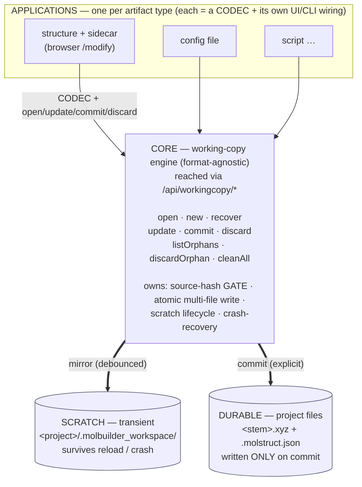
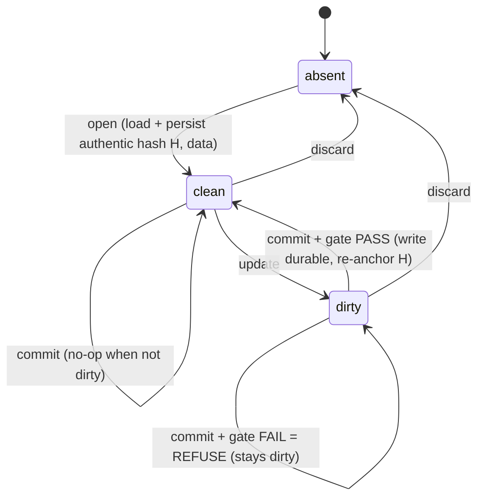

# Working-copy persistence — the transient-data foundation

**Status: CORE SOUND; API BEING REDESIGNED (2026-07-02).** The core
(`molbuilder/workingcopy.py`) + structure codec (`workingcopy_structure.py`) are
sound and unit-tested as a *stateful object* (S1–S6, §9 risks). The first
`/api/workingcopy/*` surface (`web/blueprints/workingcopy.py`) was built
**stateless + client-authoritative — a serious mistake**: an adversarial review
proved the changed-underneath gate trusted a *client-supplied* hash (bypassable
with a two-line request), `on_mismatch:"force"` was an open request field, and
S1 (same-session reload → restore edits) was never implemented (contradicting
§2.1 and §8.4). It is being **redesigned server-authoritative** per the state
machine (§6.1) + authority contract below. **No browser consumer is wired yet**,
and `writeLabel` still auto-saves the sidecar — Phase 3 is unbuilt. The system-wide, **format-agnostic**
module
for holding *user-edited* data that is **not durable until explicitly
committed**. The `.xyz`+`.molstruct.json` case (`browser-data-contract.md`) is
the **first application** of this core, not the core itself.

**The principle (one sentence):**

> **A working copy is transient: loaded from a source, mirrored to scratch so it
> survives reloads/crashes, and written to a durable target ONLY on explicit
> commit — gated by the source hash so a changed source can never be silently
> overwritten.**

**Companions:** `browser-data-contract.md` (the `.xyz`+`.json` *application*),
`data-vocabulary.md` §3.2 (the atom-identity hash one application feeds this).

---

## 1. Goal, boundary & contract (read this first)

### 1.1 Goal
Give every part of the system **one safe, shared way** to hold data a user is
editing but has not yet committed — so that:

- unsaved work **survives** a reload or crash,
- durable project files are **never written behind the user's back**,
- a source that **changed underneath** can never be silently overwritten,

and an application gets all of that by supplying a small **codec** (§5) — it does
**not** re-implement scratch handling, hashing, atomic writes, or recovery.

### 1.2 Boundary — what this IS and is NOT

**IS:** a *transient working copy of ONE artifact* — loaded from a source,
mirrored to scratch, committed to a durable file with a **source-hash gate** and
**explicit crash-recovery**.

**IS NOT** (these belong elsewhere — do not grow the core into them):

- **version history / undo** — one *live* working copy, not a version stack.
- **the artifact's format or meaning** — that is the application's codec (§5);
  the core never learns what an atom (or any datum) is.
- **UI / UX** — prompts, buttons, panels are the application's.
- **collaborative / multi-user editing** — the system is **single-user and
  isolated by design**; there is no concurrent editor. No locking, no merge, no
  multi-session arbitration. The source-hash gate exists only to catch a source
  that changed *on disk* between load and commit (e.g. edited in another tool),
  **not** to referee concurrent writers.
- **a database or durable store** — scratch is transient; durability is the one
  commit target.
- **target-existence management** — the gate protects the **source's integrity**
  (was it edited underneath since load?), *not* whether a save-as target already
  exists. Confirming an overwrite of a *different* target is the application's UX.
- **the job-execution / checkpoint domain** — unrelated; never connect them.

### 1.3 The contract in one breath (full rules in §7)

- **The core promises:** no durable write without an explicit `commit`; a commit
  **never launders** a source that changed underneath; edits **survive
  reload/crash**; nothing is ever **auto-deleted or auto-adopted**.
- **The application/consumer promises:** supply a complete **codec**; go *only*
  through `open` / `update` / `commit` / `discard`; **never** write a durable
  file or delete scratch outside the core.

### 1.4 Scenarios the core MUST handle (the acceptance list)
| # | Scenario | Required behavior |
|---|---|---|
| S1 | Edit → reload the tab | working copy restored from scratch; no data lost |
| S2 | Edit → walk away (no save) | durable files untouched; scratch retained (until commit or cleanup, §13.5) — recoverable on return |
| S3 | Explicit "Save" | the **only** moment durable files change |
| S4 | Source changed on disk since load | commit **refuses** (or prompts) — never blind-overwrites |
| S5 | Browser/server/OS crash mid-edit | scratch survives; user **explicitly** recovers or discards |
| S6 | Artifact built from scratch (no source) | first commit is a plain **save-as** |

If a change ever violates one of S1–S6, it violates this contract.

---

## 2. Architecture — how the layers build on the core



**Reading the diagram:**
- **Down** the stack = increasing generality: an application knows its format,
  the core knows none, the stores know only bytes.
- The **codec** is the *single* seam between an application and the core — the
  only format-specific code; everything below it is shared.
- The core is the **only writer** of either store. No application writes a
  project file directly — that is what makes the guarantees (§8) hold
  system-wide.

### 2.1 Worked example (the structure app, end to end)

The happy path plus the two cases that matter — reload (S1) and a source that
changed underneath (S4):

```
1. Open   User opens mol.xyz in /modify.
          → open("mol.xyz", structureCodec);  sourceHash = sha256(mol.xyz) = H0.
          Project files on disk: UNTOUCHED.

2. Edit   User tags atoms 1–3 as "L-electrode".
          → wc.update(data');  core mirrors to
             .molbuilder_workspace/mol.<session>.molstruct.json.
          mol.xyz / mol.molstruct.json on disk: STILL UNTOUCHED.

3. Reload User reloads the tab (S1).
          → working copy restored from scratch; the tags are still there.

4. Save   User clicks Save → wc.commit("mol.xyz").
          gate: H0 == sha256(mol.xyz)  ✓
          → write mol.molstruct.json, then mol.xyz (identity file last, §9.3)
          → re-anchor: sourceHash ← sha256(new mol.xyz)  (§9.4)
          → clear scratch.   NOW the project files change — and only now.

4'. Save, but the file moved under us (S4):
          Between step 1 and step 4 the user edited mol.xyz in another tool → H1.
          gate: H0 == sha256(mol.xyz)?  H0 ≠ H1  ✗
          → REFUSE: "mol.xyz changed since you loaded it; your tags were made
             for the old atom order — save as a new file, or reload and redo."
          No wrong-atom write; the user decides.
```

---

## 3. The two tiers

| Tier | What | Trigger | Lifetime |
|---|---|---|---|
| **Transient (this doc)** | working copy → scratch | auto/debounced on edit | until commit or cleanup (§13.5) |
| **Durable** | project files (`.xyz`, `.json`, …) | explicit commit | permanent |

Data flows *up*: edit → transient scratch → **commit** → durable file.

---

## 4. Core concepts

- **Source** — where the artifact was loaded from (a path), or *none* (freshly
  built).
- **Source hash** — `sha256` of the source at load. The gate compares it to the
  source's *current* on-disk hash at commit; a change means "edited underneath —
  do not silently overwrite."
- **Working copy** — in-memory current state + its source + source hash + dirty
  flag. Owned by the core.
- **Session** — the *server-side* session the working copy belongs to (the login
  when authenticated; the single server instance for no-auth localhost) — never
  the browser tab. It keys scratch and decides when scratch is cleaned; fully
  defined in §13.5.
- **Scratch record** — the working copy persisted under
  `<project>/.molbuilder_workspace/`, surviving reload/restart/crash. Keyed by
  `(source-stem, session)`.
- **Codec** — the *only* format-specific part (§5), supplied by the application.
- **Commit** — the single hash-gated write to a durable target.

---

## 5. The codec interface (what an application supplies)

The core treats artifact data as **opaque**; the application plugs in:

```
codec.load(source_path)       -> data            # read durable -> working data
codec.hashSource(source_path) -> str             # the source hash (e.g. sha256 of the .xyz)
codec.files(data, target)     -> [(path, bytes)] # durable file(s) this artifact writes
codec.scratchBlob(data)       -> bytes/json      # how the working copy is stored in scratch
codec.fromScratch(blob)       -> data            # inverse (crash recovery)
```

`.xyz`+`.json` supplies a codec whose `files()` returns *two* paths and whose
`hashSource()` is `sha256(.xyz)`. A config-file app returns one path. **The core
never learns what an atom is.**

---

## 6. The core API (format-agnostic)

```
open(source_path, codec)      -> WorkingCopy     # in-memory object: load + record H (API persists an anchor, §6.1)
new(codec)                -> WorkingCopy     # freshly-built artifact, no source (S6)
recover(scratchRecord, codec) -> WorkingCopy     # crash recovery (§10)

WorkingCopy.update(data)                         # mirror to scratch, debounced; sets dirty
WorkingCopy.data() / .isDirty() / .sourceHash()
WorkingCopy.commit(target_path, {onMismatch})    -> CommitResult
WorkingCopy.discard()                            # drop working copy + scratch, no write

listOrphans(project)          -> [ScratchRecord] # sessions no longer live
discardOrphan(record) / cleanAll(project)
```

`commit` runs the gate → writes → **re-anchors the working copy to the committed
target** (new source + hash, §9.4) → clears scratch (§9.3). `onMismatch` is
`refuse` (MVP; return a mismatch result) or `force` (override the gate). The
future `choose` UX (keep / discard-stale / reload) is built on `force`.

### 6.1 The state machine + server-authority contract (MUST for the API)

§6 is the *stateful in-memory object*. The `/api/workingcopy/*` surface is
stateless across HTTP requests, so to keep every guarantee it **MUST be
server-authoritative**: the server owns the working copy's authentic state — the
**at-load source hash** and the **working data** — in the scratch record. The
client is a cache/view, never the authority. This is what makes §8.4 real and
the changed-underneath gate un-bypassable. (The first API shipped the opposite —
client-authoritative — and was proven bypassable; hence this redesign.)

**States** — one per working copy, keyed by `(session, source)`:



- **absent** — no server record for `(session, source)`.
- **clean** — opened; server holds the loaded data + the **authentic** at-load
  hash `H = hash_source(source)`; `dirty=false`.
- **dirty** — edited; server holds the working data + the *same* authentic `H`;
  `dirty=true`.

**Transitions + the authority rule each enforces:**

| Op | Server does | Authority rule (the point) |
|---|---|---|
| `open(source)` — no record | load source, **compute + persist** `H`, store `{source, H, data, session, dirty=false}` | **`H` is server-computed, never client-supplied.** |
| `open(source)` — record exists | return the existing server working copy (data + dirty) | **S1 reload/resume** — never re-read the source over unsaved edits |
| `update(source, data)` | requires the record; store `data`, `dirty=true`; **`H` unchanged** | client sends edits, **never `H`**; can't update what you didn't open |
| `commit(source, target)` | **gate: compare the STORED `H` to the *current* on-disk hash of `source`** (when `target==source`); on pass write durable (identity last), **re-anchor `H←hash(target)`**, `dirty=false` | gate reads **only the server `H`**; commit needs the caller's own record |
| `discard(source)` | delete the record | — |
| `recover(orphan)` | adopt a dead session's record into the live session | same gate applies at its next commit |

**The authority contract (invariants the machine enforces):**
1. **The at-load hash is server-authoritative** — computed at `open`, stored,
   never accepted from the client; the gate reads only it. *(Closes the proven
   client-hash bypass.)*
2. **The server scratch is the working copy of record** (§8.4) — `update` stores
   the data server-side; `open`-on-existing returns it (reload). The client is a
   cache.
3. **You can only commit what you opened** — `update`/`commit` require the
   caller's session to own a record for that `source`; else refuse.
4. **Overriding the gate is not a free field** — `force` requires a
   *server-issued token* bound to `(session, source, observed actual_hash)`,
   handed back only when the server itself returned a mismatch (so an override
   proves the user was shown the conflict).

---

## 7. Use contract — how to build on this

**An application MUST:**
1. Supply a complete **codec** (§5); keep it pure (no side effects beyond
   reading the source in `load`/`hashSource`).
2. `open()` on load, `update()` on **every** edit, `commit()` **only** on an
   explicit user save, `discard()` to abandon.
3. Treat the returned `WorkingCopy` as the **single owner** of that artifact's
   transient state — read `data()`/`isDirty()` from it, never keep a parallel
   copy that can drift.
4. **Surface** the commit `onMismatch` outcome to the user (refuse, or the
   keep/discard/reload choice) — never silently override the gate.

**An application (or any consumer) MUST NOT:**
1. Write a durable project file **outside** `commit()`.
2. Assume the durable file is unchanged since load — always go through the gate.
3. Delete a scratch record behind the user — removal happens only via commit
   success, session-end (authenticated mode only), or explicit cleanup
   (§10, §13.5).
4. Reach around the codec to make the core format-aware.

If those rules hold, the application inherits every guarantee in §8 for free; if
any is broken, the guarantees no longer apply to that application.

---

## 8. Invariants (guarantees every conforming application inherits)

1. **No durable file is written without an explicit `commit`.**
2. **A working copy always carries the source hash it was opened against.**
3. **Commit never launders** — on source-hash mismatch it refuses or forces an
   explicit choice; it never silently writes stale data under a fresh hash.
4. **Transient data survives reload/crash** — the **server-side scratch is the
   single source of truth**. A consumer MAY keep its own client-side cache for
   speed, but that is the consumer's concern and the scratch always wins.
   *(Enforced by the §6.1 server state machine. The first stateless API violated
   this — the client payload was authoritative — which is why the API is being
   redesigned.)*
5. **Editing is non-destructive** to durable files until commit.

---

## 9. Risks the core resolves once (so applications don't)

### §9.1 Source changed on disk since load (S4)
At commit the gate compares the working copy's source hash to the source's
**current** on-disk hash. If the source was edited between load and commit (e.g.
in another tool), that mismatch is caught → refuse (or prompt). No blind
overwrite.

### §9.2 No source — freshly-built artifact (S6)
`new()` has no source hash; its first `commit` is a plain **save-as** to a
chosen path. The gate engages only once a source exists.

### §9.3 Multi-file artifacts + partial failure (real, not "atomic")
Two files can't be atomic together. The core writes each via **temp-file +
rename** (per-file atomic) and **keeps the scratch record until ALL files land**,
so a partial failure is never silently forgotten. **Write order matters and is
resolved in §13.3:** write the **identity/source file last** (`.json` metadata
before `.xyz`), so a mid-commit failure leaves the *source unchanged* — the retry
gate still passes, instead of tripping on a source the first attempt already
rewrote.

### §9.4 Commit re-anchors the working copy (so a second save works)
A successful commit rewrites the source (same-file) or writes a new target
(save-as). If the working copy kept its *old* source hash, the **next** save
would gate that stale hash against the file the previous commit just wrote — and
wrongly refuse. So commit **re-anchors**: the working copy adopts the committed
target as its new source and the hash of what was written. Continued editing +
re-commit then behave exactly like a fresh `open` of the saved file.

---

## 10. Crash recovery (explicit, never silent) — S5

A crash leaves a scratch record no automatic path can clear (its session is
gone). For **no-auth localhost, a routine server restart is the same situation** —
the prior server session's scratch is now orphaned and surfaces here too.
`listOrphans` surfaces them (source, hash, age, still-matches-source?); the user
`recover`s (adopt back, subject to the same commit gate) or `discard`s;
`cleanAll` wipes a project's scratch. The core **never** auto-deletes unsaved
work and **never** auto-adopts stale work.

---

## 11. Applications

| Application | Codec `files()` | Source hash | Spec |
|---|---|---|---|
| **Structure + sidecar** | `<stem>.xyz` + `<stem>.molstruct.json` | `sha256(.xyz)` | `browser-data-contract.md` |
| *(future)* config / script artifacts | their file(s) | their source hash | reuse this core unchanged |

---

## 12. Relationship to other contracts

- **`browser-data-contract.md`** — the *first application*; reads as "the
  structure+sidecar codec + the browser-side (sessionStorage / `writeLabel` /
  commit UX) wiring on top of this core."
- **`workspace-contract.md`** — owns the in-browser dispatcher/store + `dirty`
  flag that drives this core's client side.

---

## 13. Decisions (before implementation)

1. **Where the core lives — RESOLVED:** `molbuilder/workingcopy.py` (L1) exposes
   the §6 API + the `Codec` seam; `web/blueprints/workingcopy.py` is the
   scratch-backed `/api/workingcopy/*` surface (Phase 2b, built) — it covers the
   sourced flows (open/update/commit/discard + orphans/recover/clean); the
   sourceless `new` (S6) flow is core-only for now, exposed when a
   build-from-scratch UI needs it.
2. **Scratch record format — RESOLVED:** one JSON envelope `{schema, source,
   source_hash, session, ts, blob}`, written atomically (via `persist.write_json`)
   as `<stem>.<session>.wc.json` under `.molbuilder_workspace/`.
3. **Commit write order — RESOLVED (§9.3):** write the identity/source file
   **last** (`.json` metadata before `.xyz`), so a partial failure leaves the
   source unchanged and the retry gate still passes.
4. **`onMismatch` default — DECIDED:** ship `refuse` + `force` (the override
   primitive; both live in the code); the `choose` UX (keep / discard-stale /
   reload) is built on `force` later.
5. **Session — RESOLVED: the *server-side* session, never the browser tab** (so
   a tab reload/close never loses the working copy). Two run modes:
   - **Authenticated:** the login session; session-end = logout/expiry → cleanup.
   - **No-auth localhost (fully supported, the safer case):** a single implicit
     local session (the server instance). There is **no automatic session-end**,
     so scratch is cleaned **only** on commit or explicit cleanup (§10). A
     routine `molbuilder serve` restart never discards unsaved work — the prior
     scratch simply presents as recoverable on restart.
