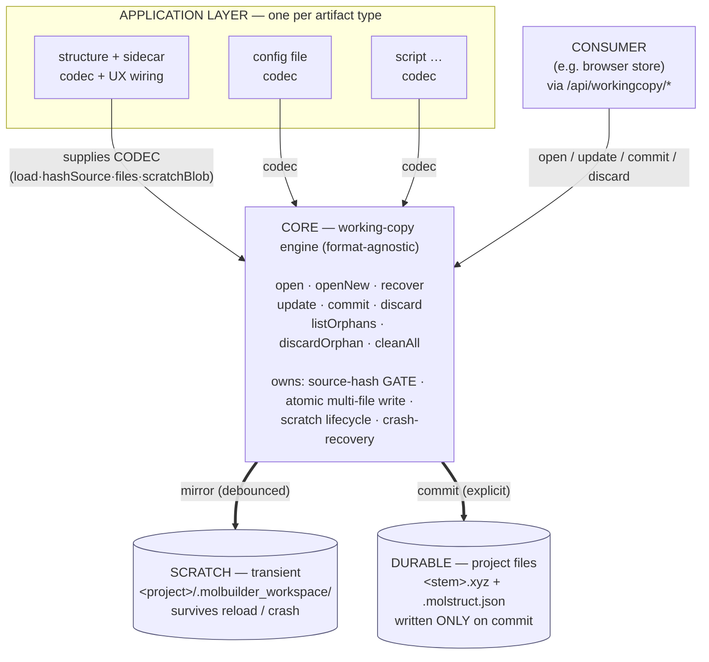

# Working-copy persistence — the transient-data foundation

**Status: PROPOSED (2026-07-02).** The system-wide, **format-agnostic** module
for holding *user-edited* data that is **not durable until explicitly
committed**. The `.xyz`+`.molstruct.json` case (`browser-data-contract.md`) is
the **first application** of this core, not the core itself.

**The principle (one sentence):**

> **A working copy is transient: loaded from a source, mirrored to scratch so it
> survives reloads/crashes, and written to a durable target ONLY on explicit
> commit — gated by the source hash so a changed source can never be silently
> overwritten.**

**Companions:** `browser-data-contract.md` (the `.xyz`+`.json` *application*),
`data-vocabulary.md` §3.2 (the atom-identity hash one application feeds this).

---

## 1. Goal, boundary & contract (read this first)

### 1.1 Goal
Give every part of the system **one safe, shared way** to hold data a user is
editing but has not yet committed — so that:

- unsaved work **survives** a reload or crash,
- durable project files are **never written behind the user's back**,
- a source that **changed underneath** can never be silently overwritten,

and an application gets all of that by supplying a small **codec** (§5) — it does
**not** re-implement scratch handling, hashing, atomic writes, or recovery.

### 1.2 Boundary — what this IS and is NOT

**IS:** a *transient working copy of ONE artifact* — loaded from a source,
mirrored to scratch, committed to a durable file with a **source-hash gate** and
**explicit crash-recovery**.

**IS NOT** (these belong elsewhere — do not grow the core into them):

- **version history / undo** — one *live* working copy, not a version stack.
- **the artifact's format or meaning** — that is the application's codec (§5);
  the core never learns what an atom (or any datum) is.
- **UI / UX** — prompts, buttons, panels are the application's.
- **collaborative / multi-user editing** — the system is **single-user and
  isolated by design**; there is no concurrent editor. No locking, no merge, no
  multi-session arbitration. The source-hash gate exists only to catch a source
  that changed *on disk* between load and commit (e.g. edited in another tool),
  **not** to referee concurrent writers.
- **a database or durable store** — scratch is transient; durability is the one
  commit target.
- **target-existence management** — the gate protects the **source's integrity**
  (was it edited underneath since load?), *not* whether a save-as target already
  exists. Confirming an overwrite of a *different* target is the application's UX.
- **the job-execution / checkpoint domain** — unrelated; never connect them.

### 1.3 The contract in one breath (full rules in §7)

- **The core promises:** no durable write without an explicit `commit`; a commit
  **never launders** a source that changed underneath; edits **survive
  reload/crash**; nothing is ever **auto-deleted or auto-adopted**.
- **The application/consumer promises:** supply a complete **codec**; go *only*
  through `open` / `update` / `commit` / `discard`; **never** write a durable
  file or delete scratch outside the core.

### 1.4 Scenarios the core MUST handle (the acceptance list)
| # | Scenario | Required behavior |
|---|---|---|
| S1 | Edit → reload the tab | working copy restored from scratch; no data lost |
| S2 | Edit → walk away (no save) | durable files untouched; scratch retained until session-end (§13.5) — recoverable on return |
| S3 | Explicit "Save" | the **only** moment durable files change |
| S4 | Source changed on disk since load | commit **refuses** (or prompts) — never blind-overwrites |
| S5 | Browser/server/OS crash mid-edit | scratch survives; user **explicitly** recovers or discards |
| S6 | Artifact built from scratch (no source) | first commit is a plain **save-as** |

If a change ever violates one of S1–S6, it violates this contract.

---

## 2. Architecture — how the layers build on the core



**Reading the diagram:**
- **Down** the stack = increasing generality. An application knows its format;
  the core knows none; the stores know only bytes.
- The **codec** is the *single* seam between an application and the core — the
  only format-specific code. Everything below the codec is shared.
- The core is the **only writer** of scratch and durable files. No application
  or consumer writes a project file directly — that is what makes the guarantees
  (§8) hold system-wide.

---

## 3. The two tiers

| Tier | What | Trigger | Lifetime |
|---|---|---|---|
| **Transient (this doc)** | working copy → scratch | auto/debounced on edit | until commit or session-end |
| **Durable** | project files (`.xyz`, `.json`, …) | explicit commit | permanent |

Data flows *up*: edit → transient scratch → **commit** → durable file.

---

## 4. Core concepts

- **Source** — where the artifact was loaded from (a path), or *none* (freshly
  built).
- **Source hash** — `sha256` of the source at load. The gate compares it to the
  source's *current* on-disk hash at commit; a change means "edited underneath —
  do not silently overwrite."
- **Working copy** — in-memory current state + its source + source hash + dirty
  flag. Owned by the core.
- **Scratch record** — the working copy persisted under
  `<project>/.molbuilder_workspace/`, surviving reload/restart/crash. Keyed by
  `(source-stem, session)`.
- **Codec** — the *only* format-specific part (§5), supplied by the application.
- **Commit** — the single hash-gated write to a durable target.

---

## 5. The codec interface (what an application supplies)

The core treats artifact data as **opaque**; the application plugs in:

```
codec.load(source_path)       -> data            # read durable -> working data
codec.hashSource(source_path) -> str             # the source hash (e.g. sha256 of the .xyz)
codec.files(data, target)     -> [(path, bytes)] # durable file(s) this artifact writes
codec.scratchBlob(data)       -> bytes/json      # how the working copy is stored in scratch
codec.fromScratch(blob)       -> data            # inverse (crash recovery)
```

`.xyz`+`.json` supplies a codec whose `files()` returns *two* paths and whose
`hashSource()` is `sha256(.xyz)`. A config-file app returns one path. **The core
never learns what an atom is.**

---

## 6. The core API (format-agnostic)

```
open(source_path, codec)      -> WorkingCopy     # load + record source hash (no scratch write yet)
openNew(codec)                -> WorkingCopy     # freshly-built artifact, no source (S6)
recover(scratchRecord, codec) -> WorkingCopy     # crash recovery (§10)

WorkingCopy.update(data)                         # mirror to scratch, debounced; sets dirty
WorkingCopy.data() / .isDirty() / .sourceHash()
WorkingCopy.commit(target_path, {onMismatch})    -> CommitResult
WorkingCopy.discard()                            # drop working copy + scratch, no write

listOrphans(project)          -> [ScratchRecord] # sessions no longer live
discardOrphan(record) / cleanAll(project)
```

`commit` runs the gate → writes → clears scratch (§9.3). `onMismatch` is
`refuse` (MVP) or `choose` (keep / discard-stale / reload — the app's UX).

---

## 7. Use contract — how to build on this

**An application MUST:**
1. Supply a complete **codec** (§5); keep it pure (no side effects beyond
   reading the source in `load`/`hashSource`).
2. `open()` on load, `update()` on **every** edit, `commit()` **only** on an
   explicit user save, `discard()` to abandon.
3. Treat the returned `WorkingCopy` as the **single owner** of that artifact's
   transient state — read `data()`/`isDirty()` from it, never keep a parallel
   copy that can drift.
4. **Surface** the commit `onMismatch` outcome to the user (refuse, or the
   keep/discard/reload choice) — never silently override the gate.

**An application (or any consumer) MUST NOT:**
1. Write a durable project file **outside** `commit()`.
2. Assume the durable file is unchanged since load — always go through the gate.
3. Delete a scratch record behind the user — removal happens only via commit
   success, session-end, or explicit cleanup (§10).
4. Reach around the codec to make the core format-aware.

If those rules hold, the application inherits every guarantee in §8 for free; if
any is broken, the guarantees no longer apply to that application.

---

## 8. Invariants (guarantees every conforming application inherits)

1. **No durable file is written without an explicit `commit`.**
2. **A working copy always carries the source hash it was opened against.**
3. **Commit never launders** — on source-hash mismatch it refuses or forces an
   explicit choice; it never silently writes stale data under a fresh hash.
4. **Transient data survives reload/crash** — the **server-side scratch is the
   single source of truth**. A consumer MAY keep its own client-side cache for
   speed, but that is the consumer's concern and the scratch always wins.
5. **Editing is non-destructive** to durable files until commit.

---

## 9. Risks the core resolves once (so applications don't)

### §9.1 Source changed on disk since load (S4)
At commit the gate compares the working copy's source hash to the source's
**current** on-disk hash. If the source was edited between load and commit (e.g.
in another tool), that mismatch is caught → refuse (or prompt). No blind
overwrite.

### §9.2 No source — freshly-built artifact (S6)
`openNew()` has no source hash; its first `commit` is a plain **save-as** to a
chosen path. The gate engages only once a source exists.

### §9.3 Multi-file artifacts + partial failure (real, not "atomic")
Two files can't be atomic together. The core writes each via **temp-file +
rename** (per-file atomic) and **keeps the scratch record until ALL files land**,
so a partial failure is never silently forgotten. **Write order matters and is
resolved in §13.3:** write the **identity/source file last** (`.json` metadata
before `.xyz`), so a mid-commit failure leaves the *source unchanged* — the retry
gate still passes, instead of tripping on a source the first attempt already
rewrote.

### §9.4 Authority
The **server-side scratch is the single source of truth** for the working copy.
A consumer may keep a client-side cache for fast restore (the browser app uses
`sessionStorage`); it is only a cache — the scratch wins on any divergence.

---

## 10. Crash recovery (explicit, never silent) — S5

A crash leaves a scratch record no automatic path can clear (its session is
gone). `listOrphans` surfaces them (source, hash, age, still-matches-source?);
the user `recover`s (adopt back, subject to the same commit gate) or `discard`s;
`cleanAll` wipes a project's scratch. The core **never** auto-deletes unsaved
work and **never** auto-adopts stale work.

---

## 11. Applications

| Application | Codec `files()` | Source hash | Spec |
|---|---|---|---|
| **Structure + sidecar** | `<stem>.xyz` + `<stem>.molstruct.json` | `sha256(.xyz)` | `browser-data-contract.md` |
| *(future)* config / script artifacts | their file(s) | their source hash | reuse this core unchanged |

---

## 12. Relationship to other contracts

- **`browser-data-contract.md`** — the *first application*; reads as "the
  structure+sidecar codec + the browser-side (sessionStorage / `writeLabel` /
  commit UX) wiring on top of this core."
- **`workspace-contract.md`** — owns the in-browser dispatcher/store + `dirty`
  flag that drives this core's client side.

---

## 13. Decisions (before implementation)

1. *(open)* **Where the core lives** — a new backend module (e.g.
   `molbuilder/workingcopy.py`) exposing the §6 API + a thin `/api/workingcopy/*`
   surface the browser store calls.
2. *(open)* **Scratch record format** — one JSON envelope `{source, source_hash,
   session, ts, blob}` vs the codec owning the on-disk shape.
3. **Commit write order — RESOLVED (§9.3):** write the identity/source file
   **last** (`.json` metadata before `.xyz`), so a partial failure leaves the
   source unchanged and the retry gate still passes.
4. **`onMismatch` default** — ship `refuse`, add `choose` as the enhancement.
5. *(open — blocks S2 + cleanup)* **Define "session"** — a *server login*
   (survives tab-close → walk-away work is recoverable; cleanup on logout/expiry)
   vs a *browser tab* (close = new session → old scratch is a §10 orphan).
   **Recommend server-login:** walking away should not silently destroy unsaved
   work — a clean logout cleans, a crash leaves a recoverable orphan.
