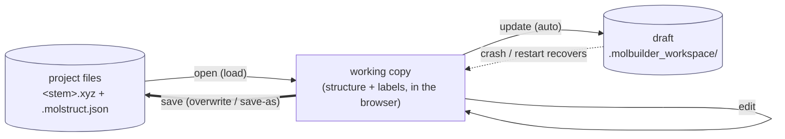
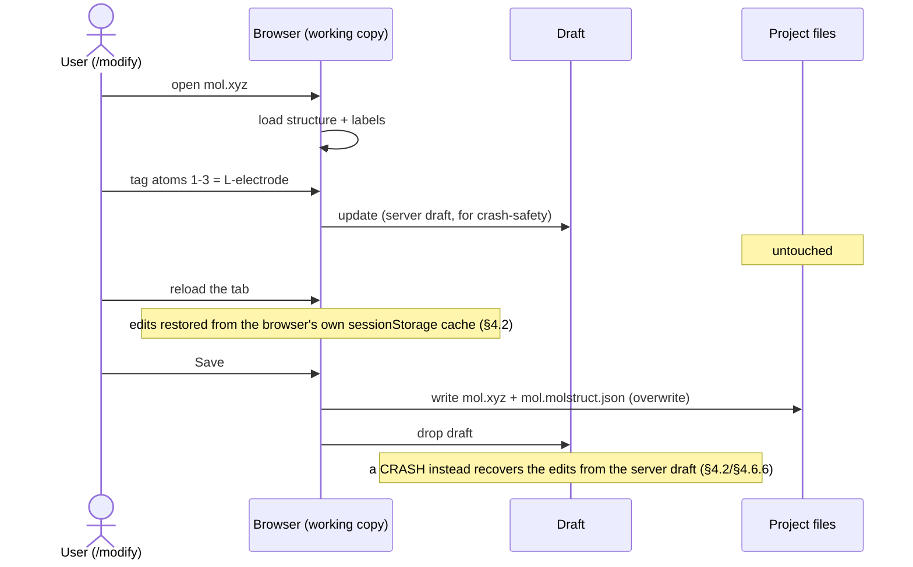

# Workspace — session state & file-access contract (the persistence layer)

> **This is the sole source of truth for the WORKSPACE — the client-side PERSISTENCE layer.**
> The workspace does **exactly two things**, and nothing else — both **automatic + internal**:
> 1. **Automatic session persistence** — it transparently keeps a tab/session's working data
>    recoverable across a reload / crash / revisit (crash-safe server draft + fast `sessionStorage`
>    mirror), fired on a data change. The consumer gives it the identifiers — **session, tab, data
>    file name** — so different tabs never mix.
> 2. **Concealed byte file-access** — the consumer never touches files directly; the workspace is
>    the *means* to **sync** the working data to its draft/session store and **reload** it back,
>    moving **opaque bytes** it never interprets.
>
> Every persistence action and server-response shape MUST match this contract; code that diverges
> is incorrect by definition.
>
> **The workspace is NOT the in-memory data model — do not make it one.** It never holds or
> interprets the working data. It does not know what an atom, a structure, a frame, a force, a
> selection, or a k-grid is. It gets involved **only** on persistence: sync the consumer's data to
> disk, or reload it — storing/returning it **format-blind** (it moves bytes; the consumer owns the
> format). This is deliberate and load-bearing: *session + concealed file-access is a fixed, finite
> job, so the workspace stays a **stable** layer.* The moment it knows a data type, every new type
> widens its surface (`getStructure`, `getFrame`, `currentForces`, `maxForceMagnitude`, …) and it
> never stops growing. That bloat is the anti-pattern this contract exists to prevent.
>
> **Who owns the data, then.** The **consumer** owns its data in memory — it holds it, knows its
> structure, and owns its format. For the structure app that consumer is the **MolView module**
> ([`molview-module.md`](molview-module.md)): a **self-contained module that conceals BOTH its
> in-memory data AND its API**. MolView holds the loaded structure / selection / periodicity /
> frames in memory and processes them itself; it calls the workspace **only** to sync those bytes
> to disk or reload them. The two are different layers in different docs — do not re-merge them.
>
> > **⚠ TWO different "saves" — never mix them; this contract is ONLY the second.**
> > - **User file-save** (e.g. "save this trajectory frame to a file") is a **user operation** and is
> >   **NOT the workspace's job.** The UI gets the data it wants from **MolView's API**
> >   ([`molview-module.md`](molview-module.md)), then writes the file through the **project
> >   sidebar's** file contract ([`projects-sidebar.md`](projects-sidebar.md)) — its own logic, its
> >   own module. The workspace is **not in that path at all**; MolView is only the data source.
> > - **Automatic persistence** (THIS doc) is the transparent, internal draft/session recovery
> >   described above — opaque bytes, fired on a data change, never a user "save to this file."
>
> ```mermaid
> flowchart TD
>     subgraph CONS["CONSUMER — owns the data + its API (e.g. MolView, molview-module.md)"]
>       DATA["in-memory data model<br/>structure · selection · periodicity · frames<br/>(the consumer knows the schema + format)"]
>     end
>     subgraph PERSIST["PERSISTENCE layer — THIS doc"]
>       WS["workspace &nbsp;ws.*&nbsp;<br/>session state (tab-isolated) · concealed file access<br/>sync / reload BYTES — format-blind"]
>     end
>     DATA -->|"sync: serialized bytes + {session, tab, file}"| WS
>     WS -->|"reload: bytes back (restore)"| DATA
>     WS -->|"draft · sessionStorage · files"| DISK[("disk")]
> ```
>
> **The data-model sections have MOVED (2026-07 — "the carve", done).** §1.2–§1.5, §2, §3, §5,
> §6, §7 below used to document the in-memory data model (accessors, mutators, frames, selection,
> view, wire shape) as a `ws.*` surface. That model **now lives on
> `window.molbuilder.molview.data`** (`lib/molview/data-model.js`) and its contract is owned by
> [`molview-module.md`](molview-module.md) — it is **not** a workspace surface. Those sections are
> now **one-line redirects** into molview-module.md; **do not** read them as the workspace's API.
> The workspace's own contract is **§3.5 (the persistence surface)** + **§4 (persistence)** +
> **§4.5 (mount-restore)** + **§4.6 (working-copy mechanism)** — the surface being
> `persist` / `workspaceId` / `readPersistedSnapshot` / `mountRestoreTarget` / `STORAGE_KEY`.
>
> **How the project sidebar relates.** The projects sidebar is a
> **separate** subsystem ([`projects-sidebar.md`](projects-sidebar.md)); it is not
> part of this contract. The **sole seam** between them is **mount-time
> restore**: on a page mount the sidebar (and any load-on-mount surface)
> MUST consult **`ws.mountRestoreTarget()`** and defer when the persisted
> snapshot already owns the file it was about to load — see **§4.5**
> (single-authority mount restore); the sidebar side is the "loading on
> *mount* is different" rule in [`projects-sidebar.md`](projects-sidebar.md)
> (§ "At a glance"). Nothing else crosses.
>
> **Companion docs:**
>
> * [`workspace-guide.md`](../workspace-guide.md) — **start here if you're new**:
>   the plain-language developer guide (mental model, `ws.*` API cheat-sheet,
>   the mount-restore rule, common gotchas).  This contract is the precise
>   spec; the guide is the friendly on-ramp.
> * [`molviewer-guide.md`](../molviewer-guide.md) /
>   [`atom-selection-guide.md`](../atom-selection-guide.md) — the plain-language
>   companions to molview-module.md (the viewer handle boundary; the store→panel→adapter
>   wiring).
> * [`web-api.md`](web-api.md) — every HTTP endpoint.  This
>   contract specifies the client-side persistence surface (§3.5);
>   the data-model wire shape it consumes is molview-module.md §21,
>   and web-api.md specifies the endpoints behind both.
> * **history / why:** see
>   [`archive/2026-07-06-workspace-state.md`](../archive/2026-07-06-workspace-state.md)
>   (the 2026-06-07 audit + Phases 1–9 migration log that motivated this
>   contract) and [`molview-migration-plan.md`](molview-migration-plan.md)
>   (the remaining open consumer-migration work).
>
> **How to use this doc:**
>
> 1. **Persistence** goes through the workspace `ws.*` persistence surface (§3.5) — `persist`
>    of serialized bytes / `readPersistedSnapshot` on restore, never a direct file read.
>    **In-memory data access** is the consumer's own — **`molview.data.*`**
>    ([`molview-module.md`](molview-module.md) §19), NOT `ws.*`. No direct reads of the
>    canvas-state / selection stores or the modify-tab IIFE state are permitted.
> 2. Review against this doc, not git blame.  If a behaviour in
>    code doesn't match a contract here, either the code is wrong
>    (fix it) or the contract is wrong (PR the doc + code together).
> 3. Every contract clause is pinned by a test ID in § 9.  A
>    contract change without a test update is a contract
>    violation.

---

## §1 Architecture overview

> **The data model moved out (§1.2–§1.5, §2, §3, §5, §6, §7 are now redirects).** The single
> in-memory state, the uniform structure + accessors, the frame axis, and the
> read/write/selection/view/wire surfaces are the **in-memory DATA MODEL** — the consumer's
> (MolView's) concern, on `molview.data` ([`molview-module.md`](molview-module.md)), **not** the
> workspace's. The workspace's *own* contract is **§3.5** (the persistence surface) + **§4 / §4.6**
> (persistence + the working-copy mechanism) and the session/tab identity that scopes them.

### 1.1 Modular layout

The **in-memory data model lives entirely in the MolView module** (`lib/molview/`, on
`window.molbuilder.molview.data`). What remains in `lib/workspace/` is **only the persistence
machinery** — the dispatcher (the `persist`/`workspaceId`/`readPersistedSnapshot`/`mountRestoreTarget`
surface, format-blind) and the snapshot IO. The dispatcher exposes **no data accessors**.

```
molbuilder/web/static/lib/workspace/         ── PERSISTENCE layer (this doc)
├── dispatcher.js               ── window.molbuilder.workspace: persist(sessionBytes, draftBlob,
│                                  identity) / workspaceId / readPersistedSnapshot / mountRestoreTarget.
│                                  Format-blind — NO data accessors.
└── snapshot-io.js              ── the sessionStorage snapshot read/write (molbuilder.workspaceSnapshot)

molbuilder/web/static/lib/molview/           ── MolView module: the in-memory DATA MODEL (molview-module.md)
├── data-model.js               ── window.molbuilder.molview.data: the accessors/mutators/frames/
│                                  selection/view + serialization; calls ws.persist() on a data change
├── _selection-store-impl.js    ── the selection store singleton (molview-module.md §12)
├── _canvas-state-impl.js       ── the canvas/geometry store: text + source + periodicity + dirty
├── _frame-series.js            ── the coordinate time axis / frames (molview-module.md §14.5)
├── _atom-channels.js           ── per-atom annotation channels (atom-annotations.md)
└── _atom-index.js              ── 0-based↔1-based display conversion (molview-module.md §16)
```

The `_`-prefixed store files + `data-model.js` are **MolView-internal**; `data-model.js` reads the
stores and serves the data API on `molview.data`. The dispatcher (persistence) never reads them.
No consumer touches the stores directly. The legacy public globals `window.molbuilder.structureCanvas`
+ `window.molbuilder.selection.store` are retired (§8).

### 1.2 Single in-memory state

→ **Now MolView's.** The single in-memory state object + its shape are `molview.data`'s; see
[`molview-module.md`](molview-module.md) §19.1.

### 1.2.1 The uniform in-memory structure — the accessor API

→ **Now MolView's.** The one-model / one-accessor-API contract (the columnar target, the read
surface, and the encapsulation rule) is `molview.data`'s; see
[`molview-module.md`](molview-module.md) §19.1–§19.2.

### 1.3 The flow

→ **Now MolView's.** The write → model → notify → render/persist flow is `molview.data`'s; see
[`molview-module.md`](molview-module.md) §19 (and §B for the render pipeline).

### 1.4 Encapsulation contract — the module is sealed

→ **Now MolView's.** The sealed-module / off-limits-internals contract is `molview.data`'s; see
[`molview-module.md`](molview-module.md) §19.1.

---

### 1.5 Frames — the coordinate time axis

→ **Now MolView's.** The frame/trajectory data model — the *same-atoms invariant*, the frame axis,
and the `loadFromText` / `reloadFrames` / `addFrame` / `addFrames` / `setFrame` / `getFrame` /
`currentFrame` / `frameCount` API — **and** the on-disk multi-frame `.xyz` + `.molstruct.json`
FORMAT are MolView's; see [`molview-module.md`](molview-module.md) §14.5 (on-disk format §14.5.0).
The workspace stores those bytes **format-blind**, like any other persisted state (§3.5, §4).

---

## §2 Read API — the data-model getters

→ **Now MolView's.** The `getState` / `getStructure` / `getSource` / `getAtoms` / `getElements` /
`getCoordinates` / `getUnitCell*` / `getKgrid*` / `getAxisKind*` / `getVacuum*` / `getSelection` /
`getRegions` / `getFrozen` / `getAtomsByLabel` / `atomFor3Dmol` / `toAddAtoms` / `isDirty` /
`isEmpty` / `subscribe` read surface is `molview.data`'s; see
[`molview-module.md`](molview-module.md) §19.2.

---

## §3 Write API — the data-model mutators

→ **Now MolView's.** The `openMolecule` / `exportFile` / `generate` / `applyOp` (the structure-mutation
core, molview-module.md §19.3.2) / `save(delta)` / `load(delta)` / `discard` mutators, the granular
`setUnitCell` / `setKgrid` / `setAxisKind` / `setVacuum` / `commitPeriodicity` / `setLabel` write
accessors, `markDirty` / `markSaved`, and the internal payload pipeline (incl. `selection_remap`) are
`molview.data`'s; see
[`molview-module.md`](molview-module.md) §19.3.

---

## §3.5 The workspace's ACTUAL surface — `window.molbuilder.workspace`

The workspace exposes **only** the persistence surface (`lib/workspace/dispatcher.js`). It has
**no data accessors**; it never reads or interprets what it stores.

| Method | Signature | Contract |
|---|---|---|
| `ws.persist(sessionBytes, draftBlob, identity)` | `(object, object, object) → void` | The single write-in. Writes `sessionBytes` to the `sessionStorage` session mirror (§4.4, via `snapshot-io.js`) and POSTs `draftBlob` to the on-disk indexed state file (`/api/state-timeline/write`) keyed by `identity` `{workspace_id, state_index}`. **Format-blind** — the consumer already serialised; this just writes bytes. |
| `ws.workspaceId()` | `() → string` | The stable id a **sourceless** workspace's draft is keyed under (§4.1.1); reused across a same-tab reload. |
| `ws.readPersistedSnapshot()` | `() → object \| null` | The parsed session snapshot (or `null` — absent / corrupt / wrong version). The restore consumer decides whether to rehydrate from it or refetch disk (§4.4.3). |
| `ws.mountRestoreTarget()` | `() → string \| null` | The source-file a mount-time restore will hydrate, or `null`. Every mount-time writer MUST honor it (§4.5). Order-independent — derived from the persisted snapshot. |
| `ws.onPersistError(handler)` | `((detail) → void) → unsubscribe` | Subscribe to **non-blocking** state-write failures (§4.7). `persist` fires the on-disk write fire-and-forget, but every failure (rejected fetch OR non-2xx) is reported here (`detail = {op, state_index?, above_index?, status?, error?}`) — plus `console.error` + a `molbuilder:persist-error` DOM event. The UI subscribes to warn the user; the write is never silently swallowed. Returns an unsubscribe fn. |
| `ws.useNamespace(owner)` | `(string\|null) → void` | Declare the active consumer's `owner`, folding it into the mirror key (`<base>::<owner>`) and clearing the cached `workspace_id` so it recomputes per namespace. Set by `molview.mount`; also by any restore that runs before mount (molview-module.md §18.4). `null` → the base key. |
| `ws.STORAGE_KEY` | `string` | The **base** `sessionStorage` key (`molbuilder.workspace.v1`; shared constant `SS_WORKSPACE`). The live key is namespaced by the active `owner` (§4.4.1). |

**The seam (who does what).** The consumer (MolView) owns *when* and *what*: on a data change its
data model debounces (100 ms) + serialises (`molview.data._serialise` for the session bytes,
`getScratchBlob()` for the draft blob, `draftIdentity()` for the key — molview-module.md §19.4)
and calls `ws.persist(sessionBytes, draftBlob, identity)`. The workspace owns *where*: it writes
the two surfaces format-blind. **The debounce + suspend/resume live in the data model, not the
workspace** — the workspace `persist()` is a synchronous write of the bytes it is handed.

---

## §4 Persistence contract

### 4.0 First principle — the consumer's memory is the truth; a save writes it whole

**The consumer's in-memory data is the single true state the user sees and edits** — for the
structure app, that is MolView's in-memory model (`molview.data`, molview-module.md §19), NOT a
workspace store. **Nothing reads disk for live data.** When the consumer needs to persist, it
serialises its whole state (`molview.data.getScratchBlob()`, molview-module.md §19.4) and hands
the workspace those bytes via `ws.persist(...)`; every persisted form (§4.1) is that **complete
serialization, written in one shot**. Nothing is persisted that the consumer didn't put in the
blob, and no save writes only part of it. The workspace stores the bytes **format-blind** — it
does not read or interpret them; the durable file's format (§4.6.4 codec) is the consumer's.

**The rule for every persisted form: write the entire in-memory state. NEVER
re-open the old target, read it back, and merge or pick-and-choose which fields to
keep.** That re-read-and-merge is precisely what silently drops fields. The model is
complete and authoritative; the persisted form follows the model, never the reverse.
There is no merge path.

**Worked example.** You build Au electrodes, tag the left ones `L-electrode`, and
set a 4×4×1 k-grid — all of it lives in MolView's model. A save writes `.xyz` (the atoms)
+ `.json` (`cell` + `axis_kind=(periodic,periodic,transport)` + `kgrid=[4,4,1]` +
`regions.L-electrode=[…]` + hash) — the whole thing at once. Later you tag another
region: that updates the **model**, and the next save writes the **whole** model
again. It does **not** re-open the old `.json` and graft the new label onto it.

**Consequence for the model shape.** Because a save writes the whole model, MolView's
`structure` slice MUST carry the full periodicity — `cell`, `axis_kind`, `vacuum`,
`kgrid` (not only `lattice`) — so the file never needs a field the model lacks.
Those fields' meaning is defined in
[`structure-periodicity.md`](structure-periodicity.md).

### 4.1 Three persistence surfaces

Memory is the truth (§4.0); it is backed by **three** persistence surfaces, each
with a distinct role. Only two of them are automatic; the files are written **only**
on an explicit Save.

| Surface | Role | Authoritative? | Written when | Where it lives |
|---|---|---|---|---|
| **Server draft** | crash-safe transient | **YES** — the transient of record | **every edit** (the working-copy `update`) | `<project>/.molbuilder_workspace/<stem>.<session>.wc.json` — or, **sourceless**, `projects_root()/.molbuilder_workspace/` (§4.1.1) |
| **`sessionStorage`** | fast same-tab-reload cache | no — an optional layer on top | every `notify()` tick (debounced 100 ms) | `sessionStorage["molbuilder.workspace.v1"]` (§4.4) |
| **Files** — `<stem>.xyz` + `<stem>.molstruct.json` | the durable copy | the durable save | **only** an explicit Save (`projects.parser.saveMolecule` → `/api/files/write`) | the project directory |

- **Server draft = the authoritative crash-safe transient.** Mirrored to disk on
  **every** edit (the working-copy `update`, §4.6). It is what survives a crash or a
  server restart. It exists for **any** workspace that holds data.
- **`sessionStorage` = a fast same-tab-reload cache** layered on top. Optional, NOT
  authoritative — it exists so a same-tab reload rehydrates instantly with no server
  round-trip.
- **Files = the durable copy**, written only on an explicit Save — one atomic call
  that writes both files from the store's scratch blob. `.xyz` = geometry (atoms);
  `.json` = everything else — `cell`, `axis_kind`, `vacuum`, `kgrid`, `regions`,
  `frozen_atoms`, + a `structure_hash` tying the two.

`dirty` tracks whether the store has edits not yet written to the **files**; a Save
writes everything and clears it. (The draft and the sessionStorage cache always
mirror memory regardless of `dirty`.)

#### 4.1.1 The draft needs NO project directory

The server draft exists for **any** workspace that holds data — **a project
directory is NOT required**:

- A workspace **opened from a file** drafts **next to it**, in that file's
  `<project>/.molbuilder_workspace/`.
- A **brand-new unsaved molecule** (a SMILES/name/DNA build, a blank canvas — no
  source file yet) drafts to the **top-level** `projects_root()/.molbuilder_workspace/`,
  keyed by a **stable client workspace id** (so its draft is findable across a
  reload/crash before it has ever been saved).

Either way an edit is crash-safe from the first keystroke, before the user has
chosen where (or whether) to save.

### 4.2 The two recovery paths

Unsaved edits are recovered by **exactly one** of two paths, depending on what was
lost:

| What happened | Recovered from | How |
|---|---|---|
| **Same-tab reload** (the tab's JS heap is gone, the server is fine) | **`sessionStorage`** | instant, no server round-trip — the cache (§4.4) rehydrates the store on mount |
| **Crash / server restart / new tab** (the sessionStorage cache is gone, or the session changed) | **the server draft** | `list_orphans` (server) can surface drafts whose session can no longer clean them, for the user to **recover** or **discard** (`/api/workingcopy/{orphans,recover,discard,clean}`). The core never auto-deletes unsaved work or auto-adopts stale work. **STATUS: the endpoints exist but are NOT yet wired to a UI** — crash-recovery is available at the API layer only; a recovery prompt is unbuilt (see molview-migration-plan Track b). |

### 4.3 Saving to disk — the rules

Saving belongs to **editing** (the Modify tab). A **view-only** surface (the Results
inspector, an embedded viewer) **never saves** — there is nothing to persist. When
you do save, you are always writing a **modified version** of what you loaded, so:

- **Only on explicit Save.** Not on every in-memory edit (e.g. assigning a label
  does NOT touch disk). The store carries unsaved edits across reloads via §4.1;
  disk is written only when the user hits Save.
- **Target = the current project directory.** Never an arbitrary path.
- **The user names the output; there is no default name** — and it does **not**
  default to the loaded file's name. You loaded a structure in order to *change* it,
  so a save is a **save-as** to a file you name, not an overwrite of the source.
- **Overwrite is always checked.** If that name already exists in the project dir,
  the user must confirm before it is replaced.
- **The `.xyz` and its `.molstruct.json` are written together, atomically**, with
  the json's `structure_hash` = the sha256 of the `.xyz` just written — the two are
  never left out of sync. This is the whole-store write of §4.0, landed on disk.

### 4.4 The `sessionStorage` cache

The same-tab-reload cache (§4.1) is a single key holding the whole state slice. It
is **not** authoritative — it is a convenience layer so a reload rehydrates without a
server round-trip. The authoritative transient is the server draft (§4.1, §4.6).

#### 4.4.1 The key (namespaced by owner)

The base key is `molbuilder.workspace.v1`. When a consumer declares an `owner`
(`ws.useNamespace(owner)`, set by `molview.mount` — molview-module.md §18.4), the live key is
suffixed: `molbuilder.workspace.v1::<owner>` (e.g. `::modify`, `::results:structure`). This
isolates each consumer's session so a Results view never overwrites Modify's, and two
inspectors on one page don't clobber each other. With no `owner`, the base key is used
unchanged.

```
sessionStorage["molbuilder.workspace.v1[::<owner>]"] = JSON.stringify({
  v:        1,                              // schema version
  saved_at: "2026-06-09T20:30:00.000Z",     // ISO 8601, UTC
  state: {                                  // NB: key is "state",
                                            //     pinned by tests.
    structure:    { ... } | null,
    source:       { ... },
    dirty:        boolean,
    last_save_to: string | null,
    selection:    { ... },
    view:         { ... } | null,
  },
})
```

**There is no other persistence key.** The legacy keys
(`molbuilder.structure_canvas`, `modify-state`,
`molbuilder.panelMode`) are deleted as of Phase 10; restoring code
that reads them is incorrect.

#### 4.4.2 Write cadence

**Push-only (superseded the old per-change debounce — see §4.7).** The session mirror is written
ONLY when the data model commits or moves a timeline checkpoint:
- On `openMolecule` (the index-0 anchor) and on each explicit `save`/`load`, the data model calls
  `ws.persist(...)` with the current committed snapshot + `state_index`; the workspace writes it to
  this key via `snapshot-io.js` (§3.5). There is NO write on an ordinary data change — a mutation not
  followed by `save` stays in memory (molview-module.md §19.5).
- Errors (quota exceeded, storage disabled) are logged + swallowed.

#### 4.4.3 Read at restore

```js
const snap = ws.readPersistedSnapshot();    // null if missing/corrupt
```

Contract:
- Returns the parsed `workspace` object or `null`.
- `null` covers: no key, malformed JSON, schema version mismatch.
- The caller (page bootstrap) decides whether to re-fetch from
  disk (dirty=false, source.kind=file) or atomic-replace from
  memory (dirty=true, or non-file source).  The decision lives in
  the modify-tab restore gate — `viewer.js::restoreModifyState`
  (`shouldUseSavedAtoms = dirty || !source.file`).  The read itself
  is owned by `snapshot-io.js` (`molbuilder.workspaceSnapshot.read`),
  which `ws.readPersistedSnapshot()` delegates to; the push-only
  WRITE that produced the snapshot lives in the data model (§4.4.2 / §4.7),
  never in a `persistence.js`/`state.js` module (there are none).

#### 4.4.4 What's NOT persisted

`loading`, `inFlight`, `error`, `history`.  These are transient
runtime state; restoring them would be incorrect (e.g.
`inFlight=true` from a navigation-killed request).

### 4.5 Mount-time restore ownership (single-authority rule)

**Why this exists.**  On a page mount there can be MORE THAN ONE surface
that wants to hydrate the data model from the persisted snapshot:

- `viewer.js::restoreModifyState` restores the full snapshot
  (structure **+ selection** + camera + chrome) from §4.4.
- `selection-bootstrap.js` re-commits `projects.getCurrentFile()` for a
  genuine cross-tab handoff.
- (future) any new tab/surface that loads-on-mount.

The selection store (`molview.data.selection`) is a **shared, mutable, async**
module: its mutators (`adoptSession`, `setSourceFile`, `set`, …) all write the one
`state` and, under the hood, race with last-writer-wins.  If two of the surfaces above
both write on mount for the **same file**, the later write wins
nondeterministically.  A fresh-load commit carries `selection:[]`, so when
it lands *after* the snapshot restore it **silently clobbers the restored
selection** — an intermittent "my selection vanished after navigating back"
bug (root-caused + fixed 2026-07-01; the class also produced the earlier
BOMB-0/2 / "MUST await" / "selector tracks the old file" fixes).

**THE CONTRACT (every mount-time writer MUST honor it):**

> On page mount, the **snapshot restore is the SOLE authority** for
> hydrating the workspace from the persisted snapshot.  Before any *other*
> surface issues a load/commit on mount, it MUST consult
> **`ws.mountRestoreTarget()`** — the source-file the snapshot restore will
> hydrate (or `null`).  If that equals the file the surface was about to
> load, the surface **MUST defer** (do not commit).  A file the snapshot
> does **not** own (a genuinely different / new structure — a real cross-tab
> handoff) is not subject to this and still loads.

```js
// selection-bootstrap.js — the canonical honoring of the contract:
const target = ws.mountRestoreTarget();          // file the restore owns, or null
if (isLoadableStructure(initial) && initial !== target) {
    commitFile(initial);        // cross-tab handoff: snapshot doesn't own it
} else if (isLoadableStructure(initial)) {
    setCandidate(initial);      // DEFER — restoreModifyState owns hydration
}
```

`ws.mountRestoreTarget()` is **order-independent**: it derives from the SAME
persisted snapshot the restore uses, so a caller need not know whether the
restore has already run.  Live (non-mount) user actions — a sidebar
dblclick, the Load button — are NOT gated: they are explicit intent and
must load.

**Design rule for the store itself:** a mount-time restore must set the
selection **last / authoritatively** for its file; a redundant fresh-load
of an already-owned file is a coordination error at the *caller*, prevented
by the rule above rather than papered over inside the store.

---

## §4.6 The working-copy persistence mechanism

> **⚠️ RETIRED (kept for historical context).** The `WorkingCopy` core
> (`molbuilder/workingcopy.py`) and its `/api/workingcopy/{open,update,save,discard,
> orphans,recover,clean}` door were **removed**. Opening/saving a structure now goes
> through the projects-sidebar contract (`projects.parser` →
> [`structure-load-save-contract.md`](structure-load-save-contract.md)); unsaved-edit
> persistence is the workspace **state timeline** (§4.7, `/api/state-timeline/*`). The
> only survivor is the format codec `workingcopy_structure.py` (`StructureCodec`), still
> used by `/api/structure/resolve-cell`. The mechanism below is described as it was.

> **Folded in from the former `working-copy-persistence.md`** (now
> [archived](archive/2026-07-05-working-copy-persistence.md)). This is the server-side
> mechanism that implements the **server draft** and the **files** surfaces of §4.1
> — the generic core (`molbuilder/workingcopy.py`, L1) + the structure codec
> (`workingcopy_structure.py`) + the `/api/workingcopy/*` routes. The client model
> above (§4.0–§4.5) is what a browser surface honors; this is what it calls.

**The whole idea, one sentence:**

> **Load an artifact into the browser, edit it, and write it back to files only when
> the user hits Save (overwrite, or save-as). A draft keeps unsaved edits safe
> across a reload or crash. That's it — no gate, no hashing.**

### 4.6.1 Goal & boundary

**Goal.** Two guarantees:
1. **Don't lose edits** on a reload or crash → keep a **draft** of the working data.
2. **Don't touch the project files on every edit** → write them **only on an
   explicit Save.**

**This IS:** load → edit-in-browser → save (overwrite or save-as), plus a draft for
crash-safety. **Format-agnostic** — an application plugs in a **codec** (§4.6.4).
The core never learns what an atom is; it is **generic and reusable beyond
structures** (a config/script editor reuses it unchanged, §4.6.8).

**This is NOT:**
- a **gate / integrity check** — you own the data you loaded; a save just writes it.
  (An earlier version added a "did the file change underneath?" gate; that was
  solving a non-problem, because a save writes the whole self-consistent pair, so
  the on-disk file is simply overwritten. **No gate, no hashing.** This is what
  superseded the old `browser-data-contract.md`.)
- **version history / undo** — one live working copy, not a version stack.
- **the artifact's format** — that's the codec.
- **multi-user / concurrent editing** — single-user, isolated.

### 4.6.2 The flow



- **open** reads the files into a working copy.
- **update** (on every edit) writes a **draft** — the *only* automatic server write,
  and it goes to `.molbuilder_workspace/`, never the project files. The draft needs
  no project dir (§4.1.1).
- **save** writes the project files (both, together): same path = overwrite, new
  path = save-as. Then the draft is dropped.

### 4.6.3 Worked example (the structure app)



### 4.6.4 The codec (the only format-specific part)

```
codec.load(source_path)   -> data              # read the file(s) into working data
codec.files(data, target) -> [(path, bytes)]   # the file(s) a save writes
codec.scratch_blob(data)  -> json              # how the working copy sits in the draft
codec.from_scratch(blob)  -> data              # inverse (reload / crash recovery)
```

The `.xyz`+`.json` codec (`workingcopy_structure.py`): `load` reads the `.xyz` + its
sidecar → a `Structure`; `files` returns `[(<stem>.xyz, …), (<stem>.molstruct.json,
…)]`. **The core never learns what an atom is.**

### 4.6.5 The API

```
WorkingCopy.open(source, codec, session, project_dir)   # load
WorkingCopy.new(codec, session, project_dir, data)      # a fresh artifact (save-as on first save)
WorkingCopy.recover(draft_record, codec, project_dir)   # adopt a crashed session's draft
wc.update(data)                                         # edit -> draft
wc.save(target)               -> Path                   # write files (overwrite / save-as); drop draft
wc.discard()                                            # drop draft, write nothing
list_orphans / discard_orphan / clean_all               # crash-recovery housekeeping
```

`/api/workingcopy/*` is a thin wrapper: `open` · `update` · `save` · `discard` ·
`orphans` · `recover` · `clean`. Paths go through `_resolve_within_roots`.

### 4.6.6 Draft envelope & crash recovery

The server draft lives at
`.molbuilder_workspace/<stem>.<session>.wc.json` — a JSON envelope
`{schema, source, session, ts, blob}`, written **atomically on each `update`**,
keyed by **session** (the server-side session — the login when authenticated, else a
stable per-server-run id for no-auth localhost). It sits **next to the source file**
for a file-backed workspace, or under `projects_root()/.molbuilder_workspace/` for a
sourceless one (§4.1.1).

A crash (or, for no-auth, a server restart) leaves a draft its session can no longer
clean. `list_orphans` **can** surface them for the user to **recover** or **discard**
— the core **never auto-deletes** unsaved work or **auto-adopts** stale work. Normal
cleanup is on `save` (the draft is dropped, keyed by the workspace's identity — b1) or
session-end (no time-based sweep). **The orphan/recover path is API-only today; no UI
invokes it yet** (Track b). See §4.2 for how this
pairs with the `sessionStorage` same-tab path.

### 4.6.7 Use contract

**An application MUST:** supply a codec; `open` on load, `update` on **every** edit,
`save` **only** on an explicit user Save, `discard` to abandon.

**An application MUST NOT:** write a project file outside `save`; auto-save on every
edit; delete a draft behind the user (only `save` success, session-end, or explicit
cleanup removes it).

Follow those and the two guarantees hold: **unsaved edits survive reload/crash**, and
**project files change only on an explicit Save.**

### 4.6.8 Applications

| Application | `files()` writes | Codec |
|---|---|---|
| **Structure + sidecar** | `<stem>.xyz` + `<stem>.molstruct.json` | `workingcopy_structure.py` |
| *(future)* config / script | its file(s) | reuse this core unchanged |

The core is generic and **codec-pluggable**; nothing in it is structure-specific.

### 4.7 The state timeline — indexed, push-only session persistence

> **Whose feature this is.** The state timeline is **MolView's**, not the workspace's. It is a
> MolView submodule (`molview-module.md §19.5`) whose job is letting the user retract molecule-edit
> state. The workspace's ONLY role here is what it is for everything else: a **persistent-file
> primitive** — store / read / prune **opaque, format-blind** indexed blobs in the project's
> `.molbuilder_workspace/` subdir. The workspace neither knows nor cares that these blobs form an
> "undo timeline"; it interprets **nothing**. MolView (the *consumer*) supplies all the meaning —
> `state_index`, when to checkpoint, how retract moves the index, the prune-before-anchor policy —
> and reaches this primitive through the workspace's public API. That layering (MolView = policy,
> workspace = mechanism) is deliberate: building the timeline on a generic file primitive is the
> natural, correct decision, and the transport stays here rather than being duplicated into MolView.

The automatic session draft is **not** a single file that a debounce keeps fresh. It is a **sequence
of indexed snapshot files** — the tab's undo timeline. The data model owns the timeline semantics
(`state_index`, `save(delta)`, `load(delta)` — molview-module.md §19.5); the workspace is the format-blind
store for it. What the workspace provides (as the generic file primitive — nothing timeline-aware):

- **Indexed save.** `persist(...)` files a snapshot under the identity `{workspace_id, state_index}`
  → `<projects_root>/.molbuilder_workspace/<workspace_id>.<state_index>.wc.json`. The dispatcher
  passes the identity through opaquely (no dispatcher change); the **server** (`/api/workingcopy/
  update`) keys the filename on `state_index`.
- **Read-by-index (NEW).** A door to reload the bytes at a given `{workspace_id, state_index}` — this
  is what `load(-1)` calls to fetch a *history* snapshot from disk. Today the workspace can only read
  the *session mirror* (`readPersistedSnapshot`); this adds a `readState(identity)` path plus a server
  endpoint returning `<workspace_id>.<state_index>.wc.json`. The workspace stays format-blind — it
  returns bytes; the data model interprets them.
- **Session mirror = current committed snapshot + index.** On each `save`/`load` the current
  snapshot and `state_index` are written to the `sessionStorage` mirror (§4.4). A **reload restores
  from the mirror** (fast, no disk read); `readState` (disk) is only for `load(-1)` navigating to a
  *different* index. Survives reload + crash, not tab-close (session scope).
- **Pruning.** A rolling window of the most recent indices (default 30) is kept; older indices are
  deleted, and a `save(1)` after a `load(-1)` deletes every index **above** the new one (the
  abandoned tail). The timeline never grows without bound.
- **Anchor ordering — prune BEFORE the write.** `openMolecule` anchors a fresh timeline: it
  first prunes the whole previous timeline (`pruneStatesAbove(wid, -1)` = delete every
  `<wid>.*` file) and then writes the index-0 anchor. These are two independent HTTP calls;
  the anchor write MUST be issued **only after** the prune-all has resolved. `pruneStatesAbove`
  returns its fetch promise for exactly this — the data model's `_anchorTimeline` does
  `prune.then(() => persist(…, index 0))`. Issuing them concurrently races: on the threaded
  server a late-landing delete-all unlinks the just-written anchor, and a later `load(-1)` to
  index 0 reads a missing file and no-ops (the "retract never returns to the opened state"
  hang). Ordering closes it; the write itself stays fire-and-forget (below).
- **The state write is NON-BLOCKING but ERROR-EXPLICIT.** The on-disk state file is
  crash-recovery / retract-history durability *downstream* of the source of truth (the
  in-memory model + the **synchronous** `sessionStorage` mirror). So `persist` **fires** the
  `state/write` POST and does **not** make the hot path (`openMolecule`, `save`) await the
  durable disk write — blocking the editor on a disk round-trip buys no correctness and
  couples every checkpoint/open to server latency. **But a failure is never swallowed:** a
  rejected fetch (network) OR a non-2xx response (server refused — bad `workspace_id`, disk
  full) is reported via `ws.onPersistError(handler)` (console.error + a `molbuilder:persist-error`
  DOM event + registered handlers). The UI subscribes and warns the user that their edits are
  safe in memory but the retract / crash-recovery history may be incomplete (the Modify tab
  wires this to its `#status` line). This replaces the old silent `.catch(() => {})`, which is
  what let a failed anchor write masquerade as a mysterious downstream hang instead of a clear
  error.

**This supersedes the "debounce on every change" write cadence (§4.4.2):** persistence is now
**push-only** — a write happens on `openMolecule` (the index-0 anchor) and on each explicit `save`,
never automatically on a data change. The **snapshot** persisted here is the session state
(`getState()`), NOT the `{xyz, sidecar}` a user's project-file save writes (two-saves-never-mix,
§4.0 / molview-module.md §19.4).

---

## §5 Selection sub-namespace — the data model's `selection`

→ **Now MolView's.** `molview.data.selection.*` (toggle / set / add / remove / all / invert / clear /
setMode / setFilters / addFilter / removeFilter / updateFilter / setCombinator / setIsolate /
setKgrid / writeLabel / applyFilter / refreshAtoms / getState / subscribe / adoptSession /
setSourceFile / setLoader / getAtoms) is MolView's; see [`molview-module.md`](molview-module.md)
§12 (method table §12.2.1).

---

## §6 View sub-namespace — the data model's `view`

→ **Now MolView's.** `molview.data.view.applyState` / `getState` is MolView's; see
[`molview-module.md`](molview-module.md) §20.

---

## §7 Wire contract (server → the data model)

→ **Now MolView's.** The WorkspacePayload / atom-row / `selection_remap` / error-envelope shapes are
the server → `molview.data` contract; see [`molview-module.md`](molview-module.md) §21. (HTTP
endpoint specs: [`web-api.md`](web-api.md).)

---

## §8 Deprecated surfaces — DO NOT USE

The following surfaces existed pre-Phase-10 but are now **deleted**:

| Deprecated surface | Replacement |
|---|---|
| `window.molbuilder.structureCanvas.*` | `molview.data.getStructure()` / `isDirty()` / `getSource()` |
| `window.molbuilder.selection.store.*` | `molview.data.selection.*` + `molview.data.getAtoms()` / `getSelection()` |
| `window.molbuilder.modify.state` (IIFE) | `molview.data.getStructure()` |
| `sessionStorage["molbuilder.structure_canvas"]` | `sessionStorage["molbuilder.workspace.v1"]` |
| `sessionStorage["modify-state"]` | `sessionStorage["molbuilder.workspace.v1"]` |
| `sessionStorage["molbuilder.panelMode"]` | `sessionStorage["molbuilder.workspace.v1"].selection.mode` |

A `grep -rn 'structureCanvas\|selection\.store\|window.molbuilder.modify.state' molbuilder/web/static/` from a non-`lib/molview/` directory MUST return zero matches.  This is enforced by `tests/test_no_legacy_store_consumers.py` (shipped 2026-06-09 with Phase 10 Fix 4).

**Implementation status:** the legacy module paths `lib/structure/canvas-state.js` + `lib/selection/store.js` are GONE.  Their bodies live at `lib/molview/_canvas-state-impl.js` + `lib/molview/_selection-store-impl.js` — **MolView-internal** helpers the data model (`data-model.js`) loads to build its singletons.

* Every consumer goes through `molview.data.*` (for the molecule) / `ws.*` (for persistence) — enforced by `tests/test_no_legacy_store_consumers.py`.
* `window.molbuilder.structureCanvas` + `window.molbuilder.selection.store` are NO LONGER mounted in production.  The data model reads canvas-state from the private `window.molbuilder.workspace._canvasState` slot (still where `_canvas-state-impl.js` mounts it) and constructs its selection-store singleton via the `_createStore` factory at module init.
* Test escape hatch: the data model's `_canvas()` + `_store()` honour pre-mounted legacy globals if a harness installs them before it loads.  Production templates never do.
* `runtime.register("selection.store", …)` + `runtime.register("structure.canvas", …)` are GONE — no consumer ever called `whenReady` on them.

---

## §9 Compliance map (tests pin every clause)

This map pins the **workspace's own (persistence) clauses**. The data-model clauses that used to
live here (former §1.2 / §2 / §3 / §5 / §6 / §7) **moved to MolView** — they are pinned by MolView's
own tests, catalogued in [`molview-module.md`](molview-module.md) §17.1 (`test_workspace_dispatcher_js.py`
`::TestReads` / `::TestSubscribe` / `::TestSelectionPassthrough` / `::TestFrames`, plus
`test_modify.py` / `test_web.py` for the `selection_remap` wire shape). They are no longer workspace
clauses.

| Contract clause | Pinning test |
|---|---|
| §3.5 workspace surface is persistence-only (no data methods leaked) | `tests/test_workspace_dispatcher_js.py::TestWorkspacePersistenceContract::test_workspace_public_surface_is_persistence_only`, `::test_no_data_methods_leaked_onto_workspace` |
| §3.5 `persist` is format-blind; a data change drives the persist inversion | `::TestWorkspacePersistenceContract::test_persist_is_format_blind`, `::test_data_change_drives_the_persist_inversion` |
| §4.4 `sessionStorage` cache round-trip + key + shape | `tests/test_workspace_dispatcher_js.py::TestPersistRoundtrip` (`::test_storage_key_is_v1`, `::test_persist_writes_to_unified_sessionStorage_key`, `::test_readPersistedSnapshot_*`, `::test_pagehide_flushes_pending_debounce`) |
| §4 / §18.3 a VIEW change (e.g. `setFrame`) persists nothing | `::TestWorkspacePersistenceContract::test_setFrame_is_a_view_op_and_does_not_persist` |
| §4.5 mount-restore ownership (`mountRestoreTarget`) | `tests/test_workspace_dispatcher_js.py` (mount-restore cases) + the workspace-mount-restore e2e |
| §8 zero legacy-store consumers | `tests/test_no_legacy_store_consumers.py` ✅ shipped 2026-06-09 |

A new test ID appears in this column iff a new **workspace** clause is added.  A clause without a
pinning test ID is a contract gap.

---

## §10 Change process

1. PR the contract change AND the code AND the test together.
2. Update §9 if the test ID changes.
3. Cross-reference the archived
   [`archive/2026-07-06-workspace-state.md`](../archive/2026-07-06-workspace-state.md)
   when the *rationale* changes (historical context for the design).
4. NEVER ship a code change that diverges from this contract.
   If the contract is wrong, change it explicitly.


---

## The MolView module is a separate doc

The **MolView module** (the in-memory data model · viewer · selection · k-grid · measurement)
owns the molecule and its API on `molview.data`.  It has its own contract:
[`molview-module.md`](molview-module.md).  MolView = **the data model + UI**; the workspace =
**the persistence layer** MolView calls to store bytes — different layers, different docs.
