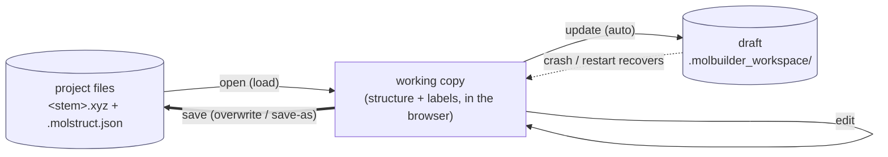
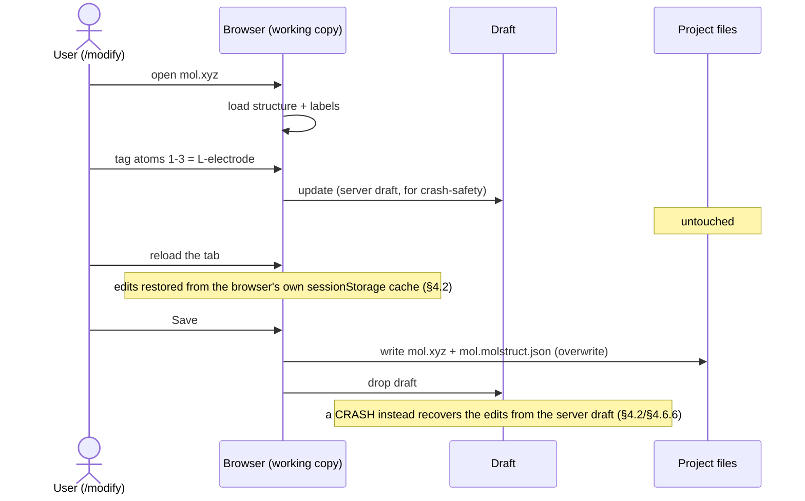

# Workspace Contract — sole source of truth

> **This document is the authoritative contract for client-side
> workspace state.** Every read, every write, every persistence
> action, every server response shape MUST match what's specified
> here. Code that diverges is incorrect by definition; the
> contract is right and the code is wrong.
>
> **Companion docs:**
>
> * [`workspace-guide.md`](../workspace-guide.md) — **start here if you're new**:
>   the plain-language developer guide (mental model, `ws.*` API cheat-sheet,
>   the mount-restore rule, common gotchas).  This contract is the precise
>   spec; the guide is the friendly on-ramp.
> * [`workspace-state.md`](workspace-state.md) — the 2026-06-07
>   audit + migration history that motivated this contract.  Read
>   it for the *why* behind the design.
> * [`web-api.md`](web-api.md) — every HTTP endpoint.  This
>   contract specifies the client-side `ws.*` surface; web-api.md
>   specifies the wire shape it consumes.
>
> **How to use this doc:**
>
> 1. New code consuming workspace state MUST go through `ws.*` —
>    no direct reads of `structureCanvas`, `selection.store`, or
>    the modify-tab IIFE state are permitted.
> 2. Review against this doc, not git blame.  If a behaviour in
>    code doesn't match a contract here, either the code is wrong
>    (fix it) or the contract is wrong (PR the doc + code together).
> 3. Every contract clause is pinned by a test ID in § 9.  A
>    contract change without a test update is a contract
>    violation.

---

## §1 Architecture overview

### 1.1 Modular layout

The workspace dispatcher is composed of **five small modules**, each
with a single responsibility.  All five compose into one mounted
object: `window.molbuilder.workspace` (aliased as `ws` throughout
this doc).

```
molbuilder/web/static/lib/workspace/
├── index.js          ── §1.2 — public mount + module assembly
├── state.js          ── §1.3 — the single in-memory workspace
├── reads.js          ── §2   — every getter
├── writes.js         ── §3   — every mutator (HTTP + in-memory)
├── persistence.js    ── §4   — sessionStorage + restore
├── selection.js      ── §5   — selection sub-namespace
└── view.js           ── §6   — view sub-namespace (camera/style)
```

Each module exports a factory function `create<Module>({state, notify, ...deps})` that returns the module's public surface.
`index.js` instantiates them in dependency order, wires
notifications, and mounts the assembled object on
`window.molbuilder.workspace`.

### 1.2 Single in-memory state

There is **one** workspace state object, owned by `state.js`.
Every read returns a defensive copy; every write mutates it
through a single helper (`state.replace(slice)`) that fires
subscribers exactly once per mutation.

```js
// state.js shape (TypeScript-style for docs only — code is plain JS)
type WorkspaceState = {
  structure: {
    text:          string,        // BOUNDARY-ONLY serialization (§1.2.1); NOT the
                                  //   geometric truth -- the atoms are (see below).
    source_format: "xyz" | "pdb",
    title:         string,
    n_atoms:       number,
    atoms:         Atom[],        // the geometric + chemical truth, coords included
                                  //   (§1.2.1, §7.2)
    lattice:       number[][] | null,  // 3x3 = periodicity.cell (kept for consumers)
    periodicity: {                     // full periodicity — rides with the geometry
      cell:      number[][] | null,    //   so a save writes the whole structure (§4.0).
      axis_kind: [string,string,string] | null,  // periodic|isolated|transport
      vacuum:    [number,number,number],
      kgrid:     [number,number,number],
    } | null,                          // see structure-periodicity.md
  } | null,

  source: {
    kind: "file"|"smiles"|"name"|"dna"|"rna"|"peptide"|"blank",
    file: string | null,
    generator_input: object | null,
  },

  dirty:        boolean,
  last_save_to: string | null,

  selection: {
    indices:    number[],         // sorted-ascending
    mode:       "click"|"filter",
    filters:    Filter[],
    combinator: "or"|"and",
  },

  view: {
    camera?: object,   axes?: boolean,
    style?:  object,   labels?: boolean,
  } | null,

  // Transient — never persisted, never restored:
  loading:  boolean,
  inFlight: boolean,
  error:    string | null,
  history:  WorkspaceSnapshot[],
}
```

### 1.2.1 The uniform in-memory structure — MANDATORY (one model, one accessor API)

**This is the mandatory data-model contract for molview.** Two rules; the second is
the important one.

**(A) ONE encapsulated in-memory model holds the whole molecule.** Its internal
LAYOUT is an implementation detail, chosen for efficiency — the TARGET is **columnar**
(struct-of-arrays), landed by Track D4. *(Today it is still a per-atom `atoms[]`;
because of rule B, that transition changes no consumer — see Migration status below.)*

```js
// TARGET internal layout (Track D4) -- consumers never see this directly (rule B).
{
  elements:  string[],                         // ["Au","Au","S", …]
  positions: number[][],                       // [[x,y,z], …]  -- ONE coordinate table
  regions:   { [label: string]: number[] },    // label -> atom indices (the label INDEX)
  frozen:    number[],                         // frozen atom indices
  cell, axis_kind, vacuum, kgrid,              // periodicity (structure-periodicity.md)
}
```
Columnar because: coordinates pack tightly (a table is ~12 bytes/atom vs ~50–100 for
a per-atom JS object), and **selection-by-label is a direct `regions[label]` lookup,
never an O(N) scan** of every atom's labels. Same shape as the backend `Structure` +
the sidecar. But this is a *choice* — it can change (typed arrays, etc.) freely,
because of rule B.

**(B) A UNIFIED ACCESSOR API is the ONLY way any consumer reads or writes the model.**
No consumer hand-crafts extraction — no `state.xyz.split()`, no `atoms[i].labels`
scan, no reaching into the raw arrays. The API materializes whatever VIEW the caller
needs from the internal layout:

```
getElements()            -> string[]
getCoordinates()         -> number[][]            // all coordinates
getLattice() / getUnitCell() -> number[][] | null // the cell
getAxisKind() / getVacuum() / getKgrid()
getAtomsByLabel(label)   -> number[]              // indices -- direct regions lookup
getFrozen()              -> number[]
atomFor3Dmol(i)          -> {elem, x, y, z}       // one atom, 3Dmol's shape
toAddAtoms()             -> [{elem, x, y, z}, …]   // whole model, for model.addAtoms
```
Because access is ONLY through the API, the storage layout can change without touching
a single consumer. **The API is the contract; the layout is free.**

**Consequences (mandatory):**
1. **The xyz/pdb string exists ONLY at the file boundary** — load parses it into the
   model, save serializes the model back out (atomically, §4). No consumer ever gets
   geometry from a string.
2. **Rendering calls `toAddAtoms()` / `atomFor3Dmol()`** — never `addModel(xyzString)`,
   never parses text.
3. **Filter / measure call the API** (`getAtomsByLabel`, `getCoordinates`) — no disk
   read, no hand-crafted scan (§4.0 memory-is-the-truth).

**Migration status (molview-migration-plan.md Track D).** Today geometry lives in
`structure.text` (a string) behind a per-atom `atoms[]` wire shape, consumers reach in
by hand (`state.xyz.split`, `atoms[i].labels`), and the viewer feeds 3Dmol
`addModel(text)`. Track D lands the model + API above; until it completes, the per-atom
`atoms[]` + `structure.text` are tolerated as transitional carriers behind the new
accessors.

### 1.3 The flow

```
                              ┌──────────────────────────┐
   User UI input              │                          │
   ────────────────►          │      ws.* WRITE API      │ (§3, §5)
                              │ loadFromFile, applyOp,   │
                              │ selection.toggle, ...    │
                              │                          │
                              └────────────┬─────────────┘
                                           │  fetch + payload pipeline
                                           ▼
                              ┌──────────────────────────┐
                              │   state.js replace()     │ (§1.2)
                              │   atomic mutation        │
                              └────────────┬─────────────┘
                                           │  notify
                                           ▼
              ┌────────────────────────────┼────────────────────────────┐
              ▼                            ▼                            ▼
   ┌──────────────────┐    ┌──────────────────────────┐  ┌──────────────────────────┐
   │ subscribers      │    │ persistence.js           │  │ readers via ws.* READ    │
   │ (UI panels       │    │ debounced sessionStorage │  │ API (§2): selection-panel,│
   │  refreshing)     │    │ write                    │  │  viewer-adapter, save    │
   └──────────────────┘    └──────────────────────────┘  └──────────────────────────┘
```

**No store outside `state.js` may hold a copy of workspace data.**  The
3Dmol embed handle and selection-panel DOM are *renderings*, not
copies.

### 1.4 Encapsulation contract — the module is sealed (MANDATORY)

**External code touches the workspace ONLY through the `ws.*` API** — the §2 read
getters (including the §1.2.1 accessors), the §3 write mutators, and the
`ws.selection.*` / `ws.view.*` sub-namespaces. That is the entire, exhaustive access
surface. Everything else is private.

**These internals are OFF-LIMITS — no consumer, ever, reaches into them:**

| Private internal | Use the API instead |
|---|---|
| `ws._canvasState` / the canvas-state store | `ws.getStructure()` / `ws.installStructure()` |
| the selection store's raw `state.atoms` | `ws.getAtoms()` / `ws.getCoordinates()` / `ws.getElements()` |
| `structure.text` (the xyz/pdb string) | `ws.getCoordinates()` / `ws.toAddAtoms()` — **never parse the string** |
| a structure's raw `regions` map | `ws.getAtomsByLabel(label)` |
| `periodicity.cell` / `.kgrid` off a raw object | `ws.getUnitCell()` / `ws.getKgrid()` / … |

**Why it is a hard rule (§1.2.1):** the internal layout is deliberately free to change
(per-atom → columnar → typed arrays); that stays safe *only* if every consumer goes
through the API. One consumer reaching in re-couples the whole module to the layout and
re-opens the exact bug class this contract closes — the disk-reading filter, the
string-parsing viewer, the hand-rolled save. **If the API doesn't expose what you need,
ADD an accessor — never reach past it.**

---

## §2 Read API — `ws.*` getters

Every getter returns a **defensive copy** (or a freshly-built
object): mutating the returned value does NOT mutate the
underlying state.  Read API never throws — missing state is
represented as `null` or empty.

| Method | Returns | Contract |
|---|---|---|
| `ws.getState()` | `WorkspaceState` (deep-cloned) | Composite snapshot.  Atomic — every nested field reflects the same `notify()` tick.  Use sparingly; prefer narrow getters. |
| `ws.getStructure()` | `{text, source_format, title, n_atoms, atoms, lattice}` or `null` | Returns `null` iff workspace is empty (§2.4).  `atoms` is a slice of the underlying array.  Never returns partial state — if `text` is present, `atoms` is consistent with it. |
| `ws.getSource()` | `{kind, file, generator_input}` | Always returns an object.  Empty workspace returns `{kind: "blank", file: null, generator_input: null}`. |
| `ws.getSelection()` | `{indices, mode, filters, combinator}` | `indices` always sorted ascending, no duplicates.  `filters` defensive-copied (each filter object cloned). |
| `ws.isDirty()` | `boolean` | True iff text has been mutated since last `save()`.  Set by `applyOp` / generators / undo.  Cleared by `save()`. |
| `ws.isEmpty()` | `boolean` | True iff there is no structure loaded.  Equivalent to `getStructure() === null`. |
| `ws.getAtoms()` | `Atom[]` (slice) | Direct atom-array accessor for hot paths (filter/picker).  Returns `[]` when empty.  Always reflects current state — never stale relative to `getStructure().atoms`. |
| `ws.getSourceFile()` | `string \| null` | Convenience: equivalent to `getSource().file`.  Used by selection-panel + viewer-adapter (current code reads `selection.store.getState().sourceFile`). |
| `ws.getLastSavedTo()` | `string \| null` | The disk path the workspace was last successfully saved to this session.  Returns `null` until the first `save()` call lands.  Used by `structureSave.targetPath()` to resolve the natural save destination and by modify-viewer's Send-to-Optimization gate to require a saved-and-clean state. |
| `ws.mountRestoreTarget()` | `string \| null` | The source-file a mount-time snapshot restore will hydrate (structure + selection), or `null` when the snapshot carries no restorable structure.  **Mount-time writers MUST consult this and defer when it equals the file they were about to load — see §4.5 (single-authority mount restore).**  Order-independent: derived from the persisted snapshot, not from whether the restore has run yet. |

**§1.2.1 accessors — the concealed model's read surface** (materialise a view; the
internal layout is never exposed):

| Method | Returns | Contract |
|---|---|---|
| `ws.getElements()` | `string[]` | Element symbol per atom, in index order. `[]` when empty. |
| `ws.getCoordinates()` | `number[][]` | `[[x,y,z], …]` — all coordinates. The ONLY way to read geometry; never parse `structure.text`. |
| `ws.getUnitCell()` / `ws.getLattice()` | `number[][] \| null` | The 3×3 cell (alias pair). `null` when non-periodic/absent. |
| `ws.getAxisKind()` | `[string,string,string] \| null` | Per-axis `periodic\|isolated\|transport`. **NOT defaulted** — `axis_kind` is a scientific choice (periodic vs transport can't be guessed), so `null` when unset; the consumer must resolve it. |
| `ws.getVacuum()` | `[number,number,number]` | Per-axis vacuum padding. **Default `[0,0,0]`.** |
| `ws.getKgrid()` | `[number,number,number]` | k-point grid. **Default `[1,1,1]` (gamma).** |
| `ws.getAtomsByLabel(label)` | `number[]` | Atom indices carrying `label` — a **direct** label→indices lookup, no scan. |
| `ws.getFrozen()` | `number[]` | Indices of frozen atoms. |
| `ws.atomFor3Dmol(i)` | `{elem,x,y,z} \| null` | One atom in 3Dmol's shape (numbers). |
| `ws.toAddAtoms()` | `[{elem,x,y,z}, …]` | Whole model in 3Dmol's shape, for `model.addAtoms(...)`. The render path uses THIS, never `addModel(string)`. |

Only the SAFE-to-default fields (`kgrid` → gamma, `vacuum` → 0) return a usable value
when unset; `axis_kind` (scientifically loaded) returns `null`. (Generic key-value
metadata was removed — it was an unpersisted data-loss sink; persisting it is a
designed sidecar-schema follow-up, not an accessor.)

### 2.1 Subscriptions

```js
const unsub = ws.subscribe(fn);   // returns unsubscribe function
```

Contract:

- `fn` is called **once immediately** on subscribe with the current
  `getState()` snapshot.
- `fn` is called **once after each `notify()` tick** with a fresh
  snapshot.
- Subscriber errors are **caught** — they do not prevent other
  subscribers from running and do not throw out of `notify()`.
- Calling `unsub()` is idempotent; calling it from inside `fn`
  is safe (uses iteration-time copy).

### 2.2 Atomicity

All reads within one `notify()` tick observe the same snapshot.
The only way to violate this is to mutate `ws` mid-tick from a
subscriber — **don't do that**.  Subscribers should mutate via
`ws.*` writes; chained mutations from a subscriber serialize on
the next microtask.

### 2.3 What gets persisted

`persistence.js` writes the workspace state minus `loading` /
`inFlight` / `error` / `history` on every `notify()` (debounced 100ms).
See §4 for the full persistence contract.

### 2.4 What "empty workspace" means

```js
ws.isEmpty()        === true
ws.getStructure()   === null
ws.getAtoms()       === []                       // not null
ws.getSource()      === {kind:"blank", file:null, generator_input:null}
ws.getSelection()   === {indices:[], mode:"click", filters:[], combinator:"or"}
ws.isDirty()        === false
```

---

## §3 Write API — `ws.*` mutators

Every mutator either succeeds (state replaced atomically, `notify()`
fires once) or rejects (state unchanged, no notification).  No
mutator leaves partial state.

| Method | Server route | Returns | Side effects |
|---|---|---|---|
| `ws.loadFromFile(path)` | → `molbuilderTab.commitFile` → POST `/api/workingcopy/open` | `Promise<WorkspacePayload>` | Replaces structure + source.kind="file" + source.file=path; resets selection to `[]`; resets dirty to `false`. (A6: the load takes its DATA from the working-copy framework, not the ad-hoc `/api/build/load`.) |
| `ws.loadFromText(text, filename)` | POST `/api/build/load` | `Promise<WorkspacePayload>` | Same as loadFromFile but with in-memory text.  source.kind="file" iff filename is a real path; resetSelection=true; touchCanvas=false (caller is responsible for canvas-state.dirty) |
| `ws.generate(kind, input, opts)` | POST `/api/build/molecule` | `Promise<WorkspacePayload>` | Replaces structure + source.kind=kind + source.generator_input=input; resets selection to `[]`; dirty=true |
| `ws.applyOp(op, args)` | POST `/api/modify/<op>` | `Promise<WorkspacePayload>` | Replaces structure; pushes pre-op snapshot to `history`; applies selection_remap per §3.4; dirty=true |
| `ws.applyPayload(payload, opts)` | (none — in-memory) | `void` | Direct atomic install (used internally by every HTTP mutator; exposed for restore paths).  `opts.touchCanvas`, `opts.resetSelection` per §3.3 |
| `ws.installStructure(structure, source)` | (none — in-memory) | `void` | Lower-level install for callers that already have a `Structure` object + a `Source` discriminant in hand (the structure tab's CLI-result path uses this).  Equivalent to `applyPayload` minus the WorkspacePayload envelope conventions; resets selection to `[]`, marks dirty=true |
| `ws.markDirty()` | (none) | `void` | Flips the `dirty` flag without changing structure or source.  Used by callers that mutate the canvas directly (e.g. modify-tab style swaps that don't round-trip through `applyOp`) so the unsaved-changes guard fires correctly |
| `ws.markSaved(path)` | (none) | `void` | Flips `dirty=false` and records `last_save_to=path`.  Used by save flows that bypass `ws.save` (e.g. the structure tab's `structureSave.save` already wrote the file and just needs to clear the dirty bit) |
| `ws.save(opts)` | → `structureSave.save` → POST `/api/workingcopy/save` | `Promise<void>` | Writes the whole dataset (`.xyz` + `.molstruct.json`) atomically from the scratch blob (§4.3); sets dirty=false, last_save_to=opts.path. (NOT `/api/files/write` — that writes only `.fdf`/wrapper artifacts.) |
| `ws.discard()` | (none) | `void` | Sets structure=null, source={kind:"blank",...}, selection={indices:[],...}, dirty=false.  **Unconditional** — caller MUST gate on warning modal first. |
| `ws.undo()` | (none) | `void` | Pops last entry from `history`, calls `applyPayload(snap, {touchCanvas: true})`.  No-op when history is empty. |

**§1.2.1 write accessors** — the granular mutation surface (in-memory; persists on the
next Save). Each is the mirror of its read accessor:

| Method | Returns | Side effect |
|---|---|---|
| `ws.setUnitCell(cell)` / `ws.setLattice(cell)` | `void` | Sets the 3×3 cell (rest of periodicity kept); marks dirty. |
| `ws.setKgrid(dims)` | `void` | Sets the k-point grid `[nx,ny,nz]`; marks dirty. |
| `ws.setAxisKind(kinds)` | `void` | Sets per-axis `periodic\|isolated\|transport`; marks dirty. |
| `ws.setVacuum(vac)` | `void` | Sets per-axis vacuum padding; marks dirty. |
| `ws.setLabel(label, indices)` | `Promise` | REPLACE-per-label: `label` now tags exactly `indices` (in-memory, **marks dirty** so the edit survives reload; the sidecar is written on Save). |

**Adding/deleting ATOMS is NOT a granular accessor** — geometry mutation goes through
`ws.applyOp(op, args)` (the server modify pipeline above), so bonds + validation stay
consistent.

### 3.1 Error handling

HTTP mutators reject with `Error(message)` where `message` comes
from:
- The server's `{ok: false, error}` envelope's `error` field
  (§7.4), OR
- A clean network-error message (`"network: timeout"`, etc.)

Rejection leaves state unchanged.  The caller is responsible for
displaying the error to the user.

### 3.2 The payload pipeline

`applyPayload(payload, opts)` is the **single sync point** for all
state replacement.  It performs in order:

1. Capture `preSelection` (before any mutation).
2. Replace `state.structure.text` (and dirty bit) when
   `opts.touchCanvas !== false`.
3. Replace `state.structure.atoms` from `payload.atoms`.
4. Apply selection remap (§3.4) or reset selection when
   `opts.resetSelection`.
5. Replace `state.structure.title`, `n_atoms`, `lattice` from
   payload.
6. Fire `notify()` exactly once.

The pipeline is the only place that touches state.atoms.  Every
public write method ends in `applyPayload`.

### 3.3 `applyPayload` options

| Option | Default | Effect when set |
|---|---|---|
| `touchCanvas` | `true` | When `false`, skip the dirty-bit update (caller has already set it; used by load paths that pre-marked clean) |
| `resetSelection` | `false` | When `true`, clear selection unconditionally (used by load/generate; modifier ops use selection_remap instead) |

### 3.4 Per-op selection rule

| Op class | Selection update |
|---|---|
| `loadFromFile` / `loadFromText` / `generate` | `resetSelection: true` → indices=[] |
| `applyOp(delete)` / `applyOp(add_atom)` | Apply `payload.extra.selection_remap` (§7.3) |
| `applyOp(translate)` / `applyOp(rotate)` / etc. (atom count unchanged) | Preserve as-is (no opt set; pipeline leaves it alone) |
| `discard` | indices=[] |
| `undo` | Restored from snapshot.selected |

`selection_remap` is a flat list per §7.3.  When the server sends
it, the dispatcher MUST use it instead of the naive in-range
filter, otherwise Delete-of-low-index silently drops the wrong
atom.

---

## §4 Persistence contract

### 4.0 First principle — memory is the truth; a save writes it whole

**The in-memory store (§1.2) is the single true state the user sees and edits.**
Every read, every filter, every edit, every measurement goes through `ws.*`;
**nothing reads disk for live workspace data.** Every persisted form (§4.1) is a
**complete serialization of that store**, written in one shot. Nothing is persisted
that isn't already in the store, and no save writes only part of it.

**The rule for every persisted form: write the entire in-memory state. NEVER
re-open the old target, read it back, and merge or pick-and-choose which fields to
keep.** That re-read-and-merge is precisely what silently drops fields. The store is
complete and authoritative; the persisted form follows the store, never the reverse.
There is no merge path.

**Worked example.** You build Au electrodes, tag the left ones `L-electrode`, and
set a 4×4×1 k-grid — all of it lives in the store. A save writes `.xyz` (the atoms)
+ `.json` (`cell` + `axis_kind=(periodic,periodic,transport)` + `kgrid=[4,4,1]` +
`regions.L-electrode=[…]` + hash) — the whole thing at once. Later you tag another
region: that updates the **store**, and the next save writes the **whole** store
again. It does **not** re-open the old `.json` and graft the new label onto it.

**Consequence for the store shape.** Because a save writes the whole store, the
`structure` slice MUST carry the full periodicity — `cell`, `axis_kind`, `vacuum`,
`kgrid` (not only `lattice`) — so the file never needs a field the store lacks.
Those fields' meaning is defined in
[`structure-periodicity.md`](structure-periodicity.md).

### 4.1 Three persistence surfaces

Memory is the truth (§4.0); it is backed by **three** persistence surfaces, each
with a distinct role. Only two of them are automatic; the files are written **only**
on an explicit Save.

| Surface | Role | Authoritative? | Written when | Where it lives |
|---|---|---|---|---|
| **Server draft** | crash-safe transient | **YES** — the transient of record | **every edit** (the working-copy `update`) | `<project>/.molbuilder_workspace/<stem>.<session>.wc.json` — or, **sourceless**, `projects_root()/.molbuilder_workspace/` (§4.1.1) |
| **`sessionStorage`** | fast same-tab-reload cache | no — an optional layer on top | every `notify()` tick (debounced 100 ms) | `sessionStorage["molbuilder.workspace.v1"]` (§4.4) |
| **Files** — `<stem>.xyz` + `<stem>.molstruct.json` | the durable copy | the durable save | **only** an explicit Save (`/api/workingcopy/save`) | the project directory |

- **Server draft = the authoritative crash-safe transient.** Mirrored to disk on
  **every** edit (the working-copy `update`, §4.6). It is what survives a crash or a
  server restart. It exists for **any** workspace that holds data.
- **`sessionStorage` = a fast same-tab-reload cache** layered on top. Optional, NOT
  authoritative — it exists so a same-tab reload rehydrates instantly with no server
  round-trip.
- **Files = the durable copy**, written only on an explicit Save — one atomic call
  that writes both files from the store's scratch blob. `.xyz` = geometry (atoms);
  `.json` = everything else — `cell`, `axis_kind`, `vacuum`, `kgrid`, `regions`,
  `frozen_atoms`, + a `structure_hash` tying the two.

`dirty` tracks whether the store has edits not yet written to the **files**; a Save
writes everything and clears it. (The draft and the sessionStorage cache always
mirror memory regardless of `dirty`.)

#### 4.1.1 The draft needs NO project directory

The server draft exists for **any** workspace that holds data — **a project
directory is NOT required**:

- A workspace **opened from a file** drafts **next to it**, in that file's
  `<project>/.molbuilder_workspace/`.
- A **brand-new unsaved molecule** (a SMILES/name/DNA build, a blank canvas — no
  source file yet) drafts to the **top-level** `projects_root()/.molbuilder_workspace/`,
  keyed by a **stable client workspace id** (so its draft is findable across a
  reload/crash before it has ever been saved).

Either way an edit is crash-safe from the first keystroke, before the user has
chosen where (or whether) to save.

### 4.2 The two recovery paths

Unsaved edits are recovered by **exactly one** of two paths, depending on what was
lost:

| What happened | Recovered from | How |
|---|---|---|
| **Same-tab reload** (the tab's JS heap is gone, the server is fine) | **`sessionStorage`** | instant, no server round-trip — the cache (§4.4) rehydrates the store on mount |
| **Crash / server restart / new tab** (the sessionStorage cache is gone, or the session changed) | **the server draft** | `list_orphans` (server) can surface drafts whose session can no longer clean them, for the user to **recover** or **discard** (`/api/workingcopy/{orphans,recover,discard,clean}`). The core never auto-deletes unsaved work or auto-adopts stale work. **STATUS: the endpoints exist but are NOT yet wired to a UI** — crash-recovery is available at the API layer only; a recovery prompt is unbuilt (see molview-migration-plan Track b). |

### 4.3 Saving to disk — the rules

Saving belongs to **editing** (the Modify tab). A **view-only** surface (the Results
inspector, an embedded viewer) **never saves** — there is nothing to persist. When
you do save, you are always writing a **modified version** of what you loaded, so:

- **Only on explicit Save.** Not on every in-memory edit (e.g. assigning a label
  does NOT touch disk). The store carries unsaved edits across reloads via §4.1;
  disk is written only when the user hits Save.
- **Target = the current project directory.** Never an arbitrary path.
- **The user names the output; there is no default name** — and it does **not**
  default to the loaded file's name. You loaded a structure in order to *change* it,
  so a save is a **save-as** to a file you name, not an overwrite of the source.
- **Overwrite is always checked.** If that name already exists in the project dir,
  the user must confirm before it is replaced.
- **The `.xyz` and its `.molstruct.json` are written together, atomically**, with
  the json's `structure_hash` = the sha256 of the `.xyz` just written — the two are
  never left out of sync. This is the whole-store write of §4.0, landed on disk.

### 4.4 The `sessionStorage` cache

The same-tab-reload cache (§4.1) is a single key holding the whole state slice. It
is **not** authoritative — it is a convenience layer so a reload rehydrates without a
server round-trip. The authoritative transient is the server draft (§4.1, §4.6).

#### 4.4.1 The single key

```
sessionStorage["molbuilder.workspace.v1"] = JSON.stringify({
  v:        1,                              // schema version
  saved_at: "2026-06-09T20:30:00.000Z",     // ISO 8601, UTC
  state: {                                  // NB: key is "state",
                                            //     pinned by tests.
    structure:    { ... } | null,
    source:       { ... },
    dirty:        boolean,
    last_save_to: string | null,
    selection:    { ... },
    view:         { ... } | null,
  },
})
```

**There is no other persistence key.** The legacy keys
(`molbuilder.structure_canvas`, `modify-state`,
`molbuilder.panelMode`) are deleted as of Phase 10; restoring code
that reads them is incorrect.

#### 4.4.2 Write cadence

- Debounced 100ms after every `notify()` tick.
- Final flush on `pagehide` event (no debounce).
- Errors (quota exceeded, storage disabled) are logged + swallowed.

#### 4.4.3 Read at restore

```js
const snap = ws.readPersistedSnapshot();    // null if missing/corrupt
```

Contract:
- Returns the parsed `workspace` object or `null`.
- `null` covers: no key, malformed JSON, schema version mismatch.
- The caller (page bootstrap) decides whether to re-fetch from
  disk (dirty=false, source.kind=file) or atomic-replace from
  memory (dirty=true, or non-file source).  The decision lives in
  the modify-tab restore gate — `viewer.js::restoreModifyState`
  (`shouldUseSavedAtoms = dirty || !source.file`), NOT a
  `persistence.js` module (there is none; the dispatcher owns the
  debounced write).

#### 4.4.4 What's NOT persisted

`loading`, `inFlight`, `error`, `history`.  These are transient
runtime state; restoring them would be incorrect (e.g.
`inFlight=true` from a navigation-killed request).

### 4.5 Mount-time restore ownership (single-authority rule)

**Why this exists.**  On a page mount there can be MORE THAN ONE surface
that wants to hydrate the workspace from persisted state:

- `viewer.js::restoreModifyState` restores the full snapshot
  (structure **+ selection** + camera + chrome) from §4.4.
- `selection-bootstrap.js` re-commits `projects.getCurrentFile()` for a
  genuine cross-tab handoff.
- (future) any new tab/surface that loads-on-mount.

The workspace store is a **shared, mutable, async** module: its mutators
(`adoptSession`, `setSourceFile`, `set`, …) all write the one `state` and,
under the hood, race with last-writer-wins.  If two of the surfaces above
both write on mount for the **same file**, the later write wins
nondeterministically.  A fresh-load commit carries `selection:[]`, so when
it lands *after* the snapshot restore it **silently clobbers the restored
selection** — an intermittent "my selection vanished after navigating back"
bug (root-caused + fixed 2026-07-01; the class also produced the earlier
BOMB-0/2 / "MUST await" / "selector tracks the old file" fixes).

**THE CONTRACT (every mount-time writer MUST honor it):**

> On page mount, the **snapshot restore is the SOLE authority** for
> hydrating the workspace from the persisted snapshot.  Before any *other*
> surface issues a load/commit on mount, it MUST consult
> **`ws.mountRestoreTarget()`** — the source-file the snapshot restore will
> hydrate (or `null`).  If that equals the file the surface was about to
> load, the surface **MUST defer** (do not commit).  A file the snapshot
> does **not** own (a genuinely different / new structure — a real cross-tab
> handoff) is not subject to this and still loads.

```js
// selection-bootstrap.js — the canonical honoring of the contract:
const target = ws.mountRestoreTarget();          // file the restore owns, or null
if (isLoadableStructure(initial) && initial !== target) {
    commitFile(initial);        // cross-tab handoff: snapshot doesn't own it
} else if (isLoadableStructure(initial)) {
    setCandidate(initial);      // DEFER — restoreModifyState owns hydration
}
```

`ws.mountRestoreTarget()` is **order-independent**: it derives from the SAME
persisted snapshot the restore uses, so a caller need not know whether the
restore has already run.  Live (non-mount) user actions — a sidebar
dblclick, the Load button — are NOT gated: they are explicit intent and
must load.

**Design rule for the store itself:** a mount-time restore must set the
selection **last / authoritatively** for its file; a redundant fresh-load
of an already-owned file is a coordination error at the *caller*, prevented
by the rule above rather than papered over inside the store.

---

## §4.6 The working-copy persistence mechanism

> **Folded in from the former `working-copy-persistence.md`** (now
> [archived](archive/working-copy-persistence.md)). This is the server-side
> mechanism that implements the **server draft** and the **files** surfaces of §4.1
> — the generic core (`molbuilder/workingcopy.py`, L1) + the structure codec
> (`workingcopy_structure.py`) + the `/api/workingcopy/*` routes. The client model
> above (§4.0–§4.5) is what a browser surface honors; this is what it calls.

**The whole idea, one sentence:**

> **Load an artifact into the browser, edit it, and write it back to files only when
> the user hits Save (overwrite, or save-as). A draft keeps unsaved edits safe
> across a reload or crash. That's it — no gate, no hashing.**

### 4.6.1 Goal & boundary

**Goal.** Two guarantees:
1. **Don't lose edits** on a reload or crash → keep a **draft** of the working data.
2. **Don't touch the project files on every edit** → write them **only on an
   explicit Save.**

**This IS:** load → edit-in-browser → save (overwrite or save-as), plus a draft for
crash-safety. **Format-agnostic** — an application plugs in a **codec** (§4.6.4).
The core never learns what an atom is; it is **generic and reusable beyond
structures** (a config/script editor reuses it unchanged, §4.6.8).

**This is NOT:**
- a **gate / integrity check** — you own the data you loaded; a save just writes it.
  (An earlier version added a "did the file change underneath?" gate; that was
  solving a non-problem, because a save writes the whole self-consistent pair, so
  the on-disk file is simply overwritten. **No gate, no hashing.** This is what
  superseded the old `browser-data-contract.md`.)
- **version history / undo** — one live working copy, not a version stack.
- **the artifact's format** — that's the codec.
- **multi-user / concurrent editing** — single-user, isolated.

### 4.6.2 The flow



- **open** reads the files into a working copy.
- **update** (on every edit) writes a **draft** — the *only* automatic server write,
  and it goes to `.molbuilder_workspace/`, never the project files. The draft needs
  no project dir (§4.1.1).
- **save** writes the project files (both, together): same path = overwrite, new
  path = save-as. Then the draft is dropped.

### 4.6.3 Worked example (the structure app)



### 4.6.4 The codec (the only format-specific part)

```
codec.load(source_path)   -> data              # read the file(s) into working data
codec.files(data, target) -> [(path, bytes)]   # the file(s) a save writes
codec.scratch_blob(data)  -> json              # how the working copy sits in the draft
codec.from_scratch(blob)  -> data              # inverse (reload / crash recovery)
```

The `.xyz`+`.json` codec (`workingcopy_structure.py`): `load` reads the `.xyz` + its
sidecar → a `Structure`; `files` returns `[(<stem>.xyz, …), (<stem>.molstruct.json,
…)]`. **The core never learns what an atom is.**

### 4.6.5 The API

```
WorkingCopy.open(source, codec, session, project_dir)   # load
WorkingCopy.new(codec, session, project_dir, data)      # a fresh artifact (save-as on first save)
WorkingCopy.recover(draft_record, codec, project_dir)   # adopt a crashed session's draft
wc.update(data)                                         # edit -> draft
wc.save(target)               -> Path                   # write files (overwrite / save-as); drop draft
wc.discard()                                            # drop draft, write nothing
list_orphans / discard_orphan / clean_all               # crash-recovery housekeeping
```

`/api/workingcopy/*` is a thin wrapper: `open` · `update` · `save` · `discard` ·
`orphans` · `recover` · `clean`. Paths go through `_resolve_within_roots`.

### 4.6.6 Draft envelope & crash recovery

The server draft lives at
`.molbuilder_workspace/<stem>.<session>.wc.json` — a JSON envelope
`{schema, source, session, ts, blob}`, written **atomically on each `update`**,
keyed by **session** (the server-side session — the login when authenticated, else a
stable per-server-run id for no-auth localhost). It sits **next to the source file**
for a file-backed workspace, or under `projects_root()/.molbuilder_workspace/` for a
sourceless one (§4.1.1).

A crash (or, for no-auth, a server restart) leaves a draft its session can no longer
clean. `list_orphans` **can** surface them for the user to **recover** or **discard**
— the core **never auto-deletes** unsaved work or **auto-adopts** stale work. Normal
cleanup is on `save` (the draft is dropped, keyed by the workspace's identity — b1) or
session-end (no time-based sweep). **The orphan/recover path is API-only today; no UI
invokes it yet** (Track b). See §4.2 for how this
pairs with the `sessionStorage` same-tab path.

### 4.6.7 Use contract

**An application MUST:** supply a codec; `open` on load, `update` on **every** edit,
`save` **only** on an explicit user Save, `discard` to abandon.

**An application MUST NOT:** write a project file outside `save`; auto-save on every
edit; delete a draft behind the user (only `save` success, session-end, or explicit
cleanup removes it).

Follow those and the two guarantees hold: **unsaved edits survive reload/crash**, and
**project files change only on an explicit Save.**

### 4.6.8 Applications

| Application | `files()` writes | Codec |
|---|---|---|
| **Structure + sidecar** | `<stem>.xyz` + `<stem>.molstruct.json` | `workingcopy_structure.py` |
| *(future)* config / script | its file(s) | reuse this core unchanged |

The core is generic and **codec-pluggable**; nothing in it is structure-specific.

---

## §5 Selection sub-namespace — `ws.selection.*`

### 5.1 Local mutators (no HTTP)

| Method | Effect |
|---|---|
| `ws.selection.toggle(i)` | Toggle atom `i` in selection.  Out-of-range indices ignored. |
| `ws.selection.set(indices)` | Replace selection with sorted-unique copy of `indices`.  Out-of-range filtered out. |
| `ws.selection.add(indices)` | Union with current selection.  Sort + dedup. |
| `ws.selection.remove(indices)` | Subtract from current selection. |
| `ws.selection.all()` | Select every atom (`0..n_atoms-1`). |
| `ws.selection.invert()` | Replace with complement. |
| `ws.selection.clear()` | Empty the selection. |
| `ws.selection.setMode(mode)` | Sets mode to `"click"` or `"filter"`.  Throws on invalid value. |
| `ws.selection.setFilters(filters)` | Replaces filter list.  Does NOT eval — call `applyFilter()` separately. |
| `ws.selection.setCombinator(c)` | Sets combinator to `"or"` or `"and"`. |

Each mutator fires `notify()` exactly once.

### 5.2 Server-backed selection ops

| Method | Server route | Returns | Effect |
|---|---|---|---|
| `ws.selection.applyFilter()` | POST `/api/selection/eval` | `Promise<number[]>` | Sends current filters + combinator to server; replaces selection with result; preserves mode. |
| `ws.selection.writeLabel(target, indices)` | *(in-memory)* | `Promise<void>` | Applies a REPLACE-per-target label change to the store in memory — no HTTP, no disk write.  The sidecar is written only on explicit Save (via `/api/workingcopy/save`, which writes the `.xyz` + `.json` pair together).  `target` is `"frozen_atoms"` or one of the region names. |
| `ws.selection.refreshAtoms()` | POST `/api/selection/atoms` | `Promise<void>` | Refetch atoms for the current `sourceFile`.  Overlays the `.molstruct.json` sidecar (frozen_atoms + regions) — needed after `adoptSession({atoms})` installs build-load atoms which lack sidecar enrichment.  No-op when `sourceFile` is null. |

### 5.3 Atoms accessor

`ws.selection.getAtoms()` is an alias for `ws.getAtoms()` —
provided so existing call sites that read `selection.store.getState().atoms`
have a 1-line migration target.

---

## §6 View sub-namespace — `ws.view.*`

| Method | Effect |
|---|---|
| `ws.view.applyState(patch)` | Merges `patch` into view state; delegates camera/style updates to the 3Dmol embed handle. |
| `ws.view.getState()` | Returns the current view state (camera + style + axes + labels).  Always returns an object (never null) — empty view returns `{}`. |

The 3Dmol embed handle is a *rendering target*, not a store.  View
state in `state.js::state.view` is the source of truth; the embed
mirrors it.  This contract is maintained by `view.js`.

---

## §7 Wire contract (server → client)

### 7.1 WorkspacePayload — every Structure-returning endpoint

```json
{
  "ok":            true,
  "text":          "...",       // canonical XYZ or PDB bytes
  "source_format": "xyz",       // "xyz" | "pdb"
  "title":         "...",
  "n_atoms":       42,
  "atoms":         [ /* per §7.2 */ ],
  "lattice":       null,        // or 3×3 array
  "issues":        [ /* Issue records */ ],
  "extra":         { /* per-endpoint additions */ }
}
```

Routes that emit this shape (per `web-api.md`):

| Route | `extra` keys |
|---|---|
| POST `/api/build/load` | `pdb`, `source_format`, `n_residues`, `summary` |
| POST `/api/build/molecule` | `backend_used`, `add_hydrogens_mode`, `pdb`, `summary` |
| POST `/api/modify/<op>` | `selection_remap` (when applicable), `op`, `args` |

### 7.2 Atom row shape

The wire shape carries **coordinates** (§1.2.1 — the atom is the geometric truth);
the client normalises `regions`/`is_frozen` (snake) → `labels`/`isFrozen` (camel) and
keeps `x`/`y`/`z` as-is.

```json
{
  "index":         12,
  "element":       "C",
  "x":             1.204,        // coordinates -- numbers, on the atom (§1.2.1)
  "y":             0.0,
  "z":            -0.512,
  "atom_name":     "CA",         // PDB only; absent for XYZ-origin atoms
  "residue_id":    42,
  "residue_name":  "ALA",
  "chain_id":      "A",
  "regions":       ["bridge"],
  "is_frozen":     false
}
```

### 7.3 selection_remap (in `extra`)

Flat list of `length = pre-op atom count`.

```json
"selection_remap": [null, 0, 1]      // delete index 0
"selection_remap": [0, 1, 2]         // add atom (identity, new atom at index 3)
"selection_remap": [0, 1, 2, 3]      // no-shift op (identity)
```

`remap[old_index] === new_index` (or `null` when the atom was removed).

### 7.4 Error envelope

```json
{
  "ok":     false,
  "error":  "human-readable message",
  "issues": [ /* optional issue records */ ]
}
```

The client surfaces `error` to the user.  When `issues` is
present, the panel renders them too (per per-tab convention).

---

## §8 Deprecated surfaces — DO NOT USE

The following surfaces existed pre-Phase-10 but are now **deleted**:

| Deprecated surface | Replacement |
|---|---|
| `window.molbuilder.structureCanvas.*` | `ws.getStructure()` / `ws.isDirty()` / `ws.getSource()` |
| `window.molbuilder.selection.store.*` | `ws.selection.*` + `ws.getAtoms()` / `ws.getSelection()` |
| `window.molbuilder.modify.state` (IIFE) | `ws.getStructure()` |
| `sessionStorage["molbuilder.structure_canvas"]` | `sessionStorage["molbuilder.workspace.v1"]` |
| `sessionStorage["modify-state"]` | `sessionStorage["molbuilder.workspace.v1"]` |
| `sessionStorage["molbuilder.panelMode"]` | `sessionStorage["molbuilder.workspace.v1"].selection.mode` |

A `grep -rn 'structureCanvas\|selection\.store\|window.molbuilder.modify.state' molbuilder/web/static/` from a non-`lib/workspace/` directory MUST return zero matches.  This is enforced by `tests/test_no_legacy_store_consumers.py` (shipped 2026-06-09 with Phase 10 Fix 4).

**Implementation status (Phase 9, 2026-06-13):** the legacy module paths `lib/structure/canvas-state.js` + `lib/selection/store.js` are GONE.  Their bodies live at `lib/workspace/_canvas-state-impl.js` + `lib/workspace/_selection-store-impl.js` — workspace-internal helpers the dispatcher loads to build its singletons.

* Every consumer goes through `ws.*` — enforced by `tests/test_no_legacy_store_consumers.py`.
* `window.molbuilder.structureCanvas` + `window.molbuilder.selection.store` are NO LONGER mounted in production.  The dispatcher reads from the private `window.molbuilder.workspace._canvasState` slot (canvas-state) and constructs its selection-store singleton via the `_createStore` factory at module init.
* Test escape hatch: dispatcher `_canvas()` + `_store()` honour pre-mounted legacy globals if a harness installs them before the dispatcher loads.  Production templates never do.
* `runtime.register("selection.store", …)` + `runtime.register("structure.canvas", …)` are GONE — no consumer ever called `whenReady` on them.

---

## §9 Compliance map (tests pin every clause)

| Contract clause | Pinning test |
|---|---|
| §1.2 single state | `tests/test_workspace_dispatcher_js.py::TestPublicSurface` (the dispatcher IS the single state) |
| §2 each `ws.*` getter exists + returns documented shape | `tests/test_workspace_dispatcher_js.py::TestPublicSurface`, `::TestReads` |
| §2.1 subscribe contract | `tests/test_workspace_dispatcher_js.py::TestSubscribe` |
| §2.2 atomicity | `tests/test_workspace_dispatcher_js.py::TestReads` (each read returns one tick's snapshot) |
| §2.4 empty workspace shape | `tests/test_workspace_dispatcher_js.py::TestReads` (empty-mount cases) |
| §3 each `ws.*` mutator routes through `applyPayload` | `tests/test_workspace_dispatcher_js.py` + downstream modify/build/spectra blueprint tests that exercise the mutator + assert workspace state |
| §3.2 payload-pipeline order | `tests/test_workspace_dispatcher_js.py::TestSelectionPassthrough` (the `preSelection` capture order is observable via selection_remap on Delete) |
| §3.4 per-op selection rule | `tests/test_modify.py::TestComputeSelectionRemapAfterDelete`, `::TestComputeSelectionRemapAfterAdd` + `tests/test_web.py::test_modify_delete_returns_selection_remap` |
| §4 persistence contract | `tests/test_workspace_dispatcher_js.py::TestPersistRoundtrip` |
| §5 selection sub-API | `tests/test_workspace_dispatcher_js.py::TestSelectionPassthrough` |
| §6 view sub-API | `tests/test_workspace_dispatcher_js.py::TestPublicSurface` (view passthrough) |
| §7.1 wire shape | `tests/test_shared.py::TestStructureToDictExtraThreading` + `tests/test_web.py::test_build_load_returns_workspace_payload` |
| §7.3 selection_remap shape | `tests/test_modify.py::TestComputeSelectionRemapAfterDelete`, `::TestComputeSelectionRemapAfterAdd` |
| §8 zero legacy-store consumers | `tests/test_no_legacy_store_consumers.py` ✅ shipped 2026-06-09 |

**Coverage gaps (future PRs should close these):**

* No dedicated test for §1.2 (single in-memory state — currently
  implicit in the dispatcher's interface tests).
* No dedicated test for §3.2 payload-pipeline ORDER (the order is
  observable via the selection_remap pre-capture but not directly
  pinned).
* ✅ §5 ``ws.selection.getState()`` shape + subscribe-vs-getState
  identity invariant — pinned 2026-06-09 by
  ``tests/test_workspace_dispatcher_js.py::TestSelectionPassthrough::test_getState_returns_contract_shape_with_indices_not_selection``
  and ``::test_subscribe_callback_receives_contract_shape_not_legacy``.

A new test ID appears in this column iff a new clause is added.  A clause without a pinning test ID is a contract gap.

---

## §10 Change process

1. PR the contract change AND the code AND the test together.
2. Update §9 if the test ID changes.
3. Cross-reference [`workspace-state.md`](workspace-state.md) when
   the *rationale* changes (historical context for the design).
4. NEVER ship a code change that diverges from this contract.
   If the contract is wrong, change it explicitly.
