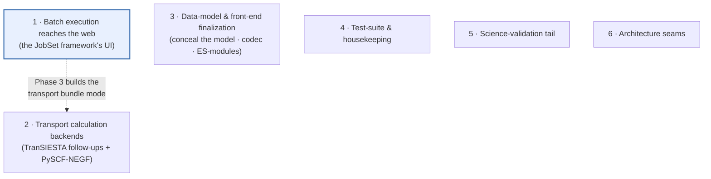
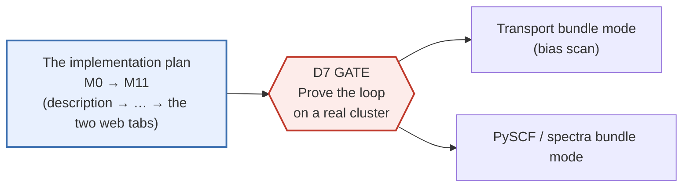

# Roadmap — the one plan

**Role:** plan
**Domain:** *(root — the spine)*
**Companions:** [`design.md`](?doc=design.md) (mission · principles · decisions),
[`architecture.md`](?doc=architecture.md) (the reuse map: task → tool),
[`backend-architecture.md`](?doc=backend-architecture.md) (the backend by
concern), [`README.md`](?doc=README.md) (the index + the rules).
*(The spine docs `design.md` / `architecture.md` / `backend-architecture.md`
landed in Wave 9 — composed **last** as concise summaries over the settled
component docs.)*

This is the **single source of truth for open work**. Every feature or
backend item that is planned, in progress, or blocked lives here — nowhere
else. When an item ships, it moves to the *Closed work* log at the bottom
(one line) and its durable decision is recorded in [`design.md`](?doc=design.md)'s
decisions index. A contract doc may carry **one pointer** back to a roadmap item, but it
never holds the plan itself (rule R3).

> **Why one file.** Plans used to be scattered across six documents — the
> old `roadmap.md`, `design.md`'s "Next steps", the tab-reorganization phase
> plan, the staged-execution contract's phasing section, and two front-end
> migration trackers. They drifted out of sync: some described work that had
> already shipped as if it were still pending. Consolidating them here means
> there is exactly one place to look, and closing an item is one edit.

---

## The open workstreams at a glance

Six streams of open work, in priority order. The first is the active
priority; the others proceed around it. (5 and 6 are consolidation streams
added 2026-07-29 from the migration's deferred-work dig: science checks
deferred with rationale, and named architecture seams.)

The dotted link is the one real cross-stream dependency: the transport
bias-scan (workstream 2) is delivered *through* the batch framework's
Phase 3 (workstream 1), not as separate one-off code.

---

## 1. Batch execution reaches the web  *(active priority)*

**Goal.** A scientist sets up a multi-stage calculation in a setup tab
(for example, a relaxation "ladder" that tightens convergence stage by
stage), clicks one button, and gets back a **runnable bundle**: a folder of
per-stage input files plus a `job-set.json` plan describing how they chain,
ready to copy to a workstation or an HPC cluster and launch. Today that
button exists in the Structure-optimization tab but its output is silently
dropped — the stage table POSTs a ladder that goes nowhere.

**Where the work stands.** The whole engine-agnostic framework already
exists on the command line: the `jobset` model and its `job-set.json`
persistence, the `molbuilder jobset plan/prep/submit/status` verbs (both
local `bash` execution and SLURM submission, **one job per invocation**), and
the SIESTA stage producer (`stages_to_jobset`). What is missing is the **web front-end** onto that framework —
the setup tabs cannot yet produce a bundle, show its plan, or report its
run status. What is built lives in
[`execution/job-system.md`](?doc=execution/job-system.md) (the JobSet framework
and its CLI verbs); the current→target status matrix is
[`execution/overview.md`](?doc=execution/overview.md) § 2, which is
authoritative.

> **The staged design has moved on since this workstream was written.** Four
> contracts now own what the old staged-execution document described, and one of
> them changes this workstream's shape: **stages no longer chain**, so "produce a
> bundle, submit the chain" is being replaced by *prep and submit one stage at a
> time, after looking at the last one*. Read
> [`execution/project-layout.md`](?doc=execution/project-layout.md) (the folder
> and the workflow), [`engines/stages.md`](?doc=engines/stages.md) (what a stage
> is), [`execution/run-identity.md`](?doc=execution/run-identity.md) (the id) and
> [`execution/checkpointing.md`](?doc=execution/checkpointing.md) (the history)
> before building any of this. The design and each item's *"done when"* is
> [`execution/staged-runs-implementation-plan.md`](?doc=execution/staged-runs-implementation-plan.md);
> **the order, the milestones and the reviews are
> [`execution/staged-runs-implementation-plan.md`](?doc=execution/staged-runs-implementation-plan.md)**,
> which is the one build order for this workstream.

### Vocabulary (defined once, used throughout)

- **Bundle** — a self-contained folder holding every stage's input file
  plus the `job-set.json` plan. Portable: copy it to the target and run.
  (Distinct from the *handoff bundle* that carries one finished run into the
  next workflow — a different thing; see rule R5 in `README.md`.)
- **Producer** — the code that turns a tab's form (or a CLI invocation)
  into a bundle. There is one shared producer per engine; the web endpoint
  and the CLI both call it, so a web bundle is byte-for-byte what the CLI
  emits.
- **Ladder** — a set of related jobs run in sequence, each starting from
  the previous one's result (e.g. coarse → medium → fine relaxation).
- **D-numbers** (D7, D9, D10, …) — design decisions from the staged-execution
  contract, which the 2026-07 migration retired; it survives only at
  `docs/archive/old_docs/protocols/staged-execution.md`. The numbers are kept as
  stable references so older notes still resolve, but **the archive is not the
  authority** — for anything still open, the live owners are
  [`engines/stages.md`](?doc=engines/stages.md),
  [`execution/project-layout.md`](?doc=execution/project-layout.md) and
  [`execution/staged-runs-implementation-plan.md`](?doc=execution/staged-runs-implementation-plan.md).

### Phasing

**The SIESTA half of this workstream is planned in one place:**
[`execution/staged-runs-implementation-plan.md`](?doc=execution/staged-runs-implementation-plan.md)
— thirteen milestones bottom-up, from `task.json` to the two web tabs. What this
workstream still owns *beyond* that plan is the two other engines and the gate
between:

**D7 gate — prove it before expanding.** Before building any more producers, run
the full SIESTA loop end-to-end on a real cluster: produce → prep → submit →
monitor. This gate exists because the other engines' producers are cheap to add
but expensive to debug remotely; we validate the pattern once on the engine that
is furthest along. In the implementation plan it sits after **M9** (the command
surface), which is the first point at which the whole loop can be driven from a
terminal.

**Transport (gated on D7).** A `transport` producer and a transport-tab mode.
This is also how the transport **bias scan** (workstream 2) ships: one `.fdf`
per bias point plus its plan, produced by the framework rather than hand-rolled.
Its tab writes a template plus a description like every other generating tab, and
feeds the **same shared Task Setup tab** — which is why M11's columns are read
from the schema rather than from a list. A bias scan is a **sweep** rather than a
ladder — one deck per bias point, all independent — and `task.json` already
expresses that: one member per voltage, each saying `restart: clean`. What the
transport tab owes is a producer, not a new format.

**PySCF / spectra (gated on D7).** `pyscf` and `spectra` producers with their tab
mirrors, plus PySCF's big-binary globs for the checkpoint system. ⚠ PySCF's
ladder runs **inside one process**, so it is genuinely a different shape — it
reads the same description, not the same runner (`engines/stages.md`).

**Two decisions this workstream contributed, carried into the plan.** **D10 —
the activation warning**: on a workstation, detect the conda activation and
persist it; on HPC, warn if it is unset (the parked task #98; it lands with the
plan's P5/P6, where the wrapper's environment is resolved). **D9 — trying an
alternative from a chosen state**: reshaped by the checkpoint rework, which
removed the branch verb and its route. **The capability is shipped**: you
restore the state and save from it, and the new state's parent is the one you
restored — that *is* the fork (`checkpointing.md § 7.1`), and both halves are
already routed and already in the sidebar. What survives from the decision is
the **drafted note**: when a save follows a restore, the panel can propose
`<stage>-<what you are trying>` for you to confirm or edit, which the contract
explicitly allows (`checkpointing.md` § 9, L3). That is the plan's P8, and it is
smaller than what was written here.

**Out of scope (D8).** Automated host → target file shipping (scp/rsync).
Bundles are produced where the app runs; a co-located target needs no
copy, and a split host is covered by a manual `scp` the deploy panel spells
out.

**Test-pin shape.** A web-produced SIESTA folder matches the CLI's for the same
description, file by file — **excluding PROVENANCE's `generated-at`**, which
stamps generation time and so differs between any two produces; that is the only
legitimate exclusion, and it is the plan's **M10**. The stage table no longer
drops its POST.

---

## 2. Transport calculation backends  *(Phase B.3)*

The transport engine abstraction (a registry of engines behind one
`TransportConfig` + `Structure` pair) shipped as Phase B.2. Phase B.3
fills in the concrete engines and the results path.

**TranSIESTA** — the zero-bias device `.fdf` and the **electrode `.fdf`
wizard** are shipped (`transport/wizard.py`; `molbuilder transport electrode`
extracts a labelled `*-electrode` region's atoms from the device and emits the
matching bulk-lead `.fdf`, plus a `transport preflight` device↔electrode
contract check). Still open:

1. **Bias scan.** `bias_voltages_v` is a list, but the engine emits only
   the first value (with a preflight warning when more are given).
   Planned: one input per bias point plus a driver — **delivered through
   the batch framework's Phase 3**, not as separate code.
2. **Output parsing + schema.** `parse_output` is not yet implemented for
   transport (raises `NotImplementedError`); it needs a `<job>.transport.json`
   schema designed first (mirroring the spectra sidecar).
3. **Results inspector.** No in-app way to view transmission data yet;
   planned is a transport inspector on `/results` (a transmission-vs-energy
   chart, and an I–V chart once multi-bias data exists).
4. **Methods-paragraph generator.** Today a placeholder; the full version
   lands with output parsing so it can interpolate real run parameters.

**PySCF-NEGF** — planned. A Gaussian-basis NEGF engine for smaller device
regions with higher-level exchange-correlation. Mechanical to add given the
proven registry: a new module mirroring the TranSIESTA engine's shape,
self-registering via the engine decorator; endpoint code is unchanged.

**Inelastica / IETS** — planned, further out. A third engine for
electron-phonon-resolved transmission (inelastic tunnelling spectroscopy).
Distinctive because it consumes **both** a `TransportConfig` *and* the
`.spectra.json` the Spectrum tab produces — the one place the transport and
vibrational halves of the app would meet. Already named as the intended third
engine in `transport/engine_base.py`, `config/transport.py`, and the transport
blueprint.

**Region consumption from the handoff bundle** (#487) — **half shipped.** The
`%block TS.Elecs` emitter already reads `struct.regions` for **electrode**
assignment (`transport/transiesta.py`), so a labelled structure no longer has to
be retyped. The **buffer** half is what remains: `TS.Atoms.Buffer` is emitted
nowhere in `molbuilder/transport/`. Independent of the rest of B.3.

**Test-pin shape.** A-form vs B-form / bias-0 vs bias-N inputs differ in
the expected keywords; an unavailable engine raises the documented error,
not a bare 500.

---

## 3. Data-model & front-end finalization

The 3-D viewer, atom selection, and structure editing were consolidated
into one concealed **MolView** module that every tab mounts, and the
`Structure` object gained a single serialization codec. Most of this
shipped; what remains is the tail — sealing the module's internals,
finishing the ES-module conversion (both **browser-verified** before they
count as done), routing the CLI through the shared codec, and exercising the
last annotation channel kind. The design for each item lives in its contract;
this is the plan tail.

**Conceal the data model.**

- **D3 tail** — route the last render path through the module's accessors:
  remove the `viewer.js` re-parse of raw structure text and the direct
  `addModel(string)` embed call, and drop the disk-load endpoint from the
  Modify load path. Pin: no consumer reaches past the accessors into raw
  arrays.
- **D4** — keep the internal model columnar (`elements[]`, `positions[][]`,
  region map, `frozen[]`) and never surface it directly; the panel's list
  rows are materialised through the accessor API.

**Persistence.**

- **A3** *(decision-gated)* — decide whether the crash-surviving draft stays
  in browser `sessionStorage` or moves server-side. Note the alternative the
  original decision named is **gone**: the `/api/workingcopy/*` endpoints were
  removed, and only `/api/workspace-storage/*` survives. So the real choice today
  is "keep `sessionStorage`" vs "build something new" — not "switch to the
  staging endpoints".
- **A4** — remove the obsolete disk-based selection/atom endpoints from the
  Modify tab once no live caller remains (the Results tab legitimately
  reads disk — verify before deleting); migrate or retire their tests.
  *(Code audit 2026-07-29: the live caller is
  `lib/molview/_selection-store-impl.js:70,353` — `_fetchAtoms` still POSTs
  `structure_path` to `/api/selection/atoms`, reachable from `adoptSession`
  and the eval-recovery refetch — so the precondition is not yet met; that
  migration is the actual work.)*
- **A5a** *(verification residual)* — confirm in a **real browser** that the
  `.molbuilder_workspace/` draft appears and updates both for a file loaded
  from the sidebar and for a freshly generated molecule. The mechanism ships
  (`web/blueprints/workspace_storage.py`); only this check was never done.
- **A6 — state-file lifecycle re-verification** *(recovered from the parked
  task store, ex-#48)*: the 2026-07 workspace review verified three latent
  defects against the OLD working-copy module — (1) state files keyed by a
  sessionStorage-only random id leak unbounded **across** sessions (the
  30-step window prunes only the current id); (2) orphan-listing mis-read
  state files as drafts; (3) a corrupt history file makes undo a silent
  no-op. The module was since replaced by `workspace_storage.py`, so each
  finding needs RE-verification against the new implementation ((2)'s
  module is deleted — likely moot), then a GC/signal fix for whichever
  survive.
- **CLI through `StructureCodec`** — the last surface not obeying the codec
  rule (`model/structure.md` § 2.4: *every structure↔bytes translation goes
  through the codec, and every adapter has exactly one door*). The web side
  closed 2026-07-31 — `write` → save, `files` → export, `read` → load, and the
  blob adapter deleted. The CLI still writes geometry directly
  (`struct.to_xyz` at `cli.py:263, 267, 274, 1321, 1563, 1565`) and reads
  without looking for a sidecar (`siesta/input.py:1455`,
  `pyscf/input.py:1286`), so `molbuilder modify` silently drops regions and
  frozen atoms, and the CLI's `fdf` path cannot emit `Geometry.Constraints`
  from an `.xyz` + sidecar pair. Route both directions through the codec
  (task #73). Pin: a CLI round-trip preserves region/annotation metadata.

**Atom annotations (the `value` channel).**

- **`value`-channel filtering end-to-end** — the `value` channel kind
  (per-atom charge/spin/…) is modelled and persists, but is not yet
  exercisable: the server must include `value` channels in
  `/api/selection/atoms` and resolve a `by_value` rule, and no feature yet
  *produces* a per-atom value channel. Contract: `model/structure-annotations.md`
  § 7. Pin: filter atoms by a per-atom scalar range.
- **Generic `fdf`-strategy registry — producers + consolidation** *(corrected
  2026-07-29 after a code audit)*: the registry itself **already exists and is
  wired** (`molbuilder/annotations_fdf.py`, hooked at `siesta/input.py:651-658`)
  — but only tests register strategies. What's actually missing: a first
  *production* strategy (e.g. `initspin` → `%block DM.InitSpin`), a
  value-channel *producer*, and folding the **second, hand-rolled
  frozen-constraints emitter** (`transport/orchestrate.py:130` builds
  `Geometry.Constraints` with a bare `i + 1`, bypassing both
  `siesta/input.py`'s emitter and the `engine_atom_index` API) into the one
  shared path.

**Finish the ES-module conversion.** The public API is exported from one
import door and every consumer imports from it; the remaining transitional
globals are the last scaffolding to remove:

- **Phase B (internal)** — convert the module's internal cross-module reads
  and the node-test seams from global reads to imports.
- **Phase C** — delete each transitional global publish, per-global,
  re-checking for readers first. (The live seams — the read doors, the
  shared-embed seal, the node-test/e2e entry points — stay; they are
  architecture, not scaffolding.)
- **Phase D** — update the module docs and the web module map; run the full
  suite and browser-verify every tab.

**Test-pin shape.** Grep shows no raw-viewer reach or transitional-global
read in the migrated paths; the full front-end suite is green and every tab
renders.

**Convert the remaining front-end modules to ESM (and rename the file-viewer
module).** MolView / workspace / projects are ES-modules; several other modules
are still classic `window.molbuilder.*` IIFEs and are the next conversion
targets (each: classic → import/export, `<script>` tags → module imports,
file-by-file with a **real browser** check per tab — never a blind namespace
sed, which leaves stubbed unit tests green while the UI breaks):

- **The file-viewer registry** (`lib/inspectors/` — `registry`, `source`,
  `markdown`, the `spectra`/`trajectory` adapters + the partial-inspector
  factory; `structure.js` is already ESM) **plus its heavy cores**
  (`lib/spectra/core.js`, `lib/trajectory/core.js`). Convert to ESM **and, in
  the same pass, rename the module off the overloaded "inspector" term to
  `presenters`** (the `window.molbuilder.inspectors` namespace + the
  `lib/inspectors/` dir + the `*Inspector` unit names → `*Presenter`). "Inspector"
  currently collides with `mountInspector` (the core body) and the viewers' own
  inspect panels; "presenter" (a per-file-type content presenter picked by the
  registry) is unambiguous. Surface: the 8 module files + ~9 consumers
  (`molbuilder-runtime`, `markdown-render`, `path-utils`, `workspace/dispatcher`,
  `projects/preview`, `results/viewer`, `spectra/viewer`, the two cores) + 3
  templates (`results.html`, `spectra.html`, `modify.html`) + ~10 tests.
- **The results module** (`lib/results/` — `bundle-handoff`, `file-picker`).
- **The runtime registry** (`lib/molbuilder-runtime.js`).
- **The shared primitives** (`lib/*.js` — `form-schema`, `app-notifications`,
  `warning-modal`, `detection-chip`, `markdown-render`, `path-utils`,
  `constants`, `region-label-*`, `system-load-monitor`; `xyz-io.js` already ESM).

Each converted module's `web/` doc drops its "current → target" ESM note when its
row here closes.

**A dedicated `pyscf-log` presenter.** A PySCF run's `.pyscf.log` (the wrapper's
stdout) currently falls through to the plain text viewer. The trajectory
presenter deliberately does *not* claim it — it is a log, not a trajectory
format — and its code comment defers to "a dedicated `pyscf-log` inspector on
the roadmap", so here it is: a presenter that reads the log's structure (SCF
cycles, timings, warnings) instead of showing raw text.

**VibrationView independence (task #104, decided 2026-07-27).** Complete the
MolView/VibrationView separation: `lib/viewer/` (the shared 3Dmol embed)
becomes MolView-private (moves under `lib/molview/`), the transitional
`molbuilder.viewer` global is dropped, and VibrationView gets its **own
minimal concealed 3Dmol seal** — just the six doors it actually uses
(`setStructure`/`setAtomCoords`/`setOverlays`/`refit`/`setAnimationProvider`/
`dispose`), none of MolView's heavier embed. Real-browser verification
required. Contract + current state: `web/vibrationview.md § 5`.

**Small front-end gaps with a doc-recorded home** *(each doc's note is
dropped in the same commit that closes its item)*:

- **Spectrum UI preferences persistence** — wire the sessionStorage
  round-trip the code already stubs (`lib/spectra/core.js:185-188` TODO);
  update `web/spectra.md`'s in-memory-prefs note.
- **Documents-tab polish** — browser back/forward (`page.js` uses only
  `replaceState`, no `popstate` handler), a fetch-race guard on rapid doc
  clicks, Mermaid dark-mode theming (`markdown-render.js:81` hardcodes
  `neutral`), sidebar-selection sync for in-content `?doc=` links, and
  toc auto-discovery for **root-level** docs (today only domain dirs are
  scanned, so e.g. a new dated audit needs a manual `toc.json` row).
- **`detection-chip` domain review** — the chip hardcodes chemistry
  classification + compute-budget heuristics inside a UI primitive; review
  and re-home the science (chemistry/validation domain) before its ESM
  conversion freezes the current shape.
- **Form-schema render-complete callback** — the Structure-optimization tab
  documents its own polling as "KNOWN GAP (audit 2026-07): polling is the
  anti-pattern" (`structure-optimization/viewer.js:1272`) because form-schema
  offers no render-complete signal; add the callback and retire the poll
  (the migration audit's one unadopted P1 item).
- **MolView finer-grained render invalidation** — the render-streamline
  design's steps 2–4 (`web/molview.md § planned-work` points here); scope
  before the ESM Phase C pass freezes the render path.
- **Per-frame coordinates for measurements** (`positionsProvider`) — the
  2026-06-09 measurement decision named "trajectory and structure inspectors
  wire their own per-frame coords next"; verify whether it shipped, then
  ship or retire.
- **Pin the markdown-presenter dispatch** — `.md` markdown-beats-source
  ordering is absent from `test_results_blueprint.py`'s
  `INSPECTORS`/`EXPECTED_ORDER` and the node dispatch mirror — a silent
  regression would go unnoticed.

> **ESM ground truth (code census, 2026-07-29):** under the strict bar —
> import/export only, zero `window.molbuilder` publishes — **no package entry
> file qualifies yet**. The "fully converted" modules (MolView, VibrationView,
> workspace, projects, xyz-io) are ESM *with a deliberate transitional door*,
> per the never-big-bang rule; the doors fall in Phase C, per-global, once the
> classic readers enumerated in the census (chiefly `lib/spectra/core.js`, the
> presenter adapters + registry, `results/viewer.js`, `modify/structure/*.js`)
> are converted. Templates today: 21 `type="module"` vs 49 classic script
> tags. `runtime.whenReady` adoption is effectively "projects"-only.

---

## 4. Test-suite & housekeeping

- **Per-tab wiring consolidation audit** *(recovered from the parked task
  store, ex-#96 — was `in_progress` when the docs-first gate froze system
  work; no findings were recorded, it restarts clean)*: audit each tab
  (Build/Modify/Spectra/Transport/Results) end-to-end — template → JS
  module → API endpoint → blueprint → L2 verb → validate → config
  dataclass → render (fdf/py) — hunting broken/missing wiring, dead
  endpoints, stale JS, retired config fields still referenced, and
  duplicate code/design. Verify every finding vs code before fixing
  (the `process/code-audit.md` playbook applies).
- **E2E collection hygiene.** The Playwright/Chromium end-to-end tests fail
  (rather than skip) when swept into a unit-environment run that lacks the
  browser tooling — a tooling gap, not a product failure. Give them a
  marker and exclude them by default so a unit run shows them as
  *deselected*, never *failed*.
- **Skipped-test census.** Catalogue every skip with a disposition
  (environment-gated / placeholder / stale) and fold the e2e-routing item
  above into it.
- **Multi-frame trajectory persistence.** Persist multi-frame trajectories
  as extended-XYZ (via ASE) with a sidecar manifest — the one open item
  from the frame-series work.
- **SIESTA retry: finish the wiring.** `continue_retries` reaches the
  wrapper only through the web install-wrapper door; the validated config
  field is decorative on the CLI and JobSet-ladder paths (thread it through
  `stages_to_jobset` → `jobset/prep.py` + a CLI flag —
  `execution/job-system.md § 5` records the gap). Also add the exit-code
  belt: check the `.out` for `SCF_NOT_CONV`/`ABNORMAL_TERMINATION` on a
  *zero* exit too, so the retry (and honest failure reporting) survives an
  MPI stack that doesn't propagate abort statuses.
- **Watch discovery: make the `JOB` resolver test real.**
  `test_load_directory_falls_back_to_py_job_name` still writes the retired
  `job_name = "…"` form and passes via an earlier discovery step — it never
  exercises the resolver it names. Rewrite it against the emitted
  `JOB = "…"` form, and widen the capture class to allow dots
  (`_SAFE_WRAPPER_NAME_RE` permits `bdt.opt`; the regex's
  `[A-Za-z0-9_\-]+` silently truncates at the first dot).
- **Security follow-ups** (from the ops reconcile): add tests for the
  actual security-header *values* (only the inline-script source-text test
  exists); verify `/api/admin/rate_limit/*` is genuinely unreachable when
  no `auth` section is configured; make `install-env.sh` bootstrap work on
  micromamba-only hosts (its manager probe loops over `mamba conda` only).
- **Transport bibliography keys.** The transport methods paragraphs cite
  Reed 2006 / Stokbro 2003, but `science/references.bib` doesn't carry
  those entries yet — add them (the engine emits the citations today).
- **TranSIESTA docstring pointers.** `transport/transiesta.py:59,136,925`
  cite external `project_*.md` plan files that were never committed —
  repoint to `engines/transport.md` + this roadmap.
- **README screenshot re-capture.** `hero-molbuilder.png` / `tab-bar.png`
  show five tabs; six ship (`process/screenshots.md` carries the flag and
  the capture recipe).
- **`test_vendor_licenses` Python floor.** The test imports `tomllib`
  (3.11+) while `pyproject.toml` claims `requires-python >= 3.9` — guard
  the import or raise the floor.
- **Wheel packaging rot** (`process/package-layout.md § packaging` records
  it): `[tool.setuptools.package-data]` still ships the retired
  `web/static/watch/*.js` glob and has **no globs** for
  `lib/{molview,workspace,viewer,vibrationview,spectra,results,transport}/`,
  `structure-optimization/`, or the new `documents/` assets — a built wheel
  omits the core viewer and most of the front end. Fix the globs + add a
  test that the wheel's file list covers every `static/` file the templates
  reference.
- **No-shim policy violations** (ship-or-retire, both verified standing):
  the `molbuilder/backends/` back-compat re-export package, and the
  `_apply_sidecar_if_possible` dead alias (`web/blueprints/spectra.py:252`).
- **Ship-or-retire decision batch** — named-in-design, never built, no
  recorded retirement: the checkpoint tail (`prune`, a CLI `snapshot diff`
  face, the `snippets/` library, wrapper-git "Path B" — running-a-job.md § 6
  lists them as unbuilt), #32 MD viewer/editor (only *persistence* is
  planned above), #34 stage-4 refinement preset, the `beforeunload`
  discard guard (`web/runtime.md § never-shipped`), C1.8 PySCF smart
  chkfile detection (`--warm-restart-any`), the PySCF BENCH-MARKS block
  (`job-contracts.md § 7` gap note), and retiring bench's inline-shell
  execution once cluster-validated (`job-system.md § 7`). Each needs one
  explicit decision, not silence.
- **Stale-comment sweep** (behavior-contradicting or rotted, all verified):
  `web/app.py:18,413` call the working Transport tab a "placeholder";
  `transport/transiesta.py` "electrode generation deferred" prose;
  `projects/api.js:87`, `preview.js:77` (`EDIT_MAX_BYTES`),
  `dispatcher.js:31-44` header, `rate_limit.py:71-74`,
  `form-schema.js:28-45` + `_shared.py:520` docstrings,
  `inspectors/registry.js:86`, `molbuilder-runtime.js:32-44` roster,
  `siesta`/`pyscf` `__init__` docstrings, `build_peptide` docstring,
  `modify.py:448` line-ref, `spectra/core.js:2247`, and
  `model/structure-molstruct.md § 7`'s stale "migrating from
  sidecar-contract" pointer (the engines wave closed; it lives at
  `engines/overview.md § 3`).

## 5. Science-validation tail  *(deferred with recorded rationale — needs a home)*

From the 2026-07-24 validation-barrier audit ("still DEFERRED: need a
hardness table / real-run verification / would risk false positives") and
`science/pseudopotentials.md § deferred`:

- **Mesh-cutoff element-hardness awareness** — compare the parsed
  `PsmlInfo.suggested_mesh_ry` (already extracted) against
  `cfg.mesh_cutoff`; needs the hardness table the audit named.
- **Scalar-relativistic advisory for heavy elements.**
- **Transport electrode cross-checks** — electrode-clone / atom-order /
  electrode-position consistency (would need real-run verification to
  avoid false positives).
- **Basis ↔ pseudo consistency** — PAO l-channels vs the pseudo's
  (deferred in `science/pseudopotentials.md`).
- **IR intensity validation** — every generated spectra script still ships
  the "IR INTENSITY SCAFFOLD — NOT YET VALIDATED" banner
  (`spectra/pyscf_script.py:247,1139`); the four-step closure plan from the
  archived spec needs to run (or the scaffold retired).

## 6. Architecture seams (recorded intent → scheduled work)

Named, bounded debt whose full statements live in their owning docs; listed
here so scheduling them is a roadmap edit, not an archaeology dig:

- **Backend concern seams W1–W5** — `backend-architecture.md § 5`:
  runwrap's SIESTA reach-ins (W1), `jobset/runstatus.py`'s warm-file
  table → producer-supplied inventory (W2), `runtime_config`'s untyped
  scheduler dicts + mixed concerns (W3), transport's framework bypass
  (W4, gated on the § 1 Phase 3 diamond — a branching workflow, which has no
  representation today and would come back as something a person asks for at
  launch, never as a field a description stores),
  `bundle_writer`/`script_emit` re-filing (W5).
- **Boundary-condition contract rollout per engine** —
  `engines/overview.md § 5` defines the four obligations (declare consumed
  labels, schema pre-fill, Stage-3A divergence warn + 3B unrecognized-label
  notice, verbatim emission) with spectra as the only fully-wired instance;
  each engine adoption is one work item with its own test pins.
- **`structure_to_dict` disposition** — `model/structure.md` calls it the
  retained web composer; `backend-architecture.md § 2` calls it a vestigial
  wrapper to delete. One decision, then align both docs.
- **The execution floors, against the code.** The design is
  [`execution/architecture.md`](?doc=execution/architecture.md); this is how
  much of it the code holds:

  | floor | ok? | what remains |
  |---|---|---|
  | 1 names & facts | ✅ | — |
  | 2 description | ✅ | — |
  | 3 plan | ⚠ | `stages_to_jobset` receives **no machine**, though floor 3 is defined as *asked-for + machine*. Not a bug: it runs at **produce**, on a laptop, where there is no machine to receive |
  | 4 layout | ✅ | — |
  | 5 launch | ⚠ | `runwrap` **writes** a script and `submit` **starts** one; one floor holds both. Real, harmless, and splitting it costs more than it returns |
  | 6 observe | ⚠ | in the flat layout, one stage's verdict is still read from the whole folder |
  | 7 surfaces | ⚠ | the web has no staged path at all |
  | — | `bench/` | a second copy of floors 3–6 for sweeps; folds in after the migration below |

  **Every ⚠ except floor 5's is the same unfinished change** — the producer runs
  at *produce* and needs to run at `prep`, which the plan calls "the one real
  migration".

- **Capability and allocation reach `prep`** — `project-layout.md § 2.3.1b`
  defines the two and rules M1–M6. Three are held today (M1 the machine is
  resolved on the target; M5 `submit` only checks the deck and the launch
  agree; M6 a workstation needs no config file). Three are not, and they are
  one change:
  - **M2a — capability is assembled twice and never reconciled.** Topology and
    the detected default partition go into `environment.json`; the
    `molbuilder.json` `scheduler` block goes straight to the `.sbatch` header
    emitter. Nothing compares them, so the record can name one partition while
    the header submits to another.
  - **M3 — only the detected half is recorded.** A declared `qos` or `account`
    appears in no run-directory record.
  - **M4 — the allocation is still fixed at *produce*,** on a laptop, before
    any machine is known.

  All three close with the same move: the producer runs at `prep` rather than
  at produce, and the call that resolves the machine merges the config block
  into the machine record. That move is `project-layout.md § 1`'s *"one real
  migration"*; it also closes `LaunchSpec` and unblocks the `bench` fold-in.
  **Open, and the user's:** how a person states an allocation, and whether a
  per-project default belongs beside the `scheduler` block.

---

## Closed work

Shipped items, newest first. Each landed with a decisions-log entry in
[`design.md`](?doc=design.md) (cross-cutting) or its subsystem doc; reconstruct
detail from `git log`. Durable *reference* for a shipped feature lives in its
domain doc, not here.

- **Six-tab UI** — Molbuilder · Structure optimization · Spectrum calculation
  · Transport calculation · Results, plus a Documents tab. The former
  four-tab layout's reorganization (Phases A–D) is complete.
- **Effective cell in the store** (was "Step 6", design-first) — a cell-less
  structure shows a box without a viewer hack. Resolved **server-side**:
  `Structure.to_wire()` computes `resolved_cell` / `resolved_cell_origin`, every
  structure response carries them, and the data model surfaces them through
  `getUnitCellInfo()`; a Cell-page edit re-resolves via
  `/api/structure/resolve-cell`.
- **JobSet CLI framework** — `plan` / `prep` / `submit` / `status` over a
  bundle's `job-set.json`; both execution modes (local `bash`, SLURM
  submit — one job at a time); the SIESTA stage producer; checkpoints and
  re-entering a saved state.
- **SLURM / sbatch submission** — a thin `.sbatch` wrapping the unchanged
  run script, driven by the scheduler config block (verified live on ASU
  Sol). Reference: the SLURM-integration contract.
- **Run-bundle handoff** — a finished run's final coordinates fused with
  its carried labels into a portable structure + sidecar pair the next
  workflow tab loads with no copy/paste.
- **Transport engine abstraction (B.2)** + **TranSIESTA zero-bias device
  `.fdf` (B.3 step 1–2)** — the registry, the results/config dataclasses,
  and the first concrete engine with its web render endpoint and Generate
  wiring.
- **3DNA canonical helix backend** — the `fiber`-based B/A/Z-form builder
  with its three-step detection chain and no-auto-download license
  handling. Reference: the builders engine spec (`engines/`).
- **Structure / cell-origin consolidation**, **frame / trajectory
  promotion**, **molbuilder + molwatch merge**, **argparse → click
  conversion**, **embed-module ship**, **Makov-Payne charge-correction
  emit** — see `git log` and the decisions log.

---

## Maintenance protocol

**Adding an item:** state the goal in one sentence; identify what must ship
first; identify the test-pin shape (what test fails while the work is
incomplete). Do not list code-review polish or stylistic cleanup — that
lives in commit messages and PRs.

**Closing an item:** move it to *Closed work* with a one-line summary; add
a decisions-log entry to [`design.md`](?doc=design.md) (cross-cutting) or the
subsystem doc; update or remove any test pins and `xfail` markers.
