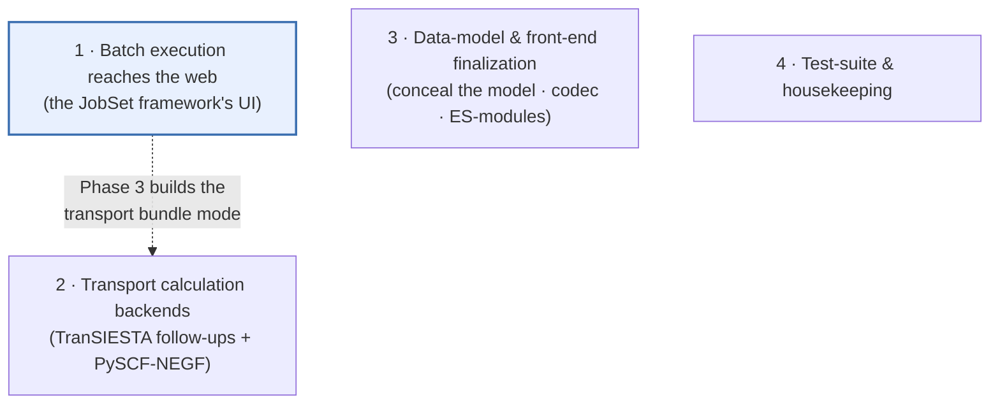
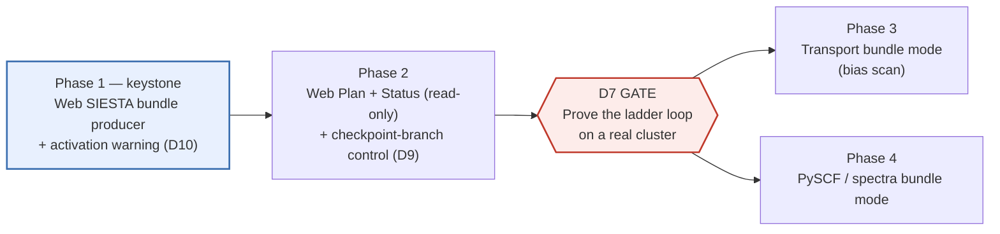

# Roadmap — the one plan

**Role:** plan
**Domain:** *(root — the spine)*
**Companions:** `design.md` (mission · principles · decisions),
`architecture.md` (the reuse map: task → tool),
[`README.md`](README.md) (the index + the rules).
*(`design.md` and `architecture.md` are named, not linked, until they land
in this tree. They are composed **last** — as concise summaries over the
settled component docs — so the links go in when they arrive; see the wave
plan in `MIGRATION.md`.)*

This is the **single source of truth for open work**. Every feature or
backend item that is planned, in progress, or blocked lives here — nowhere
else. When an item ships, it moves to the *Closed work* log at the bottom
(one line) and its durable decision is recorded in `design.md`'s decisions
log. A contract doc may carry **one pointer** back to a roadmap item, but it
never holds the plan itself (rule R3).

> **Why one file.** Plans used to be scattered across six documents — the
> old `roadmap.md`, `design.md`'s "Next steps", the tab-reorganization phase
> plan, the staged-execution contract's phasing section, and two front-end
> migration trackers. They drifted out of sync: some described work that had
> already shipped as if it were still pending. Consolidating them here means
> there is exactly one place to look, and closing an item is one edit.

---

## The open workstreams at a glance

Four streams of open work, in priority order. The first is the active
priority; the others proceed around it.

The dotted link is the one real cross-stream dependency: the transport
bias-scan (workstream 2) is delivered *through* the batch framework's
Phase 3 (workstream 1), not as separate one-off code.

---

## 1. Batch execution reaches the web  *(active priority)*

**Goal.** A scientist sets up a multi-stage calculation in a setup tab
(for example, a relaxation "ladder" that tightens convergence stage by
stage), clicks one button, and gets back a **runnable bundle**: a folder of
per-stage input files plus a `job-set.json` plan describing how they chain,
ready to copy to a workstation or an HPC cluster and launch. Today that
button exists in the Structure-optimization tab but its output is silently
dropped — the stage table POSTs a ladder that goes nowhere.

**Where the work stands.** The whole engine-agnostic framework already
exists on the command line: the `jobset` model and its `job-set.json`
persistence, the `molbuilder jobset plan/prep/submit/status` verbs (both
local `bash` execution and SLURM submission with dependency chaining), the
SIESTA stage producer, and the SIESTA host producer (`molbuilder fdf …
--jobset`). What is missing is the **web front-end** onto that framework —
the setup tabs cannot yet produce a bundle, show its plan, or report its
run status. Details of what is built live in the staged-execution contract
(migrating to `execution/`); its § 1 status table is authoritative.

### Vocabulary (defined once, used throughout)

- **Bundle** — a self-contained folder holding every stage's input file
  plus the `job-set.json` plan. Portable: copy it to the target and run.
  (Distinct from the *handoff bundle* that carries one finished run into the
  next workflow — a different thing; see rule R5 in `README.md`.)
- **Producer** — the code that turns a tab's form (or a CLI invocation)
  into a bundle. There is one shared producer per engine; the web endpoint
  and the CLI both call it, so a web bundle is byte-for-byte what the CLI
  emits.
- **Ladder** — a set of related jobs run in sequence, each starting from
  the previous one's result (e.g. coarse → medium → fine relaxation).
- **D-numbers** (D7, D9, D10, …) — the design decisions resolved in the
  staged-execution contract § 13 / § 15. Kept here as stable references.

### Phasing

**Phase 1 — the keystone.** Make the existing stage-table widget real:
wire it to the shared SIESTA producer so "Generate" produces a runnable
bundle, with the exact deploy commands shown. Add the activation warning
(D10): on a workstation, detect the conda activation and persist it into
the bundle; on HPC, warn if it is unset. This is the parked task #98.

**Phase 2 — see the plan and the run.** Read-only web views: render the
`job-set.json` plan, and show per-stage run status in the Results tab
(reusing the existing directory decoder `decode_run_dir`, no new parser).
Add a browser control for checkpoint *branching* (explore an alternative
tail without losing the converged path) — `/api/checkpoint/branch` plus a
sidebar affordance (D9).

**D7 gate — prove it before expanding.** Before building any more
producers, run the full SIESTA ladder loop end-to-end on a real cluster:
produce → prep → submit → monitor. This gate exists because the other
engines' producers are cheap to add but expensive to debug remotely; we
validate the pattern once on the engine that is furthest along.

**Phase 3 — transport (gated on D7).** A `transport --jobset` producer and
a transport-tab bundle mode. This is also how the transport **bias scan**
(workstream 2) ships: one `.fdf` per bias point plus the chaining plan,
produced by the framework rather than hand-rolled.

**Phase 4 — PySCF / spectra (gated on D7).** `pyscf --jobset` and
`spectra --jobset` producers with their tab mirrors, plus PySCF's
big-binary globs for the checkpoint system.

**Out of scope (D8).** Automated host → target file shipping (scp/rsync).
Bundles are produced where the app runs; a co-located target needs no
copy, and a split host is covered by a manual `scp` the deploy panel spells
out.

**Test-pin shape.** A web-produced SIESTA bundle is byte-identical to the
CLI `--jobset` output for the same inputs; the stage table no longer drops
its POST; a single-deck "Generate" warns when more than one stage is
enabled.

---

## 2. Transport calculation backends  *(Phase B.3)*

The transport engine abstraction (a registry of engines behind one
`TransportConfig` + `Structure` pair) shipped as Phase B.2. Phase B.3
fills in the concrete engines and the results path.

**TranSIESTA** — the zero-bias device `.fdf` and the **electrode `.fdf`
wizard** are shipped (`transport/wizard.py`; `molbuilder transport electrode`
extracts a labelled `*-electrode` region's atoms from the device and emits the
matching bulk-lead `.fdf`, plus a `transport preflight` device↔electrode
contract check). Still open:

1. **Bias scan.** `bias_voltages_v` is a list, but the engine emits only
   the first value (with a preflight warning when more are given).
   Planned: one input per bias point plus a driver — **delivered through
   the batch framework's Phase 3**, not as separate code.
2. **Output parsing + schema.** `parse_output` is not yet implemented for
   transport (raises `NotImplementedError`); it needs a `<job>.transport.json`
   schema designed first (mirroring the spectra sidecar).
3. **Results inspector.** No in-app way to view transmission data yet;
   planned is a transport inspector on `/results` (a transmission-vs-energy
   chart, and an I–V chart once multi-bias data exists).
4. **Methods-paragraph generator.** Today a placeholder; the full version
   lands with output parsing so it can interpolate real run parameters.

**PySCF-NEGF** — planned. A Gaussian-basis NEGF engine for smaller device
regions with higher-level exchange-correlation. Mechanical to add given the
proven registry: a new module mirroring the TranSIESTA engine's shape,
self-registering via the engine decorator; endpoint code is unchanged.

**Region consumption from the handoff bundle** (#487). Once a project
carries a labelled structure + sidecar pair from a finished run, the
transport `.fdf` emitter should read the region labels for
electrode/buffer assignment instead of asking the user to retype them.
Depends on the run-bundle handoff (shipped); independent of the rest of
B.3.

**Test-pin shape.** A-form vs B-form / bias-0 vs bias-N inputs differ in
the expected keywords; an unavailable engine raises the documented error,
not a bare 500.

---

## 3. Data-model & front-end finalization

The 3-D viewer, atom selection, and structure editing were consolidated
into one concealed **MolView** module that every tab mounts, and the
`Structure` object gained a single serialization codec. Most of this
shipped; what remains is the tail — sealing the module's internals,
finishing the ES-module conversion (both **browser-verified** before they
count as done), routing the CLI through the shared codec, and exercising the
last annotation channel kind. The design for each item lives in its contract;
this is the plan tail.

**Conceal the data model.**

- **D3 tail** — route the last render path through the module's accessors:
  remove the `viewer.js` re-parse of raw structure text and the direct
  `addModel(string)` embed call, and drop the disk-load endpoint from the
  Modify load path. Pin: no consumer reaches past the accessors into raw
  arrays.
- **D4** — keep the internal model columnar (`elements[]`, `positions[][]`,
  region map, `frozen[]`) and never surface it directly; the panel's list
  rows are materialised through the accessor API.

**Persistence.**

- **A3** *(decision-gated)* — decide whether the crash-surviving draft
  moves from browser `sessionStorage` to the server-side staging endpoints,
  or the two coexist; wire it if adopted. May legitimately stay
  `sessionStorage`.
- **A4** — remove the obsolete disk-based selection/atom endpoints from the
  Modify tab once no live caller remains (the Results tab legitimately
  reads disk — verify before deleting); migrate or retire their tests.
- **Step 6** *(design-first)* — decide whether the store carries the
  computed effective cell so a cell-less structure still shows a box, done
  through the data model rather than a viewer hack.
- **CLI through `StructureCodec`** — route the CLI's structure load/save
  through the L2 `StructureCodec` so a CLI save emits the `.xyz` +
  `.molstruct.json` pair like the web save does. Today `cli.py` writes
  geometry only (`struct.to_xyz`), bypassing the sidecar (contract:
  `model/structure.md` § 2; task #73). Pin: a CLI round-trip preserves
  region/annotation metadata.

**Atom annotations (the `value` channel).**

- **`value`-channel filtering end-to-end** — the `value` channel kind
  (per-atom charge/spin/…) is modelled and persists, but is not yet
  exercisable: the server must include `value` channels in
  `/api/selection/atoms` and resolve a `by_value` rule, and no feature yet
  *produces* a per-atom value channel. Contract: `model/structure-annotations.md`
  § 7. Pin: filter atoms by a per-atom scalar range.
- **Generic `fdf`-strategy registry** — wire the additive extension point that
  translates a *new* annotation channel (e.g. `initspin`) into an engine block
  via a registered `(channel, struct) → lines` strategy. Only the two built-ins
  (`frozen` → `Geometry.Constraints`, region tags → transport) are wired today.

**Finish the ES-module conversion.** The public API is exported from one
import door and every consumer imports from it; the remaining transitional
globals are the last scaffolding to remove:

- **Phase B (internal)** — convert the module's internal cross-module reads
  and the node-test seams from global reads to imports.
- **Phase C** — delete each transitional global publish, per-global,
  re-checking for readers first. (The live seams — the read doors, the
  shared-embed seal, the node-test/e2e entry points — stay; they are
  architecture, not scaffolding.)
- **Phase D** — update the module docs and the web module map; run the full
  suite and browser-verify every tab.

**Test-pin shape.** Grep shows no raw-viewer reach or transitional-global
read in the migrated paths; the full front-end suite is green and every tab
renders.

---

## 4. Test-suite & housekeeping

- **E2E collection hygiene.** The Playwright/Chromium end-to-end tests fail
  (rather than skip) when swept into a unit-environment run that lacks the
  browser tooling — a tooling gap, not a product failure. Give them a
  marker and exclude them by default so a unit run shows them as
  *deselected*, never *failed*.
- **Skipped-test census.** Catalogue every skip with a disposition
  (environment-gated / placeholder / stale) and fold the e2e-routing item
  above into it.
- **Multi-frame trajectory persistence.** Persist multi-frame trajectories
  as extended-XYZ (via ASE) with a sidecar manifest — the one open item
  from the frame-series work.

---

## Closed work

Shipped items, newest first. Each landed with a decisions-log entry in
`design.md` (cross-cutting) or its subsystem doc; reconstruct detail from
`git log`. Durable *reference* for a shipped feature lives in its
domain doc, not here.

- **Six-tab UI** — Molbuilder · Structure optimization · Spectrum calculation
  · Transport calculation · Results, plus a Documents tab. The former
  four-tab layout's reorganization (Phases A–D) is complete.
- **JobSet CLI framework** — `plan` / `prep` / `submit` / `status` over a
  bundle's `job-set.json`; both execution modes (local `bash`, SLURM
  submit with dependency threading); carry-forward between stages; the
  SIESTA host producer (`fdf --jobset`); checkpoints and branching.
- **SLURM / sbatch submission** — a thin `.sbatch` wrapping the unchanged
  run script, driven by the scheduler config block (verified live on ASU
  Sol). Reference: the SLURM-integration contract.
- **Run-bundle handoff** — a finished run's final coordinates fused with
  its carried labels into a portable structure + sidecar pair the next
  workflow tab loads with no copy/paste.
- **Transport engine abstraction (B.2)** + **TranSIESTA zero-bias device
  `.fdf` (B.3 step 1–2)** — the registry, the results/config dataclasses,
  and the first concrete engine with its web render endpoint and Generate
  wiring.
- **3DNA canonical helix backend** — the `fiber`-based B/A/Z-form builder
  with its three-step detection chain and no-auto-download license
  handling. Reference: the builders engine spec (`engines/`).
- **Structure / cell-origin consolidation**, **frame / trajectory
  promotion**, **molbuilder + molwatch merge**, **argparse → click
  conversion**, **embed-module ship**, **Makov-Payne charge-correction
  emit** — see `git log` and the decisions log.

---

## Maintenance protocol

**Adding an item:** state the goal in one sentence; identify what must ship
first; identify the test-pin shape (what test fails while the work is
incomplete). Do not list code-review polish or stylistic cleanup — that
lives in commit messages and PRs.

**Closing an item:** move it to *Closed work* with a one-line summary; add
a decisions-log entry to `design.md` (cross-cutting) or the subsystem doc;
update or remove any test pins and `xfail` markers.
