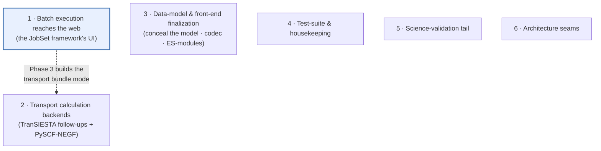
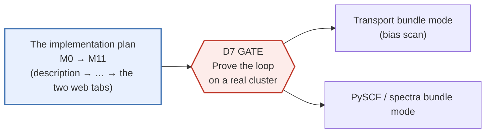

# Roadmap — the one plan

**Role:** plan
**Domain:** *(root — the spine)*
**Companions:** [`design.md`](?doc=design.md) (mission · principles · decisions),
[`architecture.md`](?doc=architecture.md) (the reuse map: task → tool),
[`backend-architecture.md`](?doc=backend-architecture.md) (the backend by
concern), [`README.md`](?doc=README.md) (the index + the rules).
*(The spine docs `design.md` / `architecture.md` / `backend-architecture.md`
landed in Wave 9 — composed **last** as concise summaries over the settled
component docs.)*

This is the **single source of truth for open work**. Every feature or
backend item that is planned, in progress, or blocked lives here — nowhere
else. When an item ships, it moves to the *Closed work* log at the bottom
(one line) and its durable decision is recorded in [`design.md`](?doc=design.md)'s
decisions index. A contract doc may carry **one pointer** back to a roadmap item, but it
never holds the plan itself (rule R3).

> **Why one file.** Plans used to be scattered across six documents — the
> old `roadmap.md`, `design.md`'s "Next steps", the tab-reorganization phase
> plan, the staged-execution contract's phasing section, and two front-end
> migration trackers. They drifted out of sync: some described work that had
> already shipped as if it were still pending. Consolidating them here means
> there is exactly one place to look, and closing an item is one edit.

---

## The open workstreams at a glance

Seven streams of open work, in priority order. The first is the active
priority; the others proceed around it. (5 and 6 are consolidation streams
added 2026-07-29 from the migration's deferred-work dig: science checks
deferred with rationale, and named architecture seams. **7 is the current
front**, consolidated 2026-08-22 from two documents that had been holding
open work against rule R3 — it carries its own progress table.)

> ### Where the unified workflow stands — and what has NOT migrated yet
> *(Stated 2026-08-19, user, so nobody confuses the two.)*
>
> **The framework is being established and verified on ONE task first:
> structure optimization**, SIESTA and PySCF. That loop — describe in the
> browser (parameter tab → Task setup), `prep` and `launch` on the machine,
> observe on the Results tab — ran **end to end on 2026-08-19**: real water
> calculations, both engines, both folder shapes, warm restart and the
> launch-door gate exercised. That is the D7 gate's loop, proven on a
> workstation; the **cluster** half of D7 (the same loop through SLURM on
> Sol) is what remains of it.
>
> **Transport has not migrated onto this framework** — `transport
> bundle`'s three-run driver still runs the path built before it,
> deliberately, and its workflow is being designed separately.  (Spectra
> DID migrate, 2026-08: the vibration deck is a calculation kind of the
> PySCF engine — § "Spectra: migrated" below.)  Transport is additionally
> **a different KIND of job** — three coupled runs, one answer assembled
> from pieces — per the 2026-08-11 decision
> ([`execution/architecture.md`](?doc=execution/architecture.md) § 0);
> migrating it means giving that kind a first-class representation, not
> bending it into a ladder.

## 0. The immediate two  *(user, 2026-08-19 — **both delivered the same
day**)*

Two workflow completions came before everything else, both specified from a
loop that was **driven end to end** rather than read, and both are now
delivered and pinned (§ 0.1, § 0.2); § 0.3 records what the follow-on
days added and the consolidated open list. What proceeds next is the
deferrals table below: the remote-HPC proof first, the tab migrations next
period.

### 0.1 Connect the benchmark to the run — Task I

**Goal.** A scientist benchmarks a stage and the system carries the answer to
the run: `summarize` prints what was measured, a **verdict with its
rationale**, and the exact next commands; `summarize` materialises the
verdict as **`run-config.toml`** — a commented, editable file the next
`prep run` applies to the fields the user's flags did not state (flags
always win; deleting the file declines); nothing is ever hand-copied.
*(Refined by the user 2026-08-19, mid-delivery: the interactive offer became
the file, the summary became a full measurement table — knobs beside wall,
peak memory, CPU/GPU utilisation, and the eigensolver actually run — and
the no-input default is now stated out loud: with neither file nor flags
the wrapper's runtime policy sizes the launch, named per engine.)*

✅ **DELIVERED 2026-08-19** — all five rows below, proven live on the
water fixture: declared `{mpi_np: [1,2]}` → exactly two trials → both
complete cleanly (`scf_must_converge` pinned false) → `summarize` prints
the measurement table, writes `bench-result.json` + `run-config.toml` →
`prep run` applies the file (`applied … mpi_np=2 …`), an edited file is
honoured, a stated flag wins, a deleted file declines with the wrapper
policy named.  Contract: `project-layout.md § 2.3.2–2.3.3`; pins:
`test_prep_bench_fold.py` / `test_bench_result.py`.

**The five rows, each found by running:**

| # | break | done when |
|---|---|---|
| **B1** | `prep bench` **ignores the declared grid** — `task.json`'s `bench: {mpi_np: [1,2,3]}` produced eleven machine-enumerated K×C trials instead of three. `generator.md § 4.3a` (user-settled) says the declaration is the whole reason the key exists | declaring `{mpi_np: [1,2]}` yields exactly those trials; a point exceeding the machine's capability is refused **by name** |
| **B2** | **a capped trial classifies as failure** — the pins cap SCF at 5 iterations *by design*, but nothing tells SIESTA the stop is expected (`SCF.MustConverge` has no schema field — the recorded vocabulary gap, `template.md § 7`), so every trial ends `ABNORMAL_TERMINATION` and reads `incomplete` | a capped trial reads **measured**, carrying its s/iter |
| **B3** | **no verdict can ever exist for a normal sweep** — `summarize` writes `choice: {}` when points are incomplete, and B2 makes *every* properly-capped point incomplete | today's water sweep produces a non-empty `choice` + `recommend`, with an honesty flag when coverage is partial |
| **B4** | **an unusable verdict is silent** — `prep run` says nothing when `bench-result.json` exists but carries no choice; the user cannot tell "no benchmark" from "benchmark that failed to conclude" | `prep run` names the artifact and says *why* it is not offering |
| **B5** | **the connection surface** — `summarize` ends with `next: prep run <stage>` but not the verdict's own values or the fact that the artifact is editable | the summary closes with the verdict, the exact commands, and the sentence naming `bench-result.json` as the editable proposal |

**Test-pin shape:** the water fixture's loop, pinned at each row above;
the fill-only-unstated doctrine lives on in `_apply_run_config` (the file
replaced the ask, 2026-08-19 — nothing is applied that the user did not
hand back).

### 0.2 The probe writes the machine record — Task II

**Goal.** `jobset probe` records this machine's physical resources into
`environment.json` — **interactively** where a fact needs a person: naming a
record (`--name sol`), consenting before an existing record is overwritten,
choosing what to keep — and `prep`/Task setup then use that record as the
capability they plan within. Declared facts enter through the same door
(`resolve_environment(overrides=…)`, `source="flag"` — the door and its
caller exist; the flags do not).

✅ **DELIVERED 2026-08-19** — proven live on this workstation: declared
facts enter by `--set` (typed by the `Topology` schema, unknown keys and
mistyped values refused by name, `source: flag`), `--scheduler` forces the
kind, and `--write` over an existing record asks **per difference** which
value survives (No/EOF keeps the record — a weaker probe cannot erase a
declared fact; `--yes` takes all; domains diff as one set).  N4 turned out
already delivered (2026-08-17: `get_routing` sources `domains`,
`get_scheduler` fills `gpu.default_type` from the record).  Contract:
`configuration.md § 5` M-1/M-5 updated + **M-6** added; pins:
`test_scheduler_probe.py`'s verb section:

| piece | what it is |
|---|---|
| **N3+** | `probe` writes `environment.json` at the machine scope (and `--name <target>` at the named scope), **shows what it found next to what the record holds, and asks per difference before overwriting** — consent, never a clobber; `--yes` for scripts (silence is no, the standing doctrine) |
| **flags** | `--set key=value` (feeds `overrides`, stamped `flag`), `--scheduler` (the override that exists unfed) — the declared half of M-1 finally reachable |
| **N4** | `get_scheduler`/`get_routing` source `routing` + `gpu.default_type` from the record, consumers unchanged |
| **done when** | probing this workstation round-trips with consent; a named-target record written here is used by `prep --target`; `config_provenance` shows the record supplying the values |

### 0.3 The follow-on days *(2026-08-20 — delivered and committed)*

The period between the immediate two and the next workstream carried its
own load, all of it landed, reviewed (R×3,
[`archive/2026-08-20-milestone-review.md`](?doc=archive/2026-08-20-milestone-review.md)
— every finding fixed with an explicit yes), and pinned:

- **the grouped bench** (one scheduler job per sweep, the sequencer +
  `bench-group.log`) and **`--bundle`** (every verb runs on any bundle from
  inside itself) — `project-layout.md § 2.3.2`, `workflow.md § 6.1`;
- **the two-kinds contract + sidecar schema 8** (per-atom rides the atom
  list and survives edits; system stored separately; identity columns
  persist when real; readable set {7, 8}) —
  `model/structure-molstruct.md § 1–2`;
- **the override lane** (`bench`'s one-point non-machine entries pin the
  bench and the run; precedence template < declaration < run-config <
  flags) + **type-aware widgets** on the machine card and stage table —
  `generator.md § 4.3a`, `web/task-setup.md § 7`;
- **`envs doctor` hands out its fix commands** (every defect line ends
  with the exact `install-env.sh` invocation) — `ops/installation.md`;
- **multi-frame click selection fixed at its root** (clickability
  re-established after every frame swap — the embed's carried knowledge
  5 of 5).

**The consolidated open list** *(everything else this period left open,
each with its recorded home)*:

| open | recorded |
|---|---|
| **D7's cluster half** — the described route through SLURM on Sol | the deferrals table below — **next** |
| ~~**2β** — multi-point *value* axes (measured GPU-vs-CPU in one sweep)~~ **delivered 2026-08-21** | `generator.md § 4.3a` states the built rule (value axes ride the sweep; `enable_gpu` is the grid-family axis; split per-side grouped submission) |
| **the live browser walk-throughs** — checkpoint swap at narrow/wide widths, per-tab reload round-trips, a real Data/Image export, click-selection on frames ≥ 1 | here *(moved from the archived molview-and-checkpoint plan — its § 6 was the only part still open)* |
| **VibrationView → shared media/zip** | task #104's note, § 3 below |

### The deferrals — decided, not drifted *(user, 2026-08-19)*

| deferred | until |
|---|---|
| **the remote-HPC proof** (D7's cluster half: the described route through SLURM on Sol) | **after the immediate two** |
| **migration of the transport tab** (its producer and the branching kind onto the framework; spectra migrated 2026-08 — the vibration deck is a calculation kind of the PySCF engine) | **the follow-up period, not this one** |

---

The dotted link is the one real cross-stream dependency: the transport
bias-scan (workstream 2) is delivered *through* the batch framework's
Phase 3 (workstream 1), not as separate one-off code.

---

## 1. Batch execution reaches the web  *(active priority)*

**Goal.** A scientist sets up a multi-stage calculation in a setup tab
(for example, a relaxation "ladder" that tightens convergence stage by
stage), clicks one button, and gets back a **runnable bundle**: a folder of
per-stage input files plus a `job-set.json` plan describing how they chain,
ready to copy to a workstation or an HPC cluster and launch. **This
shipped**: the Structure-optimization tab hands over to the Task setup tab,
which writes the description (shape, stages, bench) — the loop ran end to
end on 2026-08-19. *(The sentence that stood here — "the stage table POSTs a
ladder that goes nowhere" — described the pre-Task-setup tab.)*

**Where the work stands.** The whole engine-agnostic framework already
exists on the command line: the `jobset` model and its `job-set.json`
persistence, the `molbuilder jobset init/prep/plan/submit/summarize/status`
verbs (both local `bash` execution and SLURM submission, **one job per
invocation**), and `prep`'s five steps writing floor 3 on the target (*the
chaining producers died in the 2026-08-12 fold*). **The describe half of the
web front-end is built**: the parameter tabs hand over to the shared Task
setup tab, which writes the description (`web/task-setup.md`, a shipped
contract) — and prep/submit stay on the terminal **by design** (*the browser
describes and observes; the terminal acts*). What is still missing on the
web is the observe half beyond the Results tab: a plan view and a per-stage
status roll-up. What is built lives in
[`execution/job-system.md`](?doc=execution/job-system.md) (the JobSet framework
and its CLI verbs); the current→target status matrix is
[`execution/overview.md`](?doc=execution/overview.md) § 2, which is
authoritative.

> **The staged design has moved on since this workstream was written.** Four
> contracts now own what the old staged-execution document described, and one of
> them changes this workstream's shape: **stages no longer chain**, so "produce a
> bundle, submit the chain" is being replaced by *prep and submit one stage at a
> time, after looking at the last one*. Read
> [`execution/project-layout.md`](?doc=execution/project-layout.md) (the folder
> and the workflow), [`engines/stages.md`](?doc=engines/stages.md) (what a stage
> is), [`execution/run-identity.md`](?doc=execution/run-identity.md) (the id) and
> [`execution/checkpointing.md`](?doc=execution/checkpointing.md) (the history)
> before building any of this. The design and each item's *"done when"* is
> [`archive/2026-08-19-staged-runs-implementation-plan.md`](?doc=archive/2026-08-19-staged-runs-implementation-plan.md);
> **the order, the milestones and the reviews are
> [`archive/2026-08-19-staged-runs-implementation-plan.md`](?doc=archive/2026-08-19-staged-runs-implementation-plan.md)**,
> which is the one build order for this workstream.

### Vocabulary (defined once, used throughout)

- **Bundle** — a self-contained folder holding every stage's input file
  plus the `job-set.json` plan. Portable: copy it to the target and run.
  (Distinct from the *handoff bundle* that carries one finished run into the
  next workflow — a different thing; see rule R5 in `README.md`.)
- **Producer** — the code that turns a tab's form (or a CLI invocation)
  into a bundle. There is one shared producer per engine; the web endpoint
  and the CLI both call it, so a web bundle is byte-for-byte what the CLI
  emits.
- **Ladder** — a set of related jobs run in sequence, each starting from
  the previous one's result (e.g. coarse → medium → fine relaxation).
- **D-numbers** (D7, D9, D10, …) — design decisions from the staged-execution
  contract, which the 2026-07 migration retired; it survives only at
  `docs/archive/old_docs/protocols/staged-execution.md`. The numbers are kept as
  stable references so older notes still resolve, but **the archive is not the
  authority** — for anything still open, the live owners are
  [`engines/stages.md`](?doc=engines/stages.md),
  [`execution/project-layout.md`](?doc=execution/project-layout.md) and
  [`archive/2026-08-19-staged-runs-implementation-plan.md`](?doc=archive/2026-08-19-staged-runs-implementation-plan.md).

### Phasing

**The SIESTA half of this workstream is planned in one place:**
[`archive/2026-08-19-staged-runs-implementation-plan.md`](?doc=archive/2026-08-19-staged-runs-implementation-plan.md)
— thirteen milestones bottom-up, from `task.json` to the two web tabs. What this
workstream still owns *beyond* that plan is the two other engines and the gate
between:

**D7 gate — prove it before expanding.** Before building any more producers, run
the full loop end-to-end: produce → prep → submit → monitor. This gate exists
because the other engines' producers are cheap to add but expensive to debug
remotely; we validate the pattern once before broadening. **Half passed
2026-08-19**: the loop ran end to end on a workstation — browser describe →
`prep --pipeline-log` → `launch` → Results — for **both** engines (water,
both shapes, warm restart, the launch-door gate). *(PySCF crossed the gate
early because it shares the deck pipeline — the seam landed 2026-08-18 and
the same E2E proved it.)* **What remains of D7 is the cluster half**: the
same loop through SLURM on Sol. Transport and spectra stay gated on that.

**Transport (gated on D7).** A `transport` producer and a transport-tab mode.
This is also how the transport **bias scan** (workstream 2) ships: one `.fdf`
per bias point plus its plan, produced by the framework rather than hand-rolled.
Its tab writes a template plus a description like every other generating tab, and
feeds the **same shared Task Setup tab** — which is why M11's columns are read
from the schema rather than from a list. A bias scan is a **sweep** rather than a
ladder — one deck per bias point, all independent — and `task.json` already
expresses that: one member per voltage, each saying `restart: clean`. What the
transport tab owes is a producer, not a new format.

**PySCF (structure optimization) — DONE, ahead of the gate.** The seam has a
PySCF arm (2026-08-18), a PySCF ladder is N decks and N jobs like SIESTA's
([`stages.md § 1.1a`](?doc=engines/stages.md); the in-script loop is retired),
and the 2026-08-19 E2E ran it through the whole loop. Still open from the old
item: PySCF's big-binary globs for the checkpoint system.

**Spectra: migrated (2026-08).** The vibration deck is a calculation KIND of
the PySCF engine — `render_deck` runs it through the same gates as an
optimization deck, and the Spectrum tab hands over through the same
Task-setup door.  Transport remains on the pre-framework path (see the
migration box at the top of this file).

**Two decisions this workstream contributed, carried into the plan.** **D10 —
the activation warning**: on a workstation, detect the conda activation and
persist it; on HPC, warn if it is unset (the parked task #98; it lands with the
plan's P5/P6, where the wrapper's environment is resolved). **D9 — trying an
alternative from a chosen state**: reshaped by the checkpoint rework, which
removed the branch verb and its route. **The capability is shipped**: you
restore the state and save from it, and the new state's parent is the one you
restored — that *is* the fork (`checkpointing.md § 7.1`), and both halves are
already routed and already in the sidebar. What survives from the decision is
the **drafted note**: when a save follows a restore, the panel can propose
`<stage>-<what you are trying>` for you to confirm or edit, which the contract
explicitly allows (`checkpointing.md` § 9, L3). That is the plan's P8, and it is
smaller than what was written here.

**Out of scope (D8).** Automated host → target file shipping (scp/rsync).
Bundles are produced where the app runs; a co-located target needs no
copy, and a split host is covered by a manual `scp` the deploy panel spells
out.

**Test-pin shape.** A web-produced SIESTA folder matches the CLI's for the same
description, file by file — **excluding PROVENANCE's `generated-at`**, which
stamps generation time and so differs between any two produces; that is the only
legitimate exclusion, and it is the plan's **M10**. The stage table no longer
drops its POST.

---

## 2. Transport calculation backends  *(Phase B.3)*

The transport engine abstraction (a registry of engines behind one
`TransportConfig` + `Structure` pair) shipped as Phase B.2. Phase B.3
fills in the concrete engines and the results path.

**TranSIESTA** — the zero-bias device `.fdf` and the **electrode `.fdf`
wizard** are shipped (`transport/wizard.py`; `molbuilder transport electrode`
extracts a labelled `*-electrode` region's atoms from the device and emits the
matching bulk-lead `.fdf`, plus a `transport preflight` device↔electrode
contract check). Still open:

1. **Bias scan.** `bias_voltages_v` is a list, but the engine emits only
   the first value (with a preflight warning when more are given).
   Planned: one input per bias point plus a driver — **delivered through
   the batch framework's Phase 3**, not as separate code.
2. **Output parsing + schema.** `parse_output` is not yet implemented for
   transport (raises `NotImplementedError`); it needs a `<job>.transport.json`
   schema designed first (mirroring the spectra sidecar).
3. **Results inspector.** No in-app way to view transmission data yet;
   planned is a transport inspector on `/results` (a transmission-vs-energy
   chart, and an I–V chart once multi-bias data exists).
4. **Methods-paragraph generator.** Today a placeholder; the full version
   lands with output parsing so it can interpolate real run parameters.

**PySCF-NEGF** — planned. A Gaussian-basis NEGF engine for smaller device
regions with higher-level exchange-correlation. Mechanical to add given the
proven registry: a new module mirroring the TranSIESTA engine's shape,
self-registering via the engine decorator; endpoint code is unchanged.

**Inelastica / IETS** — planned, further out. A third engine for
electron-phonon-resolved transmission (inelastic tunnelling spectroscopy).
Distinctive because it consumes **both** a `TransportConfig` *and* the
`.spectra.json` the Spectrum tab produces — the one place the transport and
vibrational halves of the app would meet. Already named as the intended third
engine in `transport/engine_base.py`, `config/transport.py`, and the transport
blueprint.

**Region consumption from the handoff bundle** (#487) — **half shipped.** The
`%block TS.Elecs` emitter already reads `struct.regions` for **electrode**
assignment (`transport/transiesta.py`), so a labelled structure no longer has to
be retyped. The **buffer** half is what remains: `TS.Atoms.Buffer` is emitted
nowhere in `molbuilder/transport/`. Independent of the rest of B.3.

**Test-pin shape.** A-form vs B-form / bias-0 vs bias-N inputs differ in
the expected keywords; an unavailable engine raises the documented error,
not a bare 500.

---

## 3. Data-model & front-end finalization

The 3-D viewer, atom selection, and structure editing were consolidated
into one concealed **MolView** module that every tab mounts, and the
`Structure` object gained a single serialization codec. Most of this
shipped; what remains is the tail — sealing the module's internals,
finishing the ES-module conversion (both **browser-verified** before they
count as done), routing the CLI through the shared codec, and exercising the
last annotation channel kind. The design for each item lives in its contract;
this is the plan tail.

**Rebuild the Build form from the catalogue** *(extracted 2026-08-19 from
the archived template-unification plan, whose § 4 deferred it)*: the live
form still reads its facts off the dataclass fields (`MIRRORED`), so those
facts live in **two** homes — a debt `template.md § 2.1a` measures on every
run (452 on 2026-08-17) and `test_catalogue_agreement.py` holds together.
Rebuilding the form from the catalogue deletes the second home. Pin: the
`MIRRORED` set empties.

**Conceal the data model.**

- **D3 tail** — route the last render path through the module's accessors:
  remove the `viewer.js` re-parse of raw structure text and the direct
  `addModel(string)` embed call, and drop the disk-load endpoint from the
  Modify load path. Pin: no consumer reaches past the accessors into raw
  arrays.
- **D4** — keep the internal model columnar (`elements[]`, `positions[][]`,
  region map, `frozen[]`) and never surface it directly; the panel's list
  rows are materialised through the accessor API.

**Persistence.**

- **A3** *(decision-gated)* — decide whether the crash-surviving draft stays
  in browser `sessionStorage` or moves server-side. Note the alternative the
  original decision named is **gone**: the `/api/workingcopy/*` endpoints were
  removed, and only `/api/workspace-storage/*` survives. So the real choice today
  is "keep `sessionStorage`" vs "build something new" — not "switch to the
  staging endpoints".
- **A4** — remove the obsolete disk-based selection/atom endpoints from the
  Modify tab once no live caller remains (the Results tab legitimately
  reads disk — verify before deleting); migrate or retire their tests.
  *(Code audit 2026-07-29: the live caller is
  `lib/molview/_selection-store-impl.js:70,353` — `_fetchAtoms` still POSTs
  `structure_path` to `/api/selection/atoms`, reachable from `adoptSession`
  and the eval-recovery refetch — so the precondition is not yet met; that
  migration is the actual work.)*
- **A5a** *(verification residual)* — confirm in a **real browser** that the
  `.molbuilder_workspace/` draft appears and updates both for a file loaded
  from the sidebar and for a freshly generated molecule. The mechanism ships
  (`web/blueprints/workspace_storage.py`); only this check was never done.
- **A6 — state-file lifecycle re-verification** *(recovered from the parked
  task store, ex-#48)*: the 2026-07 workspace review verified three latent
  defects against the OLD working-copy module — (1) state files keyed by a
  sessionStorage-only random id leak unbounded **across** sessions (the
  30-step window prunes only the current id); (2) orphan-listing mis-read
  state files as drafts; (3) a corrupt history file makes undo a silent
  no-op. The module was since replaced by `workspace_storage.py`, so each
  finding needs RE-verification against the new implementation ((2)'s
  module is deleted — likely moot), then a GC/signal fix for whichever
  survive.
- **CLI through `StructureCodec`** — the last surface not obeying the codec
  rule (`model/structure.md` § 2.4: *every structure↔bytes translation goes
  through the codec, and every adapter has exactly one door*). The web side
  closed 2026-07-31 — `write` → save, `files` → export, `read` → load, and the
  blob adapter deleted. The CLI still writes geometry directly
  (`struct.to_xyz` at `cli.py:263, 267, 274, 1321, 1563, 1565`) and reads
  without looking for a sidecar (`siesta/input.py:1455`,
  `pyscf/input.py:1286`), so `molbuilder modify` silently drops regions and
  frozen atoms, and the CLI's `fdf` path cannot emit `Geometry.Constraints`
  from an `.xyz` + sidecar pair. Route both directions through the codec
  (task #73). Pin: a CLI round-trip preserves region/annotation metadata.

**Atom annotations (the `value` channel).**

- **`value`-channel filtering end-to-end** — the `value` channel kind
  (per-atom charge/spin/…) is modelled and persists, but is not yet
  exercisable: the server must include `value` channels in
  `/api/selection/atoms` and resolve a `by_value` rule, and no feature yet
  *produces* a per-atom value channel. Contract: `model/structure-annotations.md`
  § 7. Pin: filter atoms by a per-atom scalar range.
- **Generic `fdf`-strategy registry — producers + consolidation** *(corrected
  2026-07-29 after a code audit)*: the registry itself **already exists and is
  wired** (`molbuilder/annotations_fdf.py`, hooked at `siesta/input.py:651-658`)
  — but only tests register strategies. What's actually missing: a first
  *production* strategy (e.g. `initspin` → `%block DM.InitSpin`), a
  value-channel *producer*, and folding the **second, hand-rolled
  frozen-constraints emitter** (`transport/orchestrate.py:130` builds
  `Geometry.Constraints` with a bare `i + 1`, bypassing both
  `siesta/input.py`'s emitter and the `engine_atom_index` API) into the one
  shared path.

**Finish the ES-module conversion.** The public API is exported from one
import door and every consumer imports from it; the remaining transitional
globals are the last scaffolding to remove:

- **Phase B (internal)** — convert the module's internal cross-module reads
  and the node-test seams from global reads to imports.
- **Phase C** — delete each transitional global publish, per-global,
  re-checking for readers first. (The live seams — the read doors, the
  shared-embed seal, the node-test/e2e entry points — stay; they are
  architecture, not scaffolding.)
- **Phase D** — update the module docs and the web module map; run the full
  suite and browser-verify every tab.

**Test-pin shape.** Grep shows no raw-viewer reach or transitional-global
read in the migrated paths; the full front-end suite is green and every tab
renders.

**Convert the remaining front-end modules to ESM (and rename the file-viewer
module).** MolView / workspace / projects are ES-modules; several other modules
are still classic `window.molbuilder.*` IIFEs and are the next conversion
targets (each: classic → import/export, `<script>` tags → module imports,
file-by-file with a **real browser** check per tab — never a blind namespace
sed, which leaves stubbed unit tests green while the UI breaks):

- **The file-viewer registry** (`lib/inspectors/` — `registry`, `source`,
  `markdown`, the `spectra`/`trajectory` adapters + the partial-inspector
  factory; `structure.js` is already ESM) **plus its heavy cores**
  (`lib/spectra/core.js`, `lib/trajectory/core.js`). Convert to ESM **and, in
  the same pass, rename the module off the overloaded "inspector" term to
  `presenters`** (the `window.molbuilder.inspectors` namespace + the
  `lib/inspectors/` dir + the `*Inspector` unit names → `*Presenter`). "Inspector"
  currently collides with `mountInspector` (the core body) and the viewers' own
  inspect panels; "presenter" (a per-file-type content presenter picked by the
  registry) is unambiguous. Surface: the 8 module files + ~9 consumers
  (`molbuilder-runtime`, `markdown-render`, `path-utils`, `workspace/dispatcher`,
  `projects/preview`, `results/viewer`, `spectra/viewer`, the two cores) + 3
  templates (`results.html`, `spectra.html`, `modify.html`) + ~10 tests.
- **The results module** (`lib/results/` — `bundle-handoff`, `file-picker`).
- **The runtime registry** (`lib/molbuilder-runtime.js`).
- **The shared primitives** (`lib/*.js` — `form-schema`, `app-notifications`,
  `warning-modal`, `detection-chip`, `markdown-render`, `path-utils`,
  `constants`, `region-label-*`, `system-load-monitor`; `xyz-io.js` already ESM).

Each converted module's `web/` doc drops its "current → target" ESM note when its
row here closes.

**A dedicated `pyscf-log` presenter.** A PySCF run's `.pyscf.log` (the wrapper's
stdout) currently falls through to the plain text viewer. The trajectory
presenter deliberately does *not* claim it — it is a log, not a trajectory
format — and its code comment defers to "a dedicated `pyscf-log` inspector on
the roadmap", so here it is: a presenter that reads the log's structure (SCF
cycles, timings, warnings) instead of showing raw text.

**VibrationView independence (task #104, decided 2026-07-27).** Complete the
MolView/VibrationView separation: `lib/viewer/` (the shared 3Dmol embed)
becomes MolView-private (moves under `lib/molview/`), the transitional
`molbuilder.viewer` global is dropped, and VibrationView gets its **own
minimal concealed 3Dmol seal** — just the six doors it actually uses
(`setStructure`/`setAtomCoords`/`setOverlays`/`refit`/`setAnimationProvider`/
`dispose`), none of MolView's heavier embed. Real-browser verification
required. Contract + current state: `web/vibrationview.md § 5`.
*(2026-08-20 addition: the package also keeps its own private gif/webm
encoder and store-zip — `lib/media-export.js` and `lib/zip-store.js` exist
as MolView-side counterparts, and VibrationView's migration onto them is
recorded HERE, to land only inside this task's own work — the sealed wall
outranks the one-home rule until then.)*

**Small front-end gaps with a doc-recorded home** *(each doc's note is
dropped in the same commit that closes its item)*:

- **Spectrum UI preferences persistence** — wire the sessionStorage
  round-trip the code already stubs (`lib/spectra/core.js:185-188` TODO);
  update `web/spectra.md`'s in-memory-prefs note.
- **Documents-tab polish** — browser back/forward (`page.js` uses only
  `replaceState`, no `popstate` handler), a fetch-race guard on rapid doc
  clicks, Mermaid dark-mode theming (`markdown-render.js:81` hardcodes
  `neutral`), sidebar-selection sync for in-content `?doc=` links, and
  toc auto-discovery for **root-level** docs (today only domain dirs are
  scanned, so e.g. a new dated audit needs a manual `toc.json` row).
- **`detection-chip` domain review** — the chip hardcodes chemistry
  classification + compute-budget heuristics inside a UI primitive; review
  and re-home the science (chemistry/validation domain) before its ESM
  conversion freezes the current shape.
- **Form-schema render-complete callback** — the Structure-optimization tab
  documents its own polling as "KNOWN GAP (audit 2026-07): polling is the
  anti-pattern" (`structure-optimization/viewer.js:1272`) because form-schema
  offers no render-complete signal; add the callback and retire the poll
  (the migration audit's one unadopted P1 item).
- **MolView finer-grained render invalidation** — the render-streamline
  design's steps 2–4 (`web/molview.md § planned-work` points here); scope
  before the ESM Phase C pass freezes the render path.
- **Per-frame coordinates for measurements** (`positionsProvider`) — the
  2026-06-09 measurement decision named "trajectory and structure inspectors
  wire their own per-frame coords next"; verify whether it shipped, then
  ship or retire.
- **Pin the markdown-presenter dispatch** — `.md` markdown-beats-source
  ordering is absent from `test_results_blueprint.py`'s
  `INSPECTORS`/`EXPECTED_ORDER` and the node dispatch mirror — a silent
  regression would go unnoticed.

> **ESM ground truth (code census, 2026-07-29):** under the strict bar —
> import/export only, zero `window.molbuilder` publishes — **no package entry
> file qualifies yet**. The "fully converted" modules (MolView, VibrationView,
> workspace, projects, xyz-io) are ESM *with a deliberate transitional door*,
> per the never-big-bang rule; the doors fall in Phase C, per-global, once the
> classic readers enumerated in the census (chiefly `lib/spectra/core.js`, the
> presenter adapters + registry, `results/viewer.js`, `modify/structure/*.js`)
> are converted. Templates today: 21 `type="module"` vs 49 classic script
> tags. `runtime.whenReady` adoption is effectively "projects"-only.

---

## 4. Test-suite & housekeeping

- **Per-tab wiring consolidation audit** *(recovered from the parked task
  store, ex-#96 — was `in_progress` when the docs-first gate froze system
  work; no findings were recorded, it restarts clean)*: audit each tab
  (Build/Modify/Spectra/Transport/Results) end-to-end — template → JS
  module → API endpoint → blueprint → L2 verb → validate → config
  dataclass → render (fdf/py) — hunting broken/missing wiring, dead
  endpoints, stale JS, retired config fields still referenced, and
  duplicate code/design. Verify every finding vs code before fixing
  (the `process/code-audit.md` playbook applies).
- **E2E collection hygiene.** The Playwright/Chromium end-to-end tests fail
  (rather than skip) when swept into a unit-environment run that lacks the
  browser tooling — a tooling gap, not a product failure. Give them a
  marker and exclude them by default so a unit run shows them as
  *deselected*, never *failed*.
- **Skipped-test census.** Catalogue every skip with a disposition
  (environment-gated / placeholder / stale) and fold the e2e-routing item
  above into it.
- **Multi-frame trajectory persistence.** Persist multi-frame trajectories
  as extended-XYZ (via ASE) with a sidecar manifest — the one open item
  from the frame-series work.
- **Convergence / termination feedback lives in the MONITOR** (decided
  2026-08-13, user).  *(The retry-wiring half of the old "SIESTA retry"
  item LANDED — 2026-08-07 on the old producer road, 2026-08-13 for the
  described route: `resolve.py` performs job-contracts § 6.2's
  translation, so the template's `continue_retries` rides the element's
  Resources and `prep` bakes it into the wrapper on every path.)*  What
  remains — detecting from the `.out` that a run STOPPED, and whether it
  stopped converged or not (`SCF_NOT_CONV` / `ABNORMAL_TERMINATION`, on a
  *zero* exit too, since an MPI stack may not propagate abort statuses) —
  is **not the execution branch's job**: it belongs to the engine-specific
  monitor script (`mb_monitor.py`) shipped beside the wrapper, the surface
  whose whole purpose is telling the user what the calculation is doing.
  Build the detection there, as monitor feedback the user reads, not as
  prep/submit machinery.
- **Watch discovery: make the `JOB` resolver test real.**
  `test_load_directory_falls_back_to_py_job_name` still writes the retired
  `job_name = "…"` form and passes via an earlier discovery step — it never
  exercises the resolver it names. Rewrite it against the emitted
  `JOB = "…"` form, and widen the capture class to allow dots
  (`_SAFE_WRAPPER_NAME_RE` permits `bdt.opt`; the regex's
  `[A-Za-z0-9_\-]+` silently truncates at the first dot).
- **Security follow-ups** (from the ops reconcile): add tests for the
  actual security-header *values* (only the inline-script source-text test
  exists); verify `/api/admin/rate_limit/*` is genuinely unreachable when
  no `auth` section is configured; make `install-env.sh` bootstrap work on
  micromamba-only hosts (its manager probe loops over `mamba conda` only).
- **Transport bibliography keys.** The transport methods paragraphs cite
  Reed 2006 / Stokbro 2003, but `science/references.bib` doesn't carry
  those entries yet — add them (the engine emits the citations today).
- **TranSIESTA docstring pointers.** `transport/transiesta.py:59,136,925`
  cite external `project_*.md` plan files that were never committed —
  repoint to `engines/transport.md` + this roadmap.
- **README screenshot re-capture.** `hero-molbuilder.png` / `tab-bar.png`
  show five tabs; seven ship (`process/screenshots.md` carries the flag and
  the capture recipe).
- **`test_vendor_licenses` Python floor.** The test imports `tomllib`
  (3.11+) while `pyproject.toml` claims `requires-python >= 3.9` — guard
  the import or raise the floor.
- **Wheel packaging rot** (`process/package-layout.md § packaging` records
  it): `[tool.setuptools.package-data]` still ships the retired
  `web/static/watch/*.js` glob and has **no globs** for
  `lib/{molview,workspace,viewer,vibrationview,spectra,results,transport}/`,
  `structure-optimization/`, or the new `documents/` assets — a built wheel
  omits the core viewer and most of the front end. Fix the globs + add a
  test that the wheel's file list covers every `static/` file the templates
  reference.
- **No-shim policy violations** (ship-or-retire; one remains):
  the `molbuilder/backends/` back-compat re-export package.  (The
  `_apply_sidecar_if_possible` dead alias died with its subject — the
  whole sidecar-helper family retired 2026-08-21, C-shared.)
- **Ship-or-retire decision batch** — named-in-design, never built, no
  recorded retirement: the checkpoint tail (`prune`, a CLI `checkpoint diff`
  face, the `snippets/` library, wrapper-git "Path B" — running-a-job.md § 6
  lists them as unbuilt), #32 MD viewer/editor (only *persistence* is
  planned above), #34 stage-4 refinement preset, the `beforeunload`
  discard guard (`web/runtime.md § never-shipped`), C1.8 PySCF smart
  chkfile detection (`--warm-restart-any`), the PySCF BENCH-MARKS block
  (`job-contracts.md § 7` gap note), and retiring bench's inline-shell
  execution once cluster-validated (`job-system.md § 7`). Each needs one
  explicit decision, not silence.
- **Stale-comment sweep** (behavior-contradicting or rotted, all verified):
  `web/app.py:18,413` call the working Transport tab a "placeholder";
  `transport/transiesta.py` "electrode generation deferred" prose;
  `projects/api.js:87`, `preview.js:77` (`EDIT_MAX_BYTES`),
  `dispatcher.js:31-44` header, `rate_limit.py:71-74`,
  `form-schema.js:28-45` + `_shared.py:520` docstrings,
  `inspectors/registry.js:86`, `molbuilder-runtime.js:32-44` roster,
  `siesta`/`pyscf` `__init__` docstrings, `build_peptide` docstring,
  `modify.py:448` line-ref, `spectra/core.js:2247`, and
  `model/structure-molstruct.md § 7`'s stale "migrating from
  sidecar-contract" pointer (the engines wave closed; it lives at
  `engines/overview.md § 3`).

## 5. Science-validation tail  *(deferred with recorded rationale — needs a home)*

From the 2026-07-24 validation-barrier audit ("still DEFERRED: need a
hardness table / real-run verification / would risk false positives") and
`science/pseudopotentials.md § deferred`:

- **Mesh-cutoff element-hardness awareness** — compare the parsed
  `PsmlInfo.suggested_mesh_ry` (already extracted) against
  `cfg.mesh_cutoff`; needs the hardness table the audit named.
- **Scalar-relativistic advisory for heavy elements.**
- **Transport electrode cross-checks** — electrode-clone / atom-order /
  electrode-position consistency (would need real-run verification to
  avoid false positives).
- **Basis ↔ pseudo consistency** — PAO l-channels vs the pseudo's
  (deferred in `science/pseudopotentials.md`).
- **IR intensity validation** — **CLOSED at the band level 2026-08-20**
  (spectra-migration P1): the vibration E2E holds water at B3LYP/def2-SVP
  to its literature windows — bend ~55 km/mol > asym ~27 > sym ~5,
  pattern and magnitudes both (`tests/test_vibration_e2e.py`) — and the
  catalogue item's help says exactly that.  (P3 retired the old
  generator's entry point, banner included.)  An external cross-code digit
  match would harden the closure further and is welcome, not owed.

## 6. Architecture seams (recorded intent → scheduled work)

Named, bounded debt whose full statements live in their owning docs; listed
here so scheduling them is a roadmap edit, not an archaeology dig:

- **The code against the contracts, measured 2026-08-11 — twelve conformance
  debts (C1–C13); most CLOSED by the plan-ladder steps 1–5 (2026-08-11/12):**
  `molbuilder run` and `molbuilder fdf` are deleted, the template is TOML
  (its fingerprint was added and then **retired 2026-08-14** — one writer, one
  reader, and a claim weaker than the per-field checks that ran right after
  it; [`engines/template.md`](?doc=engines/template.md) § 10), `jobset init`
  exists, `--mode` falls back to
  `execution.mode`, and the deleted-flag print is gone. Still open, scheduled
  with steps 6–7: `BlockSize`'s third
  state (C8), and the rank-clamp message (C12, needs a call). **C6 closed** —
  trial directories are `bench-<token>`; `jobset/materialize.py` records the
  `point-` retirement in place. **C7 closed
  2026-08-18** — the stage token is a render argument for both engines and no
  config field carries it; `PySCFConfig.stage` was the last one, and its last
  reader was the molwatch emitter. The order is argued in
  [`archive/2026-08-19-staged-runs-implementation-plan.md`](?doc=archive/2026-08-19-staged-runs-implementation-plan.md)
  § 5g. They sit *behind* the front rather than blocking it, which is why none
  earns a milestone.

- **Two things the in-script PySCF ladder used to carry — both settled
  2026-08-18.** Retiring `_emit_stages_loop` (`stages.md` § 1.1a: a PySCF
  ladder is N decks and N jobs) moved the ladder out of the script, and two
  guarantees that lived inside the loop needed an answer. Neither was dropped
  quietly:
  **L1 — closed as NOT NEEDED, 2026-08-18 (user).** The loop forced
  `on_nonconvergence` to `halt` on the final stage so that no user knob could
  silently ship a non-converged answer. **Nothing needs to force it now**:
  stages are run by hand, one at a time, and a person evaluates each result
  before starting the next — which is the premise the whole N-decks design
  rests on (§ 1.1a). The old rule protected a case that cannot arise here, and
  keeping it would mean overriding a value a person stated while looking at the
  run it applies to.
  **L2 — closed 2026-08-18.** `PySCFConfig.stages` is deleted, and with it
  `StageSpec`, `_default_stages`, `validate_stages`, `stages_from_dicts`,
  `stages_from_configs` and `apply_stage_strategy`. `--stage-strategy` now
  means what it means for SIESTA and nothing else: `jobset init` builds a
  ladder from the engine's preset table. `molbuilder pyscf` lost its ladder
  flags — one deck is not a ladder. The stage-table's Python feed went too; its
  JS renderer is now reached by nothing and is left for whenever the Build UI
  is next opened.

- **The preparation layer against its contract, stated 2026-08-18** — the steps,
  the floors and the seam are consolidated in
  [`execution/script-preparation.md`](?doc=execution/script-preparation.md);
  **six things the code did not do, and all six are now closed**
  ([`archive/2026-08-18-preparation-backend-plan.md`](?doc=archive/2026-08-18-preparation-backend-plan.md)
  built them as one programme in five phases, deleting the old writer as each
  landed):
  **P1** — the enforced floor map put `runwrap` and `jobset/prep` on floor 5;
  the contract puts `runwrap` on 3 with the other renderers and `prep` beside
  the stack as the conductor (§ 3.3). *Landed 2026-08-18.*
  **P2 — closed for the QUESTION it was about, and worth stating precisely.**
  *"Does this engine write its values with their reasons?"* is now answered by
  reading `<engine>/layout.py`: every value both engines emit goes through
  `parameter()`, and `deck_note` — the hand-paired alternative — has no caller
  left in either writer. **The runner is the route too since 2026-08-18**: one
  `DeckSpec` per deck, one syntax door per engine, and `prepare_deck` — validate
  → render → write → check — called by every route that writes a deck. The seam
  carries the engine's form rather than finished text
  (`archive/2026-08-18-preparation-backend-plan.md` § 7.1). *Phases 1–3, closed out.*
  **P3** — nothing named the shared package; `jobset/prep._shared_for` globbed
  `*.psml`, a SIESTA fact a floor below where SIESTA may speak, so a second
  engine with data files of its own would have shipped none of them (step 3.2).
  `shared_package` is the engine's answer now. *Phase 4.*
  **P4 — closed 2026-08-18.** Each block has one writer (`emit_provenance`,
  `emit_bench_marks`, `emit_atom_metadata`, `emit_user_custom_placeholder`,
  `machine_record_banner`) **and the assembly moved too**: *science ·
  user-custom · banner · record* is written once, in `render_deck`. It was three
  copies — one per engine and one in the framework — agreeing only because they
  were written together. *Phase 1 landed the writers; the migration landed the
  assembly.*
  **P5** — PySCF had **no seam entry at all**: `_engine_seam` refused every
  name but `siesta`, so all fifteen questions were unanswered for the engine
  already unified on the catalogue side. *Phase 2.*
  **P6** — `render_wrappers` returns step 4's texts and `write_run_wrapper`
  writes them through the one writer, so floor 3 holds one pattern (§ 5, W7).
  `write_sbatch` went with it: a second writer with no production caller.
  *Phase 4, 2026-08-18.*

- **The warm-file rules file** — contract settled 2026-08-13 (user
  decision) and stated ENTIRELY in
  [`execution/job-contracts.md`](?doc=execution/job-contracts.md) § 4.2a,
  including the derivation order.  **Planned 2026-08-13, seven units in
  the contract's own order** (each done-when is an artifact-identity
  proof until behavior is MEANT to change):
  **U0** `task.json` gains `calculation` (absent = `optimization` — an
  absent-is-a-state key.  This cited `stages` as its precedent until
  2026-08-16, when `engines/stages.md` § 6.5 deleted exactly that pattern
  for `stages`: absent now REFUSES.  `calculation` keeps the pattern on its
  own merits — a default that names the ordinary case, not a shape whose
  artifacts differ — so the two keys diverge deliberately; codec + describe + § 6.6
  preflight land TOGETHER — a half-landed key refuses every fresh
  bundle) · **U1** loader `molbuilder/warmfiles.py` (L1, `tomllib`) +
  `molbuilder/warm-files@1` + the two seed files carrying EXACTLY
  today's 13+5-suffix vocabulary · **U2** `_warm_declaration` reads the
  rules; done when `job-set.json` is byte-identical and the two-way .CG
  pin passes unchanged · **U3** runwrap inventories +
  `validation/identity.warm_files_present` derive from the loader;
  **W2 folds in here**; done when rendered wrappers are byte-identical ·
  **U4** the mandatory `honoured_by` agreement test, mutation-proven ·
  **U5** the § 4.2 guard flips to one-FILE-per-engine (no literal tuple
  survives), § 4.2's prose list becomes illustrative-with-pointer,
  § 6.1 registry row · **U6a** per-calculation copy precedence +
  provenance naming which file supplied the vocabulary · **U6b** UI
  exposure — scheduled with workstream 1's web track (needs the
  template TOML writer).  **U0–U6a LANDED 2026-08-13** (3f70d685 ·
  94c13f63 · 19675fd2 · bfed75a4 · dffe7d65 · d7258acd): every identity
  proof held, the agreement check is mutation-proven, the three
  hard-coded copies are retired, and the fine-tuned copy wins with its
  source named in the plan.  Open: **U6b only** (the UI door, web track).
- **Machine facts — one shape, one door** — contract settled 2026-08-17 (user
  decision) and stated ENTIRELY in
  [`configuration.md`](?doc=configuration.md) § 5
  (M-1…M-5 + the schema bump), with `project-layout.md` § 2.3.1's D3/D4 and
  M2/M2a amended to match. **The defect it closes:** two files answered *what
  GPU is on this machine* — `environment.json`'s `topology.gpu_type` and
  `molbuilder.json`'s `scheduler.gpu.default_type`, both probed — and only the
  first reached the code that builds the ask; meanwhile `Site.qos`/`Site.account`
  were fields nothing had ever written, because `environment.py` declared QoS
  underivable while `scheduler_probe.parse_allowed_qos` derived it.
  **Planned units, in the contract's order:**
  **N1** `environment.py` gains the file layer — `FILENAME`,
  `read_environment`, `write_environment`, `machine_for` (M-4) — and the four
  existing call sites (`prep.resolve_target`, `prep._environment_for`,
  `summarize._read_environment`, `_bench_inputs`) go through it; done when the
  written record is byte-identical · **N2** `molbuilder/environment@2`:
  `Site.qos` filled, `domains` added; done when an `@1` record is *refused* by
  name rather than read as a cluster with no domains · **N3**
  `jobset probe --write` targets `environment.json` at the site scope and stops
  emitting `directives` (M-1: a probe never writes a preference) · **N4**
  `get_scheduler`/`get_routing` source `routing` + `gpu.default_type` from the
  machine record; the four consumers (`runwrap.py` ×2, `submit.py`, `_cli.py`)
  are unchanged by construction, which is the done-when · **N5** `_bench_inputs`
  loses its `getattr(..., None) or 0` guards and its hand-built `gres`, both of
  which exist only because today's reader may answer `None`. **Not started.**
- **✅ PySCF joins the engine seam — CLOSED 2026-08-18** (contract settled
  2026-08-17, user; execution decision — N decks, N jobs — 2026-08-18, user;
  proven end to end by the 2026-08-19 E2E: `jobset prep`/`launch` ran a real
  PySCF relaxation). Stated in [`engines/stages.md`](?doc=engines/stages.md)
  § 1.1a (the ladder is declared once, in `task.json` — and since 2026-08-18
  executes as N decks and N jobs) and
  [`execution/generator.md`](?doc=execution/generator.md) § 7.1–7.2 (what the
  seam actually asks for, and where each engine stands — both sections now
  record the FILLED seam: both engines answer every question, four of
  PySCF's answers being a recorded *nothing*, which is W5 working).
  *(The block that stood here named "the blocker: `_engine_seam` has one
  arm, so `jobset prep` refuses PySCF outright" — closed with the rest.)*
  The planned units below all landed — kept for the record:
  **P1** the seven geomeTRIC knobs (`gmax`, `grms`, `dmax`, `drms`, `etol`,
  `max_steps`, `on_nonconvergence`) become catalogue items with
  `engines = ["pyscf"]` and `group = "stage"`, carrying the metadata already on
  the `StageSpec` fields; **`conv_tol` collapses into the existing
  `scf_conv_tol`**, which declares the same `engine_key` (`mf.conv_tol`) — two
  declarations of one knob is the drift the exception was hiding. Done when
  PySCF's `stage` group is 10 items, not 3 · **P2** `PySCFConfig.stages` is
  **deleted**, not reshaped (the same surgery `SiestaStageSpec` got on
  2026-08-07); `_default_stages` becomes a default *selection* over the
  catalogue, and `describe` writes the rungs as `Stage(name, enabled,
  overrides)`. Done when a PySCF `task.json` and a SIESTA one differ only in
  their values · **P3** `render_script` gains `stage_token=`, matching the seam's
  `(structure, config, stage_token=)`. Done when two stages of one PySCF
  calculation no longer share a `.molwatch.log` — the SIESTA-side defect, checked
  on PySCF · **P4** the `pyscf` arm of `_engine_seam` (suffix `.py`, `label_of`
  → `JOB`, `warm_for` → its own `warm-files.toml`, `sibling_artifacts=None`).
  Done when `jobset prep run <stage>` writes a runnable PySCF folder · **P5**
  `_emit_stages_loop` renders from the **resolved** stage list. Done when the
  rungs in the deck match `task.json`'s — **overtaken by the 2026-08-18
  decision**: the in-script loop is retired, so the done-when became "one
  deck per rung", which is what shipped.  **All landed 2026-08-17/18.**
- **Backend concern seams W1–W5** — `backend-architecture.md § 5`:
  runwrap's SIESTA reach-ins (W1), `jobset/runstatus.py`'s warm-file
  table → producer-supplied inventory (W2), `runtime_config`'s untyped
  scheduler dicts + mixed concerns (W3), transport's framework bypass
  (W4, gated on the § 1 Phase 3 diamond — a branching workflow, which has no
  representation today and would come back as something a person asks for at
  launch, never as a field a description stores),
  `bundle_writer`/`script_emit` re-filing (W5).
- **Boundary-condition contract rollout per engine** —
  `engines/overview.md § 5` defines the four obligations (declare consumed
  labels, schema pre-fill, Stage-3A divergence warn + 3B unrecognized-label
  notice, verbatim emission) with spectra as the only fully-wired instance;
  each engine adoption is one work item with its own test pins.
- **`structure_to_dict` disposition** — `model/structure.md` calls it the
  retained web composer; `backend-architecture.md § 2` calls it a vestigial
  wrapper to delete. One decision, then align both docs.
- **The execution floors, against the code.** The design is
  [`execution/architecture.md`](?doc=execution/architecture.md); this is how
  much of it the code holds:

  | floor | ok? | what remains |
  |---|---|---|
  | 1 names & facts | ✅ | — |
  | 2 description | ✅ | — |
  | 3 plan | ✅ | **the migration LANDED** (2026-08-11, plan steps 3–4): `resolve()` runs at `prep`, on the target, and every element carries its own machine ask. The orphaned producer folded away 2026-08-12 (step 6) |
  | 4 layout | ✅ | — |
  | 5 launch | ⚠ | `runwrap` **writes** a script and `launch` **starts** one; one floor holds both. Real, harmless, and splitting it costs more than it returns |
  | 6 observe | ⚠ | in the flat layout, one stage's verdict is still read from the whole folder |
  | 7 surfaces | ⚠ | the web DESCRIBES a staged calculation (Task setup, shipped) and observes runs (Results); a web plan view and a per-stage status roll-up remain |
  | — | `bench/` | ~~a second copy of floors 3–6 for sweeps~~ **folded 2026-08-12** (step 6 u1–u5): a sweep is `prep` with a longer step 2; the legacy `siesta-gpu` stack was deleted 2026-08-13 (user: no obsolete paths beside the verb that replaced them) |

  **Every ⚠ except floor 5's was the same unfinished change** — the producer
  ran at *produce* and needed to run at `prep`, "the one real migration" —
  **and it landed 2026-08-11** (plan step 4). The `bench` fold followed
  2026-08-12 (step 6); what is left is the web's staged path (P10).

- **Capability and allocation reach `prep`** — `project-layout.md § 2.3.1b`
  defines the two and rules M1–M6. Three are held today (M1 the machine is
  resolved on the target; M5 `launch` only checks the deck and the launch
  agree; M6 a workstation needs no config file). Three are not, and they are
  one change:
  - **M2a — capability is assembled twice and never reconciled.** Topology and
    the detected default partition go into `environment.json`; the
    `molbuilder.json` `scheduler` block goes straight to the `.sbatch` header
    emitter. Nothing compares them, so the record can name one partition while
    the header submits to another.
  - **M3 — only the detected half is recorded.** A declared `qos` or `account`
    appears in no run-directory record.
  - **M4 — ✅ closed 2026-08-11:** the allocation is an input to `prep`
    (`--np/--cpus-per-task/--gpus/--time/--mem/--domain`), riding on each
    element's `ResolvedConfig.resources`.

  All three close with the same move: the producer runs at `prep` rather than
  at produce, and the call that resolves the machine merges the config block
  into the machine record. That move is `project-layout.md § 1`'s *"one real
  migration"*; it also closes `LaunchSpec` and unblocks the `bench` fold-in.
  **Open, and the user's:** how a person states an allocation, and whether a
  per-project default belongs beside the `scheduler` block.

- **✅ `bench` in `molbuilder/task@1` — CLOSED 2026-08-17 (user).** The two
  contracts disagreed: [`engines/stages.md`](?doc=engines/stages.md) § 6.8 put a
  sweep in the description while [`execution/generator.md`](?doc=execution/generator.md)
  § 4.3 says a sweep is an input to `prep`, never a field of one — and
  `stages.md` cited `generator.md` nowhere, which is how they came to disagree.
  **Decided:** *"sweep is decided at prep, not in the description, and it is
  specifically tied to a stage because a stage chooses its run parameters based
  on bench results."* § 6.8 is withdrawn in place; the rule and its per-stage
  reasoning are `generator.md` § 4.3a — **which also settles what happens to
  the key, the other way from what this bullet first said**: `task.json`'s
  `bench` STAYS. It declares *what to measure* ("try 4, 8, 16 ranks" —
  portable, true on every cluster); `prep bench` resolves what those points
  mean on this machine. Removing the key would leave no way for a person to
  say what to measure at all — § 4.3a's own closing argument. The Task-setup
  tab's machine rows are that declaration's UI and stay. *(The "remove the
  key / retire its tests / drop the rows" work list that stood here read the
  decision backwards; § 4.3a is the owner.)*

- **The run wrapper's string assembly.** `render_run_wrapper` is ~1780 lines
  emitting bash through ~295 f-strings. A real maintenance risk and a fair
  reading of *"handcrafted text injection"* — recorded here rather than
  scheduled because **neither 2026-08-17 defect entered there**: it has one
  entry point and one caller, and both arrived above it, at the boundary rules
  A8/A9 now close ([`execution/architecture.md`](?doc=execution/architecture.md)
  § 3.1). Worth doing on its own terms; not worth folding into a boundary fix.

- **GPU detection is implemented twice** — Python at prep
  (`runwrap._fdf_requests_gpu`, for the `.sbatch` header) and awk at launch
  (inside the wrapper, after a person may have edited the deck). **Two
  implementations are required**, because one runs on a login node and the
  other on a compute node hours later; the truthy set is already a shared
  constant (`_GPU_TRUTHY`), so the *fact* has one home and only the matching
  logic is parallel. The honest guard is a test rendering both against one
  deck set — not a merge that cannot happen.

---

## 7. The 2026-08-22 front — finish the remote-machine workflow, then the UI system

Consolidated here on 2026-08-22 from two places that had been holding open
work against rule R3: `audit-2026-08-21-fullstack-review.md`, which had
declared itself "THE LIVE PLAN", and `web/audit-2026-08-05-tab-ui.md`, whose
nineteen open findings had no schedule. **Both are now evidence documents.**
The items are here; the evidence stays there, and each row points at it.

Progress is tracked in this table. A row moves to *Closed work* only when its
test-pin exists and passes.

| # | item | status |
|---|---|---|
| 7.1a | `jobset --help` names `describe`, a verb that no longer exists | **open** |
| 7.1b | no way to list machine records from the terminal | **open** |
| 7.1c | carrying a machine record over is documented as one line | **open** |
| 7.2 | the fetch-error message has five homes; one test is red | **open** |
| 7.3 | `replace(struct, regions=…)` re-injects the old frozen set | **open** *(latent)* |
| 7.4a | two modals have no CSS at all — the browser paints them light | **open** |
| 7.4b | `setStatus` is hand-rolled in twelve files | **open** |
| 7.4c | 991 values in the stylesheets are anonymous | **open** |
| 7.4d | classes written by JS that no stylesheet defines | **open** |
| 7.4e | nothing in the suite measures layout | **open** |
| 7.4f | the MolView host overflows its card at ≤768px | **open** |
| 7.5 | the residue three: O1, O4, O5 (carried over) | **open** |
| 7.6 | the scheduler subsystem — five modules, two emitters, no admission | **done — all five phases** |

### 7.1 The remote-machine workflow, finished

**Goal:** a user can probe a cluster, carry the record to their own machine,
confirm it arrived, and prepare a calculation for it — without reading source.

The capability shipped in the directory/verb round; what is missing is the
last mile a person actually walks. Three gaps, found 2026-08-22 while
verifying the mechanics in an isolated `HOME`:

- **7.1a — the help text teaches a dead verb.** `jobset/_cli.py`'s group
  docstring still says "``describe`` writes the portable folder". `describe`
  became `init`; the CLI rejects what its own `--help` recommends. Two spots
  (the module docstring and the group help, which is the one that prints).
  *Test-pin:* every verb named in the group help resolves to a registered
  command.
- **7.1b — a record can be copied in but not confirmed.** The browser has
  `GET /api/task-setup/machines`; the terminal has nothing, so "did my `scp`
  land, and does it parse?" is answerable only by running `prep --target` and
  reading the refusal. *Ships first:* nothing — `named_environments()` and
  `read_environment()` already answer it. *Test-pin:* the listing names the
  copied record, includes this machine, and marks an unreadable record as
  unreadable rather than hiding it (the rule
  `preparing-for-another-machine.md` § 5 already states for the browser).
- **7.1c — the transfer step is one sentence.** § 1 step 2 reads "copying it
  is the whole step", with no destination path, no command, and no way to
  check. Verified mechanics to write up: `probe --write --name sol` writes
  `~/.config/molbuilder/environments/sol.json` and prints the next command; a
  hand-copied record is discovered by filename stem; `--set` is the door for a
  cluster that cannot run molbuilder itself. *Test-pin:* the doc-claims test
  covers the commands the how-to prints.

### 7.2 One home for the fetch-error message

**Goal:** a 5xx-with-HTML response reads as "the server returned non-JSON,
check its log" on every surface, from one implementation.

`_formatFetchError` now exists five times — `structure-optimization/viewer.js`,
`lib/auto-detect.js`, `lib/results/bundle-handoff.js`, `lib/spectra/core.js`,
and `lib/projects/api.js` (a lowercase variant inside `_fetchEnvelope`). Four
predate 2026-08-22; the fifth was added that day while extracting a
*triplicated* renderer — the same defect the extraction existed to remove.
`test_format_fetch_error_js::test_user_visible_catches_route_through_formatter`
is **red** meanwhile: it greps one viewer for a formatter that has moved.
*Test-pin:* the migrated test asserts every user-visible status banner's error
text comes from the one shared formatter.

### 7.3 `replace(struct, regions=…)` re-injects the old frozen set

**Goal:** rewriting a structure's regions through `dataclasses.replace` yields
exactly the regions asked for.

`frozen_atoms` is both a field and a constructor door onto the reserved label,
so `replace()` reads the current frozen list back off the property and
`__post_init__` stamps it into the caller's new `regions`. Measured:
`replace(s, regions={"electrode_L": [1]})` returns
`{"electrode_L": [1], "frozen_atoms": [0]}`. **Latent** — no production caller
passes `regions=` today, which is why it is scheduled rather than urgent, and
why it is written down rather than left for the next person to rediscover.
*Test-pin:* the replace above returns the dict it was given.

### 7.4 The UI system — the framework, and the parts that bypass it

**Goal:** every value in the stylesheets has a name and a stated reason, and
every widget that exists in the shared layers is used rather than re-made.

Measured 2026-08-22 over 49 renders (7 pages × 7 widths, every visible element
measured against its box, its parent and the viewport), transport excluded.
Two findings were fixed the same day and are recorded under *Closed work*.
What remains:

- ~~**7.4a — two modals have no CSS at all.**~~ **Done 2026-08-23.**
  `lib/dialog.css` is one component on the global tokens — surface, backdrop,
  title, hint, field, preview, error, actions — and all three dialog families
  wear it. `button.danger` joined `button.primary` in the shared sheet, since
  discarding unsaved work and deleting a folder are the same kind of answer
  and looked like ordinary buttons everywhere; it is marked but not the
  default, so the key that closes a dialog keeps your work. Two anonymous
  literals became named tokens with reasons (`--shadow-modal`, `--backdrop`).
  Closes `web/audit-2026-08-05-tab-ui.md` § C8.
- ~~**7.4b — `setStatus` is written twelve times.**~~ **Done 2026-08-23, and
  the count was wrong in an instructive way.** Fifteen functions carry that
  name, but they are not one widget: four wrote the shared `.status`, seven
  wrote a `.muted` panel line, and four are genuinely their own (the
  preview's `.ps-preview-status`, two text-only). Same word, different
  layers.

  Both real duplications are folded onto `lib/status.js`, and folding the
  second uncovered a defect worth more than the tidy-up: the seven builder
  panels wrote `is-error` / `is-generating` / `is-loading`, and **no
  stylesheet defines any of them** — so a refused SMILES reported itself in
  the same muted grey as a hint, on every panel, since they were written.
  They now use `.status`, whose `error` is red. Verified in a browser:
  `class="status error"`, `rgb(248, 113, 113)`.

  The shared writer is also LOUD about a missing slot, which one copy was and
  the others were not — that copy exists because a silent return once made a
  MolView mount failure completely invisible.
### 7.4c · the anonymous values — **diagnosis corrected, and it needs a ruling**

**Partly done, and my first framing of it was wrong.** I reported it as sheets
ignoring a vocabulary. Measured properly (2026-08-23): of the literals, only
**63 were exact scale steps** — those are now named, and the tree moved 65% →
**70.5% named** with no pixel changed, because an exact-value substitution
cannot change rendering.

The other ~830 are not workarounds *around* the scale; they are values the
scale **does not contain**. Spacing goes 4 → 8 → 14 → 20 → 28, and the sheets
need 6, 10 and 12 constantly; type goes 0.78 → 0.875 → 0.95rem, and the sheets
use 0.8, 0.82 and 0.92. **The scale is too coarse, and the literals are what
that costs.**

Split by whether the value is a decision: **498 repeat three or more times in
one sheet** (a decision, worth a name) against **330 one-offs** (composition,
which `ui-contract.md` § 7 already permits inline).

Two ways forward, and they differ in whether anything moves on screen:

- **Extend the scale** to the steps real components need. Nothing moves; the
  token file gains ~6 spacing/type steps and becomes correspondingly mushier —
  a scale with steps 2px apart is arguably not a scale.
- **Round to a coherent scale** (4 · 8 · 12 · 16 · 20 · 24 · 28). The
  system gets sharper and **things move a pixel or two everywhere**. The
  layout guard would catch breakage but not "it looks slightly different".

**Rounded to the 4px grid** (user's ruling, 2026-08-23). The scale gained two
steps (12px, 24px), the one off-grid value moved (14 → 16), and ~350 literals
were rounded onto it — **70.5% → 86.4% named**. Ties round *up*: 6px sits
exactly between 4 and 8, and rounding down takes a third off a gap while
rounding up adds two pixels nobody notices.

Two exclusions, each for a reason rather than convenience: **hairlines**
(under 3px) are optical adjustments and snapping them would quadruple them;
and **`molview.css` is untouched**, because its literals feed `calc()`
arithmetic that derives the card's minimum width — which the shell's dock
threshold is in turn derived from. Rounding those would silently move a floor
two other things depend on. Its own header still says it never writes a
literal where a named metric exists, and it still does, 127 times. *(Worth recording: `molview.css` states in its own header that it
"never says `24px` where a named metric already exists" — and carries 127
repeated literals. Its rule is right; the file does not keep it.)*

- ~~**7.4d — classes written by JS that no stylesheet defines**~~ **Done
  2026-08-23.** Of the 21: ten were the modals (7.4a); six were hooks made
  redundant by the component and deleted; four were real surfaces and got
  rules — the citation list under a help panel, a comma-float input, the
  results wait text, and the selection-bootstrap error, which now reads as an
  error instead of body text. The remaining seven are MARKERS — meaning for
  code, not appearance — and each states why in
  `test_css_classes_are_defined.py`, which also fails if a `<dialog>` is built
  without the component or a page loads the shell without the sheet.
- ~~**7.4e — nothing in the suite measures layout.**~~ **Done 2026-08-23.**
  `test_layout_fits_e2e.py` renders every page at four widths and fails on any
  element wider than its container, plus the § 3 rule that no page scrolls
  sideways. The closed-`
` correction is built in — its children keep
  layout boxes sized to the collapsed summary, and measuring them reports
  overflow no user can see (28 false findings before the fix). Mutation-tested
  against the original `minmax(9rem, 1fr)` defect.
- ~~**7.4g — the Documents render pane is light inside a dark app.**~~
  **Done 2026-08-23.** Sharper than first recorded: a toggle *did* exist, but
  it defaulted to the light palette and stored the answer in `sessionStorage`,
  so a reader met a white sheet on every first visit and re-chose in every new
  browser session. `tokens.css` has no light palette at all, so light was the
  default to the one theme the app does not have. The toggle stays — a light
  reading surface is a real preference, and people print from this pane — but
  it starts in the app's theme and the choice now outlives the session. Pinned
  by `test_docs_pane_theme_e2e.py`, which asserts the painted colour rather
  than the class, and `/documents` joined the browser boot list it had never
  been in.
- ~~**7.4f — the MolView host overflows its card by 18px at ≤768px.**~~
  **Done 2026-08-23**, and it was two faults wearing one number. The dock
  threshold was **641px**, a value predating the 3-D viewer having a declared
  floor, so between 641 and 786 the shell docked a sidebar and then had less
  room than its content needs; it is now derived (sidebar + shell insets +
  `--molviewer-size-card-min-width` = 786) and documented in `ui-contract.md`
  § 3. Below the floor — a phone — MolView genuinely cannot render, and the
  fault there was the *clipping*: the card stuck out and the knob bar's
  right-hand controls were gone with no scrollbar and no sign. The host now
  scrolls in its own box, which is § 3's own rule for content wider than its
  container.

### 7.5 The residue three *(carried from the 2026-08-21 review)*

- **O1** — roughly eight comments cite `(A3…A8, 2026-08-12)` from an archived
  plan while `architecture.md` § 7 now runs A1–A11 with different meanings.
  Mechanical; the dates disambiguate for a careful reader, which is why it was
  recorded rather than swept.
- **O4** — the optimization deck's retry budget and the vibration relax
  block's `continue` arm spell the same loop twice; an emitted helper both
  compose ends it.
- **O5** — C-jobset's stage-less residue branches, the duplicated read-API
  comment, two `submit.py` residues, T2/T3 stale test-module docstrings, and
  one ruling to record: `Issue.stage` is write-orphaned since its only stamper
  retired with `validate_ladder`.
### 7.6 The scheduler subsystem *(contract written 2026-08-23)*

**Goal:** one subsystem owns whether a request fits a queue, which queue it is
placed in, and the directives that placement produces — so the `#SBATCH`
header and the `sbatch` command line cannot name different queues.

The contract is [`execution/scheduler.md`](?doc=execution/scheduler.md); it is
not restated here. What it is *for*: two ASU Sol failures three days apart
turned out to be one defect. Scheduling work sits in five modules with
**two independent emitters**, and nothing anywhere compared a request against
the four constraints `Domain` carries — `max_mem_gb` was declared, serialised
and read by no code at all. `job-system.md` § 6 already required that the
framework *"refuses to emit a header it knows will be rejected"*; nothing was
in a position to enforce it.

Delivered ahead of the move, because Sol was blocked: the wall now goes to the
GPU selector (a ceiling too low is not a candidate), both sides share one fit
rule, a submission the record says will be refused is refused locally, and a
header that names a queue states a wall that queue accepts.

Phases, smallest risk first — each separately testable and revertable:

1. ~~move the record and the probe~~ — **done 2026-08-23**;
2. move admission — `domain_admits` exists and has one caller;
3. **typed rows instead of dictionaries** *(added after the 2026-08-23
   review)* — the menu is handed out as plain dicts, so the typed record and
   the code that uses it never meet; that is how `gpu_partition` came to
   redirect GPU work from inside the record's unexamined bag, and it is what
   R2's memory comparison needs before it can hold at all. Steps 4 and 5 both
   assume it;
4. ~~move placement out of `jobset/submit.py`~~ — **done 2026-08-23**: the two
   branches are the one walk the contract draws, `--domain` is admitted like
   everything else, and **R9** landed with it (the group's cores, memory and
   devices are re-checked against what the machine says NOW, not what it said
   at prep);
5. ~~unify the two emitters~~ — **done 2026-08-23**: the header and the
   flags are two renderings of one `Directives`, pinned by
   `test_one_emitter.py`.

**Two follow-ups this work recorded rather than patched:** `Domain.gpu` is
written two ways (probed `{type: count}` vs declared `{type, per_node,
mem_gb}`) and admission reads both — one concept, two spellings, worth
unifying in the record; and the 64-rank Au-BDT-Au trials still need a
re-`prep` against Sol's current record, which R9 will now refuse to submit
without.

*Test-pin:* phase 5's gate — render both spellings from one placement and
assert they name the same queue and the same wall. That is the assertion
neither emitter could make alone, and the one that would have caught both Sol
failures before they left the workstation.

**One question this front owes an answer to:** the Au-BDT-Au sweep carries
64-rank GPU trials against Sol's 48-core GPU nodes. Not a bad choice — the
record `prep` walked said `max_cores: None`, so no cap existed to apply. R9 is
the rule that catches it on arrival; until phase 4 lands, a re-`prep` against
the current record is the fix.

---

## Closed work

**2026-08-22 — the auto-detect surface got one home.** The "Analyze
chemistry" card was hand-pasted into three templates with the same seven
ids, and `_renderAutoDetectPanel` existed three times over five hand-rolled
`POST /api/structure/analyze` call sites. Now `_analyze_chemistry_card.html`
holds the markup and `lib/auto-detect.js` holds both halves — the panel
renderer *and* the supersede protocol, which returns an envelope so each
caller keeps its own policy in one line. The chip pass moved **inside**
`renderPanel`, which makes `web/audit-2026-08-05-tab-ui.md` § A2 (Spectrum
rendering a rationale and no chip) structurally unrepeatable rather than
fixed per copy. Transport is the one recorded hold-out, for its own round.
Closes that audit's §§ A2, C1, C2. Pinned by `test_auto_detect_module_js.py`
(12 cases; the supersede races drive `fetch` by hand, because a race is not
something an end-to-end test can schedule).

**2026-08-22 — the Task-setup bench panel came back.** A card added days
earlier reused `id="ts-machine-card"`, which the bench card already owned;
`getElementById` answers with the first, so the renderer built every bench
row into a card that stayed hidden. The picker is now `ts-target-*` (the
CLI's own `--target` vocabulary). The card's own test had asserted
`'id="ts-machine-card"' in body` — which a duplicate satisfies twice — so it
now counts. Pinned by `test_page_ids_unique.py`, which rejects any id
declared twice on any served page, and by `/task-setup` joining the browser
boot list it had never been in.

**2026-08-22 — two layouts stopped asserting sizes their content could not
honour.** `.ts-facts` used `minmax(var(--ts-fact-min), 1fr)` — the only bare
constant track floor in the tree — so a 380px conda path was clipped inside a
149px column; `.ts-files` used `space-between` with prose right-aligned into
227px, ragging its left edge into three-word lines. Both are now sized by
what they hold. Measured: 34 of 175 overflow findings gone, `--ts-fact-min`
deleted, and `main.ts-wrap` / `.ts-cols` went with them — they had been
consequences of the same unbreakable content, not separate faults.

Shipped items, newest first. Each landed with a decisions-log entry in
[`design.md`](?doc=design.md) (cross-cutting) or its subsystem doc; reconstruct
detail from `git log`. Durable *reference* for a shipped feature lives in its
domain doc, not here.

- **Seven-tab UI** — Molbuilder · Structure optimization · Spectrum
  calculation · Transport calculation · Task setup · Results, plus a
  Documents tab. The former four-tab layout's reorganization (Phases A–D)
  is complete.
- **Effective cell in the store** (was "Step 6", design-first) — a cell-less
  structure shows a box without a viewer hack. Resolved **server-side**:
  `Structure.to_wire()` computes `resolved_cell` / `resolved_cell_origin`, every
  structure response carries them, and the data model surfaces them through
  `getUnitCellInfo()`; a Cell-page edit re-resolves via
  `/api/structure/resolve-cell`.
- **JobSet CLI framework** — `plan` / `prep` / `launch` / `status` over a
  bundle's `job-set.json`; both execution modes (local `bash`, SLURM
  submit — one job at a time); the SIESTA stage producer; checkpoints and
  re-entering a saved state.
- **SLURM / sbatch submission** — a thin `.sbatch` wrapping the unchanged
  run script, driven by the scheduler config block (verified live on ASU
  Sol). Reference: the SLURM-integration contract.
- **Run-bundle handoff** — a finished run's final coordinates fused with
  its carried labels into a portable structure + sidecar pair the next
  workflow tab loads with no copy/paste.
- **Transport engine abstraction (B.2)** + **TranSIESTA zero-bias device
  `.fdf` (B.3 step 1–2)** — the registry, the results/config dataclasses,
  and the first concrete engine with its web render endpoint and Generate
  wiring.
- **3DNA canonical helix backend** — the `fiber`-based B/A/Z-form builder
  with its three-step detection chain and no-auto-download license
  handling. Reference: the builders engine spec (`engines/`).
- **Structure / cell-origin consolidation**, **frame / trajectory
  promotion**, **molbuilder + molwatch merge**, **argparse → click
  conversion**, **embed-module ship**, **Makov-Payne charge-correction
  emit** — see `git log` and the decisions log.

---

## Maintenance protocol

**Adding an item:** state the goal in one sentence; identify what must ship
first; identify the test-pin shape (what test fails while the work is
incomplete). Do not list code-review polish or stylistic cleanup — that
lives in commit messages and PRs.

**Closing an item:** move it to *Closed work* with a one-line summary; add
a decisions-log entry to [`design.md`](?doc=design.md) (cross-cutting) or the
subsystem doc; update or remove any test pins and `xfail` markers.
