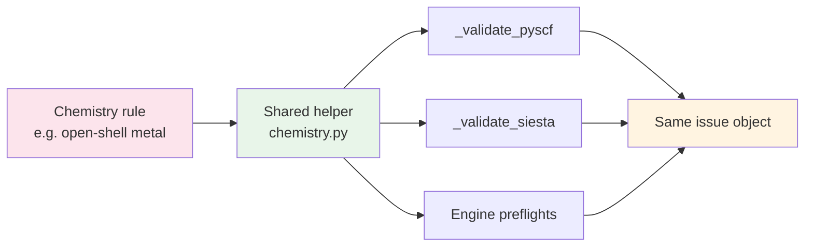

# Scientific correctness

> **This document is the sole source of truth for molbuilder's
> scientific-correctness contract**: the validation pass, the
> spin/charge handling, the cross-engine consistency rule, and
> the generated-output style requirements.  Pointer in `design.md`
> § 0.
>
> Per-engine emitter details live in `docs/engines/{siesta,pyscf}.md`.
> This doc covers the cross-engine invariants those emitters must
> satisfy.

---

## 1. Goal

Generated SIESTA `.fdf` and PySCF `.py` outputs must be both
**syntactically correct** and **scientifically defensible**.  A
script that runs to completion but converges to the wrong
electronic state is worse than one that fails clearly — silent
chemical errors waste cluster time and erode trust in the
toolchain.

This doc captures the invariants that prevent the most common
silent failures:

- Wrong `(charge, spin)` for transition-metal complexes.
- Bond-distance pathologies the user didn't see in the viewer.
- Cross-engine drift where the same chemistry gets different
  treatment in SIESTA vs PySCF.

---

## 2. Spin + charge: the most important pair of inputs

For ANY DFT/HF calculation, `(charge, spin)` together define the
electronic state.  Wrong values give wrong electronic structure,
which manifests as:

- huge forces,
- non-convergence, or
- (worst) silent convergence to a fictitious state that LOOKS
  reasonable but is the wrong minimum.

The 2026-05-22 hemeC-dithiol incident (§ 2.3) was exactly this.

### 2.1 Why these are easy to get wrong

- Defaults look innocent: `charge=0, spin=0` (closed-shell
  singlet) works for ~90% of organic molecules.  But ANY
  structure containing Fe / Mn / Co / Ni / Cu / Mo / W
  (open-shell transition metals) is in the other 10%.
- The spin convention varies across codes:
  - PySCF: `spin = 2S = n_unpaired` (NOT multiplicity = 2S+1).
  - ORCA, Gaussian: multiplicity.
  - SIESTA: `SpinPolarized` + `SpinTotal` in μ_B.
  Easy to be off by one.
- Wrong `(charge, spin)` often DOES converge SCF — just to a
  different electronic state with different energy / forces /
  HOMO-LUMO ordering.  No obvious error message.
- The "right" spin depends on coordination chemistry, not just
  element identity.  4-coordinate Fe(II)-porphyrin = S=1
  (intermediate); 5-coord with one weak axial ligand = S=2
  (high); 6-coord with two strong-field axial = S=0 (low).
  No general formula — depends on the experimental data.

### 2.2 Checks molbuilder provides

In `molbuilder/chemistry.py` + `molbuilder/validation.py`:

| Helper | What it catches |
|---|---|
| `total_electrons(struct, charge)` | sum(Z) − charge for any structure (raises on unknown element symbol) |
| `check_spin_charge_parity(struct, charge, spin)` | spin=0 requires even electron count; spin=1 requires odd; etc.  PySCF raises this AT RUN TIME; we catch it pre-emission for a clearer message. |
| `detect_open_shell_metals(struct)` | Returns list of open-shell transition metals present.  Empty for pure organics. |
| `explain_metal_spin(element, spin)` | One-line description of what (Fe, spin=4) implies (Fe(II) high-spin, S=2, 4 unpaired — e.g. deoxy-heme). |
| `_check_open_shell_metal()` (validation.py) | Shared by `_validate_pyscf` AND `_validate_siesta`: warns when a structure with an open-shell metal is paired with a closed-shell SCF (PySCF RKS/RHF + spin=0; SIESTA SpinPolarized=False).  SAME warning regardless of engine — same chemistry. |

### 2.3 Post-mortem: hemeC-dithiol (2026-05-22)

The bug surfaced when the user ran hemeC-dithiol (an Fe-porphyrin
with two thiol side chains) through PySCF spectra.

**Symptom**: forces ~10 eV/Å on a structure already near
experimental equilibrium.

**Root cause**: `SpectraConfig.charge` and `SpectraConfig.spin`
did not exist as fields — the spectra script's `gto.M()` call
silently used PySCF's defaults (charge=0, spin=0) regardless of
what the user wanted.  Fe(II) in a 4-coordinate porphyrin (no
axial ligands within bonding distance in the user's geometry) is
intermediate-spin S=1 (spin=2), not closed-shell S=0.  The SCF
converged to a fictitious low-spin state with unphysical orbital
occupancies, hence the enormous gradient.

**What enabled the silent failure**:

1. `SpectraConfig` had `method` but not `charge` / `spin`.
   `_emit_build_mol` in `spectra/pyscf_script.py` emitted
   `gto.M(...)` without `charge=` / `spin=`, falling through to
   PySCF's `(0, 0)` default.
2. The validation pass exists (`validation.py::_validate_pyscf`)
   but only ran from Build's `render_script`, not from the
   spectra script's emit path — the spectra engine's `preflight`
   had its OWN list of checks that didn't include the
   open-shell-metal rule.
3. The user has no way to specify spin from the form because
   the field didn't exist.  Silently using a wrong default with
   no input surface is the worst combination.

**Fixes that landed**:

- Add `charge` + `spin` to `SpectraConfig` with detailed help
  text explaining the convention + giving Fe(II) / Fe(III)
  examples.
- Emit them in the script's `gto.M(...)`.
- Add the open-shell-metal check to BOTH `_validate_pyscf` and
  `_validate_siesta` (via shared `_check_open_shell_metal`
  helper) AND to `PySCFSpectraEngine.preflight` — triple
  coverage so any surface that calls either entry point sees
  the warning.
- Add `total_electrons` + `check_spin_charge_parity` +
  `explain_metal_spin` as standalone helpers for any future
  engine that needs to do the same checks.
- The /spectra and /build forms now show the help text inline
  (the field metadata's `help` is rendered as a tooltip / aside
  by `form-schema.js`); the spin field's help enumerates the
  common Fe(II) / Fe(III) spin combinations so the user has a
  starting point without reading the literature.

### 2.4 Cross-engine consistency rule

ANY scientific check that depends on chemistry (charge / spin /
coordination / basis suitability) MUST live in a shared helper
called from BOTH `_validate_siesta` AND `_validate_pyscf` — same
physical facts, same warning.

Don't duplicate the check inline in one validator and forget the
other; add a helper.



---

## 3. Validation pass (pre-emission)

Runs before `render_fdf` / `render_script` writes any output.
Implemented in `molbuilder/validation.py::validate_geometry(struct,
cfg) -> List[Issue]`.  Errors stop emission; warnings print to
stderr.

`Issue` is the L1 dataclass:

```python
@dataclass
class Issue:
    severity: Literal["error", "warn"]
    message:  str
    where:    str    # e.g. "geometry.min_distance" or "config.pao_energy_shift"
```

The validator pulls per-field rules from the `Config` field
metadata (`range`, `validate=` callable) plus the geometric
checks below.

| Check | Severity | Rationale |
|---|---|---|
| min atom-atom distance < 0.3 Å | error | Atoms on top of each other; SCF will diverge |
| min atom-atom distance 0.3 – 0.7 Å | warn | Likely broken structure (failed protonation, bad backend output) |
| H/heavy ratio < 0.3 | warn | Heavy-atom skeleton — wrong electron count for DFT; user may have intentionally opted out of H-add (e.g. `build_dna(..., add_hydrogens=False)`) for hand-processing, hence warn not error |
| polymer residue listing reversed (structural 5' end ≠ residue_ids[0]) | warn | Every backend builds 5'→3' (lowest residue_id at 5' end). A reversed listing breaks downstream orientation-sensitive code (terminal-phosphate stripping, FDF residue numbering); likely a backend regression |
| polymer has multiple residues with no preceding O3'-P bridge (single-chain input) | warn | Disconnected backbone or unintended branching — single-chain input expected one 5' end |
| atom-to-nearest-image distance < 2 × cell_padding (vacuum case) | warn | Image-image interaction; suggest larger padding |
| cell volume / atom-bounding-volume < 3 | warn | Cell suspiciously tight |
| cell determinant ≤ 0 | error | Left-handed or degenerate cell |
| `kgrid != 1` along axis with extent < 10 Å | warn | k-points along a vacuum direction is wasted |
| `kgrid == 1` along axis with extent > 10 Å (periodic system) | warn | Likely under-converged k-grid |
| net dipole > 1 D in vacuum (no dipole correction) | warn | Image-image dipole; suggest dipole correction or bigger cell |
| atom outside [0, 1) fractional with `wrap_into_cell=False` | warn | Atom in neighbor cell; visualisations will look broken |
| explicit `Spin.Total` set but `spin_polarized=False` | warn | Total-spin pin will be silently ignored |

Reused by both SIESTA and PySCF generators.  Unit-tested against
fixtures in `tests/conftest.py`.  The CLI `molbuilder validate`
subcommand emits the same `List[Issue]` as JSON to stdout for
shell-driven pre-flight checks.

---

## 4. Known SIESTA / PySCF science gaps — historical

Ten gaps were identified in the 2026-05-01 design review:

- SIESTA `SpinTotal` / `SpinPolarized` keyword forms
- dispersion-correction emission
- `mf.stability_analysis()` for open-shell
- `PAO.EnergyShift` default
- post-processing hook templates
- SIESTA version pinning
- ECP auto-emit for heavy atoms with non-def2 bases
- post-relax `mf.kernel()` re-evaluation
- `mf.diis_space` / `mf.damp` exposure

All ten are closed and pinned by tests in
`tests/test_science_gaps.py` (0 xfails).  Reconstruct any
specific fix from
`git log --oneline --grep="science\|gap"`.

---

## 5. Pinned false positive — 2026-05-05 review

The 22-item review on the post-merge branch landed eleven
targeted fix commits (review-fixes A-M, plus the dead-handoff
cleanup); see `git log --oneline --grep "review-fix"` for the
chain.  One item was a false positive worth documenting so it
doesn't resurface:

- **TIER 2 #8 (geomeTRIC `convergence_*` kwargs raise TypeError)**
  was wrong.  PySCF's `geometric_solver.optimize(method,
  **kwargs)` forwards `**kwargs` into
  `geometric.optimize.OptParams(**kwargs)`, which accepts the
  lowercase keys `convergence_energy` / `convergence_grms` /
  `convergence_gmax` and stores them as the capitalized
  `Convergence_*` attributes.  The contract is pinned by
  introspection (no subprocess, no PySCF dependency) in
  `test_geometric_optparams_accepts_pyscf_optimize_kwargs` —
  that test fails at unit-test time if either side ever renames
  or rejects the keys, so a regression surfaces cleanly instead
  of crashing at user runtime.

---

## 6. Generated-output style requirements

- **Verbose-comments mode** (default ON) emits inline tuning
  hints next to each parameter plus a troubleshooting block at
  end of file.  Both must remain feature-complete across the
  merge.
- **Section headers** (`# --- Lattice ---`,
  `#  1. Build the molecule`, etc.) are mandatory.
- **Every tunable parameter** appears with its default value
  visible and a comment range (e.g. `# Range 0.001 - 0.5`) rather
  than hidden behind a function call.
- **Post-processing hook placeholders** (commented-out, ready to
  uncomment) belong at the end of every generated script / FDF.
