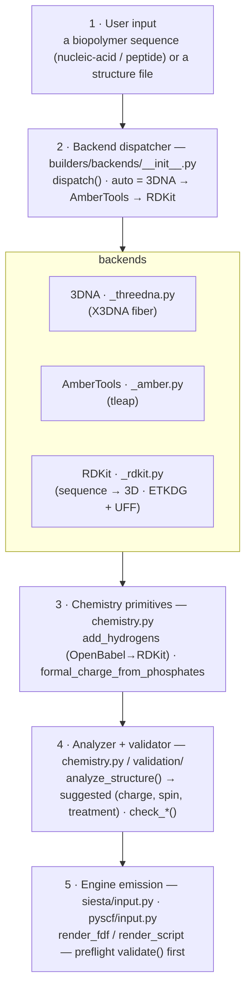
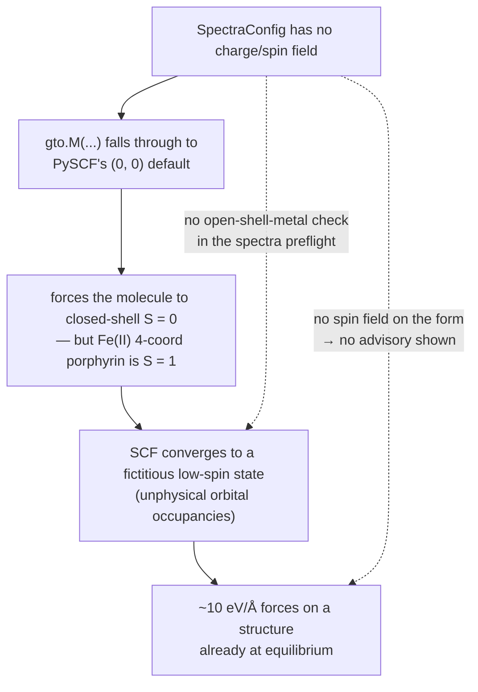
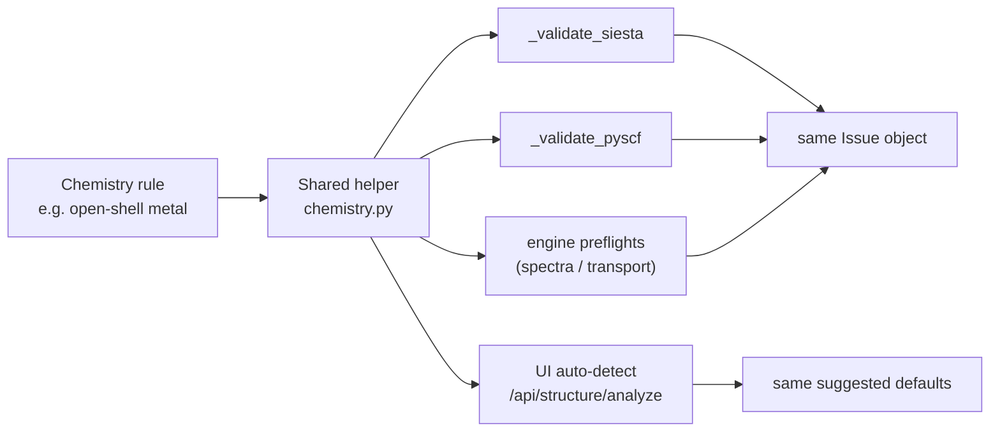

# Chemistry correctness — the control surface, end to end

**Role:** contract
**Domain:** science
**Companions:** [`validation.md`](?doc=science/validation.md) (the runtime
machinery that *runs* these checks — analyzer, adapters, consumers);
[`model/chemistry.md`](?doc=model/chemistry.md) (the L1 charge/protonation/
`add_hydrogens` helpers); `overview.md` (the science contract + the full
validation-check catalog — composed last, named not linked yet); `pseudopotentials.md`
(the heavy-atom pseudo/basis pass); the engine emitters (`engines/{siesta,pyscf,builders}.md`).

This is where to start when asking **"is molbuilder's chemistry right?"** It walks
the path a structure takes from *"user types a sequence"* to *"engine emits a
script,"* names every point where the chemistry could be wrong, and states the
one pair of inputs that causes almost all silent errors: **`(charge, spin)`**.

The deep machinery lives in `validation.md`; this doc is the **map + the science
+ the audit checklist**.

---

## 1. The control surface — five points where chemistry can go wrong

A structure flows through five control points between user input and engine
emission. Each is a *"could be wrong here"* location an audit must verify.



| # | Control point | Owner | Deep doc |
|---|---|---|---|
| 1 | User input (CLI / web form) | shared dataclass dispatch | `engines/*` · `process/cli.md` |
| 2 | Backend dispatcher | `builders/backends/__init__.py` | `engines/builders.md` |
| 3 | Chemistry primitives (H + charge) | `chemistry.py` | [`model/chemistry.md`](?doc=model/chemistry.md) |
| 4 | Analyzer + per-engine validators | `chemistry.py` · `validation/` | [`validation.md`](?doc=science/validation.md) |
| 5 | Engine emission + pre-emit validate | `siesta/input.py` · `pyscf/input.py` | `engines/{siesta,pyscf}.md` |

The user doesn't pick a backend — they choose `--backend auto` (or accept the
form default) and `dispatch(kind, sequence, *, backend="auto", …)`
(`builders/backends/__init__.py:105`) runs the cascade **3DNA → AmberTools →
RDKit** (first-available wins). `available_backends()` (`:65`) reports what's
installed; `auto_backend_name()` (`:91`) reports what `auto` would pick (or
`None` if nothing is available).

---

## 2. Spin + charge — the most error-prone pair of inputs

For **any** DFT/HF calculation (density-functional theory / Hartree-Fock — the two
quantum-chemistry methods molbuilder emits inputs for), `(charge, spin)` together
define the *electronic state* — how many electrons there are and how their spins
are arranged. Wrong values give the wrong electronic structure, which shows up as
huge forces, non-convergence, or — worst — **the SCF (the iterative solve at the
heart of DFT/HF) silently converging to a fictitious state that looks reasonable
but is the wrong minimum**. The 2026-05-22 hemeC-dithiol incident (§ 2.3) was
exactly this. *(Cross-cutting terms — SCF, open/closed-shell, 2S, parity — are in
the [`overview.md` glossary](?doc=science/overview.md).)*

### 2.1 Why it's easy to get wrong

- **The defaults look innocent.** `charge=0, spin=0` (closed-shell singlet)
  works for ~90 % of organic molecules — but *any* structure containing Fe / Mn
  / Co / Ni / Cu / Mo / W (open-shell transition metals) is in the other 10 %.
- **The spin convention varies across codes** — off-by-one is easy:

  | Code | What "spin" means |
  |---|---|
  | **PySCF** | `spin = 2S = n_unpaired` (**not** multiplicity 2S+1) |
  | **SIESTA** | `SpinPolarized` (bool) + `Spin.Total` in μ_B |
  | ORCA / Gaussian | multiplicity = 2S+1 |

  For a **triplet** (2 unpaired electrons, 2S = 2) the two engines molbuilder
  emits look like this — same physics, different spelling:

  ```python
  # PySCF (.py):     mol = gto.M(..., charge=0, spin=2)   # spin is 2S
  # SIESTA (.fdf):   SpinPolarized  .true.
  #                  Spin.Fix       .true.
  #                  Spin.Total     2.0                    # in μ_B
  ```

- **Wrong `(charge, spin)` often *does* converge SCF** — just to a different
  electronic state with different energy / forces / HOMO-LUMO ordering, and no
  obvious error message.
- **The "right" spin depends on coordination chemistry, not just element
  identity.** *Coordination* = how many atoms bond directly to the metal; *axial
  ligands* sit above/below the flat ring; a *strong-field* ligand splits the
  metal's d-orbitals more, which favours pairing electrons up (low spin). For the
  same Fe(II) ion the ground-state spin swings across the whole range:

  | Coordination | Axial ligand field | Spin state | Unpaired e⁻ | Example |
  |---|---|---|---|---|
  | 4-coordinate | none | intermediate, **S = 1** | 2 | Fe(II)-porphyrin |
  | 5-coordinate | one weak | high, **S = 2** | 4 | deoxy-heme |
  | 6-coordinate | two strong-field | low, **S = 0** | 0 | oxy- / CO-heme |

  There is no general formula — it depends on the experimental data, which is why
  molbuilder *suggests* a spin and asks the user to verify rather than deciding
  silently. (In molbuilder's `2S` convention these are `spin = 2`, `4`, `0`.)

### 2.2 The chemistry primitives molbuilder provides (backend surface)

Pure helpers in `molbuilder/chemistry.py` (+ `validation/chemistry.py`), each
engine-agnostic and side-effect-free:

| Helper | Line | What it catches |
|---|---|---|
| `total_electrons(struct, charge=0)` | `chemistry.py:166` | Σ Z − charge (raises on an unknown element symbol) |
| `check_spin_charge_parity(struct, charge, spin)` | `:186` | spin=0 needs even electron count, spin=1 odd, … — PySCF raises this at *run* time; we catch it pre-emission for a clearer message |
| `detect_open_shell_metals(struct)` | `:470` | the open-shell transition metals present (empty for pure organics) |
| `explain_metal_spin(element, spin)` | `:282` | one-line meaning of e.g. `(Fe, spin=4)` → "Fe(II) high-spin, S=2, 4 unpaired (deoxy-heme)" |
| `suggest_spin_total(metals)` | `:371` | `(preferred, alternatives)` — ranked (spin, rationale) choices per metal; feeds the SIESTA validator's spin-sweep (`validation/siesta.py:291`). *(The analyzer builds its own `metal_hints` from `_metal_hint`, `chemistry.py:714`.)* |
| `check_open_shell_metal(struct, *, is_closed_shell, engine_label)` | `validation/chemistry.py:113` | the cross-engine guard: warns when an open-shell-recommended structure is paired with a closed-shell SCF |

```python
from molbuilder.chemistry import (
    total_electrons, check_spin_charge_parity, detect_open_shell_metals,
    explain_metal_spin,
)

n_e = total_electrons(struct, charge=0)          # e.g. 258 for a hemeC fragment
err = check_spin_charge_parity(struct, charge=0, spin=2)   # None if OK, else a message str
metals = detect_open_shell_metals(struct)        # ["Fe"]
print(explain_metal_spin("Fe", 2))               # "Fe(II) intermediate-spin, S=1 …"
```

The analyzer (`analyze_structure`) composes these into one `ChemistryAnalysis`
recommendation — the single object every science-aware surface then consumes:

```python
>>> from molbuilder.chemistry import analyze_structure
>>> a = analyze_structure(hemeC_dithiol)      # an Fe-porphyrin with two thiol arms
>>> a.metals, a.suggested_treatment, a.suggested_spin
(['Fe'], 'open', 2)          # Fe is open-d → open-shell; analyzer default 2S = 2
>>> a.suggested_charge
0
>>> a.rationale              # human-readable, shown next to the Auto-detect button
'Detected open-shell metal Fe → open-shell DFT, 2S = 2 (Fe(II) intermediate-spin,
 4-coordinate porphyrin). Verify against your experimental data — the right spin
 depends on axial coordination, not just element identity.'          # illustrative
```

The same `a` drives both the pre-fill (forward) and the Generate-time check
(reverse) — see [`validation.md`](?doc=science/validation.md) for how that one
result reaches every engine. *(The `2` here is the **analyzer's** default; the
SIESTA spin-sweep starts higher, at `suggest_spin_total(["Fe"]) → 4.0`
high-spin — two intentionally different starting bets.)*

### 2.3 Post-mortem: hemeC-dithiol (2026-05-22)

The bug surfaced when the user ran hemeC-dithiol (an Fe-porphyrin with two thiol
side chains) through PySCF spectra. It was a chain of small gaps that lined up —
each link is now broken (§ 2.5):



- **Symptom** — forces ~10 eV/Å on a structure already near experimental
  equilibrium.
- **Root cause** — `SpectraConfig` had no `charge` / `spin` fields, so the
  spectra script's `gto.M(...)` silently used PySCF's `(0, 0)` default. Fe(II) in
  a 4-coordinate porphyrin (no axial ligands within bonding distance in the
  user's geometry) is intermediate-spin S=1 (`spin=2`), not closed-shell S=0. The
  SCF converged to a fictitious low-spin state with unphysical orbital
  occupancies — hence the enormous gradient.
- **What enabled the silent failure** — three compounding gaps: (1) the config
  field didn't exist; (2) the spectra engine's preflight had its *own* check list
  that omitted the open-shell-metal rule (it ran only from Build's
  `render_script`); (3) the user had no form field to specify spin. Silent wrong
  default + no input surface + no surfaced advisory = the worst combination.
- **Fixes that landed** — `charge` + `spin` added to `SpectraConfig`
  (`config/spectra.py:190`, `:204`) with help text that enumerates the common
  Fe(II) / Fe(III) spin combinations (`:210-217`) so the user has a starting
  point without reading the literature; emitted in the script's `gto.M(...)`; the
  open-shell-metal check added to **both** `_validate_pyscf` and `_validate_siesta`
  (via the shared `check_open_shell_metal`) **and** the spectra preflight — triple
  coverage; and `total_electrons` / `check_spin_charge_parity` /
  `explain_metal_spin` promoted to standalone helpers for any future engine.

### 2.4 The cross-engine consistency rule

**Any** scientific check that depends on chemistry (charge / spin / coordination
/ basis suitability) MUST live in a shared helper called from **both**
`_validate_siesta` and `_validate_pyscf` — same physical facts, same warning.
Don't duplicate a check inline in one validator and forget the other.



This is structural, not aspirational: every science-aware surface consumes the
same `ChemistryAnalysis` instance and cannot disagree by construction. The
machinery — the dataclass, the adapter registry, the rule that adapters must not
re-do detection — is in [`validation.md`](?doc=science/validation.md) §§ 2–4.

### 2.5 Auto-detect as a scientific guard (frontend surface)

The analyzer isn't just a defaults convenience. By consuming the same
`ChemistryAnalysis` as the validator, the **Auto-detect** button surfaces the
same warning the validator would emit at Generate time — but at structure-**load**
time, when the user can still act on it cheaply. A user with hemeC-dithiol now
sees, *before* generating:

> "Detected open-shell metal Fe. Suggesting spin=2 (Fe(II), intermediate).
> Verify against your experimental data — the right spin depends on axial
> coordination, not just element identity."

Each link of the 2026-05-22 chain is now broken: the silent default → an explicit
pre-fill carrying rationale; the missing input surface → charge/spin/method on
both engine sub-forms; the absent advisory → the analyzer's `rationale` +
`warnings`, shown next to the button and again at validate-time if overridden.
The chip that renders this reads `suggested_treatment` straight off the
`/api/structure/analyze` response — see [`validation.md`](?doc=science/validation.md)
§ 4 for the forward/reverse split.

---

## 3. Audit checklist — what to verify at each control point

When reviewing chemistry correctness in a PR, a refactor, or a structural audit,
walk these in order (the "scientific correctness" audit dimension lives here):

**3.1 At the dispatcher** — `available_backends()` reports installed backends
correctly (`tests/test_backends.py:31::test_available_backends_returns_dict_of_bools`);
`auto_backend_name()` returns the highest-priority available backend; adding a
backend doesn't break the cascade (3DNA still wins for DNA when present).

**3.2 At the backend** — each backend strips/re-adds hydrogens consistently with
the shared `add_hydrogens` (X3DNA's raw output has stylised hydrogens that need
replacement); AmberTools/tleap runs the methylene-hydrogen fix
(`_fix_methylene_hydrogens`, `builders/backends/_amber.py:174`); RDKit builds the
polymer from the one-letter sequence (`MolFromSequence`), adds Hs with plain
`Chem.AddHs`, embeds a conformer with ETKDGv3, and minimises with **UFF** — MMFF
lacks parameters for nucleic acids (`builders/backends/_rdkit.py:86-106`).

**3.3 At the chemistry primitives** — `add_hydrogens` runs **once** per structure
(never twice, never skipped): the backend gate `maybe_add_hydrogens` skips it when
the structure is already protonated
(`tests/test_nucleic.py::test_maybe_add_hydrogens_auto_skips_already_protonated`)
and forces it when it isn't. (`add_hydrogens` normalises protonation via
OpenBabel→RDKit, rebuilding the structure through a PDB round-trip; only the
no-engine fallback returns the input unchanged, with a `RuntimeWarning` — see
[`model/chemistry.md`](?doc=model/chemistry.md).)
`formal_charge_from_phosphates` matches the user-stated charge for canonical
DNA/RNA inputs.

**3.4 At the analyzer** — `analyze_structure` is deterministic for the same input
(no I/O, no global state:
`tests/test_chemistry_analyzer.py:236::test_analyze_structure_is_deterministic`);
the detection chip (UI) and the validator (form) read the same
`suggested_treatment` (single-analyzer rule).

**3.5 At engine emission** — `validate(struct, cfg)` runs before render in *every*
engine path (no "render that skips preflight"):
`tests/test_web.py:435,459::test_preflight_returns_issues_for_{siesta,pyscf}`;
issues carrying `workflow_group` metadata route to the correct UI card
(`tests/test_issues_workflow_group.py`).

---

## 4. What this doc does NOT cover

- **The full validation-check catalog** (min-distance / cell-determinant / k-grid
  / dipole thresholds, with their scientific rationale) and the
  advisory-while-editing vs enforcing-at-generation contract → `overview.md`.
- **The "why" for each toolkit choice** (OpenBabel vs RDKit, X3DNA quirks) →
  `engines/builders.md`.
- **The per-engine validator rule set + the analyzer/adapter machinery** →
  [`validation.md`](?doc=science/validation.md).
- **The Issue → UI-card attachment rules** → `web-ui-coherence.md` (web wave).

This doc is intentionally a navigation map. A detail you're tempted to add here
probably belongs in one of the linked specialised docs.

---

## 5. Why this doc exists

A 2026-06-14 audit nearly deleted `/api/modify/load` without first verifying that
the chemistry guards weren't entangled with it (they weren't — it was a trivial
3-line wrapper). Without a stitched overview, future audits would keep hitting
the same risk: *"someone proposes deleting/refactoring something; nobody can
quickly check whether the chemistry-correctness chain touches it."* This doc is
the answer to **"where is the chain?"** — one entry point that walks the stack
with links to each layer's deep doc. When a chemistry-adjacent change is
proposed, run § 3 top-to-bottom.
