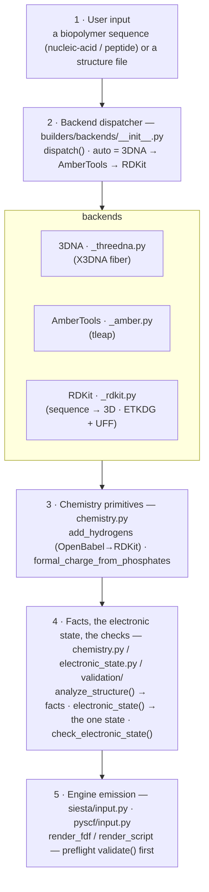
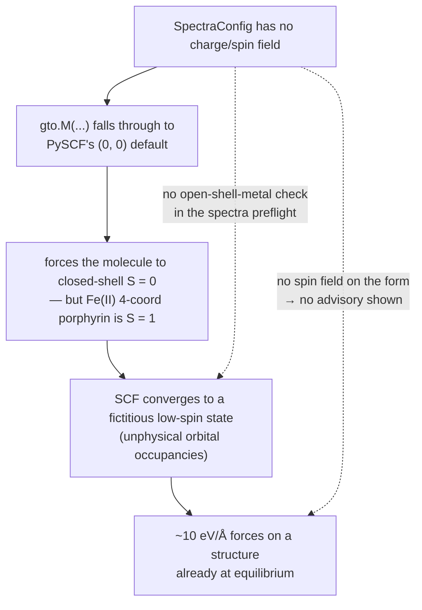
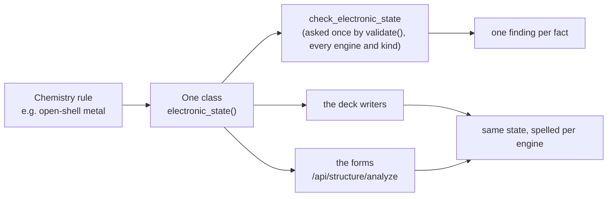

# Chemistry correctness — the control surface, end to end

**Role:** contract
**Domain:** science
**Companions:** [`validation.md`](?doc=science/validation.md) (the runtime
machinery that *runs* these checks — the analyzer, the electronic-state class,
its consumers);
[`model/chemistry.md`](?doc=model/chemistry.md) (the L1 charge/protonation/
`add_hydrogens` helpers); `overview.md` (the science contract + the full
validation-check catalog — composed last, named not linked yet); `pseudopotentials.md`
(the heavy-atom pseudo/basis pass); the engine emitters (`engines/{siesta,pyscf,builders}.md`).

This is where to start when asking **"is molbuilder's chemistry right?"** It walks
the path a structure takes from *"user types a sequence"* to *"engine emits a
script,"* names every point where the chemistry could be wrong, and states the
one pair of inputs that causes almost all silent errors: **`(charge, spin)`**.

The deep machinery lives in `validation.md`; this doc is the **map + the science
+ the audit checklist**.

---

## 1. The control surface — five points where chemistry can go wrong

A structure flows through five control points between user input and engine
emission. Each is a *"could be wrong here"* location an audit must verify.


```mermaid
flowchart TB
    U["1 · User input<br/>a biopolymer sequence (nucleic-acid / peptide) or a structure file"]
    D["2 · Backend dispatcher — builders/backends/__init__.py<br/>dispatch() · auto = 3DNA → AmberTools → RDKit"]
    subgraph B["backends"]
        T["3DNA · _threedna.py<br/>(X3DNA fiber)"]
        A["AmberTools · _amber.py<br/>(tleap)"]
        R["RDKit · _rdkit.py<br/>(sequence → 3D · ETKDG + UFF)"]
    end
    C["3 · Chemistry primitives — chemistry.py<br/>add_hydrogens (OpenBabel→RDKit) · formal_charge_from_phosphates"]
    AN["4 · Facts, the electronic state, the checks — chemistry.py / electronic_state.py / validation/<br/>analyze_structure() → facts · electronic_state() → the one state · check_electronic_state()"]
    E["5 · Engine emission — siesta/input.py · pyscf/input.py<br/>render_fdf / render_script — preflight validate() first"]
    U --> D --> B --> C --> AN --> E
```

| # | Control point | Owner | Deep doc |
|---|---|---|---|
| 1 | User input (CLI / web form) | shared dataclass dispatch | `engines/*` · `process/cli.md` |
| 2 | Backend dispatcher | `builders/backends/__init__.py` | `engines/builders.md` |
| 3 | Chemistry primitives (H + charge) | `chemistry.py` | [`model/chemistry.md`](?doc=model/chemistry.md) |
| 4 | Facts, the electronic state, the checks | `chemistry.py` · `electronic_state.py` · `validation/` | § 2a · [`validation.md`](?doc=science/validation.md) |
| 5 | Engine emission + pre-emit validate | `siesta/input.py` · `pyscf/input.py` | `engines/{siesta,pyscf}.md` |

The user doesn't pick a backend — they choose `--backend auto` (or accept the
form default) and `dispatch(kind, sequence, *, backend="auto", …)`
(`builders/backends/__init__.py:105`) runs the cascade **3DNA → AmberTools →
RDKit** (first-available wins). `available_backends()` (`:65`) reports what's
installed; `auto_backend_name()` (`:91`) reports what `auto` would pick (or
`None` if nothing is available).

---

## 2. Spin + charge — the most error-prone pair of inputs

For **any** DFT/HF calculation (density-functional theory / Hartree-Fock — the two
quantum-chemistry methods molbuilder emits inputs for), `(charge, spin)` together
define the *electronic state* — how many electrons there are and how their spins
are arranged. Wrong values give the wrong electronic structure, which shows up as
huge forces, non-convergence, or — worst — **the SCF (the iterative solve at the
heart of DFT/HF) silently converging to a fictitious state that looks reasonable
but is the wrong minimum**. The 2026-05-22 hemeC-dithiol incident (§ 2.3) was
exactly this. *(Cross-cutting terms — SCF, open/closed-shell, 2S, parity — are in
the [`overview.md` glossary](?doc=science/overview.md).)*

### 2.1 Why it's easy to get wrong

- **The defaults look innocent.** `charge=0, spin=0` (closed-shell singlet)
  works for ~90 % of organic molecules — but *any* structure containing Fe / Mn
  / Co / Ni / Cu / Mo / W (open-shell transition metals) is in the other 10 %.
- **The spin convention varies across codes** — off-by-one is easy:

  | Code | What "spin" means |
  |---|---|
  | **PySCF** | `spin = 2S = n_unpaired` (**not** multiplicity 2S+1) |
  | **SIESTA** | `Spin polarized` + `Spin.Fix` + `Spin.Total` (2S, in μ_B) — `SpinPolarized` is the retired spelling (`Src/spin_subs.F90`) |
  | ORCA / Gaussian | multiplicity = 2S+1 |

  For a **triplet** (2 unpaired electrons, 2S = 2) the two engines molbuilder
  emits look like this — same physics, different spelling:

  ```python
  # PySCF (.py):     mol = gto.M(..., charge=0, spin=2)   # spin is 2S
  # SIESTA (.fdf):   Spin           polarized
  #                  Spin.Fix       .true.
  #                  Spin.Total     2.0                    # 2S, in μ_B
  ```

- **Wrong `(charge, spin)` often *does* converge SCF** — just to a different
  electronic state with different energy / forces / HOMO-LUMO ordering (the
  highest-occupied / lowest-unoccupied molecular-orbital gap), and no obvious
  error message.
- **The "right" spin depends on coordination chemistry, not just element
  identity.** *Coordination* = how many atoms bond directly to the metal; *axial
  ligands* sit above/below the flat ring; a *strong-field* ligand splits the
  metal's d-orbitals more, which favours pairing electrons up (low spin). For the
  same Fe(II) ion the ground-state spin swings across the whole range:

  | Coordination | Axial ligand field | Spin state | Unpaired e⁻ | Example |
  |---|---|---|---|---|
  | 4-coordinate | none | intermediate, **S = 1** | 2 | Fe(II)-porphyrin |
  | 5-coordinate | one weak | high, **S = 2** | 4 | deoxy-heme |
  | 6-coordinate | two strong-field | low, **S = 0** | 0 | oxy- / CO-heme |

  There is no general formula — it depends on the experimental data. So a blank
  spin on an open-d metal is decided at the metal's usual count, said as **the
  starting guess** with its reason on the chemistry card and in the deck, and
  warned about until the count is stated (§ 2a, ES8) — never decided silently.
  (As `unpaired_electrons`, 2S, these are 2, 4 and 0.) Iron's guess is 2, the
  first row: the four-coordinate porphyrin this project's heme work meets, and
  the hint says where else it holds (porphyrins and phthalocyanines) rather than
  calling it rare *(user, 2026-09-29: keep 2, say it as a starting guess)*.

### 2.2 The chemistry primitives molbuilder provides (backend surface)

Pure helpers in `molbuilder/chemistry.py` (+ `validation/chemistry.py`), each
engine-agnostic and side-effect-free:

| Helper | What it answers |
|---|---|
| `total_electrons(struct, charge=0)` | Σ Z − charge (raises on a label that names no element) |
| `check_spin_charge_parity(struct, charge, unpaired)` | a count of the wrong parity, or above the electron count — PySCF raises this at *run* time; the state's family (ES3) catches it before a deck is written, with a clearer message |
| `analyze_structure(struct)` | the structure's facts: its atoms, elements, and the metals that bear on its spin — `open_d_metals`, `noble_metals` — with each metal's usual spins (`metal_hints`) |
| `explain_metal_spin(element, unpaired)` | one-line meaning of e.g. `(Fe, 4)` → "Fe(II), high-spin (S=2, 4 unpaired) -- e.g. deoxy-heme, bis-thiolate" |

```python
from molbuilder.chemistry import (
    analyze_structure, check_spin_charge_parity, explain_metal_spin,
    total_electrons,
)

n_e = total_electrons(struct, charge=0)          # e.g. 258 for a hemeC fragment
err = check_spin_charge_parity(struct, charge=0, unpaired=2)   # None if OK
metals = analyze_structure(struct).open_d_metals               # ["Fe"]
print(explain_metal_spin("Fe", 2))               # "Fe(II), intermediate-spin …"
```

The analyzer (`analyze_structure`) composes these into the structure's **facts**
— its metals and their usual spins — and the electronic-state class (§ 2a)
decides from those facts, at the calculation's own charge and periodicity, the
one state every science-aware surface then reads:

```python
>>> from molbuilder.electronic_state import electronic_state
>>> st = electronic_state(hemeC_dithiol, cfg, kind="optimization")   # spin fields blank
>>> st.spin_treatment.value, st.unpaired_electrons.value
('unrestricted', 2)          # Fe is open-d → open-shell; 2S = 2 to start
>>> st.unpaired_electrons.source, st.unpaired_electrons.why
('detected', 'Fe is an open-d metal: 2S = 2 is the starting guess -- Fe(II),
 intermediate-spin (S=1, 2 unpaired) -- e.g. four-coordinate porphyrins and
 phthalocyanines (FeTPP, FePc); uncommon elsewhere.  The right count depends on
 the coordination, not on the element: verify it against experiment and state
 it to confirm')
>>> st.net_charge.value, st.net_charge.source
(0, 'detected')              # no phosphate groups
```

The same `st` is what the form's card shows, what the checks compare, and what
the deck writers spell — see [`validation.md`](?doc=science/validation.md) for
how that one result reaches every engine. *(The `2` here is the **class's**
detected count; a SIESTA deck solved unrestricted on a finite system beside it
lists every count the metal's hints name — the table the card shows — as a
spin-state sweep for a person to run and keep the lowest energy.)*

### 2.3 Post-mortem: hemeC-dithiol (2026-05-22)

The bug surfaced when the user ran hemeC-dithiol (an Fe-**porphyrin** — the flat
macrocyclic ring that cages the iron in heme — with two **thiol** (–SH) side
chains) through PySCF spectra. It was a chain of small gaps that lined up — each
link is now broken (§ 2.5):


```mermaid
flowchart TD
    A["SpectraConfig has no charge/spin field"] --> B["gto.M(...) falls through to<br/>PySCF's (0, 0) default"]
    B --> C["forces the molecule to closed-shell S = 0<br/>— but Fe(II) 4-coord porphyrin is S = 1"]
    C --> D["SCF converges to a fictitious low-spin state<br/>(unphysical orbital occupancies)"]
    D --> E["~10 eV/Å forces on a structure<br/>already at equilibrium"]
    A -.->|"no open-shell-metal check<br/>in the spectra preflight"| D
    A -.->|"no spin field on the form<br/>→ no advisory shown"| E
```

- **Symptom** — forces ~10 eV/Å on a structure already near experimental
  equilibrium.
- **Root cause** — `SpectraConfig` had no `charge` / `spin` fields, so the
  spectra script's `gto.M(...)` (PySCF's molecule constructor, emitted by
  `_emit_build_mol`, `spectra/pyscf_script.py:532`) silently used PySCF's `(0, 0)`
  default. Fe(II) in
  a 4-coordinate porphyrin (no axial ligands within bonding distance in the
  user's geometry) is intermediate-spin S=1 (`spin=2`), not closed-shell S=0. The
  SCF converged to a fictitious low-spin state with unphysical orbital
  occupancies — hence the enormous gradient.
- **What enabled the silent failure** — three compounding gaps: (1) the config
  field didn't exist; (2) the spectra engine's preflight had its *own* check list
  that omitted the open-shell-metal rule (it ran only from Build's
  `render_script`); (3) the user had no form field to specify spin. Silent wrong
  default + no input surface + no surfaced advisory = the worst combination.
- **Fixes that landed** — `charge` + `spin` added to `SpectraConfig`
  (`config/spectra.py:190`, `:204`) with help text that enumerates the common
  Fe(II) / Fe(III) spin combinations (`:210-218`) so the user has a starting
  point without reading the literature; emitted in the script's `gto.M(...)`; the
  open-shell-metal check added to **both** `_validate_pyscf` and `_validate_siesta`
  (via the shared `check_open_shell_metal` — since 2026-09-28 the electronic
  state's recommendation check, § 2a ES9) **and** the spectra preflight — triple
  coverage; and `total_electrons` / `check_spin_charge_parity` /
  `explain_metal_spin` promoted to standalone helpers for any future engine.
  *(Today every form carries the four state items, a blank is decided by the one
  class and shown on the chemistry card before anything runs — § 2a, § 2.5.)*

### 2.4 The cross-engine consistency rule

**Any** scientific check that depends on chemistry (charge / spin / coordination
/ basis suitability) MUST live in a shared helper, asked for every engine — same
physical facts, same finding. The charge and spin go further: their findings are
ONE family, `check_electronic_state`, asked once by `validate()` for every engine
and every kind. Don't duplicate a check inline in one validator and forget the
other.


```mermaid
flowchart LR
    A["Chemistry rule<br/>e.g. open-shell metal"] --> H["One class<br/>electronic_state()"]
    H --> V["check_electronic_state<br/>(asked once by validate(), every engine and kind)"]
    H --> DW["the deck writers"]
    H --> AD["the forms<br/>/api/structure/analyze"]
    V --> R["one finding per fact"]
    DW --> R2["same state, spelled per engine"]
    AD --> R2
```

This is structural, not aspirational: every science-aware surface reads the
same `ElectronicState` and cannot disagree by construction. The machinery —
the analyzer's facts, the class, the order a blank is answered in — is in
[`validation.md`](?doc=science/validation.md) §§ 2–4 and § 2a above.

### 2.5 The chemistry card as a scientific guard (frontend surface)

The state is decided before anything is prepared, and shown where the person
is looking. Loading or restoring a structure — and every change to a charge or
spin field — asks `/api/structure/analyze` for the electronic state of exactly
what the form says, about exactly the structure the page would hand over (§ 2a.5),
and the chemistry card shows each value with the reason it was chosen. With no
structure, or no answer, the card is hidden: an answer for another structure is
never left on screen. A user with hemeC-dithiol and the spin fields left blank sees, *before*
preparing anything:

> "Spin: unrestricted, 2S = 2 — Fe is an open-d metal: 2S = 2 is the starting
> guess -- Fe(II), intermediate-spin (S=1, 2 unpaired) -- e.g. four-coordinate
> porphyrins and phthalocyanines (FeTPP, FePc); uncommon elsewhere. The right
> count depends on the coordination, not on the element: verify it against
> experiment and state it to confirm."

Each link of the 2026-05-22 chain is now broken: the silent default → a blank
that the class decides, with its reason on the card, in the deck comment and in
the prep report (§ 2a, ES8); the missing input surface → the four items on both
engine sub-forms; the absent advisory → a metal-driven decision is a warning
until the count is stated, and a stated value that differs from what the
structure implies is reported (ES9). The card and the chip read the same
`ElectronicState` the checks and the deck writers read — see
[`validation.md`](?doc=science/validation.md) § 4.

*(Until 2026-09-28 this was an **Auto-detect** button that copied the
analyzer's suggestion into the form — and the copy overwrote: a blank charge
became 0, a person's Hartree–Fock became DFT. The amendment of § 2a retired the
button; there is nothing left to copy.)*

---

## 2a. The electronic state — one class, one answer per calculation *(decided 2026-09-25; amended 2026-09-28)*

> **Status: CONTRACT, built (M6, 2026-09-28/29) — all but the read-back (ES10,
> plan § 5s, P5).** Decided by the user on 2026-09-25
> ("go with your recommendations on all seven", plan W34, § 5s.2, decisions
> 1–7). **Amended 2026-09-28** — spin is decided the way charge already was:
> *"spin/close-shell/open-shell can be handled by a similar class level/framework
> level such that all engine can use to detect and decide"*, *"or maybe this
> could be merged to that class too"*, *"go ahead with the contract, add free,
> make sure api and users are unified"*. The amendment replaces decision 3
> (Auto-detect filled the form) with ES8 below, and gives a blank count the
> meaning *auto* — a floating moment is now the value `free`. Where this section
> and the code disagree, the code is behind and plan § 5s names the phase that
> closes the gap.

Five failures, all live on one day, all the same defect:

* a formate ion prepared at `NetCharge -1` (24 electrons, closed shell) was told
  to switch to open-shell, because the check counted electrons as if the charge
  were 0;
* a bulk gold electrode (27 atoms, 2133 electrons per cell) was told to switch
  to open-shell, because an odd count per *cell* was read as an unpaired
  electron;
* the Auto-detect button wrote `net_charge = 0` over a blank charge — which
  switches the phosphate detection off — `spin_total = 0` beside a
  non-polarized treatment, and RKS or UKS over a person's Hartree–Fock;
* a transport calculation citing a relaxation started non-polarized whatever
  the relaxation had run, under a caption saying the values came from it;
* nothing read back what charge and spin the engine had actually used.

Each layer read the raw fields and interpreted them itself — and the two halves
of one state were not even decided the same way. **Charge** was resolved where
it was used: `resolve_net_charge` — a stated value wins, a blank runs the
phosphate rule — called by every deck writer and check. **Spin** was never
resolved at all: the analyzer only *suggested* it, and a suggestion reached the
deck only if someone clicked Auto-detect, which copied it into the form.
**The fix is one class that decides all of it, the way the charge rule already
decided the charge, and that every layer reads.**

### 2a.1 What it is: four items, one class

The electronic state of a calculation is **four template items**, each asking
one engine-neutral question (`engines/template.md` § 6.3: *one question, one
item — the spelling is the generator's*):

| item | the question | values | **blank** means | SIESTA writes | PySCF writes |
|---|---|---|---|---|---|
| `net_charge` | how many electrons short (+) or extra (−), in \|e\| | an integer | **auto** — the phosphate rule (`model/chemistry.md` § 1) | `NetCharge ±N`, written at 0 too — nothing reaches the engine by omission (`engines/template.md` § 6.6); a transport deck writes none (the junction is neutral by rule) | `gto.M(charge=N)` |
| `spin_treatment` | how the two spin channels are solved | `restricted` · `restricted-open` · `unrestricted` · `non-collinear` · `spin-orbit` | **auto** — `restricted` or `unrestricted`, from the structure (§ 2a.1b) | `Spin non-polarized` · *(not offered)* · `Spin polarized` · `Spin non-colinear` · `Spin spin-orbit` — always written, `non-polarized` included (§ 6.6) | the `R` · `RO` · `U` of the SCF class · *(not offered)* · *(not offered)* |
| `unpaired_electrons` | 2S = N↑ − N↓ — **not** the multiplicity 2S+1 | an integer ≥ 0, or **`free`** — the moment floats to whatever the SCF finds | **auto** — the count the structure implies (§ 2a.1b) | a count: `Spin.Fix .true.` + `Spin.Total N` beside `Spin polarized` only — SIESTA stops on `Spin.Fix` at any other spin (`read_options.F90`), so `restricted`'s 0 (ES5) writes neither; `free` writes neither | `gto.M(spin=N)`; `free` is refused — PySCF always pins it (ES6) |
| `method` | which theory | `DFT` · `HF` | never blank — `DFT` unless stated | *(SIESTA is DFT)* | `dft.` · `scf.` |

So PySCF's class is **composed, and written explicitly**: `dft.UKS(mol)` is
`method = DFT` with `spin_treatment = unrestricted`; `scf.ROHF(mol)` is `HF` with
`restricted-open`. molbuilder never writes a class and lets PySCF re-rule it —
`dft.RKS(mol)` with `mol.spin != 0` silently becomes ROKS inside PySCF
(`pyscf/dft/__init__.py`), and that is a setting that changes without a word.

**The count is a list, not a free number**: the form offers *(auto)*, 0 to 10
and `free` — `free` only where the engine can float it (§ 2a.3). The catalogue
declares it an `enum` whose members are the whole numbers and the word
(`engines/template.md` § 5), so a template reads `unpaired_electrons = 2` or
`unpaired_electrons = "free"`, never a count spelled as text.

**`method` is never worked out from the structure** — Hartree–Fock or DFT is a
choice of theory, not a property of the molecule. The other three are: that is
the whole amendment.

**One class answers all four, `ElectronicState`, and one function builds it**
(`molbuilder/electronic_state.py`):

```python
@dataclass(frozen=True)
class Resolved:
    value:  Any          # the item's value, never blank
    source: str          # "stated" · "implied" · "recorded" · "detected" · "rule"
    why:    str          # the reason in words — "three deprotonated phosphates",
                         # "Fe is an open-d metal: 2S = 2 is the starting guess; verify"
    said:   str          # (derived) where it came from, in words — "stated", or
                         # "detected: three deprotonated phosphates": the ONE
                         # phrasing the deck comment, the prep report and the
                         # card share; it travels with the value to the page

@dataclass(frozen=True)
class ElectronicState:
    net_charge:         Resolved     # int
    spin_treatment:     Resolved     # one of the five
    unpaired_electrons: Resolved     # int ≥ 0, or "free"
    method:             Resolved     # "DFT" | "HF"
    n_electrons:        int          # ΣZ − charge (the valence count has the same parity)
    finite:             bool         # the calculation's system is finite: every axis
                                     # isolated (model/structure-periodicity.md § 2),
                                     # or a molecular engine (PySCF) -- below
    recommended:        Recommended  # what the structure alone implies at this charge
    facts:              ChemistryAnalysis   # the metals and their hints it was decided from

def electronic_state(struct, cfg, *, kind) -> ElectronicState
```

`cfg` is either engine's config — the four items are spelled alike in both, which
is what merges them (`template.md` § 6.3) — and `kind` is the calculation kind,
which the transport rule needs (below). **Every reader of charge or spin calls
this and reads the result.** Its charge step answers in the one order below —
transport's rule, a stated value, the recorded one, the phosphate rule
(`chemistry.formal_charge_from_phosphates`) — and its detection step is
`recommend` over the analyzer's facts (§ 2a.1b); nothing else decides.

### 2a.1a How a blank is answered — one order, every item

A stated value always wins — the template's value, typed by the person or, on a
transport calculation, written there from the run it cites (ES7); either way it is
in the file and the person can change it. A blank takes the first of these that
answers it:

1. **implied** by a stated item — the only four implications:
   * `restricted` ⇒ `unpaired_electrons = 0` (ES5);
   * `non-collinear` or `spin-orbit` ⇒ `unpaired_electrons = free` (ES6);
   * a stated count above 0, or `free` ⇒ `spin_treatment = unrestricted`
     (`restricted-open` is chosen by stating it);
   * a stated count of 0 ⇒ `spin_treatment = restricted` (a broken-symmetry
     singlet is chosen by stating `unrestricted` beside it).
2. **recorded** by the run the structure came out of — a structure exported from
   a finished run carries that run's record (`info.calculation`,
   `model/parse.md` § 5b), and a blank item takes its value: a vibration of a
   charged relaxation starts charged (ES7). A blank count beside a stated
   treatment takes the recorded one only where the treatments agree. A structure
   **edited since** (a geometry or cell op, `structure_modified`) is no longer the
   one that run came out of, and its record is not taken
   ([`web/molview.md`](?doc=web/molview.md) § 8.4: a later reader must not assume).
3. **detected** from the structure — the charge first, then the spin at that
   charge (§ 2a.1b). A blank count beside a stated two-channel treatment the
   structure does not suggest is 0 in a finite system (a constrained singlet)
   and `free` in a repeating one.

`method` is never blank: the catalogue's `DFT` is written into a template like
any other value, and SIESTA is DFT by rule.

**Two rules, not steps, both for transport.** Its charge is 0 — its boundaries
are open and the leads set the electron number (`engines/transport.md` § 2a.7),
so `net_charge` is not a transport item at all. And **its spin is decided once,
on the junction**: TranSIESTA joins the leads' self-energies to the device, so
every rung must solve the same spin channels — a blank spin is resolved on the
composed junction at `prep` and every rung, a lead included, is handed that
answer. Decided per rung, a molecule with an open-d centre would polarize the
device beside non-polarized leads.

The source travels with the value, so every place that shows the state can say
how it was decided: *"−3 — three deprotonated phosphates"*, *"unrestricted,
2S = 2 — Fe is an open-d metal; verify against experiment"*, *"0 — follows from
restricted"*.

### 2a.1b What the structure implies — the detection table

The charge: the phosphate rule, on any structure — one −1 per deprotonated
backbone phosphate, 0 when there are none (`model/chemistry.md` § 1). It sees
nothing else, and the help says so: a carboxylate or an ammonium states its
charge.

The spin, **at that charge**, and knowing whether the structure repeats:

| the structure holds | finite (every axis isolated, or PySCF — below) | repeating (a periodic or transport axis, on SIESTA) |
|---|---|---|
| an **open-d metal** (Fe, Co, Ni, Mn, Cr, …, `validation.md` § 2.1) | `unrestricted`, 2S = the metal's starting count (`USUAL_COUNT`), matched to the electron count's parity — *verify against experiment* | `unrestricted`, `free` — a magnetic lattice finds its own moment |
| **noble metals are the only metals** (Cu, Ag, Au), ≥ 4 of them, even count | `restricted` — the s-band delocalizes, no moment forms | `restricted` |
| **one noble-metal atom**, odd count | `unrestricted`, 1 — one unpaired electron (a bare atom's doublet and a Cu(II) complex's d⁹ alike) | *(a repeating cell of one atom is a metal: `restricted`)* |
| **anything else** | even count → `restricted`; odd → `unrestricted`, 1 | `restricted` — the count per cell is not a spin (ES3) |

**Finite is the calculation's, not only the structure's.** PySCF's `gto.M` builds
the atoms as one gas-phase molecule whatever cell the structure carries
(`validation/pyscf.py` says so of a periodic structure), so a PySCF calculation is
finite: parity binds it (ES3; `gto.M` refuses a mismatch) and no moment floats
(ES6). `electronic_state.MOLECULAR` names such engines. Judged by the axes alone, a
periodic structure handed to PySCF was told to float an iron moment PySCF cannot
float, and an odd count skipped the parity PySCF enforces (the M6 review).

The first row that matches wins, so an open-d metal decides even beside gold.
**A decision driven by a metal is never silent**: its `why` says to verify, and
prep repeats it as a warning until the count is stated (ES8), because the right
count depends on the coordination, not on the element (§ 2.1).

`Recommended` is this table's answer on its own — what the structure implies
with nothing stated — kept beside the resolved values so a check can say
*"you stated restricted; Fe suggests unrestricted, 2S = 2"* (ES9).

### 2a.2 The rules

**ES1 · It belongs to the calculation, never to a stage.** A stage override of
any of the four is refused by name. Every rung's warm files — SIESTA's `.DM`,
PySCF's `.chk` — are a density for one electronic state, and a ladder that
changes the state carries a density for the wrong one into the next rung with
nothing to say so.

**ES2 · Every item resolves once, and says how.** The class resolves the four
together (§ 2a.1a); the value, its source and the reason travel together, so a
deck comment, a prep report and the form all say *"−3 (three deprotonated
phosphates)"* rather than a bare number. Explicit wins, 0 included.

**ES3 · Parity binds a finite system only.** An odd electron count in a molecule
needs at least one unpaired electron. In a repeating cell it does not: the count
per cell is odd, the band is partly filled, and bulk gold — one s-electron per
atom — is non-magnetic. Parity is not asked of a structure with a periodic or
transport axis, and a `free` moment has no parity to match.

**ES4 · What an engine can run is declared, not discovered** (§ 2a.3). A choice an
engine cannot run for this kind is refused by name at the settings gate, never
left to fail on the node — and the form does not offer it.

**ES5 · Restricted means closed-shell.** `restricted` with `unpaired_electrons >
0` or `free` is refused, naming both ways out: `restricted-open` (spin-pure, one
set of spatial orbitals) and `unrestricted` (the channels relax separately).

**ES6 · `free` is a floating moment, and only SIESTA can float it.** `Spin
polarized` without `Spin.Fix` — and always under `non-collinear` and
`spin-orbit`, where `Spin.Fix` stops the run. PySCF pins N↑ and N↓ from
`mol.spin` (`pyscf/scf/uhf.py`, `get_occ`), so a PySCF calculation refuses
`free` by name; UKS at `unpaired_electrons = 0` is a *constrained* singlet, not
a free moment.

**ES7 · The state travels with the run it starts from.** A structure exported
from a finished run carries that run's record, and a blank item takes the
recorded value (§ 2a.1a, `recorded`). A transport calculation's spin is written
into its template from the cited run — its deck, or the record it left — like
every value the shared panel carries: defaulted, never sealed
(`engines/transport.md` § 2a.7). A difference between what a calculation states
and what its structure's run recorded is warned by the record check, because a
frequency or a transmission at a geometry optimised for another electronic state
is usually a mistake and occasionally the point (a vertical ionisation). **A
transport calculation refuses a cited run that carried a net charge**: its
boundaries are open and the junction must be neutral.

**ES8 · A blank is decided, never hidden.** There is no fill step: a blank item
*is* the instruction "work it out", and the class answers it identically for the
form, the checks and the deck. The answer and its reason are shown wherever the
state is — the form's chemistry card and chip before anything is prepared, the
deck's comment, the prep report. A decision driven by a metal is a **warning**
until the person states the count — stating it is the confirmation, and the
warning goes. A person who disagrees types the value; a typed value is never
replaced.

**ES9 · One fact, one finding.** The parity check and the recommendation are one
family, and at most one finding per fact is reported. Two statements are worth
one: **a stated closed shell where the structure implies an open one** — *"you
stated restricted; Fe suggests unrestricted, 2S = 2"*, the hemeC guard — and
**unrestricted at 2S = 0 on a closed-shell structure** (a constrained singlet:
the same answer as restricted at twice the cost). A stated open-shell count on an
even-electron structure is **not** a finding — triplet O₂ is exactly that, and
parity cannot see it; the person is the authority. When a statement also breaks
parity, the parity finding is the one reported (`validation.md` § 7). A detected
value is never compared with itself.

**ES10 · What ran is read back.** After a run the engine's own account of the
state is recorded, compared with what was asked, and shown: SIESTA's
`redata: Net charge of the system`, its fixed or converged spin moment; PySCF's
`mol.charge`, `mol.spin`, the SCF class it built, ⟨S²⟩ for an unrestricted run
and the stability outcome; TBtrans's spin channels. A difference between asked
and used is a finding, not a footnote.

### 2a.3 What each engine can run — the capability table

Declared once (`electronic_state.CAPABILITY`), read by the settings gate (ES4)
and by the form, which offers only what the engine can run for the kind. Every
entry is read from the engine's source, not from a manual's prose.

| `spin_treatment` | SIESTA optimization · vibration · transport | PySCF optimization · single point | PySCF vibration |
|---|---|---|---|
| `restricted` | ✅ | ✅ | ✅ |
| `restricted-open` | ❌ SIESTA has no restricted open-shell formalism | ✅ ROHF/ROKS gradients exist (`pyscf/grad/rohf.py`, `roks.py`) | ❌ **no analytic ROHF/ROKS Hessian** — `pyscf/hessian/` holds `rhf`, `rks`, `uhf`, `uks` only, and the vibration deck uses the analytic Hessian |
| `unrestricted` | ✅ (`Spin polarized`) | ✅ | ✅ |
| `non-collinear` | ✅ — a pinned count refused: SIESTA `die()`s on `Spin.Fix` here (`read_options.F90`) | ❌ not offered | ❌ |
| `spin-orbit` | ✅ — needs fully-relativistic pseudopotentials; a pinned count refused as above | ❌ | ❌ |

| `unpaired_electrons` | SIESTA | PySCF |
|---|---|---|
| a count | beside `unrestricted` (and 0 beside `restricted`) | always — PySCF pins it |
| `free` | beside `unrestricted`; the only value under `non-collinear` and `spin-orbit` | ❌ refused by name (ES6) |

### 2a.4 How each engine reads what molbuilder writes

Verified against the engines' own source, 2026-09-25 — the facts every rule
above leans on:

| engine | fact | where it is decided |
|---|---|---|
| SIESTA | electrons = valence − `NetCharge`, so `NetCharge -1` adds one | `siesta_init.F` |
| SIESTA | a charged cell gets a uniform compensating background | the Poisson solve |
| SIESTA | **SIESTA applies the Makov–Payne monopole correction itself** — only when it classifies the system as an atom or molecule **and** the cell is simple, face-centred or body-centred cubic; otherwise it prints *"Energy correction terms can not be applied"* and adds nothing. The term is in the total energy and printed as `siesta: Emadel` | `madelung.f`, `m_energies.F90`, `write_subs.F` |
| SIESTA | `Spin.Total` is read only when `Spin.Fix` is true, and splits the electrons N↑ = (N + Spin.Total)/2 — so it is the count of unpaired electrons | `read_options.F90`, `siesta_init.F` |
| SIESTA | `Spin.Fix` stops the run unless the spin is collinear and polarized — non-polarized, non-collinear and spin-orbit alike (`if (nspin .ne. 2) call die(...)`) | `read_options.F90` |
| SIESTA | a polarized run with no initial moments given starts **every atom at its maximum atomic moment, aligned** (ferromagnetic), not at zero | `m_new_dm.F90` |
| SIESTA | an odd electron count with `Spin non-polarized` runs: the top level is half filled under the electronic temperature — a restricted description of a radical, not an error | occupation by smearing |
| PySCF | `mol.spin` is 2S = N↑ − N↓; a count and a spin of different parity is refused when the molecule is built | `gto/mole.py` |
| PySCF | `dft.RKS` / `scf.RHF` with `mol.spin != 0` return ROKS / ROHF | `dft/__init__.py`, `scf/__init__.py` |
| PySCF | UKS/UHF occupy exactly N↑ and N↓ from `mol.nelec`; a floating moment needs smearing with `fix_spin=False` | `scf/uhf.py`, `scf/smearing.py` |
| PySCF | ROHF/ROKS have gradients and no analytic Hessian | `grad/`, `hessian/` |
| TBtrans | a spin-polarized run writes one file per channel: `<label>.TBT_UP.AVTRANS_*` and `<label>.TBT_DN.AVTRANS_*` | `m_tbt_save.F90` |

### 2a.5 Where the state is read — every consumer calls the class

| consumer | reads | replaces |
|---|---|---|
| the deck writers — SIESTA optimization, vibration and the five transport rungs; PySCF optimization and vibration | `electronic_state(...)`: each engine spells the four items its own way (§ 2a.1), and the deck comment names each value's source | the raw fields, `resolve_net_charge` inside each writer, PySCF's class spelled from `method` alone |
| the settings gate | the state: parity for a finite system (ES3), restricted with a count (ES5), the capability table (ES4), a stated item against `recommended` (ES9), a metal-driven decision until it is stated (ES8), the charged-species checks keyed on `finite` | `check_open_shell_metal` at charge 0, parity at the typed charge only, the recommendation at charge 0 ignoring periodicity |
| the hand-over | the run's own state, read back from its deck (`NetCharge`, `Spin`, `Spin.Fix`, `Spin.Total`, `parse/fdf.py`) into its recorded contract; a structure exported from it carries that record into the class's `recorded` step, and a transport citation writes it into the template (ES7) | nothing: transport's spin started at the class default, and no record carried a state |
| the forms | `/api/structure/analyze` given the form's four items and the structure the page would hand over — the envelope its viewer holds, the one the preflight and the hand-over send: the state for exactly what the form says, on the chemistry card with each value's source, and in one line on each form's chip | the Auto-detect button and its fill, the per-engine adapters, a chip that never read the charge, a card that re-read the file from disk |
| the read-back | the engine's own account against the state (ES10) | nothing was parsed |

## 2b. Species with charge and spin — what each needs

The rules above are the mechanism. This is what they are FOR: the kinds of
system whose charge or spin is not *neutral, closed-shell*, what the physics
asks of each, and what molbuilder does about it.

### Closed-shell neutral molecules

Even electron count, `unpaired_electrons = 0`, `restricted`. The default, and
right for most organic molecules. Nothing here is special — which is why a
default that is silently applied to the other cases below is dangerous.

### Closed-shell ions — carboxylates, ammonium, phosphates, zwitterions

Even electron count **at their charge**: formate HCOO⁻ has 23 electrons neutral
and 24 at −1, a closed shell. So parity and the open-shell recommendation are
asked at the resolved charge (ES2, ES3), or every odd-charged closed-shell ion is
told to go open-shell.

* **The charge.** Auto-detected only for backbone phosphates (one −1 per
  deprotonated phosphate). A peptide's charged side chains are *not* detected —
  the builder makes the gas-phase neutral form — and are flagged
  (`config.net_charge`); a SMILES or PDB ion must state its charge.
* **In a periodic code (SIESTA).** The cell carries a compensating background,
  and the energy an image-charge error that decays only as 1/L. SIESTA corrects
  it itself for a molecule in a cubic cell (§ 2a.4) and not otherwise; molbuilder's
  `makov_payne_correction.py` must add only what SIESTA did not — it reads
  `siesta: Emadel` first (plan W34). The vacuum is judged against 25 Å per side
  rather than 8.
* **In a gas-phase code (PySCF).** No images, no correction. An anion needs
  diffuse basis functions (`aug-`, or def2 `…D`) — without them the extra
  electron is squeezed into valence orbitals — and a gas-phase anion can have an
  unbound top orbital, which implicit solvent (PCM) repairs.
* **The dipole** of an ion depends on the origin; molbuilder takes it about the
  centre of mass (§ D8 of plan W33).
* **Infrared strengths.** With a fixed origin the dipole's *derivative* does not
  depend on where the origin is, and a vibration with every atom free keeps the
  centre of mass still, so an ion's band strengths are well defined. With atoms
  held, the free atoms' motions move the centre of mass, and an ion's strength
  then carries a term of its charge times that motion — reference-dependent,
  not vibrational. That is the case to treat with suspicion
  (`science/normal-modes.md` § 4a.5).

### Radicals — odd-electron molecules, neutral or ionic

At least one unpaired electron, by parity. Two ways to solve it, now both
explicit (ES5):

* `unrestricted` — the two channels relax separately and capture spin
  polarization; the price is spin contamination, which the read-back reports as
  ⟨S²⟩ against S(S+1).
* `restricted-open` — spin-pure, but its orbital energies depend on a
  convention (the canonicalization), so a reported HOMO/LUMO is not unique; and
  PySCF cannot take its analytic Hessian, so a vibration refuses it (§ 2a.3).

On SIESTA a radical run `non-polarized` does not fail — its top level is half
filled (§ 2a.4) — which is exactly why the recommendation warns.

### Even-count open shells — triplet O₂, carbenes, biradicals

Parity cannot see them: the count is even and the ground state is not a singlet.
The person states `unpaired_electrons` (2 for a triplet). A broken-symmetry
(antiferromagnetic) singlet is `unrestricted` with a count of 0 — on SIESTA a
constrained singlet, and one that starts from SIESTA's default *ferromagnetic*
guess (§ 2a.4), so reaching the broken-symmetry state may need initial moments
molbuilder does not yet expose.

### Open-d transition-metal complexes — Fe, Co, Ni, Mn, …

Open-shell, and **which** spin is a matter of coordination, not element
(§ 2.1). Left blank, the class decides the element's starting count (Fe → 2) and
the report warns until the person states it (ES8); the SIESTA deck carries a
commented sweep over the plausible counts. A polarized SIESTA run with a `free`
moment starts every atom at its maximum moment (§ 2a.4) — a reasonable start for
a high-spin centre, a poor one for a low-spin one.

### Noble-metal clusters, surfaces and junctions — Cu, Ag, Au

Closed-shell in any extended metallic context: the s-band delocalises and the
Stoner criterion fails (`validation.md` § 2.1). A *finite* cluster of four or
more atoms with an even count is closed; an odd count is a genuine unpaired
electron. **In a repeating cell** — a surface, a lead, a junction — parity does
not apply (ES3) and the answer is closed whatever the count per cell.

### Periodic metals and semiconductors

The count per cell says nothing about magnetism (ES3). A magnetic element (Fe,
Co, Ni) wants `unrestricted` with k-sampling and the moment `free` (ES6) — which
is what a blank decides for a repeating cell holding one (§ 2a.1b); a
non-magnetic metal wants `restricted`, which a blank decides for the rest.

### Charged periodic systems — charged slabs, charged defects in a crystal

The background charge makes the energy of a charged cell non-comparable with a
neutral one, and SIESTA's own correction does not apply (§ 2a.4: not a molecule
in a cubic cell). A point-charge correction in a cubic box is the wrong formula
here, so molbuilder does not offer one: it says the energy needs a
defect-specific treatment and leaves it to the person.

### Transport junctions

Neutral by construction: the boundaries are open and the leads' chemical
potentials set the electron number (`engines/transport.md` § 2a.7), so a net
charge is refused — on the template, and on the run it cites (ES7). The spin is
one answer shared by all five rungs, written into the template from the cited
relaxation when the calculation is described, and changeable there; left blank on
the shared panel, it is worked out on the whole junction at prep. A cited record
whose structure was edited since answers no charge or spin — they were for
another structure. A
spin-polarized junction transmits in two channels (§ 2a.4), which the transport
record reads as two, and `tbt_spin` chooses which one TBtrans reports.

---

## 3. Audit checklist — what to verify at each control point

When reviewing chemistry correctness in a PR, a refactor, or a structural audit,
walk these in order (the "scientific correctness" audit dimension lives here):

**3.1 At the dispatcher** — `available_backends()` reports installed backends
correctly (`tests/test_backends.py:31::test_available_backends_returns_dict_of_bools`);
`auto_backend_name()` returns the highest-priority available backend; adding a
backend doesn't break the cascade (3DNA still wins for DNA when present).

**3.2 At the backend** — each backend strips/re-adds hydrogens consistently with
the shared `add_hydrogens` (X3DNA's raw output has stylised hydrogens that need
replacement); AmberTools/tleap runs the methylene-hydrogen fix
(`_fix_methylene_hydrogens`, `builders/backends/_amber.py:174`); RDKit builds the
polymer from the one-letter sequence (`MolFromSequence`), adds Hs with plain
`Chem.AddHs`, embeds a conformer with ETKDGv3, and minimises with **UFF** — MMFF
lacks parameters for nucleic acids (`builders/backends/_rdkit.py:86-106`).

**3.3 At the chemistry primitives** — `add_hydrogens` runs **once** per structure
(never twice, never skipped): the nucleic-acid builder gate `_maybe_add_hydrogens`
(`nucleic.py:312`) skips it when the structure is already protonated
(`tests/test_nucleic.py::test_maybe_add_hydrogens_auto_skips_already_protonated`)
and forces it when it isn't. (`add_hydrogens` normalises protonation via
OpenBabel→RDKit, rebuilding the structure through a PDB round-trip; with
neither engine installed it refuses with `BackendUnavailable` rather than
return the input unprotonated — see
[`model/chemistry.md`](?doc=model/chemistry.md).)
`formal_charge_from_phosphates` matches the user-stated charge for canonical
DNA/RNA inputs.

**3.4 At the analyzer and the class** — `analyze_structure` is deterministic for
the same input (no I/O, no global state); `electronic_state` is the only place a
blank charge or spin is decided, and the chemistry card, the chip, the checks
and the deck writers all read its answer (§ 2a.5) — a second decision anywhere
is a defect, not a convenience.

**3.5 At engine emission** — `validate(struct, cfg)` runs before render in *every*
engine path (no "render that skips preflight"):
`tests/test_web.py:435,459::test_preflight_returns_issues_for_{siesta,pyscf}`;
issues carrying `workflow_group` metadata route to the correct UI card
(`tests/test_issues_workflow_group.py`).

---

## 4. What this doc does NOT cover

- **The full validation-check catalog** (min-distance / cell-volume / k-grid
  / dipole thresholds, with their scientific rationale) and the
  advisory-while-editing vs enforcing-at-generation contract → `overview.md`.
- **The "why" for each toolkit choice** (OpenBabel vs RDKit, X3DNA quirks) →
  `engines/builders.md`.
- **The per-engine validator rule set + the analyzer and the class's
  machinery** → [`validation.md`](?doc=science/validation.md).
- **The Issue → UI-card attachment rules** → `web-ui-coherence.md` (web wave).

This doc is intentionally a navigation map. A detail you're tempted to add here
probably belongs in one of the linked specialised docs.

---

## 5. Why this doc exists

A 2026-06-14 audit nearly deleted `/api/modify/load` without first verifying that
the chemistry guards weren't entangled with it (they weren't — it was a trivial
3-line wrapper). Without a stitched overview, future audits would keep hitting
the same risk: *"someone proposes deleting/refactoring something; nobody can
quickly check whether the chemistry-correctness chain touches it."* This doc is
the answer to **"where is the chain?"** — one entry point that walks the stack
with links to each layer's deep doc. When a chemistry-adjacent change is
proposed, run § 3 top-to-bottom.
