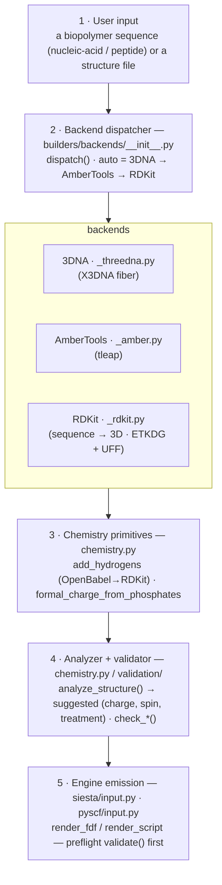
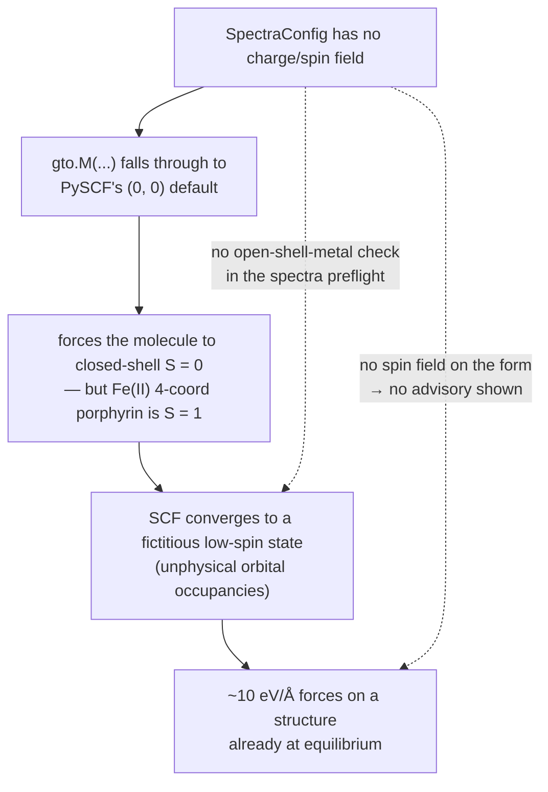
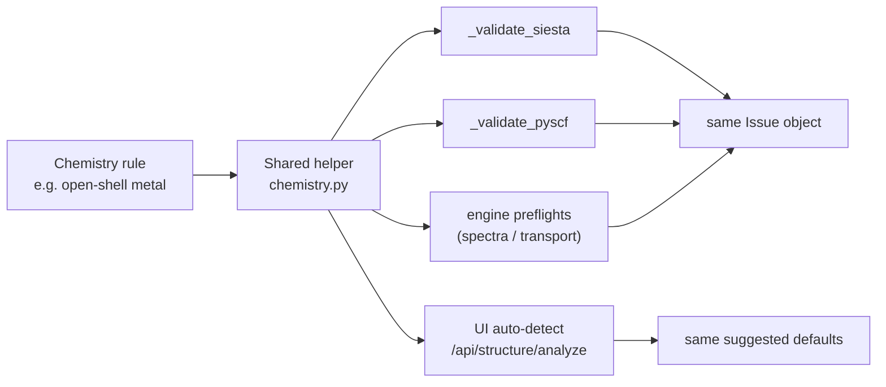

# Chemistry correctness — the control surface, end to end

**Role:** contract
**Domain:** science
**Companions:** [`validation.md`](?doc=science/validation.md) (the runtime
machinery that *runs* these checks — analyzer, adapters, consumers);
[`model/chemistry.md`](?doc=model/chemistry.md) (the L1 charge/protonation/
`add_hydrogens` helpers); `overview.md` (the science contract + the full
validation-check catalog — composed last, named not linked yet); `pseudopotentials.md`
(the heavy-atom pseudo/basis pass); the engine emitters (`engines/{siesta,pyscf,builders}.md`).

This is where to start when asking **"is molbuilder's chemistry right?"** It walks
the path a structure takes from *"user types a sequence"* to *"engine emits a
script,"* names every point where the chemistry could be wrong, and states the
one pair of inputs that causes almost all silent errors: **`(charge, spin)`**.

The deep machinery lives in `validation.md`; this doc is the **map + the science
+ the audit checklist**.

---

## 1. The control surface — five points where chemistry can go wrong

A structure flows through five control points between user input and engine
emission. Each is a *"could be wrong here"* location an audit must verify.


```mermaid
flowchart TB
    U["1 · User input<br/>a biopolymer sequence (nucleic-acid / peptide) or a structure file"]
    D["2 · Backend dispatcher — builders/backends/__init__.py<br/>dispatch() · auto = 3DNA → AmberTools → RDKit"]
    subgraph B["backends"]
        T["3DNA · _threedna.py<br/>(X3DNA fiber)"]
        A["AmberTools · _amber.py<br/>(tleap)"]
        R["RDKit · _rdkit.py<br/>(sequence → 3D · ETKDG + UFF)"]
    end
    C["3 · Chemistry primitives — chemistry.py<br/>add_hydrogens (OpenBabel→RDKit) · formal_charge_from_phosphates"]
    AN["4 · Analyzer + validator — chemistry.py / validation/<br/>analyze_structure() → suggested (charge, spin, treatment) · check_*()"]
    E["5 · Engine emission — siesta/input.py · pyscf/input.py<br/>render_fdf / render_script — preflight validate() first"]
    U --> D --> B --> C --> AN --> E
```

| # | Control point | Owner | Deep doc |
|---|---|---|---|
| 1 | User input (CLI / web form) | shared dataclass dispatch | `engines/*` · `process/cli.md` |
| 2 | Backend dispatcher | `builders/backends/__init__.py` | `engines/builders.md` |
| 3 | Chemistry primitives (H + charge) | `chemistry.py` | [`model/chemistry.md`](?doc=model/chemistry.md) |
| 4 | Analyzer + per-engine validators | `chemistry.py` · `validation/` | [`validation.md`](?doc=science/validation.md) |
| 5 | Engine emission + pre-emit validate | `siesta/input.py` · `pyscf/input.py` | `engines/{siesta,pyscf}.md` |

The user doesn't pick a backend — they choose `--backend auto` (or accept the
form default) and `dispatch(kind, sequence, *, backend="auto", …)`
(`builders/backends/__init__.py:105`) runs the cascade **3DNA → AmberTools →
RDKit** (first-available wins). `available_backends()` (`:65`) reports what's
installed; `auto_backend_name()` (`:91`) reports what `auto` would pick (or
`None` if nothing is available).

---

## 2. Spin + charge — the most error-prone pair of inputs

For **any** DFT/HF calculation (density-functional theory / Hartree-Fock — the two
quantum-chemistry methods molbuilder emits inputs for), `(charge, spin)` together
define the *electronic state* — how many electrons there are and how their spins
are arranged. Wrong values give the wrong electronic structure, which shows up as
huge forces, non-convergence, or — worst — **the SCF (the iterative solve at the
heart of DFT/HF) silently converging to a fictitious state that looks reasonable
but is the wrong minimum**. The 2026-05-22 hemeC-dithiol incident (§ 2.3) was
exactly this. *(Cross-cutting terms — SCF, open/closed-shell, 2S, parity — are in
the [`overview.md` glossary](?doc=science/overview.md).)*

### 2.1 Why it's easy to get wrong

- **The defaults look innocent.** `charge=0, spin=0` (closed-shell singlet)
  works for ~90 % of organic molecules — but *any* structure containing Fe / Mn
  / Co / Ni / Cu / Mo / W (open-shell transition metals) is in the other 10 %.
- **The spin convention varies across codes** — off-by-one is easy:

  | Code | What "spin" means |
  |---|---|
  | **PySCF** | `spin = 2S = n_unpaired` (**not** multiplicity 2S+1) |
  | **SIESTA** | `SpinPolarized` (bool) + `Spin.Total` in μ_B |
  | ORCA / Gaussian | multiplicity = 2S+1 |

  For a **triplet** (2 unpaired electrons, 2S = 2) the two engines molbuilder
  emits look like this — same physics, different spelling:

  ```python
  # PySCF (.py):     mol = gto.M(..., charge=0, spin=2)   # spin is 2S
  # SIESTA (.fdf):   SpinPolarized  .true.
  #                  Spin.Fix       .true.
  #                  Spin.Total     2.0                    # in μ_B
  ```

- **Wrong `(charge, spin)` often *does* converge SCF** — just to a different
  electronic state with different energy / forces / HOMO-LUMO ordering (the
  highest-occupied / lowest-unoccupied molecular-orbital gap), and no obvious
  error message.
- **The "right" spin depends on coordination chemistry, not just element
  identity.** *Coordination* = how many atoms bond directly to the metal; *axial
  ligands* sit above/below the flat ring; a *strong-field* ligand splits the
  metal's d-orbitals more, which favours pairing electrons up (low spin). For the
  same Fe(II) ion the ground-state spin swings across the whole range:

  | Coordination | Axial ligand field | Spin state | Unpaired e⁻ | Example |
  |---|---|---|---|---|
  | 4-coordinate | none | intermediate, **S = 1** | 2 | Fe(II)-porphyrin |
  | 5-coordinate | one weak | high, **S = 2** | 4 | deoxy-heme |
  | 6-coordinate | two strong-field | low, **S = 0** | 0 | oxy- / CO-heme |

  There is no general formula — it depends on the experimental data, which is why
  molbuilder *suggests* a spin and asks the user to verify rather than deciding
  silently. (In molbuilder's `2S` convention these are `spin = 2`, `4`, `0`.)

### 2.2 The chemistry primitives molbuilder provides (backend surface)

Pure helpers in `molbuilder/chemistry.py` (+ `validation/chemistry.py`), each
engine-agnostic and side-effect-free:

| Helper | Line | What it catches |
|---|---|---|
| `total_electrons(struct, charge=0)` | `chemistry.py:166` | Σ Z − charge (raises on an unknown element symbol) |
| `check_spin_charge_parity(struct, charge, spin)` | `:186` | spin=0 needs even electron count, spin=1 odd, … — PySCF raises this at *run* time; we catch it pre-emission for a clearer message |
| `detect_open_shell_metals(struct)` | `:470` | the open-shell transition metals present (empty for pure organics) |
| `explain_metal_spin(element, spin)` | `:282` | one-line meaning of e.g. `(Fe, spin=4)` → "Fe(II) high-spin, S=2, 4 unpaired (deoxy-heme)" |
| `suggest_spin_total(metals)` | `:371` | `(preferred, alternatives)` — ranked (spin, rationale) choices per metal; feeds the SIESTA validator's suggestion (`validation/siesta.py:289`; the literal spin-*sweep* template is emitted in `siesta/input.py`). *(The analyzer builds its own `metal_hints` from `_metal_hint`, `chemistry.py:714`.)* |
| `check_open_shell_metal(struct, *, is_closed_shell, engine_label)` | `validation/chemistry.py:113` | the cross-engine guard: warns when an open-shell-recommended structure is paired with a closed-shell SCF (PySCF `RKS`/`RHF` + `spin=0`; SIESTA `spin_polarized=False`) — the **same** warning regardless of engine |

```python
from molbuilder.chemistry import (
    total_electrons, check_spin_charge_parity, detect_open_shell_metals,
    explain_metal_spin,
)

n_e = total_electrons(struct, charge=0)          # e.g. 258 for a hemeC fragment
err = check_spin_charge_parity(struct, charge=0, spin=2)   # None if OK, else a message str
metals = detect_open_shell_metals(struct)        # ["Fe"]
print(explain_metal_spin("Fe", 2))               # "Fe(II) intermediate-spin, S=1 …"
```

The analyzer (`analyze_structure`) composes these into one `ChemistryAnalysis`
recommendation — the single object every science-aware surface then consumes:

```python
>>> from molbuilder.chemistry import analyze_structure
>>> a = analyze_structure(hemeC_dithiol)      # an Fe-porphyrin with two thiol arms
>>> a.metals, a.suggested_treatment, a.suggested_spin
(['Fe'], 'open', 2)          # Fe is open-d → open-shell; analyzer default 2S = 2
>>> a.suggested_charge
0
>>> a.rationale              # human-readable, shown next to the Auto-detect button
'Detected open-shell metal Fe → open-shell DFT, 2S = 2 (Fe(II) intermediate-spin,
 4-coordinate porphyrin). Verify against your experimental data — the right spin
 depends on axial coordination, not just element identity.'          # illustrative
```

The same `a` drives both the pre-fill (forward) and the Generate-time check
(reverse) — see [`validation.md`](?doc=science/validation.md) for how that one
result reaches every engine. *(The `2` here is the **analyzer's** default; the
SIESTA spin-sweep starts higher, at `suggest_spin_total(["Fe"]) → 4.0`
high-spin — two intentionally different starting bets.)*

### 2.3 Post-mortem: hemeC-dithiol (2026-05-22)

The bug surfaced when the user ran hemeC-dithiol (an Fe-**porphyrin** — the flat
macrocyclic ring that cages the iron in heme — with two **thiol** (–SH) side
chains) through PySCF spectra. It was a chain of small gaps that lined up — each
link is now broken (§ 2.5):


```mermaid
flowchart TD
    A["SpectraConfig has no charge/spin field"] --> B["gto.M(...) falls through to<br/>PySCF's (0, 0) default"]
    B --> C["forces the molecule to closed-shell S = 0<br/>— but Fe(II) 4-coord porphyrin is S = 1"]
    C --> D["SCF converges to a fictitious low-spin state<br/>(unphysical orbital occupancies)"]
    D --> E["~10 eV/Å forces on a structure<br/>already at equilibrium"]
    A -.->|"no open-shell-metal check<br/>in the spectra preflight"| D
    A -.->|"no spin field on the form<br/>→ no advisory shown"| E
```

- **Symptom** — forces ~10 eV/Å on a structure already near experimental
  equilibrium.
- **Root cause** — `SpectraConfig` had no `charge` / `spin` fields, so the
  spectra script's `gto.M(...)` (PySCF's molecule constructor, emitted by
  `_emit_build_mol`, `spectra/pyscf_script.py:532`) silently used PySCF's `(0, 0)`
  default. Fe(II) in
  a 4-coordinate porphyrin (no axial ligands within bonding distance in the
  user's geometry) is intermediate-spin S=1 (`spin=2`), not closed-shell S=0. The
  SCF converged to a fictitious low-spin state with unphysical orbital
  occupancies — hence the enormous gradient.
- **What enabled the silent failure** — three compounding gaps: (1) the config
  field didn't exist; (2) the spectra engine's preflight had its *own* check list
  that omitted the open-shell-metal rule (it ran only from Build's
  `render_script`); (3) the user had no form field to specify spin. Silent wrong
  default + no input surface + no surfaced advisory = the worst combination.
- **Fixes that landed** — `charge` + `spin` added to `SpectraConfig`
  (`config/spectra.py:190`, `:204`) with help text that enumerates the common
  Fe(II) / Fe(III) spin combinations (`:210-218`) so the user has a starting
  point without reading the literature; emitted in the script's `gto.M(...)`; the
  open-shell-metal check added to **both** `_validate_pyscf` and `_validate_siesta`
  (via the shared `check_open_shell_metal`) **and** the spectra preflight — triple
  coverage; and `total_electrons` / `check_spin_charge_parity` /
  `explain_metal_spin` promoted to standalone helpers for any future engine.

### 2.4 The cross-engine consistency rule

**Any** scientific check that depends on chemistry (charge / spin / coordination
/ basis suitability) MUST live in a shared helper called from **both**
`_validate_siesta` and `_validate_pyscf` — same physical facts, same warning.
Don't duplicate a check inline in one validator and forget the other.


```mermaid
flowchart LR
    A["Chemistry rule<br/>e.g. open-shell metal"] --> H["Shared helper<br/>chemistry.py"]
    H --> VS["_validate_siesta"]
    H --> VP["_validate_pyscf"]
    H --> EP["engine preflights<br/>(spectra / transport)"]
    H --> AD["UI auto-detect<br/>/api/structure/analyze"]
    VS --> R["same Issue object"]
    VP --> R
    EP --> R
    AD --> R2["same suggested defaults"]
```

This is structural, not aspirational: every science-aware surface consumes the
same `ChemistryAnalysis` instance and cannot disagree by construction. The
machinery — the dataclass, the adapter registry, the rule that adapters must not
re-do detection — is in [`validation.md`](?doc=science/validation.md) §§ 2–4.

### 2.5 Auto-detect as a scientific guard (frontend surface)

The analyzer isn't just a defaults convenience. By consuming the same
`ChemistryAnalysis` as the validator, the **Auto-detect** button surfaces the
same warning the validator would emit at Generate time — but at structure-**load**
time, when the user can still act on it cheaply. A user with hemeC-dithiol now
sees, *before* generating:

> "Detected open-shell metal Fe. Suggesting spin=2 (Fe(II), intermediate).
> Verify against your experimental data — the right spin depends on axial
> coordination, not just element identity."

Each link of the 2026-05-22 chain is now broken: the silent default → an explicit
pre-fill carrying rationale; the missing input surface → charge/spin/method on
both engine sub-forms; the absent advisory → the analyzer's `rationale` +
`warnings`, shown next to the button and again at validate-time if overridden.
The chip that renders this reads `suggested_treatment` straight off the
`/api/structure/analyze` response — see [`validation.md`](?doc=science/validation.md)
§ 4 for the forward/reverse split.

---

## 2a. The electronic state — one answer per calculation *(decided 2026-09-25)*

> **Status: CONTRACT, not yet built.** Decided by the user on 2026-09-25 ("go
> with your recommendations on all seven", plan W34, § 5s.2, decisions 1–7). Where this
> section and the code disagree, the code is behind and plan W34 names the
> phase that closes the gap.

Five failures, all live on one day, all the same defect:

* a formate ion prepared at `NetCharge -1` (24 electrons, closed shell) was told
  to switch to open-shell, because the check counted electrons as if the charge
  were 0;
* a bulk gold electrode (27 atoms, 2133 electrons per cell) was told to switch
  to open-shell, because an odd count per *cell* was read as an unpaired
  electron;
* the Auto-detect button wrote `net_charge = 0` over a blank charge — which
  switches the phosphate detection off — and `spin_total = 0` beside a
  non-polarized treatment;
* a transport calculation citing a relaxation started non-polarized whatever
  the relaxation had run, under a caption saying the values came from it;
* nothing read back what charge and spin the engine had actually used.

Each layer read the raw fields — `net_charge`, `spin_treatment`, `spin_total`,
`spin`, `method` — and interpreted them itself. **The fix is one answer, stated
once, that every layer reads.**

### 2a.1 What it is: four items, and what the structure adds

The electronic state of a calculation is **four template items**, each asking
one engine-neutral question (`engines/template.md` § 6.3: *one question, one
item — the spelling is the generator's*):

| item | the question | values | SIESTA writes | PySCF writes |
|---|---|---|---|---|
| `net_charge` | how many electrons short (+) or extra (−), in \|e\| | an integer; **blank = auto** (the phosphate rule, `model/chemistry.md`) | `NetCharge ±N` (nothing at 0) | `gto.M(charge=N)` |
| `spin_treatment` | how the two spin channels are solved | `restricted` · `restricted-open` · `unrestricted` · `non-collinear` · `spin-orbit` | `Spin non-polarized` · *(not offered)* · `Spin polarized` · `Spin non-colinear` · `Spin spin-orbit` | the `R` · `RO` · `U` of the SCF class · *(not offered)* · *(not offered)* |
| `unpaired_electrons` | 2S = N↑ − N↓ — **not** the multiplicity 2S+1 | an integer ≥ 0; **blank = the moment floats** | `Spin.Fix .true.` + `Spin.Total N`; blank writes neither | `gto.M(spin=N)`; blank is refused — PySCF always pins it |
| `method` | which theory | `DFT` · `HF` | *(SIESTA is DFT)* | `dft.` · `scf.` |

So PySCF's class is **composed, and written explicitly**: `dft.UKS(mol)` is
`method = DFT` with `spin_treatment = unrestricted`; `scf.ROHF(mol)` is `HF` with
`restricted-open`. molbuilder never writes a class and lets PySCF re-rule it —
`dft.RKS(mol)` with `mol.spin != 0` silently becomes ROKS inside PySCF
(`pyscf/dft/__init__.py`), and that is a setting that changes without a word.

To those four the structure adds three facts, and **one resolver computes all of
it once**, `chemistry.electronic_state(struct, cfg) → ElectronicState`:

* **the charge, resolved, and where it came from** — stated in the template, the
  phosphate rule, or the run the calculation cites;
* **the electron count**, ΣZ − charge (the parity of the valence count is the
  same: core shells hold an even number);
* **finite or repeating** — every axis isolated, or at least one periodic or
  transport axis (`model/structure-periodicity.md` § 2).

The deck writers, the checks, the hand-over, the forms and the read-back all
read this one object. There is no second vocabulary to translate into: the
analyzer suggests in these items' own words, which is what retires the
per-engine spin translation in the adapters (`validation.md` § 3).

### 2a.2 The rules

**ES1 · It belongs to the calculation, never to a stage.** A stage override of
any of the four is refused by name. Every rung's warm files — SIESTA's `.DM`,
PySCF's `.chk` — are a density for one electronic state, and a ladder that
changes the state carries a density for the wrong one into the next rung with
nothing to say so.

**ES2 · The charge resolves once, and says how.** Explicit wins (0 included);
blank runs the phosphate rule. The resolved value and its source travel with
the state, so a report can say *"−3 (three deprotonated phosphates)"* rather
than a bare number.

**ES3 · Parity binds a finite system only.** An odd electron count in a molecule
needs at least one unpaired electron. In a repeating cell it does not: the count
per cell is odd, the band is partly filled, and bulk gold — one s-electron per
atom — is non-magnetic. Parity is not asked of a structure with a periodic or
transport axis.

**ES4 · What an engine can run is declared, not discovered** (§ 2a.3). A choice an
engine cannot run for this kind is refused by name at the settings gate, never
left to fail on the node.

**ES5 · Restricted means closed-shell.** `restricted` with `unpaired_electrons >
0` is refused, naming both ways out: `restricted-open` (spin-pure, one set of
spatial orbitals) and `unrestricted` (the channels relax separately).

**ES6 · A blank count means the moment floats — where it can.** Only SIESTA can
float it (`Spin polarized` without `Spin.Fix`). PySCF pins N↑ and N↓ from
`mol.spin` (`pyscf/scf/uhf.py`, `get_occ`), so a PySCF calculation must state a
count; UKS at `unpaired_electrons = 0` is a *constrained* singlet, not a free
moment.

**ES7 · The state travels with the run it starts from.** A follow-on calculation
defaults to the state of the run it builds on — a transport calculation to its
cited relaxation (read from that deck), a vibration to the relaxation record of
the structure it was handed — and a difference is warned, because a frequency or
a transmission at a geometry optimised for another electronic state is usually a
mistake and occasionally the point (a vertical ionisation). **A transport
calculation refuses a cited run that carried a net charge**: its boundaries are
open and the junction must be neutral (`engines/transport.md` § 2a.7).

**ES8 · Auto-detect proposes; it never overwrites.** It fills only fields still at
their default. A blank charge stays blank (auto); a pin is never written beside a
restricted treatment; the person's HF or DFT choice is kept.

**ES9 · One fact, one finding.** The parity check and the open-shell
recommendation are one family. When the count and the spin disagree, that is
reported once — the recommendation does not restate it (`validation.md` § 7).

**ES10 · What ran is read back.** After a run the engine's own account of the
state is recorded, compared with what was asked, and shown: SIESTA's
`redata: Net charge of the system`, its fixed or converged spin moment; PySCF's
`mol.charge`, `mol.spin`, the SCF class it built, ⟨S²⟩ for an unrestricted run
and the stability outcome; TBtrans's spin channels. A difference between asked
and used is a finding, not a footnote.

### 2a.3 What each engine can run — the capability table

Declared here, enforced at the settings gate (ES4). Every entry is read from the
engine's source, not from a manual's prose.

| `spin_treatment` | SIESTA optimization · vibration · transport | PySCF optimization · single point | PySCF vibration |
|---|---|---|---|
| `restricted` | ✅ | ✅ | ✅ |
| `restricted-open` | ❌ SIESTA has no restricted open-shell formalism | ✅ ROHF/ROKS gradients exist (`pyscf/grad/rohf.py`, `roks.py`) | ❌ **no analytic ROHF/ROKS Hessian** — `pyscf/hessian/` holds `rhf`, `rks`, `uhf`, `uks` only, and the vibration deck uses the analytic Hessian |
| `unrestricted` | ✅ (`Spin polarized`) | ✅ | ✅ |
| `non-collinear` | ✅ — but a pinned count is refused: SIESTA `die()`s on `Spin.Fix` here (`read_options.F90`) | ❌ not offered | ❌ |
| `spin-orbit` | ✅ — needs fully-relativistic pseudopotentials; a pinned count refused as above | ❌ | ❌ |

A blank `unpaired_electrons` (a floating moment) is offered with SIESTA's
`unrestricted` only (ES6).

### 2a.4 How each engine reads what molbuilder writes

Verified against the engines' own source, 2026-09-25 — the facts every rule
above leans on:

| engine | fact | where it is decided |
|---|---|---|
| SIESTA | electrons = valence − `NetCharge`, so `NetCharge -1` adds one | `siesta_init.F` |
| SIESTA | a charged cell gets a uniform compensating background | the Poisson solve |
| SIESTA | **SIESTA applies the Makov–Payne monopole correction itself** — only when it classifies the system as an atom or molecule **and** the cell is simple, face-centred or body-centred cubic; otherwise it prints *"Energy correction terms can not be applied"* and adds nothing. The term is in the total energy and printed as `siesta: Emadel` | `madelung.f`, `m_energies.F90`, `write_subs.F` |
| SIESTA | `Spin.Total` is read only when `Spin.Fix` is true, and splits the electrons N↑ = (N + Spin.Total)/2 — so it is the count of unpaired electrons | `read_options.F90`, `siesta_init.F` |
| SIESTA | `Spin.Fix` with non-collinear or spin-orbit spin stops the run | `read_options.F90` |
| SIESTA | a polarized run with no initial moments given starts **every atom at its maximum atomic moment, aligned** (ferromagnetic), not at zero | `m_new_dm.F90` |
| SIESTA | an odd electron count with `Spin non-polarized` runs: the top level is half filled under the electronic temperature — a restricted description of a radical, not an error | occupation by smearing |
| PySCF | `mol.spin` is 2S = N↑ − N↓; a count and a spin of different parity is refused when the molecule is built | `gto/mole.py` |
| PySCF | `dft.RKS` / `scf.RHF` with `mol.spin != 0` return ROKS / ROHF | `dft/__init__.py`, `scf/__init__.py` |
| PySCF | UKS/UHF occupy exactly N↑ and N↓ from `mol.nelec`; a floating moment needs smearing with `fix_spin=False` | `scf/uhf.py`, `scf/smearing.py` |
| PySCF | ROHF/ROKS have gradients and no analytic Hessian | `grad/`, `hessian/` |
| TBtrans | a spin-polarized run writes one file per channel: `<label>.TBT_UP.AVTRANS_*` and `<label>.TBT_DN.AVTRANS_*` | `m_tbt_save.F90` |

### 2a.5 Where the state is read

| consumer | reads | today (2026-09-25) |
|---|---|---|
| the deck writers | the four items, through the state | read the raw fields; PySCF's class is spelled from `method` alone |
| the settings gate | parity (finite only), the treatment against the analyzer's recommendation **for this charge and this periodicity**, the capability table, the charged-species checks keyed on the axis kinds | parity uses the run's charge on PySCF, and on SIESTA only when the charge is typed; the recommendation uses charge 0 and ignores periodicity |
| the hand-over | the cited deck's `NetCharge` / `Spin` / `Spin.Total`; the relaxation record's state | neither is read; transport's spin starts at the class default |
| the forms | Auto-detect fills defaults only; the chip describes the charge on the form | Auto-detect overwrites; the chip never reads the charge |
| the read-back | the engine's own account (ES10) | nothing is parsed |

## 2b. Species with charge and spin — what each needs

The rules above are the mechanism. This is what they are FOR: the kinds of
system whose charge or spin is not *neutral, closed-shell*, what the physics
asks of each, and what molbuilder does about it.

### Closed-shell neutral molecules

Even electron count, `unpaired_electrons = 0`, `restricted`. The default, and
right for most organic molecules. Nothing here is special — which is why a
default that is silently applied to the other cases below is dangerous.

### Closed-shell ions — carboxylates, ammonium, phosphates, zwitterions

Even electron count **at their charge**: formate HCOO⁻ has 23 electrons neutral
and 24 at −1, a closed shell. So parity and the open-shell recommendation are
asked at the resolved charge (ES2, ES3), or every odd-charged closed-shell ion is
told to go open-shell.

* **The charge.** Auto-detected only for backbone phosphates (one −1 per
  deprotonated phosphate). A peptide's charged side chains are *not* detected —
  the builder makes the gas-phase neutral form — and are flagged
  (`config.net_charge`); a SMILES or PDB ion must state its charge.
* **In a periodic code (SIESTA).** The cell carries a compensating background,
  and the energy an image-charge error that decays only as 1/L. SIESTA corrects
  it itself for a molecule in a cubic cell (§ 2a.4) and not otherwise; molbuilder's
  `makov_payne_correction.py` must add only what SIESTA did not — it reads
  `siesta: Emadel` first (plan W34). The vacuum is judged against 25 Å per side
  rather than 8.
* **In a gas-phase code (PySCF).** No images, no correction. An anion needs
  diffuse basis functions (`aug-`, or def2 `…D`) — without them the extra
  electron is squeezed into valence orbitals — and a gas-phase anion can have an
  unbound top orbital, which implicit solvent (PCM) repairs.
* **The dipole** of an ion depends on the origin; molbuilder takes it about the
  centre of mass (§ D8 of plan W33).
* **Infrared strengths.** With a fixed origin the dipole's *derivative* does not
  depend on where the origin is, and a vibration with every atom free keeps the
  centre of mass still, so an ion's band strengths are well defined. With atoms
  held, the free atoms' motions move the centre of mass, and an ion's strength
  then carries a term of its charge times that motion — reference-dependent,
  not vibrational. That is the case to treat with suspicion
  (`science/normal-modes.md` § 4a.5).

### Radicals — odd-electron molecules, neutral or ionic

At least one unpaired electron, by parity. Two ways to solve it, now both
explicit (ES5):

* `unrestricted` — the two channels relax separately and capture spin
  polarization; the price is spin contamination, which the read-back reports as
  ⟨S²⟩ against S(S+1).
* `restricted-open` — spin-pure, but its orbital energies depend on a
  convention (the canonicalization), so a reported HOMO/LUMO is not unique; and
  PySCF cannot take its analytic Hessian, so a vibration refuses it (§ 2a.3).

On SIESTA a radical run `non-polarized` does not fail — its top level is half
filled (§ 2a.4) — which is exactly why the recommendation warns.

### Even-count open shells — triplet O₂, carbenes, biradicals

Parity cannot see them: the count is even and the ground state is not a singlet.
The person states `unpaired_electrons` (2 for a triplet). A broken-symmetry
(antiferromagnetic) singlet is `unrestricted` with a count of 0 — on SIESTA a
constrained singlet, and one that starts from SIESTA's default *ferromagnetic*
guess (§ 2a.4), so reaching the broken-symmetry state may need initial moments
molbuilder does not yet expose.

### Open-d transition-metal complexes — Fe, Co, Ni, Mn, …

Open-shell, and **which** spin is a matter of coordination, not element
(§ 2.1). The analyzer suggests a count per element (Fe → 2) and says to verify
it; the SIESTA deck carries a commented sweep over the plausible counts. A
polarized SIESTA run with no count starts every atom at its maximum moment
(§ 2a.4) — a reasonable start for a high-spin centre, a poor one for a low-spin
one.

### Noble-metal clusters, surfaces and junctions — Cu, Ag, Au

Closed-shell in any extended metallic context: the s-band delocalises and the
Stoner criterion fails (`validation.md` § 2.1). A *finite* cluster of four or
more atoms with an even count is closed; an odd count is a genuine unpaired
electron. **In a repeating cell** — a surface, a lead, a junction — parity does
not apply (ES3) and the answer is closed whatever the count per cell.

### Periodic metals and semiconductors

The count per cell says nothing about magnetism (ES3). A magnetic element (Fe,
Co, Ni) wants `unrestricted` with k-sampling, usually with the moment left to
float (ES6); a non-magnetic metal wants `restricted`.

### Charged periodic systems — charged slabs, charged defects in a crystal

The background charge makes the energy of a charged cell non-comparable with a
neutral one, and SIESTA's own correction does not apply (§ 2a.4: not a molecule
in a cubic cell). A point-charge correction in a cubic box is the wrong formula
here, so molbuilder does not offer one: it says the energy needs a
defect-specific treatment and leaves it to the person.

### Transport junctions

Neutral by construction: the boundaries are open and the leads' chemical
potentials set the electron number (`engines/transport.md` § 2a.7), so a net
charge is refused — on the template, and on the run it cites (ES7). The spin is
one answer shared by all five rungs, defaulted from the cited relaxation. A
spin-polarized junction transmits in two channels (§ 2a.4), which the transport
record reads as two, and `tbt_spin` chooses which one TBtrans reports.

---

## 3. Audit checklist — what to verify at each control point

When reviewing chemistry correctness in a PR, a refactor, or a structural audit,
walk these in order (the "scientific correctness" audit dimension lives here):

**3.1 At the dispatcher** — `available_backends()` reports installed backends
correctly (`tests/test_backends.py:31::test_available_backends_returns_dict_of_bools`);
`auto_backend_name()` returns the highest-priority available backend; adding a
backend doesn't break the cascade (3DNA still wins for DNA when present).

**3.2 At the backend** — each backend strips/re-adds hydrogens consistently with
the shared `add_hydrogens` (X3DNA's raw output has stylised hydrogens that need
replacement); AmberTools/tleap runs the methylene-hydrogen fix
(`_fix_methylene_hydrogens`, `builders/backends/_amber.py:174`); RDKit builds the
polymer from the one-letter sequence (`MolFromSequence`), adds Hs with plain
`Chem.AddHs`, embeds a conformer with ETKDGv3, and minimises with **UFF** — MMFF
lacks parameters for nucleic acids (`builders/backends/_rdkit.py:86-106`).

**3.3 At the chemistry primitives** — `add_hydrogens` runs **once** per structure
(never twice, never skipped): the nucleic-acid builder gate `_maybe_add_hydrogens`
(`nucleic.py:312`) skips it when the structure is already protonated
(`tests/test_nucleic.py::test_maybe_add_hydrogens_auto_skips_already_protonated`)
and forces it when it isn't. (`add_hydrogens` normalises protonation via
OpenBabel→RDKit, rebuilding the structure through a PDB round-trip; only the
no-engine fallback returns the input unchanged, with a `RuntimeWarning` — see
[`model/chemistry.md`](?doc=model/chemistry.md).)
`formal_charge_from_phosphates` matches the user-stated charge for canonical
DNA/RNA inputs.

**3.4 At the analyzer** — `analyze_structure` is deterministic for the same input
(no I/O, no global state:
`tests/test_chemistry_analyzer.py:236::test_analyze_structure_is_deterministic`);
the detection chip (UI) and the validator (form) read the same
`suggested_treatment` (single-analyzer rule).

**3.5 At engine emission** — `validate(struct, cfg)` runs before render in *every*
engine path (no "render that skips preflight"):
`tests/test_web.py:435,459::test_preflight_returns_issues_for_{siesta,pyscf}`;
issues carrying `workflow_group` metadata route to the correct UI card
(`tests/test_issues_workflow_group.py`).

---

## 4. What this doc does NOT cover

- **The full validation-check catalog** (min-distance / cell-volume / k-grid
  / dipole thresholds, with their scientific rationale) and the
  advisory-while-editing vs enforcing-at-generation contract → `overview.md`.
- **The "why" for each toolkit choice** (OpenBabel vs RDKit, X3DNA quirks) →
  `engines/builders.md`.
- **The per-engine validator rule set + the analyzer/adapter machinery** →
  [`validation.md`](?doc=science/validation.md).
- **The Issue → UI-card attachment rules** → `web-ui-coherence.md` (web wave).

This doc is intentionally a navigation map. A detail you're tempted to add here
probably belongs in one of the linked specialised docs.

---

## 5. Why this doc exists

A 2026-06-14 audit nearly deleted `/api/modify/load` without first verifying that
the chemistry guards weren't entangled with it (they weren't — it was a trivial
3-line wrapper). Without a stitched overview, future audits would keep hitting
the same risk: *"someone proposes deleting/refactoring something; nobody can
quickly check whether the chemistry-correctness chain touches it."* This doc is
the answer to **"where is the chain?"** — one entry point that walks the stack
with links to each layer's deep doc. When a chemistry-adjacent change is
proposed, run § 3 top-to-bottom.
