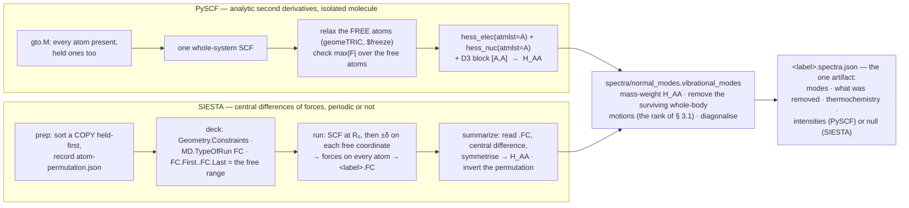
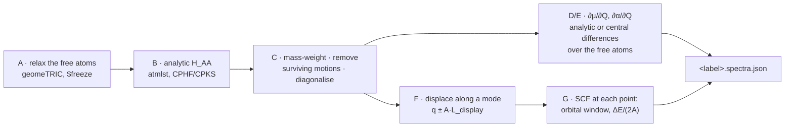
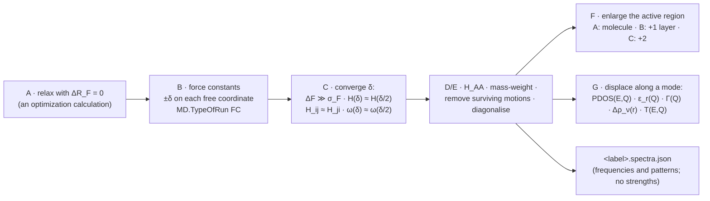

# Normal modes — what a vibrational calculation counts, and what it must remove

**Role:** contract
**Domain:** science
**Companions:** [`engines/vibration.md`](?doc=engines/vibration.md) — **the
calculation's master contract**: how each engine obtains the block this
document reasons about, the script and the deck, the result file, the
invariants the code is checked against, and what is built and owed;
[`overview.md`](?doc=science/overview.md) (the science domain's promise),
[`validation.md`](?doc=science/validation.md) (the runtime advisory machinery
that carries these rules to the user), [`web/spectra.md`](?doc=web/spectra.md)
§ 8 (what freezing an atom means to the Spectrum tab).

This document owns **one fact**: *how many of the numbers a vibrational
calculation produces are vibrations, and how the rest are identified and
removed.* Every place in the codebase that counts modes, warns about modes, or
decides what goes into a spectrum or a thermochemistry sum reads its rule from
here. Before 2026-09-21 that fact had no home, was re-derived in three places,
and was wrong in all three (§ 8).

> **Vocabulary.** *Hessian* — the table of second derivatives of the energy with
> respect to moving each atom in each direction; its eigenvalues give the
> squared vibrational frequencies. *Stationary point* — a geometry where the
> forces on the atoms vanish, which is the only place a harmonic frequency means
> anything. *Mass-weighted* — each entry of the Hessian divided by the square
> roots of the two atoms' masses, which is what turns curvature into frequency.
> Wider terms (*SCF*, *DFT*, *CPHF*) are in the
> [`overview.md` glossary](?doc=science/overview.md).

---

## 1. The problem, in one molecule

Take 1,4-benzenedithiol (BDT): a benzene ring with an `–SH` group at each end,
14 atoms. Hold the two sulfur atoms still and ask for the vibrational spectrum —
the ordinary way to study a molecule bonded to a surface, where the anchor atoms
belong to the metal and are not free to move.

The calculation returns **36 numbers**. Thirty-five of them are vibrations.
The thirty-sixth is this:

> the whole ring turning, as one rigid body, about the line through the two
> sulfur atoms.

Nothing stretches, nothing bends, no bond changes length. The sulfurs sit *on*
that line, so holding them still does not prevent the turn. It costs no energy,
it is not a vibration, and it must not appear in a spectrum or in a
thermochemistry sum.

Measured (RHF/STO-3G, at the relaxed geometry): that mode comes out at
**−0.93 cm⁻¹** and accounts for **100.0 %** of the turning motion, while the
other 35 modes account for 0.0 % between them. It is one clean, spurious entry.

**The rule this document states** is what decides that the number is one — not
zero, not six.

---

## 2. Background — why a free molecule has 3N − 6 vibrations

An N-atom molecule has **3N** coordinates: an x, y and z for every atom.

Not all of them are vibrations, because some ways of moving the atoms do not
change the energy at all. Slide the whole molecule a centimetre to the left and
nothing about it is different — the energy is identical. Turn the whole molecule
around and, again, nothing is different. There are six such motions:

| motion | how many | why the energy does not change |
|---|---|---|
| translation | 3 (x, y, z) | empty space looks the same everywhere |
| rotation | 3 (about x, y, z) | empty space looks the same in every direction |

Each of these is a direction in which the energy has **zero curvature**, so the
mass-weighted Hessian has six zero eigenvalues. What is left is the vibrations:

```text
    n_vib  =  3N - 6
```

**The linear exception.** A straight molecule — CO₂, HCN, any diatomic — has
only two rotations that do anything. Spinning it about its own long axis moves
no atom at all, so that "motion" is not a motion; the direction is the zero
vector rather than a zero-curvature direction. Such a molecule has

```text
    n_vib  =  3N - 5
```

This is the standard treatment [Wilson1955]; the separation of vibration from
rotation is due to Eckart [Eckart1935].

**How it is done in practice.** You do not count — you *remove*. Write the six
motions out as explicit vectors at the current geometry, project them out of the
Hessian, and diagonalise what remains. PySCF's `harmonic_analysis` does exactly
this, and molbuilder's all-atoms-free path calls it:

```python
TR = _get_TR(mass, atom_coords)            # the six motions, from coordinates
q, r  = numpy.linalg.qr(TRspace.T)
P     = numpy.eye(natm*3) - q.dot(q.T)     # project them out ...
h     = reduce(numpy.dot, (bvec.T, h, bvec))
force_const_au, mode = numpy.linalg.eigh(h)   # ... THEN diagonalise
```

Two things to notice, because both matter later. The six vectors are built from
**coordinates alone** — no chemistry, no bond list, nothing a user supplies. And
the choice between 5 and 6 is made **numerically**, from the molecule's moments
of inertia, not from a flag.

---

## 3. The rule when some atoms are held still

Freezing atoms changes the question, and the usual answer `3N − 6` stops
applying. Call the held atoms **F** and the free atoms **A**. The calculation
now builds the Hessian block for the free atoms only and diagonalises that — a
**partial Hessian**, introduced by Head for adsorbates on surfaces [Head1997]
and named by Li & Jensen [LiJensen2002].

**Which method this is, among several.** Freezing part of a system is a family,
not one technique, and the members differ in what they do with the held part
[Tao2021]:

| method | what the held part is |
|---|---|
| **partial Hessian (PHVA)** — *what molbuilder does* | infinitely heavy: it does not move at all [Head1997, LiJensen2002, Besley2008] |
| mobile block Hessian (MBH) | a **rigid block of finite mass**, free to translate and rotate as a unit [Ghysels2007] |
| vibrational subsystem analysis (VSA) | its mass effect is averaged in adiabatically |
| generalised subsystem vibrational analysis (GSVA) | the subsystem's intrinsic modes, environment folded in [Tao2021] |

Naming this matters because the count in this section is **PHVA's count**. MBH
lets the held block move, so its bookkeeping is different, and a rule copied
between the two would be wrong in one of them.

**And the block that is sliced is the block of the full energy.** Besley &
Bryan put it exactly: the derivatives *"are computed for the adsorbate-molecule
system, and hence the interaction with the surface is included explicitly"*
[Besley2008]. The free atoms feel the held ones; what is dropped is only how
held-atom *motion* would couple back, and they do not move. So `H_AA` below is
the free–free block of the true Hessian, not of some isolated fragment.

**The honest cost of the approximation**, stated once so no one has to discover
it: every method in the table above shares *"the unphysical partitioning of the
full Hessian matrix, which causes information loss about the interaction between
the subsystem and its environment"* [Tao2021]. Freezing buys a smaller problem
and pays for it in accuracy. This document governs the **counting**, which must
be right whatever one thinks of the approximation.

There are `3N_A` numbers.

How many are not vibrations? The reasoning is three lines.

**Step 1 — which whole-body motions are still available?** Only those that leave
every held atom exactly where it is. Sliding the molecule sideways moves the
held sulfurs, so it is not available. Turning it about the line through both
sulfurs does not move them, so it is.

**Step 2 — such a motion is still a zero of the partial Hessian.** Write the
motion as a displacement `u` over all `3N` coordinates. Because it leaves the
held atoms alone, `u_F = 0`, and the energy change reduces cleanly:

```text
    uᵀ H u  =  u_Aᵀ H_AA u_A  +  2 u_Aᵀ H_AF u_F  +  u_Fᵀ H_FF u_F
                                          ↑                ↑
                                       both zero, because u_F = 0

            =  u_Aᵀ H_AA u_A
```

The left side is zero because the whole-body motion costs no energy. So the
right side is zero too: `u_A` is a zero mode of exactly the block the
calculation diagonalises.

**Step 3 — count them.** The answer depends only on *where the held atoms are*,
not on how many there are:

| held atoms | whole-body motions that leave them all in place | zero modes |
|---|---|---|
| none | all six (five if the molecule is straight) | 6 (or 5) |
| one | every rotation about that atom | **3** |
| two, distinct | rotation about the line through them | **1** |
| three or more, **all on one line** | rotation about that line | **1** |
| three or more, not all on one line | none | **0** |

> **Every "1" in that table is really "1, unless the surviving turn moves no
> free atom."** Hold both oxygens of CO₂: the table says one leftover, but the
> only free atom — the carbon — sits *on* the O···O line, so the turn moves
> nothing and the answer is **0**. Hold both carbons of acetylene and the same
> happens to all four atoms. Neither case is exotic, and a reader applying the
> table by hand gets both wrong. **The rank of § 3.1 gets them right without
> being told about them**, which is the whole argument for computing rather
> than tabulating.

So the vibration count is

```text
    n_vib  =  3·N_A  -  n_rigid(F)
```

and the free-molecule formula is the same statement with no atoms held: `F` is
empty, `n_rigid = 6` (or 5), and `3N − 6` falls out. **One rule, both cases** —
which is the point, because two rules are two things that can drift apart.

### 3.1 The count, written so it cannot be got wrong

The table above is a consequence, not the rule. Writing the table into code
means writing five branches, and five branches are five chances to be wrong —
which is how the codebase came to hold three different wrong answers (§ 8). The
rule is a rank, and it has no branches:

> Let **G** be the matrix whose columns are the whole-body motions **this
> system's energy is invariant under** (§ 3.1a decides which): three
> translations — the same unit vector repeated on every atom — and the
> rotations the lattice permits: three with no lattice, one for a wire, none for
> a slab or a crystal, where the rotation column `a`, on atom `i`, is
>
> ```text
>     g_rot[a] |_i  =  ê_a × (R_i - R_c)
> ```
> Let **G_F** be the rows belonging to held atoms and **G_A** the rows belonging
> to free atoms. Then
> ```text
>     n_rigid(F)  =  rank( G_A · null(G_F) )
> ```

### 3.1a Which motions the energy is invariant under — periodic vs isolated

The six of § 2 are six only for a system floating in empty space. A **periodic**
calculation — a slab repeating sideways forever, which is how a metal surface is
modelled — has fewer:

- **Translation still costs nothing.** Move every atom by the same vector and the
  crystal is the same crystal, shifted. *(These are the three acoustic modes.)*
- **Rotation costs something.** The repeating box does not turn with the atoms.
  Rotate the contents and they no longer meet their neighbours in the next box
  the same way — a different structure, a different energy. There is no
  rotational invariance to exploit, and **no rotational null vectors to remove**.

**The rule has no cases** *(stated case-free 2026-09-23; a two-row table stood
here and got a wire wrong)*: a rotation generator is an antisymmetric matrix
`A`, and the rotation is a symmetry of the energy only if it maps every lattice
vector onto itself — `A·a = 0` for every lattice vector `a` of a `periodic`
axis. The space of such `A` has dimension **3, 1, 0, 0** for **0, 1, 2, 3**
periodic axes: no lattice leaves all three turns; a wire keeps the turn about its
own axis; a slab or a crystal keeps none. Translations are always three. So `G`
has six columns for an isolated system, four for a wire, three for a slab or a
crystal — and the table of § 3 gains these rows:

| the system | held atoms | `n_rigid` |
|---|---|---|
| periodic along one axis (a wire) | none | **4** |
| periodic along two or three axes | none | **3** |
| periodic, any number of axes | **any at all** | **0** — translation would move a held atom |

Which axes are `periodic` is the structure's own `axis_kind`, per axis — never
the boolean `pbc()`, which cannot say *which* axis repeats. An axis that
continues (`transport`) binds a turn exactly as a repeating one does.

**What "moves nothing" means, since a rank needs a tolerance.** A surviving
motion is dropped when its root-sum-square displacement of the atoms in
question, per unit motion, is below **10⁻³ Å**: a molecule bent by numerical
noise is straight, and a molecule bent by a tenth of an Ångström is not. A
tolerance of a millionth would hand a real bend to the projection on a
geometry converged to ordinary criteria; PySCF's own linearity test sits at a
moment of inertia of 5·10⁻⁶ amu·Å², the same order of off-axis distance for a
light atom. The one home is `spectra/normal_modes.py`, and the four-molecule
gate against PySCF on free molecules ([`engines/vibration.md`](?doc=engines/vibration.md)
§ 4.5) is what pins it.

**The junction case falls out as zero.** A slab with its lower layers held is the
second row: nothing survives, nothing is removed, and the spurious-mode problem
this document exists for does not arise there. It is a **molecular** problem.
That is not a reason to skip the rule for periodic systems — it is the rule
telling you, from the geometry, that there is nothing to do.

**Where the answer comes from:** the structure's own per-axis periodicity, which
molbuilder already records. It is not an engine property and must not be
inferred from which engine was picked — a molecule computed in a periodic box
and a molecule computed in free space are different models of the same molecule,
and the box is the thing that decides.

> **Do not "restore" the rotations for a molecule in a large periodic box.**
> They are near-symmetries there, broken by the box, so the corresponding
> directions are *not* exact null vectors. Removing them would delete
> directions that carry real, if small, energy — the very error § 3.1's
> caution warns about, arriving from the opposite side.

In words: first keep only the combinations of the six that do not move any held
atom (that is `null(G_F)`); then ask how many of those actually move a free atom
(that is the rank).

Check it against every row of the table:

| case | `rank(G_F)` | `dim null(G_F)` = 6 − rank | `n_rigid = rank(G_A · null)` |
|---|---|---|---|
| none held, ordinary molecule | 0 | 6 | **6** |
| none held, straight molecule | 0 | 6 | **5** — the axial rotation column is identically zero |
| none held, a lone atom | 0 | 6 | **3** — all three rotation columns vanish, so 3·1 − 3 = 0 vibrations |
| one held | 3 | 3 | **3** — or 2, if every atom lies on one line through it |
| two held, every free atom **on** their axis | 5 | 1 | **0** — the surviving turn moves nothing (CO₂ with both O held; acetylene with both C held) |
| two held | 5 | 1 | **1** |
| ≥3 collinear | 5 | 1 | **1** |
| ≥3 non-collinear | 6 | 0 | **0** |

Why `rank(G_F) = 5` for two held atoms: their three translation rows give 3, and
subtracting one atom's rotation rows from the other's leaves a `(R₁ − R₂) ×`
block, which has rank 2 — never 3, because a cross-product with a fixed vector
annihilates that vector. Adding a third held atom off the line contributes the
missing direction and takes the rank to 6.

The straight-molecule case, the lone-atom case and the collinear-anchor case all
fall out of the same rank. Nothing is special-cased, so nothing can be
special-cased *wrongly*.

**The origin `R_c` does not matter.** A rotation about a different origin differs
from one about `R_c` by a translation, and the translations are already columns
of `G`. The span is the same, so the rank is the same. Use the centre of mass,
as PySCF does, and the choice stops being a choice.

**What the rank must NOT remove — and why a blanket projection is wrong.**
There is a published warning against exactly the naive version of this fix, and
it is worth stating because the rank rule is what keeps us on the right side of
it. Vester & Olsen [Vester2024] studied partial Hessians for a molecule
surrounded by *frozen solvent* and found modes that resemble the molecule
translating and rotating as a whole — they call them **pseudotranslational and
pseudorotational**. Their conclusion is blunt: projecting out translation and
rotation, as one does for an isolated molecule, is *"invalid within the PHVA
approximation"*, because it *"can adversely affect other normal modes."*

**They are right, and the rank rule already agrees with them.** Their frozen
solvent is many atoms, not on one line, so `rank(G_F) = 6`, `null(G_F)` is empty
and `n_rigid = 0` — **nothing is projected**. The rank draws exactly the physical
distinction:

| the motion | does it move a held atom? | energy along it | what it is | what to do |
|---|---|---|---|---|
| ring turning about the S···S line, both S held | **no** | exactly unchanged | not a vibration | **project it out** |
| molecule sliding against a held slab or solvent shell | **yes** | changes, if only weakly | a real, hindered vibration | **keep it** |

The second row is a genuine mode — the frustrated translation of an adsorbate is
measurable — and a rule that removed it would be deleting physics. Only a motion
that leaves *every* held atom exactly in place has exactly zero energy along it,
and only those does `n_rigid` count.

Two further cautions from the same study, both aimed at § 5's instinct to look
at the answer: their pseudo-modes are *"low-frequency but not necessarily the
lowest ones"*, and *"more than six modes may have pseudotranslational and/or
pseudorotational character."* A soft mode is not evidence of a spurious one.

Note also that their reason for removal is different from ours, and both can
apply at once. We remove a motion because it is **not a vibration at all** — an
exact symmetry of the energy. They remove theirs because the approximation
**describes them badly**: the frozen environment cannot respond, so a collective
motion against it is not to be trusted. The first is a correctness rule and
belongs in the calculation; the second is a judgement about accuracy and belongs
to the person reading the spectrum.

> **What is cited here, and what is not.** The published work sets up every
> piece of this: the method [Head1997, LiJensen2002], the block that is sliced
> [Besley2008], the fact that only three zeros survive off a stationary point
> [Ghysels2008], and the warning against blanket projection [Vester2024]. The
> **rank rule of § 3.1 is our own derivation**, and it is written down here
> because the literature does not address the corner molbuilder runs into.
> Published PHVA freezes a *surface* or a *solvent* — many atoms, not on one
> line — where `n_rigid = 0` and the question never arises. Freezing one or two
> atoms of a molecule, which the Spectrum tab lets anyone do in two clicks, is
> the case nobody wrote down. The rule is derived in § 3, checked against every
> case in § 3.1, and measured in § 9; it is not attributed to anyone else.

### 3.2 The masses the two paths weigh with

A count is not the only thing the two paths can disagree about. Both mass-weight
the Hessian, and **both must use the same masses and the same normalisation**, or
the held-atom run reports different physics from the free one for no physical
reason. Two conventions exist in the wild for each, and picking differently on
the two paths is silent:

| | the two choices | what must be used, and why |
|---|---|---|
| **which masses** | whole mass *numbers* (H = 1, S = 32) or real isotope-averaged masses (H = 1.008, S = 32.06) | **isotope-averaged.** PySCF's `harmonic_analysis` and `thermo.thermo` both use them, and `thermo` takes no mass argument — so it is the only convention that agrees with itself. Note `atom_mass_list()` *defaults to the whole numbers*: the convention has to be asked for. |
| **how modes are normalised** | `Σₖ mₖ\|Lₖ\|² = 1` with masses in electron masses, or in amu | **amu.** The Gaussian/ORCA infrared prefactor `42.2561` is derived for amu; feed it a mode normalised in electron masses and every intensity is wrong by the ratio, **1823×**. |

Measured, BDT at one geometry, free versus both sulfurs held (§ 9): the ring C–H
stretches agree to **0.001 cm⁻¹** and their infrared intensities to **0.2 %**.
Mixing the mass tables would move those frequencies **14.9 cm⁻¹** apart; mixing
the normalisations would put the held run's intensities **1823×** low. Both
defects are invisible in a free-atom run, because a free-atom run only ever
takes one of the two paths.

The frequency conversion follows from the choice and is therefore derived, never
typed a second time: a Hessian in Hartree/Bohr² weighted by amu has eigenvalues
in Hartree/(Bohr²·amu), so

```text
    wavenumber (cm⁻¹)  =  sqrt(eigenvalue) × HARTREE_CM1 / sqrt(AMU_ELECTRON_MASS)
                       =  sqrt(eigenvalue) × 5140.487…
```

whereas the electron-mass convention would use `HARTREE_CM1` alone. Both are
correct; mixing them is not. The constant lives in `constants.py`, derived from
the two it is made of.

### 3.3 What every other code does — checked 2026-09-21, and why the testing weight sits on the rank rule

Before the rule was built, four places were checked for an implementation to
borrow, so that this would be a borrowing where one was available:

- **PySCF has nothing.** Not one of the eight entry points in
  `pyscf.hessian.thermo` takes a frozen list, an atom list or a mask;
  `harmonic_analysis(mol, hess, …)` reads the whole molecule and the whole
  curvature table. Four phrasings searched on its issue tracker, nothing; no
  such module in `pyscf-forge` or `pyscf/properties`; the installed tree
  grepped for `partial_hessian|phva|frozen_atoms`, nothing. *(And the obvious
  trick fails instructively: give the held atoms a huge mass and call
  `harmonic_analysis` anyway. It computes the centre of mass from those
  masses, so the centre lands on the held atoms, and it then removes six
  motions built around that centre. Six is wrong — for BDT with both sulfurs
  held the answer is one, for a held slab zero — the published error
  [Vester2024] warns against, arrived at by a shortcut.)*
- **ASE does what the old two-branch code did.** The most widely used
  implementation of held-atom vibrational analysis [ASE2017],
  `Vibrations(atoms, indices=[…])`, displaces only the chosen atoms and then
  `omega2, modes = np.linalg.eigh(self.im[:, None] * H * self.im)`:
  mass-weight, diagonalise, **no projection**, `3n` modes for `n` displaced
  atoms — line for line the frozen branch this document retired. The
  leftover-motion problem is a community-wide wart, not a molbuilder
  peculiarity.
- **Others have hit the wart and bolted projection on.** A pull request
  against an ASE-based toolchain, *"Project translations/rotations out of
  Hessians for all calculators"*, gives the reason this document measured:
  the rigid-body modes otherwise stay in the frequency list *"contaminated by
  residual gradients, grid noise or finite-difference error"*, and with
  projection they *"vanish to machine precision"* — but it projects all six,
  which is right for a free molecule and wrong when atoms are held.
- **The literature says it from the physics side.** Ghysels *et al.*,
  comparing partial-Hessian techniques: *"Although the PES is still invariant
  under the six global translations and rotations, the zero eigenvalues
  corresponding to global rotations may be lacking."* [Ghysels2010]

| | what it does when atoms are held |
|---|---|
| ASE [ASE2017] | projects nothing — the leftover stays in the list |
| the ASE-based pull request | projects all six — right for a free molecule, **wrong** when atoms are held |
| Vester & Olsen [Vester2024] | identifies and removes after the fact, by character |
| **the rank rule of § 3.1** | computes the right number from the geometry: 6, 5, 4, 3, 1 or 0 |

**What this settled** *(the reason Option A was chosen, recorded 2026-09-21 and
worth keeping)*: the risk of writing the rule ourselves is **not** "replacing
a well-tested routine with ours", because there is no upstream held-atom
implementation whose correctness would be second-guessed — there is none to
replace. The real risk is the opposite one: the rank rule is ahead of every
published implementation, so nobody else's testing covers it. That is why the
whole testing weight sits on it (§ 7): it must reproduce the textbook answer
everywhere a textbook has one — the gate against PySCF on free molecules —
before it is trusted on the one case only it handles.

---

## 4. When the zero is exactly zero — and when it is not

The six motions of § 2 are not equally safe.

**Translations are exact everywhere.** Slide the molecule and the energy is
identical, whatever geometry you started from.

> This asymmetry is not a subtlety of our own: Ghysels *et al.* state the same
> thing about a partially optimised geometry in one line — *"The Cartesian
> Hessian has only 3 zero-eigenvalues instead of 6, implying that the rotational
> invariance is not manifest anymore. Spurious imaginary frequencies appear."*
> [Ghysels2008] Three survive, three do not, and which three is decided by the
> gradient.

**Rotations need a stationary point.** Turning is a curved path in Cartesian
space, so the second derivative along it picks up a first-derivative term:

```text
    d²E/dθ²  =  uᵀ H u  +  ∇E · x″
```

The left side is zero (turning costs nothing). So `uᵀHu = 0` — the rotation is a
true zero mode — **only when `∇E · x″ = 0`**, which is guaranteed at a
stationary point and not otherwise.

**The held-atom case is better than it looks.** At a *constrained* minimum the
free atoms have no force on them, while the held atoms generally do — they are
carrying the constraint. Both terms of `∇E · x″` still vanish:

* on the free atoms, `∇E = 0` by definition of the constrained minimum;
* on the held atoms, `x″ = 0`, because they lie on the rotation axis and a
  point on the axis does not move at all.

So **at a constrained minimum the surviving motion is an exact zero mode**, even
though the full gradient is not zero. This is worth stating plainly because the
obvious worry — "the forces are not zero, so the argument fails" — is answered
by *which* forces are not zero and *which* atoms move.

### 4.1 What this looks like in numbers

BDT with both sulfurs held, the same two sulfurs and the same 36 modes, run at
two geometries. The table shows how much of the turning motion each mode
contains (the decomposition is exact: the squares sum to 1.000000):

| | where the turning motion went |
|---|---|
| **at the minimum** (forces on free atoms zero) | **100.0 %** in one mode at **−0.93 cm⁻¹**; every other mode ≤ 0.0004 |
| **off the minimum** (‖∇E‖∞ = 1.9 × 10⁻² Eh/Bohr) | **96.5 %** in a mode at **96.78 cm⁻¹**; 2.5 % at 284.58; 0.7 % at 157.54 |

The second row is the one to remember. Off a stationary point the turning
motion **acquires a frequency of 97 cm⁻¹ and sits in the middle of the real
vibrations**, where nothing about its frequency marks it out.

---

## 4a. Intensities — how the strength of a band is obtained

A mode list is half a spectrum. The other half is **how strongly each mode
absorbs or scatters light**, and that is a different calculation with its own
rules. It belongs in this document because it consumes the mode vectors § 3
produces, and gets the wrong answer if their normalisation is wrong.

### 4a.1 What an intensity actually is

An infrared band is strong when the vibration **moves charge** — when the
molecule's dipole moment changes as the atoms move along that mode. So the
quantity wanted is the dipole's rate of change along the mode, and the
intensity in the standard unit is

```text
    I  =  42.2561 × |dμ/dQ|²        km/mol,  with μ in Debye and Q in Å·√amu
```

Raman is the same idea one level out: a band scatters when the mode changes how
*polarisable* the molecule is, so the quantity is dα/dQ, combined by Placzek's
formula into an activity in Å⁴/amu.

> **This is where § 3.2's normalisation becomes load-bearing.** That `42.2561`
> is derived for modes normalised with masses in **amu**. Hand it a mode
> normalised in electron masses and every intensity is wrong by the ratio —
> **1823×** — which is exactly the defect measured on 2026-09-21. The mode
> count and the intensity scale are not separate concerns; they are the same
> convention, read twice.

### 4a.2 How the derivatives are obtained, and the rule that follows

Which route produces dμ/dR (the Hessian's own response, contracted with
dipole integrals; a dipole at each nudged geometry; or the Raman sweep's
points read for free), what each was measured to cost, the two corrections
the analytic route needs so that asking for intensities never moves a
frequency, and the fact that the route is chosen at **run time** because the
analytic module is a property of the environment the deck lands in — all of
that is the implementation contract's,
[`engines/vibration.md`](?doc=engines/vibration.md) § 4.6. The rule this
document keeps is the one that follows from the measurements: **analytic
only when infrared is the only strength asked for and no atom is held**, and
the Methods paragraph stays route-neutral until the results say which route
ran.

### 4a.5 Where infrared is not well defined

**Charged molecules.** A dipole moment is origin-independent only for a neutral
system. For an ion, the dipole depends on where the origin is put, so its
derivative picks up a term that is bookkeeping rather than physics. This is true
of any code, not just ours; the honest position is to compute it, say so, and
treat absolute values with suspicion.

**Systems with held atoms.** The intensity formula is unchanged: it consumes
the free-atom mode vectors and the derivatives `∂μ/∂R_k` over the free atoms,
and each of those derivatives carries the *whole* system's electronic response
to that atom moving — the held atoms' electrons included, since every atom is
in every SCF. What is absent is the held nuclei's own motion, which the model
sets to zero on purpose. So the caveat is the model's, not the formula's: for a
molecule anchored at one or two atoms the constrained model is a small change;
for a molecule on a metal represented by a finite cluster, the cluster screens
differently from the metal and the field at the molecule is not the incident
one (§ 4b.7). The number is computed; how much it means is the reader's
judgement, and § 4b.7 says what to weigh. *(Until 2026-09-24 this paragraph
said the band strength lost "the charge flow through the anchor"; it does not —
the anchor's electrons answer every free-atom displacement.)*

### 4a.5b The SIESTA route

Built 2026-09-23 and described with the PySCF route, side by side, in § 4b.4
and step by step in § 4b.6:
force constants by central differences of SIESTA's forces over the free atoms
only, read back on the host and put through the same harmonic path.
Intensities are not computed on it (§ 4a.6).

### 4a.6 SIESTA: not offered, and why that is a statement about this tool

The SIESTA path (§ 3.1a, and the design document) computes **frequencies and
mode shapes only**. Infrared and Raman controls are **not drawn** when SIESTA is
the engine — not drawn rather than defaulted off, because a control that
silently does nothing is worse than an absent one: the user believes they asked
for something.

This is not a claim that SIESTA cannot do it. Infrared intensities are reachable
there by a different route entirely — **Born effective charges** from the
Berry-phase polarisation machinery, which answers "how does the polarisation
respond to moving an ion" for a periodic system, where a molecular dipole moment
is not even well defined. That is a separate feature with separate physics and
separate validation, and if it is ever wanted it should be designed as one
rather than implied by leaving a molecular checkbox on the page.

**And for the junction work the more useful quantity is a different one again.**
What modulates a current is not how a mode couples to light but how it couples
to the *electrons* — ∂H/∂Q rather than ∂μ/∂Q. That is the electron–vibration
coupling, and it is the thing SIESTA's force-constant machinery can hand over
directly [Frederiksen2007, Galperin2007].

### 4a.7 Validation status

Band-level validated (water in the literature windows with the right
ordering; CO₂ reproducing mutual exclusion), and not cross-checked mode by
mode against an external code — the numbers and the caveat are
[`engines/vibration.md`](?doc=engines/vibration.md) § 9.

---

## 4b. The two engines, the discussion this started from, and what the tool does — a systematic account

§ 3 says *what* is computed: the free–free block of the true Hessian, then the
surviving whole-body motions removed, then the mass-weighted eigenproblem.
This section restates that in the terms of the discussion the work started
from, shows the two engines meeting at one function, works the smallest
example with real numbers, and then — from the discussion's later turns,
which organised the whole study as a **chain of three outputs** and made the
treatment of **fixed atoms** explicit for each engine — walks both workflows
step by step, saying at every step what this tool does, where it differs, and
what it does not do yet. *How* each engine obtains the block — the script, the
deck, the pseudocode, the cost read from the code — is
[`engines/vibration.md`](?doc=engines/vibration.md) §§ 4–5; every gap named
here is a row of its § 10 and of the plan.

*(§ 4b.1 and § 4b.2 are as written on 2026-09-23. § 4b.3 onward was written on
2026-09-24 against the discussion's update, with every code claim read from
the code text that day — `spectra/normal_modes.py`, `parse/engines/siesta_fc.py`,
`spectra/from_siesta.py`, `pyscf/vibration_emitters.py` — and one gap measured
on a run.)*

### 4b.1 The theory, in five lines

Near a geometry `R₀`, write the atoms' displacement as one long vector `u`
(three numbers per atom). The energy is a quadratic bowl,

```text
    E(u)  ≈  E₀  +  ½ uᵀ H u ,            H_{Iα,Jβ} = ∂²E / ∂R_{Iα} ∂R_{Jβ}
```

and the force is minus its gradient — the many-coordinate form of Hooke's law:

```text
    F  =  −∇E  =  −H u          (F_x = −H_xx·x − H_xy·y − … : moving one atom
                                  pushes on the others; that coupling IS the
                                  off-diagonal Hessian)
```

Split the coordinates into free `A` and held `F`, and impose `u_F = 0`:

```text
    ┌ F_A ┐       ┌ H_AA  H_AF ┐ ┌ u_A ┐            F_A = −H_AA u_A
    │     │  = −  │            │ │     │      ⇒
    └ F_F ┘       └ H_FA  H_FF ┘ └  0  ┘            F_F = −H_FA u_A   ≠ 0
```

The second line is the one to keep in mind: **a held atom's displacement is
zero, its interaction is not.** It feels the free atoms move; the constraint
only forbids it from answering. So `H_AA` is a slice through the full energy
surface with every atom present — never the Hessian of a molecule with the held
atoms deleted [Besley2008].

Mass-weight the block and solve the eigenproblem:

```text
    D_AA  =  M_A^{-1/2} H_AA M_A^{-1/2} ,        D_AA e_ν  =  ω_ν² e_ν
```

What this contract adds to that textbook picture, and why (§ 3, § 4):

1. **Not every eigenvector of `D_AA` is a vibration.** A turn of the free atoms
   about one held atom, or about the line through two, costs no energy and is a
   zero of `H_AA` — it comes out of the eigenproblem looking like a mode, and
   off a stationary point it acquires a frequency (§ 4.1: 97 cm⁻¹, in the
   middle of the spectrum). The rank rule of § 3.1 finds these motions from
   the geometry, and they are projected out **before** `eigh` (R3). With three
   held atoms not on one line there are none, and nothing is removed.
2. **Stationarity is asked of the free atoms only** (R5): `∇_A E = 0`. The
   held atoms carry the constraint force `−H_FA u_A`; that force is expected
   and says nothing about whether `H_AA` is meaningful.
3. **Masses and normalisation are one convention on both routes** (§ 3.2):
   isotope-averaged masses, `Σ m_k|L_k|² = 1` in amu.

Both engines hand the same function the same three things — the block, the
masses, the geometry with its held set — and get the same answer back:



### 4b.2 A two-atom example with real numbers

The discussion this started from worked the textbook case: two equal atoms on a
spring, Hessian

```text
    H  =  ┌  k  −k ┐        eigenvalues 0 and 2k
          └ −k   k ┘        eigenvectors (1, 1)  — both atoms move together: a translation
                                         (1, −1) — against each other: the stretch
```

Here is the same molecule out of the measured fixture (`tests/fixtures/siesta_fc`,
H₂ at 0.741 Å, SIESTA GGA/DZP), with `k = 41.713 eV/Ų` read from the `.FC` file
and `m = 1.008 amu`:

| | what is diagonalised | motions removed | modes | ω |
|---|---|---|---|---|
| **both atoms free** | the 6×6 block; along the bond, the 2×2 above | 5 (three slides, two turns; the axial turn moves nothing) | 1 | `√(2k/m)` = **4744 cm⁻¹** |
| **one atom held** | the 3×3 block of the free atom: `[k]` along the bond | 2 (the two turns about the held atom: the free atom moving sideways costs nothing) | 3·1 − 2 = 1 | `√(k/m)` = **3355 cm⁻¹** |

The held case is the discussion's `(1, −1)` stretch with one end nailed down:
the mode is now `(1)` on the free atom alone, and the frequency is lower by
exactly `√2`, because the partner no longer recoils — the reduced mass is `m`
instead of `m/2`. This is the "constrained Hessian is not the full spectrum"
point made quantitative: holding an atom is a choice about the physics, and
the two numbers above are both right for the question each asks. The two
sideways motions of the free atom are the surviving whole-body motions of
§ 3.1 (`n_rigid = 2` for one held atom on a line of two), and without R3 they
would be reported as two modes near zero. The run through jobset
(`tests/test_siesta_vibration_e2e.py`; `vibration.md` § 5.5) reports exactly
one mode, two motions removed, and the free atom by its input number.

### 4b.3 Three outputs, one chain — and which engine serves which link

The discussion's organising idea, which this document adopts: a vibration
study of a molecule at a metal produces three things, in order, and each one
is the input of the next.

```text
    normal modes        ──►   optical activity        ──►   electronic / transport modulation
    ω_ν, e_ν                  ∂μ/∂Q_ν, ∂α/∂Q_ν              ∂ε/∂Q_ν,  ∂T(E)/∂Q_ν,  Δρ_ν(r)
    (where a band is)         (how strongly light          (what the vibration does to the
                               drives it)                    electrons, and to a current)
```

The mode a detector wants is one that sits at both ends of the chain — driven
by the field **and** felt by the electrons:

```text
    |∂μ/∂Q_ν|  large     and     |∂ε_frontier/∂Q_ν|  (or  |∂T/∂Q_ν|)  large
```

The two engines serve different links, and the discussion's division of
labour is reproduced here with a third column — what this tool does today.

| question | PySCF | SIESTA / TranSIESTA | in this tool, 2026-09-24 |
|---|---|---|---|
| the natural model | a molecule, or a finite metal–molecule cluster | a periodic surface or junction | the Spectrum tab sends an isolated structure to PySCF and one that repeats along an axis to SIESTA (`vibration.md` § 2.1) |
| fixed atoms | selected nuclear coordinates left out of the active set | frozen substrate layers | one fact, `frozen_atoms` on the structure, read by both engines (§ 4b.4) |
| fixed atoms electronically present | yes | yes | yes on both: every atom is in `gto.M` and in the SIESTA cell |
| the Hessian | analytic, for supported methods | finite displacement of the forces | `hess_elec` + `hess_nuc` over the free atoms plus the dispersion block; `MD.TypeOfRun FC` over the free range |
| the partial Hessian | the `atmlst` framework | displace the active atoms only | both built (`vibration.md` § 4.4, § 5.3) |
| δ convergence | none for the Hessian | required | `fc_displacement` is a stage item, so a ladder of δ runs is describable; no comparison tool (§ 4b.9). PySCF's strengths and its probe are finite differences with steps of their own (§ 4b.5) |
| active-region convergence | useful | strongly recommended | two structures, two runs; the artifact records the free set; no matching tool (§ 4b.9) |
| normal modes | yes | yes | one function for both, with the rank rule in front of the eigenproblem (§ 4b.1) |
| infrared and Raman | molecular response calculations | hard at a metal surface | PySCF: built (§ 4a); SIESTA: absent, never zero (§ 4a.6, § 4b.7) |
| frontier-orbital modulation | natural | use projected densities of states and resonances instead | the PySCF probe is built, two points per mode (§ 4b.5 G); nothing on SIESTA |
| surface modes | a finite-cluster approximation | natural | — |
| transport `T(E, Q)` | not its strength | TranSIESTA / TBtrans | the transport kind exists; the chain through a mode-displaced structure is not built (`vibration.md` § 5.6) |
| the same model as the transport | no | yes | the reason the SIESTA route exists at all |

**Why the overlap is useful rather than redundant.** For a molecular-like
mode the two engines answer different questions about the *same* vibration:
PySCF says whether it is optically active in the free molecule and how it
moves the molecular frontier orbitals; SIESTA says what adsorption did to its
frequency and pattern and how strongly it modulates the junction's
transmission. Matching the two by their displacement patterns is a
calculation of its own (§ 4b.9).

### 4b.4 Fixed atoms — one idea, two implementations

The discussion's central sentence, which both routes here obey: **a fixed atom
is not an atom removed from the electronic calculation.** It stays in the
Hamiltonian, the density, the bonding, the screening and the energy surface;
the only thing imposed is that its nucleus does not move.

```text
    the electronic problem      E(R_A, R_F)             every atom present, always
    the constraint              ΔR_F = 0                nuclear degrees of freedom only
    the constrained minimum     ∇_A E = 0               ∇_F E ≠ 0 is allowed and expected (R5)
    the vibrational problem     M_A^{-1/2} H_AA M_A^{-1/2} e = ω² e        (§ 4b.1)
    the count                   3·N_A − n_rigid(F)      (R2; the discussion's "at most 3·N_A")
```

Three consequences the discussion draws, and this tool keeps:

1. **`H_AA` keeps every active–active cross term.** Moving one free atom
   pushes on every other free atom, and those off-diagonal entries are what
   make the modes collective. "Deleting the frozen rows" deletes *degrees of
   freedom*, never couplings among the ones that remain.
2. **A held atom feels the motion it is not allowed to answer.** When a free
   sulfur moves, the force on a held gold neighbour changes:
   `F_F = −H_FA u_A ≠ 0`. That entry exists in the full Hessian; it is simply
   not part of the eigenproblem. Which is also why a constrained minimum
   leaves residual forces on the held atoms, and why the stationarity check
   reads the free atoms only (R5).
3. **The count is a rank, not a table.** The discussion's "63 active
   coordinates, at most 63 eigenvectors" is the bound; how many of the 63
   are vibrations depends on *where* the held atoms are (§ 3.1), and the
   tool computes that from the geometry and removes the rest before
   diagonalising (R3). For a slab, or three anchors not on one line, nothing
   survives and the two statements agree exactly.

How each engine implements the idea, in this tool:

| step | PySCF route | SIESTA route |
|---|---|---|
| where the held set comes from | `frozen_atoms` in the structure's own sidecar, set in the viewer — never a form field (`vibration.md` § 2.3) | the same fact, the same file |
| the constrained relaxation | Phase 0: geomeTRIC with a `$freeze` file naming the held atoms; the gate judges the largest force **over the free atoms** (R5); `already_relaxed` skips the optimiser and still checks | the vibration run relaxes nothing: the person relaxes first with an **optimization** calculation that holds the same set (`Geometry.Constraints`) and hands the relaxed pair over |
| the partial Hessian | `hess_elec(atmlst = A) + hess_nuc(atmlst = A) + D3[A, A]` on a plain mean field — the block is computed, never sliced from a full one; what shrinks and what does not is read from PySCF's source (`vibration.md` § 4.4) | a sorted copy, held atoms first, so the free atoms are one contiguous `FC.First..FC.Last` range; the held atoms in `Geometry.Constraints`; six whole-system SCFs per free atom; the permutation recorded beside the calculation and undone at read-back (`vibration.md` § 5.2–5.5) |
| the cross terms | every free–free pair, in the block | every free–free pair: a displaced coordinate's column holds the force on *every* atom, and the free rows are kept |
| what a held atom still does | enters every SCF, every derivative integral and the dispersion sum; feels `−H_FA u_A` and cannot answer | enters every SCF; its force rows are written to the `.FC` file and never read |
| what this tool adds on both | the rank rule (§ 3.1) removes the whole-body motions the held geometry leaves free, before the eigenproblem (R3), and the artifact says how many and which (R7) | |

### 4b.5 The PySCF workflow, step by step

The discussion's steps A–G for an isolated molecule or a finite cluster, each
followed by what the tool does — the deck [`engines/vibration.md`](?doc=engines/vibration.md)
§ 4 generates — and where it differs.



**A — the equilibrium structure.** *Discussion:* a DFT optimisation with the
chosen functional, basis and ECP; the free coordinates stationary,
`|F_i| ≈ 0`; the held atoms electronically present and left out of the
active set. *Tool:* Phase 0, geomeTRIC under the `geom_*` criteria, the held
atoms in a `$freeze` file, and the force the deck records afterwards is
geomeTRIC's final one over the free atoms. Under `already_relaxed` the
optimiser is skipped and the deck checks the gradient instead, warning above
`geom_gmax` itself on the largest force component over the free atoms
(`vibration.md` § 4.3) — the statement answered with a number rather than
believed, by the same rule the SIESTA read-back applies to `relax_force_tol`
(one rule for both routes, V1.30, closed 2026-09-24; it was ten times the
criterion before). geomeTRIC's own `gmax` is a per-atom norm, so the deck's
component test is the stricter reading of the same number.

**B — the Hessian, analytically.** *Discussion:* the orbital response
`∂C/∂R_i` from coupled-perturbed equations gives `∂²E/∂R_i∂R_j` for the
active set with no finite step, so there is no δ to converge; PySCF's
`atmlst` framework restricts the evaluation to the selected atoms rather than
computing everything and deleting. *Tool:* exactly that, as § 4b.4 says, with
two corrections found by measurement — the density-fitted Hessian class
refuses an atom list, so the reduced route rebuilds a plain mean field, and
`kernel(atmlst=)` adds a full-size dispersion term, so the three pieces are
summed by hand — and the block agrees with compute-everything-and-slice to
`1·10⁻⁸ Hartree/Bohr²` (Hartree–Fock) and `7.5·10⁻⁶` (DFT, grid 4). **One
precision on "no δ to converge":** it is true of the Hessian. The tool's
Raman activities, its infrared with atoms held, and its electronic-structure
probe are finite differences with steps of their own (E, F below), and those
steps are as much a convergence question on PySCF as `FC.Displacement` is on
SIESTA.

**C — mass-weight and diagonalise.** *Discussion:*
`D = M^{-1/2} H_AA M^{-1/2}`, `D e_ν = ω_ν² e_ν`. *Tool:* one function for
both engines (`spectra/normal_modes.py::vibrational_modes`): the free block,
`H_ij / √(m_i m_j)` with isotope-averaged masses in amu, the surviving
whole-body motions projected out in the mass-weighted metric (R3), then
`eigh`; the modes come out with `Σ m_k|L_k|² = 1` (§ 3.2), the convention the
intensity constant is derived for.

**D — infrared.** *Discussion:* `∂μ/∂Q_ν`, and `I ∝ |∂μ/∂Q_ν|²` — the
Hessian says where the resonance is, the dipole derivative how strongly the
field drives it. *Tool:* `I = 42.2561 |dμ/dQ|² km/mol` (§ 4a.1). The
derivative comes from PySCF's analytic infrared module only when infrared is
the sole strength asked for and nothing is held, because that module takes
no atom list; otherwise from central differences of the dipole over the free
atoms' Cartesian coordinates, projected onto every mode at once (`vibration.md`
§ 4.6). Which route ran is in the file (`ir_route`).

**E — Raman.** *Discussion:* `∂α/∂Q_ν`, a separate response property from
the Hessian. *Tool:* the CPHF polarizability at `±0.005 Å` along each free
Cartesian coordinate (`raman_fd_step_ang`, recorded), projected onto the
modes and combined by Placzek's `45 a² + 7 γ²` into Å⁴/amu. The step is fixed
and not convergence-tested by the tool — the δ question of § 4b.6 C, on this
engine.

**F — structures displaced along a mode.** *Discussion:*
`R(Q_ν) = R₀ + Q_ν e_ν` "with the appropriate mass-weighting conversion", at
several points such as `−Q, −Q/2, 0, +Q/2, +Q`, the held coordinates unchanged
(`R_F(Q) = R_F(0)`). *Tool:* two points per mode, `q ± A·L_display`, where
`A = displacement_amplitude_ang` (0.02 Å by default, window 0.02–0.20 Å) and
`L_display` is the eigenvector rescaled so its largest absolute Cartesian
component is 1 (an atom moving off-axis swings up to `√3·A`) — a
deterministic peak displacement per mode, chosen on purpose as a *probe*
geometry rather than a physical amplitude. The held atoms do not move: the
displacement loop runs over the free atoms only, which is the discussion's
`R_F(Q) = R_F(0)`. The two pictures are one change of coordinate, and both
eigenvector forms are in the file, so the conversion is exact:

```text
    canonical    L_c :  Σ_k m_k |L_c,k|² = 1              (amu^{-1/2};  u_k = Q · L_c,k  with  Q in amu^{1/2}·Å)
    display      L_d =  L_c / max|L_c|                    (dimensionless; max over every Cartesian component, largest entry 1)

    the probe's step in the normal coordinate:     Q_probe = A / max|L_c|
    the discussion's coupling, from the file:      ∂ε/∂Q_ν = ΔE/(2A) · max|L_c|
    the zero-point amplitude of the mode:          Q_zp = √(ħ/2ω) = 4.106 / √(ν̃ / cm⁻¹)   amu^{1/2}·Å
    the coupling per zero-point displacement:      g_ν = (∂ε/∂Q_ν) · Q_zp                    (the IETS number, in meV)
```

*(Check: H₂ at 4400 cm⁻¹ gives `Q_zp = 0.062 amu^{1/2}·Å`, a bond-length
r.m.s. of `Q_zp/√μ = 0.087 Å` with `μ = 0.504 amu` — the textbook zero-point
amplitude.)* What the file reports is `ΔE/(2A)`; `g_ν` is the comparable
number and is not computed today (§ 4b.9).

**G — the electronic modulation.** *Discussion:* an SCF at every displaced
geometry, `E_HOMO(Q_ν)`, `E_LUMO(Q_ν)`, and the slopes
`∂E_HOMO/∂Q_ν`, `∂E_LUMO/∂Q_ν`, plotted; the interesting mode is the one
with both a large dipole derivative and a large frontier slope. *Tool:* the
orbital window `[HOMO − es_n_homo_below, LUMO + es_n_lumo_above]` and the SCF
energy at `+A`, `−A` and the equilibrium; the viewer draws the three level
stacks joined orbital by orbital, the gap's shift, and the coupling
`ΔE/(2A)`. Two points are a central difference and give the slope; they do
not show whether the response is linear over the amplitude — the
discussion's five points would, and are owed. And a caution the discussion
makes for SIESTA that applies to any *cluster* on PySCF: once metal atoms
are in the molecule, the cluster's HOMO and LUMO are metal states, and the
window the probe records is theirs; a molecule-projected quantity is the
PySCF analogue of the projected density of states, and it is owed too
(§ 4b.9).

### 4b.6 The SIESTA workflow, step by step

The discussion's steps for the real surface or junction —
`Au(111)–molecule`, eventually `Au–molecule–Au` — followed by what the tool
does ([`engines/vibration.md`](?doc=engines/vibration.md) § 5).



**A — construct and relax.** *Discussion:* partition the atoms into frozen
substrate, active substrate and molecule; every atom in the same periodic DFT
calculation; relax with `ΔR_F = 0`, the deep layers at bulk positions; after
it, `F_A ≈ 0` while `F_F` need not vanish. *Tool:* the vibration kind relaxes
nothing (`vibration.md` § 2.2), so this is two calculations — an optimization
that holds the set, then the vibration on the relaxed pair. **What the tool does, and what it measured, 2026-09-24:** `already_relaxed`
is offered on this engine too as the precondition the person asserts — refused at the gate while unmade, since
the run has no relaxation to fall back on — and the read-back reads the
forces SIESTA evaluated at its FC step 0 into the artifact and judges the
largest component on the free atoms against the description's own
`relax_force_tol` — 0.01 eV/Å at the kind's recommendation; the tolerance a
relaxation made elsewhere used does not travel with the structure yet, V1.28
— (R5 on both routes; `vibration.md` § 5.5). And since the same day the
relaxation is the person's explicit choice on this engine too: unticked, the
ladder relaxes first (`vibration.md` § 5.2a); ticked, the read-back measures. The H₂ fixture at the experimental 0.741 Å, sent through the whole
road before that judgement existed, carried **1.27 eV/Å** on its reference
step with nothing said and reported **3358 cm⁻¹**; relaxed through an
optimization calculation to 0.02 eV/Å and exported from the Results tab as a
pair it reports **3024.4**, and relaxed to 0.001 eV/Å, **3022.3** at the same
step. A tenth of the frequency from the missing relaxation, two wavenumbers
from the tolerance (the table is `vibration.md` § 9).

**B — the force constants.** *Discussion:*
`H_ij ≈ −(F_i(R_j + δ) − F_i(R_j − δ)) / 2δ`; one `±δ` pair per active
coordinate gives a whole Hessian column; only the active coordinates are
displaced, so 300 atoms with 30 active cost 90 displaced coordinates rather
than 900, while every SCF stays a 300-atom SCF. *Tool:* exactly that —
`MD.TypeOfRun FC`, `FC.First..FC.Last` over the free range of the sorted
copy, `FC.Displacement` (0.04 Bohr by default, range 0.005–0.2), the `.FC`
file in eV/Ų read back on the host, the two sides of each nudge averaged
(a central difference) and the free block symmetrised
(`parse/engines/siesta_fc.py::hessian_from_fc`).

**C — converge δ.** *Discussion:* test `0.005, 0.01, 0.02 Å`; require the
force change to stand well above the numerical force noise, `|ΔF| ≫ σ_F`;
look for a plateau, `H(δ) ≈ H(δ/2)`; check the symmetry `H_ij ≈ H_ji` as an
internal diagnostic; and, the strongest test, `ω_ν(δ) ≈ ω_ν(δ/2)` for the
modes that matter. Too small drowns in noise, too large picks up
anharmonicity. *Tool:* `fc_displacement` carries the range and the help text
ties the noise floor to `DM.Tolerance`; it is a stage item, so a ladder of
two stages at δ and δ/2 is describable and `summarize run <stage>` derives
each — the comparison is by hand. The symmetry diagnostic is recorded since 2026-09-24 —
`engine_metadata.fc_asymmetry_max_ev_ang2`, `max |H_ij − H_ji|` over the free
block before the read-back symmetrises it — and on a block whose off-diagonals
vanish by symmetry it says nothing (10⁻¹² eV/Ų on H₂ along its axis); an atom
at a low-symmetry site shows it from one free atom on. The ladder itself was measured on
the tightly relaxed H₂ (three stages of one description, δ = 0.02, 0.04 and
0.08 Bohr):

| δ (Å) | ω (cm⁻¹) | max abs(k⁺ − k⁻), the two one-sided constants (eV/Ų) |
|---|---|---|
| 0.0106 | 3012.1 | 2.4 |
| 0.0212 (the default) | 3022.3 | 4.7 |
| 0.0423 | 3044.7 | 9.0 |

The one-sided constants drift apart linearly in δ — the bond's cubic term,
which the central difference cancels (every odd order; its leading error is
O(δ²)). The frequency drift is **not** that O(δ²) signature: 10 cm⁻¹ per
doubling then 22, an exponent near one, where a Morse estimate of the bond's
quartic term gives a few wavenumbers with the wrong power of δ. Most of the
drift is numerical, and the real-space grid (0.09 Å spacing against 0.01–0.04 Å
nudges) is the usual suspect, not isolated here — which is the sharper lesson:
a δ-only ladder cannot separate the harmonic region's edge from the grid, so
the plateau `ω(δ) ≈ ω(δ/2)` is not reached at the default and the ladder alone
cannot say why. V1.23's design pairs a mesh rung with the δ rung. The
comparison across the stages is by hand today.

**D — the active Hessian.** *Discussion:* `H_AA` with all its cross terms;
the frozen atoms still shape it through the potential. *Tool:* § 4b.4 — the
held rows of the table stay zero and are never read; the free block is what
the one path slices.

**E — the normal modes.** *Discussion:* mass-weight and diagonalise;
`e_ν = (ΔR_molecule, ΔR_active-Au)`, the frozen displacement zero by
definition; modes such as the Au–S stretch and mixed molecule–surface modes
that an isolated-molecule calculation cannot produce. *Tool:* the same
function as PySCF's (§ 4b.5 C), the rank rule in front of it, and every row
put back in the input's numbering through the recorded permutation.

**F — enlarge the active region systematically.** *Discussion:* Model A
(molecule active), B (plus the first gold layer), C (plus two); compare
`ω_ν` and `e_ν`; when `ω_ν^B ≈ ω_ν^C` the vibration is converged with
respect to the mechanically active depth — a stronger justification than
declaring three layers fixed, and most important for the interface modes.
*Tool:* each model is a structure with a different held set — set in the
viewer, sent through the same road — and each artifact records the free set,
`hessian_scope` and the removed motions, so two runs are comparable by their
files. Matching a mode across runs by the overlap of its displacement
pattern in the shared subspace is not built (§ 4b.9).

**G — the electronic response to a mode.** *Discussion:*
`R_A(Q_ν) = R_A⁰ + Q_ν e_ν` with `R_F` held, at `−2Q₀ … +2Q₀`; then, because
a metal-connected molecule has no clean HOMO and LUMO, the projected density
of states `PDOS(E, Q)`, the molecular resonance energies `ε_r(Q)` and widths
`Γ(Q)`, the charge redistribution `Δρ(r, Q)`, and with TranSIESTA the
transmission `T(E, Q)`; then `∂ε_r/∂Q` and `∂T(E)/∂Q`, which is the detector
question directly. *Tool:* not built. The displacement arithmetic exists
twice (the PySCF probe, the animation), the pair writer exists, and the
amplitude has one right answer rather than being a knob — the zero-point and
thermal amplitudes of `web/spectra.md` § 4.1, paired with the canonical
eigenvector (`vibration.md` § 5.6, "level one"). Each of PDOS, Δρ and T(E, Q)
is a run of its own kind on the displaced pair.

**H — spectroscopy on this route.** § 4b.7.

### 4b.7 Optical response at a metal — two different problems, and what is signal

The discussion separates two things that are easy to run together, and the
tool's position on SIESTA (§ 4a.6) rests on both.

**1. The definition problem, from periodicity.** For a finite system the
dipole

```text
    μ = Σ_A Z_A R_A − ∫ r n(r) dr
```

is well defined: choose an origin, integrate over the whole object. For an
infinite periodic metal the integral over the crystal is not an ordinary
dipole, and moving the chosen unit cell changes the apparent value without
changing the crystal. The quantity that *is* defined for a periodic system is
the polarisation as a Berry phase, and its derivative with respect to an
ion's displacement — the Born effective charge — which is the infrared route
§ 4a.6 records for SIESTA and this tool does not build.

**2. The numerical problem, large minus large.** Write the density at
displacement `Q` as a huge, uninteresting background plus a small response:

```text
    ρ(r, Q) = ρ₀(r)  +  Δρ_vib(r, Q)
    ∂ρ/∂Q  ≈  ( ρ(+δQ) − ρ(−δQ) ) / 2δQ
```

The metal's density is enormous and the change a 0.01 Å displacement makes
is tiny, so the derivative is a difference of two large calculated numbers
and is noisy when the SCF error is comparable to the change. This is the same
structure as the force-constant difference `(F(+δ) − F(−δ)) / 2δ` of
§ 4b.6 B, and the cure is the same: a step above the noise floor and
tolerances tightened until the difference is stable.

**3. The metal's response is signal, not background.** This is the
discussion's correction of an intuition worth writing down: one cannot
discard the metal electrons because they overwhelm the molecular signal. When
a sulfur moves against gold, `Au–S → Au⋯S`, the conduction electrons
rearrange, and that rearrangement *is* part of the vibration-induced dipole:

```text
    Δρ_vib = Δρ_molecule + Δρ_interface + Δρ_metal screening
```

and the last two are the interfacial charge-transfer and screening physics
the study is about.

**4. The intermediate quantity.** Before any oscillator strength, the
vibration-induced density difference for a selected mode,

```text
    Δρ_ν(r) = ρ(r, +Q_ν) − ρ(r, −Q_ν)
```

says whether the mode mainly polarises the molecule, transfers charge across
the Au–S bond, or drives a broad screening response in the metal — and it is
two SCFs on the displaced pair of § 4b.6 G, SIESTA writing the density grid at
each. Not built (§ 4b.9).

**5. Why the tool draws no infrared or Raman control on SIESTA** (§ 4a.6):
problems 1 and 2 above, plus two the discussion adds — the local optical
field at the molecule is not the incident field, and Raman brings in the
metal's frequency-dependent dielectric response. Each is a feature with its
own physics and validation; none is implied by a molecular checkbox.

**6. What this means for a held atom on PySCF — a correction to § 4a.5.**
With atoms held, the infrared derivative is `Σ_k (∂μ/∂R_k)·L_k` over the
free atoms, and `∂μ/∂R_k` for a free atom carries the *whole* system's
electronic response to that atom moving — the held atoms' electrons
included, since they are in every SCF. What is absent is only the held
nuclei's own motion, which the model sets to zero on purpose. So the band
strength does not lose "the charge flow through the anchor"; what it loses is
what the model is: a finite cluster screens differently from the metal, and
the field at the molecule is not the incident one (problems 1, 3 and 5). § 4a.5
now says this.

### 4b.8 The discussion, point by point — the same, differs, not built

The cross-check, row by row, across all of the discussion's turns (the
implementation sections cited are [`engines/vibration.md`](?doc=engines/vibration.md)'s).

| the discussion said | this contract and this tool |
|---|---|
| keep every metal atom in the quantum calculation; take the Hessian only with respect to the coordinates allowed to move (`H_AA`); "deleting the frozen rows" means deleting *degrees of freedom*, not atoms | **the same**, and it is the built behaviour on both engines (`vibration.md` § 4.4, § 5.5); on PySCF the response equations are never solved for the held rows, while the nuclear and dispersion terms are computed in full and sliced (`vibration.md` § 4.4) |
| `hess.kernel(atmlst = active_atoms)` | **differs, by measurement**: `kernel(atmlst=)` adds a full-size dispersion term and the density-fitted Hessian class refuses the list, so the deck sums `hess_elec + hess_nuc + D3[A,A]` on a plain mean field (`vibration.md` § 4.4) |
| mass-weight `H_AA` and diagonalise; the eigenvectors are the modes; at most `3·N_A` of them | **goes further**: the surviving whole-body motions are removed first (R3, § 3.1), and the count is `3·N_A − n_rigid(F)`. For a slab or three anchors off a line nothing survives and the two agree; for one or two held atoms the difference is measured — water with its oxygen held reported six numbers, three of them turns, and the two loudest infrared bands were among them (§ 8; `vibration.md` § 11) |
| the condition is `∇_A E = 0`; the frozen atoms may carry force | **the same** (R5) — and it was a live defect here until 2026-09-23: the check read every atom and warned on every converged constrained minimum |
| the constrained Hessian makes the substrate infinitely rigid; converge the answer by enlarging the active region (Models A, B, C) and watching the molecular and interface modes | **the same judgement, and it is the person's**: the artifact records the free set and `hessian_scope`, so two runs that differ only in the held set are comparable by their own files; the matching of a mode across two runs is **not built** (§ 4b.9) |
| frozen is not cheap electronically — "a 200-Au cluster remains a 200-Au electronic-structure problem" | **the same, and sharpened from the code** (`vibration.md` § 4.4, § 5.7): on PySCF the response equations and the derivative integrals shrink with the free atoms, the exchange-correlation derivative matrices do not, and at hundreds of atoms those matrices are the wall; on SIESTA the count of force evaluations shrinks and each stays whole-system |
| PySCF is a finite-system code; a metal surface is a periodic solid | **the same, and it is why there are two routes**: the isolated molecule goes to PySCF, the slab or junction to SIESTA, and both hand the same block to the same harmonic path |
| a fixed atom's displacement is zero, its interaction is not: `F_F = −H_FA u_A ≠ 0` | **the same**, and it is the sentence a reader of a held-atom result should carry: the held atoms shape every number in `H_AA` |
| three outputs in a chain — modes, optical activity, electronic and transport modulation | **the same organisation** (§ 4b.3): the tool covers the first link on both engines, the second on PySCF, and the third in part — the PySCF probe |
| on PySCF there is no finite step to converge | **for the Hessian, the same**; the tool's Raman activities, its infrared with atoms held and its probe are finite differences with steps of their own (§ 4b.5 B, E, F), untested for convergence by the tool |
| infrared and Raman for the constrained system "depends on the property implementation" (first turn); for a finite cluster, obtainable by displacing along `±Q_ν` and differentiating (later turn) | **settled** (§ 4a; `vibration.md` § 4.6): with atoms held the analytic dipole route takes no atom list, so infrared goes by central differences of the dipole and Raman by central differences of the polarizability — over the free atoms' Cartesian coordinates, projected onto every mode at once, rather than one displaced pair per selected mode: the same derivative, organised per coordinate |
| `R(Q_ν) = R₀ + Q_ν e_ν` with the mass-weighting conversion, at five points, the held coordinates unchanged | **differs in the coordinate and the count**: two points along the display eigenvector at a peak displacement `A`; the held atoms unchanged; the conversion to the discussion's `∂ε/∂Q_ν` and to the coupling per zero-point amplitude is § 4b.5 F, and the five-point sample is owed |
| a metal-connected molecule has no clean HOMO and LUMO; use the projected density of states and resonances | **the same**; the probe is PySCF's and records the cluster's own window — a molecule-projected quantity is owed, and nothing of this exists on SIESTA (§ 4b.6 G) |
| on SIESTA, relax with `ΔR_F = 0` first; `F_A ≈ 0`, `F_F` need not vanish | **the same, as two calculations**, and since 2026-09-24 the tool **verifies** it: the reference-step forces are read back and judged, and the assertion `already_relaxed` is asked on this engine too (§ 4b.6 A) |
| one `±δ` pair per column; only the active coordinates displaced; 90 columns rather than 900 for 30 of 300 atoms | **the same** (`FC.First..FC.Last` on the sorted copy): six whole-system SCFs per free atom, stated by the pre-run check (`vibration.md` § 5.8) |
| converge δ: `ΔF ≫ σ_F`, `H(δ) ≈ H(δ/2)`, `H_ij ≈ H_ji`, `ω(δ) ≈ ω(δ/2)` | **in part**: the range and the noise-floor note are on the item; the ladder is describable and was run (§ 4b.6 C); the asymmetry is recorded; the comparison across stages is by hand (V1.23) |
| mode-displaced structures on SIESTA for `PDOS(E, Q)`, `ε_r(Q)`, `Γ(Q)`, `Δρ(r, Q)`, `T(E, Q)` | **not built**; the displacement arithmetic and the pair writer exist, and the amplitude rule is stated (`vibration.md` § 5.6, level one) |
| the molecular dipole is undefined for the periodic metal; the metal electrons are signal; `Δρ_ν(r)` as the intermediate quantity | **the same reasoning** (§ 4b.7); the Born-charge route recorded, the density-difference maps owed |
| match PySCF and SIESTA modes by their displacement patterns, then read how adsorption moved them | **not built**; it is the same overlap calculation as the Model A/B/C comparison (§ 4b.9) |

What the discussion did not need and this contract had to add: the count of
motions that survive a hold, computed rather than tabulated (§ 3.1, because
the Spectrum tab lets anyone hold one atom of a molecule, the case the surface
literature never meets); the reorder machinery SIESTA's contiguous range
forces, and the record that undoes it (`vibration.md` § 5.2); and the
artifact's honesty about absent numbers (`web/spectra.md` § 9b.3), so a SIESTA
file cannot be read as a PySCF file with zero intensities.

### 4b.9 What this cross-check leaves owed

Each row is registered under **V1** in [`plans/plan.md`](?doc=plans/plan.md)
and in [`engines/vibration.md`](?doc=engines/vibration.md) § 10; the first
two are defects against rules already written, the rest are features to be
designed as one each and need a decision.

| | what | why it is owed | rule or section |
|---|---|---|---|
| ~~V1.21~~ | **built 2026-09-24** — the forces at FC step 0 are read into `relaxation.max_force_eh_bohr` over the free atoms and judged against the description's own `relax_force_tol` (a relaxation made elsewhere does not carry its tolerance yet, V1.28); `already_relaxed` is asked on SIESTA | R5 held on one route only; measured 1.27 eV/Å with nothing said (§ 4b.6 A) | R5 |
| ~~V1.22~~ | **built 2026-09-24** — `engine_metadata.fc_asymmetry_max_ev_ang2`; no warning threshold yet | on an axial block the off-diagonals vanish by symmetry (§ 4b.6 C) | § 4b.6 C |
| ~~V1.30~~ | **built 2026-09-24** — one stationarity rule for both routes: the largest absolute force component over the free atoms against the template's own tolerance (`geom_gmax` on PySCF, `relax_force_tol` on SIESTA), a plain warning above it | the two routes answer the same assertion by different rules (§ 4b.5 A, § 4b.6 A) | R5 |
| V1.28 | **the structure carries its relaxation record** — engine, level of theory, criterion, achieved force, the held set, the run — in its sidecar, written at the Results tab's export and by the PySCF deck's pair; the Spectrum tab and the gate read it to suggest `already_relaxed` and to say when the level of theory differs (needs a design and a yes) | the assertion is today the person's memory of a run the tree already holds | § 4b.6 A |
| ~~V1.29~~ | **built 2026-09-24** — the mass-calibrated displacement per mode: `zero_point_amplitude_amu12_ang` and `zero_point_displacement_ang`, derived at every serialisation (`vibration.md` § 6.3) | the transport step displaces along this, not along the display form | § 4b.5 F |
| V1.23 | **a δ-convergence report**: two stages at δ and δ/2, and a comparison of `ω_ν` and `e_ν` between them printed by a verb | the ladder is describable today; the comparison is by hand | § 4b.6 C |
| V1.24 | **mode matching across runs**: the overlap of eigenvectors in the shared free subspace, mass-weighted, between Model A/B/C runs or between a PySCF and a SIESTA run of the same molecule | the active-region convergence test and the cross-engine comparison are both this one calculation | § 4b.6 F, § 4b.3 |
| V1.25 | **mode-displaced structure pairs on SIESTA** at the zero-point and thermal amplitudes, paired with the canonical eigenvector, the held atoms unmoved — the input to PDOS, density-difference and transport runs | level one of `vibration.md` § 5.6; the third link of the chain on the engine that shares the transport's model | § 4b.6 G |
| V1.26 | **`Δρ_ν(r)` maps**: SIESTA's density grid at `±Q_ν`, differenced | the discussion's intermediate quantity; two SCFs per mode on the displaced pair | § 4b.7 |
| V1.27 | **the PySCF probe**: five points per mode; the coupling per zero-point amplitude `g_ν` in meV beside `ΔE/(2A)`; a molecule-projected frontier quantity for a cluster | § 4b.5 F–G | § 4b.5 |

Born-effective-charge infrared on SIESTA stays where it was recorded
(`vibration.md` § 5.6, V1.15): a feature of its own.

---

## 5. Why the spurious mode cannot be recognised from the answer

It is natural to ask whether the calculation's own output gives the mode away —
it would avoid building the six vectors at all. Three candidate tests, and what
each actually does:

**"It has a frequency near zero."** Fails, in both directions. Measured at
96.78 cm⁻¹ above; meanwhile genuine soft modes — torsions, floppy rings — live
at a few cm⁻¹ and would be thrown away.

**"It will stand out by symmetry, or by being orthogonal to the rest."** Carries
no information. The Hessian is symmetric by construction, so *every* mode is
orthogonal to every other; that is as true of a C–H stretch as of the rotation.
Point-group labels would not separate them either — a rotation and a real
vibration can share an irreducible representation — and they are unavailable in
any case, because the deck turns symmetry off (displacements leave the point
group).

**"It changes no bond length."** This one is real, and it is worth seeing why it
does not help. The set of displacements that leave every interatomic distance
unchanged to first order **is** the set of whole-body motions — that is what
rigidity means. So this is the same test as § 3.1, expressed as `N²` pair
constraints instead of six vectors. Measured, as the largest first-order change
in any interatomic distance per unit displacement:

| | spurious mode | nearest real mode | largest over all 36 |
|---|---|---|---|
| at the minimum | 3.4 × 10⁻⁶ | 6.2 × 10⁻⁵ | 2.98 |
| off the minimum | 2.9 × 10⁻¹ | **3.6 × 10⁻¹** | 2.87 |

At the minimum there is a factor-of-18 gap and a threshold would work. Off the
minimum the gap is **1.2×** — unusable. It degrades in the same circumstance the
frequency test does, and for the same reason: both ask the *answer* to be clean,
and the answer is only clean when the geometry is.

**So: remove the motion before diagonalising, do not detect it afterwards.**
Three reasons, each independent:

1. **It works off a stationary point.** Projection does not care what the
   gradient is.
2. **Deleting a mode afterwards leaves the contamination behind.** Off the
   minimum the turning motion is 96.5 % in one mode and **3.5 % spread across
   four others**. Removing the offender leaves that 3.5 % in the modes you keep.
   Projecting first gives 35 clean vibrations.
3. **It is already what the free path does.** § 2's code listing is the
   all-atoms-free path of this very codebase. Freezing an atom should not change
   the *kind* of calculation being done.

**Is it legitimate to project off a stationary point, where the direction is not
an exact zero?** Yes, and for a stated reason: the whole-body motions are known
not to be vibrations from the exact symmetry of the energy. Any curvature along
them is an artefact of the geometry or of arithmetic, never physics. PySCF makes
the same judgement for translations and rotations on every free run.

---

## 6. The rules

These are the testable statements. Code that disagrees with one of them is
wrong; prose that restates one of them must cite this section rather than
re-derive it.

**R1 — One derivation.** `n_rigid(F)` is computed in exactly one place, by the
rank of § 3.1. No call site re-derives it, tabulates it, or branches on
`len(F)`.

**R2 — One formula for the mode count.** `n_vib = 3·N_free − n_rigid(F)`, for
every system. The free-molecule `3N − 6` / `3N − 5` is this formula with `F`
empty, not a separate case.

**R3 — Project, then diagonalise, at the Γ point.** Both paths remove the
surviving whole-body motions from the Hessian *before* diagonalising. The
frozen path and the free path differ in which motions survive, never in whether
the removal happens. **At q = Γ only** *(ruled 2026-09-23)*: `n_rigid` is a
property of one geometry, and a phonon dispersion `D(q ≠ 0)` carries real
curvature along its acoustic branches that this rule must not remove — the
SIESTA path is Γ-only by design, and a dispersion is a different feature.

**R4 — What is reported is what is left.** Every mode in the results is a
vibration. A spectrum, a mode animation and a thermochemistry sum all read the
same list, and none of them needs a filter to protect itself from a non-mode.

**R5 — Stationarity is judged in the subspace that is diagonalised.** The check
that the input geometry is a stationary point looks at the forces on the **free**
atoms. Held atoms carry constraint forces by definition, and those forces say
nothing about whether the partial Hessian is meaningful.

**R6 — A prediction that cannot match the run is not written.** Prose stating a
mode count either cites the run's own list or uses R2, which agrees with it by
construction. Two derivations of one number is the defect, not the remedy.

**R7 — The user is told what survived, and what it is.** When `n_rigid(F) > 0`
the surface says how many spurious motions there are and what they are (a
rotation about which line), before the run is paid for — not a guess at the
number, and not silence.

**R8 — A cost claim is read from the code, and what the code cannot skip is
stated beside it.** No surface tells a person that holding atoms saves compute
unless the code it describes skips that compute.
[`engines/vibration.md`](?doc=engines/vibration.md) § 4.4 and § 5.7 say, from
the code text, which pieces of each route run over the free atoms and which
run over every atom — and the piece that does not shrink (PySCF's
exchange-correlation derivative matrices) is stated as plainly as the pieces
that do. The partial Hessian is built over the free atoms only, as Q-Chem's is
[QChemPHVA]. A timing is a check on this statement, never its source.

---

## 7. What the run must show — the acceptance test

The rules are checked through the results, not by looking for a function call.
For a structure with held atoms:

1. Build the whole-body motions that leave the held atoms in place (§ 3.1).
2. Mass-weight them, and decompose each over the reported modes. **In the
   correct metric** — the modes are orthonormal with the masses in, not in plain
   Euclidean length; § 4.1's decomposition sums to 1.000000 only when that is
   respected.
3. **Every reported mode has zero component along every such motion.**
4. `len(modes) == 3·N_free − n_rigid(F)`.

**The systems that exercise every branch**, all computed and agreeing:

| system | held | `n_rigid` | what it pins |
|---|---|---|---|
| water | — | 6 | the ordinary case |
| CO₂ | — | 5 | straight, with no linearity flag anywhere |
| a lone atom | — | 3 | an atom does not vibrate |
| water | O | **3** | half of six reported numbers are not vibrations |
| water | O + one H | **1** | two held atoms leave one turn that moves the free hydrogen — the old two-branch code reported 3 here where R2 gives 2 |
| CO₂ | both O | **0** | ⚠ the table of § 3 says 1 |
| acetylene | both C | **0** | ⚠ the same trap, all four atoms on the axis |
| NH₃ | three H | 0 | three anchors not in a row pin everything |
| periodic slab or crystal | — / any | 3 / 0 | § 3.1a |
| periodic wire (one axis) | — | **4** | § 3.1a — the turn about the wire's own axis survives |
| two waters 20 Å apart | one of them | **0** | **the over-removal guard** — nothing is projected, and the free molecule keeps its six soft modes. A rule that removed them here would be committing the published error § 3.1 warns against |

Point 3 is the assertion worth having: it states the physical property rather
than the shape of the implementation, and it fails loudly on the defect this
document exists to close. **Pinned**: tier 1 in `tests/spectra/test_normal_modes.py`
(every row above, no engine); the four-molecule equivalence with PySCF and the
held-oxygen water run through the whole described road in
`tests/test_vibration_e2e.py`.

---

## 8. Why this document exists

*(This section is the record of what was found on 2026-09-21. Every defect it
names was fixed by 2026-09-23, and the addendum's by 2026-09-24 — [`engines/vibration.md`](?doc=engines/vibration.md)
§ 10 says what stands — and the present tense below is the record's, kept so
the reason for each rule stays visible.)*

On 2026-09-21 an end-to-end run of BDT — free, then with both sulfurs held, at
one shared geometry, driven through the web UI — measured the spurious mode
directly (§ 1, § 4.1). Three places in the codebase claimed to know how many
such modes there were. All three disagreed with each other and with the
measurement:

| site | said | truth |
|---|---|---|
| `pyscf/vibration_emitters.py` | *"the 6 (or 5) zero-frequency modes … simply do not exist here. **All 3·N_FREE eigenvalues are physical.**"* | one of them is a rotation |
| `spectra/methods.py::_mode_count` | `3·n_free − (5 if linear else 6)` → **30** | 35 vibrations among 36 numbers |
| `validation/spectra.py` | `6 − 2·len(frozen)` → *"2-ish spurious near-zero modes"* | **1** |

The emitter's claim is the root: it treats "some atoms are held" as a switch that
removes all six motions, when what is removed depends on **where** the held atoms
are. The other two are independent guesses at a number nothing owned.

Three further consequences fell out of the same gap, and each is a rule above:

* the spurious mode reaches the reported spectrum (R4);
* the thermochemistry drops it only because numerical noise happened to put it
  at −0.93 rather than +0.93 cm⁻¹ — a mode at +0.93 cm⁻¹ contributes
  **6.4 k_B ≈ 12.7 cal mol⁻¹ K⁻¹** of entropy, about 3.8 kcal/mol in −TS at
  298 K, from a motion that is not a vibration (R4);
* the stationarity check read the force on every atom including the held ones,
  so a correctly-converged constrained minimum was reported as *"not a
  stationary point"* (R5; fixed 2026-09-23).

**One more promise the code does not keep**, found in the same review and
recorded here because it is what a user *buys* when they freeze an atom.
`engines/overview.md` and the preflight advisory both said freezing cuts the
cost sharply. For a frequencies-or-IR run it did not: `dipole_derivatives`
called `mf.Hessian().kernel()`, the **full** `N × N × 3 × 3` solve, and the
held rows were discarded afterwards at `HESS[_free_idx][:, _free_idx]`. Only
the Raman finite-difference loop scaled with the free count.

The saving was real and achievable — and it was not implemented until
2026-09-23, when the Hessian became the free atoms' block
([`engines/vibration.md`](?doc=engines/vibration.md) § 4.4). Q-Chem's manual
describes the same feature working the other way: *"only the part of the
Hessian matrix comprising the second derivatives of a subset of the atoms
defined by the user is computed … This results in a significant decrease in the
cost of the calculation"* [QChemPHVA]. Measured here, before the fix: 10.6 s
free versus 10.1 s with 2 of 14 atoms held. Either the code earns the claim or
the claim goes; **R8** decides which is acceptable, and now reads the claim
from the code.

**The lesson is the one `constants.py` already records**: a fact about the
physical world belongs in one place. Eight spellings of the Bohr radius put the
same file 4 × 10⁻⁷ Å apart from itself; three derivations of the rigid-motion
count put the same run's mode budget 6 apart from itself.

**2026-09-24 — the discussion's update, and one more measurement.** The
discussion this work started from was extended into a chain of three outputs
and an explicit treatment of fixed atoms on each engine; § 4b.3–4b.9 restate it
systematically and check every point against the code text. One gap was
measured on the road that day: the SIESTA route judges no stationarity — R5
holds on the PySCF route only — and the H₂ fixture's force-constant run carried
1.27 eV/Å on its reference step with nothing said. It was built the same day (§ 4b.6 A), with the δ ladder
measured beside it; what the cross-check still leaves owed is § 4b.9.

---

## 9. Worked example — BDT, free and held, end to end

One geometry (RHF/STO-3G minimum, `E = −1014.2531093438 Ha` in both runs), one
structure, the only difference being whether the two sulfurs are held.

**Mode budget.**

| | `3N − 6` / `3·N_free − n_rigid` | produced | of which vibrations |
|---|---|---|---|
| free | 3·14 − 6 = 36 | 36 | 36 |
| S held | 3·12 − 1 = 35 | 36 | 35 + one rotation |

**The C–H stretches are untouched**, as they must be — sulfur is two bonds away
and barely moves in a ring C–H stretch:

| free (cm⁻¹) | S held (cm⁻¹) | difference |
|---|---|---|
| 3703.7286 | 3703.7296 | +0.0009 |
| 3711.6442 | 3711.6449 | +0.0007 |
| 3725.2537 | 3725.2532 | −0.0005 |
| 3728.4226 | 3728.4220 | −0.0006 |

This is also the check that both paths use **the same mass table** and the same
normalisation (§ 3.2): had the held path used whole mass numbers (H = 1 instead
of 1.008), these would sit **+14.9 cm⁻¹** higher; had it normalised in electron
masses, the intensities beside them would be **1823×** low.

**The S–H stretches move, by exactly the amount they should.** Holding sulfur
changes the pair's reduced mass from

```text
    free:  μ = m_S·m_H / (m_S + m_H) = 0.977278 amu
    held:  μ = m_H                   = 1.008000 amu
```

so the frequency must fall by `√(μ_free/μ_held)`:

| free (cm⁻¹) | S held (cm⁻¹) | measured ratio |
|---|---|---|
| 3285.2349 | 3234.8834 | 0.984673 |
| 3285.3623 | 3234.9786 | 0.984664 |

Predicted **0.984643**; measured differs by **3 × 10⁻⁵**. The two-body limit is
crude and the agreement is not — which is the point: the held atom really is
being treated as infinitely heavy, exactly as a partial Hessian assumes.

**And the 36th number is the rotation**: −0.93 cm⁻¹, 100.0 % of the turning
motion about the S···S line, changing no interatomic distance to 3 × 10⁻⁶.
Under R3 it is removed before diagonalisation and the run reports 35.

---

## 10. Glossary

| term | plain meaning |
|---|---|
| **normal mode** | one pattern of atoms moving together, with a single frequency; a vibrational spectrum is a list of these |
| **Hessian** | the table of second derivatives of the energy — how stiff the molecule is against every way of moving each atom |
| **partial Hessian** | the same table, restricted to the atoms that are free to move, used when some atoms are held still |
| **mass-weighting** | dividing the Hessian by the square roots of the atoms' masses; turns stiffness into frequency |
| **stationary point** | a geometry where no atom feels a force — the only place a harmonic frequency is defined |
| **constrained minimum** | a stationary point of the *free* atoms only; the held atoms still feel force, and that is expected |
| **whole-body motion** | sliding or turning the entire molecule without changing its shape; costs no energy, so it is not a vibration. Group theory calls the set of these that leave the held atoms in place the *stabiliser*; the name is not needed to use the rule |
| **rank** | how many genuinely independent directions a set of vectors spans — the arithmetic that replaces counting cases in § 3.1 |

---

## 11. References

Cited by key; entries live in
[`references.bib`](?doc=science/references.bib).

All five were checked against Crossref and the publishers' records on
2026-09-21; the bibliography records each check. Access status and the one full
text we may redistribute are in [`refs/README.md`](?doc=science/refs/README.md).

* **[Wilson1955]** Wilson, Decius & Cross, *Molecular Vibrations* (McGraw-Hill,
  1955) — the standard treatment of normal-mode analysis and the 3N−6 / 3N−5
  count, and the source for the stationary-point condition in § 4.
* **[Eckart1935]** Eckart, *Phys. Rev.* **47**(7), 552–558 (1935) — the
  separation of vibration from overall translation and rotation (the Eckart
  conditions). Cited for the separation itself, and for nothing more: the
  stationary-point argument of § 4 is the standard Hessian one and belongs to
  Wilson1955.
* **[Head1997]** Head, *Int. J. Quantum Chem.* **65**(5), 827–838 (1997) — the
  **origin** of the partial-Hessian approach, for adsorbates on surfaces.
* **[LiJensen2002]** Li & Jensen, *Theor. Chem. Acc.* **107**(4), 211–219
  (2002) — names and analyses *partial Hessian vibrational analysis*; it does
  not originate it.
* **[Ghysels2007]** Ghysels *et al.*, *J. Chem. Phys.* **126**(22), 224102
  (2007) — the mobile block Hessian, an extension of Head's method to partially
  optimised systems; its stated aim is to avoid artificial imaginary
  frequencies while keeping track of global translation and rotation, which is
  the concern § 3 governs.
* **[Besley2008]** Besley & Bryan, *J. Phys. Chem. C* **112**(11), 4308–4314
  (2008) — PHVA in practice on Si(100), and the clearest statement of *which*
  Hessian is sliced: the interaction with the held atoms is included explicitly.
* **[Ghysels2008]** Ghysels *et al.*, conference abstract, SimBioMa 2008 — cited
  for one corroborating sentence only: at a partially optimised geometry the
  Cartesian Hessian has three zero eigenvalues, not six.
* **[Vester2024]** Vester & Olsen, *J. Chem. Theory Comput.* **20**(21),
  9533–9546 (2024), CC-BY — the **counter-case** of § 3.1: for a molecule in
  frozen solvent, projecting out translation and rotation is invalid and damages
  other modes. Cited wherever the removal is justified, so that the limit of the
  removal is cited with it.
* **[Tao2021]** Tao, Zou, Nanayakkara, Freindorf & Kraka, *Theor. Chem. Acc.*
  **140**(3), 31 (2021) — places PHVA among MBH, VSA and GSVA, and states the
  limitation they share.
* **[QChemPHVA]** *Q-Chem 6.3 User's Manual* § 10.7.4 — a shipping partial
  Hessian that computes only the block, and reports the cost saving molbuilder
  promised before it took it (§ 8, R8).
* **[ASE2017]** Larsen *et al.*, *J. Phys.: Condens. Matter* **29**, 273002
  (2017) — the Atomic Simulation Environment, whose `Vibrations(indices=…)`
  is the community's held-atom analysis: mass-weight and diagonalise, no
  projection (§ 3.3).
* **[Ghysels2010]** Ghysels *et al.*, comparing partial-Hessian techniques —
  cited for one sentence in § 3.3: at a partially held geometry the zero
  eigenvalues of the global rotations may be lacking.
* **[Galperin2007]** Galperin, Ratner & Nitzan, *J. Phys.: Condens. Matter*
  **19**(10), 103201 (2007) — vibrational effects in molecular transport
  junctions; cited for the third link of § 4b.3's chain, the modulation of a
  junction's electrons by a mode.
* **[Frederiksen2007]** Frederiksen, Paulsson, Brandbyge & Jauho, *Phys. Rev. B*
  **75**(20), 205413 (2007) — electron–vibration couplings from first
  principles for inelastic transport; the coupling per zero-point amplitude of
  § 4b.5 F is the quantity they compute.
