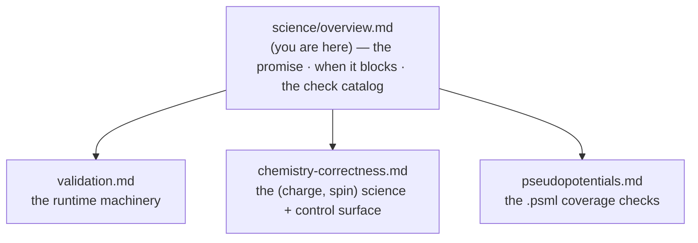
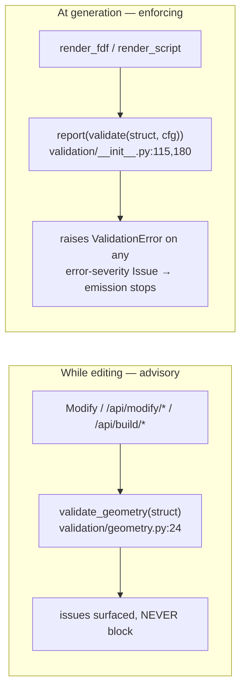
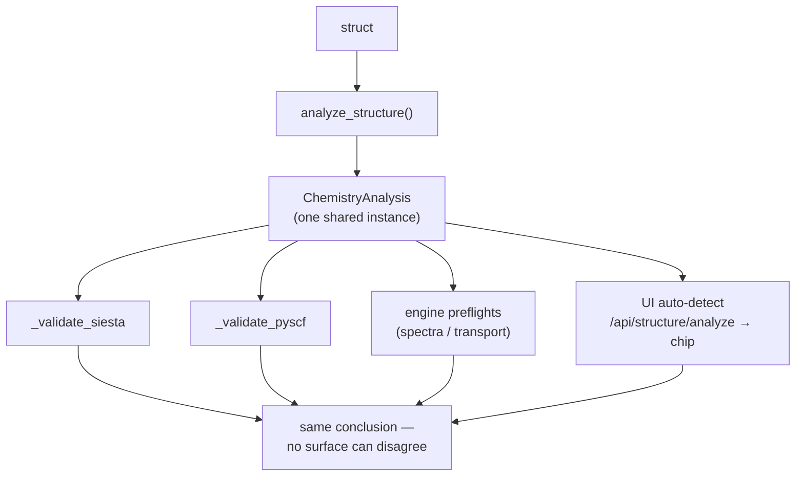

# Scientific correctness — the science domain

**Role:** overview
**Domain:** science
**Companions:** [`validation.md`](?doc=science/validation.md) (the runtime
machinery), [`chemistry-correctness.md`](?doc=science/chemistry-correctness.md)
(the chemistry control surface + `(charge, spin)` science),
[`pseudopotentials.md`](?doc=science/pseudopotentials.md) (the `.psml` checks).
`design.md` (the spine — where this domain's promise is summarised, composed
later; named not linked yet).

This is the **start-here** for the science domain and the home of the two
cross-cutting rules every science-aware surface obeys: **when a finding blocks**
(advisory while editing, enforcing at generation) and **what the validation pass
checks** (the catalog). The engine-specific machinery and the chemistry facts
live in the sibling docs below.

> **New to the vocabulary?** Terms like *SCF*, *open-shell*, *k-points*, *KB
> projector*, *frozen dataclass* are all defined in plain words in the
> **Glossary at the end (§ 8)** — skim it first if any acronym here is unfamiliar.

---

## 1. The map — start here



| Doc | Open it when you… |
|---|---|
| [`validation.md`](?doc=science/validation.md) | need the analyzer / adapter / consumer machinery (`analyze_structure` → `ChemistryAnalysis`, the per-engine registry, `check_open_shell_metal`, the `validation/` package) |
| [`chemistry-correctness.md`](?doc=science/chemistry-correctness.md) | are auditing whether the chemistry is right — the 5 control points, the spin/charge science, the pure primitives, the hemeC-dithiol post-mortem |
| [`pseudopotentials.md`](?doc=science/pseudopotentials.md) | work on `.psml` pseudopotential checks (coverage, XC, dead KB projector, generator-version) |

---

## 2. The promise

Generated SIESTA `.fdf` and PySCF `.py` outputs must be both **syntactically
correct** and **scientifically defensible**. A script that runs to completion but
converges to the *wrong electronic state* is worse than one that fails clearly —
silent chemical errors waste cluster time and erode trust in the toolchain.

The invariants here prevent the most common silent failures:

- wrong `(charge, spin)` for transition-metal complexes (→
  [`chemistry-correctness.md`](?doc=science/chemistry-correctness.md));
- bond-distance pathologies the user didn't see in the viewer (§ 4);
- cross-engine drift where the same chemistry gets different treatment in SIESTA
  vs PySCF (§ 5).

---

## 3. Validation is advisory while editing, enforcing at generation

The **same** checks run at two moments with two different consequences — this is
the contract for *when a finding blocks*:



- **While editing** — `validate_geometry(struct)` runs on every editing response
  (Modify, `/api/modify/*`, `/api/build/*`). Its issues are shown in the UI but
  **never block**, so a half-built structure isn't nagged into a dead end.
- **At generation** — `report(validate(struct, cfg))` runs before `render_fdf` /
  `render_script`. `validate` (`validation/__init__.py:115`) aggregates every
  applicable check via the engine registry; `report` (`:180`) prints warnings to
  stderr and **raises `ValidationError`** (`issues.py:72`) if any Issue is
  error-severity, stopping emission. **`report()` is the only gate.**

Everything travels as the L1 `Issue` dataclass (`issues.py:26`):

```python
@dataclass(frozen=True)
class Issue:
    severity:       Severity              # "error" | "warn" | "info"
    message:        str
    where:          str = ""              # e.g. "geometry.min_distance" / "config.kgrid"
    workflow_group: Optional[str] = None  # set by _shared.resolve_workflow_group(where, cfg)
                                          # so the web UI routes the issue to the right card
```

The CLI mirrors this: `molbuilder validate <input> --engine siesta` (`cli.py:1057`)
emits the same `List[Issue]` for shell-driven pre-flight checks.

**What may carry `error` severity** is deliberately narrow — only "physically
impossible or wrong" (atoms overlapping, a degenerate cell, a missing
pseudopotential, or `spin_polarized` on with no `spin_total` on an open-shell
metal — the `propor: IMAX=0` abort). Everything advisory stays `warn` — including
an open-shell metal paired with a *closed*-shell SCF, which is a strong warning,
not a hard block. Pattern-B "noticed-but-unused" notes are `info`.

---

## 4. The validation-pass check catalog

Representative checks with their severity + rationale (E4). **The authoritative,
complete list is the code** (`validation/geometry.py`, `validation/siesta.py`,
`validation/pyscf.py`, `validation/metadata.py`) **+ its tests** — this catalog
states the *why* so the thresholds don't drift silently.

### Geometry (`validation/geometry.py`, every-edit)
| Check | Severity | Why |
|---|---|---|
| min atom–atom distance < 0.3 Å | **error** | atoms on top of each other; SCF diverges |
| min atom–atom distance 0.3–0.7 Å | warn | likely broken structure (failed protonation / bad backend output) |
| H/heavy ratio < 0.3 | warn | heavy-atom skeleton → wrong electron count; may be an intentional `add_hydrogens=False` |
| polymer residue listing reversed / no preceding O3′–P bridge | warn | reversed or disconnected backbone — a likely backend regression |

### Cell & periodicity (`geometry.py` + `siesta.py`)
| Check | Severity | Why |
|---|---|---|
| cell determinant ≤ 0 | **error** | left-handed or degenerate cell |
| cell volume / atom-bounding-volume < 3 | warn | cell suspiciously tight |
| atom-to-nearest-image distance too small | warn | image–image interaction; suggest larger padding |
| charged supercell (Makov-Payne) | warn | image-charge bias padding alone doesn't remove |
| net dipole > 1 D, Γ-only vacuum (all `kgrid == 1`) | warn | image–image dipole (~1/L³); the fix is a **larger vacuum box** — *not* a dipole correction (SIESTA's `SlabDipoleCorrection` is for a 2-D slab, not a 3-D molecule). Estimate from `chemistry.estimate_dipole_moment_debye` (`chemistry.py:1614`), ±50 % |

### k-point sampling (`siesta.py`, `cfg.kgrid`)
| Check | Severity | Why |
|---|---|---|
| `kgrid > 1` on a vacuum axis | warn | k-points along a vacuum direction is wasted |
| `kgrid == 1` on a periodic/spanning axis while another axis uses k > 1 | warn | likely under-converged sampling |

### Spin & charge (`siesta.py` + the shared chemistry helpers)
| Check | Severity | Why |
|---|---|---|
| `spin_polarized=True` but `spin_total` unset, open-shell metal present | **error** | SIESTA's initial-DM constructor (`propor`) can't find a zero-net-spin split for a semicore-rich metal pseudo and aborts with `propor: ERROR: IMAX = 0` **before the SCF loop starts**; the fix (preferred + alternatives) comes from `chemistry.suggest_spin_total` |
| `spin_total` set but `spin_polarized=False` | warn | SIESTA silently ignores the pin |
| open-shell metal paired with a *closed*-shell SCF | warn | closed-shell SCF on a true open-shell complex converges to a fictitious state — a strong warning, not a block → [`chemistry-correctness.md`](?doc=science/chemistry-correctness.md) (`check_open_shell_metal`) |
| `(charge, spin)` parity mismatch | (engine) | caught pre-emission for a clearer message than PySCF's runtime error |

### Config field ranges (`validation/metadata.py`)
Every dataclass `Config` field carries `range` / `validate=` metadata; the generic
metadata pass validates each field against it (e.g. `mesh_cutoff` below the
150 Ry production floor → warn, `siesta.py:133`). Adding a field with metadata
auto-adds its check.

### Pseudopotentials & chemistry
The `.psml` checks (C1–C6) are in
[`pseudopotentials.md`](?doc=science/pseudopotentials.md); the chemistry-driven
`(charge, spin, treatment)` analysis is in
[`chemistry-correctness.md`](?doc=science/chemistry-correctness.md) +
[`validation.md`](?doc=science/validation.md).

---

## 5. Cross-engine consistency

Any scientific check that depends on chemistry (charge / spin / coordination /
basis suitability) lives in **one shared helper** called from **both**
`_validate_siesta` and `_validate_pyscf` (and the engine preflights + the UI
auto-detect) — same physical facts, same warning. This is structural, not
aspirational: every science-aware surface consumes the same `ChemistryAnalysis`
instance and cannot disagree.



The realisation (the analyzer, the adapter registry, the "adapters must not re-do
detection" rule) is in [`validation.md`](?doc=science/validation.md); the
chemistry motivation is in
[`chemistry-correctness.md`](?doc=science/chemistry-correctness.md) § 2.4.

---

## 6. Generated-output style requirements

The emitted scripts are meant to be **read and tuned by a scientist**, so style
is part of correctness:

- **Verbose-comments mode** (default ON) emits inline tuning hints next to each
  parameter plus a troubleshooting block at end of file.
- **Section headers** (`# --- Lattice ---`, `#  1. Build the molecule`, …) are
  mandatory.
- **Every tunable parameter** appears with its default value visible and a
  comment range (e.g. `# Range 0.001 - 0.5`) — never hidden behind a function
  call.
- **Post-processing hook placeholders** (commented-out, ready to uncomment) go at
  the end of every generated script / FDF.

---

## 7. History (closed — not a plan)

- **Ten science gaps** identified in the 2026-05-01 design review (SIESTA
  `SpinTotal`/`SpinPolarized` forms, dispersion emission, `mf.stability_analysis`
  for open-shell, `PAO.EnergyShift` default, post-processing templates, version
  pinning, ECP auto-emit, post-relax re-evaluation, `diis_space`/`damp` exposure)
  are **all closed** and pinned by `tests/test_science_gaps.py` (0 xfails).
- **Pinned false positive (2026-05-05 review):** a claim that geomeTRIC's
  `convergence_*` kwargs raise `TypeError` was wrong — PySCF's `geometric_solver`
  forwards them into `geometric.optimize.OptParams`. Guarded by introspection
  (no subprocess) in
  `tests/test_pyscf.py:90::test_geometric_optparams_accepts_pyscf_optimize_kwargs`,
  so a regression surfaces at unit-test time rather than user runtime.

---

## 8. Glossary — plain language

The vocabulary these science docs share, in plain words. (Each sibling doc
glosses its own specialised terms inline; this is the common core.)

**Quantum-chemistry method**

- **DFT** (density functional theory) / **HF** (Hartree-Fock) — the two families
  of method that compute a molecule's electrons. molbuilder emits inputs for both
  (SIESTA does DFT; PySCF does DFT or HF).
- **SCF** (self-consistent field) — the iterative loop at the heart of DFT/HF that
  solves for the electrons; it *converges* when the answer stops changing between
  iterations. A wrong setup can converge to the *wrong* answer with no error.
- **XC functional** (exchange-correlation) — the specific DFT approximation for
  electron–electron energy (e.g. PBE, PBEsol). A pseudopotential is built *for* one
  XC functional and must match the run.
- **SIESTA** — a periodic-DFT code (emits an `.fdf` input). **PySCF** — a molecular
  quantum-chemistry library (emits a `.py` script). The two "engines" molbuilder
  targets.

**Electrons & spin**

- **open-shell / closed-shell** — closed-shell = every electron paired
  (non-magnetic); open-shell = some electrons unpaired (magnetic). Transition
  metals (Fe, Mn, Co, …) are the common open-shell case; most organics are
  closed-shell.
- **spin (2S)** — molbuilder and PySCF count spin as **2S = the number of unpaired
  electrons**: 0 = singlet, 1 = doublet, 2 = triplet, … This is *not* the
  "multiplicity" (2S+1) that ORCA/Gaussian report.
- **μB (Bohr magneton)** — the unit SIESTA's `Spin.Total` uses for the net spin
  moment (≈ one μB per unpaired electron).
- **parity** — the even/odd match: an even electron count needs an even 2S, odd
  needs odd. A mismatch is physically impossible.
- **DM (density matrix)** — the electron distribution SIESTA seeds the SCF loop
  with; built by a routine called `propor`.

**Periodic (crystal) calculations**

- **PBC / periodic images** — the simulation cell repeats infinitely; every atom
  has "image" copies in the neighbouring cells. A molecule in a too-small box
  interacts spuriously with its own images.
- **k-points / Γ-only** — periodic calculations sample reciprocal space at
  k-points; `kgrid` sets how many per axis. **Γ-only** (all `kgrid == 1`) = a single
  k-point — right for an isolated molecule, too coarse for a real crystal.
- **Makov-Payne** — the estimated spurious energy of a *charged* cell interacting
  with its own periodic images.

**Pseudopotentials** (heavy-atom core stand-ins)

- **pseudopotential** — a stand-in for an atom's chemically-inert core electrons,
  so only the outer **valence** electrons are computed explicitly.
- **KB projector** (Kleinman-Bylander) — the mathematical form SIESTA stores a
  pseudopotential in; each valence orbital channel has a strength `ekb`, and
  `ekb = 0` means a *dead* (contributes-nothing) channel.
- **PAO** (pseudo-atomic orbital) — SIESTA's numerical basis set. **ECP** (effective
  core potential) — PySCF's equivalent of a pseudopotential. **Ry** (Rydberg) — the
  energy unit for SIESTA's real-space **mesh cutoff** (how fine the integration
  grid is).

**Software terms**

- **dataclass (frozen)** — a plain typed record; *frozen* = immutable once created.
  **the wire** — the network boundary where these records become JSON.
- **adapter / registry** — an *adapter* is a small per-engine translator; the
  *registry* is the lookup table each adapter registers itself into, so adding an
  engine needs no change to the callers.
- **preflight** — the validation pass run just before an input script is written.
  **the gate** — the single point (`report()`) that can stop generation.
