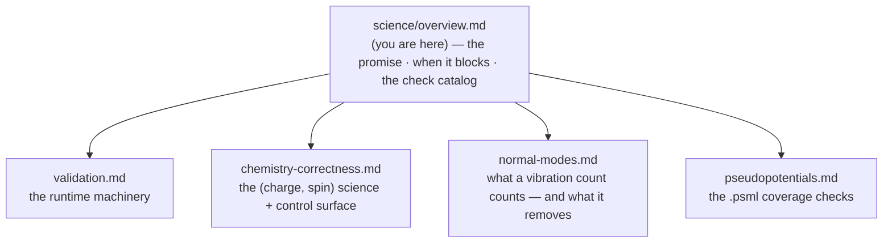
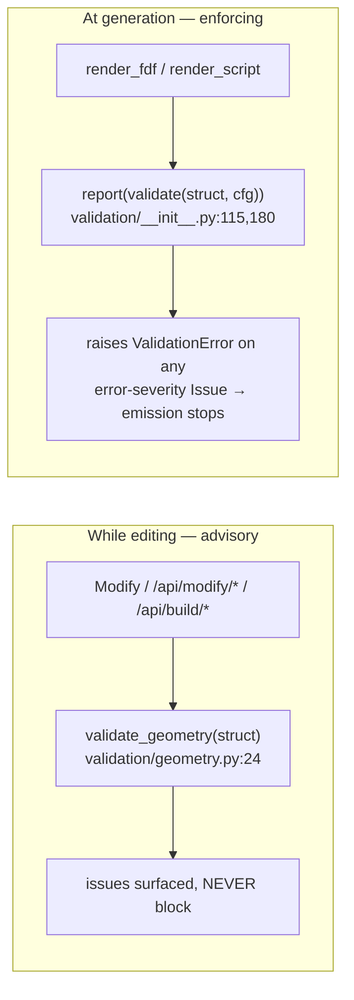
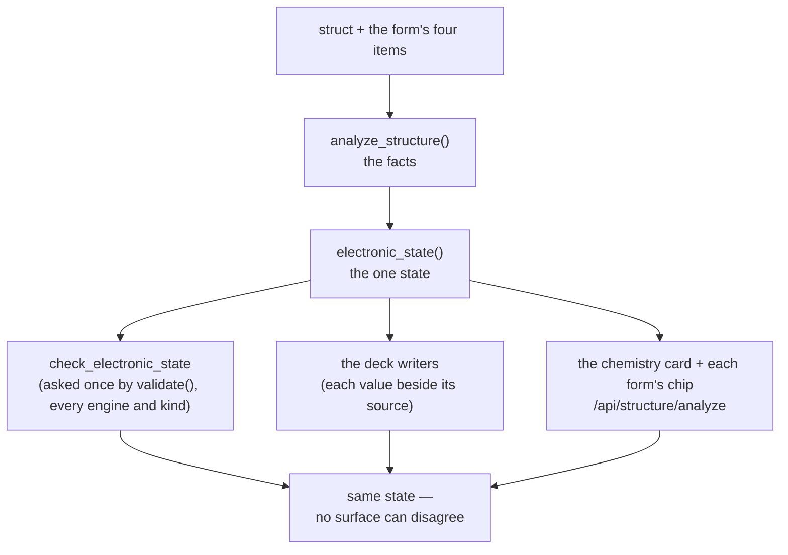

# Scientific correctness — the science domain

**Role:** overview
**Domain:** science
**Companions:** [`validation.md`](?doc=science/validation.md) (the runtime
machinery), [`chemistry-correctness.md`](?doc=science/chemistry-correctness.md)
(the chemistry control surface + `(charge, spin)` science),
[`pseudopotentials.md`](?doc=science/pseudopotentials.md) (the `.psml` checks).
[`design.md`](?doc=design.md) (the spine — where this domain's promise is
summarised).

This is the **start-here** for the science domain and the home of the two
cross-cutting rules every science-aware surface obeys: **when a finding blocks**
(advisory while editing, enforcing at generation) and **what the validation pass
checks** (the catalog). The engine-specific machinery and the chemistry facts
live in the sibling docs below.

> **New to the vocabulary?** Terms like *SCF*, *open-shell*, *k-points*, *KB
> projector*, *frozen dataclass* are all defined in plain words in the
> **Glossary at the end (§ 8)** — skim it first if any acronym here is unfamiliar.

---

## 1. The map — start here


```mermaid
flowchart TD
    O["science/overview.md<br/>(you are here) — the promise · when it blocks · the check catalog"]
    V["validation.md<br/>the runtime machinery"]
    C["chemistry-correctness.md<br/>the (charge, spin) science + control surface"]
    N["normal-modes.md<br/>what a vibration count counts — and what it removes"]
    P["pseudopotentials.md<br/>the .psml coverage checks"]
    O --> V
    O --> C
    O --> N
    O --> P
```

| Doc | Open it when you… |
|---|---|
| [`validation.md`](?doc=science/validation.md) | need the checks' machinery — the `validation/` package, the one pass `validate()`, the structure's facts (`analyze_structure` → `ChemistryAnalysis`) and the electronic state's one family of findings (`check_electronic_state`) |
| [`chemistry-correctness.md`](?doc=science/chemistry-correctness.md) | are auditing whether the chemistry is right — the 5 control points, the spin/charge science, the pure primitives, the hemeC-dithiol post-mortem |
| [`normal-modes.md`](?doc=science/normal-modes.md) | touch anything that counts, filters, warns about or displays vibrational modes — why `3N−6` becomes `3·N_free − n_rigid(F)` when atoms are held, and why the leftover whole-body motions are removed before diagonalisation rather than detected after |
| [`pseudopotentials.md`](?doc=science/pseudopotentials.md) | work on `.psml` pseudopotential checks (coverage, XC, dead KB projector, generator-version) |

---

## 2. The promise

Generated SIESTA `.fdf` and PySCF `.py` outputs must be both **syntactically
correct** and **scientifically defensible**. A script that runs to completion but
converges to the *wrong electronic state* is worse than one that fails clearly —
silent chemical errors waste cluster time and erode trust in the toolchain.

The invariants here prevent the most common silent failures:

- wrong `(charge, spin)` for transition-metal complexes (→
  [`chemistry-correctness.md`](?doc=science/chemistry-correctness.md));
- bond-distance pathologies the user didn't see in the viewer (§ 4);
- cross-engine drift where the same chemistry gets different treatment in SIESTA
  vs PySCF (§ 5).

---

## 3. Validation is advisory while editing, enforcing at generation

The **same** checks run at two moments with two different consequences — this is
the contract for *when a finding blocks*:


```mermaid
flowchart LR
    subgraph EDIT["While editing — advisory"]
        E1["Modify / /api/modify/* / /api/build/*"]
        E2["validate_geometry(struct)<br/>validation/geometry.py:24"]
        E3["issues surfaced, NEVER block"]
        E1 --> E2 --> E3
    end
    subgraph GEN["At generation — enforcing"]
        G1["render_fdf / render_script"]
        G2["report(validate(struct, cfg))<br/>validation/__init__.py:115,180"]
        G3["raises ValidationError on any<br/>error-severity Issue → emission stops"]
        G1 --> G2 --> G3
    end
```

- **While editing** — `validate_geometry(struct)` runs on every editing response
  (Modify, `/api/modify/*`, `/api/build/*`). Its issues are shown in the UI but
  **never block**, so a half-built structure isn't nagged into a dead end.
- **At generation** — `report(validate(struct, cfg))` runs before `render_fdf` /
  `render_script`. `validate` (`validation/__init__.py:115`) aggregates every
  applicable check via the engine registry; `report` (`:180`) prints warnings to
  stderr and **raises `ValidationError`** (`issues.py:72`) if any Issue is
  error-severity, stopping emission. **`report()` is the only gate.**

Everything travels as the **L1** `Issue` dataclass (`issues.py:26`) — *L1* = the
lowest layer: pure data types with no I/O or engine logic:

```python
@dataclass(frozen=True)
class Issue:
    severity:       Severity              # "error" | "warn" | "info"
    message:        str
    where:          str = ""              # e.g. "geometry.min_distance" / "config.kgrid"
    workflow_group: Optional[str] = None  # set by _shared.resolve_workflow_group(where, cfg)
                                          # so the web UI routes the issue to the right card
```

The CLI mirrors this: `molbuilder validate <input> --engine siesta` (`cli.py:1058`)
emits the same `List[Issue]` as **JSON to stdout** for shell-driven pre-flight checks.

**What may carry `error` severity** is deliberately narrow — only "physically
impossible or wrong" (atoms overlapping, a degenerate cell, a missing or
defective pseudopotential, a charge and spin the electron count cannot hold, or a
spin state the engine cannot run). Everything advisory stays `warn` — including a
closed shell stated on an open-shell structure, and a spin count decided from a
metal's usual count: both are strong warnings about the state the SCF is asked
for, and neither stops it running. Pattern-B "noticed-but-unused" notes are
`info`.

---

## 4. The validation-pass check catalog

Representative checks with their severity + rationale (E4). **The authoritative,
complete list is the code** (`validation/geometry.py`, `validation/siesta.py`,
`validation/pyscf.py`, `validation/metadata.py`) **+ its tests** — this catalog
states the *why* so the thresholds don't drift silently.

### Geometry (`validation/geometry.py`, every-edit)
| Check | Severity | Why |
|---|---|---|
| min atom–atom distance < 0.3 Å | **error** | atoms on top of each other; SCF diverges |
| min atom–atom distance 0.3–0.7 Å | warn | likely broken structure (failed protonation / bad backend output) |
| H/heavy ratio < 0.3 | warn | heavy-atom skeleton → wrong electron count; may be an intentional `add_hydrogens=False` |
| polymer residue listing reversed / no preceding O3′–P bridge | warn | reversed or disconnected backbone — a likely backend regression |

### Cell & periodicity (`geometry.py` + `siesta.py`)
| Check | Severity | Why |
|---|---|---|
| `cell.no_volume` (det ≈ 0) | **error** | the box has no volume — nothing to calculate in |
| `cell.left_handed` (det < 0) | **error** | mirrored lattice vectors; swap two of them |
| `cell.unfittable` | **error** | the structure is longer than the cell — no corner can fit it |
| cell volume / atom-bounding-volume < 3, on a box that is vacuum on all three axes | warn | cell suspiciously tight. Not asked of a crystal, a lead or a junction, which fill their cells by construction; a slab's or a wire's vacuum is measured per axis by the image-distance row below ([`model/structure-periodicity.md`](?doc=model/structure-periodicity.md) § 2) |
| atom-to-nearest-image distance < 6 Å | warn | atoms interact with their own periodic images; suggest a larger vacuum box (`geometry.py`) |
| charged supercell (Makov-Payne) | warn | image-charge bias padding alone doesn't remove |
| net dipole > 1 D (debye, the dipole-moment unit), Γ-only vacuum (every count of the deck's k-point mesh 1) | warn | image–image dipole (~1/L³); the fix is a **larger vacuum box** — *not* a dipole correction (SIESTA's `SlabDipoleCorrection` is for a 2-D slab, not a 3-D molecule). Estimate from `chemistry.estimate_dipole_moment_debye` (`chemistry.py:1614`), ±50 % |

### k-point sampling (`kmesh.check`, on every mesh a deck writes)
The rules and their severities are [`engines/siesta.md`](?doc=engines/siesta.md)
§ 6.1's, on the mesh each rung writes — `kgrid`, a transmission's `tbt_k_grid`,
a lead's `electrode_kz`:

| Check | Severity | Why |
|---|---|---|
| an isolated axis sampled more than once | warn | the structure does not repeat there, so the points sample images of vacuum — cost for nothing *(user, 2026-08-20: `k > 1` is the person's statement, never refused)* |
| a sampled axis above 1 whose images sit ≥ 5 Å apart | warn (hint) | the gap is the real vacuum; images that far apart are usually meant not to interact |
| an offset on an axis sampled once | warn | it moves that point off Γ to the zone boundary |
| a transport calculation's third k component other than 1 (`kgrid`, `tbt_k_grid`), or its offset other than 0 | **error** | that axis is the OPEN boundary on the seed, the device and the transmission, and a lead samples it by `electrode_kz` — no rung reads the component (`kmesh.fixed`, every door) |
| a count at or below 0; `electrode_kz` at or below 1 | **error** | the items' own limits (`above`, `engines/template.md` § 5.3) — a lead is periodic bulk along transport, and one point there gives a wrong lead Hamiltonian |
| `electrode_kz` below 20 | warn | its recommended range — a floor, not a convergence proof: only a kz sweep shows the lead's Fermi level has settled |

*(`k = 1` on a periodic axis is checked not at all — the "under-converged"
warning was retired 2026-08-20. The transport axis's three rows below
(`kgrid[2]`, `electrode_kz`, `tbt_k_grid`) stood in the transport kind's
validator until 2026-09-30, beside a warning about the same axis here.)*

### Spin & charge — the electronic state's one family (`validation/chemistry.py::check_electronic_state`, every engine and kind)

Asked once by `validate()`, of the state the deck will be written from
([`chemistry-correctness.md`](?doc=science/chemistry-correctness.md) § 2a) — a
blank item is decided, never an absence. At most one finding per fact (ES9); the
first that holds wins.

| Check | Severity | Why |
|---|---|---|
| a treatment or a count the kind does not offer on this engine — SIESTA's restricted-open, PySCF's non-collinear / spin-orbit, a PySCF vibration's restricted-open or unrestricted, TranSIESTA's non-collinear / spin-orbit, `free` on PySCF (ES4, ES6) | **error** | declared, not discovered (the catalogue's `offered`, [`engines/template.md`](?doc=engines/template.md) § 6.3a): the form does not offer it, and the gate refuses the RESOLVED value by name, saying where it came from, before a deck is written |
| a fixed count where SIESTA cannot hold one — under non-collinear or spin-orbit, and under unrestricted on a transport rung (ES6) | **error** | SIESTA stops on `Spin.Fix` unless the spin is collinear and polarized (`read_options.F90`), and TranSIESTA on any (`m_ts_options.F90`) — a warning would let the job reach the queue and abort there; a count nobody stated floats there instead |
| `restricted` with a count above 0 (ES5) | **error** | restricted means every electron paired |
| the count's parity against the electron count, for a finite system (ES3) | **error**; **warn** for SIESTA restricted with an odd count, which runs half-filled | PySCF refuses the pair at run time; a repeating cell's count per cell is not a spin |
| `restricted` stated where the structure implies an open shell (ES9) | warn | a closed-shell SCF on an open-shell system converges to a fictitious state (the hemeC guard) |
| `unrestricted` at 2S = 0 on a closed shell (ES9) | warn | a constrained singlet — the same answer as restricted at twice the cost; kept only for a broken-symmetry singlet |
| a count decided from a metal's usual count, the spin fields blank (ES8) | warn | the right count depends on the coordination, not the element — verify it and state it; the warning goes when the count is stated |
| a count somebody stated on an open-d metal | info | what it implies for each metal, to check against the chemistry |
| a charge on a transport calculation (ES7) | **error** | its boundaries are open and the leads set the electron number |

A triplet O₂ stated as such is not a finding: an open shell on an even count is
exactly what parity cannot see, and a person who stated it meant it. *(This table
listed the retired `spin_total` rules and the analyzer's `check_open_shell_metal`
until 2026-09-28; the `propor: ERROR: IMAX = 0` abort once blamed on a missing spin
is a defective pseudopotential's, which the `dead_projector` row above blocks.)*

### Transport, the calculation KIND (`validation/__init__.py::_validate_transport_kind`)

*(Added 2026-09-17. **This section was missing entirely** — seven shipped
checks, none of them catalogued, found by a review that should have run before
the two newest were written and did not. `engines/transport.md` § 5 is the
science; this is where they sit in the pass.)*

Keyed on `task.calculation`, not on a config class — every rung resolves a
`SiestaConfig`, so a rule keyed on `TransportConfig` would fire for none of
them. **The transport axis's k-point sampling is not here**: it is the
k-point mesh's, above, where the open axis, a lead's own count and the
transmission's grid are one rule each.

| Check | Severity | Why |
|---|---|---|
| `cell.transport_vacuum`: the room at the transport boundary above 1.5 of the lead's layer spacings | **error** | a junction's leads continue into the periodic image, so the room there is one layer spacing; more is a SEVERED lead, not padding — measured from the lead since M5 step 2 (it was a warning above a fixed 3 Å, `engines/transport.md` § 6.1c). **The reverse of what `cell.vacuum_thin` tells an isolated molecule**, which is why it is keyed on the kind: the two must never both fire |
| `cell.transverse_vacuum`: a lead that does not reach across a transverse axis declared periodic — its nearest atom there above 1.5 of its own bond, each lead on its own | **error** | periodic says the crystal continues across the boundary; a wire or chain lead is declared isolated there instead, and its vacuum is then allowed (§ 6.1c) |
| `net_charge != 0` | **error** | deferred by ruling (§ 2a.7) — an open boundary exchanges charge with the reservoirs, so a fixed excess is not the same quantity a closed calculation means by it |
| `negf_eq_pole_ev` giving < 20 poles, 0 among them | **error** | TranSIESTA derives the pole COUNT from the energy, `int(E / (π·kT))`, and `die`s below 20 — so the refusal is a RELATION with the run's own temperature, not a fixed bound; an energy at or below 0 leaves TranSIESTA its 8-pole default, refused the same way |
| `electronic_temperature < 10 K` on a transport calculation | **error** | TranSIESTA stops below 10 K before it counts a pole (`m_ts_options.F90`) |

**I9 and I12 (`electrode_kz`, `transport_vacuum`) were re-homed here on
2026-09-17** from a standalone CLI verb that compared two finished decks. Under
the composite both decks derive from one citation, so they belong in the pass
every prep runs rather than in a command somebody remembers. *(I9 moved again on
2026-09-30, to the lead item's own limit and range, where every door reads it.)*

### Config field ranges (`validation/metadata.py`)
Every dataclass `Config` field carries `range` / `validate=` metadata; the generic
metadata pass validates each field against it (e.g. `mesh_cutoff` below the
150 Ry production floor → warn, `siesta.py:133`). A range is a recommendation,
warned and never refused; a hard limit is the catalogue's `above`, refused on
every door through `template.why_not` — and a value refused there draws that
refusal alone, its range warning standing aside (`engines/template.md` § 5.3). **Adding a field with metadata
auto-adds its check** — no separate validator code:

```python
# a SiestaConfig field (config/siesta.py:242) — the range metadata IS the check
mesh_cutoff: float = field(default=300.0, metadata={
    "range": (100.0, 1000.0), "tier": "basic",  # + label / help / …
})
# validation/metadata.py reads .range and emits a warn Issue if the value is out of range
```

An item with `choices` is checked the same way, and more strictly: a value that is
not one of them is an **error**, named — `method = "RKS"` under today's `DFT` /
`HF` vocabulary would otherwise have been read as Hartree–Fock without a word
(2026-09-28).

### Pseudopotentials & chemistry
The `.psml` checks (C1–C6) are in
[`pseudopotentials.md`](?doc=science/pseudopotentials.md); the electronic state —
the charge and spin every engine reads, and its one family of findings — is in
[`chemistry-correctness.md`](?doc=science/chemistry-correctness.md) § 2a +
[`validation.md`](?doc=science/validation.md).

---

## 5. Cross-engine consistency

Any scientific check that depends on chemistry (charge / spin / coordination /
basis suitability) lives in **one shared helper**, asked for every engine — same
physical facts, same finding. For the charge and spin this is one class: every
science-aware surface reads the same `ElectronicState`, resolved from the same
facts for exactly what its form says, and cannot disagree by construction.


```mermaid
flowchart TD
    S["struct + the form's four items"] --> AN["analyze_structure()<br/>the facts"]
    AN --> ES["electronic_state()<br/>the one state"]
    ES --> V["check_electronic_state<br/>(asked once by validate(), every engine and kind)"]
    ES --> DW["the deck writers<br/>(each value beside its source)"]
    ES --> UI["the chemistry card + each form's chip<br/>/api/structure/analyze"]
    V --> R["same state —<br/>no surface can disagree"]
    DW --> R
    UI --> R
```

The realisation (the class, the order a blank is answered in, the detection table)
is [`chemistry-correctness.md`](?doc=science/chemistry-correctness.md) § 2a; how the
checks reach every engine is [`validation.md`](?doc=science/validation.md); the
chemistry motivation is § 2.4 there.

---

## 6. Generated-output style requirements

The emitted scripts are meant to be **read and tuned by a scientist**, so style
is part of correctness:

- **Verbose-comments mode** (default ON) emits inline tuning hints next to each
  parameter plus a troubleshooting block at end of file.
- **Section headers** (`# --- Lattice ---`, `#  1. Build the molecule`, …) are
  mandatory.
- **Every tunable parameter** appears with its default value visible and a
  comment range (e.g. `# Range 0.001 - 0.5`) — never hidden behind a function
  call.
- **Post-processing hook placeholders** (commented-out, ready to uncomment) go at
  the end of every generated script / FDF.

---

## 7. History (closed — not a plan)

- **Ten science gaps** identified in the 2026-05-01 design review (the SIESTA
  `SpinTotal` keyword form + the `SpinPolarized` form — two of the ten — dispersion emission, `mf.stability_analysis`
  for open-shell, `PAO.EnergyShift` default, post-processing templates, version
  pinning, ECP auto-emit, post-relax re-evaluation, `diis_space`/`damp` exposure)
  are **all closed** and pinned by `tests/test_science_gaps.py` (0 xfails).
- **Pinned false positive (2026-05-05 review):** a claim that geomeTRIC's
  `convergence_*` kwargs raise `TypeError` was wrong — PySCF's `geometric_solver`
  forwards them into `geometric.optimize.OptParams`. Guarded by introspection
  (no subprocess) in
  `tests/test_pyscf.py:90::test_geometric_optparams_accepts_pyscf_optimize_kwargs`,
  so a regression surfaces at unit-test time rather than user runtime.

---

## 8. Glossary — plain language

The vocabulary these science docs share, in plain words. (Each sibling doc
glosses its own specialised terms inline; this is the common core.)

**Quantum-chemistry method**

- **DFT** (density functional theory) / **HF** (Hartree-Fock) — the two families
  of method that compute a molecule's electrons. molbuilder emits inputs for both
  (SIESTA does DFT; PySCF does DFT or HF).
- **SCF** (self-consistent field) — the iterative loop at the heart of DFT/HF that
  solves for the electrons; it *converges* when the answer stops changing between
  iterations. A wrong setup can converge to the *wrong* answer with no error.
- **XC functional** (exchange-correlation) — the specific DFT approximation for
  electron–electron energy (e.g. PBE, PBEsol). A pseudopotential is built *for* one
  XC functional and must match the run.
- **SIESTA** — a periodic-DFT code (emits an `.fdf` input). **PySCF** — a molecular
  quantum-chemistry library (emits a `.py` script). The two "engines" molbuilder
  targets.

**Electrons & spin**

- **open-shell / closed-shell** — closed-shell = every electron paired
  (non-magnetic); open-shell = some electrons unpaired (magnetic). Transition
  metals (Fe, Mn, Co, …) are the common open-shell case; most organics are
  closed-shell.
- **spin (2S)** — molbuilder and PySCF count spin as **2S = the number of unpaired
  electrons** (the item `unpaired_electrons`): 0 = singlet, 1 = doublet, 2 =
  triplet, … This is *not* the "multiplicity" (2S+1) that ORCA/Gaussian report.
  **`free`** asks the moment to float to whatever the SCF finds (SIESTA only).
- **restricted / restricted-open / unrestricted** — how the two spin channels are
  solved (the item `spin_treatment`): *restricted*, every electron paired in one
  set of orbitals (a closed shell); *restricted-open*, one set of spatial orbitals
  with some singly occupied (spin-pure; PySCF only); *unrestricted*, the two
  channels solved separately. **non-collinear** and **spin-orbit** (SIESTA) let
  the spin point in any direction, the second coupling it to orbital motion.
- **μB (Bohr magneton)** — the unit SIESTA's `Spin.Total` uses for the net spin
  moment (≈ one μB per unpaired electron).
- **parity** — the even/odd match: an even electron count needs an even 2S, odd
  needs odd. A mismatch is physically impossible.
- **DM (density matrix)** — the electron distribution SIESTA seeds the SCF loop
  with. A polarized run given no initial moments starts every atom at its
  maximum atomic moment, aligned (`m_new_dm.F90`) — not at zero net spin, and
  not from `Spin.Total`, which under `Spin.Fix` pins N↑ − N↓ instead
  (`siesta_init.F`); this line said otherwise until 2026-09-26. (It is *not*
  built by `propor`, as this line said until 2026-09-17 — that is a
  vector-proportionality helper in the matrix-element table code and has
  nothing to do with the DM.)

**Periodic (crystal) calculations**

- **PBC / periodic images** — the simulation cell repeats infinitely; every atom
  has "image" copies in the neighbouring cells. A molecule in a too-small box
  interacts spuriously with its own images.
- **k-points / Γ-only** — periodic calculations sample reciprocal space at
  k-points; `kgrid` sets how many per axis. **Γ-only** (all `kgrid == 1`) = a single
  k-point — right for an isolated molecule, too coarse for a real crystal.
- **Makov-Payne** — the estimated spurious energy of a *charged* cell interacting
  with its own periodic images.

**Pseudopotentials** (heavy-atom core stand-ins)

- **pseudopotential** — a stand-in for an atom's chemically-inert core electrons,
  so only the outer **valence** electrons are computed explicitly.
- **KB projector** (Kleinman-Bylander) — the mathematical form SIESTA stores a
  pseudopotential in; each valence orbital channel has a strength `ekb`, and
  `ekb = 0` means a *dead* (contributes-nothing) channel.
- **PAO** (pseudo-atomic orbital) — SIESTA's numerical basis set. **ECP** (effective
  core potential) — PySCF's equivalent of a pseudopotential. **Ry** (Rydberg) — the
  energy unit for SIESTA's real-space **mesh cutoff** (how fine the integration
  grid is).

**Software terms**

- **dataclass (frozen)** — a plain typed record; *frozen* = immutable once created.
  **the wire** — the network boundary where these records become JSON.
- **registry** — a lookup table each engine's validator registers itself into
  (`validation._ENGINE_VALIDATORS`), so adding an engine needs no change to the
  callers.
- **preflight** — the validation pass run just before an input script is written.
  **the gate** — the single point (`report()`) that can stop generation.
