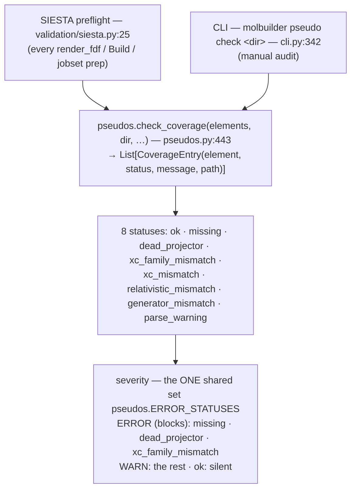

# Pseudopotential validation — the `.psml` coverage checks

**Role:** contract
**Domain:** science
**Companions:** [`validation.md`](?doc=science/validation.md) (the SIESTA
preflight that *runs* these checks); `engines/siesta.md` (the FDF emitter + the
`psml_lib` config field — engines wave, named not linked yet); `overview.md`
(the science contract — composed last).

This is the **sole source of truth** for what molbuilder checks in a `.psml`
pseudopotential set, **why**, and **how**. A **pseudopotential** is a stand-in for
an atom's chemically-inert core electrons, so only the outer (valence) electrons
are computed; `.psml` is the file format that carries one. The implementation
(`molbuilder/pseudos.py` + `molbuilder/validation/siesta.py` + `molbuilder pseudo
check`) must conform to this document; the tests (`tests/test_pseudos.py`) pin
each check to it. If a check here and the code disagree, that's a bug in one of
them — fix it, don't let them drift. *(Cross-cutting terms — pseudopotential, KB
projector, XC functional, valence, Ry — are in the
[`overview.md` glossary](?doc=science/overview.md); this doc glosses its own
specialised ones inline.)*

## Why this guard exists

A **defective `S.psml` shipped silently** into a real run (2026-06-26): an
`ONCVPSP-4.0.1` sulfur pseudo — **ONCVPSP** is a widely-used pseudopotential
*generator program*, and `-4.0.1` its release — with a **dead p-channel**
(`ekb = 0`: the projector strength for the p valence orbitals was zero, so those
orbitals contribute nothing) sat among otherwise-`ONCVPSP-3.3.0` H/C/Au pseudos.
It produced wrong sulfur bonding **and** crashed SIESTA at `propor: ERROR: IMAX=0`
(a crash from a degenerate projector table) — but only at high MPI rank counts (=
many parallel processes), so a low-process GPU run would have *silently* used it
and reported plausible, wrong numbers. None of the pre-existing checks caught it.
The checks below catch that class of defect **at preparation time**, before any
compute is spent and before any wrong number is trusted.

Each check states its scientific basis, its false-positive risk, and its
severity — several thresholds are heuristic and are called out as such.

---

## 1. Where it runs, and the severity model

Two entry points, one engine:



Both surfaces call the **same** `pseudos.check_coverage`, which parses each PSML
header once (`parse_psml_header` → `PsmlInfo`, `pseudos.py:168`) and returns
`CoverageEntry(element, status, message, path)` (`pseudos.py:418`) — the same
eight statuses. Both then map status → severity through the **one shared
constant** `pseudos.ERROR_STATUSES` (`pseudos.py:440`), so the preflight (which
blocks script generation, `validation/siesta.py:125`) and the CLI (which exits
non-zero, `cli.py:386`) **cannot disagree about what blocks**:

| Severity | Statuses | Meaning |
|---|---|---|
| **ERROR** (blocks generation / non-zero CLI exit) | `missing`, `dead_projector`, **`xc_family_mismatch`** | the run **cannot be correct** — a file is absent (SIESTA won't start), a valence channel is physically missing (wrong Hamiltonian), or the XC *family* is wrong (silently-wrong energies) |
| **WARN** (advisory) | `xc_mismatch`, `relativistic_mismatch`, `generator_mismatch`, `parse_warning` | a strong smell that *might* be intentional (curated mix, deliberate SR/FR choice) — surfaced loudly, but the user may proceed |
| `ok` | — | silent pass |

> **History (2026-07).** Two changes produced the unified set above: (a) XC-*family*
> mismatch was split off as `xc_family_mismatch` → **ERROR** (an earlier version
> treated all XC mismatch as one WARN and left family-vs-author blocking "for
> reviewer decision"); (b) the CLI's exit set — once narrower
> (`{"missing", "dead_projector"}`, so an `xc_family_mismatch` slipped past with
> exit 0 while the preflight blocked it) — was unified onto the shared
> `ERROR_STATUSES`. Both pinned by
> `tests/test_pseudos.py::TestErrorStatusesSharedBySurfaces`.

---

## 2. The checks

### C1 — Coverage · ERROR · `missing`
**What:** every element in the structure has exactly one `.psml` in the pseudo
directory. **Why:** SIESTA refuses to start without a pseudo for every species.
**How:** `scan_psml_directory` (`pseudos.py:393`) maps `{element: PsmlInfo}`; a
structure element with no entry → `missing`. **False positives:** none — a
missing file is unambiguous.

### C2 — XC functional consistency · ERROR *(family)* / WARN *(author)*
**What:** the pseudo's exchange-correlation functional matches the calculation's
(`cfg.xc_authors`). **Why:** a pseudo is generated *for* a specific XC functional.
Using a PBE pseudo in an LDA run (or vice versa) gives **silently wrong** bond
lengths and energies — the run completes, the numbers are off by an amount that
looks physical.

- **Family mismatch** (GGA vs LDA) → `xc_family_mismatch` → **ERROR**. Never
  correct.
- **Author mismatch, same family** (PBE vs PBEsol) → `xc_mismatch` → **WARN**.
  Minor (~1–2 kcal/mol).

**How:** `PsmlInfo.xc_family` / `xc_authors` are decoded from the `<libxc-info>`
functional ids (**libxc** = the standard open-source library that assigns each XC
functional a numeric id) via `_LIBXC_MAP` (`pseudos.py:146`) and compared to the
family derived from `cfg.xc_authors`. An unrecognised libxc id stays `"unknown"` and
does **not** warn — we don't flag what we can't classify. **False positives:**
low, bounded by the libxc id table.

### C3 — Relativistic treatment · WARN · `relativistic_mismatch`
**What:** scalar-relativistic (SR) vs fully-relativistic / spin-orbit (FR)
matches the calculation's intent (SR ignores the coupling between an electron's
spin and its orbital motion; FR includes it). **Why:** FR pseudos are needed only
when spin-orbit coupling matters (heavy elements + SOC-sensitive properties);
using FR when you meant SR (or vice versa) changes the physics. SR is correct for the
large majority of work. **How:** `PsmlInfo.relativistic` (from the header
`relativity` attribute) compared to `expected_relativistic` (default `"scalar"`).
**False positives:** low; `unknown` does not warn.

### C4 — Generator / version consistency · WARN · `generator_mismatch`
**What:** the whole set comes from ONE generator release (e.g. all PseudoDojo
`ONCVPSP-3.3.0`), not a mix. (**PseudoDojo** = a curated, benchmark-validated open
pseudopotential library — molbuilder's recommended source.) **Why:** a single stranger version is the *smell*
that a pseudo was hand-swapped from a different source — exactly how the bad S
entered. Mixed releases also mean the set was never validated together for
**transferability** (whether a pseudo stays accurate across different chemical
environments). **How:** `_generator_key(generator)` (`pseudos.py:612`) reduces
each `creator` string to `name-MAJOR` (e.g. `"ONCVPSP-3"`); a patch difference
(3.3.0 vs 3.3.1) does **not** warn, a major mix (3.x vs 4.x) does. The minority
version(s) are named as the likely stranger(s); only pseudos actually present are
compared. **False positives:** moderate —
mixing *can* be intentional (a curated set drawing the best pseudo per element
from different releases). Hence WARN, not ERROR; the message says "confirm the
odd-one-out is intended."

### C5 — Dead Kleinman-Bylander projector · ERROR · `dead_projector`
**What:** no valence angular-momentum channel (the s / p / d / … orbital-momentum
component of the valence) has its **entire** set of KB projectors at `ekb ≈ 0`.
**Why (scientific basis):** SIESTA represents the
nonlocal pseudopotential in separable Kleinman-Bylander form [Kleinman & Bylander,
*PRL* **48**, 1425 (1982)]: `V_NL = Σ_l |χ_l⟩ E_KB,l ⟨χ_l|`. The KB energy `E_KB`
(the PSML `ekb` attribute) **is** the projector's strength — `ekb=0` means that
projector contributes nothing. If *every* projector of a given `l` is null, that
angular momentum has **no nonlocal projection** at all; its scattering is left to
the local potential only. For an element where that `l` is a valence channel
(e.g. sulfur's 3p) this is physically wrong — the bonding through that channel is
undescribed — and it leaves SIESTA's projector table degenerate, which can
trigger `propor: ERROR: IMAX=0`. **How:** `parse_psml_header` reads every
`<proj l=… ekb=…>`, groups by `l`, and flags an `l` (→ `PsmlInfo.null_channels`,
`pseudos.py:376`) only when **all three** hold:

1. the channel is **present** (has `<proj>` entries) — a channel chosen as the
   **local potential** has *no* `<proj>` at all (absent, not zero) and is not flagged;
2. **every** projector for that `l` has `|ekb| < 1e-6` (`_EKB_NULL`) — one weak
   projector among several is fine; we flag only an *entirely* null channel; and
3. there is **no** `<slps l=…>` semilocal potential for that `l`.

**Condition 3 is essential and easy to miss.** ONCVPSP-4.0.1 / psml-4.0.1 pseudos
write the nonlocal `<proj>` block as **zero placeholders** for channels that are
instead carried by the `<semilocal-potentials>` block, from which SIESTA rebuilds
the KB projector at read time. Standard, PseudoDojo-validated pseudos for **I, Xe,
Rb, Ba** do exactly this for their p channel — so an `ekb=0` there is *not* a dead
projector. Flagging them (the pre-2026-07 behaviour) was a **false positive that
ERROR-blocked those common elements**; the `l not in semilocal_ls` guard fixes it.
**Threshold:** `1e-6` (in the hartree-ish KB units of `ekb`) is heuristic — well
below any physical `ekb` (real ones are O(0.1–20)) and just above
exact-zero/round-off. **False positives:** believed none
for standard ONCVPSP / PseudoDojo sets after the semilocal exemption.

The three cases side by side, in the actual PSML header (`<proj l=… ekb=…>` — one
`<proj>` per projector, grouped by angular momentum `l`; `s`, `p`, `d`, … are the
channel names):

```xml
<!-- (a) HEALTHY p-channel — real ekb, contributes to bonding → ok -->
<proj l="p" seq="1" ekb="4.213" eref="0" type="oncv"/>

<!-- (b) DEAD sulfur p-channel — every projector zero AND no <slps l="p"> → dead_projector (ERROR) -->
<proj l="p" seq="1" ekb="0.0" eref="0" type="oncv"/>
<proj l="p" seq="2" ekb="0.0" eref="0" type="oncv"/>
<!-- (no <slps l="p"> in <semilocal-potentials>) -->

<!-- (c) EXEMPT iodine p-channel — projectors zero BUT a semilocal potential carries it → ok -->
<proj l="p" seq="1" ekb="0.0" eref="0" type="oncv"/>
<semilocal-potentials>
  <slps l="p" seq="1"> … </slps>   <!-- SIESTA rebuilds the KB projector from this -->
</semilocal-potentials>
```

The predicate that decides this is exactly the three-way AND above (simplified
from `pseudos.py:376`; `l` values are the channel letters `s`/`p`/`d`):

```python
_EKB_NULL = 1e-6
semilocal_ls = { slps["l"] for slps in header.iter("slps") }   # l's carried by <slps>

null_channels = [
    l for l, projectors in proj_by_l.items()               # channels that HAVE <proj>
    if all(abs(ekb) < _EKB_NULL for ekb in projectors)     # ...all ~zero
    and l not in semilocal_ls                              # ...and NOT rebuilt from <slps>
]
```

### C6 — Parse integrity · WARN · `parse_warning`
**What:** the file parsed and carried the expected header fields. **Why:** a
malformed / truncated PSML is suspect; surface it but let SIESTA make the final
call at startup. **How:** non-empty `PsmlInfo.parse_warnings` (bad XML, missing
element, unparseable Z, …).

---

## 3. What is NOT checked (the bounded claim)

So the guard isn't trusted beyond its reach. molbuilder does **not** currently
verify:

- **Valence-charge correctness** — e.g. whether Au uses an 11- or 19-electron
  valence appropriate to the chemistry (`z-pseudo`, the count of valence electrons
  the pseudo treats explicitly, is parsed for sanity, not correctness).
- **Ghost states** — spurious bound states below the valence; needs
  generation-level analysis, not header inspection.
- **Transferability / hardness** — whether the pseudo reproduces all-electron
  results across environments. That's the job of the *source* (PseudoDojo's
  **δ-factor** benchmarks — a scalar scoring how closely the pseudo's
  equation-of-state matches all-electron); molbuilder trusts a vetted source and
  checks only consistency + integrity.
- **Mesh-cutoff adequacy from the pseudo** — `PsmlInfo.suggested_mesh_ry` is
  parsed (a PseudoDojo extension) but not yet compared to `cfg.mesh_cutoff`.
  *(SIESTA's mesh-cutoff floor is checked separately in `validation/siesta.py`,
  independent of the pseudo's suggestion.)*
- **Basis ↔ pseudo consistency** — that the **PAO** (pseudo-atomic-orbital, SIESTA's
  numerical basis set) l-channels match the pseudo's. Deferred.

The guard catches **missing, mis-functionaled, mis-relativistic, version-strange,
structurally-broken, or unparseable** pseudos. It does **not** certify that a
pseudo is *good* — that comes from using a vetted source (PseudoDojo)
consistently.

---

## 4. Process — how to use it

The SIESTA preflight runs these checks automatically before every `render_fdf` —
ERRORs block, WARNs print in the issues panel. To screen a directory yourself
(the CLI entry point is the `pseudo check` subcommand — the `pseudo` group is at
`cli.py:338`, the `check` command at `:342`):

```bash
# screen a whole directory (CI gate; exits non-zero on any ERROR-status pseudo:
# missing / dead-projector / xc_family_mismatch -- the same set the preflight blocks):
python -m molbuilder pseudo check projects/pseudopotential --xc PBE

# require specific elements + a relativistic level:
python -m molbuilder pseudo check <dir> --elements Au,C,H,S --xc PBE --relativistic scalar
```

It prints one line per element (`[ERROR]` / `[WARN ]` / `[OK   ]`) then a summary,
and exits non-zero when any line is an ERROR — the shape a CI job greps / gates on:

```text
  [ERROR] S        p-channel projectors all ekb=0 — dead Kleinman-Bylander projector
  [WARN ] Au       generator ONCVPSP-4 differs from the set's ONCVPSP-3 — confirm intended
  [OK   ] C

3 checks: 1 error(s), 1 warning(s).          # process exits 1 (an ERROR was found)
```

The same check is one Python call:

```python
from pathlib import Path
from molbuilder.pseudos import check_coverage

for e in check_coverage(["Au", "C", "H", "S"], Path("projects/pseudopotential"),
                        expected_xc_family="GGA", expected_xc_authors="PBE"):
    if e.status != "ok":
        print(e.status, e.element, "—", e.message)
```

**To fix a flagged pseudo:** download a replacement from
<http://www.pseudo-dojo.org> (PSML format, matching the rest of your set's
**generator version + XC**), drop it in the pseudo directory, and re-run the
check until clean.

---

## 5. Code / test conformance map

| Check | Severity | `pseudos.py` | Test |
|---|---|---|---|
| C1 coverage | ERROR | `check_coverage` → `missing` | `test_pseudos.py` |
| C2 XC family | **ERROR** | `check_coverage` → `xc_family_mismatch` | `test_pseudos.py` |
| C2 XC author | WARN | `check_coverage` → `xc_mismatch` | `test_pseudos.py` |
| C3 relativistic | WARN | `check_coverage` → `relativistic_mismatch` | `test_pseudos.py` |
| C4 version | WARN | `check_coverage` + `_generator_key` | `test_pseudos.py` |
| C5 dead projector | ERROR | `parse_psml_header` → `null_channels`, emitted by `check_coverage` | `test_pseudos.py` |
| C6 parse | WARN | `parse_psml_header` → `parse_warnings` | `test_pseudos.py` |
| severity set (shared) | — | `pseudos.ERROR_STATUSES` → `validation/siesta.py:125` (preflight) + `cli.py:386` (CLI exit) | `tests/test_pseudos.py::TestErrorStatusesSharedBySurfaces` |

Any change to a check here REQUIRES the matching code + test change in the same
commit (the "design doc is the source of truth, update it with the code" rule).

---

## 6. References

- Kleinman, L. & Bylander, D. M. *Efficacious Form for Model Pseudopotentials.*
  Phys. Rev. Lett. **48**, 1425 (1982). — the KB separable nonlocal form; `ekb`
  is the projector strength (basis for C5).
- Hamann, D. R. *Optimized norm-conserving Vanderbilt pseudopotentials.* Phys.
  Rev. B **88**, 085117 (2013). — ONCVPSP, the generator behind these PSML files.
- van Setten, M. J. et al. *The PseudoDojo.* Comput. Phys. Commun. **226**, 39
  (2018). — the vetted source + δ-factor transferability benchmarks molbuilder
  trusts.
- PSML 1.1 format spec:
  <https://siesta-project.org/SIESTA_MATERIAL/Pseudos/Code/psml-1.1.pdf>.
