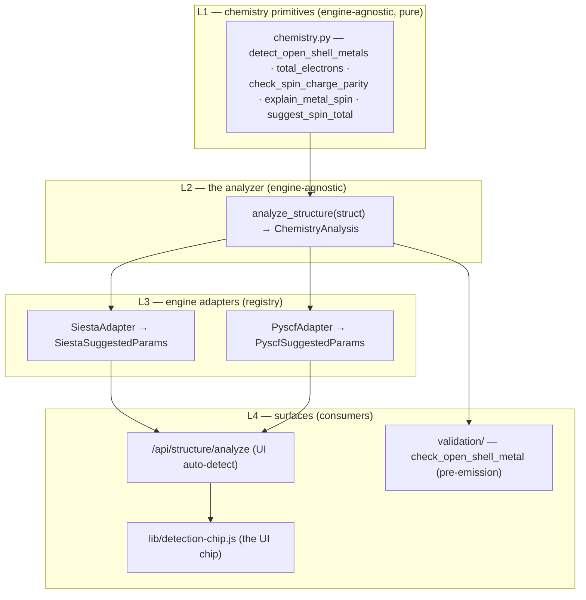

# Scientific validation — the runtime machinery

**Role:** contract
**Domain:** science
**Companions:** `overview.md` (the **what** — the correctness principles + the
advisory-while-editing / enforcing-at-generation rule); `chemistry-correctness.md`
(the chemistry facts the analyzer encodes); [`model/chemistry.md`](?doc=model/chemistry.md)
(the L1 chemistry primitives this composes); the engine emitters (the consumers).

This is **how** molbuilder realises scientific correctness at runtime: one
engine-agnostic chemistry **analyzer**, a per-engine **adapter registry**, and
the surfaces that read each conclusion. Every boundary passes a **frozen
dataclass** (never an untyped dict); JSON appears only at the HTTP wire, via
`dataclasses.asdict()`.

---

## 1. Layered overview



Three typed boundaries:

| Boundary | Owner | Input → output |
|---|---|---|
| `analyze_structure(struct)` | `chemistry.py:669` | `Structure` → `ChemistryAnalysis` |
| `Adapter.to_params(analysis)` | per-engine `auto_defaults.py` | `ChemistryAnalysis` → engine `*SuggestedParams` |
| `check_open_shell_metal(struct, …)` | `validation/chemistry.py:113` | `Structure` + engine params → `List[Issue]` |

---

## 2. The analyzer (L2)

`chemistry.analyze_structure(struct) → ChemistryAnalysis` (`chemistry.py:669`)
is the engine-agnostic middle layer — the single source of truth every
science-aware surface reads, so two surfaces cannot disagree about the
chemistry by construction.

```python
@dataclass(frozen=True)
class ChemistryAnalysis:           # chemistry.py:607
    n_atoms:             int
    elements:            List[str]              # unique, sorted
    n_electrons_neutral: int                    # Σ Z for the neutral system
    metals:              List[str]              # ["Fe"], or [] for organics
    metal_hints:         List[MetalHint]        # ranked spin choices per metal
    suggested_charge:    int
    suggested_spin:      int                    # 2S = n_unpaired
    suggested_treatment: Literal["closed", "open"]
    rationale:           str
    warnings:            List[str]
```

**Design rules.** Pure function (no I/O, no engine imports); engine-agnostic
vocabulary (`treatment ∈ {closed, open}`, not `UKS`/`SpinPolarized` — those live
in the adapters); **parity is enforced here, once** — if
`(n_electrons_neutral − suggested_charge)` parity doesn't match `suggested_spin`,
the analyzer bumps the spin and records it in `warnings`, so adapters never
re-do parity work.

### 2.1 The noble-metal distinction — three categories, not one flat set

The flat `OPEN_SHELL_METALS` set (kept only as a back-compat alias) wrongly
treated gold junctions as open-shell. The analyzer splits metals into three
physically-grounded sets (`chemistry.py:134-157`; the flat alias follows at
`:163`):

| Set | Elements | Physics | Treatment |
|---|---|---|---|
| `OPEN_D_TRANSITION_METALS` | Sc–Ni (3d), Y–Rh (4d, not Pd), Hf–Ir (5d, not Pt/Au), lanthanides, common actinides | incomplete d-shell; Stoner criterion / itinerant moments | **force open-shell** |
| `NOBLE_METALS_S1` | Cu, Ag, Au | atomic nd¹⁰(n+1)s¹, but in any extended metallic context (cluster ≥ 4, surface, junction, bulk) the s-band delocalises | **closed-shell singlet** for even electron count |
| `CLOSED_D10_METALS` | Zn, Cd, Hg, **Pd** (4d¹⁰5s⁰), **Pt** (5d⁹6s¹ atom; metallic Pt closed-shell in surface DFT) | filled/effectively-filled d | closed-shell |

**Decision tree** (`analyze_structure`):

| Condition | Treatment / spin |
|---|---|
| any `OPEN_D_TRANSITION_METALS` present | `open`, spin from the per-element default (open-d wins even with noble metals present) |
| noble metal only, **≥ 4 atoms** of it, even electron count | `closed`, spin 0 (the cluster-context override) |
| single noble-metal atom, odd electron count | `open`, spin 1 (respect the atomic ground state) |
| other noble cases (2–3-atom cluster) | electron-count parity (the ambiguous regime) |
| no transition metals | parity — closed singlet (even) / doublet (odd) |

The 4-atom cutoff (`_NOBLE_METAL_CLUSTER_THRESHOLD = 4`, `chemistry.py:666`) is
the conservative choice — overwhelmingly what published Au transport / surface
DFT does. When the noble closed-shell default is wrong (sub-4-atom Au cluster,
single adatom on an insulator, magnetic 3d co-adsorbate, explicit Kondo /
spin-orbit physics), the `rationale` string lists those override scenarios so
the user knows the boundary.

**References** (the noble-metal-is-closed-shell basis): Taylor, Brandbyge,
Stokbro, *PRB* **63**, 245407 (2001) — the original TranSIESTA Au-BDT-Au paper;
Ke, Baranger, Yang, *JCP* **122**, 074704 (2005) — Au-BDT-Au NEGF; Verzijl &
Thijssen, *JPCC* **116**, 24811 (2012) — DFT+Σ Au-alkanedithiol benchmark;
Marder, *Condensed Matter Physics* Ch. 17 — the Stoner-criterion derivation
(Cu/Ag/Au explicitly non-magnetic in bulk). Pinned by
`tests/test_chemistry_analyzer.py` (Au₄ / Au-BDT-Au / single Au / Au₂ / Cu₄ /
Pd₂ / Au+Fe), which also asserts the three sets are pairwise disjoint and Pd/Pt
are excluded from `OPEN_D_TRANSITION_METALS`.

---

## 3. The adapter layer (L3)

Adapters translate one `ChemistryAnalysis` into each engine's parameter
dataclass. The registry (`chemistry.py`):

```python
def register_adapter(name): ...          # :883 — decorator
def registered_adapters() -> dict: ...   # :906 — {name: AdapterClass}
```

Each engine ships an `auto_defaults.py` that defines a frozen `*SuggestedParams`
(field names matching the engine's web form) and an adapter that
`@register_adapter`s itself:

```python
# siesta/auto_defaults.py                # pyscf/auto_defaults.py
@register_adapter("siesta")              @register_adapter("pyscf")
class SiestaAdapter:                     class PyscfAdapter:
    → SiestaSuggestedParams(             → PyscfSuggestedParams(
        net_charge, spin_polarized,          charge, spin,
        spin_total, rationale)               method="UKS"|"RKS", rationale)
```

**Adapter rules:** a pure translator — **must not** re-do chemistry detection or
parity (if you're importing `chemistry.py` inside an adapter, the logic belongs
in the analyzer); returns a frozen dataclass, not a dict; `rationale` always
present (may append one engine-specific sentence). Spectra reuses `PyscfAdapter`
(it emits PySCF). Enforced by `test_chemistry_adapters.py::test_adapter_modules_do_not_import_analyzer`.

---

## 4. The consumers (L4)

**`/api/structure/analyze`** (`build.py:415`) — the UI auto-detect. Returns the
analysis plus `suggested.<engine> = asdict(adapter.to_params(analysis))` for
**every** registered adapter, so a new engine appears the moment its adapter
module is imported — endpoint code unchanged.

**`check_open_shell_metal(struct, *, is_closed_shell, engine_label)`**
(`validation/chemistry.py:113`) — the pre-emission validator. It calls the
**same** `analyze_structure` and gates on `analysis.suggested_treatment == "open"`
(not the flat `metals` list — that's what fired for Au-BDT-Au before the
category split), returning a `warn` `Issue` carrying the analyzer's rationale
when the user requests a closed-shell SCF against an open-shell recommendation.

Four engine surfaces route through this reverse check — SIESTA + PySCF Build
preflight (`validation/siesta.py:362`, `validation/pyscf.py:132`), Spectra
preflight (`spectra/pyscf_engine.py:319`), and Transport preflight
(`transport/transiesta.py:911`). The UI chip (`lib/detection-chip.js`) reads the
**forward** side instead — `suggested_treatment` straight off the
`/api/structure/analyze` response — not this validator. **The invariant**
(`web-ui-coherence.md` Rule 1): chip and validator both derive from the one
`analyze_structure` result, so they cannot disagree — the remedy for two-surface
drift (the "closed-shell singlet" chip vs a "switch to open-shell" warning two
panels down) is to delete the parallel path, not patch it. So the analyzer runs
in two directions over the one analysis: **forward** (auto-detect pre-fills the
form) and **reverse** (Generate-time check).

---

## 5. Pattern-B — regions the engine doesn't consume

When `struct.regions` is populated but the engine doesn't consume region labels,
it must surface an `info` `Issue` so the user knows the labels were noticed but
unused. One shared helper — `regions_pattern_b_notice(struct, engine_label)`
(`_shared.py:1377`) — is called from `/api/build/fdf` and `/api/build/pyscf`
(`build.py:896`, `:968`), so the notice text is identical whichever engine fires
it. **Transport is deliberately not a caller** (`transport.py:132`): it *is* the
region consumer — the labels drive the whole device/electrode split, so the
Pattern-B "noticed-but-unused" path doesn't apply. Pinned by
`test_web.py::test_{fdf,pyscf}_surfaces_info_when_structure_carries_regions`.

---

## 6. Adding a new engine

1. Create `<engine>/auto_defaults.py`: a frozen `<Engine>SuggestedParams` +
   an adapter class `@register_adapter("<engine>")` with `to_params(cls, analysis)`.
2. Import the module in `web/blueprints/__init__.py` so it registers at startup.
3. (Optional) route the engine's validator through `check_open_shell_metal`.
4. Add adapter tests (the cross-engine consistency invariant runs over the
   registry).

No endpoint change; the new engine surfaces in `suggested.<engine>` automatically.

---

## 7. Where the validators live

`molbuilder/validation/` is a package split **by concern** so any caller imports
directly from the relevant submodule:

```
validation/
├── __init__.py     # public API: validate, report, the engine registry + re-exports
├── geometry.py     # validate_geometry + geometry checks
├── metadata.py     # dataclass-field-driven config validation
├── chemistry.py    # check_open_shell_metal, metal-basis adequacy, peptide protonation
├── sidecar.py      # frozen-atoms-consumed check
├── siesta.py       # SIESTA preflight aggregator + pseudo/mesh/Makov-Payne/spin checks
└── pyscf.py        # PySCF preflight aggregator
```

Two rules make this safe to extend: **the call order inside `_validate_siesta` /
`_validate_pyscf` is the per-engine public contract** — load-bearing, since
tests count issues by position — and a helper **loses its `_` prefix when it
gains a cross-module caller** (e.g. `check_open_shell_metal` is public; the
others stay private until a PR forces the promotion, no back-compat shim). The
engine registry (`_ENGINE_VALIDATORS`, populated at import) holds all four
configs (SIESTA / PySCF / spectra / transport), so `validate(struct, cfg)` is the
one per-engine gate. Tests mirror the layout under `tests/validation/`.

---

## 8. What the analyzer does NOT cover

Its scope is the chemistry-driven **`(charge, spin, treatment)` triplet + the
open-shell-metal hints** — the place silent chemistry errors hide. Out of scope
(and why): basis set + XC functional (user preference / budget), k-points / mesh
cutoff (geometry, not chemistry), pseudopotential family (covered by the
`pseudopotentials.md` validator pass), convergence thresholds and optimisation /
spectral-workflow choices. Growing it to cover everything would re-fragment the
cross-engine consistency claim.

---

## 9. Test invariants

- **Cross-engine agreement** — all registered adapters reach the same
  `treatment`-equivalent decision for a given structure (`test_chemistry_adapters.py`).
- **Validator ↔ analyzer** — `check_open_shell_metal` reads its conclusion from
  `analyze_structure` (proved by monkeypatching the analyzer) and echoes its
  rationale.
- **Endpoint shape** — `/api/structure/analyze` carries every documented key and
  each `suggested.<engine>` matches its dataclass fields.
- **New-engine on-ramp** — a freshly-registered synthetic adapter appears in the
  endpoint response (catches a hardcoded engine list).
- **Adapter purity** — an AST check that no adapter imports the analyzer/primitives.

---

> **Note — the GPU eigensolver is not here.** The ELPA-CUDA / NVIDIA-MPS
> eigensolver machinery (the `molbuilder-siesta-gpu` env, the numerical-
> equivalence claim, the MPS rank policy, the `envs validate` probes) is a
> SIESTA-GPU engine/ops concern, documented in `engines/siesta-gpu.md` (engines
> wave). It rode in the legacy `scientific-validation.md` but is not chemistry
> validation.
